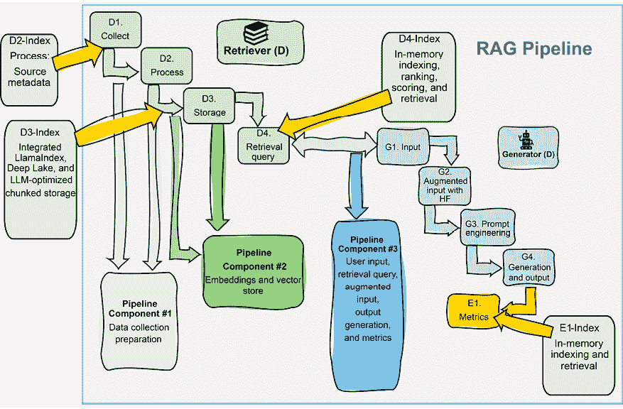
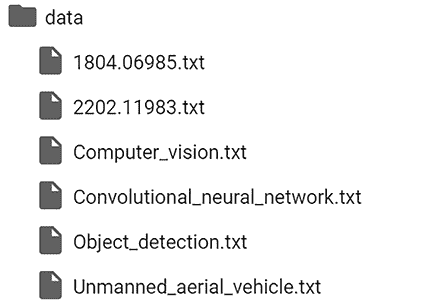
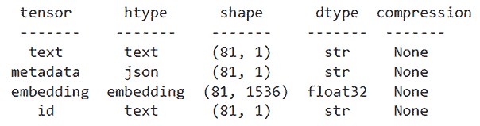
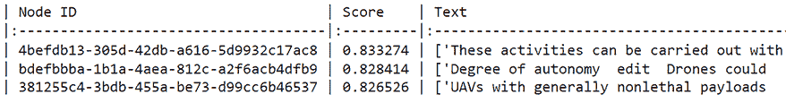
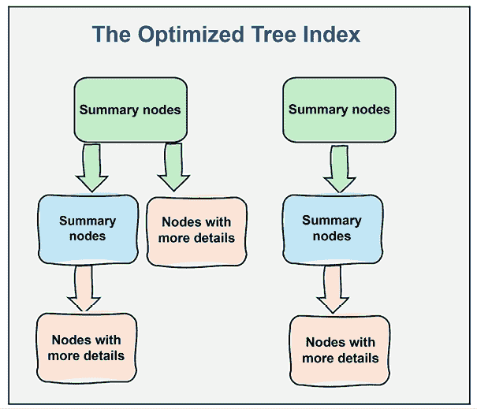
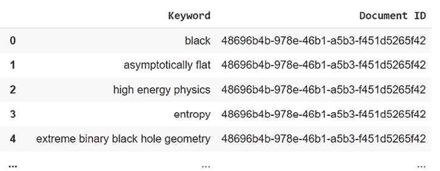

# 第三章：使用 LlamaIndex、Deep Lake 和 OpenAI 构建基于索引的 RAG

索引提高了精确度和速度性能，但它们提供的不仅仅是这些。索引通过增加一层透明度，将检索增强型生成式 AI 进行了转变。有了索引，RAG 模型生成的响应的来源可以完全追踪，可以查看数据使用的精确位置和详细内容。这种改进不仅减轻了诸如偏差和幻觉等问题，还解决了关于版权和数据完整性的担忧。

在本章中，我们将探讨索引数据如何使我们对生成式 AI 应用有更大的控制权。如果输出结果不满意，不再是一个谜团，因为索引使我们能够识别和检查问题的确切数据来源。这种能力使得我们可以细化数据输入，调整系统配置，或更换组件，例如向量存储软件和生成模型，以实现更好的结果。

我们将首先介绍一个基于索引的 RAG 管道架构，这将提高速度、精确度和可追踪性。我们将展示如何无缝集成 LlamaIndex、Deep Lake 和 OpenAI，而无需自己创建所有必要的函数。这为我们提供了一个坚实的基础来开始构建。然后，我们将介绍我们程序中将使用的主要索引类型，例如向量、树、列表和关键词索引。然后，我们将构建一个用户可以与之交互的特定领域无人机技术 LLM RAG 代理。无人机技术正在扩展到所有领域，如火灾检测、交通信息和体育赛事；因此，我决定在我们的示例中使用它。本章的目标是准备一个 LLM 无人机技术数据集，我们将在下一章中用多模态数据增强它。我们还将用代码展示关键索引类型。

到本章结束时，你将熟练地通过向量存储、数据集和 LLM 操作基于索引的 RAG，并了解如何优化检索系统并确保完全可追踪。你将发现我们的集成工具包——结合 LlamaIndex、Deep Lake 和 OpenAI——不仅简化了技术复杂性，而且释放了你的时间来开发和磨练你的分析技能，使你能够更深入地理解由 RAG 驱动的生成式 AI。

我们在本章中将要涵盖以下主题：

+   使用 LlamaIndex 框架和索引方法构建语义搜索引擎

+   填充 Deep Lake 向量存储

+   LlamaIndex、Deep Lake 和 OpenAI 的集成

+   分数排名和余弦相似度指标

+   元数据增强以提高可追踪性

+   查询设置和生成配置

+   自动化文档排名介绍

+   向量、树、列表和关键词索引类型

# 为什么使用基于索引的 RAG？

基于索引的搜索将先进的 RAG 驱动的生成式 AI 提升到了另一个层次。在面对大量数据时，它提高了检索速度，将我们从原始数据块转变为有组织、可索引的节点，我们可以从输出追溯到文档的来源及其位置。

让我们通过分析基于索引的 RAG 的架构来了解基于向量的相似性搜索和基于索引的搜索之间的区别。

## 架构

在 RAG 中，基于索引的搜索比基于向量的搜索更快，因为它直接使用索引访问相关数据，而基于向量的搜索则是按顺序比较所有记录中的嵌入。我们在*第二章*中实现了基于向量的相似性搜索程序，即*使用 Deep Lake 和 OpenAI 的 RAG 嵌入向量存储*，如图*3.1*所示：

+   在*管道#1：数据收集和准备*中，我们收集并准备了数据。

+   在*管道#2：嵌入和向量存储*中，我们将数据嵌入并存储了准备好的数据。

+   然后，我们使用*管道#3*运行检索查询和生成式 AI，以处理用户输入，基于向量相似性搜索进行检索，增强输入，生成响应，并应用性能指标。

这种方法很灵活，因为它提供了多种方式来实现每个组件，具体取决于你项目的需求。



图 3.1：RAG 驱动的生成式 AI 管道，如第二章所述，增加了额外的功能

然而，实施基于索引的搜索将引领我们进入 AI 的未来，这将更加快速、精确且可追溯。我们将遵循与*第二章*相同的流程，使用三个管道，以确保你准备好在一个任务专业化的团队中工作。由于我们使用与*第二章*相同的管道，因此让我们将那一章的功能添加到它们中，如图*3.1*所示：

+   **管道组件#1 和 D2-索引**：我们将收集数据并对其进行预处理。然而，这次，我们将一次准备一个数据源并将其存储在单独的文件中。然后，我们将它们的名称和位置添加到我们加载到向量存储中的元数据中。元数据将帮助我们追踪一个响应，直到它所处理的精确文件。我们将从响应直接链接到基于的数据。

+   **管道组件 #2 和 D3-索引**：我们将通过安装和使用创新的集成 `llama-index-vector-stores-deeplake` 包来将数据加载到向量存储中，该包包含我们在优化启动场景中所需的一切：分块、嵌入、存储，甚至 LLM 集成。我们拥有所有需要的工具，只需几行代码就可以开始基于索引的 RAG 工作！这样，一旦我们有一个稳固的程序，我们就可以像在*第二章*中那样，根据需要自定义和扩展管道。

+   **管道组件 #3 和 D4-索引**：我们将通过安装和使用创新的集成 `llama-index-vector-stores-deeplake` 包来将数据加载到数据集中，该包包含我们启动基于索引的检索和生成所需的一切，包括自动排名和评分。整个过程无缝且极具生产力。我们将利用 LlamaIndex 和 Deep Lake 来简化信息检索和处理。一个集成的检索器将有效地从 Deep Lake 存储库中检索相关数据，而一个 LLM 代理将随后智能地综合和交互检索到的信息以生成有意义的见解或行动。索引是为快速检索而设计的，我们将实现几种索引方法。

+   **管道组件 #3 和 E1-索引**：我们将添加时间和分数指标来评估输出。

在上一章中，我们实现了基于向量的相似性搜索和检索。我们将文档嵌入以将数据转换为高维向量。然后，我们通过计算向量之间的距离来进行检索。在本章中，我们将更进一步，创建一个向量存储。然而，我们将数据加载到将使用检索索引类型重新组织的数据集中。*表 3.1* 展示了基于向量和基于索引的搜索和检索方法之间的差异：

| **特性** | **基于向量的相似性搜索和检索** | **基于索引的向量、树、列表和关键词搜索和检索** |
| --- | --- | --- |
| 灵活性 | 高 | 中等（预计算结构） |
| 速度 | 在大型数据集中较慢 | 快速且针对快速检索进行了优化 |
| 可扩展性 | 受实时处理限制 | 与大型数据集高度可扩展 |
| 复杂度 | 简单设置 | 更复杂且需要索引步骤 |
| 更新频率 | 更容易更新 | 更新需要重新索引 |

表 3.1：基于向量和基于索引的特性

现在，我们将使用 Deep Lake、LlamaIndex 和 OpenAI 构建一个基于语义索引的 RAG 程序。

# 为无人机技术构建语义搜索引擎和生成代理

在本节中，我们将使用 Deep Lake 向量存储、LlamaIndex 和 OpenAI 构建一个基于语义索引的搜索引擎和生成式 AI 代理引擎。如前所述，无人机技术在火灾检测和交通控制等领域正在扩展。因此，程序的目标是提供一个基于索引的 RAG 代理，用于无人机技术的问答。程序将演示无人机如何使用计算机视觉技术识别车辆和其他物体。我们将实现本章“架构”部分中描述的 *图 3.1* 所示的架构。

从本章的 GitHub 仓库中打开 `2-Deep_Lake_LlamaIndex_OpenAI_indexing.ipynb`。本节标题与笔记本中的章节标题相同，因此你可以将解释与代码匹配。

我们首先开始安装环境。然后，我们将构建程序的主要三个管道：

+   **管道 1**：收集和准备文档。使用 GitHub 和维基百科等来源收集和清理用于索引的文档。

+   **管道 2**：创建和填充 Deep Lake 向量存储。使用准备好的文档创建和填充一个 Deep Lake 向量存储。

+   **管道 3**：基于索引的 RAG 用于查询处理和生成。使用 LLMs 和余弦相似度指标进行时间和分数性能评估。

当可能时，将你的项目分解成独立的管道，以便团队可以独立并行地进展。本章中的管道是这种做法的一个例子，但还有许多其他方法可以做到这一点，具体取决于你的项目。现在，我们将从安装环境开始。

## 安装环境

环境与上一章基本相同。让我们关注集成 LlamaIndex、Deep Lake 的向量存储能力和 OpenAI 模块的包。这种集成是向无缝跨平台实现迈出的一个重要步骤：

```py
!pip install llama-index-vector-stores-deeplake==0.1.6 
```

程序需要额外的 Deep Lake 功能：

```py
!pip install deeplake==3.9.8 
```

程序还需要 LlamaIndex 的功能：

```py
!pip install llama-index==0.10.64 
```

现在我们检查是否可以从 `llama-index` 正确导入包，包括 Deep Lake 的向量存储：

```py
from llama_index.core import VectorStoreIndex, SimpleDirectoryReader, Document
from llama_index.vector_stores.deeplake import DeepLakeVectorStore 
```

这样，我们就安装了环境。接下来，我们将收集和准备文档。

## **管道 1**：收集和准备文档

在本节中，我们将收集和准备与无人机相关的文档，并包含必要的元数据以追踪文档的来源。目标是追踪响应内容的来源，将其追溯到检索到的确切数据块。首先，我们将创建一个数据目录，用于加载文档：

```py
!mkdir data 
```

现在，我们将使用一个异构语料库来处理无人机技术数据，我们将使用 `BeautifulSoup` 进行处理：

```py
import requests
from bs4 import BeautifulSoup
import re
import os
urls = [
    "https://github.com/VisDrone/VisDrone-Dataset",
    "https://paperswithcode.com/dataset/visdrone",
    "https://openaccess.thecvf.com/content_ECCVW_2018/papers/11133/Zhu_VisDrone-DET2018_The_Vision_Meets_Drone_Object_Detection_in_Image_Challenge_ECCVW_2018_paper.pdf",
    "https://github.com/VisDrone/VisDrone2018-MOT-toolkit",
    "https://en.wikipedia.org/wiki/Object_detection",
    "https://en.wikipedia.org/wiki/Computer_vision",…
] 
```

语料库包含与无人机、计算机视觉和相关技术相关的网站列表。然而，列表中也包含了一些噪声链接，如 [`keras.io/`](https://keras.io/) 和 [`pytorch.org/`](https://pytorch.org/)，它们并不包含我们正在寻找的特定信息。

在现实生活中的项目中，我们并不总是有在完美、相关、结构化和良好格式的数据上工作的奢侈。我们的 RAG 管道必须足够健壮，能够在嘈杂的环境中检索相关数据。

在这种情况下，我们正在处理与无人机技术相关的各种格式和不同质量的无结构数据。当然，在封闭环境中，我们可以与生产文档的个人或组织合作，但我们必须准备好在快速发展的数字世界中应对任何类型的文档。

代码将像在第二章中那样检索和清理数据：

```py
def clean_text(content):
    # Remove references and unwanted characters
    content = re.sub(r'\[\d+\]', '', content)   # Remove references
    content = re.sub(r'[^\w\s\.]', '', content)  # Remove punctuation (except periods)
    return content
def fetch_and_clean(url):
    try:
        response = requests.get(url)
        response.raise_for_status()  # Raise exception for bad responses (e.g., 404)
        soup = BeautifulSoup(response.content, 'html.parser')
        # Prioritize "mw-parser-output" but fall back to "content" class if not found
        content = soup.find('div', {'class': 'mw-parser-output'}) or soup.find('div', {'id': 'content'})
        if content is None:
            return None
        # Remove specific sections, including nested ones
        for section_title in ['References', 'Bibliography', 'External links', 'See also', 'Notes']:
            section = content.find('span', id=section_title)
            while section:
                for sib in section.parent.find_next_siblings():
                    sib.decompose()
                section.parent.decompose()
                section = content.find('span', id=section_title)
        # Extract and clean text
        text = content.get_text(separator=' ', strip=True)
        text = clean_text(text)
        return text
    except requests.exceptions.RequestException as e:
        print(f"Error fetching content from {url}: {e}")
        return None  # Return None on error 
```

每个项目都需要特定的原始数据名称和路径。在这种情况下，我们将引入一个额外的函数来保存每段文本，并使用其数据源的名称，通过创建基于其 URL 的关键词：

```py
# Directory to store the output files
output_dir = './data/'
os.makedirs(output_dir, exist_ok=True)
# Processing each URL and writing its content to a separate file
for url in urls:
    article_name = url.split('/')[-1].replace('.html',")  # Handle .html extension
    filename = os.path.join(output_dir, article_name + '.txt')  # Create a filename for the article
    clean_article_text = fetch_and_clean(url)
    with open(filename, 'w', encoding='utf-8') as file:
        file.write(clean_article_text)
print(f"Content(ones that were possible) written to files in the '{output_dir}' directory.") 
```

输出显示目标已达成，尽管一些文档无法解码：

```py
WARNING:bs4.dammit:Some characters could not be decoded, and were replaced with REPLACEMENT CHARACTER.
Content(ones that were possible) written to files in the './data/' directory. 
```

根据项目的目标，你可以选择调查并确保所有文档都已检索，或者估计你已有足够的数据用于用户查询。

如果我们检查 `./data/`，我们会发现每篇文章现在都在一个单独的文件中，如目录内容所示：



图 3.2：准备文档列表

程序现在从 `./data/` 加载文档：

```py
# load documents
documents = SimpleDirectoryReader("./data/").load_data() 
```

LlamaIndex 的 `SimpleDirectoryReader` 类旨在用于处理无结构数据。它递归地扫描目录，并识别和加载所有支持的文件类型，如 `.txt`、`.pdf` 和 `.docx`。然后它从每个文件中提取内容，并返回一个包含其文本和元数据的文档对象列表，例如文件名和文件路径。让我们显示这个文档字典列表的第一个条目：

```py
documents[0] 
```

输出显示目录读取器已提供关于其数据来源的完全透明信息，包括文档名称，例如本例中的 `1804.06985.txt`：

```py
'/content/data/1804.06985.txt', 'file_name': '1804.06985.txt', 'file_type': 'text/plain', 'file_size': 3698, 'creation_date': '2024-05-27', 'last_modified_date': '2024-05-27'}, excluded_embed_metadata_keys=['file_name', 'file_type', 'file_size', 'creation_date', 'last_modified_date', 'last_accessed_date'], excluded_llm_metadata_keys=['file_name', 'file_type', 'file_size', 'creation_date', 'last_modified_date', 'last_accessed_date'], relationships={}, text='High Energy Physics  Theory arXiv1804.06985 hepth Submitted on 19 Apr 2018 Title A Near Horizon Extreme Binary Black Hole Geometry Authors Jacob Ciafre  Maria J. Rodriguez View a PDF of the paper titled A Near Horizon Extreme Binary Black Hole Geometry by Jacob Ciafre and Maria J. Rodriguez View PDF Abstract A new solution of fourdimensional vacuum General Relativity is presented… 
```

本文档的内容包含了一些看似与我们要找的无人机技术信息无关的噪声。但这正是本程序的目的，旨在完成以下任务：

+   从我们能得到的所有原始、无结构、松散相关的无人机数据开始

+   模拟现实生活中的项目通常是如何开始的

+   评估基于索引的 RAG 生成式 AI 程序在具有挑战性的环境中的表现如何

让我们现在以完全透明的方式创建并填充一个 Deep Lake 向量存储库。

## 管道 2：创建和填充 Deep Lake 向量存储库

在本节中，我们将创建一个 Deep Lake 向量存储库，并用我们文档中的数据填充它。我们将实现一个标准的张量配置，使用：

+   `text (str)`: 文本是文档字典中列出的文本文件的其中一个的内容。它将是无缝的，并且分块将被优化，将文本分割成有意义的块。

+   `metadata(json)`: 在这种情况下，元数据将包含每个文本数据块的文件名来源，以实现完全透明和控制。我们将看到如何在代码中访问这些信息。

+   `embedding (float32)`: 嵌入是无缝的，使用 OpenAI 的嵌入模型，该模型直接由`LlamaIndex-Deep Lake-OpenAI`包调用。

+   `id (str, auto-populated)`: 每个数据块都会自动分配一个唯一的 ID。向量存储库也将包含一个索引，它是一个从 `0` 到 `n` 的数字，但它不能用于语义上，因为每次我们修改数据集时它都会改变。然而，唯一的 ID 字段将保持不变，直到我们决定使用基于索引的搜索策略来优化它，正如我们将在接下来的 *Pipeline 3: 基于索引的 RAG* 部分中看到的。

程序首先定义我们的向量存储库和数据集路径：

```py
from llama_index.core import StorageContext
vector_store_path = "hub://denis76/drone_v2"
dataset_path = "hub://denis76/drone_v2" 
```

将向量存储库和数据集路径替换为您的账户名称和您希望使用的数据集名称：

```py
vector_store_path = "hub://[YOUR VECTOR STORE/ 
```

然后，我们创建一个向量存储库，填充它，并在文档上创建一个索引：

```py
# overwrite=True will overwrite dataset, False will append it
vector_store = DeepLakeVectorStore(dataset_path=dataset_path, overwrite=True)
storage_context = StorageContext.from_defaults(vector_store=vector_store)
# Create an index over the documents
index = VectorStoreIndex.from_documents(documents, storage_context=storage_context)
) 
```

注意，`overwrite` 设置为 `True` 以创建向量存储库并覆盖任何现有的一个。如果 `overwrite=False`，数据集将被追加。

创建的索引将由索引方法重新组织，当需要时将重新排列和创建新的索引。然而，响应将始终提供数据的原始来源。输出确认数据集已创建并且数据已上传：

```py
Your Deep Lake dataset has been successfully created!
Uploading data to deeplake dataset.
100%|██████████| 41/41 [00:02<00:00, 18.15it/s] 
```

输出还显示了数据集一旦填充后的结构：

```py
Dataset(path='hub://denis76/drone_v2', tensors=['text', 'metadata', 'embedding', 'id']) 
```

数据以张量的形式存储，包括其类型和形状：



图 3.3：数据集结构

我们现在将在内存中加载我们的数据集：

```py
import deeplake
ds = deeplake.load(dataset_path)  # Load the dataset 
```

我们可以通过点击输出中提供的链接在线可视化数据集：

```py
/
This dataset can be visualized in Jupyter Notebook by ds.visualize() or at https://app.activeloop.ai/denis76/drone_v2
hub://denis76/drone_v2 loaded successfully.
This dataset can be visualized in Jupyter Notebook by ds.visualize() or at https://app.activeloop.ai/denis76/drone_v1
hub://denis76/drone_v2 loaded successfully. 
```

我们还可以决定添加代码来显示数据集。我们首先通过将数据加载到 pandas DataFrame 中开始：

```py
import json
import pandas as pd
import numpy as np
# Assuming 'ds' is your loaded Deep Lake dataset
# Create a dictionary to hold the data
data = {}
# Iterate through the tensors in the dataset
for tensor_name in ds.tensors:
    tensor_data = ds[tensor_name].numpy()
    # Check if the tensor is multi-dimensional
    if tensor_data.ndim > 1:
        # Flatten multi-dimensional tensors
        data[tensor_name] = [np.array(e).flatten().tolist() for e in tensor_data]
    else:
        # Convert 1D tensors directly to lists and decode text
        if tensor_name == "text":
            data[tensor_name] = [t.tobytes().decode('utf-8') if t else "" for t in tensor_data]
        else:
            data[tensor_name] = tensor_data.tolist()
# Create a Pandas DataFrame from the dictionary
df = pd.DataFrame(data) 
```

然后，我们创建一个函数来显示一条记录：

```py
# Function to display a selected record
def display_record(record_number):
    record = df.iloc[record_number]
    display_data = {
        "ID": record["id"] if "id" in record else "N/A",
        "Metadata": record["metadata"] if "metadata" in record else "N/A",
        "Text": record["text"] if "text" in record else "N/A",
        "Embedding": record["embedding"] if "embedding" in record else "N/A"
    } 
```

最后，我们可以选择一个记录并显示每个字段：

```py
# Function call to display a record
rec = 0  # Replace with the desired record number
display_record(rec) 
```

`id` 是一个唯一的字符串代码：

```py
ID:
['a89cdb8c-3a85-42ff-9d5f-98f93f414df6'] 
```

`metadata` 字段包含我们需要追踪内容回原始文件和文件路径的信息，以及我们需要了解此记录的所有信息，从来源到嵌入向量。它还包含从记录数据创建的节点的信息，然后可以用于我们在 *Pipeline 3* 中运行的索引引擎：

+   `file_path`: 数据集中文件的路径（`` `/content/data/1804.06985.txt` ``）。

+   `file_name`: 文件名（`` `1804.06985.txt` ``）。

+   `file_type`: 文件类型（`` `text/plain` ``）。

+   `file_size`: 文件的大小（以字节为单位，`` `3700` ``）。

+   `creation_date`: 文件创建的日期（`` `2024-08-09` ``）。

+   `last_modified_date`: 文件最后修改的日期（`` `2024-08-09` ``）。

+   `_node_content`: 节点的详细内容，包括以下主要项目：

    +   `id_`: 节点的唯一标识符（`` `a89cdb8c-3a85-42ff-9d5f-98f93f414df6 ` ``）。

    +   `embedding`: 与文本相关的嵌入（`null`）。

    +   `metadata`: 关于文件的重复元数据。

    +   `excluded_embed_metadata_keys`: 从嵌入元数据中排除的键（对于嵌入不是必需的）。

    +   `excluded_llm_metadata_keys`: 从 LLM 元数据中排除的键（对于 LLM 不是必需的）。

    +   `relationships`: 关于与其他节点关系的详细信息。

    +   `text`: 文档的实际文本内容。它可以是指定的文本、摘要、总结或其他优化搜索功能的方法。

    +   `start_char_idx`: 文本的起始字符索引。

    +   `end_char_idx`: 文本的结束字符索引。

    +   `text_template`: 带有元数据的文本显示模板。

    +   `metadata_template`: 显示元数据的模板。

    +   `metadata_seperator`: 元数据显示中使用的分隔符。

    +   `class_name`: 节点的类型（例如，`` `TextNode` ``）。

+   `_node_type`: 节点的类型（`` `TextNode` ``）。

+   `document_id`: 文档的标识符（`` `61e7201d-0359-42b4-9a5f-32c4d67f345e` ``）。

+   `doc_id`: 文档 ID，与 `document_id` 相同。

+   `ref_doc_id`: 参考文档 ID，与 `document_id` 相同。

`text` 字段包含此数据块的字段，而不是整个原始文本：

```py
['High Energy Physics  Theory arXiv1804.06985 hepth Submitted on 19 Apr 2018 Title A Near Horizon Extreme Binary Black Hole Geometry Authors Jacob Ciafre  Maria J. Rodriguez View a PDF of the paper titled A Near Horizon Extreme Binary… 
```

`Embedding` 字段包含文本内容的嵌入向量：

```py
[-0.0009671939187683165, 0.010151553899049759, -0.010979819111526012, -0.003061748342588544, -0.00865076668560505, 0.02144993655383587, -0.01412297785282135, -0.02674516849219799, -0.008693241514265537, -0.03383851423859596, 0.011404570192098618, 0.015956487506628036, -0.013691147789359093, 0.008856062777340412,…] 
```

RAG 数据集的结构和格式因领域或项目而异。然而，以下四个数据集的列提供了关于 AI 进化的宝贵信息：

+   `id`: `id` 是我们将用于组织数据集中 `text` 列的文本块索引。这些块将被转换为可以包含原始文本、原始文本的摘要以及附加信息（例如，存储在元数据列中的用于输出的数据源）的 *节点*。我们在笔记本的 **Pipeline 2** 中创建了这个索引，当我们创建向量存储时。然而，我们可以在不包含索引的现有数据库中在内存中生成索引，正如我们将在 *第四章*，*多模态模块化 RAG 用于无人机技术* 中看到的。

+   `metadata`: 在 **Pipeline 1** 中自动生成的元数据，当 Deep Lake 的 `SimpleDirectoryReader` 将源文档加载到文档对象中，以及创建向量存储时。在 *第二章*，*使用 Deep Lake 和 OpenAI 的 RAG 嵌入向量存储* 中，我们只有一个数据源文件。在这一章中，我们将每个数据源（URL）存储在一个文件中。

+   `文本`：Deep Lake 的向量存储创建功能在**管道 2**中处理的文本，自动分块了数据，我们无需像在第二章的*检索一批准备好的文档*部分中那样配置块的大小。再次强调，这个过程是无缝的。我们将在本章的*管道 3：基于索引的 RAG*的*优化分块*部分中看到如何智能地进行分块。

+   `嵌入`：每个数据块嵌入的生成是通过我们无需配置的嵌入模型完成的。我们可以选择一个嵌入模型，就像我们在第二章的*数据嵌入和存储*部分中做的那样，*使用 Deep Lake 和 OpenAI 的 RAG 嵌入向量存储*。我们选择了一个嵌入模型并编写了一个函数。在这个程序中，Deep Lake 选择嵌入模型并嵌入数据，我们无需编写任何代码。

我们可以看到，嵌入、分块、索引和其他数据处理函数现在都被封装在平台和框架中，例如 Activeloop Deep Lake、LlamaIndex、OpenAI、LangChain、Hugging Face、Chroma 等。随着时间推移，生成式 AI 模型和 RAG 的初始兴奋感将逐渐消退，它们将变成 AI 管道中工业化的、封装的、常见的组件。AI 在不断发展，可能有助于提供一个基于有效实践的默认配置的平台。然后，一旦我们实现了基本配置，我们就可以根据我们的项目需求进行定制和扩展管道。

我们现在已准备好运行基于索引的 RAG。

## 管道 3：基于索引的 RAG

在本节中，我们将使用`LlamaIndex`实现一个基于索引的 RAG 管道，它使用我们用 Deep Lake 准备和处理的已有数据。我们将从包含噪声的异构（无人机相关）文档集中检索相关信息，并通过 OpenAI 的 LLM 模型合成响应。我们将实现四个索引引擎：

+   **向量存储索引引擎**：从文档中创建向量存储索引，实现基于相似性的高效搜索。

+   **树索引**：从文档中构建一个分层树索引，提供一种替代的检索结构。

+   **列表索引**：从文档中构建一个简单的列表索引。

+   **关键词表索引**：根据从文档中提取的关键词创建索引。

我们将使用 LLM 实现查询：

+   **查询响应和来源**：使用用户输入查询索引，检索相关文档，并返回合成的响应以及来源信息。

我们将使用带有 LLM 分数和余弦相似度的*时间加权平均指标*来衡量响应，该指标基于检索和相似度分数计算时间加权平均。由于实现了随机算法，内容和执行时间可能因运行而异。

### 用户输入和查询参数

用户输入将是我们将运行的四个索引引擎的参考问题。我们将根据索引引擎的检索结果评估每个响应，并使用时间和分数比率来衡量输出。输入将被提交给我们将构建的四个索引和查询引擎。

用户输入是：

```py
user_input="How do drones identify vehicles?" 
```

实现一个 LLM（在这种情况下，是一个 OpenAI 模型）的四个查询引擎将无缝地使用相同的参数调用。我们将设置以下三个参数：

```py
#similarity_top_k
k=3
#temperature
temp=0.1
#num_output
mt=1024 
```

这些关键参数是：

+   `k=3`：查询引擎将需要通过设置 top-k（最可能的选择）为 3 来找到最可能的三个响应。在这种情况下，k 将作为排名函数，迫使 LLM 选择最相关的文档。

+   `temp=0.1`：低温度如 `0.1` 将鼓励 LLM 产生精确的结果。例如，如果温度增加到 `0.9`，则响应将更加富有创意。然而，在这种情况下，我们正在探索无人机技术，这需要精确度。

+   `mt=1024`：此参数将限制输出中令牌的数量为 `1,024`。

用户输入和参数将被应用于四个查询引擎。现在让我们构建余弦相似度指标。

### 余弦相似度指标

余弦相似度指标在 *第二章* 的 *使用余弦相似度评估输出* 部分进行了描述。如果需要，请花时间再次阅读该部分。在这里，我们将创建一个用于响应的函数：

```py
from sklearn.feature_extraction.text import TfidfVectorizer
from sklearn.metrics.pairwise import cosine_similarity
from sentence_transformers import SentenceTransformer
model = SentenceTransformer('all-MiniLM-L6-v2')
def calculate_cosine_similarity_with_embeddings(text1, text2):
    embeddings1 = model.encode(text1)
    embeddings2 = model.encode(text2)
    similarity = cosine_similarity([embeddings1], [embeddings2])
    return similarity[0][0] 
```

该函数使用 `sklearn` 和 Hugging Face 的 `SentenceTransformer`。程序首先创建向量存储引擎。

# 向量存储索引查询引擎

`VectorStoreIndex` 是 LlamaIndex 中的一种索引类型，它通过向量嵌入来表示和检索文档中的信息。与上一章中探讨的类似意义的文档将具有在向量空间中更接近的嵌入，然而这次，`VectorStoreIndex` 并不会自动使用现有的 Deep Lake 向量存储。它可以创建一个新的内存向量索引，重新嵌入文档，并创建一个新的索引结构。我们将在 *第四章*，*多模态模块化 RAG 用于无人机技术* 中进一步探讨这种方法，当我们实现一个不包含索引或嵌入的数据集时。

在决定哪种索引方法适合您的项目时没有一劳永逸的方法！最佳选择方法是测试本章中介绍的向量、树、列表和关键词索引。

我们首先创建向量存储索引：

```py
from llama_index.core import VectorStoreIndex
vector_store_index = VectorStoreIndex.from_documents(documents) 
```

然后我们显示我们创建的向量存储索引：

```py
print(type(vector_store_index)) 
```

我们将收到以下输出，这确认了引擎已被创建：

```py
<class 'llama_index.core.indices.vector_store.base.VectorStoreIndex'> 
```

我们现在需要一个查询引擎来检索和综合使用 LLM（在我们的例子中是 OpenAI 模型，通过 `!pip install llama-index-vector-stores-deeplake==0.1.2` 安装）检索到的文档：

```py
vector_query_engine = vector_store_index.as_query_engine(similarity_top_k=k, temperature=temp, num_output=mt) 
```

我们在*用户输入和查询参数*子节中定义了查询引擎的参数。我们现在可以查询数据集并生成响应。

## 查询响应和来源

让我们定义一个函数来管理查询并返回响应内容的信息：

```py
import pandas as pd
import textwrap
def index_query(input_query):
    response = vector_query_engine.query(input_query)
    # Optional: Print a formatted view of the response (remove if you don't need it in the output)
    print(textwrap.fill(str(response), 100))
    node_data = []
    for node_with_score in response.source_nodes:
        node = node_with_score.node
        node_info = {
            'Node ID': node.id_,
            'Score': node_with_score.score,
            'Text': node.text
        }
        node_data.append(node_info)
    df = pd.DataFrame(node_data)
    # Instead of printing, return the DataFrame and the response object
    return df, response, 
```

`index_query(input_query)` 使用向量查询引擎执行查询，并将结果处理成结构化格式。该函数接受一个输入查询，并使用 pandas DataFrame 中的查询引擎检索相关信息：`节点 ID`、`得分`、`文件路径`、`文件名`和`文本`。

代码现在将调用查询：

```py
import time
#start the timer
start_time = time.time()
df, response = index_query(user_input)
# Stop the timer
end_time = time.time()
# Calculate and print the execution time
elapsed_time = end_time - start_time
print(f"Query execution time: {elapsed_time:.4f} seconds")
print(df.to_markdown(index=False, numalign="left", stralign="left"))  # Display the DataFrame using markdown 
```

我们将评估查询检索相关数据并使用 LLM（在这种情况下，是一个 OpenAI 模型）生成响应合成所需的时间。语义搜索的输出首先返回由 LLM 合成的响应：

```py
Drones can automatically identify vehicles across different cameras with different viewpoints and hardware specifications using reidentification methods. 
```

输出随后显示查询的经过时间：

```py
Query execution time: 0.8831 seconds 
```

输出现在显示节点信息。三个`k=3`文档的每个节点的得分及其文本摘录被检索出来：



图 3.4：节点信息输出

节点的 ID 保证了完全的透明度，并且可以在索引引擎重新索引数据集时追溯回原始文档。例如，我们可以使用以下代码获取第一个节点的节点源：

```py
nodeid=response.source_nodes[0].node_id
nodeid 
```

输出提供了节点 ID：

```py
4befdb13-305d-42db-a616-5d9932c17ac8 
```

我们可以深入挖掘并检索由 LLM 合成的文档所包含的节点的全文：

```py
response.source_nodes[0].get_text() 
```

输出将显示以下文本：

```py
['These activities can be carried out with different approaches that include photogrammetry SfM thermography multispectral images 3D field scanning NDVI maps etc. Agriculture forestry and environmental studies edit Main article Agricultural drone As global demand for food production grows exponentially resources are depleted farmland is… 
```

我们还可以查看节点并检索它们的分块大小。

## 优化分块

我们可以预先定义分块大小，或者我们可以让 LlamaIndex 为我们选择。在这种情况下，代码自动确定分块大小：

```py
for node_with_score in response.source_nodes:
    node = node_with_score.node  # Extract the Node object from NodeWithScore
    chunk_size = len(node.text)
    print(f"Node ID: {node.id_}, Chunk Size: {chunk_size} characters") 
```

自动化分块大小的优势在于它可以变化。例如，在这种情况下，输出节点大小中显示的分块大小可能在 4000 到 5500 个字符的范围内：

```py
Node ID: 83a135c6-dddd-402e-9423-d282e6524160, Chunk Size: 4417 characters
Node ID: 7b7b55fe-0354-45bc-98da-0a715ceaaab0, Chunk Size: 1806 characters
Node ID: 18528a16-ce77-46a9-bbc6-5e8f05418d95, Chunk Size: 3258 characters 
```

分块函数不是线性切割内容，而是优化分块以进行语义搜索。

## 性能指标

我们还将实现一个基于查询准确性和经过时间的性能指标。此函数计算并打印查询的性能指标及其执行时间。该指标基于检索信息的加权平均相关度得分，除以获取结果所需的时间。更高的分数表示更好的性能。

我们首先计算得分的总和和平均得分，然后我们将加权平均除以查询经过的时间：

```py
import numpy as np
def info_metrics(response):
  # Calculate the performance (handling None scores)
  scores = [node.score for node in response.source_nodes if node.score is not None]
  if scores:  # Check if there are any valid scores
      weights = np.exp(scores) / np.sum(np.exp(scores))
      perf = np.average(scores, weights=weights) / elapsed_time
  else:
      perf = 0  # Or some other default value if all scores are None 
```

结果是基于平均权重除以经过的时间的比率：

```py
perf = np.average(scores, weights=weights) / elapsed_time 
```

然后，我们可以调用该函数：

```py
info_metrics(response) 
```

输出提供了对响应质量的估计：

```py
Average score: 0.8374
Query execution time: 1.3266 seconds
Performance metric: 0.6312 
```

这个性能指标不是一个绝对值。它是一个我们可以用来比较这个输出与其他索引引擎的指标。它也可能因机器学习算法的随机性质而有所不同。此外，输出的质量取决于用户的主观感知。无论如何，这个指标将有助于比较本章中查询引擎的性能。

我们已经可以看到，尽管我们在数据集中加载了异构的有时甚至无关的文档，平均分数仍然令人满意。LlamaIndex、Deep Lake 和 OpenAI 的集成检索和合成功能已被证明非常有效。

# 树索引查询引擎

LlamaIndex 中的树索引创建了一个用于高效管理和查询文本文档的分层结构。然而，除了经典分层结构之外，请考虑其他可能性！树索引引擎优化了节点、内容和顺序，如图*3.5*所示：



图 3.5：优化的树索引

树索引以树结构组织文档，在较高层有更广泛的摘要，在较低层有详细信息。树中的每个节点都总结了它覆盖的文本。树索引对大型数据集高效，通过将它们分解成可管理的优化块，快速查询大量文档集合。因此，树结构的优化允许通过遍历相关节点来快速检索，而不浪费时间。

组织这部分流程和调整如树深度和摘要方法等参数可能是一个团队成员的专业任务。根据项目和工作量，在创建和填充向量存储时，对树结构的处理可能是**流程 2**的一部分。或者，可以在每个会话开始时在内存中创建树结构。树结构和索引引擎的灵活性和实现，在以 RAG 驱动的生成人工智能团队中，可能是一个令人着迷且有价值的专业化方向。

在这个索引模型中，LLM（在本例中为 OpenAI 模型）在查询过程中选择最佳节点时，表现得像是在回答一个多项选择题。它分析查询，将其与当前节点子节点的摘要进行比较，并决定遵循哪个路径以找到最相关的信息。

本章中集成的 LlamaIndex-Deep Lake-OpenAI 流程正在无缝地工业化组件，将人工智能提升到了另一个层次。现在，LLM 模型可用于嵌入、文档排名和对话代理。市场上提供了来自 OpenAI、Cohere、AI21 Labs 和 Hugging Face 等提供商的各种语言模型。LLM 已经从早期被视为魔法般的存在，发展成为工业化的、无缝的、多功能和更广泛人工智能管道的集成组件。

让我们在两行代码中创建一个树索引：

```py
from llama_index.core import TreeIndex
tree_index = TreeIndex.from_documents(documents) 
```

代码随后检查我们刚刚创建的类：

```py
print(type(tree_index)) 
```

输出确认我们处于`TreeIndex`类：

```py
<class 'llama_index.core.indices.tree.base.TreeIndex'> 
```

现在我们可以将我们的树索引作为查询引擎：

```py
tree_query_engine = tree_index.as_query_engine(similarity_top_k=k, temperature=temp, num_output=mt) 
```

LLM 的参数是在*用户输入和查询参数*部分定义的。现在代码调用查询，测量经过的时间，并处理响应：

```py
import time
import textwrap
# Start the timer
start_time = time.time()
response = tree_query_engine.query(user_input)
# Stop the timer
end_time = time.time()
# Calculate and print the execution time
elapsed_time = end_time - start_time
print(f"Query execution time: {elapsed_time:.4f} seconds")
print(textwrap.fill(str(response), 100)) 
```

查询时间和响应都是令人满意的：

```py
Query execution time: 4.3360 seconds
Drones identify vehicles using computer vision technology related to object detection. This
technology involves detecting instances of semantic objects of a certain class, such as vehicles, in
digital images and videos. Drones can be equipped with object detection algorithms, such as YOLOv3
models trained on datasets like COCO, to detect vehicles in real-time by analyzing the visual data
captured by the drone's cameras. 
```

让我们将性能指标应用于输出。

## 性能指标

这个性能指标将计算在*余弦相似度指标*部分定义的余弦相似度，它是用户输入和我们的 RAG 管道响应之间的相似度：

```py
similarity_score = calculate_cosine_similarity_with_embeddings(user_input, str(response))
print(f"Cosine Similarity Score: {similarity_score:.3f}")
print(f"Query execution time: {elapsed_time:.4f} seconds")
performance=similarity_score/elapsed_time
print(f"Performance metric: {performance:.4f}") 
```

输出显示，尽管响应质量令人满意，但执行时间较慢，这降低了性能指标：

```py
Cosine Similarity Score: 0.731
Query execution time: 4.3360 seconds
Performance metric: 0.1686 
```

当然，执行时间取决于服务器（功率）和数据（噪声）。如前所述，由于使用了随机算法，执行时间可能从一个运行到另一个运行会有所变化。此外，当数据集的体积增加时，所有索引类型的执行时间可能会改变。

在这种情况下，列表索引查询引擎可能更好，也可能不那么好。让我们运行它来找出答案。

# 列表索引查询引擎

不要将`ListIndex`仅仅视为节点列表。查询引擎将处理用户输入和每个文档作为 LLM 的提示。LLM 将评估文档和查询之间的语义相似度关系，从而隐式地排名和选择最相关的节点。LlamaIndex 将根据获得的排名过滤文档，并且它还可以通过从多个节点和文档中综合信息来进一步完成任务。

我们可以看到，使用 LLM 的选择过程不是基于规则的。没有预先定义的内容，这意味着选择是基于提示的，通过将用户输入与文档集合相结合。LLM 会独立评估列表中的每个文档，根据其感知的相关性对查询进行评分。这个评分与其他文档无关；它是 LLM 认为当前文档回答问题的好坏的度量。然后，如果需要，查询引擎会保留前 k 个文档，如本节中使用的函数所示。

与树索引一样，列表索引也可以在两行代码中创建：

```py
from llama_index.core import ListIndex
list_index = ListIndex.from_documents(documents) 
```

代码验证了我们使用的类：

```py
print(type(list_index)) 
```

输出确认我们处于`list`类：

```py
<class 'llama_index.core.indices.list.base.SummaryIndex'> 
```

列表索引是一个`SummaryIndex`，它显示了在底层运行的大量文档摘要优化！现在我们可以利用我们的列表索引作为 LlamaIndex 提供的无缝框架中的查询引擎：

```py
list_query_engine = list_index.as_query_engine(similarity_top_k=k, temperature=temp, num_output=mt) 
```

LLM 参数保持不变，这样我们就可以比较索引类型。现在我们可以运行我们的查询，封装响应，并显示输出：

```py
#start the timer
start_time = time.time()
response = list_query_engine.query(user_input)
# Stop the timer
end_time = time.time()
# Calculate and print the execution time
elapsed_time = end_time - start_time
print(f"Query execution time: {elapsed_time:.4f} seconds")
print(textwrap.fill(str(response), 100)) 
```

输出显示较长的执行时间，但响应是可以接受的：

```py
Query execution time: 16.3123 seconds
Drones can identify vehicles through computer vision systems that process image data captured by
cameras mounted on the drones. These systems use techniques like object recognition and detection to
analyze the images and identify specific objects, such as vehicles, based on predefined models or
features. By processing the visual data in real-time, drones can effectively identify vehicles in
their surroundings. 
```

执行时间较长是因为查询是通过列表而不是优化后的树进行的。然而，我们不能从这个结果中得出结论，因为每个项目或甚至每个项目的子任务都有不同的要求。接下来，让我们应用性能指标。

## 性能指标

我们将使用余弦相似度，就像我们为树索引所做的那样，来评估相似度得分：

```py
similarity_score = calculate_cosine_similarity_with_embeddings(user_input, str(response))
print(f"Cosine Similarity Score: {similarity_score:.3f}")
print(f"Query execution time: {elapsed_time:.4f} seconds")
performance=similarity_score/elapsed_time
print(f"Performance metric: {performance:.4f}") 
```

由于执行时间较长，性能指标低于树索引：

```py
Cosine Similarity Score: 0.775
Query execution time: 16.3123 seconds
Performance metric: 0.0475 
```

再次提醒，由于实现了随机算法，执行时间可能从一次运行到另一次运行会有所不同。

如果我们回顾每种索引类型的性能指标，我们可以看到，目前，向量存储索引是最快的。但请再次记住，不要急于下结论。每个项目可能会根据处理数据的类型和复杂性产生令人惊讶的结果。接下来，让我们来检查一下关键词索引。

# 关键词索引查询引擎

`KeywordTableIndex`是 LlamaIndex 中的一种索引类型，旨在从您的文档中提取关键词并将它们组织成类似表格的结构。这种结构使得根据特定的关键词或主题查询和检索相关信息变得更加容易。再次强调，不要将此功能视为简单的提取关键词列表。提取的关键词被组织成类似表格的格式，其中每个关键词都与一个 ID 相关联，该 ID 指向相关的节点。

程序用两行代码创建了关键词索引：

```py
from llama_index.core import KeywordTableIndex
keyword_index = KeywordTableIndex.from_documents(documents) 
```

让我们提取数据并创建一个 pandas DataFrame 来查看索引的结构：

```py
# Extract data for DataFrame
data = []
for keyword, doc_ids in keyword_index.index_struct.table.items():
    for doc_id in doc_ids:
        data.append({"Keyword": keyword, "Document ID": doc_id})
# Create the DataFrame
df = pd.DataFrame(data)
df 
```

输出显示每个关键词都与一个 ID 相关联，该 ID 包含一个文档或摘要，具体取决于 LlamaIndex 如何优化索引：



图 3.6：DataFrame 中的关键词与文档 ID 的链接

我们现在将关键词索引定义为查询引擎：

```py
keyword_query_engine = keyword_index.as_query_engine(similarity_top_k=k, temperature=temp, num_output=mt) 
```

让我们运行关键词查询，看看它如何快速地产生响应：

```py
import time
# Start the timer
start_time = time.time()
# Execute the query (using .query() method)
response = keyword_query_engine.query(user_input)
# Stop the timer
end_time = time.time()
# Calculate and print the execution time
elapsed_time = end_time - start_time
print(f"Query execution time: {elapsed_time:.4f} seconds")
print(textwrap.fill(str(response), 100)) 
```

输出和执行时间都是令人满意的：

```py
Query execution time: 2.4282 seconds
Drones can identify vehicles through various means such as visual recognition using onboard cameras, sensors, and image processing algorithms. They can also utilize technologies like artificial intelligence and machine learning to analyze and classify vehicles based on their shapes, sizes, and movement patterns. Additionally, drones can be equipped with specialized software for object detection and tracking to identify vehicles accurately. 
```

我们现在可以使用性能指标来衡量输出。

## 性能指标

代码运行了与树索引和列表索引相同的指标：

```py
similarity_score = calculate_cosine_similarity_with_embeddings(user_input, str(response))
print(f"Cosine Similarity Score: {similarity_score:.3f}")
print(f"Query execution time: {elapsed_time:.4f} seconds")
performance=similarity_score/elapsed_time
print(f"Performance metric: {performance:.4f}") 
```

性能指标是可以接受的：

```py
Cosine Similarity Score: 0.801
Query execution time: 2.4282 seconds
Performance metric: 0.3299 
```

再次强调，我们无法得出结论。所有索引类型的成果相对令人满意。然而，每个项目都伴随着其数据集的复杂性和机器能力的可用性。此外，由于使用了随机算法，执行时间可能从一次运行到另一次运行会有所不同。

通过这样，我们已经回顾了一些主要的索引类型和检索策略。让我们总结本章内容，并继续探讨多模态模块化检索和生成策略。

# 摘要

本章探讨了基于索引的搜索对 RAG 的变革性影响，并介绍了一项关键进步：*完全可追溯性*。文档成为包含数据块节点的集合，查询的来源将我们带回到原始数据。索引还提高了检索速度，这对于数据集量的增加至关重要。另一项关键进步是集成 LlamaIndex、Deep Lake 和 OpenAI 等技术，这些技术正在 AI 的另一个时代兴起。最先进的 AI 模型，如 OpenAI GPT-4o、Hugging Face 和 Cohere，正在成为由 RAG 驱动的生成式 AI 管道中的无缝 *组件*，就像计算机中的 GPU 一样。

我们首先详细介绍了基于索引的 RAG 生成式 AI 管道的架构，说明了这些复杂技术如何无缝集成以提升高级索引和检索系统的创建。AI 实现的复杂性正在改变我们组织并行工作在扩展项目和大量数据上的团队单独管道和功能的方式。我们看到了每个生成的响应都可以追溯到其来源，从而提供了对信息来源和准确性的清晰可见性。我们展示了通过无人机技术实现的先进 RAG 技术。

在本章中，我们介绍了构建这些系统的基本工具，包括向量存储、数据集、分块、嵌入、节点创建、排名和索引方法。我们实现了 LlamaIndex 框架、Deep Lake 向量存储和 OpenAI 的模型。我们还构建了一个 Python 程序，该程序收集数据并为数据集中的每个数据块添加关键元数据，以确定数据块的来源。我们强调了索引（向量、树、列表和关键词类型）在赋予我们对生成式 AI 应用更大控制权方面的重要作用，使精确调整和改进成为可能。

我们随后通过在 Python 笔记本中的详细操作流程，彻底检查了基于索引的 RAG，引导您设置向量存储、执行高级查询，并确保 AI 生成的响应的可追溯性。我们引入了基于响应质量和获取响应所需时间的指标。使用大型语言模型（LLMs）探索无人机技术，让我们看到了构建稳固 AI 管道所需的新技能集，并了解了无人机技术如何涉及计算机视觉，从而涉及多模态节点。

在下一章中，我们将多模态数据纳入我们的数据集，并扩展多模态 RAG。

# 问题

用 *Yes* 或 *No* 回答以下问题：

+   索引在检索增强的生成式 AI 中是否可以提高精确性和速度？

+   索引可以为 RAG 输出提供可追溯性吗？

+   对于大型数据集，基于索引的搜索是否比基于向量的搜索慢？

+   LlamaIndex 是否与 Deep Lake 和 OpenAI 无缝集成？

+   树、列表、向量和关键词索引是唯一的索引类型吗？

+   关键字索引是否依赖于语义理解来检索数据？

+   LlamaIndex 是否能够自动处理分块和嵌入？

+   元数据增强对于确保 RAG 生成的输出的可追溯性是否至关重要？

+   是否可以轻松地将实时更新应用于基于索引的搜索系统？

+   余弦相似度是否是本章用于评估查询准确性的度量标准？

# 参考文献

+   LlamaIndex: [`docs.llamaindex.ai/en/stable/`](https://docs.llamaindex.ai/en/stable/)

+   Activeloop Deep Lake: [`docs.activeloop.ai/`](https://docs.activeloop.ai/)

+   OpenAI: [`platform.openai.com/docs/overview`](https://platform.openai.com/docs/overview)

# 进一步阅读

+   高级概念（RAG），LlamaIndex: [`docs.llamaindex.ai/en/stable/getting_started/concepts/`](https://docs.llamaindex.ai/en/stable/getting_started/concepts/)

# 加入我们的 Discord 社区

加入我们的 Discord 空间，与作者和其他读者进行讨论：

[`www.packt.link/rag`](https://www.packt.link/rag)


