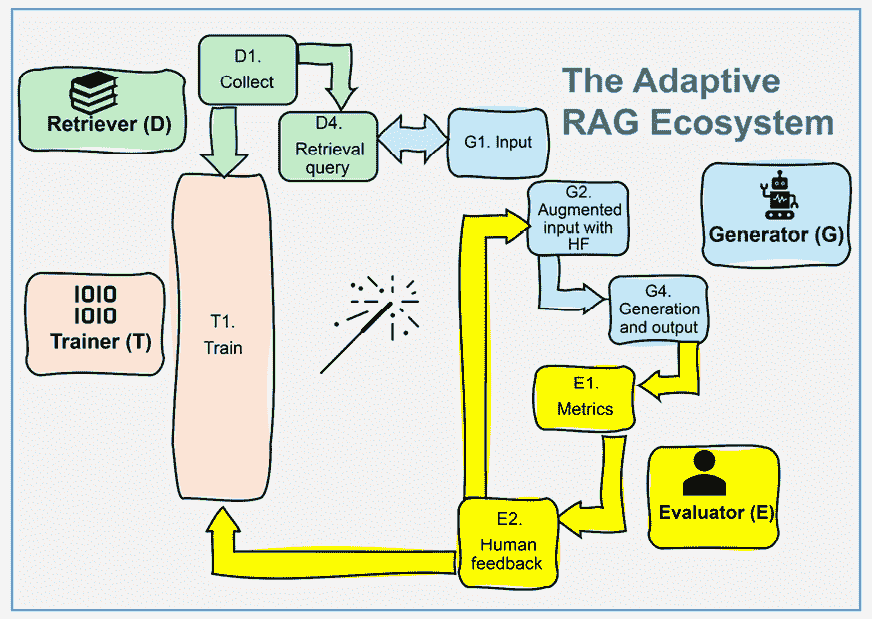
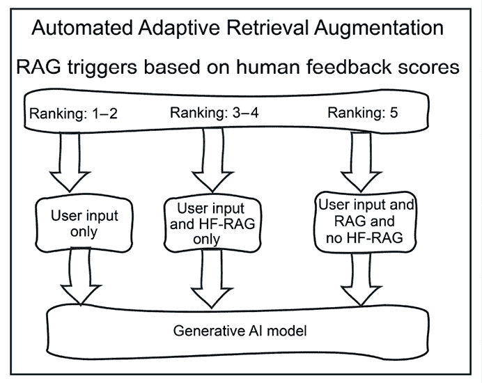
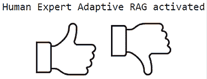
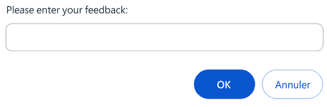

# 第五章：通过专家人类反馈提升 RAG 性能

**人类反馈**（**HF**）不仅对生成式 AI 有用，而且是必不可少的，尤其是在使用 RAG 的模型中。生成式 AI 模型在训练期间使用来自包含各种文档的数据集的信息。训练 AI 模型的数据在模型参数中是固定的；除非我们再次训练它，否则我们无法更改它。然而，在基于检索的文本和多模态数据集的世界中，我们有信息可以查看和调整。这就是 HF 的用武之地。通过提供关于 AI 模型从其数据集中提取的信息的反馈，HF 可以直接影响其未来响应的质量。参与这一过程使人类成为 RAG 发展的积极参与者。它为 AI 项目添加了一个新的维度：自适应 RAG。

我们已经探索并实现了朴素、高级和模块化的 RAG。现在，我们将添加自适应 RAG 到我们的生成式 AI 工具箱中。我们知道，即使是最优秀的生成式 AI 系统，如果它不令人满意，也无法说服用户它是有用的。我们将通过引入 HF 循环来介绍自适应 RAG。因此，系统变得自适应，因为用于检索的文档被更新了。在 RAG 中集成 HF 导致了一种实用性的混合方法，因为它涉及人类在原本自动化的生成过程中。因此，我们将利用 HF，我们将从零开始使用 Python 构建一个混合自适应 RAG 程序，通过从头开始构建 RAG 驱动的生成式 AI 系统的关键步骤。到本章结束时，你将理解自适应 RAG 框架的理论，并在基于 HF 构建 AI 模型方面获得实践经验。

本章涵盖了以下主题：

+   定义自适应 RAG 生态系统

+   将自适应 RAG 应用于增强检索查询

+   使用 HF 自动化增强生成式 AI 输入

+   自动化终端用户反馈排名以触发专家 HF

+   为人类专家创建一个自动化的反馈系统

+   将 HF 与自适应 RAG 集成到 GPT-4o 中

让我们先定义自适应 RAG。

# 自适应 RAG

不，RAG 不能解决我们所有的问题和挑战。RAG，就像任何生成模型一样，也可能产生无关和错误的结果！尽管如此，RAG 可能是一个有用的选项，因为我们向生成 AI 模型提供了相关的文档，这些文档可以告知其响应。然而，RAG 输出的质量取决于底层数据的准确性和相关性，这需要验证！这就是自适应 RAG 的用武之地。自适应 RAG 引入了人类、现实生活中的实用反馈，这将改善由 RAG 驱动的生成式 AI 生态系统。

生成式 AI 模型的核心信息是参数化的（存储为权重）。但在 RAG 的上下文中，这些数据可以可视化并受控，正如我们在*第二章*中看到的，*使用 Deep Lake 和 OpenAI 的 RAG 嵌入向量存储*。尽管如此，仍然存在挑战；例如，最终用户可能会编写模糊的查询，或者 RAG 的数据检索可能存在故障。因此，高度推荐使用 HF 过程来确保系统的可靠性。

*图 1.3*来自*第一章*，*为什么是检索增强生成？*，代表了完整的 RAG 框架和生态系统。让我们放大自适应 RAG 生态系统并关注以下图中起作用的关键流程：



图 5.1：自适应 RAG 生态系统的变体

本章中自适应 RAG 生态系统的变体包括以下组件，如图 5.1 所示，对于检索器：

+   **D1**: **收集和处理**关于 LLMs 的维基百科文章，通过获取和清理数据

+   **D4**: **检索查询**查询检索数据集

生成器的组件包括：

+   **G1**: **输入**由最终用户输入

+   **G2**: **增强输入与 HF**，这将增强用户的初始输入并**提示工程**以配置 GPT-4o 模型的提示

+   **G4**: **生成和输出**以运行生成式 AI 模型并获得响应

评估者的组件包括：

+   **E1**: **指标**应用余弦相似度测量

+   **E2**: **人工反馈**通过最终用户和专家反馈来获取和处理系统的最终测量值

在本章中，我们将通过在 Google Colab 上构建一个混合自适应 RAG 程序来展示自适应 RAG。我们将从头开始构建这个程序，以获得对自适应过程清晰的理解，这个过程可能因项目目标的不同而有所不同，但基本原理保持不变。通过这次动手实践，您将学习如何在现成的 RAG 系统无法满足用户期望时开发和定制 RAG 系统。这很重要，因为无论性能指标如何，人类用户都可能对响应不满意。我们还将探讨将人类用户排名纳入以收集对我们由 RAG 驱动的生成式 AI 系统的专家反馈。最后，我们将实现一个自动排名系统，该系统将决定如何增强生成模型的用户输入，为如何在公司中成功实施 RAG 驱动的系统提供实用见解。

我们将为一个名为*Company C*的假设公司开发一个概念验证。这家公司希望部署一个解释 AI 是什么的对话代理。目标是让该公司的员工了解 AI 的基本术语、概念和应用。负责这个 RAG 驱动的生成式 AI 示例的机器学习工程师希望未来的用户在实施其他 AI 项目（如销售、生产和交付领域）时，能够更好地了解 AI。

C 公司目前面临着严重的客户支持问题。随着产品和服务数量的增长，C 系列智能手机的产品线已经因为客户请求过多而出现了技术问题。IT 部门希望为这些客户设置一个对话代理。然而，团队并不确信。因此，IT 部门决定首先设置一个对话代理来解释什么是 LLM 以及它如何有助于 C 系列智能手机的客户支持服务。

该程序将采用混合和自适应的方式以满足 C 公司的需求：

+   **混合**：现实场景超越了理论框架和配置。该系统是混合的，因为我们正在将 HF 整合到可以实时处理的信息检索过程中。然而，我们不会仅用关键词来解析文档内容。我们将对文档（在本例中是维基百科 URL）进行标记，这可以自动完成，也可以由人控制并改进，如果需要的话。正如我们在本章中展示的，一些文档将被替换为人类专家反馈并重新标记。程序将自动检索人类专家反馈文档和原始检索文档，形成一个混合（人机）*动态* RAG 系统。

+   **自适应**：我们将引入人类用户排名、专家反馈和自动文档重新排序。这个 HF 循环将我们带入模块化 RAG 和自适应 RAG 的深处。自适应 RAG 利用 RAG 系统的灵活性来适应其响应。在这种情况下，我们希望触发 HF 来提高输出质量。

现实生活中的项目不可避免地需要机器学习工程师超越预先确定的类别边界。实用主义和必要性鼓励创新和创造性的解决方案。例如，对于系统的混合、动态和自适应方面，机器学习工程师可以想象任何与任何类型的算法一起工作的过程：经典软件功能、机器学习聚类算法或任何可以工作的函数。在现实生活中的 AI 中，什么有效，就做什么！

是时候构建一个概念验证来向 C 公司管理层展示混合自适应 RAG 驱动的生成式 AI 如何成功帮助他们的团队，具体方法如下：

+   在扩展和投资于项目之前，证明 AI 可以通过概念验证工作

+   展示一个 AI 系统可以被定制以适应特定项目

+   培养扎实的技能基础以应对任何 AI 挑战

+   构建公司数据治理和 AI 系统的控制

+   为通过概念验证阶段解决可能出现的问题，打下系统扩展的坚实基础

让我们开始敲击键盘！

# 在 Python 中构建混合自适应 RAG

现在，让我们开始构建混合自适应 RAG 驱动的生成式 AI 配置的概念验证。在 GitHub 上打开 `Adaptive_RAG.ipynb`。我们将专注于 HF，因此不会使用现有的框架。我们将构建自己的管道并引入 HF。

如前所述，程序分为三个独立的部分：**检索器**、**生成器**和**评估器**函数，这些可以在实际项目管道中作为独立的代理。尝试从一开始就分离这些函数，因为在项目中，多个团队可能会并行工作在 RAG 框架的不同方面。

以下各节的标题与 GitHub 上程序中每个节的名称完全对应。检索器功能排在首位。

## 1\. 检索器

我们将首先概述设置 RAG 驱动的生成式 AI 模型环境所需的初始步骤。这个过程从安装促进数据检索和处理的必要软件组件和库开始。我们特别涵盖了下载关键文件和安装用于有效数据检索和网页抓取所需的包。

### 1.1\. 安装检索器的环境

让我们从下载 GitHub 仓库的 `commons` 目录下的 `grequests.py` 开始。这个仓库包含可以用于仓库中多个程序的资源，从而避免冗余。

下载是标准的，围绕请求构建：

```py
url = "https://raw.githubusercontent.com/Denis2054/RAG-Driven-Generative-AI/main/commons/grequests.py"
output_file = "grequests.py" 
```

对于检索器，我们只需要两个包，因为我们是从零开始构建 RAG 驱动的生成式 AI 模型。我们将安装：

+   `requests`，用于检索维基百科文档的 HTTP 库：

    ```py
    !pip install requests==2.32.3 
    ```

+   `beautifulsoup4`，用于从网页抓取信息：

    ```py
    !pip install beautifulsoup4==4.12.3 
    ```

我们现在需要一个数据集。

### 1.2.1\. 准备数据集

对于这个概念验证，我们将通过抓取它们的 URL 来检索维基百科文档。数据集将包含每个文档的自动化或人工创建的标签，这是将数据集的文档索引化的第一步：

```py
import requests
from bs4 import BeautifulSoup
import re
# URLs of the Wikipedia articles mapped to keywords
urls = {
    "prompt engineering": "https://en.wikipedia.org/wiki/Prompt_engineering",
    "artificial intelligence":"https://en.wikipedia.org/wiki/Artificial_intelligence",
    "llm": "https://en.wikipedia.org/wiki/Large_language_model",
    "llms": "https://en.wikipedia.org/wiki/Large_language_model"
} 
```

每个 URL 前面都有一个或多个标签。这种方法可能对于相对较小的数据集来说是足够的。

对于特定的项目，包括概念验证，这种方法可以提供一个坚实的第一步，从简单的 RAG（基于关键词的内容搜索）过渡到使用索引搜索数据集（在这种情况下是标签）。我们现在需要处理数据。

### 1.2.2\. 处理数据

我们首先对将要检索的文档应用标准的抓取和文本清理函数：

```py
def fetch_and_clean(url):
    # Fetch the content of the URL
    response = requests.get(url)
    soup = BeautifulSoup(response.content, 'html.parser')
    # Find the main content of the article, ignoring side boxes and headers
    content = soup.find('div', {'class': 'mw-parser-output'})
    # Remove less relevant sections such as "See also", "References", etc.
    for section_title in ['References', 'Bibliography', 'External links', 'See also']:
        section = content.find('span', {'id': section_title})
        if section:
            for sib in section.parent.find_next_siblings():
                sib.decompose()
            section.parent.decompose()
    # Focus on extracting and cleaning text from paragraph tags only
    paragraphs = content.find_all('p')
    cleaned_text = ' '.join(paragraph.get_text(separator=' ', strip=True) for paragraph in paragraphs)
    cleaned_text = re.sub(r'\[\d+\]', '', cleaned_text)  # Remove citation markers like [1], [2], etc.
    return cleaned_text 
```

代码根据其 URL 获取文档内容，而 URL 又基于其标签。这种简单的方法可能满足项目的需求，取决于其目标。机器学习工程师或开发者必须始终小心，不要用昂贵且无利可图的函数超载系统。此外，对网站 URL 进行标记可以引导检索器管道到正确的位置处理数据，无论应用了哪些技术（负载均衡、API 调用优化等）。最终，每个项目或子项目将根据其具体需求需要一种或几种技术。

一旦准备就绪，我们可以实现针对用户输入的检索过程。

### 1.3. 用户输入的检索过程

第一步涉及在用户输入中识别一个关键词。`process_query`函数接受两个参数：`user_input`和`num_words`。要检索的单词数量受限于模型输入限制、成本考虑和整体系统性能等因素：

```py
import textwrap
def process_query(user_input, num_words):
    user_input = user_input.lower()
    # Check for any of the specified keywords in the input
    matched_keyword = next((keyword for keyword in urls if keyword in user_input), None) 
```

在找到用户输入中的关键词与 URL 关联的关键词之间的匹配后，将触发以下用于获取和清理数据的函数：

```py
if matched_keyword:
    print(f"Fetching data from: {urls[matched_keyword]}")
    cleaned_text = fetch_and_clean(urls[matched_keyword])

    # Limit the display to the specified number of words from the cleaned text
    words = cleaned_text.split()  # Split the text into words
    first_n_words = ' '.join(words[:num_words])  # Join the first n words into a single string 
```

`num_words`参数有助于对文本进行分块。虽然这种基本方法可能适用于数据量可管理的用例，但在更复杂的情况下，建议将数据嵌入到向量中。

清理并截断后的文本随后被格式化以供显示：

```py
 # Wrap the first n words to 80 characters wide for display
    wrapped_text = textwrap.fill(first_n_words, width=80)
    print("\nFirst {} words of the cleaned text:".format(num_words))
    print(wrapped_text)  # Print the first n words as a well-formatted paragraph
    # Use the exact same first_n_words for the GPT-4 prompt to ensure consistency
    prompt = f"Summarize the following information about {matched_keyword}:\n{first_n_words}"
    wrapped_prompt = textwrap.fill(prompt, width=80)  # Wrap prompt text
    print("\nPrompt for Generator:", wrapped_prompt)
    # Return the specified number of words
    return first_n_words
else:
    print("No relevant keywords found. Please enter a query related to 'LLM', 'LLMs', or 'Prompt Engineering'.")
    return None 
```

注意，该函数最终返回前`n`个单词，根据用户的查询提供简洁且相关的信息片段。这种设计允许系统在保持用户参与度的同时，高效地管理数据检索。

## 2. 生成器

生成器生态系统包含多个组件，其中许多与 RAG 驱动的生成式 AI 框架中的检索器功能和用户界面重叠：

+   **2.1. 根据人类排名进行自适应 RAG 选择**：这将基于用户面板随时间的变化而变化的评分。在实际的管道中，这个功能可能是一个独立的程序。

+   **2.2. 输入**：在实际项目中，一个**用户界面**（**UI**）将管理输入。这个界面及其相关流程应与用户合作精心设计，理想情况下在一个工作坊环境中，可以充分理解他们的需求和偏好。

+   **2.3. 均值排名模拟场景**：计算用户评估分数的平均值和功能。

+   **2.4. 在运行生成器之前检查输入**：显示输入。

+   **2.5. 安装生成式 AI 环境**：在这个案例中，生成式 AI 模型的环境（OpenAI）可以是管道中另一个环境的一部分，其他团队成员可能正在该环境中工作、实施和独立于检索器功能部署。

+   **2.6\. 内容生成**：在这个程序部分，一个 OpenAI 模型将处理输入并提供一个由评估者评估的响应。

让我们先描述自适应 RAG 系统。

### 2.1\. 集成 HF-RAG 用于增强文档输入

信息检索的动态性质和生成人工智能模型中需要上下文相关数据增强的必要性要求一个能够适应不同输入质量水平的灵活系统。我们引入了一个**自适应 RAG 选择系统**，该系统使用 HF 评分来确定 RAG 生态系统中文档实现的最佳检索策略。自适应功能使我们超越了简单的 RAG，构成了一个混合 RAG 系统。

人类评估者分配 1 到 5 的平均分数，以评估文档的相关性和质量。这些分数触发不同的操作模式，如下面的图所示：



图 5.2：自动 RAG 触发器

+   **1 到 2 分的评分**表明 RAG 系统缺乏补偿能力，表明需要维护或可能需要模型微调。RAG 将暂时停用，直到系统得到改进。用户输入将被处理，但不会有检索。

+   **3 到 4 分的评分**将启动仅使用人类专家反馈的增强，利用闪卡或片段来完善输出。基于文档的 RAG 将被停用，但人类专家反馈数据将增强输入。

+   **5 分的评分**将启动关键字搜索 RAG，当需要时利用之前收集的 HF 进行增强，利用闪卡或目标信息片段来完善输出。在这种情况下，用户不需要提供新的反馈。

该程序实现了许多场景之一。评分系统、评分级别和触发器将根据要达到的特定目标而有所不同。建议组织用户小组研讨会，以决定如何实施这种自适应的 RAG 系统。

这种自适应方法旨在优化自动化检索和人类洞察力之间的平衡，确保生成模型的输出具有最高可能的相关性和准确性。现在让我们输入。

### 2.2\. 输入

C 公司的一名用户被提示输入一个问题：

```py
# Request user input for keyword parsing
user_input = input("Enter your query: ").lower() 
```

在这个示例和程序中，我们将关注一个问题和一个主题：`什么是大型语言模型？`。问题出现并被模型记住：

```py
Enter your query: What is an LLM? 
```

这个程序是一个概念验证，包含策略和示例，供 C 公司用户小组了解大型语言模型。可以添加其他主题，并且程序可以扩展以满足进一步的需求。建议组织用户小组研讨会，以决定下一步行动。

我们已经准备好了环境，现在将激活一个 RAG 场景。

### 2.3\. 平均排名模拟场景

为了本程序，让我们假设人类用户反馈面板已经使用第*3.2*节“人类用户评分”和*3.3*节“人类专家评估”中提供的功能评估了混合自适应 RAG 系统一段时间。用户反馈面板对响应进行了多次排名，这些排名通过计算评分的平均值并存储在名为`ranking`的排名变量中自动更新。`ranking`评分将帮助管理层决定是否通过手动或自动功能降低文档的排名、提升它或抑制文档。您甚至可以模拟第*2.1*节“集成 HF-RAG 以增强文档输入”中描述的场景之一。

我们将从 1 到 5 的排名开始，这将禁用 RAG，以便我们可以看到生成模型的原始响应：

```py
#Select a score between 1 and 5 to run the simulation
ranking=1 
```

然后，我们将修改此值以激活 RAG，而无需额外的专家反馈，`ranking=5`。最后，我们将修改此值以激活无需检索文档的人类反馈 RAG，`ranking=3`。

在现实环境中，这些排名将在组织用户反馈面板研讨会以定义系统预期行为后，根据第*3.2*节和*3.3*节中描述的功能自动触发。如果您想运行第*2.1*节中描述的三个场景，请确保初始化生成模型处理以响应的`text_input`变量：

```py
# initializing the text for the generative AI model simulations
text_input=[] 
```

每次切换场景时，请确保重新初始化`text_input`。

由于其概率性质，生成式 AI 模型的输出可能因运行而异。

让我们回顾一下第*2.1*节中描述的三个评分类别。

#### 排名 1-2：无 RAG

生成式 AI 输出的排名非常低。直到管理层能够分析和改进系统之前，所有 RAG 功能都将被禁用。在这种情况下，`text_input`等于`user_input`：

```py
if ranking>=1 and ranking<3:
  text_input=user_input 
```

在这种情况下，生成式 AI 模型 GPT-4o 将在*2.6*节“内容生成”中生成以下输出：

```py
GPT-4 Response:
---------------
It seems like you're asking about "LLM" which stands for "Language Model for Dialogue Applications" or more commonly referred to as a "Large Language Model."
An LLM is a type of artificial intelligence model designed to understand, generate, and interact with human language. These models are trained on vast amounts of text data and use this training to generate text, answer questions, summarize information, translate languages, and perform other language-related tasks. They are a subset of machine learning models known as transformers, which have been revolutionary in the field of natural language processing (NLP).
Examples of LLMs include OpenAI's GPT (Generative Pre-trained Transformer) series and Google's BERT (Bidirectional Encoder Representations from
Transformers).
--------------- 
```

这种输出无法满足 C 公司在特定用例中的用户面板需求。他们无法将这种解释与他们的客户服务问题联系起来。此外，许多用户不会进一步操作，因为他们已经向管理层描述了他们的需求，并期待得到相应的回应。让我们看看 RAG（人类专家反馈）能提供什么。

#### 排名 3-4：人类专家反馈 RAG

在这个场景中，由于自动 RAG 文档（排名=5）和没有 RAG（排名 1-2）的用户反馈评分不佳，触发了人类专家反馈（见*3.4*节“人类专家评估”）。人类专家面板填写了一张闪卡，现在它已被存储为专家级别的 RAG 文档。

程序首先检查排名并激活 HF 检索：

```py
hf=False
if ranking>3 and ranking<5:
  hf=True 
```

程序将根据关键词、嵌入或其他适合项目目标的项目搜索方法，从专家小组（公司内的选定专家）数据集中检索适当的文档。在这种情况下，我们假设我们已经找到了正确的闪卡并下载了它：

```py
if hf==True:
  from grequests import download
  directory = "Chapter05"
  filename = "human_feedback.txt"
  download(directory, filename, private_token) 
```

我们验证文件是否存在，加载其内容，清理它，将其存储在`content`中，并将其分配给`text_input`以供 GPT-4 模型使用：

```py
if hf==True:
  # Check if 'human_feedback.txt' exists
    efile = os.path.exists('human_feedback.txt')
    if efile:
        # Read and clean the file content
        with open('human_feedback.txt', 'r') as file:
            content = file.read().replace('\n', ' ').replace('#', '')  # Removing new line and markdown characters
            #print(content)  # Uncomment for debugging or maintenance display
        text_input=content
        print(text_input)
    else:
      print("File not found")
      hf=False 
```

文件的内容解释了什么是 LLM 以及它如何帮助 C 公司提高客户支持：

```py
A Large Language Model (LLM) is an advanced AI system trained on vast amounts of text data to generate human-like text responses. It understands and generates language based on the patterns and information it has learned during training. LLMs are highly effective in various language-based tasks, including answering questions, making recommendations, and facilitating conversations. They can be continually updated with new information and trained to understand specific domains or industries.For the C-phone series customer support, incorporating an LLM could significantly enhance service quality and efficiency. The conversational agent powered by an LLM can provide instant responses to customer inquiries, reducing wait times and freeing up human agents for more complex issues. It can be programmed to handle common technical questions about the C-phone series, troubleshoot problems, guide users through setup processes, and offer tips for optimizing device performance. Additionally, it can be used to gather customer feedback, providing valuable insights into user experiences and product performance. This feedback can then be used to improve products and services. Furthermore, the LLM can be designed to escalate issues to human agents when necessary, ensuring that customers receive the best possible support at all levels. The agent can also provide personalized recommendations for customers based on their usage patterns and preferences, enhancing user satisfaction and loyalty. 
```

如果你现在运行第*2.4*和*2.5*节一次，以及第*2.6*节来根据这个`text_input`生成内容，那么响应将是令人满意的：

```py
GPT-4 Response:
---------------
A Large Language Model (LLM) is a sophisticated AI system trained on extensive
text data to generate human-like text responses. It understands and generates
language based on patterns and information learned during training. LLMs are
highly effective in various language-based tasks such as answering questions,
making recommendations, and facilitating conversations. They can be continuously updated with new information and trained to understand specific domains or industries.  For the C-phone series customer support, incorporating an LLM could significantly enhance service quality and efficiency. The conversational agent powered by an LLM can provide instant responses to customer inquiries, reducing wait times and freeing up human agents for more complex issues. 
It can be programmed to handle common technical questions about the C-phone series,
troubleshoot problems, guide users through setup processes, and offer tips for
optimizing device performance. Additionally, it can be used to gather customer
feedback, providing valuable insights into user experiences and product
performance. This feedback can then be used to improve products and services.
Furthermore, the LLM can be designed to escalate issues to human agents when
necessary, ensuring that customers receive the best possible support at all
levels. The agent can also provide personalized recommendations for customers
based on their usage patterns and preferences, enhancing user satisfaction and
loyalty.
--------------- 
```

前面的响应现在要好得多，因为它定义了 LLMs，并展示了如何提高 C 公司 C-phone 系列的客户服务。

我们将在*第九章*，*赋予 AI 模型能力：微调 RAG 数据和人类反馈*中进一步探讨，我们将每天（或尽可能频繁地）微调生成模型以提高其响应，从而减轻 RAG 数据的量。但到目前为止，让我们看看系统在没有 HF 但有 RAG 文档的情况下能取得什么成果。

#### 排名 5：没有人类专家反馈文档的 RAG

一些用户不需要包含人类专家 RAG 闪卡、片段或文档的 RAG 文档。这种情况可能尤其如此，尤其是如果软件工程师是用户的话。

在这种情况下，最大词数限制为 100，以优化 API 成本，但可以根据你的意愿使用以下代码进行修改：

```py
if ranking>=5:
  max_words=100 #Limit: the size of the data we can add to the input
  rdata=process_query(user_input,max_words)
  print(rdata) # for maintenance if necessary
  if rdata:
        rdata_clean = rdata.replace('\n', ' ').replace('#', '')
        rdata_sentences = rdata_clean.split('. ')
        print(rdata)
  text_input=rdata
  print(text_input) 
```

当我们运行生成式 AI 模型时，会产生一个合理的输出，软件工程师可以将其与他们的业务联系起来：

```py
GPT-4 Response:
---------------
A large language model (LLM) is a type of language model known for its
capability to perform general-purpose language generation and other natural language processing tasks such as classification. LLMs develop these abilities by learning statistical relationships from text documents through a computationally intensive training process that includes both self-supervised
and semi-supervised learning. These models can generate text, a form of
generative AI, by taking an input text and repeatedly predicting the next token or word. LLMs are based on artificial neural networks. As of March 2024, the most advanced and capable LLMs are constructed using a decoder-only transformer architecture.
--------------- 
```

我们可以看到输出指的是 2024 年 3 月的数据，尽管 GPT-4-turbo 的训练截止日期是在 2023 年 12 月，如 OpenAI 的文档中所述：[`platform.openai.com/docs/models/gpt-4-turbo-and-gpt-4`](https://platform.openai.com/docs/models/gpt-4-turbo-and-gpt-4)。

在生产环境中，在最终用户层面，输出的错误可能来自检索到的数据或生成式 AI 模型。这显示了 HF 的重要性。在这种情况下，这个错误有望在检索文档或通过生成式 AI 模型中得到纠正。但我们将错误保留下来，以说明 HF 不是一种选择，而是一种必需品。

这些时间相关的 RAG 增强清楚地证明了 RAG 驱动的生成式 AI 的需求。然而，用户仍然需要决定这些类型的输出是否足够，或者是否需要在封闭环境中进行更多企业定制，例如在公司内部或为公司。

在本程序的剩余部分，让我们假设`ranking>=5`以展示评估器在*评估器*部分是如何实现的。让我们安装生成式 AI 环境，根据用户输入和检索到的文档生成内容。

### 2.4.–2.5\. 安装生成式 AI 环境

*2.4\. 在运行生成器之前检查输入* 显示了在用此信息增强输入之前用户输入和检索到的文档。然后我们继续到 *2.5\. 安装生成式 AI 环境*。

只需运行这一节一次。如果你在第 *2.3* 节中修改了场景，你可以跳过这一节以再次运行生成式 AI 模型。这个安装不是在这个笔记本的顶部，因为项目团队可能会选择在另一个环境中运行这个程序的这部分，甚至是在生产中的另一台服务器上。

建议尽可能地将检索器和生成器函数分开，因为它们可能由不同的程序激活，甚至可能在不同的时间激活。一个开发团队可能只专注于检索器函数，而另一个团队则专注于生成器函数。

我们首先安装 OpenAI：

```py
!pip install openai==1.40.3 
```

然后，我们检索 API 密钥。将你的 OpenAI 密钥存储在安全的位置。在这种情况下，它存储在 Google Drive 上：

```py
#API Key
#Store your key in a file and read it(you can type it directly in the notebook but it will be visible for somebody next to you)
from google.colab import drive
drive.mount('/content/drive')
f = open("drive/MyDrive/files/api_key.txt", "r")
API_KEY=f.readline().strip()
f.close()
#The OpenAI Key
import os
import openai
os.environ['OPENAI_API_KEY'] =API_KEY
openai.api_key = os.getenv("OPENAI_API_KEY") 
```

现在我们已经为内容生成做好了准备。

### 2.6\. 内容生成

要生成内容，我们首先导入并设置我们需要的。我们引入了 `time` 来测量响应速度，并选择了 `gpt-4o` 作为我们的对话模型：

```py
import openai
from openai import OpenAI
import time
client = OpenAI()
gptmodel="gpt-4o"
start_time = time.time()  # Start timing before the request 
```

我们随后定义了一个标准的 Gpt-4o 提示，给它足够的信息来响应，其余的则留给模型和 RAG 数据：

```py
def call_gpt4_with_full_text(itext):
    # Join all lines to form a single string
    text_input = '\n'.join(itext)
    prompt = f"Please summarize or elaborate on the following content:\n{text_input}"
    try:
      response = client.chat.completions.create(
         model=gptmodel,
         messages=[
            {"role": "system", "content": "You are an expert Natural Language Processing exercise expert."},
            {"role": "assistant", "content": "1.You can explain read the input and answer in detail"},
            {"role": "user", "content": prompt}
         ],
         temperature=0.1  # Add the temperature parameter here and other parameters you need
        )
      return response.choices[0].message.content.strip()
    except Exception as e:
        return str(e) 
```

然后代码格式化输出：

```py
import textwrap
def print_formatted_response(response):
    # Define the width for wrapping the text
    wrapper = textwrap.TextWrapper(width=80)  # Set to 80 columns wide, but adjust as needed
    wrapped_text = wrapper.fill(text=response)
    # Print the formatted response with a header and footer
    print("GPT-4 Response:")
    print("---------------")
    print(wrapped_text)
    print("---------------\n")
# Assuming 'gpt4_response' contains the response from the previous GPT-4 call
print_formatted_response(gpt4_response) 
```

在这种情况下，响应是令人满意的，正如我们在第 *2.3* 节中看到的那样。在 `ranking=5` 的场景中，这是我们目前正在评估的场景，我们得到以下输出：

```py
GPT-4 Response:
---------------
GPT-4 Response:
---------------
### Summary: A large language model (LLM) is a computational model known for its ability to perform general-purpose language generation and other natural language processing tasks, such as classification. LLMs acquire these abilities by learning statistical relationships from vast amounts of text during a computationally intensive self-supervised and semi-supervised training process.They can be used for text generation, a form of generative AI, by taking input text and repeatedly predicting the next token or word. LLMs are artificial neural networks that use the transformer architecture… 
```

响应看起来不错，但它真的准确吗？让我们运行评估器来找出答案。

## 3\. 评估器

根据每个项目的规格和需求，我们可以实现所需的所有数学和人工评估函数。在本节中，我们将实现两个自动指标：响应时间和余弦相似度分数。然后我们将实现两个交互式评估函数：人工用户评分和人工专家评估。

### 3.1\. 响应时间

响应时间是通过以下 API 调用计算并显示的：

```py
import time
…
start_time = time.time()  # Start timing before the request
…
response_time = time.time() - start_time  # Measure response time
print(f"Response Time: {response_time:.2f} seconds")  # Print response time 
```

在这种情况下，我们可以显示响应时间而无需进一步开发：

```py
print(f"Response Time: {response_time:.2f} seconds")  # Print response time 
```

输出将根据互联网连接性和 OpenAI 服务器的容量而变化。在这种情况下，输出如下：

```py
Response Time: 7.88 seconds 
```

它看起来时间很长，但在线对话代理回答也需要一些时间。决定这种性能是否足够仍然是管理层的决定。让我们接下来运行余弦相似度分数。

### 3.2\. 余弦相似度分数

余弦相似度衡量两个非零向量之间角度的余弦值。在文本分析的情况下，这些向量通常是文本的 **TF-IDF** （**词频-逆文档频率**）表示，这些表示根据相对于文档和语料库的重要性来权衡术语。

GPT-4o 的输入`text_input`和模型的响应`gpt4_response`被 TF-IDF 视为两个独立的“文档”。`vectorizer`将文档转换为向量。然后，向量化考虑输入和响应之间术语的共享和强调，使用`vectorizer.fit_transform([text1, text2])`。

目标是通过以下函数量化主题和词汇的重叠：

```py
from sklearn.feature_extraction.text import TfidfVectorizer
from sklearn.metrics.pairwise import cosine_similarity
def calculate_cosine_similarity(text1, text2):
    vectorizer = TfidfVectorizer()
    tfidf = vectorizer.fit_transform([text1, text2])
    similarity = cosine_similarity(tfidf[0:1], tfidf[1:2])
    return similarity[0][0]
# Example usage with your existing functions
similarity_score = calculate_cosine_similarity(text_input, gpt4_response)
print(f"Cosine Similarity Score: {similarity_score:.3f}") 
```

余弦相似度依赖于`TfidfVectorizer`将两个文档转换为 TF-IDF 向量。然后`cosine_similarity`函数计算这些向量之间的相似度。结果为`1`表示文本完全相同，而`0`表示没有相似性。函数的输出如下：

```py
Cosine Similarity Score: 0.697 
```

分数显示模型输入和输出之间存在强烈的相似性。但人类用户会如何评价这个响应呢？让我们来看看。

### 3.3. 人类用户评分

人类用户评分界面提供了人类用户的反馈。正如本章反复强调的，我建议在与他们一起通过研讨会充分了解用户需求后设计这个界面和流程。在本节中，我们将假设人类用户小组是一组正在测试系统的软件开发者。

代码从界面的参数开始：

```py
# Score parameters
counter=20                     # number of feedback queries
score_history=30               # human feedback
threshold=4                    # minimum rankings to trigger human expert feedback 
```

在这个模拟中，参数显示系统已经计算了人类反馈：

+   `counter=20` 显示用户已经输入的评分数量

+   `score_history=60` 显示 20 个评分的总分

+   `threshold=4` 表示获得最小平均评分，`score_history/counter`，而不触发人类专家反馈请求

我们现在将运行界面以添加一个实例到这些参数中。提供的 Python 代码定义了`evaluate_response`函数，该函数旨在评估由 GPT-4 等语言模型生成的响应的相关性和连贯性。用户在从`1`（差）到`5`（优秀）的范围内对生成的文本进行评分，该函数通过递归检查确保有效输入。代码计算统计指标，如平均分数，以衡量模型在多次评估中的性能。

评估函数是一个简单的反馈请求，以获得介于`1`和`5`之间的值：

```py
import numpy as np
def evaluate_response(response):
    print("\nGenerated Response:")
    print(response)
    print("\nPlease evaluate the response based on the following criteria:")
    print("1 - Poor, 2 - Fair, 3 - Good, 4 - Very Good, 5 - Excellent")
    score = input("Enter the relevance and coherence score (1-5): ")
    try:
        score = int(score)
        if 1 <= score <= 5:
            return score
        else:
            print("Invalid score. Please enter a number between 1 and 5.")
            return evaluate_response(response)  # Recursive call if the input is invalid
    except ValueError:
        print("Invalid input. Please enter a numerical value.")
        return evaluate_response(response)  # Recursive call if the input is invalid 
```

我们然后调用这个函数：

```py
score = evaluate_response(gpt4_response)
print("Evaluator Score:", score) 
```

函数首先显示响应，如下面的摘录所示：

```py
Generated Response:
### Summary:
A large language model (LLM) is a computational model… 
```

然后，用户输入一个介于 1 到 5 之间的评价分数，在这个例子中是`1`：

```py
Please evaluate the response based on the following criteria:
1 - Poor, 2 - Fair, 3 - Good, 4 - Very Good, 5 - Excellent
Enter the relevance and coherence score (1-5): 3 
```

然后代码计算统计信息：

```py
counter+=1
score_history+=score
mean_score=round(np.mean(score_history/counter), 2)
if counter>0:
  print("Rankings      :", counter)
  print("Score history : ", mean_score) 
```

输出显示一个相对非常低的评分：

```py
Evaluator Score: 3
Rankings      : 21
Score history :  3.0 
```

评估者的分数是`3`，整体排名是`3`，评分历史也是`3`！然而，余弦相似度是正的。由于我们将阈值设置为`4`，将触发人类专家评估请求：

```py
threshold=4 
```

发生了什么？让我们询问一个专家并找出答案！

### 3.4. 人类专家评估

指标如余弦相似度确实衡量相似度，但并非深入准确性。时间性能也不会决定响应的准确性。但如果评分太低，那又是为什么呢？因为用户对响应不满意！

代码首先为人类专家用户下载竖起大拇指和竖起中指的图像：

```py
from grequests import download
# Define your variables
directory = "commons"
filename = "thumbs_up.png"
download(directory, filename, private_token)
# Define your variables
directory = "commons"
filename = "thumbs_down.png"
download(directory, filename, private_token) 
```

触发专家反馈的参数是`counter_threshold`和`score_threshold`。用户评分的数量必须超过专家的阈值计数器，即`counter_threshold=10`。在这种情况下，评分的平均值阈值为`4`：`score_threshold=4`。我们现在可以模拟触发专家反馈请求：

```py
if counter>counter_threshold and score_history<=score_threshold:
  print("Human expert evaluation is required for the feedback loop.") 
```

在这种情况下，输出将确认专家反馈循环，因为平均评分较低和用户对响应的评分次数：

```py
Human expert evaluation is required for the feedback loop. 
expert_feedback.txt, as shown in the following excerpt of the code:
```

```py
import base64
from google.colab import output
from IPython.display import display, HTML
def image_to_data_uri(file_path):
    """
    Convert an image to a data URI.
    """
    with open(file_path, 'rb') as image_file:
        encoded_string = base64.b64encode(image_file.read()).decode()
        return f'data:image/png;base64,{encoded_string}'
thumbs_up_data_uri = image_to_data_uri('/content/thumbs_up.png')
thumbs_down_data_uri = image_to_data_uri('/content/thumbs_down.png')
def display_icons():
    # Define the HTML content with the two clickable images
…/…
def save_feedback(feedback):
    with open('/content/expert_feedback.txt', 'w') as f:
        f.write(feedback)
    print("Feedback saved successfully.")
# Register the callback
output.register_callback('notebook.save_feedback', save_feedback)
print("Human Expert Adaptive RAG activated")
# Display the icons with click handlers
display_icons() 
```

代码将显示以下图中的图标。如果专家用户按下竖起中指图标，他们将被提示输入反馈。



图 5.3：反馈图标

您可以为竖起中指添加一个函数，表示响应是错误的，管理层必须与用户面板沟通或向用户反馈界面添加提示。这是一个管理决策，当然。在我们的场景中，人类专家按下了竖起中指图标，并被提示输入响应：



图 5.4：“输入反馈”提示

人类专家提供了响应，该响应保存在`'/content/expert_feedback.txt'`中。通过这种方式，我们最终发现了不准确之处，它位于以下单元格显示的文件内容中：

```py
There is an inaccurate statement in the text:
"As of March 2024, the largest and most capable LLMs are built with a decoder-only transformer-based architecture."
This statement is not accurate because the largest and most capable Large Language Models, such as Meta's Llama models, have a transformer-based architecture, but they are not "decoder-only." These models use the architecture of the transformer, which includes both encoder and decoder components. 
```

前面的专家反馈可以用来改进 RAG 数据集。通过这种方式，我们已经探索了 HF-RAG 交互的深度。让我们总结我们的旅程，并继续下一步。

# 摘要

随着我们结束对实用主义 AI 实现的动手实践，值得反思我们一起踏上的变革之旅，探索自适应 RAG 的动态世界。我们首先考察了 HF 不仅补充了生成 AI，而且从关键上增强了它，使其成为一个更强大的、针对现实世界需求定制的工具。我们描述了自适应 RAG 生态系统，然后从头开始构建。从数据收集、处理和查询开始，我们将这些元素整合到一个由 RAG 驱动的生成 AI 系统中。我们的方法不仅仅是编码；它是通过持续的 HF 循环为 AI 增加适应性。

通过将 GPT-4 的能力与之前会话中的专家见解和最终用户评估相结合，我们展示了 HF（人类反馈）的实用应用和重大影响。我们实施了一个系统，其中输出不仅由用户生成，而且由用户进行排序。低排名触发了专家反馈循环，强调了在改进 AI 响应中人类干预的重要性。从头开始构建自适应 RAG 程序确保了对如何整合 HF 将标准 AI 系统转变为随时间演变和改进的系统有深入理解。

本章不仅仅关于学习，还关于实践、反思，以及将理论知识转化为实际技能。我们现在准备将 RAG 驱动的 AI 扩展到下一章的生产级规模和复杂性。

# 问题

用*是*或*否*回答以下问题：

1.  人类反馈对于改进由 RAG 驱动的生成型 AI 系统是否至关重要？

1.  在不重新训练模型的情况下，生成型 AI 模型的核心数据可以更改吗？

1.  自适应 RAG 是否涉及实时人类反馈循环以改进检索？

1.  自适应 RAG 的主要焦点是否是用自动响应取代所有人类输入？

1.  自适应 RAG 中的人类反馈能否触发检索文档的变化？

1.  公司 C 是否仅将自适应 RAG 用于客户支持问题？

1.  人类反馈是否仅在 AI 响应获得高用户评分时使用？

1.  本章的程序是否只提供基于文本的检索输出？

1.  混合自适应 RAG 系统是否是静态的，意味着它不能根据反馈进行调整？

1.  在确定 AI 响应的相关性时，用户排名是否完全被忽略？

# 参考文献

+   Evgenii Kortukov、Alexander Rubinstein、Elisa Nguyen、Seong Joon Oh 所著的《在现实知识冲突下研究大型语言模型行为》：[`arxiv.org/abs/2404.16032`](https://arxiv.org/abs/2404.16032)

+   OpenAI 模型：[`platform.openai.com/docs/models`](https://platform.openai.com/docs/models)

# 进一步阅读

有关本章中实现的向量化器和余弦相似度功能的更多信息，请使用以下链接：

+   特征提取 – `TfidfVectorizer`：[`scikit-learn.org/stable/modules/generated/sklearn.feature_extraction.text.TfidfVectorizer.html`](https://scikit-learn.org/stable/modules/generated/sklearn.feature_extraction.text.TfidfVectorizer.html)

+   `sklearn.metrics` – `cosine_similarity`：[`scikit-learn.org/stable/modules/generated/sklearn.metrics.pairwise.cosine_similarity.html`](https://scikit-learn.org/stable/modules/generated/sklearn.metrics.pairwise.cosine_similarity.html)

# 加入我们的 Discord 社区

加入我们的 Discord 空间，与作者和其他读者进行讨论：

[`www.packt.link/rag`](https://www.packt.link/rag)


