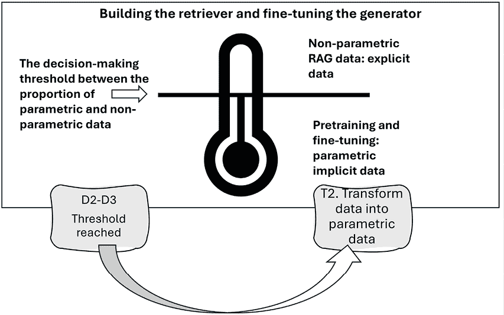
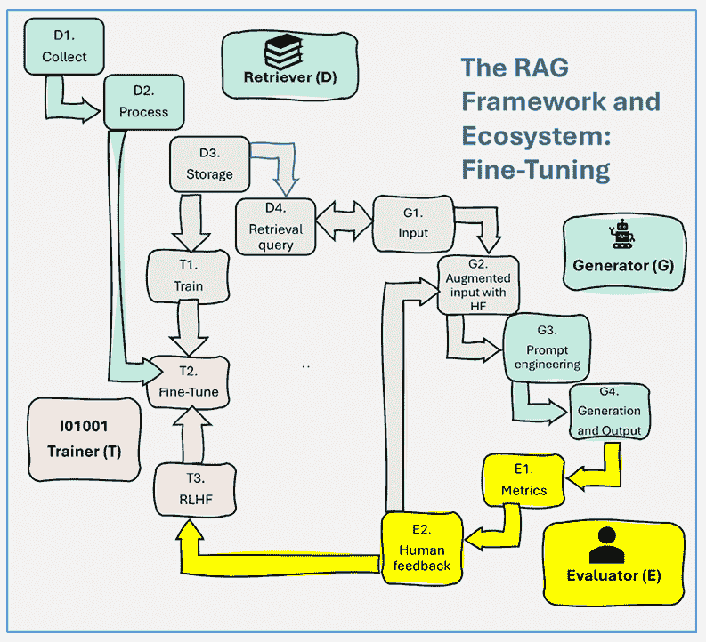
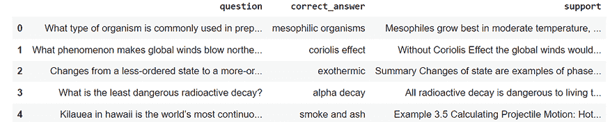
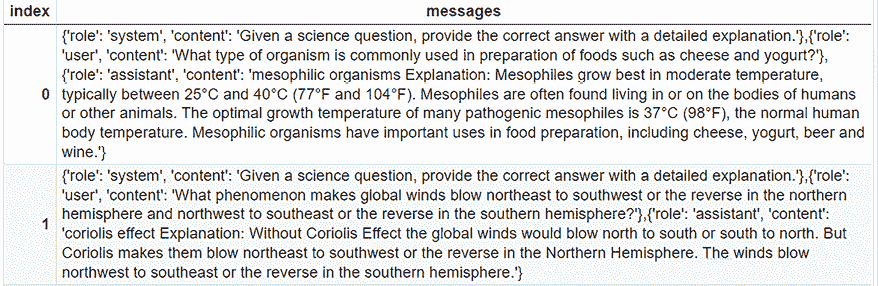
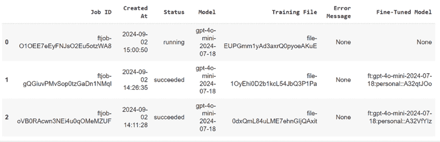
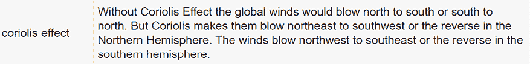
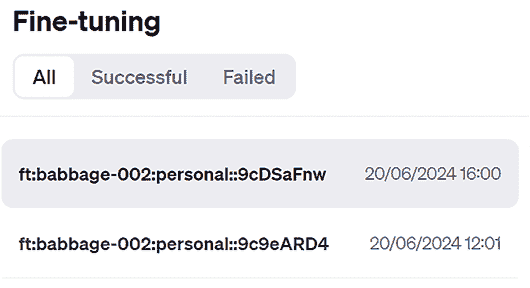
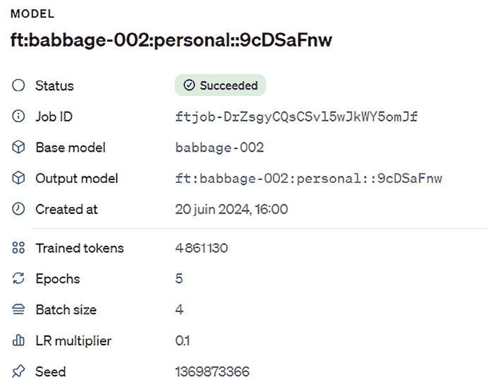
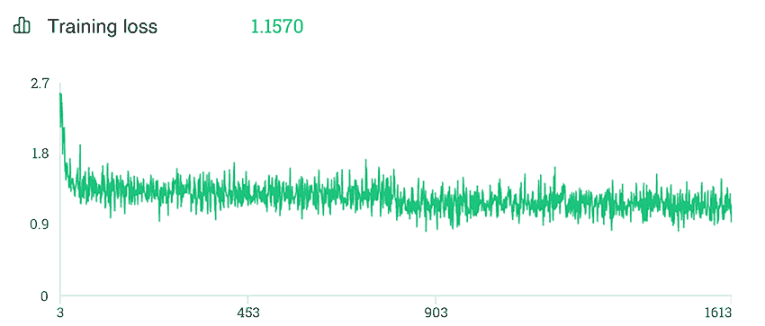
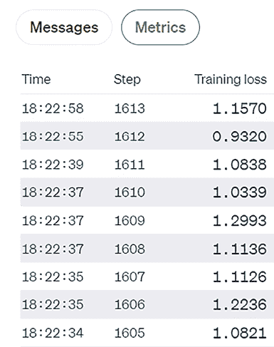

# 第九章：赋能 AI 模型：微调 RAG 数据和人类反馈

一个不断增加其 RAG 数据量的组织将达到非参数数据的阈值（未在 LLM 上预训练）。到那时，积累的 RAG 数据量可能会变得极其难以管理，引发与存储成本、检索资源和生成 AI 模型自身容量相关的问题。此外，预训练的生成 AI 模型是训练到某个截止日期的。从第二天开始，该模型将忽略新的知识。这意味着用户将无法与截止日期之后出版的报纸版面的内容进行交互。那时，检索在提供 RAG 驱动的内容中扮演关键角色。

类似于 Google、Microsoft、Amazon 和其他网络巨头可能需要指数级的数据和资源。某些领域，如美国的法律判决，可能确实需要大量数据。然而，这并不适用于广泛的领域。许多公司不需要维护如此大的数据集，在某些情况下，大量静态数据——如硬科学中的数据——可以长时间保持稳定。此类静态数据可以微调以减少所需的 RAG 数据量。

因此，在本章中，我们将首先检查通过微调实现的 RAG 数据减少的架构。我们将关注包含现成文档的数据集，同时也强调人类反馈因素。我们将展示如何在 OpenAI 模型中将非参数数据转换为参数化、微调数据。然后，我们将从上一章下载并准备数据集，将数据转换为格式良好的提示和完成对，以便在 JSONL 中进行微调。我们将微调一个成本效益高的 OpenAI 模型，`GPT-4o-mini`，这将为我们将要实施的完成任务证明是足够的。一旦模型微调完成，我们将在我们的数据集上对其进行测试，以验证它是否成功考虑了我们的数据。最后，我们将探索 OpenAI 的指标界面，它使我们能够监控我们的技术指标，如准确性和使用指标，以评估我们方法的成本效益。

总结来说，本章涵盖了以下主题：

+   管理 RAG 数据的限制

+   确定要微调哪些数据的挑战

+   准备 JSON 数据集以进行微调

+   运行 OpenAI 的处理工具以生成 JSONL 数据集

+   微调 OpenAI 模型

+   管理微调处理时间

+   运行微调后的模型

让我们先定义微调过程的架构。

# 微调静态 RAG 数据的架构

在本节中，我们将质疑当非参数 RAG 数据超过可管理阈值时的使用，正如在*第一章*的*RAG 与微调*部分中描述的，该部分提出了阈值原则。*图 9.1*将这一原则应用于本节：



图 9.1：RAG 数据的微调阈值已达到

注意，对于 RAG 数据环境中的静态数据与动态数据，处理（**D2**）和存储（**D3**）阈值已经达到。阈值取决于每个项目和诸如以下参数之类的参数：

+   **处理 RAG 数据的量**：嵌入数据需要人类和机器资源。即使我们不嵌入数据，堆积静态数据（在长时间内稳定的数据）也没有意义。

+   **存储和检索 RAG 数据的量**：在某个时刻，如果我们继续堆积数据，其中很大一部分可能会重叠。

+   **检索需要资源**：即使系统是开源的，仍然需要管理越来越多的资源。

其他因素也可能在每个项目中发挥作用。无论原因如何，当我们达到 RAG 数据阈值时，微调都可以是一个好的解决方案。

## RAG 生态系统

在本节中，我们将回到*第一章*中描述的 RAG 生态系统。我们将专注于本章所需的特定组件。以下图表以颜色展示了微调组件，以及我们不需要的组件以灰色表示：



图 9.2：RAG 生态系统的微调组件

我们将要构建的微调生态系统的关键特性可以总结如下几点：

+   **收集（D1）和准备（D2）数据集**：我们将下载并处理我们在上一章中实现的人类定制众包 SciQ 硬科学数据集：[`huggingface.co/datasets/sciq`](https://huggingface.co/datasets/sciq)。

+   **人类反馈（E2）**：我们可以假设人类反馈在 SciQ 硬科学数据集中发挥了重要作用。数据集由人类控制并更新，因此我们可以将其视为一种模拟，即可靠的人类反馈如何被微调以减轻 RAG 数据集的量。我们可以更进一步地说，在现实生活中的项目中，SciQ 数据集中存在的解释有时可能来自对模型的评估，正如我们在*第五章*，*通过专家人类反馈提升 RAG 性能*中探讨的那样。

+   **微调（T2）**：我们将微调一个经济高效的 OpenAI 模型，`GPT-4o-mini`。

+   **提示工程（G3）和生成及输出（G4）**：我们将根据 OpenAI 的建议进行提示工程，并展示输出。

+   **指标（E1）**：我们将查看 OpenAI 指标界面的主要特性。

让我们现在去键盘上收集和处理 SciQ 数据集。

# 安装环境

随着 AI 的快速发展和跨平台依赖冲突，安装环境变得复杂，正如我们在第二章的*使用 Deep Lake 和 OpenAI 的 RAG 嵌入向量存储*部分中看到的。因此，我们将尽可能冻结包版本。

对于这个程序，请在 GitHub 上的`Chapter09`目录中打开`Fine_tuning_OpenAI_GPT_4o_mini.ipynb`笔记本。程序首先检索 OpenAI API 密钥：

```py
#You can retrieve your API key from a file(1)
# or enter it manually(2)
#Comment this cell if you want to enter your key manually.
#(1)Retrieve the API Key from a file
#Store you key in a file and read it(you can type it directly in the notebook but it will be visible for somebody next to you)
from google.colab import drive
drive.mount('/content/drive')
f = open("drive/MyDrive/files/api_key.txt", "r")
API_KEY=f.readline()
f.close() 
```

然后安装`openai`并设置 API 密钥：

```py
try:
  import openai
except:
  !pip install openai==1.42.0
  import openai
#(2) Enter your manually by
# replacing API_KEY by your key.
#The OpenAI Key
import os
os.environ['OPENAI_API_KEY'] =API_KEY
openai.api_key = os.getenv("OPENAI_API_KEY") 
```

现在，我们安装`jsonlines`以生成 JSONL 数据：

```py
!pip install jsonlines==4.0.0 
```

我们现在安装`datasets`：

```py
!pip install datasets==2.20.0 
```

阅读第八章的*安装环境*部分，*使用 Chroma 和 Hugging Face Llama 的动态 RAG*，以了解安装`datasets`时涉及的依赖冲突解释。

安装过程中可能会出现一些问题，但数据集仍然会被下载。我们必须预料并接受这些问题，因为主要平台持续更新它们的包，并可能与预安装的环境（如 Google Colab）产生冲突。您可以为这个程序创建一个特殊环境。请记住，您的其他程序可能会因为其他包约束而遇到问题。

我们现在已准备好准备数据集。

# 1\. 准备数据集以进行微调

微调 OpenAI 模型需要仔细的准备；否则，微调任务将失败。在本节中，我们将执行以下步骤：

1.  从 Hugging Face 下载数据集，并通过处理其列来准备它。

1.  将数据集流式传输到 JSON 文件，格式为 JSONL。

程序首先下载数据集。

## 1.1\. 下载并可视化数据集

我们将下载第八章中嵌入的 SciQ 数据集。正如我们所见，嵌入数千个文档需要时间和资源。在本节中，我们将下载数据集，但这次，*我们不会嵌入它*。在微调数据时，我们将让 OpenAI 模型为我们处理。

程序下载与第八章相同的 Hugging Face 数据集，并过滤数据集的训练部分，只包含包含正确答案和支持文本（解释问题的答案）的非空记录：

```py
# Import required libraries
from datasets import load_dataset
import pandas as pd
# Load the SciQ dataset from HuggingFace
dataset_view = load_dataset("sciq", split="train")
# Filter the dataset to include only questions with support and correct answer
filtered_dataset = dataset_view.filter(lambda x: x["support"] != "" and x["correct_answer"] != "")
# Print the number of questions with support
print("Number of questions with support: ", len(filtered_dataset)) 
```

前面的代码随后打印出带有支持文本的过滤问题的数量。输出显示我们有一个包含 10,481 条记录的子集：

```py
Number of questions with support:  10481 
```

现在，我们将数据集加载到 DataFrame 中，并删除干扰列（那些包含错误答案的列）：

```py
# Convert the filtered dataset to a pandas DataFrame
df_view = pd.DataFrame(filtered_dataset)
# Columns to drop
columns_to_drop = ['distractor3', 'distractor1', 'distractor2']
# Dropping the columns from the DataFrame
df_view = df.drop(columns=columns_to_drop)
# Display the DataFrame
df_view.head() 
```

输出显示了我们需要的三列：



图 9.3：显示三列的输出

我们需要将成为提示的问题。将使用`correct_answer`和`support`列来完成。现在我们已经检查了数据集，我们可以直接将数据集流式传输到 JSON 文件。

## 1.2\. 准备数据集以进行微调

要训练我们将使用的完成模型，我们需要编写一个符合要求的非常精确的 JSONL 格式的 JSON 文件。

我们以与在*1.1. 下载和可视化数据集*部分中可视化的相同方式下载并处理数据集，建议在微调之前检查数据集。

我们现在将 GPT-4o-mini 的消息写入 JSONL 格式：

```py
# Prepare the data items for JSON lines file
items = []
for idx, row in df.iterrows():
    detailed_answer = row['correct_answer'] + " Explanation: " + row['support']
    items.append({
        "messages": [
            {"role": "system", "content": "Given a science question, provide the correct answer with a detailed explanation."},
            {"role": "user", "content": row['question']},
            {"role": "assistant", "content": detailed_answer}
        ]
    }) 
```

我们首先定义详细的答案（`detailed_answer`），包括正确的答案（`'correct_answer'`）和辅助的（`support`）解释。

然后我们定义 GPT-4o-mini 模型的`messages`：

+   `{"role": "system", "content": ...}`：这设置了语言模型的初始指令，告诉它为科学问题提供详细的答案。

+   `{"role": "user", "content": row['question']}`：这代表用户提出问题，取自 DataFrame 的`question`列。

+   `{"role": "assistant", "content": detailed_answer}`：这代表助手响应，提供之前构建的详细答案。

我们现在可以将我们的 JSONL 数据集写入文件：

```py
# Write to JSON lines file
with jsonlines.open('/content/QA_prompts_and_completions.json', 'w') as writer:
    writer.write_all(items) 
```

我们已经为 OpenAI 模型提供了一个它期望的结构，并且已经训练过以理解它。我们可以将我们刚刚创建的 JSON 文件加载到 pandas DataFrame 中以验证其内容：

```py
dfile="/content/QA_prompts_and_completions.json"
import pandas as pd
# Load the data
df = pd.read_json(dfile, lines=True)
df 
```

文件的部分摘录显示我们已经成功准备了 JSON 文件：



图 9.4：文件摘录

那就是全部！我们现在可以运行微调作业了。

# 2. 微调模型

要训练模型，我们检索我们的训练文件并创建一个微调作业。我们首先创建一个 OpenAI 客户端：

```py
from openai import OpenAI
import jsonlines
client = OpenAI() 
```

然后我们使用我们生成的文件创建另一个训练文件，并将其上传到 OpenAI：

```py
# Uploading the training file
result_file = client.files.create(
  file=open("QA_prompts_and_completions.json", "rb"),
  purpose="fine-tune"
) 
```

我们将打印出用于微调的数据集的文件信息：

```py
print(result_file)
param_training_file_name = result_file.id
print(param_training_file_name) 
```

我们现在创建并显示微调作业：

```py
# Creating the fine-tuning job

ft_job = client.fine_tuning.jobs.create(
  training_file=param_training_file_name,
  model="gpt-4o-mini-2024-07-18"
)
# Printing the fine-tuning job
print(ft_job) 
```

输出首先提供文件的名称、目的、状态和 OpenAI 文件 ID 的名称：

```py
FileObject(id='file-EUPGmm1yAd3axrQ0pyoeAKuE', bytes=8062970, created_at=1725289249, filename='QA_prompts_and_completions.json', object='file', purpose='fine-tune', status='processed', status_details=None) file-EUPGmm1yAd3axrQ0pyoeAKuE 
```

代码显示了微调作业的详细信息：

```py
FineTuningJob(id='ftjob-O1OEE7eEyFNJsO2Eu5otzWA8', created_at=1725289250, error=Error(code=None, message=None, param=None), fine_tuned_model=None, finished_at=None, hyperparameters=Hyperparameters(n_epochs='auto', batch_size='auto', learning_rate_multiplier='auto'), model='gpt-4o-mini-2024-07-18', object='fine_tuning.job', organization_id='org-h2Kjmcir4wyGtqq1mJALLGIb', result_files=[], seed=1103096818, status='validating_files', trained_tokens=None, training_file='file-EUPGmm1yAd3axrQ0pyoeAKuE', validation_file=None, estimated_finish=None, integrations=[], user_provided_suffix=None) 
```

输出提供了我们需要监控作业的详细信息。以下是输出中一些关键值对的简要描述：

+   `作业 ID`: `ftjob-O1OEE7eEyFNJsO2Eu5otzWA8`。

+   `状态`: `validating_files`。这意味着 OpenAI 目前正在检查训练文件，以确保它适合微调。

+   `模型`: `gpt-4o-mini-2024-07-18`。我们正在使用一个更小、成本效益更高的 GPT-4 版本进行微调。

+   `训练文件`: `file-EUPGmm1yAd3axrQ0pyoeAKuE`。这是我们提供的包含示例以教授模型的文件。

一些关键的超参数包括：

+   `n_epochs`: `'auto'`：OpenAI 将自动确定最佳的训练周期数。

+   `batch_size`: `'auto'`：OpenAI 将自动选择训练的最佳批量大小。

+   `learning_rate_multiplier`: `'auto'`：OpenAI 将在训练过程中自动调整学习率。

+   `创建于`: `2024-06-30 08:20:50`。

如果您想深入研究微调 OpenAI 模型，这些信息将非常有用。我们还可以用它来监控和管理我们的微调过程。

## 2.1. 监控微调

在本节中，我们将提取监控所有微调作业所需的最基本信息。我们首先查询 OpenAI 以获取最新的三个微调作业：

```py
import pandas as pd
from openai import OpenAI
client = OpenAI()
# Assume client is already set up and authenticated
response = client.fine_tuning.jobs.list(limit=3) # increase to include your history 
```

然后，我们初始化我们想要可视化的信息列表：

```py
# Initialize lists to store the extracted data
job_ids = []
created_ats = []
statuses = []
models = []
training_files = []
error_messages = []
fine_tuned_models = [] # List to store the fine-tuned model names 
```

在此之后，我们遍历 `response` 来检索所需的信息：

```py
# Iterate over the jobs in the response
for job in response.data:
    job_ids.append(job.id)
    created_ats.append(job.created_at)
    statuses.append(job.status)
    models.append(job.model)
    training_files.append(job.training_file)
    error_message = job.error.message if job.error else None
    error_messages.append(error_message)
# Append the fine-tuned model name
    fine_tuned_model = job.fine_tuned_model if hasattr(job, 'fine_tuned_model')
    else None
    fine_tuned_models.append(fine_tuned_model) 
```

我们现在创建一个包含我们提取信息的 DataFrame：

```py
import pandas as pd
# Assume client is already set up and authenticated
response = client.fine_tuning.jobs.list(limit=3)
# Create a DataFrame
df = pd.DataFrame({
    'Job ID': job_ids,
    'Created At': created_ats,
    'Status': statuses,
    'Model': models,
    'Training File': training_files,
    'Error Message': error_messages,
    'Fine-Tuned Model': fine_tuned_models # Include the fine-tuned model names
}) 
```

最后，我们将时间戳转换为可读格式并显示微调列表及其状态：

```py
# Convert timestamps to readable format
df['Created At'] = pd.to_datetime(df['Created At'], unit='s')
df = df.sort_values(by='Created At', ascending=False)
# Display the DataFrame
df 
```

输出提供了一个监控仪表板，显示了我们的作业列表，如图 *9.5* 所示：



图 9.5：pandas DataFrame 中的作业列表

您可以看到，对于作业 `0`，任务状态为 `running`。状态会通知您过程的各个步骤，例如验证文件、运行、失败或成功。在这种情况下，微调过程正在运行。如果您定期刷新此单元格，您将看到状态。

我们现在将检索为 `Fine-Tuned Model` 列训练的最新模型。如果训练失败，此列将为空。如果不为空，我们可以检索它：

```py
import pandas as pd
generation=False  # until the current model is fine-tuned
# Attempt to find the first non-empty Fine-Tuned Model
non_empty_models = df[df['Fine-Tuned Model'].notna() & (df['Fine-Tuned Model'] != '')]
if not non_empty_models.empty:
    first_non_empty_model = non_empty_models['Fine-Tuned Model'].iloc[0]
    print("The latest fine-tuned model is:", first_non_empty_model)
    generation=True
else:
    first_non_empty_model='None'
    print("No fine-tuned models found.")
# Display the first non-empty Fine-Tuned Model in the DataFrame
first_non_empty_model = df[df['Fine-Tuned Model'].notna() & (df['Fine-Tuned Model'] != '')]['Fine-Tuned Model'].iloc[0]
print("The lastest fine-tuned model is:", first_non_empty_model) 
```

输出将显示如果有最新微调模型，则显示其名称，或者通知我们未找到微调模型。在这种情况下，GPT-4o-mini 已成功训练：

```py
The latest fine-tuned model is: ft:gpt-4o-mini-2024-07-18:personal::A32VfYIz 
```

如果找到微调模型，`generation=True`，它将在以下单元格中触发 OpenAI 完成调用。如果没有找到模型，`generation=False`，则不会在笔记本的其余部分运行 OpenAI API，以避免使用您未训练的模型。您可以在新单元格中将生成设置为 `True`，然后选择您希望使用的任何微调模型。

我们知道训练作业可能需要一段时间。您可以不时刷新 pandas DataFrame。您可以编写代码检查另一个作业的状态，并等待训练作业出现名称或错误消息。您还可以等待 OpenAI 发送电子邮件通知您训练作业已完成。如果训练作业失败，我们必须验证我们的训练数据是否存在任何不一致、缺失值或错误的标签。此外，确保 JSON 文件格式符合 OpenAI 指定的模式，包括正确的字段名、数据类型和结构。

一旦训练作业完成，我们就可以运行完成任务。

# 3. 使用微调后的 OpenAI 模型

我们现在准备好使用我们的微调 OpenAI `GPT-4o-mini` 模型。我们将从定义一个基于初始数据集中的问题的提示开始：

```py
# Define the prompt
prompt = "What phenomenon makes global winds blow northeast to southwest or the reverse in the northern hemisphere and northwest to southeast or the reverse in the southern hemisphere?" 
```

目标是验证数据集是否已正确训练，并将产生与我们所定义的完成结果相似的结果。我们现在可以运行微调模型：

```py
# Assume first_non_empty_model is defined above this snippet
if generation==True:
    response = client.chat.completions.create(
        model=first_non_empty_model,
        temperature=0.0,  # Adjust as needed for variability
        messages=[
            {"role": "system", "content": "Given a question, reply with a complete explanation for students."},
            {"role": "user", "content": prompt}
        ]
    )
else:
    print("Error: Model is None, cannot proceed with the API request.") 
```

请求的参数必须适合我们的场景：

+   `model=first_non_empty_model` 是我们的预训练模型。

+   `prompt=prompt` 是我们的预定义提示。

+   `temperature=0.0` 设置为低值，因为我们不希望这个硬科学完成任务有任何“创造性”。

一旦我们运行了请求，我们就可以格式化和显示响应。以下代码包含两个单元格，用于显示和提取响应。

首先，我们可以打印原始响应：

```py
if generation==True:
  print(response) 
```

输出包含响应和过程信息：

```py
ChatCompletion(id='chatcmpl-A32pvH9wLvNsSRmB1sUjxOW4Z6Xr6',… 
```

我们随后提取响应的文本：

```py
if (generation==True):
  # Access the response from the first choice
  response_text = response.choices[0].message.content
  # Print the response
  print(response_text) 
```

输出是一个字符串：

```py
Coriolis effect Explanation: The Coriolis effect is… 
```

最后，我们可以使用 Python 包装器将响应字符串格式化为一个漂亮的段落：

```py
import textwrap
if generation==True:
wrapped_text = textwrap.fill(response_text.strip(), 60)
print(wrapped_text) 
```

输出显示我们的数据已被考虑在内：

```py
Coriolis effect Explanation: The Coriolis effect is a
phenomenon that causes moving objects, such as air and
water, to turn and twist in response to the rotation of the
Earth. It is responsible for the rotation of large weather
systems, such as hurricanes, and the direction of trade
winds and ocean currents. In the Northern Hemisphere, the
effect causes moving objects to turn to the right, while in
the Southern Hemisphere, objects turn to the left. The
Coriolis effect is proportional to the speed of the moving
object and the strength of the Earth's rotation, and it is
negligible for small-scale movements, such as water flowing
in a sink. 
```

让我们看看我们提示的初始完成：



图 9.6：初始完成

因此，响应是令人满意的。这不一定总是如此，可能需要逐步对数据集（更好的数据、大量数据等）进行更多工作，直到达到令人满意的目标。

您可以将您模型的名称保存在文本文件或您希望的地方。现在，您可以使用训练好的模型名称在另一个程序中运行您的模型，或者您可以在任何时候重新加载这个笔记本：

1.  运行这个笔记本的“安装环境”部分。

1.  定义一个与我们所训练的数据集相关的提示。

1.  在 OpenAI 完成请求中输入您模型的名称。

1.  运行请求并分析响应。

如果需要更多信息，您可以查阅 OpenAI 的微调文档：[`platform.openai.com/docs/guides/fine-tuning/fine-tuning`](https://platform.openai.com/docs/guides/fine-tuning/fine-tuning)。

# 指标

OpenAI 提供用户界面来分析训练过程和模型的指标。您可以在 [`platform.openai.com/finetune/`](https://platform.openai.com/finetune/) 访问与您微调模型相关的指标。

界面显示您微调作业的列表：



图 9.7：微调作业列表

您可以选择查看所有微调作业，包括成功的或失败的。如果我们选择一个成功的作业，例如，我们可以查看以下摘录中的作业详情：



图 9.8：示例视图

让我们来看看这个图提供的信息：

+   **状态**：指示微调过程的状态。在这种情况下，我们可以看到过程已成功完成。

+   **作业 ID**：微调作业的唯一标识符。这可以用于在查询或支持目的中引用作业。

+   **基础模型**：指定用于微调的起始点所使用的预训练模型。在这种情况下，`gpt-4o-mini` 是 OpenAI 模型的一个版本。

+   **输出模型**：这是微调后模型的标识符。它结合了基于特定训练数据的更改和优化。

+   **创建时间**：微调作业启动的日期和时间。

+   **训练过的标记**：在训练过程中处理的标记总数（如文本片段，例如单词或标点符号）。这个指标有助于衡量训练的广度。

+   **周期**：在微调过程中训练数据完整遍历的次数。更多的周期可能导致更好的学习，但过多的周期可能会导致过拟合。

+   **批量大小**：在一次模型训练迭代中使用的训练示例数量。较小的批量大小可以提供更多更新和更精细的学习，但可能需要更长的时间来训练。

+   **学习率乘数**：这指的是学习率乘数，它影响在微调过程中如何调整基础模型的学习率。较小的乘数可能导致模型权重更新更小、更保守。

+   **种子**：训练过程中使用的随机数生成器的种子。提供种子确保训练过程是可重复的，这意味着你可以用相同的输入条件得到相同的结果。

这些信息将帮助定制微调作业以满足项目的特定需求，并探索优化和定制的替代方法。此外，界面中还包含更多我们可以探索的信息，以获得微调过程的深入视角。如果我们滚动到模型**信息**标签页，我们可以看到如下所示的指标：



图 9.9：微调模型的指标

训练损失和其他可用信息可以指导我们的训练策略（数据、文件和参数）。

**训练损失**是评估机器学习模型在训练期间性能的一个可靠指标。在这种情况下，`训练损失（1.1570）`表示模型在训练数据集上的平均误差。较低的训练损失值表明模型更好地拟合了训练数据。训练损失为`1.1570`表明，在微调过程中，模型已经学会了很好地预测或分类其训练数据。

我们还可以使用`时间`和`步骤`信息来检查这些值：



图 9.10：训练作业中的训练损失

我们还必须衡量使用情况以监控每期和模型的成本。OpenAI 在[`platform.openai.com/usage`](https://platform.openai.com/usage)提供了一个详细的界面。

精调确实可以是一种有效的优化 RAG 数据的方法，如果我们确保使用高质量的数据和正确的参数来训练模型。现在，是我们总结我们的旅程并转向下一个 RAG 驱动的生成式 AI 实现的时候了。

# 摘要

本章的目标是表明，随着我们积累 RAG 数据，一些数据是动态的，需要不断更新，因此无法轻松微调。然而，一些数据是静态的，这意味着它将在很长时间内保持稳定。这种数据可以成为参数化的（存储在训练好的 LLM 的权重中）。

我们首先下载并处理了包含硬科学问题的 SciQ 数据集。这些稳定的数据非常适合微调。它包含问题、答案和支持（解释）结构，这使得数据对微调有效。此外，我们可以假设需要人类反馈。我们甚至可以进一步想象这种反馈可以通过分析生成式 AI 模型的输出提供。

我们根据 OpenAI 准备工具的建议，将准备好的数据转换为 JSONL 文件中的提示和完成内容。JSONL 的结构旨在与`GPT-4o-mini`等完成模型（提示和完成）兼容。然后程序微调了成本效益高的`GPT-4o-mini` OpenAI 模型，随后我们运行了模型，发现输出令人满意。最后，我们在 OpenAI 指标用户界面中探索了微调模型的指标。

我们可以得出结论，在某些情况下，当需要时，微调可以优化 RAG 数据。然而，我们将在下一章，*第十章*，*使用 Pinecone 和 OpenAI 的视频股票生产 RAG*中进一步探讨这个过程，届时我们将运行完整的 RAG 驱动的生成式 AI 生态系统。

# 问题

用是或否回答以下问题：

1.  所有组织都需要管理大量 RAG 数据吗？

1.  GPT-4o-mini 模型描述为不足以进行微调任务吗？

1.  预训练模型在截止日期后没有检索系统的情况下，能否更新其知识库？

1.  静态数据从不改变，因此从不需要更新，是这样吗？

1.  从 Hugging Face 下载数据是准备数据集的唯一来源吗？

1.  根据文档，所有 RAG 数据最终都会嵌入到训练模型的参数中吗？

1.  这章建议仅使用新数据对 AI 模型进行微调吗？

1.  OpenAI 指标界面是否用于在模型训练期间调整学习率？

1.  是否可以使用 OpenAI 仪表板有效地监控微调过程？

1.  在准备像 SciQ 这样的硬科学数据集时，认为人类反馈是不必要的吗？

# 参考文献

+   OpenAI 微调文档：[`platform.openai.com/docs/guides/fine-tuning/`](https://platform.openai.com/docs/guides/fine-tuning/)

+   OpenAI 定价：[`openai.com/api/pricing/`](https://openai.com/api/pricing/)

# 进一步阅读

+   由王宇等人撰写的*通过天体物理数据微调 GPT 的测试*是一篇关于微调硬科学数据的有趣文章，它需要仔细的数据准备：[`arxiv.org/pdf/2404.10019`](https://arxiv.org/pdf/2404.10019)

# 加入我们的 Discord 社区

加入我们社区的 Discord 空间，与作者和其他读者进行讨论：

[`www.packt.link/rag`](https://www.packt.link/rag)


