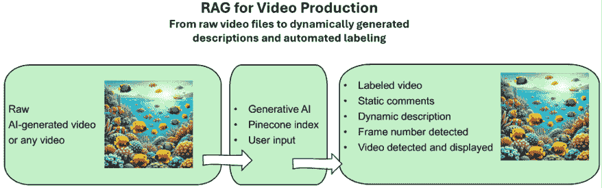
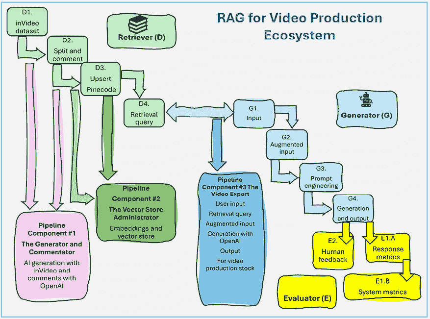
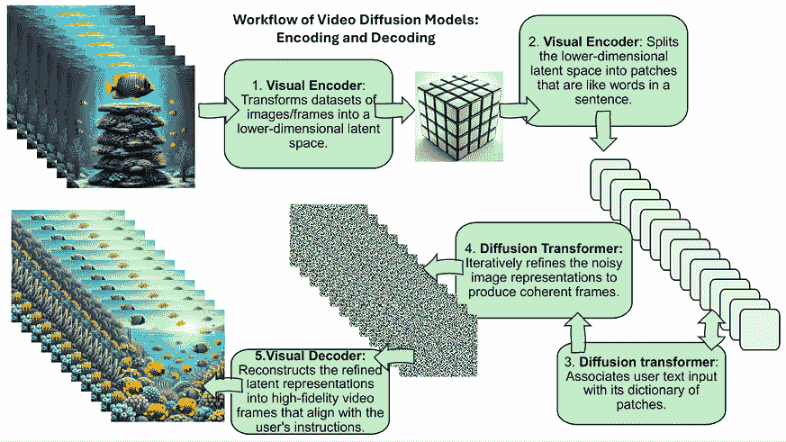
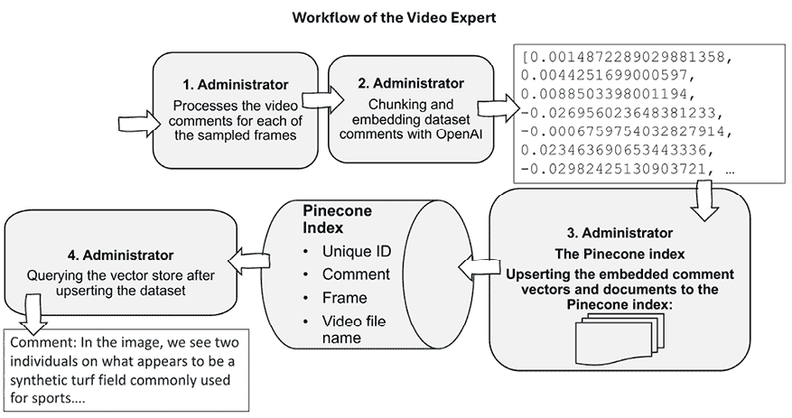
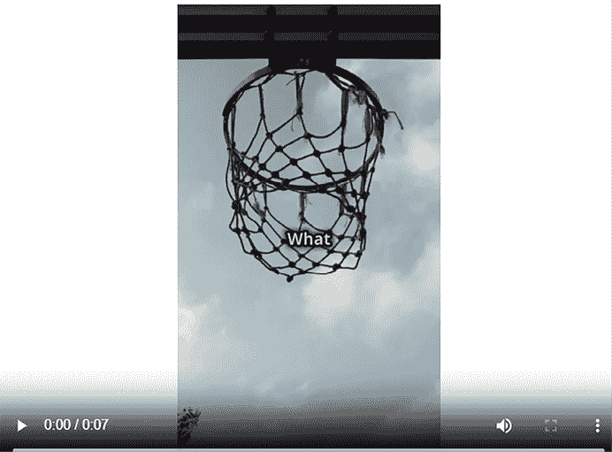
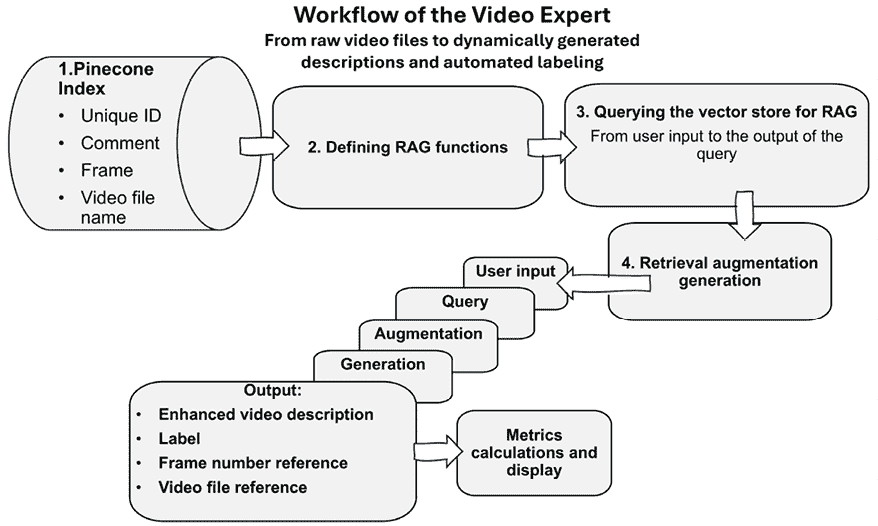

# 第十章：使用 Pinecone 和 OpenAI 进行视频库存生产的 RAG

由于我们独特的打破习惯和发明任何事物的新方法的能力，人类的创造力超越了已知模式的范围。相反，生成式 AI 依赖于我们在越来越多的领域内已知的建立模式，而没有真正“创造”而是复制我们的习惯。因此，在本章中，当我们使用“创造”这个词作为实用术语时，我们仅意味着“生成”。生成式 AI，凭借其在自动化任务中的效率，将继续其扩张，直到找到复制任何它能执行的人类任务的方法。因此，我们必须学习这些自动化系统的工作原理，以便在我们的项目中发挥它们的最大作用。将本章视为一次探索我们生活在这个尖端混合人类和 AI 代理时代的 RAG 架构的旅程。我们将扮演一个旨在构建由 AI 驱动的可下载在线视频库存的初创企业的角色。为了实现这一目标，我们将建立一个 AI 代理团队，他们将共同努力创建一个带有评论和标签的视频库存。

我们的旅程从“管道 1：生成器和评论员”中的生成器代理开始。生成器代理使用 Sora，一个 OpenAI 的文本到视频模型，创建世界模拟。您将看到由 Sora 驱动的 *inVideo* 人工智能应用如何参与“创意”，将一个想法转化为视频。然后，评论员代理将 AI 生成的视频分割成帧，并使用 OpenAI 的视觉模型生成技术评论。接下来，在“管道 2：向量存储管理员”中，我们将继续我们的旅程，构建管理 Pinecone 的向量存储管理员。向量存储管理员将嵌入评论员生成的技术视频评论，更新向量化的评论，并查询 Pinecone 向量存储以验证系统是否正常工作。最后，我们将构建视频专家，该专家处理用户输入，查询向量存储，并检索相关的视频帧。最后，在“管道 3：视频专家”中，视频专家代理将使用查询的原始输出增强用户输入，并激活其专家 OpenAI GPT-4o 模型，该模型将分析评论，检测不完美之处，更有效地重新表述，并为视频提供标签。

到本章结束时，您将了解如何通过自动化从原始素材到带有描述和标签的视频的过程来自动生成短视频库存。您将能够提供一项服务，用户只需输入几个词，就能获得一个具有定制、实时描述和标签的视频。

总结来说，本章涵盖了以下主题：

+   设计生成式 AI 视频和评论

+   将视频分割成帧以供 OpenAI 的视觉分析模型使用

+   将视频嵌入并更新向量到 Pinecone 索引

+   查询向量存储

+   使用 OpenAI GPT-4o 改进和纠正视频评论

+   自动标记原始视频

+   显示原始视频处理的全结果，包括评论和标记的视频

+   评估输出并实施指标计算

让我们从定义 RAG 视频生产的架构开始。

# 视频生产的 RAG 架构

自动化现实世界视频生成、评论和标记的过程在媒体、营销、娱乐和教育等各个行业中极为相关。企业和创作者持续寻求高效的方法来生产和管理工作内容，以满足不断增长的需求。在本章中，你将获得可以直接应用于满足这些需求的实际技能。

本章中我们 RAG 视频生产用例的目标是使用 AI 代理处理 AI 生成的视频，创建一个标记视频库以识别它们。系统还将通过定位视频中的特定帧上的 AI 生成技术评论来动态生成自定义描述。*图 10.1*展示了处理视频生产的 RAG 的 AI 代理团队：



图 10.1：从原始视频到标记和评论的视频

我们将为我们的 RAG 视频生产流程实现 AI 代理，它们将：

+   自动生成原始视频并下载它们

+   将视频分割成帧

+   分析一组帧

+   激活一个 OpenAI LLM 模型以生成技术评论

+   使用唯一的索引、评论本身、分析的帧号和视频文件名保存技术评论

+   在 Pinecone 索引向量存储中更新数据

+   使用用户输入查询 Pinecone 向量存储

+   检索与视频技术评论最相似的特定帧

+   将检索到的帧的技术评论添加到用户输入中

+   要求 OpenAI LLM 分析可能包含在视频中检测到的矛盾和不完善的技术评论的逻辑，然后根据帧号和视频文件名生成动态、定制的视频描述

+   显示选定的视频

+   评估输出并应用指标计算

因此，我们将从原始视频过渡到标记视频，并基于用户输入提供定制描述。例如，我们能够提出如下精确的问题：

```py
"Find a basketball player that is scoring with a dunk." 
```

这意味着系统将能够在最初未标记的视频中找到一个帧（图像），选择视频，显示它，并动态生成定制的评论。为了达到我们的目标，我们将在以下图中所示的三条管道中实现 AI 代理：



图 10.2：具有生成式 AI 代理的视频生产生态系统中的 RAG

现在，你上面看到的图示是：

+   **管道 1**：**生成器**和**评论者**

**生成器**使用 OpenAI Sora 生成 AI 视频的生成器。**评论员**将视频分割成由 OpenAI 的某个视觉模型注释的帧。然后，**评论员**代理保存评论。

+   **Pipeline 2**: **向量存储管理员**

此流程将嵌入并更新由 *Pipeline 1* 制作的评论到 Pinecone 索引中。

+   **Pipeline 3**: **视频专家**

此流程将根据用户输入查询 Pinecone 向量存储。查询将返回视频中最相似的帧，用技术评论增强输入，并让 OpenAI GPT-4o 寻找视频中的逻辑缺陷，指出它们，然后为用户生成定制的视频评论和标签。本节还包含评估函数（评估器）和指标计算。

时间测量函数封装在前面生态系统的一些关键函数中。

我们将构建的 RAG 视频制作系统可以通过一次处理一个视频来实现无限扩展，仅使用 CPU 和少量内存，同时利用 Pinecone 的存储能力。这有效地展示了自动化视频制作的概念，但在实际项目中实施此生产系统需要大量工作。然而，技术是存在的，视频制作的未来正在经历历史性的演变。让我们开始编写代码，从环境开始。 

# 视频制作生态系统的环境

GitHub 上的 `Chapter10` 目录包含本章中所有四个笔记本的环境：

+   `Videos_dataset_visualization.ipynb`

+   `Pipeline_1_The_Generator_and_the_Commentator.ipynb`

+   `Pipeline_2_The_Vector_Store_Administrator.ipynb`

+   `Pipeline_3_The_Video_Expert.ipynb`

每个笔记本都包含一个 *安装环境* 部分，包括以下所有笔记本中相同的以下部分：

+   *导入模块和库*

+   *GitHub*

+   *视频下载和显示功能*

+   *OpenAI*

+   *Pinecone*

本章旨在建立一种通用的预生产安装策略，一旦我们深入研究视频生产的 RAG 代码，我们将专注于流程的内容。此策略仅限于本章中描述的场景，并且将根据每个实际生产环境的要求而变化。

本章中的笔记本仅需要 CPU、有限的内存和有限的磁盘空间。因此，整个流程可以在优化的、可扩展的环境中一次处理一个视频，无限期地流线化。

让我们先导入我们项目所需的模块和库。

## 导入模块和库

目标是准备一个预生产环境，该环境对所有笔记本都是通用的。因此，无论是否在特定程序中使用，模块和库都存在于所有四个笔记本中：

```py
from IPython.display import HTML # to display videos
import base64 # to encode videos as base64
from base64 import b64encode # to encode videos as base64
import os # to interact with the operating system
import subprocess # to run commands
import time # to measure execution time
import csv # to save comments
import uuid # to generate unique ids
import cv2 # to split videos
from PIL import Image # to display videos
import pandas as pd # to display comments
import numpy as np # to use Numerical Python
from io import BytesIO #to manage a binary stream of data in memory 
```

每个笔记本都包含以下模块和库，如下表所示：

| **代码** | **注释** |
| --- | --- |
| `from IPython.display import HTML` | 用于显示视频 |
| `import base64` | 用于将视频编码为 `base64` |
| `from base64 import b64encode` | 用于将视频编码为 `base64` |
| `import os` | 用于与操作系统交互 |
| `import subprocess` | 用于运行命令 |
| `import time` | 用于测量执行时间 |
| `import csv` | 用于保存评论 |
| `import uuid` | 用于生成唯一 ID |
| `import cv2` | 用于分割视频（开源计算机视觉库） |
| `from PIL import Image` | 用于显示视频 |
| `import pandas as pd` | 用于显示评论 |
| `import numpy as np` | 用于使用数值 Python |
| `from io import BytesIO` | 用于内存中的二进制数据流 |

表 10.1：我们的视频制作系统所需的模块和库

`Code` 列包含模块或库的名称，而 `Comment` 列提供了它们用法的简要描述。让我们继续到 GitHub 命令。

## GitHub

`download(directory, filename)` 函数存在于所有四个笔记本中。`download(directory, filename)` 函数的主要功能是从书籍的 GitHub 仓库下载我们需要的文件：

```py
def download(directory, filename):
    # The base URL of the image files in the GitHub repository
    base_url = 'https://raw.githubusercontent.com/Denis2054/RAG-Driven-Generative-AI/main/'
    # Complete URL for the file
    file_url = f"{base_url}{directory}/{filename}"
    # Use curl to download the file
    try:
        # Prepare the curl command
        curl_command = f'curl -o {filename} {file_url}'
        # Execute the curl command
        subprocess.run(curl_command, check=True, shell=True)
        print(f"Downloaded '{filename}' successfully.")
    except subprocess.CalledProcessError:
        print(f"Failed to download '{filename}'. Check the URL, your internet connection, and if the token is correct and has appropriate permissions.") 
```

前面的函数接受两个参数：

+   `directory`，这是我们想要下载的文件所在的 GitHub 目录

+   `filename`，这是我们想要下载的文件名

## OpenAI

OpenAI 包安装在前三个管道笔记本中，但在不需要 LLM 的 `Video_dataset_visualization.ipynb` 中没有安装。你可以从文件中检索 API 密钥或手动输入（但它是可见的）：

```py
#You can retrieve your API key from a file(1)
# or enter it manually(2)
#Comment this cell if you want to enter your key manually.
#(1)Retrieve the API Key from a file
#Store you key in a file and read it(you can type it directly in the notebook but it will be visible for somebody next to you)
from google.colab import drive
drive.mount('/content/drive')
f = open("drive/MyDrive/files/api_key.txt", "r")
API_KEY=f.readline()o
Nf.close() 
```

在运行代码之前，你需要在 `www.openai.com` 上注册并获取一个 API 密钥。程序安装 `openai` 包：

```py
try:
  import openai
except:
  #!pip install openai==1.45.0
  import openai 
```

最后，我们为 API 密钥设置一个环境变量：

```py
#(2) Enter your manually by
# replacing API_KEY by your key.
#The OpenAI Key
os.environ['OPENAI_API_KEY'] =API_KEY
openai.api_key = os.getenv("OPENAI_API_KEY") 
```

## Pinecone

*Pinecone* 部分仅在需要 Pinecone 向量存储的 `Pipeline_2_The_Vector_Store_Administrator.ipynb` 和 `Pipeline_3_The_Video_Expert.ipynb` 中存在。以下命令安装 Pinecone，然后导入 Pinecone：

```py
!pip install pinecone-client==4.1.1
import pinecone 
```

程序随后从文件中检索密钥（或者你可以手动输入）：

```py
f = open("drive/MyDrive/files/pinecone.txt", "r")
PINECONE_API_KEY=f.readline()
f.close() 
```

在生产环境中，你可以设置一个环境变量或实现最适合你项目的方案，以确保 API 密钥永远不会可见。

`Pipeline_3_The_Video_Expert.ipynb` 的 *Evaluator* 部分包含其自身的需求和安装。

通过这样，我们已经为所有四个笔记本定义了环境，这些笔记本在其各自的 *安装环境* 部分中包含我们刚刚描述的相同子部分。我们现在可以完全专注于视频制作程序中的过程。我们将从生成器和评论员开始。

# 管道 1：生成器和评论员

自动视频生成和分析正在计算机视觉领域引发一场革命。我们将在*AI 生成的视频数据集*部分介绍带有 Sora 的生成器 AI 代理。我们将探讨 OpenAI 的 Sora 是如何使用文本到视频扩散变换器生成本章视频的。这项技术本身是我们已经在专业电影制作环境中预期并有所体验的。然而，新意在于软件只需几点击就能成为主流，例如 inVideo！

在*生成器和评论员*部分，我们将扩展生成器的范围，以收集和处理 AI 生成的视频。生成器将视频分割成帧，并与评论员（一个 OpenAI LLM）合作，对视频帧样本进行评论。

生成器的任务是从产生 AI 生成的视频数据集开始。

## AI 生成的视频数据集

本项目中的第一个 AI 代理是一个文本到视频扩散变换器模型，它将生成我们将实施的视频数据集。本章的视频是由 Sora 生成的，这是 OpenAI 于 2024 年 2 月发布的一个文本到视频 AI 模型。你可以访问 Sora 来查看公开的 AI 生成的视频并创建自己的视频，请访问[`ai.invideo.io/`](https://ai.invideo.io/)。AI 生成的视频还允许你获得具有灵活版权条款的免费视频，你可以在[`invideo.io/terms-and-conditions/`](https://invideo.io/terms-and-conditions/)查看这些条款。

一旦你通读了这一章，你也可以使用任何视频来源创建自己的视频数据集，例如智能手机、视频股票和社交媒体。

AI 生成的视频提高了创建视频数据集的速度。团队不必花费时间寻找符合他们需求的视频。他们可以通过一个提示快速获得视频，这个提示可以是用几句话表达的一个想法。AI 生成的视频代表了向 AI 应用未来的巨大飞跃。Sora 的潜力适用于许多行业，包括电影制作、教育和营销。它从简单的文本提示中生成细微的视频内容的能力为创意和教育输出开辟了新的途径。

尽管 AI 生成的视频（尤其是扩散变换器）改变了我们创建世界模拟的方式，但这在许多领域，如电影制作，代表了就业的风险。深度伪造和虚假信息的风险是真实的。在个人层面，当我们在一个项目中实施生成式 AI 时，我们必须考虑道德因素，从而产生建设性、道德和现实的内容。

让我们看看扩散变换器如何产生逼真的内容。

### 扩散变换器是如何工作的？

如刘等人 2024 年所述（见*参考文献*部分），Sora 的核心是一个在编码器和解码器之间运行的扩散变换器模型。它使用用户文本输入来引导内容生成，将其与编码器中的补丁相关联。该模型迭代地细化这些噪声潜在表示，提高其清晰度和连贯性。最后，经过细化的数据被传递到解码器以重建高保真视频帧。涉及的技术包括视觉变换器，如 CLIP，以及 LLMs，如 GPT-4，以及其他 OpenAI 持续包含在其视觉模型发布中的组件。

编码器和解码器是整体扩散模型的基本组成部分，如图 10.3 所示。它们在变换器扩散模型的工作流程中都发挥着关键作用：

+   **编码器**：编码器的主要功能是将输入数据，如图像或视频，压缩到低维潜在空间。因此，编码器将高维视觉数据转换为紧凑的表示，同时保留关键信息。获得的低维潜在空间是高维数据的压缩表示，在减少复杂性的同时保留基本特征。例如，高分辨率图像（1024x1024 像素，3 个颜色通道）可以通过编码器压缩成一个包含 1000 个值的向量，捕捉形状和纹理等关键细节。这使得图像的处理和操作更加高效。

+   **解码器**：解码器从编码器产生的潜在表示中重建原始数据。它执行编码器的逆操作，将低维潜在空间转换回高维像素空间，从而生成最终输出，例如图像或视频。



图 10.3：视频扩散模型的编码和解码工作流程

扩散变换器模型的过程经过五个主要步骤，如前图所示：

1.  视觉编码器将图像数据集转换为低维潜在空间。

1.  视觉编码器将低维潜在空间分割成类似于句子中单词的补丁。

1.  扩散变换器将用户文本输入与其字典中的补丁相关联。

1.  扩散变换器迭代地细化生成的噪声图像表示，以产生连贯的帧。

1.  视觉解码器将细化的潜在表示重建为与用户指令一致的高保真视频帧。

然后，视频帧可以按顺序播放。视频的每一秒都包含一系列帧。我们将分解 AI 生成的视频为帧，并对这些帧进行评论。但就目前而言，我们将分析扩散变换器产生的视频数据集。

### 分析扩散变换器模型视频数据集

在 GitHub 上打开`Videos_dataset_visualization.ipynb`笔记本。希望您已经按照本章前面描述的方式安装了环境。我们将继续编写我们需要的下载和显示函数。

#### 视频下载和显示函数

三个主要函数每个都使用`filename`（视频文件名）作为参数。三个主要函数用于下载和显示视频，并在视频中显示帧：

`download_video`函数从 GitHub 数据集中一次下载一个视频，调用在*环境*部分的*GitHub*子部分中定义的`download`函数：

```py
# downloading file from GitHub
def download_video(filename):
  # Define your variables
  directory = "Chapter10/videos"
  filename = file_name
  download(directory, filename) 
```

`display_video(file_name)`函数显示下载的视频文件，首先使用`base64`进行编码，这是一种二进制到文本的编码方案，它以 ASCII 字符串格式表示二进制数据。然后，编码后的视频以 HTML 格式显示：

```py
# Open the file in binary mode
def display_video(file_name):
    with open(file_name, 'rb') as file:
      video_data = file.read()
  # Encode the video file as base64
  video_url = b64encode(video_data).decode()
  # Create an HTML string with the embedded video
  html = f'''
  <video width="640" height="480" controls>
    <source src="img/mp4;base64,{video_url}" type="video/mp4">
  Your browser does not support the video tag.
  </video>
  '''
  # Display the video
  HTML(html)
  # Return the HTML object
  return HTML(html) 
```

`display_video_frame`函数接受`file_name`、`frame_number`和`size`（要显示的图像大小）作为参数，以在视频中显示一个帧。该函数首先打开视频文件，然后提取由`frame_number`设置的帧号：

```py
def display_video_frame(file_name, frame_number, size):
    # Open the video file
    cap = cv2.VideoCapture(file_name)
    # Move to the frame_number
    cap.set(cv2.CAP_PROP_POS_FRAMES, frame_number)
    # Read the frame
    success, frame = cap.read()
    if not success:
      return "Failed to grab frame" 
```

该函数将文件从 BGR（蓝、绿、红）通道转换为 RGB（红、绿、蓝）通道，将其转换为 PIL 图像数组（例如 OpenCV 处理的图像数组），并使用`size`参数进行缩放：

```py
# Convert the color from BGR to RGB
    frame = cv2.cvtColor(frame, cv2.COLOR_BGR2RGB)
    # Convert to PIL image and resize
    img = Image.fromarray(frame)
    img = img.resize(size, Image.LANCZOS)  # Resize image to specified size 
```

最后，该函数使用`base64`将图像编码为字符串格式，并在 HTML 中显示它：

```py
 # Convert the PIL image to a base64 string to embed in HTML
    buffered = BytesIO()
    img.save(buffered, format="JPEG")
    img_str = base64.b64encode(buffered.getvalue()).decode()
    # Create an HTML string with the embedded image
    html_str = f'''
    
    '''
    # Display the image
    display(HTML(html_str))
    # Return the HTML object for further use if needed
    return HTML(html_str) 
```

一旦安装了环境并且视频处理函数就绪，我们将显示介绍视频。

#### 介绍视频（带音频）

以下单元格使用我们在上一节中创建的函数下载并显示介绍视频。使用`download_video`函数选择并下载视频文件：

```py
# select file
print("Collecting video")
file_name="AI_Professor_Introduces_New_Course.mp4"
#file_name = "AI_Professor_Introduces_New_Course.mp4" # Enter the name of the video file to process here
print(f"Video: {file_name}")
# Downloading video
print("Downloading video: downloading from GitHub")
download_video(file_name) 
```

输出确认了选择和下载状态：

```py
Collecting video
Video: AI_Professor_Introduces_New_Course.mp4
Downloading video: downloading from GitHub
Downloaded 'AI_Professor_Introduces_New_Course.mp4' successfully. 
```

我们可以使用`display_video_frame`函数通过提供文件名、帧号和要显示的图像大小来选择只显示视频的单个帧作为缩略图。程序首先计算`frame_count`（视频中的帧数）、`frame_rate`（每秒帧数）和`video_duration`（视频持续时间）。然后，它将确保`frame_number`（我们想要显示的帧）不超过`frame_count`。最后，它将帧作为缩略图显示：

```py
print("Displaying a frame of video: ",file_name)
video_capture = cv2.VideoCapture(file_name)
frame_count = int(video_capture.get(cv2.CAP_PROP_FRAME_COUNT))
print(f'Total number of frames: {frame_count}')
frame_rate = video_capture.get(cv2.CAP_PROP_FPS)
print(f"Frame rate: {frame_rate}")
video_duration = frame_count / frame_rate
print(f"Video duration: {video_duration:.2f} seconds")
video_capture.release()
print(f'Total number of frames: {frame_count}')
frame_number=5
if frame_number > frame_count and frame_count>0:
  frame_number = 1
display_video_frame(file_name, frame_number, size=(135, 90)); 
```

在这里，`frame_number`设置为`5`，但您可以选择另一个值。输出显示了视频和缩略图的信息：

```py
Displaying a frame of video:  /content/AI_Professor_Introduces_New_Course.mp4
Total number of frames: 340
 
```

如果需要，我们也可以显示整个视频：

```py
#print("Displaying video: ",file_name)
display_video(file_name) 
```

视频将显示，并且可以播放音频轨道：


图 10.4：AI 生成视频

让我们描述并显示本章 GitHub 目录的`/videos`目录中的 AI 生成视频。您可以将此数据集托管在另一个位置，并将其扩展到满足项目规格的量级。本章的教育视频数据集列在`lfiles`中：

```py
lfiles = [
    "jogging1.mp4",
    "jogging2.mp4",
    "skiing1.mp4",
    …
    "female_player_after_scoring.mp4",
    "football1.mp4",
    "football2.mp4",
    "hockey1.mp4"
] 
```

我们现在可以继续并显示我们想要的任何视频。

#### 在 AI 生成数据集中显示缩略图和视频

本节是对*介绍视频（带音频）*部分的推广。这次，它不是下载一个视频，而是下载所有视频并显示所有视频的缩略图。然后您可以在列表中选择一个视频并显示它。

程序首先收集视频数据集：

```py
for i in range(lf):
  file_name=lfiles[i]
  print("Collecting video",file_name)
  print("Downloading video",file_name)
  download_video(file_name) 
```

输出显示了下载视频的文件名：

```py
Collecting video jogging1.mp4
Downloading video jogging1.mp4
Downloaded 'jogging1.mp4' successfully.
Collecting video jogging2.mp4… 
```

程序计算列表中的视频数量：

```py
lf=len(lfiles) 
```

程序遍历列表，显示每个视频的信息并显示其缩略图：

```py
for i in range(lf):
  file_name=lfiles[i]
  video_capture.release()
  display_video_frame(file_name, frame_number=5, size=(100, 110)) 
```

显示视频及其缩略图的信息：

```py
Displaying a frame of video:  skiing1.mp4
Total number of frames: 58
Frame rate: 30.0
Video duration: 1.93 seconds
 
```

您可以在列表中选择一个视频并显示它：

```py
file_name="football1.mp4" # Enter the name of the video file to process here
#print("Displaying video: ",file_name)
display_video(file_name) 
```

您可以点击视频并观看它：


图 10.5：足球运动员的视频

我们已经探讨了 AI 生成视频的产生和可视化数据集。我们现在准备好构建生成器和评论员。

## 生成器和评论员

AI 生成视频的数据集已准备就绪。我们现在将构建生成器和评论员，它们一次处理一个视频，使扩展无缝。可以一次处理不定数量的视频，只需要 CPU 和有限的磁盘空间。生成器和评论员协同工作，如图*图 10.8*所示。这些 AI 代理将从文本生成原始视频，然后将它们分割成它们将评论的帧：


图 10.6：生成器和评论员共同对视频帧进行评论

生成器和评论员通过以下四个主要步骤产生所需的评论帧，我们将用 Python 构建：

1.  **生成器**根据视频制作团队的文字输入生成文本到视频的 inVideo 视频数据集。在本章中，它是一个体育视频数据集。

1.  **生成器**通过每次选择一个视频来运行扩展过程。

1.  **生成器**将视频分割成帧（图像）

1.  **评论员**使用 OpenAI LLM 模型对帧（图像）进行采样并对其评论。每个评论过的帧都保存有：

    +   唯一标识符

    +   评论

    +   帧数

    +   视频文件名

我们现在将使用 Python 构建生成器和评论员，从 AI 生成视频开始。在章节的 GitHub 目录中打开`Pipeline_1_The_Generator_and_the_Commentator.ipynb`。参见本章的*环境*部分，了解笔记本*安装环境*部分的描述。从视频到样本帧评论的过程在 Python 中只需三个简单的步骤：

1.  显示视频

1.  将视频分割成帧

1.  对帧进行评论

我们将为每个步骤定义函数，并在程序的“Pipeline-1 控制器”部分调用它们。第一步是定义一个显示视频的函数。

### 第 1 步：显示视频

`download` 函数位于本笔记本“安装环境”部分的 *GitHub* 子部分。它将在 GitHub 笔记本“管理员-管道 1”部分的 *Vector Store Administrator-Pipeline 1* 中被调用。

`display_video(file_name)` 与上一节“AI 生成的视频数据集”中定义的相同：

```py
# Open the file in binary mode
def display_video(file_name):
  with open(file_name, 'rb') as file:
      video_data = file.read()
…
  # Return the HTML object
  return HTML(html) 
```

下载的视频现在将被分割成帧。

### 第 2 步：将视频分割成帧

`split_file(file_name)` 函数从视频中提取帧，如前节“AI 生成的视频数据集”中所述。然而，在这种情况下，我们将扩展该函数以保存帧为 JPEG 文件：

```py
def split_file(file_name):
  video_path = file_name
  cap = cv2.VideoCapture(video_path)
  frame_number = 0
  while cap.isOpened():
      ret, frame = cap.read()
      if not ret:
          break
      cv2.imwrite(f"frame_{frame_number}.jpg", frame)
      frame_number += 1
      print(f"Frame {frame_number} saved.")
  cap.release() 
```

我们已经将视频分割成帧，并以各自的帧数 `frame_number` 将其保存为 JPEG 图像。生成器的任务在这里完成，评论员现在接管。

### 第 3 步：对帧进行评论

生成器已经从文本到视频，再到分割视频并将帧保存为 JPEG 帧的过程。现在评论员接管，使用三个函数对帧进行评论：

+   `generate_openai_comments(filename)` 请求 GPT-4 系列视觉模型分析一个帧并生成包含描述该帧的评论的响应

+   `generate_comment(response_data)` 从响应中提取评论

+   `save_comment(comment, frame_number, file_name)` 保存评论

我们首先需要构建评论员的提取函数：

```py
def generate_comment(response_data):
    """Extract relevant information from GPT-4 Vision response."""
    try:
        caption = response_data.choices[0].message.content
        return caption
    except (KeyError, AttributeError):
        print("Error extracting caption from response.")
        return "No caption available." 
```

然后，我们编写一个函数将提取的评论保存到与视频文件同名的 CSV 文件中：

```py
def save_comment(comment, frame_number, file_name):
    """Save the comment to a text file formatted for seamless loading into a pandas DataFrame."""
    # Append .csv to the provided file name to create the complete file name
    path = f"{file_name}.csv"
    # Check if the file exists to determine if we need to write headers
    write_header = not os.path.exists(path)
    with open(path, 'a', newline='') as f:
        writer = csv.writer(f, delimiter=',', quotechar='"', quoting=csv.QUOTE_MINIMAL)
        if write_header:
            writer.writerow(['ID', 'FrameNumber', 'Comment', 'FileName'])  # Write the header if the file is being created
        # Generate a unique UUID for each comment
        unique_id = str(uuid.uuid4())
        # Write the data
        writer.writerow([unique_id, frame_number, comment, file_name]) 
```

目标是将评论保存为可以直接上传到 Pinecone 的格式：

+   `ID`：使用 `str(uuid.uuid4())` 生成的唯一字符串 ID

+   `FrameNumber`：注释的 JPEG 图像的帧数

+   `Comment`：由 OpenAI 视觉模型生成的评论

+   `FileName`：视频文件的名称

评论员的主要功能是使用 OpenAI 视觉模型生成评论。然而，在这个程序的场景中，我们不会保存所有帧，而只保存帧的样本。程序首先确定要处理的帧数：

```py
def generate_openai_comments(filename):
  video_folder = "/content"  # Folder containing your image frames
  total_frames = len([file for file in os.listdir(video_folder) if file.endswith('.jpg')] 
```

然后，设置一个可以修改的样本频率以及一个计数器：

```py
 nb=3      # sample frequency
  counter=0 # sample frequency counter 
```

评论员接下来将遍历采样帧并请求评论：

```py
 for frame_number in range(total_frames):
      counter+=1 # sampler
      if counter==nb and counter<total_frames:
        counter=0
        print(f"Analyzing frame {frame_number}...")
        image_path = os.path.join(video_folder, f"frame_{frame_number}.jpg")
        try:
            with open(image_path, "rb") as image_file:
                image_data = image_file.read()
                response = openai.ChatCompletion.create(
                    model="gpt-4-vision-preview", 
```

消息非常简洁：“这张图片中发生了什么？” 消息还包括该帧的图像：

```py
 messages=[
                        {
                            "role": "user",
                            "content": [
                                {"type": "text", "text": "What is happening in this image?"},
                                {
                                    "type": "image",
                                    "image_url": f"data:image/jpeg;base64,{base64.b64encode(image_data).decode('utf-8')}"
                                },
                            ],
                       }
                    ],
                    max_tokens=150,
               ) 
```

一旦返回响应，将调用 `generate_comment` 和 `save_comment` 函数分别提取和保存评论：

```py
 comment = generate_comment(response)
            save_comment(comment, frame_number,file_name)
        except FileNotFoundError:
            print(f"Error: Frame {frame_number} not found.")
        except Exception as e:
            print(f"Unexpected error: {e}") 
```

评论员需要我们提供的最后一个功能是加载生成的 CSV 文件并在 pandas DataFrame 中显示评论：

```py
# Read the video comments file into a pandas DataFrame
def display_comments(file_name):
  # Append .csv to the provided file name to create the complete file name
  path = f"{file_name}.csv"
  df = pd.read_csv(path)
  return df 
```

函数返回包含评论的 DataFrame。管理员控制 *Pipeline 1*、生成器和评论员。

### 管道 1 控制器

控制器为生成器和评论员的先前三个步骤运行作业。它从**步骤 1**开始，包括选择视频、下载并显示视频。在一个自动化的管道中，这些功能可以被分离。例如，一个脚本会遍历视频列表，自动选择每个视频，并封装控制器功能。在这种情况下，在一个预生产和教育环境中，我们将逐个收集、下载和显示视频：

```py
session_time = time.time()  # Start timing before the request
# Step 1: Displaying the video
# select file
print("Step 1: Collecting video")
file_name = "skiing1.mp4" # Enter the name of the video file to process here
print(f"Video: {file_name}")
# Downloading video
print("Step 1:downloading from GitHub")
directory = "Chapter10/videos"
download(directory,file_name)
# Displaying video
print("Step 1:displaying video")
display_video(file_name) 
```

控制器随后将视频分割成帧，并对视频的帧进行评论：

```py
# Step 2.Splitting video
print("Step 2: Splitting the video into frames")
split_file(file_name) 
```

控制器激活生成器，对视频的帧生成评论：

```py
# Step 3.Commenting on the video frames
print("Step 3: Commenting on the frames")
start_time = time.time()  # Start timing before the request
generate_openai_comments(file_name)
response_time = time.time() - session_time  # Measure response time 
```

还测量了响应时间。然后控制器添加额外的输出以显示帧数、评论、内容生成时间和总控制器处理时间：

```py
# number of frames
video_folder = "/content"  # Folder containing your image frames
total_frames = len([file for file in os.listdir(video_folder) if file.endswith('.jpg')])
print(total_frames)
# Display comments
print("Commenting video: displaying comments")
display_comments(file_name)
total_time = time.time() - start_time  # Start timing before the request
print(f"Response Time: {response_time:.2f} seconds")  # Print response time
print(f"Total Time: {total_time:.2f} seconds")  # Print response time 
```

控制器已完成其生成内容的工作。然而，根据您的项目，您可以为某些或所有视频引入动态 RAG。如果您需要此功能，可以将第五章中描述的过程应用于评论员的输出，包括余弦相似度质量控制指标，正如我们在本章的**管道 3：视频专家**部分所做的那样。

控制器还可以保存评论和帧。

#### 保存评论

要保存评论，设置`save=True`。要保存帧，设置`save_frames=True`。如果您只想运行程序并查看输出，可以将这两个值都设置为`False`，但在此情况下，我们将它们设置为`True`：

```py
# Ensure the file exists and double checking before saving the comments
save=True        # double checking before saving the comments
save_frames=True # double checking before saving the frames 
```

评论以 CSV 格式保存在`cpath`中，包含具有`.csv`扩展名的文件名和您选择的位置。在这种情况下，文件保存在 Google Drive 上（请确保路径存在）：

```py
# Save comments
if save==True:  # double checking before saving the comments
  # Append .csv to the provided file name to create the complete file name
  cpath = f"{file_name}.csv"
  if os.path.exists(cpath):
      # Use the Python variable 'path' correctly in the shell command
      !cp {cpath} /content/drive/MyDrive/files/comments/{cpath}
      print(f"File {cpath} copied successfully.")
  else:
      print(f"No such file: {cpath}") 
```

输出确认文件已保存：

```py
File alpinist1.mp4.csv copied successfully. 
```

帧保存在以根名称命名的目录中，我们使用`root_name = root_name + extension.strip('.')`来移除扩展名：

```py
# Save frames
import shutil
if save_frames==True:
  # Extract the root name by removing the extension
  root_name, extension = os.path.splitext(file_name)
  # This removes the period from the extension
  root_name = root_name + extension.strip('.')
  # Path where you want to copy the jpg files
  target_directory = f'/content/drive/MyDrive/files/comments/{root_name}'
  # Ensure the directory exists
  os.makedirs(target_directory, exist_ok=True)
  # Assume your jpg files are in the current directory. Modify this as needed
  source_directory = os.getcwd()  # or specify a different directory
  # List all jpg files in the source directory
  for file in os.listdir(source_directory):
      if file.endswith('.jpg'):
        shutil.copy(os.path.join(source_directory, file), target_directory) 
```

输出是一个包含所有生成帧的目录。如果控制器在一个会话中循环运行所有视频，我们应该删除这些文件。

#### 删除文件

要删除文件，只需设置`delf=True`：

```py
delf=False  # double checking before deleting the files in a session
if delf==True:
  !rm -f *.mp4 # video files
  !rm -f *.jpg # frames
  !rm -f *.csv # comments 
```

您现在可以逐个处理无限数量的视频，并扩展到您希望的大小，只要您有足够的磁盘空间和 CPU！

# 管道 2：向量存储管理员

向量存储管理员 AI 代理执行我们在**第六章**中实现的任务，即**使用 Pinecone 扩展 RAG 银行客户数据**。本节的新颖之处在于，我们为 RAG 上载的所有数据都是 AI 生成的。让我们在 GitHub 仓库中打开`Pipeline_2_The_Vector_Store_Administrator.ipynb`。我们将分四个步骤在生成器和评论员 AI 代理的基础上构建向量存储管理员，如图所示：



图 10.7：向量存储管理员从处理到查询视频帧评论的工作流程

1.  **处理视频评论**：向量存储管理员将像*第六章*的*Pipeline 2：扩展 Pinecone 索引（向量存储）*部分中所述那样加载和准备评论以进行分块。由于我们在管道中一次处理一个视频，系统会删除已处理的文件，从而保持磁盘空间恒定。您可以增强功能并无限扩展此过程。

1.  **数据集的分块和嵌入**：数据集的列名`('ID', 'FrameNumber', 'Comment', 'FileName')`已经在*Pipeline 1*中的评论员 AI 代理中准备好。程序使用与*第六章*中*数据集的分块和嵌入*部分相同的函数分块和嵌入数据集。

1.  **Pinecone 索引**：Pinecone 索引被创建，数据如*第六章*的*创建 Pinecone 索引*和*Upserting*部分中所述进行更新。

1.  **在更新数据集后查询向量存储**：这遵循与*第六章*中相同的流程。然而，在这种情况下，检索是混合的，使用 Pinecone 向量存储和单独的文件系统来存储视频和视频帧。

在笔记本中通过*步骤 1*到*步骤 3*来检查向量存储管理员的函数。在*步骤 3*之后，Pinecone 索引就准备好进行混合查询。

## 查询 Pinecone 索引

在 GitHub 上的笔记本中，*步骤 4：查询 Pinecone 索引*实现了查找与用户输入匹配的评论并将其追踪到视频帧的功能。这导致视频源和帧，可以显示出来。我们可以从我们希望的位置显示视频和帧。这种混合方法因此涉及查询 Pinecone 索引以检索信息，并从另一个位置检索媒体文件。

我们看到，向量存储可以包含查询到的图像，正如在*第四章*，*多模态模块化 RAG 用于无人机技术*中实现的那样。在这一章中，视频制作用例的视频和帧文件被分别存储。在这种情况下，它们存储在 GitHub 仓库中。在生产中，视频和帧文件可以从我们需要的任何存储系统中检索，这可能或可能不会证明比在 Pinecone 上存储数据更具有成本效益。是否在向量存储或单独的位置存储图像将取决于项目的需求。

我们首先定义我们希望处理的 top-k 结果的数量：

```py
k=1 # number of results 
```

然后，我们设计了一个相当困难的提示：

```py
query_text = "Find a basketball player that is scoring with a dunk." 
```

整个视频数据集中只有少数几个帧包含一个篮球运动员跳起来扣篮的图像。我们的系统能够找到它吗？让我们来看看。

我们首先将查询嵌入以匹配向量存储中的数据格式：

```py
import time
# Start timing before the request
start_time = time.time()
# Target vector
#query_text = "Find a basketball player."
query_embedding = get_embedding(query_text, model=embedding_model) 
```

然后，我们在查询和数据集之间运行相似度向量搜索：

```py
# Perform the query using the embedding
query_results = index.query(vector=query_embedding, top_k=k, include_metadata=True)  # Request metadata
# Print the query results along with metadata
print("Query Results:")
for match in query_results['matches']:
    print(f"ID: {match['id']}, Score: {match['score']}")
    # Check if metadata is available
    if 'metadata' in match:
        metadata = match['metadata']
        text = metadata.get('text', "No text metadata available.")
        frame_number = metadata.get('frame_number', "No frame number available.")
        file_name = metadata.get('file_name', "No file name available.") 
```

最后，我们显示响应的内容和响应时间：

```py
 print(f"Text: {text}")
        print(f"Frame Number: {frame_number}")
        print(f"File Name: {file_name}")
    else:
        print("No metadata available.")
# Measure response time
response_time = time.time() - start_time
print(f"Querying response time: {response_time:.2f} seconds")  # Print response time 
```

输出包含检索到的评论的 ID 及其评分：

```py
Query Results:
ID: f104138b-0be8-4f4c-bf99-86d0eb34f7ee, Score: 0.866656184 
```

输出还包含由 OpenAI LLM（评论者代理）生成的评论：

```py
Text: In this image, there is a person who appears to be in the process of executing a dunk in basketball. The individual is airborne, with one arm extended upwards towards the basketball hoop, holding a basketball in hand, preparing to slam it through the hoop. The word "dunk" is superimposed on the image, confirming the action taking place. The background shows clear skies and a modern building, suggesting this might be an outdoor basketball court in an urban setting. The player is wearing athletic wear and a pair of basketball shoes, suitable for the sport. The dynamic posture and the context indicate an athletic and powerful movement, typical of a basketball dunk. 
```

最终输出包含评论的帧号、视频文件和检索时间：

```py
Frame Number: 191
File Name: basketball3.mp4
Querying response time: 0.57 seconds 
```

我们可以通过根据文件名下载来显示视频：

```py
print(file_name)
# downloading file from GitHub
directory = "Chapter10/videos"
filename = file_name
download(directory,file_name) 
```

然后，使用标准的 Python 函数来显示它：

```py
# Open the file in binary mode
def display_video(file_name):
  with open(file_name, 'rb') as file:
      video_data = file.read()
  # Encode the video file as base64
  video_url = b64encode(video_data).decode()
  # Create an HTML string with the embedded video
  html = f'''
  <video width="640" height="480" controls>
    <source src="img/mp4;base64,{video_url}" type="video/mp4">
  Your browser does not support the video tag.
  </video>
  '''
  # Display the video
  HTML(html)
  # Return the HTML object
  return HTML(html)
display_video(file_name) 
```

显示了篮球运动员扣篮的视频：



图 10.8：视频输出

我们可以通过显示检索到的帧来进一步精确地这样做：

```py
file_name_root = file_name.split('.')[0]
…
from IPython.display import Image, display
# Specify the directory and file name
directory = '/content/'  # Adjust the directory if needed
file_path = os.path.join(directory, frame)
# Check if the file exists and verify its size
if os.path.exists(file_path):
    file_size = os.path.getsize(file_path)
    print(f"File '{frame}' exists. Size: {file_size} bytes.")
    # Define a logical size value in bytes, for example, 1000 bytes
    logical_size = 1000  # You can adjust this threshold as needed
    if file_size > logical_size:
        print("The file size is greater than the logical value.")
        display(Image(filename=file_path))
    else:
        print("The file size is less than or equal to the logical value.")
else:
    print(f"File '{frame}' does not exist in the specified directory.") 
```

输出显示了与用户输入相对应的确切帧：


图 10.9：对应我们输入的视频帧

由于磁盘空间原因，仅保存了`basketball3.mp4`的帧到 GitHub 仓库中。在生产中，您可以存储和检索您决定需要的所有帧。

本章中的 AI 代理团队共同工作，生成视频（生成器）、评论视频帧（评论者）、在向量存储中更新嵌入的评论（向量存储管理员）以及准备检索过程（向量存储管理员）。我们还看到，由于 OpenAI LLM（评论者）生成了自然语言评论，检索过程已经包含了增强的输入和输出。导致这一点的过程肯定会在许多领域得到应用：消防、医学影像、营销等等。

我们还能从这个系统中期待什么？视频专家 AI 代理将回答这个问题。

# 管道 3：视频专家

OpenAI GPT-4o 视频专家的角色是分析评论者 OpenAI LLM 代理的评论，指出认知失调（描述中看起来不协调的事物），重写评论并提供标签。视频专家的工作流程，如图所示，还包括第七章“使用 Wikipedia API 和 LlamaIndex 构建可扩展的知识图谱 RAG”中“*度量计算和显示*”部分的代码。

评论者的角色仅仅是描述所看到的内容。视频专家的存在是为了确保其有意义，并给视频贴标签，以便它们可以在数据集中分类并进一步使用。



图 10.10：视频专家自动化动态描述和标签的工作流程

1.  **Pinecone 索引**将连接到本章中“*管道 2*”的“*向量存储管理员*”部分所描述的 Pinecone 索引。这次，我们不会更新数据，而是连接到向量存储。

1.  **定义 RAG 函数**，利用本章“管道 1”和“管道 2”中构建的简单函数。

1.  **查询向量存储**不过是查询本章中*管道 2*所描述的 Pinecone 索引。

1.  **检索增强生成**最终确定了 Video Expert GPT-4o 的主要角色，即分析和改进向量存储查询响应。这一最终步骤将包括评估和度量函数。

实现本章中探讨的视频生产用例的策略与项目一样多，但 Video Expert 扮演着重要的角色。在 GitHub 上打开`Pipeline_3_The_Video_Expert.ipynb`，并转到*步骤 2：定义 RAG 函数*中的*增强检索生成*部分。

该函数调用 OpenAI GPT-4o，就像*管道 1*中的评论员一样。然而，这次，LLM 的角色相当不同：

```py
 "role": "system",
                "content": "You will be provided with comments of an image frame taken from a video. Analyze the text and 1\. Point out the cognitive dissonances 2\. Rewrite the comment in a logical engaging style. 3\. Provide a label for this image such as Label: basketball, football, soccer or other label." 
```

GPT-4o 的指令是：

+   `您将提供从视频中截取的图像帧的评论`: 这指示 LLM 分析 AI 生成的评论。评论员必须保持中立并描述框架，就像它看到的那样。Video Expert 代理的角色不同：它必须分析和增强评论。

+   `1. 指出认知失调`: 这指示模型找到来自 AI 生成视频生产方式（视频中的逻辑缺失）的评论中的矛盾或差异。

+   `2. 以逻辑吸引人的风格重写注释`: 这指示 Video Expert 代理将注释从技术评论重写为描述。

+   `3. 为此图像提供标签，例如：Label: basketball, football, soccer 或其他标签`: 这指示模型提供标签以供进一步使用。在 GitHub 上，*步骤 3：查询向量存储*重现了*管道 2*中描述的篮球运动员扣篮的查询和输出，以及相应的视频和帧。输出是：

    ```py
    ID=f104138b-0be8-4f4c-bf99-86d0eb34f7ee
    score=0.866193652
    text=In this image, there is a person who appears to be in the process of executing a dunk in basketball. The individual is airborne, with one arm extended upwards towards the basketball hoop, holding a basketball in hand, preparing to slam it through the hoop. The word "dunk" is superimposed on the image, confirming the action taking place. The background shows clear skies and a modern building, suggesting this might be an outdoor basketball court in an urban setting. The player is wearing athletic wear and a pair of basketball shoes, suitable for the sport. The dynamic posture and the context indicate an athletic and powerful movement, typical of a basketball dunk.
    frame_number=191
    file_name=basketball3.mp4 
    ```

提供的评论似乎是可以接受的。然而，让我们看看 GPT-4o 对它的看法。GitHub 上的*步骤 4：检索增强生成*部分将输出作为用户提示提交给 Video Expert 代理：

```py
prompt=text 
```

我们随后调用 Video Expert 代理以获取其专业知识：

```py
response_content = get_openai_response(prompt)
print(response_content) 
```

输出提供了 Video Expert 的见解：

```py
1\. Cognitive Dissonances:
   - The comment redundantly describes the action of dunking multiple times.
   - The mention of "the word 'dunk' is superimposed on the image" is unnecessary and breaks the flow of the description.
   - The background details about clear skies and a modern building are somewhat extraneous and could be more succinctly integrated.
2\. Rewritten Comment:
   In this image, a basketball player is captured mid-air, executing a powerful dunk. With one arm extended towards the hoop and the basketball firmly in hand, the athlete's dynamic posture showcases the intensity of the moment. The outdoor court, set against a backdrop of clear skies and a modern building, highlights the urban setting. Dressed in athletic wear and basketball shoes, the player epitomizes the energy and skill of the sport.
3\. Label: Basketball 
```

响应结构良好且可以接受。由于生成式 AI 代理的随机“创造性”本质，输出可能因运行而异。

在*步骤 4*之后的*评估器*部分使用与刚才我们提出的篮球请求相同的过程运行十个示例。因此，每个示例都包含：

+   用户提示

+   向量存储查询返回的评论

+   GPT-4o 模型制作的增强评论

每个示例还包含与*第七章，使用 Wikipedia API 和 LlamaIndex 构建可扩展的知识图谱 RAG*中*度量示例*部分相同的评估过程。然而，在这种情况下，人工评估者建议内容而不是分数（0 到 1）。人工内容成为地面真相，预期的输出。

在开始评估之前，程序创建分数以跟踪查询做出的原始响应。

人类评估者重写了视频专家提供的输出：

```py
# Human feedback flashcard comment
text1 = "This image shows soccer players on a field dribbling and passing the ball." 
```

视频专家重写的内容是从响应中提取的：

```py
# Extract rewritten comment
text2 = extract_rewritten_comment(response_content) 
```

人类评论（真实情况，参考输出）和 LLM 评论显示：

```py
print(f"Human Feedback Comment: {text1}")
print(f"Rewritten Comment: {text2}") 
```

然后，计算人类和 LLM 评论之间的余弦相似度分数并将其附加到`scores`：

```py
similarity_score3=calculate_cosine_similarity_with_embeddings(text1, text2)
print(f"Cosine Similarity Score with sentence transformer: {similarity_score3:.3f}")
scores.append(similarity_score3) 
```

与查询一起提供的原始分数附加到查询的检索分数`rscores`：

```py
rscores.append(score) 
```

输出显示了人类反馈，GPT-4o（视频专家）重写的评论以及相似度分数：

```py
Human Feedback Comment: This image shows soccer players on a field dribbling and passing the ball.
Rewritten Comment: "A group of people are engaged in a casual game of soccer on a grassy field. One player is dribbling the ball while others are either defending or waiting for a pass. They are dressed in athletic attire, indicating this is a recreational game among friends or acquaintances. Interestingly, there is a superimposed text 'female' that seems unrelated to the activity shown in the image."
Cosine Similarity Score with sentence transformer: 0.621 
```

这个程序包含十个示例，但我们可以输入任意数量的示例语料库来评估系统。每个示例的评估都应用与*第七章*中相同的指标选择。在评估完示例后，程序中的*指标计算和显示*部分也会运行*第七章*中同名部分定义的指标计算。

我们可以使用所有指标来分析系统的性能。程序中的时间测量也提供了洞察。第一个指标，准确率，是一个很好的起点。在这种情况下，它表明还有进步的空间：

```py
Mean: 0.65 
```

一些请求和响应具有挑战性，需要进一步工作来改进系统：

+   检查视频的质量及其内容

+   检查评论并可能根据人类反馈进行修改，就像我们在*第五章*中做的，*通过专家人类反馈提升 RAG 性能*

+   就像我们在*第九章*中做的，使用图像和文本微调模型，*赋予 AI 模型力量：微调 RAG 数据和人类反馈*

+   设计视频制作团队提出的任何其他建设性想法

我们可以看到，在生产中的 RAG 驱动的生成式 AI 系统非常有效。然而，从设计到生产的道路需要艰苦的人类努力！尽管 AI 技术取得了巨大进步，但它仍然需要人类来设计、开发和在生产中实施它。

# 摘要

在本章中，我们探讨了人类和 AI 代理的混合时代，重点关注创建一个简化的流程来生成、评论和标记视频。通过集成最先进的生成式 AI 模型，我们展示了如何构建一个自动化的管道，将原始视频输入转换为结构化、信息丰富且易于访问的视频内容。

我们的旅程始于“管道 1”中的**生成器**代理：**生成器和评论员**，其任务是创建从文本想法生成的视频内容。我们可以看到，视频生成过程将通过无缝集成创意和描述性增强生成代理而继续扩展。在“管道 2”中：**向量存储管理员**，我们专注于将生成的注释和元数据组织并嵌入到可搜索的向量存储中。在这个管道中，我们强调了仅使用 CPU 而不使用 GPU，以最小化机器资源构建可扩展视频内容库的优化过程。最后，在“管道 3”中：**视频专家**，我们引入了专家 AI 代理，这是一种视频专家，旨在根据用户输入增强和标记视频内容。我们还实施了评估方法和指标计算。

到本章结束时，我们已经构建了一个综合的、自动的 RAG 驱动的生成式 AI 系统，该系统能够在最小的人为干预下生成、注释和标记视频。这段旅程展示了将多个 AI 代理和模型结合以创建高效视频内容创建流程的强大和潜力。

我们探索的技术和工具可以通过自动化重复性任务、提高内容质量和使信息检索更高效来彻底改变各个行业。本章不仅提供了一个详细的技术路线图，而且还强调了 AI 在现代内容创作和管理中的变革性影响。现在，你们都已经准备好在现实生活中的项目中实施 RAG 驱动的生成式 AI。

# 问题

用是或否回答以下问题：

1.  AI 现在能否自动对视频进行注释和标记？

1.  视频处理是否涉及将视频分割成帧？

1.  本章的程序能否创建一部 200 分钟的电影？

1.  本章的程序是否需要 GPU？

1.  视频内容嵌入的向量是否存储在磁盘上？

1.  这些脚本是否涉及查询数据库以检索数据？

1.  在脚本中是否有显示图片的功能？

1.  在任何脚本中拥有专门检查文件存在性和大小的函数是否有用？

1.  这些脚本是否关注多模态数据？

1.  这些脚本中是否提到了 AI 在现实场景中的应用？

# 参考文献

+   Sora 视频生成模型信息和访问：

    +   **Sora** | **OpenAI**: [`ai.invideo.io/`](https://ai.invideo.io/)

    +   [`openai.com/index/video-generation-models-as-world-simulators/`](https://openai.com/index/video-generation-models-as-world-simulators/)

+   由 Yixin Liu、Kai Zhang、Yuan Li 等人撰写的《Sora：关于大型视觉模型背景、技术、局限性和机会的综述》: [`arxiv.org/pdf/2402.17177`](https://arxiv.org/pdf/2402.17177)

# 进一步阅读

+   OpenAI, ChatGPT: [`openai.com/chatgpt/`](https://openai.com/chatgpt/)

+   OpenAI，研究：[`openai.com/research/`](https://openai.com/research/)

+   Pinecone: [`docs.pinecone.io/home`](https://docs.pinecone.io/home)

# 加入我们的 Discord 社区

加入我们的 Discord 空间，与作者和其他读者进行讨论：

[`www.packt.link/rag`](https://www.packt.link/rag)


