# 第一章：正则化概述

让我们开始进入机器学习正则化的世界。我希望你能学到很多，并像我在写这本书时那样享受阅读的乐趣。

正则化对于任何希望部署强健**机器学习**（**ML**）模型的人来说都至关重要。

本章将在深入探讨正则化之前，介绍一些背景知识和关键概念。此时，你可能对本书和正则化本身有许多疑问。什么是正则化？为什么我们需要为生产级的机器学习模型进行正则化？如何诊断是否需要正则化？正则化的局限性是什么？正则化的方法有哪些？

本章将提供有关正则化的所有基础知识，旨在回答所有这些问题。这不仅会让你对正则化有一个高层次的理解，而且还会让你充分理解本书接下来几章提出的方法和技巧。

在本章中，我们将涵盖以下主要主题：

+   介绍正则化

+   在玩具数据集上发展正则化的直觉

+   介绍欠拟合、过拟合、偏差和方差的关键概念

# 技术要求

在本章中，你将有机会生成一个玩具数据集，展示它，并在该数据上训练基本的线性回归。因此，以下 Python 库是必需的：

+   NumPy

+   Matplotlib

+   scikit-learn

# 介绍正则化

“机器学习中的正则化是一种通过为模型的参数添加额外约束来提高模型泛化能力的技术。这样可以迫使模型使用更简单的表示方式，并帮助减少过拟合的风险。

正则化还可以通过鼓励模型学习更相关、具有更强泛化能力的特征，帮助提高模型在未见数据上的表现。

这个关于正则化的定义，虽然可以说已经足够好，但实际上是由著名的 GPT-3 模型在给定以下提示时生成的：“机器学习中正则化的详细定义”。更令人惊讶的是，这个定义通过了几次抄袭测试，这意味着它实际上是完全原创的。如果你现在还不理解 GPT-3 给出的这个定义中的所有词汇，不用担心；它并非面向初学者的定义。但到本章结束时，你将完全理解它。

注意

**GPT-3**，全称**生成式预训练变换器 3**，是由 OpenAI 提出的一个 1750 亿参数的模型，并且可以通过[platform.openai.com/playground](https://platform.openai.com/playground)使用。

你可以很容易地想象，为了得到这样的结果，GPT-3 不仅在大量数据上进行了训练，而且经过了精心的正则化处理，这样它就不会只是简单地复述已学的文本，而是会生成新的内容。

这正是正则化的核心：能够在面对未知情况时进行泛化，并产生可接受的结果。

为什么正则化对机器学习如此重要？成功将机器学习部署到生产环境的关键在于模型能否有效适应并处理新数据。一旦模型投入生产，它将不会接收到已知的、标准化的输入数据。生产中的模型很可能会面对未见过的数据、异常情景、特征分布的变化或不断变化的客户行为。虽然一个正则化良好的机器学习模型可能无法保证其在处理各种场景时的鲁棒性，但一个正则化不良的模型几乎可以确定会在初次部署时遇到失败。

现在让我们来看几个近年在部署过程中失败的模型示例，以便我们能充分理解为什么正则化如此重要。

## 没有通过部署测试的模型示例

过去几年充满了在部署初期就失败的模型示例。根据 2020 年 Gartner 报告（[`www.gartner.com/en/newsroom/press-releases/2020-10-19-gartner-identifies-the-top-strategic-technology-trends-for-2021#:~:text=Gartner%20research%20shows%20only%2053,a%20production%2Dgrade%20AI%20pipeline`](https://www.gartner.com/en/newsroom/press-releases/2020-10-19-gartner-identifies-the-top-strategic-technology-trends-for-2021#:~:text=Gartner%20research%20shows%20only%2053,a%20production%2Dgrade%20AI%20pipeline))，超过 50%的人工智能原型将*无法*进入生产部署。并非所有的失败都仅仅是因为正则化问题，但有些确实是。

让我们快速回顾一下过去几年中一些在生产中部署失败的尝试：

+   亚马逊因其人工智能招聘模型涉嫌歧视女性而被迫停止使用该模型（[`finance.yahoo.com/news/amazon-reportedly-killed-ai-recruitment-100042269.xhtml?guccounter=1&guce_referrer=aHR0cHM6Ly9hbmFseXRpY3NpbmRpYW1hZy5jb20v&guce_referrer_sig=AQAAACNWCozxgjh8_DkmyT59IZEGsn3qlmfu2pVu6IxMu5B0ExzHJVkatUuBmpO3zGcWp-0nvgWJ9yqR9eaQU-20-DvgJzJdR7xj9U8faNpVUTPo00gND-W5WWPh_wGNLNTASitfnb-MnStbjZaNN_O3EbWHDarh0_cAzXza31yeYcEe`](https://finance.yahoo.com/news/amazon-reportedly-killed-ai-recruitment-100042269.xhtml?guccounter=1&guce_referrer=aHR0cHM6Ly9hbmFseXRpY3NpbmRpYW1hZy5jb20v&guce_referrer_sig=AQAAACNWCozxgjh8_DkmyT59IZEGsn3qlmfu2pVu6IxMu5B0ExzHJVkatUuBmpO3zGcWp-0nvgWJ9yqR9eaQU-20-DvgJzJdR7xj9U8faNpVUTPo00gND-W5WWPh_wGNLNTASitfnb-MnStbjZaNN_O3EbWHDarh0_cAzXza31yeYcEe))

+   微软的聊天机器人 Tay 在投入生产仅 16 小时后因发布冒犯性推文而被关闭（[`en.wikipedia.org/wiki/Tay_(chatbot)`](https://en.wikipedia.org/wiki/Tay_(chatbot)))

+   IBM 的 Watson 给患者提供了不安全的癌症治疗建议（[`www.theverge.com/2018/7/26/17619382/ibms-watson-cancer-ai-healthcare-science`](https://www.theverge.com/2018/7/26/17619382/ibms-watson-cancer-ai-healthcare-science)）

这些只是一些来自科技巨头头条新闻的例子。经历失败但仍未对公众披露的项目数量令人震惊。这些失败通常涉及较小的公司和保密的计划。但仍然有几个例子可以从中学到教训：

+   **亚马逊的案例**：输入数据对女性存在偏见，而模型也存在这种偏见

+   **微软的案例**：由于它在新推文上的反馈过于敏感

+   **IBM 的案例**：该模型可能过度训练于合成或不现实的数据，而不能适应边缘案例和未见过的数据

正则化作为增强 ML 模型在生产中成功率的宝贵方法。有效的正则化技术可以通过消除某些特征或整合合成数据来防止 AI 招聘模型展现性别偏见。此外，适当的正则化使得聊天机器人能够保持对新推文的适当敏感性。它还使模型能够在训练于合成数据的情况下，熟练处理边缘案例和以前未见过的数据。

免责声明，可能还有许多其他克服或预防这些失败的方法，并且这些方法与正则化并不是互斥的。例如，拥有高质量的数据至关重要。AI 领域的每个人都知道这句格言 *garbage in, garbage out*。

MLOps（一个日益成熟的领域）和 ML 工程的最佳实践也是许多项目成功的关键。主题知识有时也可能产生影响。

根据项目的上下文，许多其他参数可能会影响 ML 项目的成功，但是除了正则化之外的任何内容都超出了本书的范围。

现在我们理解了在生产级 ML 模型中为什么需要正则化，让我们退一步，通过一个简单的例子对正则化有些直觉。

## 对正则化的直觉

正则化已经在本书中定义和提到过，但现在让我们尝试发展一些关于它究竟是什么的直觉。

让我们考虑一个典型的现实世界用例：巴黎市一个公寓（或房屋）的平方米房价作为其表面积的函数。从业务角度来看，目标是能够预测每平方米的价格，给定公寓的表面积。

首先，我们需要一些导入，以及一个更方便地绘制数据的辅助函数。

`plot_data()` 函数简单地绘制提供的数据，并在需要时添加轴标签和图例：

```py
import numpy as np
import matplotlib.pyplot as plt
from sklearn.linear_model import LinearRegression
np.random.seed(42)
def plot_data(surface: np.array, price: np.array,
    fit: np.array = None, legend: bool = False):
    plt.scatter(surface, price, label='data')
    if fit is not None:
        plt.plot(surface, fit, label='fit')
    if legend:
        plt.legend()
    plt.ylim(11300, 11550)
    plt.xlabel('Surface (m$^{2}$)')
    plt.ylabel('Price (€/m$^{2}$)')
    plt.grid(True)
    plt.show()
```

下面的代码现在将允许我们生成和显示我们的第一个玩具数据集：

```py
# Define the surfaces and prices
surface = np.array([15, 17, 20, 22, 25, 28]).reshape(-1, 1)
price = 12000 - surface*50 + np.square(
    surface) + np.random.normal(0, 30, surface.shape)
# Plot the data
plot_data(surface, price)
```

这里是它的图表：

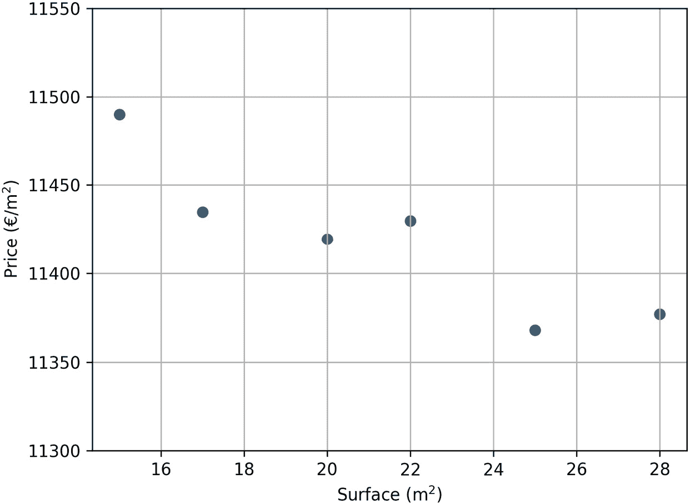

图 1.1 – 每平方米价格随公寓面积变化的图

即便这只是一个示例数据集，为了教学目的，我们可以假设这些数据是从房地产市场中收集的。

我们可以看到，随着公寓面积的增加，每平方米价格呈下降趋势。事实上，在巴黎，小面积的公寓需求更大（可能是因为有很多学生，或者因为价格更实惠）。这或许能解释为什么小面积公寓的每平方米价格实际上更高。

为了简便起见，我们将省略所有典型的机器学习工作流程。在这里，我们仅对这些数据执行线性回归，并使用以下代码显示结果：

```py
# Perform a linear regression on the data
lr = LinearRegression()
lr.fit(surface, price)
# Compute prediction
y_pred = lr.predict(surface)
# Plot data
plot_data(surface, price, y_pred, True)
```

这是输出：

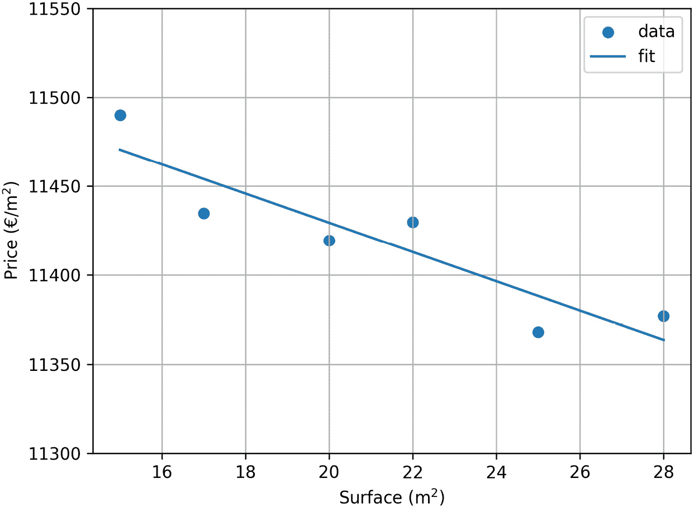

图 1.2 – 每平方米价格随公寓面积变化及拟合曲线

足够好了！拟合似乎捕捉到了下降趋势。虽然与所有给定的数据样本不完全吻合，但目前商业方面对其表示满意，因为模型的表现符合预期。

借助这个新模型，公司现在获得了更多客户。从这些客户那里，公司收集了一些新的数据，涉及较大公寓的销售，因此我们的数据集现在看起来如下：

```py
# Generate data
updated_surface = np.array([15, 17, 20, 22, 25, 28, 30, 33,
    35, 37]).reshape(-1, 1)
updated_price = 12000 - updated_surface*50 + np.square(
    updated_surface) + np.random.normal(0, 30, updated_surface.shape)
# Plot data
plot_data(updated_surface, updated_price)
```

这是它的图表：

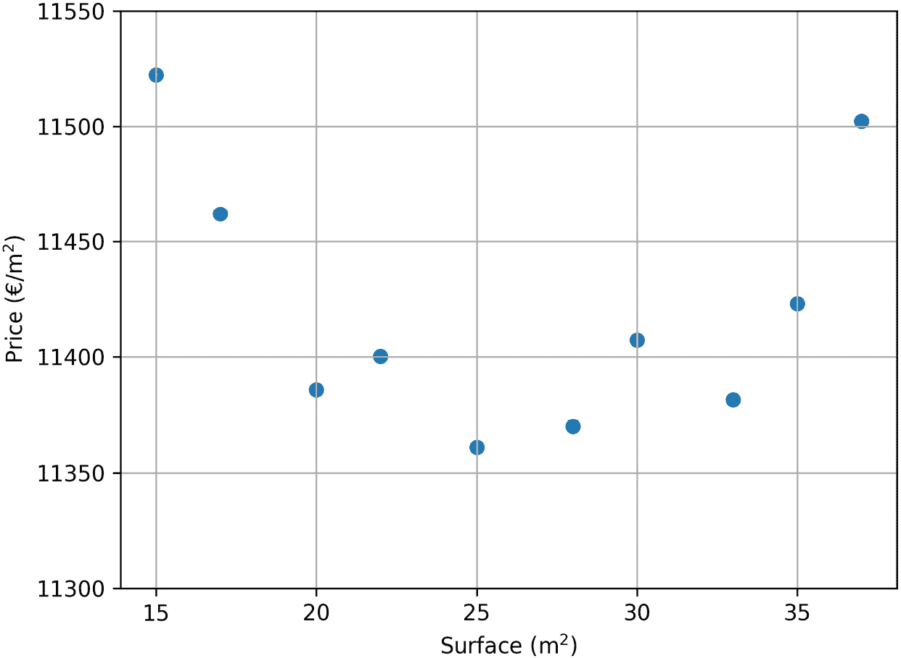

图 1.3 – 每平方米价格随公寓面积变化的更新图

这实际上改变了所有情况；这是典型的失败部署测试。现在已经没有全局的下降趋势了：随着公寓面积的增大，每平方米价格似乎跟随上升趋势。一个简单的商业解释可能是：大面积的公寓可能较为稀缺，因此价格更高。

没有信心的情况下，为了尝试，我们重新使用之前相同的方法：线性回归。结果将如下：

```py
# Perform linear regression and plot result
lr = LinearRegression()
lr.fit(updated_surface, updated_price)
y_pred_updated = lr.predict(updated_surface)
plot_data(updated_surface, updated_price, y_pred_updated, True)
```

这是图表：

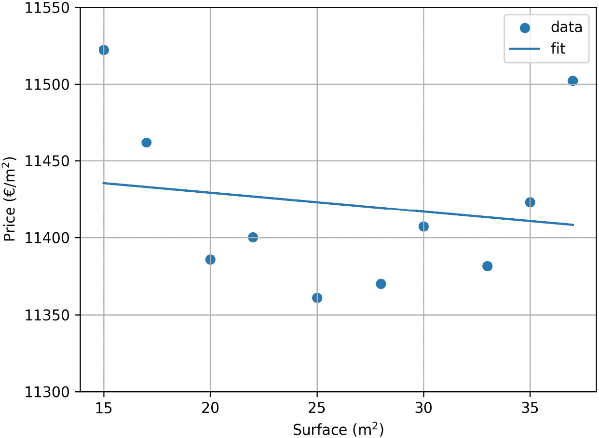

图 1.4 – 欠拟合示例：模型未能完全捕捉数据的复杂性

正如预期的那样，线性回归已无法捕捉数据的复杂性，导致了这种情况。这被称为**欠拟合**；模型未能完全捕捉数据的复杂性。事实上，仅以面积作为参数，模型能做到的最好就是一条直线，这对于这些数据来说是不够的。

线性回归捕捉更多复杂性的一个方法是提供更多特征。鉴于我们当前的输入数据仅限于表面，可能的直接方法是利用指数表面。为了这个示例，我们采取了一个相对极端的方法，添加了从`power1`到`power15`的所有特征，并使它们拟合该数据集。这可以通过以下代码轻松实现：

```py
# Compute power up to 15
x_power15 = np.concatenate([np.power(
    updated_surface, i+1) for i in range(15)], 1)
# Perform linear regression and plot result
lr = LinearRegression()
lr.fit(x_power15, updated_price)
y_pred_power15 = lr.predict(x_power15)
plot_data(updated_surface, updated_price, y_pred_power15, True)
```

这是它的输出：

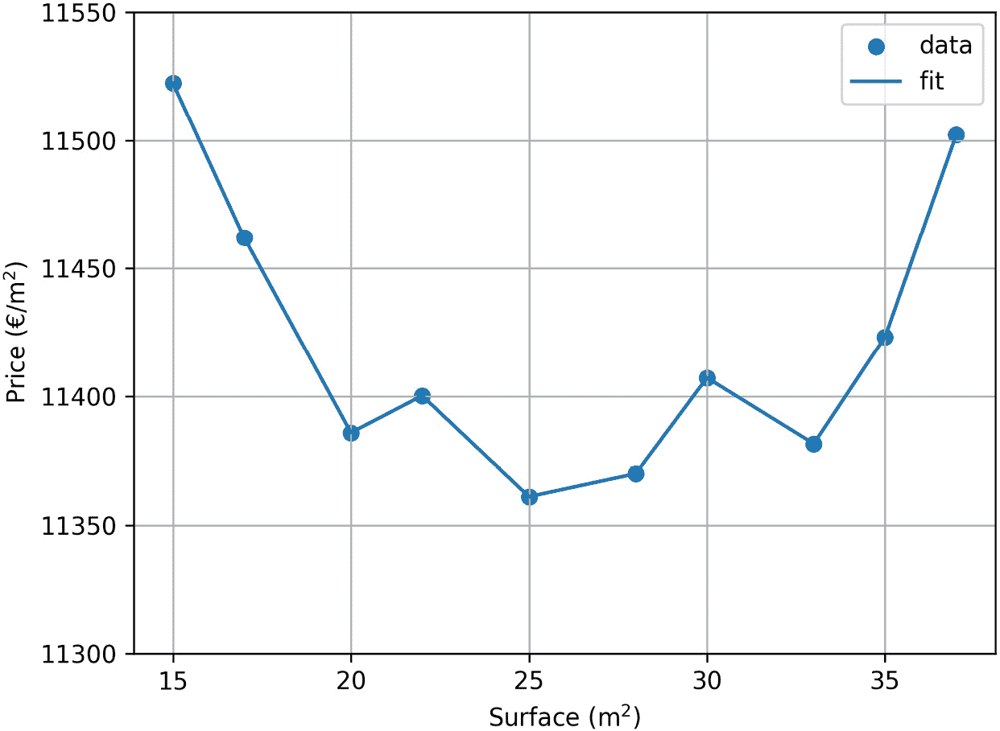

图 1.5 – 过拟合示例：模型捕捉到数据中的噪声

正如我们所预期的那样，随着在模型中添加了如此多的自由度，拟合现在正好通过所有数据点。事实上，不深入探讨数学细节，模型的参数比它训练的数据点还多，因此能够通过所有这些点。但是，这真的是一个好的拟合吗？我们可以想象，它不仅捕捉到了数据的全局趋势，还捕捉到了噪声。这被称为**过拟合**：模型过于贴近数据，可能无法对新的、未见过的数据做出正确的预测。任何新的数据点都不会在曲线上，且训练范围之外的行为完全不可预测。

最终，对于这种情况，一个更合理的方法是只取表面到 2 次方，例如：

```py
# Compute power up to 2
x_power2 = np.concatenate([np.power(
    updated_surface, i+1) for i in range(2)], 1)
# Perform linear regression and plot result
lr = LinearRegression()
lr.fit(x_power2, updated_price)
y_pred_power2 = lr.predict(x_power2)
plot_data(updated_surface, updated_price, y_pred_power2, True)
```

这是它的输出：

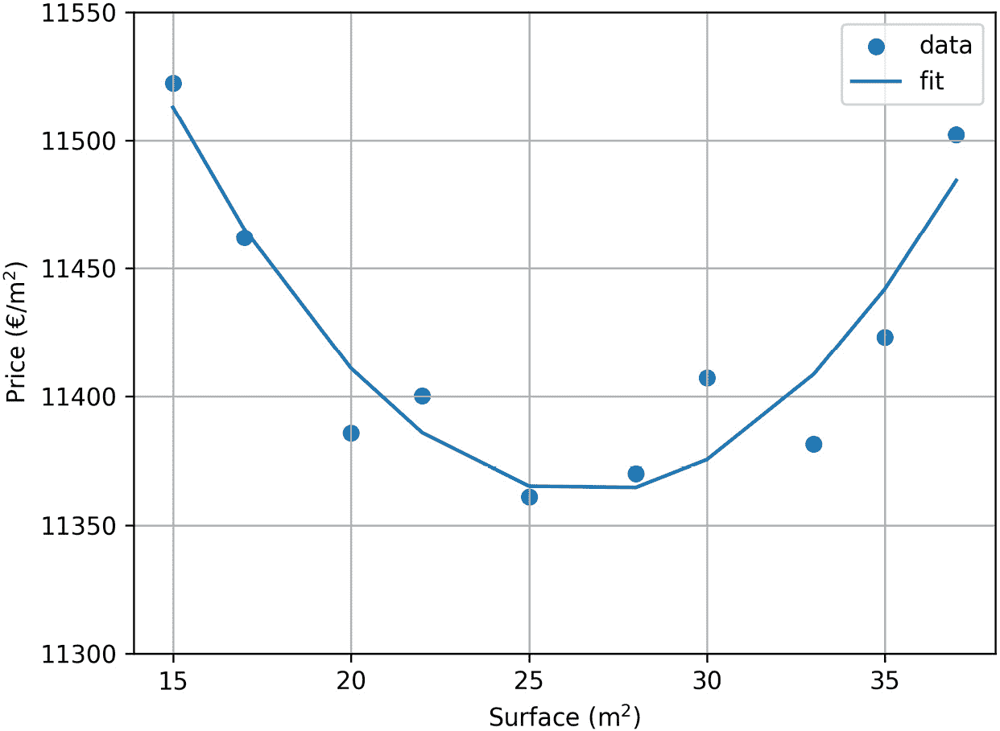

图 1.6 – 正确拟合示例：模型捕捉到整体趋势，但没有捕捉到噪声

现在，拟合看起来要更可接受了。它确实捕捉到了数据的全局趋势：最初对小表面呈下降趋势，然后对较大表面呈上升趋势。此外，它不再试图捕捉所有数据点中的噪声，使得它在预测新的、未见过的数据时更具鲁棒性。最终，超出训练范围的行为（例如，表面 < 15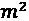 或表面 > 40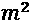）相当可预测。

这正是一个好的模型所期望的行为：既不欠拟合也不过拟合。通过移除一些指数特征，我们的模型能够更好地泛化；我们实际上对模型进行了正则化。

总结这个示例，我们在这里探讨了几个概念：

+   我们展示了欠拟合、过拟合和良好正则化模型的示例

+   通过向特征中添加指数表面，我们成功地将模型从欠拟合过渡到过拟合

+   最终，通过移除大部分指数特征（仅保留平方特征），我们成功将模型从过拟合调整为良好正则化的模型，有效地加入了正则化。

希望你现在对欠拟合、过拟合和正则化有了很好的理解，也理解了它们在机器学习中的重要性。现在我们可以基于此进一步构建，给出正则化关键概念的更正式定义。

# 正则化的关键概念

在获得了一些关于何为合适拟合的直觉，并理解了欠拟合和过拟合的例子后，让我们更精确地定义这些概念，并探讨正则化的关键概念，帮助我们更好地理解正则化。

## 偏差和方差

偏差和方差是讨论正则化时的两个关键概念。我们可以定义模型可能产生的两种主要错误：

+   **偏差**是模型在捕捉数据的整体行为方面的不足

+   **方差**是模型对小的输入数据波动的鲁棒性差的表现

这两个概念通常不是互相排斥的。如果我们从机器学习退后一步，存在一个非常常见的图示来可视化偏差和方差，假设模型的目标是击中目标的中心：

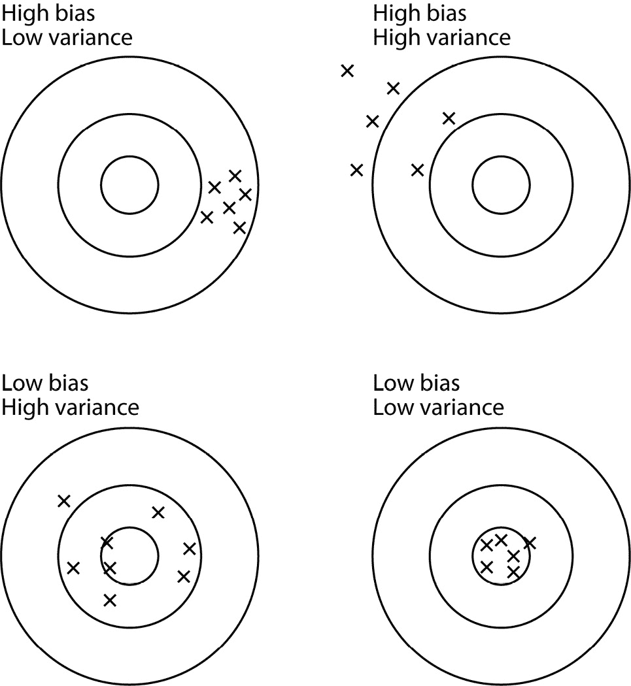

图 1.7 – 偏差和方差的可视化

让我们描述这四种情况：

+   **高偏差和低方差**：模型偏离目标中心，但方式非常一致

+   **低偏差和高方差**：模型平均上击中目标的中心，但在此过程中非常嘈杂且不一致

+   **高偏差和高方差**：模型以一种嘈杂的方式偏离中心

+   **低偏差和低方差**：两者兼得——模型稳定地击中目标中心

## 欠拟合与过拟合

我们看到了一个非常经典的偏差和方差定义方法。

但是现在，这在机器学习中意味着什么呢？它与正则化有什么关系？在我们深入探讨之前，我们首先将回顾偏差和方差在一个更典型的机器学习案例中的表现：房地产价格的线性回归。

让我们看看模型在这些情况下如何在我们的数据上表现。

### 高偏差和低方差

模型对数据波动具有鲁棒性，但无法捕捉到数据的高层次行为。请参考下图：

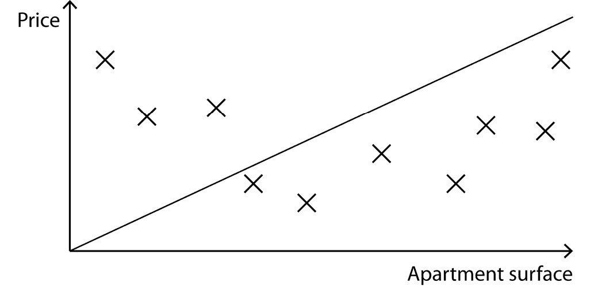

图 1.8 – 线性回归中的高偏差和低方差实践

这是*欠拟合*，正如我们之前在*图 1.4*中所遇到的那样。

### 低偏差和高方差

模型确实捕捉到了数据的全局行为，但无法保持对输入数据波动的鲁棒性。请参考下图：

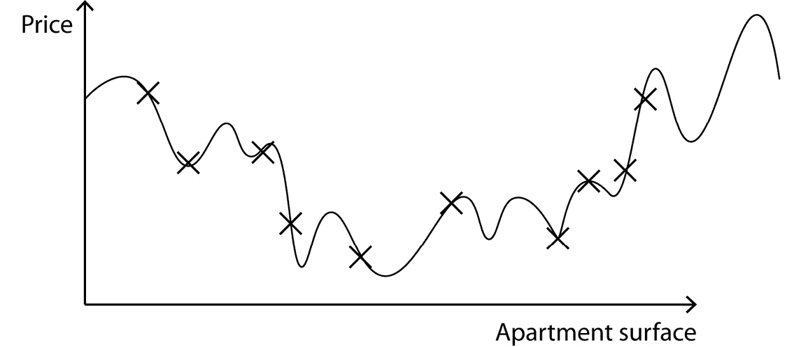

图 1.9 – 线性回归中的低偏差和高方差实践

这是*过拟合*，正如我们之前在*图 1.5*中遇到的情况。

### 高偏差和高方差

模型既无法捕捉全局行为，也不足够稳健，无法应对数据波动。这种情况通常不会发生，或者说高方差被隐藏在高偏差背后，但可能看起来像以下这样：

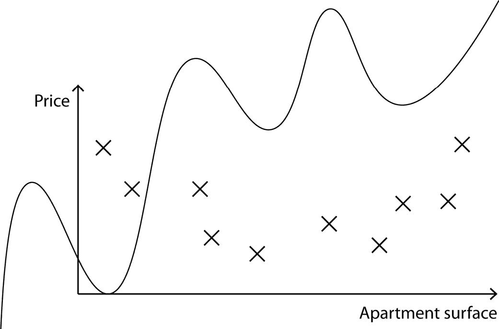

图 1.10 – 线性回归中的高偏差和高方差：这种情况在这样的数据中几乎不会发生

### 低偏差和低方差

模型能够既捕捉全局数据行为，又足够稳健以应对数据波动。这是训练模型时的最终目标。这正是我们在*图 1.6*中遇到的情况。

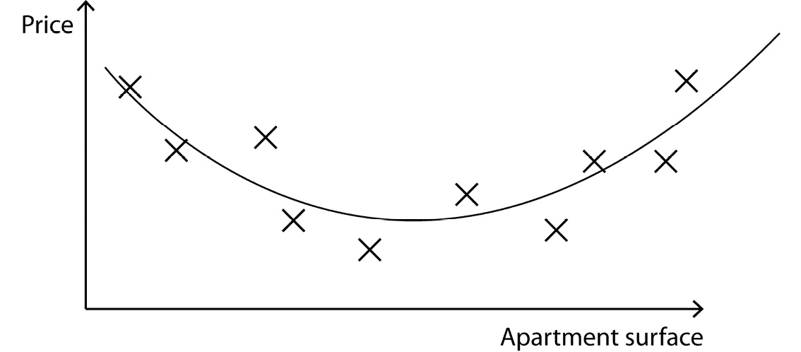

图 1.11 – 线性回归中的低偏差和低方差：最终目标

当然，目标几乎总是希望得到低偏差和低方差，即便这并不总是可能的。让我们看看正则化如何作为实现这个目标的手段。

## 正则化——从过拟合到欠拟合

通过以上这些例子，我们现在可以清楚地理解正则化的含义。

如果我们再次回顾 GPT-3 给出的定义，正则化通过向模型添加约束来防止模型过拟合。实际上，*加入正则化使我们能够降低模型的方差*，从而使模型的过拟合程度减轻。

我们可以进一步推测：如果正则化被加入到一个已经训练良好的模型中（即低偏差和低方差的模型），会怎样呢？换句话说，如果在一个表现良好的模型中添加约束，会发生什么呢？直觉上，这会降低模型的整体表现。它不会让模型完全理解数据的行为，因此会增加模型的偏差。

事实上，这里正是正则化的一个根本缺点：**加入正则化会增加** **模型偏差**。

这可以用一张图来总结：

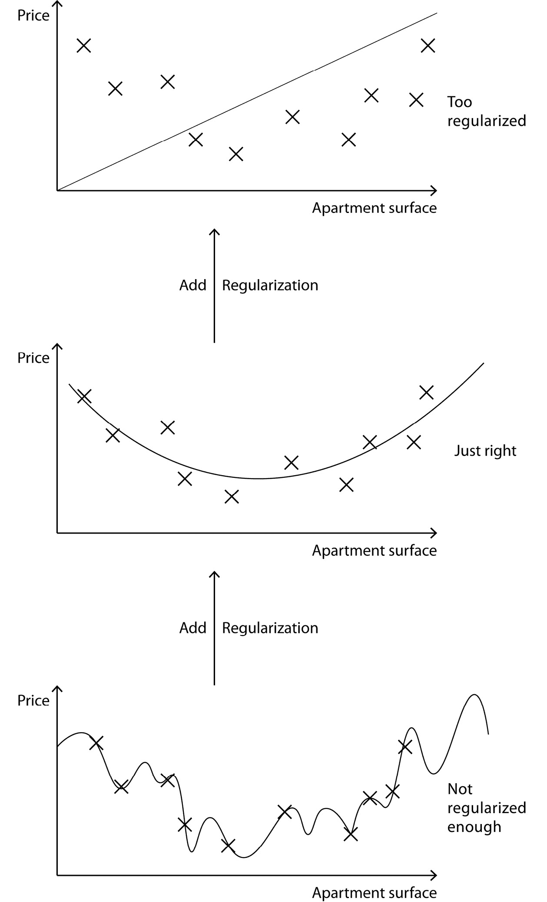

图 1.12 – 一个高方差模型（底部）；相同的模型加入更多正则化并达到适当拟合水平（中间）；同样的模型加入更多正则化，现在发生了欠拟合（顶部）

这就是所谓的**偏差-方差权衡**，一个非常重要的概念。事实上，加入正则化总是一个平衡：

+   我们需要有足够的正则化，使模型具有良好的泛化能力，并且不容易受小幅度数据波动和噪声的影响

+   我们需要避免过多的正则化，以确保模型在任何情况下都能足够自由地完全捕捉数据的复杂性

随着我们在书中的深入，更多的工具和技术将被提供来诊断我们的模型并找到合适的偏差-方差平衡。

在接下来的章节中，我们将看到许多正则化模型的方法。我们通常认为正则化就是直接向模型添加约束，但实际上有许多间接的正则化方法可以帮助模型更好地泛化。现有正则化方法的非详尽清单可能包括以下内容：

+   对模型架构添加约束

+   向模型训练中添加约束，如损失函数

+   通过不同的工程方法对输入数据添加约束

+   通过生成更多样本来增加输入的约束

可能会提出其他正则化方法，但本书将主要关注适用于各种情况的方法，比如结构化和非结构化数据、线性模型、基于树的模型、深度学习模型、**自然语言处理**（**NLP**）问题和计算机视觉问题。

即使模型采用了正确的正则化方法，许多任务对模型可以实现的表现仍有一个硬性上限：这就是我们所说的**不可避免的偏差**。让我们来看看它是什么。

## 不可避免的偏差

在几乎所有任务中，都有不可避免的偏差。例如，在*图 1.13*中，既有设得兰牧羊犬，也有粗毛牧羊犬。你能以 100%的准确度说出哪一只是哪一只吗？

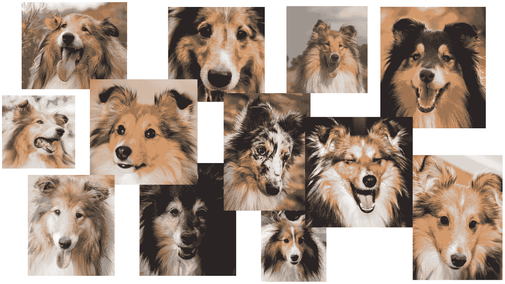

图 1.13 – 设得兰牧羊犬和粗毛牧羊犬的随机图片

从前面的图中，你能分辨出哪一只是哪一只吗？大概率是不能的。如果你是一个经过训练的犬类专家，你可能会有更低的错误率。但即便如此，给定足够数量的图片，你也可能会在某些图片上出错。专家能够达到的最低错误率被称为**人类水平错误**。在大多数情况下，人类水平错误能很好地反映出模型可能达到的最低错误。每当你在评估一个模型时，了解（或思考）人类在这种任务中的表现是一个很好的思路。

事实上，有些任务比其他任务容易得多：

+   人类在分类狗和猫方面表现得很好，AI 也是如此

+   人类在分类歌曲方面表现得很好，AI 也是如此

+   人类在招聘人员方面表现得相当差（至少，并不是所有招聘人员都会就候选人达成一致），AI 也是如此

计算不可避免的偏差的另一个可能来源是贝叶斯误差。贝叶斯误差通常在复杂的 AI 任务中无法计算，它是分类器可以达到的最低错误率。大多数时候，贝叶斯误差低于人类水平误差，但估算起来要困难得多。这将是任何模型性能的实际理论限制。

贝叶斯误差和人类级别的误差是不可避免的偏差。它们表示任何模型的不可减少误差，是评估模型是否需要更多或更少正则化的关键概念。

## 偏差与方差的诊断

我们通常使用一些数据上的拟合图来定义偏差和方差，就像我们之前在公寓价格数据中做的那样。虽然这些图有助于解释概念，但在现实生活中，我们通常处理的是高维数据集。通过使用简单的 Titanic 数据集，我们提供了十几个特征，因此进行这种视觉检查几乎是不可能的。

假设我们正在训练一个猫狗分类模型，并且数据是平衡的。一种好的方法是比较训练集和验证集上的评估指标（无论是准确率、F 分数，或是任何你认为相关的指标）。

注意

如果评估指标或训练集与验证集的概念不清楚，它们将在*第二章*中有更详细的解释。简而言之，模型是在训练集上进行训练的。评估指标是用来评估训练好的模型的值，并且是在训练集和验证集上计算的。

例如，假设我们得到以下结果：

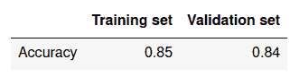

图 1.14 – 假设在训练集和验证集上的准确性

如果我们考虑到这类任务的预期人类级别错误，我们会预期更高的准确性。事实上，大多数人能够非常自信地从猫和狗中辨认出狗。

在这种情况下，训练集和验证集的表现远低于人类级别的错误率。这是典型的**高偏差**情形：评估指标在训练集和验证集上都很差。在这种情况下，模型需要更少的正则化。

现在假设在添加了较低的正则化（可能像我们在*正则化直觉*一节中所做的那样，添加了指数特征）之后，我们得到了以下结果：

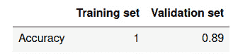

图 1.15 – 添加更多特征后的假设准确性

这些结果更好；验证集现在的准确率为 89%。然而，这里有两个问题：

+   训练集上的得分好得过头了：它简直是完美的

+   验证集上的得分仍然远低于我们预期的至少 95% 的人类错误率

这是典型的**高方差**情形：在训练集上的结果非常好（通常过好），而在验证集上则远低于预期。在这种情况下，模型需要更多的正则化。

添加正则化后，假设我们现在得到了以下结果：

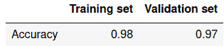

图 1.16 – 添加正则化后的假设准确性

这看起来好多了：训练集和验证集的准确度似乎接近人类水平的表现。也许通过更多的数据、一个更好的模型或其他改进，结果可以稍微提升一些，但总体来看，这似乎是一个稳固的结果。

在大多数情况下，诊断高偏差和高方差是很简单的，方法始终是相同的：

1.  在训练集和验证集上评估你的模型。

1.  将结果相互比较，并与人类水平的误差率进行对比。

从这一点来看，通常有三种情况：

+   **高偏差/欠拟合**：训练集和验证集的表现都很差

+   **高方差/过拟合**：训练集表现远好于验证集表现；验证集表现远低于人类水平的误差率

+   **良好的拟合**：训练集和验证集的表现接近人类水平的误差率

注意

大多数时候，建议在训练集和测试集上使用该技术，而不是训练集和验证集。尽管这一推理是成立的，但直接在测试集上进行优化可能会导致过拟合，从而高估模型的实际表现。然而，在本书中，我们将简化处理，接下来的章节将使用测试集。

记住所有正则化的关键概念后，你现在可能开始理解为什么正则化确实可能需要一本书来讲解。虽然诊断出正则化的需求通常相对简单，但选择合适的正则化方法却可能非常具有挑战性。接下来，让我们对本书中将要讨论的正则化方法进行分类。

# 正则化——一个多维度的问题

对模型进行正确的诊断至关重要，因为它使我们能够更仔细地选择策略来改进模型。但是，从任何诊断出发，都有许多途径可以改进模型。这些途径可以分为三大类，正如下图所示：

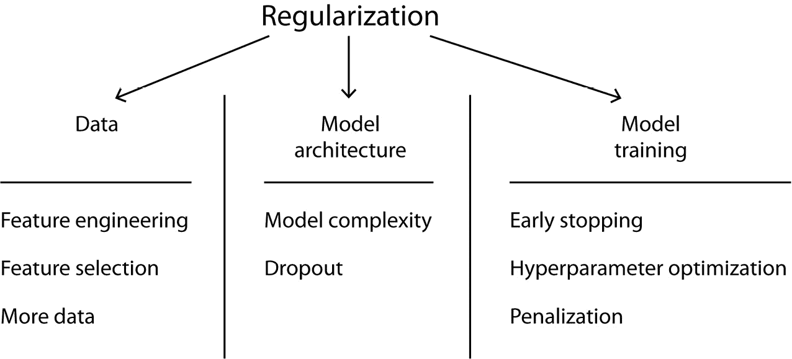

图 1.17 – 提出的正则化类型分类：数据、模型架构和模型训练

在数据层面，我们可能会使用以下工具进行正则化：

+   添加更多数据，无论是合成数据还是真实数据

+   添加更多特征

+   特征工程

+   数据预处理

实际上，数据在机器学习中极为重要，正则化也不例外。在本书中，我们将看到许多正则化数据的例子。

在模型层面，可以使用以下方法进行正则化：

+   选择更简单或更复杂的架构

+   在深度学习中，许多架构设计允许正则化（例如，Dropout）

模型复杂度可能对正则化产生很大影响。过于复杂的架构很容易导致过拟合，而过于简单的架构则可能导致欠拟合，正如下图所示：

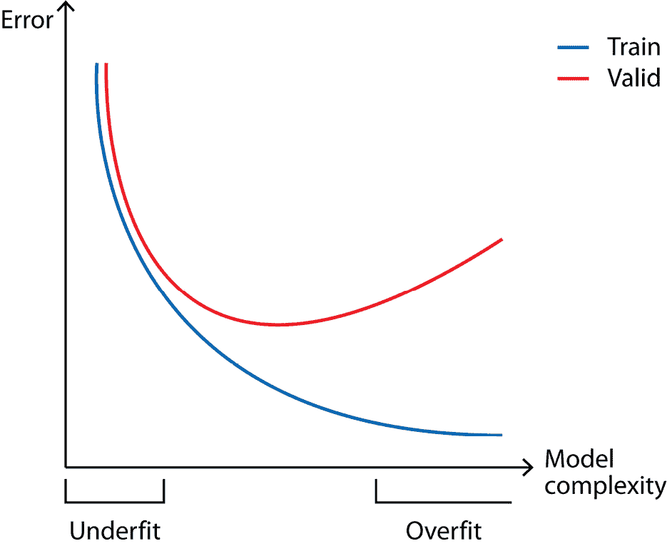

图 1.18 – 模型复杂度与训练集和验证集误差之间关系的可视化示意图

最后，在训练层面，一些正则化的方法如下：

+   添加惩罚项

+   权重初始化

+   转移学习

+   提前停止

提前停止是一种非常常见的防止过拟合的方法，通过防止模型过度贴合训练集来避免过拟合。

正则化的方法可能有很多，因为这是一个多维度的问题：数据、模型架构和模型训练仅仅是高层次的分类。即使这些分类只是一些例子，且可能还存在或定义更多的分类，但本书将要涵盖的大多数——如果不是所有——技术都会属于这些分类中的某一类。

# 总结

我们通过几个实际案例开始本章，展示了在生产环境中，正则化是机器学习成功的关键。结合其他一些方法和最佳实践，稳健的正则化模型是生产中不可或缺的。在生产环境中，未见过的数据和极端情况将定期出现，因此，任何部署的模型都必须能接受这些情况的响应。

接着，我们讲解了一些正则化的关键概念。过拟合和欠拟合是机器学习中的两个常见问题，且与偏差和方差有一定关系。实际上，过拟合的模型具有高方差，而欠拟合的模型具有高偏差。因此，为了表现良好，模型需要具有低偏差和低方差。我们解释了无论一个模型多么优秀，不可避免的偏差都限制了它的性能。这些关键概念使我们提出了一种方法，通过训练集和验证集的表现，以及人类水平的误差估计，来诊断偏差和方差。

这让我们了解了正则化的定义：正则化是为模型添加约束，使其能够很好地泛化到新数据，并且不会对小数据波动过于敏感。正则化是将过拟合模型转化为稳健模型的一个重要工具。然而，由于偏差-方差权衡，我们不能过度正则化，以免得到一个欠拟合的模型。

最后，我们将本书将要涵盖的不同正则化方法进行了分类。它们主要分为三类：数据、模型架构和模型训练。

本章并未包括任何实用技巧，而是建立了理解本书其余内容所需的基础知识，但接下来的章节将包括实用技巧，并将更多聚焦于解决方案。
