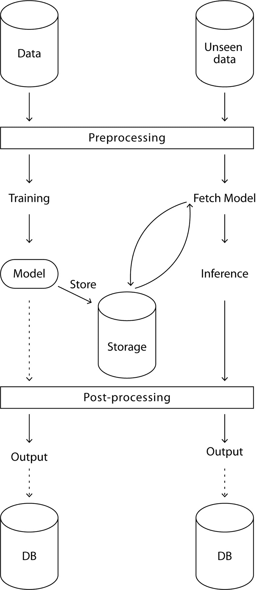

# 第二章：机器学习复习

**机器学习**（**ML**）远不止是模型。它是关于遵循某种过程和最佳实践。本章将为这些内容提供复习：从加载数据、模型评估到模型训练和优化，主要的步骤和方法将在这里解释。

在本章中，我们将涵盖以下主要主题：

+   数据加载

+   数据拆分

+   准备定量数据

+   准备定性数据

+   训练模型

+   评估模型

+   执行超参数优化

尽管本章中的各个教程在方法论上是独立的，但它们是相互衔接的，旨在按顺序执行。

# 技术要求

在本章中，你需要能够运行代码来加载数据集、准备数据、训练、优化和评估机器学习模型。为此，你将需要以下库：

+   **numpy**

+   **pandas**

+   **scikit-learn**

它们可以使用`pip`和以下命令行安装：

```py
pip install numpy pandas scikit-learn
```

注意

在本书中，一些最佳实践，如使用虚拟环境，将不会明确提及。然而，强烈建议在使用`pip`或其他包管理器安装任何库之前，先使用虚拟环境。

# 数据加载

本教程的主要内容是从 CSV 文件加载数据。然而，这并不是本教程的唯一内容。由于数据通常是任何机器学习项目的第一步，因此这个教程也是快速回顾机器学习工作流和不同类型数据的好机会。

## 准备工作

在加载数据之前，我们应记住，机器学习模型遵循一个两步过程：

1.  在给定的数据集上训练模型，以创建一个新模型。

1.  重用先前训练的模型，对新数据进行推理预测。

这两步在以下图示中总结：


图 2.1 – 两步机器学习过程的简化视图

当然，在大多数情况下，这是一个相当简化的视图。更详细的视图可以参见图 2.2：



图 2.2 – 更完整的机器学习过程视图

让我们更仔细地看看机器学习过程中的训练部分，见*图 2.2*：

1.  首先，从数据源（如数据库、数据湖、开放数据集等）查询训练数据。

1.  数据被预处理，例如通过特征工程、重缩放等。

1.  训练并存储模型（存储在数据湖、本地、边缘等位置）。

1.  可选地，模型的输出会进行后处理，例如通过格式化、启发式方法、业务规则等。

1.  可选地，这个模型（无论是否进行后处理）会被存储在数据库中，以便在需要时进行后续参考或评估。

现在，让我们看看机器学习过程中的推理部分：

1.  数据从数据源（数据库、API 查询等）中查询。

1.  数据经过与训练数据相同的预处理步骤。

1.  如果训练好的模型不存在本地，会从远程获取模型。

1.  使用该模型推断输出。

1.  可选地，模型的输出通过与训练数据相同的后处理步骤进行后处理。

1.  可选地，输出存储在数据库中，以供监控和后续参考。

即使在这个架构中，许多步骤也未被提及：数据划分用于训练、使用评估指标、交叉验证、超参数优化等。本章将深入探讨更具体的训练步骤，并将其应用于非常常见但实用的泰坦尼克号数据集，这是一个二分类问题。但首先，我们需要加载数据。

为此，你必须将 **泰坦尼克号数据集训练集** 下载到本地。可以通过以下命令行执行此操作：

```py
wget https://github.com/PacktPublishing/The-Regularization-Cookbook/blob/main/chapter_02/train.csv
```

## 如何做到……

这个配方是关于加载一个 CSV 文件并显示几行代码，以便我们可以初步了解它的内容：

1.  第一步是导入所需的库。在这里，我们唯一需要的库是 pandas：

    ```py
    import pandas as pd
    ```

1.  现在，我们可以使用 pandas 提供的 `read_csv` 函数加载数据。第一个参数是文件的路径。假设文件名为 `train.csv`，并位于当前文件夹中，我们只需要提供 `train.csv` 作为参数：

    ```py
    # Load the data as a DataFrame
    
    df = pd.read_csv('train.csv')
    ```

返回的对象是一个 `dataframe` 对象，它提供了许多用于数据处理的有用方法。

1.  现在，我们可以使用 `.head()` 方法显示加载文件的前五行：

    ```py
    # Display the first 5 rows of the dataset
    
    df.head()
    ```

该代码将输出以下内容：

```py
   PassengerId  Survived  Pclass  \
0        1            0         3
1        2            1         1
2        3            1         3
3        4            1         1
4        5            0         3
      Name                      Sex   Age     SibSp  \
0   Braund, Mr. Owen Harris     male  22.0       1
1  Cumings, Mrs. John Bradley (Florence Briggs Th...
                               female  38.0        1
2  Heikkinen, Miss. Laina  female  26.0        0
3  Futrelle, Mrs. Jacques Heath (Lily May Peel)
                            female  35.0        1
4  Allen, Mr. William Henry     male  35.0        0
 Parch      Ticket   Fare   Cabin        Embarked
0  0         A/5   21171   7.2500   NaN           S
1  0       PC 17599  71.2833   C85       C
2  0      STON/O2\. 3101282   7.9250   NaN       S
3  0        113803  53.1000  C123           S
4  0        373450   8.0500   NaN    S
```

这里是每一列数据类型的描述：

+   `PassengerId`（定性）：每个乘客的唯一任意 ID。

+   `Survived`（定性）：1 表示是，0 表示否。这是我们的标签，因此这是一个二分类问题。

+   `Pclass`（定量，离散）：乘客的舱位，通常是定量的。舱位 1 是否比舱位 2 更好？很可能是的。

+   `Name`（非结构化）：乘客的姓名和头衔。

+   `Sex`（定性）：乘客的注册性别，可以是男性或女性。

+   `Age`（定量，离散）：乘客的年龄。

+   `SibSp`（定量，离散）：船上兄弟姐妹和配偶的数量。

+   `Parch`（定量，离散）：船上父母和子女的数量。

+   `Ticket`（非结构化）：票务参考。

+   `Fare`（定量，连续）：票价。

+   `Cabin`（非结构化）：舱位号，可以说是非结构化的。它可以看作是一个具有高基数的定性特征。

+   `Embarked`（定性）：登船城市，可以是南安普顿（`S`）、瑟堡（`C`）或皇后镇（`Q`）。

## 还有更多内容……

让我们来谈谈可用的不同数据类型。数据是一个非常通用的词，可以描述很多东西。我们总是被数据包围。指定数据的一种方式是使用对立面。

数据可以是 *结构化* 或 *非结构化*：

+   结构化数据以表格、数据库、Excel 文件、CSV 文件和 JSON 文件的形式存在。

+   非结构化数据不适合表格形式：它可以是文本、声音、图像、视频等。即使我们倾向于使用表格形式表示，这类数据也不自然适合放入 Excel 表格中。

数据可以是*定量的*或*定性的*。

定量数据是有序的。以下是一些例子：

+   €100 比 €10 大

+   1.8 米比 1.6 米更高

+   18 岁比 80 岁年轻

定性数据没有固有的顺序，如下所示：

+   蓝色并不天生优于红色

+   一只狗并不天生比一只猫更优秀

+   一个厨房并不天生比一个浴室更有用

这些特征并非互相排斥。一个对象可以同时具有定量和定性特征，如下图所示的汽车案例：


图 2.3 – 一个对象的定量（左）和定性（右）特征表示

最后，数据可以是*连续的*或*离散的*。

一些数据是连续的，如下所示：

+   一个体重

+   一个体积

+   一个价格

另一方面，一些数据是离散的：

+   一种颜色

+   一个足球得分

+   一个国籍

注意

离散数据 ≠ 定性数据。

例如，足球得分是离散的，但存在固有的顺序：3 分大于 2 分。

## 另见

pandas 的 `read_csv` 函数非常灵活，能够使用其他分隔符、处理标题等更多功能。这些都在官方文档中有所描述：[`pandas.pydata.org/docs/reference/api/pandas.read_csv.xhtml`](https://pandas.pydata.org/docs/reference/api/pandas.read_csv.xhtml)。

pandas 库允许执行具有不同输入类型的 I/O 操作。欲了解更多信息，请查看官方文档：[`pandas.pydata.org/docs/reference/io.xhtml`](https://pandas.pydata.org/docs/reference/io.xhtml)。

# 分割数据

加载数据后，分割数据是一个关键步骤。本食谱将解释为什么我们需要分割数据，以及如何进行分割。

## 准备中

为什么我们需要分割数据？一个机器学习模型就像一个学生。

你给学生提供许多讲座和练习，带或不带答案。但通常，学生们会在一个全新的问题上进行评估。为了确保他们完全理解概念和方法，他们不仅学习练习和解决方案——还要理解其背后的概念。

一个机器学习模型也是一样：你在训练数据上训练模型，然后在测试数据上评估它。通过这种方式，你可以确保模型充分理解任务，并且能够很好地推广到新的、未见过的数据。

因此，数据集通常会被分割成*训练集*和*测试集*：

+   训练集必须尽可能大，以便为模型提供尽可能多的样本

+   测试集必须足够大，以便在评估模型时具有统计意义

对于较小的数据集（例如，几百个样本），常见的划分比例为 80% 对 20%；对于非常大的数据集（例如，数百万个样本），比例通常为 99% 对 1%。

在本章节的这个示例和其他示例中，假设代码是在与前一个示例相同的笔记本中执行的，因为每个示例都会重复使用前一个示例中的代码。

## 如何操作…

以下是尝试此示例的步骤：

1.  你可以使用 scikit-learn 和 `train_test_split()` 函数相对容易地划分数据：

    ```py
    # Import the train_test_split function
    
    from sklearn.model_selection import train_test_split
    
    # Split the data
    
    X_train, X_test, y_train, y_test = train_test_split(
    
        df.drop(columns=['Survived']), df['Survived'],
    
        test_size=0.2, stratify=df['Survived'],
    
        random_state=0)
    ```

该函数使用以下参数作为输入：

+   `X`：除了 `'Survived'` 标签列之外的所有列

+   `y`：`'Survived'` 标签列

+   `test_size`：这是 `0.2`，意味着训练集的比例为 80%。

+   `stratify`：此参数指定 `'Survived'` 列，以确保在两个数据集划分中标签的平衡性相同。

+   `random_state`：`0` 是任何整数值，用于确保结果的可复现性。

它返回以下输出：

+   `X_train`：`X` 的训练集。

+   `X_test`：`X` 的测试集。

+   `y_train`：与 `X_train` 相关的 `y` 的训练集。

+   `y_test`：与 `X_test` 相关的 `y` 的测试集。

注意

`stratify` 选项不是强制性的，但对于确保任何定性特征（不仅仅是标签）的平衡划分非常关键，特别是对于不平衡数据的情况。

数据划分应尽早进行，以避免潜在的数据泄漏。从现在起，所有预处理步骤都会在训练集上计算，然后应用到测试集，这与 *图 2.2* 的做法一致。

## 另见

查看 `train_test_split` 函数的官方文档：[`scikit-learn.org/stable/modules/generated/sklearn.model_selection.train_test_split.xhtml`](https://scikit-learn.org/stable/modules/generated/sklearn.model_selection.train_test_split.xhtml)。

# 准备定量数据

根据数据类型，特征的准备方式可能会有所不同。在本例中，我们将讨论如何准备定量数据，包括缺失数据填补和重新缩放。

## 准备工作

在 Titanic 数据集中，和其他任何数据集一样，可能存在缺失数据。处理缺失数据的方法有很多种。例如，可以删除某一列或某一行，或者进行数据填补。填补方法有很多种，其中一些更复杂或者更简单。scikit-learn 提供了几种填补器的实现，例如 `SimpleImputer` 和 `KNNImputer`。

如我们在这个示例中所见，使用 `SimpleImputer`，我们可以用均值来填补缺失的定量数据。

一旦缺失数据得到处理，我们就可以通过重新缩放数据来准备定量数据，使得所有数据都在相同的尺度上。

有几种重新缩放策略，例如最小-最大缩放、鲁棒缩放、标准缩放等。

在本教程中，我们将使用**标准缩放**。因此，对于每个特征，我们将减去该特征的均值，然后除以该特征的标准差：


幸运的是，scikit-learn 通过`StandardScaler`提供了一个完整的实现。

## 如何操作……

在本教程中，我们将依次处理缺失值并重新缩放数据：

1.  导入所需的类——`SimpleImputer`用于缺失数据插补，`StandardScaler`用于重新缩放：

    ```py
    from sklearn.impute import SimpleImputer
    
    from sklearn.preprocessing import StandardScaler
    ```

1.  选择我们要保留的定量特征。在这里，我们将保留`'Pclass'`、`'Age'`、`'Fare'`、`'SibSp'`和`'Parch'`，并将这些特征存储在训练集和测试集的新变量中：

    ```py
    quanti_columns = ['Pclass', 'Age', 'Fare', 'SibSp', 'Parch']
    
    # Get the quantitative columns
    
    X_train_quanti = X_train[quanti_columns]
    
    X_test_quanti = X_test[quanti_columns]
    ```

1.  使用均值策略实例化简单填充器。在这里，特征的缺失值将被该特征的均值替代：

    ```py
    # Impute missing quantitative values with mean feature value
    
    quanti_imputer = SimpleImputer(strategy='mean')
    ```

1.  在训练集上拟合填充器，并将其应用于测试集，这样可以避免在插补中出现数据泄漏：

    ```py
    # Fit and impute the training set
    
    X_train_quanti = quanti_imputer.fit_transform(X_train_quanti)
    
    # Just impute the test set
    
    X_test_quanti = quanti_imputer.transform(X_test_quanti)
    ```

1.  现在插补已经完成，实例化`scaler`对象：

    ```py
    # Instantiate the standard scaler
    
    scaler = StandardScaler()
    ```

1.  最后，拟合并应用标准缩放器到训练集，然后将其应用于测试集：

    ```py
    # Fit and transform the training set
    
    X_train_quanti = scaler.fit_transform(X_train_quanti)
    
    # Just transform the test set
    
    X_test_quanti = scaler.transform(X_test_quanti)
    ```

现在我们有了没有缺失值、完全缩放的定量数据，且没有数据泄漏。

## 还有更多……

在本教程中，我们使用了简单填充器，假设存在缺失数据。在实际应用中，强烈建议你首先查看数据，检查是否存在缺失值以及缺失的数量。你可以使用以下代码片段查看每列的缺失值数量：

```py
# Display the number of missing data for each column
X_train[quanti_columns].isna().sum()
```

这将输出如下结果：

```py
Pclass        0
Age         146
Fare           0
SibSp         0
Parch         0
```

通过这样做，我们知道`Age`特征有`146`个缺失值，而其他特征没有缺失数据。

## 另见

scikit-learn 中有几种可用的填充器。完整列表请见这里：[`scikit-learn.org/stable/modules/classes.xhtml#module-sklearn.impute`](https://scikit-learn.org/stable/modules/classes.xhtml#module-sklearn.impute)。

数据缩放有很多方法，你可以在 scikit-learn 中找到可用的方法，详见：[`scikit-learn.org/stable/modules/classes.xhtml#module-sklearn.preprocessing`](https://scikit-learn.org/stable/modules/classes.xhtml#module-sklearn.preprocessing)。

你可能会对以下内容感兴趣，这是一个关于不同缩放器在给定数据上效果对比的展示：[`scikit-learn.org/stable/auto_examples/preprocessing/plot_all_scaling.xhtml#sphx-glr-auto-examples-preprocessing-plot-all-scaling-py`](https://scikit-learn.org/stable/auto_examples/preprocessing/plot_all_scaling.xhtml#sphx-glr-auto-examples-preprocessing-plot-all-scaling-py)。

# 准备定性数据

在本教程中，我们将准备定性数据，包括缺失值插补和编码。

## 准备工作

定性数据需要与定量数据不同的处理方式。使用特征的均值填补缺失值是没有意义的（并且对非数值数据不起作用）：例如，使用最频繁的值或特征的众数来填补缺失值更为合理。`SimpleImputer`类允许我们进行这种操作。

重缩放同样适用：对定性数据进行重缩放没有意义。相反，更常见的是对其进行编码。最典型的技术之一叫做**独热编码**。

其思想是将每个类别在总共可能的*N*个类别中转换为一个向量，其中包含一个 1 和 N-1 个零。在我们的例子中，`Embarked`特征的独热编码如下：

+   *‘C’ = [1, 0, 0]*

+   *‘Q’ = [0, 1, 0]*

+   *‘S’ = [0, 0, 1]*

注

对于*N*个类别使用*N*列并不一定是最优的。如果在前面的例子中我们去掉第一列会发生什么？如果值既不是*‘Q’ = [1, 0]*也不是*‘S’ = [0, 1]*，那么它必须是*‘C’ = [0, 0]*。没有必要再增加一列来获取所有必要的信息。这可以推广到*N*个类别，只需要*N*-1 列就能包含所有信息，这也是为什么独热编码函数通常允许你丢弃一列。

`sklearn`类的`OneHotEncoder`允许我们实现这一点。它还允许我们使用几种策略处理可能出现在测试集（或生产环境）中的未知类别，如错误、忽略或低频类别。最后，它允许我们在编码后丢弃第一列。

## 如何操作……

就像在前面的食谱中一样，我们将处理任何缺失的数据，并且特征将进行独热编码：

1.  导入必要的类——用于缺失数据填补的`SimpleImputer`（在前面的食谱中已导入）和用于编码的`OneHotEncoder`。我们还需要导入`numpy`，以便我们可以在本食谱结束时将已准备好的定性和定量数据拼接在一起：

    ```py
    import numpy as np
    
    from sklearn.impute import SimpleImputer
    
    from sklearn.preprocessing import OneHotEncoder
    ```

1.  选择我们要保留的定性特征：`'Sex'`和`'Embarked'`。然后，将这些特征分别存储到训练集和测试集中的新变量中：

    ```py
    quali_columns = ['Sex', 'Embarked']
    
    # Get the quantitative columns
    
    X_train_quali = X_train[quali_columns]
    
    X_test_quali = X_test[quali_columns]
    ```

1.  使用`SimpleImputer`并选择`most_frequent strategy`。任何缺失的值将被最频繁的值替代：

    ```py
    # Impute missing qualitative values with most frequent feature value
    
    quali_imputer =SimpleImputer(strategy='most_frequent')
    ```

1.  在训练集上拟合并转换填补器，然后在测试集上进行转换：

    ```py
    # Fit and impute the training set
    
    X_train_quali = quali_imputer.fit_transform(X_train_quali)
    
    # Just impute the test set
    
    X_test_quali = quali_imputer.transform(X_test_quali)
    ```

1.  实例化编码器。在这里，我们将指定以下参数：

    +   `drop='first'`：这将删除编码后的第一列

    +   `handle_unknown='ignore'`：如果在测试集（或生产环境）中出现新值，它将被编码为零：

        ```py
        # Instantiate the encoder
        ```

        ```py
        encoder=OneHotEncoder(drop='first', handle_unknown='ignore')
        ```

1.  在训练集上拟合并转换编码器，然后使用此编码器在测试集上进行转换：

    ```py
    # Fit and transform the training set
    
    X_train_quali = encoder.fit_transform(X_train_quali).toarray()
    
    # Just encode the test set
    
    X_test_quali = encoder.transform(X_test_quali).toarray()
    ```

注

我们需要使用`.toarray()`从编码器中提取数据，因为默认情况下数组是稀疏矩阵对象，不能以这种形式与其他特征进行拼接。

1.  这样，所有数据都已经准备好——包括定量数据和定性数据（考虑到本教程和之前的教程）。现在可以在训练模型之前将这些数据连接起来：

    ```py
    # Concatenate the data back together
    
    X_train = np.concatenate([X_train_quanti,
    
        X_train_quali], axis=1)
    
    X_test = np.concatenate([X_test_quanti, X_test_quali], axis=1)
    ```

## 还有更多…

可以将数据保存为 pickle 文件，既可以分享它，也可以保存它以避免重新准备数据。以下代码将允许我们这样做：

```py
import pickle
pickle.dump((X_train, X_test, y_train, y_test),
    open('prepared_titanic.pkl', 'wb'))
```

我们现在拥有完全准备好的数据，可以用于训练机器学习模型。

注意

这里省略或简化了一些步骤以便更加清晰。数据可能需要更多的准备工作，例如更彻底的缺失值填补、异常值和重复值检测（以及可能的删除）、特征工程等。假设你已经对这些方面有一定了解，并鼓励你在需要时阅读其他相关资料。

## 另请参见

这份关于缺失数据填补的更通用文档值得一看：[`scikit-learn.org/stable/modules/impute.xhtml`](https://scikit-learn.org/stable/modules/impute.xhtml)。

最后，这份关于数据预处理的更通用文档非常有用：[`scikit-learn.org/stable/modules/preprocessing.xhtml`](https://scikit-learn.org/stable/modules/preprocessing.xhtml)。

# 训练模型

一旦数据完全清洗和准备好，通过 scikit-learn 训练模型就相对容易了。在这份教程中，在对 Titanic 数据集训练逻辑回归模型之前，我们将快速回顾机器学习的范式和我们可以使用的不同类型的机器学习。

## 准备工作

如果有人问你如何区分汽车和卡车，你可能会倾向于提供一系列规则，比如轮子数量、大小、重量等等。通过这样做，你就能提供一套显式的规则，让任何人都能将汽车和卡车区分开来。

传统编程并没有那么不同。在开发算法时，程序员通常会构建显式规则，从而使他们能够将数据输入（例如，一辆车）映射到答案（例如，一辆汽车）。我们可以将这种范式总结为*数据 + 规则 =* *答案*。

如果我们要训练一个机器学习模型来区分汽车和卡车，我们会使用另一种策略：我们会将大量数据及其相关答案输入机器学习算法，期望模型能够自我学习并纠正规则。这是一种不同的方法，可以总结为*数据 + 答案 = 规则*。这种范式的差异总结在*图 2.4*中。尽管它对机器学习从业者看起来可能微不足道，但在正则化方面，它改变了一切：


图 2.4 – 比较传统编程与机器学习算法

对传统算法进行正则化在概念上是直接的。例如，如果定义卡车的规则与公共汽车的定义重叠该怎么办？如果是这样，我们可以增加“公共汽车有很多窗户”这一事实。

机器学习中的正则化本质上是隐式的。如果在这种情况下模型无法区分公交车和卡车怎么办？

+   我们应该增加更多数据吗？

+   模型是否足够复杂，以捕捉这种差异？

+   是欠拟合还是过拟合？

机器学习的这一基本特性使得正则化变得复杂。

机器学习可以应用于许多任务。任何使用机器学习的人都知道，机器学习模型不仅仅有一种类型。

可以说，大多数机器学习模型可以分为三大类：

+   **监督学习**

+   **无监督学习**

+   **强化学习**

正如通常对于类别问题的情况一样，情况更为复杂，有子类别和多种方法重叠多个类别。但这超出了本书的范围。

本书将重点讨论监督学习中的正则化。在监督学习中，问题通常很容易界定：我们有输入特征，*X*（例如，公寓面积），以及标签，*y*（例如，公寓价格）。目标是训练一个足够健壮的模型，以便在给定*X*的情况下预测*y*。

机器学习的两大主要类型是分类和回归：

+   **分类**：标签由定性数据构成。例如，任务是预测两个或多个类别之间的区别，如汽车、公交车和卡车。

+   **回归**：标签由定量数据构成。例如，任务是预测一个实际的值，如公寓价格。

再次强调，这条界限可能模糊；一些任务虽然标签是定量数据，但仍然可以通过分类来解决，而其他任务可能既属于分类也属于回归。参见*图 2.5*：


图 2.5 – 正则化与分类

## 如何实现…

假设我们要训练一个逻辑回归模型（将在下章中详细解释），scikit-learn 库提供了`LogisticRegression`类，以及`fit()`和`predict()`方法。让我们来学习如何使用它：

1.  导入`LogisticRegression`类：

    ```py
    from sklearn.linear_model import LogisticRegression
    ```

1.  实例化`LogisticRegression`对象：

    ```py
    # Instantiate the model
    
    lr = LogisticRegression()
    ```

1.  在训练集上拟合模型：

    ```py
    # Fit on the training data
    
    lr.fit(X_train, y_train)
    ```

1.  可选地，使用该模型在测试集上计算预测：

    ```py
    # Compute and store predictions on the test data
    
    y_pred = lr.predict(X_test)
    ```

## 另见

尽管下章会提供更多细节，但你可能有兴趣查看`LogisticRegression`类的文档：[`scikit-learn.org/stable/modules/generated/sklearn.linear_model.LogisticRegression.xhtml`](https://scikit-learn.org/stable/modules/generated/sklearn.linear_model.LogisticRegression.xhtml)。

# 评估模型

一旦模型训练完成，评估它非常重要。在本例中，我们将在评估模型在测试集上的表现之前，提供一些关于分类和回归的典型指标的见解。

## 准备工作

存在许多评估指标。如果我们考虑预测一个二分类问题并回顾一下，只有四种情况：

+   **假阳性**（**FP**）：正预测，负实际值

+   **真正例** (**TP**): 正确的正类预测，正类真实值

+   **真负例** (**TN**): 正确的负类预测，负类真实值

+   **假负例** (**FN**): 错误的负类预测，正类真实值：


图 2.6 – 假正例、真正例、真负例和假负例的表示

基于此，我们可以定义一系列评估指标。

最常见的指标之一是准确率，它是正确预测的比例。准确率的定义如下：


注意

尽管准确率非常常见，但它可能会产生误导，尤其是在标签不平衡的情况下。例如，假设一个极端情况是 99% 的泰坦尼克号乘客幸存，而我们有一个模型预测每个乘客都幸存。我们的模型准确率为 99%，但对于所有未幸存的乘客来说，它都是错误的。

还有一些其他非常常见的指标，如精确度、召回率和 F1 分数。

精确度最适用于最大化真正例并最小化假正例的情况——例如，确保只检测到幸存的乘客：


召回率最适用于最大化真正例并最小化假负例的情况——例如，确保不会漏掉任何幸存的乘客：


F1 分数是精确度和召回率的调和均值组合：


另一个有用的分类评估指标是 **接收者操作特征曲线下的面积** (**ROC** **AUC**) 分数。

所有这些指标的行为类似：当值介于 0 和 1 之间时，值越高，模型越好。有些指标对于标签不平衡更为稳健，尤其是 F1 分数和 ROC AUC。

对于回归任务，最常用的指标是 **均方误差** (**MSE**) 和 R2 分数。

MSE 是预测值和真实值之间的平均平方差：


在这里，*m*是样本数量，*ŷ*是预测值，*y*是真实值：


图 2.7 – 回归任务的误差可视化

就 R2 分数而言，它是一个可能为负的指标，定义如下：


注意

虽然 R2 分数是一个典型的评估指标（越接近 1 越好），但是 MSE 更典型地作为损失函数（越接近 0 越好）。

## 如何操作……

假设我们选择的评估指标是准确率，那么评估我们模型的一个非常简单的方法是使用 `accuracy_score()` 函数：

```py
from sklearn.metrics import accuracy_score
# Compute the accuracy on test of our model
print('accuracy on test set:', accuracy_score(y_pred,
    y_test))
```

这会输出以下结果：

```py
accuracy on test set: 0.7877094972067039
```

在这里，`accuracy_score()` 函数提供了 78.77% 的准确率，意味着大约 79% 的模型预测是正确的。

## 另见

以下是 scikit-learn 中可用度量的列表：[`scikit-learn.org/stable/modules/classes.xhtml#module-sklearn.metrics`](https://scikit-learn.org/stable/modules/classes.xhtml#module-sklearn.metrics)。

# 执行超参数优化

在这个食谱中，我们将解释什么是超参数优化以及一些相关概念：**超参数**的定义、**交叉验证**和各种**超参数优化方法**。然后，我们将执行网格搜索，优化 Titanic 数据集上逻辑回归任务的超参数。

## 做好准备

在机器学习中，大多数情况下，我们不仅仅是在训练集上训练一个模型，然后在测试集上评估它。

这是因为像大多数其他算法一样，机器学习算法可以进行微调。这个微调过程让我们可以优化超参数，从而获得最佳的结果。这有时也作为杠杆，帮助我们对模型进行正则化。

注意

在机器学习中，超参数是由人类调整的，而参数是通过模型训练过程学习的，因此不能调整。

为了正确优化超参数，需要引入第三个拆分：验证集。

这意味着现在有了三个拆分：

+   **训练集**：模型训练的地方

+   **验证集**：超参数优化的地方

+   **测试集**：模型进行评估的地方

你可以通过使用 scikit-learn 的 `train_test_split()` 函数将 `X_train` 拆分成 `X_train` 和 `X_valid` 来创建这样的集。

但在实际操作中，大多数人仅使用交叉验证，并且不费心创建这个验证集。k 折交叉验证方法允许我们从训练集中进行*k*次拆分，并将其分开，如*图 2.8*所示：


图 2.8 – 典型的训练集、验证集和测试集的拆分，无交叉验证（上图）和有交叉验证（下图）

这样做时，不是训练一个模型，而是针对给定的超参数集训练*k*个模型。然后基于选择的度量（例如准确度、均方误差等），对这*k*个模型的表现进行平均。

然后可以测试多个超参数集合，选择性能最佳的那个。在选择了最佳超参数集合后，模型会在整个训练集上再次训练，以最大化用于训练的数据。

最后，你可以实施几种策略来优化超参数，如下所示：

+   **网格搜索**：测试提供的超参数值的所有组合

+   **随机搜索**：随机搜索超参数的组合

+   **贝叶斯搜索**：对超参数进行贝叶斯优化

## 如何操作……

虽然从概念上解释起来相当复杂，但使用交叉验证进行超参数优化非常容易实现。在这个例子中，我们假设我们希望优化一个逻辑回归模型，预测乘客是否会幸存：

1.  首先，我们需要从`sklearn.model_selection`导入`GridSearchCV`类。

1.  我们希望测试以下`C`的超参数值：`[0.01, 0.03, 0.1]`。我们必须定义一个参数网格，其中超参数作为键，待测试的值列表作为值。

`C`超参数是惩罚强度的倒数：`C`越大，正则化越小。详细信息请参见下一章：

```py
# Define the hyperparameters we want to test
param_grid = { 'C': [0.01, 0.03, 0.1] }
```

1.  最后，假设我们希望通过五次交叉验证折叠来优化模型的准确性。为此，我们将实例化`GridSearchCV`对象，并提供以下参数：

    +   要优化的模型，它是一个`LogisticRegression`实例

    +   我们之前定义的超参数网格`param_grid`

    +   要优化的评分标准——即`accuracy`

    +   设置为`5`的交叉验证折叠次数

1.  我们还必须将`return_train_score`设置为`True`，以便获取一些我们以后可以使用的有用信息：

    ```py
    # Instantiate the grid search object
    
    grid = GridSearchCV(
    
        LogisticRegression(),
    
        param_grid,
    
        scoring='accuracy',
    
        cv=5,
    
        return_train_score=True
    
    )
    ```

1.  最后，我们要做的就是在训练集上训练这个对象。这将自动进行所有计算并存储结果：

    ```py
    # Fit and wait
    
    grid.fit(X_train, y_train)
    
    GridSearchCV(cv=5, estimator=LogisticRegression(),
    
        param_grid={'C': [0.01, 0.03, 0.1]},
    
        return_train_score=True, scoring='accuracy')
    ```

注意

根据输入数据集和测试的超参数数量，拟合可能需要一些时间。

拟合完成后，您可以获取许多有用的信息，例如以下内容：

+   通过`.best_params`属性获得超参数集

+   通过`.best_score`属性获得最佳准确度分数

+   通过`.cv_results`属性获得交叉验证结果

1.  最后，您可以使用`.predict()`方法推断经过优化超参数训练的模型：

    ```py
    y_pred = grid.predict(X_test)
    ```

1.  可选地，您可以使用准确度评分来评估所选择的模型：

    ```py
    print('Hyperparameter optimized accuracy:',
    
        accuracy_score(y_pred, y_test))
    ```

这将提供以下输出：

```py
Hyperparameter optimized accuracy: 0.781229050279329
```

借助 scikit-learn 提供的工具，优化模型并使用多个指标进行评估非常容易。在下一节中，我们将学习如何基于这样的评估来诊断偏差和方差。

另见

`GridSearchCV`的文档可以在[`scikit-learn.org/stable/modules/generated/sklearn.model_selection.GridSearchCV.xhtml`](https://scikit-learn.org/stable/modules/generated/sklearn.model_selection.GridSearchCV.xhtml)找到。
