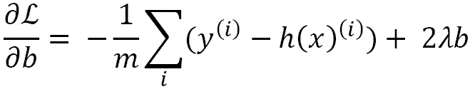

# 第三章：线性模型的正则化

**机器学习**（**ML**）的一个重要部分是由线性模型构成的。尽管有时它们被认为不如非线性模型（如基于树的模型或深度学习模型）强大，但线性模型确实能解决许多具体且有价值的问题。客户流失和广告优化就是线性模型可能是正确解决方案的两个问题。

在本章中，我们将覆盖以下内容：

+   使用 scikit-learn 训练线性回归模型

+   使用岭回归进行正则化

+   使用套索回归进行正则化

+   使用弹性网回归进行正则化

+   训练逻辑回归模型

+   正则化逻辑回归模型

+   选择正确的正则化方法

到本章结束时，我们将学习如何使用并正则化一些最常用的线性模型。

# 技术要求

在本章中，除了加载数据外，您将学习如何使用多个线性模型进行拟合和推理计算。为此，以下库是必需的：

+   NumPy

+   Matplotlib

+   Scikit-learn

# 使用 scikit-learn 训练线性回归模型

线性回归是我们可以使用的最基础的机器学习模型之一，但它非常有用。大多数人在高中时就使用过线性回归，虽然当时并没有讨论机器学习，而且他们在电子表格中也经常使用它。在这个教程中，我们将解释线性回归的基础知识，然后使用 scikit-learn 在加利福尼亚房价数据集上训练并评估一个线性回归模型。

## 准备工作

线性回归不是一个复杂的模型，但理解其底层原理仍然非常有用，这样才能从中获得最佳效果。

线性回归的工作原理非常简单。回到房地产价格的例子，如果我们考虑一个特征 *x*，比如公寓的面积和一个标签 *y*，比如公寓价格，一个常见的解决方案是找到 *a* 和 *b* 使得 *y = ax + b*。

不幸的是，现实生活中并非如此简单。通常没有一个 *a* 和 *b* 使得这个等式始终成立。更可能的情况是，我们可以定义一个函数 `h(x)`，旨在给出尽可能接近 *y* 的值。

此外，我们可能不仅仅有一个特征 *x*，而是有多个特征 *x*1、*x*2、...、*x*n，代表公寓面积、位置、楼层、房间数量、指数特征等等。

按照这个逻辑，我们最终得到的预测 *h(x)* 可能会像下面这样：


 是与特征  *x*j 相关的权重，*b* 是一个偏置项。这只是之前 *y = ax + b* 公式的一个推广，扩展到 *n* 个特征。这一公式允许线性回归预测几乎任何实数值。

我们的机器学习模型的目标是找到一组 *w* 和 *b* 的值，使得训练集上的预测误差最小。也就是说，我们要找到参数 *w* 和 *b*，使得 *h(x)* 和 *y* 尽可能接近。

实现这一目标的一种方法是最小化损失 *L*，这里可以将其定义为稍作修改的**均方** **误差**（**MSE**）：


 是训练集中样本 *i* 的真实值，*m* 是训练集中的样本数量。

注意

损失通常表示真实值与预测值之间的差异。因此，最小化损失可以让模型预测的值尽可能接近真实值。

最小化均方误差可以帮助我们找到一组 *w* 和 *b* 的值，使得预测 *h(x)* 尽可能接近真实值 *y*。从示意图来看，这可以表示为找到最小化损失的 *w*，如以下图所示：


图 3.1 – 损失函数作为参数 theta 的函数，在交点处具有全局最小值

下一个问题是：我们如何找到最小化损失的值集？解决这个问题有多种方法。一种在机器学习中常用的技术是梯度下降。

什么是梯度下降？简而言之，它是沿着曲线下降至前面图示中的最小值。

这怎么运作？这是一个多步骤的过程：

1.  从随机的 *w* 和 *b* 参数值开始。随机值通常使用以零为中心的正态分布来定义。因此，缩放特征可能有助于收敛。

1.  计算给定数据和当前 *w*、*b* 值的损失。如前所定义，我们可以使用均方误差来计算损失 *L*。

以下图表示了此时的情形：


图 3.2 – 损失函数在红色交点处具有全局最小值，蓝色交点处为可能的随机初始状态

1.  计算相对于每个参数的损失梯度 。这不过是给定参数的损失的斜率，可以通过以下公式计算：


注意

可以注意到，随着接近最小值，斜率预计会减小。事实上，随着接近最小值，误差趋向于零，斜率也趋向于零，这基于这些公式。

1.  对参数应用梯度下降。对参数应用梯度下降，使用用户定义的学习率 *α*。这可以通过以下公式计算：


这让我们朝着最小值迈出一步，如下图所示：


图 3.3 – 梯度下降法允许我们沿着损失函数向下迈进一步，从而使我们更接近全局最小值。

1.  迭代执行 *步骤 2 到 4*，直到收敛或达到最大迭代次数。这将使我们达到最优参数，如下图所示：


图 3.4 – 在足够的迭代次数和凸损失函数下，参数将会收敛到全局最小值

注：

如果学习率 *α* 太大，可能会错过全局最小值，甚至导致发散；而如果学习率太小，收敛速度会非常慢。

要完成这个步骤，必须安装以下库：`numpy`、`matplotlib` 和 `sklearn`。你可以在终端使用 `pip` 安装，命令如下：

```py
pip install -U numpy sklearn matplotlib
```

## 如何操作…

幸运的是，整个过程在 scikit-learn 中已经完全实现，你所需要做的就是充分利用这个库。现在我们来训练一个线性回归模型，使用 scikit-learn 提供的加利福尼亚住房数据集。

1.  `fetch_california_housing`：一个可以加载数据集的函数

1.  `train_test_split`：一个可以将数据拆分的函数

1.  `StandardScaler`：允许我们重新缩放数据的类

1.  `LinearRegression`：包含线性回归实现的类

以下是代码示例：

```py
import numpy as np
from sklearn.datasets import fetch_california_housing
from sklearn.model_selection import train_test_split
from sklearn.preprocessing import StandardScaler
from sklearn.linear_model import LinearRegression
```

1.  `X` 与 `X*X`：

    ```py
    # Load the California housing dataset
    
    X, y = fetch_california_housing(return_X_y=True)
    
    X = np.concatenate([X, X*X], axis=1)
    ```

1.  `train_test_split` 函数，使用 `test_size=0.2`，意味着我们将数据随机拆分，80% 的数据进入训练集，20% 的数据进入测试集。如下所示：

    ```py
    # Split the data
    
    X_train, X_test, y_train, y_test = train_test_split(
    
        X, y, test_size=0.2, random_state=0)
    ```

1.  **准备数据**：由于我们这里只有量化特征，因此唯一需要的准备工作是重新缩放。我们可以使用 scikit-learn 的标准缩放器。我们需要实例化它，然后在训练集上拟合并转换训练集，最后转换测试集。你可以自由使用任何其他的重缩放器：

    ```py
    # Rescale the data
    
    scaler = StandardScaler()
    
    X_train = scaler.fit_transform(X_train)
    
    X_test = scaler.transform(X_test)
    ```

1.  在训练集上拟合模型。模型必须先实例化，这里我们使用默认参数，因此没有指定任何内容。实例化模型后，我们可以使用 `.fit()` 方法对训练集进行拟合：

    ```py
    # Fit the linear regression model
    
    lr = LinearRegression()
    
    lr.fit(X_train, y_train)
    ```

1.  在训练集和测试集上评估模型。这里，我们使用 `LinearRegression` 类的 `.score()` 方法，它提供了 `R2-score`，但你也可以使用 `sklearn.metrics` 中提供的任何其他回归度量：

    ```py
    # Print the R2-score on train and test
    
    print('R2-score on train set:', lr.score(X_train, y_train))
    
    print('R2-score on test set:', lr.score(X_test, y_test))
    ```

以下是输出结果：

```py
R2-score on train set: 0.6323843381852894 R2-score on test set: -1.2472000127402643
```

如我们所见，训练集和测试集的分数差异显著，表明模型在训练集上出现了过拟合。为了解决这个问题，接下来将介绍正则化技术。

## 还有更多内容…

一旦模型训练完成，我们可以通过 `LinearRegression` 对象的属性 `.coef_` 和 `.intercept_` 分别访问所有的参数 *w*（这里是 16 个值，对应 16 个输入特征）以及截距 *b*：

```py
print('w values:', lr.coef_)
print('b value:', lr.intercept_)
```

这是输出结果：

```py
w values: [ 1.12882772e+00 -6.48931138e-02 -4.04087026e-01  4.87937619e-01  -1.69895164e-03 -4.09553062e-01 -3.72826365e+00 -8.38728583e+00  -2.67065542e-01  2.04856554e-01  2.46387700e-01 -3.19674747e-01   2.58750270e-03  3.91054062e-01  2.82040287e+00 -7.50771410e+00] b value: 2.072498958939411
```

如果我们绘制这些值，我们会注意到它们在这个数据集中的值大约在 `-8` 和 `2` 之间：

```py
import matplotlib.pyplot as plt
plt.bar(np.arange(len(lr.coef_)), lr.coef_)
plt.xlabel('feature index')
plt.ylabel('weight value')
plt.show()
```

这是一个可视化表示：


图 3.5 – 线性回归模型中每个权重的学习值。值的范围相当大，从 -8 到 2

## 参见其他

要全面了解如何使用 scikit-learn 进行线性回归，最好参考该类的官方文档：[`scikit-learn.org/stable/modules/generated/sklearn.linear_model.LinearRegression.xhtml`](https://scikit-learn.org/stable/modules/generated/sklearn.linear_model.LinearRegression.xhtml)。

我们现在对线性回归的工作原理有了较好的理解，接下来我们将看到如何通过惩罚进行正则化。

# 使用 ridge 回归进行正则化

一种非常常见且有用的正则化线性回归的方法是通过惩罚损失函数。在本示例中，经过回顾将惩罚项添加到 ridge 回归的损失函数之后，我们将在与之前示例相同的加利福尼亚住房数据集上训练一个 ridge 模型，看看它如何通过正则化提高评分。

## 准备就绪

确保模型参数不会过拟合的一种方法是保持它们接近零：如果参数无法自由变化，它们就不太可能过拟合。

为此，ridge 回归将一个新的项（正则化项）添加到损失函数中！[](img/Formula_03_011.png)：


其中  是 *L2* 范数的 *w*：


通过这个损失函数，我们可以直观地理解，较大的权重 *w* 是不可能的，因此过拟合的可能性较小。此外，*𝜆* 是一个超参数（可以微调），允许我们控制正则化的程度：

+   *𝜆* 的较高值表示较强的正则化

+   *𝜆* = 0 表示没有正则化，例如普通的线性回归

梯度下降的公式稍作更新，如下所示：



现在让我们来看一下如何使用 ridge 回归与 scikit-learn：与前一个示例中一样，需要安装相同的库：`numpy`、`sklearn` 和 `matplotlib`。

同时，我们假设数据已经通过上一示例下载并准备好。有关如何下载、拆分和准备数据的详细信息，请参考前一个示例。

## 如何操作……

假设我们正在重复使用前一个示例中的相同数据。我们将在完全相同的数据上训练和评估另一个模型，包括具有平方特征的特征工程。scikit-learn 中岭回归的相关实现是`Ridge`类，其中`alpha`类属性等同于前述方程中的*𝜆*。让我们来使用它：

1.  从 scikit-learn 中导入`Ridge`类：

    ```py
    from sklearn.linear_model import Ridge
    ```

1.  然后我们实例化一个岭回归模型。在这里选择了正则化参数`alpha=5000`，但每个数据集可能需要一个非常具体的超参数值来表现最佳。接下来，用`.fit()`方法在训练集上训练模型（事先准备好的），如下所示：

    ```py
    # Fit the Ridge model ridge = Ridge(alpha=5000)
    
    ridge.fit(X_train, y_train)
    
    Ridge(alpha=5000)
    ```

1.  然后我们评估模型。在这里，我们计算并显示由岭回归类的`.score()`提供的 R2 分数，但也可以使用任何其他回归指标：

    ```py
    # Print the R2-score on train and test
    
    print('R2-score on train set:', ridge.score(X_train, y_train))
    
    print('R2-score on test set:', ridge.score(X_test, y_test))
    ```

这里是输出：

```py
R2-score on train set: 0.5398290317808138 R2-score on test set: 0.5034148460338739
```

我们会注意到，与线性回归模型（没有正则化）相比，我们在测试集上获得了更好的结果，允许测试集上的 R2 分数略高于`0.5`。

## 还有更多...

我们还可以打印权重并绘制它们，将这些值与普通线性回归的值进行比较，如下所示：

```py
print('theta values:', ridge.coef_)
print('b value:', ridge.intercept_)
```

这里是输出：

```py
theta values: [ 0.43456599  0.06311698  0.00463607  0.00963748  0.00896739 -0.05894055  -0.17177956 -0.15109744  0.22933247  0.08516982  0.01842825 -0.01049763  -0.00358684  0.03935491 -0.17562536  0.1507696 ] b value: 2.07249895893891
```

为了可视化，我们还可以使用以下代码绘制这些值：

```py
plt.bar(np.arange(len(ridge.coef_)), ridge.coef_)
plt.xlabel('feature index') plt.ylabel('weight value')
plt.show()
```

这段代码输出如下：


图 3.6 - 岭回归模型每个权重的学习值。请注意，一些是正数，一些是负数，并且没有一个完全等于零。此外，范围比无正则化时小得多

现在权重值的范围是从`-0.2`到`.0.5`，确实比没有惩罚时要小得多。

正如预期的那样，添加正则化导致测试集的 R2 分数比没有正则化时更好，且接近训练集的分数。

## 参见

有关岭回归的所有可能参数和超参数的更多信息，您可以查看官方 scikit-learn 文档：[`scikit-learn.org/stable/modules/generated/sklearn.linear_model.LinearRegression.xhtml`](https://scikit-learn.org/stable/modules/generated/sklearn.linear_model.LinearRegression.xhtml)。

# 使用套索回归进行正则化

**套索**回归代表**最小绝对值收缩和选择算子**。这是一个正则化方法，在某些情况下，套索回归优于岭回归，因此了解其作用和如何使用它非常有用。在这个示例中，我们将简要解释套索回归是什么，然后在相同的加利福尼亚房屋数据集上使用 scikit-learn 训练模型。

## 准备工作

lasso 使用 L1-norm，而不是 L2-norm，因此损失  公式如下：


虽然 ridge 回归倾向于平滑地将权重减少到接近零，lasso 的变化更加剧烈。由于 lasso 的损失曲线更陡峭，它倾向于迅速将权重设置为零。

就像 ridge 回归的做法一样，我们将使用相同的库，并假设它们已经安装：`numpy`、`sklearn` 和 `matplotlib`。同时，我们假设数据已经下载并准备好。

## 如何操作……

scikit-learn 的 lasso 实现可以通过 `Lasso` 类获得。与 `Ridge` 类类似，`alpha` 是控制正则化强度的参数：

+   alpha 值为 0 表示没有正则化

+   alpha 的大值意味着高强度的正则化

我们将再次使用已经准备好的数据集，该数据集已经用于线性回归和 ridge 回归：

1.  从 scikit-learn 导入 `Lasso` 类：

    ```py
    from sklearn.linear_model import Lasso
    ```

1.  我们实例化一个 `alpha=0.2` 的 lasso 模型，它能提供相当不错的结果和较低的过拟合，如我们接下来所见。然而，欢迎测试其他值，因为每个数据集可能有其独特的最佳值。接下来，使用 `Lasso` 类的 `.fit()` 方法在训练集上训练该模型：

    ```py
    # Fit the Lasso model lasso = Lasso(alpha=0.02)
    
    lasso.fit(X_train, y_train)
    ```

1.  使用 `.score()` 方法中的 R2-score 来评估训练集和测试集上的 lasso 模型，该方法在 `Lasso` 类中实现：

    ```py
    # Print the R2-score on train and test
    
    print('R2-score on train set:', lasso.score(X_train, y_train))
    
    print('R2-score on test set:', lasso.score(X_test, y_test))
    ```

这段代码会输出以下内容：

```py
R2-score on train set: 0.5949103710772492
R2-score on test set: 0.57350350155955
```

在与没有惩罚的线性回归进行比较时，我们可以看到有所改进，并且相较于 ridge 回归，我们在测试集上的 R2-score 约为 `0.57`。

## 还有更多……

如果我们再次绘制权重实例图，我们现在得到以下值：

```py
plt.bar(np.arange(len(lasso.coef_)), lasso.coef_)
plt.xlabel('feature index')
plt.ylabel('weight value')
plt.show()
```

这将输出 *图 3**.14* 中的图表：


图 3.7 – 每个 lasso 模型权重的学习值。注意，与 ridge 模型不同，多个权重被设置为零

如预期所示，某些值被设置为 0，整体范围在 `-0.5` 到 `0.7` 之间。

在这种情况下，lasso 正则化使我们在测试集上的表现得到了显著提升，同时也减少了过拟合。

## 另见

查看 lasso 类的官方文档，了解更多信息：[`scikit-learn.org/stable/modules/generated/sklearn.linear_model.Lasso.xhtml`](https://scikit-learn.org/stable/modules/generated/sklearn.linear_model.Lasso.xhtml).

另一种名为 group lasso 的技术可以用于正则化，了解更多信息请访问： [`group-lasso.readthedocs.io/en/latest/`](https://group-lasso.readthedocs.io/en/latest/).

# 使用弹性网回归进行正则化

弹性网回归，除了有一个非常华丽的名字外，其实不过是岭回归和套索回归的组合。它是一种正则化方法，在一些特定情况下可能会有所帮助。让我们看看它在损失函数中的表现，然后在加利福尼亚住房数据集上训练一个模型。

## 准备工作

弹性网的思想是同时使用 L1 和 L2 正则化。

这意味着损失函数！[](img/Formula_03_019.png)是如下所示：


这两个超参数，和，可以进行微调。

我们不会详细讨论梯度下降的公式，因为一旦理解了岭回归和套索回归，推导它们是非常直接的。

为了训练模型，我们再次需要`sklearn`库，这个库我们在之前的配方中已经安装过。此外，我们假设加利福尼亚住房数据集已经下载并准备好。

## 如何实现…

在 scikit-learn 中，弹性网在`ElasticNet`类中实现。然而，它们使用的是两个超参数`alpha`和`l1_ratio`，而不是两个超参数和：

+   

+   

现在让我们将其应用到已经准备好的加利福尼亚住房数据集上：

1.  从 scikit-learn 中导入`ElasticNet`类：

    ```py
    from sklearn.linear_model import ElasticNet
    ```

1.  实例化一个弹性网模型。选择了`alpha=0.1`和`l1_ratio=0.5`，但也可以测试其他值。然后使用`ElasticNet`类的`.fit()`方法，在训练集上训练模型：

    ```py
    # Fit the LASSO model
    
    Elastic = ElasticNet(alpha=0.1, l1_ratio=0.5)
    
    elastic.fit(X_train, y_train)
    
    ElasticNet(alpha=0.1)
    ```

1.  使用`.score()`方法计算的 R2 得分，在训练集和测试集上评估弹性网模型：

    ```py
    # Print the R2-score on train and test
    
    print('R2-score on train set:', elastic.score(
    
        X_train, y_train))
    
    print('R2-score on test set:', elastic.score(
    
        X_test, y_test))
    ```

这是它的输出：

```py
R2-score on train set: 0.539957010948829
R2-score on test set: 0.5134203748307193
```

在这个例子中，结果并没有超越套索回归：可能需要对超参数进行更好的微调才能达到相同的性能。

尽管弹性网回归由于有两个超参数而在微调时更为复杂，但它可能比岭回归或套索回归在正则化上提供更多灵活性。推荐使用超参数优化方法来找到适合特定任务的超参数组合。

注意

实际上，弹性网回归可能不如岭回归和套索回归广泛使用。

## 另见

scikit-learn 的官方文档中，关于弹性网回归的详细信息可以在此找到：[`scikit-learn.org/stable/modules/generated/sklearn.linear_model.ElasticNet.xhtml`](https://scikit-learn.org/stable/modules/generated/sklearn.linear_model.ElasticNet.xhtml)。

# 训练逻辑回归模型

逻辑回归在概念上与线性回归非常接近。一旦完全理解了线性回归，逻辑回归就只需要几步小技巧。然而，与线性回归不同，逻辑回归最常用于分类任务。

让我们首先解释什么是逻辑回归，然后使用 scikit-learn 在乳腺癌数据集上训练一个模型。

## 准备开始

与线性回归不同，逻辑回归的输出范围限制在`0`到`1`之间。第一个思路与线性回归完全相同，为每个特征  分配一个参数 ：


还有一步是将输出 *z* 限制在 `0` 到 `1` 之间，那就是对该输出应用逻辑函数。作为提醒，逻辑函数（也叫做 Sigmoid 函数，尽管它是一个更通用的函数）如下所示：


逻辑函数呈 S 形，其值从 `0` 到 `1`，在 *x = 0* 时取值为 `0.5`，如*图 3.8*所示：


图 3.8 – 逻辑函数，x = 0 时从 0 到 1 范围内穿过 0.5

最后，通过应用 Sigmoid 函数，我们得到了逻辑回归的预测 *h(x)*，如下所示：


这确保了输出值 *h(x)* 在`0`到`1`的范围内。但它还没有让我们进行分类。最后一步是应用一个阈值（例如，`0.5`）来进行分类预测：


和线性回归一样，我们现在需要定义一个损失函数 `L`，以便最小化它，进而优化参数  和 *b*。常用的损失函数是所谓的**二元** **交叉熵**：


我们可以看到这里有四种极端情况：

+   *如果 y = 1 且 h(x)**≃**1：L* *≃* *0*

+   *如果 y = 1 且 h(x)**≃**0：L* *≃* *+∞*

+   *如果 y = 0 且 h(x)**≃**0：L* *≃* *0*

+   *如果 y = 0 且 h(x)**≃**1：L* *≃* *+∞*

现在，为了实现我们期望的行为，即一个趋向于 0 的损失，表示高度准确的预测，并且在错误预测时损失增加。这个过程在下图中表示：


图 3.9 – 二元交叉熵，最小化 y = 0 和 y = 1 的误差

同样，优化逻辑回归的一种方法是通过梯度下降，和线性回归完全相同。事实上，方程是完全相同的，尽管我们在这里无法证明这一点。

要准备这个步骤，我们只需要安装 `scikit-learn` 库。

## 如何做...

逻辑回归在 scikit-learn 中完全实现为 `LogisticRegression` 类。与 scikit-learn 中的线性回归不同，逻辑回归将正则化直接集成到一个类中。以下参数是需要调整的，以便微调正则化：

+   `penalty`：这可以是 `'l1'`，`'l2'`，`'elasticnet'` 或 `'none'`

+   `C`：这是一个浮动值，与正则化强度成反比；值越小，正则化越强。

在这个示例中，我们将应用不使用正则化的逻辑回归模型，处理由 scikit-learn 提供的乳腺癌数据集。我们将首先加载并准备数据，然后训练并评估逻辑回归模型，具体步骤如下：

1.  导入`load_breast_cancer`函数，它将允许我们加载数据集，并导入`LogisticRegression`类：

    ```py
    from sklearn.datasets import load_breast_cancer
    
    from sklearn.linear_model import LogisticRegression
    ```

1.  使用`load_breast_cancer`函数加载数据集：

    ```py
    # Load the dataset
    
    X, y = load_breast_cancer(return_X_y=True)
    ```

1.  使用`train_test_split`函数拆分数据集。我们假设它已经在之前的示例中被导入。如果没有，你需要通过`from sklearn.model_selection import train_test_split`来导入。我们选择`test_size=0.2`，这样训练集占 80%，测试集占 20%：

    ```py
    # Split the data
    
    X_train, X_test, y_train, y_test = train_test_split(
    
        X, y, test_size=0.2, random_state=42)
    ```

1.  然后我们准备数据。由于数据集仅包含定量数据，我们只需要使用标准化方法进行重缩放：我们实例化标准化器，对训练集进行拟合，并用`fit_transform()`方法转换同一训练集。最后，我们使用`.transform()`对测试集进行重缩放。同样地，我们假设标准化器已经在之前的示例中被导入，否则需要通过`from sklearn.preprocessing import StandardScaler`导入：

    ```py
    # Rescale the data
    
    scaler = StandardScaler()
    
    X_train = scaler.fit_transform(X_train)
    
    X_test = scaler.transform(X_test)
    ```

1.  然后我们实例化逻辑回归模型，并指定`penalty='none'`，这样就不对损失进行惩罚（为了教学目的）。查看下一个示例，了解惩罚项如何工作。接着我们使用`.fit()`方法在训练集上训练逻辑回归模型：

    ```py
    # Fit the logistic regression model with no regularization
    
    Lr = LogisticRegression(penalty='none')
    
    lr.fit(X_train, y_train)
    
    LogisticRegression(penalty='none')
    ```

1.  在训练集和测试集上评估模型。`LogisticRegression`类的`.score()`方法使用准确率作为评估指标，但也可以使用其他指标：

    ```py
    # Print the accuracy score on train and test
    
    print('Accuracy on train set:', lr.score(X_train, y_train))
    
    print('Accuracy on test set:', lr.score(X_test, y_test))
    ```

这段代码输出如下内容：

```py
Accuracy on train set: 1.0 Accuracy on test set: 0.9385964912280702
```

我们在这里面临较强的过拟合问题，训练集的分类准确率为 100%，但测试集的准确率只有大约 94%。这是一个好的开始，但在下一个示例中，我们将使用正则化来帮助提高测试准确率。

# 对逻辑回归模型进行正则化

逻辑回归与线性回归使用相同的技巧来添加正则化：它将惩罚项加到损失函数中。在这个示例中，我们将简要解释惩罚项如何影响损失，并展示如何使用 scikit-learn 在之前准备的乳腺癌数据集上添加正则化。

## 准备工作

就像线性回归一样，向损失函数`L`中添加正则化项非常简单，可以是 L1 或 L2 范数的参数*w*。例如，包含 L2 范数的损失函数如下所示：


和岭回归一样，我们在权重上加入了平方和，并在前面加了一个超参数。为了尽可能接近 scikit-learn 的实现，我们将使用 1/C 代替𝜆作为正则化超参数，但基本思想保持不变。

在这个食谱中，我们假设之前的食谱中已经安装了以下库：`sklearn` 和 `matplotlib`。同时，我们假设乳腺癌数据集中的数据已经从前一个食谱中加载和准备好，因此我们可以直接重用它。

## 如何做到…

现在，让我们通过添加 L2 正则化来尝试提高我们在上一道食谱中的测试精度：

1.  实例化逻辑回归模型。在这里，我们选择 L2 惩罚和正则化值 `C=0.1`。较低的 `C` 值意味着更强的正则化：

    ```py
    lr = LogisticRegression(penalty='l2', C=0.1)
    ```

1.  使用 `.fit()` 方法在训练集上拟合逻辑回归模型：

    ```py
    lr.fit(X_train, y_train)
    
    LogisticRegression(C=0.1)
    ```

1.  在训练集和测试集上评估模型。我们在这里使用 `.score()` 方法，提供准确率得分：

    ```py
    # Print the accuracy score on train and test
    
    print('Accuracy on train set:', lr.score(
    
        X_train, y_train))
    
    print('Accuracy on test set:', lr.score(
    
        X_test, y_test))
    
    Accuracy on train set: 0.9802197802197802
    
    Accuracy on test set: 0.9824561403508771
    ```

正如我们在这里看到的，添加 L2 正则化使我们在测试集上的精度达到了 98%，相比于没有正则化时的大约 94%，这是一项相当大的改进。

另一个提醒

找到 `C` 的最佳正则化值的最佳方法是进行超参数优化。

出于好奇，我们可以在这里绘制多个正则化强度值下的训练和测试精度：

```py
accuracy_train = []
accuracy_test = []
c_values = [0.001,0.003,0.01,0.03,0.1,0.3,1,3,10,30]
for c in c_values:
    lr = LogisticRegression(penalty='l2', C=c)
    lr.fit(X_train, y_train)
    accuracy_train.append(lr.score(X_train, y_train))
    accuracy_test.append(lr.score(X_test, y_test))
plt.plot(c_values, accuracy_train, label='train')
plt.plot(c_values, accuracy_test, label='test')
plt.legend()
plt.xlabel('C: inverse of regularization strength')
plt.ylabel('Accuracy')
plt.xscale('log')
plt.show()
```

这是它的图表：


图 3.10 – 精度作为 C 参数的函数，适用于训练集和测试集

这个图实际上是从右到左读取的。我们可以看到，当 `C` 的值减小时（从而增加正则化），训练精度持续下降，因为正则化越来越强。另一方面，减小 `C`（即增加正则化）最初能够改善测试结果：模型的泛化能力越来越强。但在某个时刻，添加更多正则化（进一步减小 `C`）并不会带来更多帮助，甚至会降低测试精度。事实上，过多的正则化会产生高偏差模型。

## 还有更多…

`LogisticRegression` 的 scikit-learn 实现不仅允许我们使用 L2 惩罚，还允许使用 L1 和弹性网，就像线性回归一样，这让我们可以根据任何给定的数据集和任务来选择最佳的正则化方式。

可以查阅官方文档以获取更多细节：[`scikit-learn.org/stable/modules/generated/sklearn.linear_model.LogisticRegression.xhtml`](https://scikit-learn.org/stable/modules/generated/sklearn.linear_model.LogisticRegression.xhtml)。

# 选择合适的正则化

线性模型与 L1 和 L2 惩罚共享这种正则化方法。实现中的唯一区别是线性回归有针对每种正则化类型的独立类，如下所述：

+   `LinearRegression` 无正则化

+   `RidgeRegression` 用于 L2 正则化

+   `Lasso` 用于 L1 正则化

+   `ElasticNet` 用于 L1 和 L2

逻辑回归有一个集成实现，可以将 `L1` 或 `L2` 作为类参数传递。

注意

对于`SVC`分类类和`SVR`回归类，使用`C`参数进行`L2`正则化。

但是对于线性回归和逻辑回归，有一个问题依然存在：我们应该使用 L1 还是 L2 正则化？

在这个方案中，我们将提供一些关于在某些情况下使用 L1 或 L2 惩罚的实用建议，然后我们将使用逻辑回归对乳腺癌数据集进行网格搜索，以找到最佳正则化方法。

## 准备工作

对于最适合的惩罚方式，并没有绝对的答案。大多数情况下，唯一的办法是通过超参数优化来找出答案。但在某些情况下，数据本身或外部约束可能会提示我们选择哪种正则化方法。让我们快速看一下。首先，比较 L1 和 L2 正则化，然后探索超参数优化。

### L1 与 L2 正则化

L1 和 L2 正则化有内在的差异，这些差异有时可以帮助我们提前做出明智的判断，从而节省计算时间。让我们看看这些差异。

如前所述，L1 正则化倾向于将某些权重设置为零，从而可能允许特征选择。因此，如果我们有一个包含许多特征的数据集，拥有这些信息将会很有帮助，未来可以删除这些特征。

此外，L1 正则化使用权重的绝对值作为损失的一部分，使其相比 L2 正则化对异常值更加稳健。如果我们的数据集可能包含异常值，这是需要考虑的。

最后，在计算速度方面，L2 正则化是通过添加一个二次项来实现的，因此比 L1 正则化计算开销更小。如果训练速度是一个关注点，应该优先考虑 L2 正则化。

简而言之，我们可以考虑以下几种情况，这些情况可以根据数据或其他约束（如计算资源）在前期做出选择：

+   数据包含许多特征，其中许多特征重要性较低：选择 L1 正则化

+   数据包含许多异常值：L1 正则化

+   如果训练计算资源有限：选择 L2 正则化

### 超参数优化

更实际、或许更务实的方法是直接进行超参数优化，将 L1 或 L2 作为一个超参数（弹性网回归也可以加入）。

我们将使用`scikit-learn`实现的网格搜索进行超参数优化，对乳腺癌数据集上的逻辑回归模型进行 L1 和 L2 正则化优化。

对于这个方案，我们假设在前一个方案中已经安装了`scikit-learn`库。我们还假设乳腺癌数据已经通过*训练逻辑回归* *模型*方案加载并准备好。

## 如何实现…

我们将在一组给定的超参数上执行网格搜索，更具体地说，就是在多个惩罚值下，进行 L1 和 L2 正则化的惩罚，其中`C`为惩罚参数：

1.  首先，我们需要从`sklearn`导入`GridSearchCV`类：

    ```py
    from sklearn.model_selection import GridSearchCV
    ```

1.  然后我们定义参数网格。这是我们想要测试的超参数空间。在这里，我们将同时尝试 L1 和 L2 惩罚项，并且对于每个惩罚项，我们将尝试`C`值，范围是`[0.01, 0.03, 0.06, 0.1, 0.3, 0.6]`，具体如下：

    ```py
    # Define the hyperparameters we want to test param_grid = {
    
        'penalty': ['l1', 'l2'],
    
        'C': [0.01, 0.03, 0.06, 0.1, 0.3, 0.6] }
    ```

1.  接下来，我们实例化网格搜索对象。这里传入了几个参数：

    +   `LogisticRegression`，我们指定求解器为`liblinear`（更多信息请参见*另见*部分），这样它就能处理 L1 和 L2 惩罚项。我们假设该类已从之前的代码中导入；否则，您可以通过`from sklearn.linear_model import LogisticRegression`导入它。

    +   `scoring='accuracy'`，但它也可以是任何其他相关的度量标准。

    +   这里使用`cv=5`表示 5 折交叉验证，因为这是比较标准的设置，但根据数据集的大小，其他值也可能适用：

        ```py
        # Instantiate the grid search
        ```

        ```py
        object grid = GridSearchCV(
        ```

        ```py
            LogisticRegression(solver='liblinear'),
        ```

        ```py
            param_grid,
        ```

        ```py
            scoring='accuracy',
        ```

        ```py
            cv=5 )
        ```

1.  使用`.fit()`方法在训练数据上训练网格。然后，我们可以出于好奇使用`best_params_`属性显示找到的最佳超参数：

    ```py
    # Fit and wait
    
    grid.fit(X_train, y_train)
    
    # Print the best set of hyperparameters
    
    print('best hyperparameters:', grid.best_params_)
    
    best hyperparameters: {'C': 0.06, 'penalty': 'l2'}
    ```

在这种情况下，最佳超参数是`C=0.06`，并使用 L2 惩罚。现在我们可以评估模型。

1.  使用`.score()`方法对训练集和测试集上的模型进行评估，该方法计算准确率。直接在网格对象上使用`.score()`或`.predict()`将自动计算出最佳模型的预测结果：

    ```py
    # Print the accuracy score on train and test
    
    print('Accuracy on train set:', grid.score(
    
        X_train, y_train))
    
    print('Accuracy on test set:', grid.score(
    
        X_test, y_test))
    
    Accuracy on train set: 0.9824175824175824
    
    Accuracy on test set: 0.9912280701754386
    ```

在这种情况下，这提高了测试集上的性能，尽管这并不总是那么简单。但方法保持不变，可以应用于任何数据集。

## 另见

网格搜索的官方文档可以在这里找到：[`scikit-learn.org/stable/modules/generated/sklearn.model_selection.GridSearchCV.xhtml`](https://scikit-learn.org/stable/modules/generated/sklearn.model_selection.GridSearchCV.xhtml)。

关于 scikit-learn 中可用的求解器和惩罚项的更多信息可以在这里找到：[`scikit-learn.org/stable/modules/linear_model.xhtml#logistic-regression`](https://scikit-learn.org/stable/modules/linear_model.xhtml#logistic-regression)。
