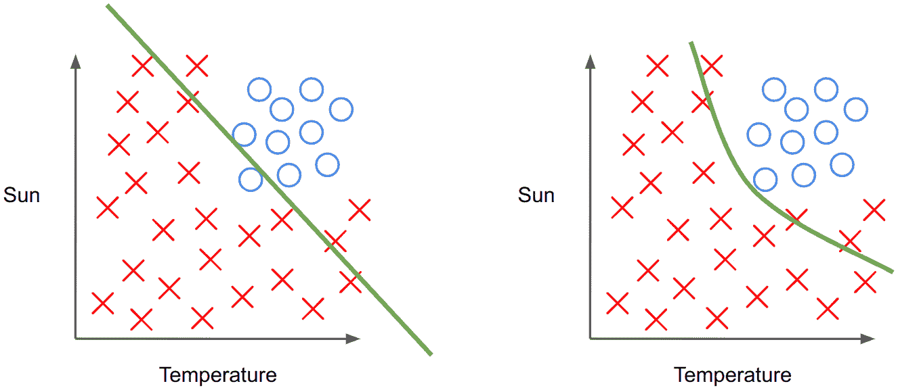
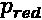
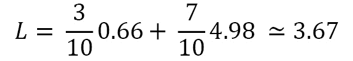
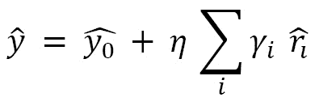

# 第四章：基于树的模型的正则化

基于树的集成学习模型，如随机森林或梯度提升，通常被视为易于使用的最先进模型，适用于常规机器学习任务。

许多 Kaggle 竞赛都是通过这样的模型获胜的，因为它们在发现数据中的复杂模式时非常健壮且高效。知道如何正则化和微调它们是获得最佳性能的关键。

在本章中，我们将探讨以下食谱：

+   构建分类树

+   构建回归树

+   正则化决策树

+   训练一个随机森林算法

+   随机森林的正则化

+   使用 XGBoost 训练提升模型

+   使用 XGBoost 进行正则化

# 技术要求

在本章中，您将训练和微调几个基于决策树的模型，并可视化一棵树。本章将需要以下库：

+   NumPy

+   Matplotlib

+   Scikit-learn

+   Graphviz

+   XGBoost

+   pickle

# 构建分类树

决策树是机器学习中一个独立的模型类别。尽管单独的决策树可以被视为一个弱学习器，但结合集成学习的力量，如袋装法或提升法，决策树能够获得非常好的性能。在深入研究集成学习模型及其如何正则化之前，在这个食谱中，我们将回顾决策树是如何工作的，并且如何在鸢尾花数据集的分类任务中使用它们。

为了直观地理解决策树的强大能力，我们考虑一个使用场景。我们想知道是否应根据两个输入特征：阳光和温度，在海滩上卖冰激凌。

我们在*图 4**.1*中有数据，并希望在其上训练一个模型。


图 4.1 – 如果我们应该卖冰激凌，表示为圆圈；如果不应该，表示为叉号

对于人类来说，这看起来相当简单。但对于线性模型来说就不那么容易了。如果我们尝试在这些数据上使用逻辑回归，它将最终绘制出类似于*图 4**.2*左侧的决策线。即便使用更高次幂的特征，逻辑回归也会遇到困难，并提出类似于*图 4**.2*右侧的决策线。



图 4.2 – 线性模型对该数据集分类的潜在结果：左侧是原始特征，右侧是更高次幂特征

总而言之，这些数据是非线性可分的。但它可以被划分为两个独立的线性可分问题：

+   天气晴吗？

+   温度热吗？

如果我们满足这两个条件，那么我们应该卖冰激凌。这可以总结为*图 4**.3*中的树形结构：


图 4.3 – 一个正确分类所有数据点的决策树

在这里我们要介绍一些词汇：

+   我们有**Warm**，这是第一个决策节点，也是根节点，包含两个分支：**Yes** 和 **No**。

+   我们在**Sunny**中有另一个决策节点。决策节点是指包含两个（有时更多）分支的任何节点。

+   我们有三个叶节点。叶节点没有任何分支，包含最终的预测结果。

+   就像计算机科学中的二叉树一样，树的深度是根节点和最底部叶节点之间的边数。

如果我们回到我们的数据集，决策线现在将看起来像*图 4.4*那样，提供有效的解决方案，不是一个而是两个组合的线：


图 4.4 – 决策树在分类此数据集时的结果

从现在开始，任何新数据都将进入这些叶节点之一，从而被正确分类。

这就是决策树的强大之处：它们能够计算复杂的非线性规则，赋予它们极大的灵活性。决策树使用**贪婪算法**进行训练，这意味着它每次只尝试优化一个步骤。

更具体地说，这意味着决策树并不是全局优化的，而是逐个节点进行优化。

这可以看作是一个递归算法：

1.  取节点中的所有样本。

1.  在某个特征中找到一个阈值，以最小化分裂的无序度。换句话说，找到给出最佳类别分离的特征和阈值。

1.  将其分裂为两个新的节点。

1.  回到*第 1 步*，直到你的节点是纯净的（意味着只剩下一个类别），或者满足其他条件，成为叶节点。

但我们如何选择最优的分裂方式呢？当然，我们使用一个损失函数，它使用无序度量。让我们在总结之前先深入探讨这两个话题。

## 无序度量

为了使分类树有效，它必须在其叶节点中尽可能减少无序。实际上，在前面的示例中，我们假设所有的叶节点都是纯净的。它们只包含来自单一类别的样本。实际上，叶节点可能是不纯的，包含来自多个类别的样本。

注意

如果训练决策树后，叶节点仍然不纯，我们将使用该叶节点的多数类进行分类。

所以，基本思路是最小化不纯度，但我们如何度量它呢？有两种方法：熵和基尼不纯度。让我们一起来看看这两种方法。

### 熵

熵是一个广泛使用的术语，应用于多个领域，比如物理学和计算机科学。我们在这里使用的熵*`E`*可以用以下方程定义，其中 pi 是样本中子类  的比例：


我们来看一个具体的例子，如*图 4.5*所示：


图 4.5 – 一个包含两类（红色和蓝色）10 个样本的节点

在这个例子中，熵将是以下内容：


事实上，我们有以下结果：

+   =3/10，因为我们有 10 个样本中有 3 个是蓝色的

+   =7/10，因为我们有 10 个样本中有 7 个是蓝色的

如果我们观察极端情况，我们会理解熵非常适合用来计算混乱度：

+   如果 =0，那么 =1 并且 E = 0

+   如果 pblue =  = 0.5, 那么 E = 1

所以，我们可以理解，当节点包含完全混合的样本时，熵达到最大值 1，而当节点只包含一个类别时，熵为零。这个总结可以通过*图 4.6*中的曲线展示：


图 4.6 – 熵作为 p 对于两个类别的函数

### 基尼不纯度

基尼不纯度是另一种衡量混乱度的方法。基尼不纯度 G 的公式非常简单：


再次提醒， 是节点中类别的比例。

应用于*图 4.5*中的示例节点，基尼不纯度的计算将得出以下结果：


结果与熵有很大的不同，但让我们检查极值的情况，以确保属性保持一致：

+   如果 ，那么  并且 G = 0

+   如果  = 0.5，那么 G = 0.5

事实上，当混乱度最大时，基尼不纯度达到最大值 0.5，当节点是纯净的时，基尼不纯度为 0。

熵还是基尼？

那么，我们应该使用什么呢？这可以看作是一个超参数，而 scikit-learn 的实现允许选择熵或基尼。

在实践中，两者的结果通常是相同的。但基尼不纯度的计算更快（熵涉及更昂贵的对数计算），所以它通常是首选。

## 损失函数

我们有一个混乱度的度量，但我们应该最小化的损失是什么？最终目标是做出划分，最小化每次划分的混乱度。

考虑到一个决策节点总是有两个子节点，我们可以将它们定义为左子节点和右子节点。那么，这个节点的损失可以写成这样：


让我们分解这个公式：

+   m, ，以及  分别是每个节点中样本的数量

+    和  是左子节点和右子节点的基尼不纯度

注

当然，这也可以通过熵而不是基尼不纯度来计算。

假设我们选择了一个划分决策，那么我们就有一个父节点和两个由*图 4.7*中的划分定义的子节点：


图 4.7 – 一个父节点和两个子节点，以及它们各自的基尼杂质

在这种情况下，损失*`L`*将是如下：


使用这个损失计算方法，我们现在能够最小化杂质（从而最大化节点的纯度）。

注意

我们在这里定义的损失只是节点层次的损失。实际上，正如前面所说，决策树是通过贪心方法训练的，而不是通过梯度下降。

## 准备工作

最后，在进入本食谱的实际细节之前，我们需要安装以下库：scikit-learn、`graphviz`和`matplotlib`。

它们可以通过以下命令行安装：

```py
pip install scikit-learn graphviz matplotlib
```

## 如何操作…

在实际训练决策树之前，让我们快速浏览一下训练决策树的所有步骤：

1.  我们有一个包含 N 个类别样本的节点。

1.  我们遍历所有特征以及每个特征的所有可能值。

1.  对于每个特征值，我们计算基尼杂质和损失。

1.  我们保留具有最低损失的特征值，并将节点分裂成两个子节点。

1.  返回到*步骤 1*，对两个节点进行处理，直到某个节点纯净（或者满足停止条件）。

使用这种方法，决策树最终会找到一组正确的决策，成功地分离各个类别。然后，对于每个叶子节点，有两种可能的情况：

+   如果叶子节点纯净，则预测该类别

+   如果叶子节点不纯净，则预测出现最多的类别

注意

测试所有可能特征值的一种方式是使用数据集中所有现有的值。另一种方法是对数据集中现有值的范围进行线性划分。

现在，让我们用 scikit-learn 在鸢尾花数据集上训练一个决策树：

1.  首先，我们需要导入必需的库：用于数据可视化的`matplotlib`（如果没有其他需求，可以不必使用），用于加载数据集的`load_iris`，用于将数据集分为训练集和测试集的`train_test_split`，以及 scikit-learn 中实现的`DecisionTreeClassifier`决策树模型：

    ```py
    from matplotlib import pyplot as plt
    
    from sklearn.datasets import load_iris
    
    from sklearn.model_selection import train_test_split
    
    from sklearn.tree import DecisionTreeClassifier
    ```

1.  我们现在可以使用`load_iris`加载数据：

    ```py
    # Load the dataset
    
    X, y = load_iris(return_X_y=True)
    ```

1.  我们使用`train_test_split`将数据集分为训练集和测试集，保持默认参数，只指定随机状态以确保可重复性：

    ```py
    # Split the dataset
    
    X_train, X_test, y_train, y_test = train_test_split(
    
        X, y, random_state=0)
    ```

1.  在这一步，我们展示数据的二维投影。这个操作只是为了教学目的，但并非强制要求：

    ```py
    # Plot the training points
    
    plt.scatter(X[:, 0], X[:, 1], c=y)
    
    plt.xlabel('Sepal length')
    
    plt.ylabel('Sepal width')
    
    plt.show()
    ```

这是相应的图表：


图 4.8 – 三个鸢尾花类别作为萼片宽度和萼片长度的函数（由代码生成的图）

1.  实例化`DecisionTreeClassifier`模型。我们在这里使用默认参数：

    ```py
    # Instantiate the model
    
    dt = DecisionTreeClassifier()
    ```

1.  在训练集上训练模型。这里我们没有对数据进行任何预处理，因为我们只有定量特征，而决策树不对特征的尺度敏感，不像线性模型。但如果对定量特征进行缩放也无妨：

    ```py
    # Fit the model on the training data
    
    dt.fit(X_train, y_train)
    ```

1.  最后，我们使用分类树的`score()`方法在训练集和测试集上评估模型的准确性：

    ```py
    # Compute the accuracy on training and test sets
    
    print('Accuracy on training set:', dt.score(
    
        X_train, y_train))
    
    print('Accuracy on test set:', dt.score(
    
        X_test, y_test))
    ```

这将打印出以下输出：

```py
Accuracy on training set: 1.0
Accuracy on test set: 0.9736842105263158
```

即使我们在训练集上出现了 100%的准确率，显然面临过拟合问题，我们仍然取得了令人满意的结果。

## 还有更多…

与线性模型不同，树没有与每个特征相关联的权重，因为树是由划分组成的。

为了可视化目的，我们可以利用`graphviz`库来展示树。这主要用于教学目的或兴趣，除此之外并不一定有用：

```py
from sklearn.tree import export_graphviz
import graphviz
# We load iris data again to retrieve features and classes names
iris = load_iris()
# We export the tree in graphviz format
graph_data = export_graphviz(
    dt,
    out_file=None,
    feature_names=iris.feature_names,
    class_names=iris.target_names,
    filled=True, rounded=True
)
# We load the tree again with graphviz library in order to display it
graphviz.Source(graph_data)
```

这里是它的树形图：


图 4.9 – 使用 graphviz 库生成的树形可视化

从这个树形可视化中，我们可以看到，setosa 类的 37 个样本在第一个决策节点就完全被分类（考虑到数据的可视化，这并不令人惊讶）。而 virginica 和 versicolor 类的样本在提供的特征中似乎更为交织，因此树需要更多的决策节点才能完全区分它们。

与线性模型不同，我们没有与每个特征相关联的权重。但我们可以获得某种等效的信息，称为特征重要性，可以通过`.``feature_importances`属性获取：

```py
import numpy as np
plt.bar(iris.feature_names, dt.feature_importances_)
plt.xticks(rotation=45))
plt.ylabel('Feature importance')
plt.title('Feature importance for the decision tree')
plt.show()
```

这里是它的图示：


图 4.10 – 特征重要性与特征名称的关系（由代码生成的直方图）

该特征重要性是相对的（意味着所有特征重要性之和等于 1），并且是根据通过该特征分类的样本数量来计算的。

注意

特征重要性是根据用于划分的指标的减少量来计算的（例如，基尼不纯度或熵）。如果某个特征能够做出所有的划分，那么这个特征的重要性将是 1。

## 另见

Sci-kit 学习文档中关于分类树的说明，请参考以下网址：[`scikit-learn.org/stable/modules/generated/sklearn.tree.DecisionTreeClassifier.xhtml`](https://scikit-learn.org/stable/modules/generated/sklearn.tree.DecisionTreeClassifier.xhtml)。

# 构建回归树

在深入探讨决策树的正则化之前，让我们首先了解回归树的使用方法。事实上，之前的所有解释都是假设我们在处理分类任务。现在让我们解释如何将其应用于回归任务，并将其应用于加利福尼亚住房数据集。

对于回归树，与分类树相比，只需要修改几个步骤：推断和损失计算。除此之外，整体原理是相同的。

### 推断

为了进行推理，我们不能再使用叶子节点中最常见的类别（或者在纯叶子的情况下，唯一的类别）。因此，我们使用每个节点中标签的平均值。

在*图 4.11*中提议的示例中，假设这是一个叶子节点，那么推理值将是这 10 个值的平均数，在这个案例中为 14。


图 4.11 – 具有相关值的 10 个样本示例

### 损失

在回归树中，不使用杂乱度度量来计算损失，而是使用均方误差。所以，损失公式如下：


假设再次给定一个分割，导致左节点中的样本为，右节点中的样本为。每个分割的**MSE**通过计算该节点中标签的平均值来得出：


图 4.12 – 回归任务中的节点分割示例

如果我们以*图 4.12*中提出的分割为例，我们已经具备计算 L 损失所需的一切：



基于这两处轻微的变化，我们可以使用与分类树相同的递归贪心算法来训练回归树。

## 准备工作

在实际操作之前，我们只需要安装 scikit-learn 库。如果尚未安装，只需在终端中输入以下命令：

```py
pip install scikit-learn
```

## 如何操作…

我们将使用 scikit-learn 中的`DecisionTreeRegressor`类，在加利福尼亚房价数据集上训练回归树：

1.  首先，所需的导入：`fetch_california_housing`函数用于加载加利福尼亚房价数据集，`train_test_split`函数用于拆分数据，`DecisionTreeRegressor`类包含回归树实现：

    ```py
    from sklearn.datasets import fetch_california_housing
    
    from sklearn.model_selection import train_test_split
    
    from sklearn.tree import DecisionTreeRegressor
    ```

1.  使用`fetch_california_housing`函数加载数据集：

    ```py
    X, y = fetch_california_housing(return_X_y=True)
    ```

1.  使用`train_test_split`函数将数据分为训练集和测试集：

    ```py
    X_train, X_test, y_train, y_test = train_test_split(
    
        X, y, test_size=0.2, random_state=0)
    ```

1.  实例化`DecisionTreeRegressor`对象。我们在这里保持默认参数，但此时可以自定义它们：

    ```py
    dt = DecisionTreeRegressor()
    ```

1.  使用`DecisionTreeRegressor`类的`.fit()`方法，在训练集上训练回归树。请注意，我们不对数据应用任何特定的预处理，因为我们只有定量特征，而决策树对特征尺度问题不敏感：

    ```py
    dt.fit(X_train, y_train)
    
    DecisionTreeRegressor()
    ```

1.  使用模型类的内置`.score()`方法，评估回归树在训练集和测试集上的 R2 分数：

    ```py
    print('R2-score on training set:', dt.score(
    
        X_train, y_train))
    
    print('R2-score on test set:', dt.score(
    
        X_test, y_test))
    ```

这将显示类似以下内容：

```py
R2-score on training set: 1.0
R2-score on test set: 0.5923572475948657
```

如我们所见，这里出现了强烈的过拟合，训练集上的 R2 分数完美，而测试集上的 R2 分数要差得多（但整体上仍然不错）。

## 另请参见

查看官方的 `DecisionTreeRegressor` 文档以获取更多信息：[`scikit-learn.org/stable/modules/generated/sklearn.tree.DecisionTreeRegressor.xhtml#sklearn-tree-decisiontreeregressor`](https://scikit-learn.org/stable/modules/generated/sklearn.tree.DecisionTreeRegressor.xhtml#sklearn-tree-decisiontreeregressor)。

# 正则化决策树

在这个食谱中，我们将探讨正则化决策树的方法。我们将回顾并评论几个方法供参考，并提供一些更多的供进一步探索。

## 准备工作

显然，我们无法像在线性模型中使用 L1 或 L2 正则化那样使用它。由于我们没有特征的权重，也没有类似均方误差或二元交叉熵的整体损失，因此在这里无法应用这种方法。

但我们确实有其他的正则化方法，例如树的最大深度、每个叶节点的最小样本数、每次分裂的最小样本数、最大特征数或最小杂质减少量。在这个食谱中，我们将探讨这些方法。

为此，我们只需要以下库：scikit-learn、`matplotlib` 和 `NumPy`。另外，由于我们将提供一些可视化以帮助理解正则化，我们将使用以下的 `plot_decision_function` 函数：

```py
def plot_decision_function(dt, X, y):
    # Create figure to draw chart
    plt.figure(2, figsize=(8, 6))
    # We create a grid of points contained within [x_min,
      #x_max]x[y_min, y_max] with step h=0.02
    x0_min, x0_max = X[:, 0].min() - .5, X[:, 0].max() + .5
    x1_min, x1_max = X[:, 1].min() - .5, X[:, 1].max() + .5
    h = .02  # step size of the grid
    xx0, xx1 = np.meshgrid(np.arange(x0_min, x0_max, h),
        np.arange(x1_min, x1_max, h))
    # Retrieve predictions for each point of the grid
    Z_dt = dt.predict(np.c_[xx0.ravel(), xx1.ravel()])
    Z_dt = Z_dt.reshape(xx0.shape)
    # Plot the decision boundary (label predicted assigned to a color)
    plt.pcolormesh(xx0, xx1, Z_dt, cmap=plt.cm.Paired)
    # Plot also the training points
    plt.scatter(X[:, 0], X[:, 1], c=y, edgecolors='k',
        cmap=plt.cm.Paired)
    # Format chart
    plt.xlabel('Sepal length')
    plt.ylabel('Sepal width')
    plt.xticks(())
    plt.yticks(())
    plt.show()
```

这个函数将帮助我们可视化决策树的决策函数，更好地理解分类树中的过拟合和正则化。

## 如何做……

我们将提供一个基于最大深度来正则化决策树的食谱，然后在 *还有更多* 部分探讨其他一些方法。

最大深度通常是调整超参数时首先需要调整的一个参数。事实上，正如我们之前看到的，决策树可以使用更多的决策节点学习复杂的数据模式。如果不加限制，决策树可能会因为太多连续的决策节点而过拟合数据。

我们现在将在鸢尾花数据集上训练一个限制最大深度的分类树：

1.  进行必要的导入：

    +   `load_iris` 函数用于加载数据集

    +   `train_test_split` 函数用于将数据拆分为训练集和测试集

    +   `DecisionTreeClassifier` 类：

        ```py
        from sklearn.datasets import load_iris
        ```

        ```py
        from sklearn.model_selection import train_test_split
        ```

        ```py
        from sklearn.tree import DecisionTreeClassifier
        ```

1.  使用 `load_iris` 函数加载数据集。为了能够完全可视化正则化的效果，我们还只保留了四个特征中的两个，以便可以将它们显示在图表中：

    ```py
    X, y = load_iris(return_X_y=True)
    
    # Keep only 2 features
    
    X = X[:, :2]
    ```

1.  使用 `train_test_split` 函数将数据拆分为训练集和测试集。我们只指定随机状态以确保可重复性，其他参数保持默认：

    ```py
    X_train, X_test, y_train, y_test = train_test_split(
    
        X, y, random_state=0)
    ```

1.  实例化一个决策树对象，将最大深度限制为五，并使用 `max_depth=5` 参数。我们还将随机状态设置为 `0` 以确保可重复性：

    ```py
    dt = DecisionTreeClassifier(max_depth=5,
    
        random_state=0)
    ```

1.  使用`.fit()`方法将分类树拟合到训练集。正如之前提到的，由于特征都是定量的，而决策树对特征的尺度不敏感，因此无需进行重缩放：

    ```py
    dt.fit(X_train, y_train)
    
    DecisionTreeClassifier(max_depth=5, random_state=0)
    ```

1.  使用`DecisionTreeClassifier`类的`.score()`方法评估模型准确性：

    ```py
    print('Accuracy on training set:', dt.score(
    
        X_train, y_train))
    
    print('Accuracy on test set:', dt.score(
    
        X_test, y_test))
    ```

这将打印以下输出：

```py
Accuracy on training set: 0.8660714285714286
Accuracy on test set: 0.6578947368421053
```

## 它是如何工作的…

为了更好地理解它是如何工作的，我们来看看我们保留的鸢尾花数据集的两个维度。我们将使用*准备工作*中定义的`plot_decision_function()`函数来绘制没有正则化的决策树的决策函数（即，默认超参数）：

```py
import numpy as np
from matplotlib import pyplot as plt
# Fit a decision tree over only 2 features
dt = DecisionTreeClassifier()
dt.fit(X_train[:, :2], y_train)
# Plot the decision tree decision function
plot_decision_function(dt, X_train[:, :2], y_train)
```

下面是图形：


图 4.13 – 模型的决策函数作为花萼宽度和花萼长度的函数，具有非常复杂且值得怀疑的决策函数（由代码生成的图）

从这个图中，我们可以推断出我们通常面临的是过拟合。事实上，边界非常具体，有时试图为单个样本创建复杂的模式，而不是专注于更高级的模式。

事实上，如果我们查看训练集和测试集的准确率，我们得到以下结果：

```py
# Compute the accuracy on training and test sets for only 2 features
print('Accuracy on training set:', dt.score(X_train[:, :2], y_train))
print('Accuracy on test set:', dt.score(X_test[:, :2], y_test))
```

我们将得到以下输出：

```py
Accuracy on training set: 0.9375
Accuracy on test set: 0.631578947368421
```

虽然训练集的准确率约为 94%，但测试集的准确率仅约为 63%。存在过拟合，正则化可能有助于缓解。

注意

由于我们仅使用两个特征进行可视化和教学目的，因此准确率远低于第一个示例。然而，如果我们保留四个特征，推理仍然成立。

现在让我们通过限制决策树的最大深度来添加正则化，正如我们在这个示例中所做的那样：

```py
max_depth: int, default=None
```

如果树的最大深度是`min_samples_split`个样本。

这意味着默认情况下，树的深度没有限制地扩展。限制可能由其他因素设置，且深度可能非常大。如果我们通过将深度限制为`5`来解决这个问题，我们来看看对决策函数的影响：

```py
# Fit a decision tree with max depth of 5 over only 2 features
dt = DecisionTreeClassifier(max_depth=5, random_state=0)
dt.fit(X_train[:, :2], y_train)
# Plot the decision tree decision function
plot_decision_function(dt, X_train[:, :2], y_train)
```

下面是输出结果：


图 4.14 – 最大深度正则化的决策函数（由代码生成的图）

通过将最大深度限制为`5`，我们得到了一个不太具体的决策函数，即使似乎仍然存在一些过拟合。如果我们再次查看准确率，我们可以看到它实际上有所帮助：

```py
# Compute the accuracy on training and test sets for only 2 features
print('Accuracy on training set:', dt.score(X_train[:, :2], y_train))
print('Accuracy on test set:', dt.score(X_test[:, :2], y_test))
```

这将生成以下输出：

```py
Accuracy on training set: 0.8660714285714286
Accuracy on test set: 0.6578947368421053
```

确实，测试集的准确率从 63%上升到 66%，而训练集的准确率从 95%下降到 87%。这通常是我们从正则化中可以预期的结果：它增加了偏差（因此降低了训练集的表现），并减少了方差（因此使我们能够更好地进行泛化）。

## 还有更多内容…

最大深度超参数非常方便，因为它容易理解并进行微调。但是，还有许多其他超参数可以帮助正则化决策树。我们将在这里回顾其中的一些。我们将重点介绍最小样本超参数，然后提出一些其他超参数。

### 最小样本数

其他允许我们进行正则化的超参数包括控制每个叶子节点的最小样本数和每次分裂的最小样本数。

这个想法相当直接且直观，但比最大深度更微妙。在我们在本章早些时候可视化的决策树中，我们可以看到第一次分裂分类了大量的样本。第一次分裂成功地将 37 个样本分类为 setosa，并将其余 75 个样本保留在另一个分裂中。在决策树的另一端，最底层的节点有时仅在三或四个样本上进行分裂。

仅在三条样本上进行分裂是否具有显著意义？如果这三条样本中有一个异常值呢？通常来说，如果最终目标是拥有一个稳健、良好泛化的模型，那么仅基于三条样本创建规则并不是什么值得期待的想法。

我们有两个不同但有些相关的超参数，可以帮助我们处理这个问题：

+   `min_samples_split`：进行内部节点分裂所需的最小样本数。如果提供的是浮动值，则表示样本总数的一个比例。

+   `min_samples_leaf`：被视为叶子的最小样本数。如果提供的是浮动值，则表示样本总数的一个比例。

虽然`min_samples_split`作用于决策节点层面，但`min_samples_leaf`仅作用于叶子层面。

让我们看看这是否能帮助我们避免在特定区域的过拟合。在这种情况下，我们将每次分裂的最小样本数设置为 15（其余参数保持默认值）。这预计将进行正则化，因为我们从决策树的可视化中知道，有些分裂的样本数少于五个：

```py
# Fit a decision tree with min samples per split of 15 over only 2 features
dt = DecisionTreeClassifier(min_samples_split=15, random_state=0)
dt.fit(X_train[:, :2], y_train)
# Plot the decision tree decision function
plot_decision_function(dt, X_train[:, :2], y_train)
```

这是输出结果：


图 4.15 – 每次分裂正则化的决策函数（图由代码生成）

结果的决策函数与使用最大深度正则化时略有不同，且确实比没有对该超参数进行约束时更加正则化。

我们还可以查看准确率，以确认正则化是否成功：

```py
# Compute the accuracy on training and test sets for only 2 features
print('Accuracy on training set:', dt.score(X_train[:, :2],
    y_train))
print('Accuracy on test set:', dt.score(X_test[:, :2],
    y_test))
```

我们将获得以下输出：

```py
Accuracy on training set: 0.85714285714285717
Accuracy on test set: 0.7368421052631579
```

与默认超参数相比，测试集的准确率从 63%上升到 74%，而训练集的准确率从 95%下降到 86%。与最大深度超参数相比，我们增加了些许正则化，并在测试集上获得了略微更好的结果。

通常，关于样本数量的超参数（无论是每个叶子还是每个分裂）可能比最大深度提供更细粒度的正则化。实际上，最大深度超参数为整个决策树设置了一个固定的硬限制。但有可能两个处于相同深度层次的节点包含的样本数不同。一个节点可能有数百个样本（这时分裂可能是相关的），而另一个节点可能只有几个样本。

对于最小样本数的准则更为微妙：无论树的深度如何，如果一个节点没有足够的样本，我们认为没有必要进行分裂。

### 其他超参数

其他超参数可以用于正则化。我们不会逐一讲解每个超参数的细节，而是列出它们并简要解释：

+   `max_features`：默认情况下，决策树会在所有特征中找到最佳分裂。你可以通过设置每次分裂时使用的特征最大数量来增加随机性，可能通过加入噪声来增加正则化。

+   `max_leaf_nodes`：设置树中叶子的数量上限。它类似于最大深度超参数，通过限制分裂的数量进行正则化，优先选择具有最大纯度减少的节点。

+   `min_impurity_decrease`：仅当纯度减少超过给定阈值时，才会分裂节点。这允许我们通过只选择影响较大的节点分裂来进行正则化。

注意

尽管我们没有提到回归树，但其行为和原理是类似的，相同的超参数也可以通过类似的行为进行微调。

## 参见

scikit-learn 文档对所有超参数及其潜在影响进行了详细说明：[`scikit-learn.org/stable/modules/generated/sklearn.tree.DecisionTreeClassifier.xhtml`](https://scikit-learn.org/stable/modules/generated/sklearn.tree.DecisionTreeClassifier.xhtml)。

# 训练随机森林算法

随机森林算法是一种集成学习模型，意味着它使用多个决策树集成，因此其名字中有*森林*。

在这个步骤中，我们将解释它是如何工作的，然后在加利福尼亚房价数据集上训练一个随机森林模型。

## 准备工作

集成学习在某种程度上基于集体智能的理念。让我们做一个思维实验，以理解集体智能的力量。

假设我们有一个机器人，它在任何二元问题上随机回答正确的概率为 51%。这会被认为是低效且不可靠的。

但是现在，我们假设不仅使用一个，而是使用一支随机回答问题的机器人队伍，并使用多数投票作为最终答案。如果我们有 1,000 个这样的机器人， majority vote 将 75%的情况下提供正确答案。如果我们有 10,000 个机器人， majority vote 将 97%的情况下提供正确答案。这会将一个低效的系统转变为一个极为高效的系统。

注意

对这个例子做了一个强假设：每个机器人必须独立于其他机器人。否则，这个例子就不成立。事实上，极端的反例是，所有机器人对任何问题都给出相同的答案，在这种情况下，无论你使用多少个机器人，准确率都保持在 51%。

这是集体智慧的概念，它在某种程度上与人类社会相关。大多数情况下，集体知识超过个人知识。

这也是集成模型背后的理念：一组弱学习者可以变成一个强大的模型。为了做到这一点，在随机森林中，我们需要定义两个关键方面：

+   如何计算多数投票

+   如何确保我们模型中每棵决策树在随机性下的独立性

### 多数投票

为了正确解释多数投票，假设我们有一个由三棵决策树组成的集成模型，训练于一个二分类任务。在给定的样本上，预测结果如下：

| **树** | **类别 1 的预测概率** | **类别预测** |
| --- | --- | --- |
| 树 1 | 0.05 | 0 |
| 树 2 | 0.6 | 1 |
| 树 3 | 0.55 | 1 |

表格 4.1 – 预测

我们为每棵决策树提供了两条信息：

+   类别 1 的预测概率

+   预测类别（通常在概率>0.5 时计算为类别 1，否则计算为类别 0）

注意

`DecisionTreeClassifier.predict_proba()`方法允许我们获取预测概率。它是通过使用预测叶子中给定类别的比例计算的。

我们可以提出许多方法来计算这样的数据的多数投票，但让我们探讨两种方法，硬投票和软投票：

+   硬投票是最直观的一种。这是简单的多数投票，即预测类别的简单多数。在我们的例子中，类别 1 被预测了三次中的两次。在这种情况下，硬多数投票的类别为 1。

+   一个软投票方法使用平均概率然后应用一个阈值。在我们的例子中，平均概率为 0.4，低于 0.5 的阈值。在这种情况下，软多数投票的类别为 0。

特别值得注意的是，即使三棵树中有两棵预测了类别 1，唯一一个非常自信（具有高概率）的树却是预测类别 0 的那棵树。

一个现实中的例子是，当面对一个问题时：

+   两个朋友给出了 A 答案，但不确定

+   一个朋友给出了 B 答案，但非常自信

在这种情况下你会怎么做呢？你很可能会听从那个非常自信的朋友。这正是软多数投票的含义：赋予自信度高的树更多权重。大多数情况下，软投票优于硬投票。幸运的是，scikit-learn 中的随机森林实现是基于软投票的。

### 集成法

集成法（Bagging）是随机森林中的一个关键概念，它确保了决策树之间的独立性，并由自助抽样和聚合组成。让我们看看这两个步骤是如何协同工作，充分发挥集成决策树的优势的。

自助抽样是有放回的随机抽样。简单来说，如果我们对样本进行自助抽样并允许有放回，则意味着我们会随机从数据集中挑选样本，并且样本在选中后不会从数据集中移除，可能会被重新挑选。

假设我们有一个包含 10 个样本的初始数据集，样本为蓝色或红色。如果我们使用自助抽样从该初始数据集中选择 10 个样本，可能会有些样本缺失，某些样本可能会出现多次。如果我们独立进行三次这样的操作，可能会得到三个略有不同的数据集，就像在*图 4.16*中所示的那样。我们称这些新创建的数据集为子样本：


图 4.16 – 对初始数据集进行三次自助抽样并选择 10 个样本进行替换（这三个生成的子样本略有不同）

由于这些子样本略有不同，在随机森林中，会对每个子样本训练一个决策树，并希望得到独立的模型。接下来的步骤是通过软多数投票聚合这些模型的结果。一旦这两个步骤（自助抽样和聚合）结合起来，这就是我们所说的集成法（bagging）。*图 4.17*总结了这两个步骤：


图 4.17 – 对样本进行自助抽样并聚合结果以得到集成模型

正如我们所看到的，随机森林中的*随机*来自于样本的自助抽样（bootstrapping），意味着我们为每个训练的决策树随机选择原始数据集的一个子样本。但实际上，为了教学的需要，其他层次的随机性被省略了。无需进入所有细节，随机森林算法中有三个层次的随机性：

+   **样本的自助抽样**：样本是通过有放回的方式进行选择的

+   **特征的自助抽样**：特征是通过有放回的方式进行选择的

+   **节点最佳分割特征选择**：在 scikit-learn 中，默认使用所有特征，因此在这一层次没有随机性

现在我们对随机森林的工作原理有了足够清晰的理解，接下来让我们在回归任务上训练一个随机森林算法。为此，我们只需要安装 scikit-learn。如果尚未安装，只需使用以下命令行进行安装：

```py
pip install scikit-learn
```

## 如何操作……

与 scikit-learn 中的其他机器学习模型一样，训练随机森林算法也非常简单。主要有两个类：

+   `RandomForestRegressor`用于回归任务

+   `RandomForestClassifier`用于分类任务

在这里，我们将使用`RandomForestRegressor`模型处理加利福尼亚住房数据集：

1.  首先，让我们进行必要的导入：`fetch_california_housing`用于加载数据，`train_test_split`用于分割数据集，`RandomForestRegressor`用于模型本身：

    ```py
    from sklearn.datasets import fetch_california_housing
    
    from sklearn.model_selection import train_test_split
    
    from sklearn.ensemble import RandomForestRegressor
    ```

1.  使用`fetch_california_housing`加载数据集：

    ```py
    X, y = fetch_california_housing(return_X_y=True)
    ```

1.  使用`train_test_split`分割数据。在这里，我们仅使用默认参数，并将随机种子设置为 0，以确保结果可复现：

    ```py
    X_train, X_test, y_train, y_test = train_test_split(
    
        X, y, random_state=0)
    ```

1.  实例化`RandomForestRegressor`模型。为简单起见，我们在此保持类的默认参数，只指定随机种子：

    ```py
    rf = RandomForestRegressor(random_state=0)
    ```

1.  使用`.fit()`方法在训练集上训练模型。这可能需要几秒钟来计算：

    ```py
    rf.fit(X_train, y_train)
    
    RandomForestRegressor(random_state=0)
    ```

1.  使用`.score()`方法评估训练集和测试集的 R2 得分：

    ```py
    # Display the accuracy on both training and test set
    
    print('R2-score on training set:', rf.score(X_train, y_train))
    
    print('R2-score on test set:', rf.score(X_test, y_test))
    ```

我们的输出结果如下：

```py
R2-score on training set: 0.9727159677969947
R2-score on test set: 0.7941678302821006
```

在训练集上的 R2 得分为 97%，而在测试集上的得分仅为 79%。这意味着我们遇到了过拟合问题，在下一个示例中我们将看到如何为此类模型添加正则化。

## 另见

+   scikit-learn 中此类的文档：[`scikit-learn.org/stable/modules/generated/sklearn.ensemble.RandomForestRegressor.xhtml#sklearn-ensemble-randomforestregressor`](https://scikit-learn.org/stable/modules/generated/sklearn.ensemble.RandomForestRegressor.xhtml#sklearn-ensemble-randomforestregressor)

+   同样，针对分类任务，也有随机森林分类器的文档：[`scikit-learn.org/stable/modules/generated/sklearn.ensemble.RandomForestClassifier.xhtml`](https://scikit-learn.org/stable/modules/generated/sklearn.ensemble.RandomForestClassifier.xhtml)

# 随机森林的正则化

随机森林算法与决策树共享许多超参数，因为随机森林是由多棵树组成的。但还有一些额外的超参数存在，因此在这个示例中，我们将介绍它们，并展示如何使用它们来改善加利福尼亚住房数据集回归任务的结果。

## 入门

随机森林已知容易过拟合。即使这不是一个正式的证明，在前一个示例中，我们确实遇到了相当强的过拟合问题。但随机森林与决策树一样，拥有许多超参数，允许我们尝试减少过拟合。对于决策树，我们可以使用以下超参数：

+   最大深度

+   每个叶子的最小样本数

+   每个划分的最小样本数

+   `max_features`

+   `max_leaf_nodes`

+   `min_impurity_decrease`

但也可以微调其他一些超参数：

+   `n_estimators`：这是在随机森林中训练的决策树的数量。

+   `max_samples`：从给定数据集中抽取的样本数，用于训练每棵决策树。较低的值会增加正则化。

从技术上讲，本食谱假设已安装 scikit-learn。

## 如何做到……

在这个食谱中，我们将尝试通过将特征的最大数量限制为特征总数的对数来添加正则化。如果你正在使用与前一个食谱相同的环境，你可以直接跳到*第 4 步*：

1.  像往常一样，让我们进行所需的导入：`fetch_california_housing`用于加载数据，`train_test_split`用于划分数据集，`RandomForestRegressor`用于模型本身：

    ```py
    from sklearn.datasets import fetch_california_housing
    
    from sklearn.model_selection import train_test_split
    
    from sklearn.ensemble import RandomForestRegressor
    ```

1.  使用`fetch_california_housing`加载数据集：

    ```py
    X, y = fetch_california_housing(return_X_y=True)
    ```

1.  使用`train_test_split`划分数据。在这里，我们仅使用默认参数，这意味着我们有一个 75%和 25%的划分，并将随机状态设置为`0`以保证可重复性：

    ```py
    X_train, X_test, y_train, y_test = train_test_split(
    
        X, y, random_state=0)
    ```

1.  实例化`RandomForestRegressor`模型。这次，我们指定`max_features='log2'`，这样每次拆分时，只会使用所有特征的一个随机子集（大小为`log2(n)`，假设有`n`个特征）：

    ```py
    rf = RandomForestRegressor(max_features='log2', random_state=0)
    ```

1.  使用`.fit()`方法在训练集上训练模型。这可能需要几秒钟时间来计算：

    ```py
    rf.fit(X_train, y_train)
    
    RandomForestRegressor(max_features='log2', random_state=0)
    ```

1.  使用`.score()`方法评估训练集和测试集上的 R2 得分：

    ```py
    print('R2-score on training set:', rf.score(X_train,
    
        y_train))
    
    print('R2-score on test set:', rf.score(X_test,
    
        y_test))
    ```

这将返回以下内容：

```py
R2-score on training set: 0.9748218476882353
R2-score on test set: 0.8137208340736402
```

与前一个使用默认超参数的食谱相比，它将测试集的 R2 得分从 79%提高到了 81%，而对训练集得分的影响不大。

注意

在机器学习的许多情况下，像这样，可能会遇到一个棘手的情况（有时甚至不可能），即训练集和测试集的性能无法达到平衡。这意味着，即使训练集的 R2 得分为 97%，测试集为 79%，也不能保证你能改善测试集上的 R2 得分。有时，即使是最好的超参数也不是改善性能的正确关键。

简而言之，所有适用于决策树的正则化规则都可以应用于随机森林，并且还提供了更多的规则。像往常一样，找到合适的超参数集的有效方法是通过超参数优化。随机森林的训练时间比简单的决策树要长，因此可能需要一些时间。

# 使用 XGBoost 训练提升模型

现在让我们看看决策树的另一个应用：提升。与并行训练多棵树的包装（在随机森林模型中使用）不同，提升是关于顺序训练树。在这个食谱中，我们将快速回顾什么是提升，然后使用 XGBoost，一个广泛使用的提升库，训练一个提升模型。

## 准备工作

让我们来看一下引入包装的局限性，然后看看提升如何解决其中的一些限制，以及如何解决。最后，让我们使用 XGBoost 在已经准备好的 Titanic 数据集上训练一个模型。

### 包装的局限性

假设我们有一个二分类任务，我们在两个特征上训练了三棵决策树的随机森林。如果在特征空间中的任何地方，至少三分之二的决策树是正确的，那么袋装方法预计将表现良好，如*图 4.18*所示。


图 4.18 – 虚线圆圈区域的重叠缺失突出显示了决策树的错误，展示了随机森林的强大性能

在*图 4.18*中，我们观察到虚线圆圈内的区域是决策树错误的地方。由于它们没有重叠，三分之二的决策树在任何地方都是正确的。因此，随机森林表现良好。

不幸的是，始终有三分之二的决策树正确是一个强假设。如果在特征空间中只有一个或更少的决策树是正确的，会发生什么？如*图 4.19*所示，随机森林算法开始表现不佳。


图 4.19 – 当三个决策树中只有一个或更少是正确时，随机森林表现不佳

让我们看看提升如何通过顺序训练决策树来修复这个问题，使每棵树都试图修正前一棵树的错误。

注意

这些示例被简化了，因为随机森林可以使用软投票，因此可以预测只有少数几棵树预测的类别。但总体原理仍然适用。

### 梯度提升原理

梯度提升有几种实现方式，存在一些差异：XGBoost、CatBoost 和 LightGBM 都有各自的优缺点，而每个方法的细节超出了本书的范围。我们将解释梯度提升算法的一些通用原理，足以对模型有一个高层次的理解。

算法训练可以通过以下步骤总结：

1.  在训练集上计算平均猜测值！[](img/Formula_04_026.png)。

1.  计算每个样本相对于最后一次猜测预测的伪残差！[](img/Formula_04_027.png)。

1.  在伪残差上训练一个决策树作为标签，从而得到预测值！[](img/Formula_04_028.png)。

1.  基于决策树的性能计算权重！[](img/Formula_04_029.png)。

1.  使用学习率𝜂、𝛾i 和这些预测的伪残差更新猜测值：o。

1.  回到*步骤 2*，使用更新后的！[](img/Formula_04_031.png)，迭代直到达到决策树的最大数量或其他标准。

最终，最终预测将是以下内容：



𝜂学习率是一个超参数，通常为 0.001。

注意

所有提升算法的实现都有些不同。例如，并不是所有提升算法的树都与权重 𝛾 相关。但由于这是我们将在此使用的 XGBoost 所具备的特性，因此值得提及，以便更好地理解。

最终，拥有足够的决策树可以让模型在大多数情况下表现得足够好。与随机森林不同，提升模型通常避免了类似于在同一位置有最多错误决策树的陷阱，因为每棵决策树都在尝试修正剩余的错误。

此外，提升模型通常比随机森林模型更具鲁棒性和泛化能力，使其在许多应用中非常强大。

最后，对于这个食谱，我们需要安装以下库：`pickle` 和 `xgboost`。它们可以通过以下命令行使用 `pip` 安装：

```py
pip install pickle xgboost
```

我们还将重用之前准备好的 Titanic 数据集，以避免花费过多时间在数据准备上。该数据可以在[`github.com/PacktPublishing/The-Regularization-Cookbook/blob/main/chapter_02/prepared_titanic.pkl`](https://github.com/PacktPublishing/The-Regularization-Cookbook/blob/main/chapter_02/prepared_titanic.pkl)下载，并应在进行该食谱之前通过以下命令行本地添加：

```py
wget https://github.com/PacktPublishing/The-Regularization-Cookbook/blob/main/chapter_02/prepared_titanic.pkl
```

## 如何做…

XGBoost 是一种非常流行的梯度提升实现。它可以像 scikit-learn 中的模型一样使用，使用以下方法：

+   `fit(X, y)` 用于训练模型

+   `predict(X)` 用于计算预测结果

+   `score(X, y)` 用于评估模型

我们将在本地下载的 Titanic 数据集上使用默认参数：

1.  第一步是所需的导入。在这里，我们需要 pickle 来读取二进制格式的数据，以及 `XGBoost` 分类模型类 `XGBClassifier`：

    ```py
    import pickle
    
    from xgboost import XGBClassifier
    ```

1.  我们使用 pickle 加载已经准备好的数据。请注意，我们已经得到一个拆分数据集，因为它实际上是以这种方式保存的：

    ```py
    X_train, X_test, y_train, y_test = pickle.load(open(
    
        'prepared_titanic.pkl', 'rb'))
    ```

1.  实例化提升模型。我们指定 `use_label_encoder=False`，因为我们的定性特征已经通过一热编码进行了编码，而且这个特性即将被弃用：

    ```py
    bst = XGBClassifier(use_label_encoder=False)
    ```

1.  使用 `.fit()` 方法在训练集上训练模型，就像我们为 scikit-learn 模型所做的那样：

    ```py
    # Train the model on training set
    
    bst.fit(X_train, y_train)
    ```

1.  使用 `.score()` 方法计算模型在训练集和测试集上的准确度。同样，这与 scikit-learn 中的做法相同：

    ```py
    print('Accuracy on training set:', bst.score(X_train,
    
        y_train))
    
    print('Accuracy on test set:', bst.score(X_test,
    
        y_test))
    ```

现在我们得到以下结果：

```py
Accuracy on training set: 0.9747191011235955
Accuracy on test set: 0.8156424581005587
```

我们注意到过拟合：训练集准确率为 97%，但测试集准确率仅为 81%。但最终，测试集的结果还是相当不错的，因为在 Titanic 数据集上很难达到 85% 以上的准确度。

## 另见

+   XGBoost 的文档质量可能不如 scikit-learn，但仍然有用：[`xgboost.readthedocs.io/en/stable/python/python_api.xhtml#xgboost.XGBClassifier`](https://xgboost.readthedocs.io/en/stable/python/python_api.xhtml#xgboost.XGBClassifier)。

+   还有回归对应类 XGBRegressor 及其文档：[`xgboost.readthedocs.io/en/stable/python/python_api.xhtml#xgboost.XGBRegressor`](https://xgboost.readthedocs.io/en/stable/python/python_api.xhtml#xgboost.XGBRegressor)。

# 使用 XGBoost 进行正则化

在介绍了提升方法和 XGBoost 分类使用的实例后，接下来我们来看一下如何对这些模型进行正则化。我们将使用相同的 Titanic 数据集，并尝试提高测试准确度。

## 准备就绪

就像随机森林一样，XGBoost 模型由决策树组成。因此，它有一些超参数，例如树的最大深度（`max_depth`）或树的数量（`n_estimators`），这些超参数可以以相同的方式进行正则化。它还有一些与决策树相关的其他超参数可以进行微调：

+   `subsample`：用于训练的随机抽取样本数，等同于 scikit-learn 中决策树的`max_sample`。较小的值可能会增加正则化效果。

+   `colsample_bytree`：在每棵树中随机抽取的特征数量（等同于 scikit-learn 的`max_features`）。较小的值可能会增加正则化效果。

+   `colsample_bylevel`：在树级别随机抽取的特征数量。较小的值可能会增加正则化效果。

+   `colsample_bynode`：在节点级别随机抽取的特征数量。较小的值可能会增加正则化效果。

最后，还有一些与决策树或随机森林不同的超参数可以用于调优 XGBoost 模型：

+   `learning_rate`：学习率。较小的学习率可能会使训练更加接近训练集。因此，较大的学习率可能会起到正则化作用，尽管它也可能会降低模型性能。

+   `reg_alpha`：L1 正则化的强度。较高的值意味着更强的正则化。

+   `reg_lambda`：L2 正则化的强度。较高的值意味着更强的正则化。

与之前所见的其他基于树的模型不同，XGBoost 也支持 L1 和 L2 正则化。实际上，由于每棵树都有一个关联的权重𝛾i，因此可以像在线性模型中一样对这些参数添加 L1 或 L2 正则化。

这些是调优 XGBoost 时需要微调的主要超参数，以优化并适当正则化模型。虽然它是一个强大、健壮且高效的模型，但由于超参数数量众多，最佳调优可能会比较困难。

更实际地说，在这个实例中，我们将只添加 L1 正则化。为此，我们只需要安装 XGBoost，并准备好 Titanic 数据集，如同上一个实例一样。

## 如何做到这一点…

在这个实例中，我们将使用`reg_alpha`参数添加 L1 正则化，以便添加偏差并希望减少模型的方差。我们将重新使用之前实例中的`XGBClassifier`模型，使用已经准备好的 Titanic 数据。如果你的环境与之前一样，可以跳到*步骤 3*。

1.  和往常一样，我们从必需的导入开始：使用 `pickle` 从二进制格式读取数据，并使用 `XGBoost` 分类模型类 `XGBClassifier`：

    ```py
    import pickle
    
    from xgboost import XGBClassifier
    ```

1.  然后，使用 `pickle` 加载已经准备好的数据。它假设 `prepared_titanic.pkl` 文件已经在本地下载：

    ```py
    X_train, X_test, y_train, y_test = pickle.load(open(
    
        'prepared_titanic.pkl', 'rb'))
    ```

1.  实例化提升模型。除了指定 `use_label_encoder=False` 外，我们现在还指定 `reg_alpha=1` 来添加 `L1` 正则化：

    ```py
    bst = XGBClassifier(use_label_encoder=False,reg_alpha=1)
    ```

1.  使用 `.``fit()` 方法在训练集上训练模型：

    ```py
    bst.fit(X_train, y_train)
    ```

1.  最后，使用 `.``score()` 方法计算模型在训练集和测试集上的准确率：

    ```py
    print('Accuracy on training set:', bst.score(X_train,
    
        y_train))
    
    print('Accuracy on test set:', bst.score(X_test,
    
        y_test))
    ```

这将打印以下内容：

```py
Accuracy on training set: 0.9410112359550562
Accuracy on test set: 0.8435754189944135
```

与之前的默认超参数配置相比，加入 L1 惩罚使我们能够改善结果。现在在测试集上的准确率约为 84%，而在训练集上降低到 94%，有效地加入了正则化。

## 还有更多内容……

使用 XGBoost 寻找最佳超参数集可能会比较棘手，因为超参数种类繁多。当然，使用超参数优化技术是为了节省一些前期时间。

对于回归任务，如前所述，`XGBoost` 库有一个 `XGBRegressor` 类来实现这些任务，并且相同的超参数对正则化有相同的效果。
