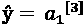
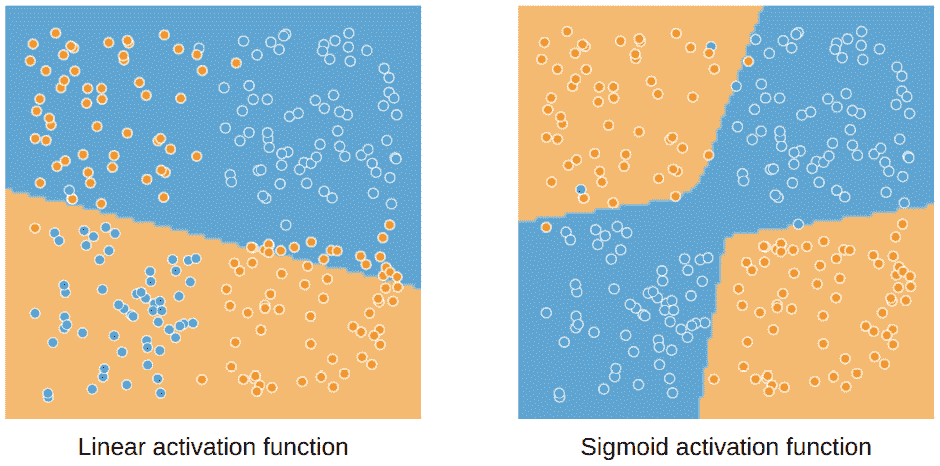
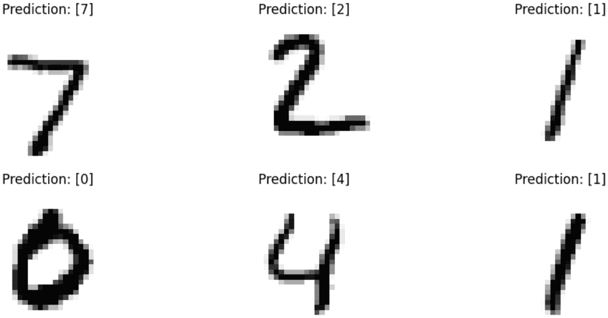

# 第六章：深度学习提示

**深度学习** 是基于神经网络的机器学习特定领域。深度学习被认为在处理非结构化数据（如文本、音频和图像）时特别强大，但对于时间序列和结构化数据也能发挥作用。在本章中，我们将回顾深度学习的基础知识，从感知机到神经网络的训练。我们将提供训练神经网络的三大主要用例的配方：回归、二分类和多类分类。

在本章中，我们将覆盖以下配方：

+   训练感知机

+   训练一个回归神经网络

+   训练一个二分类神经网络

+   训练一个多类分类神经网络

# 技术要求

在本章中，你将训练一个感知机以及多个神经网络。为此，需要以下库：

+   NumPy

+   pandas

+   scikit-learn

+   PyTorch

+   torchvision

# 训练感知机

感知机可以说是深度学习的基石。即便在生产系统中没有直接使用感知机，理解其原理对于构建深度学习的坚实基础是非常有帮助的。

在本配方中，我们将回顾感知机的基本概念，然后使用 scikit-learn 在鸢尾花数据集上训练一个感知机。

## 入门

感知机是一种最早提出用于模拟生物神经元的机器学习方法。它最早在 1940 年代提出，并在 1950 年代得到了实现。

从高层次来看，神经元可以被描述为一种接收输入信号并在输入信号的和超过某个阈值时发出信号的细胞。这正是感知机的工作原理；你只需做以下操作：

+   用特征替换输入信号

+   对这些特征应用加权和，并对其应用激活函数

+   用预测值替代输出信号

更正式地说，假设有 *n* 个输入特征  和 *n* 个权重 ，则感知机的输出 ŷ 如下所示：


其中  是偏置，*g* 是激活函数；从历史上看，激活函数通常是步进函数，它对正输入值返回 1，其他情况返回 0。因此，最终，对于 *n* 个输入特征，感知机由 *n+1* 个参数组成：每个特征一个参数，再加上偏置。

提示

步进函数也被称为**赫维赛德函数**，并广泛应用于其他领域，如物理学。

感知机的前向计算总结在*图 6.1*中。如你所见，给定一组特征  和权重 ，前向计算只是加权和，再应用激活函数。


图 6.1 – 感知机的数学表示：从输入特征到输出，通过权重和激活函数

在实践中，安装此配方所需的唯一工具是 scikit-learn。可以通过 `pip install` `scikit-learn` 命令安装。

## 如何实现…

我们将再次使用 Iris 数据集，因为感知机在复杂分类任务中表现并不好：

1.  从 scikit-learn 中导入所需的模块：

    +   `load_iris`：一个加载数据集的函数

    +   `train_test_split`：一个用于拆分数据的函数

    +   `StandardScaler`：一个可以重新缩放数据的类

    +   `Perceptron`：包含感知机实现的类：

        ```py
        from sklearn.datasets import load_iris
        ```

        ```py
        from sklearn.model_selection import train_test_split
        ```

        ```py
        from sklearn.preprocessing import StandardScaler
        ```

        ```py
        from sklearn.linear_model import Perceptron
        ```

1.  加载 Iris 数据集：

    ```py
    # Load the Iris dataset
    
    X, y = load_iris(return_X_y=True)
    ```

1.  使用 `train_test_split` 函数将数据拆分为训练集和测试集，并将 `random state` 设置为 `0` 以确保可重复性：

    ```py
    # Split the data
    
    X_train, X_test, y_train, y_test = train_test_split(
    
        X, y, random_state=0)
    ```

1.  由于这里所有的特征都是定量的，我们只需使用标准缩放器对所有特征进行重新缩放：

    ```py
    # Rescale the data
    
    scaler = StandardScaler()
    
    X_train = scaler.fit_transform(X_train)
    
    X_test = scaler.transform(X_test)
    ```

1.  使用默认参数实例化模型，并通过 `.fit()` 方法在训练集上进行拟合：

    ```py
    perc = Perceptron()perc.fit(X_train, y_train)
    ```

1.  使用 `LinearRegression` 类的 `.score()` 方法在训练集和测试集上评估模型，并提供准确率得分：

    ```py
    # Print the R2-score on train and test
    
    print('R2-score on train set:',
    
        perc.score(X_train, y_train))
    
    print('R2-score on test set:',
    
        perc.score(X_test, y_test))
    ```

这里是输出：

```py
R2-score on train set: 0.9285714285714286
R2-score on test set: 0.8421052631578947
```

1.  出于好奇，我们可以查看 `.coef_` 中的权重和 `.intercept_` 中的偏置。

    ```py
    print('weights:', perc.coef_)
    
    print('bias:', perc.intercept_)
    ```

这里是输出：

```py
weights: [[-0.49201984  2.77164495 -3.07208498 -2.51124259]
  [ 0.41482008 -1.94508614  3.2852582  -2.60994774]
  [-0.32320969  0.48524348  5.73376173  4.93525738]] bias: [-2\. -3\. -6.]
```

重要提示

共有三组四个权重和一个偏置，因为 scikit-learn 自动处理 One-vs-Rest 多类分类，所以我们为每个类别使用一个感知机。

## 还有更多…

感知机不仅仅是一个机器学习模型。它可以用来模拟逻辑门：OR、AND、NOR、NAND 和 XOR。让我们来看看。

我们可以通过以下代码轻松实现感知机的前向传播：

```py
import numpy as np
class LogicalGatePerceptron:
    def __init__(self, weights: np.array, bias: float):
        self.weights = weights
        self.bias = bias
    def forward(self, X: np.array) -> int:
        return (np.dot(
            X, self.weights) + self.bias > 0).astype(int)
```

这段代码没有考虑许多边界情况，但在这里仅用于解释和演示简单概念。

AND 门具有以下真值表中定义的输入和期望输出：

| **输入 1** | **输入 2** | **输出** |
| --- | --- | --- |
| 0 | 0 | 0 |
| 0 | 1 | 0 |
| 1 | 0 | 0 |
| 1 | 1 | 1 |

表 6.1 – AND 门真值表

让我们使用一个具有两个特征（输入 1 和输入 2）和四个样本的数组 `X` 来重现这个数据，并使用一个包含期望输出的数组 `y`：

```py
# Define X and y
X = np.array([[0, 0], [0, 1], [1, 0], [1, 1]])
y = [0, 0, 0, 1]
```

我们现在可以找到一组权重和偏置，使感知机能够作为 AND 门工作，并检查结果以验证它是否正常工作：

```py
gate = LogicalGatePerceptron(np.array([1, 1]), -1)
y_pred = gate.forward(X)
print('Error:', (y - y_pred).sum())
```

这里是输出：

```py
Error: 0
```

以相同的逻辑，感知机可以创建大多数基本的逻辑门：

+   AND 门：权重 [1, 1] 和偏置 -1

+   OR 门：权重 [1, 1] 和偏置 0

+   NOR 门：权重 [-1, -1] 和偏置 1

+   NAND 门：权重 [-1, -1] 和偏置 2

+   XOR 门：这需要两个感知机

提示

你可以通过试错法猜测权重和偏置，但你也可以使用逻辑门的真值表来做出合理的猜测，甚至可以通过解方程组来求解。

这意味着使用感知机可以计算任何逻辑函数。

## 另见

scikit-learn 实现的官方文档：[`scikit-learn.org/stable/modules/generated/sklearn.linear_model.Perceptron.xhtml`](https://scikit-learn.org/stable/modules/generated/sklearn.linear_model.Perceptron.xhtml)。

# 回归任务中训练神经网络

感知器并不是一个强大且常用的机器学习模型，但将多个感知器结合在神经网络中使用，可以成为一个强大的机器学习模型。在本教程中，我们将回顾一个简单的神经网络，有时称为**多层感知器**或**基础神经网络**。然后，我们将使用广泛应用于深度学习的框架 PyTorch，在加利福尼亚住房数据集上进行回归任务的训练。

## 开始使用

让我们先回顾一下什么是神经网络，以及如何从输入特征开始进行神经网络的前向传播。

神经网络可以分为三部分：

+   **输入层**，包含输入特征

+   **隐层**，可以有任意数量的层和单元

+   **输出层**，由神经网络的预期输出定义

在隐层和输出层中，我们将每个单元（或神经元）视为一个感知器，具有其自己的权重和偏差。

这三部分在*图 6.2*中得到了很好的表示。


图 6.2 – 神经网络的典型表示：左边是输入层，中间是隐层，右边是输出层

我们将记录输入特征 ，第*l*层单位*i*的激活值，以及 ，第*l*层单位*i*的权重。

提示

如果神经网络中至少有一个隐层，我们认为它涉及深度学习。

训练回归任务中的神经网络与训练线性回归没有太大区别。它由相同的组成部分构成：

+   前向传播，从输入特征和权重到预测结果

+   一个需要最小化的损失函数

+   更新权重的算法

让我们来看看这些组成部分。

### 前向传播

前向传播用于从输入特征中计算并输出结果。它必须从左到右计算，从输入层（输入特征）到输出层（输出预测）。每个单元都是感知器，第一隐层的计算相对简单：


其中  是偏差项， 是第 1 层的激活函数。

现在，如果我们想计算第二个隐藏层的激活值 ，我们将使用完全相同的公式，但输入将是第一隐藏层的激活值 ()，而不是输入特征：


提示

你可以轻松地推广到任意数量的隐藏层和每层任意数量的单元——原理保持不变。

最后，输出层的计算方式完全相同，只不过在这种情况下我们只有一个输出神经元：


有一点值得强调：激活函数也是依赖于层的，这意味着每一层可以有不同的激活函数。对于输出层来说，这一点尤为重要，因为它需要根据任务和预期输出使用特定的输出函数。

对于回归任务，常用的激活函数是线性激活函数，这样神经网络的输出值可以是任意数字。

提示

激活函数在神经网络中起着决定性作用：它增加了非线性。如果我们对隐藏层仅使用线性激活函数，无论层数多少，这相当于没有隐藏层。

### 损失函数

在回归任务中，损失函数可以与线性回归中的相同：均方误差。在我们的例子中，如果我们认为预测 *ŷ* 是输出值 ，那么损失 *L* 只是如下：


假设 *j* 是样本索引。

### 更新权重

更新权重是通过尝试最小化损失函数来完成的。这与线性回归几乎相同。难点在于，与线性回归不同，我们有多个层的单元，其中每个单元都有权重和偏置，都需要更新。这就是所谓的反向传播，它允许逐层更新，从最右侧到最左侧（遵循 *图 6.2* 中的约定）。

反向传播的细节，尽管有用且有趣，但超出了本书的范围。

同样，正如在逻辑回归中有多个算法优化权重（在 `scikit-learn` 的 `LogisticRegression` 中的 `solver` 参数），训练神经网络也有多种算法。这些算法通常被称为**优化器**。其中最常用的有**随机梯度下降**（**SGD**）和**自适应动量**（**Adam**）。

### PyTorch

PyTorch 是一个广泛使用的深度学习框架，使我们能够轻松地训练和重用深度学习模型。

它非常容易使用，并且可以通过以下命令轻松安装：

```py
pip install torch
```

对于这个食谱，我们还需要 `scikit-learn` 和 `matplotlib`，可以使用 `pip install` `scikit-learn matplotlib` 安装它们。

## 如何实现…

在这个示例中，我们将构建并训练一个神经网络来处理加利福尼亚住房数据集：

1.  首先，我们需要导入所需的模块。在这些导入中，有一些来自我们在本书中已经使用过的 scikit-learn：

    +   `fetch_california_housing`用于加载数据集。

    +   `train_test_split`用于将数据分割为训练集和测试集。

    +   `StandardScaler`用于重新缩放定量数据。

    +   `r2_score`用于评估模型。

1.  为了显示目的，我们还导入了 matplotlib：

    ```py
    from sklearn.datasets import fetch_california_housing
    
    from sklearn.model_selection import train_test_split
    
    from sklearn.preprocessing import StandardScaler
    
    from sklearn.metrics import r2_score
    
    import matplotlib.pyplot as plt
    ```

1.  我们还需要从 torch 导入一些模块：

    +   `torch`本身提供了一些库中较低层级的函数。

    +   `torch.nn`包含许多用于构建神经网络的有用类。

    +   `torch.nn.functional`用于一些有用的函数。

    +   `Dataset`和`DataLoader`用于处理数据操作：

        ```py
        import torch
        ```

        ```py
        import torch.nn as nn
        ```

        ```py
        import torch.nn.functional as F
        ```

        ```py
        from torch.utils.data import Dataset, DataLoader
        ```

1.  我们需要使用`fetch_california_housing`函数加载数据，并返回特征和标签：

    ```py
    X, y = fetch_california_housing(return_X_y=True)
    ```

1.  然后我们可以使用`train_test_split`函数将数据分割为训练集和测试集。我们设置测试集大小为 20%，并为可重复性指定随机种子：

    ```py
    X_train, X_test, y_train, y_test = train_test_split(
    
        X.astype(np.float32), y.astype(np.float32),
    
           test_size=0.2, random_state=0)
    ```

1.  现在我们可以使用标准缩放器对数据进行重新缩放：

    ```py
    scaler = StandardScaler()
    
    X_train = scaler.fit_transform(X_train)
    
    X_test = scaler.transform(X_test)
    ```

重要提示

请注意，我们将*X*和*y*变量转换为 float32 类型的变量。这是为了防止后续在 PyTorch 中处理 float64 变量时出现问题。

1.  对于 PyTorch，我们需要创建数据集类。这里并不复杂；这个类只需要以下内容才能正常工作：

    +   它必须继承自`Dataset`类（前面导入过的）。

    +   它必须有一个构造函数（`__init__`方法），处理（并可选地准备）数据。

    +   它必须有一个`__len__`方法，以便能够获取样本的数量。

    +   它必须有一个`__getitem__`方法，以便获取给定索引的`X`和`y`。

让我们为加利福尼亚数据集实现这个，并将我们的类命名为`CaliforniaDataset`：

```py
class CaliforniaDataset(Dataset):
    def __init__(self, X: np.array, y: np.array):
        self.X = torch.from_numpy(X)
        self.y = torch.from_numpy(y)
    def __len__(self) -> int:
        return len(self.X)
    def __getitem__(self, idx: int) -> tuple[torch.Tensor]:
        return self.X[idx], self.y[idx]
```

如果我们分解这个类，我们会看到以下函数：

+   `init`构造函数简单地将`X`和`y`转换为 torch 张量，使用`torch.from_numpy`函数，并将结果存储为类的属性。

+   `len`方法只是返回`X`属性的长度；它同样适用于使用`y`属性的长度。

+   `getitem`方法简单地返回一个元组，其中包含给定索引`idx`的`X`和`y`张量。

这相当简单，然后会让`pytorch`知道数据是什么，数据集中有多少个样本，以及样本`i`是什么。为此，我们需要实例化一个`DataLoader`类。

小贴士

重新缩放也可以在这个`CaliforniaDataset`类中计算，以及任何预处理。

1.  现在，我们实例化`CaliforniaDataset`对象用于训练集和测试集。然后，我们使用导入的`DataLoader`类实例化相关的加载器：

    ```py
    # Instantiate datasets
    
    training_data = CaliforniaDataset(X_train, y_train)
    
    test_data = CaliforniaDataset(X_test, y_test)
    
    # Instantiate data loaders
    
    train_dataloader = DataLoader(training_data,
    
        batch_size=64, shuffle=True)
    
    test_dataloader = DataLoader(test_data, batch_size=64,
    
        shuffle=True)
    ```

数据加载器实例有几个可用的选项。在这里，我们指定以下内容：

+   `batch_size`：训练的批次大小。它可能对最终结果产生影响。

+   `shuffle`：确定是否在每个 epoch 时打乱数据。

1.  我们最终可以创建神经网络模型类。对于这个类，我们只需要填充两个方法：

    +   构造函数，包含所有有用的内容，如参数和属性

    +   `forward`方法计算前向传播：

        ```py
        class Net(nn.Module):
        ```

        ```py
            def __init__(self, input_shape: int,
        ```

        ```py
                hidden_units: int = 24):
        ```

        ```py
                    super(Net, self).__init__()
        ```

        ```py
                    self.hidden_units = hidden_units
        ```

        ```py
                    self.fc1 = nn.Linear(input_shape,
        ```

        ```py
                        self.hidden_units)
        ```

        ```py
                    self.fc2 = nn.Linear(self.hidden_units,
        ```

        ```py
                        self.hidden_units)
        ```

        ```py
                    self.output = nn.Linear(self.hidden_units,
        ```

        ```py
                        1)
        ```

        ```py
            def forward(self,
        ```

        ```py
                x: torch.Tensor) -> torch.Tensor:
        ```

        ```py
                    x = self.fc1(x)
        ```

        ```py
                    x = F.relu(x)
        ```

        ```py
                    x = self.fc2(x)
        ```

        ```py
                    x = F.relu(x)
        ```

        ```py
                    output = self.output(x)
        ```

        ```py
                    return output
        ```

如果我们细分一下，我们设计了一个类，它接受两个输入参数：

+   `input_shape`是神经网络的输入形状——这基本上是数据集中特征的数量

+   `hidden_units`是隐藏层中单元的数量，默认为 24

神经网络本身包括以下内容：

+   两个隐藏层，每个隐藏层有`hidden_units`个单元，激活函数为 ReLU

+   一个输出层，只有一个单元，因为我们只需要预测一个值

重要提示

关于 ReLU 和其他激活函数的更多内容将在下一个*这里有* *更多*小节中给出。

1.  我们现在可以实例化一个神经网络，并在随机数据（形状符合预期）上进行测试，以检查`forward`方法是否正常工作：

    ```py
    # Instantiate the network
    
    net = Net(X_train.shape[1])
    
    # Generate one random sample of 8 features
    
    random_data = torch.rand((1, X_train.shape[1]))
    
    # Compute the forward
    
    propagationprint(net(random_data))
    ```

我们将得到这个输出：

```py
tensor([[-0.0003]], grad_fn=<AddmmBackward0>)
```

正如我们所看到的，前向传播在随机数据上的计算工作得很好，按预期返回了一个单一的值。这个步骤中的任何错误都意味着我们做错了什么。

1.  在能够在数据上训练神经网络之前，我们需要定义损失函数和优化器。幸运的是，均方误差已经实现，并作为`nn.MSELoss()`提供。有许多优化器可以选择；我们在这里选择了 Adam，但也可以测试其他优化器：

    ```py
    criterion = nn.MSELoss()
    
    optimizer = torch.optim.Adam(net.parameters(), lr=0.001)
    ```

重要提示

优化器需要将网络参数作为输入传递给其构造函数。

1.  最后，我们可以使用以下代码训练神经网络 10 个 epoch：

    ```py
    losses = []
    
    # Loop over the dataset multiple times
    
    for epoch in range(10):
    
        # Reset the loss for this epoch
    
        running_loss = 0.
    
        For I, data in enumerate(train_dataloader, 0):
    
            # Get the inputs per batch: data is a list of [inputs, labels]
    
            inputs, labels = data
    
            # Zero the parameter gradients
    
            optimizer.zero_grad()
    
            # Forward propagate + backward + optimize
    
            outputs = net(inputs)
    
            # Unsqueeze for dimension matching
    
            labels = labels.unsqueeze(1)
    
            # Compute the loss
    
            Loss = criterion(outputs, labels)
    
            # Backpropagate and update the weights
    
            loss.backward()
    
            optimizer.step()
    
            # Add this loss to the running loss
    
            running_loss += loss.item()
    
         # Compute the loss for this epoch and add it to the list
    
        epoch_loss = running_loss / len(
    
            train_dataloader)
    
        losses.append(epoch_loss)
    
        # Print the epoch and training loss
    
        print(f'[epoch {epoch + 1}] loss: {
    
            epoch_loss:.3f}')print('Finished Training')
    ```

希望注释是自解释的。基本上，有两个嵌套循环：

+   一个外部循环遍历所有的 epoch：即模型在整个数据集上训练的次数

+   一个内循环遍历样本：每个步骤中，使用`batch_size`样本的批次来训练模型

在内循环的每一步中，我们有以下主要步骤：

+   获取一批数据：包括特征和标签

+   对数据进行前向传播并获取输出预测

+   计算损失：预测值与标签之间的均方误差

+   使用反向传播更新网络的权重

在每个步骤结束时，我们打印损失值，希望它随着每个 epoch 的进行而减少。

1.  我们可以将损失作为 epoch 的函数进行绘制。这非常直观，并且让我们能够确保网络在学习，如果损失在减少的话：

    ```py
    plt.plot(losses)
    
    plt.xlabel('epoch')
    
    plt.ylabel('loss (MSE)')plt.show()
    ```

这是结果图：


图 6.3 – MSE 损失与 epoch 的关系

重要提示

我们也可以在这一步追踪测试集上的损失，并显示出来，以获取更多信息。为了避免信息过载，我们将在下一个食谱中进行这个操作。

1.  最后，我们可以在训练集和测试集上评估模型。正如本书前面在回归任务中所做的那样，我们将使用 R2-score。其他相关指标也可以使用：

    ```py
    # Compute the predictions with the trained neural
    
    Network
    
    y_train_pred = net(torch.tensor((
    
        X_train))).detach().numpy()
    
    y_test_pred = net(torch.tensor((
    
        X_test))).detach().numpy()
    
    # Compute the R2-score
    
    print('R2-score on training set:',
    
        r2_score(y_train, y_train_pred))
    
    print('R2-score on test set:',
    
        r2_score(y_test, y_test_pred))
    ```

这是输出结果：

```py
R2-score on training set: 0.7542622050620708 R2-score on test set: 0.7401526252651656
```

正如我们在这里看到的，我们在训练集上得到了合理的 R2-score 值 0.74，存在轻微的过拟合。

## 还有更多内容…

在本节中，我们提到了激活函数，但并没有真正解释它们是什么或为什么需要它们。

简而言之，激活函数添加了非线性因素，使模型能够学习更复杂的模式。事实上，如果我们有一个没有激活函数的神经网络，无论层数或单元数多少，整个模型都等同于一个线性模型（例如线性回归）。这一点在 *图 6.4* 中得到了总结。



图 6.4 – 左侧的神经网络没有激活函数，只能学习线性可分的决策函数；右侧的神经网络有激活函数，可以学习复杂的决策函数

有许多可用的激活函数，但最常见的隐藏层激活函数包括 sigmoid、ReLU 和 tanh。

### Sigmoid

Sigmoid 函数与逻辑回归中使用的函数相同：


这个函数的值范围从 0 到 1，当 *x =* *0* 时输出 0.5。

### tanh

tanh 或双曲正切函数的值范围从 -1 到 1，当 *x* 为 0 时值为 0：


### ReLU

**ReLU** 或 **修正线性单元** 函数对于任何负输入值返回 0，对于任何正输入值 *x* 返回 *x*。与 sigmoid 和 tanh 不同，它不会出现平台效应，因此能够避免梯度消失问题。其公式如下：


### 可视化

我们可以使用以下代码将这三个激活函数（sigmoid、tanh 和 ReLU）一起可视化，从而更直观地理解它们：

```py
import numpy as np
import matplotlib.pyplot as plt
x = np.arange(-2, 2, 0.02)
sigmoid = 1./(1+np.exp(-x))
tanh = (np.exp(x)-np.exp(-x))/(np.exp(x)+np.exp(-x))
relu = np.max([np.zeros(len(x)), x], axis=0)
plt.plot(x, sigmoid)
plt.plot(x, tanh)
plt.plot(x, relu)plt.grid()
plt.xlabel('x')
plt.ylabel('activation')
plt.legend(['sigmoid', 'tanh', 'relu'])
plt.show()
```

运行之前的代码时，你会得到这个输出，计算的是这些函数在 [-2, 2] 范围内的输出值：

![图 6.5 – Sigmoid、tanh 和 ReLU 激活函数在 [-2, 2] 输入范围内的结果图](img/B19629_06_05.jpg)

图 6.5 – Sigmoid、tanh 和 ReLU 激活函数在 [-2, 2] 输入范围内的结果图

想了解更多关于 PyTorch 中可用的激活函数，请查看以下链接：[`pytorch.org/docs/stable/nn.xhtml#non-linear-activations-weighted-sum-nonlinearity.`](https://pytorch.org/docs/stable/nn.xhtml#non-linear-activations-weighted-sum-nonlinearity%0D)

## 另见

这里有几个 PyTorch 教程的链接，它们对于熟悉 PyTorch 和深入理解其工作原理非常有帮助：

+   [`pytorch.org/tutorials/recipes/recipes/defining_a_neural_network.xhtml`](https://pytorch.org/tutorials/recipes/recipes/defining_a_neural_network.xhtml)

+   [`pytorch.org/tutorials/beginner/blitz/neural_networks_tutorial.xhtml`](https://pytorch.org/tutorials/beginner/blitz/neural_networks_tutorial.xhtml)

+   [`pytorch.org/tutorials/beginner/blitz/cifar10_tutorial.xhtml`](https://pytorch.org/tutorials/beginner/blitz/cifar10_tutorial.xhtml)

+   [`pytorch.org/tutorials/beginner/basics/data_tutorial.xhtml?highlight=dataset`](https://pytorch.org/tutorials/beginner/basics/data_tutorial.xhtml?highlight=dataset)

以下链接是一个关于深度学习的优秀网站，适合那些希望更好理解神经网络、梯度下降和反向传播的人：[`neuralnetworksanddeeplearning.com/.`](http://neuralnetworksanddeeplearning.com/%0D)

# 训练一个用于二分类的神经网络

在这个食谱中，我们将训练第一个用于乳腺癌数据集的二分类任务神经网络。我们还将了解学习率和优化器对优化过程的影响，以及如何通过测试集评估模型。

## 准备工作

正如我们在这个食谱中所看到的，训练一个用于二分类的神经网络与训练一个回归神经网络并没有太大不同。主要有两个变化需要进行：

+   输出层的激活函数

+   损失函数

在之前的回归任务食谱中，输出层没有激活函数。实际上，对于回归任务，可以期望预测值取任意值。

对于二分类任务，我们期望输出是一个概率值，也就是介于 0 和 1 之间的值，就像逻辑回归一样。这就是为什么在做二分类时，输出层的激活函数通常是 sigmoid 函数。最终的预测结果将与逻辑回归的预测结果类似：一个数值，我们可以应用一个阈值（例如 0.5），超过该阈值时我们认为预测为类别 1。

由于标签是 0 和 1，而预测值是介于 0 和 1 之间的值，因此均方误差不再适用于训练此类模型。因此，就像逻辑回归一样，我们将使用二元交叉熵损失函数。

这个食谱所需的库是 matplotlib、scikit-learn 和 PyTorch，可以通过 `pip install matplotlib` `scikit-learn torch` 来安装。

## 如何做到这一点…

我们将训练一个具有两个隐藏层的简单神经网络，用于乳腺癌数据集上的二分类任务。尽管这个数据集不太适合深度学习，因为它是一个小型数据集，但它使我们能够轻松理解训练二分类神经网络的所有步骤：

1.  我们从 scikit-learn 导入了以下所需的库：

    +   `load_breast_cancer` 用于加载数据集

    +   `train_test_split` 用于将数据拆分为训练集和测试集

    +   用于重新缩放定量数据的 `StandardScaler`

    +   用于评估模型的 `accuracy_score`

我们还需要 matplotlib 来进行显示，并且需要从 torch 中引入以下内容：

+   `torch` 本身

+   包含构建神经网络所需类的 `torch.nn`

+   用于激活函数（如 ReLU）的 `torch.nn.functional`

+   处理数据的 `Dataset` 和 `DataLoader`

    ```py
    from sklearn.datasets import load_breast_cancer
    
    from sklearn.model_selection import train_test_split
    
    from sklearn.preprocessing import StandardScaler
    
    from sklearn.metrics import accuracy_score
    
    import matplotlib.pyplot as plt
    
    import torchimport torch.nn as nn
    
    import torch.nn.functional as F
    
    from torch.utils.data import Dataset, DataLoader
    ```

1.  使用 `load_breast_cancer` 函数加载特征和标签：

    ```py
    X, y = load_breast_cancer(return_X_y=True)
    ```

1.  将数据拆分为训练集和测试集，指定随机状态以确保结果可复现。同时将特征和标签转换为 `float32`，以便与 PyTorch 后续操作兼容：

    ```py
    X_train, X_test, y_train, y_test = train_test_split(
    
        X.astype(np.float32), y.astype(np.float32),
    
        test_size=0.2, random_state=0)
    ```

1.  创建处理数据的 `Dataset` 类。请注意，在这个食谱中，我们将数据重新缩放集成到此步骤中，不像在之前的食谱中那样：

    ```py
    class BreastCancerDataset(Dataset):
    
        def __init__(self, X: np.array, y: np.array,
    
            x_scaler: StandardScaler = None):
    
                if x_scaler is None:
    
                    self.x_scaler = StandardScaler()
    
                    X = self.x_scaler.fit_transform(X)
    
                else:
    
                    self.x_scaler = x_scaler
    
                    X = self.x_scaler.transform(X)
    
                self.X = torch.from_numpy(X)
    
                self.y = torch.from_numpy(y)
    
        def __len__(self) -> int:
    
            return len(self.X)
    
        def __getitem__(self, idx: int) -> tuple[torch.Tensor]:
    
            return self.X[idx], self.y[idx]
    ```

重要提示

将缩放器包含在类中有利有弊，其中一个优点是可以正确处理训练集和测试集之间的数据泄露。

1.  实例化训练集和测试集及其加载器。请注意，训练数据集没有提供缩放器，而测试数据集则提供了训练集的缩放器，以确保所有数据以相同方式处理，避免数据泄露：

    ```py
    training_data = BreastCancerDataset(X_train, y_train)
    
    test_data = BreastCancerDataset(X_test, y_test,
    
        training_data.x_scaler)
    
    train_dataloader = DataLoader(training_data,
    
        batch_size=64, shuffle=True)
    
    test_dataloader = DataLoader(test_data, batch_size=64,
    
        shuffle=True)
    ```

1.  构建神经网络。在这里，我们构建一个具有两个隐藏层的神经网络。在 `forward` 方法中，`torch.sigmoid()` 函数被应用于输出层，确保返回的值在 0 和 1 之间。实例化模型所需的唯一参数是输入形状，这里仅为特征的数量：

    ```py
    class Net(nn.Module):
    
        def __init__(self, input_shape: int,
    
            hidden_units: int = 24):
    
                super(Net, self).__init__()
    
                    self.hidden_units = hidden_units
    
                    self.fc1 = nn.Linear(input_shape,
    
                        self.hidden_units)
    
                    self.fc2 = nn.Linear(
    
                        self.hidden_units,
    
                        self.hidden_units)
    
                    self.output = nn.Linear(
    
                        self.hidden_units, 1)
    
        def forward(self, x: torch.Tensor) -> torch.Tensor:
    
            x = self.fc1(x)
    
            x = F.relu(x)
    
            x = self.fc2(x)
    
            x = F.relu(x)
    
            output = torch.sigmoid(self.output(x))
    
            return output
    ```

1.  现在我们可以使用正确的输入形状实例化模型，并检查给定随机张量上的前向传播是否正常工作：

    ```py
    # Instantiate the network
    
    net = Net(X_train.shape[1])
    
    # Generate one random sample
    
    random_data = torch.rand((1, X_train.shape[1]))
    
    # Compute the forward propagation
    
    print(net(random_data))
    ```

运行上述代码后，我们得到以下输出：

```py
tensor([[0.4487]], grad_fn=<SigmoidBackward0>)
```

1.  定义损失函数和优化器。如前所述，我们将使用二元交叉熵损失，PyTorch 中提供的 `nn.BCELoss()` 实现此功能。选择的优化器是 `Adam`，但也可以测试其他优化器：

    ```py
    criterion = nn.BCELoss()
    
    optimizer = torch.optim.Adam(net.parameters(),
    
        lr=0.001)
    ```

重要提示

有关优化器的更多解释将在下一节 *There’s* *more* 中提供。

1.  现在我们可以训练神经网络 50 个 epoch。我们还会在每个 epoch 计算训练集和测试集的损失，以便之后绘制它们。为此，我们需要切换模型的模式：

    +   在训练训练集之前，使用 `model.train()` 切换到训练模式

    +   在评估测试集之前，使用 `model.eval()` 切换到 `eval` 模式

        ```py
        train_losses = []
        ```

        ```py
        test_losses = []
        ```

        ```py
        # Loop over the dataset 50 times
        ```

        ```py
        for epoch in range(50):
        ```

        ```py
            ## Train the model on the training set
        ```

        ```py
            running_train_loss = 0.
        ```

        ```py
            # Switch to train mode
        ```

        ```py
            net.train()
        ```

        ```py
            # Loop over the batches in train set
        ```

        ```py
            for i, data in enumerate(train_dataloader, 0):
        ```

        ```py
                # Get the inputs: data is a list of [inputs, labels]
        ```

        ```py
                inputs, labels = data
        ```

        ```py
                # Zero the parameter gradients
        ```

        ```py
                optimizer.zero_grad()
        ```

        ```py
                # Forward + backward + optimize
        ```

        ```py
                outputs = net(inputs)
        ```

        ```py
                loss = criterion(outputs, labels.unsqueeze(1))
        ```

        ```py
                loss.backward()
        ```

        ```py
                optimizer.step()
        ```

        ```py
                # Add current loss to running loss
        ```

        ```py
                running_train_loss += loss.item()
        ```

        ```py
            # Once epoch is over, compute and store the epoch loss
        ```

        ```py
            train_epoch_loss = running_train_loss / len(
        ```

        ```py
                train_dataloader)
        ```

        ```py
            train_losses.append(train_epoch_loss)
        ```

        ```py
            ## Evaluate the model on the test set
        ```

        ```py
            running_test_loss = 0.
        ```

        ```py
            # Switch to eval model
        ```

        ```py
            net.eval()
        ```

        ```py
            with torch.no_grad():
        ```

        ```py
                # Loop over the batches in test set
        ```

        ```py
                for i, data in enumerate(test_dataloader, 0):
        ```

        ```py
                    # Get the inputs
        ```

        ```py
                    inputs, labels = data
        ```

        ```py
                    # Compute forward propagation
        ```

        ```py
                    outputs = net(inputs)
        ```

        ```py
                    # Compute loss
        ```

        ```py
                    loss = criterion(outputs,
        ```

        ```py
                        labels.unsqueeze(1))
        ```

        ```py
                    # Add to running loss
        ```

        ```py
                    running_test_loss += loss.item()
        ```

        ```py
                    # Compute and store the epoch loss
        ```

        ```py
                    test_epoch_loss = running_test_loss / len(
        ```

        ```py
                        test_dataloader)
        ```

        ```py
                    test_losses.append(test_epoch_loss)
        ```

        ```py
            # Print stats
        ```

        ```py
            print(f'[epoch {epoch + 1}] Training loss: {
        ```

        ```py
                train_epoch_loss:.3f} | Test loss: {
        ```

        ```py
                    test_epoch_loss:.3f}')
        ```

        ```py
            print('Finished Training')
        ```

重要提示

请注意在评估部分使用 `with` `torch.no_grad()`。这行代码允许我们禁用自动求导引擎，从而加速处理。

1.  现在，我们将训练集和测试集的损失作为 epoch 的函数绘制，使用上一步骤中计算的两个列表：

    ```py
    plt.plot(train_losses, label='train')
    
    plt.plot(test_losses, label='test')
    
    plt.xlabel('epoch')plt.ylabel('loss (BCE)')
    
    plt.legend()
    
    plt.show()
    ```

这是输出结果：


图 6.6 – 训练集和测试集的 MSE 损失

正如我们所看到的，两个损失都在减少。一开始，训练损失和测试损失几乎相等，但在 10 个 epoch 后，训练损失继续减少，而测试损失没有变化，意味着模型在训练集上发生了过拟合。

1.  可以使用训练集和测试集的准确度分数来评估模型，通过 scikit-learn 的`accuracy_score`函数。计算预测结果时需要更多步骤，因为我们必须执行以下操作才能获得实际的类别预测：

    +   使用用于训练的标准化器对数据进行重新缩放，该标准化器可在`training_data.x_scaler`属性中找到

    +   使用`torch.tensor()`将 NumPy 数据转换为 torch 张量

    +   将前向传播应用到模型上

    +   使用`.detach().numpy()`将输出的 torch 张量转换回 NumPy

    +   使用`>` `0.5`应用阈值，将概率预测（介于 0 和 1 之间）转换为类别预测

        ```py
        # Compute the predictions with the trained neural network
        ```

        ```py
        y_train_pred = net(torch.tensor((
        ```

        ```py
            training_data.x_scaler.transform(
        ```

        ```py
                X_train)))).detach().numpy() > 0.5
        ```

        ```py
        y_test_pred = net(torch.tensor((
        ```

        ```py
            training_data.x_scaler.transform(
        ```

        ```py
                X_test)))).detach().numpy() > 0.5
        ```

        ```py
        # Compute the accuracy score
        ```

        ```py
        print('Accuracy on training set:', accuracy_score(
        ```

        ```py
            y_train, y_train_pred))
        ```

        ```py
        print('Accuracy on test set:', accuracy_score(y_test,
        ```

        ```py
            y_test_pred))
        ```

这是前面代码的输出：

```py
Accuracy on training set: 0.9912087912087912 Accuracy on test set: 0.9649122807017544
```

我们在训练集上获得了 99%的准确率，在测试集上获得了 96%的准确率，这证明了模型确实存在过拟合现象，正如从训练和测试损失随 epoch 变化的曲线所预期的那样。

## 还有更多…

正如我们在这里看到的，损失随着时间的推移而减少，意味着模型实际上在学习。

重要提示

即使有时损失出现一些波动，只要总体趋势保持良好，也不必担心。

有两个重要的概念可能会影响这些结果，它们在某种程度上是相互关联的：学习率和优化器。与逻辑回归或线性回归类似，优化器的目标是找到提供最低可能损失值的参数。因此，这是一个最小化问题，可以如*图 6.7*所示表示：我们寻求找到一组参数，能给出最低的损失值。


图 6.7 – 损失 L 作为参数 w 的函数的表示。红色交叉点是最优点，而蓝色交叉点是一个随机的任意权重集合

让我们看看学习率如何影响学习曲线。

### 学习率

在 PyTorch 中，通过实例化优化器时设置学习率，例如使用*lr=0.001*参数。可以说，学习率的值主要有四种情况，正如在*图 6.8*中所展示的，从较低的学习率到非常高的学习率。


图 6.8 – 学习率的四个主要类别：学习率过低、合适的学习率、学习率过高、学习率非常高（损失发散）

就损失而言，学习率的变化可以从*图 6**.9*中直观感受到，图中展示了多个 epoch 中权重和损失的变化过程。


图 6.9 – 学习率四种情况的可视化解释：a) 低学习率，b) 合适的学习率，c) 高学习率，d) 非常高的学习率

*图 6**.9* 可以通过以下内容进一步解释：

+   **低学习率 (a)**：损失会随着 epoch 的进行而逐渐减少，但速度太慢，可能需要非常长的时间才能收敛，也可能使模型陷入局部最小值。

+   **合适的学习率 (b)**：损失将稳定下降，直到接近全局最小值。

+   **略大的学习率 (c)**：损失一开始会急剧下降，但可能很快跳过全局最小值，无法再到达它。

+   **非常高的学习率 (d)**：损失将迅速发散，学习步伐过大。

调整学习率有时有助于产生最佳结果。几种技术，如所谓的学习率衰减，会随着时间推移逐渐降低学习率，以期更加准确地捕捉到全局最小值。

### 优化器

除了可能最著名的随机梯度下降和 Adam 优化器，深度学习中还有许多强大且有用的优化器。在不深入讨论这些优化器的细节的前提下，让我们简要了解它们的工作原理和它们之间的差异，如*图 6**.10*所总结：

+   **随机梯度下降** 只是根据每个批次的损失计算梯度，没有进一步的复杂处理。这意味着，有时一个批次的优化方向可能几乎与另一个批次相反。

+   **Adam** 使用动量，这意味着对于每个批次，除了使用该批次的梯度外，还会使用之前计算过的梯度的动量。这使得 Adam 能够保持一个更加一致的方向，并且有望更快地收敛。


图 6.10 – 向全局最小值训练的可视化表现，左边是随机梯度下降，右边是 Adam 保持之前步骤的动量

优化过程可以用一个简单的比喻来概括。这就像在雾霾中爬山，试图向下走（到达全局最小值）。你可以通过随机梯度下降或 Adam 来进行下降：

+   使用随机梯度下降时，你观察周围的情况，选择向下坡度最陡的方向，并沿该方向迈出一步。然后再重复一次。

+   使用 Adam，你做的和随机梯度下降一样，但速度更快。你迅速环顾四周，看到朝下坡度最陡的方向，然后试图朝那个方向迈出一步，同时保持之前步骤的惯性，因为你是在跑步。然后再重复这一过程。

请注意，在这个类比中，步长就是学习率。

## 另见

PyTorch 上可用的优化器列表：[`pytorch.org/docs/stable/optim.xhtml#algorithms`](https://pytorch.org/docs/stable/optim.xhtml#algorithms)

# 训练一个多类别分类神经网络

在这个食谱中，我们将关注另一个非常常见的任务：使用神经网络进行多类别分类，在本例中使用 PyTorch。我们将处理一个深度学习中的经典数据集：**MNIST 手写数字识别**。该数据集包含 28x28 像素的小灰度图像，描绘的是 0 到 9 之间的手写数字，因此有 10 个类别。

## 准备工作

在经典机器学习中，多类别分类通常不会原生处理。例如，在使用 scikit-learn 训练一个三分类任务（例如，Iris 数据集）时，scikit-learn 将自动训练三个模型，采用一对其余法（one-versus-the-rest）。

在深度学习中，模型可以原生处理超过两个类别。为了实现这一点，与二分类相比，只需进行少量的更改：

+   输出层的单元数与类别数相同：这样，每个单元将负责预测一个类别的概率

+   输出层的激活函数是 softmax 函数，该函数使得所有单元的和等于 1，从而允许我们将其视为概率

+   损失函数是交叉熵损失，考虑多个类别，而不是二元交叉熵

在我们的案例中，我们还需要对代码进行一些其他特定于数据本身的更改。由于输入现在是图像，因此需要进行一些转换：

+   图像是一个二维（或三维，如果是 RGB 彩色图像）数组，必须将其展平为一维

+   数据必须标准化，就像定量数据的重缩放一样

为了做到这一点，我们将需要以下库：torch、torchvision（用于数据集加载和图像转换）和 matplotlib（用于可视化）。可以通过`pip install torch` `torchvision matplotlib`来安装。

## 如何做……

在这个食谱中，我们将重用本章之前相同的模式：训练一个有两个隐藏层的神经网络。但有一些事情会有所不同：

+   输入数据是来自 MNIST 手写数字数据集的灰度图像，因此它是一个需要展平的二维数组

+   输出层将不只有一个单元，而是为数据集的十个类别准备十个单元；损失函数也会相应改变

+   我们不仅会在训练循环中计算训练和测试损失，还会计算准确率

现在让我们看看如何在实践中做到这一点：

1.  导入所需的库。和以前的食谱一样，我们导入了几个有用的 torch 模块和函数：

    +   `torch`本身

    +   `torch.nn`包含构建神经网络所需的类

    +   `torch.nn.functional`用于激活函数，例如 ReLU

    +   `DataLoader`用于处理数据

我们还需要从`torchvision`导入一些内容：

+   `MNIST`用于加载数据集

+   `transforms`用于转换数据集，包括重新缩放和展平数据：

    ```py
    import torch
    
    import torch.nn as nn
    
    import torch.nn.functional as F
    
    from torch.utils.data import DataLoader
    
    from torchvision.datasets import MNIST
    
    import torchvision.transforms as transforms
    
    import matplotlib.pyplot as plt
    ```

1.  实例化转换。我们使用`Compose`类，可以将两个或更多的转换组合起来。这里，我们组合了三个转换：

    +   `transforms.ToTensor()`：将输入图像转换为`torch.Tensor`格式。

    +   `transforms.Normalize()`：使用均值和标准差对图像进行归一化。它将减去均值（即 0.1307），然后除以标准差（即 0.3081），对每个像素值进行处理。

    +   `transforms.Lambda(torch.flatten)`：将 2D 张量展平为 1D 张量：

        ```py
        transform = transforms.Compose([transforms.ToTensor(),
        ```

        ```py
            transforms.Normalize((0.1307), (0.3081)),
        ```

        ```py
            transforms.Lambda(torch.flatten)])
        ```

重要提示

图像通常会用均值和标准差为 0.5 进行归一化。我们使用前面代码块中使用的特定值进行归一化，因为数据集是基于特定图像创建的，但 0.5 也能正常工作。有关解释，请查看本食谱中的*另见*小节。

1.  加载训练集和测试集，以及训练数据加载器和测试数据加载器。通过使用`MNIST`类，我们分别使用`train`参数为`True`和`False`来获取训练集和测试集。在加载数据时，我们也直接应用之前定义的转换。然后，我们以批大小 64 实例化数据加载器：

    ```py
    trainset = MNIST('./data', train=True, download=True,
    
        transform=transform)
    
    train_dataloader = DataLoader(trainset, batch_size=64,
    
        shuffle=True)
    
    testset = MNIST('./data', train=False, download=True,
    
        transform=transform)
    
    test_dataloader = DataLoader(testset, batch_size=64,
    
        shuffle=True)
    ```

1.  定义神经网络。这里我们默认定义了一个具有 2 个隐藏层、每层 24 个单元的神经网络。输出层有 10 个单元，表示数据的 10 个类别（我们的是 0 到 9 之间的数字）。请注意，Softmax 函数应用于输出层，使得 10 个单元的和严格等于 1：

    ```py
    class Net(nn.Module):
    
        def __init__(self, input_shape: int,
    
            hidden_units: int = 24):
    
                super(Net, self).__init__()
    
                self.hidden_units = hidden_units
    
                self.fc1 = nn.Linear(input_shape,
    
                    self.hidden_units)
    
                self.fc2 = nn.Linear(
    
                    self.hidden_units,
    
                    self.hidden_units)
    
                self.output = nn.Linear(
    
                    self.hidden_units, 10)
    
        def forward(self,
    
            x: torch.Tensor) -> torch.Tensor:
    
                x = self.fc1(x)
    
                x = F.relu(x)
    
                x = self.fc2(x)
    
                x = F.relu(x)
    
                output = torch.softmax(self.output(x),
    
                    dim=1)
    
                return output
    ```

1.  现在，我们可以用正确的输入形状 784（28x28 像素）来实例化模型，并检查前向传播在给定的随机张量上是否正常工作：

    ```py
    # Instantiate the model
    
    net = Net(784)
    
    # Generate randomly one random 28x28 image as a 784 values tensor
    
    random_data = torch.rand((1, 784))
    
    result = net(random_data)
    
    print('Resulting output tensor:', result)
    
    print('Sum of the output tensor:', result.sum())
    ```

这是输出结果：

```py
Resulting output tensor: tensor([[0.0918, 0.0960, 0.0924, 0.0945, 0.0931, 0.0745, 0.1081, 0.1166, 0.1238,              0.1092]], grad_fn=<SoftmaxBackward0>) Sum of the output tensor: tensor(1.0000, grad_fn=<SumBackward0>)
```

提示

请注意，输出是一个包含 10 个值的张量，其和为 1。

1.  定义损失函数为交叉熵损失，在 PyTorch 中可以通过`nn.CrossEntropyLoss()`获得，并将优化器定义为 Adam：

    ```py
    criterion = nn.CrossEntropyLoss()
    
    optimizer = torch.optim.Adam(net.parameters(),
    
        lr=0.001)
    ```

1.  在训练之前，我们实现了一个`epoch_step`辅助函数，适用于训练集和测试集，允许我们遍历所有数据，计算损失和准确度，并在训练集上训练模型：

    ```py
    def epoch_step(net, dataloader, training_set: bool):
    
        running_loss = 0.
    
        Correct = 0.
    
        For i, data in enumerate(dataloader, 0):
    
            # Get the inputs: data is a list of [inputs, labels]
    
            inputs, labels = data
    
            if training_set:
    
                # Zero the parameter gradients
    
                optimizer.zero_grad()
    
                # Forward + backward + optimize
    
                outputs = net(inputs)
    
                loss = criterion(outputs, labels)
    
                if training_set:
    
                    loss.backward()
    
                    optimizer.step()
    
                # Add correct predictions for this batch
    
                correct += (outputs.argmax(
    
                    dim=1) == labels).float().sum()
    
                # Compute loss for this batch
    
                running_loss += loss.item()
    
        return running_loss, correct
    ```

1.  现在，我们可以在 20 个 epoch 上训练神经网络。在每个 epoch 中，我们还会计算以下内容：

    +   训练集和测试集的损失

    +   训练集和测试集的准确率

和前一个食谱一样，在训练之前，模型会通过`model.train()`切换到训练模式，而在评估测试集之前，它会通过`model.eval()`切换到评估模式：

```py
# Create empty lists to store the losses and accuracies
train_losses = []
test_losses = []
train_accuracy = []
test_accuracy = []
# Loop over the dataset 20 times for 20 epochs
for epoch in range(20):
    ## Train the model on the training set
    net.train()
    running_train_loss, correct = epoch_step(net,
        dataloader=train_dataloader,training_set=True)
    # Compute and store loss and accuracy for this epoch
    train_epoch_loss = running_train_loss / len(
        train_dataloader)
    train_losses.append(train_epoch_loss)
    train_epoch_accuracy = correct / len(trainset)
     rain_accuracy.append(train_epoch_accuracy)
    ## Evaluate the model on the test set
    net.eval()
    with torch.no_grad():
        running_test_loss, correct = epoch_step(net,
            dataloader=test_dataloader,training_set=False)
        test_epoch_loss = running_test_loss / len(
            test_dataloader)
        test_losses.append(test_epoch_loss)
        test_epoch_accuracy = correct / len(testset)
        test_accuracy.append(test_epoch_accuracy)
    # Print stats
    print(f'[epoch {epoch + 1}] Training: loss={train_epoch_loss:.3f} accuracy={train_epoch_accuracy:.3f} |\
\t Test: loss={test_epoch_loss:.3f} accuracy={test_epoch_accuracy:.3f}')
print('Finished Training')
```

1.  我们可以绘制损失随时代变化的图像，因为我们已经存储了每个时代的这些值，并且可以同时查看训练集和测试集的变化：

    ```py
    plt.plot(train_losses, label='train')
    
    plt.plot(test_losses, label='test')
    
    plt.xlabel('epoch')plt.ylabel('loss (CE)')
    
    plt.legend()plt.show()
    ```

这是输出：


图 6.11 – 交叉熵损失随时代变化的结果，适用于训练集和测试集

由于在经过 20 个时代后，**训练集**和**测试集**的损失似乎仍在不断改进，从性能角度来看，继续训练更多的时代可能会很有趣。

1.  同样，也可以通过显示相应结果，使用准确度分数进行相同操作：

    ```py
    plt.plot(train_accuracy, label='train')
    
    plt.plot(test_accuracy, label='test')
    
    plt.xlabel('epoch')
    
    plt.ylabel('Accuracy')plt.legend()plt.show()
    ```

以下是结果：


图 6.12 – 训练集和测试集准确度随时代变化的结果

最终，训练集的准确度大约为 97%，测试集的准确度为 96%。

一旦模型训练完成，当然可以将其存储起来，以便在新数据上直接使用。有几种保存模型的方法：

+   必须首先实例化`net`类。

+   **保存整个模型**：这会保存权重和架构，意味着只需要加载文件。

+   **以 torchscript 格式保存**：这会使用更高效的表示方式保存整个模型。此方法更适合于大规模的部署和推断。

现在，我们只需保存`state`字典，重新加载它，然后对图像进行推断：

```py
# Save the model's state dict
torch.save(net.state_dict(), 'path_to_model.pt')
# Instantiate a new model
new_model = Net(784)
# Load the model's weights
new_model.load_state_dict(torch.load('path_to_model.pt'))
```

现在，可以使用已加载的训练好模型对给定图像进行推断：

```py
plt.figure(figsize=(12, 8))
for i in range(6):
    plt.subplot(3, 3, i+1)
    # Compute the predicted number
    pred = new_model(
        testset[i][0].unsqueeze(0)).argmax(axis=1)
    # Display the image and predicted number as title
    plt.imshow(testset[i][0].detach().numpy().reshape(
        28, 28), cmap='gray_r')
    plt.title(f'Prediction: {pred.detach().numpy()}')
    plt.axis('off')
```

这是我们得到的结果：



图 6.13 – 使用六个输入图像及其来自训练模型的预测结果

正如预期的那样，加载的模型能够正确预测大多数图像上的正确数字。

## 还有更多内容……

深度学习通常用于需要大量计算资源的任务。在这种情况下，使用 GPU 往往是必须的。当然，PyTorch 允许我们在 GPU 上训练和推断模型。只需要几个步骤：声明一个设备变量并将模型和数据移到该设备。让我们快速了解一下如何实现这一过程。

### 选择设备

声明一个设备变量为 GPU 可以通过以下 Python 代码完成：

```py
device = torch.device(
    "cuda" if torch.cuda.is_available() else "cpu") print(device)
```

这一行实例化了一个`torch.device`对象，如果 CUDA 可用，它将包含`"cuda"`，否则包含`"cpu"`。事实上，如果未安装 CUDA，或者硬件上没有 GPU，将使用 CPU（这是默认行为）。

如果 GPU 已被正确检测，`print(device)`的输出将是`"cuda"`。否则，输出将是`"cpu"`。

### 将模型和数据移到 GPU

一旦设备正确设置为 GPU，模型和数据都必须移动到 GPU 内存中。为此，只需要在模型和数据上调用`.to(device)`方法。例如，我们在此食谱中使用的训练和评估代码将变成以下内容：

```py
train_losses = []
test_losses = []
train_accuracy = []
test_accuracy = []
# Move the model to the GPU
net = net.to(device)
for epoch in range(20):
    running_train_loss = 0.
    correct = 0.
    net.train()
    for i, data in enumerate(train_dataloader, 0):
        inputs, labels = data
        # Move the data to the device
        inputs = inputs.to(device)
        labels = labels.to(device)
    running_test_loss = 0.
    correct = 0.
    net.eval()
    with torch.no_grad():
        for i, data in enumerate(test_dataloader, 0):
            inputs, labels = data
            # Move the data to the device
            inputs = inputs.to(device)
            labels = labels.to(device)
print('Finished Training')
```

一开始，模型通过`net =` `net.to(device)`将其一次性移动到 GPU 设备。

在每次训练和评估的迭代循环中，输入和标签张量都通过`tensor =` `tensor.to(device)`移动到设备上。

提示

数据可以在加载时完全加载到 GPU 中，或者在训练过程中一次加载一个批次。然而，由于只有较小的数据集可以完全加载到 GPU 内存中，因此我们在此并未展示此解决方案。

## 另请参见

+   保存和加载 PyTorch 模型的官方文档：[`pytorch.org/tutorials/beginner/saving_loading_models.xhtml`](https://pytorch.org/tutorials/beginner/saving_loading_models.xhtml)

+   图像使用如此具体的值进行转换是因为 MNIST 数据集：[`discuss.pytorch.org/t/normalization-in-the-mnist-example/457`](https://discuss.pytorch.org/t/normalization-in-the-mnist-example/457)
