# 第七章：深度学习正则化

在本章中，我们将介绍几种技巧和方法来正则化神经网络。我们将重用 L2 正则化技术，就像在处理线性模型时一样。但本书中还有其他尚未介绍的技术，比如早停法和 dropout，这些将在本章中进行讲解。

在本章中，我们将介绍以下食谱：

+   使用 L2 正则化来正则化神经网络

+   使用早停法正则化神经网络

+   使用网络架构进行正则化

+   使用 dropout 进行正则化

# 技术要求

在本章中，我们将训练神经网络来处理各种任务。这将要求我们使用以下库：

+   NumPy

+   Scikit-learn

+   Matplotlib

+   PyTorch

+   torchvision

# 使用 L2 正则化来正则化神经网络

就像线性模型一样，无论是线性回归还是逻辑回归，神经网络都有权重。因此，就像线性模型一样，可以对这些权重使用 L2 惩罚来正则化神经网络。在这个食谱中，我们将在 MNIST 手写数字数据集上应用 L2 惩罚来正则化神经网络。

提醒一下，当我们在*第六章*中训练神经网络时，经过 20 个周期后出现了轻微的过拟合，训练集的准确率为 97%，测试集的准确率为 95%。让我们通过在本食谱中添加 L2 正则化来减少这种过拟合。

## 准备工作

就像线性模型一样，L2 正则化只是向损失函数中添加一个新的 L2 项。给定权重 W=w1,w2,...，添加到损失函数中的项为 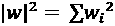。这个新增的项对损失函数的影响是，权重会受到更多约束，并且必须保持接近零以保持损失函数较小。因此，它为模型添加了偏差，并帮助进行正则化。

注意

这里的权重表示法进行了简化。实际上，每个单元 `i`、每个特征 `j` 和每一层 `l` 都有权重 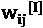。但最终，L2 项仍然是所有权重平方的总和。

对于这个食谱，只需要三种库：

+   `matplotlib` 用于绘制图表

+   `pytorch` 用于深度学习

+   `torchvision` 用于 MNIST 数据集

可以使用 `pip install matplotlib` `torch torchvision` 安装这些库。

## 如何做...

在这个食谱中，我们重新使用了上一章中训练多类分类模型时的相同代码，数据集仍然是 MNIST。唯一的区别将在于 *第 6 步* ——如果需要，可以直接跳到这一步。

输入数据是 MNIST 手写数据集：28x28 像素的灰度图像。因此，在能够训练自定义神经网络之前，数据需要进行重新缩放和展平处理：

1.  导入所需的库。像以前的食谱一样，我们导入了几个有用的 `torch` 模块和函数：

    +   `torch`

    +   `torch.nn` 包含构建神经网络所需的类

    +   `torch.nn.functional`用于激活函数，如 ReLU：

    +   用于处理数据的`DataLoader`：

我们还从`torchvision`中导入了一些模块：

+   `MNIST`用于加载数据集：

+   用于数据集转换的`transforms`——既包括缩放也包括扁平化数据：

    ```py
    import torch
    ```

    ```py
    import torch.nn as nn
    ```

    ```py
    import torch.nn.functional as F
    ```

    ```py
    from torch.utils.data import DataLoader
    ```

    ```py
    from torchvision.datasets import MNIST
    ```

    ```py
    import torchvision.transforms as transforms
    ```

    ```py
    import matplotlib.pyplot as plt
    ```

1.  实例化转换。此处使用`Compose`类来组合三个转换：

    +   `transforms.ToTensor()`：将输入图像转换为`torch.Tensor`格式

    +   `transforms.Normalize()`: 使用均值和标准差对图像进行归一化处理。会先减去均值（即`0.1307`），然后将每个像素值除以标准差（即`0.3081`）。

    +   `transforms.Lambda(torch.flatten)`：将 2D 张量展平为 1D 张量：

以下是代码：

```py
transform = transforms.Compose([transforms.ToTensor(),
    transforms.Normalize((0.1307), (0.3081)),
    transforms.Lambda(torch.flatten)])
```

注意：

图像通常使用均值和标准差为 0.5 进行归一化。我们使用这些特定的值进行归一化，因为数据集是由特定的图像构成的，但 0.5 也可以很好地工作。

1.  加载训练集和测试集，以及训练和测试数据加载器。使用`MNIST`类，我们分别通过`train=True`和`train=False`参数获取训练集和测试集。在加载数据时，我们还直接应用之前定义的转换。然后，使用批量大小为`64`实例化数据加载器：

    ```py
    trainset = MNIST('./data', train=True, download=True,
    ```

    ```py
        transform=transform)
    ```

    ```py
    train_dataloader = DataLoader(trainset, batch_size=64,
    ```

    ```py
        shuffle=True)
    ```

    ```py
    testset = MNIST('./data', train=False, download=True,
    ```

    ```py
        transform=transform)
    ```

    ```py
    test_dataloader = DataLoader(testset, batch_size=64,
    ```

    ```py
        shuffle=True)
    ```

1.  定义神经网络。这里默认定义了一个包含 2 个隐藏层（每层 24 个神经元）的神经网络。输出层包含 10 个神经元，因为有 10 个类别（数字从 0 到 9）。最后，对输出层应用`softmax`函数，使得 10 个单元的和严格等于`1`：

    ```py
    class Net(nn.Module):
    ```

    ```py
        def __init__(self, input_shape: int,
    ```

    ```py
        hidden_units: int = 24):
    ```

    ```py
            super(Net, self).__init__()
    ```

    ```py
            self.hidden_units = hidden_units
    ```

    ```py
            self.fc1 = nn.Linear(input_shape,
    ```

    ```py
                self.hidden_units)
    ```

    ```py
            self.fc2 = nn.Linear(self.hidden_units,
    ```

    ```py
                self.hidden_units)
    ```

    ```py
            self.output = nn.Linear(self.hidden_units, 10)
    ```

    ```py
        def forward(self,
    ```

    ```py
            x: torch.Tensor) -> torch.Tensor:
    ```

    ```py
                x = self.fc1(x)
    ```

    ```py
                x = F.relu(x)
    ```

    ```py
                x = self.fc2(x)
    ```

    ```py
                x = F.relu(x)
    ```

    ```py
                output = torch.softmax(self.output(x), dim=1)
    ```

    ```py
                return output
    ```

1.  为了检查代码，我们实例化模型，并使用正确的输入形状`784`（28x28 像素），确保在给定的随机张量上正向传播正常工作：

    ```py
    # Instantiate the model
    ```

    ```py
    net = Net(784)
    ```

    ```py
    # Generate randomly one random 28x28 image as a 784 values tensor
    ```

    ```py
    random_data = torch.rand((1, 784))
    ```

    ```py
    result = net(random_data)
    ```

    ```py
    print('Resulting output tensor:', result)
    ```

    ```py
    print('Sum of the output tensor:', result.sum())
    ```

代码输出将类似如下（只有总和必须等于 1；其他数字可能不同）：

```py
Resulting output tensor: tensor([[0.0882, 0.1141, 0.0846, 0.0874, 0.1124, 0.0912, 0.1103, 0.0972, 0.1097,
         0.1048]], grad_fn=<SoftmaxBackward0>)
Sum of the output tensor: tensor(1.0000, grad_fn=<SumBackward0>)
```

1.  定义损失函数为交叉熵损失，使用`pytorch`中的`nn.CrossEntropyLoss()`，并将优化器定义为`Adam`。在这里，我们给`Adam`优化器设置另一个参数：`weight_decay=0.001`。该参数是 L2 惩罚的强度。默认情况下，`weight_decay`为`0`，表示没有 L2 惩罚。较高的值意味着更强的正则化，就像在 scikit-learn 中的线性模型一样：

    ```py
    criterion = nn.CrossEntropyLoss()
    ```

    ```py
    optimizer = torch.optim.Adam(net.parameters(),
    ```

    ```py
        lr=0.001, weight_decay=0.001)
    ```

1.  实例化`epoch_step`辅助函数，用于计算正向传播和反向传播（仅限于训练集），以及损失和准确率：

    ```py
    def epoch_step(net, dataloader, training_set: bool):
    ```

    ```py
        running_loss = 0.
    ```

    ```py
        correct = 0.
    ```

    ```py
        for i, data in enumerate(dataloader, 0):
    ```

    ```py
            # Get the inputs: data is a list of [inputs, labels]
    ```

    ```py
            inputs, labels = data
    ```

    ```py
            if training_set:
    ```

    ```py
                # Zero the parameter gradients
    ```

    ```py
                optimizer.zero_grad()
    ```

    ```py
            # Forward + backward + optimize
    ```

    ```py
            outputs = net(inputs)
    ```

    ```py
            loss = criterion(outputs, labels)
    ```

    ```py
            if training_set:
    ```

    ```py
                loss.backward()
    ```

    ```py
                optimizer.step()
    ```

    ```py
            # Add correct predictions for this batch
    ```

    ```py
            correct += (outputs.argmax(
    ```

    ```py
                dim=1) == labels).float().sum()
    ```

    ```py
            # Compute loss for this batch
    ```

    ```py
            running_loss += loss.item()
    ```

    ```py
        return running_loss, correct
    ```

1.  我们最终可以在 20 个 epoch 上训练神经网络，并计算每个 epoch 的损失和准确率。

由于我们在训练集上进行训练，并在测试集上进行评估，模型在训练前会切换到`train`模式（`model.train()`），而在评估测试集之前，则切换到`eval`模式（`model.eval()`）：

```py
# Create empty lists to store the losses and accuracies
train_losses = []
test_losses = []
train_accuracy = []
test_accuracy = []
# Loop over the dataset 20 times for 20 epochs
for epoch in range(20):
    ## Train the model on the training set
    running_train_loss, correct = epoch_step(net,
        dataloader=train_dataloader,
        training_set=True)
    # Compute and store loss and accuracy for this epoch
    train_epoch_loss = running_train_loss / len(
        train_dataloader)
    train_losses.append(train_epoch_loss)
    train_epoch_accuracy = correct / len(trainset)
    train_accuracy.append(train_epoch_accuracy)
    ## Evaluate the model on the test set
    #running_test_loss = 0.
    #correct = 0.
    net.eval()
    with torch.no_grad():
        running_test_loss, correct = epoch_step(net,
            dataloader=test_dataloader,
            training_set=False)
        test_epoch_loss = running_test_loss / len(
            test_dataloader)
        test_losses.append(test_epoch_loss)
        test_epoch_accuracy = correct / len(testset)
        test_accuracy.append(test_epoch_accuracy)
    # Print stats
    print(f'[epoch {epoch + 1}] Training: loss={
        train_epoch_loss:.3f}accuracy={
            train_epoch_accuracy:.3f} |\
            \t Test: loss={test_epoch_loss:.3f}
            accuracy={test_epoch_accuracy:.3f}')
print('Finished Training')
```

在最后一个 epoch，输出应该如下所示：

```py
[epoch 20] Training: loss=1.505 accuracy=0.964 |   Test: loss=1.505 accuracy=0.962
Finished Training
```

1.  为了可视化，我们可以绘制训练集和测试集的损失随 epoch 的变化：

    ```py
    plt.plot(train_losses, label='train')
    ```

    ```py
    plt.plot(test_losses, label='test')
    ```

    ```py
    plt.xlabel('epoch')
    ```

    ```py
    plt.ylabel('loss (CE)')
    ```

    ```py
    plt.legend()
    ```

    ```py
    plt.show()
    ```

这里是它的图示：

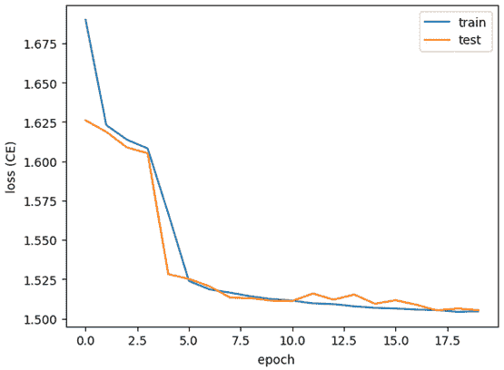

图 7.1 – 交叉熵损失随 epoch 的变化；来自前面的代码输出

我们可以注意到，训练集和测试集的损失几乎相同，没有明显的偏离。而在没有 L2 惩罚的前几次尝试中，损失相差较大，这意味着我们有效地对模型进行了正则化。

1.  显示相关结果，我们也可以用准确率来表示：

    ```py
    plt.plot(train_accuracy, label='train')
    ```

    ```py
    plt.plot(test_accuracy, label='test')
    ```

    ```py
    plt.xlabel('epoch')
    ```

    ```py
    plt.ylabel('Accuracy')
    ```

    ```py
    plt.legend()
    ```

    ```py
    plt.show()
    ```

这里是它的图示：

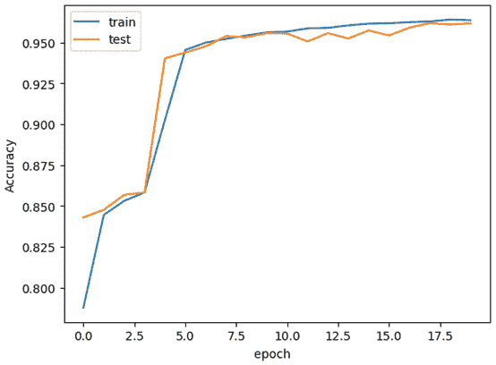

图 7.2 – 准确率随 epoch 的变化；来自前面的代码输出

最终，训练集和测试集的准确率都约为 96%，且没有明显的过拟合。

## 还有更多内容...

即使 L2 正则化是正则化线性模型（如线性回归和逻辑回归）中非常常见的技术，它通常不是深度学习中的首选方法。其他方法，如早停或丢弃法，通常更受青睐。

另外，在这个示例中，我们只提到了训练集和测试集。但为了正确优化`weight_decay`超参数，需要使用验证集；否则，结果会产生偏差。为了简洁起见，我们简化了这个示例，只用了两个数据集。

注意

一般来说，在深度学习中，任何其他的超参数优化，如层数、单元数、激活函数等，必须针对验证集进行优化，而不仅仅是测试集。

## 另见

通过模型的优化器调整 L2 惩罚，而不是直接在损失函数中进行调整，可能看起来有些奇怪，实际上也是如此。

当然，也可以手动添加 L2 惩罚，但这可能不是最优选择。请查看这个 PyTorch 讨论帖，了解更多关于这个设计选择的信息，以及如何添加 L1 惩罚的示例：[`discuss.pytorch.org/t/simple-l2-regularization/139`](https://discuss.pytorch.org/t/simple-l2-regularization/139)。

# 使用早停法对神经网络进行正则化

早停是深度学习中常用的一种方法，用于防止模型过拟合。这个概念简单而有效：如果模型由于过长的训练周期而发生过拟合，我们就提前终止训练，以避免过拟合。我们可以在乳腺癌数据集上使用这一技术。

## 准备开始

在一个完美的世界里，是不需要正则化的。这意味着在训练集和验证集中，无论经过多少个 epoch，损失几乎完全相等，如*图 7.3*所示。

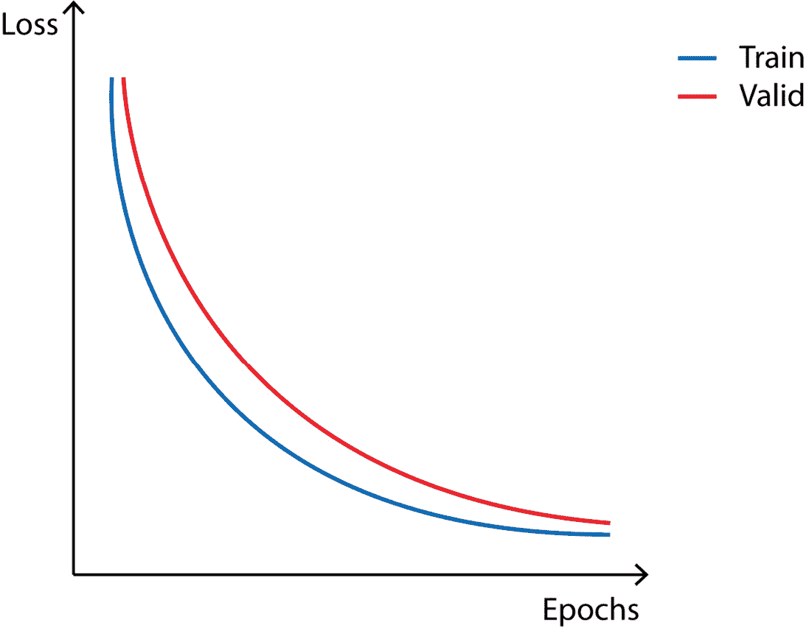

图 7.3 – 训练和验证损失随着周期数增加但无过拟合的示例

但现实中并非总是如此完美。在实践中，可能会发生神经网络在每个周期中逐渐学习到更多关于训练集数据分布的信息，这可能会牺牲对新数据的泛化能力。这个情况在*图 7.4*中有所展示。

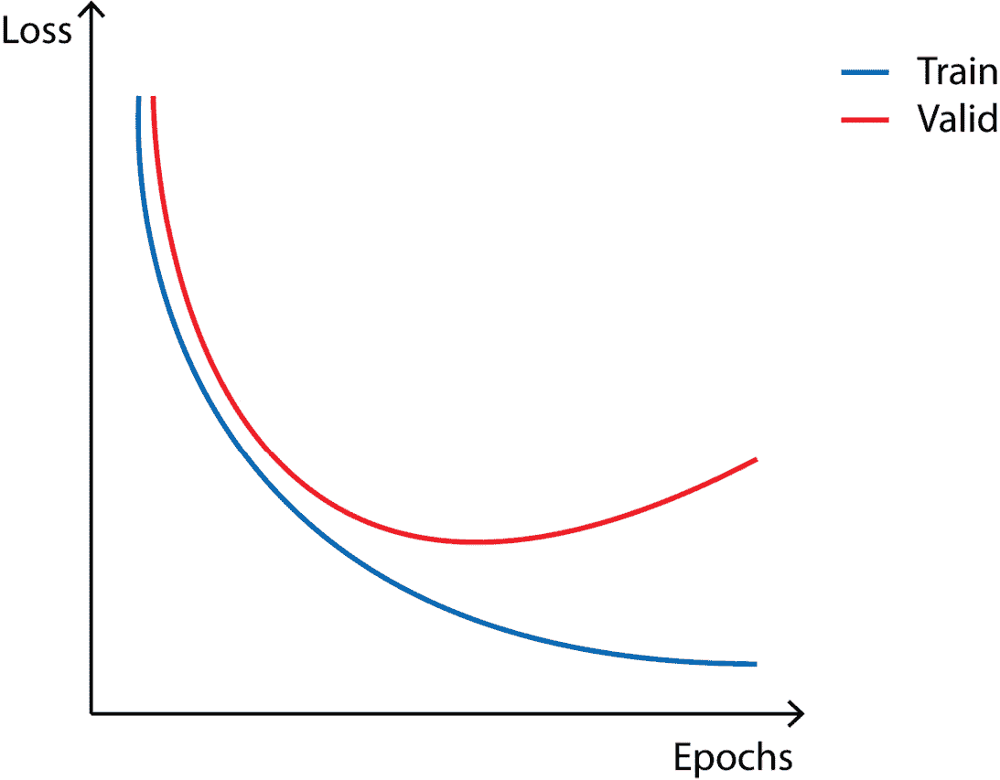

图 7.4 – 训练和验证损失随着周期数增加而过拟合的示例

当遇到这种情况时，一个自然的解决方案是，在模型的**验证**损失停止下降时暂停训练。一旦模型的验证损失停止下降，继续训练额外的周期可能会导致模型更擅长记忆训练数据，而不是提升其在新数据上的预测准确性。这个技术叫做**早停法**，它可以防止模型过拟合。

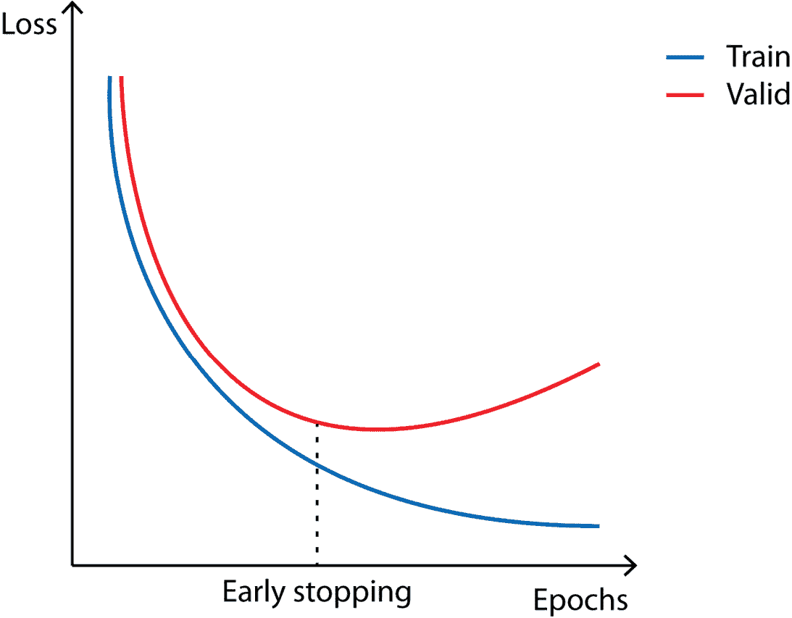

图 7.5 – 一旦验证损失停止下降，我们就可以停止学习并认为模型已经完全训练好；这就是早停法。

由于这个示例将应用于乳腺癌数据集，因此必须安装`scikit-learn`，以及用于模型的`torch`和可视化的`matplotlib`。可以通过`pip install sklearn` `torch matplotlib`安装这些库。

## 如何实现…

在本示例中，我们将首先在乳腺癌数据集上训练一个神经网络，并可视化随着周期数增加，过拟合效应的加剧。然后，我们将实现早停法来进行正则化。

### 正常训练

由于乳腺癌数据集相对较小，我们将只考虑训练集和验证集，而不是将数据集拆分为训练集、验证集和测试集：

1.  从`scikit-learn`、`matplotlib`和`torch`导入所需的库：

    +   使用`load_breast_cancer`加载数据集

    +   使用`train_test_split`将数据拆分为训练集和验证集

    +   使用`StandardScaler`对定量数据进行重新缩放

    +   使用`accuracy_score`评估模型

    +   使用`matplotlib`进行显示

    +   使用`torch`本身

    +   使用`torch.nn`包含构建神经网络所需的类

    +   使用`torch.nn.functional`实现激活函数，如 ReLU

    +   使用`Dataset`和`DataLoader`处理数据

下面是实现代码：

```py
import numpy as np
from sklearn.datasets import load_breast_cancer
from sklearn.model_selection import train_test_split
from sklearn.preprocessing import StandardScaler
from sklearn.metrics import accuracy_score
import matplotlib.pyplot as plt
import torch
import torch.nn as nn
import torch.nn.functional as F
from torch.utils.data import Dataset, DataLoader
```

1.  使用`load_breast_cancer`函数加载特征和标签：

    ```py
    X, y = load_breast_cancer(return_X_y=True)
    ```

1.  将数据分为训练集和验证集，指定随机种子以确保可重复性，并将特征和标签转换为`float32`，以便后续与 PyTorch 兼容：

    ```py
    X_train, X_val, y_train, y_val = train_test_split(
    ```

    ```py
        X.astype(np.float32), y.astype(np.float32),
    ```

    ```py
        test_size=0.2, random_state=0)
    ```

1.  创建`Dataset`类来处理数据。我们简单地重用了上一章实现的类：

    ```py
    class BreastCancerDataset(Dataset):
    ```

    ```py
        def __init__(self, X: np.array, y: np.array,
    ```

    ```py
            x_scaler: StandardScaler = None):
    ```

    ```py
                if x_scaler is None:
    ```

    ```py
                    self.x_scaler = StandardScaler()
    ```

    ```py
                    X = self.x_scaler.fit_transform(X)
    ```

    ```py
                else:
    ```

    ```py
                    self.x_scaler = x_scaler
    ```

    ```py
                    X = self.x_scaler.transform(X)
    ```

    ```py
                self.X = torch.from_numpy(X)
    ```

    ```py
                self.y = torch.from_numpy(y)
    ```

    ```py
        def __len__(self) -> int:
    ```

    ```py
            return len(self.X)
    ```

    ```py
        def __getitem__(self, idx: int) -> tuple[torch.Tensor]:
    ```

    ```py
            return self.X[idx], self.y[idx]
    ```

1.  为 PyTorch 实例化训练集和验证集及其数据加载器。注意，在实例化验证集时，我们提供了训练数据集的缩放器，确保两个数据集使用的缩放器是基于训练集拟合的：

    ```py
    training_data = BreastCancerDataset(X_train, y_train)
    ```

    ```py
    val_data = BreastCancerDataset(X_val, y_val,
    ```

    ```py
        training_data.x_scaler)
    ```

    ```py
    train_dataloader = DataLoader(training_data,
    ```

    ```py
        batch_size=64, shuffle=True)
    ```

    ```py
    val_dataloader = DataLoader(val_data, batch_size=64,
    ```

    ```py
        shuffle=True)
    ```

1.  定义神经网络架构——2 个隐藏层，每个隐藏层有 36 个单元，输出层有 1 个单元，并使用 sigmoid 激活函数，因为这是一个二分类任务：

    ```py
    class Net(nn.Module):
    ```

    ```py
        def __init__(self, input_shape: int,
    ```

    ```py
            hidden_units: int = 36):
    ```

    ```py
                super(Net, self).__init__()
    ```

    ```py
                self.hidden_units = hidden_units
    ```

    ```py
                self.fc1 = nn.Linear(input_shape,
    ```

    ```py
                    self.hidden_units)
    ```

    ```py
                self.fc2 = nn.Linear(self.hidden_units,
    ```

    ```py
                    self.hidden_units)
    ```

    ```py
                self.output = nn.Linear(self.hidden_units,
    ```

    ```py
                    1)
    ```

    ```py
        def forward(self, x: torch.Tensor) ->
    ```

    ```py
            torch.Tensor:
    ```

    ```py
                x = self.fc1(x)
    ```

    ```py
                x = F.relu(x)
    ```

    ```py
                x = self.fc2(x)
    ```

    ```py
                x = F.relu(x)
    ```

    ```py
                output = torch.sigmoid(self.output(x))
    ```

    ```py
                return output
    ```

1.  用期望的输入形状（特征数量）实例化模型。我们还可以选择检查给定随机张量的前向传播是否正常工作：

    ```py
    # Instantiate the model
    ```

    ```py
    net = Net(X_train.shape[1])
    ```

    ```py
    # Generate randomly one random 28x28 image as a 784 values tensor
    ```

    ```py
    random_data = torch.rand((1, X_train.shape[1]))
    ```

    ```py
    result = net(random_data)
    ```

    ```py
    print('Resulting output tensor:', result)
    ```

该代码的输出如下（具体值可能会有所变化，但由于最后一层使用的是 sigmoid 激活函数，所以输出值会在 0 和 1 之间）：

```py
Resulting output tensor: tensor([[0.5674]], grad_fn=<SigmoidBackward0>)
```

1.  将损失函数定义为二分类交叉熵损失函数，因为这是一个二分类任务。同时实例化优化器：

    ```py
    criterion = nn.BCELoss()
    ```

    ```py
    optimizer = torch.optim.Adam(net.parameters(),
    ```

    ```py
        lr=0.001)
    ```

1.  实现一个辅助函数`epoch_step`，该函数计算前向传播、反向传播（对于训练集）、损失和准确率，适用于一个训练周期：

    ```py
    def epoch_step(net, dataloader, training_set: bool):
    ```

    ```py
        running_loss = 0.
    ```

    ```py
        correct = 0.
    ```

    ```py
        for i, data in enumerate(dataloader, 0):
    ```

    ```py
            # Get the inputs: data is a list of [inputs, labels]
    ```

    ```py
            inputs, labels = data
    ```

    ```py
            labels = labels.unsqueeze(1)
    ```

    ```py
            if training_set:
    ```

    ```py
                # Zero the parameter gradients
    ```

    ```py
                optimizer.zero_grad()
    ```

    ```py
            # Forward + backward + optimize
    ```

    ```py
            outputs = net(inputs)
    ```

    ```py
            loss = criterion(outputs, labels)
    ```

    ```py
            if training_set:
    ```

    ```py
                loss.backward()
    ```

    ```py
                optimizer.step()
    ```

    ```py
            # Add correct predictions for this batch
    ```

    ```py
            correct += ((
    ```

    ```py
                outputs > 0.5) == labels).float().sum()
    ```

    ```py
            # Compute loss for this batch
    ```

    ```py
            running_loss += loss.item()
    ```

    ```py
        return running_loss, correct
    ```

1.  现在让我们实现`train_model`函数，以便训练一个模型，无论是否使用耐心。该函数存储每个训练周期的信息，然后返回以下结果：

    +   训练集的损失和准确率

    +   验证集的损失和准确率

下面是模型的代码：

```py
def train_model(net, train_dataloader, val_dataloader, criterion, optimizer, epochs, patience=None):
    # Create empty lists to store the losses and accuracies
    train_losses = []
    val_losses = []
    train_accuracy = []
    val_accuracy = []
    best_val_loss = np.inf
    best_val_loss_epoch = 0
    # Loop over the dataset 20 times for 20 epochs
    for epoch in range(500):
        ## If the best epoch was more than the patience, just stop training
        if patience is not None and epoch - best_val_loss_epoch > patience:
            break
        ## Train the model on the training set
        net.train()
        running_train_loss, correct = epoch_step(net,
            dataloader=train_dataloader,
            training_set=True)
        # Compute and store loss and accuracy for this epoch
        train_epoch_loss = running_train_loss / len(
            train_dataloader)
        train_losses.append(train_epoch_loss)
        train_epoch_accuracy = correct / len(training_data)
        train_accuracy.append(train_epoch_accuracy)
        ## Evaluate the model on the val set
        net.eval()
        with torch.no_grad():
            running_val_loss, correct = epoch_step(
                net, dataloader=val_dataloader,
                training_set=False)
            val_epoch_loss = running_val_loss / len(
                val_dataloader)
            val_losses.append(val_epoch_loss)
            val_epoch_accuracy = correct / len(val_data)
            val_accuracy.append(val_epoch_accuracy)
            # If the loss is better than the current best, update it
            if best_val_loss >= val_epoch_loss:
                best_val_loss = val_epoch_loss
                best_val_loss_epoch = epoch + 1
        # Print stats
        print(f'[epoch {epoch + 1}] Training: loss={
            train_epoch_loss:.3f} accuracy={
            train_epoch_accuracy:.3f} |\
                \t Valid: loss={val_epoch_loss:.3f}
                accuracy={val_epoch_accuracy:.3f}')
    return train_losses, val_losses, train_accuracy,
        val_accuracy
```

现在让我们在 500 个周期上训练神经网络，重用之前实现的`train_model`函数。以下是代码：

```py
train_losses, val_losses, train_accuracy,
    val_accuracy = train_model(
        net, train_dataloader, val_dataloader,
        criterion, optimizer, epochs=500
)
```

在 500 个周期后，代码输出将类似于以下内容：

```py
[epoch 500] Training: loss=0.000 accuracy=1.000 |   Validation: loss=0.099 accuracy=0.965
```

1.  现在我们可以绘制训练集和验证集的损失图，作为训练周期的函数，并可视化随着周期数增加而加剧的过拟合效应：

    ```py
    plt.plot(train_losses, label='train')
    ```

    ```py
    plt.plot(val_losses, label='valid')
    ```

    ```py
    plt.xlabel('epoch')
    ```

    ```py
    plt.ylabel('loss (CE)')
    ```

    ```py
    plt.legend()
    ```

    ```py
    plt.show()
    ```

以下是该损失的图表：

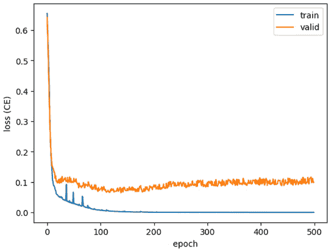

图 7.6 – 交叉熵损失作为训练周期的函数。（尽管有几个波动，训练损失仍然在持续下降）

确实，我们看到训练损失总体上持续下降，甚至达到了零的值。另一方面，验证损失开始下降并在第 100 个周期左右达到最小值，然后在接下来的周期中缓慢增加。

我们可以通过多种方式实现早停来避免这种情况：

+   在第一次训练后，我们可以重新训练模型，最多 100 个周期（或任何识别的最佳验证损失），希望能够得到相同的结果。这将是浪费 CPU 时间。

+   我们可以在每个周期保存模型，然后在之后挑选最佳模型。这个方法有时会被实现，但可能会浪费存储空间，特别是对于大型模型。

+   我们可以在验证损失没有改善时，自动停止训练，这个停止条件通常称为“耐心”。

现在让我们实现后者的解决方案。

注意

使用耐心也有风险：耐心太小可能会让模型陷入局部最小值，而耐心太大可能会错过真正的最优 epoch，导致停止得太晚。

### 使用耐心和早停的训练

现在让我们使用早停重新训练一个模型。我们首先实例化一个新的模型，以避免训练已经训练过的模型：

1.  实例化一个新的模型以及一个新的优化器。如果你使用的是相同的笔记本内核，就不需要测试它，也不需要重新实例化损失函数。如果你想单独运行这段代码，*步骤 1*到*步骤 8*必须重复使用：

    ```py
    # Instantiate a fresh model
    ```

    ```py
    net = Net(X_train.shape[1])
    ```

    ```py
    optimizer = torch.optim.Adam(net.parameters(), lr=0.001)
    ```

1.  我们现在使用`30`的耐心来训练这个模型。在连续 30 个 epoch 内，如果`val`损失没有改善，训练将会停止：

    ```py
    train_losses, val_losses, train_accuracy,
    ```

    ```py
        val_accuracy = train_model(
    ```

    ```py
            net, train_dataloader, val_dataloader,
    ```

    ```py
            criterion, optimizer, patience=30, epochs=500
    ```

    ```py
    )
    ```

代码输出将类似以下内容（在达到早停之前的总 epoch 数量可能会有所不同）：

```py
[epoch 134] Training: loss=0.004 accuracy=1.000 |   Valid: loss=0.108 accuracy=0.982
```

训练在大约 100 个 epoch 后停止（结果可能会有所不同，因为默认情况下结果是非确定性的），验证准确率大约为 98%，远远超过我们在 500 个 epoch 后得到的 96%。

1.  让我们再次绘制训练和验证损失，作为 epoch 数量的函数：

    ```py
    plt.plot(train_losses, label='train')
    ```

    ```py
    plt.plot(val_losses, label='validation')
    ```

    ```py
    plt.xlabel('epoch')
    ```

    ```py
    plt.ylabel('loss (BCE)')
    ```

    ```py
    plt.legend()
    ```

    ```py
    plt.show()
    ```

这里是它的图表：

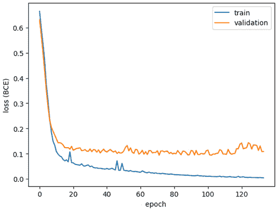

图 7.7 – 交叉熵损失与 epoch 的关系

如我们所见，验证损失已经发生过拟合，但没有时间增长太多，从而避免了进一步的过拟合。

## 还有更多...

如本例中前面所述，为了进行正确的评估，需要在单独的测试集上计算准确率（或任何选定的评估指标）。实际上，基于验证集停止训练并在同一数据集上评估模型是一种偏向的方法，可能会人为提高评估结果。

# 使用网络架构进行正则化

在本例中，我们将探讨一种不太常见但有时仍然有用的正则化方法：调整神经网络架构。在回顾为何使用此方法以及何时使用后，我们将其应用于加利福尼亚住房数据集，这是一个回归任务。

## 准备中

有时，最好的正则化方法不是使用任何花哨的技术，而是常识。在许多情况下，使用的神经网络可能对于输入任务和数据集来说过于庞大。一个简单的经验法则是快速查看网络中的参数数量（例如，权重和偏置），并将其与数据点的数量进行比较：如果比率大于 1（即参数多于数据点），则有严重过拟合的风险。

注意

如果使用迁移学习，这条经验法则不再适用，因为网络已经在一个假定足够大的数据集上进行了训练。

如果我们退后一步，回到线性模型，比如线性回归，大家都知道，特征之间高度相关会降低模型的性能。神经网络也是如此：过多的自由参数并不会提高性能。因此，根据任务的不同，并不总是需要几十层的网络；只需几层就足以获得最佳性能并避免过拟合。让我们通过加利福尼亚数据集在实践中验证这一点。

为此，需要使用的库有 scikit-learn、Matplotlib 和 PyTorch。可以通过`pip install sklearn` `matplotlib torch`来安装它们。

## 如何实现...

这将是一个两步的流程：首先，我们将训练一个较大的模型（相对于数据集来说），以揭示网络对过拟合的影响。然后，我们将在相同数据上训练另一个更适配的模型，期望解决过拟合问题。

### 训练一个大型模型

以下是训练模型的步骤：

1.  首先需要导入以下库：

    +   使用`fetch_california_housing`来加载数据集

    +   使用`train_test_split`将数据划分为训练集和测试集

    +   使用`StandardScaler`来重新缩放特征

    +   使用`r2_score`来评估模型的最终表现

    +   使用`matplotlib`来显示损失

    +   `torch`本身提供一些库中低级功能的实现

    +   使用`torch.nn`，它提供了许多用于构建神经网络的实用类

    +   使用`torch.nn.functional`来实现一些有用的函数

    +   使用`Dataset`和`DataLoader`来处理数据操作

以下是这些`import`语句的代码：

```py
import numpy as np
from sklearn.datasets
import fetch_california_housing
from sklearn.model_selection
import train_test_split
from sklearn.preprocessing
import StandardScaler
from sklearn.metrics
import r2_score
import matplotlib.pyplot as plt
import torch
import torch.nn as nn
import torch.nn.functional as F
from torch.utils.data import Dataset, DataLoader
```

1.  使用`fetch_california_housing`函数加载数据：

    ```py
    X, y = fetch_california_housing(return_X_y=True)
    ```

1.  使用`train_test_split`函数以 80%/20%的比例将数据划分为训练集和测试集。设置一个随机种子以保证可复现性。对于`pytorch`，数据会被转换成`float32`类型的变量：

    ```py
    X_train, X_test, y_train, y_test = train_test_split(
    ```

    ```py
        X.astype(np.float32), y.astype(np.float32),
    ```

    ```py
        test_size=0.2, random_state=0)
    ```

1.  使用标准化缩放器对数据进行重新缩放：

    ```py
    scaler = StandardScaler()
    ```

    ```py
    X_train = scaler.fit_transform(X_train)
    ```

    ```py
    X_test = scaler.transform(X_test)
    ```

1.  创建`CaliforniaDataset`类，用于处理数据。这里唯一的变换是将`numpy`数组转换为`torch`张量：

    ```py
    class CaliforniaDataset(Dataset):
    ```

    ```py
        def __init__(self, X: np.array, y: np.array):
    ```

    ```py
            self.X = torch.from_numpy(X)
    ```

    ```py
            self.y = torch.from_numpy(y)
    ```

    ```py
        def __len__(self) -> int:
    ```

    ```py
            return len(self.X)
    ```

    ```py
        def __getitem__(self, idx: int) ->
    ```

    ```py
            tuple[torch.Tensor]: return self.X[idx], self.y[idx]
    ```

1.  实例化训练集和测试集的数据集以及数据加载器。这里定义了一个批处理大小为`64`，但可以根据需要进行调整：

    ```py
    # Instantiate datasets
    ```

    ```py
    training_data = CaliforniaDataset(X_train, y_train)
    ```

    ```py
    test_data = CaliforniaDataset(X_test, y_test)
    ```

    ```py
    # Instantiate data loaders
    ```

    ```py
    train_dataloader = DataLoader(training_data,
    ```

    ```py
        batch_size=64, shuffle=True)
    ```

    ```py
    test_dataloader = DataLoader(test_data, batch_size=64,
    ```

    ```py
        shuffle=True)
    ```

1.  创建神经网络架构。考虑到数据集的规模，我们故意创建一个较大的模型——包含 5 个隐藏层，每个层有 128 个单元：

    ```py
    class Net(nn.Module):
    ```

    ```py
        def __init__(self, input_shape: int,
    ```

    ```py
            hidden_units: int = 128):
    ```

    ```py
                super(Net, self).__init__()
    ```

    ```py
                self.hidden_units = hidden_units
    ```

    ```py
                self.fc1 = nn.Linear(input_shape,
    ```

    ```py
                    self.hidden_units)
    ```

    ```py
                self.fc2 = nn.Linear(self.hidden_units,
    ```

    ```py
                    self.hidden_units)
    ```

    ```py
                self.fc3 = nn.Linear(self.hidden_units,
    ```

    ```py
                    self.hidden_units)
    ```

    ```py
                self.fc4 = nn.Linear(self.hidden_units,
    ```

    ```py
                    self.hidden_units)
    ```

    ```py
                self.fc5 = nn.Linear(self.hidden_units,
    ```

    ```py
                    self.hidden_units)
    ```

    ```py
                self.output = nn.Linear(self.hidden_units, 1)
    ```

    ```py
        def forward(self, x: torch.Tensor) -> torch.Tensor:
    ```

    ```py
            x = self.fc1(x)
    ```

    ```py
            x = F.relu(x)
    ```

    ```py
            x = self.fc2(x)
    ```

    ```py
            x = F.relu(x)
    ```

    ```py
            x = self.fc3(x)
    ```

    ```py
            x = F.relu(x)
    ```

    ```py
            x = self.fc4(x)
    ```

    ```py
            x = F.relu(x)
    ```

    ```py
            x = self.fc5(x)
    ```

    ```py
            x = F.relu(x)
    ```

    ```py
            output = self.output(x)
    ```

    ```py
            return output
    ```

1.  使用给定的输入形状（特征数量）实例化模型。可选地，我们可以使用预期形状的输入张量来检查网络是否正确创建（这里指的是特征数量）：

    ```py
    # Instantiate the network
    ```

    ```py
    net = Net(X_train.shape[1])
    ```

    ```py
    # Generate one random sample of 8 features
    ```

    ```py
    random_data = torch.rand((1, X_train.shape[1]))
    ```

    ```py
    # Compute the forward propagation
    ```

    ```py
    print(net(random_data))
    ```

    ```py
    tensor([[0.0674]], grad_fn=<AddmmBackward0>)
    ```

1.  将损失函数实例化为均方误差损失（MSE），因为这是一个回归任务，并定义优化器为`Adam`，学习率为`0.001`：

    ```py
    criterion = nn.MSELoss()
    ```

    ```py
    optimizer = torch.optim.Adam(net.parameters(), lr=0.001)
    ```

1.  最后，使用`train_model`函数训练神经网络 500 个纪元。这个函数的实现与之前的类似，可以在 GitHub 仓库中找到。再次提醒，我们故意选择了一个较大的纪元数；否则，过拟合可能会通过提前停止来得到补偿。我们还会存储每个纪元的训练和测试损失，用于可视化和信息展示：

    ```py
    train_losses, test_losses = train_model(net,
    ```

    ```py
        train_dataloader, test_dataloader, criterion,
    ```

    ```py
        optimizer, 500)
    ```

经过 500 个纪元后，最终的输出曲线将如下所示：

```py
[epoch 500] Training: loss=0.013 | Test: loss=0.312
Finished Training
```

1.  将训练集和测试集的损失绘制为与纪元相关的函数：

    ```py
    plt.plot(train_losses, label='train')
    ```

    ```py
    plt.plot(test_losses, label='test')
    ```

    ```py
    plt.xlabel('epoch')
    ```

    ```py
    plt.ylabel('loss (MSE)')
    ```

    ```py
    plt.legend()
    ```

    ```py
    plt.show()
    ```

这是其绘图：

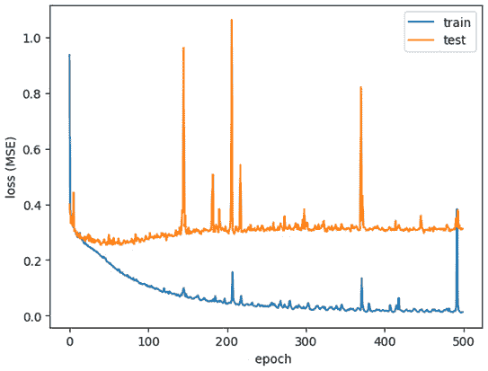

图 7.8 – 平均平方误差损失与纪元的关系（注意训练集和测试集的损失明显分离）

我们可以注意到，训练损失持续下降，而测试损失很快达到一个平台期，然后再次上升。这是过拟合的明显信号。让我们通过计算 R2 分数来确认是否存在过拟合。

1.  最后，让我们使用 R2 分数评估模型在训练集和测试集上的表现：

    ```py
    # Compute the predictions with the trained neural network
    ```

    ```py
    y_train_pred = net(
    ```

    ```py
        torch.tensor((X_train))).detach().numpy()
    ```

    ```py
    y_test_pred = net(
    ```

    ```py
        torch.tensor((X_test))).detach().numpy()
    ```

    ```py
    # Compute the R2-score
    ```

    ```py
    print('R2-score on training set:', r2_score(y_train,
    ```

    ```py
         y_train_pred))
    ```

    ```py
    print('R2-score on test set:', r2_score(y_test,
    ```

    ```py
        y_test_pred))
    ```

这段代码将输出如下类似的值：

```py
R2-score on training set: 0.9922777453770203
R2-score on test set: 0.7610035849523354
```

如预期所示，我们确实遇到了明显的过拟合，在训练集上几乎达到了完美的 R2 分数，而在测试集上的 R2 分数约为 0.76。

注意

这可能看起来像是一个夸张的例子，但选择一个对于任务和数据集来说过于庞大的架构其实是相当容易的。

### 使用更小的网络进行正则化

现在让我们训练一个更合理的模型，看看这如何影响过拟合，即使是使用相同数量的纪元。目标不仅是减少过拟合，还要在测试集上获得更好的表现。

如果你使用的是相同的内核，则不需要重新执行第一步。否则，*步骤 1* 到 *6* 必须重新执行：

1.  定义神经网络。这次我们只有两个包含 16 个单元的隐藏层，因此这个网络比之前的要小得多：

    ```py
    class Net(nn.Module):
    ```

    ```py
        def __init__(self, input_shape: int,
    ```

    ```py
            hidden_units: int = 16):
    ```

    ```py
                super(Net, self).__init__()
    ```

    ```py
            self.hidden_units = hidden_units
    ```

    ```py
            self.fc1 = nn.Linear(input_shape,
    ```

    ```py
                self.hidden_units)
    ```

    ```py
            self.fc2 = nn.Linear(self.hidden_units,
    ```

    ```py
                self.hidden_units)
    ```

    ```py
            self.output = nn.Linear(self.hidden_units, 1)
    ```

    ```py
        def forward(self, x: torch.Tensor) -> torch.Tensor:
    ```

    ```py
            x = self.fc1(x)
    ```

    ```py
            x = F.relu(x)
    ```

    ```py
            x = self.fc2(x)
    ```

    ```py
            x = F.relu(x)
    ```

    ```py
            output = self.output(x)
    ```

    ```py
            return output
    ```

1.  使用预期数量的输入特征和优化器实例化网络：

    ```py
    # Instantiate the network
    ```

    ```py
    net = Net(X_train.shape[1])
    ```

    ```py
    optimizer = torch.optim.Adam(net.parameters(),
    ```

    ```py
        lr=0.001)
    ```

1.  训练神经网络 500 个纪元，以便我们可以将结果与之前的结果进行比较。我们将重新使用之前在本配方中使用的`train_model`函数：

    ```py
    train_losses, test_losses = train_model(net,
    ```

    ```py
        train_dataloader, test_dataloader, criterion,
    ```

    ```py
        optimizer, 500)
    ```

    ```py
    [epoch 500] Training: loss=0.248 | Test: loss=0.273
    ```

    ```py
    Finished Training
    ```

1.  将损失绘制为与纪元相关的函数，分别针对训练集和测试集：

    ```py
    plt.plot(train_losses, label='train')
    ```

    ```py
    plt.plot(test_losses, label='test')
    ```

    ```py
    plt.xlabel('epoch')
    ```

    ```py
    plt.ylabel('loss (MSE)')
    ```

    ```py
    plt.legend()
    ```

    ```py
    plt.show()
    ```

这是其绘图：

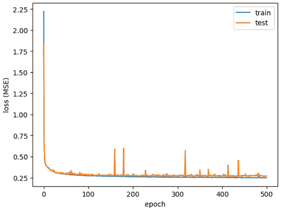

图 7.9 – 平均平方误差损失与纪元的关系（注意训练集和测试集几乎重叠）

如我们所见，即使经过许多纪元，这次也没有明显的过拟合：无论纪元数量如何（除了少数噪声波动），训练集和测试集的损失保持接近，尽管随着时间推移，似乎会出现少量过拟合。

1.  让我们再次使用 R2 分数评估模型在训练集和测试集上的表现：

    ```py
    # Compute the predictions with the trained neural network
    ```

    ```py
    y_train_pred = net(
    ```

    ```py
        torch.tensor((X_train))).detach().numpy()
    ```

    ```py
    y_test_pred = net(
    ```

    ```py
        torch.tensor((X_test))).detach().numpy()
    ```

    ```py
    # Compute the R2-score
    ```

    ```py
    print('R2-score on training set:', r2_score(y_train,
    ```

    ```py
        y_train_pred))
    ```

    ```py
    print('R2-score on test set:', r2_score(y_test,
    ```

    ```py
        y_test_pred))
    ```

以下是此代码的典型输出：

```py
R2-score on training set: 0.8161885562733123
R2-score on test set: 0.7906037325658601
```

虽然训练集上的 R2 分数从 0.99 降到了 0.81，但测试集上的得分从 0.76 提高到了 0.79，有效地提高了模型的性能。

即使这是一个相当极端的例子，整体思路仍然是成立的。

注意

在这种情况下，提前停止（early stopping）也可能效果很好。这两种技术（提前停止和缩小网络）并不是相互排斥的，实际上可以很好地协同工作。

## 还有更多...

模型的复杂度可以通过参数数量来计算。即使这不是一个直接的度量，它仍然是一个良好的指示器。

例如，本食谱中使用的第一个神经网络，具有 10 个隐藏层和 128 个单元，共有 67,329 个可训练参数。另一方面，第二个神经网络，只有 2 个隐藏层和 16 个单元，仅有 433 个可训练参数。

全连接神经网络的参数数量是基于单元数量和层数的：不过，单元数和层数并不直接决定参数的数量。

要计算 torch 网络中可训练参数的数量，我们可以使用以下代码片段：

```py
sum(p.numel() for p in net.parameters() if p.requires_grad)
```

为了更好地理解，让我们再看三个神经网络的例子，这三个网络的神经元数量相同，但层数不同。假设它们都具有 10 个输入特征和 1 个单元输出层：

+   一个具有 1 个隐藏层和 100 个单元的神经网络：1,201 个参数

+   一个具有 2 个隐藏层和 50 个单元的神经网络：3,151 个参数

+   一个具有 10 个隐藏层和 10 个单元的神经网络：1,111 个参数

因此，在层数和每层单元数之间存在权衡，以便在给定神经元数量的情况下构建最复杂的神经网络。

# 使用丢弃法进行正则化

一种广泛使用的正则化方法是丢弃法（dropout）。丢弃法就是在训练阶段随机将一些神经元的激活值设置为零。让我们首先回顾一下它是如何工作的，然后将其应用于多类分类任务——`sklearn`数字数据集，这是 MNIST 数据集的一个较旧且较小的版本。

## 准备就绪

丢弃法是深度学习中广泛采用的正则化方法，因其简单有效而受到青睐。这种技术易于理解，但能够产生强大的效果。

原理很简单——在训练过程中，我们随机忽略一些单元，将它们的激活值设置为零，正如*图 7.10*中所示：

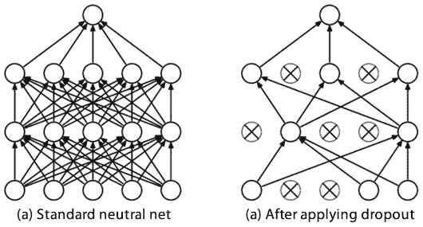

图 7.10 – 左侧是一个标准的神经网络及其连接，右侧是同一个神经网络应用丢弃法后，训练时平均有 50%的神经元被忽略

但是，dropout 添加了一个超参数：dropout 概率。对于 0% 的概率，没有 dropout；对于 50% 的概率，约 50% 的神经元将被随机选择忽略；对于 100% 的概率，嗯，那就没有东西可学了。被忽略的神经元并不总是相同的：对于每个新的批量大小，都会随机选择一组新的单元进行忽略。

注意

剩余的激活值会被缩放，以保持每个单元的一致全局输入。实际上，对于 1/2 的 dropout 概率，所有未被忽略的神经元都会被缩放 2 倍（即它们的激活值乘以 2）。

当然，在评估或对新数据进行推理时，dropout 会被停用，导致所有神经元都被激活。

但是这样做的意义何在呢？为什么随机忽略一些神经元会有帮助呢？一个正式的解释超出了本书的范围，但至少我们可以提供一些直观的理解。这个想法是避免给神经网络提供过多信息而导致混淆。作为人类，信息过多有时比有帮助更多：有时，信息更少反而可以帮助你做出更好的决策，避免被信息淹没。这就是 dropout 的思想：不是一次性给网络所有信息，而是通过在短时间内随机关闭一些神经元，以较少的信息来温和训练网络。希望这能最终帮助网络做出更好的决策。

在本教程中，将使用 scikit-learn 的 `digits` 数据集，该数据集实际上是 *光学手写数字识别* 数据集的一个链接。这些图像的一个小子集展示在 *图 7.11* 中。

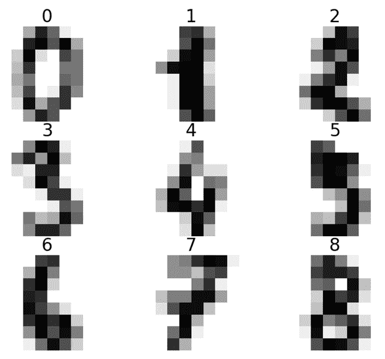

图 7.11 – 数据集中的一组图像及其标签：每个图像由 8x8 像素组成

每张图像都是一个 8x8 像素的手写数字图像。因此，数据集由 10 个类别组成，每个类别代表一个数字。

要运行本教程中的代码，所需的库是 `sklearn`、`matplotlib` 和 `torch`。可以通过 `pip install sklearn`、`matplotlib`、`torch` 安装这些库。

## 如何做……

本教程将包括两个步骤：

1.  首先，我们将训练一个没有 dropout 的神经网络，使用一个相对较大的模型，考虑到数据的特点。

1.  然后，我们将使用 dropout 训练相同的神经网络，希望能提高模型的性能。

我们将使用相同的数据、相同的批量大小和相同的训练轮次，以便比较结果。

### 没有 dropout

下面是没有 dropout 的正则化步骤：

1.  必须加载以下导入：

    +   使用 `sklearn` 中的 `load_digits` 加载数据集

    +   使用 `sklearn` 中的 `train_test_split` 来拆分数据集

    +   `torch`、`torch.nn` 和 `torch.nn.functional` 用于神经网络

    +   `Dataset` 和 `DataLoader` 来自 `torch`，用于在 `torch` 中加载数据集

    +   `matplotlib`用于可视化损失

这是`import`语句的代码：

```py
import numpy as np
from sklearn.datasets import load_digits
from sklearn.model_selection import train_test_split
import torch
import torch.nn as nn
import torch.nn.functional as F
from torch.utils.data import Dataset, DataLoader
import matplotlib.pyplot as plt
```

1.  加载数据。数据集包含 1,797 个样本，图像已经展平为 64 个值，范围从 0 到 16，对应 8x8 像素：

    ```py
    X, y = load_digits(return_X_y=True)
    ```

1.  将数据拆分为训练集和测试集，80%的数据用于训练集，20%的数据用于测试集。特征值转换为`float32`，标签值转换为`int64`，以避免后续`torch`错误：

    ```py
    X_train, X_test, y_train, y_test = train_test_split(
    ```

    ```py
        X.astype(np.float32), y.astype(np.int64),
    ```

    ```py
        test_size=0.2, random_state=0)
    ```

1.  为 PyTorch 创建`DigitsDataset`类。除了将特征转换为`torch`张量外，唯一的转换操作是将值除以 255，以使特征的范围落在`[0, 1]`之间：

    ```py
    class DigitsDataset(Dataset):
    ```

    ```py
        def __init__(self, X: np.array, y: np.array):
    ```

    ```py
            self.X = torch.from_numpy(X/255)
    ```

    ```py
            self.y = torch.from_numpy(y)
    ```

    ```py
        def __len__(self) -> int:
    ```

    ```py
            return len(self.X)
    ```

    ```py
        def __getitem__(self, idx: int) -> tuple[torch.Tensor]:
    ```

    ```py
            return self.X[idx], self.y[idx]
    ```

1.  为训练集和测试集实例化数据集，并使用批次大小`64`实例化数据加载器：

    ```py
    # Instantiate datasets
    ```

    ```py
    training_data = DigitsDataset(X_train, y_train)
    ```

    ```py
    test_data = DigitsDataset(X_test, y_test)
    ```

    ```py
    # Instantiate data loaders
    ```

    ```py
    train_dataloader = DataLoader(training_data,
    ```

    ```py
        batch_size=64, shuffle=True)
    ```

    ```py
    test_dataloader = DataLoader(test_data, batch_size=64,
    ```

    ```py
        shuffle=True)
    ```

1.  定义神经网络架构——这里有 3 个隐藏层，每层有 128 个单元（默认为 128），并且对所有隐藏层应用了 25%的丢弃概率：

    ```py
    class Net(nn.Module):
    ```

    ```py
        def __init__(self, input_shape: int,
    ```

    ```py
            hidden_units: int = 128,
    ```

    ```py
            dropout: float = 0.25):
    ```

    ```py
                super(Net, self).__init__()
    ```

    ```py
                self.hidden_units = hidden_units
    ```

    ```py
                self.fc1 = nn.Linear(input_shape,
    ```

    ```py
                    self.hidden_units)
    ```

    ```py
                self.fc2 = nn.Linear(self.hidden_units,
    ```

    ```py
                    self.hidden_units)
    ```

    ```py
                self.fc3 = nn.Linear(self.hidden_units,
    ```

    ```py
                    self.hidden_units)
    ```

    ```py
                self.dropout = nn.Dropout(p=dropout)
    ```

    ```py
                self.output = nn.Linear(self.hidden_units, 10)
    ```

    ```py
        def forward(self, x: torch.Tensor) -> torch.Tensor:
    ```

    ```py
            x = self.fc1(x)
    ```

    ```py
            x = F.relu(x)
    ```

    ```py
            x = self.dropout(x)
    ```

    ```py
            x = self.fc2(x)
    ```

    ```py
            x = F.relu(x)
    ```

    ```py
            x = self.dropout(x)
    ```

    ```py
            x = self.fc3(x)
    ```

    ```py
            x = F.relu(x)
    ```

    ```py
            x = self.dropout(x)
    ```

    ```py
            output = torch.softmax(self.output(x), dim=1)
    ```

    ```py
            return output
    ```

这里，丢弃操作分两步添加：

+   在构造函数中实例化一个`nn.Dropout(p=dropout)`类，传入丢弃概率

+   在每个隐藏层的激活函数之后应用丢弃层（在构造函数中定义），`x =` `self.dropout(x)`

注意

对于 ReLU 激活函数来说，将丢弃层设置在激活函数之前或之后不会改变输出。但对于其他激活函数，如 sigmoid，这会产生不同的结果。

1.  使用正确的输入形状`64`（8x8 像素）实例化模型，并且由于我们希望先检查没有丢弃的结果，所以设置丢弃率为`0`。检查前向传播是否在给定的随机张量上正常工作：

    ```py
    # Instantiate the model
    ```

    ```py
    net = Net(X_train.shape[1], dropout=0)
    ```

    ```py
    # Generate randomly one random 28x28 image as a 784 values tensor
    ```

    ```py
    random_data = torch.rand((1, 64))
    ```

    ```py
    result = net(random_data)
    ```

    ```py
    print('Resulting output tensor:', result)
    ```

    ```py
    print('Sum of the output tensor:', result.sum())
    ```

这段代码的输出应该如下所示：

```py
Resulting output tensor: tensor([[0.0964, 0.0908, 0.1043, 0.1083, 0.0927, 0.1047, 0.0949, 0.0991, 0.1012,
         0.1076]], grad_fn=<SoftmaxBackward0>)
Sum of the output tensor: tensor(1., grad_fn=<SumBackward0>)
```

1.  将损失函数定义为交叉熵损失，并将优化器设置为`Adam`：

    ```py
    criterion = nn.CrossEntropyLoss()
    ```

    ```py
    optimizer = torch.optim.Adam(net.parameters(), lr=0.001)
    ```

1.  使用 GitHub 仓库中可用的`train_model`函数，在 500 个周期内训练神经网络。每个周期，我们都存储并计算训练集和测试集的损失和精度：

    ```py
    train_losses, test_losses, train_accuracy,
    ```

    ```py
        test_accuracy = train_model(
    ```

    ```py
            net, train_dataloader, test_dataloader,
    ```

    ```py
            criterion, optimizer, epochs=500
    ```

    ```py
    )
    ```

在 500 个周期后，你应该得到如下输出：

```py
[epoch 500] Training: loss=1.475 accuracy=0.985 |       Test: loss=1.513 accuracy=0.947
Finished Training
```

1.  绘制训练集和测试集的交叉熵损失与周期数的关系：

    ```py
    plt.plot(train_losses, label='train')
    ```

    ```py
    plt.plot(test_losses, label='test')
    ```

    ```py
    plt.xlabel('epoch')
    ```

    ```py
    plt.ylabel('loss (CE)')
    ```

    ```py
    plt.legend()
    ```

    ```py
    plt.show()
    ```

这里是它的图示：

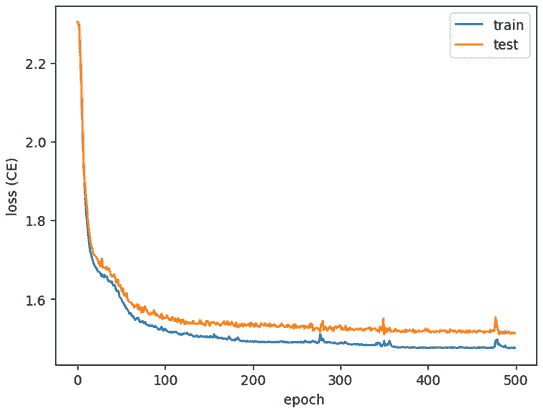

图 7.12 – 交叉熵损失作为周期的函数（注意训练集和测试集之间的轻微偏差）

1.  绘制精度图将展示等效结果：

    ```py
    plt.plot(train_accuracy, label='train')
    ```

    ```py
    plt.plot(test_accuracy, label='test')
    ```

    ```py
    plt.xlabel('epoch')
    ```

    ```py
    plt.ylabel('Accuracy')
    ```

    ```py
    plt.legend()
    ```

    ```py
    plt.show()
    ```

这里是它的图示：

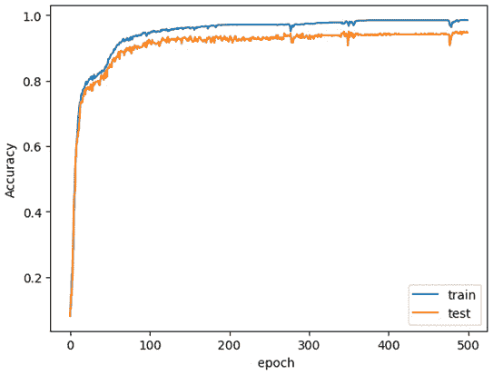

图 7.13 – 精度作为周期的函数；我们再次可以看到过拟合现象

最终精度在训练集上大约为 98%，而在测试集上仅为 95%左右，显示出过拟合现象。现在我们尝试添加丢弃层来减少过拟合。

### 使用丢弃层

在这部分，我们将简单地从*步骤 7*开始，但使用丢弃层，并与之前的结果进行比较：

1.  用`64`作为输入共享，25%的 dropout 概率实例化模型。25%的概率意味着在训练过程中，在每一层隐藏层中，大约会有 32 个神经元被随机忽略。重新实例化一个新的优化器，依然使用`Adam`：

    ```py
    # Instantiate the model
    ```

    ```py
    net = Net(X_train.shape[1], dropout=0.25)
    ```

    ```py
    optimizer = torch.optim.Adam(net.parameters(), lr=0.001)
    ```

1.  再次训练神经网络 500 个周期，同时记录训练和测试的损失值及准确度：

    ```py
    train_losses, test_losses, train_accuracy, test_accuracy = train_model(
    ```

    ```py
        net, train_dataloader, test_dataloader, criterion,
    ```

    ```py
            optimizer, epochs=500
    ```

    ```py
    )
    ```

    ```py
    [epoch 500] Training: loss=1.472 accuracy=0.990 |       Test: loss=1.488 accuracy=0.975
    ```

    ```py
    Finished Training
    ```

1.  再次绘制训练和测试损失随周期变化的图表：

    ```py
    plt.plot(train_losses, label='train')
    ```

    ```py
    plt.plot(test_losses, label='test')
    ```

    ```py
    plt.xlabel('epoch')
    ```

    ```py
    plt.ylabel('loss (CE)')
    ```

    ```py
    plt.legend()
    ```

    ```py
    plt.show()
    ```

这是它的图表：

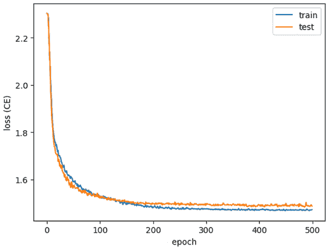

图 7.14 – 交叉熵损失随周期变化，得益于 dropout 减少了发散

我们在这里观察到与之前不同的行为。训练和测试损失似乎不会随着周期的增加而相差太多。在最初的 100 个周期中，测试损失略低于训练损失，但之后训练损失进一步减少，表明模型轻微过拟合。

1.  最后，绘制训练和测试准确度随周期变化的图表：

    ```py
    plt.plot(train_accuracy, label='train')
    ```

    ```py
    plt.plot(test_accuracy, label='test')
    ```

    ```py
    plt.xlabel('epoch')
    ```

    ```py
    plt.ylabel('Accuracy')
    ```

    ```py
    plt.legend()
    ```

    ```py
    plt.show()
    ```

这是它的图表：

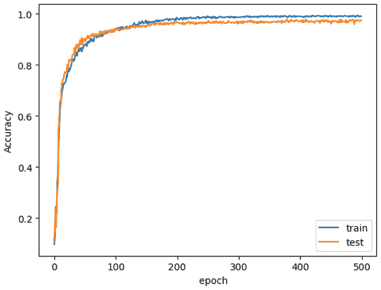

图 7.15 – 准确度随周期变化（得益于 dropout，过拟合大幅度减少）

我们的训练准确度达到了 99%，相比之前的 98%有所提升。更有趣的是，测试准确度也从之前的 95%上升到 97%，有效地实现了正则化并减少了过拟合。

## 还有更多...

尽管 dropout 并非万无一失，但它已被证明是一种有效的正则化技术，尤其是在对小数据集进行大规模网络训练时。有关更多内容，可以参考 Hinton 等人发表的论文《*通过防止特征检测器的共适应来改进神经网络*》。这篇论文可以在`arxiv`上找到：[`arxiv.org/abs/1207.0580`](https://arxiv.org/abs/1207.0580)。

## 另见

+   `digits`数据集的官方地址：[`archive.ics.uci.edu/ml/datasets/Optical+Recognition+of+Handwritten+Digits`](https://archive.ics.uci.edu/ml/datasets/Optical+Recognition+of+Handwritten+Digits)

+   关于 dropout 的 PyTorch 文档：[`pytorch.org/docs/stable/generated/torch.nn.Dropout.xhtml`](https://pytorch.org/docs/stable/generated/torch.nn.Dropout.xhtml)
