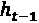
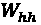
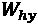
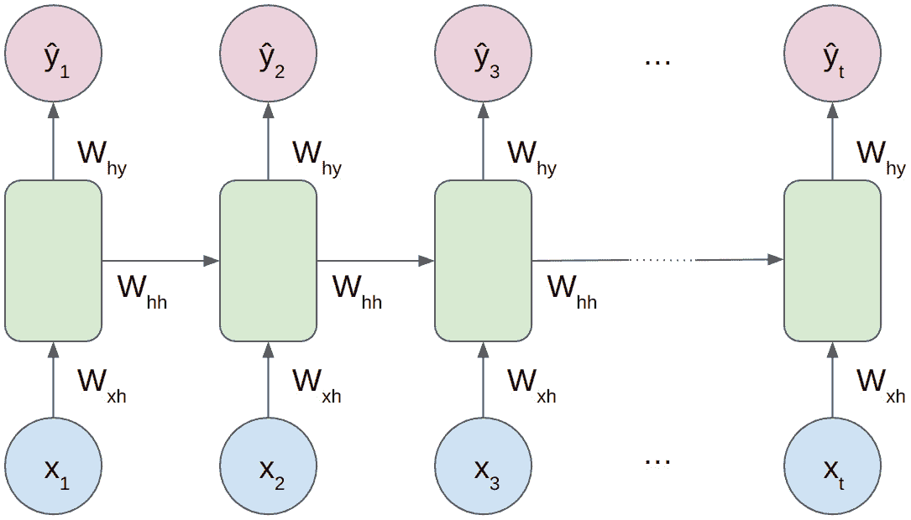
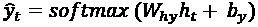
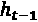

# 第八章：使用循环神经网络进行正则化

在本章中，我们将使用**循环神经网络**（**RNNs**）。正如我们将看到的，它们非常适合**自然语言处理**（**NLP**）任务，即使它们也适用于时间序列任务。在学习如何训练 RNN 后，我们将应用几种正则化方法，例如使用 dropout 和序列最大长度。这将帮助你掌握基础知识，并能应用到 NLP 或时间序列相关的任务中。它还将为你理解下一章中涵盖的更高级技巧提供必要的知识。

在本章中，我们将涵盖以下食谱：

+   训练 RNN

+   训练 **门控循环单元**（**GRU**）

+   使用 dropout 进行正则化

+   使用最大序列长度进行正则化

# 技术要求

在本章中，我们将使用以下库训练 RNNs（循环神经网络）来处理各种任务：

+   NumPy

+   pandas

+   scikit-learn

+   Matplotlib

+   PyTorch

+   Transformers

# 训练 RNN

在 NLP 中，输入数据通常是文本数据。由于文本通常只是一个词序列，因此使用 RNN 有时是一个很好的解决方案。事实上，与全连接网络不同，RNN 会考虑数据的序列信息。

在本例中，我们将在推文上训练 RNN 来预测其情感是正面、负面还是中性。

## 开始

在自然语言处理（NLP）中，我们通常处理的是文本数据，这些数据是非结构化的。为了正确处理这些数据，通常需要一个多步骤的过程——首先将文本转换为数字，然后再在这些数字上训练模型。

有几种方法可以将文本转换为数字。在本例中，我们将使用一种简单的方法，称为`['the', 'dog', 'is', 'out']`。在分词过程中通常还有一步——一旦句子被转换成词语列表，它必须被转换为数字。每个词都会被分配一个数字，这样句子“*The dog is out*”就可以被分词为`[3, 198, 50, 3027]`。

提示

这是一个相当简化的分词解释。有关更多资源，请查看 *参见下文* 子章节。

在本例中，我们将在推文上训练 RNN 来进行多类分类任务。然而，RNN 是如何工作的呢？RNN 以一系列特征作为输入，如*图 8.1*所示。


图 8.1 – 一个 RNN 的示意图。底层是输入特征，中间是隐藏层，顶层是输出层

在*图 8.1*中，RNN 的隐藏层有两个输入和两个输出：

+   **输入**：当前步骤的特征，，以及前一个步骤的隐藏状态，

+   **输出**：隐藏状态，（传递到下一步），以及该步骤的激活输出！[](img/Formula_08_004.png)

对于单层 RNN，激活函数就是输出 。

回到我们的例子，输入特征就是令牌。因此，在每个序列步骤中，一个或多个神经网络层会同时接收该步骤的特征和前一步的隐藏状态作为输入。

重要提示

RNN 还可以用于其他场景，如预测，其中输入特征既可以是定量的，也可以是定性的。

RNN 也有多个权重集。如 *图 8.2* 所示，存在三组权重：

+   ：应用于前一步隐藏状态的权重，用于当前隐藏状态的计算

+   ：应用于输入特征的权重，用于当前隐藏状态的计算

+   ：应用于当前隐藏状态的权重，用于当前输出



图 8.2 – 一个展示不同权重集的 RNN 结构

总的来说，综合考虑这些，隐藏状态和激活输出的计算可以如下进行：


这里，*g* 是激活函数，且  和  是偏置项。我们在此使用 *softmax* 来进行输出计算，假设这是一个多类分类任务，但根据任务的不同，任何激活函数都可以使用。

最后，损失可以像任何其他机器学习任务一样轻松计算（例如，对于分类任务，可以计算真实值和神经网络输出之间的交叉熵损失）。在这种神经网络上进行反向传播，称为 **时间反向传播**，超出了本书的范围。

从实践角度来看，针对本食谱，我们需要一个 Kaggle 数据集。获取此数据集的方法是，配置好 Kaggle API 后，可以使用以下命令行将数据集下载到当前工作目录：

```py
kaggle datasets download -d crowdflower/twitter-airline-sentiment --unzip
```

该行命令应该下载一个 `.zip` 文件并解压缩其内容，然后应能获得一个名为 `Tweets.csv` 的文件。你可以将该文件移动或复制到当前工作目录。

最后，必须安装以下库：`pandas`、`numpy`、`scikit-learn`、`matplotlib`、`torch` 和 `transformers`。可以使用以下命令行进行安装：

```py
pip install pandas numpy scikit-learn matplotlib torch transformers
```

## 如何做…

在本食谱中，我们将使用 RNN 来对推文进行三类分类——负面、中立和正面。正如前一部分所述，这将是一个多步骤的过程——首先进行推文文本的分词，然后进行模型训练：

1.  导入所需的库：

    +   用于神经网络的 `torch` 和一些相关模块与类

    +   用于预处理的 `train_test_split` 和 `LabelEncoder` 来自 scikit-learn

    +   使用 Transformers 中的 `AutoTokenizer` 对推文进行分词

    +   使用`pandas`加载数据集

    +   使用`matplotlib`进行可视化：

        ```py
        import torch import torch.nn as nn
        ```

        ```py
        import torch.optim as optim from torch.utils.data
        ```

        ```py
        import DataLoader, Dataset from sklearn.model_selection
        ```

        ```py
        import train_test_split from sklearn.preprocessing
        ```

        ```py
        import LabelEncoder from transformers
        ```

        ```py
        import AutoTokenizer
        ```

        ```py
        import pandas as pd
        ```

        ```py
        import matplotlib.pyplot as plt
        ```

1.  使用`pandas`从`.csv`文件加载数据：

    ```py
    # Load data
    ```

    ```py
    data = pd.read_csv('Tweets.csv')
    ```

    ```py
    data[['airline_sentiment', 'text']].head()
    ```

输出将是以下内容：

|  | `airline_sentiment` | `Text` |
| --- | --- | --- |
| 0 | 中立 | `@VirginAmerica What @``dhepburn said.` |
| 1 | 积极 | `@VirginAmerica plus you've added` `commercials t...` |
| 2 | 中立 | `@VirginAmerica I didn't today... Must mean` `I n...` |
| 3 | 消极 | `@VirginAmerica it's really aggressive` `to blast...` |
| 4 | 消极 | `@VirginAmerica and it's a really big` `bad thing...` |

表格 8.1 – 数据分类后的输出

我们将使用的数据由`airline_sentiment`列中的标签（包括消极、中立或积极）以及与之关联的原始推文文本（来自`text`列）组成。

3. 使用`train_test_split`函数将数据拆分为训练集和测试集，测试集大小为 20%，并指定随机状态以确保可复现性：

```py
# Split data into train and test sets
train_data, test_data = train_test_split(data,
    test_size=0.2, random_state=0)
```

4. 实现`TextClassificationDataset`数据集类，处理数据。在实例化时，该类将执行以下操作：

+   从 Transformers 中实例化`AutoTokenizer`

+   使用之前实例化的分词器对推文进行分词并存储结果

+   对标签进行编码并存储：

    ```py
    # Define dataset class class TextClassificationDataset(Dataset):
    ```

    ```py
    def __init__(self, data, max_length):
    ```

    ```py
        self.data = data
    ```

    ```py
        self.tokenizer = AutoTokenizer.from_pretrained(
    ```

    ```py
            'bert-base-uncased')
    ```

    ```py
        self.tokens = self.tokenizer(
    ```

    ```py
            data['text'].to_list(), padding=True,
    ```

    ```py
            truncation=True, max_length=max_length,
    ```

    ```py
            return_tensors='pt')['input_ids']
    ```

    ```py
        le = LabelEncoder()
    ```

    ```py
        self.labels = torch.tensor(le.fit_transform(
    ```

    ```py
            data['airline_sentiment']))
    ```

    ```py
    def __len__(self):
    ```

    ```py
        return len(self.data)
    ```

    ```py
    def __getitem__(self, index):
    ```

    ```py
        return self.tokens[index], self.labels[index]
    ```

使用该分词器指定了几个选项：

+   它使用`'bert-base-uncased'`分词器进行实例化，这是一个用于 BERT 模型的分词器

+   进行分词时，提供了一个最大长度作为构造函数的参数

+   填充设置为`True`，这意味着如果一条推文的长度小于最大长度，它将用零填充，以匹配该长度

+   截断设置为`True`，这意味着如果一条推文超过最大长度，剩余的令牌将被忽略

+   返回的张量指定为`'pt'`，因此它返回一个 PyTorch 张量

提示

请参阅*更多内容...*小节，了解分词器的详细信息。

5. 实例化`TextClassificationDataset`对象，分别用于训练集和测试集，以及相关的数据加载器。这里我们指定最大词数为`24`，批处理大小为`64`。这意味着每条推文将被转换为恰好 24 个令牌的序列：

```py
batch_size = 64 max_length = 24
# Initialize datasets and dataloaders
train_dataset = TextClassificationDataset(train_data,
    max_length)
test_dataset = TextClassificationDataset(test_data,
    max_length)
train_dataloader = DataLoader(train_dataset,
    batch_size=batch_size, shuffle=True)
test_dataloader = DataLoader(test_dataset,
    batch_size=batch_size, shuffle=True)
```

6. 实现 RNN 模型：

```py
# Define RNN model
class RNNClassifier(nn.Module):
    def __init__(self, vocab_size, embedding_dim,
        hidden_size, output_size, num_layers=3):
            super(RNNClassifier, self).__init__()
            self.num_layers = num_layers
            self.hidden_size = hidden_size
            self.embedding = nn.Embedding(
                num_embeddings=vocab_size,
                embedding_dim=embedding_dim)
            self.rnn = nn.RNN(
                input_size=embedding_dim,
                hidden_size=hidden_size,
                num_layers=num_layers,
                nonlinearity='relu',
                batch_first=True)
            self.fc = nn.Linear(hidden_size, output_size)
    def forward(self, inputs):
        batch_size = inputs.size(0)
        zero_hidden = torch.zeros(self.num_layers,
            batch_size, self.hidden_size)
        embedded = self.embedding(inputs)
        output, hidden = self.rnn(embedded, zero_hidden)
        output = torch.softmax(self.fc(output[:, -1]),
            dim=1)
        return output
```

这里定义的 RNN 模型可以通过几个步骤来描述：

+   一个嵌入层，它将令牌作为输入，输入的大小为词汇表的大小，输出的大小为给定的嵌入维度

+   三层 RNN，它将嵌入层的输出作为输入，具有给定的层数、隐藏层大小以及 ReLU 激活函数

+   最后，一个嵌入层，它将令牌作为输入，输入的大小为词汇表的大小，输出的大小为给定的嵌入维度；请注意，输出仅针对最后一个序列步骤计算（即`output[:, -1]`），并应用 softmax 激活函数

重要提示

输出不一定仅针对最后一个序列步骤进行计算。根据任务的不同，在每个步骤输出一个值可能是有用的（例如，预测任务），或者只输出一个最终值（例如，分类任务）。

7. 实例化并测试模型。词汇表大小由分词器提供，输出大小为三是由任务定义的；有三个类别（负面、中立、正面）。其他参数是超参数；这里选择了以下值：

+   嵌入维度为`64`

+   一个隐藏维度为`64`

当然，其他值也可以进行测试：

```py
vocab_size = train_dataset.tokenizer.vocab_size
embedding_dim = 64
hidden_dim = 64
output_size = 3
model = RNNClassifier(
    vocab_size=vocab_size,
    embedding_dim=embedding_dim,
    hidden_size=hidden_dim,
    output_size=output_size, )
random_data = torch.randint(0, vocab_size,
    size=(batch_size, max_length))
result = model(random_data)
print('Resulting output tensor:', result.shape) print('Sum of the output tensor:', result.sum())
```

代码将输出如下：

```py
Resulting output tensor: torch.Size([64, 3]) Sum of the output tensor: tensor(64.0000, grad_fn=<SumBackward0>)
```

8. 实例化优化器；在这里，我们将使用 Adam 优化器，学习率为`0.001`。损失函数是交叉熵损失，因为这是一个多类分类任务：

```py
optimizer = optim.Adam(model.parameters(), lr=0.001)
criterion = nn.CrossEntropyLoss()
```

9. 让我们定义两个辅助函数来训练模型。

`epoch_step_tweet`将计算一个时代的损失和准确率，并更新训练集的权重：

```py
def epoch_step_tweet(model, dataloader,
    training_set: bool):
        running_loss = 0
        correct = 0.
    for i, data in enumerate(dataloader, 0):
        # Get the inputs: data is a list of [inputs, labels]
        inputs, labels = data
        if training_set:
            # Zero the parameter gradients
            optimizer.zero_grad()
        # Forward + backward + optimize
        outputs = model(inputs)
        loss = criterion(outputs, labels) .long()
        if training_set:
            loss.backward()
            optimizer.step()
        # Add correct predictions for this batch
        correct += (outputs.argmax(
            dim=1) == labels).float().sum()
        # Compute loss for this batch
        running_loss += loss.item()
    return running_loss, correct
```

`train_tweet_classification`将循环遍历各个时代，并使用`epoch_step_tweet`计算和存储损失和准确率：

```py
def train_tweet_classification(model,
    train_dataloader, test_dataloader, criterion,
    epochs: int = 20):
        # Train the model
        train_losses = []
        test_losses = []
        train_accuracy = []
        test_accuracy = []
    for epoch in range(20):
        running_train_loss = 0.
        correct = 0.
        model.train()
        running_train_loss,
        correct = epoch_step_tweet(model,
            dataloader=train_dataloader,
            training_set=True)
        # Compute and store loss and accuracy for this epoch
        train_epoch_loss = running_train_loss / len(
            train_dataloader)
        train_losses.append(train_epoch_loss)
        train_epoch_accuracy = correct / len(
            train_dataset)
        train_accuracy.append(train_epoch_accuracy)
        ## Evaluate the model on the test set
        running_test_loss = 0.
        correct = 0.
        model.eval()
        with torch.no_grad():
            running_test_loss,
            correct = epoch_step_tweet(model,
                dataloader=test_dataloader,
                training_set=False)
            test_epoch_loss = running_test_loss / len(
                test_dataloader)
            test_losses.append(test_epoch_loss)
            test_epoch_accuracy = correct / len(
            test_dataset)
            test_accuracy.append(test_epoch_accuracy)
        # Print stats
        print(f'[epoch {epoch + 1}] Training: loss={train_epoch_loss:.3f} accuracy={train_epoch_accuracy:.3f} |\
    \t Test: loss={test_epoch_loss:.3f} accuracy={test_epoch_accuracy:.3f}')
    return train_losses, test_losses, train_accuracy,
    test_accuracy
```

10. 复用辅助函数，我们现在可以在 20 次迭代中训练模型。在这里，我们将计算并存储每个时代的训练集和测试集的准确率和损失，以便之后绘制它们：

```py
train_losses, test_losses, train_accuracy, test_accuracy = train_tweet_classification(model,
    train_dataloader, test_dataloader, criterion,
    epochs=20)
```

在 20 次迭代后，输出应如下所示：

```py
[epoch 20] Training: loss=0.727 accuracy=0.824 |  Test: loss=0.810 accuracy=0.738
```

11. 绘制损失与时代数的关系，分别针对训练集和测试集：

```py
plt.plot(train_losses, label='train')
plt.plot(test_losses, label='test')
plt.xlabel('epoch') plt.ylabel('loss (CE)')
plt.legend() plt.show()
```

这是最终得到的图表：


图 8.3 – 交叉熵损失与时代的关系

我们可以看到在第五次迭代时就开始出现过拟合，因为训练损失不断减少，而测试损失趋于平稳。

12. 同样，绘制准确率与时代数的关系，分别针对训练集和测试集：

```py
plt.plot(train_accuracy, label='train')
plt.plot(test_accuracy, label='test')
plt.xlabel('epoch') plt.ylabel('Accuracy')
plt.legend() plt.show()
```

然后，我们得到了这个图表：


图 8.4 – 准确率与时代的关系

在 20 次迭代后，训练集的准确率大约为 82%，但测试集的准确率仅为 74%，这意味着通过适当的正则化可能还有提升空间。

## 还有更多内容……

在这个例子中，我们使用了`HuggingFace`分词器，但它实际上做了什么呢？让我们看一个文本示例，以便完全理解它的功能。

首先，让我们使用`AutoTokenizer`类定义一个全新的分词器，指定 BERT 分词器：

```py
from transformers import AutoTokenizer
tokenizer = AutoTokenizer.from_pretrained('bert-base-uncased')
```

重要提示

有许多分词器，它们有不同的方法，因此对于同一文本给出不同的输出。`'bert-base-uncased'`是一个相当常见的分词器，但也可以使用许多其他分词器。

现在让我们将这个分词器应用于给定的文本，使用`tokenize`方法，看看输出是什么：

```py
tokenizer.tokenize("Let's use regularization in ML. Regularization should help to improve model robustness")
```

代码输出如下：

```py
['let',  "'",  's',  'use',  'regular',  '##ization',  'in',
  'ml',  '.',  'regular',  '##ization',  'should',  'help',
  'to',  'improve',  'model',  'robust',  '##ness']
```

因此，分词可以描述为将一个句子拆分成更小的部分。其他分词器可能会在句尾有不同的词块（或词元），但过程本质上是相同的。

现在，如果我们在这个相同的句子中应用分词，我们可以通过`'input_ids'`获取词元编号：

```py
tokenizer("Let's use regularization in ML. Regularization should help to improve model robustness")['input_ids']
```

代码输出现在是以下内容：

```py
[101,  2292,  1005,  1055,  2224,  3180,  3989,  1999,  19875,
  1012,  3180,  3989,  2323,  2393,  2000,  5335,  2944,  15873,
  2791,  102]
```

重要提示

请注意，`3180`和`3989`这两个词元出现了两次。实际上，词汇`regularization`（被分词为两个独立的词元）出现了两次。

对于给定的分词器，词汇表的大小就是现有词汇的数量。这个大小存储在`vocab_size`属性中。在这个例子中，词汇表的大小是`30522`。

提示

如果你感兴趣，你也可以直接查看整个词汇表，它作为字典存储在`.vocab`属性中。

## 另请参阅

+   这是 HuggingFace 关于分词器的精彩内容：[`huggingface.co/docs/transformers/tokenizer_summary`](https://huggingface.co/docs/transformers/tokenizer_summary%0D)

+   关于`AutoTokenizer`的官方文档：[`huggingface.co/docs/transformers/v4.27.2/en/model_doc/auto#transformers.AutoTokenizer`](https://huggingface.co/docs/transformers/v4.27.2/en/model_doc/auto#transformers.AutoTokenizer%0D)

+   关于 RNN 的官方文档：[`pytorch.org/docs/stable/generated/torch.nn.RNN.xhtml`](https://pytorch.org/docs/stable/generated/torch.nn.RNN.xhtml%0D)

# 训练一个 GRU

在这个教程中，我们将继续探索 RNN 与**GRU** —— 它是什么，如何工作，以及如何训练这样一个模型。

## 入门

RNN 的主要限制之一是网络在其步骤中的记忆。GRU 通过添加一个记忆门来克服这一限制。

如果我们退后一步，用一个简单的示意图描述 RNN 单元，它可能会像*图 8.5*一样。


图 8.5 – RNN 单元的示意图

所以基本上，在每个步骤*t*，都有一个隐藏状态和一组特征。它们被连接在一起，然后应用权重和激活函数 g，最终得到一个新的隐藏状态。可选地，从这个隐藏状态计算出一个输出，依此类推。

但如果这个特征步骤不相关呢？或者，如果网络偶尔完全记住这个隐藏状态会有用呢？这正是 GRU 所做的，通过所谓的门添加一组新的参数。

**门**也是通过反向传播学习的，使用一组新的权重，并使网络能够学习更复杂的模式，以及记住相关的过去信息。

一个 GRU 由两个门组成：

+   ：更新门，负责学习是否更新隐藏状态

+   ：相关性门，负责学习隐藏状态的相关性

最后，GRU 单元的简化图示如*图 8.6*所示。


图 8.6 – GRU 单元的示意图。为清晰起见，省略了相关性门

前向计算现在比简单 RNN 单元略复杂，可以通过以下公式集合来描述：




这些方程可以用几个词简单描述。与简单 RNN 相比，主要有三个区别：

+   两个门，和，与相关权重一起计算

+   相关性门用于计算中间隐藏状态

+   最终的隐藏状态是之前隐藏状态和当前中间隐藏状态的线性组合，更新门作为权重

这里的主要技巧是使用更新门，它可以在极端情况下解释为：

+   如果仅由 1 构成，则会忘记之前的隐藏状态

+   如果仅由 0 构成，则不考虑新的隐藏状态

尽管这些概念一开始可能比较复杂，但幸运的是，GRU 在 PyTorch 中使用起来非常简单，正如我们在本示例中所看到的。

为了运行本示例中的代码，我们将使用 IMDb 数据集——一个包含电影评论以及正面或负面标签的数据集。任务是根据文本推测评论的极性（正面或负面）。可以通过以下命令行下载：

```py
kaggle datasets download -d lakshmi25npathi/imdb-dataset-of-50k-moviereviews --unzip
```

我们还需要以下库：`pandas`、`numpy`、`scikit-learn`、`matplotlib`、`torch`和`transformers`。它们可以通过以下命令行安装：

```py
pip install pandas numpy scikit-learn matplotlib torch transformers
```

## 如何实现…

在本示例中，我们将在相同的 IMDb 数据集上训练一个 GRU 模型进行二分类任务。正如我们所看到的，训练 GRU 的代码几乎与训练一个简单 RNN 的代码相同：

1.  导入所需的库：

    +   使用`torch`及一些相关模块和类来构建神经网络

    +   从 scikit-learn 导入`train_test_split`和`LabelEncoder`进行预处理

    +   使用 Transformers 中的`AutoTokenizer`来对评论进行分词

    +   使用`pandas`加载数据集

    +   使用`matplotlib`进行可视化：

        ```py
        import torch
        ```

        ```py
        import torch.nn as nn
        ```

        ```py
        import torch.optim as optim from torch.utils.data
        ```

        ```py
        import DataLoader,Dataset from sklearn.model_selection
        ```

        ```py
        import train_test_split from sklearn.preprocessing
        ```

        ```py
        import LabelEncoder from transformers
        ```

        ```py
        import AutoTokenizer
        ```

        ```py
        import pandas as pd
        ```

        ```py
        import numpy as np
        ```

        ```py
        import matplotlib.pyplot as plt
        ```

1.  使用 pandas 从`.csv`文件加载数据。这是一个 50,000 行的数据集，包含文本评论和标签：

    ```py
    # Load data
    ```

    ```py
    data = pd.read_csv('IMDB Dataset.csv')
    ```

    ```py
    data.head()
    ```

代码输出如下：

```py
                                   review    sentiment 0  One of the other reviewers has mentioned that ...       positive
1  A wonderful little production. <br /><br />The...  positive
2  I thought this was a wonderful way to spend ti...     positive
3  Basically there's a family where a little boy ...       negative
4  Petter Mattei's "Love in the Time of Money" is...     positive
```

1.  使用`train_test_split`函数将数据拆分为训练集和测试集，测试集大小为 20%，并指定随机种子以确保可重现性：

    ```py
    # Split data into train and test sets
    ```

    ```py
    Train_data, test_data = train_test_split(data,
    ```

    ```py
        test_size=0.2, random_state=0)
    ```

1.  实现`TextClassificationDataset`数据集类来处理数据。在实例创建时，该类将执行以下操作：

    +   从 transformers 库中实例化`AutoTokenizer`，使用`bert-base-uncased`分词器

    +   使用先前实例化的分词器，对推文进行分词，并提供最大长度、填充和截断选项

    +   编码标签并存储：

        ```py
        # Define dataset class
        ```

        ```py
        class TextClassificationDataset(Dataset):
        ```

        ```py
            def __init__(self, data, max_length):
        ```

        ```py
                self.data = data
        ```

        ```py
                self.tokenizer = AutoTokenizer.from_pretrained('bert-base-uncased')
        ```

        ```py
                self.tokens = self.tokenizer(
        ```

        ```py
                    data['review'].to_list(), padding=True,
        ```

        ```py
                    truncation=True, max_length=max_length,
        ```

        ```py
                    return_tensors='pt')['input_ids']
        ```

        ```py
                le = LabelEncoder()
        ```

        ```py
                self.labels = torch.tensor(le.fit_transform(
        ```

        ```py
                    data['sentiment']).astype(np.float32))
        ```

        ```py
            def __len__(self):
        ```

        ```py
                return len(self.data)
        ```

        ```py
            def __getitem__(self, index):
        ```

        ```py
                return self.tokens[index],self.labels[index]
        ```

1.  实例化`TextClassificationDataset`对象，分别为训练集和测试集创建数据加载器，最大词汇数为 64，批大小为 64。也就是说，每个电影评论将被转换为一个恰好包含 64 个标记的序列：

    ```py
    batch_size = 64
    ```

    ```py
    max_words = 64
    ```

    ```py
    # Initialize datasets and dataloaders
    ```

    ```py
    train_dataset = TextClassificationDataset(train_data,
    ```

    ```py
        max_words)
    ```

    ```py
    test_dataset = TextClassificationDataset(test_data,
    ```

    ```py
        max_words)
    ```

    ```py
    train_dataloader = DataLoader(train_dataset,
    ```

    ```py
        batch_size=batch_size, shuffle=True)
    ```

    ```py
    test_dataloader = DataLoader(test_dataset,
    ```

    ```py
        batch_size=batch_size, shuffle=True)
    ```

1.  实现 GRU 分类模型。它由以下元素组成：

    +   嵌入层（以零向量作为第一个输入）

    +   三层 GRU

    +   在最后一个序列步骤上使用全连接层，激活函数为 sigmoid，因为这是一个二分类任务：

        ```py
        # Define GRU model
        ```

        ```py
        class GRUClassifier(nn.Module):
        ```

        ```py
            def __init__(self, vocab_size, embedding_dim,
        ```

        ```py
                hidden_size, output_size, num_layers=3):
        ```

        ```py
                    super(GRUClassifier, self).__init__()
        ```

        ```py
                    self.num_layers = num_layers
        ```

        ```py
                    self.hidden_size = hidden_size
        ```

        ```py
                    self.embedding = nn.Embedding(
        ```

        ```py
                        num_embeddings=vocab_size,
        ```

        ```py
                        embedding_dim=embedding_dim)
        ```

        ```py
                    self.gru = nn.GRU(
        ```

        ```py
                        input_size=embedding_dim,
        ```

        ```py
                        hidden_size=hidden_size,
        ```

        ```py
                        num_layers=num_layers,
        ```

        ```py
                        batch_first=True)
        ```

        ```py
                    self.fc = nn.Linear(hidden_size,
        ```

        ```py
                        output_size)
        ```

        ```py
            def forward(self, inputs):
        ```

        ```py
                batch_size = inputs.size(0)
        ```

        ```py
                zero_hidden = torch.zeros(
        ```

        ```py
                    self.num_layers, batch_size,
        ```

        ```py
                    self.hidden_size).to(device)
        ```

        ```py
                embedded = self.embedding(inputs)
        ```

        ```py
                output, hidden = self.gru(embedded,
        ```

        ```py
                    zero_hidden)
        ```

        ```py
                output = torch.sigmoid(self.fc(output[:, -1]))
        ```

        ```py
                return output
        ```

1.  实例化 GRU 模型，设置嵌入维度和隐藏维度为 32：

    ```py
    vocab_size = train_dataset.tokenizer.vocab_size
    ```

    ```py
    embedding_dim = 32
    ```

    ```py
    hidden_dim = 32
    ```

    ```py
    output_size = 1
    ```

    ```py
    # Optionally, set the device to GPU if you have one device = torch.device(
    ```

    ```py
        'cuda' if torch.cuda.is_available() else 'cpu')
    ```

    ```py
    model = GRUClassifier(
    ```

    ```py
        vocab_size=vocab_size,
    ```

    ```py
        embedding_dim=embedding_dim,
    ```

    ```py
        hidden_size=hidden_dim,
    ```

    ```py
        output_size=output_size,
    ```

    ```py
    ).to(device)
    ```

    ```py
    random_data = torch.randint(0, vocab_size,
    ```

    ```py
        size=(batch_size, max_words)).to(device)
    ```

    ```py
    result = model(random_data)
    ```

    ```py
    print('Resulting output tensor:', result.shape)
    ```

    ```py
    print('Sum of the output tensor:', result.sum())
    ```

代码输出如下：

```py
Resulting output tensor: torch.Size([64, 1]) Sum of the output tensor: tensor(31.0246, device='cuda:0', grad_fn=<SumBackward0>)
```

1.  实例化优化器为 Adam 优化器，学习率为`0.001`。损失定义为二元交叉熵损失，因为这是一个二分类任务：

    ```py
    optimizer = optim.Adam(model.parameters(), lr=0.001)
    ```

    ```py
    criterion = nn.BCELoss()
    ```

1.  现在让我们实现两个辅助函数。

`epoch_step_IMDB`更新训练集的权重，并计算给定轮次的二元交叉熵损失和准确率：

```py
def epoch_step_IMDB(model, dataloader, device,
    training_set: bool):
        running_loss = 0.
        correct = 0.
        for i, data in enumerate(dataloader, 0):
  # Get the inputs: data is a list of [inputs, labels]
            inputs, labels = data
            inputs = inputs.to(device)
            labels = labels.unsqueeze(1).to(device)
            if training_set:
                # Zero the parameter gradients
                optimizer.zero_grad()
                # Forward + backward + optimize
                outputs = model(inputs)
                loss = criterion(outputs, labels)
            if training_set:
                loss.backward()
                optimizer.step()
             # Add correct predictions for this batch
                correct += (
             (outputs > 0.5) == labels).float().sum()
                # Compute loss for this batch
                running_loss += loss.item()
    return running_loss, correct
```

`train_IMDB_classification` 在各个轮次中循环，训练模型，并存储训练集和测试集的准确率与损失：

```py
def train_IMDB_classification(model, train_dataloader,
    test_dataloader, criterion, device,
    epochs: int = 20):
        # Train the model
        train_losses = []
        test_losses = []
        train_accuracy = []
        test_accuracy = []
    for epoch in range(20):
        running_train_loss = 0.
        correct = 0.
        model.train()
        running_train_loss, correct = epoch_step_IMDB(
            model, train_dataloader, device,
                training_set=True
        )
        # Compute and store loss and accuracy for this epoch
        train_epoch_loss = running_train_loss / len(
            train_dataloader)
        train_losses.append(train_epoch_loss)
        train_epoch_accuracy = correct / len(
            train_dataset)
        train_accuracy.append(
            train_epoch_accuracy.cpu().numpy())
        ## Evaluate the model on the test set
        running_test_loss = 0.
        correct = 0.
        model.eval()
        with torch.no_grad():
            running_test_loss,
            correct = epoch_step_IMDB(
                model, test_dataloader, device,
                training_set=False
            )
            test_epoch_loss = running_test_loss / len(
                test_dataloader)
            test_losses.append(test_epoch_loss)
            test_epoch_accuracy = correct / len(
                test_dataset)
            test_accuracy.append(
                test_epoch_accuracy.cpu().numpy())
        # Print stats
        print(f'[epoch {epoch + 1}] Training: loss={train_epoch_loss:.3f} accuracy={train_epoch_accuracy:.3f} |\
    \t Test: loss={test_epoch_loss:.3f} accuracy={test_epoch_accuracy:.3f}')
    return train_losses, test_losses, train_accuracy,
        test_accuracy
```

1.  在 20 个轮次中训练模型，重用我们刚刚实现的函数。在每个轮次中计算并存储训练集和测试集的准确率与损失，用于可视化目的：

    ```py
    train_losses, test_losses, train_accuracy, test_accuracy = train_IMDB_classification(model,
    ```

    ```py
        train_dataloader, test_dataloader, criterion,
    ```

    ```py
        device, epochs=20)
    ```

在 20 个轮次后，结果应该接近以下代码输出：

```py
[epoch 20] Training: loss=0.040 accuracy=0.991 |  Test: loss=1.155 accuracy=0.751
```

1.  将损失绘制为轮次数的函数，分别针对训练集和测试集：

    ```py
    plt.plot(train_losses, label='train')
    ```

    ```py
    plt.plot(test_losses, label='test')
    ```

    ```py
    plt.xlabel('epoch') plt.ylabel('loss (BCE)')
    ```

    ```py
    plt.legend() plt.show()
    ```

然后我们得到这个图表：


图 8.7 – 以轮次为函数的二元交叉熵损失

如我们所见，测试集的损失明显发散，这意味着在仅仅几个轮次后，模型已经出现过拟合。

1.  同样，将准确率绘制为轮次数的函数，分别针对训练集和测试集：

    ```py
    plt.plot(train_accuracy, label='train')
    ```

    ```py
    plt.plot(test_accuracy, label='test')
    ```

    ```py
    plt.xlabel('epoch') plt.ylabel('Accuracy')
    ```

    ```py
    plt.legend() plt.show()
    ```

这是得到的图表：


图 8.8 – 以轮次为函数的准确率

与损失一样，我们可以看到模型在训练集上的准确率接近 100%，但在测试集上的最高准确率仅为 77%，这表明我们面临过拟合问题。

顺便提一下，如果你亲自尝试这份配方和前一份配方，你可能会发现 GRU 在结果上要稳定得多，而前一份配方中的 RNN 有时会在收敛时遇到困难。

## 还有更多……

在处理诸如文本、时间序列和音频等顺序数据时，RNNs 是常用的。虽然由于其局限性，简单的 RNNs 不常用，但 GRUs 通常是更好的选择。除了简单的 RNN 和 GRU，另一个常用的单元类型是 **长短期记忆** 单元，通常称为 **LSTM**。

LSTM 的单元比 GRU 的单元更为复杂。虽然 GRU 单元有一个隐藏状态和两个门，但 LSTM 单元有两种隐藏状态（隐藏状态和单元状态）和三个门。现在我们来快速看一下。

LSTM 的单元状态如 *图 8**.9* 所示：


图 8.9 – LSTM 单元的示意图，假设 LSTM 激活函数为 tanh，输出层激活函数为 softmax。

不涉及 LSTM 的所有计算细节，从 *图 8**.9* 可以看出，那里有三个门，基于前一个隐藏状态  和当前特征  计算，和 GRU 一样，使用 sigmoid 激活函数：

+   忘记门 

+   更新门 

+   输出门 

每个步骤还会计算两个状态：

+   一个单元状态 

+   一个隐藏状态 

在这里，中间状态  是通过其自身的权重集计算的，类似于门控，且具有自由的激活函数。

由于有更多的门和状态，LSTM 的参数比 GRU 多，因此通常需要更多的数据才能正确训练。然而，它们在处理长序列时被证明非常有效，例如长文本。

使用 PyTorch，训练 LSTM 的代码与训练 GRU 的代码没有太大区别。在这个实例中，唯一需要更改的代码部分是模型实现，例如，替换为以下代码：

```py
class LSTMClassifier(nn.Module):
    def __init__(self, vocab_size, embedding_dim,
        hidden_size, output_size, num_layers=3):
            super(LSTMClassifier, self).__init__()
            self.hidden_size = hidden_size
            self.num_layers = num_layers
            self.embedding = nn.Embedding(
                num_embeddings=vocab_size,
                embedding_dim=embedding_dim)
                self.lstm = nn.LSTM(
                    input_size=embedding_dim,
                    hidden_size=hidden_size,
                    num_layers=num_layers,
                    batch_first=True)
            self.fc = nn.Linear(hidden_size, output_size)
    def forward(self, inputs):
        batch_size = inputs.size(0)
        h_0 = torch.zeros(self.num_layers, batch_size,
            self.hidden_size)
        c_0 = torch.zeros(self.num_layers, batch_size,
            self.hidden_size)
        embedded = self.embedding(inputs)
        output,
        (final_hidden_state, final_cell_state) = self.lstm(
            embedded, (h_0, c_0))
        output = torch.softmax(self.fc(output[:, -1]),
            dim=1)
        return output
```

与之前实现的 `GRUClassifier` 的主要区别如下：

+   在 `init` 中：当然，使用 `nn.LSTM` 代替 `nn.GRU`，因为我们现在想要一个基于 LSTM 的分类器。

+   在 `forward` 中：我们现在初始化两个零向量，`h0` 和 `c0`，它们被输入到 LSTM 中。

+   LSTM 的输出现在由输出以及隐藏状态和单元状态组成。

除此之外，它可以像 GRU 一样进行训练，使用相同的代码。

在对比说明中，让我们计算此 LSTM 中的参数数量，并与“等效”的 RNN 和 GRU 的参数数量进行比较（即相同的隐藏维度，相同的层数，等等）。

此 LSTM 中的参数数量可以通过以下代码计算：

```py
sum(p.numel() for p in list(
    model.parameters())[1:] if p.requires_grad)
```

重要提示

请注意，我们没有考虑嵌入部分，因为我们忽略了第一层。

以下是每种模型的参数数量：

+   **RNN**：6,369

+   **GRU**：19,041

+   **LSTM**：25,377

解释这个的经验法则是门的数量。与简单的 RNN 相比，GRU 有两个额外的门，每个门都需要自己的权重，因此总的参数数量是原来的三倍。LSTM 同样适用这个逻辑，它有三个门。

总的来说，模型包含的参数越多，它需要的训练数据就越多，以确保其鲁棒性，这也是为什么 GRU 是一种很好的折中方案，通常是一个不错的首选。

重要提示

到目前为止，我们只假设 GRU（以及 RNN 一般）是从左到右运行——从句子的开始到句子的结尾。只是因为我们人类在阅读时通常是这么做的，并不意味着这是神经网络学习的最优方式。实际上，可以使用双向 RNN，也就是在模型定义时使用`bidirectional=True`，例如`nn.GRU(bidirectional=True)`。

## 另请参见

+   关于 GRU 的官方文档：[`pytorch.org/docs/stable/generated/torch.nn.GRU.xhtml`](https://pytorch.org/docs/stable/generated/torch.nn.GRU.xhtml%0D)

+   关于 LSTM 的官方文档：[`pytorch.org/docs/stable/generated/torch.nn.LSTM.xhtml`](https://pytorch.org/docs/stable/generated/torch.nn.LSTM.xhtml%0D)

+   Andrej Karpathy 关于 LSTM 有效性的一个稍微过时但很棒的帖子：[`karpathy.github.io/2015/05/21/rnn-effectiveness/`](https://karpathy.github.io/2015/05/21/rnn-effectiveness/%0D)

# 使用 dropout 进行正则化

在这个食谱中，我们将向 GRU 中添加 dropout，以便在 IMDb 分类数据集上增加正则化。

## 准备工作

就像全连接神经网络一样，GRU 和 LSTM 等递归神经网络也可以通过 dropout 进行训练。作为提醒，dropout 就是在训练期间随机将某些单元的激活值设置为零。这样，它可以让网络一次性处理更少的信息，并希望能更好地泛化。

我们将通过在相同任务——IMDb 数据集二分类——上使用 dropout，来改进 GRU 训练食谱的结果。

如果尚未完成，可以使用以下命令行通过 Kaggle API 下载数据集：

```py
kaggle datasets download -d lakshmi25npathi/imdb-dataset-of-50k-moviereviews --unzip
```

可以使用以下命令安装所需的库：

```py
pip install pandas numpy scikit-learn matplotlib torch transformers
```

## 如何操作…

以下是执行这个食谱的步骤：

1.  我们将在 IMDb 数据集上训练 GRU，就像在*训练 GRU*食谱中一样。由于*训练 GRU*的前五个步骤（从导入到`DataLoaders`实例化）在这个食谱中是通用的，因此我们假设它们已经执行完毕，直接开始实现模型类。实现 GRU 分类器模型，它由以下元素组成：

    +   一个嵌入层（以零向量作为第一个输入），在前向传播中对其应用 dropout

    +   三层 GRU，dropout 直接作为参数传递给 GRU 构造函数

    +   在最后一个序列步骤上添加一个全连接层，使用 sigmoid 激活函数，且不应用 dropout：

        ```py
        # Define GRU model
        ```

        ```py
        class GRUClassifier(nn.Module):
        ```

        ```py
            def __init__(self, vocab_size, embedding_dim,
        ```

        ```py
                hidden_size, output_size, num_layers=3,
        ```

        ```py
                dropout=0.25):
        ```

        ```py
                    super(GRUClassifier, self).__init__()
        ```

        ```py
                    self.num_layers = num_layers
        ```

        ```py
                    self.hidden_size = hidden_size
        ```

        ```py
                    self.embedding = nn.Embedding(
        ```

        ```py
                        num_embeddings=vocab_size,
        ```

        ```py
                        embedding_dim=embedding_dim)
        ```

        ```py
                    self.dropout = nn.Dropout(dropout)
        ```

        ```py
                    self.gru = nn.GRU(
        ```

        ```py
                        input_size=embedding_dim,
        ```

        ```py
                        hidden_size=hidden_size,
        ```

        ```py
                        num_layers=num_layers,
        ```

        ```py
                        batch_first=True, dropout=dropout)
        ```

        ```py
                    self.fc = nn.Linear(hidden_size,
        ```

        ```py
                        output_size)
        ```

        ```py
            def forward(self, inputs):
        ```

        ```py
                batch_size = inputs.size(0)
        ```

        ```py
                zero_hidden = torch.zeros(self.num_layers,
        ```

        ```py
                    batch_size, self.hidden_size).to(device)
        ```

        ```py
                embedded = self.dropout(
        ```

        ```py
                    self.embedding(inputs))
        ```

        ```py
                output, hidden = self.gru(embedded,
        ```

        ```py
                    zero_hidden)
        ```

        ```py
                output = torch.sigmoid(self.fc(output[:, -1]))
        ```

        ```py
                return output
        ```

重要说明

并不是强制要求在嵌入层应用 dropout，也并非总是有用。在这种情况下，由于嵌入层占模型的大部分，仅在 GRU 层应用 dropout 对性能不会产生显著影响。

1.  实例化 GRU 模型，嵌入维度和隐藏维度均为 `32`：

    ```py
    vocab_size = train_dataset.tokenizer.vocab_size
    ```

    ```py
    embedding_dim = 32 hidden_dim = 32 output_size = 1
    ```

    ```py
    # Optionally, set the device to GPU if you have one
    ```

    ```py
    device = torch.device(
    ```

    ```py
        'cuda' if torch.cuda.is_available() else 'cpu')
    ```

    ```py
    model = GRUClassifier(
    ```

    ```py
        vocab_size=vocab_size,
    ```

    ```py
        embedding_dim=embedding_dim,
    ```

    ```py
        hidden_size=hidden_dim,
    ```

    ```py
         output_size=output_size, ).to(device)
    ```

实例化 Adam 优化器，学习率为 `0.001`。由于这是一个二分类任务，损失函数定义为二元交叉熵损失：

```py
optimizer = optim.Adam(model.parameters(), lr=0.001)
criterion = nn.BCELoss()
```

1.  通过重新使用前一个食谱中实现的辅助函数，在 20 个轮次内训练模型。每个轮次中，我们会计算并存储训练集和测试集的准确率和损失值：

    ```py
    train_losses, test_losses, train_accuracy, 
    ```

    ```py
    test_accuracy = train_IMDB_classification(model,
    ```

    ```py
        train_dataloader, test_dataloader, criterion,
    ```

    ```py
        device, epochs=20)
    ```

最后一轮的输出应如下所示：

```py
[epoch 20] Training: loss=0.248 accuracy=0.896 |  Test: loss=0.550 accuracy=0.785
```

1.  绘制损失函数与轮次数的关系图，分别针对训练集和测试集：

    ```py
    plt.plot(train_losses, label='train')
    ```

    ```py
    plt.plot(test_losses, label='test')
    ```

    ```py
    plt.xlabel('epoch') plt.ylabel('loss (BCE)')
    ```

    ```py
    plt.legend() plt.show()
    ```

这是输出结果：


图 8.10 – 二元交叉熵损失与轮次数的关系

我们可以看到，尽管我们仍然存在过拟合，但比没有应用 dropout 时要轻微一些。

1.  最后，绘制训练集和测试集准确率与轮次数的关系图：

    ```py
    plt.plot(train_accuracy, label='train')
    ```

    ```py
    plt.plot(test_accuracy, label='test')
    ```

    ```py
    plt.xlabel('epoch') plt.ylabel('Accuracy')
    ```

    ```py
    plt.legend() plt.show()
    ```

这是输出结果：


图 8.11 – 准确率与轮次数的关系

请注意 dropout 对训练集准确率的影响。

尽管准确率没有显著提高，但它已从 77% 增加到 79%，且使用 dropout 后训练集和测试集的损失差距小于没有 dropout 时，从而提高了泛化能力。

## 还有更多…

与 dropout 不同，其他有助于正则化全连接神经网络的方法也可以与 GRU 和其他基于 RNN 的架构一起使用。

例如，由于我们在这里出现了明显的过拟合，训练损失有急剧下降，因此测试较小的架构可能会很有趣，使用较少的参数进行学习。

# 使用最大序列长度进行正则化

在本食谱中，我们将通过调整最大序列长度来进行正则化，使用基于 GRU 的神经网络处理 IMDB 数据集。

## 做好准备

到目前为止，我们没有太多调整序列的最大长度，但它有时是最重要的超参数之一。

事实上，根据输入数据集的不同，最佳的最大长度可能会有很大差异：

+   推文很短，因此大多数情况下，最大令牌数设置为几百没有意义。

+   产品或电影评论通常会更长，有时评论者会写很多关于产品/电影的优缺点，然后才给出最终结论——在这种情况下，较大的最大长度可能会有所帮助。

在这个配方中，我们将在 IMDB 数据集上训练一个 GRU，该数据集包含电影评论和相应的标签（正面或负面）；该数据集包含一些非常长的文本。因此，我们将大幅增加单词的最大数量，并查看它对最终精度的影响。

如果尚未完成，你可以下载数据集，假设你已安装 Kaggle API，可以运行以下命令行：

```py
kaggle datasets download -d lakshmi25npathi/imdb-dataset-of-50k-moviereviews --unzip
```

以下库是必须的：`pandas`、`numpy`、`scikit-learn`、`matplotlib`、`torch`和`transformers`。它们可以通过以下命令行安装：

```py
pip install pandas numpy scikit-learn matplotlib torch transformers
```

## 如何做到…

以下是执行此配方的步骤：

1.  这个配方大部分与*训练 GRU*配方在 IMDB 数据集上的操作相同；唯一的区别是序列的最大长度。由于最显著的区别是序列长度值和结果，我们将假设*训练 GRU*的前四个步骤（从导入到数据集实现）已完成，并将重用一些代码。实例化训练集和测试集的`TextClassificationDataset`对象（重用在*训练 GRU*中实现的类），以及相关的数据加载器。

这次，我们选择了一个最大单词数为`256`，显著高于之前的`64`。我们将保持批处理大小为`64`：

```py
batch_size = 64 max_words = 256
# Initialize datasets and dataloaders
Train_dataset = TextClassificationDataset(train_data,
    max_words)
test_dataset = TextClassificationDataset(test_data,
    max_words)
train_dataloader = DataLoader(train_dataset,
    batch_size=batch_size, shuffle=True)
test_dataloader = DataLoader(test_dataset,
    batch_size=batch_size, shuffle=True)
```

1.  通过重用在*训练 GRU*中实现的`GRUClassifier`类来实例化 GRU 模型，嵌入维度和隐藏维度为`32`：

    ```py
    vocab_size = train_dataset.tokenizer.vocab_size
    ```

    ```py
    embedding_dim = 32
    ```

    ```py
    hidden_dim = 32
    ```

    ```py
    output_size = 1
    ```

    ```py
    # Optionally, set the device to GPU if you have one
    ```

    ```py
    device = torch.device(
    ```

    ```py
        'cuda' if torch.cuda.is_available() else 'cpu')
    ```

    ```py
    model = GRUClassifier(
    ```

    ```py
        vocab_size=vocab_size,
    ```

    ```py
        embedding_dim=embedding_dim,
    ```

    ```py
        hidden_size=hidden_dim,
    ```

    ```py
        output_size=output_size, ).to(device)
    ```

将优化器实例化为 Adam 优化器，学习率为`0.001`。损失函数定义为二元交叉熵损失，因为这是一个二分类任务：

```py
optimizer = optim.Adam(model.parameters(), lr=0.001)
criterion = nn.BCELoss()
```

1.  在 20 个 epoch 内训练模型，重用在*训练 GRU*配方中实现的`train_IMDB_classification`辅助函数；存储每个 epoch 的训练集和测试集的精度与损失：

    ```py
    train_losses, test_losses, train_accuracy, 
    ```

    ```py
    test_accuracy = train_IMDB_classification(model,
    ```

    ```py
        train_dataloader, test_dataloader, criterion,
    ```

    ```py
        device, epochs=20)
    ```

经过 20 个 epoch 后，输出结果如下：

```py
[epoch 20] Training: loss=0.022 accuracy=0.995 |  Test: loss=0.640 accuracy=0.859
```

1.  绘制训练集和测试集的损失随 epoch 数量变化的曲线：

    ```py
    plt.plot(train_losses, label='train')
    ```

    ```py
    plt.plot(test_losses, label='test')
    ```

    ```py
    plt.xlabel('epoch') plt.ylabel('loss (BCE)')
    ```

    ```py
    plt.legend() plt.show()
    ```

这是输出结果：


图 8.12 – 二元交叉熵损失与 epoch 的关系

我们可以看到，在仅仅几个 epoch 后就出现了过拟合现象。

1.  最后，绘制训练集和测试集的精度随 epoch 数量变化的曲线：

    ```py
    plt.plot(train_accuracy, label='train')
    ```

    ```py
    plt.plot(test_accuracy, label='test')
    ```

    ```py
    plt.xlabel('epoch') plt.ylabel('Accuracy')
    ```

    ```py
    plt.legend() plt.show()
    ```

这是我们得到的结果：


图 8.13 – 精度随 epoch 的关系

测试精度在几个 epoch 后达到最大值，然后缓慢下降。

尽管仍然存在较大的过拟合效应，但与最大长度为 64 的训练相比，测试精度从最大 77%提升到了最大 87%，这是一个显著的改善。

## 还有更多内容…

与其盲目选择最大数量的标记，不如先快速分析一下文本长度的分布。

对于相对较小的数据集，计算所有样本的长度非常简单；让我们用以下代码来实现：

```py
tokenizer = AutoTokenizer.from_pretrained('bert-base-uncased')
review_lengths = [len(tokens) for tokens in tokenizer(
    train_data['review'].to_list())['input_ids']]
```

现在我们可以使用对数尺度绘制评论长度的分布直方图：

```py
plt.hist(review_lengths, bins=50, log=True)
plt.xlabel('Review length (#tokens)') plt.show()
```

这是输出结果：


图 8.14 – IMDb 数据集评论长度的直方图，采用对数尺度

我们可以看到大约 300 个词汇长度的峰值，几乎没有评论超过 1,500 个词汇。正如从直方图中看到的，大多数评论的长度似乎在几百个词汇左右。我们也可以计算出平均长度和中位数：

```py
print('Average length:', np.mean(review_lengths))
print('Median length:', np.median(review_lengths))
```

计算得出的平均值和中位数如下：

```py
Average length: 309.757075 Median length: 231.0
```

结果是，平均长度大约为 309，中位数长度为 231。根据这些信息，如果计算能力允许，并且取决于任务，选择最大长度为 256 似乎是一个不错的初步选择。
