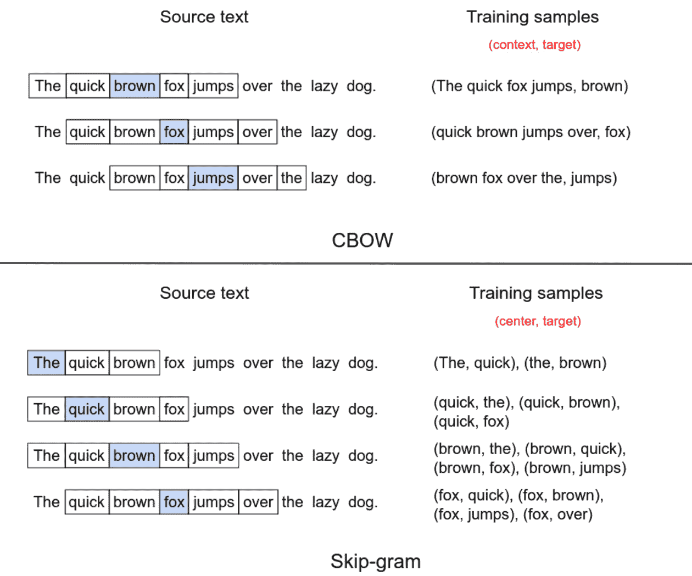
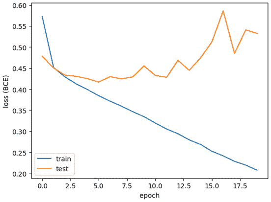
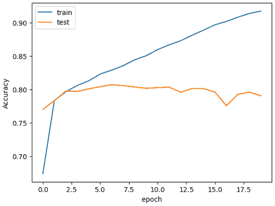
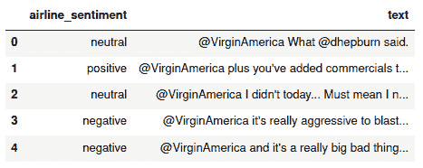
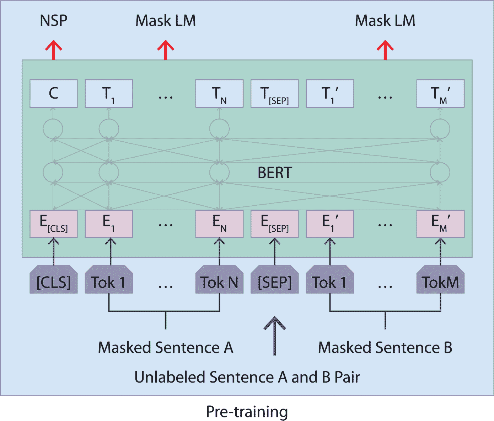

# 第九章：自然语言处理中的高级正则化

关于 **自然语言处理**（**NLP**）的正则化可以写成一本完整的书。NLP 是一个广泛的领域，涵盖了许多主题，从简单的分类任务（如评论排序）到复杂的模型和解决方案（如 ChatGPT）。本章仅会略微触及使用简单 NLP 解决方案（如分类）能够合理完成的内容。

本章将涵盖以下内容：

+   使用 word2vec 嵌入的正则化

+   使用 word2vec 的数据增强

+   使用预训练模型进行零-shot 推理

+   使用 BERT 嵌入的正则化

+   使用 GPT-3 的数据增强

到本章结束时，你将能够利用高级方法处理 NLP 任务，如词嵌入和 transformers，并能使用数据增强生成合成训练数据。

# 技术要求

本章将使用各种 NLP 解决方案和工具，因此我们需要以下库：

+   NumPy

+   pandas

+   scikit-learn

+   Matplotlib

+   Gensim

+   NLTK

+   PyTorch

+   Transformers

+   OpenAI

# 使用 word2vec 嵌入的正则化

在本节中，我们将使用预训练的 word2vec 嵌入，借助迁移学习来提高任务的结果。我们将结果与 *第八章*中的 *训练 GRU* 任务进行比较，数据集为 IMDb 的评论分类。

## 准备工作

word2vec 是自然语言处理（NLP）领域中一种相对较旧的词嵌入方法，已广泛应用于许多 NLP 任务。尽管近期的技术有时更强大，但 word2vec 方法仍然高效且具有成本效益。

不深入讨论 word2vec 的细节，一个常用的模型是 300 维的嵌入；词汇表中的每个单词都会被嵌入到一个包含 300 个值的向量中。

word2vec 通常在大规模的文本语料库上进行训练。训练 word2vec 的主要方法有两种，基本可以描述如下：

+   **连续词袋模型**（**CBOW**）：使用句子中周围词的上下文来预测缺失的词

+   **skip-gram**：使用一个词来预测其周围的上下文

这两种方法的示例见 *图 9.1*：



图 9.1 – CBOW（左）和 skip-gram（右）方法的训练数据示例

注意

实践中，CBOW 通常更容易训练，而 skip-gram 对稀有词的表现可能更好。

目标不是训练我们自己的 word2vec，而是简单地重用一个已经训练好的模型，并利用迁移学习来提升我们预测的性能。在这个步骤中，我们将不再训练自己的嵌入，而是直接重用一个预训练的 word2vec 嵌入，然后只在这些嵌入的基础上训练我们的 GRU。

为此，我们将再次进行 IMDb 数据集分类任务：这是一个包含电影评论文本作为输入和相关二进制标签（正面或负面）的数据集。可以通过 Kaggle API 下载此数据集：

```py
kaggle datasets download -d lakshmi25npathi/imdb-dataset-of-50k-moviereviews --unzip
```

以下命令将安装所需的库：

```py
pip install pandas numpy scikit-learn matplotlib torch gensim nltk
```

## 如何操作…

在这个食谱中，我们将训练一个 GRU 模型，用于在 IMDb 评论数据集上进行二分类。与原始食谱相比，主要的区别在于*第 5 步*：

1.  导入以下必要的库：

    +   `torch`及其相关模块和类，用于神经网络

    +   使用来自`scikit-learn`的`train_test_split`和`LabelEncoder`进行预处理

    +   使用来自`transformers`的`AutoTokenizer`来标记化评论

    +   `pandas`用于加载数据集

    +   `numpy`用于数据处理

    +   `matplotlib`用于可视化

    +   使用`gensim`进行 word2vec 嵌入，使用`nltk`进行文本标记化处理

如果你还没有这样做，你需要添加`nltk.download('punkt')`这一行，以下载一些必要的工具实例，如下所示：

```py
import torch
import torch.nn as nn
import torch.optim as optim
from torch.utils.data import DataLoader, Dataset
from sklearn.model_selection import train_test_split
from sklearn.preprocessing import LabelEncoder
import pandas as pd
import matplotlib.pyplot as plt
import numpy as np
import gensim.downloader
import nltk
# If running for the first time nltk.download('punkt')
```

1.  加载预训练的 word2vec 模型，该模型包含 300 维的嵌入。该模型大约有 1.6GB，下载可能需要一些时间，具体取决于你的带宽：

    ```py
    # Will take a while the first time, need to download about 1.6GB of the model
    
    word2vec_model = gensim.downloader.load('
    
        word2vec-google-news-300')
    ```

1.  使用`pandas`从 CSV 文件加载数据：

    ```py
    # Load data data = pd.read_csv('IMDB Dataset.csv')
    ```

1.  使用`train_test_split`函数将数据拆分为训练集和测试集，测试集大小为 20%，并指定随机状态以确保可复现性：

    ```py
    # Split data into train and test sets train_data, 
    
        test_data = train_test_split(data, test_size=0.2,
    
            random_state=0)
    ```

1.  实现数据集的`TextClassificationDataset`类，它处理数据。此处计算 word2vec 嵌入：

    ```py
    # Define dataset class
    
    class TextClassificationDataset(Dataset):
    
        def __init__(self, data, word2vec_model,
    
            max_words):
    
            self.data = data
    
            self.word2vec_model = word2vec_model
    
            self.max_words = max_words
    
            self.embeddings = data['review'].apply(
    
                self.embed)
    
            le = LabelEncoder()
    
            self.labels = torch.tensor(le.fit_transform(
    
                data['sentiment']).astype(np.float32))
    
        def __len__(self):
    
            return len(self.data)
    
        def __getitem__(self, index):
    
            return self.embeddings.iloc[index],
    
                self.labels[index]
    
        def embed(self, text):
    
            tokens = nltk.word_tokenize(text)
    
            return self.tokens_to_embeddings(tokens)
    
        def tokens_to_embeddings(self, tokens):
    
            embeddings = []
    
            for i, token in enumerate(tokens):
    
                if i >= self.max_words:
    
                    break
    
                if token not in self.word2vec_model:
    
                    continue
    
                embeddings.append(
    
                    self.word2vec_model[token])
    
            while len(embeddings) < self.max_words:
    
                embeddings.append(np.zeros((300, )))
    
            return np.array(embeddings, dtype=np.float32)
    ```

在实例化时，每个输入电影通过`embed`方法以两种方式转换为嵌入：

+   每个电影评论都通过一个单词标记器进行标记化（基本上是将句子分割为单词）。

+   然后，计算一个`max_words`长度的向量，包含评论中前`max_words`个单词的 word2vec 嵌入。如果评论少于`max_words`个单词，则使用零填充该向量。

1.  然后，我们必须为训练集和测试集实例化`TextClassificationDataset`对象，以及相关的数据加载器。最大单词数设置为`64`，批处理大小也设置为：

    ```py
    batch_size = 64 max_words = 64
    
    # Initialize datasets and dataloaders
    
    Train_dataset = TextClassificationDataset(train_data,
    
        word2vec_model, max_words)
    
    test_dataset = TextClassificationDataset(test_data,
    
        word2vec_model, max_words)
    
    train_dataloader = DataLoader(train_dataset,
    
        batch_size=batch_size, shuffle=True)
    
    test_dataloader = DataLoader(test_dataset,
    
        batch_size=batch_size, shuffle=True)
    ```

1.  然后，我们必须实现 GRU 分类模型。由于嵌入是在数据加载步骤中计算的，因此该模型直接计算一个三层 GRU，并随后应用一个带有 sigmoid 激活函数的全连接层：

    ```py
    # Define RNN model
    
    class GRUClassifier(nn.Module):
    
        def __init__(self, embedding_dim, hidden_size,
    
            output_size, num_layers=3):
    
                super(GRUClassifier, self).__init__()
    
                self.hidden_size = hidden_size
    
                self.num_layers = num_layers
    
                self.gru = nn.GRU(
    
                    input_size=embedding_dim,
    
                    hidden_size=hidden_size,
    
                    num_layers=num_layers,
    
                    batch_first=True)
    
            self.fc = nn.Linear(hidden_size, output_size)
    
        def forward(self, inputs):
    
            batch_size = inputs.size(0)
    
            zero_hidden = torch.zeros(self.num_layers,
    
                batch_size, self.hidden_size).to(device)
    
            output, hidden = self.gru(inputs, zero_hidden)
    
            output = torch.sigmoid(self.fc(output[:, -1]))
    
            return output
    ```

1.  接下来，我们必须实例化 GRU 模型。由 word2vec 模型定义的嵌入维度为`300`。我们选择了`32`作为隐藏维度，因此每个 GRU 层由 32 个单元组成：

    ```py
    embedding_dim = 300
    
    hidden_dim = 32
    
    output_size = 1
    
    # Optionally, set the device to GPU if you have one device = torch.device(
    
        'cuda' if torch.cuda.is_available() else 'cpu')
    
    model = GRUClassifier(
    
        embedding_dim=ebedding_dim,
    
        hidden_siz=hidden_dim,
    
        output_size=output_size, ).to(device)
    ```

1.  然后，我们必须实例化优化器为`Adam`优化器，学习率为`0.001`；损失定义为二元交叉熵损失，因为这是一个二分类任务：

    ```py
    optimizer = optim.Adam(model.parameters(), lr=0.001)
    
    criterion = nn.BCELoss()
    ```

1.  使用 `train_model` 函数训练模型 `20` 个 epoch，并在每个 epoch 存储训练集和测试集的损失和准确性。`train_model` 函数的实现可以在本书的 GitHub 仓库中找到：[`github.com/PacktPublishing/The-Regularization-Cookbook/blob/main/chapter_09/chapter_09.ipynb`](https://github.com/PacktPublishing/The-Regularization-Cookbook/blob/main/chapter_09/chapter_09.ipynb)：

    ```py
    train_losses, test_losses, train_accuracy, 
    
    test_accuracy = train_model(
    
        model, train_dataloader, test_dataloader,
    
        criterion, optimizer, device, epochs=20)
    ```

这是 20 个 epoch 后的典型输出：

```py
[epoch 20] Training: loss=0.207 accuracy=0.917 |  Test: loss=0.533 accuracy=0.790
```

1.  绘制训练集和测试集的 BCE 损失图：

    ```py
    plt.plot(train_losses, label='train')
    
    plt.plot(testlosse, label=''test'')
    
    plt.xlabel('epoch') plt.ylabel('loss (BCE)')
    
    plt.legend() plt.show()
    ```

这是它的绘制结果：



图 9.2 – 二元交叉熵损失随 epoch 变化

正如我们所见，虽然训练损失在 20 个 epoch 中持续减少，但测试损失在约 5 个 epoch 后达到了最小值，然后开始增加，表明出现了过拟合。

1.  绘制训练集和测试集的准确性图：

    ```py
    plt.plot(train_accuracy, label='train')
    
    plt.plot(testaccurcy, label=''test'')
    
    plt.xlabel('epoch') plt.ylabel('Accuracy')
    
    plt.legend() plt.show()
    ```

这是该图的绘制结果：



图 9.3 – 准确度随 epoch 变化

正如损失所示，训练集的准确性不断提高。对于测试集，它的最大值约为 81%（相比于前一章中的 77%，未使用 word2vec 嵌入）。word2vec 嵌入使我们略微提高了结果，尽管如果我们调整其他超参数，结果可能会有更大改善。

## 还有更多…

虽然我们在本教程中将嵌入作为数组使用，但它们也可以以不同的方式使用；例如，我们可以使用句子中所有嵌入的平均值或其他统计信息。

此外，尽管 word2vec 在许多情况下已经表现得足够好，但可以通过更专业的方法，如 doc2vec，来推导一些嵌入，doc2vec 对文档和长文本的处理有时更为强大。

## 另见

关于 word2vec 的维基百科文章是一个有价值的资源，因为它列出了许多相关的出版物：[`en.wikipedia.org/wiki/Word2vec#cite_note-:1-3`](https://en.wikipedia.org/wiki/Word2vec#cite_note-:1-3)。

来自 Google 的文档也很有用：[`code.google.com/archive/p/word2vec/`](https://code.google.com/archive/p/word2vec/)。

# 使用 word2vec 进行数据增强

正则化模型并提高性能的一种方法是拥有更多的数据。收集数据并不总是容易或可能的，但合成数据可以是一种负担得起的提高性能的方式。我们将在本教程中做到这一点。

## 准备工作

使用 word2vec 嵌入，你可以生成具有相似语义的新合成数据。通过这种方式，对于给定的单词，可以很容易地找到词汇表中最相似的词。

在本教程中，使用 word2vec 和一些参数，我们将看到如何生成具有相似语义的新句子。我们仅将其应用于给定的句子作为示例，并提出如何将其集成到完整的训练流程中。

所需的库仅为`numpy`和`gensim`，这两个库都可以通过`pip install` `numpy gensim`安装。

## 如何做……

完成此配方的步骤如下：

1.  第一步是导入必要的库——`numpy`用于随机调用，`gensim`用于加载 word2vec 模型：

    ```py
    import numpy as np
    
    import gensim.downloader
    ```

1.  加载一个预训练的 word2vec 模型。如果模型尚未下载并存储在本地缓存中，这可能需要一些时间。此外，这是一个相当大的模型，因此加载到内存中可能需要一些时间：

    ```py
    # Load the Word2Vec model
    
    word2vec_model = gensim.downloader.load(
    
        'word2vec-google-news-300')
    ```

1.  实现`replace_words_with_similar`函数，以便你可以随机地将`word`替换为另一个语义相近的词：

    ```py
    def replace_words_with_similar(text, model,
    
        sim_threshold: float = 0.5,
    
        probability: float = 0.5,
    
        top_similar: int = 3,
    
        stop_words: list[str] = []):
    
        # Split in words
    
        words = text.split()
    
        # Create an empty list of the output words
    
        new_words = []
    
        # Loop over the words
    
        for word in words:
    
            added = False
    
            # If the word is in the vocab, not in stop words, and above probability, then...
    
            if word in model and word not in stop_words and np.random.uniform(0, 1) > probability:
    
                # Get the top_similar most similar words
    
                similar_words = model.most_similar(word,
    
                    topn=top_similar)
    
                # Randomly pick one of those words
    
                idx = np.random.randint(len(similar_words))
    
                # Get the similar word and similarity score
    
                sim_word, sim_score = similar_words[idx]
    
                # If the similary score is above threshold, add the word
    
                if sim_score > sim_threshold:
    
                    new_words.append(sim_word)
    
                    added = True
    
            if not added:
    
                # If no similar word is added, add the original word
    
                new_words.append(word)
    
        # Return the list as a string
    
        return ' '.join(new_words)
    ```

希望注释已经不言自明，但以下是该函数的作用：

+   它通过使用简单的分割将输入文本拆分成单词（也可以使用词法分析器）。

+   对每个词，它检查以下内容：

    +   如果该词在 word2vec 词汇表中

    +   如果该词不在停用词列表中（待定义）

    +   如果随机概率高于阈值概率（用于抽取随机词）

+   如果一个词符合前面的检查，则计算如下：

    +   `top_similar` 最相似的词

    +   从这些词中随机选择一个

    +   如果该词的相似度得分超过给定阈值，则将其添加到输出句子中

+   如果没有添加更新的词，就直接添加原始词，以使整体句子保持逻辑通顺

参数如下：

+   `sim_threshold`：相似度阈值

+   `probability`：词被替换为相似词的概率

+   `top_similar`：计算给定词的相似词的数量

+   `stop_words`：一个不应被替换的词列表，以防某些词特别重要或有多重含义

1.  将我们刚刚实现的`replace_words_with_similar`函数应用于给定的句子：

    ```py
    original_text = "The quick brown fox jumps over the lazy dog"
    
    generated_text = replace_words_with_similar(
    
        original_text, word2vec_model, top_words=['the'])
    
    print(""Original text: {}"".format(original_text))
    
    print("New text: {}".format(generated_text))
    ```

代码输出如下。这允许我们在保持整体意思不变的情况下改变一些词：

```py
Original text: The quick brown fox jumps over the lazy dog New text: This quick brown squirrel jumps Over the lazy puppy
```

借助这种数据增强技术，能够生成更多样化的数据，从而使我们能够使模型更强大并进行正则化。

## 还有更多内容……

向分类任务添加数据生成功能的一种方法是在数据加载步骤中添加它。这将实时生成合成数据，并可能允许我们对模型进行正则化。它可以被添加到数据集类中，如下所示：

```py
class TextClassificationDatasetGeneration(Dataset):
    def __init__(self, data, max_length):
        self.data = data
        self.max_length = max_length
        self.tokenizer = AutoTokenizer.from_pretrained(
            'bert-base-uncased')
        self.tokens = self.tokenizer(
            data['review'].to_list(), padding=True,
            truncation=True, max_length=max_length,
            return_tensors='pt')['input_ids']
        le = LabelEncoder()
        self.labels = torch.tensor(le.fit_transform(
            data['sentiment']).astype(np.float32))
    def __len__(self):
        return len(self.data)
    def __getitem__(self, index):
        # Generate a new text
        text = replace_words_with_similar(
            self.data['review'].iloc[index])
        # Tokenize it
        tokens = self.tokenizer(text, padding=True,
            truncation=True, max_length=self.max_length,
            return_tensors='pt')['input_ids']
        return self.tokens[index], self.labels[index]
```

## 另见

有关 word2vec 模型的`most_similar`函数的文档可以在[`tedboy.github.io/nlps/generated/generated/gensim.models.Word2Vec.most_similar.xhtml`](https://tedboy.github.io/nlps/generated/generated/gensim.models.Word2Vec.most_similar.xhtml)找到。

# 使用预训练模型进行零样本推理

在过去几年中，NLP 领域经历了许多重大进展，这意味着许多预训练的高效模型可以重复使用。这些预训练的、免费提供的模型使我们能够以零样本推理的方式处理一些 NLP 任务，因为我们可以重复使用这些模型。我们将在本配方中尝试这种方法。

注意

我们有时会使用零-shot 推理（或零-shot 学习）和少-shot 学习。零-shot 学习意味着在没有针对特定任务的任何训练的情况下完成任务；少-shot 学习则意味着在仅用少量样本进行训练的情况下完成任务。

零-shot 推理是指在没有任何微调的情况下重用预训练模型。许多非常强大的、可以自由使用的模型已经可以做到和我们自己训练的模型一样好。由于这些可用模型是在庞大的数据集上训练的，且拥有巨大的计算能力，因此有时很难与我们自己训练的模型竞争，因为我们自己训练的模型可能使用的数据更少，计算能力也较低。

注意

话虽如此，有时候，在小而精心策划、特定任务的数据上进行训练也能产生奇迹，并提供更好的性能。这完全取决于上下文。

此外，我们有时会遇到没有标签的数据，因此监督学习就不可行。在这种情况下，我们自己为数据中的一个小子集标注标签，并针对这些数据评估零-shot 方法可能会有用。

## 准备开始

在这个配方中，我们将重用在 Tweets 数据集上预训练的模型，并将推文分类为负面、中性或正面。由于不需要训练，我们将直接在测试集上评估该模型，以便与我们在*第八章*中的*训练 RNN*配方中获得的结果进行比较。

为此，我们需要将数据集下载到本地。可以通过 Kaggle API 下载，然后使用以下命令解压：

```py
kaggle datasets download -d crowdflower/twitter-airline-sentiment --unzip
```

运行此配方所需的库可以通过以下命令安装：

```py
pip install pandas scikit-learn transformers
```

## 如何操作……

这是执行此配方的步骤：

1.  导入以下必要的函数和模型：

    +   使用`numpy`进行数据处理

    +   使用`pandas`加载数据

    +   使用`scikit-learn`的`train_test_split`来拆分数据集

    +   使用`scikit-learn`的`accuracy_score`来计算准确度评分

    +   使用`transformers`的`pipeline`来实例化零-shot 分类器

下面是这段代码：

```py
import numpy as np
import pandas as pd
from sklearn.model_selection import train_test_split
from sklearn.metrics import accuracy_score
from transformers import pipeline
```

1.  加载数据集。在我们的例子中，唯一感兴趣的列是`text`（特征）和`airline_sentiment`（标签）：

    ```py
    # Load dat
    
    Data = pd.read_csv(''Tweets.csv'')
    
    data[['airline_sentiment', 'text']].head()
    ```

下面是这段代码的输出：



图 9.4 – 所考虑列的数据集的前五行

1.  将数据拆分为训练集和测试集，使用与*使用 word2vec 嵌入的正则化*配方中相同的参数，以便可以进行比较：`test_size`设置为`0.2`，`random_state`设置为`0`。由于不需要训练，我们只会使用测试集：

    ```py
    # Split data into train and test sets
    
    Train_data, test_data = train_test_split(data,
    
        test_size=0.2, random_state=0)
    ```

1.  使用以下参数通过`transformers`管道实例化分类器：

    +   `task="zero-shot-classification"`：这将实例化一个零-shot 分类管道

    +   `model="facebook/bart-large-mnli"`：这将指定用于该管道的模型

下面是这段代码：

```py
# Taking a long time first time for downloading odel...
Classifier = pipeline(task=""zero-shot-classification"",
    model="facebook/bart-large-mnli")
```

注意

当首次调用时，它可能会下载一些文件以及模型本身，可能需要一些时间。

1.  将候选标签存储在数组中。这些候选标签是零-shot 分类所需的：

    ```py
    candidate_labels = data['airline_sentiment'].unique()
    ```

1.  在测试集上计算预测结果并将其存储在数组中：

    ```py
    # Create an empty list to store the predictions
    
    preds = [] # Loop over the data
    
    for i in range(len(test_data)):
    
        # Compute the classifier results
    
        res = classifier(
    
            test_data['text'].iloc[i],
    
            candidate_labels=candidate_labels,
    
        )
    
        # Apply softmax to the results to get the predicted class
    
        pred = np.array(res['scores']).argmax()
    
        labels = res['labels']
    
        # Store the results in the list
    
        preds.append(labels[pred])
    ```

请参考*更多内容...*部分，了解分类器的功能以及它的输出。

1.  计算预测的准确率：

    ```py
    print(accuracy_score(test_data['airline_sentiment'], preds))
    ```

计算出的准确率如下：

```py
0.7452725250278087
```

我们得到了 74.5%的准确率，这与我们在*第八章*中使用简单 RNN 训练后的结果相当。通过这种零-shot 分类，我们无需任何训练成本和大规模的标注数据集，就能获得相同的性能。

注意

零-shot 学习需要付出代价，因为预训练的语言模型通常相当庞大，且可能需要较大的计算能力来大规模运行。

## 更多内容…

让我们看一个`classifier`的输入和输出示例，以更好地理解它的工作原理：

```py
res = classifier(
    'I love to learn about regularization',
    candidate_labels=['positive', 'negative', 'neutral'], )
print(res)
```

这段代码的输出如下：

```py
{'sequence': 'I love to learn about regularization',  'labels': ['positive', 'neutral', 'negative'],  'scores': [0.6277033686637878, 0.27620458602905273, 0.09609206020832062]}
```

我们可以看到以下内容：

+   一个输入句子：`I love to learn` `about regularization`

+   候选标签：`positive`，`negative`，和`neutral`

结果是一个包含以下键值的字典：

+   `'sequence'`：输入序列

+   `'labels'`：输入的候选标签

+   `'scores'`：每个标签对应的得分列表，按降序排序

注意

由于得分总是按降序排序，标签的顺序可能会有所不同。

最终，预测的类别可以通过以下代码计算，该代码将检索得分的`argmax`值及其相关标签：

```py
res['labels'][np.array(res['scores']).argmax()]
```

在我们的案例中，输出将是`positive`。

## 另见

+   bart-large-mnli 模型的模型卡：[`huggingface.co/facebook/bart-large-mnli`](https://huggingface.co/facebook/bart-large-mnli)

+   Hugging Face 关于零-shot 分类的教程：[`huggingface.co/course/chapter1/3?fw=pt#zero-shot-classification`](https://huggingface.co/course/chapter1/3?fw=pt#zero-shot-classification)

+   关于`transformers`流水线的文档，它可以让我们做更多的不仅仅是零-shot 分类：[`huggingface.co/docs/transformers/main_classes/pipelines`](https://huggingface.co/docs/transformers/main_classes/pipelines)

# 使用 BERT 嵌入的正则化

类似于我们如何使用预训练的 word2vec 模型来计算嵌入，我们也可以使用预训练的 BERT 模型的嵌入，这是一个基于 transformer 的模型。

在这个示例中，我们会在快速介绍 BERT 模型后，使用 BERT 嵌入训练一个模型。

**BERT**代表**双向编码器表示从变换器**，是谷歌在 2018 年提出的模型。它在 2019 年底首次在 Google 搜索中用于英文查询，并且支持许多其他语言。BERT 模型已被证明在多个 NLP 任务中有效，包括文本分类和问答。

在快速解释什么是 BERT 之前，让我们先回顾一下什么是**注意力机制**和**变换器**。

注意力机制广泛应用于 NLP 领域，并且在计算机视觉等其他领域的应用也日益增多，自 2017 年首次提出以来。注意力机制的高级概念是计算每个输入标记相对于给定序列中其他标记的权重。与按序列处理输入的 RNN 相比，注意力机制同时考虑整个序列。这使得基于注意力的模型能够更有效地处理序列中的长程依赖，因为注意力机制可以不考虑序列长度。

变换器是一种基于自注意力的神经网络。它们通常以嵌入向量开始，并且具有绝对位置编码，注意力层基于此进行训练。这些层通常使用多头注意力来捕捉输入序列的不同方面。更多详情可以参考原始论文《Attention Is All You Need》（可参阅*另见*部分）。

注意

由于 BERT 使用的是绝对位置编码，如果使用填充，建议将填充放在右侧。

BERT 模型建立在`transformers`之上，由 12 层基于变换器的编码层构成（大模型有 24 层），大约有 1.1 亿个参数。更有趣的是，它是以无监督方式预训练的，使用了两种方法：

+   **掩蔽语言模型**：序列中 15%的标记被随机掩蔽，模型被训练去预测这些被掩蔽的标记。

+   **下一句预测**：给定两句话，模型被训练预测它们是否在给定文本中是连续的。

这种预训练方法在下图中进行了总结，图示来自 BERT 论文《BERT: 语言理解的深度双向变换器预训练》：



图 9.5 – 文章中提出的 BERT 预训练图示，BERT: 语言理解的深度双向变换器预训练

注意

虽然 word2vec 嵌入是无上下文的（无论上下文如何，词嵌入保持不变），但 BERT 根据周围环境为给定词语提供不同的嵌入。这是有道理的，因为一个给定的词在两个句子中的意思可能不同（例如，apple 或 Apple 可以是水果也可以是公司，取决于上下文）。

## 准备工作

对于本食谱，我们将重用 Tweets 数据集，可以通过以下命令行下载并解压到本地：

```py
kaggle datasets download -d crowdflower/twitter-airline-sentiment --unzip
```

必要的库可以通过`pip install torch scikit-learn` `transformers pandas`安装。

## 如何实现…

在本食谱中，我们将在预训练 BERT 嵌入上训练一个简单的逻辑回归模型：

1.  导入所需的库：

    +   如果你有 GPU，可以使用`torch`进行设备管理。

    +   使用`train_test_split`方法和`scikit-learn`中的`LogisticRegression`类。

    +   `transformers`中的相关`BERT`类。

    +   使用`pandas`加载数据。

这是相关代码：

```py
import torch
from sklearn.model_selection import train_test_split
from sklearn.linear_model import LogisticRegression
from transformers import BertConfig, BertModel, BertTokenizer import pandas as pd
```

1.  使用`pandas`加载数据集：

    ```py
    # Load data data = pd.read_csv('Tweets.csv')
    ```

1.  将数据集拆分为训练集和测试集，保持与*零-shot 推理*食谱中预训练模型相同的参数，以便稍后比较它们的表现：

    ```py
    # Split data into train and test sets train_data, 
    
        test_data = train_test_split(data, test_size=0.2,
    
            random_state=0)
    ```

1.  实例化 tokenizer 和 BERT 模型。实例化模型是一个多步骤的过程：

    1.  首先，使用`BertConfig`类实例化模型的配置。

    1.  然后，使用随机权重实例化`BertModel`。

    1.  加载预训练模型的权重（这将显示一个警告，因为并非所有权重都已加载）。

    1.  如果有 GPU，将模型加载到 GPU 上，并将模型设置为`eval`模式。

这是相关代码：

```py
# Instantiate the tokenizer
tokenizer = BertTokenizer.from_pretrained('bert-base-uncased')
# Initializing a BERT configuration
configuration = BertConfig()
# Initializing a BERT model with random weights
bert = BertModel(configuration)
# Loading pre-trained weights
bert = bert.from_pretrained('bert-base-uncased')
# Load the model on the GPU
if any device = torch.device(
    "cuda" if torch.cuda.is_available() else "cpu")
bert.to(device)
# Set the model to eval mode
bert.eval()
```

你可能会收到一些警告消息，因为某些层没有预训练权重。

1.  计算训练集和测试集的嵌入。这是一个两步过程：

    1.  使用 tokenizer 计算令牌（并可以选择将令牌加载到 GPU 上，如果有的话）。

    1.  然后，计算嵌入。

有关 BERT 模型输入输出的更多细节，请查看本食谱中的*更多…*小节。

这是相关代码：

```py
max_length = 24
# Compute the embeddings for the train set 
train_tokens = tokenizer(
    train_data['text'].values.tolist(),
    add_special_tokens=True,
    padding='max_length',
    truncation=True,
    max_length=max_length,
    return_tensors='pt')
    train_tokens = {k: v.to(device) for k,
        v in train_tokens.items()}
with torch.no_gad():
    train_embeddings = bert(
        **train_tokens)..pooler_output
# Compute the embeddings for the test set
test_tokens = tokenizer(
    test_data['text'].values.tolist(),
    add_special_tokens=True, padding='max_length',
    truncation=True, max_length=max_length,
    return_tensors='pt')
test_tokens = {k: v.to(device) for k,
    v in test_tokens.items()}
with torch.no_grad():
    test_embeddings = bert(
        **test_tokens).pooler_output
```

1.  然后，实例化并训练一个逻辑回归模型。它可能需要比默认模型更多的迭代次数。在这里，已将其设置为`10,000`：

    ```py
    lr = LogisticRegression(C=0.5, max_iter=10000)
    
    lr.fit(train_embeddings.cpu(),
    
        train_data['airline_sentiment'])
    ```

1.  最后，打印训练集和测试集的准确性：

    ```py
    print('train accuracy:',
    
        lr.score(train_embeddings.cpu(),
    
        train_data['airline_sentiment']))
    
    print('test accuracy:',
    
        lr.score(test_embeddings.cpu(),
    
        test_data['airline_sentiment']))
    ```

你应该得到类似于以下的输出结果：

```py
train accuracy: 0.8035348360655737 test accuracy: 0.7882513661202186
```

我们在测试集上得到了大约 79%的最终准确率，在训练集上得到了 80%。作为对比，使用零-shot 推理和简单的 RNN 在同一数据集上提供的准确率为 74%。

## 还有更多…

为了更好地理解 tokenizer 计算的内容以及 BERT 模型输出的内容，让我们看一个例子。

首先，让我们将 tokenizer 应用于一个句子：

```py
tokens = tokenizer('What is a tokenizer?', add_special_tokens=True,
    padding='max_length', truncation=True, max_length=max_length,
    return_tensors='pt')
print(tokens)
```

这将输出以下内容：

```py
{'input_ids': tensor([[  101,  2054,  2003,  1037, 19204, 
17629,  1029,  2023,  2003,  1037,           2204,  3160,  1012,
   102,     0,     0,     0,     0,     0,     0,              0,
     0,     0,     0]]), 'token_type_ids': tensor([[0, 0, 0, 
0, 0, 0, 0, 0, 0, 0, 0, 0, 0, 0, 0, 0, 0, 0, 0, 0, 0, 0, 0, 0]]), 'attention_mask': tensor([[1, 1, 1, 1, 1, 1, 1, 1, 1, 1, 1, 1, 1, 1, 0, 0, 0, 0, 0, 0, 0, 0, 0, 0]])}
```

如我们所见，tokenizer 返回三个输出：

+   `input_ids`：这是词汇表中令牌的索引。

+   `token_type_ids`：句子的编号。这对于配对句子才有用，就像 BERT 最初训练时一样。

+   `attention_mask`：这是模型将关注的地方。正如我们所看到的，它仅对实际的 token 设置为 `1`，然后对填充设置为 `0`。

这三列数据将传入 BERT 模型，以便它计算其输出。输出由以下两个张量组成：

+   `last_hidden_state`：最后隐藏状态的值，其形状为 `[batch_size,` `max_length, 768]`

+   `pooler_output`：序列步骤输出的池化值，其形状为 `[batch_size, 768]`

还有许多其他类型的嵌入存在，它们的强度可能因任务的不同而有所不同。例如，OpenAI 还提供了可以通过 API 提供的嵌入。例如，以下代码允许我们为给定的句子获取嵌入：

```py
import openai
# Give your
openai.api_key = 'xx-xxx'
# Query the API
input_text = 'This is a test sentence'
model = 'text-embedding-ada-002'
embeddings = openai.Embedding.create(input = [input_text],
    model=model)['data'][0]['embedding']
```

这将返回一个 1,536 维的嵌入，可以用于分类或其他任务。

当然，要使用这些嵌入，你需要做以下几步：

+   使用 `pip` 安装 `openai` 库：`pip install openai`

+   在 OpenAI 网站上创建 API 密钥

+   提供有效的支付方式

## 另请参见

+   介绍 Transformer 的论文，*Attention is all you* *need*：[`arxiv.org/abs/1706.03762`](https://arxiv.org/abs/1706.03762)

+   BERT 模型卡：[`huggingface.co/bert-base-uncased`](https://huggingface.co/bert-base-uncased)

+   BERT 论文：[`arxiv.org/abs/1810.04805`](https://arxiv.org/abs/1810.04805)

+   关于 OpenAI 嵌入的更多信息，请参见官方文档：[`platform.openai.com/docs/guides/embeddings/use-cases`](https://platform.openai.com/docs/guides/embeddings/use-cases)

# 使用 GPT-3 进行数据增强

生成模型正变得越来越强大，特别是在自然语言处理（NLP）领域。使用这些模型生成新的合成数据，有时可以显著提升我们的结果并对模型进行正则化。在本食谱中，我们将学习如何做到这一点。

## 准备工作

尽管像 BERT 这样的模型在文本分类等任务中有效，但在文本生成方面，它们通常表现不佳。

其他类型的模型，如**生成预训练变换器**（**GPT**）模型，在生成新数据方面可以非常出色。在本食谱中，我们将使用 OpenAI API 和 GPT-3.5 来生成合成但现实的数据。拥有更多的数据是我们模型进行更多正则化的关键，而数据生成是收集更多数据的一种方式。

对于本食谱，你需要使用 `pip install openai` 安装 OpenAI 库。

另外，由于我们将使用的 API 不是免费的，因此需要创建一个 OpenAI 账户，并生成 API 密钥和有效的支付方式。

创建 API 密钥

你可以通过访问 **API** **keys** 部分轻松在个人资料中创建一个 API 密钥。

在*更多内容...*部分，我们将提供一个免费的替代方法——即使用 GPT-2 生成新数据——但它的结果会不那么真实。要使其工作，你必须安装 Hugging Face 的`transformers`库，可以通过`pip install transformers`来安装。

## 如何做到这一点……

在这个示例中，我们将简单地查询 GPT-3.5 生成几个正面和负面的电影评论，这样我们就可以获得更多的数据来训练电影评论分类模型。当然，这也可以从任何分类任务中得到，甚至许多其他 NLP 任务：

1.  导入`openai`库，如下所示：

    ```py
    import openai
    ```

1.  提供你的 OpenAI API 密钥：

    ```py
    openai.api_key = 'xxxxx'
    ```

注意

这只是一个代码示例——永远不要在公开的代码库中分享你的 API 密钥。可以使用环境变量等替代方法。

1.  使用`ChatCompletion` API 生成三个正面示例：

    ```py
    positive_examples = openai.ChatCompletion.create(
    
        model="gpt-3.5-turbo",
    
        messages=[
    
            {"role": "system", 
    
                "content": "You watched a movie you loved."},
    
            {"role": "user", "content": "Write a short,
    
                100-words review about this movie"},
    
        ],
    
        max_tokens=128,
    
        temperature=0.5,
    
        n=3, )
    ```

这里有几个参数：

+   `model`: `gpt-3.5-turbo`，它表现良好且成本高效，基于 GPT-3.5。

+   `messages`: 消息可以有三种类型：

    +   `system`: 格式化消息，接下来是交替的用户和助手消息。

    +   `user`: 用户消息

    +   `assistant`: 助手消息；我们不会使用这个

+   `max_tokens`: 输出中令牌的最大数量。

+   `temperature`: 通常在 0 到 2 之间。值越大，随机性越强。

+   `n`: 所需输出的数量。

1.  现在，我们可以显示生成的句子：

    ```py
    for i in range(len(positive_examples['choices'])):
    
        print(f'\n\nGenerated sentence {i+1}: \n')
    
        print(positive_examples['choices'][i]['message']['content'])
    
    The following is the output of the three positive reviews generated by GPT-3.5:
    
    Generated sentence 1:   I recently watched the movie "Inception" and was blown away by its intricate plot and stunning visuals. The film follows a team of skilled thieves who enter people's dreams to steal their secrets. The concept of dream-sharing is fascinating and the execution of the idea is flawless. The cast, led by Leonardo DiCaprio, delivers outstanding performances that add depth to the characters. The action scenes are thrilling and the special effects are mind-bending. The film's score by Hans Zimmer is also noteworthy, adding to the overall immersive experience. "Inception" is a masterpiece that will leave you pondering its themes long after the credits roll.   Generated sentence 2:   I recently watched the movie "The Shawshank Redemption" and absolutely loved it. The story follows the life of a man named Andy Dufresne, who is wrongfully convicted of murder and sent to Shawshank prison. The movie beautifully portrays the struggles and hardships faced by prisoners, and the importance of hope and friendship in such a harsh environment. The acting by Tim Robbins and Morgan Freeman is outstanding, and the plot twists keep you engaged throughout the movie. Overall, "The Shawshank Redemption" is a must-watch for anyone who loves a good drama and a heartwarming story about the power of the human spirit.   Generated sentence 3:   I recently watched the movie "Parasite" and it blew me away. The story revolves around a poor family who slowly infiltrates the lives of a wealthy family, but things take a dark turn. The movie is a masterclass in storytelling, with each scene building tension and adding layers to the plot. The acting is superb, with standout performances from the entire cast. The cinematography is also stunning, with each shot expertly crafted to enhance the mood and atmosphere of the film. "Parasite" is a must-watch for anyone who loves a good thriller with a twist.
    ```

1.  同样地，让我们生成并显示三个负面的电影评论示例：

    ```py
    # Generate the generated examples
    
    ngative_examples = openai.ChatCompletion.create(
    
        model="gpt-3.5-turbo",
    
        messages=[
    
            {"role": "system",
    
             "content": "You watched a movie you hated."},
    
            {"role": "user",
    
             "content": "Write a short,
    
                100-wordsreview about this movie"},
    
        ],
    
        max_tokens=128,
    
        temperature=0.5,
    
        n=3, )
    
    # Display the generated examples
    
    for i in range(len(
    
        negative_examples['choices'])):
    
        print(f'\n\nGenerated sentence {i+1}: \n')
    
        print(negative_examples[
    
            'choices'][i]['message']['content'])
    ```

以下代码展示了生成的三个评论：

```py
Generated sentence 1:   I recently watched a movie that left me feeling disappointed and frustrated. The plot was weak and predictable, and the characters were one-dimensional and unrelatable. The acting was subpar, with wooden performances and lackluster chemistry between the cast. The special effects were underwhelming and failed to add any excitement or visual interest to the film. Overall, I found myself checking the time and counting down the minutes until the end. I wouldn't recommend this movie to anyone looking for a compelling and engaging cinematic experience.   Generated sentence 2:   I recently watched a movie that left me feeling disappointed and underwhelmed. The plot was predictable and lacked any real depth or complexity. The characters were one-dimensional and unrelatable, making it hard to invest in their stories. The pacing was slow and dragged on unnecessarily, making the already dull plot even more tedious to sit through. The acting was subpar, with even the most talented actors failing to bring any life to their roles. Overall, I found this movie to be a complete waste of time and would not recommend it to anyone looking for an engaging and entertaining film experience.   Generated sentence 3:   I recently watched a movie that I absolutely hated - "The Roommate". The plot was predictable and the acting was subpar at best. The characters were one-dimensional and lacked any depth or development throughout the film. The dialogue was cringe-worthy and the attempts at suspense fell flat. Overall, I found the movie to be a waste of time and would not recommend it to anyone. If you're looking for a thrilling and well-crafted thriller, "The Roommate" is definitely not the movie for you.
```

生成的示例写得很好，可能足够自然，像是人类写的。此外，如果需要的话，也可以生成更中立、更随机、更长或更短的示例，这非常方便。

## 还有更多……

另外，可以免费使用 GPT-2 模型，尽管结果不如真实。让我们来学习如何做到这一点。

首先，让我们基于 GPT-2 实例化一个文本生成管道：

```py
# Import the pipeline from transformers
from transformers import pipeline
# Instantiate a text-generation based on GPT-2 model
Generator = pipeline(''text-generation'', model=''gpt2'')
#generator = pipeline('text2text-generation')#,
# model = 'facebook/mbart-large-50')
```

这会生成一些文本。行为不完全相同，它仅处理文本补全，因此你必须为模型提供文本的开头，以便它自动完成：

```py
# Generate the positive examples
positive_example = generator(
    "I loved everything about this movie, ",
    max_length = 512,
    num_return_sequences=3, )
# Display the generated examples
for i in range(len(positive_example)):
    print(f'\n\nGenerated sentence {i+1}: \n')
    print(positive_example[i]['generated_text'])
```

这将输出以下三个评论：

```py
Generated sentence 1:   I loved everything about this movie,  the movie itself was great and I didn't want to stop after the first movie because I was so happy for it. But I did like the first movie and I loved the second one and so much of what I did with it and other things with how I handled the other films. What were your thoughts as fans? After the opening credits, I kept thinking, "This will be my big, special moment, I can't do this alone". I've watched the original 2 episodes, they do have a big difference in the ending. But really, it's just my dream to put in movies you love, and I'm always looking over every minute on how good they were and looking forward. I think because everyone is talking about it, and so much of the movie is just it of my dream, the movie that I am to get this, the movie that I want to watch or maybe I'm doing my dreams. Also, it's more to a big than your dream. I think if I get enough reviews, people will start to see it. There will even be a few who will see it in the summer. I know I did it in a way when I was in high school. I never read the reviews again because I'm not a gamer and I never read the reviews because I love that. But by watching the movies, I feel that I am better than that. So, my dream is going to be to give up on the game I started out with in high school and focus on the movies I like. Not just the one I played, but the one you all enjoy watching! I really hope you guys give it more attention and like for this one, just keep going or stay up for the next movie for when all the things you said can be true. Thanks in advance, and happy movie watching!   Generated sentence 2:   I loved everything about this movie,  It was a surprise to see. I want to say thank to the cast of the film, but don't call me the original star. I love that I have to keep myself on top of the world in other things. (laughs) I was excited about the ending and I was thinking about how much fun it would be to watch that ending. At the end of the day it was all for me. The movie was a shock to watch. It was all about the fact that he and her father can all die. It was so exciting. Says a fan, "I've been waiting for this movie since childhood, and this is the first time I've seen it."   Generated sentence 3:   I loved everything about this movie,  so I made the only mistake I have ever made because for once it felt like this movie was happening. It's always exciting to see a feature that gives the fans something to feel. It's a truly beautiful world in which life isn't a game; life is a process. But it's fun to be forced to watch something that tells you some great things about our environment, even when only one person actually is there, who cares about it. This film was not just another film, it was a true movie. And while I'm still looking forward to seeing more amazing, unique movies from the history of cinema, I can guarantee you that there's more we'll be hearing about from our friends at AMC and others who care about our history, the history of film making, and the history of art-design in general...
```

如我们所见，结果不如 GPT-3 那么有趣和真实，但如果我们进行一些手动筛选，仍然可以有用。

## 另见

+   OpenAI 的聊天完成文档：[`platform.openai.com/docs/guides/chat`](https://platform.openai.com/docs/guides/chat)

+   OpenAI 的文本补全文档：[`platform.openai.com/docs/guides/completion`](https://platform.openai.com/docs/guides/completion)

+   HuggingFace 的文本生成文档：[`huggingface.co/tasks/text-generation`](https://huggingface.co/tasks/text-generation)

+   GPT-2 模型卡：[`huggingface.co/gpt2`](https://huggingface.co/gpt2)
