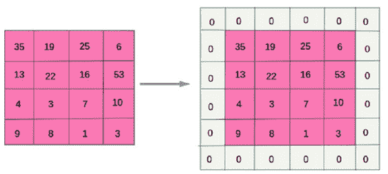
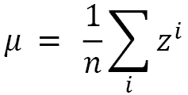
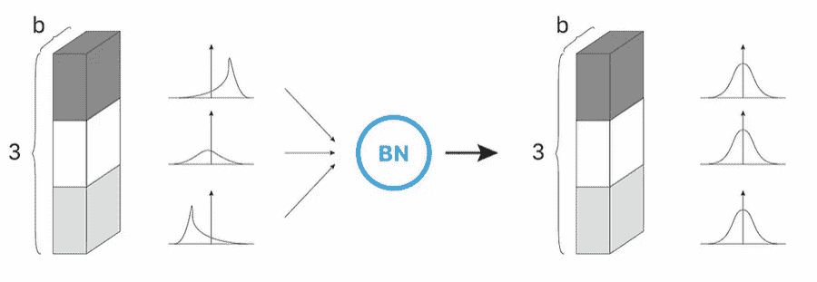

# 第十章：计算机视觉中的正则化

在本章中，我们将探索深度学习的另一个热门领域——计算机视觉。**计算机视觉**是一个庞大的领域，包含许多任务，从分类、生成模型到物体检测。虽然我们无法覆盖所有内容，但我们会提供适用于所有任务的方法。

在本章中，我们将介绍以下几种配方：

+   训练一个**卷积神经网络**（**CNN**）

+   使用传统的**神经网络**（**NN**）方法对 CNN 进行正则化

+   使用迁移学习对 CNN 进行正则化以进行物体检测

+   使用迁移学习进行语义分割

本章结束时，你将能够处理多个计算机视觉任务，如图像分类、物体检测、实例分割和语义分割。你将能够应用多种工具来正则化训练的模型，如架构、迁移学习和冻结权重进行微调。

# 技术要求

在本节中，我们将训练 CNN、物体检测和语义分割模型，所需的库包括：

+   NumPy

+   scikit-learn

+   Matplotlib

+   PyTorch

+   torchvision

+   Ultralytics

+   `segmentation-models-pytorch`

# 训练一个 CNN

在这个配方中，在回顾 CNN 的基本组件后，我们将训练一个用于分类任务的 CNN——CIFAR10 数据集。

## 开始使用

计算机视觉由于多种原因是一个特殊的领域。计算机视觉项目中处理的数据通常是相当庞大、多维且无结构的。然而，它最具特征的方面可能就是其空间结构。

其空间结构带来了许多潜在的困难，如下所示：

+   **纵横比**：一些图像根据来源不同，可能具有不同的纵横比，如 16/9、4/3、1/1 和 9/16

+   **遮挡**：一个物体可能被另一个物体遮挡

+   **变形**：物体可以因透视或物理变形而发生变形

+   **视角**：根据视角的不同，一个物体可能看起来完全不同

+   **光照**：一张图片可以在多种光照环境下拍摄，可能会改变图像

许多这些困难在*图 10.1*中做了总结。


图 10.1 – 特定于计算机视觉的困难示例

由于数据的空间结构，需要模型来处理它。虽然循环神经网络非常适合处理顺序数据，但 CNN 非常适合处理空间结构化数据。

为了正确构建 CNN，我们需要引入两种新的层：

+   卷积层

+   池化层

让我们快速解释一下它们两者。

### 卷积层

**卷积层**是由卷积操作组成的层。

在全连接层中，计算输入特征（或上一层的输入激活）的加权和，权重在训练过程中被学习。

在卷积层中，卷积应用于输入特征（或前一层的输入激活），卷积核的值在训练过程中被学习。这意味着神经网络将在训练过程中学习卷积核，以从输入图像中提取最相关的特征。

可以通过几个超参数来微调 CNN：

+   内核大小

+   填充大小

+   步长大小

+   输出通道的数量（即需要学习的内核数量）

提示

有关内核及 CNN 其他超参数的更多信息，请参见*更多内容...*小节。

### 池化层

一个**池化层**允许你减少图像的维度，并且在 CNN 中常常使用。例如，具有 2x2 内核的最大池化层将把图像的维度减少 4 倍（宽度和高度都减少 2 倍），如*图 10.2*所示。


图 10.2 – 左边是 4x4 的输入图像，右上方是 2x2 最大池化的结果，右下方是 2x2 平均池化的结果

有几种类型的池化，如下所示：

+   **最大池化**：计算最大值

+   **平均池化**：计算平均值

+   **全局平均池化**：为所有通道计算全局平均值（通常在全连接层之前使用）

### LeNet-5

**LeNet-5**是由 Yann Le Cun 提出的最早的 CNN 架构之一，用于手写数字识别。其架构如*图 10.3*所示，摘自 Yann 的论文《基于梯度的学习应用于文档识别》。


图 10.3 – LeNet-5 的原始架构

让我们详细描述一下：

+   输入图像的尺寸为 32x32

+   **C1**：一个具有 5x5 内核和 6 个输出通道的卷积层

+   **S2**：一个具有 2x2 内核的池化层

+   **C3**：一个具有 5x5 内核和 16 个输出通道的卷积层

+   **S4**：一个具有 2x2 内核的池化层

+   **C5**：一个具有 120 个单元的全连接层

+   **F6**：一个具有 84 个单元的全连接层

+   **输出**：一个具有 10 个单元的输出层，用于 10 个类别（数字 0 到 9）

我们将在本食谱中使用 CIFAR-10 数据集实现此网络。

要运行此食谱，可以使用以下命令安装所需的库：

```py
pip install numpy matplotlib torch torchvision
```

## 如何操作…

在本食谱中，我们将在 CIFAR-10 数据集上训练一个 CNN 进行图像分类。CIFAR-10 数据集包含 32x32 的 RGB 图像，分为 10 个类别——`plane`（飞机）、`car`（汽车）、`bird`（鸟）、`cat`（猫）、`deer`（鹿）、`dog`（狗）、`frog`（青蛙）、`horse`（马）、`ship`（船）和`truck`（卡车）。

1.  导入所需的模块：

    +   用于可视化的 matplotlib

    +   用于数据处理的 NumPy

    +   若干 torch 模块和类

    +   来自 torchvision 的数据集和转换模块

下面是`import`语句：

```py
import matplotlib.pyplot as plt
import numpy as np
import torch
import torch.nn as nn
import torch.nn.functional as F
from torch.utils.data import DataLoader
from torchvision.utils import make_grid
from torchvision.datasets import CIFAR10
import torchvision.transforms as transforms
```

1.  实例化应用于图像的转换。这里是一个简单的两步转换：

    +   将数据转换为 PyTorch 张量

    +   使用 `0.5` 的均值和标准差进行归一化：

        ```py
        transform = transforms.Compose([
        ```

        ```py
            transforms.ToTensor(),
        ```

        ```py
            transforms.Normalize((0.5, 0.5, 0.5),
        ```

        ```py
                (0.5, 0.5, 0.5)),
        ```

        ```py
        ])
        ```

1.  加载数据并实例化数据加载器。之前定义的转换在加载时作为 `CIFAR10` 构造函数的参数直接应用。数据加载器在这里以批量大小 `64` 实例化：

    ```py
    # Will download the dataset at first
    
    trainset = CIFAR10('./data', train=True,
    
        download=True, transform=transform)
    
    train_dataloader = DataLoader(trainset, batch_size=64,
    
        shuffle=True)
    
    testset = CIFAR10('./data', train=False,
    
        download=True, transform=transform)
    
    test_dataloader = DataLoader(testset, batch_size=64,
    
        shuffle=True)
    ```

1.  可选地，我们可以可视化几张图像，以检查输入数据是什么：

    ```py
    # Get a batch of images and labels
    
    images, labels = next(iter(train_dataloader))
    
    # Denormalize the images
    
    images = images / 2 + 0.5
    
    # Compute a grid image for visualization
    
    images = make_grid(images)
    
    # Switch from channel first to channel last
    
    images = np.transpose(images.numpy(), (1, 2, 0))
    
    # Display the result
    
    plt.figure(figsize=(14, 8))
    
    plt.imshow(images)
    
    plt.axis('off')
    ```

这是输出结果：


图 10.4 – 来自 CIFAR-10 数据集的 64 张随机图像。这些图像有些模糊，但大多数足够清晰，供人类正确分类

1.  实现 `LeNet5` 模型：

    ```py
    class LeNet5(nn.Module):
    
        def __init__(self, n_classes: int):
    
            super(LeNet5, self).__init__()
    
            self.n_classes = n_classes
    
            self.c1 = nn.Conv2d(3, 6, kernel_size=5,
    
                stride=1, padding=0)
    
            self.s2 = nn.MaxPool2d(kernel_size=2)
    
            self.c3 = nn.Conv2d(6, 16, kernel_size=5,
    
                stride=1, padding=0)
    
            self.s4 = nn.MaxPool2d(kernel_size=2)
    
            self.c5 = nn.Linear(400, 120)
    
            self.f6 = nn.Linear(120, 84)
    
            self.output = nn.Linear(84, self.n_classes)
    
        def forward(self, x):
    
            x = F.relu(self.c1(x))
    
            x = self.s2(x)
    
            x = F.relu(self.c3(x))
    
            x = self.s4(x)
    
            # Flatten the 2D-array
    
            x = torch.flatten(x, 1)
    
            x = F.relu(self.c5(x))
    
            x = F.relu(self.f6(x))
    
            output = F.softmax(self.output(x), dim=1)
    
            return output
    ```

这个实现与原论文中的层结构几乎相同。这里有一些有趣的要点：

+   `nn.Conv2d` 是 `torch` 中的 2D 卷积层，其超参数包括输出维度、卷积核大小、步幅和填充

+   `nn.MaxPool2d` 是 PyTorch 中的最大池化层，其超参数为卷积核大小（可选的，步幅默认为卷积核大小）

+   我们使用 ReLU 激活函数，尽管它并不是原论文中使用的激活函数

+   `torch.flatten` 允许我们将 2D 张量展平为 1D 张量，从而可以应用全连接层

+   实例化模型，并确保它在随机输入张量上能够正常工作：

    ```py
    # Instantiate the model
    
    lenet5 = LeNet5(10)
    
    # check device
    
    device = 'cuda' if torch.cuda.is_available() else 'cpu'
    
    lenet5 = lenet5.to(device)
    
    # Generate randomly one random 32x32 RGB image
    
    random_data = torch.rand((1, 3, 32, 32), device=device)
    
    result = lenet5(random_data)
    
    print('Resulting output tensor:', result)
    
    print('Sum of the output tensor:', result.sum())
    ```

结果输出将如下所示：

```py
Resulting output tensor: tensor([[0.0890, 0.1047, 0.1039, 0.1003, 0.0957, 0.0918, 0.0948, 0.1078, 0.0999,
         0.1121]], grad_fn=<SoftmaxBackward0>)
Sum of the output tensor: tensor(1.0000, grad_fn=<SumBackward0>)
```

1.  实例化损失函数和优化器——用于多类分类的交叉熵损失函数和 Adam 优化器：

    ```py
    criterion = nn.CrossEntropyLoss()
    
    optimizer = torch.optim.Adam(lenet5.parameters(), lr=0.001)
    ```

1.  实现一个辅助函数 `epoch_step_cifar`，它计算前向传播、反向传播（在训练集的情况下）、损失和每个 epoch 的准确率：

    ```py
    def epoch_step_cifar(model, dataloader, device,
    
    training_set : bool) :
    
        running_loss = 0.
    
        correct = 0.
    
        for i, data in enumerate(dataloader, 0):
    
            inputs, labels = data
    
            inputs = inputs.to(device)
    
            labels = labels.to(device)
    
            if training_set:
    
                optimizer.zero_grad()
    
            outputs = model(inputs)
    
            loss = criterion(outputs, labels)
    
            if training_set:
    
                loss.backward()
    
                optimizer.step()
    
            correct += (outputs.argmax(
    
                dim=1) == labels).float().sum().cpu()
    
            running_loss += loss.item()
    
        return running_loss, correct
    ```

1.  实现一个辅助函数 `train_cifar_classifier`，它训练模型并返回训练集和测试集的损失与准确率：

    ```py
    def train_cifar_classifier(model, train_dataloader,
    
        test_dataloader, criterion, device, epochs):
    
            # Create empty lists to store the losses and accuracies
    
            train_losses = []
    
            test_losses = []
    
            train_accuracy = []
    
            test_accuracy = []
    
            # Loop over epochs
    
            for epoch in range(epochs):
    
                ## Train the model on the training set
    
                running_train_loss = 0.
    
                correct = 0.
    
                lenet5.train()
    
                running_train_loss,
    
                correct = epoch_step_cifar(
    
                    model, train_dataloader, device,
    
                    training_set=True
    
                )
    
                # Compute and store loss and accuracy for this epoch
    
            train_epoch_loss = running_train_loss / len(
    
                train_dataloader)
    
            train_losses.append(train_epoch_loss)
    
            train_epoch_accuracy = correct / len(trainset)
    
            train_accuracy.append(train_epoch_accuracy)
    
            ## Evaluate the model on the test set
    
            running_test_loss = 0.
    
            correct = 0.
    
            lenet5.eval()
    
            with torch.no_grad():
    
                running_test_loss,
    
                correct = epoch_step_cifar(
    
                    model, test_dataloader, device,
    
                    training_set=False
    
                )
    
                test_epoch_loss = running_test_loss / len(
    
                    test_dataloader)
    
                test_losses.append(test_epoch_loss)
    
                test_epoch_accuracy = correct / len(testset)
    
                test_accuracy.append(test_epoch_accuracy)
    
            # Print stats
    
            print(f'[epoch {epoch + 1}] Training: loss={train_epoch_loss:.3f} accuracy={train_epoch_accuracy:.3f} |\
    
        \t Test: loss={test_epoch_loss:.3f} accuracy={test_epoch_accuracy:.3f}')
    
        return train_losses, test_losses, train_accuracy,
    
            test_accuracy
    ```

1.  使用辅助函数，在 50 个 epoch 上训练模型，并存储训练集和测试集的损失和准确率：

    ```py
    train_losses, test_losses, train_accuracy, 
    
    test_accuracy = train_cifar_classifier(lenet5,
    
        train_dataloader, test_dataloader, criterion,
    
        device, epochs=50)
    ```

输出的最后一行将如下所示：

```py
[epoch 50] Training: loss=1.740 accuracy=0.720 |   Test: loss=1.858 accuracy=0.600
```

1.  绘制训练集和测试集的损失曲线：

    ```py
    plt.plot(train_losses, label='train')
    
    plt.plot(test_losses, label='test')
    
    plt.xlabel('epoch')
    
    plt.ylabel('loss (CE)')
    
    plt.legend()
    
    plt.show()
    ```

这是生成的图表：


图 10.5 – 训练集和测试集的交叉熵损失

少于 10 个 epoch 后，曲线开始发散。

1.  绘制准确率随训练轮数（epoch）变化的图示：

    ```py
    plt.plot(train_accuracy, label='train')
    
    plt.plot(test_accuracy, label='test')
    
    plt.xlabel('epoch')
    
    plt.ylabel('Accuracy')
    
    plt.legend()
    
    plt.show()
    ```

这是我们得到的图：


图 10.6 – 训练集和测试集的准确率随训练轮数（epoch）变化的图示

经过大约 20 个 epoch 后，准确率达到约 60% 的平稳状态，而训练准确率持续增长，这表明发生了过拟合。

## 还有更多内容……

在这一小节中，让我们快速回顾一些理解 CNN 的必要工具和概念：

+   如何存储图像

+   填充

+   核与卷积

+   步幅

### 如何存储图像

图像只不过是空间上排列的像素数组。例如，一个百万像素的灰度方形图像就是一个由 1000x1000 像素组成的数组。

每个像素通常存储为一个 8 位值，并且可以表示为范围为 [0, 255] 的无符号整数。因此，最终这样的图像可以在 Python 中表示为形状为 (1000, 1000) 的 `uint8` 类型的 NumPy 数组。

我们可以进一步处理彩色图像。彩色图像通常存储有三个通道——**红色、绿色、蓝色**（**RGB**）。每个通道都以 8 位整数形式存储，因此一个 1M 像素的平方彩色图像可以存储为一个形状为 (3, 1000, 1000) 的 NumPy 数组，假设通道是首先存储的。

提示

描述彩色图像还有许多其他方式——**色相、饱和度、亮度**（**HSV**）、CIELAB、透明度等。然而，在本书中，以及许多计算机视觉的案例中，RGB 色彩空间已经足够。

### 填充

我们在前面的章节中已经使用了填充（padding）进行自然语言处理（NLP）。它通过在图像周围添加“空间”，基本上是通过在图像周围添加值的层来实现的。*图 10.7* 给出了一个 4x4 矩阵填充的例子。



图 10.7 – 一个 4x4 矩阵，填充了一个零层的示例

填充可以接受多个参数，例如：

+   填充的层数

+   填充方法——给定值、重复、镜像等等

大多数时候，使用零填充，但有时更复杂的填充方法会很有用。

### 核与卷积

卷积是一种数学操作，是图像和核之间的运算，输出另一个图像。它可以简要表示如下：

卷积（输入图像，核）→ 输出图像

核只是一个预定义值的小矩阵，通过卷积我们可以从图像中获取某些属性。例如，使用正确的核，对图像进行卷积可以让我们模糊图像、锐化图像、检测边缘等等。

卷积的计算非常简单，可以描述如下：

1.  从左上角开始，空间上匹配核和图像。

1.  计算所有图像像素的权重和，使用相应的核值作为权重，并将此值存储为左上角的输出图像像素。

1.  向右移动一个像素，重复上述操作；如果到达图像的最右边缘，则返回到最左边的像素，并向下移动一个像素。

这看起来很复杂，但通过图示来表示会简单得多，如*图 10.8*所示：


图 10.8 – 通过核进行图像卷积的示例。注意，得到的图像在尺寸上较小

如我们在 *图 10**.8* 中所见，输出图像稍微小于输入图像。事实上，卷积核越大，输出图像越小。

### 步幅

关于卷积的另一个有用概念是**步幅**。步幅是指在两次卷积操作之间移动的像素步数。在 *图 10**.8* 中的示例中，我们隐式地使用了步幅为 1 – 每次卷积核移动一个像素。

然而，也可以考虑更大的步幅 – 我们可以有任意步长，如 *图 10**.9* 所示：


图 10.9 – 步幅对卷积的影响 – 步幅越大，输出图像越小

使用更大的步幅主要会带来几个相关的后果：

+   由于卷积跳过了更多的像素，输出图像中保留的信息更少

+   输出图像更小，从而实现降维

+   计算时间更短

根据需求，使用大于 1 的步幅可以有效地降低计算时间。

总结来说，我们可以通过三个参数来控制卷积的多个方面：

+   填充

+   卷积核大小

+   步幅

它们都影响输出图像的大小，遵循以下公式：


这个公式可以分解为如下：

+   `I` 是输入图像的大小

+   `k` 是卷积核的大小

+   `p` 是填充大小

+   `s` 是步幅大小

+   `O` 是输出图像的大小

借助这个公式，我们可以高效地选择所需的参数。

## 另见

+   关于 CNN 层的文档：[`pytorch.org/docs/stable/generated/torch.nn.Conv2d.xhtml#torch.nn.Conv2d`](https://pytorch.org/docs/stable/generated/torch.nn.Conv2d.xhtml#torch.nn.Conv2d)

+   关于池化层的文档：[`pytorch.org/docs/stable/generated/torch.nn.MaxPool2d.xhtml#torch.nn.MaxPool2d`](https://pytorch.org/docs/stable/generated/torch.nn.MaxPool2d.xhtml#torch.nn.MaxPool2d)

+   关于 LeNet-5 的论文：[`vision.stanford.edu/cs598_spring07/papers/Lecun98.pdf`](http://vision.stanford.edu/cs598_spring07/papers/Lecun98.pdf)

+   斯坦福大学关于计算机视觉深度学习的精彩课程：[`cs231n.stanford.edu/`](http://cs231n.stanford.edu/)

# 使用传统神经网络方法对 CNN 进行正则化

由于 CNN 是神经网络的一种特殊类型，大多数传统神经网络优化方法都可以应用于它们。我们可以使用的 CNN 正则化技术的非详尽列表如下：

+   卷积核大小

+   池化大小

+   L2 正则化

+   完全连接的单元数（如果有的话）

+   Dropout

+   批量归一化

在这个方案中，我们将应用批量归一化来增加正则化，重用 LeNet-5 模型处理 CIFAR-10 数据集，但任何其他方法也可能有效。

批量归一化是一种简单而非常有效的方法，可以帮助神经网络进行正则化并加速收敛。批量归一化的思想是对给定批次的隐藏层激活值进行归一化。该方法非常类似于定量数据准备中的标准缩放器，但也存在一些区别。我们来看看它是如何工作的。

第一步是计算给定层的激活值的均值µ和标准差！[](img/Formula_10_002.png)。假设！[](img/Formula_10_004.png)是该层第 I 个单元的激活值，且该层有`n`个单元，以下是公式：



就像使用标准缩放器一样，现在可以通过以下公式计算重新缩放后的激活值！[](img/Formula_10_007.png)：


这里，只是一个小值，用来避免除以零。

最后，不同于标准缩放器，批量归一化还有一个额外的步骤，它允许模型通过缩放和偏移的方法来学习最佳分布，这要得益于两个新的可学习参数β和！[](img/Formula_10_010.png)。它们被用来计算最终的批量归一化输出！[](img/Formula_10_011.png)：


在这里，！[](img/Formula_10_013.png) 使我们能够调整缩放，而β允许我们调整偏移量。这两个参数是在训练过程中学习的，就像神经网络的任何其他参数一样。这使得模型能够根据需要调整分布，以提高其性能。

对于一个更直观的示例，我们可以在*图 10.10*中看到，左侧是一个三单元层的激活值分布——值呈偏态且标准差较大。经过批量归一化后，*图 10.10*的右侧，分布接近正态分布。



图 10.10 - 三单元层的激活分布在批量归一化前（左）和批量归一化后（右）的可能情况

由于这种方法，神经网络（NN）往往能更快收敛并且具有更好的泛化能力，正如我们在本食谱中所看到的。

## 开始使用

对于本食谱，我们将重用 torch 及其集成的 CIFAR-10 数据集，因此所有需要的库可以通过以下命令行安装（如果在之前的食谱中尚未安装）：

```py
pip install numpy matplotlib torch torchvision
```

## 如何实现……

由于我们将重复使用与前一个食谱几乎相同的数据和网络，因此我们假设导入的库和实例化的类可以被重用：

1.  实现正则化模型。在这里，我们将主要重复使用 LeNet-5 架构，并在每个步骤中添加批量归一化：

    ```py
    class LeNet5(nn.Module):
    
        def __init__(self, n_classes: int):
    
            super(LeNet5, self).__init__()
    
            self.n_classes = n_classes
    
            self.c1 = nn.Conv2d(3, 6, kernel_size=5,
    
                stride=1, padding=0, )
    
            self.s2 = nn.MaxPool2d(kernel_size=2)
    
            self.bnorm2 = nn.BatchNorm2d(6)
    
            self.c3 = nn.Conv2d(6, 16, kernel_size=5,
    
                stride=1, padding=0)
    
            self.s4 = nn.MaxPool2d(kernel_size=2)
    
            self.bnorm4 = nn.BatchNorm1d(400)
    
            self.c5 = nn.Linear(400, 120)
    
            self.bnorm5 = nn.BatchNorm1d(120)
    
            self.f6 = nn.Linear(120, 84)
    
            self.bnorm6 = nn.BatchNorm1d(84)
    
            self.output = nn.Linear(84, self.n_classes)
    
        def forward(self, x):
    
            x = F.relu(self.c1(x))
    
            x = self.bnorm2(self.s2(x))
    
            x = F.relu(self.c3(x))
    
            x = self.s4(x)
    
            # Flatten the 2D-array
    
            x = self.bnorm4(torch.flatten(x, 1))
    
            x = self.bnorm5(F.relu(self.c5(x)))
    
            x = self.bnorm6(F.relu(self.f6(x)))
    
            output = F.softmax(self.output(x), dim=1)
    
            return output
    ```

如代码所示，批归一化可以简单地作为一个层添加，使用`nn.BatchNorm1d`（对于卷积部分使用`nn.BatchNorm2d`），它接受以下输入维度作为参数：

+   全连接层和`BatchNorm1d`的单元数

+   卷积层和`BatchNorm2d`的卷积核数量

重要提示

将批归一化放置在激活函数之后存在争议，有些人更倾向于将其放在激活函数之前。

1.  实例化模型，使用交叉熵作为损失函数，Adam 作为优化器：

    ```py
    # Instantiate the model
    
    lenet5 = LeNet5(10)
    
    # check device
    
    device = 'cuda' if torch.cuda.is_available() else 'cpu'
    
    lenet5 = lenet5.to(device)
    
    # Instantiate loss and optimizer
    
    criterion = nn.CrossEntropyLoss()
    
    optimizer = torch.optim.Adam(lenet5.parameters(), lr=0.001)
    ```

1.  通过重新使用前一个配方中的`train_cifar_classifier`辅助函数，训练模型 20 个 epochs。请注意，与前一个配方中没有批归一化的情况相比，模型收敛得更快：

    ```py
    train_losses, test_losses, train_accuracy, 
    
    test_accuracy = train_cifar_classifier(lenet5,
    
        train_dataloader, test_dataloader, criterion,
    
        device, epochs=20)
    ```

1.  绘制损失与 epochs 的关系：

    ```py
    plt.plot(train_losses, label='train')
    
    plt.plot(test_losses, label='test')
    
    plt.xlabel('epoch')
    
    plt.ylabel('loss (CE)')
    
    plt.legend()
    
    plt.show()
    ```

这是图表：


图 10.11 – 交叉熵损失与 epochs 的关系

过拟合在仅经过几轮训练后就开始出现。

1.  绘制训练集和测试集的准确率：

    ```py
    plt.plot(train_accuracy, label='train')
    
    plt.plot(test_accuracy, label='test')
    
    plt.xlabel('epoch')
    
    plt.ylabel('Accuracy')
    
    plt.legend()
    
    plt.show()
    ```

这是我们得到的结果：


图 10.12 – 准确率与 epochs 的关系。测试准确率上升至 66%，而没有批归一化时为 61%

因此，我们可以看到，尽管仍然存在一定的过拟合，但得益于批归一化，测试准确率显著提高，从 61%提升至 66%。

## 还有更多内容……

CNN 的有趣之处在于我们可以查看它们从数据中学到了什么。查看学习到的卷积核是一种方法。可以使用`visualize_kernels`函数来做到这一点，定义如下：

```py
from torchvision import utils
def visualize_kernels(tensor, ch=0, all_kernels=False, nrow=8, padding=1, title=None):
    n,c,w,h = tensor.shape
    if all_kernels:
        tensor = tensor.view(n*c, -1, w, h)
    elif c != 3:
        tensor = tensor[:,ch,:,:].unsqueeze(dim=1)
    rows = np.min((tensor.shape[0] // nrow + 1, 64))
    grid = utils.make_grid(tensor, nrow=nrow,
        normalize=True, padding=padding)
    # Display
    plt.figure(figsize=(nrow, rows))
    if title is not None:
        plt.title(title)
    plt.imshow(grid.cpu().numpy().transpose((1, 2, 0)))
    plt.axis('off')
    plt.show()
```

我们现在可以应用这个函数来可视化`C1`和`C3`层学到的卷积核：

```py
visualize_kernels(lenet5.c1.weight.data, all_kernels=False,
    title='C1 layer')
visualize_kernels(lenet5.c3.weight.data, title='C3 layer')
```

这里是 C1 层：


这里是 C3 层：


图 10.13 – 上图为 C1 层的学到的卷积核，下图为 C3 层的学到的卷积核

显示卷积核并不总是有用的，但根据任务的不同，它们可以提供模型识别的形状的提示。

## 另请参见

+   关于批归一化的 PyTorch 文档：[`pytorch.org/docs/stable/generated/torch.nn.BatchNorm1d.xhtml`](https://pytorch.org/docs/stable/generated/torch.nn.BatchNorm1d.xhtml)

+   批归一化的论文：[`arxiv.org/pdf/1502.03167.pdf`](https://arxiv.org/pdf/1502.03167.pdf%0D)

+   一篇关于批归一化的精彩博文：[`towardsdatascience.com/batch-normalization-in-3-levels-of-understanding-14c2da90a338`](https://towardsdatascience.com/batch-normalization-in-3-levels-of-understanding-14c2da90a338)

# 使用迁移学习对 CNN 进行正则化，用于物体检测

在本章中，我们将执行计算机视觉中的另一个典型任务——目标检测。在利用**一次性检测**（**YOLO**）模型的迁移学习能力（YOLO 是一种广泛用于目标检测的模型类别）来提升性能之前，我们将简要介绍目标检测是什么，主要方法和指标，以及 COCO 数据集。

## 目标检测

**目标检测**是计算机视觉任务，涉及识别和定位给定类别的物体（例如，汽车、手机、人物或狗）。如*图 10.14*所示，物体通常通过预测的边界框以及预测的类别来定位。


图 10.14 – 一张带有目标检测的图像示例。物体通过边界框和类别进行检测

研究人员提出了许多方法来帮助解决目标检测问题，其中一些在许多行业中得到广泛应用。目标检测方法有多种分组，但目前最常用的两大方法组可能是以下两种：

+   一阶段方法，如 YOLO 和 SSD

+   两阶段方法，基于**区域卷积神经网络**（**R-CNN**）

基于 R-CNN 的方法功能强大，通常比一阶段方法更准确。另一方面，一阶段方法通常计算开销较小，能够实时运行，但它们在检测小物体时可能更容易失败。

## 平均精度

由于这是一个特定任务，因此需要一个特定的指标来评估这些模型的表现——**平均精度**（**mAP**）。让我们概述一下 mAP 是什么。为此，我们需要介绍几个概念，如**交并比**（**IoU**）以及在目标检测中的精准率和召回率。

当一个物体被检测到时，会伴随三项信息：

+   预测的类别

+   一个边界框（通常由四个点组成，可以是中心加宽度和高度，或者是左上角和右下角的位置）

+   一个表示该框内包含物体的置信度或概率

要认为一个物体被成功检测到，类别必须匹配，并且边界框必须定位准确。虽然判断类别是否匹配是显而易见的，但边界框定位则通过一个名为 IoU 的指标来计算。

由于有明确的名称，IoU 可以通过计算地面实况框和预测框的交集，再除以这两个框的并集来得出，如*图 10.15*所示。


图 10.15 – IoU 指标的表示

给定两个边界框——例如，`A`和`B`——IoU 可以通过以下方程来数学描述：


IoU 作为一个指标具有几个优点：

+   这些值介于 0 和 1 之间

+   值为 0 表示两个框没有重叠

+   值为 1 表示两个框完全匹配

然后应用 IoU 阈值。如果 IoU 高于该阈值，则被视为 **真正例** (**TP**)，否则被视为 **假正例** (**FP**)，从而可以有效地计算精度。最后，**假负例** (**FN**) 是未被检测到的物体，基于 IoU 阈值。

使用这些 TP、FP 和 FN 的定义，我们可以计算精确度和召回率。

提醒一下，精确度 `P` 和召回率 `R` 的公式如下：


使用 P 和 R，可以绘制 **精确度-召回率曲线** (**PR 曲线**)，其中 P 是 R 的函数，表示不同置信度阈值（从 0 到 1）下的结果。通过这个 PR 曲线，可以通过对不同 R 值下的 P 值（例如，计算 [0, 0.1, 0.2... 1] 范围内的 P 的插值）进行平均，来计算 **平均精度** (**AP**)。

重要提示

平均召回率指标可以通过反向计算使用相同的方法，通过交换 R 和 P 来实现。

最终，mAP 通过对所有类别的 AP 取平均值来计算。

提示

请参阅 *另见* 子部分，获取一篇详细解释 mAP 计算的优秀博客文章链接。

这种 AP 计算方法的一个缺点是我们只考虑了一个 IoU 阈值，按相同的方式考虑了几乎完美的 IoU 为 0.95 的框和不太好的 IoU 为 0.5 的框。这就是为什么一些评估指标会对多个 IoU 阈值计算 AP 的平均值——例如，从 0.5 到 0.95，步长为 0.05，通常表示为 `AP@[IoU=0.5:0.95`] 或 `AP50-95`。

## COCO 数据集

**常见物体背景数据集** (**COCO**) 是一个在目标检测中广泛使用的数据集，具有以下优点：

+   成千上万的带标签图像

+   80 类对象

+   灵活的使用条款

+   一个庞大的社区

这是进行目标检测时的标准数据集。正因为如此，大多数标准的目标检测模型都提供了在 COCO 数据集上预训练的权重，使我们能够利用迁移学习。

## 入门

在本教程中，我们将使用 Ultralytics 提出的 YOLO 算法。**YOLO** 代表 **You Only Look Once**，指的是该方法在单个阶段内操作，能够在具有足够计算能力的设备上实时执行。

YOLO 是一个流行的目标检测算法，首次提出于 2015 年。自那时以来，已有许多版本发布并进行改进；目前正在开发版本 8。

可以通过以下命令行简单安装：

```py
pip install ultralytics
```

我们将在 Kaggle 上的一个车辆数据集上训练目标检测算法。可以通过以下命令下载并准备数据集：

1.  使用 Kaggle API 下载数据集：

    ```py
    kaggle datasets download -d saumyapatel/traffic-vehicles-object-detection --unzip
    ```

1.  为了简化，重命名文件夹：

    ```py
    mv 'Traffic Dataset' traffic
    ```

1.  创建一个 `datasets` 文件夹：

    ```py
    mkdir datasets
    ```

1.  将数据集移动到此文件夹：

    ```py
    mv traffic datasets/
    ```

结果是，你现在应该有一个包含以下结构的文件夹数据集：

```py
traffic
├── images
│   ├── train: 738 images
│   ├── val: 185 images
│   ├── test: 278 images
├── labels
    ├── train
    ├── val
```

数据集分为 `train`、`val` 和 `test` 集，分别包含 738、185 和 278 张图像。如我们在下一小节中所见，这些是典型的道路交通图像。标签有七个类别——`Car`、`Number Plate`、`Blur Number Plate`、`Two-Wheeler`、`Auto`、`Bus` 和 `Truck`。我们现在可以继续训练目标检测模型。

## 如何操作…

我们将首先快速探索数据集，然后在这些数据上训练并评估一个 YOLO 模型：

1.  导入所需的模块和函数：

    +   `matplotlib` 和 `cv2` 用于图像加载和可视化

    +   `YOLO` 用于模型训练

    +   使用 `glob` 作为 `util` 来列出文件：

        ```py
        import cv2
        ```

        ```py
        from glob import glob
        ```

        ```py
        import matplotlib.pyplot as plt
        ```

        ```py
        from ultralytics import YOLO
        ```

1.  现在让我们来探索数据集。首先，我们将使用 `glob` 列出 `train` 文件夹中的图像，然后展示其中的八张：

    ```py
    plt.figure(figsize=(14, 10))
    
    # Get all images paths
    
    images = glob('datasets/traffic/images/train/*.jpg')
    
    # Plot 8 of them
    
    for i, path in enumerate(images[:8]):
    
        img = plt.imread(path)
    
        plt.subplot(2, 4, i+1)
    
        plt.imshow(img)
    
        plt.axis('off')
    ```

结果如下：


图 10.16 – 来自交通数据集训练集的八张图像拼接图

如我们所见，这些大多数是与交通相关的图像，具有不同的形状和特征。

1.  如果我们通过读取文件查看标签，得到如下内容：

    ```py
    with open('datasets/traffic/labels/train/00 (10).txt') as file:
    
        print(file.read())
    
        file.close()
    ```

输出结果如下：

```py
2 0.543893 0.609375 0.041985 0.041667
5 0.332061 0.346354 0.129771 0.182292
5 0.568702 0.479167 0.351145 0.427083
```

标签是每行一个对象，因此这里我们在图像中有三个标注对象。每行包含五个数字：

+   类别编号

+   盒子中心的 `x` 坐标

+   盒子中心的 `y` 坐标

+   盒子的宽度

+   盒子的高度

请注意，所有框的信息相对于图像的大小，因此它们以 [0, 1] 范围内的浮动数字表示。

提示

图像中的框数据还有其他格式，例如 COCO 和 Pascal VOC 格式。更多信息可以在 *另见* 子章节中找到。

我们甚至可以使用这里实现的 `plot_labels` 函数，绘制带有标签框的图像：

```py
def plot_labels(image_path, labels_path, classes):
    image = plt.imread(image_path)
    with open(labels_path, 'r') as file:
        lines = file.readlines()
        for line in lines:
            cls, xc, yc, w, h= line.strip().split(' ')
            xc = int(float(xc)*image.shape[1])
            yc = int(float(yc)*image.shape[0])
            w = int(float(w)*image.shape[1])
            h = int(float(h)*image.shape[0])
            cv2.rectangle(image, (xc - w//2,
                yc - h//2), (xc + w//2 ,yc + h//2),
                (255,0,0), 2)
            cv2.putText(image, f'{classes[int(cls)]}',
                (xc-w//2, yc - h//2 - 10),
                cv2.FONT_HERSHEY_SIMPLEX, 0.5,
                (255,0,0), 1)
    file.close()
    plt.imshow(image)
classes = ['Car', 'Number Plate', 'Blur Number Plate',
    'Two Wheeler', 'Auto', 'Bus', 'Truck']
plot_labels(
    'datasets/traffic/images/train/00 (10).jpg',
    'datasets/traffic/labels/train/00 (10).txt',
    classes
)
```

结果如下：


图 10.17 – 图像及其标注的边界框示例

在这张照片中，我们有两辆车和一块车牌的标签。接下来，我们将进行下一步，使用这些数据训练一个模型。

1.  我们需要创建一个 `.yaml` 文件，这是 YOLO 模型所期望的文件，包含数据集位置和类别。请在当前目录中创建并编辑一个名为 `dataset.yaml` 的文件，并用你喜欢的编辑器填充以下内容：

    ```py
    train: traffic/images/train
    
    val: traffic/images/val
    
    nc: 7
    
    names: ['Car', 'Number Plate', 'Blur Number Plate',
    
        'Two Wheeler', 'Auto', 'Bus', 'Truck']
    ```

1.  现在我们可以实例化一个新模型。这个模型将实例化一个 YOLOv8 nano 模型。YOLO 模型有五个不同的尺寸：

    +   `'yolov8n.yaml'`，用于最小模型，具有 320 万个参数

    +   `'yolov8s.yaml'`，具有 1120 万个参数

    +   `'yolov8m.yaml'`，具有 2590 万个参数

    +   `'yolov8l.yaml'`，具有 4370 万个参数

    +   `'yolov8x.yaml'`，用于最大模型，具有 6820 万个参数：

        ```py
        # Create a new YOLO model with random weights
        ```

        ```py
        model = YOLO('yolov8n.yaml')
        ```

1.  训练模型，提供包含之前创建的 `dataset.yaml` 文件的数据集、训练轮数以及名称（可选）：

    ```py
    # Train the model for 100 epochs
    
    model.train(data='dataset.yaml', epochs=100,
    
        name='untrained_traffic')
    ```

提示

当模型在内存中训练时，会显示大量信息，包括损失和指标。如果你想详细查看这些信息，其实并不复杂。

名称是可选的，但它可以帮助我们轻松找到结果和输出存储的位置——在`runs/detect/<name>`文件夹中。如果文件夹已存在，则会简单地增加一个编号，而不是覆盖。

在这个文件夹中，可以找到一些有用的文件，包括以下内容：

+   `weights/best.pt`：具有最佳验证损失的训练轮次权重

+   `results.csv`：记录每个训练轮次结果的日志文件

+   显示了几个曲线和数据相关的信息

1.  显示结果。在这里，我们将展示自动保存的结果图像，`results.png`：

    ```py
    plt.figure(figsize=(14, 10))
    
    plt.imshow(plt.imread(
    
        'runs/detect/untrained_traffic/results.png'))
    
    plt.axis('off')
    ```

这是结果：


图 10.18 – 从零开始训练的 YOLO 模型在 100 个训练轮次后的结果汇总

显示了几个训练和验证的损失，以及精度（P）、召回率（R）、mAP50 和 mAP50-95 等指标的损失。

考虑到小数据集，结果是令人鼓舞的——我们看到损失在减少，而 mAP50 提高到了 0.7，这意味着模型在良好学习。

1.  让我们以测试集中的一张图像为例展示结果。为此，我们首先需要实现一个函数，用于展示图像以及预测的边界框和类别，`plot_results_one_image`：

    ```py
    def plot_results_one_image(result):
    
        image = result[0].orig_img.copy()
    
        raw_res = result[0].boxes.data
    
        for detection in raw_res:
    
            x1, y1, x2, y2, p,
    
            cls = detection.cpu().tolist()
    
            cv2.rectangle(image, (int(x1), int(y1)),
    
                (int(x2), int(y2)), (255,0,0), 2)
    
            cv2.putText(image, f'{classes[int(cls)]}',
    
                (int(x1), int(y1) - 10),
    
                cv2.FONT_HERSHEY_SIMPLEX, 1, (255,0,0), 2)
    
        plt.imshow(image)
    ```

1.  然后我们可以计算推理结果并将其展示在测试集中的一张图像上：

    ```py
    # Compute the model inference on a test image
    
    result = model.predict(
    
        'datasets/traffic/images/test/00 (100).png')
    
    # Plot the results
    
    plot_results_one_image(result)
    ```

这是结果：


图 10.19 – 测试集中的一张图像和训练模型预测的检测结果

如我们所见，我们的 YOLO 模型已经学会了检测并正确分类多个类别。然而，仍然有改进的空间：

+   这些框与物体并不完全匹配；它们要么太大，要么太小

+   一个物体可能具有两个类别（即使`模糊车牌`和`车牌`这两个类别之间的差异有争议）

重要说明

值得一提的是，YOLO 模型的直接输出通常包含更多的边界框。这里应用了一个后处理步骤，称为**非极大抑制**算法。该算法仅保留具有足够高置信度，并且与同类其他框重叠较小（通过 IoU 计算）的边界框。

让我们尝试通过迁移学习来修复这个问题。

### 使用迁移学习进行训练

我们现在将在完全相同的数据集上训练另一个模型，使用相同的训练轮数（epochs）。不过，与使用随机权重的模型不同，我们将加载一个在 COCO 数据集上训练过的模型，从而利用迁移学习的优势：

1.  实例化并训练一个预训练模型。我们无需使用`yolov8n.yaml`来实例化模型，只需使用`yolov8n.pt`即可；这将自动下载预训练权重并加载它们：

    ```py
    # Load a pretrained YOLO model
    
    pretrained_model = YOLO('yolov8n.pt')
    
    # Train the model for 100 epochs
    
    pretrained_model.train(data='dataset.yaml',
    
        epochs=100, name='pretrained_traffic')
    ```

1.  现在让我们展示这个模型的结果：

    ```py
    plt.figure(figsize=(14, 10))
    
    plt.imshow(plt.imread(
    
        'runs/detect/pretrained_traffic/results.png'))
    
    plt.axis('off')
    ```

这是结果：


图 10.20 – 经过 100 轮训练后，YOLO 模型在 COCO 数据集上使用预训练权重的结果总结

通过迁移学习，所有指标的表现都得到了提升——mAP50 现在提高到了 0.8，而之前是 0.7，这是一个显著的改进。

1.  我们现在可以在与之前相同的图像中展示结果，以便进行比较：

    ```py
    result = pretrained_model.predict(
    
        'datasets/traffic/images/test/00 (100).png')
    
    plot_results_one_image(result)
    ```

这是结果：


图 10.21 – 来自测试集的图像，以及使用预训练权重的模型预测的检测结果

这张单独的图像已经展示了几个改进——现在边界框不仅完全适应了物体，而且同一个车牌不再被检测为两个物体。得益于迁移学习，我们能够有效地帮助模型进行泛化。

## 还有更多…

在这个食谱中，我们专注于目标检测任务，但 YOLO 模型不仅仅能做这些。

使用相同的库，还可以训练以下模型：

+   分类

+   分割

+   姿态

所有这些模型也都附带预训练权重，因此可以利用迁移学习，即使是小数据集也能获得良好的表现。

## 另请参见

+   一篇解释 mAP 指标计算的博客文章：[`pyimagesearch.com/2022/05/02/mean-average-precision-map-using-the-coco-evaluator/`](https://pyimagesearch.com/2022/05/02/mean-average-precision-map-using-the-coco-evaluator/)

+   COCO 数据集网站，它允许您轻松浏览和显示数据集：[`cocodataset.org/#home`](https://cocodataset.org/#home)

+   一个指向原始 YOLO 论文的链接：[`arxiv.org/abs/1506.02640`](https://arxiv.org/abs/1506.02640)

+   一个指向 Ultralytics 文档的链接：[`docs.ultralytics.com/usage/python/`](https://docs.ultralytics.com/usage/python/)

+   YOLOv8 GitHub 仓库：[`github.com/ultralytics/ultralytics`](https://github.com/ultralytics/ultralytics)

+   来自 Albumentations 的简洁清晰的帖子，介绍了主要的边界框格式：[`albumentations.ai/docs/getting_started/bounding_boxes_augmentation/`](https://albumentations.ai/docs/getting_started/bounding_boxes_augmentation/)

# 使用迁移学习进行语义分割

在这个食谱中，我们将利用迁移学习和预训练模型的微调，来完成一个特定的计算机视觉任务——无人机图像的语义分割。

目标检测和实例分割主要关注图像中的物体检测 – 物体通过边界框进行限定，在实例分割中则使用多边形来限定物体。相反，**语义分割**则是对图像中的所有像素进行类别分类。

如我们在*图 10.22*中所见，所有像素都有特定的颜色，因此每个像素都被分配了一个类别。


图 10.22 – 语义分割注释的示例。左侧是原始图像，右侧是标注图像 – 每种颜色代表一个物体类别，每个像素都分配给一个特定类别

即使它看起来可能与实例分割相似，我们将在本教程中看到，所使用的概念和方法是完全不同的。我们将回顾解决语义分割问题的可能度量、损失、架构和编码器。

### 度量标准

由于语义分割可以看作是对每个像素的多类别分类，最直观的度量标准是平均准确率分数 – 即整个图像的像素准确率的平均值。

确实，它有时可以用来得出较为稳固的结果。然而，在大多数语义分割任务中，一些类别的像素远少于其他类别 – 例如，在城市图像中，路面和建筑物的像素可能很多，而人的或自行车的像素则相对较少。这时，模型可能会得到很好的准确率，但并不一定能准确分割那些低频类别。

由于准确率度量的局限性，许多其他度量标准应运而生。在语义分割中，最常用的度量之一是 IoU，已经在前面的教程中解释过。IoU 可以针对每个类别独立计算，然后求平均值来计算一个单一的度量（其他平均方法也存在，并在*后续部分*中有更详细的探讨）。IoU 有时也被称为**Jaccard 指数**。

另一个常用的度量标准是**Dice 系数**。给定两个像素集，A（例如，某一类别的预测）和 B（例如，某一类别的真实标注），Dice 系数可以通过以下公式计算：


这里，|A| 仅仅是 A 中像素的数量，有时称为 A 的基数。Dice 系数通常与 F1 分数进行比较，并且在数学上是等价的。与 IoU 相似，Dice 系数也可以在所有类别上求平均。

当然，存在其他可以使用的度量标准，但它们超出了本教程的范围。

### 损失

多年来，已经开发出几种损失函数，以提高语义分割模型的性能。同样，如果我们仅将语义分割视为在多个像素上的分类任务，交叉熵损失是一个直观的选择。然而，像准确度评分一样，交叉熵损失在类别不平衡的情况下并不是一个好的选择。

在实践中，常常直接使用 Dice 损失，它直接重用 Dice 系数。Dice 损失在类别不平衡的情况下通常表现更好，但有时训练损失会波动较大。

还有许多其他损失函数被提出，比如焦点损失和 Tversky 损失，它们各有优点和改进。总结最广泛使用的损失函数的论文已在*另见*小节中引用。

### 架构

语义分割是一个非常特定的任务，因为与目标检测不同，输入和输出都是图像。事实上，对于一个给定的 480x640 大小的输入图像（特意省略 RGB 通道），期望输出图像具有相同的 480x640 维度，因为每个像素必须有一个预测的类别。

更准确地说，对于一个`N`类别的语义分割任务，输出维度将是 480x640x`N`，每个像素的输出是 Softmax 函数的`N`个概率值。

处理此类问题的架构通常基于编码器-解码器原理：

+   编码器计算输入图像的特征描述。

+   解码器解码这些编码特征，以便获得预期的输出。

最著名的语义分割架构之一是 U-Net 架构，如*图 10.23*所示：


图 10.23 – U-Net 架构，如原始论文《U-Net：用于生物医学图像分割的卷积网络》中所述

如*图 10.23*所示，U-Net 架构可以分解为如下：

1.  输入图像位于图示的左上角。

1.  输入图像被顺序编码，我们可以通过卷积层和池化层逐步向图示的底部移动。

1.  当我们向图示的右上角回退时，编码器的输出被解码，并与之前的编码器输出通过卷积和上采样层进行拼接。

1.  最终，预测的输出图像具有与输入图像相同的宽度和高度。

U-Net 的一个优点是它先进行编码再进行解码，并且它还将中间编码拼接起来，从而实现高效的预测。现在它已经成为语义分割的标准架构。

还存在其他架构，其中一些也被广泛使用，例如以下几种：

+   **特征金字塔** **网络**（**FPN**）

+   U-Net++，是 U-Net 的一个改进版本。

### 编码器

在原始的 U-Net 论文中，正如我们在*图 10.23*中看到的，编码器部分是一个特定的结构，由卷积层和池化层组成。然而，在实际应用中，通常会使用著名的网络作为编码器，这些网络在 ImageNet 或 COCO 数据集上进行了预训练，这样我们就可以利用迁移学习的优势。

根据需求和约束，可以使用多个编码器，如下所示：

+   MobileNet – 一个轻量级的编码器，专为边缘设备上的快速推理开发

+   **视觉几何组**（**VGG**）架构

+   ResNet 及其基于 ResNet 的架构

+   EfficientNet 架构

### SMP 库

**分割模型 PyTorch**（**SMP**）库是一个开源库，允许我们做所有需要的操作，包括以下内容：

+   选择如 U-Net、FPN 或 U-Net++等架构

+   选择像 VGG 或 MobileNet 这样的编码器

+   已实现的损失函数，如 Dice 损失和焦点损失

+   计算 Dice 和 IoU 等指标的辅助函数

我们将在本教程中使用这个库，在无人机数据集上训练语义分割模型。

## 开始使用

对于这个教程，我们需要下载一个包含 400 张图像及其相关标签的数据集。可以使用 Kaggle API 通过以下命令下载：

```py
kaggle datasets download -d santurini/semantic-segmentation-dronedataset --unzip
```

我们最终得到三个文件夹，其中包含多个数据集。我们将使用`classes_dataset`中的数据集，这是一个包含五个类别的数据集。

我们还需要使用以下命令安装所需的库：

```py
pip install matplotlib pillow torch torchvision segmentation-models-pytorch
```

## 如何实现…

我们将首先使用迁移学习在我们的任务上训练一个带有 MobileNet 编码器的 U-Net 模型，然后我们将通过冻结层并逐步降低学习率的微调技术进行相同的训练，以提高模型的性能。

### 使用 ImageNet 权重进行训练并解冻所有权重

我们将首先按常规方式训练一个在 ImageNet 上预训练的模型，所有权重都是可训练的：

1.  我们将首先进行所需的导入操作：

    ```py
    from torch.utils.data import DataLoader, Dataset
    
    import torch
    
    import matplotlib.pyplot as plt
    
    import torchvision.transforms as transforms
    
    import numpy as np
    
    import tqdm
    
    from glob import glob
    
    from PIL import Image
    
    import segmentation_models_pytorch as smp
    
    import torch.nn as nn
    
    import torch.optim as optim
    ```

1.  实现`DroneDataset`类：

    ```py
    class DroneDataset(Dataset):
    
        def __init__(self, images_path: str,
    
            masks_path: str, transform, train: bool,
    
            num_classes: int = 5):
    
                self.images_path = sorted(glob(
    
                    f'{images_path}/*.png'))
    
                self.masks_path = sorted(glob(
    
                    f'{masks_path}/*.png'))
    
                self.num_classes = num_classes
    
                if train:
    
                    self.images_path = self.images_path[
    
                       :int(.8*len(self.images_path))]
    
                    Self.masks_path = self.masks_path[
    
                        :int(.8*len(self.masks_path))]
    
                else:
    
                    self.images_path = self.images_path[
    
                        int(.8*len(self.images_path)):]
    
                    self.masks_path = self.masks_path[
    
                        int(.8*len(self.masks_path)):]
    
                self.transform = transform
    
        def __len__(self):
    
            return len(self.images_path)
    
        def __getitem__(self, idx):
    
            image = np.array(Image.open(
    
                self.images_path[idx]))
    
            mask = np.array(Image.open(
    
                self.masks_path[idx]))
    
            return self.transform(image), torch.tensor(
    
                mask, dtype=torch.long)
    ```

`__init__`方法只是读取所有可用的图像和掩膜文件。它还接受一个布尔变量，表示是训练集还是测试集，使你可以选择文件的前 80%或后 20%。

`__getitem__`方法只是从路径加载图像，并将转换后的图像以及掩膜作为张量返回。

1.  实例化转换操作，并将其应用于图像——在这里，它只是简单的张量转换和归一化：

    ```py
    transform = transforms.Compose([
    
        transforms.ToTensor(),
    
        transforms.Normalize((0.5, 0.5, 0.5),
    
            (0.5, 0.5, 0.5))
    
    ])
    ```

1.  定义几个常量——批次大小、学习率、类别和设备：

    ```py
    batch_size = 4
    
    learning_rate = 0.005
    
    classes = ['obstacles', 'water', 'soft-surfaces',
    
        'moving-objects', 'landing-zones']
    
    device = torch.device(
    
        'cuda' if torch.cuda.is_available() else 'cpu')
    ```

1.  实例化数据集和数据加载器：

    ```py
    train_dataset = DroneDataset(
    
        'classes_dataset/classes_dataset/original_images/',
    
        'classes_dataset/classes_dataset/label_images_semantic/',
    
        transform,
    
        train=True
    
    )
    
    train_dataloader = DataLoader(train_dataset,
    
        batch_size=batch_size, shuffle=True)
    
    test_dataset = DroneDataset(
    
        'classes_dataset/classes_dataset/original_images/',
    
        'classes_dataset/classes_dataset/label_images_semantic/',
    
        transform,
    
        train=False
    
    )
    
    test_dataloader = DataLoader(test_dataset,
    
        batch_size=batch_size, shuffle=True)
    ```

1.  显示带有相关标签叠加的图像：

    ```py
    # Get a batch of images and labels
    
    images, labels = next(iter(train_dataloader))
    
    # Plot the image and overlay the labels
    
    plt.figure(figsize=(12, 10))
    
    plt.imshow(images[0].permute(
    
        1, 2, 0).cpu().numpy() * 0.5 + 0.5)
    
    plt.imshow(labels[0], alpha = 0.8)
    
    plt.axis('off')
    ```

结果如下：


图 10.24 – 带有掩膜覆盖的无人机数据集图像，掩膜由五种颜色表示五个类别

如我们所见，图像上叠加了几种颜色：

+   黄色代表`'landing-zones'`

+   深绿色代表`'soft-surfaces'`

+   蓝色表示`'water'`

+   紫色表示`'obstacles'`

+   浅绿色表示`'moving-objects'`

1.  实例化模型——一个 U-Net 架构，使用 EfficientNet 作为编码器（更具体地说，是`'efficientnet-b5'`编码器），并在`imagenet`上进行预训练：

    ```py
    model = smp.Unet(
    
        encoder_name='efficientnet-b5',
    
        encoder_weights='imagenet',
    
        in_channels=3,
    
        classes=len(classes),
    
        )
    ```

1.  实例化 Adam 优化器，并将损失设置为 Dice 损失：

    ```py
    optimizer = optim.Adam(model.parameters(),
    
        lr=learning_rate)
    
    criterion = smp.losses.DiceLoss(
    
        smp.losses.MULTICLASS_MODE, from_logits=True)
    ```

1.  实现一个辅助函数，`compute_metrics`，它将帮助计算 IoU 和 F1 分数（等同于 Dice 系数）：

    ```py
    def compute_metrics(stats):
    
        tp = torch.cat([x["tp"] for x in stats])
    
        fp = torch.cat([x["fp"] for x in stats])
    
        fn = torch.cat([x["fn"] for x in stats])
    
        tn = torch.cat([x["tn"] for x in stats])
    
        iou = smp.metrics.iou_score(tp, fp, fn, tn,
    
            reduction='micro')
    
        f1_score = smp.metrics.f1_score(tp, fp, fn, tn,
    
            reduction='micro')
    
        return iou, f1_score
    ```

1.  实现一个辅助函数，`epoch_step_unet`，该函数将计算前向传播、需要时的反向传播、损失函数和指标：

    ```py
    def epoch_step_unet(model, dataloader, device,
    
        num_classes, training_set: bool):
    
            stats = []
    
            for i, data in tqdm.tqdm(enumerate(
    
                dataloader, 0)):
    
                inputs, labels = data
    
                inputs = inputs.to(device)
    
                labels = labels.to(device)
    
                if training_set:
    
                    optimizer.zero_grad()
    
                    outputs = model(inputs)
    
                    loss = criterion(outputs, labels)
    
                if training_set:
    
                    loss.backward()
    
                    optimizer.step()
    
            tp, fp, fn, tn = smp.metrics.get_stats(
    
                torch.argmax(outputs, dim=1), labels,
    
                mode='multiclass',
    
                num_classes=num_classes)
    
            stats.append({'tp': tp, 'fp': fp, 'fn':fn,
    
                'tn': tn, 'loss': loss.item()})
    
        return stats
    ```

1.  实现一个`train_unet`函数，允许我们训练模型：

    ```py
    def train_unet(model, train_dataloader,
    
        test_dataloader, criterion, device,
    
        epochs: int = 10, num_classes: int = 5,
    
        scheduler=None):
    
        train_metrics = {'loss': [], 'iou': [], 'f1': [],
    
            'lr': []}
    
        test_metrics = {'loss': [], 'iou': [], 'f1': []}
    
        model = model.to(device)
    
        for epoch in range(epochs):
    
      # loop over the dataset multiple times
    
            # Train
    
            model.train()
    
            #running_loss = 0.0
    
            train_stats = epoch_step_unet(model,
    
                train_dataloader, device, num_classes,
    
                training_set=True)
    
            # Eval
    
            model.eval()
    
            with torch.no_grad():
    
                test_stats = epoch_step_unet(model,
    
                    test_dataloader, device, num_classes,
    
                    training_set=False)
    
            if scheduler is not None:
    
                train_metrics['lr'].append(
    
                    scheduler.get_last_lr())
    
                scheduler.step()
    
            train_metrics['loss'].append(sum(
    
                [x['loss'] for x in train_stats]) / len(
    
                    train_dataloader))
    
            test_metrics['loss'].append(sum(
    
                [x['loss'] for x in test_stats]) / len(
    
                    test_dataloader))
    
            iou, f1 = compute_metrics(train_stats)
    
            train_metrics['iou'].append(iou)
    
            train_metrics['f1'].append(f1)
    
            iou, f1 = compute_metrics(test_stats)
    
            test_metrics['iou'].append(iou)
    
            test_metrics['f1'].append(f1)
    
            print(f"[{epoch + 1}] train loss: {train_metrics['loss'][-1]:.3f} IoU: {train_metrics['iou'][-1]:.3f} | \
    
                    test loss: {
    
                        test_metrics['loss'][-1]:.3f} IoU:
    
                        {test_metrics['iou'][-1]:.3f}")
    
        return train_metrics, test_metrics
    ```

`train_unet`函数执行以下操作：

+   在训练集上训练模型，并计算评估指标（IoU 和 F1 分数）

+   使用评估指标在测试集上评估模型

+   如果提供了学习率调度器，则应用一个步骤（更多信息请见*更多内容*小节）

+   在标准输出中显示训练和测试的损失以及 IoU

+   返回训练和测试的指标

1.  训练模型 50 个 epochs 并存储输出的训练和测试指标：

    ```py
    train_metrics, test_metrics = train_unet(model,
    
        train_dataloader, test_dataloader, criterion,
    
        device, epochs=50, num_classes=len(classes))
    ```

1.  显示训练集和测试集的指标：

    ```py
    plt.figure(figsize=(10, 10))
    
    plt.subplot(3, 1, 1)
    
    plt.plot(train_metrics['loss'], label='train')
    
    plt.plot(test_metrics['loss'], label='test')
    
    plt.ylabel('Dice loss')
    
    plt.legend()
    
    plt.subplot(3, 1, 2)
    
    plt.plot(train_metrics['iou'], label='train')
    
    plt.plot(test_metrics['iou'], label='test')
    
    plt.ylabel('IoU')
    
    plt.legend()
    
    plt.subplot(3, 1, 3)
    
    plt.plot(train_metrics['f1'], label='train')
    
    plt.plot(test_metrics['f1'], label='test')
    
    plt.xlabel('epoch')
    
    plt.ylabel('F1-score')
    
    plt.legend()
    
    plt.show()
    ```

这是结果：


图 10.25 – Dice 损失（上图），IoU（中图）和 F1 分数（下图）随 epoch 变化的图像，分别显示训练集和测试集

如我们所见，IoU 在测试集上达到了 87%，并且在大约 30 个 epochs 后似乎达到了一个平台期。此外，测试集的指标波动较大且不稳定，这可能是由于学习率过高或模型过大所致。

现在让我们尝试使用冻结层，并逐渐降低学习率来做同样的事情。

### 通过冻结层来微调预训练模型

我们现在将对预训练模型进行两阶段训练——首先，我们将在 20 个 epochs 内冻结模型的大部分层，然后解冻所有层，再训练 30 个 epochs 来微调模型：

1.  首先，让我们定义两个辅助函数来冻结和解冻层。`freeze_encoder`函数将冻结编码器的所有层，直到给定的模块级别，由`max_level`参数提供。如果未给定`max_level`，则编码器的所有权重将被冻结：

    ```py
    def freeze_encoder(model, max_level: int = None):
    
        for I, child in enumerate(model.encoder.children()):
    
            if max_level is not None and i >= max_level:
    
                    return
    
            for param in child.parameters():
    
                param.requires_grad = False
    
        return
    
    def unfreeze(model):
    
        for child in model.children():
    
            for param in child.parameters():
    
                param.requires_grad = True
    
        return
    ```

1.  实例化一个新模型，与之前的模型相同，并打印可训练参数的数量：

    ```py
    model = smp.Unet(
    
        encoder_name='efficientnet-b5',
    
        encoder_weights='imagenet',
    
        in_channels=3,
    
        classes=len(classes),
    
        )
    
    print''Total number of trainable parameters'', sum(p.numel() for p in model.parameters() if p.requires_grad))
    ```

代码输出如下：

```py
Total number of trainable parameters: 31216581
```

如我们所见，模型由大约 3120 万个参数构成。

1.  现在我们冻结编码器的一部分——前三个模块，这基本上是编码器的大部分权重——并打印剩余可训练参数的数量：

    ```py
    # Freeze the of the encoder
    
    freeze_encoder(model, 3)
    
    print('Total number of trainable parameters:', sum(p.numel() for p in model.parameters() if p.requires_grad))
    ```

输出如下：

```py
Total number of trainable parameters: 3928469
```

我们现在只剩下大约 390 万个可训练参数。编码器中的大约 2730 万个参数现在被冻结，编码器中的总参数约为 2800 万个——剩余的参数来自解码器。这意味着我们将首先训练解码器，并将预训练的编码器用作特征提取器。

1.  实例化一个新的优化器进行训练，并使用调度器。我们将在这里使用 `ExponentialLR` 调度器，gamma 值为 `0.95` ——这意味着在每个 epoch 后，学习率将乘以 0.95：

    ```py
    optimizer = optim.Adam(model.parameters(),
    
        lr=learning_rate)
    
    scheduler = optim.lr_scheduler.ExponentialLR(
    
        optimizer, gamma=0.95)
    ```

1.  在冻结层的情况下训练模型，训练 20 个 epoch：

    ```py
    train_metrics, test_metrics = train_unet(model,
    
        train_dataloader, test_dataloader, criterion,
    
        device, epochs=20, num_classes=len(classes),
    
        scheduler=scheduler)
    ```

如我们所见，仅经过 20 个 epoch，测试集上的 IoU 已经达到了 88%，略高于没有冻结且没有任何学习率衰减的情况。

1.  现在解码器和编码器的最后几层已对该数据集进行预热，让我们在训练更多的 epoch 之前解冻所有参数：

    ```py
    unfreeze(model)
    
    print('Total number of trainable parameters:', sum(p.numel() for p in model.parameters() if p.requires_grad))
    ```

代码输出如下：

```py
Total number of trainable parameters: 31216581
```

如我们所见，可训练参数现在已回升至 3120 万，意味着所有参数都可以训练。

1.  在 30 个 epoch 后训练模型：

    ```py
    train_metrics_unfreeze, test_metrics_unfreeze = train_unet(
    
    model, train_dataloader, test_dataloader,
    
        criterion, device, epochs=30,
    
        num_classes=len(classes), scheduler=scheduler)
    ```

1.  通过将冻结与不冻结的结果拼接，绘制结果：

    ```py
    plt.figure(figsize=(10, 10))
    
    plt.subplot(3, 1, 1)
    
    plt.plot(train_metrics['loss'] + train_metrics_unfreeze['loss'], label='train')
    
    plt.plot(test_metrics['loss'] + test_metrics_unfreeze['loss'], label='test')
    
    plt.ylabel('Dice loss')
    
    plt.legend()
    
    plt.subplot(3, 1, 2)
    
    plt.plot(train_metrics['iou'] + train_metrics_unfreeze['iou'], label='train')
    
    plt.plot(test_metrics['iou'] + test_metrics_unfreeze['iou'], label='test')
    
    plt.ylabel('IoU')
    
    plt.legend()
    
    plt.subplot(3, 1, 3)
    
    plt.plot(train_metrics['f1'] + train_metrics_unfreeze['f1'], label='train')
    
    plt.plot(test_metrics['f1'] + test_metrics_unfreeze['f1'], label='test')
    
    plt.xlabel('epoch')
    
    plt.ylabel('F1-score')
    
    plt.legend()
    
    plt.show()
    ```

这是结果：


图 10.26 – Dice 损失（顶部）、IoU（中间）和 F1-score（底部）作为经过微调的训练集和测试集的 epoch 函数 – 在解冻权重时出现下降后，指标再次提高并保持稳定

我们可以看到，一旦在第 20 个 epoch 解冻所有参数，曲线就变得有些颠簸。然而，在接下来的 10 个 epoch（大约在第 30 个 epoch 时），指标再次变得稳定。

总共经过 50 个 epoch 后，IoU 几乎达到了 90%，而没有微调技术（冻结和学习率衰减）时，IoU 仅为 87%。

1.  出于好奇，我们还可以将学习率作为 epoch 的函数绘制出来，以查看其下降情况：

    ```py
    plt.plot(train_metrics['lr'] + train_metrics_unfreeze['lr'])
    
    plt.xlabel('epoch')
    
    plt.ylabel('Learning rate')
    
    plt.show()
    ```

这是结果：


图 10.27 – 对于 torch ExponentialLR 类，学习率值作为 epoch 的函数，gamma 值为 0.95

正如预期的那样，在 50 个 epoch 后，初始学习率 0.05 被大约除以 13，降到大约 0.0003，因为 。

## 还有更多…

计算语义分割中的指标（如 IoU 或 Dice 系数）有多种方法。在本食谱中，正如在 `compute_metrics` 函数中实现的那样，选择了 `'micro'` 选项，以下是代码：

```py
smp.metrics.iou_score(tp, fp, fn, tn, reduction='micro')
```

首先，我们可以像在任何其他分类任务中一样，定义每个像素的 TP、FP、FN 和 TN。然后，基于这些值计算指标。

基于此，最常见的计算方法已经在 SMP 文档中得到了很好的总结：

+   `'micro'`：对所有图像和类别中的 TP、FP、FN 和 TN 像素进行求和，然后计算得分。

+   `'macro'`：对所有图像中的每个标签的 TP、FP、FN 和 TN 像素求和，为每个标签计算得分，然后对所有标签取平均。如果存在类别不平衡（通常在语义分割中会出现），该方法将不予考虑，因此应该避免使用。

+   `'weighted'`：与 `'macro'` 相同，但使用标签的加权平均。

+   `'micro-imagewise'`、`'macro-imagewise'` 和 `'weighted-imagewise'`：分别与 `'micro'`、`'macro'` 和 `'weighted'` 相同，但它们在对所有图像求平均之前，会先独立地对每张图像计算得分。当数据集中的图像尺寸不一致时，这种方法非常有用。

大多数时候，`'micro'` 或 `'weighted'` 方法效果不错，但理解它们之间的差异并能够灵活使用总是很有帮助的。

## 另见

+   提出对多种语义分割损失函数进行综述的论文：[`arxiv.org/pdf/2006.14822.pdf`](https://arxiv.org/pdf/2006.14822.pdf)

+   提出 U-Net 架构的论文：[`arxiv.org/pdf/1505.04597.pdf`](https://arxiv.org/pdf/1505.04597.pdf)

+   SMP 库的 GitHub 仓库：[`github.com/qubvel/segmentation_models.pytorch`](https://github.com/qubvel/segmentation_models.pytorch)

+   Kaggle 数据集链接：[`www.kaggle.com/datasets/santurini/semantic-segmentation-drone-dataset`](https://www.kaggle.com/datasets/santurini/semantic-segmentation-drone-dataset)
