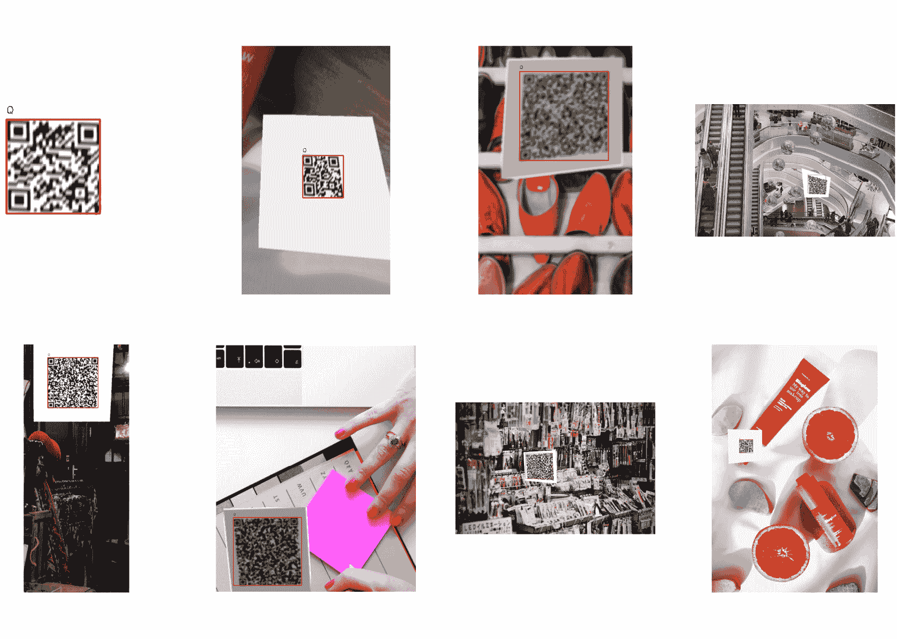
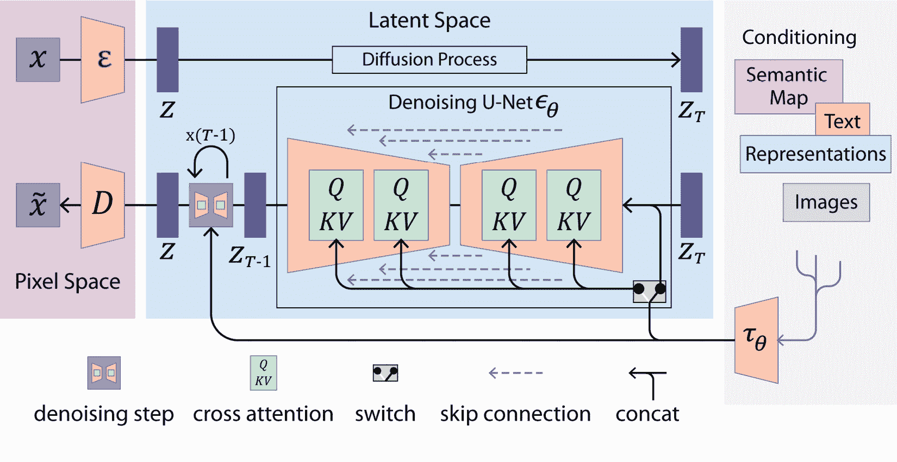

# 第十一章：计算机视觉中的正则化 – 合成图像生成

本章将重点介绍用于生成合成图像进行数据增强的技术和方法。拥有多样化的数据通常是正则化计算机视觉模型的最有效方法之一。许多方法可以帮助我们生成合成图像；从简单的技巧如图像翻转，到使用生成模型创建新图像。本章将探讨几种技术，包括以下内容：

+   使用 Albumentations 进行图像增强

+   创建合成图像用于目标检测 – 仅使用合成数据训练目标检测模型

+   实时风格迁移 – 基于 Stable Diffusion（一个强大的生成模型）训练实时风格迁移模型

# 技术要求

在本章中，我们将训练几个深度学习模型并生成图像。我们将需要以下库：

+   NumPy

+   Matplotlib

+   Albumentations

+   Pytorch

+   torchvision

+   ultralytics

# 使用 Albumentations 应用图像增强

在 **机器学习**（**ML**）中，数据对于提高模型的性能至关重要。计算机视觉也不例外，图像数据增强可以轻松提升到另一个层次。

事实上，轻松增强图像是可能的，例如，通过镜像操作，如 *图 11.1* 所示。


图 11.1 – 左侧是我狗的原始照片，右侧是我狗的镜像照片

然而，除此之外，还有更多类型的增强方法，这些方法可以分为两大类：像素级和空间级变换。

接下来我们将讨论这两种方法。

## 空间级增强

镜像操作是空间级增强的一个例子；然而，除了简单的镜像操作，还可以做更多的变换。例如，见以下内容：

+   **平移**：将图像平移到某个方向

+   **剪切**：对图像进行剪切变换

+   **裁剪**：只裁剪图像的一部分

+   **旋转**：对图像进行旋转

+   **转置**：对图像进行转置（换句话说，应用垂直和水平翻转）

+   **透视**：对图像应用四点透视

正如我们所见，空间级增强有许多可能性。*图 11.2* 展示了在给定图像上这些可能性的一些例子，并显示了一些可能出现的伪影：平移图像时的黑色边框和旋转图像时的镜像填充。


图 11.2 – 原始图像（左上角）和五种不同的增强方式（请注意，某些伪影可能会出现，如黑色边框）

## 像素级增强

另一种增强方式是像素级增强，和空间级增强一样有用。一个简单的例子可能是改变图像的亮度和对比度，使得模型能在不同的光照条件下更具鲁棒性。

以下是一些像素级增强的非详尽列表：

+   **亮度**：修改亮度

+   **对比度**：修改对比度

+   **模糊**：模糊图像

+   **HSV**：随机修改图像的**色相**、**饱和度**和**明度**

+   **颜色转换**：将图像转换为黑白或褐色调

+   **噪声**：向图像添加噪声

+   这里有许多可能性，这些变化可能大大提升模型的鲁棒性。以下图示展示了这些增强的一些结果：


图 11.3 – 原始图像（左上）和几种像素级增强

如我们所见，使用像素级和空间级转换，我们可以很容易地将一张图像增强成 5 到 10 张图像。此外，这些增强有时可以组合起来以获得更多的多样性。当然，它无法替代一个真实的大型多样化数据集，但图像增强通常比收集数据便宜，并且能够显著提升模型性能。

## Albumentations

当然，我们不必手动重新实现所有这些图像增强。现在有很多图像增强的库，Albumentations 无疑是市场上最完整、最自由、开源的解决方案。正如我们在这个教程中所见，Albumentations 库只需要几行代码就能实现强大的图像增强。

## 开始

在这个教程中，我们将应用图像增强来解决一个简单的挑战：分类猫和狗。

我们首先需要下载并准备数据集。这个数据集最初由微软提出，包含 12,491 张猫的图片和 12,470 张狗的图片。可以通过 Kaggle API 使用以下命令行操作进行下载：

```py
kaggle datasets download -d karakaggle/kaggle-cat-vs-dog-dataset --unzip
```

这将下载一个名为`kagglecatsanddogs_3367a`的文件夹。

不幸的是，数据集尚未拆分为训练集和测试集。以下代码将把它拆分为 80%的训练集和 20%的测试集：

```py
from glob import glob
import os
cats_folder = 'kagglecatsanddogs_3367a/PetImages/Cat/'
dogs_folder = 'kagglecatsanddogs_3367a/PetImages/Dog/'
cats_paths = sorted(glob(cats_folder + '*.jpg'))
dogs_paths = sorted(glob(dogs_folder + '*.jpg'))
train_ratio = 0.8
os.mkdir(cats_folder + 'train')
os.mkdir(cats_folder + 'test')
os.mkdir(dogs_folder + 'train')
os.mkdir(dogs_folder + 'test')
for i in range(len(cats_paths)):
    if i <= train_ratio * len(cats_paths):
        os.rename(cats_paths[i], cats_folder + 'train/' + cats_paths[i].split('/')[-1])
    else:
        os.rename(cats_paths[i], cats_folder + 'test/' + cats_paths[i].split('/')[-1])
for i in range(len(dogs_paths)):
    if i <= train_ratio * len(dogs_paths):
        os.rename(dogs_paths[i], dogs_folder + 'train/' + dogs_paths[i].split('/')[-1])
    else:
        os.rename(dogs_paths[i], dogs_folder + 'test/' + dogs_paths[i].split('/')[-1])
```

这将创建`train`和`test`子文件夹，因此`kagglecatsanddogs_3367a`文件夹结构现在如下所示：

```py
kagglecatsanddogs_3367a
└── PetImages
    ├── Cat
    │   ├── train: 9993 images
    │   └── test: 2497 images
    └── Dog
        ├── train: 9976 images
        └── test: 2493 images
```

现在我们将能够高效地训练和评估一个针对该数据集的模型。

所需的库可以通过以下命令行安装：

```py
pip install matplotlib numpy torch torchvision albumentations
```

## 如何操作…

现在，我们将在训练数据集上训练一个 MobileNet V3 网络，并在测试数据集上进行评估。然后，我们将使用 Albumentations 添加图像增强，以提高模型的性能：

1.  首先，导入所需的库：

    +   `matplotlib`用于显示和可视化

    +   `numpy`用于数据处理

    +   `Pillow`用于图像加载

    +   `glob`用于文件夹解析

    +   `torch`和`torchvision`用于模型训练及相关`util`实例

下面是`import`语句：

```py
import matplotlib.pyplot as plt
import numpy as np
import torch
import torch.nn as nn
import torch.nn.functional as F
from torch.utils.data import DataLoader, Dataset
import torchvision.transforms as transforms
from torchvision.models import mobilenet_v3_small
from glob import glob
from PIL import Image
```

1.  接下来，我们实现`DogsAndCats`数据集类。它接受以下参数：

    +   `cats_folder`：包含猫咪图片的文件夹路径

    +   `dogs_folder`：包含狗狗图片的文件夹路径

    +   `transform`：应用于图像的转换（例如，调整大小、转换为张量等）

    +   `augment`：应用图像增强，如我们将在本节后半部分做的那样

这是实现的代码：

```py
class DogsAndCats(Dataset) :
    def __init__(self, cats_folder: str,
        dogs_folder: str, transform, augment = None):
            self.cats_path = sorted(glob(
                f'{cats_folder}/*.jpg'))
            self.dogs_path = sorted(glob(
                f'{dogs_folder}/*.jpg'))
            self.images_path = self.cats_path + self.dogs_path
            self.labels = [0.]*len(
            self.cats_path) + [1.]*len(self.dogs_path)
            self.transform = transform
            self.augment = augment
    def __len__(self):
        return len(self.images_path)
    def __getitem__(self, idx):
        image = Image.open(self.images_path[
            idx]).convert('RGB')
        if self.augment is not None:
            image = self.augment(
                image=np.array(image))["image"]
        return self.transform(image),
        torch.tensor(self.labels[idx],
            dtype=torch.float32)
```

这个类相当简单：构造函数收集所有图像路径，并相应地定义标签。获取器简单地加载图像， optionally 应用图像增强，并返回带有相关标签的`tensor`形式的图像。

1.  然后，我们实例化转换类。在这里，我们组合了三个转换：

    +   张量转换

    +   由于并非所有图像的大小都相同，因此将图像调整为 224x224 大小

    +   图像输入的标准化

这是它的代码：

```py
transform = transforms.Compose([
    transforms.ToTensor(),
    transforms.Resize((224, 224), antialias=True),
    transforms.Normalize((0.5, 0.5, 0.5), (0.5, 0.5,
        0.5)),
])
```

1.  然后，我们创建一些有用的变量，例如批量大小、设备和周期数：

    ```py
    batch_size = 64
    
    device = torch.device(
    
        'cuda' if torch.cuda.is_available() else 'cpu')
    
    epochs = 20
    ```

1.  实例化数据集和数据加载器。重用*准备工作*小节中提前准备好的训练和测试文件夹，我们现在可以轻松创建两个加载器。它们都使用相同的转换：

    ```py
    trainset = DogsAndCats(
    
        'kagglecatsanddogs_3367a/PetImages/Cat/train/',
    
        'kagglecatsanddogs_3367a/PetImages/Dog/train/',
    
        transform=transform
    
    )
    
    train_dataloader = DataLoader(trainset,
    
        batch_size=batch_size, shuffle=True)
    
    testset = DogsAndCats(
    
        'kagglecatsanddogs_3367a/PetImages/Cat/test/',
    
        'kagglecatsanddogs_3367a/PetImages/Dog/test/',
    
        transform=transform
    
    )
    
    test_dataloader = DataLoader(testset,
    
        batch_size=batch_size, shuffle=True)
    ```

1.  现在，我们使用以下代码展示一些图像及其标签，以便浏览数据集：

    ```py
    def display_images(dataloader, classes = ['cat', 'dog']):
    
        plt.figure(figsize=(14, 10))
    
        images, labels = next(iter(dataloader))
    
        for idx in range(8):
    
            plt.subplot(2, 4, idx+1)
    
            plt.imshow(images[idx].permute(
    
                1, 2, 0).numpy() * 0.5 + 0.5)
    
            plt.title(classes[int(labels[idx].item())])
    
            plt.axis('off')
    
    display_images(train_dataloader)
    ```

这是图像：


图 11.4 – 数据集中的图像样本

如图所示，这是一个由各种场景下的狗和猫的常规图像组成的数据集，有时图片中也包含人类。

1.  现在，我们实现`Classifier`类。我们将重用在`pytorch`中提供的现有`mobilenet_v3_small`实现，并仅添加一个具有一个单元和 sigmoid 激活函数的输出层，如下所示：

    ```py
    class Classifier(nn.Module):
    
        def __init__(self):
    
            super(Classifier, self).__init__()
    
            self.mobilenet = mobilenet_v3_small()
    
            self.output_layer = nn.Linear(1000, 1)
    
        def forward(self, x):
    
            x = self.mobilenet(x)
    
            x = nn.Sigmoid()(self.output_layer(x))
    
            return x
    ```

1.  接下来，我们实例化模型：

    ```py
    model = Classifier()
    
    model = model.to(device)
    ```

1.  然后，实例化损失函数为二元交叉熵损失，这非常适合二分类问题。接下来，我们实例化 Adam 优化器：

    ```py
    criterion = nn.BCELoss()
    
    optimizer = torch.optim.Adam(model.parameters(),
    
        lr=0.001)
    ```

1.  然后，训练模型 20 个周期并存储输出。为此，我们使用`train_model`函数，该函数在给定的周期数和数据集上训练输入模型。它返回每个周期的训练集和测试集的损失和准确率。此函数可以在 GitHub 仓库中找到（[`github.com/PacktPublishing/The-Regularization-Cookbook/blob/main/chapter_11/chapter_11.ipynb`](https://github.com/PacktPublishing/The-Regularization-Cookbook/blob/main/chapter_11/chapter_11.ipynb)），这是二分类训练的典型代码，如我们在前几章中使用的那样：

    ```py
    train_losses, test_losses, train_accuracy, 
    
    test_accuracy = train_model(
    
        epochs, model, criterion, optimizer, device,
    
        train_dataloader, test_dataloader, trainset,
    
        testset
    
    )
    ```

1.  最后，将损失和准确率作为周期的函数进行显示：

    ```py
    plt.figure(figsize=(10, 10))
    
    plt.subplot(2, 1, 1)
    
    plt.plot(train_losses, label='train')
    
    plt.plot(test_losses, label='test')
    
    plt.ylabel('BCE Loss')
    
    plt.legend()
    
    plt.subplot(2, 1, 2)
    
    plt.plot(train_accuracy, label='train')
    
    plt.plot(test_accuracy, label='test')
    
    plt.xlabel('Epoch')
    
    plt.ylabel('Accuracy')
    
    plt.legend()
    
    plt.show()
    ```

下面是它的图示：


图 11.5 – 二进制交叉熵损失（顶部）和准确度（底部）作为训练和测试集的周期函数，无增强（损失和准确度表明过拟合，测试准确度在约 88%时达到平台期）

如我们所见，测试准确度似乎在大约 10 个周期后达到了平台期，峰值准确度约为 88%。训练准确度达到了 98%，这表明在训练集上存在强烈的过拟合现象。

### 使用图像增强进行训练

现在让我们使用图像增强重新做同样的练习：

1.  首先，我们需要实现所需的图像增强。使用与`pytorch`中变换相同的模式，借助 Albumentations，我们可以实例化一个包含增强列表的`Compose`类。在我们的例子中，我们使用以下增强方法：

    +   `HorizontalFlip`：这涉及基本的镜像操作，发生的概率为 50%，意味着 50%的图像会被随机镜像

    +   `Rotate`：这将以 50%的概率随机旋转图像，旋转范围为[-90, 90]度（此范围可修改）

    +   `RandomBrightnessContrast`：这将以 20%的概率随机改变图像的亮度和对比度

这里是实例化的代码：

```py
import albumentations as A
augment = A.Compose([
    A.HorizontalFlip(p=0.5),
    A.Rotate(p=0.5),
    A.RandomBrightnessContrast(p=0.2),
])
```

1.  然后，实例化一个新的增强训练集和训练数据加载器。为此，我们只需将`augment`对象作为`DogsAndCats`类的参数提供即可：

    ```py
    augmented_trainset = DogsAndCats(
    
        'kagglecatsanddogs_3367a/PetImages/Cat/train/',
    
        'kagglecatsanddogs_3367a/PetImages/Dog/train/',
    
        transform=transform,
    
        augment=augment,
    
    )
    
    augmented_train_dataloader = DataLoader(
    
        augmented_trainset, batch_size=batch_size,
    
        shuffle=True)
    ```

注意

我们不对测试集应用增强，因为我们需要能够将增强结果与未增强的结果进行比较。此外，除非使用测试时间增强（有关更多信息，请参见*更多…*部分），否则增强测试集是没有意义的。

1.  然后，按如下方式显示该新增强数据集中的一些图像：

    ```py
    display_images(augmented_train_dataloader)
    ```

这里是图像：


图 11.6 – 增强图像示例（有些已旋转，有些已镜像，还有些亮度和对比度已被修改）

如我们所见，某些图像现在似乎被旋转了。此外，某些图像还被镜像并且亮度与对比度发生了变化，有效地提高了数据集的多样性。

1.  然后，我们实例化模型和优化器：

    ```py
    model = Classifier()
    
    model = model.to(device)
    
    optimizer = torch.optim.Adam(model.parameters(),
    
        lr=0.001)
    ```

1.  接下来，在这个新的训练集上训练模型，同时保持相同的测试集，并记录输出的损失和指标：

    ```py
    train_losses, test_losses, train_accuracy, 
    
    test_accuracy = train_model(
    
        epochs, model, criterion, optimizer, device,
    
        augmented_train_dataloader, test_dataloader,
    
        trainset, testset
    
    )
    ```

注意

在这个过程中，我们在线进行增强，意味着每次加载新的图像批次时，我们都会随机应用增强；因此，在每个周期中，我们可能会从不同增强的图像中训练。

另一种方法是离线增强数据：我们对数据集进行预处理和增强，存储增强后的图像，然后只在这些数据上训练模型。

两种方法各有优缺点：离线增强允许我们只增强一次图像，但需要更多的存储空间，而在线预处理可能需要更多时间来训练，但不需要额外的存储。

1.  现在，最后，我们绘制结果：训练集和测试集的损失与准确率。以下是相应的代码：

    ```py
    plt.figure(figsize=(10, 10))
    
    plt.subplot(2, 1, 1)
    
    plt.plot(train_losses, label='train')
    
    plt.plot(test_losses, label='test')
    
    plt.ylabel('BCE Loss')
    
    plt.legend()
    
    plt.subplot(2, 1, 2)
    
    plt.plot(train_accuracy, label='train')
    
    plt.plot(test_accuracy, label='test')
    
    plt.xlabel('epoch')
    
    plt.ylabel('Accuracy')
    
    plt.legend()
    
    plt.show()
    ```

这里是图示：


图 11.7 – 增强数据集的损失与准确率

如你在前面的图示中看到的，与常规数据集相比，过拟合几乎完全消除，并且准确率也提高到了超过 91%，而之前为 88%。

多亏了这个相当简单的图像增强，我们将准确率从 88%提升到 91%，同时减少了过拟合：训练集的表现现在和测试集一样。

## 还有更多…

虽然我们使用了增强来进行训练，但有一种方法可以在测试时利用图像增强来提高模型的表现，这有时被称为**测试时增强**。

这个方法很简单：对多个增强过的图像进行模型推理，并通过多数投票计算最终预测。

让我们来看一个简单的例子。假设我们有一张输入图像，必须使用我们训练好的狗猫模型进行分类，我们通过镜像以及调整亮度和对比度对这张输入图像进行增强，从而得到三张图像：

+   **图像 1**：原始图像

+   **图像 2**：镜像图像

+   **图像 3**：调整亮度和对比度后的图像

现在我们将在这三张图像上进行模型推理，得到以下预测结果：

+   **图像 1** **预测**：猫

+   **图像 2** **预测**：猫

+   **图像 3** **预测**：狗

现在我们可以通过选择最多代表的预测类别来计算多数投票，从而得出猫类的预测结果。

注意

在实践中，我们很可能使用软多数投票法，通过对预测的概率（无论是二分类还是多分类）进行平均来进行预测，但概念是一样的。

测试时增强（Test Time Augmentation）在竞赛中常常使用，确实可以在不增加训练成本的情况下提高模型的表现。然而，在生产环境中，推理成本至关重要，因此这种方法很少使用。

## 另见

在这个案例中，我们使用了 Albumentations 来进行简单的分类任务，但它可以用于更多的场景：它允许我们进行目标检测、实例分割、语义分割、地标检测等图像增强。

要了解如何充分使用它，请查看编写得很好的文档，其中有许多工作示例，网址如下：https://albumentations.ai/docs/。

# 创建用于目标检测的合成图像

对于某些项目，数据量可能非常少，以至于你只能使用这些数据作为测试集。在某些罕见情况下，可以创建合成数据集，训练一个足够强大的模型，并使用小型真实测试集对其进行测试。

这是我们在这个食谱中要做的：我们有一个小型的二维码图片测试集，我们希望为二维码的检测构建一个目标检测模型。作为训练集，我们只有一组生成的二维码和从如 unsplash.com 等开放图像网站下载的图片。

## 开始入门

使用以下命令行从 https://www.kaggle.com/datasets/vincentv/qr-detection-yolo 下载并解压数据集：

```py
kaggle datasets download -d vincentv/qr-detection-yolo --unzip
```

这个数据集由以下文件夹结构组成：

```py
QR-detection-yolo
├── train
│   ├── images: 9750 images
│   └── labels: 9750 text files
├── test
│   ├── images: 683 images
│   └── labels: 683 text files
└── background_images: 44 images
```

它由三个文件夹组成：

+   **训练集**：仅包含没有上下文的生成二维码

+   **测试集**：在不同环境和场景中的二维码图片

+   **背景图片**：如商店等场景的随机图像

目标是使用训练集中的数据和背景图像生成逼真的合成图像，以训练模型，然后再在由真实图像组成的测试集上评估模型。

对于这个食谱，所需的库可以通过以下命令行安装：

```py
pip install albumentations opencv-python matplotlib numpy ultralytics.
```

## 如何实现…

让我们将这个食谱分成三部分：

1.  首先，我们将探索数据集并实现一些辅助函数。

1.  第二部分是关于使用二维码和背景图片生成合成数据的。

1.  最后一部分是关于在生成的数据上训练 YOLO 模型并评估该模型。

让我们在接下来的章节中了解每个部分。

### 探索数据集

让我们从创建一些辅助函数开始，并使用它们显示训练集和测试集中的一些图像：

1.  导入以下库：

    +   `glob` 用于列出文件

    +   `os` 用于创建存储生成合成图像的目录

    +   `albumentations` 用于数据增强

    +   `cv2` 用于图像处理

    +   `matplotlib` 用于显示

    +   `numpy` 用于各种数据处理

    +   `YOLO` 用于模型

这是导入的库：

```py
from glob import glob
import os
import albumentations as A
import cv2
import matplotlib.pyplot as plt
import numpy as np
from ultralytics import YOLO
```

1.  让我们实现一个 `read_labels` 辅助函数，它将读取 YOLO 标签的文本文件并将其作为列表返回：

    ```py
    def read_labels(labels_path):
    
        res = []
    
        with open(labels_path, 'r') as file:
    
            lines = file.readlines()
    
            for line in lines:
    
                cls,xc,yc,w,h = line.strip().split(' ')
    
                res.append([int(float(cls)), float(xc),
    
                    float(yc), float(w), float(h)])
    
            file.close()
    
        return res
    ```

1.  现在，让我们实现一个 `plot_labels` 辅助函数，它将重用之前的 `read_labels` 函数，读取一些图像及其相应标签，并显示这些带有边界框的图像：

    ```py
    def plot_labels(images_folder, labels_folder,
    
        classes):
    
            images_path = sorted(glob(
    
                images_folder + '/*.jpg'))
    
         labels_path = sorted(glob(
    
                labels_folder + '/*.txt'))
    
        plt.figure(figsize=(10, 6))
    
        for i in range(8):
    
            idx = np.random.randint(len(images_path))
    
            image = plt.imread(images_path[idx])
    
            labels = read_labels(labels_path[idx])
    
            for cls, xc, yc, w, h in labels:
    
                xc = int(xc*image.shape[1])
    
                yc = int(yc*image.shape[0])
    
                w = int(w*image.shape[1])
    
                h = int(h*image.shape[0])
    
                cv2.rectangle(image,
    
                    (xc - w//2, yc - h//2),
    
                    (xc + w//2 ,yc + h//2), (255,0,0), 2)
    
                cv2.putText(image, f'{classes[int(cls)]}',
    
                    (xc-w//2, yc - h//2 - 10),
    
                    cv2.FONT_HERSHEY_SIMPLEX, 0.5,
    
                    (1.,0.,0.), 1)
    
            plt.subplot(2, 4, i + 1)
    
            plt.imshow(image)
    
            plt.axis('off')
    ```

1.  现在，使用以下代码显示训练集中的一组图像及其边界框：

    ```py
    plot_labels('QR-detection-yolo/train/images/',
    
        'QR-detection-yolo/train/labels/', 'QR Code')
    ```

这里有一些二维码形式的示例图像：


图 11.8 – 来自训练集的一些样本及其标签（该数据集仅由白色背景上的生成二维码组成）

如前所述，训练集仅由各种大小的生成二维码组成，背景是白色的，没有更多上下文。

1.  现在，使用以下代码显示一些来自测试集的图像：

    ```py
    plot_labels('QR-detection-yolo/test/images/',
    
        'QR-detection-yolo/test/labels/', 'QR Code')
    ```

以下是生成的图像：


图 11.9 – 测试集中一些示例，由真实世界的二维码图像组成

测试集包含更复杂、真实的二维码示例，挑战性更大。

### 从背景图像生成合成数据集

在这一部分，我们将生成一个逼真的合成数据集。为此，我们将使用训练集中的二维码图像以及一组背景图像。步骤如下：

1.  现在，我们使用两种材料生成一个合成数据集：

    +   真实背景图像

    +   数字生成的二维码

为此，我们将使用一个相当长且复杂的函数，`generate_synthetic_background_image_with_tag`，它执行以下操作：

+   从给定文件夹中随机选择一个背景图像

+   从给定文件夹中随机选择一个二维码图像

+   增强选定的二维码

+   随机将增强的二维码插入背景图像中

+   对新创建的图像应用更多增强

+   将生成的图像及其相应的标签以 YOLO 格式存储

执行此操作的代码可以在 GitHub 仓库中找到，代码较长，无法在这里显示，因此我们只展示它的签名和文档字符串。不过，我们强烈建议你查看并进行尝试。代码可在此找到：

https://github.com/PacktPublishing/The-Regularization-Cookbook/blob/main/chapter_11/chapter_11.ipynb

```py
def generate_synthetic_background_image_with_tag(
    n_images_to_generate: int,
    output_path: str,
    raw_tags_folder: str,
    background_images_path: str,
    labels_path: str,
    background_proba: float = 0.8,
):
    """Generate images with random tag and synthetic background.
    Parameters
    ----------
    n_images_to_generate : int
        The number of images to generate.
    output_path : str
        The output directory path where to store the generated images.
        If the path does not exist, the directory is created.
    raw_tags_folder : str
        Path to the folder containing the raw QR codes.
    background_images_path : str
        Path to the folder containing the background images.
    labels_path : str
        Path to the folder containing the labels.
        Files must be in the same order as the ones in the raw_tags_folder.
    background_proba : float (optional, default=0.8)
        Probability to use a background image when generating a new sample.
    """
```

注意

该函数会根据需求多次执行此生成，并提供一些其他功能；请随时深入查看并更新它。

1.  我们现在可以使用这个函数通过调用 `generate_synthetic_background_image_with_tag` 来生成 3,000 张图像（3,000 是一个相当任意的选择，可以根据需要生成更多或更少的图像）。这可能需要几分钟。生成的图像及其相关标签将存储在 `QR-detection-yolo/generated_qr_code_images/` 文件夹中，如果该文件夹不存在，将自动创建：

    ```py
    generate_synthetic_background_image_with_tag(
    
        n_images_to_generate=3000,
    
        output_path='QR-detection-yolo/generated_qr_code_images/',
    
        raw_tags_folder='QR-detection-yolo/train/images/',
    
        background_images_path='QR-detection-yolo/background_images/',
    
        labels_path='QR-detection-yolo/train/labels/'
    
    )
    ```

让我们通过以下代码查看一些生成图像的示例：

```py
plot_labels(
    'QR-detection-yolo/generated_qr_code_images/images/',
    'QR-detection-yolo/generated_qr_code_images/labels/',
    'QR Code'
)
```

这里是这些图像：



图 11.10 – 合成创建的图像示例，由背景图像和生成的二维码与各种图像增强组合而成

正如我们所看到的，有些图像只是简单的增强二维码，没有背景，这得益于生成函数的作用。可以通过`background_proba`参数调整这一点。

### 模型训练

现在我们可以开始模型训练部分：我们将用前一步生成的 3,000 张图像训练一个 YOLO 模型，并在测试集上评估该模型。以下是步骤：

1.  首先，按照以下方式实例化一个带有预训练权重的 YOLO 模型：

    ```py
    # Create a new YOLO model with pretrained weights
    
    model = YOLO('yolov8n.pt')
    ```

注意

你可能会遇到 `FileNotFoundError` 错误，这是由于数据集路径不正确导致的。`~/.config/Ultralytics/settings.yaml` 中的 `config` 文件存有以前的路径。一个快速且无害的解决办法是简单地删除这个文件；一个新的文件将会自动生成。

1.  然后，我们需要创建一个 `.yaml` 文件 `data_qr_generated.yaml`，其内容如下：

    ```py
    train: ../../QR-detection-yolo/generated_qr_code_images/images
    
    val: ../../QR-detection-yolo/test/images
    
    nc: 1
    
    names: ['QR_CODE']
    ```

1.  这个 `.yaml` 文件可以用来在我们的数据集上训练模型，训练周期为 `50 epochs`。我们还指定了初始学习率为 0.001 (`lr0=0.001`)，因为默认的学习率（0.01）对于微调预训练模型来说过大：

    ```py
    # Train the model for 50 epochs
    
    model.train(data='data_qr_generated.yaml', epochs=50,
    
        lr0=0.001, name='generated_qrcode')
    ```

结果应该保存在创建的文件夹 `runs/detect/generated_qrcode` 中。

1.  在查看结果之前，我们先实现一个 `plot_results_one_image` 辅助函数，以显示模型的输出，代码如下：

    ```py
    def plot_results_random_images(test_images, model, classes=['QR_code']):
    
        images = glob(test_images + '/*.jpg')
    
        plt.figure(figsize=(14, 10))
    
        for i in range(8):
    
            idx = np.random.randint(len(images))
    
            result = model.predict(images[idx])
    
            image = result[0].orig_img.copy()
    
            raw_res = result[0].boxes.data
    
            for detection in raw_res:
    
                x1, y1, x2, y2, p,
    
                    cls = detection.cpu().tolist()
    
                cv2.rectangle(image, (int(x1), int(y1)),
    
                    (int(x2), int(y2)), (255,0,0), 2)
    
                cv2.putText(image, f'{classes[int(cls)]}',
    
                    (int(x1), int(y1) - 10),
    
                        cv2.FONT_HERSHEY_SIMPLEX, 1,
    
                        (255,0,0), 2)
    
            plt.subplot(2, 4, i + 1)
    
            plt.axis('off')
    
            plt.imshow(image)
    ```

1.  然后，我们可以重新加载最佳权重，计算推理，并在测试集中的一张图像上显示结果：

    ```py
    # Load the best weights
    
    model = YOLO(
    
        'runs/detect/generated_qrcode/weights/best.pt')
    
    # Plot the results
    
    Plot_results_random_images(
    
        'QR-detection-yolo/test/images/', model)
    ```

这里是结果：


图 11.11 – 训练于合成数据的 YOLO 模型结果示例（尽管模型并不完美，但它能够在相当复杂和多样的情况下检测二维码）

如我们所见，模型仍然没有完全发挥作用，但仍能在多个复杂场景中识别二维码。然而，在一些情况下，例如二维码非常小、图像质量差或二维码严重变形时，模型似乎表现不佳。

1.  最后，我们可以可视化 YOLO 库生成的损失值和其他指标：

    ```py
    plt.figure(figsize=(10, 8))
    
    plt.imshow(plt.imread(
    
        'runs/detect/generated_qrcode/results.png'))
    ```

这里是损失值：


图 11.12 – YOLO 库计算的指标

根据显示的几张图像结果，指标并不完美，mAP50 仅为 75% 左右。

通过添加更多精心挑选的图像增强，可能会有所改进。

## 还有更多…

即使我们一开始没有任何真实数据，仍然有更多生成带标签图像的技术。在本教程中，我们仅使用了背景图像、生成的二维码和增强方法，但也可以使用生成模型来生成更多数据。

让我们看看如何使用 OpenAI 提出的 DALL-E 模型来实现：

1.  首先，我们可以导入所需的库。可以使用 `pip install openai` 安装 `openai` 库：

    ```py
    import openai
    
    import urllib
    
    from PIL import Image
    
    import matplotlib.pyplot as plt
    
    openai.api_key = 'xx-xxx'
    ```

注意

你需要通过在 openai.com 创建自己的帐户来生成自己的 API 密钥。

1.  现在我们来创建一个辅助函数，将边界框和图像转换为掩膜，因为我们希望在边界框外部进行填充：

    ```py
    def get_mask_to_complete(image_path, label_path, output_filename, margin: int = 100):
    
        image = plt.imread(image_path)
    
        labels = read_labels(label_path)
    
        output_mask = np.zeros(image.shape[:2])
    
        for cls, xc, yc, w, h in labels:
    
            xc = int(xc*image.shape[1])
    
            yc = int(yc*image.shape[0])
    
            w = int(w*image.shape[1])
    
            h = int(h*image.shape[0])
    
            output_mask[yc-h//2-margin:yc+h//2+margin,
    
                xc-w//2-margin:xc+w//2+margin] = 255
    
        output_mask = np.concatenate([image,
    
            np.expand_dims(output_mask, -1)],
    
                axis=-1).astype(np.uint8)
    
        # Save the images
    
        output_mask_filename = output_filename.split('.')[0] + '_mask.png'
    
        plt.imsave(output_filename, image)
    
        plt.imsave(output_mask_filename, output_mask)
    
        return output_mask_filename
    ```

1.  我们现在可以计算掩膜，并将结果与原始图像并排显示，方法如下：

    ```py
    output_image_filename = 'image_edit.png'
    
    mask_filename = get_mask_to_complete(
    
        'QR-detection-yolo/generated_qr_code_images/images/synthetic_image_0.jpg',
    
        'QR-detection-yolo/generated_qr_code_images/labels/synthetic_image_0.txt',
    
        output_image_filename
    
    )
    
    # Display the masked image and the original image side by side
    
    plt.figure(figsize=(12, 10))
    
    plt.subplot(1, 2, 1)
    
    plt.imshow(plt.imread(output_image_filename))
    
    plt.subplot(1, 2, 2)
    
    plt.imshow(plt.imread(mask_filename))
    ```

下面是结果：


图 11.13 – 左侧是原始图像，右侧是用于数据生成的相关掩膜图像

注意

我们保留掩膜图像的边缘，以便调用 DALL-E 2 时，它能够感知周围环境。如果我们只提供一个二维码和白色背景的掩膜，结果可能不尽如人意。

1.  我们现在可以查询 OpenAI 模型 DALL-E 2，通过 `openai` 库中的 `create_edit` 方法来填充这个二维码并生成新图像。该功能需要以下几个参数：

    +   输入图像（PNG 格式，小于 4 MB）

    +   输入掩膜（同样是 PNG 格式且小于 4 MB）

    +   描述期望输出图像的提示

    +   生成的图像数量

    +   输出图像的像素大小（可以是 256x256、512x512 或 1,024x1,024）

现在我们来查询 DALL-E，显示原始图像和生成图像并排显示：

```py
# Query openAI API to generate image
response = openai.Image.create_edit(
    image=open(output_image_filename, 'rb'),
    mask=open(mask_filename, 'rb'),
    prompt="A store in background",
    n=1,
    size="512x512"
)
# Download and display the generated image
plt.figure(figsize=(12, 10))
image_url = response['data'][0]['url']
plt.subplot(1, 2, 1)
plt.imshow(plt.imread(output_image_filename))
plt.subplot(1, 2, 2)
plt.imshow(np.array(Image.open(urllib.request.urlopen(
    image_url))))
```

下面是图像的显示效果：


图 11.14 – 左侧是原始图像，右侧是使用 DALL-E 2 生成的图像

正如我们在 *图 11.14* 中看到的，使用这种技术能够创建更逼真的图像，这些图像可以轻松用于训练。这些创建的图像还可以通过 Albumentations 进行增强。

注意

然而，这种方法也有一些缺点。生成的图像大小为 512x512，这意味着边界框坐标需要转换（这可以通过 Albumentations 完成），而且生成的图像不总是很完美，需要进行视觉检查。

1.  我们还可以使用 `create_variation` 函数创建给定图像的变化。这种方法更简单，且需要类似的输入参数：

    +   输入图像（仍然是小于 4 MB 的 PNG 图像）

    +   生成的变化图像数量

    +   输出图像的像素大小（同样可以是 256x256、512x512 或 1,024x1,024）

以下是这段代码：

```py
# Query to create variation of a given image
response = openai.Image.create_variation(
    image=open(output_image_filename, "rb"),
    n=1,
    size="512x512"
)
# Download and display the generated image
plt.figure(figsize=(12, 10))
image_url = response['data'][0]['url']
plt.subplot(1, 2, 1)
plt.imshow(plt.imread(output_image_filename))
plt.subplot(1, 2, 2)
plt.imshow(np.array(Image.open(urllib.request.urlopen(
    image_url))))
```

这是输出结果：


图 11.15 – 左侧是原始图像，右侧是使用 DALL-E 生成的变化图像

前面图中展示的结果相当不错：我们可以看到背景中的会议室和前景中的二维码，就像原始图像一样。然而，除非我们手动标注这些数据，否则它可能不容易使用，因为我们无法确定二维码是否会出现在相同的位置（即使我们调整了边界框坐标）。尽管如此，使用这样的模型对于其他用例（如分类）仍然是非常有帮助的。

## 另见

+   YOLOv8 可用的训练参数列表：https://docs.ultralytics.com/modes/train/

+   DALL-E API 文档：https://platform.openai.com/docs/guides/images/usage

# 实现实时风格迁移

在本食谱中，我们将基于 U-Net 架构构建我们自己的轻量级风格迁移模型。为此，我们将使用一个通过稳定扩散生成的数据集（稍后将详细介绍稳定扩散是什么）。这可以看作是一种知识蒸馏：我们将使用一个大型教师模型（稳定扩散，体积达到几个千兆字节）生成的数据来训练一个小型学生模型（这里是一个不到 30 MB 的 U-Net++）。这是一种有趣的方式，利用生成模型创建数据，但这里发展出的概念可以用于许多其他应用：其中一些将在*更多内容...*部分中提出，并提供如何使用稳定扩散创建自己的风格迁移数据集的指导。 在此之前，让我们先了解一下风格迁移的背景。

风格迁移是深度学习中的一个著名且有趣的应用，它允许我们将给定图像的风格转换为另一种风格。许多例子存在，比如《蒙娜丽莎》以梵高的《星夜》风格呈现，如下图所示：


图 11.16 – 《蒙娜丽莎》以《星夜》风格呈现

直到最近，风格迁移大多是使用**生成对抗网络**（**GANs**）进行的，而这些网络通常很难正确训练。

现在，使用基于稳定扩散的预训练模型应用风格迁移比以往任何时候都要简单。不幸的是，稳定扩散是一个庞大而复杂的模型，有时在最新的图形卡上生成一张图像可能需要几秒钟的时间。

在本食谱中，我们将训练一个类似于 U-Net 的模型，允许在任何设备上进行实时迁移学习。为此，我们将采用一种知识蒸馏的方式。具体而言，我们将使用稳定扩散数据来训练 U-Net 模型，并为此目的加入 VGG 感知损失。

注意

**VGG** 代表 **视觉几何组**，这是提出这一深度学习模型架构的牛津团队的名称。它是计算机视觉中的标准深度学习模型。

在继续进行食谱之前，让我们先看一下本食谱中的两个重要概念：

+   稳定扩散

+   感知损失

## 稳定扩散

稳定扩散是一个复杂而强大的模型，允许我们通过图像和文本提示生成新图像。



图 11.17 – 稳定扩散的架构图

从上面的图可以看出，稳定扩散的训练方式可以简化总结如下：

+   对输入图像 **Z** 进行 **T** 次扩散：这就像是向输入图像添加随机噪声

+   这些扩散的图像被传入去噪 U-Net 模型

+   可选择添加一个条件，如描述性文本或另一个图像提示，作为嵌入

+   该模型被训练用于输出输入图像

一旦模型训练完成，就可以通过跳过如下第一部分来进行推断：

+   给定一个种子，生成一个随机图像并将其作为输入提供给去噪 U-Net

+   添加输入提示作为条件：它可以是文本或输入图像，例如

+   然后生成输出图像：这就是最终结果

尽管这只是一个简单的工作原理解释，但它使我们能够大致了解它的工作方式以及生成新图像的预期输入是什么。

## 感知损失

感知损失被提出用来训练模型以学习图像中的感知特征。它是专门为风格迁移开发的，允许你不仅关注像素到像素的内容本身，还关注图像的风格。

它接受两幅图像作为输入：模型预测和标签图像，通常基于一个在 ImageNet 数据集或任何类似通用图像数据集上预训练的 VGG 神经网络。

更具体地说，对于两幅图像（例如，模型预测和标签），进行以下计算：

+   VGG 模型的前馈计算应用于每个图像

+   每个 VGG 模型块后的输出被存储，这使我们能够通过更深的块获得越来越具体的特征

注

在深度神经网络中，前几层通常用于学习通用特征和形状，而最深的层则用于学习更具体的特征。感知损失利用了这一特性。

使用这些存储的计算，最终感知损失被计算为以下值的总和：

+   每个块输出计算之间的差异（例如 L1 或 L2 范数）：这些可以表示为特征重建损失，并将关注图像特征。

+   每个块输出计算的 Gram 矩阵之间的差异：这些可以表示为风格重建损失，并且将关注于图像的风格。

注

给定一组向量的 Gram 矩阵通过计算每对向量的点积并将结果排列成矩阵来构造。它可以看作是给定向量之间的相似性或相关性。

最终，最小化这个感知损失应该允许我们将给定图像的风格应用到另一张图像上，正如我们将在本食谱中看到的那样。

## 入门

你可以通过以下命令行从 Kaggle 下载我为这个配方创建的完整数据集：

```py
kaggle datasets download -d vincentv/qr-detection-yolo --unzip
```

然后你将拥有以下文件夹架构：

```py
anime-style-transfer
├── train
│   ├── images: 820 images
│   └── labels: 820 images
└── test
     ├── images: 93 images
     └── labels: 93 images
```

这是一个相当小的数据集，但它应该足够展示该技术的潜力，能够获得良好的表现。

关于如何使用 ControlNet 自行创建这样的数据集，请查看 *There’s* *more…* 子章节。

这个配方所需的库可以通过以下命令行安装：

```py
pip install matplotlib numpy torch torchvision segmentation-models-pytorch albumentations tqdm
```

## 如何做…

这是这个配方的步骤：

1.  导入所需的库：

    +   `matplotlib` 用于可视化

    +   `numpy` 用于操作

    +   几个 `torch` 和 `torchvision` 模块

    +   `segmentation models pytorch` 用于模型

    +   `albumentations` 用于图像增强

这是它的代码：

```py
import matplotlib.pyplot as plt
import numpy as np
import torch
import torch.nn as nn
import torch.nn.functional as F
from torch.utils.data import DataLoader, Dataset
import torchvision.transforms as transforms
from torchvision.models import vgg16, VGG16_Weights
from glob import glob
import segmentation_models_pytorch as smp
from torch.optim.lr_scheduler import ExponentialLR
import albumentations as A
import tqdm
```

1.  实现 `AnimeStyleDataset`，允许我们加载数据集。请注意，我们使用了 `Albumentations` 中的 `ReplayCompose` 工具，允许我们对图像和相关标签应用完全相同的图像增强：

    ```py
    class AnimeStyleDataset(Dataset):
    
        def __init__(self, input_path: str,
    
            output_path: str, transform, augment = None):
    
                self.input_paths = sorted(glob(
    
                    f'{input_path}/*.png'))
    
                self.output_paths = sorted(glob(
    
                    f'{output_path}/*.png'))
    
                self.transform = transform
    
                self.augment = augment
    
        def __len__(self):
    
            return len(self.input_paths)
    
        def __getitem__(self, idx):
    
            input_img = plt.imread(self.input_paths[idx])
    
            output_img = plt.imread(
    
                self.output_paths[idx])
    
            if self.augment:
    
                augmented = self.augment(image=input_img)
    
                input_img = augmented['image']
    
                output_img = A.ReplayCompose.replay(
    
                    augmented['replay'],
    
                    image=output_img)['image']
    
            return self.transform(input_img),
    
                self.transform(output_img)
    ```

1.  实例化增强，这是以下变换的组合：

    +   `Resize`

    +   以 50% 的概率进行水平翻转

    +   `ShiftScaleRotate`，允许我们随机增加几何变化

    +   `RandomBrightnessContrast`，允许我们增加光照变化

    +   `RandomCropFromBorders`，它将随机裁剪图片的边缘

这是它的代码：

```py
augment = A.ReplayCompose([
    A.Resize(512, 512),
    A.HorizontalFlip(p=0.5),
    A.ShiftScaleRotate(shift_limit=0.05,
        scale_limit=0.05, rotate_limit=15, p=0.5),
    A.RandomBrightnessContrast(p=0.5),
    A.RandomCropFromBorders(0.2, 0.2, 0.2, 0.2, p=0.5)
])
```

1.  实例化变换，允许我们转换 torch 张量并重新缩放像素值。同时，定义批量大小和设备，如下所示：

    ```py
    batch_size = 12
    
    device = torch.device(
    
        'cuda' if torch.cuda.is_available() else 'cpu')
    
    mean = (0.485, 0.456, 0.406)
    
    std = (0.229, 0.224, 0.225)
    
    transform = transforms.Compose([
    
        transforms.ToTensor(),
    
        transforms.Resize((512, 512), antialias=True),
    
        transforms.Normalize(mean, std),
    
    ])
    ```

注意

在这里，我们使用了特定于 ImageNet 数据集的均值和标准差重缩放，因为 VGG 感知损失（见下文）是在这一特定值集上训练的。此外，批量大小可能需要根据你的硬件规格进行调整，尤其是图形处理单元的内存。

1.  实例化数据集和数据加载器，提供训练集和测试集文件夹。请注意，我们只对训练集应用增强：

    ```py
    trainset = AnimeStyleDataset(
    
        'anime-style-transfer/train/images/',
    
        'anime-style-transfer/train/labels/',
    
        transform=transform,
    
        augment=augment,
    
    )
    
    train_dataloader = DataLoader(trainset,
    
    batch_size=batch_size, shuffle=True)
    
    testset = AnimeStyleDataset(
    
        'anime-style-transfer/test/images/',
    
        'anime-style-transfer/test/labels/',
    
        transform=transform,
    
    )
    
    test_dataloader = DataLoader(testset,
    
        batch_size=batch_size, shuffle=True)
    ```

1.  显示几张图像及其标签，以便我们快速了解数据集。为此，我们首先需要一个辅助的 `unnormalize` 函数，将图像的值重新缩放到 [0, 1] 范围：

    ```py
    def unnormalize(x, mean, std):
    
        x = np.asarray(x, dtype=np.float32)
    
        for dim in range(3):
    
            x[:, :, dim] = (x[:, :, dim] * std[dim]) + mean[dim]
    
        return x
    
    plt.figure(figsize=(12, 6))
    
    images, labels = next(iter(train_dataloader))
    
    for idx in range(4):
    
        plt.subplot(2, 4, idx*2+1)
    
        plt.imshow(unnormalize(images[idx].permute(
    
            1, 2, 0).numpy(), mean, std))
    
        plt.axis('off')
    
        plt.subplot(2, 4, idx*2+2)
    
        plt.imshow(unnormalize(labels[idx].permute(
    
            1, 2, 0).numpy(), mean, std))
    
        plt.axis('off')
    ```

以下是结果：


图 11.18 – 一组四张图片及其相关的动漫标签

如前图所示，数据集由面部图像组成，标签是应用了绘画和动漫风格的相应图片。这些图片是使用 Stable Diffusion 和 ControlNet 生成的；请参阅 *There’s* *more…* 部分了解如何自行完成此操作。

1.  现在，我们实例化模型类。在这里，我们重用了 SMP 库中提供的带有 U-Net++架构的现有`mobilenetv3_large_100`实现。我们分别使用`in_channels`和`n_classes`参数，指定输入和输出通道为`3`。我们还重用了`imagenet`的编码器权重。以下是代码：

    ```py
    model = smp.UnetPlusPlus(
    
        encoder_name='timm-mobilenetv3_large_100',
    
        encoder_weights='imagenet',
    
        in_channels=3,
    
        classes=3,
    
        )
    
    model = model.to(device)
    ```

注意

关于 SMP 库的更多信息，请参考*第十章*中的*语义分割与迁移学习*章节。

1.  现在，我们实现 VGG 感知损失如下：

    ```py
    class VGGPerceptualLoss(torch.nn.Module):
    
        def __init__(self):
    
            super(VGGPerceptualLoss, self).__init__()
    
            blocks = []
    
            blocks.append(vgg16(weights=VGG16_Weights.DEFAULT).features[:4].eval())
    
            blocks.append(vgg16(weights=VGG16_Weights.DEFAULT).features[4:9].eval())
    
            blocks.append(vgg16(weights=VGG16_Weights.DEFAULT).features[9:16].eval())
    
            blocks.append(vgg16(weights=VGG16_Weights.DEFAULT).features[16:23].eval())
    
            for block in blocks:
    
                block = block.to(device)
    
                for param in block.parameters():
    
                    param.requires_grad = False
    
                self.blocks = torch.nn.ModuleList(blocks)
    
                self.transform = torch.nn.functional.interpolate
    
        def forward(self, input, target):
    
            input = self.transform(input, mode='bilinear',
    
                size=(224, 224), align_corners=False)
    
                target = self.transform(target,
    
                    mode='bilinear', size=(224, 224),
    
                    align_corners=False)
    
                loss = 0.0
    
                x = input
    
                y = target
    
                for i, block in enumerate(self.blocks):
    
                    x = block(x)
    
                    y = block(y)
    
                    loss += torch.nn.functional.l1_loss(
    
                        x, y)
    
                    act_x = x.reshape(x.shape[0],
    
                        x.shape[1], -1)
    
                    act_y = y.reshape(y.shape[0],
    
                        y.shape[1], -1)
    
                    gram_x = act_x @ act_x.permute(
    
                        0, 2, 1)
    
                    gram_y = act_y @ act_y.permute(
    
                        0, 2, 1)
    
                    loss += torch.nn.functional.l1_loss(
    
                        gram_x, gram_y)
    
            return loss
    ```

在此实现中，我们有两个方法：

+   `init`函数，定义所有模块并将其设置为不可训练

+   `forward`函数，将图像调整为 224x224（原始 VGG 输入形状），并计算每个模块的损失

1.  接下来，我们定义优化器、指数学习率调度器、VGG 损失以及风格和内容损失的权重：

    ```py
    optimizer = torch.optim.Adam(model.parameters(),
    
        lr=0.001)
    
    scheduler = ExponentialLR(optimizer, gamma=0.995)
    
    vgg_loss = VGGPerceptualLoss()
    
    content_loss_weight=1.
    
    style_loss_weight=5e-4
    ```

注意

风格损失（即 VGG 感知损失）通常远大于内容损失（即 L1 损失）。因此，在这里，我们通过对风格损失施加较低的权重来进行平衡。

1.  在 50 个 epoch 内训练模型，并存储训练集和测试集的损失。为此，我们可以使用 GitHub 仓库中提供的`train_style_transfer`函数（[`github.com/PacktPublishing/The-Regularization-Cookbook/blob/main/chapter_11/chapter_11.ipynb`](https://github.com/PacktPublishing/The-Regularization-Cookbook/blob/main/chapter_11/chapter_11.ipynb)）：

    ```py
    train_losses, test_losses = train_style_transfer(
    
        model,
    
        train_dataloader,
    
        test_dataloader,
    
        vgg_loss,
    
        content_loss_weight,
    
        style_loss_weight,
    
        device,
    
        epochs=50,
    
    )
    ```

注意

这个函数是一个典型的训练循环，和我们已经实现过多次的训练过程相似。唯一的区别是损失计算，计算方法如下：

`style_loss =` `vgg_loss(outputs, labels)`

`content_loss =` `torch.nn.functional.l1_loss(outputs, labels)`

`loss = style_loss_weight*style_loss +` `content_loss_weight*content_loss`

1.  将损失图作为 epoch 的函数绘制，分别对应训练集和测试集：

    ```py
    plt.plot(train_losses, label='train')
    
    plt.plot(test_losses, label='test')
    
    plt.ylabel('Loss')
    
    plt.xlabel('Epoch')
    
    plt.legend()
    
    plt.show()
    ```

下面是结果：


图 11.19 – 风格转移网络的训练和测试损失随 epoch 的变化

如前图所示，模型在学习，但随着测试损失在大约 40 个 epoch 后不再显著下降，似乎有轻微的过拟合。

1.  最后，在测试集的一组图像上测试训练好的模型，并展示结果：

    ```py
    images, labels = next(iter(test_dataloader))
    
    with torch.no_grad():
    
        outputs = model(images.to(device)).cpu()
    
    plt.figure(figsize=(12, 6))
    
    for idx in range(4):
    
        plt.subplot(2, 4, idx*2+1)
    
        plt.imshow(unnormalize(images[idx].permute(
    
            1, 2, 0).numpy(), mean, std))
    
        plt.axis('off')
    
        plt.subplot(2, 4, idx*2+2)
    
        plt.imshow(unnormalize(outputs[idx].permute(
    
            1, 2, 0).numpy(), mean, std).clip(0, 1))
    
        plt.axis('off')
    ```

下面是显示的结果：


图 11.20 – 一些图像及其预测的风格转移效果

如前图所示，模型成功地转移了一些风格，通过平滑皮肤并有时给头发上色。尽管如此，效果并不完美，因为输出图像看起来过于明亮。

通过微调损失权重和其他超参数，可能可以获得更好的结果。

## 还有更多内容...

虽然本配方展示了如何使用生成模型（如 Stable Diffusion）以有趣的方式创建新数据，但它也可以应用于许多其他场景。让我们看看如何使用 Stable Diffusion 创建自己的风格迁移数据集，以及一些其他可能的应用。

如前所述，Stable Diffusion 使我们能够基于输入提示创建逼真且富有创意的图像。不幸的是，单独使用它时，无法有效地将风格应用于给定图像而不妥协原始图像的细节（例如，面部形状等）。为此，我们可以使用基于 Stable Diffusion 的另一个模型：ControlNet。

ControlNet 的工作原理类似于 Stable Diffusion：它接收输入提示并生成输出图像。然而，与 Stable Diffusion 不同，ControlNet 会将控制信息作为输入，使我们能够根据控制图像特定地生成数据：这正是创建此配方数据集时所做的，通过有效地为面部添加绘画风格，同时保持整体面部特征。

控制信息可以有多种形式，例如：

+   使用 Canny 边缘或 Hough 线的图像轮廓，允许我们为图像分类执行逼真且无限的图像增强

+   深度估计，允许我们高效生成背景图像

+   语义分割，允许对语义分割任务进行图像增强

+   姿态估计，生成具有特定姿势的人物图像，这对目标检测、语义分割等非常有用

+   还有更多内容，比如涂鸦和法线图

注

Canny 边缘检测器和 Hough 线变换是典型的图像处理算法，分别允许我们检测图像中的边缘和直线。

作为一个具体的例子，在下图中，使用输入图像和计算出的 Canny 边缘作为输入，再加上类似 *A realistic cute shiba inu in a fluffy basket* 的文本提示，ControlNet 使我们能够生成一个非常接近第一张图像的新图像。请参考下图：


图 11.21 – 左侧是输入图像；中间是计算出的 Canny 边缘；右侧是使用 ControlNet 和提示语“A realistic cute shiba inu in a fluffy basket”生成的图像

有几种方法可以安装和使用 ControlNet，但可以使用以下命令安装官方库：

```py
git clone git@github.com:lllyasviel/ControlNet.git
cd ControlNet
conda env create -f environment.yaml
conda activate control
```

从那里，你需要根据自己的需求下载特定的模型，这些模型可以在 HuggingFace 上找到。例如，你可以使用以下命令下载 Canny 模型：

```py
wget https://huggingface.co/lllyasviel/ControlNet/resolve/main/models/control_sd15_canny.pth -P models/
```

注

下载的文件超过 6 GB，因此可能需要一些时间。

最后，你可以通过以下命令启动 ControlNet UI，`python gradio_canny2image.py`，然后按照提示访问创建的本地地址，`http://0.0.0.0:7860`。

使用 ControlNet 和 Stable Diffusion，在拥有足够强大计算机的情况下，你现在可以生成几乎无限的新图像，使你能够训练出真正强大且规范化良好的计算机视觉模型。

## 另见

+   关于 U-Net++ 架构的论文：[`arxiv.org/abs/1807.10165`](https://arxiv.org/abs/1807.10165)

+   更多关于神经风格迁移的内容：[`en.wikipedia.org/wiki/Neural_style_transfer`](https://en.wikipedia.org/wiki/Neural_style_transfer)

+   关于稳定扩散（Stable Diffusion）的维基百科页面：[`en.wikipedia.org/wiki/Stable_Diffusion`](https://en.wikipedia.org/wiki/Stable_Diffusion)

+   关于感知损失（Perceptual Loss）的论文：[`arxiv.org/pdf/1603.08155.pdf`](https://arxiv.org/pdf/1603.08155.pdf)

+   这个配方灵感来自于 [`medium.com/@JMangia/optimize-a-face-to-cartoon-style-transfer-model-trained-quickly-on-small-style-dataset-and-50594126e792`](https://medium.com/@JMangia/optimize-a-face-to-cartoon-style-transfer-model-trained-quickly-on-small-style-dataset-and-50594126e792)

+   官方 ControlNet 仓库：[`github.com/lllyasviel/ControlNet`](https://github.com/lllyasviel/ControlNet)

+   一种高级的使用 ControlNet 的方式，允许我们组合多个模型：[`github.com/Mikubill/sd-webui-controlnet`](https://github.com/Mikubill/sd-webui-controlnet)

+   关于 Canny 边缘检测器的维基百科页面：[`en.wikipedia.org/wiki/Canny_edge_detector`](https://en.wikipedia.org/wiki/Canny_edge_detector)
