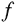
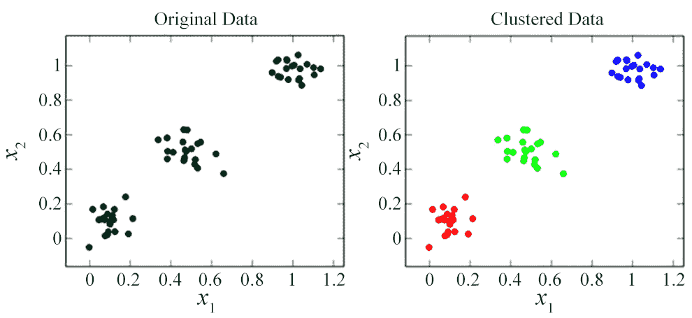
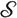
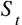
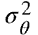
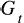
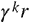
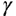
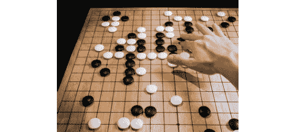

# 第一章：1\. 强化学习简介

概述

本章介绍了**强化学习**（**RL**）框架，这是机器学习和人工智能领域中最令人兴奋的领域之一。你将学习如何描述 RL 的特征和高级应用，展示在这个框架下能够实现的目标。你还将学会如何区分 RL 与其他学习方法。你将从理论角度和实践角度（使用 Python 及其他有用的库）学习这门学科的主要概念。

到本章结束时，你将理解什么是 RL，并了解如何使用 Gym 工具包和 Baselines 这两个在该领域中流行的库，来与环境进行互动并实现一个简单的学习循环。

# 介绍

学习和适应新环境是人类乃至所有动物的关键过程。通常，学习被视为一种通过反复试错的过程，通过这个过程我们在特定任务中提升表现。我们的生活是一个持续的学习过程，我们从简单的目标（例如，走路）开始，最终追求困难且复杂的任务（例如，参加体育运动）。作为人类，我们始终受到奖励机制的驱动，奖励好行为并惩罚不良行为。

**强化学习**（**RL**），受人类学习过程的启发，是机器学习的一个子领域，涉及通过互动进行学习。这里的“互动”指的是我们作为人类，通过试错过程来理解我们行为的后果，并积累我们的经验。

RL，特别是，关注的是序列决策问题。这些问题中，代理需要做出一系列决策，也就是一系列行动，以最大化某个性能指标。

RL 将任务视为**马尔可夫决策过程**（**MDPs**），这些问题在许多现实世界场景中都会出现。在这种环境下，决策者（即代理）必须做出决策，考虑环境的不确定性和经验。代理是目标导向的；它们只需要一个目标的概念，比如一个需要最大化的数值信号。与监督学习不同，在 RL 中，不需要提供好的示例；是代理自己学习如何将情境映射到行动。情境（状态）到行动的映射在文献中被称为“策略”，它代表了代理的行为或策略。解决一个 MDP 意味着通过最大化期望的结果（即总奖励）来找到代理的策略。我们将在未来的章节中更详细地研究 MDP。

强化学习（RL）已成功应用于各种问题和领域，取得了令人兴奋的结果。本章是强化学习的入门，旨在从直观的角度和数学的角度解释一些应用和概念。这两个方面在学习新学科时都非常重要。没有直观的理解，就无法理解公式和算法；没有数学背景，实施现有或新算法就会变得困难。

在本章中，我们将首先比较三种主要的机器学习范式，即监督学习、强化学习（RL）和无监督学习。我们将讨论它们的异同，并定义一些示例问题。

第二，我们将进入一个包含强化学习理论及其符号表示的部分。我们将学习像代理、环境以及如何参数化不同策略等概念。本节内容是这一学科的基础。

第三，我们将开始使用两个强化学习框架，即 Gym 和 Baselines。我们将学习与 Gym 环境的交互非常简单，使用 Baselines 算法学习任务也是如此。

最后，我们将探索一些强化学习应用，激励你学习这一学科，展示可用于应对现实世界问题的各种技术。强化学习不仅局限于学术界，但从工业角度来看，仍然至关重要，它使得你能够解决那些几乎无法通过其他技术解决的问题。

# 学习范式

在本节中，我们将讨论在机器学习范畴下，三种主要**学习范式**的相似性与差异性。我们将分析一些代表性问题，以更好地理解这些框架的特征。

## 学习范式简介

对于一个学习范式，我们实现一个问题和解决方法。通常，学习范式处理数据，并以一种可以通过寻找参数并最大化目标函数的方式重新表述问题。在这些设置中，问题可以通过数学和优化工具来解决，从而允许进行正式的研究。术语“学习”通常用于表示一种动态过程，在这个过程中，算法的参数以优化它们在给定任务上的表现（即“学习”）的方式进行调整。Tom Mitchell 以以下精确的方式定义了学习：

*“如果一个计算机程序在任务类别 T 和性能度量 P 下，随着经验 E 的积累，它在任务 T 中的表现通过 P 得到改善，那么我们说这个程序从经验 E 中学习。”*

让我们更直观地重新表述上述定义。要定义一个程序是否在学习，我们需要设置一个任务；这就是程序的目标。任务可以是我们希望程序完成的任何事情，比如下国际象棋、进行自动驾驶或执行图像分类。问题应当伴随一个表现度量，即一个函数，返回程序在该任务上的表现如何。对于国际象棋游戏，表现函数可以简单地通过以下方式表示：


图 1.1：国际象棋游戏的表现函数

在此背景下，经验是程序在特定时刻收集的数据量。对于国际象棋，经验可以通过程序进行的游戏集合来表示。

在学习阶段的开始或结束时呈现的相同输入，可能会导致算法产生不同的响应（即输出）；这些差异是由于算法的参数在过程中得到了更新。

在下表中，我们可以看到一些关于经验、任务和表现元组的例子，以便更好地理解它们的具体实例化：


图 1.2：实例化的表格

我们可以根据学习算法的输入和它们收到的反馈来分类这些算法。在接下来的部分，我们将基于这种分类方法，探讨机器学习中的三种主要学习范式。

## 监督学习与无监督学习与强化学习

三种主要的学习范式是监督学习、无监督学习和强化学习（RL）。下图表示了每种学习范式的通用结构：


图 1.3：学习范式的表示

从前面的图表中，我们可以得出以下信息：

+   监督学习通过最小化模型输出相对于训练集中特定目标的误差来进行优化。

+   强化学习（RL）通过最大化行为的奖励信号来进行优化。

+   无监督学习没有目标也没有奖励，它尝试学习一个可能有用的数据表示。

让我们更深入地探讨并进一步阐述这些概念，特别是从数学角度来看。

有监督学习处理的是通过映射输入到输出来学习一个函数，当输入与输出（样本，标签）之间的对应关系由外部教师（监督者）给出，并包含在训练集中时。有监督学习的目标是能够推广到数据集中未包含的未见样本，从而使系统（例如，一个函数）能够在新情况下做出正确的响应。在这里，样本与标签之间的对应关系通常是已知的（例如，在训练集中），并且已给定给系统。监督学习任务的例子包括回归和分类问题。在回归任务中，学习者必须找到一个函数，，这个函数接收输入，，并生成一个（或一般是）实数输出，。用数学符号表示，我们需要找到，使得：


图 1.4：回归

这里，表示训练集中的示例。在分类任务中，待学习的函数是一个离散的映射；属于一个有限的离散集合。通过将问题形式化，我们搜索一个离散值的函数，，使得：


图 1.5：分类

这里，集合，表示可能的类别或分类集合。

无监督学习处理的是在目标标签不存在或未知的情况下，学习数据中的模式。无监督学习的目标是找到数据的新表示，通常是更小的表示。无监督学习算法的例子包括聚类和**主成分分析（PCA）**。

在聚类任务中，学习者应该根据某些相似性度量，将数据集划分为聚类（元素组）。乍一看，聚类可能与分类非常相似；然而，作为一种无监督学习任务，标签或类别并没有在训练集中给算法。实际上，应该是算法本身通过学习输入空间的表示，从而让相似的样本彼此靠近，来理解其输入。

例如，在下图中，我们在左侧看到的是原始数据；右侧是聚类算法的可能输出。不同的颜色代表不同的聚类：



图 1.6：聚类应用示例

在上述例子中，输入空间由两个维度组成，也就是，并且算法找到了三个聚类，或者说是三组相似的元素。

主成分分析（PCA）是一种用于降维和特征提取的无监督算法。PCA 试图通过寻找一种表示方式来理解数据，该表示方式包含了给定数据中的大部分信息。

强化学习（RL）不同于监督学习和无监督学习。RL 处理的是一个序列决策问题中的控制动作学习。问题的序列结构使得 RL 具有挑战性，并且与其他两种范式不同。此外，在监督学习和无监督学习中，数据集是固定的。而在 RL 中，数据集是不断变化的，数据集的创建本身就是智能体的任务。在 RL 中，不同于监督学习，没有教师为给定样本提供正确的值或为给定情境提供正确的行动。RL 基于一种不同形式的反馈，即环境对智能体行为的反馈。正是这种反馈的存在，使得 RL 不同于无监督学习。

我们将在未来的章节中更详细地探讨这些概念：


图 1.7：机器学习范式及其关系

强化学习和监督学习也可能会混淆。一种常见的技术（也被 AlphaGo Zero 使用）被称为**模仿学习**（或行为克隆）。我们不是从头开始学习任务，而是以监督的方式教会智能体如何在给定情境中表现（或采取哪种行动）。在这种情况下，我们有一个专家（或多个专家），他们向智能体展示期望的行为。通过这种方式，智能体可以开始构建其内部表示和初始知识。当 RL 部分开始时，它的行动将不再是随机的，行为将更加专注于专家展示的行动。

现在，让我们看几个情境，帮助我们更好地分类这些问题。

## 将常见问题分类为学习情境

在本节中，我们将了解如何通过定义所需的元素，将一些常见的现实世界问题框架化为学习框架。

### 预测图像中是否包含狗或猫

预测图像内容是一个标准的分类示例，因此，它属于监督学习的范畴。在这里，我们给定一张图片，算法应该判断该图像中是狗还是猫。输入是图片，相关标签可以是 0 表示猫，1 表示狗。

对于人类来说，这是一个直接的任务，因为我们有关于猫狗的内部表征（以及对世界的内部表征），并且我们在一生中经过大量训练，能够识别猫狗。尽管如此，编写一个能够识别图像中是否包含猫狗的算法，在没有机器学习技术的情况下是一个困难的任务。对人类来说，知道图像是猫还是狗是很简单的；同时，创建一个简单的猫狗图像数据集也很容易。

*为什么不是无监督学习？*

无监督学习不适合这种类型的任务，因为我们有一个从输入中需要获得的定义输出。当然，监督学习方法会构建输入数据的内部表示，在这种表示中，相似性得到了更好的利用。这个表示是隐式的；它不是算法的输出，正如在无监督学习中那样。

*为什么不是强化学习？*

强化学习按定义考虑的是顺序决策问题。预测图像内容不是一个顺序问题，而是一个一次性任务。

### 检测与分类图像中的所有猫狗

检测与分类是监督学习问题的两个例子。然而，这个任务比前一个更复杂。检测部分可以同时看作是回归问题和分类问题。输入始终是我们想要分析的图像，输出是每个狗或猫的边界框坐标。与每个边界框相关联的是一个标签，用于将兴趣区域内的内容分类为狗或猫：


图 1.8：猫狗检测与分类

*为什么不是无监督学习？*

如前所述，在这里，我们有一个给定输入（图像）后的确定输出。我们不想从数据中提取未知的模式。

*为什么不是强化学习？*

检测与分类不是适合强化学习框架的任务。我们没有一套需要采取的行动来解决问题。此外，在这种情况下，缺乏顺序结构。

### 下棋

下棋可以视为一个强化学习（RL）问题。程序可以感知棋盘的当前状态（例如，棋子的类型和位置），并基于此决定采取什么行动。在这里，可能的行动数量非常庞大。选择一个行动意味着要理解并预见这一动作的后果，以击败对手：


图 1.9：下棋作为强化学习问题

*为什么不是监督学习？*

我们可以将下棋视为一个监督学习问题，但我们需要一个数据集，并且应该将游戏的顺序结构融入到监督学习问题中。在强化学习中，不需要数据集；是算法本身通过交互并可能通过自我对弈来构建数据集。

*为什么不是无监督学习？*

无监督学习不适用于这个问题，因为我们并不是在学习数据的表示；我们有一个明确的目标，那就是赢得游戏。

在本节中，我们比较了三种主要的学习范式。我们看到了它们所拥有的数据类型、每个算法与外部世界的交互方式，并分析了一些特定问题，以理解哪种学习范式最为适合。

在面对现实世界问题时，我们总是要记住这些技术之间的区别，并根据我们的目标、数据以及问题结构选择最合适的技术。

# 强化学习基础

在强化学习中，主要目标是通过交互来学习。我们希望智能体在给定的情境下学习一种行为，即选择行动的方式，以实现某个目标。与经典编程或规划的主要区别在于，我们不想显式地自己编码规划软件，因为这需要巨大的努力；它可能非常低效，甚至不可能完成。强化学习正是为了这个原因而诞生的。

强化学习（RL）智能体通常一开始并不知道该做什么。它们通常不知道目标是什么，不知道游戏规则，也不了解环境的动态或自己的行为如何影响状态。

强化学习有三个主要组成部分：感知、行动和目标。

智能体应该能够感知当前的环境状态以完成任务。这种感知，也叫做观察，可能与实际的环境状态不同，可能受到噪音的干扰，或者可能是部分的。

例如，想象一个机器人在一个未知环境中移动。对于机器人应用，通常机器人通过摄像头感知环境。这种感知并不能完全代表环境状态，可能会受到遮挡、光线不足或不利条件的影响。系统应该能够处理这种不完整的表示，并学会在环境中移动的方式。

智能体的另一个主要组成部分是执行能力；智能体应该能够采取影响环境状态或自身状态的行动。

智能体还应该有一个通过环境状态定义的目标。目标通过高层次的概念来描述，例如赢得比赛、在环境中移动或正确驾驶。

强化学习（RL）的一个挑战是探索与利用的权衡，这个问题在其他类型的学习中并不存在。为了提高，智能体必须利用已有的知识；它应该偏好那些在过去证明有用的动作。这里有一个问题：为了发现更好的动作，智能体应该继续探索，尝试那些它以前从未做过的动作。为了可靠地估计一个动作的效果，智能体必须多次执行每个动作。需要注意的是，单独进行探索或利用都不能有效地学习任务。

上述情况非常类似于我们在婴儿时期学习走路时面临的挑战。最初，我们尝试不同类型的运动，并从一种简单且能带来令人满意结果的运动开始：爬行。然后，我们希望通过改进行为变得更加高效。为了学习新行为，我们不得不做一些以前从未做过的动作：我们尝试走路。刚开始，我们执行不同的动作，结果不尽如人意：我们摔倒了很多次。一旦我们发现了正确的腿部运动方式并学会了保持平衡，我们的走路效率就提高了。如果我们没有进一步探索，只停留在第一个带来满意结果的行为上，我们就会永远爬行。通过探索，我们学会了有些行为更高效。一旦我们学会了走路，就可以停止探索，开始利用已有的知识。

## 强化学习的元素

让我们直观地介绍强化学习框架的主要元素。

### 智能体

在强化学习中，智能体是指在世界中移动、执行动作并达成目标的实体的抽象概念。智能体可以是自动驾驶软件、象棋玩家、围棋玩家、算法交易员或机器人。智能体是能够感知并影响环境状态的所有事物，因此可以用来完成目标。

### 动作

智能体可以根据当前的情况执行动作。动作的形式可以根据具体任务的不同而有所不同。

在自动驾驶的背景下，动作可以是转向、踩下油门踏板或踩下刹车踏板。其他动作的例子包括在象棋中将马移到 H5 位置，或将国王移到 A5 位置。

动作可以是低级的，例如控制车辆电机的电压，但也可以是高级的，或者是规划动作，例如决定去哪儿。动作层级的决定是算法设计师的责任。过于高级的动作可能难以在低层级实现；它们可能需要在较低层级进行大量规划。同时，低级动作使得问题学习变得更加困难。

### 环境

环境代表了智能体移动并做出决策的上下文。一个环境由三个主要元素组成：状态、动态和奖励。它们可以如下解释：

+   **状态**：这表示描述在特定时间步环境的所有信息。状态通过观察可供智能体获取，观察可以是部分或完整的表示。

+   **动态**：环境的动态描述了行动如何影响环境的状态。环境的动态通常是非常复杂或未知的。使用环境动态信息来学习如何实现目标的 RL 算法属于基于模型的 RL 类别，其中模型表示环境的数学描述。大多数时候，环境动态对智能体是不可用的。在这种情况下，算法属于无模型类别。即使环境模型不可用、过于复杂或过于近似，智能体仍然可以在训练过程中学习到环境的模型。即使如此，这种算法也被认为是基于模型的。

+   **奖励**：奖励是与每个时间步相关的标量值，用于描述智能体的目标。奖励也可以描述为环境反馈，向智能体提供关于其行为的信息；因此，它对于使学习成为可能是必要的。如果智能体获得高奖励，意味着它做出了一个好的动作，一个将其带得更接近目标的动作。

### 策略

策略描述了智能体的行为。智能体通过遵循策略来选择行动。从数学上讲，策略是一个将状态映射到动作的函数。这是什么意思呢？就是说，策略的输入是当前的状态，而它的输出是需要采取的动作。策略可以有不同的形式。它可以是简单的一组规则、查找表、神经网络或任何函数近似器。策略是强化学习（RL）框架的核心，所有 RL 算法（无论是隐式的还是显式的）的目标都是改进智能体的策略，以最大化智能体在任务（或一组任务）上的表现。策略可以是随机的，涉及到动作的分布，也可以是确定性的。在后者的情况下，所选动作是由环境的状态唯一决定的。

### 一个自动驾驶环境的例子

为了更好地理解环境在 RL 框架中的作用及其特性，让我们形式化一个自动驾驶环境，如下图所示：


图 1.10：一个自动驾驶场景

考虑前面的图，我们现在来看看环境的每个组成部分：

+   **状态**：状态可以通过我们汽车周围 360 度的街景图像来表示。在这种情况下，状态是一个图像，即一个像素矩阵。它也可以通过一系列覆盖汽车周围整个空间的图像来表示。另一种可能性是使用特征而非图像来描述状态。状态可以是我们车辆的当前速度和加速度、与其他车辆的距离，或者与街道边缘的距离。在这种情况下，我们使用预处理过的信息来更轻松地表示状态。这些特征可以从图像或其他类型的传感器中提取（例如，**激光雷达（LIDAR）**）。

+   **动态**：在自动驾驶汽车场景中，环境的动态通过描述汽车加速、刹车或转向时系统如何变化的方程来表示。例如，车辆当前以 30 km/h 的速度行驶，前方的车辆距离其 100 米。状态由汽车的速度和与前方车辆的距离信息表示。如果汽车加速，速度会根据汽车的属性（包含在环境动态中）发生变化。此外，由于速度的变化，距离信息也会发生变化，前方车辆可能会更近或更远。在这种情况下，下一个时间步，汽车的速度可能为 35 km/h，前方车辆可能更近，例如仅 90 米远。

+   **奖励**：奖励可以代表智能体驾驶的表现。形式化奖励函数并不容易。一个自然的奖励函数应该在汽车与街道对齐时给予奖励，并且应避免在汽车发生碰撞或驶出道路时给奖励。奖励函数的定义仍然是一个未解的问题，研究人员正在努力开发不需要奖励函数的算法（自我激励或好奇心驱动的智能体），让智能体通过示范学习（模仿学习）来学习，或者让智能体从示范中恢复奖励函数（**逆向强化学习或 IRL**）。

    注意

    有关好奇心驱动的智能体的更多阅读，请参考以下论文：[`pathak22.github.io/large-scale-curiosity/resources/largeScaleCuriosity2018.pdf`](https://pathak22.github.io/large-scale-curiosity/resources/largeScaleCuriosity2018.pdf)。

我们现在准备使用 Python 设计和实现我们的第一个环境类。在接下来的练习中，我们将展示如何实现一个玩具问题的状态、动态和奖励。

## 练习 1.01：使用 Python 实现一个玩具环境

在这个练习中，我们将使用 Python 实现一个简单的玩具环境。环境如 *图 1.11* 所示。它由三个状态（1、2、3）和两个动作（A 和 B）组成。初始状态为状态 1。状态由节点表示。边表示状态之间的转换。在边上，我们有导致转换的动作和相关的奖励。

*图 1.11* 中环境的表示是强化学习中标准的环境表示。在这个练习中，我们将了解环境的概念及其实现：


图 1.11: 由三个状态（1、2、3）和两个动作（A 和 B）组成的玩具环境

在上图中，奖励与每个状态-动作对相关联。

此练习的目标是实现一个 `Environment` 类，其中包含一个 `step()` 方法，该方法接受代理的操作作为输入，并返回一个状态-动作对（下一个状态，奖励）。除此之外，我们将编写一个 `reset()` 方法来重置环境的状态：

1.  创建一个新的 Jupyter 笔记本或简单的 Python 脚本来输入代码。

1.  从 `typing` 导入 `Tuple` 类型：

    ```py
    from typing import Tuple
    ```

1.  通过初始化其属性来定义类构造函数：

    ```py
    class Environment:
        def __init__(self):
            """
            Constructor of the Environment class.
            """
            self._initial_state = 1
            self._allowed_actions = [0, 1]  # 0: A, 1: B
            self._states = [1, 2, 3]
            self._current_state = self._initial_state
    current_state variable to be equal to the initial state (state 1).
    ```

1.  定义步骤函数，负责根据代理以前的状态和采取的动作更新当前状态：

    ```py
        def step(self, action: int) -> Tuple[int, int]:
            """
            Step function: compute the one-step dynamic from the \
            given action.
            Args:
                action (int): the action taken by the agent.
            Returns:
                The tuple current_state, reward.
            """
            # check if the action is allowed
            if action not in self._allowed_actions:
                raise ValueError("Action is not allowed")
            reward = 0
            if action == 0 and self._current_state == 1:
                self._current_state = 2
                reward = 1
            elif action == 1 and self._current_state == 1:
                self._current_state = 3
                reward = 10
            elif action == 0 and self._current_state == 2:
                self._current_state = 1
                reward = 0
            elif action == 1 and self._current_state == 2:
                self._current_state = 3
                reward = 1
            elif action == 0 and self._current_state == 3:
                self._current_state = 2
                reward = 0
            elif action == 1 and self._current_state == 3:
                self._current_state = 3
                reward = 10
            return self._current_state, reward
    ```

    注意

    以上代码片段中的 `#` 符号表示代码注释。注释用于帮助解释特定逻辑的部分。

    我们首先检查动作是否允许。然后，我们根据前一个状态和动作查看上图中的转换来定义新的当前状态和奖励。

1.  现在，我们需要定义 `reset` 函数，简单地重置环境状态：

    ```py
        def reset(self) -> int:
            """
            Reset the environment starting from the initial state.
            Returns:
                The environment state after reset (initial state).
            """
            self._current_state = self._initial_state
            return self._current_state
    ```

1.  我们可以使用我们的环境类来理解我们的实现是否适用于指定的环境。我们可以通过一个简单的循环来做到这一点，使用预定义的一组操作来测试环境的转换。在这种情况下，可能的操作集是 `[0, 0, 1, 1, 0, 1]`。使用这个集合，我们将测试环境的所有转换：

    ```py
    env = Environment()
    state = env.reset()
    actions = [0, 0, 1, 1, 0, 1]
    print(f"Initial state is {state}")
    for action in actions:
        next_state, reward = env.step(action)
        print(f"From state {state} to state {next_state} \
    with action {action}, reward: {reward}")
        state = next_state
    Initial state is 1
    From state 1 to state 2 with action 0, reward: 1
    From state 2 to state 1 with action 0, reward: 0
    From state 1 to state 3 with action 1, reward: 10
    From state 3 to state 3 with action 1, reward: 10
    From state 3 to state 2 with action 0, reward: 0
    From state 2 to state 3 with action 1, reward: 1
    ```

要更好地理解这一点，请将输出与 *图 1.11* 进行比较，以发现所选操作的转换和奖励是否兼容。

注意

要访问此特定部分的源代码，请参阅 [`packt.live/2Arr9rO`](https://packt.live/2Arr9rO)。

您还可以在 [`packt.live/2zpMul0`](https://packt.live/2zpMul0) 上线运行此示例。

在这个练习中，我们通过定义步骤函数和重置函数来实现了一个简单的强化学习环境。这些函数是每个环境的核心，代表了代理与环境之间的交互。

## 代理-环境接口

强化学习考虑的是顺序决策问题。在这种背景下，我们可以将智能体称为“决策者”。在顺序决策问题中，决策者所采取的动作不仅会影响即时奖励和即时环境状态，还会影响未来的奖励和状态。马尔可夫决策过程（MDP）是形式化顺序决策问题的自然方式。在 MDP 中，智能体通过动作与环境交互，并根据动作、当前环境状态以及环境的动态来获得奖励。决策者的目标是最大化在给定时间跨度（可能是无限的）下的累积奖励。智能体必须学习的任务通过它收到的奖励来定义，正如你在下图中所看到的：


图 1.12：智能体-环境接口

在强化学习（RL）中，一个回合被划分为一系列离散的时间步：。这里，表示可能是无限的时间跨度。智能体与环境的交互发生在每个时间步。在每个时间步，智能体接收到当前环境状态的表示，。基于这个状态，它选择一个动作，，这个动作属于给定当前状态下的动作空间，。该动作会影响环境，导致环境根据其动态变化状态，过渡到下一个状态，。同时，智能体会收到一个标量奖励，，用来量化在该状态下所采取的动作的效果。

现在我们来尝试理解前面例子中使用的数学符号：

+   时间跨度 ：如果任务具有有限的时间跨度，则是一个整数，表示回合的最大持续时间。在无限任务中，也可以是。

+   动作 是智能体在时间步 t 采取的动作。该动作属于由当前状态定义的动作空间，。

+   状态 是智能体在时间 t 接收到的环境状态的表示。它属于由环境定义的状态空间，。状态可以用图像、图像序列或假设有不同形状的简单向量表示。请注意，实际的环境状态可能与智能体感知到的状态不同，且更为复杂。

+   奖励  由一个实数表示，描述所采取的行动有多好。高奖励对应于一个好的行动。奖励对于代理理解如何实现目标至关重要。

在情节化的强化学习（episodic RL）中，代理与环境的交互被划分为多个情节；代理必须在情节内实现目标。交互结束后，代理可以通过结合过去交互的知识来更新其行为。经过若干情节后，代理会根据行动对环境的影响以及获得的奖励，执行更多频繁的行动以获得更高的奖励。

### 什么是代理？什么是环境？

在处理强化学习（RL）时，必须考虑一个重要的方面，那就是代理和环境之间的区别。这个区别通常不是通过物理上的区分来定义的。通常，我们将环境建模为不受代理控制的所有事物。环境可以包括物理法则、其他代理，或者一个代理的属性或特征。

然而，这并不意味着代理不了解环境。代理也可以意识到环境以及其行动对环境的影响，但它无法改变环境的反应方式。此外，奖励计算属于环境，因为它必须完全在代理控制之外。如果不是这样，代理就可以学习如何修改奖励函数，以便在不学习任务的情况下最大化其表现。代理与环境之间的边界是一个控制边界，意味着代理无法控制环境的反应。这不是一个知识边界，因为代理可以完全了解环境模型，但仍然会在学习任务时遇到困难。

## 环境类型

本节中，我们将探讨一些可能的环境二分法。环境的特征取决于状态空间（有限或连续）、转移类型（确定性或随机性）、代理可获得的信息（完全可观察或部分可观察）以及参与学习问题的代理数量（单一代理与多代理）。

### 有限与连续

状态空间给出了第一个区分。状态空间可以分为两大类：有限状态空间和连续状态空间。有限状态空间包含有限数量的可能状态，代理可以处于其中，这是较为简单的情况。而具有连续状态空间的环境则有无限多个可能的状态。在这些类型的环境中，代理的泛化能力对于解决任务至关重要，因为达到相同状态的概率几乎为零。在连续环境中，代理无法利用先前在该状态中的经验；它必须基于某种与先前经验状态的相似性进行泛化。请注意，对于具有大量状态的有限状态空间（例如，当状态空间由所有可能图像的集合表示时），泛化同样至关重要。

考虑以下示例：

+   国际象棋是有限的。代理可以处于的可能状态数量是有限的。对于国际象棋而言，状态由给定时刻的棋盘局面表示。我们可以通过变化棋盘局面来计算所有可能的状态。状态的数量非常高，但仍然是有限的。

+   自动驾驶可以定义为一个连续问题。如果我们将自动驾驶问题描述为代理根据传感器输入做出驾驶决策的问题，那么我们得到的是一个连续问题。传感器提供给定范围内的连续输入。在这种情况下，代理的状态可以由代理的速度、加速度或每分钟车轮转速来表示。

### 确定性与随机性

确定性环境是指在给定一个状态的情况下，代理执行一个动作后，接下来的状态和奖励是唯一确定的。确定性环境是简单类型的环境，但由于其在现实世界中的适用性有限，因此很少使用。

几乎所有现实世界中的环境都是随机的。在随机环境中，一个状态和代理执行的动作决定了下一状态和下一奖励的概率分布。下一状态不是唯一确定的，而是不确定的。在这些类型的环境中，代理应该多次行动，以便获得可靠的后果估计。

请注意，在确定性环境中，智能体可以在每个状态下执行每个动作一次，基于获得的知识，它可以解决任务。同时，请注意，解决任务并不意味着采取能带来最高即时回报的动作，因为这种动作也可能将智能体带到环境中不方便的部分，在那里未来的回报始终很低。为了正确地解决任务，智能体应该采取与最高未来回报相关的动作（称为状态-动作值）。状态-动作值不仅考虑即时回报，还考虑未来的回报，给予智能体远见的视角。我们稍后将定义什么是状态-动作值。

考虑以下示例：

+   魔方是确定性的。对于一个给定的动作，它对应一个定义的状态转换。

+   国际象棋是确定性的，但依赖于对手。后续的状态不仅依赖于智能体的动作，还依赖于对手的动作。

+   德州扑克牌是随机的且依赖于对手。到下一个状态的转换是随机的，并且依赖于扑克牌堆，而扑克牌堆是智能体无法知晓的。

### 完全可观察与部分可观察

为了规划动作，智能体必须接收到环境状态的表示，（参见*图 1.12，智能体-环境接口*）。如果智能体接收到的状态表示完全定义了环境的状态，那么环境是**完全可观察**的。如果环境的某些部分超出了智能体观察到的范围，那么环境是**部分可观察**的，也叫做**部分可观察的马尔可夫决策过程**（**POMDP**）。部分可观察环境的例子有多智能体环境。在部分可观察环境的情况下，智能体所感知的信息和所采取的动作不足以确定环境的下一个状态。提高智能体感知准确性的一个方法是保持已执行动作和观察的历史，但这需要一些记忆技术（例如**递归神经网络**（**RNN**）或**长短期记忆网络**（**LSTM**））嵌入在智能体的策略中。

注意

有关 LSTM 的更多信息，请参考[`www.bioinf.jku.at/publications/older/2604.pdf`](https://www.bioinf.jku.at/publications/older/2604.pdf)。

### POMDP 与 MDP

考虑以下图示：


图 1.13：部分可观察环境的示意图

在前面的图示中，智能体没有接收到完整的环境状态，而是只接收到一个观察，。

为了更好地理解这两种类型环境的区别，让我们看看*图 1.13*。在部分可观察环境（POMDP）中，给代理的表示只是实际环境状态的一部分，而且仅凭此表示无法在没有不确定性的情况下理解实际环境状态。

在完全可观察环境（MDP）中，给定代理的状态表示与环境的状态在语义上是等价的。请注意，在这种情况下，给代理的状态可以采用不同的形式（例如，图像、向量、矩阵或张量）。然而，从这个表示中，总是可以重建环境的实际状态。状态的意义是完全相同的，即使是在不同的形式下。

请考虑以下示例：

+   国际象棋（一般来说，棋盘游戏）是完全可观察的。代理可以感知整个环境状态。在国际象棋游戏中，环境状态由棋盘表示，代理可以精确感知每个棋子的的位置。

+   扑克是部分可观察的。扑克代理无法感知游戏的全部状态，包括对手的牌和牌堆中的牌。

### 单代理与多代理

环境的另一个有用特征是参与任务的代理数量。如果只有一个代理，我们的研究对象，环境就是单代理环境。如果代理数量超过一个，环境就是多代理环境。多个代理的存在增加了问题的复杂性，因为影响状态的动作变成了联合动作，即所有代理的动作集合。通常，代理只知道自己个体的动作，而不知道其他代理的动作。因此，多代理环境是 POMDP 的一个实例，其中部分可见性是由于其他代理的存在。请注意，每个代理都有自己的观察，这可能与其他代理的观察不同，如下图所示：


图 1.14：多代理去中心化 MDP 的示意图

请考虑以下示例：

+   机器人导航通常是单代理任务。我们可能只有一个代理在可能未知的环境中移动。代理的目标可以是在尽量避免碰撞的情况下，以最短的时间到达给定的位置。

+   扑克是一个多代理任务，其中有两个代理相互竞争。在这种情况下，感知到的状态不同，感知到的奖励也不同。

## 一个动作及其类型

智能体在环境中的动作集可以是有限的，也可以是连续的。如果动作集是有限的，那么智能体可以使用的动作数量是有限的。以 MountainCar-v0（离散）示例为例，稍后将详细描述。它具有离散的动作集；智能体只需要选择加速的方向，而加速度是恒定的。

如果动作集是连续的，智能体可以从无限多的动作中选择最合适的动作。通常，具有连续动作集的任务比那些动作有限的任务更具挑战性。

让我们来看一下 MountainCar-v0 的例子：


图 1.15：MountainCar-v0 任务

如前图所示，一辆车位于两座山之间的山谷中。车的目标是到达右边山上的旗帜。

MountainCar-v0 例子是一个标准的强化学习基准任务，其中有一辆车试图将自己推上山坡。车的引擎没有足够的力量往上坡推，因此它应该利用山谷的形状提供的惯性，也就是它应该先向左移动以获得速度。状态由车的速度、加速度和*位置 x*组成。根据我们定义的动作集，这个任务有两个版本，如下所示：

+   **MountainCar-v0 离散**：我们只有两个可能的动作，(-1, +1)或(0, 1)，取决于参数化。

+   **MountainCar-v0 连续**：一个从-1 到+1 的连续动作集。

## 策略

我们将策略定义为智能体的行为。严格来说，策略是一个函数，它以当前回合的历史为输入，并输出当前的动作。策略在强化学习中具有重要意义；所有强化学习算法都专注于为给定任务学习最佳策略。

一个成功的 MountainCar-v0 任务策略的例子是，首先将智能体带到左边的山上，然后利用积累的势能爬升右边的山。对于负的速度，最佳的动作是向左（LEFT），因为智能体应该尽可能地往左山上爬。对于正的速度，智能体应该采取向右（RIGHT）的动作，因为它的目标是往右边的山上爬。

马尔科夫策略只是一个仅依赖于当前状态而非整个历史的策略。

我们用表示一个静态的马尔科夫策略，如下所示：


图 1.16：静态马尔科夫策略

马尔科夫策略从状态空间映射到动作空间。如果我们在给定状态下评估该策略，，我们得到在该状态下选择的动作：


图 1.17：在状态下的静态马尔科夫策略

策略可以通过不同的方式实现。最简单的策略就是基于规则的策略，实际上就是一套规则或启发式方法。

在强化学习（RL）中，通常关注的策略是参数化的。参数化策略是依赖于一组参数的（可微分）函数。通常，策略参数被表示为！一个包含物体的图片，时钟

自动生成的描述：


图 1.18：参数化策略

策略参数集可以通过一个 *d* 维空间中的向量来表示。所选的动作由策略结构（稍后我们将探讨一些可能的策略结构）、策略参数，当然，还有当前环境状态决定。

### 随机策略

到目前为止展示的策略仅仅是确定性策略，因为输出是一个确定的动作。随机策略则是输出一个关于动作空间的分布。随机策略通常是强大的策略，能够结合探索与利用。通过随机策略，能够获得复杂的行为。

随机策略为每个动作分配一个特定的概率。动作将根据其关联的概率被选择。

*图 1.19* 通过图示和示例，解释了随机策略和确定性策略之间的差异。图中的策略有三种可能的动作。

随机策略（上部分）分别为动作分配了 0.2、0.7 和 0.1 的概率。最可能的动作是第二个动作，它与最高的概率相关联。然而，所有的动作也都有可能被选择。

在底部部分，我们有相同的一组动作与确定性策略。在这种情况下，策略仅选择一个动作（图中的第二个动作），其概率为 1\。此时，动作 1 和动作 3 将不会被选择，它们的关联概率为 0。

请注意，我们可以通过选择与最高概率关联的动作，从随机策略中得到确定性策略：


图 1.19：随机策略与确定性策略

### 策略参数化

在这一部分，我们将分析一些可能的策略参数化。参数化策略意味着为策略函数赋予一个结构，并考虑参数如何影响我们的输出动作。根据参数化，能够从相同的输入状态出发，获得简单的策略，甚至是复杂的随机策略。

**线性（确定性）**

结果动作是状态特征的线性组合，！一个包含画图、动物的图片

自动生成的描述：


图 1.20：线性策略的表达式

线性策略是一种非常简单的策略，通过矩阵乘法表示。

考虑 MountainCar-v0 的例子。状态空间由位置、速度和加速度表示：。我们通常会添加一个常数 1，它对应偏置项。因此，。策略参数由。我们可以简单地使用恒等函数作为状态特征，。

得到的策略如下：


图 1.21：MountainCar-v0 的线性策略

注释

使用逗号`,`，我们可以表示列分隔符，使用分号`;`，我们可以表示行分隔符。

因此，是行向量，是列向量，相当于。

如果环境状态是[1, 2, 0.1]，则小车处于位置，速度为，加速度为，并且策略参数由[4, 5, 1, 1]定义，我们得到一个动作，。

由于 MountainCar-v0 的动作空间定义在区间[-1, +1]内，我们需要使用像（双曲正切）这样的压缩函数来压缩得到的动作。在我们的案例中，应用到乘法的输出结果大约是+1：

![图 1.22：双曲正切图；双曲正切将

区间[-1, +1]中的实数

](img/B16182_01_22.jpg)

图 1.22：双曲正切图；双曲正切将区间[-1, +1]中的实数压缩

即使线性策略很简单，但通常足以解决大多数任务，因为状态特征已经代表了问题。

**高斯策略**

在高斯参数化的情况下，得到的动作遵循高斯分布，其中均值和方差，依赖于状态特征：


图 1.23：高斯策略的表达式

在这里，使用符号，我们表示条件分布；因此，使用，我们表示在状态下的条件分布。

记住，高斯分布的函数形式，，如下所示：


图 1.24：高斯分布

在高斯策略的情况下，这变为以下形式：


图 1.25：高斯策略

高斯参数化适用于连续动作空间。请注意，我们还赋予智能体改变分布方差的可能性。这意味着它可以决定增加方差，从而探索它不确定最佳动作的场景，或者当它对在给定状态下应采取的动作非常确定时，可以减少方差，从而增加利用。方差的影响可以通过以下方式可视化：


图 1.26：方差对高斯策略的影响

在前面的图中，如果方差增加（下曲线），策略变得更加探索性。此外，远离均值的动作具有非零概率。当方差较小（上曲线）时，策略高度偏向利用。这意味着只有那些非常接近均值的动作才具有非零概率。

在前面的图示中，较小的高斯分布表示相对于较大的策略，具有高度探索性的策略。在这里，我们可以看到方差对策略探索态度的影响。

在学习任务时，在前几个训练回合中，策略需要具有较高的方差，以便探索不同的动作。一旦智能体获得了一些经验，并且越来越有信心知道最佳动作是什么，方差将会减少。

**Boltzmann 策略**

Boltzmann 参数化用于离散动作空间。生成的动作是一个对加权状态特征作用的 softmax 函数，如下所示：


图 1.27：Boltzmann 策略的表达式

这里， 是与动作  相关联的参数集。

Boltzmann 策略是一个随机策略。其背后的动机非常简单；让我们对所有动作求和（分母与动作无关，），如下所示：


图 1.28：所有动作的 Boltzmann 策略

如果我们选择具有最高概率的动作，Boltzmann 策略变得确定性，这相当于在高斯分布中选择均值动作。Boltzmann 参数化所表示的仅仅是值的归一化，，对应于动作的得分 。因此，得分通过考虑所有其他动作的值来进行归一化，从而获得一个分布。

在所有这些参数化中，状态特征可能是非线性特征，这取决于多个参数，例如它是否来自神经网络、**径向基函数 (RBF)** 特征或平铺编码特征。

## 练习 1.02：实现线性策略

在本次练习中，我们将练习实现线性策略。目标是编写在由  组件组成的状态情况下呈现的参数化。第一种情况下，特征可以通过恒等函数表示；第二种情况下，特征通过二阶多项式函数表示：

1.  打开一个新的 Jupyter 笔记本并导入 NumPy 以实现所有请求的策略：

    ```py
    from typing import Callable, List
    import matplotlib
    from matplotlib import pyplot as plt
    import numpy as np
    import scipy.stats
    ```

1.  现在我们来实现线性策略。线性策略可以通过策略参数和状态特征之间的点积来有效表示。第一步是编写构造函数：

    ```py
    class LinearPolicy:
        def __init__(
            self, parameters: np.ndarray, \
            features: Callable[[np.ndarray], np.ndarray]):
            """
            Linear Policy Constructor.
            Args:
                parameters (np.ndarray): policy parameters 
                as np.ndarray.
                features (Callable[[np.ndarray], np.ndarray]): 
                function used to extract features from the 
                state representation.
            """
            self._parameters = parameters
            self._features = features
    ```

    构造函数仅设置属性的参数和特征。特征参数实际上是一个可调用的函数，它接受一个 NumPy 数组作为输入，并返回另一个 NumPy 数组。输入是环境状态，而输出是状态特征。

1.  接下来，我们将实现 `__call__` 方法。`__call__` 方法以状态作为输入，并根据策略参数返回所选动作。调用代表了一个真实的策略实现。在线性情况下，我们需要先应用特征函数，然后计算参数和特征之间的点积。`call` 函数的一个可能实现如下：

    ```py
        def __call__(self, state: np.ndarray) -> np.ndarray:
            """
            Call method of the Policy.
            Args:
                state (np.ndarray): environment state.
            Returns:
                The resulting action.
            """
            # calculate state features
            state_features = self._features(state)
            """
            the parameters shape [0] should be the same as the 
            state features as they must be multiplied
            """
            assert state_features.shape[0] == self._parameters.shape[0]
            # dot product between parameters and state features
            return np.dot(self._parameters.T, state_features)
    ```

1.  让我们尝试用一个由 5 维数组组成的状态来定义策略。随机采样一组参数和一个随机状态向量。创建策略对象。构造函数需要可调用的特征，在这种情况下是恒等函数。调用策略以获得结果动作：

    ```py
    # sample a random set of parameters
    parameters = np.random.rand(5, 1)
    # define the state features as identity function
    features = lambda x: x
    # define the policy
    pi: LinearPolicy = LinearPolicy(parameters, features)
    # sample a state
    state = np.random.rand(5, 1)
    # Call the policy obtaining the action
    action = pi(state)
    print(action)
    ```

    输出将如下所示：

    ```py
    [[1.33244481]]
    ```

该值是我们的智能体在给定状态和策略参数的情况下选择的动作。在此案例中，所选动作是 `[[1.33244481]]`。该动作的含义取决于强化学习任务。

当然，你将根据采样的参数和采样的状态获得不同的结果。始终可以为 NumPy 随机数生成器设置种子，以获得可复现的结果。

注意

要访问此特定部分的源代码，请参阅 [`packt.live/2Yvrku7`](https://packt.live/2Yvrku7)。你还可以查看在同一笔记本中实现的高斯策略和玻尔兹曼策略。

你也可以在网上运行这个示例，网址为 [`packt.live/3dXc4Nc`](https://packt.live/3dXc4Nc)。

在本次练习中，我们使用了不同的策略和参数化。这些是简单的策略，但它们是更复杂策略的构建块。关键在于将状态特征替换为神经网络或其他特征提取器。

## 目标和奖励

在强化学习中，代理的目标是最大化其在一个回合中收到的总奖励。

这基于著名的*萨顿和巴托 1998*年的奖励假设：

*“我们所说的目标和目的，可以很好地理解为期望值最大化，即接收到的标量信号（称为奖励）累积和的最大化。”*

这里重要的是，奖励不应该描述如何实现目标；而应该描述代理的目标。奖励函数是环境的一个元素，但它也可以针对特定任务进行设计。原则上，每个任务都有无限多的奖励函数。通常，包含大量信息的奖励函数有助于代理学习。稀疏奖励函数（没有信息）会使学习变得困难，甚至有时是不可能的。稀疏奖励函数是指大多数时候奖励是常数（或零）的函数。

我们之前解释过的萨顿假设是强化学习框架的基础。这个假设可能是错误的；可能一个标量奖励信号（及其最大化）不足以定义复杂目标；然而，尽管如此，这个假设仍然非常灵活、简单，且可以应用于广泛的任务。在写作时，奖励函数的设计更多的是一种艺术，而非工程；关于如何编写奖励函数没有正式的实践方法，只有基于经验的最佳实践。通常，一个简单的奖励函数效果很好。我们通常会将正值与良好的行为和动作关联，将负值与不好的行为或在特定时刻不重要的行为关联。

在一个运动任务中（例如，教机器人如何移动），奖励可能被定义为与机器人前进的运动成正比。在国际象棋中，奖励可以定义为每个时间步长为 0：如果代理获胜，则奖励+1；如果代理失败，则奖励-1。如果我们希望代理解决魔方，奖励可以类似地定义：每一步为 0，且如果魔方被解开则奖励+1。

有时，正如我们之前所学的，为任务定义一个标量奖励函数并不容易，今天，它更多的是一种艺术，而非工程或科学。

在这些任务中，最终的目标是学习一个策略，即选择动作的方式，最大化代理收到的总奖励。任务可以是回合性的或连续的。回合性任务有一个有限的长度，即有限的时间步长（例如，T 是有限的）。连续任务可以永远持续，直到代理达到目标。在第一种情况下，我们可以简单地将代理收到的总奖励（**回报**）定义为各个奖励的总和：


图 1.29：总奖励的表达式

通常，我们关心的是从某个时间步开始的回报。换句话说，回报量化了代理的长期表现，并且可以计算为从时间 t 开始直到本集结束（时间步）的即时奖励之和：

图 1.30：从时间步 t 开始的回报表达式

](img/B16182_01_30.jpg)

图 1.30：从时间步 t 开始的回报表达式

很容易看出，在这个公式下，连续任务的回报会趋向于无穷大。

为了处理连续任务，我们需要引入折扣回报的概念。这个概念在数学上形式化了即时奖励（有时）比许多步骤后的相同奖励更有价值的原则。这个原则在经济学中被广泛知道。折扣因子量化了未来奖励的现值。我们已经准备好展示用于情景任务和连续任务的统一回报符号。

折扣回报是直到本集结束的奖励的累计折扣和。从数学上讲，可以形式化如下：


](img/B16182_01_31.jpg)

图 1.31：从时间步 t 开始的折扣回报表达式

为了理解折扣如何影响回报，可以看出，接收奖励后经过时间步的回报是，因为小于或等于。值得引入折扣对回报的影响。如果，即使回报由一个无穷和组成，它也有一个有界值。如果，则代理是近视的，因为它只关心即时奖励，而不关心未来奖励。近视代理可能会引发问题：它所学到的唯一一件事就是选择产生最高即时回报的动作。例如，一个近视的国际象棋选手可能会吃掉对方的兵，导致游戏失利。请注意，对于某些任务，这并不总是问题。这些任务包括当前动作不会影响未来回报，也不会对代理的未来产生影响。这些任务可以通过为每个状态独立找到一个产生更高即时回报的动作来解决。大多数情况下，当前的动作会影响代理及其未来的奖励。如果折扣因子接近 1，代理是远视的；它有可能为了未来更高的奖励，牺牲当前产生良好即时回报的动作。

理解不同时间步的回报关系非常重要，不仅从理论角度看，也从算法角度看，因为许多强化学习（RL）算法都基于这一原理：


图 1.32：不同时间步的回报关系

通过以下这些简单的步骤，我们可以看到某一时间步的回报等于即时奖励加上下一个时间步的回报乘以折扣因子。这一简单的关系将在强化学习算法中广泛使用。

### 为什么要折扣？

以下描述了为什么许多强化学习问题需要折扣的动机：

+   从数学角度来看，拥有一个有界的回报是方便的，尤其是在处理持续任务时。

+   如果任务是金融任务，即时奖励可能比延迟奖励更具吸引力。

+   动物和人类行为偏好即时奖励。

+   折扣奖励也可以表示对未来的不确定性。

+   如果所有的回合在有限步骤后终止，也可以使用未折扣的回报！d

本节介绍了强化学习的主要元素，包括智能体、动作、环境、转移函数和策略。在接下来的章节中，我们将通过定义智能体、环境，并在一些任务上评估智能体的表现来实践这些概念。

# 强化学习框架

在前面的章节中，我们学习了强化学习背后的基本理论。原则上，智能体或环境可以用任何方式或任何语言来实现。对于强化学习，学术界和工业界使用的主要语言是 Python，因为它让你能够专注于算法，而不必关注语言的细节，从而使得使用变得非常简单。从零开始实现一个算法或复杂的环境（例如自动驾驶环境）可能非常困难且容易出错。为此，一些经过良好验证的库使得强化学习对于新手来说变得非常简单。在本节中，我们将探索主要的 Python 强化学习库。我们将介绍 OpenAI Gym，这是一组现成可用且易于修改的环境，和 OpenAI Baselines，这是一组高质量、最前沿的算法。在本章结束时，你将学习并实践环境和智能体的使用。

## OpenAI Gym

OpenAI Gym ([`gym.openai.com`](https://gym.openai.com))是一个 Python 库，提供了一套 RL 环境，从玩具环境到 Atari 环境，再到更复杂的环境，如**MuJoCo**和**Robotics**环境。除了提供这一大套任务外，OpenAI Gym 还提供了一个统一的接口，用于与 RL 任务进行交互，并提供了一套有助于描述环境特性的接口，如动作空间和状态空间。Gym 的一个重要特点是，它只专注于环境；它不对你使用的智能体类型或计算框架做任何假设。为了便于展示，我们在本章中不会详细介绍安装细节。相反，我们将专注于主要概念，并学习如何与这些库进行交互。

### Gym 入门 – CartPole

CartPole 是 Gym 提供的一个经典控制环境，研究人员常常用它作为算法的起点。它由一个沿水平轴（1 维）移动的推车和一个固定在推车一端的杆组成：


图 1.33：CartPole 环境表示

智能体必须学会如何移动推车以保持杆子的平衡（即防止杆子倒下）。当杆子的角度 () 超过某个阈值 () 时，回合结束。状态空间由推车在轴上的位置表示！73；轴上的速度，；杆子的角度，；和杆子的角速度，。在这种情况下，状态空间是连续的，但也可以离散化以简化学习。

在接下来的步骤中，我们将实践 Gym 及其环境。

让我们使用 Gym 创建一个 CartPole 环境，并在 Jupyter Notebook 中分析它的属性。关于 Gym 安装的说明，请参阅*前言*部分：

```py
# Import the gym Library
import gym
# Create the environment using gym.make(env_name)
env = gym.make('CartPole-v1')
"""
Analyze the action space of cart pole using the property action_space
"""
print("Action Space:", env.action_space)
"""
Analyze the observation space of cartpole using the property observation_space
"""
print("Observation Space:", env.observation_space)
```

如果你运行这些代码行，你将得到以下输出：

```py
Action Space: Discrete(2)
Observation Space: Box(4,)
```

`Discrete(2)`表示 CartPole 的动作空间是一个由两种动作组成的离散动作空间：向左移动和向右移动。这些动作是智能体可用的唯一动作。在这种情况下，向左移动的动作由动作 0 表示，向右移动的动作由动作 1 表示。

`Box(4,)`表示环境的状态空间（观察空间）由一个 4 维的盒子表示，这是的一个子空间。形式上，它是`n`个区间的笛卡尔积。状态空间有一个下界和一个上界。界限也可以是无限的，从而创建一个无界盒子。

为了更好地检查观察空间，我们可以使用`high`和`low`的属性：

```py
# Analyze the bounds of the observation space
print("Lower bound of the Observation Space:", \
      env.observation_space.low)
print("Upper bound of the Observation Space:", \
      env.observation_space.high)
```

这将打印以下内容：

```py
Lower bound of the Observation Space: [-4.8000002e+00 -3.4028235e+38 
-4.1887903e-01 -3.4028235e+38]
Upper bound of the Observation Space: [4.8000002e+00 3.4028235e+38 
4.1887903e-01 3.4028235e+38]
```

在这里，我们可以看到上下边界是包含 4 个元素的数组；每个元素代表一个状态维度。以下是一些观察：

+   小车位置（第一个状态维度）的下限为 -4.8，上限为 4.8\。

+   速度（第二个状态维度）的下限为 -3.1038，基本上是 ；上限为 +3.1038，基本上是 。

+   杆角度（第三个状态维度）的下限为 -0.4 弧度，表示角度为 -24 度。上限为 0.4 弧度，表示角度为 +24 度。

+   杆角速度（第四个状态维度）的下限和上限分别为  和 ，类似于小车政策的角速度的下限和上限。

### Gym 空间

Gym `Space` 类表示 Gym 描述动作和状态空间的方式。最常用的空间是 `Discrete` 和 `Box` 空间。

离散空间由固定数量的元素组成。它既可以表示状态空间，也可以表示动作空间，并通过 `n` 属性描述元素的数量。其元素的范围从 0 到 `n-1`。

`Box` 空间通过 `shape` 属性描述其形状。它可以具有与 `n` 维盒子对应的 `n` 维形状。`Box` 空间也可以是无界的。每个区间的形式类似于 。

可以从动作空间中采样，以了解其组成元素，使用 `space.sample()` 方法。

注意

对于盒子环境的采样分布，为了创建一个盒子的样本，每个坐标是根据以下分布中的区间形式来采样的：

- ：一个均匀分布

- ：一个平移的指数分布

- ：一个平移的负指数分布

- ：一个正态分布

现在让我们演示如何创建简单的空间以及如何从空间中采样：

```py
# Type hinting
from typing import Tuple
import gym
# Import the spaces module
from gym import spaces
# Create a discrete space composed by N-elements (5)
n: int = 5
discrete_space = spaces.Discrete(n=n)
# Sample from the space using .sample method
print("Discrete Space Sample:", discrete_space.sample())
"""
Create a Box space with a shape of (4, 4)
Upper and lower Bound are 0 and 1
"""
box_shape: Tuple[int, int] = (4, 4)
box_space = spaces.Box(low=0, high=1, shape=box_shape)
# Sample from the space using .sample method
print("Box Space Sample:", box_space.sample())
```

这将打印出我们空间中的样本：

```py
Discrete Space Sample: 4
Box Space Sample: [[0.09071387 0.4223234  0.09272052 0.15551752]
 [0.8507258  0.28962377 0.98583364 0.55963445]
 [0.4308358  0.8658449  0.6882108  0.9076272 ]
 [0.9877584  0.7523759  0.96407163 0.630859  ]]
```

当然，样本会根据你的种子值发生变化。

如你所见，我们从由 5 个元素（从 0 到 4）组成的离散空间中抽取了元素 4。我们随机抽取了一个 4 x 4 的矩阵，其元素值介于 0 和 1 之间，分别对应我们空间的下限和上限。

为了获得可复现的结果，也可以通过 `seed` 方法设置环境的种子：

```py
# Seed spaces to obtain reproducible samples
discrete_space.seed(0)
box_space.seed(0)
# Sample from the seeded space
print("Discrete Space (seed=0) Sample:", discrete_space.sample())
# Sample from the seeded space
print("Box Space (seed=0) Sample:", box_space.sample())
```

这将打印以下内容：

```py
Discrete Space (seed=0) Sample: 0
Box Space (seed=0) Sample: [[0.05436005 0.9653909  
0.63269097 0.29001734]
 [0.10248426 0.67307633 0.39257675 0.66984606]
 [0.05983897 0.52698725 0.04029069 0.9779441 ]
 0.46293673 0.6296479  0.9470484  0.6992778 ]]
```

由于我们将种子设置为 0，上述语句将始终打印相同的样本。为环境设置种子非常重要，以确保结果的可复现性。

## 练习 1.03：为图像观测创建一个空间

在本练习中，我们将创建一个空间来表示图像观测。基于图像的观测在强化学习中至关重要，因为它们允许智能体从像素中学习，并且需要最少的特征工程，或者不需要经过特征提取阶段。智能体可以专注于对其任务重要的内容，而不受人工决策启发式限制。我们将创建一个代表 RGB 图像的空间，尺寸为 256 x 256：

1.  打开一个新的 Jupyter notebook 并导入所需的模块 – `gym` 和 NumPy：

    ```py
    import gym
    from gym import spaces
    import matplotlib.pyplot as plt
    %matplotlib inline
    import numpy as np # used for the dtype of the space
    ```

1.  我们处理的是 256 x 256 的 RGB 图像，因此空间的形状为 (256, 256, 3)。此外，图像的像素值范围是 0 到 255（如果我们考虑 `uint8` 类型的图像）：

    ```py
    """
    since the Space is RGB images with shape 256x256 the final shape is (256, 256, 3)
    """
    shape = (256, 256, 3)
    # If we consider uint8 images the bounds are 0-255
    low = 0
    high = 255
    # Space type: unsigned int
    dtype = np.uint8
    ```

1.  我们现在准备好创建空间了。图像是一个 `Box` 空间，因为它有定义的边界：

    ```py
    # create the space
    space = spaces.Box(low=low, high=high, shape=shape, dtype=dtype)
    # Print space representation
    print("Space", space)
    ```

    这将打印我们空间的表示：

    ```py
    Space Box(256, 256, 3)
    ```

    第一个维度是图像宽度，第二个维度是图像高度，第三个维度是通道数。

1.  这是来自空间的一个样本：

    ```py
    # Sample from the space
    sample = space.sample()
    print("Space Sample", sample)
    ```

    这将返回空间样本；在这个例子中，它是一个 256 x 256 x 3 的大张量，包含无符号整数（介于 0 和 255 之间）。输出（此处仅显示部分行）应该类似于以下内容：

    ```py
    Space Sample [[[ 37 254 243]
      [134 179  12]
      [238  32   0]
      ...
      [100  61  73]
      [103 164 131]
      [166  31  68]]
     [[218 109 213]
      [190  22 130]
      [ 56 235 167]
    ```

1.  要可视化返回的样本，可以使用以下代码：

    ```py
    plt.imshow(sample)
    ```

    输出将如下所示：

    

    图 1.34：来自 (256, 256) RGB 的 Box 空间样本

    上述内容并不非常有信息性，因为它是一张随机图像。

1.  现在，假设我们希望让我们的智能体看到最近的 `n=4` 帧。通过添加时间维度，我们可以获得由四个维度组成的状态表示。第一个维度是时间维度，第二个是宽度，第三个是高度，最后一个是通道数。这是一个非常有用的技巧，可以让智能体理解它的运动：

    ```py
    # we want a space representing the last n=4 frames
    n_frames = 4  # number of frames
    width = 256  # image width
    height = 256  # image height
    channels = 3  # number of channels (RGB)
    shape_temporal = (n_frames, width, height, channels)
    # create a new instance of space
    space_temporal = spaces.Box(low=low, high=high, \
                                shape=shape_temporal, dtype=dtype)
    print("Space with temporal component", space_temporal)
    ```

    这将打印以下内容：

    ```py
    Space with temporal component Box(4, 256, 256, 3)
    ```

如你所见，我们成功创建了一个空间，并且在检查空间的表示时，我们注意到它有另一个维度：时间维度。

注意

要访问此特定部分的源代码，请参考 [`packt.live/2AwJm7x`](https://packt.live/2AwJm7x)。

你也可以在 [`packt.live/2UzxoAY`](https://packt.live/2UzxoAY) 在线运行这个示例。

基于图像的环境在强化学习（RL）中非常重要。它们允许智能体直接从原始像素中学习显著特征，从而解决任务，而不需要任何预处理。在本练习中，我们学习了如何为图像观测创建一个 Gym 空间，以及如何处理图像空间。

### 渲染环境

在*Gym 入门——CartPol**e*部分，我们看到了从 CartPole 状态空间中的一个样本。然而，从向量表示中可视化或理解 CartPole 状态并不是一件容易的事，至少对于人类来说是这样的。Gym 还允许你通过`env.render()`函数可视化给定的任务（如果可能的话）。

注意

`env.render()`函数通常较慢。渲染环境主要是为了理解智能体在训练后学习到的行为，或在多个训练步骤的间隔中进行观察。通常，我们在训练时不会渲染环境状态，以提高训练速度。

如果我们只是调用`env.render()`函数，我们将始终看到相同的场景，也就是说，环境状态没有变化。为了查看环境随时间的演变，我们必须调用`env.step()`函数，它接受一个属于动作空间的动作作为输入，并在环境中应用该动作。

### 渲染 CartPole

以下代码演示了如何渲染 CartPole 环境。动作是从动作空间中采样的。对于强化学习算法，动作将根据策略智能地选择：

```py
# Create the environment using gym.make(env_name)
env = gym.make("CartPole-v1")
# reset the environment (mandatory)
env.reset()
# render the environment for 100 steps
n_steps = 100
for i in range(n_steps):
    action = env.action_space.sample()
    env.step(action)
    env.render()
# close the environment correctly
env.close()
```

如果你运行这个脚本，你会看到`gym`打开一个窗口，显示 CartPole 环境，并且执行随机动作，如下图所示：

![图 1.35：在 Gym 中渲染的 CartPole 环境（初始状态）]

](img/B16182_01_35.jpg)

图 1.35：在 Gym 中渲染的 CartPole 环境（初始状态）

### 使用 Gym 的强化学习循环

为了理解一个动作的后果，并提出更好的策略，智能体观察其新的状态和奖励。使用`gym`实现这个循环非常简单。关键元素是`env.step()`函数。这个函数接受一个动作作为输入。它应用该动作并返回四个值，具体描述如下：

+   **观察**：观察是下一个环境状态。这是环境的观察空间中的一个元素。

+   **奖励**：与步骤相关的奖励是一个浮动值，它与输入到函数中的动作相关。

+   在回合结束时返回`True`值，这时需要调用`env.reset()`函数来重置环境状态。

+   **信息**：这是一个包含调试信息的字典；通常它会被忽略。

现在，让我们在 Gym 环境中实现强化学习循环。

## 练习 1.04：使用 Gym 实现强化学习循环

在这项练习中，我们将使用 CartPole 环境实现一个基本的强化学习循环，包含回合和时间步。你也可以更改环境，使用其他环境；没有任何变化，因为 Gym 的主要目标是统一所有可能环境的接口，以便构建尽可能与环境无关的智能体。对于环境的透明度是强化学习中的一个独特之处：算法通常不是专门为特定任务设计的，而是任务无关的，这样它们可以成功应用于多种环境并解决问题。

我们需要像之前一样使用`gym.make()`函数创建 Gym 的 CartPole 环境。之后，我们可以进行一个定义好的回合数循环；对于每个回合，我们进行一个定义好的步数循环，或者直到回合结束（通过检查`done`值）。对于每个时间步，我们必须调用`env.step()`函数并传入一个动作（目前我们会传入一个随机动作），然后我们收集所需的信息：

1.  打开一个新的 Jupyter 笔记本，定义导入项、环境和所需的步数：

    ```py
    import gym
    import matplotlib.pyplot as plt
    %matplotlib inline
    env = gym.make("CartPole-v1")
    # each episode is composed by 100 timesteps
    # define 10 episodes
    n_episodes = 10
    n_timesteps = 100
    ```

1.  对每个回合进行循环：

    ```py
    # loop for the episodes
    for episode_number in range(n_episodes):
        # here we are inside an episode
    ```

1.  重置环境并获取第一次观测：

    ```py
        """
        the reset function resets the environment and returns
        the first environment observation
        """
        observation = env.reset()
    ```

1.  对每个时间步进行循环：

    ```py
        """
        loop for the given number of timesteps or
        until the episode is terminated
        """
        for timestep_number in range(n_timesteps):
    ```

1.  渲染环境，选择动作（通过使用`env.action_space.sample()`方法随机选择），然后执行该动作：

    ```py
            # render the environment
            env.render(mode="rgb-array")
            # select the action
            action = env.action_space.sample()
            # apply the selected action by calling env.step
            observation, reward, done, info = env.step(action)
    ```

1.  使用`done`变量检查回合是否结束：

    ```py
            """if done the episode is terminated, we have to reset
            the environment
            """
            if done:
                print(f"Episode Number: {episode_number}, \
    Timesteps: {timestep_number}")
                # break from the timestep loop
                break
    ```

1.  在回合循环结束后，关闭环境以释放相关内存：

    ```py
    # close the environment
    env.close()
    ```

    如果你运行之前的代码，输出应该大致如下：

    ```py
    Episode Number: 0, Timesteps: 34
    Episode Number: 1, Timesteps: 10
    Episode Number: 2, Timesteps: 12
    Episode Number: 3, Timesteps: 21
    Episode Number: 4, Timesteps: 16
    Episode Number: 5, Timesteps: 17
    Episode Number: 6, Timesteps: 12
    Episode Number: 7, Timesteps: 15
    Episode Number: 8, Timesteps: 16
    Episode Number: 9, Timesteps: 16
    ```

我们有回合号和该回合中采取的步数。我们可以看到，平均每个回合的时间步数大约是 17。这意味着，使用随机策略后，平均经过 17 回合，杆子会倒下，回合结束。

注意

要访问这个特定部分的源代码，请参考[`packt.live/2MOs5t5`](https://packt.live/2MOs5t5)。

本节目前没有在线互动示例，需要在本地运行。

这项练习的目标是理解每种强化学习算法的基本框架。唯一不同的地方是，动作选择阶段应考虑环境状态，这样才有用，而不是随机的。

现在，让我们继续完成一个活动，来测量智能体的表现。

## 活动 1.01：测量随机智能体的表现

测量性能和设计智能体是每个强化学习实验中的重要阶段。此活动的目标是通过设计一个能够使用随机策略与环境交互的智能体，然后测量其表现，来练习这两个概念。

你需要设计一个随机代理，使用 Python 类进行模块化，并保持代理与主循环的独立性。之后，你需要通过一批 100 个回合来测量折扣回报的均值和方差。你可以使用任何环境，但要确保代理的动作与环境兼容。你可以为离散动作空间和连续动作空间设计两种不同类型的代理。以下步骤将帮助你完成此任务：

1.  导入所需的库：`abc`、`numpy` 和 `gym`。

1.  以非常简单的方式定义`Agent`抽象类，仅定义表示策略的`pi()`函数。输入应为环境状态。`__init__`方法应该以动作空间为输入，并根据此构建分布。

1.  定义一个从`Agent`抽象类派生的`ContinuousAgent`。该代理应该检查动作空间是否与其一致，并且必须是连续动作空间。代理还应该初始化一个概率分布来进行动作采样（你可以使用 NumPy 来定义概率分布）。连续代理可以根据 Gym 空间定义的分布类型改变分布类型。

1.  定义一个从`Agent`抽象类派生的`DiscreteAgent`。离散代理应该初始化一个均匀分布。

1.  为两个代理实现`pi()`函数。这个函数非常简单，只需要从构造函数中定义的分布中采样并返回，忽略环境状态。当然，这是一个简化版本。你也可以在`Agent`基类中实现`pi()`函数。

1.  在另一个文件中定义主 RL 循环，并导入代理。

1.  根据选定的环境实例化正确的代理。环境的示例包括“CartPole-v1”或“MountainCar-Continuous-v0”。

1.  根据代理的`pi`函数采取行动。

1.  通过收集每个回合的折扣回报（可以存储在列表或 NumPy 数组中）来衡量代理的表现。然后，计算平均值和标准差（你可以使用 NumPy 来实现）。记得对即时奖励应用折扣因子（用户定义）。你需要通过在每个时间步乘以折扣因子来保持累积折扣因子。

    输出应类似于以下内容：

    ```py
    Episode Number: 0, Timesteps: 27, Return: 28.0
    Episode Number: 1, Timesteps: 9, Return: 10.0
    Episode Number: 2, Timesteps: 13, Return: 14.0
    Episode Number: 3, Timesteps: 16, Return: 17.0
    Episode Number: 4, Timesteps: 31, Return: 32.0
    Episode Number: 5, Timesteps: 10, Return: 11.0
    Episode Number: 6, Timesteps: 14, Return: 15.0
    Episode Number: 7, Timesteps: 11, Return: 12.0
    Episode Number: 8, Timesteps: 10, Return: 11.0
    Episode Number: 9, Timesteps: 30, Return: 31.0
    Statistics on Return: Average: 18.1, Variance: 68.89000000000001
    ```

    注意

    此任务的解决方案可以在第 680 页找到。

## OpenAI Baselines

OpenAI Baselines（[`github.com/openai/baselines`](https://github.com/openai/baselines)）是一组最先进的强化学习算法。Baselines 的主要目标是更轻松地重现一组基准结果，评估新想法，并将其与现有算法进行比较。在本节中，我们将学习如何使用 Baselines 在从 Gym 获取的环境上运行现有算法（参考前一节），以及如何可视化代理学到的行为。至于 Gym，我们将不涉及安装说明；这些可以在*前言*部分找到。Baselines 算法的实现基于 TensorFlow，这是机器学习中最流行的库之一。

### 入门 Baselines – 在 CartPole 上使用 DQN

使用 Baselines 在 CartPole 上训练 **Deep Q Network (DQN)** 非常简单；我们只需用一行 Bash 命令就可以完成。

只需使用终端并运行以下命令：

```py
# Train model and save the results to cartpole_model.pkl
python -m baselines.run –alg=deepq –env=CartPole-v0 –save_path=./cartpole_model.pkl –num_timesteps=1e5
```

让我们理解以下参数：

+   `--alg=deepq` 指定要用于训练代理的算法。在我们的例子中，我们选择了 `deepq`，即 DQN。

+   `--env=CartPole-v0` 指定要使用的环境。我们选择了 CartPole，但我们也可以选择许多其他环境。

+   `--save_path=./cartpole_model.pkl` 指定了保存训练好的代理的位置。

+   `--num_timesteps=1e5` 是训练步骤的数量。

在训练完代理之后，还可以使用以下方法可视化学到的行为：

```py
# Load the model saved in cartpole_model.pkl 
# and visualize the learned policy
python -m baselines.run --alg=deepq --env=CartPole-v0 --load_path=./cartpole_model.pkl --num_timesteps=0 --play
```

DQN 是一个非常强大的算法；在像 CartPole 这样简单的任务上使用它几乎有些杀鸡用牛刀的感觉。我们可以看到代理学习了一个稳定的策略，杆子几乎不会倒下。我们将在接下来的章节中更详细地探讨 DQN。

在接下来的步骤中，我们将使用 Baselines 在 CartPole 环境上训练一个 DQN 代理：

1.  首先，我们导入 `gym` 和 `baselines`：

    ```py
    import gym
    # Import the desired algorithm from baselines
    from baselines import deepq
    ```

1.  定义一个回调函数来告知 `baselines` 何时停止训练。如果奖励令人满意，则回调函数应返回 `True`：

    ```py
    def callback(locals, globals):
        """
        function called at every step with state of the algorithm.
        If callback returns true training stops.
        stop training if average reward exceeds 199
        time should be greater than 100 and the average of 
        last 100 returns should be >= 199
        """
        is_solved = (locals["t"] > 100 and \
                     sum(locals["episode_rewards"]\
                               [-101:-1]) / 100 >= 199)
        return is_solved
    ```

1.  现在，让我们创建环境并准备算法的参数：

    ```py
    # create the environment
    env = gym.make("CartPole-v0")
    """
    Prepare learning parameters: network and learning rate
    the policy is a multi-layer perceptron
    """
    network = "mlp"
    # set learning rate of the algorithm
    learning_rate = 1e-3
    ```

1.  我们可以使用 `deep.learn()` 方法来开始训练并解决任务：

    ```py
    """
    launch learning on this environment using DQN
    ignore the exploration parameter for now
    """
    actor = deepq.learn(env, network=network, lr=learning_rate, \
                        total_timesteps=100000, buffer_size=50000, \
                        exploration_fraction=0.1, \
                        exploration_final_eps=0.02, print_freq=10, \
                        callback=callback,)
    ```

一段时间后，根据您的硬件（通常需要几分钟），学习阶段终止，并且您将在当前工作目录中保存 CartPole 代理。

我们应该看到 `baselines` 日志报告代理随时间的表现。

考虑以下示例：

```py
--------------------------------------
| % time spent exploring  | 2        |
| episodes                | 770      |
| mean 100 episode reward | 145      |
| steps                   | 6.49e+04 |
```

以下是从先前日志中的观察结果：

+   `episodes` 参数报告了我们所指的回合数。

+   `mean 100 episode reward` 是最近 100 个回合的平均回报。

+   `steps` 是算法执行的训练步数。

现在我们可以保存我们的 actor，这样我们就可以在不重新训练的情况下重复使用它：

```py
print("Saving model to cartpole_model.pkl")
actor.save("cartpole_model.pkl")
```

`actor.save` 函数之后，`"cartpole_model.pkl"` 文件包含了训练好的模型。

现在可以使用模型并可视化代理的行为。

`deepq.learn` 返回的演员实际上是一个可调用对象，给定当前的观察，它返回一个动作 —— 这是代理的策略。我们可以通过传入当前观察来使用它，它会返回选择的动作：

```py
# Visualize the policy
n_episodes = 5
n_timesteps = 1000
for episode in range(n_episodes):
    observation = env.reset()
    episode_return = 0
    for timestep in range(n_timesteps):
        # render the environment
        env.render()
        # select the action according to the actor
        action = actor(observation[None])[0]
        # call env.step function
        observation, reward, done, _ = env.step(action)
        """
        since the reward is undiscounted we can simply add 
        the reward to the cumulated return
        """
        episode_return += reward
        if done:
            break
    # here an episode is terminated, print the return
    print("Episode return", episode_return) 
        """
        here an episode is terminated, print the return 
        and the number of steps
        """
    print(f"Episode return {episode_return}, \
Number of steps: {timestep}")
```

如果你运行前面的代码，你应该看到代理在 CartPole 任务上的表现。

你应该得到每一轮的回报输出；它应该类似于以下内容：

```py
Episode return 200.0, Number of steps: 199
Episode return 200.0, Number of steps: 199
Episode return 200.0, Number of steps: 199
Episode return 200.0, Number of steps: 199
Episode return 200.0, Number of steps: 199 
```

这意味着我们的代理总是能够达到 CartPole 的最大回报（`200.0`）和最大步数（`199`）。

我们可以比较使用训练后的 DQN 代理获得的回报与使用随机代理获得的回报（*活动 1.01，衡量随机代理的表现*）。随机代理的平均回报是 `20.0`，而 DQN 取得了 CartPole 的最大回报 `200.0`。

在本节中，我们介绍了 OpenAI Gym 和 OpenAI Baselines，这两个是强化学习（RL）研究和实验的主要框架。还有许多其他的 RL 框架，各有优缺点。Gym 特别适合使用，因为它在 RL 循环中提供了统一的接口，而 OpenAI Baselines 对于理解如何实现先进的 RL 算法以及如何将新算法与现有算法进行比较非常有用。

在接下来的章节中，我们将探索一些有趣的 RL 应用，以更好地理解该框架所提供的可能性以及其灵活性。

# 强化学习的应用

强化学习在许多不同的场景中具有令人兴奋且有用的应用。最近，深度神经网络的使用大大增加了可能应用的数量。

当在深度学习背景下使用时，RL 也可以称为深度 RL。

这些应用从游戏和视频游戏到现实世界的应用，如机器人技术和自动驾驶。在这些应用中，RL 是一项革命性的技术，使得没有这些技术的情况下几乎不可能（或至少非常困难）解决的任务变得可行。

在本节中，我们将介绍一些 RL 应用，描述每个应用的挑战，并开始理解为什么 RL 在其他方法中被首选，以及它的优缺点。

## 游戏

如今，RL 在视频游戏和棋盘游戏中被广泛使用。

游戏被用来对 RL 算法进行基准测试，因为通常它们非常复杂，难以解决，但又容易实现和评估。游戏也代表了一个模拟的现实，代理可以在其中自由移动和行为，而不会影响真实环境：


]

图 1.36：打砖块 – 最著名的雅达利游戏之一

注意

前面的截图来源于 OpenAI Gym 的官方文档。有关更多示例，请参阅以下链接：[`gym.openai.com/envs/#atari`](https://gym.openai.com/envs/#atari)。

尽管游戏看起来似乎是次要的或用途有限的应用，但它们为强化学习和一般的人工智能算法提供了一个有用的基准。由于这些场景中出现的重大挑战，人工智能算法常常在游戏中进行测试。

玩游戏所需的两个主要特征是**规划**和**实时控制**。

一个无法进行规划的算法将无法在战略性游戏中获胜。在游戏的早期阶段，拥有一个长期计划也是至关重要的。规划在现实世界应用中也非常关键，因为采取的行动可能会带来长期的后果。

实时控制是另一个基本挑战，它要求算法能够在短时间内做出反应。这个挑战类似于算法在应用于现实世界的案例时所面临的挑战，例如自动驾驶、机器人控制等。在这些情况下，算法不能评估所有可能的行动或这些行动的所有可能后果；因此，算法应该学习一个高效的（可能是压缩的）状态表示，并且应理解其行动的后果，而无需模拟所有可能的情景。

最近，得益于 DeepMind 和 OpenAI 的工作，强化学习在围棋、Dota II 和星际争霸等电子游戏中已经超越了人类表现。

## 围棋

围棋是一款非常复杂、高度战略性的棋盘游戏。在围棋中，两名玩家相互竞争。目标是使用棋子（也叫做“石子”）围住比对方更多的领土。在每一回合，玩家可以在棋盘上的一个空交叉点放置自己的石子。游戏结束时，当没有玩家可以再放置石子时，围住更多领土的玩家获胜。

围棋已经被研究了很多年，以理解带领玩家走向胜利所需的策略和棋步。直到最近，没有算法能够成功地培养出强大的玩家——即使是那些在类似游戏（如国际象棋）中表现非常好的算法。这一困难源于围棋庞大的搜索空间、可行走棋的多样性以及围棋比赛的平均长度（按走棋步数计算），例如，围棋比赛的平均时长要长于国际象棋比赛的平均时长。强化学习，特别是由 DeepMind 开发的**AlphaGo**，最近成功击败了标准棋盘上的人类玩家。AlphaGo 实际上是强化学习、监督学习和树搜索算法的结合，经过大量人类和人工玩家对弈的数据训练。AlphaGo 标志着人工智能历史上的一个真正里程碑，这主要得益于强化学习算法的进展及其提高的效率。

**AlphaGo**的继任者是**AlphaGo Zero**。AlphaGo Zero 完全通过自我对弈的方式进行训练，完全从自身学习，没有任何人类干预（Zero 源自这一特性）。它目前是围棋和国际象棋领域的世界顶级选手：



图 1.37：围棋棋盘

AlphaGo 和 AlphaGo Zero 都使用了深度 **卷积神经网络（CNN）** 从“原始”棋盘开始学习合适的游戏表示。这一特点表明，深度 CNN 也能够从稀疏表示（如围棋棋盘）中提取特征。强化学习的主要优势之一在于，它能够以透明的方式使用在其他领域或问题中广泛研究的机器学习模型。

深度卷积网络通常用于分类或分割问题，这些问题乍一看似乎与强化学习问题非常不同。实际上，CNN 在强化学习中的使用方式与分类或回归问题非常相似。例如，AlphaGo Zero 的 CNN 接受原始棋盘表示，并输出每个可能行动的概率以及每个行动的价值。它可以同时看作是一个分类和回归问题。不同之处在于，RL 中的标签或行动并没有在训练集中给出，而是算法本身需要通过交互发现真实标签。AlphaGo（AlphaGo Zero 的前身）使用了两种不同的网络：一个用于行动概率，另一个用于价值估计。这项技术被称为演员-评论家（actor-critic）。负责预测行动的网络称为演员（actor），负责评估行动的网络称为评论家（critic）。

## Dota 2

Dota 2 是一款复杂的实时战略游戏，其中有两个五人队伍对抗，每个玩家控制一个“英雄”。从强化学习（RL）的角度来看，Dota 的特点如下：

+   **长时间跨度**：一场 Dota 游戏大约有 20,000 步棋，并且可以持续 45 分钟。作为参考，一场国际象棋比赛在 40 步之前结束，而一场围棋比赛在 150 步之前结束。

+   **部分可观察状态**：在 Dota 中，智能体只能看到完整地图的一小部分，也就是周围的区域。一位强大的玩家应该能够预测敌人的位置及其行动。作为参考，围棋和国际象棋是完全可观察的游戏，智能体可以看到整个局势和对手的行动。

+   **高维连续行动空间**：Dota 中每个玩家在每一步都可以选择大量的行动。研究人员已经将可能的行动离散化，约有 170,000 种行动，每一步平均有 1,000 种可能的行动。相比之下，国际象棋的平均行动数为 35，围棋为 250。如此庞大的行动空间使得学习变得非常困难。

+   **高维连续观察空间**：虽然国际象棋和围棋有离散化的观察空间，但 Dota 拥有大约 20,000 维的连续状态空间。正如我们稍后在本书中将要学习的那样，状态空间包括所有玩家在选择行动时必须考虑的信息。在视频游戏中，状态空间由敌人的特征和位置、当前玩家的状态（包括其能力、装备和健康状况）以及其他领域特定的特征组成。

OpenAI Five 是一个强化学习算法，能够在《Dota》游戏中超越人类表现，它由五个神经网络协同工作组成。该算法通过自我对弈进行学习，每天进行相当于 180 年的对弈。用于训练这五个神经网络的算法叫做**近端策略优化（Proximal Policy Optimization）**，它代表了当前强化学习算法的最新技术。

注意

如需了解更多关于 OpenAI Five 的信息，请参考以下链接：[`openai.com/blog/openai-five/`](https://openai.com/blog/openai-five/)

### 星际争霸

星际争霸具有许多与 Dota 相似的特点，包括每场游戏中大量的操作、玩家可获取的信息不完全，以及高度维度的状态和动作空间。**AlphaStar**，由 DeepMind 开发的玩家，是第一个能够在没有任何游戏限制的情况下进入顶级联赛的人工智能代理。AlphaStar 使用了机器学习技术，如神经网络、通过强化学习进行自我对弈、多智能体学习方法和模仿学习，从其他人类玩家那里以监督的方式进行学习。

注意

想要进一步了解 AlphaStar，请参考以下论文：[`arxiv.org/pdf/1902.01724.pdf`](https://arxiv.org/pdf/1902.01724.pdf)

## 机器人控制

机器人正在逐渐变得无处不在，并广泛应用于各种行业，因为它们能够以精确和高效的方式执行重复任务。强化学习（RL）对于机器人应用非常有帮助，因为它可以简化复杂行为的开发。同时，机器人应用也为强化学习算法提供了一系列基准和现实世界的验证。研究人员将算法应用于机器人任务，如运动（例如，学习如何移动）或抓取（例如，学习如何抓取物体）。机器人技术提出了独特的挑战，比如**维度灾难**、**样本的有效使用**（也称为样本效率）、从相似或模拟任务中**转移知识**的可能性，以及**安全性需求**：


](img/B16182_01_38.jpg)

图 1.38：来自 Gym 机器人套件的机器人任务

注意

上面的图表来自 OpenAI Gym 的官方文档：[`gym.openai.com/envs/#robotics`](https://gym.openai.com/envs/#robotics)

请参考链接了解更多机器人物控制的例子。

**维度灾难**是一个在监督学习应用中也能找到的挑战。然而，在这些情况下，通过限制可能解决方案的空间至有限的函数类别，或者通过在模型中注入先验知识元素，通常可以缓解这个问题。机器人通常有许多自由度，这使得可能的状态空间和动作空间非常庞大。

机器人本质上是通过与物理环境互动来进行工作的。真实机器人与环境的互动通常是耗时且可能危险的。通常，强化学习（RL）算法需要数百万个样本（或回合）才能变得高效。样本效率在这一领域是一个问题，因为所需的时间可能不切实际。以智能的方式使用收集到的样本是成功的基于 RL 的机器人应用的关键。可以在这些情况下使用的技术是所谓的**sim2real**，即初始学习阶段在模拟环境中进行，模拟环境通常比真实环境更安全、更快速。经过这一阶段，学习到的行为会被转移到真实环境中的真实机器人上。此技术需要一个与真实环境非常相似的模拟环境，或者要求算法具备较强的泛化能力。

## 自动驾驶

自动驾驶是 RL 的另一个令人兴奋的应用。这项任务的主要挑战在于缺乏精确的规格。在自动驾驶中，如何定义“驾驶得好”是一个难题，是否在某种情境下转向是好还是坏，驾驶员是否应该加速或刹车也难以界定。与机器人应用类似，自动驾驶也可能是危险的。在驾驶任务上测试 RL 算法，或者更广泛地说，机器学习算法，存在许多问题，并引发了诸多顾虑。

除了这些顾虑，自动驾驶场景非常适合 RL 框架。正如我们将在本书中后续部分探讨的，我们可以把驾驶员看作是决策者。在每一步中，驾驶员都会接收到一个观测信息。这个观测信息包括道路的状态、当前的速度、加速度以及车辆的所有特征。驾驶员需要根据当前状态作出相应的决策，决定如何控制车辆的命令、转向、刹车和加速。设计一个基于规则的系统来在实际情况下进行驾驶是很复杂的，因为可能会遇到无穷多种不同的情形。因此，基于学习的系统在此类任务中会更高效、更有效。

注意

有许多模拟环境可供开发高效的自动驾驶算法，列举如下：

**Voyage Deepdrive：** [`news.voyage.auto/introducing-voyage-deepdrive-69b3cf0f0be6`](https://news.voyage.auto/introducing-voyage-deepdrive-69b3cf0f0be6)

**AWS DeepRacer:** [`aws.amazon.com/fr/deepracer/`](https://aws.amazon.com/fr/deepracer/)

在本节中，我们分析了一些有趣的强化学习应用、它们面临的主要挑战以及研究人员使用的主要技术。游戏、机器人技术和自动驾驶只是强化学习在现实世界中的一些应用示例，但还有许多其他应用。在本书的其余部分，我们将深入探讨强化学习；我们将了解其组成部分以及本章介绍的技术。

# 摘要

强化学习是机器学习大伞下的基本范式之一。强化学习的原则非常普适和跨学科，并不局限于特定的应用领域。

强化学习考虑了代理与外部环境的交互，灵感来自人类学习过程。强化学习明确目标是有效探索和几乎所有人类问题中出现的探索-利用权衡；这是区别于其他学科的一个特点。

我们从高层次描述强化学习开始本章，展示了一些有趣的应用。然后，我们介绍了强化学习的主要概念，描述了代理是什么、环境是什么以及代理如何与其环境交互。最后，我们通过展示这些库如何使强化学习变得极其简单，实现了 Gym 和 Baselines。

在下一章中，我们将深入了解强化学习背后的理论，从马尔可夫链开始，到马尔可夫决策过程。我们将介绍几乎所有强化学习算法核心的两个函数：状态值函数，评估状态的好坏，以及动作值函数，评估状态-动作对的质量。
