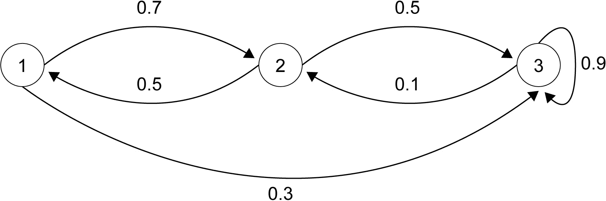
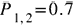
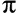
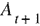
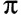
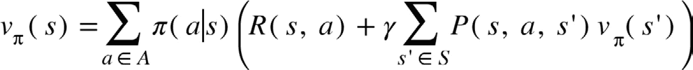
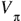
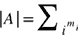
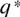

# 第二章：2. 马尔可夫决策过程与贝尔曼方程

概述

本章将更深入地探讨强化学习背后的理论。我们将涵盖马尔可夫链、马尔可夫奖励过程和马尔可夫决策过程的内容。我们将学习状态值和动作值的概念，以及如何通过贝尔曼方程计算这些量。到本章结束时，您将能够使用线性编程方法求解马尔可夫决策过程。

# 介绍

在上一章中，我们研究了**强化学习**（**RL**）的主要元素。我们将智能体描述为一个能够感知环境状态并通过修改环境状态来实现目标的实体。智能体通过策略进行行为，策略代表其行为方式，而智能体选择动作的方式则基于环境状态。在上一章的后半部分，我们介绍了 Gym 和 Baselines，这两个 Python 库分别简化了环境表示和算法实现。

我们提到，强化学习将问题视为**马尔可夫决策过程**（**MDP**），但没有深入细节，也没有给出正式的定义。

本章将正式描述 MDP 的定义、特性和属性。在面对强化学习（RL）中的新问题时，我们必须确保该问题能够形式化为 MDP；否则，应用强化学习技术是不可行的。

在正式定义 MDP 之前，我们需要理解**马尔可夫链**（**MCs**）和**马尔可夫奖励过程**（**MRPs**）。MCs 和 MRPs 是 MDP 的特定情况（简化版本）。MC 只关注状态转移，不建模奖励和动作。考虑经典的蛇梯游戏，其中下一步动作完全依赖于骰子上显示的数字。MRPs 则在状态转移中也包含了奖励成分。MRPs 和 MCs 有助于逐步理解 MDP 的特性。我们将在本章后面介绍 MCs 和 MRPs 的具体示例。

本章除了介绍马尔可夫决策过程（MDP）外，还介绍了状态值函数和动作值函数的概念，这些概念用于评估一个状态对于智能体的好坏以及在给定状态下采取的动作的好坏。状态值函数和动作值函数是用于解决实际问题的算法的构建模块。状态值函数和动作值函数的概念与智能体的策略和环境动态密切相关，正如我们将在本章后面学到的那样。

本章的最后部分介绍了两个**贝尔曼方程**，即**贝尔曼期望方程**和**贝尔曼最优性方程**。这些方程在强化学习中有助于评估智能体的行为，并找到一个能够最大化智能体在 MDP 中表现的策略。

在本章中，我们将通过一些 MDP 的例子进行实践，比如学生 MDP 和 Gridworld。我们将使用 Python、SciPy 和 NumPy 实现本章中解释的求解方法和方程。

# 马尔可夫过程

在前一章中，我们描述了强化学习（RL）循环：智能体观察环境状态的表示，通过行动与环境互动，并根据行动和环境状态获得奖励。这个互动过程称为 MDP。在这一节中，我们将从 MDP 的最简单形式——马尔可夫链（MC）开始，理解什么是 MDP。在描述不同类型的 MDP 之前，有必要将所有这些过程的基础性质——马尔可夫性质——形式化。

## 马尔可夫性质

让我们从两个例子开始，帮助我们理解什么是马尔可夫性质。考虑一个魔方。当将解魔方的任务形式化为强化学习任务时，我们可以将环境状态定义为魔方的状态。智能体可以执行相应的动作来旋转魔方的面。这些动作会导致状态转移，改变魔方的状态。在这里，历史并不重要——也就是说，决定当前状态的动作序列——因为它不会影响下一个状态。当前状态和当前行动是唯一影响未来状态的因素：


图 2.1：魔方表示

看看上面的图，假设当前环境状态是标记为`Present`的立方体。当前状态可以通过左边标记为`Past #1`和`Past #2`的两个状态到达，并且使用两个不同的动作（用黑色箭头表示）。通过将左边的面旋转向下，在当前状态下，我们得到右边的未来状态，标记为`Future`。在这种情况下，下一个状态与过去无关，因为只有当前状态和行动决定了它。过去的状态无关紧要，不管是`Past #1`还是`Past #2`，我们最终都会到达相同的未来状态。

现在我们再考虑一个经典的例子：Breakout 游戏。

Breakout 是一个经典的 Atari 游戏。在这个游戏中，屏幕顶部有一层砖块；目标是使用球打破砖块，同时不让球触碰到屏幕底部。玩家只能水平移动挡板。当将 Breakout 游戏形式化为一个强化学习任务时，我们可以将环境状态定义为某一时刻的图像像素。智能体可以选择三种可能的动作："左"、"右"和"无"，分别对应挡板的移动。

在这里，与魔方的例子有所不同。*图 2.2* 直观地解释了这个区别。如果我们仅使用当前帧表示环境状态，那么未来不仅仅由当前状态和当前动作决定。我们可以通过观察球来轻松地可视化这个问题。

在*图 2.2*的左侧部分，我们可以看到两个可能的过去状态，它们都导致相同的当前状态。通过箭头表示球的运动。在这两种情况下，代理的动作都是“左”。

在图的右侧部分，我们有两个可能的未来状态，`未来 #1`和`未来 #2`，它们从当前状态开始并执行相同的动作（“左”动作）。

仅通过观察当前状态，我们无法确定下一个未来状态是哪一个，因为我们无法推断出球的运动方向，它是朝着屏幕的顶部还是底部。我们需要了解历史，即需要知道两个前一个状态中的哪一个是真正的前一个状态，才能理解下一个状态将是什么。

在这种情况下，未来状态并不独立于过去：

注意

注意，箭头实际上并不存在于环境状态中。我们在图框中绘制它是为了方便展示。


图 2.2：雅达利游戏表示

在魔方的例子中，当前状态包含了足够的信息，结合当前的动作，可以确定下一个状态。而在雅达利的例子中，这并不成立。当前状态并不包含一个至关重要的信息：运动成分。在这种情况下，我们不仅需要当前状态，还需要过去的状态来确定下一个状态。

马尔可夫性质恰好用数学术语解释了两个例子之间的区别。马尔可夫性质表明“在给定当前状态的情况下，未来与过去无关。”

这意味着未来状态仅依赖于当前状态，当前状态是唯一影响未来状态的因素，我们可以忽略过去的状态。马尔可夫性质可以通过以下方式形式化：


图 2.3：马尔可夫性质的表达式

给定当前状态，下一个状态的概率等于给定状态历史下下一个状态的概率。这意味着过去的状态对下一个状态分布没有影响。

换句话说，要描述下一个状态的概率分布，我们只需要当前状态中的信息。几乎所有的强化学习（RL）环境，作为马尔可夫决策过程（MDP），都假设马尔可夫性质成立。在设计 RL 任务时，我们需要记住这一性质；否则，主要的 RL 假设将不再成立，导致算法失败。

注意

在统计学中，术语“给定”意味着概率受某些信息的影响。换句话说，概率函数依赖于一些其他信息。

大多数情况下，马尔可夫性质成立；然而，也有一些情况需要我们设计环境状态，以确保下一个状态与过去的状态相互独立。这正是《Breakout》游戏中的情况。为了恢复马尔可夫性质，我们可以将状态定义为多个连续帧，这样就可以推断球的方向。请参见以下图示：


图 2.4：Breakout 的马尔可夫状态

如前图所示，状态由三个连续的帧表示。

注意

你可以使用其他技巧来恢复马尔可夫性质。其中一种技巧是使用作为**循环神经网络**（**RNN**）表示的策略。通过使用 RNN，代理在确定当前行动时，也可以考虑过去的状态。本书后续将讨论将 RNN 作为 RL 策略的使用。

在 MDP 的背景下，给定当前状态下一个状态的概率， 被称为过渡函数。

如果状态空间是有限的，由 *N* 个状态组成，我们可以将为每一对状态计算出的过渡函数排列在一个 N x N 的矩阵中，其中所有列的和为 1，因为我们是在对过渡函数元素的概率分布求和：


图 2.5：过渡概率矩阵

行表示源状态，列表示目标状态。

概率矩阵总结了过渡函数。它可以按以下方式读取： 是从状态  开始，落入状态  的概率。

## 马尔可夫链

马尔可夫链（MC），或者简而言之，马尔可夫过程，被定义为状态空间  和过渡函数  的元组。状态空间与过渡函数一起定义了一个无记忆的随机状态序列，，满足马尔可夫性质。从马尔可夫过程中的一个样本简单来说就是一系列状态，这在 RL 上下文中也被称为一个回合：



图 2.6：具有三个状态的马尔可夫链

考虑前述的 MC。正如您所见，我们有三个用圆圈表示的状态。针对连接不同状态的边缘报告的概率函数被评估为状态对。查看从每个状态开始的边缘，我们可以看到与每个边缘相关联的概率之和为 1，因为它定义了概率分布。对于未通过边缘连接的一对状态的转移函数为 0。

转移函数可以按矩阵方式排列，如下所示：


图 2.7：图 2.6 中 MC 的转移矩阵

从编程角度来看，转移函数的矩阵形式非常方便，因为它使我们能够轻松进行计算。

## 马尔可夫奖励过程

MRP 是具有与状态转换相关联的值的 MC，称为奖励。奖励函数评估从一个状态转移到另一个状态的实用性。

MRP 是满足  的元组，使以下条件成立：

+   S 是有限状态集。

+   P 是转移概率，其中  是从状态  过渡到状态  的概率。

+   R 是奖励函数，其中  是从状态  过渡到状态  的奖励。

+    是与未来奖励相关的折扣因子， ：


图 2.8：MRP 的一个示例

正如您在前面的图中所见，奖励由 `r` 表示，并与状态转换相关联。

让我们考虑图 2.8 中的 MRP。最高奖励（`10`）与转换 *1->3* 和自环 *3->3* 相关联。最低奖励与转换 *3->2* 相关，等于 `-1`。

在 MRP 中，可以计算折扣回报作为折扣奖励的累积和。

在这种情况下，我们使用术语“轨迹”或“剧集”来表示过程遍历的状态序列。

现在让我们计算给定轨迹的折扣回报；例如，带有折扣因子  的 1-2-3-3-3 轨迹。

折扣回报如下：


图 2.9：1-2-3-3-3 轨迹的折扣回报

我们还可以计算不同轨迹的折扣回报，例如 1-3-3-3-3：


图 2.10：1-3-3-3-3 轨迹的折扣回报

在此示例中，第二个轨迹比第一个轨迹更方便，具有更高的回报。这意味着相应的路径比第一个路径更好。回报并不代表轨迹的绝对特征；它表示相对于其他轨迹的相对优越性。不同 MRP 的轨迹回报不能相互比较。

考虑由 N 个状态组成的 MRP，奖励函数可以表示为一个 N x N 矩阵，类似于转移矩阵：


图 2.11：奖励矩阵

在行中，我们表示源状态，在列中，我们表示目标状态。

奖励矩阵可以按如下方式读取：是与状态转移相关的奖励，。

对于*图 2.11*中的示例，按矩阵排列的奖励函数如下所示：


图 2.12：MRP 示例的奖励矩阵

当奖励未指定时，我们假设奖励为`0`。

使用 Python 和 NumPy，我们可以以这种方式表示转移矩阵：

```py
n_states = 3
P = np.zeros((n_states, n_states), np.float)
P[0, 1] = 0.7
P[0, 2] = 0.3
P[1, 0] = 0.5
P[1, 2] = 0.5
P[2, 1] = 0.1
P[2, 2] = 0.9
```

类似地，奖励矩阵可以这样表示：

```py
R = np.zeros((n_states, n_states), np.float)
R[0, 1] = 1
R[0, 2] = 10
R[1, 0] = 0
R[1, 2] = 1
R[2, 1] = -1
R[2, 2] = 10
```

我们现在可以引入 MRP 的价值函数和贝尔曼方程的概念。

### MRP 的价值函数和贝尔曼方程

MRP 中的**价值函数**评估给定状态的长期价值，表示从该状态出发的预期回报。通过这种方式，价值函数表达了对状态的偏好。与另一个状态相比，具有更高价值的状态代表着一个更好的状态——换句话说，一个在其中待着更有回报的状态。

在数学上，价值函数的形式化表示如下：


图 2.13：价值函数的表达式

状态的价值函数表示为。方程右侧的期望是回报的期望值，表示为，考虑到当前状态恰好等于状态——我们正在评估该状态的价值函数。期望是根据转移函数计算的。

通过考虑即时奖励和后继状态的折扣价值函数，价值函数可以分解为两部分：


图 2.14：价值函数的分解

最后一方程是一个递归方程，称为**MRP 的贝尔曼期望方程**，其中给定状态的价值函数依赖于后继状态的价值函数。

为了突出方程对转移函数的依赖性，我们可以将期望重写为可能状态的加权求和，权重由转移概率决定。我们使用  定义状态  中的奖励函数期望，也可以将其定义为平均奖励。

我们可以将  写成以下几种形式：


图 2.15：状态 s 中奖励函数期望的表达式

我们现在可以以更便捷的方式重写价值函数：


图 2.16：状态 s 中价值函数期望的修正表达式

这个表达式可以转换为如下的代码：

```py
R_expected = np.sum(P * R, axis=1, keepdims=True)
```

在之前的代码中，我们通过逐元素相乘概率矩阵和奖励矩阵，计算了每个状态的期望奖励。请注意，`keepdims` 参数是必须的，用来获得列向量。

这种形式使得我们可以使用矩阵表示法重写贝尔曼方程：


图 2.17：贝尔曼方程的矩阵形式

在这里，`V` 是包含状态值的列向量， 是每个状态的期望奖励，`P` 是转移矩阵：


图 2.18：贝尔曼方程的矩阵形式

使用矩阵表示法，也可以求解贝尔曼方程，得到与每个状态关联的 `V` 值函数：


图 2.19：使用贝尔曼方程的价值函数

在这里，`I` 是大小为 N x N 的单位矩阵，`N` 是 MRP 中的状态数量。

### 使用 SciPy 求解线性方程组

SciPy ([`github.com/scipy/scipy`](https://github.com/scipy/scipy)) 是一个基于 NumPy 的用于科学计算的 Python 库。SciPy 在 `linalg` 模块（线性代数）中提供了用于求解方程组的有用方法。

特别地，我们可以使用 `linalg.solve(A, b)` 来求解形式为  的方程组。这正是我们可以用来求解系统  的方法，其中  是矩阵 `A`，`V` 是变量向量 `x`，而  是向量 `b`。

转换为代码时，应该如下所示：

```py
gamma = 0.9
A = np.eye(n_states) - gamma * P
B = R_states
# solve using scipy linalg solve
V = linalg.solve(A, B)
```

如你所见，我们已经声明了贝尔曼方程的各个元素，并使用 `scipy.linalg` 来计算 `value` 函数。

现在，让我们通过完成一个练习来进一步加强我们的理解。

## 练习 2.01：在 MRP 中找到值函数

在这个练习中，我们将通过找到以下图中 MRP 的值函数来解决 Bellman 期望方程。我们将使用`scipy`和`linalg`模块来解决前一节中提出的线性方程。我们还将演示如何定义转移概率矩阵以及如何计算每个状态的预期奖励：


图 2.20：具有三个状态的 MRP 示例

1.  导入所需的 NumPy 和 SciPy 包：

    ```py
    import numpy as np
    from scipy import linalg
    ```

1.  定义转移概率矩阵：

    ```py
    # define the Transition Probability Matrix
    n_states = 3
    P = np.zeros((n_states, n_states), np.float)
    P[0, 1] = 0.7
    P[0, 2] = 0.3
    P[1, 0] = 0.5
    P[1, 2] = 0.5
    P[2, 1] = 0.1
    P[2, 2] = 0.9
    print(P)
    ```

    您应该获得以下输出：

    ```py
    array([[0\. , 0.7, 0.3],
           [0.5, 0\. , 0.5],
           [0\. , 0.1, 0.9]])
    ```

    让我们检查矩阵的正确性。从状态 1 到状态 1 的转移概率是。由于状态 1 没有自环，这是正确的。从状态 1 到状态 2 的转移概率是，因为它是与边缘*1->2*相关联的概率。这可以应用于转移矩阵的所有元素。请注意，在这里，转移矩阵的元素按状态而不是矩阵中的位置索引。这意味着对于，我们指的是矩阵的 0,0 元素。

1.  检查所有列的总和是否完全等于`1`，作为概率矩阵：

    ```py
    # the sum over columns is 1 for each row being a probability matrix
    assert((np.sum(P, axis=1) == 1).all())
    ```

    `assert`函数用于确保特定条件返回`true`。在这种情况下，`assert`函数将确保所有列的总和恰好为`1`。

1.  我们可以使用奖励矩阵和转移概率矩阵来计算每个状态的预期即时奖励：

    ```py
    # define the reward matrix
    R = np.zeros((n_states, n_states), np.float)
    R[0, 1] = 1
    R[0, 2] = 10
    R[1, 0] = 0
    R[1, 2] = 1
    R[2, 1] = -1
    R[2, 2] = 10
    """
    calculate expected reward for each state by multiplying the probability matrix for each reward
    """
    #keepdims is required to obtain a column vector
    R_expected = np.sum(P * R, axis=1, keepdims=True)
    # The matrix R_expected
    R_expected
    ```

    您应该获得以下列向量：

    ```py
    array([[3.7],
           [0.5],
           [8.9]])
    ```

    `R_expected`向量是每个状态的预期即时奖励。状态 1 的预期奖励为`3.7`，这恰好等于*0.7 * 1 + 0.3 * 10*。状态 2 和状态 3 也适用相同的逻辑。

1.  现在我们需要定义`gamma`，并且准备将 Bellman 方程作为线性方程求解，。我们有和：

    ```py
    # define the discount factor
    gamma = 0.9
    # Now it is possible to solve the Bellman Equation
    A = np.eye(n_states) - gamma * P
    B = R_expected
    # solve using scipy linalg
    V = linalg.solve(A, B)
    V
    ```

    您应该获得以下输出：

    ```py
    array([[65.540732  ],
           [64.90791027],
           [77.5879575 ]])
    ```

    向量`V`表示每个状态的值。状态 3 具有最高的值（`77.58`）。这意味着状态 3 提供了最高的预期回报。在这个 MRP 中，状态 3 是最佳状态。直觉上，状态 3 是最佳状态，因为转移高概率（0.9）会将代理带到同一状态，并且与转移相关联的奖励很高（+10）。

    注意

    要访问此特定部分的源代码，请参阅`packt.live/37o5ZH4`。

    您也可以在[`packt.live/3dU8cfW`](https://packt.live/3dU8cfW)上在线运行此示例。

在本练习中，我们通过为我们的玩具问题求解贝尔曼方程，找到 MRPs 的状态值。状态值定量描述了处于每个状态时的收益。我们通过转移概率矩阵和奖励矩阵来描述 MRP。这两个矩阵使我们能够求解与贝尔曼方程相关的线性系统。

注意

贝尔曼方程的计算复杂度是 `O(n³)`；它与状态数量的立方成正比。因此，只适用于小型 MRP。

在下一节中，我们将考虑一个可以执行动作的主动智能体，从而得出 MDP 的描述。

## 马尔可夫决策过程（Markov Decision Processes）

MDP 是带有决策的 MRP。在这种情况下，我们有一组可供智能体执行的动作，这些动作可以影响到下一个状态的转移概率。与 MRP 中转移概率仅依赖于环境状态不同，在 MDP 中，智能体可以执行影响转移概率的动作。通过这种方式，智能体成为框架中的主动实体，通过行动与环境互动。

严格来说，MDP 是一个元组， ，其中以下条件成立：

+    是状态集。

+    是动作集。

+    是奖励函数，。 是在执行动作 和处于状态时的期望奖励。

+    是转移概率函数，其中 是从当前状态出发，执行动作，并且到达状态的概率。

+    是与未来奖励相关的折扣因子，。

MRP 和 MDP 之间的区别在于，智能体可以选择一组动作来调节转移概率，从而提高进入良好状态的可能性。如果 MRP 和 MC 只是对马尔可夫过程的描述，而没有目标，那么 MDP 就包含了策略和目标的概念。在 MDP 中，智能体需要对采取何种行动做出决策，以最大化折扣后的回报：


图 2.21：学生 MDP

*图 2.21* 是一个代表大学生一天活动的 MDP 示例。共有六个可能的状态：`Class 1`、`Class 2`、`Class 3`、`Social`、`Bed` 和 `Pub`。状态之间的边表示状态转换。边上标注了动作和奖励，奖励用`r`表示。可能的动作有`Study`、`Social`、`Beer` 和 `Sleep`。初始状态由输入箭头表示，为`Class 1`。学生的目标是在每个状态中选择最佳动作，从而最大化他们的回报。

在接下来的段落中，我们将讨论这个 MDP 的一些可能策略。

一名学生代理从`Class 1`开始。他们可以决定学习并完成所有课程。每次学习的决策都会带来一个小的负奖励，`-2`。如果学生在`Class 3`之后决定睡觉，他们将进入吸收状态`Bed`，并获得一个高的正奖励`+10`。这代表了日常生活中非常常见的情况：为了获得未来更高的回报，你必须牺牲一些即时的奖励。在这种情况下，通过决定在`Class 1`和`Class 2`学习，虽然获得了负奖励，但在`Class 3`之后通过高额的正奖励得到了补偿。

这个 MDP 中另一种可能的策略是在`Class 1`状态后立刻选择`Social`行动。这个行动带来一个小的负奖励。学生可以继续做同样的动作，每次都会获得相同的奖励。学生还可以选择从`Social`状态（注意，`Social`既是一个状态，也是一个行动）回到`Class 1`继续学习。在`Class 1`感到内疚时，学生可以决定继续学习。学习一会儿后，他们可能会感到疲倦并决定稍微休息，最终进入`Bed`状态。执行了`Social`行动后，代理已累积了负回报。

让我们评估一下这个例子的可能策略。我们假设折扣因子为，即无折扣：

+   策略：优秀学生。优秀学生策略是第一个描述的策略。假设学生最终会回到`Class 1`，他们可以执行以下动作：`Study`、`Study`、`Study`。因此，相关的状态序列是`Class 1`、`Class 2`、`Class 3`和`Sleep`。因此，相关的回报是沿着轨迹奖励的总和：

图 2.22：优秀学生的回报

+   策略：社交学生。社交学生策略是第二种描述的策略。学生可以执行以下动作：`Social`、`Social`、`Social`、`Study`、`Study` 和 `Sleep`。因此，相关的状态序列是`Class 1`、`Social`、`Social`、`Social`、`Class 1`、`Class 2` 和 `Bed`。在这种情况下，相关的回报如下：

图 2.23：社交学生的回报

通过查看相关回报，我们可以看到，优秀学生策略相比社交学生策略具有更高的回报，因此是一个更好的策略。

你此时可能会问，智能体如何决定采取哪个动作以最大化回报呢？为了回答这个问题，我们需要引入两个有用的函数：状态值函数和动作值函数。

### 状态值函数和动作值函数

在 MDP 的背景下，我们可以通过评估在某个给定状态下有多好的状态来定义一个函数。然而，我们应该考虑到智能体的策略，因为策略定义了智能体的决策并调节了轨迹上的概率，即未来状态的序列。因此，值函数依赖于智能体的策略，。

`s`并遵循策略，：


图 2.24：状态值函数的定义

在 MDP（马尔科夫决策过程）中，我们还希望定义在给定状态下执行某个动作的收益。这个函数称为动作值函数。

**动作值函数**，，（也称为 q 函数），可以定义为从状态开始，执行动作并遵循策略时的期望回报：


图 2.25：动作值函数的定义

如我们将在书中稍后学习的那样，状态值函数提供的信息仅在评估策略时有用。动作值函数则提供关于控制的信息，也就是在状态中选择动作的信息。

假设我们知道 MDP 的动作值函数。如果我们处于给定状态，哪个动作是最佳选择？

好的，最佳动作是产生最高折扣回报的动作。动作值函数衡量的是从某个状态开始并执行一个动作所获得的折扣回报。通过这种方式，动作值函数为状态中的动作提供了一个排序（或偏好）。要执行的最佳动作是具有最高 q 值的动作：


图 2.26：使用动作值函数选择最佳动作

请注意，在这种情况下，我们只是对当前策略进行一步优化；也就是说，我们可能会在假设后续动作遵循当前策略的前提下，修改某个给定状态下的动作。如果我们这样做，我们不会在这个状态下选择最佳动作，而是选择在此策略下的最佳动作。

就像在 MRP 中一样，在 MDP 中，状态值函数和动作值函数也可以递归地分解：


图 2.27：MDP 中的状态值函数


图 2.28：MDP 中的动作值函数

这些方程被称为 MDP 的贝尔曼期望方程。

贝尔曼期望方程是递归的，因为给定状态的状态值函数依赖于另一个状态的状态值函数。对于动作值函数来说也是如此。

在动作值函数方程中，我们正在评估的动作，，是一个任意的动作。这个动作不是从策略定义的动作分布中获取的。相反，接下来一步采取的动作，，是根据在状态下由动作分布定义的。

让我们重写状态值函数和动作值函数，以突出代理策略的贡献，：



图 2.29：突出显示策略贡献的状态值函数

让我们分析方程的两个项：

+   ：这个项是给定代理策略定义的动作分布时即时奖励的期望值。每个状态-动作对的即时奖励都会根据给定状态下的动作概率加权，这个概率定义为。

+   是给定转移函数定义的状态分布下，状态值函数的折扣期望值。请注意，这里的动作，`a`，是由代理的策略定义的。作为期望值，每个状态值，，都会根据从状态到状态的转移概率加权，给定动作。这由表示。

动作值函数可以重写，以突出它对转移函数和值函数的依赖：


图 2.30：动作值函数，突出显示下一个状态的转移函数和值函数的依赖性

因此，动作值函数是立即奖励和后继状态的状态值函数在环境动态（`P`）下的期望值之和。

通过比较这两个方程，我们可以得到状态值和动作值之间的重要关系：


图 2.31：基于动作值函数的状态值函数表达式

换句话说，状态值状态 ，在策略下，

图 2.32：状态值函数的矩阵形式

有一个直接的解法，如下所示：


图 2.33：状态值的直接解法

在这里，你可以看到以下内容：

+   （列向量）是由策略引导的每个状态的即时奖励的期望值：


图 2.34：期望即时奖励

+    是每个状态的状态值列向量。

+    是基于动作分布的转移矩阵。它是一个 矩阵，其中  是 MDP 中状态的数量。给定两个状态  和 ，我们得到以下内容：

图 2.35：基于动作分布的转移矩阵

因此，转移矩阵是从状态  到状态  的转移概率，这取决于策略选择的动作和由 MDP 定义的转移函数。

按照相同的步骤，我们也可以找到动作值函数的矩阵形式：


图 2.36：动作值函数的矩阵形式方程

这里， 是一个列向量，包含有 个条目。 是即时奖励的向量，形状与 相同。 是转移矩阵，形状为 行和 列。 表示每个状态的状态值。

 和  的显式形式如下：


图 2.37：动作值函数和转移函数的显式矩阵形式

在这里，状态  相关的动作数量由  表示，因此是 。MDP 的动作数量是通过对每个状态关联的动作数量求和得出的。

现在，让我们实现对学生 MDP 示例的状态-和动作-值函数的理解。在这个例子中，我们将使用 *图 2.21* 中的状态值函数和动作值函数计算。我们将考虑一个尚未决定的学生，也就是对于每个状态都有随机策略的学生。这意味着每个状态的每个动作的概率正好是 0.5。

我们将在接下来的示例中考察一个近视学生的不同情况。

按如下方式导入所需的库：

```py
import numpy as np
from scipy import linalg
```

定义环境属性：

```py
n_states = 6
# transition matrix together with policy
P_pi = np.zeros((n_states, n_states))
R = np.zeros_like(P_pi)
```

`P_pi` 包含了转移矩阵和代理的策略的贡献。`R` 是奖励矩阵。

我们将使用以下状态编码：

+   `0`: 类别 1

+   `1`: 类别 2

+   `2`: 类别 3

+   `3`: 社交

+   `4`: 酒吧

+   `5`: 床

按照随机策略创建转移矩阵：

```py
P_pi[0, 1] = 0.5
P_pi[0, 3] = 0.5
P_pi[1, 2] = 0.5
P_pi[1, 5] = 0.5
P_pi[2, 4] = 0.5
P_pi[2, 5] = 0.5
P_pi[4, 5] = 0.5
P_pi[4, 0] = 0.5
P_pi[3, 0] = 0.5
P_pi[3, 3] = 0.5
P_pi[5, 5] = 1
```

打印 `P_pi`：

```py
P_pi
```

输出将如下所示：

```py
array([[0\. , 0.5, 0\. , 0.5, 0\. , 0\. ],
       [0\. , 0\. , 0.5, 0\. , 0\. , 0.5],
       [0\. , 0\. , 0\. , 0\. , 0.5, 0.5],
       [0.5, 0\. , 0\. , 0.5, 0\. , 0\. ],
       [0.5, 0\. , 0\. , 0\. , 0\. , 0.5],
       [0\. , 0\. , 0\. , 0\. , 0\. , 1\. ]])
```

创建奖励矩阵 `R`：

```py
R[0, 1] = -2
R[0, 3] = -1
R[1, 2] = -2
R[1, 5] = 0
R[2, 4] = 15
R[2, 5] = 10
R[4, 5] = 10
R[4, 0] = -10
R[3, 3] = -1
R[3, 0] = -3
```

打印 `R`：

```py
R
```

输出将如下所示：

```py
array([[  0.,  -2.,   0.,  -1.,   0.,   0.],
       [  0.,   0.,  -2.,   0.,   0.,   0.],
       [  0.,   0.,   0.,   0.,  15.,  10.],
       [ -3.,   0.,   0.,  -1.,   0.,   0.],
       [-10.,   0.,   0.,   0.,   0.,  10.],
       [  0.,   0.,   0.,   0.,   0.,   0.]])
```

作为一个概率矩阵，`P_pi` 的所有列的总和应为 1：

```py
# check the correctness of P_pi
assert((np.sum(P_pi, axis=1) == 1).all())
```

应该验证该断言。

我们现在可以使用 `R` 和 `P_pi` 来计算每个状态的期望奖励：

```py
# expected reward for each state
R_expected = np.sum(P_pi * R, axis=1, keepdims=True)
R_expected
```

期望奖励，在这种情况下如下所示：

```py
array([[-1.5],
       [-1\. ],
       [12.5],
       [-2\. ],
       [ 0\. ],
       [ 0\. ]])
```

`R_expected` 向量包含每个状态的期望即时奖励。

我们准备好求解贝尔曼方程，以找出每个状态的值。为此，我们可以使用 `scipy.linalg.solve`：

```py
# Now it is possible to solve the Bellman Equation
gamma = 0.9
A = np.eye(n_states, n_states) - gamma * P_pi
B = R_expected
# solve using scipy linalg
V = linalg.solve(A, B)
V
```

向量 `V` 包含以下值：

```py
array([[-1.78587056],
       [ 4.46226255],
       [12.13836121],
       [-5.09753046],
       [-0.80364175],
       [ 0\.       ]])
```

这是状态值的向量。状态 `0` 的值为 `-1.7`，状态 `1` 的值为 `4.4`，以此类推：


](img/B16182_02_38.jpg)

图 2.38：学生 MDP 的状态值 

让我们检查一下结果是如何随着  的变化而变化的，这是为近视随机学生假设的条件：

```py
gamma = 0.
A = np.eye(n_states, n_states) - gamma * P_pi
B = R_expected
# solve using scipy linalg
V_gamma_zero = linalg.solve(A, B)
V_gamma_zero
```

输出将如下所示：

```py
array([[-1.5],
       [-1\. ],
       [12.5],
       [-2\. ],
       [ 0\. ],
       [ 0\. ]])
```

其视觉表示如下：


](img/B16182_02_39.jpg)

图 2.39：学生 MDP 的状态值 γ=0

如你所见，使用 ，每个状态的值正好等于根据策略计算出的期望即时奖励。

现在我们可以计算动作值函数。我们需要使用一个不同形式的即时奖励，使用一个形状为  的矩阵。每一行对应一个状态-动作对，值为该对的即时奖励：


](img/B16182_02_40.jpg)

图 2.40：即时奖励

按如下方式将其转换为代码：

```py
R_sa = np.zeros((n_states*2, 1))
R_sa[0] = -2 # study in state 0
R_sa[1] = -1 # social in state 0
R_sa[2] = -2 # study in state 1
R_sa[3] = 0 # sleep in state 1
R_sa[4] = 10 # sleep in state 2
R_sa[5] = +15 # beer in state 2
R_sa[6] = -1 # social in state 3 (social)
R_sa[7] = -3 # study in state 3 (social)
R_sa[8] = 10 # sleep in state 4 (pub)
R_sa[9] = -10 # study in state 4 (pub)
R_sa.shape
```

输出将如下所示：

```py
(10, 1)
```

我们现在需要定义学生 MDP 的转移矩阵。转移矩阵包含了从一个状态和一个动作出发，到达给定状态的概率。在行中，我们有源状态和动作，在列中，我们有目标状态：


图 2.41：学生 MDP 的转移矩阵

当将概率转移矩阵转换为代码时，您应该看到以下内容：

```py
# Transition Matrix (states x action, states)
P = np.zeros((n_states*2, n_states))
P[0, 1] = 1 # study in state 0 -> state 1
P[1, 3] = 1 # social in state 0 -> state 3
P[2, 2] = 1 # study in state 1 -> state 2
P[3, 5] = 1 # sleep in state 1 -> state 5 (bed)
P[4, 5] = 1 # sleep in state 2 -> state 5 (bed)
P[5, 4] = 1 # beer in state 2 -> state 4 (pub)
P[6, 3] = 1 # social in state 3 -> state 3 (social)
P[7, 0] = 1 # study in state 3 -> state 0 (Class 1)
P[8, 5] = 1 # sleep in state 4 -> state 5 (bed)
P[9, 0] = 1 # study in state 4 -> state 0 (class 1)
```

我们现在可以使用来计算动作-价值函数：

```py
gamma = 0.9
Q_sa_pi = R_sa + gamma * P @ V
Q_sa_pi
```

动作-价值向量包含以下值：

```py
array([[  2.01603629],
       [ -5.58777741],
       [  8.92452509],
       [  0\.        ],
       [ 10\.        ],
       [ 14.27672242],
       [ -5.58777741],
       [ -4.60728351],
       [ 10\.        ],
       [-11.60728351]])
```

`Q_sa_pi`是动作-价值向量。对于每一对状态-动作，我们都有该状态下的动作价值。动作-价值函数在下图中表示。动作价值通过表示：


图 2.42：学生 MDP 的动作值

我们现在感兴趣的是为每个状态提取最佳动作：

```py
"""
reshape the column so that we obtain a vector with shape (n_states, n_actions)
"""
n_actions = 2
Q_sa_pi2 = np.reshape(Q_sa_pi, (-1, n_actions))
Q_sa_pi2
```

输出将如下所示：

```py
array([[  2.01603629,  -5.58777741],
       [  8.92452509,   0\.        ],
       [ 10\.        ,  14.27672242],
       [ -5.58777741,  -4.60728351],
       [ 10\.        , -11.60728351]])
```

通过执行`argmax`函数，我们可以获得每个状态中最佳动作的索引：

```py
best_actions = np.reshape(np.argmax(Q_sa_pi2, -1), (-1, 1))
best_actions
```

`best_actions`向量包含以下值：

```py
array([[0],
       [0],
       [1],
       [1],
       [0]])
```

最佳动作可以如下可视化：


图 2.43：学生 MDP 最佳动作

在*图 2.43*中，虚线箭头表示每个状态中的最佳动作。我们可以通过查看每个状态中最大化`q`函数的动作，轻松找到它们。

从动作-价值计算中，我们可以看到当时，动作-价值函数等于期望的即时奖励：

```py
Q_sa_pi_gamma_zero = R_sa
Q_sa_pi_gamma_zero
```

输出将如下所示：

```py
array([[ -2.],
       [ -1.],
       [ -2.],
       [  0.],
       [ 10.],
       [ 15.],
       [ -1.],
       [ -3.],
       [ 10.],
       [-10.]])
```

使用`n_actions = 2`重新排列列，如下所示：

```py
n_actions = 2
Q_sa_pi_gamma_zero2 = np.reshape(Q_sa_pi_gamma_zero, \
                                 (-1, n_actions))
Q_sa_pi_gamma_zero2
```

输出将如下所示：

```py
array([[ -2.,  -1.],
       [ -2.,   0.],
       [ 10.,  15.],
       [ -1.,  -3.],
       [ 10., -10.]])
```

通过执行`argmax`函数，我们可以获得每个状态中最佳动作的索引，如下所示：

```py
best_actions_gamma_zero = np.reshape(np.argmax\
                                     (Q_sa_pi_gamma_zero2, -1), \
                                     (-1, 1))
best_actions_gamma_zero
```

输出将如下所示：

```py
array([[1],
       [1],
       [1],
       [0],
       [0]])
```

状态图可以如下可视化：


图 2.44：学生 MDP 的最佳动作和动作-价值函数，当

有趣的是，最佳动作是如何仅通过修改折扣因子发生变化的。在这里，代理从`Class 1`开始时，最佳动作是`Social`，因为它比`Study`动作提供了更大的即时奖励。`Social`动作将代理带到状态`Social`。在这里，代理能做的最好的事情是重复`Social`动作，累积负奖励。

在这个例子中，我们学习了如何使用`scipy.linalg.solve`计算状态-价值函数，以及如何使用矩阵形式计算动作-价值函数。我们注意到，状态值和动作值都依赖于折扣因子。

在下一节中，我们将阐明贝尔曼最优方程，它使得通过找到最佳策略和最佳状态值来解决 MDP 成为可能。

### 贝尔曼最优方程

自然地，我们会问是否有可能为策略定义一个顺序，来判断一个策略是否优于另一个策略。结果证明，值函数提供了一个对策略的排序。

策略可以被认为优于或等于策略，如果该策略的期望回报在所有状态下大于或等于的期望回报：


](img/B16182_02_45.jpg)

图 2.45：策略的偏好

在这个例子中，我们用状态值函数替代了在一个状态中的期望回报，使用了状态值函数的定义。

根据前面的定义，最优策略是指在所有状态下，优于或等于其他所有策略的策略。最优状态值函数，，和最优动作值函数，，简单来说，就是与最佳策略相关联的函数：


](img/B16182_02_46.jpg)

图 2.46：最优状态值函数


](img/B16182_02_47.jpg)

图 2.47：最优动作值函数

MDP 的一些重要属性如下：

+   每个状态下总是至少存在一个最优（确定性）策略，最大化状态值函数。

+   所有最优策略共享相同的最优状态值函数。

如果我们知道最优状态值函数和最优动作值函数，则 MDP 已被解决。

通过知道最优值函数，可以通过最大化来找到 MDP 的最优策略。我们可以按以下方式定义与最优动作值函数相关联的最优策略：


](img/B16182_02_48.jpg)

图 2.48：与最优动作值函数相关联的最优策略

正如你所看到的，这个策略实际上是在告诉我们，在动作能最大化该状态的动作值函数时，以 1 的概率（本质上是确定性的）执行该动作。换句话说，我们需要采取能保证最高折扣回报的动作，遵循最优策略。所有其他子最优动作的概率为 0，因此基本上是从不执行的。请注意，这种方式得到的策略是确定性的，而不是随机性的。

分析这个结果，我们揭示了两个重要事实：

+   对于任何 MDP，总是存在一个确定性的最优策略。

+   最优策略由最优动作-值函数的知识决定。

最优值函数与贝尔曼最优性方程相关。贝尔曼最优性方程表明，某一状态下的最优状态值函数等于该状态下最优动作-值函数的整体最大值：


图 2.49：贝尔曼最优性方程

使用动作-值函数的定义，我们可以将前面的方程展开为更显式的形式：


图 2.50：基于动作-值函数的贝尔曼最优性方程

前面的方程告诉我们，某一状态的最优值函数等于对所有动作的即时奖励的最大值，，加上折扣后的，即后继状态的期望最优值，，其中期望值由转移函数确定。

此外，最优动作-值函数具有显式的形式，被称为贝尔曼最优性方程，用于：


图 2.51：q 的贝尔曼最优性方程

通过使用与之间的关系，可以将此公式仅以的形式重写：

与之间的关系的贝尔曼最优性方程

](img/B16182_02_52.jpg)

图 2.52：使用与之间的关系的贝尔曼最优性方程

贝尔曼最优性方程对于表达了这样一个事实：最优状态值函数必须等于该状态下最佳动作的期望回报。类似地，贝尔曼最优性方程对于表达了这样一个事实：最优 q-函数必须等于即时奖励加上根据环境动态折扣后的下一个状态中最佳动作的回报。

### 求解贝尔曼最优性方程

由于存在最大化操作，贝尔曼最优性方程是非线性的。这意味着在一般情况下我们没有这些方程的封闭形式解。然而，存在许多迭代求解方法，我们将在接下来的部分和章节中进行分析。

主要方法包括值迭代、策略迭代、Q 学习和 SARSA，我们将在后续章节中学习这些方法。

## 求解 MDPs

现在我们已经充分理解了所有重要的概念和方程，接下来我们将开始求解实际的 MDP 问题。

### 算法分类

在考虑解决 MDP 的不同算法之前，理解算法家族及其优缺点对我们是有益的。了解主要的算法家族使我们能够根据任务选择正确的算法家族：


图 2.53：强化学习算法的分类

第一个主要区分是基于模型的算法和无模型的算法：

+   基于模型的算法需要了解环境的动态（模型）。这是一个很强的要求，因为环境模型通常是未知的。让我们考虑一个自动驾驶问题。在这里，了解环境动态意味着我们应该准确知道智能体的行为如何影响环境以及下一个状态的分布。这取决于许多因素：街道状况、天气条件、汽车特性等等。对于许多问题，动态是未知的、过于复杂的，或过于不准确，无法成功使用。尽管如此，动态提供了有益的信息来解决任务。

    当模型已知时（`模型利用`），基于模型的算法比其对手更受欢迎，因为它们的样本效率更高，需要更少的样本来学习良好的策略。

    在这些情况下，环境模型也可以是未知的；算法本身明确地学习环境模型（`模型学习`），并利用它来规划自己的行动。动态规划算法使用这些模型知识来执行自助式学习，即利用先前的估算来估算其他量。

+   无模型算法不需要环境模型。因此，这些类型的算法更适合用于现实世界的应用。请注意，这些算法可能会在内部构建一个环境表示，考虑到环境动态。然而，通常这个过程是隐式的，用户并不关注这些方面。

无模型算法也可以被归类为基于价值的算法或策略搜索算法。

### 基于价值的算法

基于价值的算法专注于学习动作价值函数和状态价值函数。学习价值函数是通过使用前面章节介绍的贝尔曼方程完成的。一个基于价值的算法示例是 Q 学习，其目标是学习动作价值函数，进而用于控制。深度 Q 网络是 Q 学习的扩展，其中使用神经网络来近似 q 函数。基于价值的算法通常是脱离策略的，这意味着它们可以重用之前收集的样本，这些样本是使用与当前正在优化的策略不同的策略收集的。这是一个非常强大的特性，因为它允许我们在样本方面获得更高效的算法。我们将在*第九章*中更详细地学习 Q 学习和深度 Q 网络，*什么是深度 Q 学习？*。

### 策略搜索算法

**策略搜索**（**PS**）方法直接探索策略空间。在 PS 中，强化学习问题被形式化为依赖于策略参数的性能度量最大化。你将在*第十一章*，*基于策略的强化学习方法*中更详细地学习 PS 方法和策略梯度。

### 线性规划

线性规划是一种优化技术，用于具有线性约束和线性目标函数的问题。目标函数描述了需要优化的数量。在强化学习（RL）的情况下，这个数量是所有状态的期望折扣回报，按初始状态分布加权，即在该状态开始一个回合的概率。

当起始状态恰好为 1 时，这简化为优化从初始状态开始的期望折扣回报。

线性规划是一种基于模型并利用模型的技术。因此，使用线性规划求解 MDP 需要对环境动态的完美知识，这转化为对转移概率矩阵的了解。通过使用线性规划，我们可以通过找到每个状态的最佳状态值来解决 MDP。从对状态值的了解中，我们可以推导出最优的动作值函数。通过这种方式，我们可以为代理找到一个控制策略，并最大化其在给定任务中的表现。

基本思想源自对策略排序的定义；我们希望通过最大化每个状态的价值，按初始状态分布加权，来找到状态价值函数，，并满足可行性约束：


](img/B16182_02_54.jpg)

图 2.54：求解 MDP 的线性规划公式

在这里，我们有个变量和个约束。变量是每个状态`S`中的值，，`s`为状态空间中的每个状态。

注意，最大化作用由约束承担，而我们需要最小化目标函数，否则，最优解会使所有变量的值无限大，。

约束基于这样的思想：一个状态的价值必须大于或等于即时奖励加上后继状态的折扣期望值。这对于所有状态和所有动作都必须成立。

由于变量和约束的数量庞大，线性规划技术仅适用于有限状态和有限动作的 MDP。

我们将使用以下符号：


](img/B16182_02_55.jpg)

图 2.55：线性规划符号

在前述表示法中，`c` 是目标函数的系数向量， 是上界约束的矩阵， 是关联的系数向量。

在 Python 中，SciPy 提供了 `linprog` 函数（在 `optimize` 模块中，`scipy.optimize.linprog`），该函数根据目标函数和约束条件优化线性规划。

该函数的签名为 `scipy.optimize.linprog(c, A_ub, b_ub)`。

为了使用上界重新表述问题，我们有以下内容：


](img/B16182_02_56.jpg)

图 2.56：使用上界的线性规划约束

注意

如需进一步了解线性规划在 MDP 中的应用，请参阅 *de Farias, D. P. (2002): 近似动态规划的线性规划方法：理论与应用* 一文：[`www.mit.edu/~pucci/discountedLP.pdf`](http://www.mit.edu/~pucci/discountedLP.pdf)。

让我们现在做一个简单的练习，以加深我们对线性规划的理解。

## 练习 2.02：使用线性规划确定 MDP 的最佳策略

本次练习的目标是使用线性规划求解下图中的 MDP。在这个 MDP 中，环境模型非常简单，转移函数是确定性的，由动作唯一决定。我们将使用线性规划找到代理所采取的最佳动作（即具有最大奖励的动作），从而确定环境的最佳策略：


](img/B16182_02_57.jpg)

图 2.57：具有三个状态和两个动作的简单 MDP

线性规划的变量是状态值。系数由初始状态分布给出，在我们这里它是一个确定性函数，因为状态 1 是初始状态。因此，目标函数的系数为 `[1, 0, 0]`。

我们现在已经准备好解决我们的实际问题：

1.  一如既往，导入所需的库：

    ```py
    import numpy as np
    import scipy.optimize
    ```

1.  定义该问题的状态数、动作数和折扣因子：

    ```py
    # number of states and number of actions
    n_states = 3
    n_actions = 2
    ```

1.  定义初始状态分布。在我们这里，它是一个确定性函数：

    ```py
    # initial state distribution
    mu = np.array([[1, 0, 0]]).T # only state 1
    mu
    ```

    输出结果如下：

    ```py
    array([[1],
           [0],
           [0]])
    ```

1.  现在我们需要为动作 `A` 构建上界系数：

    ```py
    # Build the upper bound coefficients for the action A
    # define the reward matrix for action A
    R_A = np.zeros((n_states, 1), np.float)
    R_A[0, 0] = 1
    R_A[1, 0] = 0
    R_A[2, 0] = 0
    R_A
    ```

    输出结果如下：

    ```py
    array([[1.],
           [0.],
           [0.]])
    ```

1.  定义动作 `A` 的转移矩阵：

    ```py
    # Define the transition matrix for action A
    P_A = np.zeros((n_states, n_states), np.float)
    P_A[0, 1] = 1
    P_A[1, 0] = 1
    P_A[2, 1] = 1
    P_A
    ```

    输出结果如下：

    ```py
    array([[0., 1., 0.],
           [1., 0., 0.],
           [0., 1., 0.]])
    ```

1.  我们已经准备好为动作 `A` 构建上界矩阵：

    ```py
    gamma = 0.9
    # Upper bound A matrix for action A
    A_up_A = gamma * P_A - np.eye(3,3)
    A_up_A
    ```

    输出结果如下：

    ```py
    array([[-1\. ,  0.9,  0\. ],
           [ 0.9, -1\. ,  0\. ],
           [ 0\. ,  0.9, -1\. ]])
    ```

1.  我们需要对动作 `B` 做同样的事情：

    ```py
    # The same for action B
    # define the reward matrix for action B
    R_B = np.zeros((n_states, 1), np.float)
    R_B[0, 0] = 10
    R_B[1, 0] = 1
    R_B[2, 0] = 10
    # Define the transition matrix for action B
    P_B = np.zeros((n_states, n_states), np.float)
    P_B[0, 2] = 1
    P_B[1, 2] = 1
    P_B[2, 2] = 1
    # Upper bound A matrix for action B
    A_up_B = gamma * P_B - np.eye(3,3)
    A_up_B
    ```

    输出结果如下：

    ```py
    array([[-1\. ,  0\. ,  0.9],
           [ 0\. , -1\. ,  0.9],
           [ 0\. ,  0\. , -0.1]])
    ```

1.  我们已经准备好将两个动作的结果进行拼接：

    ```py
    # Upper bound matrix for all actions and all states
    A_up = np.vstack((A_up_A, A_up_B))
    """
    verify the shape: number of constraints are equal to |actions| * |states|
    """
    assert(A_up.shape[0] == n_states * n_actions)
    # Reward vector is obtained by stacking the two vectors
    R = np.vstack((R_A, R_B))
    ```

1.  我们现在唯一需要做的就是使用 `scipy.optimize.linprog` 求解线性规划：

    ```py
    c = mu
    b_up = -R
    # Solve the linear program
    res = scipy.optimize.linprog(c, A_up, b_up)
    ```

1.  让我们收集结果：

    ```py
    # Obtain the results: state values
    V_ = res.x
    V_
    V = V_.reshape((-1, 1))
    V
    np.savetxt("solution/V.txt", V)
    ```

    让我们分析一下结果。我们可以看到状态 2 的值是最低的，正如预期的那样。状态 1 和状态 3 的值非常接近，且大约等于 1e+2：

    

    图 2.58：MDP 的最优价值函数表示

1.  现在我们可以通过计算每个状态-动作对的最优动作-价值函数来计算最优策略：

    ```py
    """
    transition matrix. On the rows, we have states and actions, and on the columns, we have the next states
    """
    P = np.vstack((P_A, P_B))
    P
    ```

    输出结果如下：

    ```py
    array([[0., 1., 0.],
           [1., 0., 0.],
           [0., 1., 0.],
           [0., 0., 1.],
           [0., 0., 1.],
           [0., 0., 1.]])
    ```

1.  使用动作-价值公式计算每个状态-动作对的动作值：

    ```py
    """
    Use the action value formula to calculate the action values for each state action pair.
    """
    Q_sa = R + gamma * P.dot(V)
    """
    The first three rows are associated to action A, the last three are associated # to action B
    """
    Q_sa
    ```

    输出结果如下：

    ```py
    array([[ 88.32127683],
           [ 89.99999645],
           [ 87.32127683],
           [100.00000622],
           [ 91.00000622],
           [100.00000622]])
    ```

1.  重新构造并使用 `argmax` 函数，以更好地理解最佳动作：

    ```py
    Q_sa_2 = np.stack((Q_sa[:3, 0], Q_sa[3:, 0]), axis=1)
    Q_sa_2
    ```

    输出结果如下：

    ```py
    array([[ 88.32127683, 100.00000622],
           [ 89.99999645,  91.00000622],
           [ 87.32127683, 100.00000622]])
    ```

    使用以下代码来更好地理解最佳动作：

    ```py
    best_actions = np.reshape(np.argmax(Q_sa_2, axis=1), (3, 1))
    best_actions
    ```

    输出结果如下：

    ```py
    array([[1],
           [1],
           [1]])
    ```

    通过直观地检查结果，我们可以看到，动作 `B` 是所有状态的最佳动作，因为它为所有状态获得了最高的 q 值。因此，最优策略决定始终执行动作 `B`。这样，我们将进入状态 `3`，并沿着自环进行，累积大量正奖励：


图 2.59：MDP 的最优策略和最优价值函数表示

最优策略在 *图 2.59* 中表示。虚线箭头代表每个状态的最佳动作。

注意

要访问此特定部分的源代码，请参考 [`packt.live/2Arr9rO`](https://packt.live/2Arr9rO)。

你也可以在线运行这个示例，网址是 [`packt.live/2Ck6neR`](https://packt.live/2Ck6neR)。

在这个练习中，我们使用了线性规划技术来解决一个具有有限状态和动作的简单 MDP。通过利用状态-价值函数和动作-价值函数之间的对应关系，我们提取了每个状态-动作对的价值。根据这些知识，我们提取了该环境的最优策略。在这种情况下，最好的策略始终是执行动作 `B`。

在下一个活动中，我们将使用贝尔曼期望方程评估一个更复杂任务的策略。在此之前，让我们先了解我们将在活动中使用的环境——网格世界。

## 网格世界

网格世界是一个经典的强化学习环境，有许多变种。下图展示了该环境的视觉表示：


图 2.60：网格世界环境

如你所见，状态通过网格中的单元格表示，且有 25 个状态按 5 x 5 网格排列。共有四个可用动作：左、右、上、下。这些动作会将当前状态移向动作的方向，并且所有动作的奖励为 0。例外情况如下：

+   边界单元格：如果一个动作将智能体带出网格，智能体的状态不会改变，且智能体将获得 -1 奖励。

+   好单元格： 和  是好单元格。对于这些单元格，每个动作将代理引导到状态  和 ，对应的回报分别是：从状态  外移的回报是 +10，从状态  外移的回报是 +5。

+   坏单元格： 和  是坏单元格。对于这些单元格，所有动作的回报都是 -1。

现在我们已经了解了环境，让我们尝试一个实现它的活动。

## 活动 2.01：解决 Gridworld 问题

在本活动中，我们将处理 Gridworld 环境。活动的目标是计算并可视化一个随机策略下的状态值，其中代理在所有状态下以相等的概率（1/4）选择每个动作。假设折扣因子为 0.9。

以下步骤将帮助你完成该活动：

1.  导入所需的库。导入 `Enum` 和 `auto` 从 `enum`，`matplotlib.pyplot`，`scipy` 和 `numpy`，以及从 `typing` 导入 `tuple`。

1.  定义可视化函数和代理可能的动作。

1.  编写一个策略类，该类返回给定状态下的动作概率；对于随机策略，状态可以被忽略。

1.  编写一个 `Environment` 类，并实现一个步进函数，该函数根据当前状态和动作返回下一个状态及其相关的回报。

1.  对所有状态和动作进行循环，构建一个转换矩阵（宽度 * 高度，宽度 * 高度）和一个相同维度的回报矩阵。转换矩阵包含从一个状态到另一个状态的概率，因此第一轴的所有行的和应该等于 1。

1.  使用贝尔曼期望方程的矩阵形式来计算每个状态的状态值。你可以使用 `scipy.linalg.solve` 或直接计算逆矩阵并解系统方程。

    输出将如下所示：


图 2.61：Gridworld 的状态值

注意

可视化状态值和期望回报是有用的，因此编写一个函数来可视化计算得到的矩阵。

该活动的解答可以在第 689 页找到。

## 总结

在本章中，我们了解了 MC、MRP 和 MDP 之间的区别。MC 是对通用过程的最简单描述，它由状态和描述状态之间转换的概率函数组成。MRP 包括回报的概念，作为衡量转换质量的标准。MDP 是我们最感兴趣的，它包括动作、策略和目标的概念。

在马尔可夫过程的背景下，我们介绍了不同形式的贝尔曼方程，并分析了状态值函数和动作值函数之间的关系。

我们讨论了解决 MDP 的各种方法，基于所需信息和使用的方法对算法进行了分类。接下来的章节将更详细地介绍这些算法。我们重点介绍了线性规划，展示了如何使用这些技术解决 MDP 问题。

在下一章中，你将学习如何使用 TensorFlow 2 来实现深度学习算法和机器学习模型。
