# 第三章：3. 使用 TensorFlow 2 的深度学习实践

概述

本章将介绍 TensorFlow 和 Keras，并提供它们的主要功能和应用的概述，及其如何协同工作。通过本章，你将能够使用 TensorFlow 实现深度神经网络，涉及的主要主题包括模型创建、训练、验证和测试。你将完成一个回归任务并解决一个分类问题，从而获得使用这些框架的实践经验。最后，你将构建并训练一个模型，以高准确率分类衣物图像。到本章结束时，你将能够设计、构建并训练使用最先进的机器学习框架的深度学习模型。

# 引言

在上一章中，我们讲解了强化学习（RL）背后的理论，涉及了马尔可夫链和马尔可夫决策过程（MDPs）、贝尔曼方程以及一些可以用来求解 MDPs 的技术。在本章中，我们将探讨深度学习方法，这些方法在构建强化学习的近似函数中起着关键作用。具体来说，我们将研究不同类型的深度神经网络：全连接网络、卷积网络和递归网络。这些算法具备一个关键能力，即通过实例学习编码知识，并以紧凑和有效的方式进行表示。在强化学习中，它们通常用于近似所谓的策略函数和值函数，分别用于表示强化学习代理如何在给定当前状态及与之相关的状态价值的情况下选择行动。我们将在接下来的章节中深入研究策略函数和值函数。

*数据是新的石油*：这句名言如今越来越频繁地出现在科技和经济领域，特别是在技术和经济行业。随着今天可用的大量数据，如何利用这些庞大的信息量，从中创造价值和机会，已成为关键的竞争因素和必须掌握的技能。所有免费提供给用户的产品和平台（从社交网络到与可穿戴设备相关的应用）都利用用户提供的数据来创造收入：想想他们每天收集的关于我们的习惯、偏好，甚至体重趋势的庞大信息量。这些数据提供了高价值的见解，广告商、保险公司和本地企业可以利用这些数据来改进他们的产品和服务，使其更符合市场需求。

由于计算能力的显著提升以及基于反向传播的训练方法等理论突破，深度学习在过去 10 年里经历了爆炸式的发展，在许多领域取得了前所未有的成果，从图像处理到语音识别，再到自然语言处理与理解。实际上，现在可以通过利用海量数据并克服过去几十年阻碍其普及的实际障碍，成功地训练大规模和深度的神经网络。这些模型展现了在速度和准确性方面超越人类的能力。本章将教你如何利用深度学习框架解决实际问题。TensorFlow 和 Keras 是行业中事实上的生产标准。它们的成功主要与两个方面有关：TensorFlow 在生产环境中的无与伦比的性能，特别是在速度和可扩展性方面，以及 Keras 的易用性，它提供了一个非常强大、高级的接口，可以用来创建深度学习模型。

现在，让我们来看看这些框架。

# TensorFlow 和 Keras 简介

本节将介绍这两个框架，为你提供它们的架构概览、组成的基本元素，并列出一些典型的应用场景。

## TensorFlow

TensorFlow 是一个开源的数值计算软件库，利用数据流计算图进行运算。其架构使得用户能够在各种硬件平台上运行，包括从 CPU 到**张量处理单元**（**TPUs**），以及 GPU、移动设备和嵌入式平台。三者之间的主要区别在于计算速度和它们能够执行的计算类型（如乘法和加法），这些差异在追求最大性能时至关重要。

注意

在本章的*Keras*部分，我们将查看一些针对 TensorFlow 的代码实现示例。

你可以通过以下链接参考 TensorFlow 的官方文档，获取更多信息：[`www.tensorflow.org/`](https://www.tensorflow.org/)

如果你希望了解更多关于 GPU 与 TPU 之间差异的内容，以下文章是一个非常好的参考：[`iq.opengenus.org/cpu-vs-gpu-vs-tpu/`](https://iq.opengenus.org/cpu-vs-gpu-vs-tpu/)

TensorFlow 基于一个高性能的核心，该核心用 C++ 实现，并由一个分布式执行引擎提供支持，该引擎作为对其支持的众多设备的抽象。我们将使用最近发布的 TensorFlow 2 版本，它代表了 TensorFlow 的一个重要里程碑。与版本 1 相比，它的主要区别在于更高的易用性，特别是在模型构建方面。事实上，Keras 已成为用来轻松创建模型并进行实验的主要工具。TensorFlow 2 默认使用即时执行（eager execution）。这使得 TensorFlow 的创建者能够消除以前基于构建计算图并在会话中执行的复杂工作流程。通过即时执行，这一步骤不再是必须的。最后，数据管道通过 TensorFlow 数据集得到了简化，这是一个常见的接口，用于引入标准或自定义数据集，无需定义占位符。

执行引擎接着与 Python 和 C++ 前端接口，这些前端是深度学习模型常见层的 API 接口——层 API 的基础。这个层次结构继续向更高级的 API 发展，包括 Keras（我们将在本节后面描述）。最后，还提供了一些常见的模型，可以开箱即用。

以下图表概述了不同 TensorFlow 模块的层次结构，从最低层（底部）到最高层（顶部）：

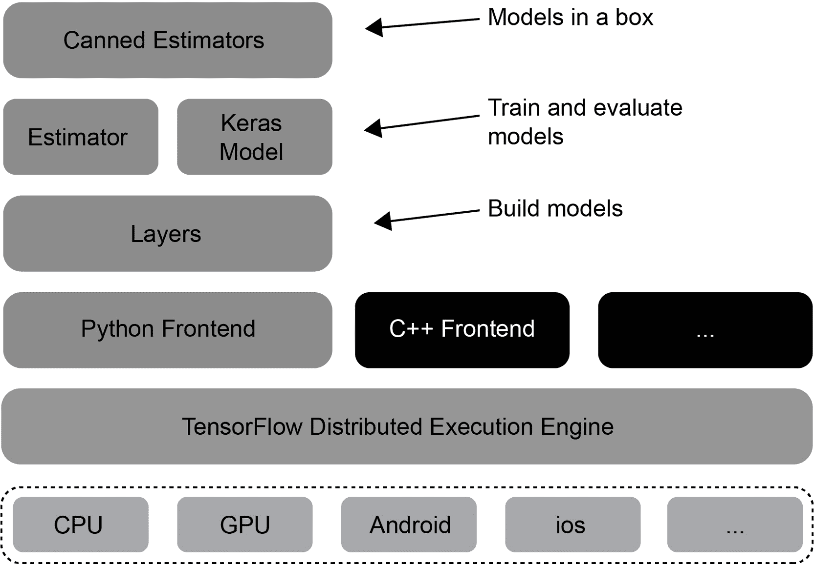

图 3.1：TensorFlow 架构

TensorFlow 的历史执行模型基于计算图。使用这种方法，构建模型的第一步是创建一个完整描述我们要执行的计算的计算图。第二步是执行计算图。此方法的缺点是，相比常见的实现，它不够直观，因为在执行之前，图必须是完整的。与此同时，这种方法也有许多优点，使得算法具有高度的可移植性，能够部署到不同类型的硬件平台上，并且可以在多个实例上并行运行。

在 TensorFlow 的最新版本中（从 v.1.7 开始），引入了一种新的执行模型，称为“即时执行”（eager execution）。这是一种命令式编程风格，允许编写代码时直接执行所有算法操作，而不需要首先构建计算图再执行。这个新方法受到了热烈的欢迎，并且有几个非常重要的优点：首先，它使得检查和调试算法、更容易访问中间值变得非常简单；其次，可以直接在 TensorFlow API 中使用 Python 控制流；最后，它使得构建和训练复杂算法变得非常容易。

此外，一旦使用即时执行（eager execution）创建的模型满足要求，就可以将其自动转换为图形，这样就能够利用我们之前讨论的所有优点，如模型保存、迁移和最优分发等。

与其他机器学习框架一样，TensorFlow 提供了大量现成的模型，并且对于许多模型，它还提供了训练好的模型权重和模型图，这意味着我们可以直接运行这些模型，甚至为特定的应用场景进行调整，利用诸如迁移学习和微调等技术。我们将在接下来的章节中介绍这些内容。

提供的模型涵盖了广泛的不同应用，例如：

+   **图像分类**：能够将图像分类到不同类别中。

+   **物体检测**：能够在图像中检测和定位多个物体。

+   **语言理解与翻译**：执行自然语言处理任务，如单词预测和翻译。

+   **补丁协调与风格迁移**：该算法能够将特定的风格（例如通过画作表现的风格）应用到给定的照片上（参见以下示例）。

正如我们之前提到的，许多模型都包括训练好的权重和使用说明示例。因此，采用“迁移学习”变得非常简单，也就是通过创建新的模型并仅在新数据集上对网络的一部分进行再训练，从而利用这些预训练的模型。这相比于从零开始训练整个网络要小得多。

TensorFlow 模型也可以部署到移动设备上。在大型系统上进行训练后，它们经过优化，以减小其占用空间，确保不会超出平台的限制。例如，TensorFlow 项目中的 **MobileNet** 正在开发一套专为优化速度/准确度权衡的计算机视觉模型。这些模型通常用于嵌入式设备和移动应用。

以下图像展示了一个典型的物体检测应用示例，其中输入图像被处理，检测到了三个物体，并进行了定位和分类：

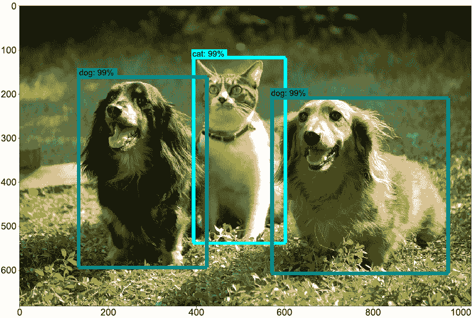

图 3.2：物体检测

以下图像展示了风格迁移的工作原理：著名画作《神奈川冲浪里》的风格被应用到了西雅图天际线的照片上。结果保持了图像的关键部分（大部分建筑物、山脉等），但通过从参考图像中提取的风格元素进行了呈现：


图 3.3：风格迁移

现在，让我们来了解一下 Keras。

## Keras

构建深度学习模型相当复杂，特别是当我们需要处理所有主要框架的典型底层细节时，这也是机器学习领域新手面临的最相关障碍之一。例如，以下代码展示了如何使用低级 TensorFlow API 创建一个简单的神经网络（一个隐藏层，输入大小为`100`，输出大小为`10`）。

在以下代码片段中，定义了两个函数。第一个构建了一个网络层的权重矩阵，而第二个创建了偏置向量：

```py
def weight_variable(shape):
    shape = tf.TensorShape(shape)
    initial_values = tf.truncated_normal(shape, stddev=0.1)
    return tf.Variable(initial_values)
def bias_variable(shape):
    initial_values = tf.zeros(tf.TensorShape(shape))
    return tf.Variable(initial_values)
```

接下来，创建输入（`X`）和标签（`y`）的占位符。它们将包含用于拟合模型的训练样本：

```py
# Define placeholders
X = tf.placeholder(tf.float32, shape=[None, 100])
y = tf.placeholder(tf.int32, shape=[None, 10])
```

创建两个矩阵和两个向量，每对分别对应网络中要创建的两个隐藏层，使用之前定义的函数。这些将包含可训练参数（网络权重）：

```py
# Define variables
w1 = weight_variable([X_input.shape[1], 64])
b1 = bias_variable([64])
w2 = weight_variable([64, 10])
b2 = bias_variable([10])
```

通过它们的数学定义来定义两个网络层：矩阵乘法，加上偏置和应用于结果的激活函数：

```py
# Define network
# Hidden layer
z1 = tf.add(tf.matmul(X, w1), b1)
a1 = tf.nn.relu(z1)
# Output layer
z2 = tf.add(tf.matmul(a1, w2), b2)
y_pred = tf.nn.softmax(z2)
y_one_hot = tf.one_hot(y, 10)
```

`loss` 函数已经定义，优化器已初始化，训练指标已选择。最后，执行图形以进行训练：

```py
# Define loss function
loss = tf.losses.softmax_cross_entropy(y, y_pred, \
       reduction=tf.losses.Reduction.MEAN)
# Define optimizer
optimizer = tf.train.AdamOptimizer(0.01).minimize(loss)
# Metric
accuracy = tf.reduce_mean(tf.cast(tf.equal(tf.argmax(y, axis=1), \
           tf.argmax(y_pred, axis=1)), tf.float32))
for _ in range(n_epochs):
    sess.run(optimizer, feed_dict={X: X_train, y: y_train})
```

如你所见，我们需要手动管理许多不同的方面：变量声明、权重初始化、层创建、层相关的数学操作，以及损失函数、优化器和指标的定义。为了比较，本节后面将使用 Keras 创建相同的神经网络。

注意

```py
Exercise 3.01, Building a Sequential Model with the Keras High-Level API, you will see how much more straightforward it is to do the same job using a Keras high-level API.
```

在众多不同的提议中，Keras 已经成为高层 API 的主要参考之一，尤其是在创建神经网络的上下文中。它是用 Python 编写的，可以与不同的后端计算引擎进行接口，其中一个引擎当然是 TensorFlow。

注意

你可以参考 Keras 的官方文档进行进一步阅读：[`keras.io/`](https://keras.io/)。

Keras 的设计理念遵循了一些明确的原则，特别是模块化、用户友好、易于扩展，并且与 Python 的直接集成。它的目标是促进新手和非经验用户的采用，并且具有非常平缓的学习曲线。它提供了许多不同的独立模块，从神经网络层到优化器，从初始化方案到成本函数。这些模块可以轻松创建，以便快速构建深度学习模型，并直接用 Python 编码，无需使用单独的配置文件。鉴于这些特点，Keras 的广泛应用，以及它能够与大量不同的后端引擎（例如 TensorFlow、CNTK、Theano、MXNet 和 PlaidML）进行接口，并提供多种部署选项，它已经成为该领域的标准选择。

由于它没有自己的低级实现，Keras 需要依赖外部元素。这可以通过编辑（对于 Linux 用户）`$HOME/.keras/keras.json`文件轻松修改，在该文件中可以指定后端名称。也可以通过`KERAS_BACKEND`环境变量指定。

Keras 的基础类是`Model`。有两种不同类型的模型可供选择：顺序模型（我们将广泛使用）和`Model`类，它与功能性 API 一起使用。

顺序模型可以看作是层的线性堆叠，层与层之间按非常简单的方式一层接一层堆叠，且这些层可以非常容易地描述。以下练习展示了如何通过 Python 脚本在 Keras 中使用`model.add()`构建一个深度神经网络，以定义一个顺序模型中的两个密集层。

## 练习 3.01：使用 Keras 高级 API 构建顺序模型

本练习演示了如何一步步使用 Keras 高级 API 轻松构建一个包含两个密集层的顺序模型：

1.  导入 TensorFlow 模块并打印其版本：

    ```py
    import tensorflow as tf
    from __future__ import absolute_import, division, \
    print_function, unicode_literals
    import tensorflow as tf
    print("TensorFlow version: {}".format(tf.__version__))
    ```

    这将输出以下内容：

    ```py
    TensorFlow version: 2.1.0
    ```

1.  使用 Keras 的`sequential`和`add`方法构建模型并打印网络摘要。为了与低级 API 并行使用，使用了相同的激活函数。这里我们使用`ReLu`，它是典型的用于隐藏层的激活函数。它是一个关键元素，通过其非线性形状为模型提供了非线性特性。我们还使用`Softmax`，它是典型用于分类问题中输出层的激活函数。它接收来自前一层的输出值（所谓的“logits”），并对其进行加权，定义所有输出类别的概率。`input_dim`是输入特征向量的维度，假设其维度为`100`：

    ```py
    model = tf.keras.Sequential()
    model.add(tf.keras.layers.Dense(units=64, \
                                    activation='relu', input_dim=100))
    model.add(tf.keras.layers.Dense(units=10, activation='softmax'))
    ```

1.  打印标准的模型架构：

    ```py
    model.summary()
    ```

    在我们的案例中，网络模型的摘要如下：

    ```py
    Model: "sequential_1"
    _________________________________________________________________
    Layer (type)                 Output Shape              Param #   
    =================================================================
    dense_2 (Dense)              (None, 64)                6464      
    _________________________________________________________________
    dense_3 (Dense)              (None, 10)                650       
    =================================================================
    Total params: 7,114
    Trainable params: 7,114
    Non-trainable params: 0
    _________________________________________________________________
    ```

    上述输出是一个有用的可视化，帮助我们清楚地了解各个层次、它们的类型和形状，以及网络参数的数量。

    注意

    要访问此特定部分的源代码，请参考[`packt.live/30A9Dw9`](https://packt.live/30A9Dw9)。

    你还可以在[`packt.live/3cT0cKL`](https://packt.live/3cT0cKL)在线运行这个示例。

正如预期的那样，这个练习向我们展示了如何创建一个顺序模型，并如何以非常简单的方式向其中添加两个层。

我们将在后续处理中解决其余方面，但仍值得注意的是，训练我们刚创建的模型并进行推理只需要非常少的代码行，如以下代码片段所示，代码片段需要附加到*练习 3.01，使用 Keras 高级 API 构建顺序模型*的代码片段中：

```py
model.compile(loss='categorical_crossentropy', optimizer='sgd', \
              metrics=['accuracy'])
model.fit(x_train, y_train, epochs=5, batch_size=32)
loss_and_metrics = model.evaluate(x_test, y_test, batch_size=128)
classes = model.predict(x_test, batch_size=128)
```

如果需要更复杂的模型，顺序 API 就显得过于有限。针对这些需求，Keras 提供了功能性 API，它允许我们创建能够管理复杂网络图的模型，例如具有多个输入和/或多个输出的网络、数据处理不是顺序的而是循环的递归神经网络（RNN），以及上下文，其中层的权重在网络的不同部分之间共享。为此，Keras 允许我们使用与顺序模型相同的层集，但在组合层时提供了更多的灵活性。首先，我们必须定义层并将它们组合在一起。以下代码片段展示了一个例子。

首先，在导入 TensorFlow 后，创建一个维度为`784`的输入层：

```py
import tensorflow as tf
inputs = tf.keras.layers.Input(shape=(784,))
```

输入由第一个隐藏层处理。它们通过 ReLu 激活函数，并作为输出返回。这个输出然后成为第二个隐藏层的输入，第二个隐藏层与第一个完全相同，并返回另一个输出，依然存储在`x`变量中：

```py
x = tf.keras.layers.Dense(64, activation='relu')(inputs)
x = tf.keras.layers.Dense(64, activation='relu')(x)
```

最终，`x`变量作为输入进入最终的输出层，该层具有`softmax`激活函数，并返回预测值：

```py
predictions = tf.keras.layers.Dense(10, activation='softmax')(x)
```

一旦完成所有步骤，模型就可以通过告诉 Keras 模型的起始点（输入变量）和终止点（预测变量）来创建：

```py
model = tf.keras.models.Model(inputs=inputs, outputs=predictions)
```

在模型构建完成后，通过指定优化器、损失函数和评估指标来编译模型。最后，它会拟合到训练数据上：

```py
model.compile(optimizer='rmsprop', \
              loss='categorical_crossentropy', \
              metrics=['accuracy'])
model.fit(data, labels)  # starts training
```

Keras 提供了大量的预定义层，并且可以编写自定义层。在这些层中，以下是已提供的层：

+   全连接层，通常用于全连接神经网络。它们由一个权重矩阵和一个偏置组成。

+   卷积层是由特定内核定义的滤波器，然后与应用的输入进行卷积。它们适用于不同输入维度，从 1D 到 3D，包括可以在其中嵌入复杂操作的选项，如裁剪或转置。

+   局部连接层与卷积层类似，因为它们仅作用于输入特征的子集，但与卷积层不同，它们不共享权重。

+   池化层是用于降低输入尺寸的层。作为卷积层，它们适用于维度从 1D 到 3D 的输入。它们包括大多数常见的变种，例如最大池化和平均池化。

+   循环层用于递归神经网络，其中一个层的输出也会被反向传递到网络中。它们支持先进的单元，如**门控递归单元**（**GRU**）、**长短期记忆**（**LSTM**）单元等。

+   激活函数也可以作为层的形式存在。这些函数应用于层的输出，如`ReLu`、`Elu`、`Linear`、`Tanh`和`Softmax`。

+   Lambda 层是用于嵌入任意用户定义表达式的层。

+   Dropout 层是特殊对象，它会在每次训练更新时随机将一部分输入单元设为 `0`，以避免过拟合（稍后会详细介绍）。

+   噪声层是额外的层，例如 dropout，旨在避免过拟合。

Keras 还提供了常见的数据集和著名的模型。对于与图像相关的应用，许多网络是可用的，例如 Xception、VGG16、VGG19、ResNet50、InceptionV3、InceptionResNetV2、MobileNet、DenseNet、NASNet 和 MobileNetV2TK，它们都在 ImageNet 上进行了预训练。Keras 还提供文本和序列及生成模型，总共超过 40 种算法。

正如我们看到的，对于 TensorFlow，Keras 模型有广泛的部署平台选择，包括通过 CoreML（Apple 支持）在 iOS 上；通过 TensorFlow Android 运行时在 Android 上；通过 Keras.js 和 WebDNN 在浏览器中；通过 TensorFlow-Serving 在 Google Cloud 上；在 Python Web 应用后端；通过 DL4J 模型导入在 JVM 上；以及在 Raspberry Pi 上。

现在我们已经了解了 TensorFlow 和 Keras，从下一部分开始，我们的主要焦点将是如何将它们结合使用来创建深度神经网络。Keras 将作为高级 API 使用，因其用户友好性，而 TensorFlow 将作为后端。

# 如何使用 TensorFlow 实现神经网络

在这一部分，我们将讨论实现深度神经网络时需要考虑的最重要的方面。从最基本的概念开始，我们将经历所有步骤，直到创建出最先进的深度学习模型。我们将涵盖网络架构的定义、训练策略和性能提升技术，理解它们如何工作，并为你准备好，帮助你完成接下来的练习，在那里这些概念将被应用来解决现实世界的问题。

为了成功实现 TensorFlow 中的深度神经网络，我们必须完成一定数量的步骤。这些步骤可以总结并分组如下：

1.  **模型创建**：网络架构定义、输入特征编码、嵌入、输出层

1.  **模型训练**：损失函数定义、优化器选择、特征标准化、反向传播

1.  **模型验证**：策略和关键元素

1.  **模型优化**：防止过拟合的对策

1.  **模型测试和推理**：性能评估和在线预测

让我们详细了解每一个步骤。

## 模型创建

第一步是创建一个模型。选择架构几乎不能 *先验* 在纸面上完成。这是一个典型的过程，需要实验，反复在模型设计和领域验证、测试之间进行调整。这是所有网络层创建并正确链接的阶段，生成一个完整的处理操作集，从输入到输出。

最底层是与输入数据接口的层，特别是所谓的“输入特征”。例如，在图像的情况下，输入特征就是图像像素。根据层的性质，输入特征的维度需要被考虑。在接下来的章节中，你将学习如何根据层的性质选择层的维度。

最后一层叫做输出层。它生成模型的预测，因此它的维度取决于问题的性质。例如，在分类问题中，模型必须预测一个给定实例属于哪个类别（假设是 10 个类别中的一个），输出层将有 10 个神经元，每个神经元提供一个得分（每个类别一个）。在接下来的章节中，我们将说明如何创建具有正确维度的输出层。

在第一层和最后一层之间，是中间层，称为隐藏层。这些层构成了网络架构，并负责模型的核心处理能力。目前为止，还没有可以用来选择最佳网络架构的规则；这个过程需要大量的实验，并且需要遵循一些通用原则的指导。

一种非常强大且常见的方法是利用来自学术论文的经过验证的模型，作为起点，然后根据具体问题适当调整架构并进行微调。当使用预训练的文献模型并进行微调时，这个过程被称为“迁移学习”，意味着我们利用已经训练好的模型并将其知识转移到新模型中，后者就不需要从头开始训练了。

一旦模型被创建，所有参数（权重/偏置）必须初始化（对于所有未预训练的层）。你可能会想将它们都设为零，但这并不是一个好选择。有许多不同的初始化方案可以使用，而选择哪一种需要经验和实验。在接下来的章节中，这一点会变得更清楚。实现将依赖于 Keras/TensorFlow 执行的默认初始化，通常这是一个好的且安全的起点。

模型创建的典型代码示例可以在下面的代码片段中看到，这是我们在前一节中学习过的：

```py
inputs = tf.keras.layers.Input(shape=(784,))
x = tf.keras.layers.Dense(64, activation='relu')(inputs)
x = tf.keras.layers.Dense(64, activation='relu')(x)
predictions = tf.keras.layers.Dense(10, activation='softmax')(x)
model = tf.keras.models.Model(inputs=inputs, outputs=predictions)
```

## 模型训练

当模型被初始化并应用于输入数据而没有经过训练阶段时，它输出的是随机值。为了提高性能，我们需要调整其参数（权重），以最小化误差。这是模型训练阶段的目标，包含以下步骤：

1.  首先，我们必须评估模型在给定参数配置下的“错误”程度，通过计算所谓的“损失”，即模型预测误差的度量。

1.  第二步，计算一个高维梯度，告诉我们模型需要在哪个方向上调整参数，以提高当前性能，从而最小化损失函数（这确实是一个优化过程）。

1.  最后，通过沿负梯度方向“步进”（遵循一些精确规则），更新模型参数，并且整个过程从损失评估阶段重新开始。

这个过程会重复进行，直到系统收敛并且模型达到最佳性能（最小损失）。

下面是一个典型的模型训练代码示例，我们在之前的章节中已经学习过：

```py
model.compile(optimizer='rmsprop', \
              loss='categorical_crossentropy', \
              metrics=['accuracy'])
model.fit(data, labels)  # starts training
```

## 损失函数定义

模型错误可以通过不同的损失函数来度量。如何选择最好的损失函数需要经验。对于复杂的应用，通常需要仔细调整损失函数，以引导训练朝着我们感兴趣的方向进行。举个例子，让我们看看如何定义一个常用于分类问题的典型损失：稀疏类别交叉熵。在 Keras 中创建它，我们可以使用以下指令：

```py
loss_CatCrossEntropy = tf.keras.losses\
                       .SparseCategoricalCrossentropy()
```

该函数操作于两个输入：真实标签和预测标签。根据它们的值，计算与模型相关的损失：

```py
loss_CatCrossEntropy(y_true=groundTruth, y_pred=predictions)
```

## 优化器选择

第二步和第三步，分别是估算梯度和更新参数，这由优化器处理。这些对象计算梯度并执行沿梯度方向的更新步骤，以最小化模型损失。可以选择许多优化器，从最简单的到最先进的（参见下图）。它们提供了不同的性能，选择哪一个，仍然是经验和试错的过程。举个例子，下面的代码选择了`Adam`优化器，并为其指定了`0.01`的学习率。该参数调节沿梯度方向“步进”的大小：

```py
optimizer = tf.keras.optimizers.Adam(learning_rate=0.01)
optimizer = tf.keras.optimizers.Adadelta(learning_rate=0.01)
optimizer = tf.keras.optimizers.Adagrad(learning_rate=0.01)
optimizer = tf.keras.optimizers.Adamax(learning_rate=0.01)
optimizer = tf.keras.optimizers.Ftrl(learning_rate=0.01)
optimizer = tf.keras.optimizers.Nadam(learning_rate=0.01)
optimizer = tf.keras.optimizers.RMSprop(learning_rate=0.01)
optimizer = tf.keras.optimizers.SGD(learning_rate=0.01)
```

以下图表是一个即时快照，比较了不同优化器的表现。它显示了它们是如何*快速*地朝着最小值移动的，所有优化器同时开始。我们可以看到一些优化器比其他的更快：

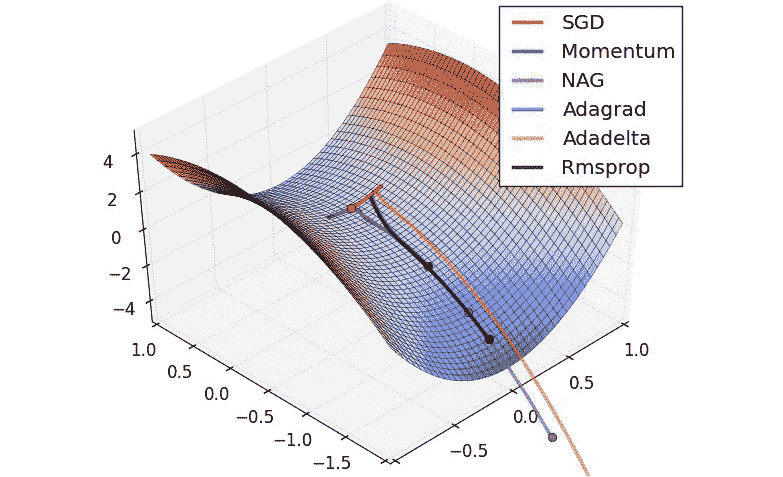

图 3.4：优化器最小化步骤比较

注意

前面的图表由 Alec Radford 创建（[`twitter.com/alecrad`](https://twitter.com/alecrad)）。

## 学习率调度

在大多数情况下，对于大多数深度学习模型，最佳效果通常是在训练过程中逐渐减小学习率。这个原因可以从以下图表中看到：

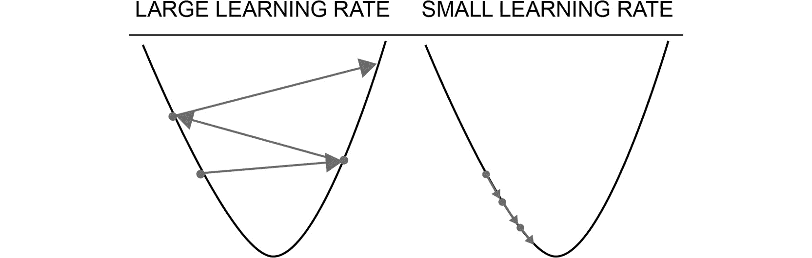

图 3.5：使用不同学习率值时的优化行为

当接近损失函数的最小值时，我们希望采取越来越小的步伐，以高效地达到超维凹形的最底部。

使用 Keras，可以通过调度器为学习率的趋势在各个 epoch 中指定许多不同的递减函数。一种常见的选择是 `InverseTimeDecay`。它可以通过以下方式实现：

```py
lr_schedule = tf.keras.optimizers.schedules\
              .InverseTimeDecay(0.001,\
                                decay_steps=STEPS_PER_EPOCH*1000,\
                                decay_rate=1, staircase=False)
```

上述代码通过 `InverseTimeDecay` 设置了一个递减函数，采用双曲线方式使学习率在 1,000 个 epoch 时降至基础学习率的 1/2，在 2,000 个 epoch 时降至 1/3，依此类推。以下图表展示了这一变化：

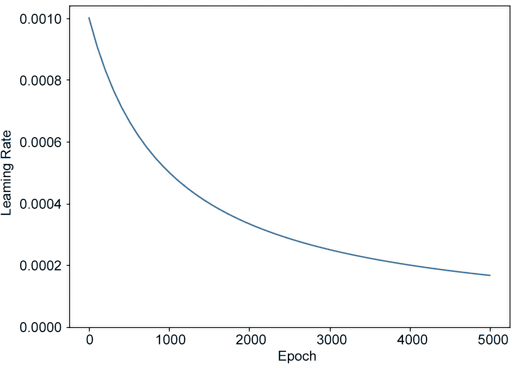

图 3.6：反时间衰减学习率调度

然后，它被作为参数应用于优化器，如下所示的 `Adam` 优化器代码片段所示：

```py
tf.keras.optimizers.Adam(lr_schedule)
```

每次优化步骤都会使损失减少，从而改进模型。然后可以重复相同的过程，直到收敛并且损失停止减少。执行的优化步骤次数通常被称为 epoch 数。

## 特征归一化

深度神经网络的广泛应用使得它们能够处理各种不同类型的输入，从图像像素到信用卡交易历史，从社交账号的个人资料习惯到音频记录。从这些可以看出，原始输入特征的数值范围差异很大。如前所述，训练这些模型需要通过损失梯度计算来解决优化问题。因此，数值方面至关重要，它不仅加速了过程，还使其更具鲁棒性。在这种背景下，最重要的实践之一就是特征归一化或标准化。最常见的方法包括对每个特征执行以下步骤：

1.  使用所有训练集实例计算均值和标准差。

1.  减去均值并除以标准差。计算得出的值必须应用于训练集、验证集和测试集。

通过这种方式，所有特征将具有零均值和标准差为 `1`。不同但相似的方法会将特征值缩放到用户定义的最小-最大范围（例如，从 -1 到 1），或应用类似的转换（例如，对数缩放）。如同往常一样，在实际应用中，哪种方法更有效是很难预测的，需要经验和反复试验。

以下代码片段展示了如何进行数据归一化，其中计算了原始值的均值和标准差，然后从原始值中减去均值，最后将结果除以标准差：

```py
train_stats = train_dataset.describe()
train_stats = train_stats.transpose()
def norm(x):
    return (x - train_stats['mean']) / train_stats['std']
normed_train_data = norm(train_dataset)
```

## 模型验证

如前述各节所述，大多数选择需要实验，这意味着我们必须选择一个特定的配置并评估相应模型的表现。为了计算该性能度量，必须将候选模型应用于一组实例，并将其输出与真实值进行比较。根据我们希望比较的不同配置数量，这一过程可能会重复多次。从长远来看，这些配置选择可能会受到用于衡量模型性能的实例集的过度影响。出于这个原因，为了得到最终准确的模型性能度量，必须在一个从未见过的新实例集上进行测试。第一个实例集被称为“验证集”，而最后一个则被称为“测试集”。

在定义训练集、验证集和测试集时，我们可以采取不同的选择，如下所示：

+   70:20:10：初始数据集被分解为三个部分，即训练集、验证集和测试集，比例分别为 70:20:10。

+   80:20 + k-折叠：初始数据集被分解为两个部分，分别是 80% 的训练集和 20% 的测试集。通过在训练数据集上使用 k-折叠进行验证：它被分为“k”个折叠，接着在“k-1”个折叠上进行训练，而在第 k 个折叠上进行验证。'K' 的值从 1 到 k 不等，度量标准被平均以获得全局指标。

可以使用许多前述方法的变种。选择严格与问题和可用的数据集相关。

以下代码片段展示了如何在训练数据集上拟合模型时，规定 80:20 的验证集划分：

```py
model.fit(normed_train_data, train_labels, epochs=epochs, \
          validation_split = 0.2, verbose=2)
```

## 性能度量

除了损失函数外，通常还会采用其他度量标准来衡量性能。可用的度量标准种类繁多，应该使用哪一种取决于许多因素，包括问题类型、数据集特征等。以下是最常用的一些：

+   **均方误差** (**MSE**)：用于回归问题。

+   **均方绝对误差** (**MAE**)：用于回归问题。

+   准确率：正确预测的数量除以总测试实例的数量。这用于分类问题。

+   **接收操作特征曲线下的面积** (**ROC** **AUC**)：用于二分类，特别是在数据高度不平衡的情况下。

+   其他：Fβ 分数、精准度和召回率。

## 模型改进

在本节中，我们将介绍一些可以用于提高模型性能的技术。

### 过拟合

在训练深度神经网络时，我们常常遇到的一个问题是，模型性能（当然是通过验证集或测试集来衡量）会在训练轮次超过某一阈值后急剧下降，即使在此时训练损失仍在减少。这个现象被称为**过拟合**。可以这样定义：一个非常具代表性的模型，即拥有相关自由度数量的模型（例如，具有多个层和神经元的神经网络），如果被“*过度训练*”，会趋向于紧贴训练数据，试图最小化训练损失。这会导致较差的泛化性能，从而使验证和/或测试错误增高。深度学习模型由于其高维参数空间，通常非常擅长拟合训练数据，但构建机器学习模型的实际目标是能够泛化已学到的知识，而不仅仅是拟合数据集。

在此阶段，我们可能会倾向于显著减少模型参数的数量，以避免过拟合。但这会引发不同的问题。实际上，参数数量不足的模型会导致**欠拟合**。基本上，它将无法正确拟合数据，结果会导致性能差，训练集和验证/测试集的表现都会不理想。

正确的解决方案是在训练数据完全拟合的大量参数和具有过小模型自由度、导致无法捕捉数据中的重要信息之间找到适当的平衡。目前无法确定模型的最佳规模，以避免过拟合或欠拟合问题。实验是解决这个问题的关键因素，因此数据工程师需要构建并测试不同的架构。一个好的规则是从参数相对较少的模型开始，然后逐步增加它们，直到泛化性能提升。

对抗过拟合的最佳解决方案是通过新数据丰富训练数据集。目标是完全覆盖模型所支持并期望的输入范围。新数据还应包含额外的信息，以便有效地对比过拟合，并实现更好的泛化误差。当无法收集额外数据或成本过高时，必须采用特定的、非常强大的技术。最重要的技术将在此描述。

### 正则化

正则化是用来对抗过拟合的最强大工具之一。给定一个网络架构和一组训练数据，有一个包含所有可能权重的空间，它们会产生相同的结果。这个空间中每一个权重组合定义了一个特定的模型。正如我们在前面的章节中看到的，作为一般原则，我们需要偏向简单模型而非复杂模型。实现这一目标的常用方法是强制网络权重采用较小的值，从而对权重的分布进行正则化。这可以通过“权重正则化”来实现。权重正则化通过调整损失函数，使其考虑权重的值，并添加一个与权重大小成正比的新项。常见的两种方法是：

+   **L1 正则化**：添加到损失函数中的项与权重系数的绝对值成正比，通常被称为权重的“L1 范数”。

+   **L2 正则化**：添加到损失函数中的项与权重系数值的平方成正比，通常被称为权重的“L2 范数”。

这两者都能限制权重的大小，但 L1 正则化往往会使权重趋向于零，而 L2 正则化则对权重施加较宽松的约束，因为附加的损失项增长得更快。通常情况下，L2 正则化更为常见。

Keras 包含了预构建的 L1 和 L2 正则化对象。用户需要将它们作为参数传递给希望应用该技术的网络层。下面的代码展示了如何将其应用于一个常见的全连接层：

```py
tf.keras.layers.Dense(512, activation='relu', \
                      kernel_regularizer=tf.keras\
                                         .regularizers.l2(0.001))
```

传递给 L2 正则化器的参数（`0.001`）表明，网络中的每个权重系数都会额外添加一个损失项 `0.001 * weight_coefficient_value**2`，以此来增加网络的总损失。

### 早停

早停是正则化的一种特定形式。其思想是在训练过程中同时跟踪训练和验证误差，并继续训练模型，直到训练和验证损失都减少为止。这样我们可以找到训练损失下降后的阈值，此时继续训练会以增加泛化误差为代价，因此当验证/测试性能达到最大时，我们可以停止训练。采用此技术时，用户需要选择的一个典型参数是系统在停止迭代前应等待和监控的轮次，如果验证误差没有改善。这个参数通常被称为“耐心”。

### Dropout

神经网络中最流行且有效的正则化技术之一是 Dropout。它是由多伦多大学的 Hinton 教授及其研究小组开发的。

当 Dropout 应用到一层时，在训练过程中，该层输出特征的某个百分比会被随机设置为零（它们被丢弃）。例如，如果给定一组输入特征，在训练时某层的输出通常为 [0.3, 0.4, 1.2, 0.1, 1.5]，应用 dropout 后，相同的输出向量会有一些零项随机分布，例如 [0.3, 0, 1.2, 0.1, 0]。

dropout 背后的理念是鼓励每个节点输出具有高度信息量和独立意义的值，而不依赖于其邻近的节点。

插入 dropout 层时需要设置的参数为 `0.2` 和 `0.5`。在进行推理时，dropout 被停用，需要执行额外的操作，以考虑到相对于训练时会有更多的单元处于激活状态。为了在这两种情况之间重新建立平衡，层的输出值会乘以一个与 dropout 率相等的因子，形成缩放操作。在 Keras 中，可以通过 dropout 层将 dropout 引入网络，它会应用于紧接其前面的层的输出。考虑以下代码片段：

```py
dropout_model = tf.keras.Sequential([
    #[...]
    tf.keras.layers.Dense(512, activation='relu'), \
    tf.keras.layers.Dropout(0.5), \
    tf.keras.layers.Dense(256, activation='relu'), \
    #[...]
    ])
```

如你所见，dropout 被应用于 `512` 个神经元的层，在训练时将其 50%的值设为 0.0，在推理时将其值乘以 0.5。

### 数据增强

数据增强在训练实例有限的情况下尤其有用。在图像处理的背景下，理解其实现和工作原理非常简单。假设我们想训练一个网络来分类不同品种的特定物种的图像，而每个品种的示例数量有限。那么，我们如何扩大数据集以帮助模型更好地泛化呢？在这种情况下，数据增强起着重要作用：其理念是从我们已有的数据出发，适当地调整它们，从而生成新的训练实例。在图像的情况下，我们可以通过以下方式对其进行处理：

+   相对于中心附近的某一点进行随机旋转

+   随机裁剪

+   随机仿射变换（剪切、缩放等）

+   随机水平/垂直翻转

+   白噪声叠加

+   盐和胡椒噪声叠加

这些是一些可以用于图像的数据增强技术的示例，当然，在其他领域也有对应的方法。这种方法使得模型更加健壮，并改善其泛化能力，通过赋予最具信息量的输入特征优先权，使其能够以更一般的方式抽象出有关其所面临的特定问题的概念和知识。

### 批量归一化

批量归一化是一种技术，涉及对每个数据批次应用归一化转换。例如，在训练一个批次大小为 128 的深度网络时，意味着系统将一次处理 128 个训练样本，批量归一化层按以下方式工作：

1.  它使用给定批次的所有样本计算每个特征的均值和方差。

1.  它从每个批次样本的每个特征中减去先前计算的相应特征均值。

1.  它将每个批次样本的每个特征除以相应特征方差的平方根。

批量归一化有许多好处。它最初是为了解决*内部协变量偏移*问题而提出的。在训练深度网络时，层的参数不断变化，导致内部层必须不断适应和重新调整，以适应来自前一层的新分布。对于深度网络来说，这是特别关键的，因为第一层的小变化会通过网络被放大。对层输出进行归一化有助于限制这些变化，加速训练并生成更可靠的模型。

此外，通过使用批量归一化，我们可以做到以下几点：

+   我们可以采用更高的学习率，而不必担心出现梯度消失或爆炸的问题。

+   我们可以通过改善网络的泛化能力来有利于网络正则化，从而减轻过拟合问题。

+   我们可以使模型对不同的初始化方案和学习率变得更加稳健。

### 模型测试与推理

一旦模型训练完成并且验证性能令人满意，我们可以进入最终阶段。如前所述，准确的最终模型性能评估要求我们在从未见过的实例集上测试模型：测试集。性能确认后，模型可以投入生产，用于在线推理，此时它将按设计提供服务：新实例将提供给模型，模型将根据它所设计和训练的知识输出预测。

在接下来的子章节中，将描述三种具有特定元素/层的神经网络。它们将提供一些简单的示例，展示在该领域广泛应用的不同技术。

## 标准全连接神经网络

*全连接神经网络*一词通常用于表示仅由全连接层组成的深度神经网络。全连接层是指神经元与上一层所有神经元以及下一层所有神经元相连的层，如下图所示：

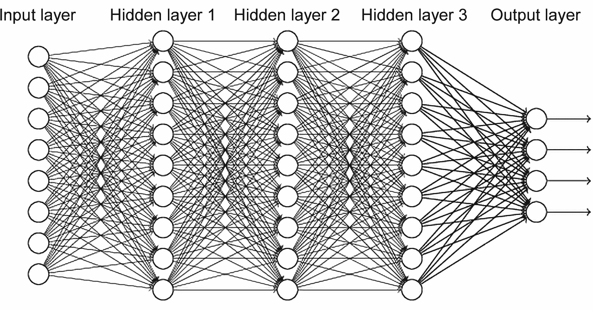

图 3.7：一个全连接神经网络

本章将主要讨论全连接网络。它们通过一系列中间隐藏层将输入映射到输出。这些架构能够处理各种问题，但在输入维度、层数和神经元数目方面有一定的限制，因为参数数量会随着这些变量的增加而迅速增长。

一个将在稍后遇到的全连接神经网络示例如下所示，该网络使用 Keras API 构建。它通过两个隐藏层（每层包含`64`个神经元）将输入层（维度等于`len(train_dataset.keys())`）连接到输出层（维度为`1`）：

```py
    model = tf.keras.Sequential([tf.keras.layers.Dense\
            (64, activation='relu',\
             input_shape=[len(train_dataset.keys())]),\
             tf.keras.layers.Dense(64, activation='relu'),\
             tf.keras.layers.Dense(1)])
```

现在，让我们快速完成一个练习，以帮助理解全连接神经网络。

## 练习 3.02：使用 Keras 高级 API 构建全连接神经网络模型

在本练习中，我们将构建一个全连接神经网络，输入维度为`100`，包含 2 个隐藏层，输出层为`10`个神经元。完成此练习的步骤如下：

1.  导入`TensorFlow`模块并打印其版本：

    ```py
    from __future__ import absolute_import, division, \
    print_function, unicode_literals
    import tensorflow as tf
    print("TensorFlow version: {}".format(tf.__version__))
    ```

    这将输出以下行：

    ```py
    TensorFlow version: 2.1.0
    ```

1.  使用 Keras `sequential` 模块创建网络。这允许我们通过将一系列层按顺序堆叠来构建模型。在此特定案例中，我们使用了两个隐藏层和一个输出层：

    ```py
    INPUT_DIM = 100
    OUTPUT_DIM = 10

    model = tf.keras.Sequential([tf.keras.layers.Dense\
            (128, activation='relu', \
            input_shape=[INPUT_DIM]), \
            tf.keras.layers.Dense(256, activation='relu'), \
            tf.keras.layers.Dense(OUTPUT_DIM, activation='softmax')])
    ```

1.  打印摘要以查看模型描述：

    ```py
    model.summary()
    ```

    输出结果如下所示：

    ```py
    Model: "sequential"
    _________________________________________________________________
    Layer (type)                 Output Shape              Param #   
    =================================================================
    dense (Dense)                (None, 128)               12928     
    _________________________________________________________________
    dense_1 (Dense)              (None, 256)               33024     
    _________________________________________________________________
    dense_2 (Dense)              (None, 10)                2570      
    =================================================================
    Total params: 48,522
    Trainable params: 48,522
    Non-trainable params: 0
    _________________________________________________________________
    ```

如您所见，模型已经创建，摘要为我们提供了对各层、层类型和形状以及网络参数数量的清晰理解，这在实际构建神经网络时非常有用。

注意

要访问此特定部分的源代码，请参考[`packt.live/37s1M5w`](https://packt.live/37s1M5w)。

您也可以在线运行此示例，访问[`packt.live/3f9WzSq`](https://packt.live/3f9WzSq)。

现在，我们继续深入理解卷积神经网络。

## 卷积神经网络

**卷积神经网络**（**CNN**）一词通常指代由以下组成部分组合而成的深度神经网络：

+   卷积层

+   池化层

+   全连接层

卷积神经网络（CNN）最成功的应用之一是在图像和视频处理任务中。实际上，卷积神经网络相比于全连接神经网络，在处理高维输入（如图像）时更加高效。它们也广泛应用于异常检测任务中，常用于自编码器，以及强化学习算法的编码器，特别是策略和值网络。

卷积层可以被认为是对输入层应用（卷积）的一系列滤波器，以生成层的输出。这些层的主要参数是滤波器的数量和卷积核的维度。

池化层减少数据的维度；它们将一层中的神经元群体输出合并为下一层的一个神经元。池化层可以计算最大值（**MaxPooling**），即从前一层每个神经元群体中选取最大值，或者计算平均值（**AveragePooling**），即从前一层每个神经元群体中计算平均值。

这些卷积/池化操作将输入信息编码成压缩的表示，直到这些新的深度特征，也称为嵌入，通常作为标准全连接层的输入，出现在网络的最后。经典的卷积神经网络示意图如下所示：

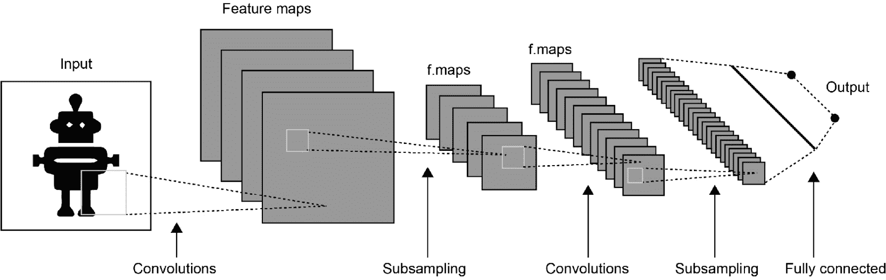

图 3.8：卷积神经网络示意图

以下练习展示了如何使用 Keras 高级 API 创建一个卷积神经网络。

## 练习 3.03：使用 Keras 高级 API 构建卷积神经网络模型

这个练习将向你展示如何构建一个具有三层卷积层（每层的滤波器数量分别为`16`、`32`和`64`，卷积核大小为`3`）的卷积神经网络，卷积层与三层`MaxPooling`层交替，最后是两个全连接层，分别具有`512`和`1`个神经元。以下是逐步过程：

1.  导入`TensorFlow`模块并打印其版本：

    ```py
    from __future__ import absolute_import, division, \
    print_function, unicode_literals
    import tensorflow as tf
    print("TensorFlow version: {}".format(tf.__version__))
    ```

    这将打印出以下行：

    ```py
    TensorFlow version: 2.1.0
    ```

1.  使用 Keras 的顺序模块创建网络：

    ```py
    IMG_HEIGHT = 480
    IMG_WIDTH = 680
    model = tf.keras.Sequential([tf.keras.layers.Conv2D\
            (16, 3, padding='same',\
             activation='relu',\
             input_shape=(IMG_HEIGHT, IMG_WIDTH, 3)),\
             tf.keras.layers.MaxPooling2D(),\
             tf.keras.layers.Conv2D(32, 3, padding='same',\
             activation='relu'),\
             tf.keras.layers.MaxPooling2D(),\
             tf.keras.layers.Conv2D(64, 3, padding='same',\
             activation='relu'),\
             tf.keras.layers.MaxPooling2D(),\
             tf.keras.layers.Flatten(),\
             tf.keras.layers.Dense(512, activation='relu'),\
             tf.keras.layers.Dense(1)])
    model.summary()
    ```

    前面的代码让我们通过一系列层逐个堆叠来构建模型。在这个特定的案例中，三组卷积层和最大池化层之后接着一个展平层和两个全连接层。

    这将输出以下模型描述：

    ```py
    Model: "sequential"
    _________________________________________________________________
    Layer (type)                 Output Shape              Param #   
    =================================================================
    conv2d (Conv2D)              (None, 480, 680, 16)      448       
    _________________________________________________________________
    max_pooling2d (MaxPooling2D) (None, 240, 340, 16)      0         
    _________________________________________________________________
    conv2d_1 (Conv2D)            (None, 240, 340, 32)      4640      
    _________________________________________________________________
    max_pooling2d_1 (MaxPooling2 (None, 120, 170, 32)      0         
    _________________________________________________________________
    conv2d_2 (Conv2D)            (None, 120, 170, 64)      18496     
    _________________________________________________________________
    max_pooling2d_2 (MaxPooling2 (None, 60, 85, 64)        0         
    _________________________________________________________________
    flatten (Flatten)            (None, 326400)            0         
    _________________________________________________________________
    dense (Dense)                (None, 512)               167117312 
    _________________________________________________________________
    dense_1 (Dense)              (None, 1)                 513       
    =================================================================
    Total params: 167,141,409
    Trainable params: 167,141,409
    Non-trainable params: 0
    ```

因此，我们成功地使用 Keras 创建了一个 CNN。前面的总结为我们提供了有关网络层和不同参数的关键信息。

注意

要访问该特定部分的源代码，请参考[`packt.live/2AZJqwn`](https://packt.live/2AZJqwn)。

你还可以在[`packt.live/37p1OuX`](https://packt.live/37p1OuX)上在线运行此示例。

现在我们已经处理了卷积神经网络，让我们关注另一个重要的架构家族：循环神经网络。

## 循环神经网络

循环神经网络是由特定单元组成的模型，它们与前馈网络类似，能够处理从输入到输出的数据，但与前馈网络不同的是，它们还能够通过反馈回路处理反向数据流。它们的基本设计是使一层的输出被重定向并成为该层的输入，利用特定的内部状态来“记住”先前的状态。

这一特性使得它们特别适合解决具有时间/序列发展的任务。比较 CNN 和 RNN 可以帮助理解它们各自更适合解决哪些问题。CNN 最适合解决局部一致性较强的问题，尤其是在图像/视频处理方面。局部一致性被利用来大幅减少处理高维输入所需的权重数目。而 RNN 则在处理具有时间序列数据的问题时表现最好，这意味着任务可以通过时间序列来表示。这对于自然语言处理或语音识别尤为重要，因为单词和声音只有在特定顺序中才有意义。

递归架构可以被看作是一系列操作，它们非常适合追踪历史数据：

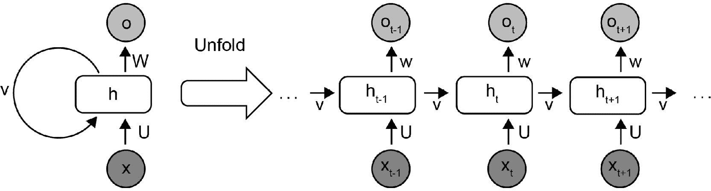

图 3.9：递归神经网络框图

它们最重要的组成部分是 GRU 和 LSTM。这些模块包含专门用于追踪解决任务时重要信息的内部元素和状态。它们都成功地解决了在训练机器学习算法时学习长期依赖性的问题，尤其是在时间数据上。它们通过存储过去数据中的“记忆”来帮助网络对未来进行预测。

GRU 和 LSTM 之间的主要区别在于门的数量、单元的输入和单元状态，后者是构成单元记忆的内部元素。GRU 只有一个门，而 LSTM 有三个门，分别称为输入门、遗忘门和输出门。由于 LSTM 拥有更多的参数，它们比 GRU 更加灵活，但这也使得 LSTM 在内存和时间效率上不如 GRU。

这些网络已经在语音识别、自然语言处理、文本转语音、机器翻译、语言建模以及许多其他类似任务的领域中取得了巨大的进展。

以下是典型 GRU 的框图：

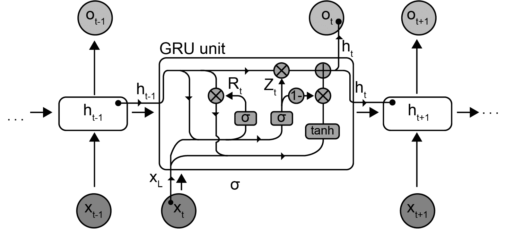

图 3.10：GRU 的框图

以下是典型 LSTM 的框图：

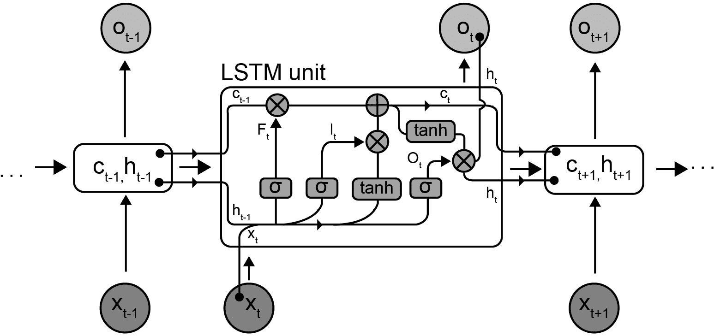

图 3.11：LSTM 的框图

以下练习展示了如何使用 Keras API 创建一个包含 LSTM 单元的递归网络。

## 练习 3.04：使用 Keras 高级 API 构建一个递归神经网络模型

在本练习中，我们将使用 Keras 高级 API 创建一个递归神经网络。它将具有以下架构：第一层只是一个编码层，使用特定规则对输入特征进行编码，从而生成一组嵌入向量。第二层是一个包含`64`个 LSTM 单元的层。它们被添加到一个双向包装器中，这个特定的层用于通过将其作用于的单元加倍来加速学习，第一个单元直接使用输入数据，第二个单元则使用反向输入（例如，按从右到左的顺序读取句子中的单词）。然后，输出会被拼接起来。证明这种技术能够生成更快、更好的学习效果。最后，添加了两个全连接层，分别包含`64`和`1`个神经元。请按照以下步骤完成本练习：

1.  导入`TensorFlow`模块并打印其版本：

    ```py
    from __future__ import absolute_import, division, \
    print_function, unicode_literals
    import tensorflow as tf
    print("TensorFlow version: {}".format(tf.__version__))
    ```

    这将输出以下内容：

    ```py
    TensorFlow version: 2.1.0
    ```

1.  使用 Keras 的`sequential`方法构建模型并打印网络摘要：

    ```py
    EMBEDDING_SIZE = 8000
    model = tf.keras.Sequential([\
            tf.keras.layers.Embedding(EMBEDDING_SIZE, 64),\
            tf.keras.layers.Bidirectional(tf.keras.layers.LSTM(64)),\
            tf.keras.layers.Dense(64, activation='relu'),\
            tf.keras.layers.Dense(1)])
    model.summary()
    ```

    在前面的代码中，模型通过堆叠连续的层来构建。首先是嵌入层，然后是双向层，它作用于 LSTM 层，最后是模型末尾的两个全连接层。

    模型摘要将如下所示：

    ```py
    Model: "sequential"
    _________________________________________________________________
    Layer (type)                 Output Shape              Param #   
    =================================================================
    embedding (Embedding)        (None, None, 64)          512000    
    _________________________________________________________________
    bidirectional (Bidirectional (None, 128)               66048     
    _________________________________________________________________
    dense (Dense)                (None, 64)                8256      
    _________________________________________________________________
    dense_1 (Dense)              (None, 1)                 65        
    =================================================================
    Total params: 586,369
    Trainable params: 586,369
    Non-trainable params: 0
    _________________________________________________________________
    ```

    注意

    要访问此特定部分的源代码，请参考[`packt.live/3cX01OO`](https://packt.live/3cX01OO)。

    你也可以在[`packt.live/37nw1ud`](https://packt.live/37nw1ud)上在线运行这个例子。

通过了解如何使用 TensorFlow 实现神经网络，接下来的章节将展示如何将所有这些概念结合起来，解决典型的机器学习问题，包括回归和分类问题。

# 使用 TensorFlow 进行简单回归

本节将逐步解释如何成功解决回归问题。你将学习如何初步查看数据集，以了解其最重要的属性，并了解如何为训练、验证和推理做好准备。接下来，将使用 TensorFlow 通过 Keras API 从零开始构建深度神经网络。然后，训练该模型并评估其性能。

在回归问题中，目标是预测一个连续值的输出，例如价格或概率。在本练习中，将使用经典的 Auto MPG 数据集，并在其上训练一个深度神经网络，以准确预测汽车的燃油效率，使用的特征仅限于以下七个：气缸数、排量、马力、重量、加速度、模型年份和原产地。

数据集可以看作是一个具有八列（七个特征和一个目标值）的表格，并且有与数据集实例数量相同的行数。根据我们在前面的章节中讨论的最佳实践，它将按如下方式划分：20%的实例将用作测试集，剩余的部分将再次按 80:20 的比例划分为训练集和验证集。

作为第一步，将检查训练集中的缺失值，并在需要时进行清理。接下来，将绘制一个展示变量相关性的图表。唯一存在的类别变量将通过独热编码转换为数值形式。最后，所有特征将进行标准化。

然后，将创建深度学习模型。使用三层全连接架构：第一层和第二层各有 64 个节点，而最后一层作为回归问题的输出层，只有一个节点。

标准的损失函数（均方误差）和优化器（RMSprop）将被应用。接下来，将进行训练，分别带有和不带有早停机制，以突出它们对训练和验证损失的不同影响。

最后，模型将应用于测试集，以评估性能并进行预测。

## 练习 3.05：创建一个深度神经网络来预测汽车的燃油效率

在本练习中，我们将构建、训练并评估一个深度神经网络模型，利用七个汽车特征预测汽车的燃油效率：`Cylinders`、`Displacement`、`Horsepower`、`Weight`、`Acceleration`、`Model Year` 和 `Origin`。

该过程的步骤如下：

1.  导入所有所需模块，并打印出最重要模块的版本：

    ```py
    from __future__ import absolute_import, division, \
    print_function, unicode_literals
    import matplotlib.pyplot as plt
    import numpy as np
    import pandas as pd
    import seaborn as sns
    import tensorflow as tf
    print("TensorFlow version: {}".format(tf.__version__))
    ```

    输出结果如下：

    ```py
    TensorFlow version: 2.1.0
    ```

1.  导入 Auto MPG 数据集，使用 pandas 读取并显示最后五行：

    ```py
    dataset_path = tf.keras.utils.get_file("auto-mpg.data", \
                   "https://raw.githubusercontent.com/"\
                   "PacktWorkshops/"\
                   "The-Reinforcement-Learning-Workshop/master/"\
                   "Chapter03/Dataset/auto-mpg.data")
    column_names = ['MPG','Cylinders','Displacement','Horsepower',\
                    'Weight', 'Acceleration', 'Model Year', 'Origin']
    raw_dataset = pd.read_csv(dataset_path, names=column_names,\
                              na_values = "?", comment='\t',\
                              sep=" ", skipinitialspace=True)
    dataset = raw_dataset.copy()
    dataset.tail()
    ```

    注意

    注意下面字符串中的斜杠。记住，反斜杠（`\`）用于将代码拆分到多行，而正斜杠（`/`）是 URL 的一部分。

    输出结果如下：

    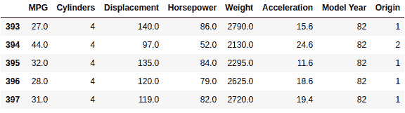

    图 3.12：数据集导入 pandas 后的最后五行

1.  清理数据中的未知值。检查有多少`Not available`数据以及其所在位置：

    ```py
    dataset.isna().sum()
    ```

    这将产生以下输出：

    ```py
    MPG             0
    Cylinders       0
    Displacement    0
    Horsepower      6
    Weight          0
    Acceleration    0
    Model Year      0
    Origin          0
    dtype: int64
    ```

1.  鉴于未知值的行数较少，只需将其删除：

    ```py
    dataset = dataset.dropna()
    ```

1.  对 `Origin` 变量使用独热编码，它是类别型变量：

    ```py
    dataset['Origin'] = dataset['Origin']\
                        .map({1: 'USA', 2: 'Europe', 3: 'Japan'})
    dataset = pd.get_dummies(dataset, prefix='', prefix_sep='')
    dataset.tail()
    ```

    输出结果如下：

    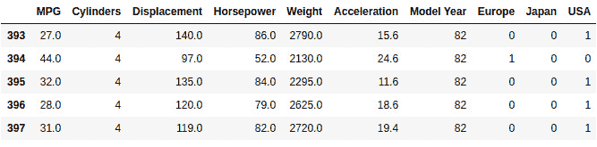

    图 3.13：使用独热编码将数据集导入 pandas 后的最后五行

1.  将数据按 80:20 的比例分为训练集和测试集：

    ```py
    train_dataset = dataset.sample(frac=0.8,random_state=0)
    test_dataset = dataset.drop(train_dataset.index)
    ```

1.  现在，让我们看一下训练数据统计，即使用`seaborn`模块展示训练集中的一些特征对的联合分布。`pairplot`命令将数据集的特征作为输入进行评估，逐对处理。在对角线上（其中一对由相同特征的两个实例组成），显示变量的分布，而在非对角项中，显示这两个特征的散点图。如果我们希望突出显示相关性，这会非常有用：

    ```py
    sns.pairplot(train_dataset[["MPG", "Cylinders", "Displacement", \
                                "Weight"]], diag_kind="kde")
    ```

    这将生成以下图像：

    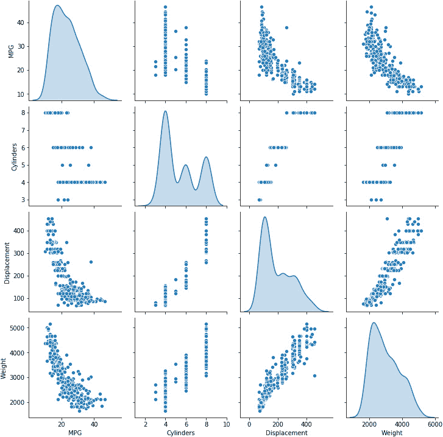

    图 3.14：训练集中的一些特征对的联合分布

1.  现在让我们来看一下整体统计数据：

    ```py
    train_stats = train_dataset.describe()
    train_stats.pop("MPG")
    train_stats = train_stats.transpose()
    train_stats
    ```

    输出将如下所示：

    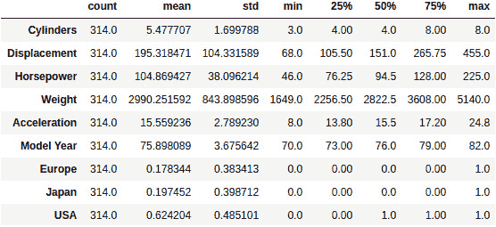

    图 3.15：整体训练集统计

1.  将特征与标签分开并对数据进行归一化：

    ```py
    train_labels = train_dataset.pop('MPG')
    test_labels = test_dataset.pop('MPG')
    def norm(x):
        return (x - train_stats['mean']) / train_stats['std']
    normed_train_data = norm(train_dataset)
    normed_test_data = norm(test_dataset)
    ```

1.  现在，让我们查看模型的创建及其摘要：

    ```py
    def build_model():
        model = tf.keras.Sequential([
                tf.keras.layers.Dense(64, activation='relu',\
                                      input_shape=[len\
                                      (train_dataset.keys())]),\
                tf.keras.layers.Dense(64, activation='relu'),\
                tf.keras.layers.Dense(1)])
        optimizer = tf.keras.optimizers.RMSprop(0.001)
        model.compile(loss='mse', optimizer=optimizer,\
                      metrics=['mae', 'mse'])
        return model
    model = build_model()
    model.summary()
    ```

    这将生成以下输出：

    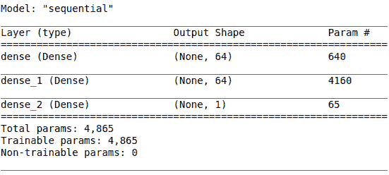

    图 3.16：模型摘要

1.  使用`fit`模型函数，通过使用 20%的验证集来训练网络 1000 个周期：

    ```py
    epochs = 1000
    history = model.fit(normed_train_data, train_labels,\
                        epochs=epochs, validation_split = 0.2, \
                        verbose=2)
    ```

    这将产生非常长的输出。我们这里只报告最后几行：

    ```py
    Epoch 999/1000251/251 - 0s - loss: 2.8630 - mae: 1.0763 
    - mse: 2.8630 - val_loss: 10.2443 - val_mae: 2.3926 
    - val_mse: 10.2443
    Epoch 1000/1000251/251 - 0s - loss: 2.7697 - mae: 0.9985 
    - mse: 2.7697 - val_loss: 9.9689 - val_mae: 2.3709 - val_mse: 9.9689
    ```

1.  通过绘制平均绝对误差（MAE）和均方误差（MSE）来可视化训练和验证指标。

    以下代码段绘制了平均绝对误差（MAE）：

    ```py
    hist = pd.DataFrame(history.history)
    hist['epoch'] = history.epoch
    plt.plot(hist['epoch'],hist['mae'])
    plt.plot(hist['epoch'],hist['val_mae'])
    plt.ylim([0, 10])
    plt.ylabel('MAE [MPG]')
    plt.legend(["Training", "Validation"])
    ```

    输出将如下所示：

    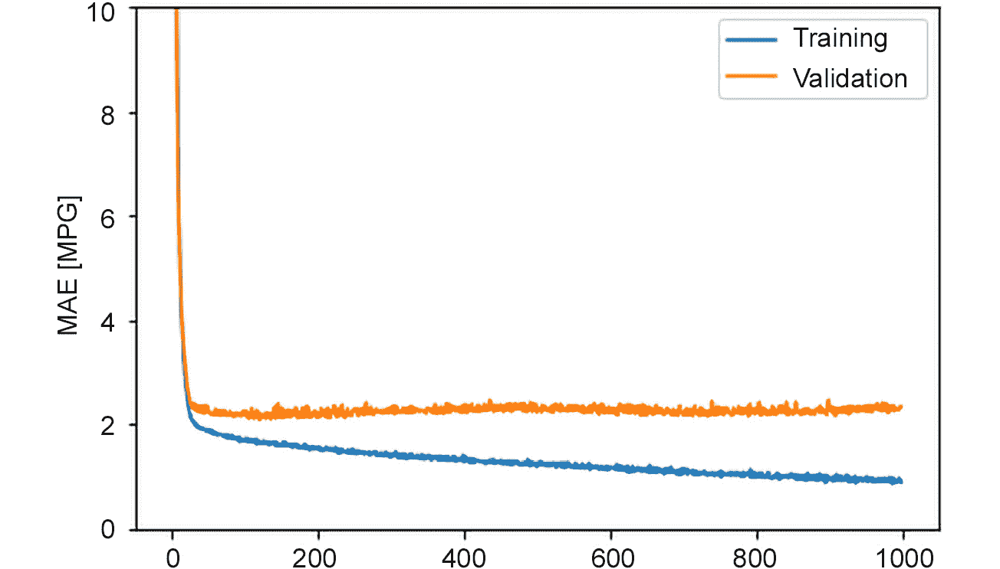

    图 3.17：每个周期图中的平均绝对误差

    前面的图表显示了增加训练周期数如何导致验证误差增加，这意味着系统正经历过拟合问题。

1.  现在，让我们通过绘制图表来可视化均方误差（MSE）：

    ```py
    plt.plot(hist['epoch'],hist['mse'])
    plt.plot(hist['epoch'],hist['val_mse'])
    plt.ylim([0, 20])
    plt.ylabel('MSE [MPG²]')
    plt.legend(["Training", "Validation"])
    ```

    输出将如下所示：

    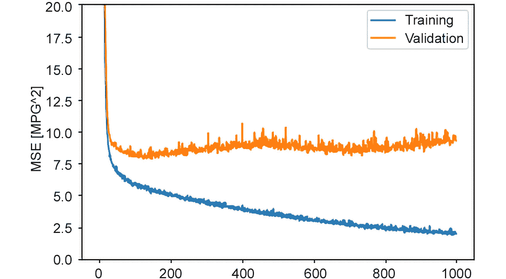

    图 3.18：每个周期图中的均方误差

    此外，在这种情况下，图表显示了增加训练周期数如何导致验证误差增加，这意味着系统正经历过拟合问题。

1.  使用 Keras 回调来添加早停（耐心参数设置为 10 个周期）以避免过拟合。首先，构建模型：

    ```py
    model = build_model()
    ```

1.  然后，定义一个早停回调。这个实体将被传递到`model.fit`函数中，并在每次拟合步骤中被调用，以检查验证误差是否在超过`10`个连续周期后停止下降：

    ```py
    early_stop = tf.keras.callbacks\
                 .EarlyStopping(monitor='val_loss', patience=10)
    ```

1.  最后，调用带有早停回调的`fit`方法：

    ```py
    early_history = model.fit(normed_train_data, train_labels,\
                              epochs=epochs, validation_split=0.2,\
                              verbose=2, callbacks=[early_stop])
    ```

    输出的最后几行如下：

    ```py
    Epoch 42/1000251/251 - 0s - loss: 7.1298 - mae: 1.9014 
    - mse: 7.1298 - val_loss: 8.1151 - val_mae: 2.1885 
    - val_mse: 8.1151
    Epoch 43/1000251/251 - 0s - loss: 7.0575 - mae: 1.8513 
    - mse: 7.0575 - val_loss: 8.4124 - val_mae: 2.2669 
    - val_mse: 8.4124
    ```

1.  可视化训练和验证指标以进行早停。首先，收集所有的训练历史数据，并将其放入一个 pandas DataFrame 中，包括指标和周期值：

    ```py
    early_hist = pd.DataFrame(early_history.history)
    early_hist['epoch'] = early_history.epoch
    ```

1.  然后，绘制训练和验证的平均绝对误差（MAE）与周期的关系，并将最大`y`值限制为`10`：

    ```py
    plt.plot(early_hist['epoch'],early_hist['mae'])
    plt.plot(early_hist['epoch'],early_hist['val_mae'])
    plt.ylim([0, 10])
    plt.ylabel('MAE [MPG]')
    plt.legend(["Training", "Validation"])
    ```

    前面的代码将产生以下输出：

    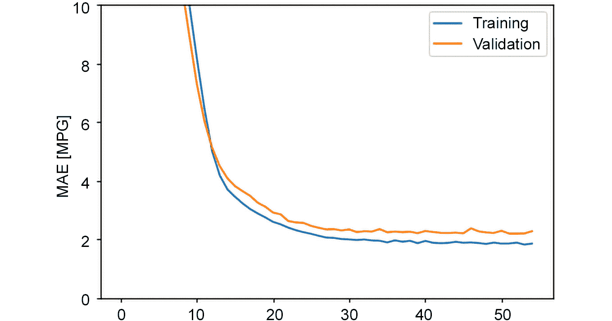

    图 3.19：在训练轮次图中的平均绝对误差（早停法）

    如前图所示，训练会在验证误差停止下降时停止，从而避免过拟合。

1.  在测试集上评估模型的准确性：

    ```py
    loss, mae, mse = model.evaluate(normed_test_data, \
                                    test_labels, verbose=2)
    print("Testing set Mean Abs Error: {:5.2f} MPG".format(mae))
    ```

    输出将如下所示：

    ```py
    78/78 - 0s - loss: 6.3067 - mae: 1.8750 - mse: 6.3067 
    Testing set Mean Abs Error:  1.87 MPG
    ```

    注意

    由于随机抽样并使用可变的随机种子，准确度可能会显示略有不同的值。

1.  最后，通过预测所有测试实例的 MPG 值来执行模型推断。然后，将这些值与它们的真实值进行比较，从而得到模型误差的视觉估计：

    ```py
    test_predictions = model.predict(normed_test_data).flatten()
    a = plt.axes(aspect='equal')
    plt.scatter(test_labels, test_predictions)
    plt.xlabel('True Values [MPG]')
    plt.ylabel('Predictions [MPG]')
    lims = [0, 50]
    plt.xlim(lims)
    plt.ylim(lims)
    _ = plt.plot(lims, lims)
    ```

    输出将如下所示：

    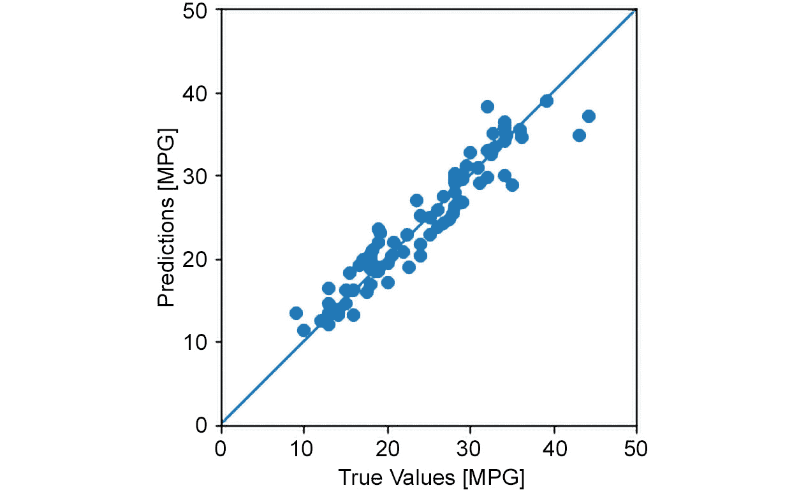

图 3.20：预测值与真实值的散点图

散点图将预测值与真实值进行对应，这意味着点越接近对角线，预测越准确。可以明显看出点的聚集程度，说明预测非常准确。

注意

要访问此特定部分的源代码，请参考 [`packt.live/3feCLNN`](https://packt.live/3feCLNN)。

你也可以在网上运行这个示例，访问 [`packt.live/37n5WeM`](https://packt.live/37n5WeM)。

本节展示了如何成功地解决回归问题。所选的数据集已经导入、清洗并细分为训练集、验证集和测试集。然后，进行了简要的探索性数据分析，接着创建了一个三层全连接的深度神经网络。该网络已经成功训练，并且在测试集上评估了其表现。

现在，让我们使用 TensorFlow 来研究分类问题。

# 使用 TensorFlow 进行简单分类

本节将帮助你理解并解决一个典型的监督学习问题，这个问题属于传统上称为**分类**的类别。

分类任务在其最简单的通用形式中，旨在将一个类别与一组预定义的实例关联起来。一个常用于入门课程的直观分类任务示例是将家庭宠物的图片分类到它们所属的正确类别中，例如“猫”或“狗”。分类在许多日常活动中发挥着基础性作用，且在不同的情境中很容易遇到。前面的例子是一个特定的分类任务，称为**图像分类**，在这一类别中可以找到许多类似的应用。

然而，分类不仅限于图像。以下是一些例子：

+   视频推荐系统的客户分类（回答问题：“该用户属于哪个市场细分？”）

+   垃圾邮件过滤器（“这封邮件是垃圾邮件的可能性有多大？”）

+   恶意软件检测（"这个程序是网络威胁吗？"）

+   医学诊断（"这个病人有病吗？"）

对于图像分类任务，图像作为输入传递给分类算法，算法返回它们所属的类别作为输出。图像是三维数组，表示每个像素的亮度（高度 x 宽度 x 通道数，其中彩色图像有三个通道——红色、绿色、蓝色（RGB），而灰度图像只有一个），这些数字是算法用来确定图像所属类别的特征。

处理其他类型的输入时，特征可能有所不同。例如，在医学诊断分类系统中，血液检查参数、年龄、性别等可以作为特征，供算法用来识别实例所属的类别，即“生病”或“未生病”。

在以下练习中，我们将基于前面部分的内容创建一个深度神经网络。它将在对 ATLAS 实验中检测到的信号进行分类时达到约 70%的准确率，区分背景噪声与希格斯玻色子τ-τ衰变，使用 28 个特征：没错，机器学习也可以应用于粒子物理学！

注

有关数据集的更多信息，请访问官方网站：[`archive.ics.uci.edu/ml/datasets/HIGGS`](http://archive.ics.uci.edu/ml/datasets/HIGGS)。

鉴于数据集的巨大规模，为了使练习便于运行并且仍然有意义，我们将对数据进行子采样：训练集将使用 10,000 行，验证集和测试集各使用 1,000 行。将训练三种不同的模型：一个小模型作为参考（两层，每层分别为 16 和 1 个神经元），一个不带防止过拟合措施的大模型（五层；四层有 512 个神经元，最后一层有 1 个神经元），用以展示在这种情况下可能遇到的问题，随后将向大模型添加正则化和 dropout，有效限制过拟合并提高性能。

## 练习 3.06：创建一个深度神经网络，分类 ATLAS 实验中为寻找希格斯玻色子而生成的事件

在这个练习中，我们将构建、训练并测量深度神经网络的性能，以通过使用带有特征的模拟数据来提高 ATLAS 实验的发现显著性，从而对事件进行分类。任务是将事件分类为两类：“希格斯玻色子的τ衰变”与“背景”。

此数据集可以在 TensorFlow 数据集（[`www.tensorflow.org/datasets`](https://www.tensorflow.org/datasets)）中找到，它是一个现成的可用数据集集合。可以通过处理管道进行下载和接口。由于我们当前的用途，原始数据集太大，因此我们将在本章活动中使用该数据集时再使用它。现在，我们将使用通过仓库直接提供的数据集子集。

注意

您可以在本书的 GitHub 仓库中找到数据集，链接地址是：[`packt.live/3dUfYq8`](https://packt.live/3dUfYq8)。

步骤逐一描述如下：

1.  导入所有必需的模块并打印最重要模块的版本：

    ```py
    from __future__ import absolute_import, division, \
    print_function, unicode_literals
    from  IPython import display
    from matplotlib import pyplot as plt
    from scipy.ndimage.filters import gaussian_filter1d
    import pandas as pd
    import numpy as np
    import tensorflow as tf
    print("TensorFlow version: {}".format(tf.__version__))
    ```

    输出将如下所示：

    ```py
    TensorFlow version: 2.1.0
    ```

1.  导入数据集并为预处理准备数据。

    对于本次练习，我们将下载一个从原始数据集中提取的小型自定义子集：

    ```py
    higgs_path = tf.keras.utils.get_file('HIGGSSmall.csv.gz', \
                 'https://github.com/PacktWorkshops/'\
                 'The-Reinforcement-Learning-Workshop/blob/'\
                 'master/Chapter03/Dataset/HIGGSSmall.csv.gz?raw=true')
    ```

1.  将 CSV 数据集读取为 TensorFlow 数据集类，并重新打包成包含元组（`features`，`labels`）的形式：

    ```py
    N_TEST = int(1e3)
    N_VALIDATION = int(1e3)
    N_TRAIN = int(1e4)
    BUFFER_SIZE = int(N_TRAIN)
    BATCH_SIZE = 500
    STEPS_PER_EPOCH = N_TRAIN//BATCH_SIZE
    N_FEATURES = 28
    ds = tf.data.experimental\
         .CsvDataset(higgs_path,[float(),]*(N_FEATURES+1), \
                     compression_type="GZIP")
    def pack_row(*row):
        label = row[0]
        features = tf.stack(row[1:],1)
        return features, label
    packed_ds = ds.batch(N_TRAIN).map(pack_row).unbatch()
    ```

    查看特征的值分布：

    ```py
    for features,label in packed_ds.batch(1000).take(1):
        print(features[0])
        plt.hist(features.numpy().flatten(), bins = 101)
    ```

    输出将如下所示：

    ```py
    tf.Tensor(
    [ 0.8692932 -0.6350818  0.22569026  0.32747006 -0.6899932
      0.7542022 -0.2485731 -1.0920639   0\.          1.3749921
     -0.6536742  0.9303491  1.1074361   1.1389043  -1.5781983
     -1.0469854  0\.         0.65792954 -0.01045457 -0.04576717
      3.1019614  1.35376    0.9795631   0.97807616  0.92000484
      0.72165745 0.98875093 0.87667835], shape=(28,), dtype=float32)
    ```

    绘图将如下所示：

    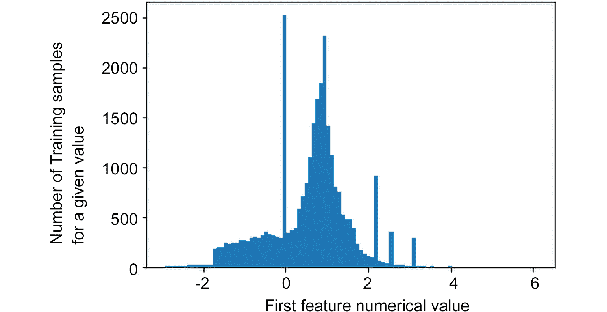

    图 3.21：第一特征值分布

    在前面的图中，*x*轴表示给定值的训练样本数量，而*y*轴表示第一个特征的数值。

1.  创建训练集、验证集和测试集：

    ```py
    validate_ds = packed_ds.take(N_VALIDATION).cache()
    test_ds = packed_ds.skip(N_VALIDATION).take(N_TEST).cache()
    train_ds = packed_ds.skip(N_VALIDATION+N_TEST)\
               .take(N_TRAIN).cache()
    ```

1.  定义特征、标签和类别名称：

    ```py
    feature_names = ["lepton pT", "lepton eta", "lepton phi",\
                     "missing energy magnitude", \
                     "missing energy phi",\
                     "jet 1 pt", "jet 1 eta", "jet 1 phi",\
                     "jet 1 b-tag",\
                     "jet 2 pt", "jet 2 eta", "jet 2 phi",\
                     "jet 2 b-tag",\
                     "jet 3 pt", "jet 3 eta", "jet 3 phi",\
                     "jet 3 b-tag",\
                     "jet 4 pt", "jet 4 eta", "jet 4 phi",\
                     "jet 4 b-tag",\
                     "m_jj", "m_jjj", "m_lv", "m_jlv", "m_bb",\
                     "m_wbb", "m_wwbb"]
    label_name = ['Measure']
    class_names = ['Signal', 'Background']
    print("Features: {}".format(feature_names))
    print("Label: {}".format(label_name))
    print("Class names: {}".format(class_names))
    ```

    输出将如下所示：

    ```py
    Features: ['lepton pT', 'lepton eta', 'lepton phi', 
    'missing energy magnitude', 'missing energy phi', 
    'jet 1 pt', 'jet 1 eta', 'jet 1 phi', 'jet 1 b-tag', 
    'jet 2 pt', 'jet 2 eta', 'jet 2 phi', 'jet 2 b-tag', 
    'jet 3 pt', 'jet 3 eta', 'jet 3 phi', 'jet 3 b-tag', 
    'jet 4 pt', 'jet 4 eta', 'jet 4 phi', 'jet 4 b-tag', 
    'm_jj', 'm_jjj', 'm_lv', 'm_jlv', 'm_bb', 'm_wbb', 'm_wwbb']
    Label: ['Measure']
    Class names: ['Signal', 'Background']
    ```

1.  显示一个训练实例的特征和标签示例：

    ```py
    features, labels = next(iter(train_ds))
    print("Features =")
    print(features.numpy())
    print("Labels =")
    print(labels.numpy())
    ```

    输出将如下所示：

    ```py
    Features =
    [ 0.3923715   1.3781117   1.5673449   0.17123567  1.6574531  
    0.86394763    0.88821083  1.4797885   2.1730762   1.2008675   
    0.9490923 -0.30092147    2.2148721   1.277294    0.4025028  
    0.50748837  0\.         0.50555664
     -0.55428815 -0.7055601   0\.          0.94152564  0.9448251  
    0.9839765    0.7801499   1.4989641   0.91668195  0.8027126 ]
    Labels = 0.0
    ```

1.  给数据集分配批次大小：

    ```py
    test_ds = test_ds.batch(BATCH_SIZE)
    validate_ds = validate_ds.batch(BATCH_SIZE)
    train_ds = train_ds.shuffle(BUFFER_SIZE).repeat()\
               .batch(BATCH_SIZE)
    ```

1.  现在，让我们开始创建模型并进行训练。创建一个递减学习率：

    ```py
    lr_schedule = tf.keras.optimizers.schedules\
                  .InverseTimeDecay(0.001,\
                                    decay_steps=STEPS_PER_EPOCH*1000, \
                                    decay_rate=1,  staircase=False)
    ```

1.  定义一个函数，该函数将使用`Adam`优化器编译模型，使用二元交叉熵作为`loss`函数，并通过在验证数据集上使用早停法对训练数据进行拟合。

    该函数以模型作为输入，选择`Adam`优化器，并使用二元交叉熵损失和准确度指标对模型进行编译：

    ```py
    def compile_and_fit(model, name, max_epochs=3000):
        optimizer = tf.keras.optimizers.Adam(lr_schedule)
        model.compile(optimizer=optimizer,\
        loss=tf.keras.losses.BinaryCrossentropy(from_logits=True),\
        metrics=[tf.keras.losses.BinaryCrossentropy(from_logits=True,\
                 name='binary_crossentropy'),'accuracy'])
    ```

    然后打印模型的摘要，如下所示：

    ```py
        model.summary()
    ```

1.  然后，使用验证数据集和早停回调在训练数据集上拟合模型。训练的`history`被保存并作为输出返回：

    ```py
        history = model.fit(train_ds, \
                  steps_per_epoch = STEPS_PER_EPOCH,\
                  epochs=max_epochs, validation_data=validate_ds, \
                  callbacks=[tf.keras.callbacks\
                             .EarlyStopping\
                             (monitor='val_binary_crossentropy',\
                             patience=200)],verbose=2)
        return history
    ```

1.  创建一个仅有两层的小型模型，分别为 16 个和 1 个神经元，并对其进行编译并在数据集上进行拟合：

    ```py
    small_model = tf.keras.Sequential([\
                  tf.keras.layers.Dense(16, activation='elu',\
                                        input_shape=(N_FEATURES,)),\
                  tf.keras.layers.Dense(1)])
    size_histories = {}
    size_histories['small'] = compile_and_fit(small_model, 'sizes/small')
    ```

    这将产生一个较长的输出，其中最后两行将类似于以下内容：

    ```py
    Epoch 1522/3000
    20/20 - 0s - loss: 0.5693 - binary_crossentropy: 0.5693 
    - accuracy: 0.6846 - val_loss: 0.5841 
    - val_binary_crossentropy: 0.5841 - val_accuracy: 0.6640
    Epoch 1523/3000
    20/20 - 0s - loss: 0.5695 - binary_crossentropy: 0.5695 
    - accuracy: 0.6822 - val_loss: 0.5845 
    - val_binary_crossentropy: 0.5845 - val_accuracy: 0.6600
    ```

1.  检查模型在测试集上的表现：

    ```py
    test_accuracy = tf.keras.metrics.Accuracy()
    for (features, labels) in test_ds:
        logits = small_model(features)
        probabilities = tf.keras.activations.sigmoid(logits)
        predictions = 1*(probabilities.numpy() > 0.5)
        test_accuracy(predictions, labels)
        small_model_accuracy = test_accuracy.result()
    print("Test set accuracy:{:.3%}".format(test_accuracy.result()))
    ```

    输出将如下所示：

    ```py
    Test set accuracy: 68.200%
    ```

    注意

    由于使用了具有可变随机种子的随机抽样，准确率可能会显示略有不同的值。

1.  创建一个具有五层的大型模型——前四层分别为`512`个神经元，最后一层为`1`个神经元——并对其进行编译和拟合：

    ```py
    large_model = tf.keras.Sequential([\
                  tf.keras.layers.Dense(512, activation='elu',\
                                        input_shape=(N_FEATURES,)),\
                  tf.keras.layers.Dense(512, activation='elu'),\
                  tf.keras.layers.Dense(512, activation='elu'),\
                  tf.keras.layers.Dense(512, activation='elu'),\
                  tf.keras.layers.Dense(1)]) 
    size_histories['large'] = compile_and_fit(large_model, "sizes/large")
    ```

    这将产生一个较长的输出，最后两行将类似于以下内容：

    ```py
    Epoch 221/3000
    20/20 - 0s - loss: 1.0285e-04 - binary_crossentropy: 1.0285e-04 
    - accuracy: 1.0000 - val_loss: 2.5506 
    - val_binary_crossentropy: 2.5506 - val_accuracy: 0.6660
    Epoch 222/3000
    20/20 - 0s - loss: 1.0099e-04 - binary_crossentropy: 1.0099e-04 
    - accuracy: 1.0000 - val_loss: 2.5586 
    - val_binary_crossentropy: 2.5586 - val_accuracy: 0.6650
    ```

1.  检查模型在测试集上的表现：

    ```py
    test_accuracy = tf.keras.metrics.Accuracy()
    for (features, labels) in test_ds:
        logits = large_model(features)
        probabilities = tf.keras.activations.sigmoid(logits)
        predictions = 1*(probabilities.numpy() > 0.5)
        test_accuracy(predictions, labels)
        large_model_accuracy = test_accuracy.result()
        regularization_model_accuracy = test_accuracy.result()
    print("Test set accuracy: {:.3%}"\
          . format(regularization_model_accuracy))
    ```

    输出将如下所示：

    ```py
    Test set accuracy: 65.200%
    ```

    注意

    由于使用带有可变随机种子的随机抽样，准确度可能会显示出略有不同的值。

1.  创建与之前相同的大型模型，但添加正则化项，如 L2 正则化和 dropout。然后，编译并将模型拟合到数据集上：

    ```py
    regularization_model = tf.keras.Sequential([\
                           tf.keras.layers.Dense(512,\
                           kernel_regularizer=tf.keras.regularizers\
                                              .l2(0.0001),\
                           activation='elu', \
                           input_shape=(N_FEATURES,)),\
                           tf.keras.layers.Dropout(0.5),\
                           tf.keras.layers.Dense(512,\
                           kernel_regularizer=tf.keras.regularizers\
                                              .l2(0.0001),\
                           activation='elu'),\
                           tf.keras.layers.Dropout(0.5),\
                           tf.keras.layers.Dense(512,\
                           kernel_regularizer=tf.keras.regularizers\
                                              .l2(0.0001),\
                           activation='elu'),\
                           tf.keras.layers.Dropout(0.5),\
                           tf.keras.layers.Dense(512,\
                           kernel_regularizer=tf.keras.regularizers\
                                              .l2(0.0001),\
                           activation='elu'),\
                           tf.keras.layers.Dropout(0.5),\
                           tf.keras.layers.Dense(1)])
    size_histories['regularization'] = compile_and_fit\
                                       (regularization_model,\
                                        "regularizers/regularization",\
                                        max_epochs=9000)
    ```

    这将产生一个较长的输出，最后两行将类似于以下内容：

    ```py
    Epoch 1264/9000
    20/20 - 0s - loss: 0.5873 - binary_crossentropy: 0.5469 
    - accuracy: 0.6978 - val_loss: 0.5819 
    - val_binary_crossentropy: 0.5416 - val_accuracy: 0.7030
    Epoch 1265/9000
    20/20 - 0s - loss: 0.5868 - binary_crossentropy: 0.5465 
    - accuracy: 0.7024 - val_loss: 0.5759 
    - val_binary_crossentropy: 0.5356 - val_accuracy: 0.7100
    ```

1.  检查模型在测试集上的表现：

    ```py
    test_accuracy = tf.keras.metrics.Accuracy()
    for (features, labels) in test_ds:
        logits = regularization_model (features)
        probabilities = tf.keras.activations.sigmoid(logits)
        predictions = 1*(probabilities.numpy() > 0.5)
        test_accuracy(predictions, labels)
    print("Test set accuracy: {:.3%}".format(test_accuracy.result()))
    ```

    输出将如下所示：

    ```py
    Test set accuracy: 69.300%
    ```

    注意

    由于使用带有可变随机种子的随机抽样，准确度可能会显示出略有不同的值。

1.  比较三种模型在训练轮次中的二元交叉熵趋势：

    ```py
    histSmall = pd.DataFrame(size_histories["small"].history)
    histSmall['epoch'] = size_histories["small"].epoch
    histLarge = pd.DataFrame(size_histories["large"].history)
    histLarge['epoch'] = size_histories["large"].epoch
    histReg = pd.DataFrame(size_histories["regularization"].history)
    histReg['epoch'] = size_histories["regularization"].epoch
    trainSmoothSmall = gaussian_filter1d\
                       (histSmall['binary_crossentropy'], sigma=3)
    testSmoothSmall = gaussian_filter1d\
                      (histSmall['val_binary_crossentropy'], sigma=3)
    trainSmoothLarge = gaussian_filter1d\
                       (histLarge['binary_crossentropy'], sigma=3)
    testSmoothLarge = gaussian_filter1d\
                      (histLarge['val_binary_crossentropy'], sigma=3)
    trainSmoothReg = gaussian_filter1d\
                     (histReg['binary_crossentropy'], sigma=3)
    testSmoothReg = gaussian_filter1d\
                    (histReg['val_binary_crossentropy'], sigma=3)
    plt.plot(histSmall['epoch'], trainSmoothSmall, '-', \
             histSmall['epoch'], testSmoothSmall, '--')
    plt.plot(histLarge['epoch'], trainSmoothLarge, '-', \
             histLarge['epoch'], testSmoothLarge, '--')
    plt.plot(histReg['epoch'], trainSmoothReg, '-', \
             histReg['epoch'], testSmoothReg, '--',)
    plt.ylim([0.5, 0.7])
    plt.ylabel('Binary Crossentropy')
    plt.legend(["Small Training", "Small Validation", \
                "Large Training", "Large Validation", \
                "Regularization Training", \
                "Regularization Validation"])
    ```

    这将生成以下图表：

    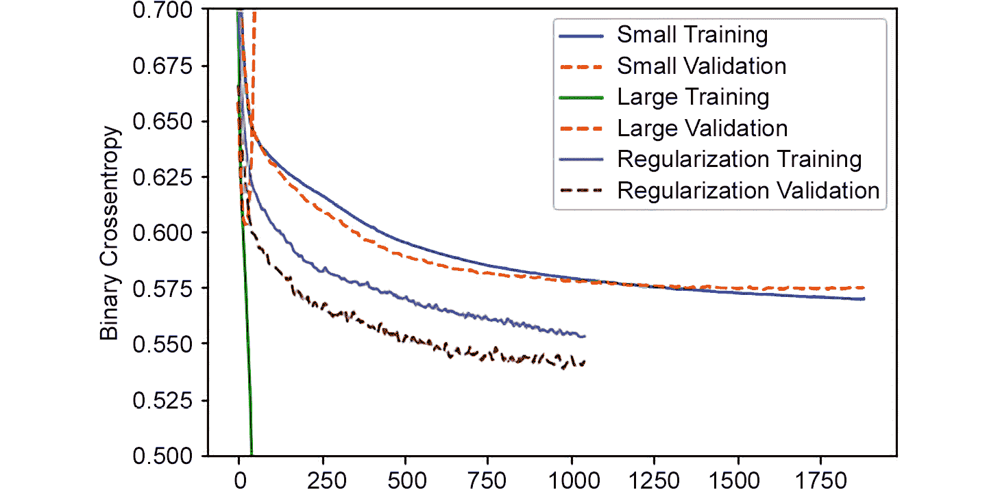

    图 3.22：二元交叉熵比较

    上述图表展示了不同模型在训练和验证误差方面的比较，以演示过拟合的工作原理。每个模型的训练误差随着训练轮次的增加而下降。而大型模型的验证误差则在经过一定轮次后迅速增加。在小型模型中，验证误差下降，紧跟着训练误差，并最终表现出比带有正则化的模型更差的结果，后者避免了过拟合，并在三者中表现最佳。

1.  比较三种模型在训练轮次中的准确度趋势：

    ```py
    trainSmoothSmall = gaussian_filter1d\
                       (histSmall['accuracy'], sigma=6)
    testSmoothSmall = gaussian_filter1d\
                      (histSmall['val_accuracy'], sigma=6)
    trainSmoothLarge = gaussian_filter1d\
                       (histLarge['accuracy'], sigma=6)
    testSmoothLarge = gaussian_filter1d\
                      (histLarge['val_accuracy'], sigma=6)
    trainSmoothReg = gaussian_filter1d\
                     (histReg['accuracy'], sigma=6)
    testSmoothReg = gaussian_filter1d\
                    (histReg['val_accuracy'], sigma=6)
    plt.plot(histSmall['epoch'], trainSmoothSmall, '-', \
             histSmall['epoch'], testSmoothSmall, '--')
    plt.plot(histLarge['epoch'], trainSmoothLarge, '-', \
             histLarge['epoch'], testSmoothLarge, '--')
    plt.plot(histReg['epoch'], trainSmoothReg, '-', \
             histReg['epoch'], testSmoothReg, '--',)
    plt.ylim([0.5, 0.75])
    plt.ylabel('Accuracy')
    plt.legend(["Small Training", "Small Validation", \
                "Large Training", "Large Validation",\
                "Regularization Training", \
                "Regularization Validation",])
    ```

    这将生成以下图表：

    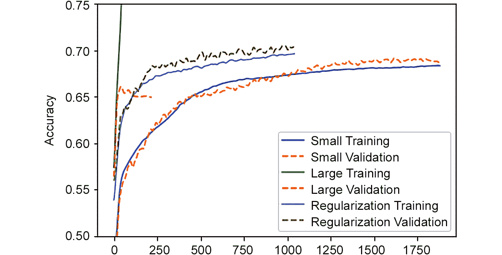

图 3.23：准确度比较

与之前的图表以镜像方式类似，这个图表再次展示了不同模型的比较，但从准确度的角度来看。当训练的轮次增加时，每个模型的训练准确度都会提高。另一方面，大型模型的验证准确度在经过若干轮次后停止增长。而在小型模型中，验证准确度上升，并紧跟着训练准确度，最终的表现差于带有正则化的模型，后者避免了过拟合，并在三者中达到了最佳表现。

注意

要获取此特定部分的源代码，请参考[`packt.live/37m9huu`](https://packt.live/37m9huu)。

您还可以在[`packt.live/3hhIDaZ`](https://packt.live/3hhIDaZ)在线运行此示例。

在这一部分中，我们解决了一个复杂的分类问题，从而创建了一个深度学习模型，能够在使用模拟的 ATLAS 实验数据对希格斯玻色子相关信号进行分类时达到约 70% 的准确率。经过对数据集的初步概览，了解了它的组织方式以及特征和标签的性质后，使用 Keras API 创建了三层深度全连接神经网络。这些模型经过训练和测试，并比较了它们在各个周期中的损失和准确率，从而使我们牢牢掌握了过拟合问题，并知道哪些技术有助于解决该问题。

# TensorBoard - 如何使用 TensorBoard 可视化数据

TensorBoard 是一个嵌入在 TensorFlow 中的基于 Web 的工具。它提供了一套方法，我们可以用来深入了解 TensorFlow 会话和图，从而使用户能够检查、可视化并深刻理解它们。它以直观的方式提供许多功能，如下所示：

+   它允许我们探索 TensorFlow 模型图的详细信息，使用户能够缩放到特定的块和子部分。

+   它可以生成我们在训练过程中可以查看的典型量的图表，如损失和准确率。

+   它提供了直方图可视化，展示张量随时间变化的情况。

+   它提供了层权重和偏置在各个周期中的变化趋势。

+   它存储运行时元数据，例如总内存使用情况。

+   它可视化嵌入。

TensorBoard 读取包含有关当前训练过程的摘要信息的 TensorFlow 日志文件。这些信息是通过适当的回调生成的，然后传递给 TensorFlow 作业。

以下截图展示了 TensorBoard 提供的一些典型可视化内容。第一个是“标量”部分，展示了与训练阶段相关的标量量。在这个例子中，准确率和二进制交叉熵被表示出来：

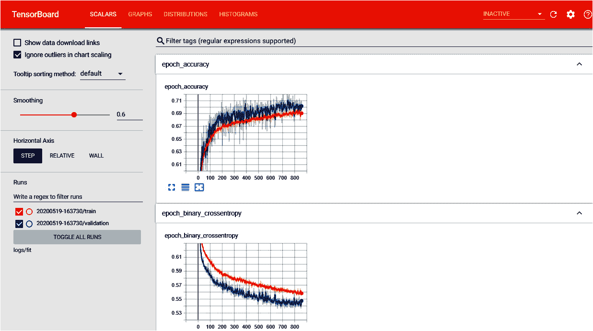

图 3.24：TensorBoard 标量

第二种视图提供了计算图的框图可视化，所有层及其关系都被一起呈现，如下图所示：

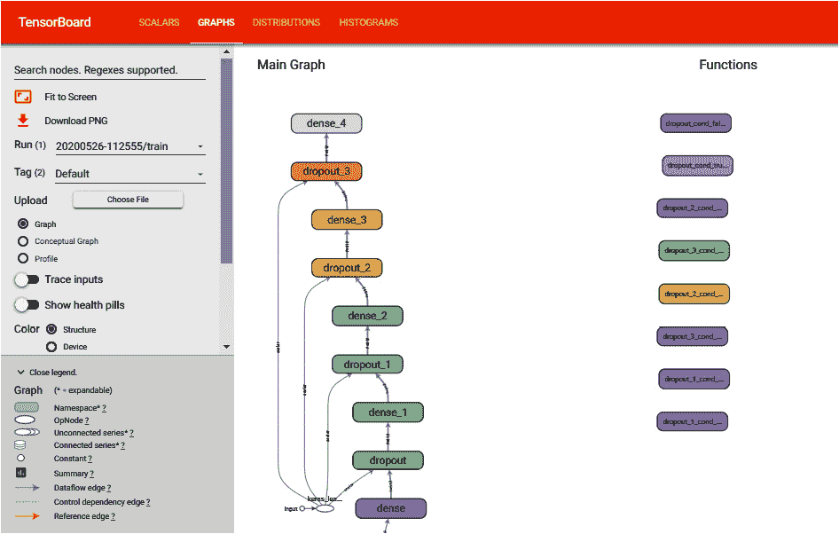

图 3.25：TensorBoard 图

`DISTRIBUTIONS` 标签提供了模型参数在各个周期中的分布概览，如下图所示：

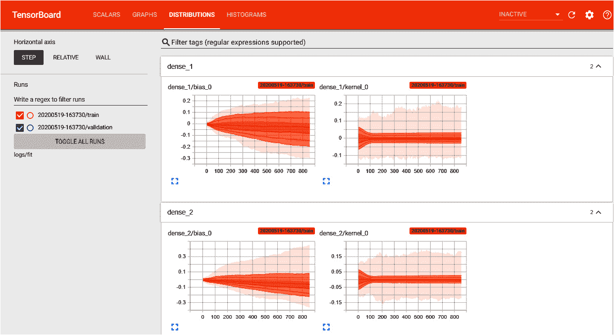

图 3.26：TensorBoard 分布

最后，`HISTOGRAMS` 标签提供与 `DISTRIBUTIONS` 标签类似的信息，但以 3D 展示，如下图所示：

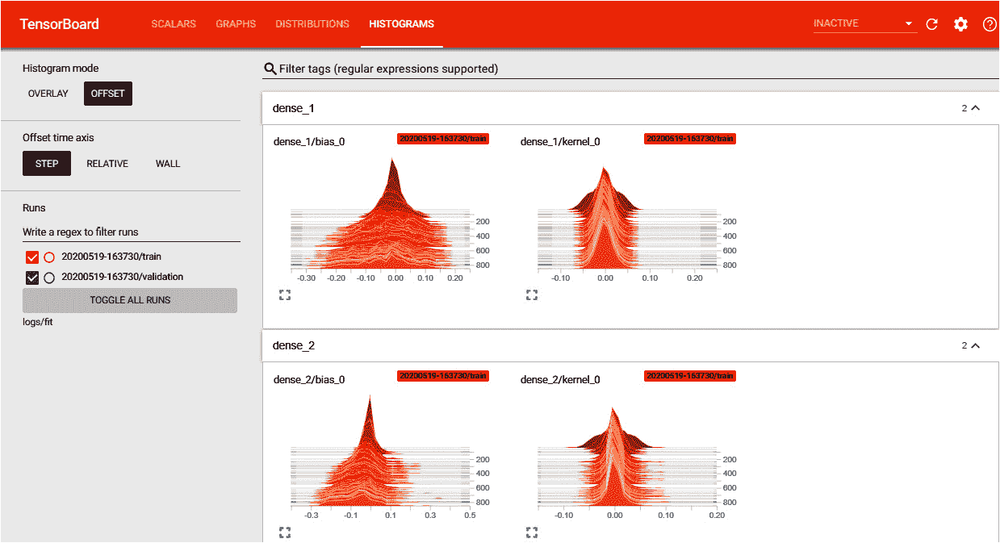

图 3.27：TensorBoard 直方图

在本节中，特别是在接下来的练习中，将利用 TensorBoard 轻松地可视化指标，如趋势、张量图、分布和直方图。

为了专注于 TensorBoard，我们将使用在上一部分中执行的相同分类练习。只会训练大型模型。我们需要做的就是导入 TensorBoard 并激活它，同时定义日志文件目录。

然后创建一个 TensorBoard 回调并将其传递给模型的 `fit` 方法。这将生成所有 TensorBoard 文件并保存在日志目录中。一旦训练完成，日志目录路径将作为参数传递给 TensorBoard。这将打开一个基于 Web 的可视化工具，用户可以深入了解模型及其训练相关的各个方面。

## 练习 3.07：创建一个深度神经网络，用于分类 ATLAS 实验中生成的事件，以寻找希格斯玻色子，并使用 TensorBoard 进行可视化

在本练习中，我们将构建、训练并测量一个深度神经网络的表现，目标与*练习 3.06，创建一个深度神经网络，用于分类 ATLAS 实验中生成的事件，以寻找希格斯玻色子*相同，但这次我们将利用 TensorBoard，从中获得更多的训练洞察。

为了完成这个练习，需要实现以下步骤：

1.  导入所有必需的模块：

    ```py
    from __future__ import absolute_import, division, \
    print_function, unicode_literals
    from  IPython import display
    from matplotlib import pyplot as plt
    from scipy.ndimage.filters import gaussian_filter1d
    import pandas as pd
    import numpy as np
    import datetime

    import tensorflow as tf

    !rm -rf ./logs/ 

    # Load the TensorBoard notebook extension
    %load_ext tensorboard
    ```

1.  下载原始数据集的定制小子集：

    ```py
    higgs_path = tf.keras.utils.get_file('HIGGSSmall.csv.gz', \
                 'https://github.com/PacktWorkshops/'\
                 'The-Reinforcement-Learning-Workshop/blob/master/'\
                 'Chapter03/Dataset/HIGGSSmall.csv.gz?raw=true')
    ```

1.  将 CSV 数据集读入 TensorFlow 数据集类，并重新打包，以便它具有元组（`features`，`labels`）：

    ```py
    N_TEST = int(1e3)
    N_VALIDATION = int(1e3)
    N_TRAIN = int(1e4)
    BUFFER_SIZE = int(N_TRAIN)
    BATCH_SIZE = 500
    STEPS_PER_EPOCH = N_TRAIN//BATCH_SIZE

    N_FEATURES = 28

    ds = tf.data.experimental.CsvDataset\
         (higgs_path,[float(),]*(N_FEATURES+1), \
          compression_type="GZIP")
    def pack_row(*row):
        label = row[0]
        features = tf.stack(row[1:],1)
        return features, label
    packed_ds = ds.batch(N_TRAIN).map(pack_row).unbatch()
    ```

1.  创建训练集、验证集和测试集，并为它们分配`BATCH_SIZE`参数：

    ```py
    validate_ds = packed_ds.take(N_VALIDATION).cache()
    test_ds = packed_ds.skip(N_VALIDATION).take(N_TEST).cache()
    train_ds = packed_ds.skip(N_VALIDATION+N_TEST)\
               .take(N_TRAIN).cache()

    test_ds = test_ds.batch(BATCH_SIZE)
    validate_ds = validate_ds.batch(BATCH_SIZE)
    train_ds = train_ds.shuffle(BUFFER_SIZE)\
               .repeat().batch(BATCH_SIZE)
    ```

1.  现在，让我们开始创建模型并进行训练。创建一个衰减学习率：

    ```py
    lr_schedule = tf.keras.optimizers.schedules\
                  .InverseTimeDecay(0.001, \
                                    decay_steps=STEPS_PER_EPOCH*1000,\
                                    decay_rate=1, staircase=False)
    ```

1.  定义一个函数，该函数将使用 `Adam` 优化器编译模型，并使用二元交叉熵作为 `loss` 函数。然后，使用验证数据集通过早停法拟合训练数据，并使用 TensorBoard 回调：

    ```py
    log_dir = "logs/fit/" + datetime.datetime.now()\
              .strftime("%Y%m%d-%H%M%S")
    def compile_and_fit(model, name, max_epochs=3000):
        optimizer = tf.keras.optimizers.Adam(lr_schedule)
        model.compile(optimizer=optimizer,\
        loss=tf.keras.losses.BinaryCrossentropy(from_logits=True),\
        metrics=[tf.keras.losses.BinaryCrossentropy\
                (from_logits=True, name='binary_crossentropy'),\
                 'accuracy'])
        model.summary()
        tensorboard_callback = tf.keras.callbacks.TensorBoard\
                               (log_dir=log_dir,\
                                histogram_freq=1,\
                                profile_batch=0)
        history = model.fit\
                  (train_ds,\
                   steps_per_epoch = STEPS_PER_EPOCH,\
                   epochs=max_epochs,\
                   validation_data=validate_ds,\
                   callbacks=[tf.keras.callbacks.EarlyStopping\
                             (monitor='val_binary_crossentropy',\
                              patience=200),\
                              tensorboard_callback],               verbose=2)
        return history
    ```

1.  创建与之前相同的大型模型，并加入正则化项，如 L2 正则化和丢弃法，然后对其进行编译，并在数据集上拟合：

    ```py
    regularization_model = tf.keras.Sequential([\
                           tf.keras.layers.Dense(512,\
                           kernel_regularizer=tf.keras.regularizers\
                                              .l2(0.0001),\
                           activation='elu', \
                           input_shape=(N_FEATURES,)),\
                           tf.keras.layers.Dropout(0.5),\
                           tf.keras.layers.Dense(512,\
                           kernel_regularizer=tf.keras.regularizers\
                                              .l2(0.0001),\
                           activation='elu'),\
                           tf.keras.layers.Dropout(0.5),\
                           tf.keras.layers.Dense(512,\
                           kernel_regularizer=tf.keras.regularizers\
                                              .l2(0.0001),\
                           activation='elu'),\
                           tf.keras.layers.Dropout(0.5),\
                           tf.keras.layers.Dense(512,\
                           kernel_regularizer=tf.keras.regularizers\
                                              .l2(0.0001),\
                           activation='elu'),\
                           tf.keras.layers.Dropout(0.5),\
                           tf.keras.layers.Dense(1)])
    compile_and_fit(regularization_model,\
                    "regularizers/regularization", max_epochs=9000)
    ```

    最后一行输出将如下所示：

    ```py
    Epoch 1112/9000
    20/20 - 1s - loss: 0.5887 - binary_crossentropy: 0.5515 
    - accuracy: 0.6949 - val_loss: 0.5831 
    - val_binary_crossentropy: 0.5459 - val_accuracy: 0.6960
    ```

1.  检查模型在测试集上的表现：

    ```py
    test_accuracy = tf.keras.metrics.Accuracy()
    for (features, labels) in test_ds:
        logits = regularization_model(features)
        probabilities = tf.keras.activations.sigmoid(logits)
        predictions = 1*(probabilities.numpy() > 0.5)
        test_accuracy(predictions, labels)
    print("Test set accuracy: {:.3%}".format(test_accuracy.result()))
    ```

    输出将如下所示：

    ```py
    Test set accuracy: 69.300%
    ```

    注意

    由于随机抽样和可变的随机种子，准确度可能会显示略微不同的值。

1.  使用 TensorBoard 可视化变量：

    ```py
    %tensorboard --logdir logs/fit
    ```

    此命令启动基于 Web 的可视化工具。下图表示四个主要窗口，按顺时针顺序从左上角开始，显示有关损失和准确度、模型图、直方图和分布的信息：

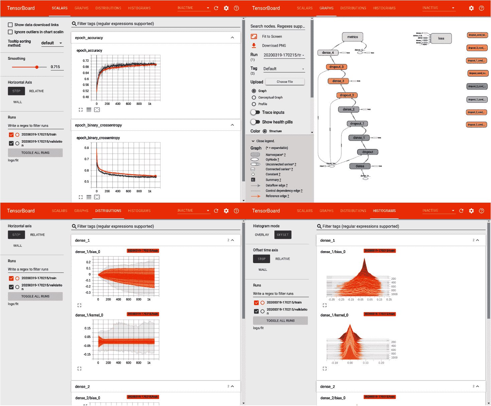

图 3.28：TensorBoard 可视化

使用 TensorBoard 的优点非常明显：所有训练信息都集中在一个地方，方便用户轻松浏览。左上角的`SCALARS`标签允许用户监控损失和准确度，从而能够以更简便的方式查看我们之前看到的相同图表。

在右上角，显示了模型图，因此可以通过经过每个模块来可视化输入数据如何流入计算图。

底部的两个视图以两种不同的表示方式显示相同的信息：所有模型参数（网络权重和偏差）的分布在训练周期中得以展示。左侧的`DISTRIBUTIONS`标签以 2D 展示参数，而`HISTOGRAMS`标签则以 3D 展开参数。两者都允许用户监控训练过程中可训练参数的变化。

注意

要访问此部分的源代码，请参考[`packt.live/2AWGjFv`](https://packt.live/2AWGjFv)。

你还可以在线运行此示例，访问[`packt.live/2YrWl2d`](https://packt.live/2YrWl2d)。

在这一部分，我们主要讨论了如何使用 TensorBoard 可视化与训练相关的模型参数。我们看到，从一个已经熟悉的问题出发，加入 TensorBoard 的基于 Web 的可视化工具并直接在 Python 笔记本内浏览所有插件变得非常简单。

现在，让我们通过一个活动来检验我们所有的知识。

## 活动 3.01：使用 TensorFlow 数据集和 TensorFlow 2 对时尚服装进行分类

假设你需要为一个拥有服装仓库的公司编写图像处理算法。公司希望根据摄像头输出自动分类服装，从而实现无人工干预地将服装分组。

在本活动中，我们将创建一个深度全连接神经网络，能够完成此类任务，即通过将图像分配到它们所属的类别来准确分类服装。

以下步骤将帮助你完成此活动：

1.  导入所有必需的模块，如`numpy`、`matplotlib.pyplot`、`tensorflow` 和 `tensorflow_datasets`，并打印出它们的主模块版本。

1.  使用 TensorFlow 数据集导入 Fashion MNIST 数据集，并将其拆分为训练集和测试集。

1.  探索数据集，熟悉输入特征，即形状、标签和类别。

1.  可视化一些训练集的实例。

1.  通过构建分类模型进行数据归一化。

1.  训练深度神经网络。

1.  测试模型的准确性。你应该获得超过 88% 的准确率。

1.  执行推理并检查预测结果与实际标签的对比。

    到本活动结束时，训练好的模型应该能够以超过 88% 的准确率分类所有时尚物品（服装、鞋子、包包等），从而生成类似于以下图像所示的结果：


图 3.29：使用深度神经网络输出进行衣物分类

注意

本活动的解决方案可以在第 696 页找到。

# 摘要

在这一章中，我们介绍了使用 TensorFlow 2 和 Keras 进行实用深度学习的内容，讨论了它们的关键特性和应用，以及它们如何协同工作。我们熟悉了低级 API 和高级 API 之间的区别，并了解了如何利用最先进的模块简化深度模型的创建。接着，我们讨论了如何使用 TensorFlow 实现深度神经网络，并涵盖了一些主要话题：从模型创建、训练、验证到测试，我们强调了避免陷阱时需要考虑的最重要方面。我们展示了如何通过 Keras API 构建不同类型的深度学习模型，如全连接、卷积和递归神经网络。我们解决了回归任务和分类问题，从中获得了实践经验。我们还学习了如何利用 TensorBoard 可视化与训练趋势相关的多种指标和模型参数。最后，我们构建并训练了一个能够高准确率地分类时尚物品图像的模型，这项活动展示了如何借助最先进的深度学习技术解决一个可能的现实世界问题。

在下一章中，我们将研究 OpenAI Gym 环境以及如何使用 TensorFlow 2 进行强化学习。
