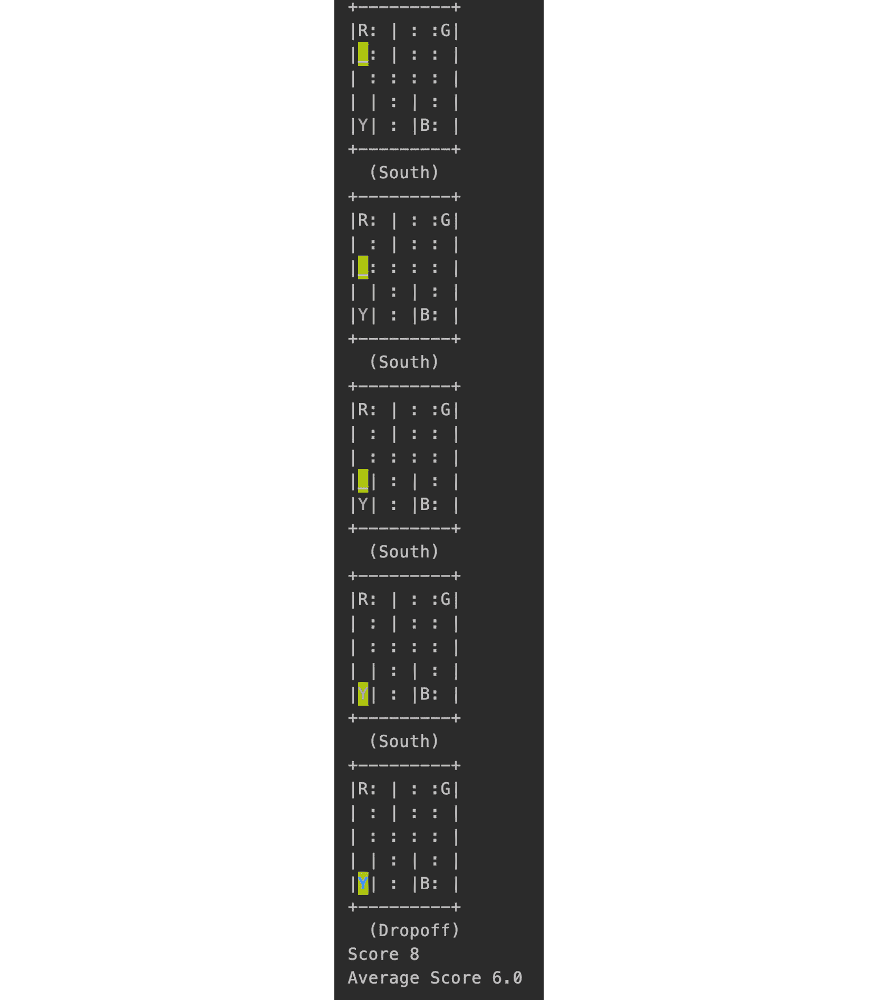

# 第五章：5. 动态规划

概述

在本章中，您将了解动态规划的驱动原理。您将了解经典的零钱兑换问题，并将其作为动态规划的应用。此外，您还将学习如何实现策略评估、策略迭代和价值迭代，并了解它们之间的差异。到本章结束时，您将能够使用**强化学习**（**RL**）中的动态规划来解决问题。

# 引言

在上一章中，我们介绍了 OpenAI Gym 环境，并学习了如何根据应用需求实现自定义环境。您还了解了 TensorFlow 2 的基础知识，如何使用 TensorFlow 2 框架实现策略，以及如何使用 TensorBoard 可视化学习成果。在本章中，我们将从计算机科学的角度，了解**动态规划**（**DP**）的一般工作原理。接着，我们将讨论它在强化学习中的使用方式及其原因。然后，我们将深入探讨经典的动态规划算法，如策略评估、策略迭代和价值迭代，并进行比较。最后，我们将实现经典零钱兑换问题中的算法。

动态规划是计算机科学中最基本和最基础的主题之一。此外，强化学习算法，如**价值迭代**、**策略迭代**等，正如我们将看到的，使用相同的基本原理：避免重复计算以节省时间，这正是动态规划的核心。动态规划的哲学并不新鲜；一旦学会了解决方法，它是显而易见且普遍的。真正困难的部分是识别一个问题是否可以用动态规划来解决。

这个基本原理也可以用简单的方式向孩子解释。想象一下在一个盒子里数糖果的数量。如果你知道盒子里有 100 颗糖果，而店主又给了你 5 颗额外的糖果，你就不会重新开始数糖果。你会利用已有的信息，将 5 颗糖果加到原来的数量上，并说：“我有 105 颗糖果。”这就是动态规划的核心：保存中间信息并在需要时重新利用，以避免重复计算。虽然听起来简单，但如前所述，真正困难的部分是确定一个问题是否可以用动态规划来解决。正如我们稍后在*识别动态规划问题*一节中所看到的，问题必须满足特定的前提条件，如最优子结构和重叠子问题，才能用动态规划解决，我们将在*识别动态规划问题*一节中详细研究。一旦一个问题符合要求，就有一些著名的技术，比如自顶向下的备忘录法，即以无序的方式保存中间状态，以及自底向上的表格法，即将状态保存在有序的数组或矩阵中。

结合这些技巧可以显著提升性能，相比使用暴力算法进行求解。另外，随着操作次数的增加，时间差异也会变得更加明显。从数学角度来说，使用动态规划求解的方案通常在 O(n²)时间内运行，而暴力算法则需要 O(2ⁿ)时间，其中"O"（大 O 符号）可以粗略理解为执行的操作次数。所以，举个例子，如果 N=500，这是一个相对较小的数字，动态规划算法大约需要执行 500²次操作，而暴力算法则需要执行 2500 次操作。作为参考，太阳中有 280 个氢原子，这个数字无疑要比 2500 小得多。

以下图展示了两种算法执行操作次数的差异：


图 5.1：可视化大 O 值

现在我们开始研究求解动态规划问题的方法。

# 求解动态规划问题

解决动态规划问题的两种常见方法是：表格法和备忘录法。在表格法中，我们构建一个矩阵，在查找表中逐一存储中间值。另一方面，在备忘录法中，我们以非结构化的方式存储相同的值。这里所说的非结构化方式是指查找表可能一次性填满所有内容。

想象你是一个面包师，正在向商店出售蛋糕。你的工作是出售蛋糕并获得最大利润。为了简化问题，我们假设所有其他成本都是固定的，而你产品的最高价格就是利润的唯一指标，这在大多数商业案例中是合理的假设。所以，自然地，你会希望把所有蛋糕卖给提供最高价格的商店，但你需要做出决定，因为有多个商店提供不同价格和不同大小的蛋糕。因此，你有两个选择：卖多少蛋糕，和选择哪家商店进行交易。为了这个例子，我们将忽略其他变量，假设没有额外的隐藏成本。我们将使用表格法和备忘录法来解决这个问题。

正式描述问题时，你有一个重量为 W 的蛋糕，以及一个各个商店愿意提供的价格数组，你需要找出能够获得最高价格（根据之前的假设，也就是最高利润）的最优配置。

注意

在接下来本节列出的代码示例中，我们将利润和价格互换使用。所以，例如，如果你遇到一个变量，如`best_profit`，它也可以表示最佳价格，反之亦然。

比如说，假设 W = 5，意味着我们有一个重 5 千克的蛋糕，以下表格中列出的价格是餐馆所提供的价格：


图 5.2：不同重量蛋糕的不同价格

现在考虑餐厅 A 支付 10 美元购买 1 千克蛋糕，但支付 40 美元购买 2 千克蛋糕。那么问题是：我应该将 5 千克的蛋糕分割成 5 个 1 千克的切片出售，总价为 45 美元，还是应该将整个 5 千克的蛋糕作为一个整体卖给餐厅 B，后者提供 80 美元？在这种情况下，最优的配置是将蛋糕分割成 3 千克的部分，售价 50 美元，和 2 千克的部分，售价 40 美元，总计 90 美元。以下表格显示了各种分割方式及其对应的价格：


图 5.3：蛋糕分割的不同组合

从前面的表格来看，显然最佳的价格由 2 千克+3 千克的组合提供。但为了真正理解暴力破解法的局限性，我们假设我们不知道哪个组合能够获得最大价格。我们将尝试用代码实现暴力破解法。实际上，对于一个实际的商业问题，观察的数据量可能过大，以至于你无法像在这里一样快速得到答案。前面的表格只是一个例子，帮助你理解暴力破解法的局限性。

那么，让我们尝试使用暴力破解法解决这个问题。我们可以稍微重新表述这个问题：在每个决策点，我们有一个选择——分割或不分割。如果我们首先选择将蛋糕分割成两部分不等的部分，左侧部分可以视为蛋糕的一部分，右侧部分则视为独立分割。在下一次迭代中，我们只集中于右侧部分/其他部分。然后，我们再次可以对右侧部分进行分割，右侧部分成为进一步分割的蛋糕部分。这种模式也称为**递归**。


图 5.4：蛋糕分割成几块

在前面的图中，我们可以看到蛋糕被分割成多个部分。对于一块 5 千克重的蛋糕（假设你可以按照每个分割部分至少 1 千克的重量进行分割，因此每个分割部分的重量只能是 1 的整数倍），我们会看到"分割或不分割"一共出现了 32 次；如下所示：

```py
2 x 2 x 2 x 2 x 2 = 25= 32
```

所以，首先让我们这样做：对于每一种 32 种可能的组合，计算总价，最后报告价格最高的组合。我们已经定义了价格列表，其中索引表示切片的重量：

```py
PRICES = ["NA", 9, 40, 50, 70, 80]
```

例如，出售一整个 1 千克的蛋糕，售价为 9 美元；而出售一个 2 千克的蛋糕/切片，售价为 40 美元。零索引处的价格为 NA，因为我们不可能有 0 千克重的蛋糕。以下是实现上述情境的伪代码：

```py
def partition(cake_size):
    """
    Partitions a cake into different sizes, and calculates the
    most profitable cut configuration
    Args:
        cake_size: size of the cake
    Returns:
        the best profit possible
    """
    if cake_size == 0:
        return 0
    best_profit = -1
    for i in range(1, cake_size + 1):
        best_profit = max(best_profit, PRICES[i] \
                         + partition(cake_size - i))
    return best_profit
```

上面的`partition`函数，`cake_size`将接受一个整数输入：蛋糕的大小。然后，在`for`循环中，我们会以每种可能的方式切割蛋糕并计算最佳利润。由于我们对每个位置都做出分割/不分割的决策，代码运行的时间复杂度是 O(2n)。现在让我们使用以下代码来调用该函数。`if __name__`块将确保代码仅在运行脚本时执行（而不是在导入时）：

```py
if __name__ == '__main__':
    size = 5
    best_profit_result = partition(size)
    print(f"Best profit: {best_profit_result}")
```

运行后，我们可以看到大小为`5`的蛋糕的最佳利润：

```py
Best profit: 90
```

上述方法解决了计算最大利润的问题，但它有一个巨大的缺陷：非常慢。我们正在进行不必要的计算，并且要遍历整个搜索树（所有可能的组合）。为什么这是个坏主意？想象一下你从 A 点旅行到 C 点，费用是$10。你会考虑从 A 到 B，再到 D，再到 F，最后到 C，可能需要花费$150 吗？当然不会，对吧？这个思路是类似的：如果我知道当前的路径不是最优路径，为什么还要去探索那条路？

为了更高效地解决这个问题，我们将研究两种优秀的技术：表格法和备忘录法。它们的原理相同：避免无效的探索。但它们使用略有不同的方式来解决问题，正如你将看到的那样。

接下来我们将深入研究备忘录法。

## 备忘录法

`备忘录法`是指一种方法，在这种方法中，我们将中间输出的结果保存在一个字典中，供以后使用，也就是所谓的备忘录。因此得名“备忘录法”。

回到我们的蛋糕分割示例，如果我们修改`partition`函数，并打印`cake_size`的值以及该大小的最佳解决方案，就会发现一个新的模式。使用之前暴力方法中相同的代码，我们添加一个`print`语句来显示蛋糕大小及对应的利润：

```py
def partition(cake_size):
    """
    Partitions a cake into different sizes, and calculates the
    most profitable cut configuration
    Args:
        cake_size: size of the cake
    Returns:
        the best profit possible
    """
    if cake_size == 0:
        return 0
    best_profit = -1
    for i in range(1, cake_size + 1):
        best_profit = max(best_profit, PRICES[i] \
                      + partition(cake_size - i))
    print(f"Best profit for size {cake_size} is {best_profit}")
    return best_profit
```

使用`main`块调用函数：

```py
if __name__ == '__main__':
    size = 5
    best_profit_result = partition(size)
    print(f"Best profit: {best_profit_result}")
```

然后我们会看到如下输出：

```py
Best profit for size 1 is 9
Best profit for size 2 is 40
Best profit for size 1 is 9
Best profit for size 3 is 50
Best profit for size 1 is 9
Best profit for size 2 is 40
Best profit for size 1 is 9
Best profit for size 4 is 80
Best profit for size 1 is 9
Best profit for size 2 is 40
Best profit for size 1 is 9
Best profit for size 3 is 50
Best profit for size 1 is 9
Best profit for size 2 is 40
Best profit for size 1 is 9
Best profit for size 5 is 90
Best profit: 90
```

正如前面的输出所示，这里有一个模式——对于给定大小的最佳利润保持不变，但我们计算了多次。特别需要注意的是计算的大小和顺序。它会先计算大小为 1 的利润，然后是 2，当它要计算大小为 3 时，它会从头开始计算，首先是 1，然后是 2，最后是 3。这种情况会不断重复，因为它不存储任何中间结果。一个显而易见的改进是将利润存储在一个备忘录中，然后稍后使用它。

我们在这里做了一个小修改：如果给定`cake_size`的`best_profit`已经计算过，我们就直接使用它，而不再重新计算，代码如下所示：

```py
    if cake_size == 0:
        return 0
    if cake_size in memo:
        return memo[cake_size]
```

现在让我们看一下完整的代码片段：

```py
def memoized_partition(cake_size, memo):
    """
        Partitions a cake into different sizes, and calculates the
        most profitable cut configuration using memoization.
        Args:
            cake_size: size of the cake
            memo: a dictionary of 'best_profit' values indexed
                by 'cake_size'
        Returns:
            the best profit possible
        """
    if cake_size == 0:
        return 0
    if cake_size in memo:
        return memo[cake_size]
    else:
        best_profit = -1
        for i in range(1, cake_size + 1):
            best_profit = max(best_profit, \
                              PRICES[i] + memoized_partition\
                                          (cake_size - i, memo))
        print(f"Best profit for size {cake_size} is {best_profit}")
        memo[cake_size] = best_profit
        return best_profit
```

现在如果我们运行这个程序，我们将得到以下输出：

```py
Best profit for size 1 is 9
Best profit for size 2 is 40
Best profit for size 3 is 50
Best profit for size 4 is 80
Best profit for size 5 is 90
Best profit: 90
```

在这里，我们不是运行计算 2n 次，而是只运行`n`次。这是一个巨大的改进。我们所需要做的只是将输出结果保存在字典或备忘录中，因此这种方法叫做**备忘录化**。在这种方法中，我们本质上将中间解保存到字典中，以避免重新计算。这个方法也被称为自顶向下方法，因为我们遵循自然顺序，类似于在二叉树中查找，例如。

接下来，我们将探讨表格方法。

## 表格方法

使用备忘录化方法，我们随意地存储中间计算结果。表格方法几乎做了相同的事情，只是方式稍有不同：它按预定顺序进行，这几乎总是固定的——从小到大。这意味着，为了获得最有利的切割，我们将首先获得 1 公斤蛋糕的最有利切割，然后是 2 公斤蛋糕，接着是 3 公斤蛋糕，依此类推。通常使用矩阵完成此操作，这被称为自底向上方法，因为我们先解决较小的问题。

考虑以下代码片段：

```py
def tabular_partition(cake_size):
    """
    Partitions a cake into different sizes, and calculates the
    most profitable cut configuration using tabular method.
    Args:
        cake_size: size of the cake
    Returns:
        the best profit possible
    """
    profits = [0] * (cake_size + 1)
    for i in range(1, cake_size + 1):
        best_profit = -1
        for current_size in range(1, i + 1):
            best_profit = max(best_profit,\
                          PRICES[current_size] \
                          + profits[i - current_size])
        profits[i] = best_profit
    return profits[cake_size]
```

输出结果如下：

```py
Best profit: 90
```

在前面的代码中，我们首先遍历尺寸，然后是切割。一个不错的练习是使用 IDE 和调试器运行代码，查看 `profits` 数组是如何更新的。首先，它会找到大小为 1 的蛋糕的最大利润，然后找到大小为 2 的蛋糕的最大利润。但是在这里，第二个 `for` 循环会尝试两种配置：一种是切割（两块大小为 1 的蛋糕），另一种是不切割（一个大小为 2 的蛋糕），由 `profits[i – current_size]` 指定。现在，对于每个尺寸，它都会尝试在所有可能的配置中切割蛋糕，而不会重新计算较小部分的利润。例如，`profits[i – current_size]` 会返回最佳配置，而无需重新计算。

## 练习 5.01：实践中的备忘录化

在这个练习中，我们将尝试使用备忘录化方法解决一个动态规划问题。问题如下：

给定一个数字 `n`，打印第 n 个三斐波那契数。三斐波那契数列类似于斐波那契数列，但使用三个数字而不是两个。这意味着，第 n 个三斐波那契数是前面三个数字的和。以下是一个示例：

斐波那契数列 0, 1, 2, 3, 5, 8……定义如下：


](img/B16182_05_05.jpg)

图 5.5：斐波那契数列

三斐波那契数列 0, 0, 1, 1, 2, 4, 7……定义如下：


](img/B16182_05_06.jpg)

图 5.6：三斐波那契数列

三斐波那契数列的广义公式如下：

```py
Fibonacci(n) = Fibonacci(n – 1) + Fibonacci(n – 2)
Tribonacci(n) = Tribonacci(n – 1) \
                + Tribonacci(n – 2) + Tribonacci(n – 3)
```

以下步骤将帮助你完成练习：

1.  现在我们知道了公式，第一步是用 Python 创建一个简单的递归实现。使用描述中的公式并将其转换为 Python 函数。你可以选择在 Jupyter notebook 中做，或者直接用一个简单的 `.py` Python 文件：

    ```py
    def tribonacci_recursive(n):
        """
        Uses recursion to calculate the nth tribonacci number
        Args:
            n: the number
        Returns:
            nth tribonacci number
        """
        if n <= 1:
            return 0
        elif n == 2:
            return 1
        else:
            return tribonacci_recursive(n - 1) \
                   + tribonacci_recursive(n - 2) \
                   + tribonacci_recursive(n - 3)
    ```

    在前面的代码中，我们递归地计算 Tibonacci 数的值。此外，如果数字小于或等于 1，我们知道答案将是 0，2 的答案将是 1，因此我们添加了`if-else`条件来处理边缘情况。要测试前面的代码，只需在`main`块中调用它，并检查输出是否符合预期：

    ```py
    if __name__ == '__main__':
        print(tribonacci_recursive(6))
    ```

1.  正如我们所学到的，这个实现非常慢，并且随着`n`的增加，增长速度呈指数级。现在，使用备忘录法，存储中间结果，以便它们不被重新计算。创建一个字典来检查该第`n`个 Tibonacci 数的答案是否已经添加到字典中。如果是，则直接返回；否则，尝试计算：

    ```py
    def tribonacci_memo(n, memo):
        """
        Uses memoization to calculate the nth tribonacci number
        Args:
            n: the number
            memo: the dictionary that stores intermediate results
        Returns:
            nth tribonacci number
        """
        if n in memo:
            return memo[n]
        else:
            ans1 = tribonacci_memo(n - 1, memo)
            ans2 = tribonacci_memo(n - 2, memo)
            ans3 = tribonacci_memo(n - 3, memo)
            res = ans1 + ans2 + ans3
            memo[n] = res
            return res
    ```

1.  现在，使用前面的代码片段，不使用递归来计算第`n`个 Tibonacci 数。运行代码并确保输出与预期相符，通过在`main`块中运行它：

    ```py
    if __name__ == '__main__':
        memo = {0: 0, 1: 0, 2: 1}
        print(tribonacci_memo(6, memo))
    ```

    输出结果如下：

    ```py
    7
    ```

如您在输出中看到的，和是`7`。我们已经学会了如何将一个简单的递归函数转换为记忆化的动态规划代码。

注意

要访问此特定部分的源代码，请参考[`packt.live/3dghMJ1`](https://packt.live/3dghMJ1)。

您还可以在线运行此示例，网址为[`packt.live/3fFE7RK`](https://packt.live/3fFE7RK)。

接下来，我们将尝试使用表格方法做同样的事情。

## 练习 5.02：表格法在实践中的应用

在这个练习中，我们将使用表格方法解决一个动态规划问题。练习的目标是识别两个字符串之间的最长公共子串的长度。例如，如果两个字符串分别是`BBBABDABAA`和`AAAABDABBAABB`，那么最长的公共子串是`ABDAB`。其他公共子串有`AA`、`BB`和`BA`，以及`BAA`，但它们不是最长的：

1.  导入`numpy`库：

    ```py
    import numpy as np
    ```

1.  实现暴力法，首先计算两个字符串的最长公共子串。假设我们有两个变量`i`和`j`，它们表示子串的开始和结束位置。使用这些指针来指示两个字符串中子串的开始和结束位置。您可以使用 Python 中的`==`运算符来查看字符串是否匹配：

    ```py
    def lcs_brute_force(first, second):
        """
        Use brute force to calculate the longest common 
        substring of two strings
        Args:
            first: first string
            second: second string
        Returns:
            the length of the longest common substring
        """
        len_first = len(first)
        len_second = len(second)
        max_lcs = -1
        lcs_start, lcs_end = -1, -1
        # for every possible start in the first string
        for i1 in range(len_first):
            # for every possible end in the first string
            for j1 in range(i1, len_first):
                # for every possible start in the second string
                for i2 in range(len_second):
                    # for every possible end in the second string
                    for j2 in range(i2, len_second):
                        """
                        start and end position of the current
                        candidates
                        """
                        slice_first = slice(i1, j1)
                        slice_second = slice(i2, j2)
                        """
                        if the strings match and the length is the
                        highest so far
                        """
                        if first[slice_first] == second[slice_second] \
                           and j1 - i1 > max_lcs:
                            # save the lengths
                            max_lcs = j1 - i1
                            lcs_start = i1
                            lcs_end = j1
        print("LCS: ", first[lcs_start: lcs_end])
        return max_lcs
    ```

1.  使用`main`块调用函数：

    ```py
    if __name__ == '__main__':
        a = "BBBABDABAA"
        b = "AAAABDABBAABB"
        lcs_brute_force(a, b)
    ```

    我们可以验证输出是否正确：

    ```py
     LCS:  ABDAB
    ```

1.  让我们实现表格方法。现在我们有了一个简单的解决方案，我们可以继续优化它。看看主循环，它嵌套了四次。这意味着该解决方案的运行时间是`O(N⁴)`。无论我们是否有最长公共子串，解决方案都会执行相同的计算。使用表格方法得出更多的解决方案：

    ```py
    def lcs_tabular(first, second):
        """
        Calculates the longest common substring using memoization.
        Args:
            first: the first string
            second: the second string
        Returns:
            the length of the longest common substring.
        """
        # initialize the table using numpy
        table = np.zeros((len(first), len(second)), dtype=int)
        for i in range(len(first)):
            for j in range(len(second)):
                if first[i] == second[j]:
                    table[i][j] += 1 + table[i - 1][j - 1]
        print(table)
        return np.max(table)
    ```

    这个问题具有天然的矩阵结构。将其中一个字符串的长度视为矩阵的行，另一个字符串的长度视为矩阵的列。将该矩阵初始化为`0`。矩阵中位置`i, j`的值将表示第一个字符串的第`i`个字符是否与第二个字符串的第`j`个字符相同。

    现在，最长公共子串将具有在对角线上最多的 1 个数字。利用这个事实，如果当前位子匹配且`i-1`和`j-1`位置上有`1`，则将最大子串的长度增加 1。这将表明有两个连续的匹配。使用`np.max(table)`返回矩阵中的`max`元素。我们也可以查看对角线递增的序列，直到该值达到`5`。

1.  使用`main`模块调用该函数：

    ```py
    if __name__ == '__main__':
        a = "BBBABDABAA"
        b = "AAAABDABBAABB"
        lcs_tabular(a, b)
    ```

    输出结果如下：

    

图 5.7：LCS 输出结果

如你所见，行（第一列）和列（第二列）之间存在直接的映射关系，因此 LCS（最长公共子序列）字符串只会是从 LCS 长度开始倒数的对角线元素。在前面的输出中，你可以看到最高的元素是 5，因此你知道长度是 5。LCS 字符串将是从元素`5`开始的对角线元素。字符串的方向总是向上对角线，因为列总是从左到右排列。请注意，解决方案仅仅是计算 LCS 的长度，而不是找到实际的 LCS。

注意

要访问这一特定部分的源代码，请参考 [`packt.live/3fD79BC`](https://packt.live/3fD79BC)。

你也可以在网上运行这个示例，网址是 [`packt.live/2UYVIfK`](https://packt.live/2UYVIfK)。

现在我们已经学会了如何解决动态规划问题，接下来我们应该学习如何识别这些问题。

# 识别动态规划问题

虽然一旦识别出问题如何递归，解决动态规划问题就变得很容易，但确定一个问题是否可以通过动态规划来解决却是很困难的。例如，旅行商问题，你被给定一个图，并希望在最短的时间内覆盖所有的顶点，这是一个无法用动态规划解决的问题。每个动态规划问题必须满足两个先决条件：它应该具有最优子结构，并且应该有重叠子问题。我们将在接下来的部分中详细了解这些条件的含义以及如何解决它们。

## 最优子结构

回想一下我们之前讨论的最佳路径示例。如果你想从 A 点通过 B 点到达 C 点，并且你知道这是最佳路径，那么就没有必要探索其他路径。换句话说：如果我想从 A 点到达 D 点，而我知道从 A 点到 C 点的最佳路径，那么从 A 点到 D 点的最佳路径一定会包含从 A 点到 C 点的路径。这就是所谓的最优子结构。本质上，它意味着问题的最优解包含了子问题的最优解。记得我们在知道一个大小为`n`的蛋糕的最佳利润后，就不再重新计算它吗？因为我们知道，大小为`n+1`的蛋糕的最佳利润会包括`n`，这是在考虑切分蛋糕为大小`n`和`1`时得到的。再重复一遍，如果我们要使用动态规划（DP）解决问题，最优子结构的属性是一个必要条件。

## 重叠子问题

记得我们最初在设计蛋糕分配问题的暴力解法时，后来又采用了备忘录法。最初，暴力解法需要 32 步才能得到解，而备忘录法只需要 5 步。这是因为暴力解法重复执行相同的计算：对于大小为 3 的问题，它需要先解决大小为 2 和 1 的问题。然后，对于大小为 4 的问题，它又需要解决大小为 3、2 和 1 的问题。这个递归重计算是由于问题的性质：重叠子问题。这也是我们能够将答案保存在备忘录中，之后使用相同的解而不再重新计算的原因。重叠子问题是使用动态规划（DP）来解决问题的另一个必要条件。

## 硬币换零钱问题

硬币换零钱问题是软件工程面试中最常被问到的题目之一。题目很简单：给定一个硬币面额的列表，以及一个总和 N，找出到达该总和的不同方式的数量。例如，如果 N = 3 且硬币面额 D = {1, 2}，那么答案是 2。也就是说，有两种方式可以得到 3：{1, 1, 1} 和 {2, 1}：

1.  为了解决这个问题，你需要准备一个递归公式，计算得到一个总和的不同方式数。为此，你可以从一个简单的版本开始，先解决一个数字的情况，再尝试将其转换为更一般的解法。

1.  最终输出可能是如下图所示的表格，可用于总结结果。在下表中，第一行表示面额，第一列表示总和。更具体地说，第一行的 0、1、2、3、4、5 表示总和，第一列表示可用的面额。我们将基础情况初始化为 1 而非 0，因为如果面额小于总和，则我们只是将之前的组合复制过来。

    下表表示如何使用硬币 [1, 2] 来计算得到 5 的方法数：

    

    图 5.8：计算使用面额为 1 和 2 的硬币得到总和 5 的方法数

1.  所以，我们可以看到使用面额为 1 和 2 的硬币得到总和 5 的方法数是 3，具体来说就是 1+1+1+1+1、2+1+1+1 和 2+2+1。记住，我们只考虑独特的方式，也就是说，2+2+1 和 1+2+2 是相同的。

让我们通过一个练习来解决硬币换零钱问题。

## 练习 5.03：解决硬币换零钱问题

在这个练习中，我们将解决经典且非常流行的硬币换零钱问题。我们的目标是找到用面额为 1、2 和 3 的硬币组合得到总和 5 的不同排列数。以下步骤将帮助你完成这个练习：

1.  导入 `numpy` 和 `pandas` 库：

    ```py
    import numpy as np
    import pandas as pd
    ```

1.  现在，让我们尝试识别重叠子问题。如之前所述，有一个共同点：我们必须搜索所有可能的面额，并检查它们是否能加起来得到某个数。此外，这比蛋糕示例稍微复杂一些，因为我们有两个变量需要迭代：首先是面额，其次是总和（在蛋糕示例中，只有一个变量，即蛋糕大小）。因此，我们需要一个二维数组或矩阵。

    在列上，我们将展示我们试图达到的和，而在行上，我们将考虑可用的各种面额。当我们遍历面额（列）时，我们将通过首先计算不考虑当前面额时达到某个和的方式数量，然后再加上考虑当前面额的方式数量，来计算合计数。这类似于蛋糕示例，其中我们首先进行切割，计算利润，然后不切割并计算利润。然而，区别在于这次我们会从上方的行中获取之前的最佳配置，并且我们会将这两个数相加，而不是选择其中的最大值，因为我们关心的是到达和的所有可能方式的总数。例如，使用 {1, 2} 求和为 4 的方式是首先使用 {2}，然后加上求和为 4 - 2 = 2 的方式数量。我们可以从同一行获取这个值，索引为 2。我们还会将第一行初始化为 1，因为它们要么是无效的（使用 1 到达零的方式数量），要么是有效的，并且只有一个解决方案：

    

    ```py
    def count_changes(N, denominations):
        """
        Counts the number of ways to add the coin denominations
        to N.
        Args:
            N: number to sum up to
            denominations: list of coins
        Returns:
        """
        print(f"Counting number of ways to get to {N} using coins:\
    {denominations}")
    ```

1.  接下来，我们将初始化一个尺寸为 `len(denomination)` x `(N + 1)` 的表格。列数是 `N + 1`，因为索引包括零：

    ```py
        table = np.ones((len(denominations), N + 1)).astype(int)
        # run the loop from 1 since the first row will always 1s
        for i in range(1, len(denominations)):
            for j in range(N + 1):
                if j < denominations[i]:
                    """
                    If the index is less than the denomination
                    then just copy the previous best
                    """
                    table[i, j] = table[i - 1, j]
                else:
                    """
                    If not, the add two things:
                    1\. The number of ways to sum up to 
                       N *without* considering
                       the existing denomination.
                    2\. And, the number of ways to sum up to N minus 
                       the value of the current denomination 
                       (by considering the current and the 
                       previous denominations)
                    """
                    table[i, j] = table[i - 1, j] \
                                  + table[i, j - denominations[i]]
    ```

1.  现在，最后我们将打印出这个表格：

    ```py
        # print the table
        print_table(table, denominations)
    ```

1.  创建一个带有以下实用功能的 Python 脚本，它可以漂亮地打印表格。这对于调试非常有用。漂亮打印本质上是用来以更易读和更全面的方式呈现数据。通过将面额作为索引，我们可以更清晰地查看输出：

    ```py
    def print_table(table, denominations):
        """
        Pretty print a numpy table
        Args:
            table: table to print
            denominations: list of coins
        Returns:
        """
        df = pd.DataFrame(table)
        df = df.set_index(np.array(denominations))
        print(df)
    ```

    注意

    欲了解更多关于漂亮打印的细节，您可以参考以下链接的官方文档：[`docs.python.org/3/library/pprint.html`](https://docs.python.org/3/library/pprint.html)。

1.  使用以下配置初始化脚本：

    ```py
    if __name__ == '__main__':
        N = 5
        denominations = [1, 2]
        count_changes(N, denominations)
    ```

    输出将如下所示：

    ```py
    Counting number of ways to get to 5 using coins: [1, 2]
       0  1  2  3  4  5
    1  1  1  1  1  1  1
    2  1  1  2  2  3  3
    ```

如我们在最后一行和列的条目中看到的，使用 [1, 2] 获得 5 的方式有 3 种。我们现在已经详细了解了动态规划（DP）的概念。

注意

要访问此特定部分的源代码，请参阅 [`packt.live/2NeU4lT`](https://packt.live/2NeU4lT)。

您也可以在网上运行这个示例，访问 [`packt.live/2YUd6DD`](https://packt.live/2YUd6DD)。

接下来，让我们看看它是如何用于解决强化学习中的问题的。

# 强化学习中的动态规划

DP 在 RL 中扮演着重要角色，因为在给定的时刻你所面临的选择太多。例如，机器人在当前环境状态下应该向左转还是向右转。为了求解此类问题，通过蛮力计算每个状态的结果是不可行的。然而，通过 DP，我们可以使用前一节中学到的方法来解决这一问题。

我们在前面的章节中已经看过贝尔曼方程。让我们重述一下基本内容，看看贝尔曼方程如何具备 DP 所需的两个属性。

假设环境是一个有限的**马尔可夫决策过程**（**MDP**），我们用一个有限的状态集 *S* 来定义环境的状态。这表示状态配置，例如机器人的当前位置。有限的动作集 *A* 给出了动作空间，有限的奖励集 *R*。我们用  来表示折扣率，这个值介于 0 和 1 之间。

给定一个状态 *S*，该算法使用一个确定性策略从 *A* 中选择一个动作，。该策略仅仅是状态 *S* 和动作 *A* 之间的映射，例如，机器人可能做出的选择，如向左或向右。确定性策略允许我们以非随机的方式选择动作（与随机策略相对，后者包含显著的随机成分）。

为了具体化我们的理解，假设一个简单的自动驾驶汽车。为了简化起见，我们将在这里做一些合理的假设。动作空间可以定义为 {左转，右转，直行，倒退}。一个确定性策略是：如果地面上有个坑，向左或右转以避免它。然而，一个随机策略会说：如果地面上有个坑，以 80% 的概率向左转，这意味着汽车有小概率故意进入坑中。虽然这个动作目前看起来可能没有意义，但我们稍后会看到，在*第七章，时间差学习*中，这实际上是一个非常重要的举措，并且解决了 RL 中的一个关键概念：探索与利用的困境。

回到使用 DP 在 RL 中的原始点，下面是**简化版**的贝尔曼方程：


图 5.10：简化贝尔曼方程

完整方程与简化方程的唯一区别在于我们没有对  进行求和，这在非确定性环境下是有效的。以下是完整的贝尔曼方程：


图 5.11：完整的贝尔曼方程

在前面的方程中，是值函数，表示处于特定状态时的奖励。我们稍后会更深入地探讨它。是采取动作`a`的奖励，是下一个状态的奖励。你可以观察到以下两点：

+   在和之间的递归关系，意味着具有最优子结构。

+   计算将在某些时刻需要重新计算，这意味着它存在重叠子问题。动态规划（DP）的两个条件都符合，因此我们可以利用它来加速解决方案。

如我们稍后将看到的，值函数的结构与我们在硬币面额问题中看到的类似。不同之处在于，我们不再保存到达和为的方式数量，而是保存最佳，即能够带来最高回报的值函数的最佳值。接下来，我们将探讨策略迭代和价值迭代，它们是帮助我们解决 RL 问题的基本算法。

## 策略和价值迭代

解决强化学习（RL）问题的主要思路是利用值函数寻找最佳策略（决策方式）。这种方法对于简单的 RL 问题效果很好，因为我们需要了解整个环境的信息：状态的数量和动作空间。我们甚至可以在连续空间中使用此方法，但并不是在所有情况下都能得到精确的解。在更新过程中，我们必须遍历所有可能的场景，这也是当状态和动作空间过大时，使用该方法变得不可行的原因：

1.  策略迭代：从一个随机策略开始，逐步收敛到最佳策略。

1.  价值迭代：使用随机值初始化状态，并逐步更新它们直到收敛。

## 状态值函数

状态值函数是一个数组，表示处于该状态时的奖励。假设在一个特定的游戏中有四个可能的状态：`S1`、`S2`、`S3`和`S4`，其中`S4`是终止状态（结束状态）。状态值表可以通过一个数组表示，如下表所示。请注意，值只是示例。每个状态都有一个“值”，因此称为状态值函数。此表格可以用于游戏中稍后的决策：


图 5.12：状态值函数的示例表格

例如，如果你处于状态`S3`，你有两个可能的选择，`S4`和`S2`；你会选择`S4`，因为在那个状态中的值比`S2`更高。

## 动作值函数

动作-值函数是一个矩阵，表示每个状态-动作对的奖励。这同样可以用来选择在特定状态下应该采取的最佳动作。与之前的状态-动作表不同，这次我们为每个动作也关联了奖励，具体如下表所示：


图 5.13：动作-值函数的示例表格

请注意，这些只是示例值，实际计算时会使用特定的更新策略。我们将在*策略改进*部分查看更新策略的更具体示例。这个表格将稍后用于值迭代算法，因此我们可以迭代地更新表格，而不是等到最后一步。更多内容请参考*值迭代*部分。

## OpenAI Gym：Taxi-v3 环境

在前面的章节中，我们已经了解了什么是 OpenAI Gym 环境，但这次我们将玩一个不同的游戏：Taxi-v3。在这个游戏中，我们将教导我们的代理司机接送乘客。黄色方块代表出租车。环境中有四个可能的地点，分别用不同的字符标记：R、G、B 和 Y，分别代表红色、绿色、蓝色和黄色，具体如下图所示。代理需要在某个地点接乘客并将其送到另一个地点。此外，环境中有用 `|` 表示的墙壁。每当有墙壁时，可能的动作数量就会受到限制，因为出租车不能穿越墙壁。这使得问题变得有趣，因为代理必须巧妙地在网格中导航，同时避开墙壁，找到最佳的（最短的）解决方案：


图 5.14：Taxi-v3 环境

以下是每个动作对应的奖励列表：

+   **+20**：成功接送时的奖励。

+   **-1**：每一步都会发生。这一点很重要，因为我们关注的是找到最短的路径。

+   **-10**：非法的接送操作。

**策略**

环境中的每个状态都由一个数字表示。例如，前一张照片中的状态可以用`54`来表示。在这个游戏中有 500 个这样的独特状态。对于每一个状态，我们都有相应的策略（即，应该执行的动作）。

现在，让我们自己尝试一下这个游戏。

初始化环境并打印可能的状态数和动作空间，当前分别为 500 和 6。在现实问题中，这个数字会非常庞大（可能达到数十亿），我们无法使用离散的代理。但为了简化问题，我们假设这些并进行求解：

```py
def initialize_environment():
    """initialize the OpenAI Gym environment"""
    env = gym.make("Taxi-v3")
    print("Initializing environment")
    # reset the current environment
    env.reset()
    # show the size of the action space
    action_size = env.action_space.n
    print(f"Action space: {action_size}")
    # Number of possible states
    state_size = env.observation_space.n
    print(f"State space: {state_size}")
    return env
```

上述代码将输出以下内容：


图 5.15：启动 Taxi-v3 环境

如你所见，网格表示当前（初始）状态的环境。黄色框代表出租车。六个可能的选择是：左、右、上、下、接客和放客。现在，让我们看看如何控制出租车。

使用以下代码，我们将随机地在环境中执行步骤并查看输出。`env.step`函数用于从一个状态转移到另一个状态。它接受的参数是其动作空间中的有效动作之一。在执行一步后，它会返回几个值，如下所示：

+   `new_state`：新的状态（一个表示下一个状态的整数）

+   `reward`：从转移到下一个状态中获得的奖励

+   `done`：如果环境需要重置（意味着你已经到达了终止状态）

+   `info`：表示转移概率的调试信息

由于我们使用的是确定性环境，因此转移概率始终为`1.0`。还有其他环境具有非 1 的转移概率，表示如果你做出某个决策；例如，如果你右转，环境将以相应的概率右转，这意味着即使做出特定的行动后，你也有可能停留在原地。代理在与环境互动时不能学习这些信息，否则如果代理知道环境信息，将会是不公平的：

```py
def random_step(n_steps=5):
    """
    Steps through the taxi v3 environment randomly
    Args:
        n_steps: Number of steps to step through
    """
    # reset the environment
    env = initialize_environment()
    state = env.reset()
    for i in range(n_steps):
        # choose an action at random
        action = env.action_space.sample()
        env.render()
        new_state, reward, done, info = env.step(action)
        print(f"New State: {new_state}\n"\
              f"reward: {reward}\n"\
              f"done: {done}\n"\
              f"info: {info}\n")\
        print("*" * 20)
```

使用这段代码，我们将在环境中随机（但有效）地执行步骤，并在到达终止状态时停止。如果执行代码，我们将看到以下输出：


图 5.16：随机遍历环境

通过查看输出，我们可以看到在执行某个动作后，所经历的新状态以及执行该动作所获得的奖励；`done`会指示我们已经到达了终止阶段；还有一些环境信息，例如转移概率。接下来，我们将查看我们的第一个强化学习算法：策略迭代。

### 策略迭代

正如其名所示，在策略迭代中，我们会遍历多个策略，然后进行优化。策略迭代算法分为两步：

1.  策略评估

1.  策略改进

策略评估计算当前策略的值函数，初始时是随机的。然后，我们使用贝尔曼最优性方程更新每个状态的值。接着，一旦我们得到了新的值函数，就更新策略以最大化奖励并进行策略改进。现在，如果策略发生了更新（即使策略中的一个决策发生了变化），这个更新后的策略保证比旧的策略更好。如果策略没有更新，则意味着当前的策略已经是最优的（否则它会被更新并找到更好的策略）。

以下是策略迭代算法的工作步骤：

1.  从一个随机策略开始。

1.  计算所有状态的值函数。

1.  更新策略，选择能够最大化奖励的行动（策略改进）。

1.  当策略不再变化时停止。这表明已经获得了最优策略。

让我们手动通过算法进行一次干运行，看看它是如何更新的，使用一个简单的例子：

1.  从一个随机策略开始。下表列出了代理在 Taxi-v3 环境中给定位置可以采取的可能行动：

    图 5.17：代理的可能行动

    在前面的图中，表格表示环境，框表示选择。箭头表示如果代理处于该位置，应采取的行动。

1.  计算所有唯一状态的值函数。下表列出了每个状态的样本状态值。值初始化为零（某些算法的变体也使用接近零的小随机值）：

    图 5.18：每个状态的奖励值

    为了直观地理解更新规则，我们使用一个极其简单的例子：

    

    图 5.19：理解更新规则的示例策略

    从蓝色位置开始，经过第一步`policy_evaluation`后，策略将到达绿色（终止）位置。值将按照以下方式更新（每次迭代都有一个图示）：

    

    图 5.20：每步奖励的乘法

    每一步，奖励都会乘以 gamma（在此示例中为`0.9`）。此外，在这个例子中，我们已经从最优策略开始，因此更新后的策略将与当前策略完全相同。

1.  更新策略。让我们通过一个小例子来看看更新规则。假设以下是当前的值函数及其对应的策略：

    图 5.21：样本值函数及其对应的策略。

    如前图所示，左侧的表格表示值，右侧的表格表示策略（决策）。

    一旦我们执行更新，假设值函数变为如下所示：

    

    图 5.22：样本值函数的更新值

    现在，策略将在每个单元格中更新，使得行动会带领代理到达能够提供最高奖励的状态，因此对应的策略将类似于以下内容：

    

    图 5.23：更新值函数对应的策略

1.  重复步骤 1-3，直到策略不再变化。

    我们将训练算法，通过回合迭代地逼近真实的价值函数，并且每个回合都给我们提供最优策略。一个回合是智能体执行一系列动作直到达到终止状态。这可以是目标状态（例如，在 Taxi-v3 环境中的乘客下车状态），也可以是定义智能体可以采取的最大步数的数字，以避免无限循环。

    我们将使用以下代码初始化环境和价值函数表。我们将把价值函数保存在变量`V`中。此外，根据算法的第一步，我们将使用`env.action_space.sample()`方法从一个随机策略开始，这个方法每次调用时都会返回一个随机动作：

    ```py
    def policy_iteration(env):
        """
        Find the most optimal policy for the Taxi-v3 environment 
        using Policy Iteration
        Args:
            env: Taxi=v3 environment
        Returns:
            policy: the most optimal policy
        """
        V = dict()
    ```

1.  现在，在下一节中，我们将定义并初始化变量：

    ```py
    """
    initially the value function for all states
    will be random values close to zero
    """
    state_size = env.observation_space.n
    for i in range(state_size):
        V[i] = np.random.random()
    # when the change is smaller than this, stop
    small_change = 1e-20
    # future reward coefficient
    gamma = 0.9
    episodes = 0
    # train for this many episodes
    max_episodes = 50000
    # initially we will start with a random policy
    current_policy = dict()
    for s in range(state_size):
        current_policy[s] = env.action_space.sample()
    ```

1.  现在进入主循环，它将执行迭代：

    ```py
    while episodes < max_episodes:
        episodes += 1
        # policy evaluation
        V = policy_evaluation(V, current_policy, \
                              env, gamma, small_change)
        # policy improvement
        current_policy, policy_changed = policy_improvement\
                                         (V, current_policy, \
                                          env, gamma)
        # if the policy didn't change, it means we have converged
        if not policy_changed:
            break
    print(f"Number of episodes trained: {episodes}")
    return current_policy
    ```

1.  现在我们已经准备好了基本设置，我们将首先使用以下代码进行策略评估步骤：

    ```py
    def policy_evaluation(V, current_policy, env, gamma, \
                          small_change):
        """
        Perform policy evaluation iterations until the smallest 
        change is less than
        'smallest_change'
        Args:
            V: the value function table
            current_policy: current policy
            env: the OpenAI Tax-v3 environment
            gamma: future reward coefficient
            small_change: how small should the change be for the 
              iterations to stop
        Returns:
            V: the value function after convergence of the evaluation
        """
        state_size = env.observation_space.n
    ```

1.  在以下代码中，我们将循环遍历状态并更新：

    ```py
        while True:
            biggest_change = 0
            # loop through every state present
            for state in range(state_size):
                old_V = V[state]
                # take the action according to the current policy
                action = current_policy[state]
                prob, new_state, reward, done = env.env.P[state]\
                                                [action][0]
    ```

1.  接下来，我们将使用贝尔曼最优方程更新：

    ```py
                V[state] = reward + gamma * V[new_state]
                """
                if the biggest change is small enough then it means
                the policy has converged, so stop.
                """
                biggest_change = max(biggest_change, \
                                     abs(V[state] – old_V))
            if biggest_change < small_change:
                break
        return V
    ```

1.  一旦完成策略评估步骤，我们将使用以下代码进行策略改进：

    ```py
    def policy_improvement(V, current_policy, env, gamma):
        """
        Perform policy improvement using the 
        Bellman Optimality Equation.
        Args:
            V: the value function table
            current_policy: current policy
            env: the OpenAI Tax-v3 environment
            gamma: future reward coefficient
        Returns:
            current_policy: the updated policy
            policy_changed: True, if the policy was changed, 
            else, False
        """
    ```

1.  我们首先定义所有必需的变量：

    ```py
        state_size = env.observation_space.n
        action_size = env.action_space.n
        policy_changed = False
        for state in range(state_size):
            best_val = -np.inf
            best_action = -1
            # loop over all actions and select the best one
            for action in range(action_size):
                prob, new_state, reward, done = env.env.P[state]\
                                                [action][0]
    ```

1.  现在，在这里，我们将通过采取这个动作来计算未来的奖励。请注意，我们使用的是简化的方程，因为我们没有非一的转移概率：

    ```py
                future_reward = reward + gamma * V[new_state]
                if future_reward > best_val:
                    best_val = future_reward
                    best_action = action
            """
            using assert statements we can avoid getting 
            into unwanted situations
            """
            assert best_action != -1
            if current_policy[state] != best_action:
                policy_changed = True
            # update the best action for this current state
            current_policy[state] = best_action
        # if the policy didn't change, it means we have converged
        return current_policy, policy_changed
    ```

1.  一旦最优策略被学习，我们将在新的环境中对其进行测试。现在，两个部分都已准备好。让我们通过`main`代码块调用它们：

    ```py
    if __name__ == '__main__':
        env = initialize_environment()
        policy = value_iteration(env)
        play(policy, render=True)
    ```

1.  接下来，我们将添加一个`play`函数，用于在新的环境中测试策略：

    ```py
    def play(policy, render=False):
        """
        Perform a test pass on the Taxi-v3 environment
        Args:
            policy: the policy to use
            render: if the result should be rendered at every step. 
                    False by default
        """
        env = initialize_environment()
        rewards = []
    ```

1.  接下来，让我们定义`max_steps`。这基本上是智能体允许采取的最大步数。如果在此时间内没有找到解决方案，我们将其称为一个回合并继续：

    ```py
        max_steps = 25
        test_episodes = 2
        for episode in range(test_episodes):
            # reset the environment every new episode
            state = env.reset()
            total_rewards = 0
            print("*" * 100)
            print("Episode {}".format(episode))
            for step in range(max_steps):
    ```

    在这里，我们将采取之前保存在策略中的动作：

    ```py
                action = policy[state]
                new_state, reward, done, info = env.step(action)
                if render:
                    env.render()
                total_rewards += reward
                if done:
                    rewards.append(total_rewards)
                    print("Score", total_rewards)
                    break
                state = new_state
        env.close()
        print("Average Score", sum(rewards) / test_episodes)
    ```

    运行主代码块后，我们看到如下输出：

    

图 5.24：智能体将乘客送到正确的位置

如你所见，智能体将乘客送到正确的位置。请注意，输出已被截断以便于展示。

### 价值迭代

如你在前一节看到的，我们在几次迭代后得到了最优解，但策略迭代有一个缺点：我们只能在多次评估迭代后改进一次策略。

简化的贝尔曼方程可以通过以下方式更新。请注意，这与策略评估步骤相似，唯一的不同是采取所有可能动作的价值函数的最大值：


图 5.25：更新的贝尔曼方程

该方程可以理解为如下：

"*对于给定的状态，采取所有可能的动作，然后存储具有最高 V[s] 值的那个*。"

就这么简单。使用这种技术，我们可以将评估和改进结合在一个步骤中，正如你现在将看到的那样。

我们将像往常一样，先定义一些重要的变量，比如 `gamma`、`state_size` 和 `policy`，以及值函数字典：

```py
def value_iteration(env):
    """
    Performs Value Iteration to find the most optimal policy for the
    Tax-v3 environment
    Args:
        env: Taxiv3 Gym environment
    Returns:
        policy: the most optimum policy
    """
    V = dict()
    gamma = 0.9
    state_size = env.observation_space.n
    action_size = env.action_space.n
    policy = dict()
    # initialize the value table randomly
    # initialize the policy randomly
    for x in range(state_size):
        V[x] = 0
        policy[x] = env.action_space.sample()
```

使用之前定义的公式，我们将采用相同的循环，并在  计算部分做出更改。现在，我们使用的是之前定义的更新后的 Bellman 方程：

```py
"""
this loop repeats until the change in value function
is less than delta
"""
while True:
    delta = 0
    for state in reversed(range(state_size)):
        old_v_s = V[state]
        best_rewards = -np.inf
        best_action = None
        # for all the actions in current state
        for action in range(action_size):
            # check the reward obtained if we were to perform
            # this action
            prob, new_state, reward, done = 
              env.env.P[state][action][0]
            potential_reward = reward + gamma * V[new_state]
            # select the one that has the best reward
            # and also save the action to the policy
            if potential_reward > best_rewards:
                best_rewards = potential_reward
                best_action = action
        policy[state] = best_action
        V[state] = best_rewards
        # terminate if the change is not high
        delta = max(delta, abs(V[state] - old_v_s))
    if delta < 1e-30:
        break
if __name__ == '__main__':
    env = initialize_environment()
    # policy = policy_iteration(env)
    policy = value_iteration(env)
    play(policy, render=True)
```

因此，我们已经成功实现了 Taxi-v3 环境中的策略迭代和值迭代。

在下一个活动中，我们将使用非常流行的 FrozenLake-v0 环境来进行策略迭代和值迭代。在我们开始之前，让我们快速了解一下该环境的基本情况。

## FrozenLake-v0 环境

该环境基于一个场景，场景中有一个冰冻湖，除了部分地方冰面已经融化。假设一群朋友在湖边玩飞盘，其中一个人投了一个远离的飞盘，飞盘正好落在湖中央。目标是穿越湖面并取回飞盘。现在，必须考虑的事实是，冰面非常滑，你不能总是按照预期的方向移动。这个表面用以下网格描述：

```py
SFFF       (S: starting point, safe)
FHFH       (F: frozen surface, safe)
FFFH       (H: hole, fall to your doom)
HFFG       (G: goal, where the frisbee is located)
```

请注意，当其中一名玩家到达目标或掉进洞里时，回合结束。玩家分别会获得 1 或 0 的奖励。

现在，在 Gym 环境中，代理应该相应地控制玩家的移动。正如你所知，网格中的某些方格可以踩上去，而有些方格可能会把你直接带到冰面融化的洞里。因此，玩家的移动非常不可预测，部分取决于代理选择的方向。

注意

更多关于 FrozenLake-v0 环境的信息，请参见以下链接：[`gym.openai.com/envs/FrozenLake-v0/`](https://gym.openai.com/envs/FrozenLake-v0/)

现在，让我们实现策略迭代和值迭代技术来解决问题并取回飞盘。

## 活动 5.01：在 FrozenLake-v0 环境中实现策略迭代和值迭代

在本活动中，我们将通过策略迭代和值迭代来解决 FrozenLake-v0。该活动的目标是定义穿越冰冻湖的安全路径并取回飞盘。当目标达成或代理掉进洞里时，回合结束。以下步骤将帮助你完成此活动：

1.  导入所需的库：`numpy` 和 `gym`。

1.  初始化环境并重置当前环境。在初始化器中设置 `is_slippery=False`。显示动作空间的大小和可能的状态数量。

1.  执行策略评估迭代，直到最小的变化小于 `smallest_change`。

1.  使用贝尔曼最优性方程进行策略改进。

1.  使用策略迭代找到 FrozenLake-v0 环境的最优策略。

1.  在 FrozenLake-v0 环境上执行测试。

1.  随机通过 FrozenLake-v0 环境进行步进。

1.  执行值迭代，以找到 FrozenLake-v0 环境的最优策略。请注意，这里目标是确保每个行动的奖励值为 1（或接近 1），以确保最大奖励。

输出应类似于以下内容：


图 5.26：期望输出平均分（1.0）

注意

本活动的解决方案可以在第 711 页找到。

因此，通过这项活动，我们成功地在 FrozenLake-v0 环境中实现了策略迭代和值迭代方法。

到此为止，我们已经完成了本章内容，你现在可以自信地将本章所学的技术应用于各种环境和场景中。

# 总结

在本章中，我们探讨了解决动态规划（DP）问题的两种最常用技术。第一种方法是备忘录法，也叫做自顶向下法，它使用字典（或类似 HashMap 的结构）以自然（无序）的方式存储中间结果。第二种方法是表格法，也叫自底向上的方法，它按顺序从小到大解决问题，并通常将结果保存在类似矩阵的结构中。

接下来，我们还探讨了如何使用动态规划（DP）通过策略和值迭代解决强化学习（RL）问题，以及如何通过使用修改后的贝尔曼方程克服策略迭代的缺点。我们在两个非常流行的环境中实现了策略迭代和值迭代：Taxi-v3 和 FrozenLake-v0。

在下一章，我们将学习蒙特卡罗方法，它用于模拟现实世界的场景，并且是金融、机械学和交易等领域中最广泛使用的工具之一。
