# 第六章：6. 蒙特卡洛方法

概述

在这一章中，你将学习各种类型的蒙特卡洛方法，包括首次访问和每次访问技术。如果环境的模型未知，你可以通过生成经验样本或通过仿真来使用蒙特卡洛方法学习环境。本章将教授你重要性采样，并教你如何应用蒙特卡洛方法解决冰湖问题。到本章结束时，你将能够识别可以应用蒙特卡洛方法的强化学习问题。你将能够使用蒙特卡洛强化学习解决预测、估计和控制问题。

# 介绍

在上一章中，我们学习了动态规划。动态规划是一种在已知环境模型的情况下进行强化学习的方法。强化学习中的智能体可以学习策略、价值函数和/或模型。动态规划帮助解决已知的**马尔可夫决策过程**（**MDP**）。在 MDP 中，所有可能转换的概率分布都是已知的，并且这是动态规划所必需的。

那么，当环境模型未知时会发生什么呢？在许多现实生活中的情况下，环境模型是事先未知的。那么算法是否能够学习到环境的模型呢？强化学习中的智能体是否仍然能够学会做出正确的决策呢？

蒙特卡洛方法是在环境模型未知时的一种学习方式，因此它们被称为无模型学习。我们可以进行无模型预测，估计未知 MDP 的价值函数。我们还可以使用无模型控制，优化未知 MDP 的价值函数。蒙特卡洛方法也能够处理非马尔可夫领域。

在许多情况下，状态之间的转换概率是未知的。你需要先进行试探，熟悉环境，然后才能学会如何玩好这个游戏。蒙特卡洛方法可以通过经历环境来学习环境的模型。蒙特卡洛方法通过实际或随机仿真场景来获得样本回报的平均值。通过使用来自与环境实际或模拟交互的状态、动作和回报的样本序列，蒙特卡洛方法可以通过经验学习。当蒙特卡洛方法工作时，需要一个明确的回报集合。这个标准仅在情节任务中满足，其中经验被划分为明确定义的情节，并且无论选择的动作如何，情节最终都会终止。一个应用示例是 AlphaGo，它是最复杂的游戏之一；任何状态下可能的动作数量超过 200。用来解决它的关键算法之一是基于蒙特卡洛的树搜索。

在本章中，我们将首先了解蒙特卡洛强化学习方法。我们将把它们应用到 OpenAI 的二十一点环境中。我们将学习各种方法，如首次访问法和每次访问法。我们还将学习重要性采样，并在本章后面重新审视冻结湖问题。在接下来的部分中，我们将介绍蒙特卡洛方法的基本原理。

# 蒙特卡洛方法的原理

蒙特卡洛方法通过对每个状态-动作对的样本回报进行平均，来解决强化学习问题。蒙特卡洛方法仅适用于情节任务。这意味着经验被分成多个情节，所有情节最终都会结束。只有在情节结束后，价值函数才会被重新计算。蒙特卡洛方法可以逐集优化，但不能逐步优化。

让我们以围棋为例。围棋有数百万种状态；在事先学习所有这些状态及其转移概率将会很困难。另一种方法是反复进行围棋游戏，并为胜利分配正奖励，为失败分配负奖励。

由于我们不了解模型的策略，需要使用经验样本来学习。这种技术也是一种基于样本的模型。我们称之为蒙特卡洛中的情节直接采样。

蒙特卡洛是无模型的。由于不需要了解 MDP（马尔科夫决策过程），模型是从样本中推断出来的。你可以执行无模型的预测或无模型的估计。我们可以对一个策略进行评估，也称为预测。我们还可以评估并改进一个策略，这通常被称为控制或优化。蒙特卡洛强化学习只能从终止的情节中学习。

例如，如果你玩的是一盘棋，按照一套规则或策略进行游戏，那么你就是根据这些规则或策略进行多个情节，并评估策略的成功率。如果我们根据某个策略进行游戏，并根据游戏的结果调整该策略，那就属于策略改进、优化或控制。

# 通过二十一点理解蒙特卡洛方法

二十一点是一种简单的卡牌游戏，在赌场中非常流行。这是一款非常棒的游戏，因为它简单易模拟并且容易进行采样，适合蒙特卡洛方法。二十一点也可以作为 OpenAI 框架的一部分。玩家和庄家各发两张牌。庄家亮出一张牌，另一张牌面朝下。玩家和庄家可以选择是否要继续发牌：

+   **游戏的目标**：获得一副卡牌，其点数之和接近或等于 21，但不超过 21。

+   **玩家**：有两个玩家，分别称为玩家和庄家。

+   **游戏开始**：玩家被发两张牌，庄家也被发两张牌，剩余的牌堆放在一边。庄家的其中一张牌展示给玩家。

+   **可能的行动** – **停牌或要牌**："停牌"是指停止要求更多的牌。"要牌"是指要求更多的牌。如果玩家手牌的总和小于 17，玩家将选择"要牌"。如果手牌总和大于或等于 17，玩家将选择停牌。是否要牌或停牌的阈值为 17，可以根据需要在不同版本的二十一点中进行调整。在本章中，我们将始终保持这个 17 的阈值，决定是否要牌或停牌。

+   **奖励**：赢得一局为 +1，输掉一局为 -1，平局为 0。

+   **策略**：玩家需要根据庄家的手牌决定是否停牌或要牌。根据其他牌的点数，王牌可以被视为 1 或 11。

我们将在下表中解释二十一点游戏。该表包含以下列：

+   **游戏**：游戏编号和游戏的子状态：i、ii 或 iii

+   **玩家手牌**：玩家拥有的牌；例如，K♣, 8♦ 表示玩家有一张梅花国王和一张方块八。

+   **庄家手牌**：庄家获得的牌。例如，8♠, Xx 表示庄家有一张黑桃八和一张隐藏牌。

+   **行动**：这是玩家决定选择的行动。

+   **结果**：根据玩家的行动和庄家手牌的情况，游戏的结果。

+   **玩家手牌总和**：玩家两张牌的总和。请注意，国王（K）、皇后（Q）和杰克（J）面牌的点数为 10。

+   **评论**：解释为什么采取了某个特定行动或宣布了某个结果。

在游戏 1 中，玩家选择了停牌，因为手牌总和为 18。 "停牌"意味着玩家将不再接收牌。现在庄家展示了隐藏牌。由于庄家和玩家的手牌总和都是 18，结果为平局。在游戏 2 中，玩家的手牌总和为 15，小于 17。玩家要牌并获得另一张牌，总和变为 17。然后玩家停牌，不再接收牌。庄家展示了手牌，由于手牌总和小于 17，庄家要牌。庄家得到新的一张牌，总和为 25，超过了 21。游戏的目标是尽量接近或等于 21，而不超过 21。庄家失败，玩家赢得了第二局。以下图展示了此游戏的总结：

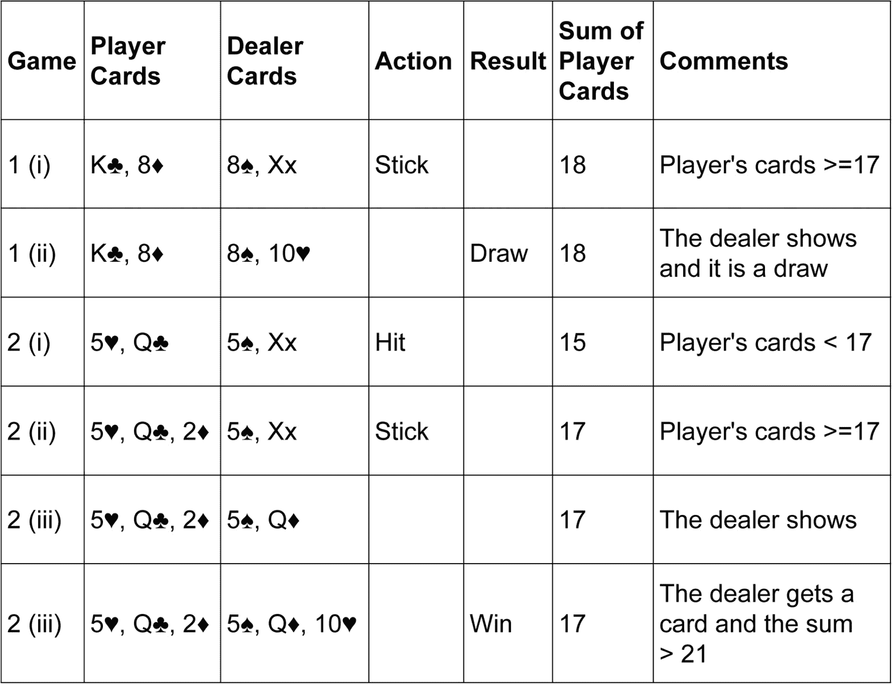

图 6.1：二十一点游戏的解释

接下来，我们将使用 OpenAI 框架实现一款二十一点游戏。这将作为蒙特卡洛方法的模拟和应用的基础。

## 练习 6.01：在二十一点中实现蒙特卡洛方法

我们将学习如何使用 OpenAI 框架来玩二十一点，并了解观察空间、动作空间和生成回合。此练习的目标是在二十一点游戏中实现蒙特卡罗技术。

执行以下步骤完成练习：

1.  导入必要的库：

    ```py
    import gym
    import numpy as np
    from collections import defaultdict
    from functools import partial
    ```

    `gym`是 OpenAI 框架，`numpy`是数据处理框架，`defaultdict`用于字典支持。

1.  我们使用`gym.make()`启动`Blackjack`环境，并将其分配给`env`：

    ```py
    #set the environment as blackjack
    env = gym.make('Blackjack-v0')
    ```

    找出观察空间和动作空间的数量：

    ```py
    #number of observation space value
    print(env.observation_space)
    #number of action space value
    print(env.action_space)    
    ```

    你将得到以下输出：

    ```py
    Tuple(Discrete(32), Discrete(11), Discrete(2))
    Discrete(2)
    ```

    观察空间的数量是状态的数量。动作空间的数量是每个状态下可能的动作数。输出结果显示为离散型，因为二十一点游戏中的观察和动作空间不是连续的。例如，OpenAI 中还有其他游戏，如平衡杆和摆钟，这些游戏的观察和动作空间是连续的。

1.  编写一个函数来玩游戏。如果玩家的卡片总和大于或等于 17，则停牌（不再抽卡）；否则，抽牌（选择更多卡片），如以下代码所示：

    ```py
    def play_game(state):
        player_score, dealer_score, usable_ace = state 
        #if player_score is greater than 17, stick
        if (player_score >= 17):
            return 0 # don't take any cards, stick
        else:
            return 1 # take additional cards, hit
    ```

    在这里，我们初始化回合，选择初始状态，并将其分配给`player_score`、`dealer_score`和`usable_ace`。

1.  添加一个字典`action_text`，它将两个动作整数映射到相应的动作文本。以下是将动作的整数值转换为文本格式的代码：

    ```py
    for game_num in range(100):
        print('***Start of Game:', game_num)
        state = env.reset()
        action_text = {1:'Hit, Take more cards!!', \
                       0:'Stick, Dont take any cards' }
        player_score, dealer_score, usable_ace = state
        print('Player Score=', player_score,', \
              Dealer Score=', dealer_score, ', \
              Usable Ace=', usable_ace)
    ```

1.  以每 100 个回合的批次玩游戏，并计算`state`、`reward`和`action`：

    ```py
        for i in range(100):
            action = play_game(state)
            state, reward, done, info = env.step(action)
            player_score, dealer_score, usable_ace = state
            print('Action is', action_text[action])
            print('Player Score=', player_score,', \
                  Dealer Score=', dealer_score, ', \
                  Usable Ace=', usable_ace, ', Reward=', reward)
            if done:
                if (reward == 1):
                    print('***End of Game:', game_num, \
                          ' You have won Black Jack!\n')
                elif (reward == -1):
                    print('***End of Game:', game_num, \
                          ' You have lost Black Jack!\n')
                elif (reward ==0):
                    print('***End of Game:', game_num, \
                          ' The game is a Draw!\n') 
                break
    ```

    你将得到以下输出：

    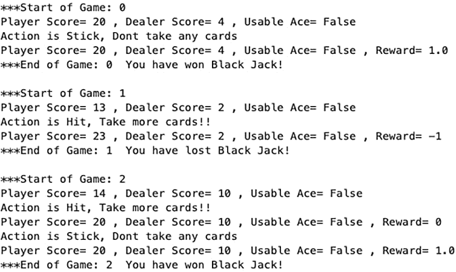

图 6.2：输出的是正在进行的二十一点游戏的回合

注意

蒙特卡罗技术基于生成随机样本。因此，同一段代码的两次执行结果值可能不同。所以，你可能会得到类似的输出，但并不完全相同，适用于所有练习和活动。

在代码中，`done`的值为`True`或`False`。如果`done`为`True`，游戏结束，我们记录奖励值并打印游戏结果。在输出中，我们使用蒙特卡罗方法模拟了二十一点游戏，并记录了不同的动作、状态和游戏完成情况。我们还模拟了游戏结束时的奖励。

注意

要访问此特定章节的源代码，请参考[`packt.live/2XZssYh`](https://packt.live/2XZssYh)。

你也可以在[`packt.live/2Ys0cMJ`](https://packt.live/2Ys0cMJ)在线运行这个示例。

接下来，我们将描述两种不同的蒙特卡罗方法，即首次访问法和每次访问法，这些方法将用于估计值函数。

# 蒙特卡罗方法的类型

我们使用蒙特卡洛实现了黑杰克游戏。通常，蒙特卡洛轨迹是一个状态、动作和奖励的序列。在多个回合中，可能会出现状态重复。例如，轨迹可能是 S0，S1，S2，S0，S3。我们如何在状态多次访问时处理奖励函数的计算呢？

从广义上讲，这突出了两种蒙特卡洛方法——首次访问和每次访问。我们将理解这两种方法的含义。

如前所述，在蒙特卡洛方法中，我们通过平均奖励来逼近值函数。在首次访问蒙特卡洛方法中，只有在一个回合中首次访问某个状态时才会被用来计算平均奖励。例如，在某个迷宫游戏中，你可能会多次访问同一个地方。使用首次访问蒙特卡洛方法时，只有首次访问时的奖励才会被用于计算奖励。当智能体在回合中重新访问相同的状态时，奖励不会被纳入计算平均奖励中。

在每次访问蒙特卡洛中，每次智能体访问相同的状态时，奖励都会被纳入计算平均回报。例如，使用相同的迷宫游戏。每次智能体到达迷宫中的相同位置时，我们都会将该状态下获得的奖励纳入奖励函数的计算。

首次访问和每次访问都会收敛到相同的值函数。对于较少的回合，首次访问和每次访问之间的选择取决于具体的游戏和游戏规则。

让我们通过理解首次访问蒙特卡洛预测的伪代码来深入了解。

## 首次访问蒙特卡洛预测用于估算值函数

在用于估算值函数的首次访问蒙特卡洛预测的伪代码中，关键是计算值函数*V(s)*。Gamma 是折扣因子。折扣因子用于将未来的奖励减少到低于即时奖励：

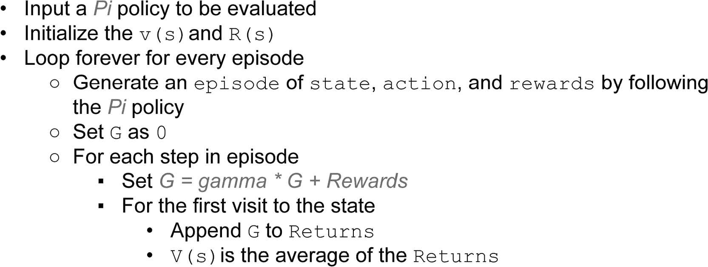

图 6.3：首次访问蒙特卡洛预测的伪代码

在首次访问中，我们所做的就是生成一个回合，计算结果值，并将结果附加到奖励中。然后我们计算平均回报。在接下来的练习中，我们将通过遵循伪代码中的步骤应用首次访问蒙特卡洛预测来估算值函数。首次访问算法的关键代码块是仅通过首次访问来遍历状态：

```py
if current_state not in states[:i]:
```

考虑那些尚未访问过的`states`。我们通过`1`增加`states`的数量，使用增量方法计算值函数，并返回值函数。实现方式如下：

```py
"""
only include the rewards of the states that have not been visited before
"""
            if current_state not in states[:i]:
                #increasing the count of states by 1
                num_states[current_state] += 1

                #finding the value_function by incremental method
                value_function[current_state] \
                += (total_rewards - value_function[current_state]) \
                / (num_states[current_state])
      return value_function
```

让我们通过下一个练习更好地理解这一点。

## 练习 6.02：使用首次访问蒙特卡洛预测估算黑杰克中的值函数

本次练习旨在理解如何应用首次访问蒙特卡洛预测来估计黑杰克游戏中的价值函数。我们将按照伪代码中概述的步骤一步步进行。

执行以下步骤以完成练习：

1.  导入必要的库：

    ```py
    import gym
    import numpy as np
    from collections import defaultdict
    from functools import partial
    ```

    `gym`是 OpenAI 的框架，`numpy`是数据处理框架，`defaultdict`用于字典支持。

1.  在 OpenAI 中选择环境为`Blackjack`：

    ```py
    env = gym.make('Blackjack-v0')
    ```

1.  编写`policy_blackjack_game`函数，该函数接受状态作为输入，并根据`player_score`返回`0`或`1`的动作：

    ```py
    def policy_blackjack_game(state):
        player_score, dealer_score, usable_ace = state
        if (player_score >= 17):
            return 0 # don't take any cards, stick
        else:
            return 1 # take additional cards, hit
    ```

    在该函数中，如果玩家分数大于或等于`17`，则不再抽取更多牌。但如果`player_score`小于 17，则抽取更多牌。

1.  编写一个生成黑杰克回合的函数。初始化`episode`、`states`、`actions`和`rewards`：

    ```py
    def generate_blackjack_episode():
        #initializing the value of episode, states, actions, rewards
        episode = []
        states = []
        actions = []
        rewards = []
    ```

1.  重置环境，并将`state`的值设置为`player_score`、`dealer_score`和`usable_ace`：

    ```py
       #starting the environment
        state = env.reset()

        """
        setting the state value to player_score, 
        dealer_score and usable_ace
        """
        player_score, dealer_score, usable_ace = state
    ```

1.  编写一个函数从状态中生成动作。然后我们执行该动作，找到`next_state`和`reward`：

    ```py
        while (True):
            #finding the action by passing on the state
            action = policy_blackjack_game(state)
            next_state, reward, done, info = env.step(action)
    ```

1.  创建一个`episode`、`state`、`action`和`reward`的列表，将它们附加到现有列表中：

    ```py
            #creating a list of episodes, states, actions, rewards
            episode.append((state, action, reward))
            states.append(state)
            actions.append(action)
            rewards.append(reward)
    ```

    如果这一集已完成（`done` 为 true），我们就`break`跳出循环。如果没有，我们更新`state`为`next_state`并重复循环：

    ```py
            if done:
                break
            state = next_state
    ```

1.  我们从函数中返回`episodes`、`states`、`actions`和`rewards`：

    ```py
        return episode, states, actions, rewards
    ```

1.  编写一个计算黑杰克价值函数的函数。第一步是初始化`total_rewards`、`num_states`和`value_function`的值：

    ```py
    def black_jack_first_visit_prediction(policy, env, num_episodes):
        """
        initializing the value of total_rewards, 
        number of states, and value_function
        """
        total_rewards = 0
        num_states = defaultdict(float)
        value_function = defaultdict(float)
    ```

1.  生成一个`episode`，对于每个`episode`，我们按逆序查找所有`states`的总`rewards`：

    ```py
        for k in range (0, num_episodes):
            episode, states, actions, rewards = \
            generate_blackjack_episode()
            total_rewards = 0
            for i in range(len(states)-1, -1,-1):
                current_state = states[i]
                #finding the sum of rewards
                total_rewards += rewards[i]
    ```

1.  考虑未访问过的`states`。我们将`states`的计数增加`1`，并使用增量方法计算价值函数，然后返回价值函数：

    ```py
                """
                only include the rewards of the states that 
                have not been visited before
                """
                if current_state not in states[:i]:
                    #increasing the count of states by 1
                    num_states[current_state] += 1

                    #finding the value_function by incremental method
                    value_function[current_state] \
                    += (total_rewards \
                    - value_function[current_state]) \
                    / (num_states[current_state])
        return value_function
    ```

1.  现在，执行首次访问预测 10,000 次：

    ```py
    black_jack_first_visit_prediction(policy_blackjack_game, env, 10000)
    ```

    你将获得以下输出：

    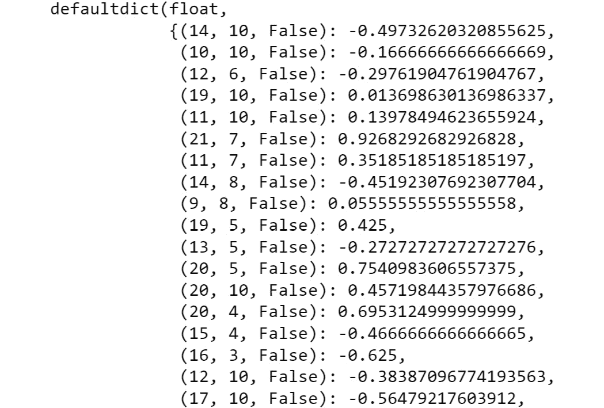

图 6.4：首次访问价值函数

首次访问的价值函数被打印出来。对于所有的状态，`player_score`、`dealer_score`和`usable_space`的组合都有一个来自首次访问评估的价值函数值。以`(16, 3, False): -0.625`为例。这意味着玩家分数为`16`、庄家分数为`3`、可用的 A 牌为`False`的状态的价值函数为`-0.625`。集数和批次数是可配置的。

注意

要访问此特定部分的源代码，请参考[`packt.live/37zbza1`](https://packt.live/37zbza1)。

你也可以在在线运行这个例子：[`packt.live/2AYnhyH`](https://packt.live/2AYnhyH)。

本节我们已经覆盖了首次访问蒙特卡洛方法。下一节我们将理解每次访问蒙特卡洛预测以估计价值函数。

## 每次访问蒙特卡洛预测用于估计价值函数

在每次访问蒙特卡洛预测中，每次访问状态都用于奖励计算。我们有一个 gamma 因子作为折扣因子，用于相对于近期奖励对未来奖励进行折扣：

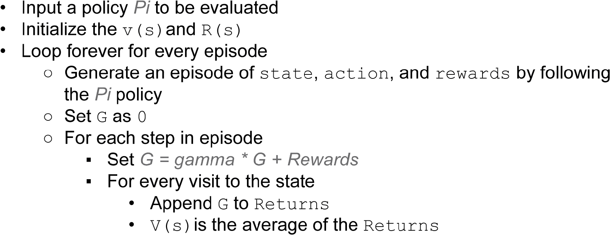

图 6.5：每次访问蒙特卡洛预测的伪代码

主要的区别在于每次访问每一步，而不仅仅是第一次，来计算奖励。代码与第一次访问的练习类似，唯一不同的是在 Blackjack 预测函数中计算奖励。

以下这一行在第一次访问实现中检查当前状态是否之前未被遍历。这个检查在每次访问算法中不再需要：

```py
if current_state not in states[:i]:
```

计算值函数的代码如下：

```py
            #all the state values of every visit are considered
            #increasing the count of states by 1
            num_states[current_state] += 1

            #finding the value_function by incremental method
            value_function[current_state] \
            += (total_rewards - value_function[current_state]) \
            / (num_states[current_state])
    return value_function
```

在本练习中，我们将使用每次访问蒙特卡洛方法来估计值函数。

## 练习 6.03：用于估计值函数的每次访问蒙特卡洛预测

本练习旨在帮助理解如何应用每次访问蒙特卡洛预测来估计值函数。我们将一步一步地应用伪代码中概述的步骤。执行以下步骤以完成练习：

1.  导入必要的库：

    ```py
    import gym
    import numpy as np
    from collections import defaultdict 
    from functools import partial
    ```

1.  在 OpenAI 中选择环境为 `Blackjack`：

    ```py
    env = gym.make('Blackjack-v0')
    ```

1.  编写 `policy_blackjack_game` 函数，接受状态作为输入，并根据 `player_score` 返回 `action` 为 `0` 或 `1`：

    ```py
    def policy_blackjack_game(state):
        player_score, dealer_score, usable_ace = state 
        if (player_score >= 17):
            return 0 # don't take any cards, stick
        else:
            return 1 # take additional cards, hit
    ```

    在该函数中，如果玩家的分数大于或等于`17`，则不再抽取牌。但如果`player_score`小于`17`，则会继续抽取牌。

1.  编写一个生成 Blackjack 回合的函数。初始化 `episode`、`states`、`actions` 和 `rewards`：

    ```py
    def generate_blackjack_episode():
        #initializing the value of episode, states, actions, rewards
        episode = []
        states = []
        actions = []
        rewards = []
    ```

1.  我们重置环境，并将 `state` 的值设置为 `player_score`、`dealer_score` 和 `usable_ace`，如以下代码所示：

    ```py
        #starting the environment
        state = env.reset()
        """
        setting the state value to player_score, dealer_score and 
        usable_ace
        """
        player_score, dealer_score, usable_ace = state
    ```

1.  编写一个函数，通过 `state` 生成 `action`，然后通过 `action` 步骤找到 `next_state` 和 `reward`：

    ```py
        while (True):
            #finding the action by passing on the state
            action = policy_blackjack_game(state)       
            next_state, reward, done, info = env.step(action)
    ```

1.  通过将 `episode`、`state`、`action` 和 `reward` 添加到现有列表中，创建一个列表：

    ```py
            #creating a list of episodes, states, actions, rewards
            episode.append((state, action, reward))
            states.append(state)
            actions.append(action)
            rewards.append(reward)
    ```

1.  如果回合完成（`done` 为真），我们就 `break` 循环。如果没有完成，我们更新 `state` 为 `next_state` 并重复循环：

    ```py
            if done:
                break
            state = next_state
    ```

1.  从函数中返回 `episodes`、`states`、`actions` 和 `rewards`：

    ```py
        return episode, states, actions, rewards
    ```

1.  编写用于计算 Blackjack 值函数的函数。第一步是初始化 `total_rewards`、`num_states` 和 `value_function` 的值：

    ```py
    def black_jack_every_visit_prediction\
    (policy, env, num_episodes):
        """
        initializing the value of total_rewards, number of states, 
        and value_function
        """
        total_rewards = 0
        num_states = defaultdict(float)
        value_function = defaultdict(float)
    ```

1.  生成一个 `episode`，对于该 `episode`，我们在 `episode` 中逆序找到所有 `states` 的总 `rewards`：

    ```py
        for k in range (0, num_episodes):
            episode, states, actions, rewards = \
            generate_blackjack_episode() 
            total_rewards = 0
            for i in range(len(states)-1, -1,-1):
                current_state = states[i]
                #finding the sum of rewards
                total_rewards += rewards[i]
    ```

1.  考虑每个访问的 `state`。我们将 `states` 的计数增加 `1`，并通过增量方法计算值函数，然后返回该值函数：

    ```py
                #all the state values of every visit are considered
                #increasing the count of states by 1
                num_states[current_state] += 1
                #finding the value_function by incremental method
                value_function[current_state] \
                += (total_rewards - value_function[current_state]) \
                / (num_states[current_state])
        return value_function
    ```

1.  现在，执行每次访问预测 10,000 次：

    ```py
    black_jack_every_visit_prediction(policy_blackjack_game, \
                                      env, 10000)
    ```

    你将得到以下输出：

    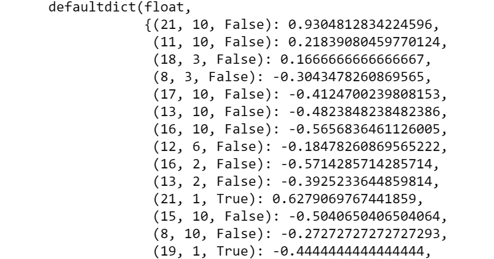

图 6.6：每次访问值函数

每次访问的价值函数都会被打印出来。对于所有状态，`player_score`、`dealer_score`和`usable_space`的组合都有来自每次访问评估的价值函数值。我们还可以增加训练回合数，并再次运行此操作。随着回合数的增大，首次访问和每次访问的函数将逐渐收敛。

注意

要访问此特定部分的源代码，请参考[`packt.live/2C0wAP4`](https://packt.live/2C0wAP4)。

您还可以在[`packt.live/2zqXsH3`](https://packt.live/2zqXsH3)在线运行此示例。

在下一节中，我们将讨论蒙特卡洛强化学习的一个关键概念，即探索与利用的平衡需求。这也是蒙特卡洛方法的贪婪ε策略的基础。平衡探索和利用有助于我们改进策略函数。

# 探索与利用的权衡

学习是通过探索新事物以及利用或应用之前学到的知识来进行的。这两者的正确结合是任何学习的核心。同样，在强化学习的背景下，我们也有探索和利用。**探索**是尝试不同的动作，而**利用**则是采取已知能带来良好奖励的动作。

强化学习必须在探索和利用之间取得平衡。每个智能体只能通过尝试某个动作的经验来学习。探索有助于尝试新的动作，这可能使智能体在未来做出更好的决策。利用是基于经验选择那些能带来良好奖励的动作。智能体需要在通过探索实验来获取奖励和通过利用已知路径来获得奖励之间做出权衡。如果智能体更多地进行利用，可能会错过学习其他更有回报的策略的机会。如果智能体更多地进行探索，可能会错失利用已知路径并失去奖励的机会。

例如，想象一个学生正在努力在大学中最大化自己的成绩。这个学生可以通过选修新学科的课程来“探索”，或者通过选修自己喜欢的课程来“利用”。如果学生倾向于“利用”，他可能会错过在新学科课程中获得好成绩和整体学习的机会。如果学生通过选修太多不同的学科课程来进行探索，这可能会影响他的成绩，并且可能让学习变得过于宽泛。

类似地，如果你选择阅读书籍，你可以通过阅读同一类型或同一作者的书籍来进行“开发”或通过跨越不同类型和作者的书籍来进行“探索”。类似地，当你从一个地方开车到另一个地方时，你可以通过基于过去经验沿用相同的已知路线来进行“开发”或通过选择不同的路线来进行“探索”。在下一部分中，我们将了解“在政策学习”和“脱政策学习”的技术。然后，我们将了解一个名为重要性采样的关键因素，它对于脱政策学习非常重要。

探索与开发是强化学习中常用的技术。在脱政策学习中，你可以将开发技术作为目标策略，而将探索技术作为行为策略。我们可以把贪婪策略作为开发技术，把随机策略作为探索技术。

# 重要性采样

蒙特卡洛方法可以是“在政策”或“脱政策”的。在**在政策**学习中，我们从代理遵循的策略经验中进行学习。在**脱政策**学习中，我们学习如何从遵循不同行为策略的经验中估计目标策略。重要性采样是脱政策学习的关键技术。下图展示了在政策与脱政策学习的对比：

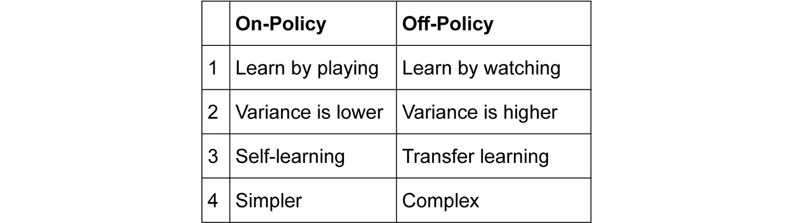

图 6.7：在政策与脱政策的比较

你可能会认为，在政策学习是在玩耍时学习，而脱政策学习是在观看别人玩耍时学习。你可以通过自己玩板球来提高你的板球水平。这有助于你从自己的错误和最佳行动中学习。这就是在政策学习。你也可以通过观察别人玩板球来学习，并从他们的错误和最佳行动中学习。这就是脱政策学习。

人类通常会同时进行在政策和脱政策学习。例如，骑自行车主要是属于在政策学习。我们通过学习在骑车时保持平衡来学习骑车。跳舞则是一种脱政策学习；你通过观察别人跳舞来学习舞步。

与脱政策方法相比，在政策方法较为简单。脱政策方法更强大，因为它具有“迁移学习”的效果。在脱政策方法中，你是从不同的策略中学习，收敛速度较慢，方差较大。

脱政策学习的优点在于，行为策略可以非常具有探索性，而目标策略可以是确定性的，并贪婪地优化奖励。

脱政策强化方法基于一个名为重要性采样的概念。该方法帮助在一个政策概率分布下估计值，前提是你拥有来自另一个政策概率分布的样本。让我们通过详细的伪代码理解蒙特卡洛脱政策评估。接着我们将在 OpenAI 框架中将其应用到 21 点游戏。

## 蒙特卡洛脱策略评估的伪代码

我们在下图中看到的是，我们正在通过从行为策略`b`中学习来估计`Q(s,a)`。

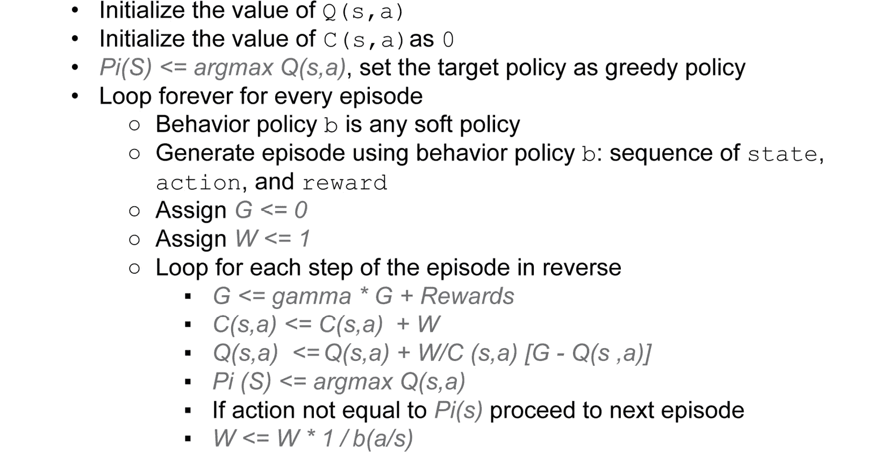

图 6.8：蒙特卡洛脱策略评估的伪代码

目标策略是贪婪策略；因此，我们通过使用`argmax Q(s,a)`选择具有最大回报的动作。Gamma 是折扣因子，它使我们能够将远期奖励与未来即时奖励进行折扣。累积价值函数`C(s,a)`通过加权`W`来计算。Gamma 用于折扣奖励。

脱策略蒙特卡洛的核心是遍历每个回合：

```py
for step in range(len(episode))[::-1]:
            state, action, reward = episode[step]
            #G <- gamma * G + Rt+1
            G = discount_factor * G + reward    
            # C(St, At) = C(St, At) + W
            C[state][action] += W
            #Q (St, At) <- Q (St, At) + W / C (St, At)
            Q[state][action] += (W / C[state][action]) \
            * (G - Q[state][action])
            """
            If action not equal to argmax of target policy 
            proceed to next episode
            """
            if action != np.argmax(target_policy(state)):
                break
            # W <- W * Pi(At/St) / b(At/St)
            W = W * 1./behaviour_policy(state)[action]
```

让我们通过使用重要性采样来理解蒙特卡洛脱策略方法的实现。这个练习将帮助我们学习如何设置目标策略和行为策略，并从行为策略中学习目标策略。

## 练习 6.04：使用蒙特卡洛进行重要性采样

这个练习的目标是通过使用蒙特卡洛方法进行脱策略学习。我们选择了一个贪婪的目标策略。我们也有一个行为策略，即任何软性、非贪婪策略。通过从行为策略中学习，我们将估计目标策略的价值函数。我们将把这种重要性采样技术应用到 Blackjack 游戏环境中。我们将按步骤执行伪代码中概述的步骤。

执行以下步骤以完成该练习：

1.  导入必要的库：

    ```py
    import gym
    import numpy as np
    from collections import defaultdict
    from functools import partial
    ```

1.  使用`gym.make`选择 OpenAI 中的`Blackjack`环境：

    ```py
    env = gym.make('Blackjack-v0')
    ```

1.  创建两个策略函数。一个是随机策略。随机策略选择一个随机动作，它是一个大小为 n 的列表，每个动作有 1/n 的概率，其中 n 是动作的数量：

    ```py
    """
    creates a random policy which is a linear probability distribution
    num_Action is the number of Actions supported by the environment
    """
    def create_random_policy(num_Actions): 
    #Creates a list of size num_Actions, with a fraction 1/num_Actions.
    #If 2 is numActions, the array value would [1/2, 1/2]
        Action = np.ones(num_Actions, dtype=float)/num_Actions
        def policy_function(observation):
            return Action
        return policy_function
    ```

1.  编写一个函数来创建贪婪策略：

    ```py
    #creates a greedy policy,
    """
    sets the value of the Action at the best_possible_action, 
    that maximizes the Q, value to be 1, rest to be 0
    """
    def create_greedy_policy(Q):
        def policy_function(state):
            #Initializing with zero the Q
            Action = np.zeros_like(Q[state], dtype = float)
            #find the index of the max Q value 
            best_possible_action = np.argmax(Q[state])
            #Assigning 1 to the best possible action
            Action[best_possible_action] = 1.0
            return Action
        return policy_function
    ```

    贪婪策略选择一个最大化奖励的动作。我们首先识别`best_possible_action`，即`Q`在所有状态中的最大值。然后，我们将值分配给对应于`best_possible_action`的`Action`。

1.  定义一个用于 Blackjack 重要性采样的函数，该函数以`env`、`num_episodes`、`behaviour_policy`和`discount_factor`作为参数：

    ```py
    def black_jack_importance_sampling\
    (env, num_episodes, behaviour_policy, discount_factor=1.0):
            #Initialize the value of Q
            Q = defaultdict(lambda: np.zeros(env.action_space.n))
            #Initialize the value of C
            C = defaultdict(lambda: np.zeros(env.action_space.n))
            #target policy is the greedy policy
            target_policy = create_greedy_policy(Q)
    ```

    我们初始化`Q`和`C`的值，并将目标策略设为贪婪策略。

1.  我们按回合数循环，初始化 episode 列表，并通过`env.reset()`声明初始状态集：

    ```py
            for i_episode in range(1, num_episodes + 1):
                episode = []
                state = env.reset()
    ```

1.  对于 100 个批次，在某个状态下应用行为策略来计算概率：

    ```py
                for i in range(100):
                    probability = behaviour_policy(state)
                    action = np.random.choice\
                             (np.arange(len(probability)), p=probability)
                    next_state, reward, done, info = env.step(action)
                    episode.append((state, action, reward))
    ```

    我们从列表中随机选择一个动作。用随机动作执行一步，返回`next_state`和`reward`。将`state`、`action`和`reward`附加到 episode 列表中。

1.  如果`episode`完成，我们跳出循环并将`next_state`赋值给`state`：

    ```py
                    if done:
                        break
                    state = next_state 
    ```

1.  初始化`G`，结果为`0`，并将`W`和权重设为`1`：

    ```py
                   # G <- 0
                         G = 0.0
                         # W <- 0
                         W = 1.0  
    ```

1.  使用`for`循环执行伪代码中详细描述的步骤，如下代码所示：

    ```py
                """
                Loop for each step of episode t=T-1, T-2,...,0 
                while W != 0
                """
                for step in range(len(episode))[::-1]:
                    state, action, reward = episode[step]
                    #G <- gamma * G + Rt+1
                    G = discount_factor * G + reward
                    # C(St, At) = C(St, At) + W
                    C[state][action] += W
                    #Q (St, At) <- Q (St, At) + W / C (St, At)
                    Q[state][action] += (W / C[state][action]) \
                    * (G - Q[state][action])
                    """
                    If action not equal to argmax of target policy 
                    proceed to next episode
                    """
                    if action != np.argmax(target_policy(state)):
                        break
                    # W <- W * Pi(At/St) / b(At/St)
                    W = W * 1./behaviour_policy(state)[action]
    ```

1.  返回 `Q` 和 `target_policy`：

    ```py
            return Q, target_policy 
    ```

1.  创建一个随机策略：

    ```py
    #create random policy
    random_policy = create_random_policy(env.action_space.n)
    """
    using importance sampling evaluates the target policy 
    by learning from the behaviour policy
    """
    Q, policy = black_jack_importance_sampling\
                (env, 50000, random_policy)
    ```

    随机策略作为行为策略使用。我们传入行为策略，并使用重要性采样方法，获得 `Q` 值函数或目标策略。

1.  遍历 `Q` 中的项，然后找到具有最大值的动作。然后将其作为相应状态的值函数存储：

    ```py
    valuefunction = defaultdict(float)
    for state, action_values in Q.items():
        action_value = np.max(action_values)
        valuefunction[state] = action_value
        print("state is", state, "value is", valuefunction[state])
    ```

    你将得到如下输出：

    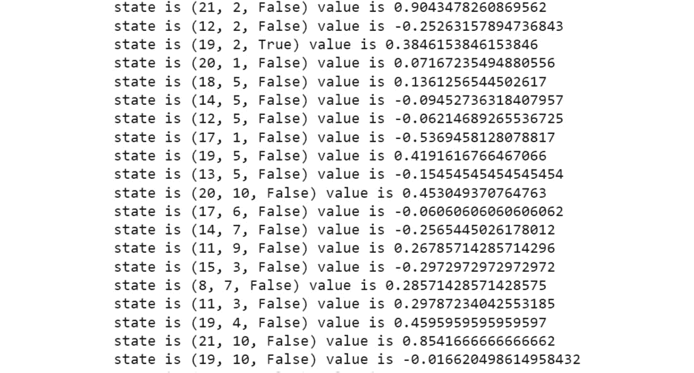

图 6.9：离策略蒙特卡罗评估输出

离策略评估已经计算并返回了每个状态-动作对的值函数。在这个练习中，我们使用行为策略应用了重要性采样的概念，并将学习应用于目标策略。输出为每个状态-动作对的组合提供了结果。这帮助我们理解了离策略学习。我们有两个策略——行为策略和目标策略。我们通过遵循行为策略学习目标策略。

注意

要访问此部分的源代码，请参考 [`packt.live/3hpOOKa`](https://packt.live/3hpOOKa)。

你也可以在线运行此示例：[`packt.live/2B1GQGa`](https://packt.live/2B1GQGa)。

在接下来的章节中，我们将学习如何使用蒙特卡罗技术解决 OpenAI 框架中的冰冻湖问题。

# 使用蒙特卡罗解决冰冻湖问题

冰冻湖是 OpenAI 框架中另一个简单的游戏。这是一个经典游戏，你可以用蒙特卡罗强化学习进行采样和模拟。我们已经在 *第五章*，*动态规划* 中描述并使用了冰冻湖环境。在这里，我们将快速复习游戏的基础知识，以便在接下来的活动中使用蒙特卡罗方法解决它。

我们有一个 4x4 的网格，这就是整个冰冻湖。它包含 16 个格子（一个 4x4 的网格）。这些格子标记为 `S` – 起始点，`F` – 冰冻区域，`H` – 坑洞，`G` – 目标。玩家需要从起始格子 `S` 移动到目标格子 `G`，并且穿过冰冻区域（`F` 格子），避免掉进坑洞（`H` 格子）。下图直观地展示了上述信息：

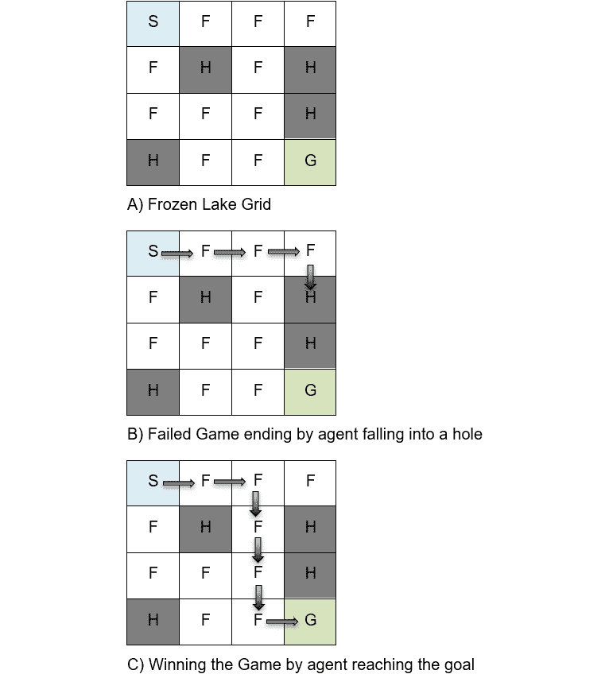

图 6.10：冰冻湖游戏

下面是游戏的一些基本信息：

+   `S`）到达目标（`G` 格子）。

+   **状态** = 16

+   **动作** = 4

+   **总状态-动作对** = 64

+   `F`）避免掉进湖中的坑洞（`H` 格子）。到达目标（`G` 格子）或掉进任何坑洞（`H` 格子）都会结束游戏。

+   **动作**：在任意一个格子中可以执行的动作有：左、下、右、上。

+   **玩家**：这是一个单人游戏。

+   `F`），到达目标（`G` 格子）得 +1，掉进坑洞（`H` 格子）得 0。

+   **配置**：你可以配置冰湖是滑的还是不滑的。如果冰湖是滑的，那么预期的动作和实际动作可能会有所不同，因此如果有人想向左移动，他们可能最终会向右、向下或向上移动。如果冰湖是非滑的，预期的动作和实际动作始终对齐。该网格有 16 个可能的单元，代理可以在任何时刻处于其中一个单元。代理可以在每个单元中执行 4 种可能的动作。因此，游戏中有 64 种可能性，这些可能性会根据学习过程不断更新。在下一次活动中，我们将深入了解 Frozen Lake 游戏，并了解其中的各种步骤和动作。

## 活动 6.01：探索 Frozen Lake 问题 – 奖励函数

Frozen Lake 是 OpenAI Gym 中的一款游戏，有助于应用学习和强化学习技术。在本次活动中，我们将解决 Frozen Lake 问题，并通过蒙特卡罗方法确定各种状态和动作。我们将通过一批批的回合来跟踪成功率。

执行以下步骤以完成活动：

1.  我们导入必要的库：`gym` 用于 OpenAI Gym 框架，`numpy`，以及处理字典所需的 `defaultdict`。

1.  下一步是选择环境为 `FrozenLake`，并将 `is_slippery` 设置为 `False`。通过 `env.reset()` 重置环境，并通过 `env.render()` 渲染环境。

1.  观察空间中可能的值的数量通过 `print(env.observation_space)` 打印输出。同样，动作空间中的值的数量通过 `print(env.action_space)` 命令打印输出。

1.  下一步是定义一个函数来生成一个冰湖 `episode`。我们初始化回合和环境。

1.  我们通过使用蒙特卡罗方法模拟不同的回合。然后我们逐步导航，存储 `episode` 并返回 `reward`。通过 `env.action_space.sample()` 获取动作。`next_state`、`action` 和 `reward` 通过调用 `env_step(action)` 函数获得。然后将它们附加到回合中。现在，回合变成了一个包含状态、动作和奖励的列表。

1.  关键是计算成功率，即一批回合的成功概率。我们的方法是计算一批回合中的总尝试次数。我们计算其中有多少次成功到达目标。代理成功到达目标的次数与代理尝试次数的比率即为成功率。首先，我们初始化总奖励。

1.  我们为每次迭代生成 `episode` 和 `reward`，并计算总 `reward`。

1.  成功率是通过将 `total_reward` 除以 `100` 来计算的，并打印输出。

1.  冰湖预测通过 `frozen_lake_prediction` 函数计算得出。最终输出将展示游戏的默认成功率，即在没有任何强化学习的情况下，游戏随机进行时的成功率。

    你将获得以下输出：

    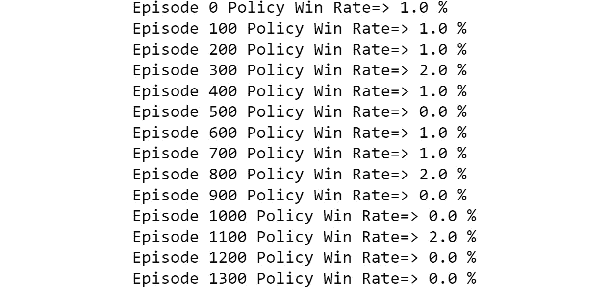

    ](img/B16182_06_11.jpg)

图 6.11：没有学习的冰湖输出

注

该活动的解决方案可以在第 719 页找到。

在下一节中，我们将详细介绍如何通过平衡探索和利用，使用 epsilon 软策略和贪婪策略来实现改进。这可以确保我们平衡探索和利用。

## 每次访问蒙特卡洛控制伪代码（用于 epsilon 软）

我们之前已经实现了每次访问蒙特卡洛算法来估算价值函数。在本节中，我们将简要描述用于 epsilon 软的每次访问蒙特卡洛控制，以便我们可以在本章的最终活动中使用它。下图展示了通过平衡探索和利用，针对 epsilon 软的每次访问伪代码：

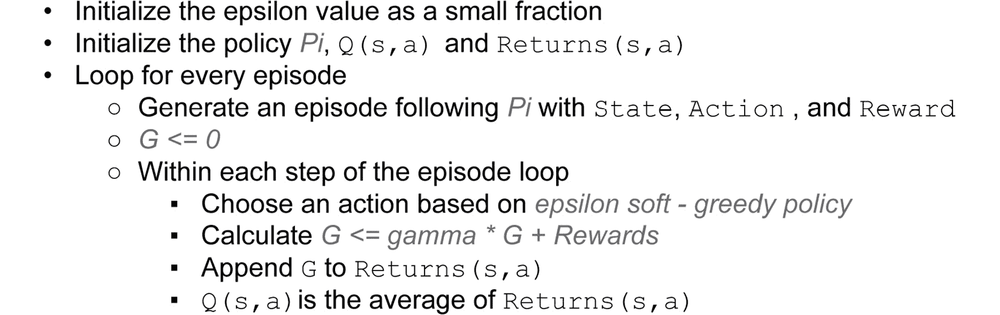

](img/B16182_06_12.jpg)

图 6.12：蒙特卡洛每次访问的伪代码（用于 epsilon 软）

以下代码以 epsilon 概率选择一个随机动作，并以 1-epsilon 概率选择一个具有最大 `Q(s,a)` 的动作。因此，我们可以在以 epsilon 概率进行探索和以 1-epsilon 概率进行利用之间做出选择：

```py
while not done:

        #random action less than epsilon
        if np.random.rand() < epsilon:
            #we go with the random action
            action = env.action_space.sample()
        else:
            """
            1 - epsilon probability, we go with the greedy algorithm
            """
            action = np.argmax(Q[state, :])
```

在下一项活动中，我们将通过实现蒙特卡洛控制每次访问的 epsilon 软方法来评估和改进冰湖问题的策略。

## 活动 6.02 使用蒙特卡洛控制每次访问解决冰湖问题（epsilon 软）

本活动的目标是通过使用每次访问 epsilon 软方法来评估和改进冰湖问题的策略。

您可以通过导入 `gym` 并执行 `gym.make()` 来启动冰湖游戏：

```py
import gym
env = gym.make("FrozenLake-v0", is_slippery=False)
```

执行以下步骤以完成活动：

1.  导入必要的库。

1.  选择环境为 `FrozenLake`。`is_slippery` 设置为 `False`。

1.  将 `Q` 值和 `num_state_action` 初始化为零。

1.  将 `num_episodes` 的值设置为 `100000`，并创建 `rewardsList`。将 epsilon 设置为 `0.30`。

1.  循环运行直到 `num_episodes`。初始化环境、`results_List` 和 `result_sum` 为零。同时重置环境。

1.  现在我们需要同时进行探索和利用。探索将是一个具有 epsilon 概率的随机策略，利用将是一个具有 1-epsilon 概率的贪婪策略。我们开始一个`while`循环，并检查是否需要以 epsilon 的概率选择一个随机值，或者以 1-epsilon 的概率选择一个贪婪策略。

1.  逐步执行 `action` 并获得 `new_state` 和 `reward`。

1.  结果列表将被附加，包括状态和动作对。`result_sum` 会根据结果的值递增。

1.  将 `new_state` 赋值给 `state`，并将 `result_sum` 添加到 `rewardsList` 中。

1.  使用增量方法计算 `Q[s,a]`，公式为 `Q[s,a] + (result_sum – Q[s,a]) / N(s,a)`。

1.  打印每 1000 次的成功率值。

1.  打印最终的成功率。

    您将最初获得以下输出：

    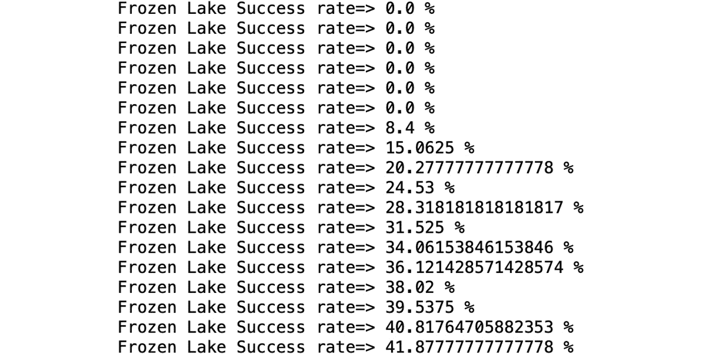

图 6.13：Frozen Lake 成功率的初始输出

最终你将得到以下输出：

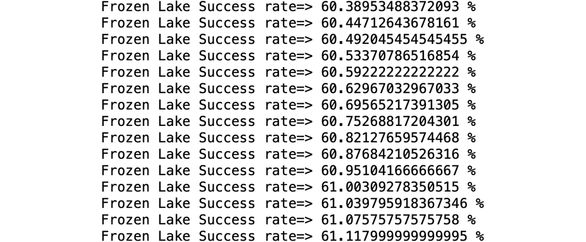

图 6.14：Frozen Lake 成功率的最终输出

注意

该活动的解决方案可以在第 722 页找到。

# 总结

蒙特卡洛方法通过样本情节的形式从经验中学习。在没有环境模型的情况下，智能体通过与环境互动，可以学习到一个策略。在多次仿真或抽样的情况下，情节是可行的。我们了解了首次访问和每次访问评估的方法。同时，我们也学习了探索与利用之间的平衡。这是通过采用一个ε软策略来实现的。接着，我们了解了基于策略学习和非基于策略学习，并且学习了重要性抽样在非基于策略方法中的关键作用。我们通过将蒙特卡洛方法应用于《黑杰克》游戏和 OpenAI 框架中的 Frozen Lake 环境来学习这些方法。

在下一章中，我们将学习时间学习及其应用。时间学习结合了动态规划和蒙特卡洛方法的优点。它可以在模型未知的情况下工作，像蒙特卡洛方法一样，但可以提供增量学习，而不是等待情节结束。
