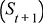
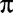
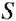
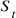
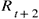
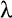
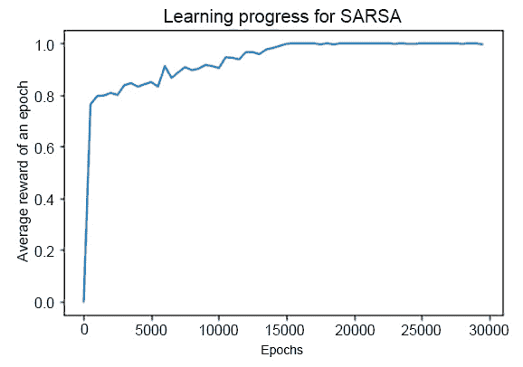

# 第七章：7. 时序差分学习

概览

在本章中，我们将介绍**时序差分**（**TD**）学习，并重点讨论它如何发展蒙特卡罗方法和动态规划的思想。时序差分学习是该领域的关键主题之一，研究它使我们能够深入理解强化学习及其在最基本层面上的工作原理。新的视角将使我们看到蒙特卡罗方法是时序差分方法的一个特例，从而统一了这种方法，并将其适用性扩展到非情节性问题。在本章结束时，你将能够实现**TD(0)**、**SARSA**、**Q-learning**和**TD(λ)**算法，并用它们来解决具有随机和确定性转移动态的环境。

# 时序差分学习简介

在前几章学习了动态规划和蒙特卡罗方法之后，本章我们将重点讨论时序差分学习，这是强化学习的主要基石之一。我们将从它们最简单的形式——单步方法开始，然后在此基础上构建出它们最先进的形式，基于资格迹（eligibility traces）概念。我们将看到这种新方法如何使我们能够将时序差分和蒙特卡罗方法框架在相同的推导思想下，从而能够对比这两者。在本章中，我们将实现多种不同的时序差分方法，并将它们应用于 FrozenLake-v0 环境，涵盖确定性和随机环境动态。最后，我们将通过一种名为 Q-learning 的离策略时序差分方法解决 FrozenLake-v0 的随机版本。

时序差分学习，其名称来源于它通过在后续时间步之间比较状态（或状态-动作对）值的差异来进行学习，可以被视为强化学习算法领域的一个核心思想。它与我们在前几章中学习的方法有一些重要相似之处——事实上，就像那些方法一样，它通过经验进行学习，无需模型（像蒙特卡罗方法那样），并且它是“自举”的，意味着它能够在达到情节结束之前，利用已经获得的信息进行学习（就像动态规划方法那样）。

这些差异与时序差分方法相对于蒙特卡洛（MC）和动态规划（DP）方法的优势紧密相关：它不需要环境模型，并且相对于 DP 方法，它可以更广泛地应用。另一方面，它的引导能力使得时序差分方法更适合处理非常长的任务回合，并且是非回合任务的唯一解决方案——蒙特卡洛方法无法应用于这种任务。以长期或非回合任务为例，想象一个算法，它用于授予用户访问服务器的权限，每次将排队中的第一个用户分配到资源时会获得奖励，如果没有授予用户访问权限，则没有奖励。这个队列通常永远不会结束，因此这是一个没有回合的持续任务。

正如前几章所见，探索与利用的权衡是一个非常重要的话题，在时序差分算法中同样如此。它们分为两大类：在政策方法和脱离政策方法。正如我们在前面章节中所看到的，在在政策方法中，所学习的政策用于探索环境，而在脱离政策方法中，二者可以不同：一个用于探索，另一个是目标政策，旨在学习。在接下来的部分中，我们将讨论为给定政策估计状态价值函数的通用问题。然后，我们将看到如何基于它构建一个完整的强化学习算法，训练在政策和脱离政策方法，以找到给定问题的最优策略。

让我们从时序差分方法的世界开始第一步。

# TD(0) – SARSA 和 Q-Learning

时序差分方法是无模型的，这意味着它们不需要环境模型来学习状态值表示。对于给定的策略，，它们累积与之相关的经验，并更新在相应经验中遇到的每个状态的值函数估计。在这个过程中，时序差分方法使用在接下来的时间步骤中遇到的状态（或状态）来更新给定状态值，状态是在时间`t`访问的，因此是`t+1`、`t+2`、...、`t+n`。一个抽象的例子如下：一个智能体在环境中初始化并开始通过遵循给定的策略与环境互动，而没有任何关于哪个动作会生成哪些结果的知识。经过一定数量的步骤，智能体最终会到达一个与奖励相关的状态。该奖励信号用于通过时序差分学习规则增加先前访问的状态（或动作-状态对）的值。实际上，这些状态帮助智能体达到了目标，因此应该与较高的值相关联。重复这个过程将使得智能体构建一个完整且有意义的所有状态（或状态-动作对）的价值图，以便它利用所获得的知识选择最佳动作，从而达到与奖励相关的状态。

这意味着，TD 方法不需要等到本回合结束才改进策略；相反，它们可以基于遇到的状态的值进行构建，学习过程可以在初始化之后立即开始。

在本节中，我们将重点讨论所谓的一步法，也称为 TD(0)。在这种方法中，唯一被考虑用于构建给定状态价值函数更新的数值是下一个时间步的数值，别无其他。因此，举例来说，时间`t`时刻状态的价值函数更新如下所示：


图 7.1：时间't'时刻状态的价值函数更新

这里，是环境转移后的下一个状态，是转移过程中获得的奖励，是学习率，是折扣因子。很明显，TD 方法是如何“自举”的：为了更新状态`(t)`的价值函数，它们使用下一个状态`(t+1)`的当前价值函数，而无需等待直到本回合结束。值得注意的是，前面方程中方括号内的量可以被解释为误差项。这个误差项衡量了状态 St 的估计值与新的、更好的估计值之间的差异，。这个量被称为 TD 误差，我们将在强化学习理论中多次遇到它：


图 7.2：时间't'时刻的 TD 误差

该误差是针对计算时所使用的特定时间而言的，它依赖于下一个时间步的数值（即，时间 t 的误差依赖于时间`t+1`的数值）。

TD 方法的一个重要理论结果是它们的收敛性证明：事实上，已经证明，对于任何固定的策略，，前面方程中描述的算法 TD(0)会收敛到状态（或状态-动作对）价值函数，。当步长参数足够小且为常数时，收敛是可以达到的，并且如果步长参数根据一些特定的（但容易遵循的）随机逼近条件减小，则以概率`1`收敛。这些证明主要适用于算法的表格版本，表格版本是用于强化学习理论介绍和理解的版本。这些版本处理的问题是状态和动作空间维度有限，因此可以通过有限变量组合进行穷举表示。

然而，当状态和动作空间如此庞大以至于不能通过有限变量的有限组合来表示时（例如，当状态空间是 RGB 图像空间时），这些证明的大多数可以轻松地推广到依赖于近似的算法版本时，这些近似版本被用于算法版本。

到目前为止，我们一直在处理状态值函数。为了解决时序差异控制的问题，我们需要学习一个状态-动作值函数，而不是一个状态值函数。事实上，通过这种方式，我们将能够为状态-动作对关联一个值，从而构建一个值映射，然后可以用来定义我们的策略。我们如何具体实现这一点取决于方法类别。首先，让我们看看所谓的在线策略方法，由所谓的 SARSA 算法实现，然后看看所谓的 Q 学习算法，它实现了离线策略方法。

## SARSA – 在线策略控制

对于一个在线策略方法，目标是估计，即当前行为策略下的状态-动作值函数，，适用于所有状态和所有动作。为此，我们只需将我们在状态值函数中看到的方程应用于状态-动作函数。由于这两种情况是相同的（都是马尔可夫链和奖励过程），关于状态值函数收敛到与最优策略相对应的值函数的定理（因此解决了找到最优策略的问题）在这种新设置中也是有效的，其中值函数涉及状态-动作对。更新方程如下所示：


图 7.3：时间‘t’时的状态-动作值函数

这种更新应该在每次从非终止状态转移到另一个状态后执行。如果是一个终止状态，则的值设为`0`。正如我们所见，更新规则使用了五元组的每个元素，这解释了与转换相关联的状态-动作对之间的转换，以及与转换相关联的奖励。正是因为这种形式的五元组，这个算法被称为**SARSA**。

使用这些元素，可以很容易地基于它们设计一个基于在线策略的控制算法。正如我们之前提到的，所有在线策略方法都估计行为策略的，同时基于更新。SARSA 控制算法的方案可以描述如下：

1.  选择算法参数；即步长，，该值必须在区间`(0, 1]`内，并且ε-贪心策略的`ε`参数必须小且大于 0，因为它表示选择非最优动作的概率，以便进行探索。这可以通过以下代码实现：

    ```py
    alpha = 0.02
    epsilon = 0.05
    ```

1.  初始化，对于所有的，，随意设置，唯一例外是 Q(terminal, ·) = 0，如以下代码片段所示，在一个有`16`个状态和`4`个动作的环境中：

    ```py
    q = np.ones((16,4))
    ```

1.  为每个回合创建一个循环。初始化，并使用从 Q 导出的策略（例如，ε-贪心）从中选择。这可以通过以下代码片段实现，其中初始状态由环境的`reset`函数提供，动作通过专门的ε-贪心函数选择：

    ```py
    for i in range(nb_episodes):
            s = env.reset()
            a = action_epsilon_greedy(q, s, epsilon=epsilon)
    ```

1.  为每个步骤创建一个循环。执行动作并观察。从中选择，使用从 Q 导出的策略（例如，ε-贪心）。使用 SARSA 规则更新选定状态-动作对的状态-动作值函数，该规则将新值定义为当前值与 TD 误差乘以步长的和，，如以下表达式所示：![图 7.4：使用 SARSA 规则更新状态-动作值函数]

    ](img/B16182_07_04.jpg)

图 7.4：使用 SARSA 规则更新状态-动作值函数

然后，使用将新状态-动作对更新至旧状态-动作对，直到是一个终止状态。所有这些都通过以下代码实现：

```py
while not done:
            new_s, reward, done, info = env.step(a)
            new_a = action_epsilon_greedy(q, new_s, epsilon=epsilon)
            q[s, a] = q[s, a] + alpha * (reward + gamma \
                      * q[new_s, new_a] - q[s, a])
            s = new_s
            a = new_a
```

注意

该算法的步骤和代码最初由*Sutton, Richard S. 《强化学习导论》。剑桥，马萨诸塞州：麻省理工学院出版社，2015 年*开发并概述。

在以下条件下，SARSA 算法可以以概率`1`收敛到最优策略和最优动作值函数：

+   所有的状态-动作对需要被访问无限多次。

+   在极限情况下，该策略会收敛为贪心策略，这可以通过ε-贪心策略实现，其中`ε`随时间消失（这可以通过设置`ε = 1/t`来完成）。

本算法使用了 ε-greedy 算法。我们将在下一章详细解释这一点，因此这里只做简要回顾。当通过状态-动作值函数学习策略时，状态-动作对的值被用来决定采取哪个最佳动作。在收敛时，给定状态下会从可用的动作中选择最佳的那个，并选择具有最高值的动作：这就是贪婪策略。这意味着对于每个给定的状态，始终会选择相同的动作（如果没有动作具有相同的值）。这种策略对于探索来说并不是一个好选择，尤其是在训练的初期。因此，在这个阶段，优先采用 ε-greedy 策略：最佳动作的选择概率为 `1-ε`，而其他情况下则选择一个随机动作。随着 `ε` 渐变为 0，ε-greedy 策略最终会变成贪婪策略，且当步数趋近于无穷大时，ε-greedy 策略会趋近于贪婪策略。

为了巩固这些概念，让我们立即应用 SARSA 控制算法。以下练习将展示如何实现 TD(0) SARSA 来解决 FrozenLake-v0 环境，首先使用其确定性版本。

这里的目标是观察 SARSA 算法如何恢复最优策略，而我们人类可以提前估算出这一策略，针对给定的问题配置。在深入之前，我们先快速回顾一下冰湖问题是什么，以及我们希望代理人找到的最优策略。代理人看到的是一个 4 x 4 的网格世界。

该网格包含一个起始位置 `S`（左上角），冰冻的方块 `F`，洞 `H`，以及一个目标 `G`（右下角）。当代理人到达终极目标状态时，它会获得 +1 的奖励，而如果它到达由洞构成的终极状态，则该回合结束且没有奖励。下表表示了环境：


图 7.5：FrozenLake-v0 环境

如前图所示，`S`是起始位置，`F`表示冰冻的方块，`H`表示空洞，`G`是目标。在确定性环境中，最优策略是能够让智能体在最短时间内到达目标的策略。严格来说，在这个特定环境中，由于没有对中间步骤的惩罚，因此最优路径不一定是最短的。每一条最终能够到达目标的路径在累计期望奖励方面都是同样最优的。然而，我们将看到，通过适当使用折扣因子，我们将能够恢复最优策略，而该策略也考虑了最短路径。在这种情况下，最优策略在下图中有所表示，其中每个四个动作（向下、向右、向左、向上）都由其首字母表示。有两个方块，对于它们来说，两个动作将导致相同的最优路径：


图 7.6: 最优策略

在上面的图示中，`D`表示向下，`R`表示向右，`U`表示向上，`L`表示向左。`!`代表目标，而`–`表示环境中的空洞。

我们将使用一个递减的`ε`值来逐步减少探索的范围，从而使其在极限时变为贪婪的。

这种类型的练习在学习经典强化学习算法时非常有用。由于是表格化的（这是一个网格世界示例，意味着它可以用一个 4x4 的网格表示），我们可以跟踪领域中发生的所有事情，轻松跟随在算法迭代过程中状态-动作对的值的更新，查看根据选定策略的动作选择，并收敛到最优策略。在本章中，你将学习如何在强化学习的背景下编写一个参考算法，并深入实践所有这些基本方面。

现在让我们继续进行实现。

## 练习 7.01: 使用 TD(0) SARSA 解决 FrozenLake-v0 确定性过渡

在这个练习中，我们将实现 SARSA 算法，并用它来解决 FrozenLake-v0 环境，在该环境中仅允许确定性过渡。这意味着我们将寻找（并实际找到）一个最优策略，以便在这个环境中取回飞盘。

以下步骤将帮助你完成这个练习：

1.  导入所需的模块：

    ```py
    import numpy as np
    import matplotlib.pyplot as plt
    %matplotlib inline
    import gym
    ```

1.  实例化一个名为`FrozenLake-v0`的`gym`环境。将`is_slippery`标志设置为`False`以禁用其随机性：

    ```py
    env = gym.make('FrozenLake-v0', is_slippery=False)
    ```

1.  看一下动作空间和观察空间：

    ```py
    print("Action space = ", env.action_space)
    print("Observation space = ", env.observation_space)
    ```

    这将打印出以下内容：

    ```py
    Action space =  Discrete(4)
    Observation space =  Discrete(16)
    ```

1.  创建两个字典，以便轻松将动作编号转换为动作：

    ```py
    actionsDict = {}
    actionsDict[0] = " L "
    actionsDict[1] = " D "
    actionsDict[2] = " R "
    actionsDict[3] = " U "
    actionsDictInv = {}
    actionsDictInv["L"] = 0
    actionsDictInv["D"] = 1
    actionsDictInv["R"] = 2
    actionsDictInv["U"] = 3
    ```

1.  重置环境并渲染它，以便能够查看网格问题：

    ```py
    env.reset()
    env.render()
    ```

    输出将如下所示：

    

    图 7.7: 环境的初始状态

1.  可视化该环境的最优策略：

    ```py
    optimalPolicy = ["R/D"," R "," D "," L ", \
                     " D "," - "," D "," - ", \
                     " R ","R/D"," D "," - ", \
                     " - "," R "," R "," ! ",]
    print("Optimal policy:")
    idxs = [0,4,8,12]
    for idx in idxs:
        print(optimalPolicy[idx+0], optimalPolicy[idx+1], \
              optimalPolicy[idx+2], optimalPolicy[idx+3])
    ```

    输出将如下所示：

    ```py
    Optimal policy:  
    R/D  R   D  L
     D   -   D  -
     R  R/D  D  -
     -   R   R  !
    ```

    这表示该环境的最优策略，显示在 4x4 网格中表示的每个环境状态下，在四个可用动作中选择的最优动作：*向上移动*，*向下移动*，*向右移动*，和*向左移动*。除了两个状态外，所有其他状态都有唯一的最优动作。实际上，如前所述，最优动作是那些通过最短路径将智能体带到目标的动作。两个不同的可能性为两个状态产生相同的路径长度，因此它们是同样的最优解。

1.  定义函数来执行ε-贪心动作。第一个函数实现了一个具有`1 - ε`概率的ε-贪心策略。选择的动作是与状态-动作对关联的最大值所对应的动作；否则，返回一个随机动作。第二个函数仅通过`lambda`函数在传递时调用第一个函数：

    ```py
    def action_epsilon_greedy(q, s, epsilon=0.05):
        if np.random.rand() > epsilon:
            return np.argmax(q[s])
        return np.random.randint(4)
    def get_action_epsilon_greedy(epsilon):
        return lambda q,s: action_epsilon_greedy\
                           (q, s, epsilon=epsilon)
    ```

1.  定义一个函数来执行贪婪动作：

    ```py
    def greedy_policy(q, s):
        return np.argmax(q[s])
    ```

1.  现在，定义一个函数来计算智能体表现的平均值。首先，我们将定义用于计算平均表现的集数（在此例中为`500`），然后在循环中执行所有这些集数。我们将重置环境并开始该集中的循环以进行此操作。接着，我们根据要衡量表现的策略选择一个动作，使用所选动作推进环境，最后将奖励添加到累积回报中。我们重复这些环境步骤，直到集数完成：

    ```py
    def average_performance(policy_fct, q):
        acc_returns = 0.
        n = 500
        for i in range(n):
            done = False
            s = env.reset()
            while not done:
                a = policy_fct(q, s)
                s, reward, done, info = env.step(a)
                acc_returns += reward
        return acc_returns/n
    ```

1.  设置总集数和步骤数，指定估算智能体的平均表现的频率，并设置`ε`参数，该参数决定其衰减方式。使用初始值、最小值和衰减范围（以集数为单位）：

    ```py
    nb_episodes = 80000
    STEPS = 2000
    epsilon_param = [[0.2, 0.001, int(nb_episodes/2)]]
    ```

1.  将 SARSA 训练算法定义为一个函数。在此步骤中，Q 表被初始化。所有的值都等于`1`，但终止状态的值被设置为`0`：

    ```py
    def sarsa(alpha = 0.02, \
              gamma = 1., \
              epsilon_start = 0.1, \
              epsilon_end = 0.001, \
              epsilon_annealing_stop = int(nb_episodes/2), \
              q = None, \
              progress = None, \
              env=env):
        if q is None:
            q = np.ones((16,4))
            # Set q(terminal,*) equal to 0
            q[5,:] = 0.0
            q[7,:] = 0.0
            q[11,:] = 0.0
            q[12,:] = 0.0
            q[15,:] = 0.0
    ```

1.  在所有集数中开始一个`for`循环：

    ```py
        for i in range(nb_episodes):
    ```

1.  在循环内，首先根据当前集数定义 epsilon 值：

    ```py
            inew = min(i,epsilon_annealing_stop)
            epsilon = (epsilon_start \
                       *(epsilon_annealing_stop - inew)\
                       +epsilon_end * inew) / epsilon_annealing_stop
    ```

1.  接下来，重置环境，并使用ε-贪心策略选择第一个动作：

    ```py
            done = False
            s = env.reset()
            a = action_epsilon_greedy(q, s, epsilon=epsilon)
    ```

1.  然后，我们开始一个集内循环：

    ```py
            while not done:
    ```

1.  在循环内，环境通过所选动作和新状态以及奖励进行推进，并获取 done 条件：

    ```py
                new_s, reward, done, info = env.step(a)
    ```

1.  选择一个新的动作，使用ε-贪心策略，通过 SARSA TD(0)规则更新 Q 表，并更新状态和动作的值：

    ```py
                new_a = action_epsilon_greedy\
                        (q, new_s, epsilon=epsilon)
                q[s, a] = q[s, a] + alpha * (reward + gamma \
                          * q[new_s, new_a] - q[s, a])
                s = new_s
                a = new_a
    ```

1.  最后，估算智能体的平均表现：

    ```py
            if progress is not None and i%STEPS == 0:
                progress[i//STEPS] = average_performance\
                                     (get_action_epsilon_greedy\
                                     (epsilon), q=q)
        return q, progress
    ```

    提供`ε`参数减少的简要描述可能会有所帮助。这由三个参数决定：起始值、最小值和减少范围（称为`epsilon_annealing_stop`）。它们的使用方式如下：`ε`从起始值开始，然后在由参数“范围”定义的回合数中线性递减，直到达到最小值，之后保持不变。

1.  定义一个数组，用于在训练过程中收集所有智能体的性能评估，以及 SARSA TD(0)训练的执行过程：

    ```py
    sarsa_performance = np.ndarray(nb_episodes//STEPS)
    q, sarsa_performance = sarsa(alpha = 0.02, gamma = 0.9, \
                                 progress=sarsa_performance, \
                                 epsilon_start=epsilon_param[0][0],\
                                 epsilon_end=epsilon_param[0][1], \
                                 epsilon_annealing_stop = \
                                 epsilon_param[0][2])
    ```

1.  绘制 SARSA 智能体在训练过程中平均奖励的历史记录：

    ```py
    plt.plot(STEPS*np.arange(nb_episodes//STEPS), sarsa_performance)
    plt.xlabel("Epochs")
    plt.title("Learning progress for SARSA")
    plt.ylabel("Average reward of an epoch")
    ```

    这会生成以下输出：

    ```py
    Text(0, 0.5, 'Average reward of an epoch')
    ```

    这可以通过以下方式进行可视化。它展示了 SARSA 算法的学习进展：

    

    图 7.8：训练过程中每个周期的平均奖励趋势

    如我们所见，随着`ε`参数的退火，SARSA 的表现随着时间的推移不断提升，从而在极限时达到了`0`的值，从而获得了贪心策略。这也证明了该算法在学习后能够达到 100%的成功率。

1.  评估经过训练的智能体（Q 表）在贪心策略下的表现：

    ```py
    greedyPolicyAvgPerf = average_performance(greedy_policy, q=q)
    print("Greedy policy SARSA performance =", greedyPolicyAvgPerf)
    ```

    输出如下所示：

    ```py
    Greedy policy SARSA performance = 1.0
    ```

1.  显示 Q 表的值：

    ```py
    q = np.round(q,3)
    print("(A,S) Value function =", q.shape)
    print("First row")
    print(q[0:4,:])
    print("Second row")
    print(q[4:8,:])
    print("Third row")
    print(q[8:12,:])
    print("Fourth row")
    print(q[12:16,:])
    ```

    输出如下所示：

    ```py
    (A,S) Value function = (16, 4)
    First row 
    [[0.505 0.59  0.54  0.506]
     [0.447 0.002 0.619 0.494]
     [0.49  0.706 0.487 0.562]
     [0.57  0.379 0.53  0.532]]
    Second row
    [[0.564 0.656 0\.    0.503]
     [0\.    0\.    0\.    0\.   ]
     [0.003 0.803 0.002 0.567]
     [0\.    0\.    0\.    0\.   ]]
    Third row
    [[0.62  0\.    0.728 0.555]
     [0.63  0.809 0.787 0\.   ]
     [0.707 0.899 0\.    0.699]
     [0\.    0\.    0\.    0\.   ]]
    Fourth row
    [[0\.    0\.    0\.    0\.   ]
     [0\.    0.791 0.9   0.696]
     [0.797 0.895 1\.    0.782]
     [0\.    0\.    0\.    0\.   ]]
    ```

    该输出展示了我们问题的完整状态-动作值函数的值。这些值随后用于通过贪心选择规则生成最优策略。

1.  打印出找到的贪心策略并与最优策略进行比较。在计算出状态-动作值函数后，我们可以从中提取出贪心策略。事实上，正如前面所解释的，贪心策略选择的是对于给定状态，Q 表中与之关联的最大值所对应的动作。为此，我们使用了`argmax`函数。将其应用于 16 个状态（从 0 到 15）中的每一个时，它返回与该状态相关的四个动作（从 0 到 3）中具有最大值的动作索引。在这里，我们还直接使用预先构建的字典输出与动作索引相关的标签：

    ```py
    policyFound = [actionsDict[np.argmax(q[0,:])],\
                   actionsDict[np.argmax(q[1,:])], \
                   actionsDict[np.argmax(q[2,:])], \
                   actionsDict[np.argmax(q[3,:])], \
                   actionsDict[np.argmax(q[4,:])], \
                   " - ",\
                   actionsDict[np.argmax(q[6,:])], \
                   " - ",\
                   actionsDict[np.argmax(q[8,:])], \
                   actionsDict[np.argmax(q[9,:])], \
                   actionsDict[np.argmax(q[10,:])], \
                   " - ",\
                   " - ",\
                   actionsDict[np.argmax(q[13,:])], \
                   actionsDict[np.argmax(q[14,:])], \
                   " ! "]
    print("Greedy policy found:")
    idxs = [0,4,8,12]
    for idx in idxs:
        print(policyFound[idx+0], policyFound[idx+1], \
              policyFound[idx+2], policyFound[idx+3])
    print(" ")
    print("Optimal policy:")
    idxs = [0,4,8,12]
    for idx in idxs:
        print(optimalPolicy[idx+0], optimalPolicy[idx+1], \
              optimalPolicy[idx+2], optimalPolicy[idx+3])
    ```

    输出如下所示：

    ```py
    Greedy policy found: 
     D   R   D  L
     D   -   D  -
     R   D   D  -
     -   R   R  !  

    Optimal policy:  
    R/D  R   D  L
     D   -   D  -
     R  R/D  D  -
     -   R   R  !
    ```

正如前面的输出所示，我们实现的 TD(0) SARSA 算法仅通过与环境交互并通过回合收集经验，然后采用在*SARSA – On-Policy Control*部分中定义的 SARSA 状态-动作对值函数更新规则，成功地学到了该任务的最优策略。实际上，正如我们所看到的，对于环境中的每个状态，我们算法计算的 Q 表获得的贪心策略所指定的动作与为分析环境问题而定义的最优策略一致。如我们之前所见，在两个状态中有两个同样最优的动作，智能体能够正确地执行其中之一。

注意

要访问此特定部分的源代码，请参考[`packt.live/3fJBLBh`](https://packt.live/3fJBLBh)。

你还可以在[`packt.live/30XeOXj`](https://packt.live/30XeOXj)在线运行这个示例。

## 随机性测试

现在，让我们来看一下如果在 FrozenLake-v0 环境中启用随机性会发生什么。为这个任务启用随机性意味着每个选定动作的转移不再是确定性的。具体来说，对于一个给定的动作，有三分之一的概率该动作会按预期执行，而两个相邻动作的概率各占三分之一和三分之一。反方向的动作则没有任何概率。因此，例如，如果设置了下（Down）动作，智能体会有三分之一的时间向下移动，三分之一的时间向右移动，剩下的三分之一时间向左移动，而绝不会向上移动，如下图所示：


图 7.9：如果从中心瓦片执行下（Down）动作时，各个结果状态的百分比

环境设置与我们之前看到的 FrozenLake-v0 确定性案例完全相同。同样，我们希望 SARSA 算法恢复最优策略。在这种情况下，这也可以事先进行估算。为了使推理更容易，这里有一个表示该环境的表格：


图 7.10：问题设置

在上面的图示中，`S`是起始位置，`F`表示冰冻瓦片，`H`表示坑洞，`G`是目标。对于随机环境，最优策略与对应的确定性情况有很大不同，甚至可能显得违背直觉。关键点是，为了保持获得奖励的可能性，我们唯一的机会就是避免掉入坑洞。由于中间步骤没有惩罚，我们可以继续绕行，只要我们需要。唯一确定的做法如下：

1.  移动到我们下一个发现的坑洞的反方向，即使这意味着远离目标。

1.  以各种可能的方式避免掉入那些有可能大于 0 的坑洞的瓦片：


图 7.11：环境设置（A），智能体执行的动作（B），以及在每个位置结束时接近起始状态的概率（C）

例如，考虑我们问题设置中左侧第二行的第一个瓦片，如前图表`B`所示。在确定性情况下，最优行动是向下移动，因为这样能使我们更接近目标。而在这个案例中，最佳选择是向左移动，即使向左意味着会碰到墙壁。这是因为向左是唯一不会让我们掉进坑里的行动。此外，有 33%的概率我们会最终到达第三行的瓦片，从而更接近目标。

注释

上述行为遵循了标准的边界实现。在该瓦片中，你执行“向左移动”这个完全合法的动作，环境会理解为“碰壁”。算法只会向环境发送一个“向左移动”的指令，环境会根据这个指令采取相应的行动。

类似的推理可以应用到其他所有瓦片，同时要记住前面提到的关键点。然而，值得讨论一个非常特殊的情况——这是我们无法实现 100%成功的唯一原因，即使使用最优策略：


图 7.12：环境设置（A）、代理执行“向左移动”动作（B）、以及每个位置结束时接近起始状态的概率（C）

现在，让我们来看一下我们问题设置中左侧第二行的第三个瓦片，如前图表 B 所示。这个瓦片位于两个坑之间，因此没有任何行动是 100%安全的。在这里，最佳行动实际上是向左或向右的坑移动！这是因为，向左或向右移动，我们有 66%的机会向上或向下移动，只有 33%的机会掉进坑里。向上或向下移动意味着我们有 66%的机会向右或向左移动，掉进坑里，只有 33%的机会真正向上或向下移动。由于这个瓦片是我们无法在 100%情况下实现最佳表现的原因，最好的办法是避免到达这个瓦片。为了做到这一点，除了起始瓦片外，最优策略的第一行所有的行动都指向上方，以避免落到这个有问题的瓦片上。

除了目标左侧的瓦片，所有其他值都受到坑的邻近影响：对于这个瓦片，最优行动选择是向下移动，因为这保持了到达目标的机会，同时避免落到上面的瓦片，在那里，代理会被迫向左移动以避免掉进坑里，从而冒着掉到两个坑之间的瓦片的风险。最优策略总结如下图所示：


图 7.13：最优策略

前面的图表显示了先前解释的环境的最优策略，其中 `D` 表示向下移动，`R` 表示向右移动，`U` 表示向上移动，`L` 表示向左移动。

在下面的例子中，我们将使用 SARSA 算法来解决这个新版本的 FrozenLake-v0 环境。为了获得我们刚才描述的最优策略，我们需要调整我们的超参数 —— 特别是折扣因子，。事实上，我们希望给予代理人足够多的步骤自由度。为了做到这一点，我们必须向目标传播价值，以便所有目标中的轨迹都能从中受益，即使这些轨迹不是最短的。因此，我们将使用一个接近`1`的折扣因子。在代码中，这意味着我们将使用`gamma = 1`，而不是`gamma = 0.9`。

现在，让我们看看我们的 SARSA 算法在这个随机环境中的工作。

## 练习 7.02：使用 TD(0) SARSA 解决 FrozenLake-v0 随机转移问题

在本练习中，我们将使用 TD(0) SARSA 算法来解决 FrozenLake-v0 环境，并启用随机转移。正如我们刚才看到的，由于需要考虑随机性因素，最优策略看起来与之前的练习完全不同。这给 SARSA 算法带来了新的挑战，我们将看到它如何仍然能够解决这个任务。这个练习将展示给我们这些健壮的 TD 方法如何处理不同的挑战，展示出了显著的鲁棒性。

按照以下步骤完成此练习：

1.  导入所需的模块：

    ```py
    import numpy as np
    import matplotlib.pyplot as plt
    %matplotlib inline
    import gym
    ```

1.  实例化 `gym` 环境，称为 `FrozenLake-v0`，使用 `is_slippery` 标志设置为 `True` 以启用随机性：

    ```py
    env = gym.make('FrozenLake-v0', is_slippery=True)
    ```

1.  查看动作和观察空间：

    ```py
    print("Action space = ", env.action_space)
    print("Observation space = ", env.observation_space)
    ```

    输出如下：

    ```py
    Action space =  Discrete(4)
    Observation space =  Discrete(16)
    ```

1.  创建两个字典，以便轻松地将 `actions` 索引（从 `0` 到 `3`）映射到标签（左、下、右和上）：

    ```py
    actionsDict = {}
    actionsDict[0] = "  L  "
    actionsDict[1] = "  D  "
    actionsDict[2] = "  R  "
    actionsDict[3] = "  U  "
    actionsDictInv = {}
    actionsDictInv["L"] = 0
    actionsDictInv["D"] = 1
    actionsDictInv["R"] = 2
    actionsDictInv["U"] = 3
    ```

1.  重置环境并渲染以查看网格问题：

    ```py
    env.reset()
    env.render()
    ```

    输出如下：

    

    图 7.14：环境的初始状态

1.  可视化此环境的最优策略：

    ```py
    optimalPolicy = ["L/R/D","  U  ","  U  ","  U  ",\
                     "  L  ","  -  "," L/R ","  -  ",\
                     "  U  ","  D  ","  L  ","  -  ",\
                     "  -  ","  R  ","  D  ","  !  ",]
    print("Optimal policy:")
    idxs = [0,4,8,12]
    for idx in idxs:
        print(optimalPolicy[idx+0], optimalPolicy[idx+1], \
              optimalPolicy[idx+2], optimalPolicy[idx+3])
    ```

    输出如下：

    ```py
    Optimal policy:  
      L/R/D  U    U    U
        L    -   L/R   -
        U    D    L    -
        -    R    D    !
    ```

    这代表了此环境的最优策略。除了两个状态外，所有其他状态都有一个与之关联的单一最优动作。事实上，正如先前描述的，这里的最优动作是将代理人远离洞穴或具有导致代理人移动到靠近洞穴的几率大于零的瓦片的动作。两个状态有多个与之关联的同等最优动作，这正是此任务的意图。

1.  定义函数来执行 ε-greedy 动作：

    ```py
    def action_epsilon_greedy(q, s, epsilon=0.05):
        if np.random.rand() > epsilon:
            return np.argmax(q[s])
        return np.random.randint(4)
    def get_action_epsilon_greedy(epsilon):
        return lambda q,s: action_epsilon_greedy\
                           (q, s, epsilon=epsilon)
    ```

    第一个函数实现了ε-贪婪策略：以`1 - ε`的概率，选择与状态-动作对关联的最高值的动作；否则，返回一个随机动作。第二个函数通过`lambda`函数传递时，简单地调用第一个函数。

1.  定义一个函数，用于执行贪婪策略：

    ```py
    def greedy_policy(q, s):
        return np.argmax(q[s])
    ```

1.  定义一个函数，用于计算代理的平均性能：

    ```py
    def average_performance(policy_fct, q):
        acc_returns = 0.
        n = 100
        for i in range(n):
            done = False
            s = env.reset()
            while not done:
                a = policy_fct(q, s)
                s, reward, done, info = env.step(a)
                acc_returns += reward
        return acc_returns/n
    ```

1.  设置总回合数，表示评估代理平均性能的间隔步数的步数，以及控制`ε`参数减少的参数，即起始值、最小值和范围（以回合数表示）：

    ```py
    nb_episodes = 80000
    STEPS = 2000
    epsilon_param = [[0.2, 0.001, int(nb_episodes/2)]]
    ```

1.  将 SARSA 训练算法定义为一个函数。初始化 Q 表时，所有值设置为`1`，但终止状态的值设置为`0`：

    ```py
    def sarsa(alpha = 0.02, \
              gamma = 1., \
              epsilon_start = 0.1,\
              epsilon_end = 0.001,\
              epsilon_annealing_stop = int(nb_episodes/2),\
              q = None, \
              progress = None, \
              env=env):
        if q is None:
            q = np.ones((16,4))
            # Set q(terminal,*) equal to 0
            q[5,:] = 0.0
            q[7,:] = 0.0
            q[11,:] = 0.0
            q[12,:] = 0.0
            q[15,:] = 0.0
    ```

1.  在所有回合之间开始一个循环：

    ```py
        for i in range(nb_episodes):
    ```

1.  在循环内，首先根据当前的回合数定义 epsilon 值。重置环境，并确保第一个动作是通过ε-贪婪策略选择的：

    ```py
            inew = min(i,epsilon_annealing_stop)
            epsilon = (epsilon_start \
                       * (epsilon_annealing_stop - inew)\
                       + epsilon_end * inew) \
                       / epsilon_annealing_stop
            done = False
            s = env.reset()
            a = action_epsilon_greedy(q, s, epsilon=epsilon)
    ```

1.  然后，开始一个回合内的循环：

    ```py
            while not done:
    ```

1.  在循环内，使用选定的动作在环境中执行步骤，并确保获取到新状态、奖励和完成条件：

    ```py
                new_s, reward, done, info = env.step(a)
    ```

1.  使用ε-贪婪策略选择一个新的动作，使用 SARSA TD(0)规则更新 Q 表，并确保状态和动作更新为其新值：

    ```py
                new_a = action_epsilon_greedy\
                        (q, new_s, epsilon=epsilon)
                q[s, a] = q[s, a] + alpha \
                          * (reward + gamma \
                             * q[new_s, new_a] - q[s, a])
                s = new_s
                a = new_a
    ```

1.  最后，估算代理的平均性能：

    ```py
            if progress is not None and i%STEPS == 0:
                progress[i//STEPS] = average_performance\
                                     (get_action_epsilon_greedy\
                                     (epsilon), q=q)
        return q, progress
    ```

    提供关于`ε`参数减小的简要描述可能会很有用。它受三个参数的控制：起始值、最小值和减小范围。它们的使用方式如下：`ε`从起始值开始，然后在由参数“范围”定义的集数内线性减小，直到达到最小值，并保持该值不变。

1.  定义一个数组，用来在训练和执行 SARSA TD(0)训练期间收集所有代理的性能评估：

    ```py
    sarsa_performance = np.ndarray(nb_episodes//STEPS)
    q, sarsa_performance = sarsa(alpha = 0.02, gamma = 1,\
                                 progress=sarsa_performance, \
                                 epsilon_start=epsilon_param[0][0],\
                                 epsilon_end=epsilon_param[0][1], \
                                 epsilon_annealing_stop = \
                                 epsilon_param[0][2])
    ```

1.  绘制 SARSA 代理在训练期间的平均奖励历史：

    ```py
    plt.plot(STEPS*np.arange(nb_episodes//STEPS), sarsa_performance)
    plt.xlabel("Epochs")
    plt.title("Learning progress for SARSA")
    plt.ylabel("Average reward of an epoch")
    ```

    这将生成以下输出，展示了 SARSA 算法的学习进度：

    ```py
    Text(0, 0.5, 'Average reward of an epoch')
    ```

    图将如下所示：

    

    图 7.15：训练回合期间一个周期的平均奖励趋势

    这个图清楚地展示了即使在考虑随机动态的情况下，SARSA 算法的性能是如何随回合数提升的。在约 60k 回合时性能的突然下降是完全正常的，尤其是在随机探索起主要作用，且随机过渡动态是环境的一部分时，正如在这个案例中所展示的那样。

1.  评估贪婪策略在训练代理（Q 表）下的表现：

    ```py
    greedyPolicyAvgPerf = average_performance(greedy_policy, q=q)
    print("Greedy policy SARSA performance =", greedyPolicyAvgPerf)
    ```

    输出将如下所示：

    ```py
    Greedy policy SARSA performance = 0.75
    ```

1.  显示 Q 表的值：

    ```py
    q = np.round(q,3)
    print("(A,S) Value function =", q.shape)
    print("First row")
    print(q[0:4,:])
    print("Second row")
    print(q[4:8,:])
    print("Third row")
    print(q[8:12,:])
    print("Fourth row")
    print(q[12:16,:])
    ```

    将生成以下输出：

    ```py
    (A,S) Value function = (16, 4)
    First row
    [[0.829 0.781 0.785 0.785]
     [0.416 0.394 0.347 0.816]
     [0.522 0.521 0.511 0.813]
     [0.376 0.327 0.378 0.811]]
    Second row
    [[0.83  0.552 0.568 0.549]
     [0\.    0\.    0\.    0\.   ]
     [0.32  0.195 0.535 0.142]
     [0\.    0\.    0\.    0\.   ]]
    Third row
    [[0.55  0.59  0.546 0.831]
     [0.557 0.83  0.441 0.506]
     [0.776 0.56  0.397 0.342]
     [0\.    0\.    0\.    0\.   ]]
    Fourth row
    [[0\.    0\.    0\.    0\.   ]
     [0.528 0.619 0.886 0.506]
     [0.814 0.943 0.877 0.844]
     [0\.    0\.    0\.    0\.   ]]
    ```

    该输出显示了我们问题的完整状态-动作值函数的值。这些值随后通过贪婪选择规则来生成最优策略。

1.  打印出找到的贪婪策略，并与最优策略进行比较。计算出状态-动作值函数后，我们能够从中提取出贪婪策略。事实上，正如之前所解释的，贪婪策略会选择在给定状态下与 Q 表中最大值关联的动作。为此，我们使用了 `argmax` 函数。当该函数应用于 16 个状态（从 0 到 15）时，它返回的是在四个可用动作（从 0 到 3）中，哪个动作与该状态的最大值关联的索引。在这里，我们还通过预先构建的字典直接输出与动作索引关联的标签：

    ```py
    policyFound = [actionsDict[np.argmax(q[0,:])],\
                   actionsDict[np.argmax(q[1,:])],\
                   actionsDict[np.argmax(q[2,:])],\
                   actionsDict[np.argmax(q[3,:])],\
                   actionsDict[np.argmax(q[4,:])],\
                   "  -  ",\
                   actionsDict[np.argmax(q[6,:])],\
                   "  -  ",\
                   actionsDict[np.argmax(q[8,:])],\
                   actionsDict[np.argmax(q[9,:])],\
                   actionsDict[np.argmax(q[10,:])],\
                   "  -  ",\
                   "  -  ",\
                   actionsDict[np.argmax(q[13,:])],\
                   actionsDict[np.argmax(q[14,:])],\
                   "  !  "]
    print("Greedy policy found:")
    idxs = [0,4,8,12]
    for idx in idxs:
        print(policyFound[idx+0], policyFound[idx+1], \
              policyFound[idx+2], policyFound[idx+3])
    print(" ")
    print("Optimal policy:")
    idxs = [0,4,8,12]
    for idx in idxs:
        print(optimalPolicy[idx+0], optimalPolicy[idx+1], \
              optimalPolicy[idx+2], optimalPolicy[idx+3])
    ```

    输出将如下所示：

    ```py
    Greedy policy found:
        L    U    U    U
        L    -    R    -
        U    D    L    -
        -    R    D    !
    Optimal policy:  
      L/R/D  U    U    U
        L    -   L/R   -
        U    D    L    -
        -    R    D    !
    ```

如你所见，和之前的练习一样，我们的算法通过简单地探索环境，成功找到了最优策略，即使在环境转移是随机的情况下。正如预期的那样，在这种设置下，不可能 100% 的时间都达到最大奖励。事实上，正如我们所看到的，对于环境中的每个状态，通过我们的算法计算出的 Q 表所获得的贪婪策略都建议一个与通过分析环境问题定义的最优策略一致的动作。如我们之前所见，有两个状态中有许多不同的动作是同样最优的，代理正确地执行了其中之一。

注意

要访问该特定部分的源代码，请参考 [`packt.live/3eicsGr`](https://packt.live/3eicsGr)。

你也可以在 [`packt.live/2Z4L1JV`](https://packt.live/2Z4L1JV) 在线运行此示例。

现在我们已经熟悉了在策略控制，是时候转向离策略控制了，这是强化学习中的一次早期突破，追溯到 1989 年的 Q-learning。

注意

Q-learning 算法最早由 *Watkins 在 Mach Learn 8, 279–292 (1992)* 提出。在这里，我们仅提供一个直观理解，以及简要的数学描述。有关更详细的数学讨论，请参阅原始论文 [`link.springer.com/article/10.1007/BF00992698`](https://link.springer.com/article/10.1007/BF00992698)。

## Q-learning – 离策略控制

Q-learning 是识别一类离策略控制时序差分算法的名称。从数学/实现的角度来看，与在策略算法相比，唯一的区别在于用于更新 Q 表（或近似方法的函数）的规则，具体定义如下：


图 7.16：近似方法的函数

关键点在于如何为下一个状态选择动作，。实际上，选择具有最大状态-动作值的动作直接近似了找到最优 Q 值并遵循最优策略时发生的情况。此外，它与用于收集经验的策略无关，而是在与环境互动时得到的。探索策略可以与最优策略完全不同；例如，它可以是ε-greedy 策略以鼓励探索，并且在一些容易满足的假设下，已经证明 Q 会收敛到最优值。

在*第九章，什么是深度 Q 学习？*中，你将研究这种方法在非表格化方法中的扩展，我们使用深度神经网络作为函数近似器。这种方法叫做深度 Q 学习。Q-learning 控制算法的方案可以如下所示：

1.  选择算法参数：步长，，它必须位于区间(0, 1]内，以及ε-greedy 策略的`ε`参数，它必须较小且大于`0`，因为它表示选择非最优动作的概率，以促进探索：

    ```py
    alpha = 0.02
    epsilon_expl = 0.2
    ```

1.  对所有，，进行初始化，任意设置，除了 Q(terminal, *) = 0：

    ```py
    q = np.ones((16, 4))
    # Set q(terminal,*) equal to 0
    q[5,:] = 0.0
    q[7,:] = 0.0
    q[11,:] = 0.0
    q[12,:] = 0.0
    q[15,:] = 0.0
    ```

1.  在所有回合中创建一个循环。在该循环中，初始化`s`：

    ```py
    for i in range(nb_episodes):
        done = False
        s = env.reset()
    ```

1.  为每个回合创建一个循环。在该循环中，使用从 Q 派生的策略（例如，ε-greedy）从中选择：

    ```py
        while not done:
            # behavior policy
            a = action_epsilon_greedy(q, s, epsilon=epsilon_expl)
    ```

1.  执行动作，，观察。使用 Q-learning 规则更新所选状态-动作对的状态-动作值函数，该规则将新值定义为当前值加上与步长相乘的与离策略相关的 TD 误差。可以表示如下：

图 7.17：更新的状态-动作值函数的表达式

前面的解释可以通过代码实现如下：

```py
        new_s, reward, done, info = env.step(a)
        a_max = np.argmax(q[new_s]) # estimation policy 
        q[s, a] = q[s, a] + alpha \
                  * (reward + gamma \
                     * q[new_s, a_max] -q[s, a])
        s = new_s
```

如我们所见，我们只是将新状态下采取动作的随机选择替换为与最大 q 值相关的动作。这种（看似）微小的变化，可以通过适配 SARSA 算法轻松实现，但对方法的性质有着重要影响。我们将在接下来的练习中看到它的效果。

## 练习 7.03：使用 TD(0) Q-Learning 解决 FrozenLake-v0 的确定性转移问题

在本练习中，我们将实现 TD(0) Q 学习算法来解决 FrozenLake-v0 环境，其中只允许确定性转移。在本练习中，我们将考虑与*练习 7.01，使用 TD(0) SARSA 解决 FrozenLake-v0 确定性转移*中相同的任务，即取回飞盘的最优策略，但这次我们不使用 SARSA 算法（基于策略），而是实现 Q 学习（非基于策略）。我们将观察该算法的行为，并训练自己通过恢复智能体的最优策略来实现一种新的估算 q 值表的方法。

按照以下步骤完成此练习：

1.  导入所需的模块，如下所示：

    ```py
    import numpy as np
    import matplotlib.pyplot as plt
    %matplotlib inline
    import gym
    ```

1.  实例化名为`FrozenLake-v0`的`gym`环境，设置`is_slippery`标志为`False`，以禁用随机性：

    ```py
    env = gym.make('FrozenLake-v0', is_slippery=False)
    ```

1.  查看动作空间和观察空间：

    ```py
    print("Action space = ", env.action_space)
    print("Observation space = ", env.observation_space)
    ```

    输出结果如下：

    ```py
    Action space =  Discrete(4)
    Observation space =  Discrete(16)
    ```

1.  创建两个字典，方便将`actions`数字转换为动作：

    ```py
    actionsDict = {}
    actionsDict[0] = " L "
    actionsDict[1] = " D "
    actionsDict[2] = " R "
    actionsDict[3] = " U "
    actionsDictInv = {}
    actionsDictInv["L"] = 0
    actionsDictInv["D"] = 1
    actionsDictInv["R"] = 2
    actionsDictInv["U"] = 3
    ```

1.  重置环境并渲染以查看网格问题：

    ```py
    env.reset()
    env.render()
    ```

    输出结果如下：

    

    ](img/B16182_07_18.jpg)

    图 7.18：环境的初始状态

1.  可视化该环境的最优策略：

    ```py
    optimalPolicy = ["R/D"," R "," D "," L ",\
                     " D "," - "," D "," - ",\
                     " R ","R/D"," D "," - ",\
                     " - "," R "," R "," ! ",]
    print("Optimal policy:")
    idxs = [0,4,8,12]
    for idx in idxs:
        print(optimalPolicy[idx+0], optimalPolicy[idx+1], \
              optimalPolicy[idx+2], optimalPolicy[idx+3])
    ```

    输出结果如下：

    ```py
    Optimal policy:  
    R/D  R   D  L
     D   -   D  -
     R  R/D  D  -
     -   R   R  !
    ```

    这表示该环境的最优策略，并显示在 4x4 网格中表示的每个环境状态，对于四个可用动作中最优的动作：上移、下移、右移和左移。除了两个状态外，所有其他状态都有与之关联的唯一最优动作。实际上，正如前面所述，最优动作是那些将智能体带到目标的最短路径。两个不同的可能性导致两个状态具有相同的路径长度，因此它们都同样最优。

1.  接下来，定义将执行ε-贪婪动作的函数：

    ```py
    def action_epsilon_greedy(q, s, epsilon=0.05):
        if np.random.rand() > epsilon:
            return np.argmax(q[s])
        return np.random.randint(4)
    ```

1.  定义一个函数来执行贪婪动作：

    ```py
    def greedy_policy(q, s):
        return np.argmax(q[s])
    ```

1.  定义一个函数来计算智能体表现的平均值：

    ```py
    def average_performance(policy_fct, q):
        acc_returns = 0.
        n = 500
        for i in range(n):
            done = False
            s = env.reset()
            while not done:
                a = policy_fct(q, s)
                s, reward, done, info = env.step(a)
                acc_returns += reward
        return acc_returns/n
    ```

1.  初始化 Q 表，使得所有值都等于`1`，除了终止状态的值：

    ```py
    q = np.ones((16, 4))
    # Set q(terminal,*) equal to 0
    q[5,:] = 0.0
    q[7,:] = 0.0
    q[11,:] = 0.0
    q[12,:] = 0.0
    q[15,:] = 0.0
    ```

1.  设置总集数、表示我们评估智能体平均表现的间隔步数、学习率、折扣因子、`ε`值（用于探索策略），并定义一个数组以收集训练过程中所有智能体的表现评估：

    ```py
    nb_episodes = 40000
    STEPS = 2000
    alpha = 0.02
    gamma = 0.9
    epsilon_expl = 0.2
    q_performance = np.ndarray(nb_episodes//STEPS)
    ```

1.  使用 Q-learning 算法训练代理：外部循环负责生成所需的回合数。然后，回合内循环完成以下步骤：首先，使用 ε-贪心策略选择一个探索动作，然后环境通过选择的探索动作进行一步，获取 `new_s`、`reward` 和 `done` 条件。为新状态选择新动作，使用贪心策略更新 Q-table，使用 Q-learning TD(0) 规则更新状态的新值。每隔预定步骤数，就会评估代理的平均表现：

    ```py
    for i in range(nb_episodes):
        done = False
        s = env.reset()
        while not done:
            # behavior policy
            a = action_epsilon_greedy(q, s, epsilon=epsilon_expl)
            new_s, reward, done, info = env.step(a)
            a_max = np.argmax(q[new_s]) # estimation policy 
            q[s, a] = q[s, a] + alpha \
                      * (reward + gamma \
                         * q[new_s, a_max] - q[s, a])
            s = new_s
        # for plotting the performance
        if i%STEPS == 0:
            q_performance[i//STEPS] = average_performance\
                                      (greedy_policy, q)
    ```

1.  绘制 Q-learning 代理在训练过程中的平均奖励历史：

    ```py
    plt.plot(STEPS * np.arange(nb_episodes//STEPS), q_performance)
    plt.xlabel("Epochs")
    plt.ylabel("Average reward of an epoch")
    plt.title("Learning progress for Q-Learning")
    ```

    这将生成以下输出，展示 Q-learning 算法的学习进度：

    ```py
    Text(0.5, 1.0, 'Learning progress for Q-Learning')
    ```

    输出将如下所示：

    

    图 7.19：训练轮次中每个时期的平均奖励趋势

    正如我们所看到的，图表展示了随着代理收集越来越多的经验，Q-learning 性能如何在多个周期中快速增长。它还表明，算法在学习后能够达到 100% 的成功率。还可以明显看出，与 SARSA 方法相比，在这种情况下，测量的算法性能稳步提高，且提高速度要快得多。

1.  评估训练好的代理（Q-table）的贪心策略表现：

    ```py
    greedyPolicyAvgPerf = average_performance(greedy_policy, q=q)
    print("Greedy policy Q-learning performance =", \
          greedyPolicyAvgPerf)
    ```

    输出将如下所示：

    ```py
    Greedy policy Q-learning performance = 1.0
    ```

1.  显示 Q-table 的值：

    ```py
    q = np.round(q,3)
    print("(A,S) Value function =", q.shape)
    print("First row")
    print(q[0:4,:])
    print("Second row")
    print(q[4:8,:])
    print("Third row")
    print(q[8:12,:])
    print("Fourth row")
    print(q[12:16,:])
    ```

    以下输出将被生成：

    ```py
    (A,S) Value function = (16, 4)
    First row
    [[0.531 0.59  0.59  0.531]
     [0.617 0.372 0.656 0.628]
     [0.672 0.729 0.694 0.697]
     [0.703 0.695 0.703 0.703]]
    Second row
    [[0.59  0.656 0\.    0.531]
     [0\.    0\.    0\.    0\.   ]
     [0.455 0.81  0.474 0.754]
     [0\.    0\.    0\.    0\.   ]]
    Third row
    [[0.656 0\.    0.729 0.59 ]
     [0.656 0.81  0.81  0\.   ]
     [0.778 0.9   0.286 0.777]
     [0\.    0\.    0\.    0\.   ]]
    Fourth row
    [[0\.    0\.    0\.    0\.   ]
     [0\.    0.81  0.9   0.729]
     [0.81  0.9   1\.    0.81 ]
     [0\.    0\.    0\.    0\.   ]]
    ```

    此输出显示了我们问题的完整状态-动作价值函数的值。这些值随后用于通过贪心选择规则生成最优策略。

1.  打印出找到的贪心策略，并与最优策略进行比较：

    ```py
    policyFound = [actionsDict[np.argmax(q[0,:])],\
                   actionsDict[np.argmax(q[1,:])],\
                   actionsDict[np.argmax(q[2,:])],\
                   actionsDict[np.argmax(q[3,:])],\
                   actionsDict[np.argmax(q[4,:])],\
                   " - ",\
                   actionsDict[np.argmax(q[6,:])],\
                   " - ",\
                   actionsDict[np.argmax(q[8,:])],\
                   actionsDict[np.argmax(q[9,:])],\
                   actionsDict[np.argmax(q[10,:])],\
                   " - ",\
                   " - ",\
                   actionsDict[np.argmax(q[13,:])],\
                   actionsDict[np.argmax(q[14,:])],\
                   " ! "]
    print("Greedy policy found:")
    idxs = [0,4,8,12]
    for idx in idxs:
        print(policyFound[idx+0], policyFound[idx+1], \
              policyFound[idx+2], policyFound[idx+3])
    print(" ")
    print("Optimal policy:")
    idxs = [0,4,8,12]
    for idx in idxs:
        print(optimalPolicy[idx+0], optimalPolicy[idx+1], \
              optimalPolicy[idx+2], optimalPolicy[idx+3])
    ```

    输出将如下所示：

    ```py
    Greedy policy found: 
     D   R   D  L
     D   -   D  -
     R   D   D  -
     -   R   R  !  
    Optimal policy:  
    R/D  R   D  L
     D   -   D  -
     R  R/D  D  -
     -   R   R  !
    ```

正如这些输出所示，Q-learning 算法能够像 SARSA 一样，通过经验和与环境的互动，成功地提取最优策略，正如在 *练习 07.01，使用 TD(0) SARSA 解决 FrozenLake-v0 确定性转移* 中所做的那样。

正如我们所看到的，对于网格世界中的每个状态，使用我们算法计算的 Q 表得到的贪心策略都能推荐一个与通过分析环境问题定义的最优策略一致的动作。正如我们已经看到的，有两个状态在其中存在多个不同的动作，它们同样是最优的，且代理正确地实现了其中的一个。

注意

要访问此特定部分的源代码，请参考 [`packt.live/2AUlzym`](https://packt.live/2AUlzym)。

您也可以在线运行此示例，网址为 [`packt.live/3fJCnH5`](https://packt.live/3fJCnH5)。

对于 SARSA 来说，如果我们启用随机转移，看看 Q-learning 的表现将会是很有趣的。这将是本章末尾活动的目标。两个算法遵循的程序与我们在 SARSA 中采用的完全相同：用于确定性转移情况的 Q-learning 算法被应用，您需要调整超参数（特别是折扣因子和训练轮次），直到在随机转移动态下获得对最优策略的收敛。

为了完善 TD(0) 算法的全貌，我们将引入另一种特定的方法，该方法是通过对前面的方法进行非常简单的修改得到的：期望 SARSA。

## 期望 SARSA

现在，让我们考虑一个与 Q-learning 非常相似的学习算法，唯一的区别是将下一个状态-动作对的最大值替换为期望值。这是通过考虑当前策略下每个动作的概率来计算的。这个修改后的算法可以通过以下更新规则来表示：


图 7.20：状态-动作值函数更新规则

与 SARSA 相比，额外的计算复杂性提供了一个优势，即消除了由于随机选择 `A`t+1 所带来的方差，这对于显著提高学习效果和鲁棒性是一个非常强大的技巧。它可以同时用于在策略和非策略的方式，因此成为了 SARSA 和 Q-learning 的一种抽象，通常其性能优于两者。以下片段提供了该更新规则的实现示例：

```py
q[s, a] = q[s, a] + alpha * (reward + gamma * 
    (np.dot(pi[new_s, :],q[new_s, :]) - q[s, a])
```

在前面的代码中，`pi` 变量包含了每个状态下每个动作的所有概率。涉及 `pi` 和 `q` 的点积是计算新状态期望值所需的操作，考虑到该状态下所有动作及其各自的概率。

现在我们已经学习了 TD(0) 方法，让我们开始学习 N 步 TD 和 TD(λ) 算法。

# N 步 TD 和 TD(λ) 算法

在上一章中，我们研究了蒙特卡罗方法，而在本章前面的部分，我们学习了 TD(0) 方法，正如我们很快会发现的，它们也被称为一步时序差分方法。在本节中，我们将它们统一起来：事实上，它们处在一系列算法的极端（TD(0) 在一端，MC 方法在另一端），而通常，性能最优的方法是处于这个范围的中间。

N 步时序差分算法是对一阶时序差分方法的扩展。更具体地说，它们将蒙特卡罗和时序差分方法进行了概括，使得两者之间的平滑过渡成为可能。正如我们已经看到的，蒙特卡罗方法必须等到整个回合结束后，才能将奖励反向传播到之前的状态。而一阶时序差分方法则直接利用第一个可用的未来步骤进行自举，并开始更新状态或状态-动作对的价值函数。这两种极端情况很少是最佳选择。最佳选择通常位于这一广泛范围的中间。使用 N 步方法可以让我们调整在更新价值函数时考虑的步数，从而将自举方法分散到多个步骤上。

在资格迹的背景下也可以回忆起类似的概念，但它们更为一般，允许我们在多个时间间隔内同时分配和扩展自举。这两个话题将单独处理，以便清晰起见，并且为了帮助你逐步建立知识，我们将首先从 N 步方法开始，然后再讲解资格迹。

## N 步时序差分

正如我们已经看到的一阶时序差分方法一样，接近 N 步方法的第一步是专注于使用策略生成的样本回合来估计状态值函数，。我们已经提到，蒙特卡罗算法必须等到回合结束后，才能通过使用给定状态的整个奖励序列来进行更新。而一阶方法只需要下一个奖励。N 步方法采用了一种中间规则：它们不仅依赖于下一个奖励，或者依赖于回合结束前的所有未来奖励，而是采用这两者之间的一个值。例如，三步更新将使用前三个奖励和三步后达到的估计状态值。这可以对任意步数进行形式化。

这种方法催生了一系列方法，它们仍然是时序差分方法，因为它们使用目标状态之后遇到的 N 步来更新其值。显然，我们在本章开始时遇到的方法是 N 步方法的特例。因此，它们被称为“一阶时序差分方法”。

为了更正式地定义它们，我们可以考虑状态的估计值，，作为状态-奖励序列的结果，，，，，...，，（不包括动作）。在 MC 方法中，这个估计值只有在一集结束时才会更新，而在一步法中，它会在下一步之后立即更新。另一方面，在 N 步法中，状态值估计是在 N 步之后更新的，使用一种折扣`n`未来奖励以及未来 N 步后遇到的状态值的量。这个量被称为 N 步回报，可以通过以下表达式定义：


图 7.21：N 步回报方程（带状态值函数）

这里需要注意的一个关键点是，为了计算这个 N 步回报，我们必须等到达到时间`t+1`，以便方程中的所有项都可以使用。通过使用 N 步回报，可以直接将状态值函数更新规则形式化，如下所示：


图 7.22：使用 N 步回报的自然状态值学习算法的表达式

请注意，所有其他状态的值保持不变，如以下表达式所示：


图 7.23：指定所有其他值保持恒定的表达式

这是将 N 步 TD 算法形式化的方程。值得再次注意的是，在我们可以估计 N 步回报之前，在前`n-1`步期间不会进行任何更改。需要在一集结束时进行补偿，当剩余的`n-1`更新在到达终止状态后一次性执行。

与我们之前看到的 TD(0)方法类似，并且不深入讨论数据，N 步 TD 方法的状态值函数估计在适当的技术条件下会收敛到最优值。

### N 步 SARSA

扩展我们在介绍一步法时看到的 SARSA 算法到其 N 步版本是非常简单的。就像我们之前做的那样，唯一需要做的就是将值函数的 N 步回报中的状态-动作对替换为状态，并在刚才看到的更新公式中结合ε-贪婪策略。N 步回报（更新目标）的定义可以通过以下方程描述：


图 7.24：N 步回报方程（带状态-动作值函数）

这里，，如果。状态-动作值函数的更新规则表达如下：


图 7.25：状态-动作值函数的更新规则

请注意，其他所有状态-动作对的值保持不变：，对所有`s`的值都适用，因此 或。N 步 SARSA 控制算法的方案可以如下表示：

1.  选择算法的参数：步长，它必须位于区间(0, 1]内，和ε-贪心策略的`ε`参数，它必须小且大于`0`，因为它表示选择非最优动作以偏向探索的概率。必须选择步数`n`的值。例如，可以使用以下代码来完成此选择：

    ```py
    alpha = 0.02
    n = 4
    epsilon = 0.05
    ```

1.  初始化，对于所有，，任意选择，除了 Q(终止, ·) = 0：

    ```py
    q = np.ones((16,4))
    ```

1.  为每个回合创建一个循环。初始化并存储 S0 ≠ 终止状态。使用ε-贪心策略选择并存储动作，并将时间`T`初始化为一个非常大的值：

    ```py
    for i in range(nb_episodes):
            s = env.reset()
            a = action_epsilon_greedy(q, s, epsilon=epsilon)
            T = 1e6
    ```

1.  为 t = 0, 1, 2,... 创建一个循环。如果 t < T，则执行动作。观察并存储下一奖励为，下一状态为。如果是终止状态，则将`T`设置为`t+1`：

    ```py
    while True:
                new_s, reward, done, info = env.step(a)
                if done:
                    T = t+1
    ```

1.  如果不是终止状态，则选择并存储新状态下的动作：

    ```py
            new_a = action_epsilon_greedy(q, new_s, epsilon=epsilon)
    ```

1.  定义用于更新估计的时间`tau`，等于`t-n+1`：

    ```py
    tau = t-n+1
    ```

1.  如果`tau`大于 0，则通过对前 n 步的折扣回报求和，并加上下一步-下一动作对的折扣值来计算 N 步回报，并更新状态-动作值函数：

    ```py
    G = sum_n(q, tau, T, t, gamma, R, new_s, new_a)
    q[s, a] = q[s, a] + alpha * (G- q[s, a]) 
    ```

通过一些小的改动，这个规则可以轻松扩展以适应预期的 SARSA。正如本章之前所见，它只需要我们用目标策略下第 N 步最后一个时间点的估计动作值来替代状态的预期近似值。当相关状态是终止状态时，它的预期近似值定义为 0。

### N 步非策略学习

为了定义 N 步方法的离策略学习，我们将采取与一阶方法相似的步骤。关键点在于，像所有离策略方法一样，我们是在为策略  学习价值函数，同时遵循一个不同的探索策略，假设为 `b`。通常， 是当前状态-动作值函数估计的贪婪策略，而 `b` 具有更多的随机性，以便有效探索环境；例如，ε-贪婪策略。与我们之前看到的一阶离策略方法的主要区别在于，现在我们需要考虑到，我们正在使用不同于我们想要学习的策略来选择动作，并且我们是进行多步选择。因此，我们需要通过测量在两种策略下选择这些动作的相对概率来适当加权所选动作。

通过这个修正，我们可以定义一个简单的离策略 N 步 TD 版本的规则：在时间 `t` （实际上是在时间 `t + n`）进行的更新可以通过  进行加权：


图 7.26：时间 't' 时刻 N 步 TD 离策略更新规则

这里，`V` 是价值函数， 是步长，`G` 是 N 步回报， 称为重要性采样比率。重要性采样比率是指在两种策略下，从  到  执行 `n` 个动作的相对概率，其表达式如下：


图 7.27：采样比率方程

这里， 是智能体策略， 是探索策略， 是动作， 是状态。

根据这个定义，很明显，在我们想要学习的策略下永远不会选择的动作（即它们的概率为 `0`）会被忽略（权重为 0）。另一方面，如果我们正在学习的策略下某个动作相对于探索策略具有更高的概率，那么分配给它的权重应高于 `1`，因为它会更频繁地被遇到。显然，对于在策略情况下，采样比率始终等于 `1`，因为  和  是相同的策略。因此，N 步 SARSA 在策略更新可以视为离策略更新的一个特例。该更新的通用形式，可以从中推导出在策略和离策略方法，表达式如下：


图 7.28：离策略 N 步 TD 算法的状态-动作值函数

如你所见，是状态-动作值函数，是步长，是 N 步回报，是重要性抽样比率。完整算法的方案如下：

1.  选择一个任意行为策略，，使得每个状态的每个动作的概率对于所有状态和动作都大于 0。选择算法参数：步长，，其必须在区间(0, 1]内，并为步数选择一个值`n`。这可以通过以下代码实现：

    ```py
    alpha = 0.02
    n = 4
    ```

1.  初始化，对于所有，可以任意选择，除非 Q(终止，·) = 0：

    ```py
    q = np.ones((16,4))
    ```

1.  初始化策略，，使其对 Q 采取贪婪策略，或设定为一个固定的给定策略。为每个回合创建一个循环。初始化并存储 S0 ≠终止状态。使用 b 策略选择并存储一个动作，并将时间`T`初始化为一个非常大的值：

    ```py
    for i in range(nb_episodes):
            s = env.reset()
            a = action_b_policy(q, s)
            T = 1e6
    ```

1.  为 t = 0, 1, 2, ... 创建一个循环。如果 t < T，则执行动作。观察并存储下一次奖励为，并将下一个状态存储为。如果是终止状态，则将`T`设置为`t+1`：

    ```py
    while True:
                new_s, reward, done, info = env.step(a)
                if done:
                    T = t+1
    ```

1.  如果不是终止状态，则选择并存储新状态的动作：

    ```py
            new_a = action_b_policy(q, new_s)
    ```

1.  定义估计更新的时间`tau`，使其等于`t-n+1`：

    ```py
    tau = t-n+1
    ```

1.  如果`tau`大于或等于`0`，则计算抽样比率。通过对前 n 步的折扣回报求和，并加上下一步-下一动作对的折扣值来计算 N 步回报，并更新状态-动作值函数：

    ```py
    rho = product_n(q, tau, T, t, R, new_s, new_a)
    G = sum_n(q, tau, T, t, gamma, R, new_s, new_a)
    q[s, a] = q[s, a] + alpha * rho * (G- q[s, a]) 
    ```

现在我们已经研究了 N 步方法，是时候继续学习时序差分方法的最一般且最高效的变体——TD(λ)了。

## TD(λ)

流行的 TD(λ)算法是一种时序差分算法，利用了资格迹概念。正如我们很快将看到的，这是一种通过任意步数适当加权状态（或状态-动作对）的价值函数贡献的过程。名称中引入的`lambda`项是一个参数，用于定义和参数化这一系列算法。正如我们很快会看到的，它是一个加权因子，可以让我们适当地加权涉及算法回报估计的不同贡献项。

任何时间差方法，例如我们已经看到的（Q-learning 和 SARSA），都可以与资格迹概念结合，我们将在接下来实现。这使我们能够获得一种更通用的方法，同时也更高效。正如我们之前预期的，这种方法实现了 TD 和蒙特卡罗方法的最终统一与推广。同样，关于我们在 N 步 TD 方法中看到的内容，在这里我们也有一个极端（`λ = 0`）的单步 TD 方法和另一个极端（`λ = 1`）的蒙特卡罗方法。这两个边界之间的空间包含了中间方法（就像 N 步方法中有限的 `n > 1` 一样）。此外，资格迹还允许我们使用扩展的蒙特卡罗方法进行所谓的在线实现，这意味着它们可以应用于非回合性问题。

相对于我们之前看到的 N 步 TD 方法，资格迹具有额外的优势，使我们能够显著提升这些方法的计算效率。如我们之前所提到的，选择 N 步方法中 n 的正确值往往不是一项简单的任务。而资格迹则允许我们将不同时间步对应的更新“融合”在一起。

为了实现这一目标，我们需要定义一种方法来加权 N 步返回值，，使用一个随着时间呈指数衰减的权重。通过引入一个因子 ，并用  对第 n 次返回进行加权。

目标是定义一个加权平均值，使得所有这些权重的总和为 `1`。标准化常数是收敛几何级数的极限值：。有了这个，我们可以定义所谓的 -返回，如下所示：


图 7.29：lambda 返回的表达式

该方程定义了我们选择的  如何影响给定返回随着步数的增加呈指数下降的速度。

我们现在可以使用这个新的返回值作为状态（或状态-动作对）值函数的目标，从而创建一个新的值函数更新规则。此时看起来，为了考虑所有的贡献，我们应该等到本回合结束，收集所有未来的返回值。这个问题通过资格迹的第二个基本新颖性得到了解决：与其向前看，我们反转了视角，智能体根据资格迹规则，使用当前返回值和价值信息来更新过去访问过的所有状态（状态-动作对）。

资格迹初始化为每个状态（或状态-动作对）都为 0，在每一步时间更新时，访问的状态（或状态-动作对）的值加 1，从而使其在更新值函数时权重最大，并通过因子逐渐衰退。这个因子是资格迹随着时间衰退的组合，如之前所解释的 ()，以及我们在本章中多次遇到的熟悉的奖励折扣因子。有了这个新概念，我们现在可以构建新的值函数更新规则。首先，我们有一个方程式来调节资格迹的演化：


图 7.30：时间‘t’时状态的资格迹初始化和更新规则

然后，我们有了新的 TD 误差（或δ）的定义。状态值函数的更新规则如下：


图 7.31：使用资格迹的状态值函数更新规则

现在，让我们看看如何在 SARSA 算法中实现这个思想，以获得一个具有资格迹的策略控制算法。

### SARSA(λ)

直接将状态值更新转换为状态-动作值更新，允许我们将资格迹特性添加到我们之前看到的 SARSA 算法中。资格迹方程可以如下修改：


图 7.32：时间‘t’时状态-动作对的资格迹初始化和更新规则

TD 误差和状态-动作值函数更新规则如下所示：


图 7.33：使用资格迹的状态-动作对值函数更新规则

一个完美总结所有这些步骤并展示完整算法的示意图如下：

1.  选择算法的参数：步长，该值必须位于区间(0, 1]内，和ε-贪心策略的`ε`参数，该参数必须小且大于 0，因为它代表选择非最优动作的概率，旨在促进探索。必须选择一个`lambda`参数的值。例如，可以通过以下代码来实现：

    ```py
    alpha = 0.02
    lambda = 0.3
    epsilon = 0.05
    ```

1.  初始化，对于所有，，任选初始化，除了 Q(terminal, ·) = 0：

    ```py
    q = np.ones((16,4))
    ```

1.  为每个回合创建一个循环。将资格迹表初始化为`0`：

    ```py
    E = np.zeros((16, 4))
    ```

1.  初始化状态为非终止状态，并使用ε-贪心策略选择一个动作。然后，开始回合内循环：

    ```py
        state = env.reset()
        action = action_epsilon_greedy(q, state, epsilon)
        while True:
    ```

1.  为每个回合的每一步创建一个循环，更新 eligibility traces，并将值为 `1` 分配给最后访问的状态：

    ```py
            E = eligibility_decay * gamma * E 
            E[state, action] += 1
    ```

1.  通过环境并使用 ε-贪婪策略选择下一个动作：

    ```py
            new_state, reward, done, info = env.step(action)
            new_action = action_epsilon_greedy\
                         (q, new_state, epsilon)
    ```

1.  计算 更新，并使用 SARSA TD() 规则更新 Q 表：

    ```py
            delta = reward + gamma \
                    * q[new_state, new_action] - q[state, action]
            q = q + alpha * delta * E 
    ```

1.  使用新状态和新动作值更新状态和动作：

    ```py
            state, action = new_state, new_action
            if done:
                break
    ```

我们现在准备好在已经通过单步 SARSA 和 Q-learning 解决的环境中测试这个新算法。

## 练习 7.04：使用 TD(λ) SARSA 解决 FrozenLake-v0 确定性转移问题

在这个练习中，我们将实现 SARSA(λ) 算法来解决 FrozenLake-v0 环境下的确定性环境动态。在这个练习中，我们将考虑与 *练习 7.01，使用 TD(0) SARSA 解决 FrozenLake-v0 确定性转移问题* 和 *练习 7.03，使用 TD(0) Q-learning 解决 FrozenLake-v0 确定性转移问题* 中相同的任务，但这一次，我们将不再使用像 SARSA（基于策略）和 Q-learning（非基于策略）这样的单步 TD 方法，而是实现 TD(λ)，这是一种与 eligibility traces 功能结合的时序差分方法。我们将观察这个算法的行为，并训练自己实现一种新的方法，通过它来估算 Q 值表，从而恢复智能体的最优策略。

按照这些步骤完成此练习：

1.  导入所需模块：

    ```py
    import numpy as np
    from numpy.random import random, choice
    import matplotlib.pyplot as plt
    %matplotlib inline
    import gym
    ```

1.  使用 `is_slippery` 标志设置为 `False` 来实例化名为 `FrozenLake-v0` 的 `gym` 环境，以禁用随机性：

    ```py
    env = gym.make('FrozenLake-v0', is_slippery=False)
    ```

1.  看一下动作和观察空间：

    ```py
    print("Action space = ", env.action_space)
    print("Observation space = ", env.observation_space)
    ```

    输出将如下所示：

    ```py
    Action space =  Discrete(4)
    Observation space =  Discrete(16)
    ```

1.  创建两个字典，以便轻松将 `actions` 数字转换为动作：

    ```py
    actionsDict = {}
    actionsDict[0] = " L "
    actionsDict[1] = " D "
    actionsDict[2] = " R "
    actionsDict[3] = " U "
    actionsDictInv = {}
    actionsDictInv["L"] = 0
    actionsDictInv["D"] = 1
    actionsDictInv["R"] = 2
    actionsDictInv["U"] = 3
    ```

1.  重置环境并渲染它，查看网格：

    ```py
    env.reset()
    env.render()
    ```

    输出将如下所示：

    

    ](img/B16182_07_34.jpg)

    图 7.34：环境的初始状态

1.  可视化该环境的最优策略：

    ```py
    optimalPolicy = ["R/D"," R "," D "," L ",\
                     " D "," - "," D "," - ",\
                     " R ","R/D"," D "," - ",\
                     " - "," R "," R "," ! ",]
    print("Optimal policy:")
    idxs = [0,4,8,12]
    for idx in idxs:
        print(optimalPolicy[idx+0], optimalPolicy[idx+1], \
              optimalPolicy[idx+2], optimalPolicy[idx+3])
    ```

    输出将如下所示：

    ```py
    Optimal policy:  
    R/D  R   D  L
     D   -   D  -
     R  R/D  D  -
     -   R   R  !
    ```

    这是我们在处理单步 TD 方法时已经遇到的确定性情况的最优策略。它展示了我们希望智能体在这个环境中学习的最优动作。

1.  定义将采取 ε-贪婪动作的函数：

    ```py
    def action_epsilon_greedy(q, s, epsilon=0.05):
        if np.random.rand() > epsilon:
            return np.argmax(q[s])
        return np.random.randint(4)
    def get_action_epsilon_greedy(epsilon):
        return lambda q,s: action_epsilon_greedy\
                           (q, s, epsilon=epsilon)
    ```

1.  定义一个将采取贪婪动作的函数：

    ```py
    def greedy_policy(q, s):
        return np.argmax(q[s])
    ```

1.  定义一个将计算智能体平均表现的函数：

    ```py
    def average_performance(policy_fct, q):
        acc_returns = 0.
        n = 500
        for i in range(n):
            done = False
            s = env.reset()
            while not done:
                a = policy_fct(q, s)
                s, reward, done, info = env.step(a)
                acc_returns += reward
        return acc_returns/n
    ```

1.  设置总回合数、表示我们评估智能体平均表现的间隔步数、折扣因子、学习率，以及控制其下降的 `ε` 参数——起始值、最小值和范围（以回合数为单位）——以及适用的 eligibility trace 衰减参数：

    ```py
    # parameters for sarsa(lambda)
    episodes = 30000
    STEPS = 500
    gamma = 0.9
    alpha = 0.05
    epsilon_start = 0.2
    epsilon_end = 0.001
    epsilon_annealing_stop = int(episodes/2)
    eligibility_decay = 0.3
    ```

1.  初始化 Q 表，除了终止状态外，所有值都设置为 `1`，并设置一个数组来收集训练过程中智能体的所有表现评估：

    ```py
    q = np.zeros((16, 4))
    # Set q(terminal,*) equal to 0
    q[5,:] = 0.0
    q[7,:] = 0.0
    q[11,:] = 0.0
    q[12,:] = 0.0
    q[15,:] = 0.0
    performance = np.ndarray(episodes//STEPS)
    ```

1.  通过在所有回合中循环来启动 SARSA 训练循环：

    ```py
    for episode in range(episodes):
    ```

1.  根据当前回合的运行定义一个 epsilon 值：

    ```py
        inew = min(episode,epsilon_annealing_stop)
        epsilon = (epsilon_start * (epsilon_annealing_stop - inew) \
                   + epsilon_end * inew) / epsilon_annealing_stop
    ```

1.  将资格迹表初始化为`0`：

    ```py
        E = np.zeros((16, 4))
    ```

1.  重置环境，使用ε-贪婪策略选择第一个动作，并开始回合内循环：

    ```py
        state = env.reset()
        action = action_epsilon_greedy(q, state, epsilon)
        while True:
    ```

1.  更新资格迹并为最后访问的状态分配一个`1`的权重：

    ```py
            E = eligibility_decay * gamma * E
            E[state, action] += 1
    ```

1.  使用选定的动作在环境中执行一步，获取新的状态、奖励和结束条件：

    ```py
            new_state, reward, done, info = env.step(action)
    ```

1.  使用ε-贪婪策略选择新的动作：

    ```py
            new_action = action_epsilon_greedy\
                         (q, new_state, epsilon)
    ```

1.  计算更新，并使用 SARSA TD()规则更新 Q 表：

    ```py
            delta = reward + gamma \
                    * q[new_state, new_action] - q[state, action]
            q = q + alpha * delta * E 
    ```

1.  使用新的状态和动作值更新状态和动作：

    ```py
            state, action = new_state, new_action
            if done:
                break
    ```

1.  评估智能体的平均表现：

    ```py
        if episode%STEPS == 0:
            performance[episode//STEPS] = average_performance\
                                          (get_action_epsilon_greedy\
                                          (epsilon), q=q)
    ```

1.  绘制 SARSA 智能体在训练过程中的平均奖励历史：

    ```py
    plt.plot(STEPS*np.arange(episodes//STEPS), performance)
    plt.xlabel("Epochs")
    plt.title("Learning progress for SARSA")
    plt.ylabel("Average reward of an epoch")
    ```

    这将生成以下输出：

    ```py
    Text(0, 0.5, 'Average reward of an epoch')
    ```

    这个过程的图表可以如下可视化：

    

    图 7.35：训练回合中一个 epoch 的平均奖励趋势

    如我们所见，SARSA 的 TD()表现随着`ε`参数的退火而逐步提高，从而在极限情况下达到 0，并最终获得贪婪策略。这还表明该算法能够在学习后达到 100%的成功率。与单步 SARSA 模型相比，正如*图 7.8*所示，我们可以看到它更快地达到了最大性能，表现出显著的改进。

1.  评估训练后的智能体（Q 表）在贪婪策略下的表现：

    ```py
    greedyPolicyAvgPerf = average_performance(greedy_policy, q=q)
    print("Greedy policy SARSA performance =", greedyPolicyAvgPerf)
    ```

    输出将如下所示：

    ```py
    Greedy policy SARSA performance = 1.0
    ```

1.  显示 Q 表的值：

    ```py
    q = np.round(q,3)
    print("(A,S) Value function =", q.shape)
    print("First row")
    print(q[0:4,:])
    print("Second row")
    print(q[4:8,:])
    print("Third row")
    print(q[8:12,:])
    print("Fourth row")
    print(q[12:16,:])
    ```

    这将生成以下输出：

    ```py
    (A,S) Value function = (16, 4)
    First row
    [[0.499 0.59  0.519 0.501]
     [0.474 0\.    0.615 0.518]
     [0.529 0.699 0.528 0.589]
     [0.608 0.397 0.519 0.517]]
    Second row
    [[0.553 0.656 0\.    0.489]
     [0\.    0\.    0\.    0\.   ]
     [0\.    0.806 0\.    0.593]
     [0\.    0\.    0\.    0\.   ]]
    Third row
    [[0.619 0\.    0.729 0.563]
     [0.613 0.77  0.81  0\.   ]
     [0.712 0.9   0\.    0.678]
     [0\.    0\.    0\.    0\.   ]]
    Fourth row
    [[0\.    0\.    0\.    0\.   ]
     [0.003 0.8   0.9   0.683]
     [0.76  0.892 1\.    0.787]
     [0\.    0\.    0\.    0\.   ]]
    ```

    该输出显示了我们问题的完整状态-动作价值函数的值。这些值随后用于通过贪婪选择规则生成最优策略。

1.  打印出找到的贪婪策略，并与最优策略进行比较：

    ```py
    policyFound = [actionsDict[np.argmax(q[0,:])],\
                   actionsDict[np.argmax(q[1,:])],\
                   actionsDict[np.argmax(q[2,:])],\
                   actionsDict[np.argmax(q[3,:])],\
                   actionsDict[np.argmax(q[4,:])],\
                   " - ",\
                   actionsDict[np.argmax(q[6,:])],\
                   " - ",\
                   actionsDict[np.argmax(q[8,:])],\
                   actionsDict[np.argmax(q[9,:])],\
                   actionsDict[np.argmax(q[10,:])],\
                   " - ",\
                   " - ",\
                   actionsDict[np.argmax(q[13,:])],\
                   actionsDict[np.argmax(q[14,:])],\
                   " ! "]
    print("Greedy policy found:")
    idxs = [0,4,8,12]
    for idx in idxs:
        print(policyFound[idx+0], policyFound[idx+1], \
              policyFound[idx+2], policyFound[idx+3])
    print(" ")
    print("Optimal policy:")
    idxs = [0,4,8,12]
    for idx in idxs:
        print(optimalPolicy[idx+0], optimalPolicy[idx+1], \
              optimalPolicy[idx+2], optimalPolicy[idx+3])
    ```

    这将产生以下输出：

    ```py
    Greedy policy found:
     R   R   D   L 
     D   -   D   - 
     R   D   D   - 
     -   R   R   ! 
    Optimal policy:
    R/D  R   D   L 
     D   -   D   - 
     R  R/D  D   - 
     -   R   R   !
    ```

如您所见，我们的 SARSA 算法已经能够通过在确定性转移动态下学习最优策略来正确解决 FrozenLake-v0 环境。实际上，正如我们所见，对于网格世界中的每个状态，通过我们的算法计算出的 Q 表获得的贪婪策略都会给出与通过分析环境问题定义的最优策略一致的动作。正如我们之前看到的，有两个状态具有两个同等最优的动作，智能体正确地执行了其中之一。

注意

要访问该特定部分的源代码，请参阅[`packt.live/2YdePoa`](https://packt.live/2YdePoa)。

您也可以在[`packt.live/3ek4ZXa`](https://packt.live/3ek4ZXa)上在线运行此示例。

我们现在可以继续，测试它在暴露于随机动态下时的表现。我们将在下一个练习中进行测试。就像使用一步 SARSA 时一样，在这种情况下，我们希望给予智能体自由，以便利用中间步骤的零惩罚，减少掉入陷阱的风险，因此，在这种情况下，我们必须将折扣因子 gamma 设置为 1。 这意味着我们将使用 `gamma = 1.0`，而不是使用 `gamma = 0.9`。

## 练习 7.05：使用 TD(λ) SARSA 解决 FrozenLake-v0 随机过渡

在本练习中，我们将实现我们的 SARSA(λ) 算法来解决在确定性环境动态下的 FrozenLake-v0 环境。正如我们在本章前面看到的，当谈论一步 TD 方法时，最优策略与前一个练习完全不同，因为它需要考虑随机性因素。这对 SARSA(λ) 算法提出了新的挑战。我们将看到它如何仍然能够在本练习中解决这个任务。

按照以下步骤完成本练习：

1.  导入所需的模块：

    ```py
    import numpy as np
    from numpy.random import random, choice
    import matplotlib.pyplot as plt
    %matplotlib inline
    import gym
    ```

1.  使用设置了 `is_slippery=True` 标志的 `gym` 环境实例化 `FrozenLake-v0`，以启用随机性：

    ```py
    env = gym.make('FrozenLake-v0', is_slippery=True)
    ```

1.  看一下动作和观察空间：

    ```py
    print("Action space = ", env.action_space)
    print("Observation space = ", env.observation_space)
    ```

    这将打印出以下内容：

    ```py
    Action space =  Discrete(4)
    Observation space =  Discrete(16)
    ```

1.  创建两个字典，以便轻松地将`actions`数字转换为移动：

    ```py
    actionsDict = {}
    actionsDict[0] = "  L  "
    actionsDict[1] = "  D  "
    actionsDict[2] = "  R  "
    actionsDict[3] = "  U  "
    actionsDictInv = {}
    actionsDictInv["L"] = 0
    actionsDictInv["D"] = 1
    actionsDictInv["R"] = 2
    actionsDictInv["U"] = 3
    ```

1.  重置环境并渲染它，以查看网格问题：

    ```py
    env.reset()
    env.render()
    ```

    输出将如下所示：

    

    ](img/B16182_07_36.jpg)

    图 7.36：环境的初始状态

1.  可视化该环境的最优策略：

    ```py
    optimalPolicy = ["L/R/D","  U  ","  U  ","  U  ",\
                     "  L  ","  -  "," L/R ","  -  ",\
                     "  U  ","  D  ","  L  ","  -  ",\
                     "  -  ","  R  ","  D  ","  !  ",]
    print("Optimal policy:")
    idxs = [0,4,8,12]
    for idx in idxs:
        print(optimalPolicy[idx+0], optimalPolicy[idx+1], \
              optimalPolicy[idx+2], optimalPolicy[idx+3])
    ```

    这将打印出以下输出：

    ```py
    Optimal policy:  
      L/R/D  U    U    U
        L    -   L/R   -
        U    D    L    -
        -    R    D    !
    ```

    这代表了该环境的最优策略。除了两个状态，其他所有状态都与单一的最优行为相关联。事实上，正如本章前面描述的，最优行为是那些将智能体远离陷阱的行为，或者远离可能导致智能体掉入陷阱的格子。两个状态有多个等效的最优行为，这正是本任务的要求。

1.  定义将采取 ε-贪心行为的函数：

    ```py
    def action_epsilon_greedy(q, s, epsilon=0.05):
        if np.random.rand() > epsilon:
            return np.argmax(q[s])
        return np.random.randint(4)
    def get_action_epsilon_greedy(epsilon):
        return lambda q,s: action_epsilon_greedy\
                           (q, s, epsilon=epsilon)
    ```

1.  定义一个将采取贪心行为的函数：

    ```py
    def greedy_policy(q, s):
        return np.argmax(q[s])
    ```

1.  定义一个函数，计算智能体的平均表现：

    ```py
    def average_performance(policy_fct, q):
        acc_returns = 0.
        n = 500
        for i in range(n):
            done = False
            s = env.reset()
            while not done:
                a = policy_fct(q, s)
                s, reward, done, info = env.step(a)
                acc_returns += reward
        return acc_returns/n
    ```

1.  设置总回合数、表示我们将评估智能体平均表现的步数间隔、折扣因子、学习率以及控制`ε`衰减的参数——起始值、最小值以及在一定回合数内衰减的范围，以及资格迹衰减参数：

    ```py
    # parameters for sarsa(lambda)
    episodes = 80000
    STEPS = 2000
    gamma = 1
    alpha = 0.02
    epsilon_start = 0.2
    epsilon_end = 0.001
    epsilon_annealing_stop = int(episodes/2)
    eligibility_decay = 0.3
    ```

1.  初始化 Q 表，将所有值设置为 1，除终止状态外，并设置一个数组来收集在训练过程中所有智能体的表现评估：

    ```py
    q = np.zeros((16, 4))
    # Set q(terminal,*) equal to 0
    q[5,:] = 0.0
    q[7,:] = 0.0
    q[11,:] = 0.0
    q[12,:] = 0.0
    q[15,:] = 0.0
    performance = np.ndarray(episodes//STEPS)
    ```

1.  通过在所有回合中循环，开始 SARSA 训练循环：

    ```py
    for episode in range(episodes):
    ```

1.  根据当前剧集运行定义ε值：

    ```py
        inew = min(episode,epsilon_annealing_stop)
        epsilon = (epsilon_start * (epsilon_annealing_stop - inew) \
                   + epsilon_end * inew) / epsilon_annealing_stop
    ```

1.  初始化资格迹表为 0：

    ```py
        E = np.zeros((16, 4))
    ```

1.  重置环境并根据ε-贪婪策略设置初始动作选择。然后，开始剧集内部循环：

    ```py
        state = env.reset()
        action = action_epsilon_greedy(q, state, epsilon)
        while True:
    ```

1.  通过应用衰减并使最后一个状态-动作对最重要来更新资格迹：

    ```py
            E = eligibility_decay * gamma * E
            E[state, action] += 1
    ```

1.  定义环境步骤，选择动作并获取新的状态、奖励和完成条件：

    ```py
            new_state, reward, done, info = env.step(action)
    ```

1.  使用ε-贪婪策略选择新动作：

    ```py
            new_action = action_epsilon_greedy(q, new_state, epsilon)
    ```

1.  计算更新并使用 SARSA TD()规则更新 Q 表：

    ```py
            delta = reward + gamma \
                    * q[new_state, new_action] - q[state, action]
            q = q + alpha * delta * E 
    ```

1.  使用新值更新状态和动作：

    ```py
            state, action = new_state, new_action
            if done:
                break
    ```

1.  评估代理的平均表现：

    ```py
        if episode%STEPS == 0:
            performance[episode//STEPS] = average_performance\
                                          (get_action_epsilon_greedy\
                                          (epsilon), q=q)
    ```

1.  绘制 SARSA 代理在训练期间的平均奖励历史：

    ```py
    plt.plot(STEPS*np.arange(episodes//STEPS), performance)
    plt.xlabel("Epochs")
    plt.title("Learning progress for SARSA")
    plt.ylabel("Average reward of an epoch")
    ```

    这会生成以下输出：

    ```py
    Text(0, 0.5, 'Average reward of an epoch')
    ```

    可以通过以下方式可视化该图：

    

    图 7.37：训练过程中每个时期的平均奖励趋势

    再次与*图 7.15*中看到的先前 TD(0) SARSA 情况进行比较，图形清楚地展示了即使在考虑随机动态时，算法的性能如何随着训练轮次的增加而改善。行为非常相似，也表明在随机动态的情况下，无法获得完美的表现，换句话说，无法 100%达到目标。

1.  评估训练代理（Q 表）的贪婪策略表现：

    ```py
    greedyPolicyAvgPerf = average_performance(greedy_policy, q=q)
    print("Greedy policy SARSA performance =", greedyPolicyAvgPerf)
    ```

    这会打印出以下输出：

    ```py
    Greedy policy SARSA performance = 0.734
    ```

1.  显示 Q 表的值：

    ```py
    q = np.round(q,3)
    print("(A,S) Value function =", q.shape)
    print("First row")
    print(q[0:4,:])
    print("Second row")
    print(q[4:8,:])
    print("Third row")
    print(q[8:12,:])
    print("Fourth row")
    print(q[12:16,:])
    ```

    这会生成以下输出：

    ```py
    (A,S) Value function = (16, 4)
    First row
    [[0.795 0.781 0.79  0.786]
     [0.426 0.386 0.319 0.793]
     [0.511 0.535 0.541 0.795]
     [0.341 0.416 0.393 0.796]]
    Second row
    [[0.794 0.515 0.541 0.519]
     [0\.    0\.    0\.    0\.   ]
     [0.321 0.211 0.469 0.125]
     [0\.    0\.    0\.    0\.   ]]
    Third row
    [[0.5   0.514 0.595 0.788]
     [0.584 0.778 0.525 0.46 ]
     [0.703 0.54  0.462 0.365]
     [0\.    0\.    0\.    0\.   ]]
    Fourth row
    [[0\.    0\.    0\.    0\.   ]
     [0.563 0.557 0.862 0.508]
     [0.823 0.94  0.878 0.863]
     [0\.    0\.    0\.    0\.   ]]
    ```

    此输出显示了我们问题的完整状态-动作值函数的值。然后，通过贪婪选择规则使用这些值来生成最优策略。

1.  打印出找到的贪婪策略，并与最优策略进行比较：

    ```py
    policyFound = [actionsDict[np.argmax(q[0,:])],\
                   actionsDict[np.argmax(q[1,:])],\
                   actionsDict[np.argmax(q[2,:])],\
                   actionsDict[np.argmax(q[3,:])],\
                   actionsDict[np.argmax(q[4,:])],\
                   " - ",\
                   actionsDict[np.argmax(q[6,:])],\
                   " - ",\
                   actionsDict[np.argmax(q[8,:])],\
                   actionsDict[np.argmax(q[9,:])],\
                   actionsDict[np.argmax(q[10,:])],\
                   " - ",\
                   " - ",\
                   actionsDict[np.argmax(q[13,:])],\
                   actionsDict[np.argmax(q[14,:])],\
                   " ! "]
    print("Greedy policy found:")
    idxs = [0,4,8,12]
    for idx in idxs:
        print(policyFound[idx+0], policyFound[idx+1], \
              policyFound[idx+2], policyFound[idx+3])
    print(" ")
    print("Optimal policy:")
    idxs = [0,4,8,12]
    for idx in idxs:
        print(optimalPolicy[idx+0], optimalPolicy[idx+1], \
              optimalPolicy[idx+2], optimalPolicy[idx+3])
    ```

    这会生成以下输出：

    ```py
    Greedy policy found: 
        L    U    U    U
        L    -    R    -
        U    D    L    -
        -    R    D    !
    Optimal policy:  
      L/R/D  U    U    U
        L    -   L/R   -
        U    D    L    -
        -    R    D    !
    ```

同样，在随机环境动态的情况下，带资格迹的 SARSA 算法也能够正确学习到最优策略。

注意

要访问此特定部分的源代码，请参考[`packt.live/2CiyZVf`](https://packt.live/2CiyZVf)。

您还可以在[`packt.live/2Np7zQ9`](https://packt.live/2Np7zQ9)上在线运行此示例。

通过本练习，我们完成了对时间差分方法的学习，涵盖了从最简单的一步式公式到最先进的方法。现在，我们能够在不受剧集结束后更新状态值（或状态-动作对）函数限制的情况下，结合多步方法。为了完成我们的学习旅程，我们将快速比较本章解释的方法与*第五章 动态规划*和*第六章 蒙特卡洛方法*中解释的方法。

# 动态规划（DP）、蒙特卡洛（Monte-Carlo）和时间差分（TD）学习之间的关系

从我们在本章中学到的内容来看，正如我们多次提到的，时间差分学习（TD）显然具有与蒙特卡罗方法和动态规划方法相似的特点。像前者一样，TD 直接从经验中学习，而不依赖于表示过渡动态的环境模型或任务中涉及的奖励函数的知识。像后者一样，TD 通过自举（bootstrapping）更新，即部分基于其他估计更新值函数，这样就避免了必须等待直到一轮结束的需求。这个特点尤为重要，因为在实际中，我们可能遇到非常长的回合（甚至是无限回合），使得蒙特卡罗方法变得不切实际且过于缓慢。这种严格的关系在强化学习理论中扮演着核心角色。

我们还学到了 N 步方法和资格迹，这两个不同但相关的主题让我们能够将 TD 方法的理论框架呈现为一个通用的图景，能够将蒙特卡罗和 TD 方法融合在一起。特别是资格迹的概念让我们能够正式地表示它们，具有额外的优势，即将视角从前向视角转变为更高效的增量反向视角，从而使我们能够将蒙特卡罗方法扩展到非周期性问题。

当把 TD 和蒙特卡罗方法纳入同一个理论框架时，资格迹（eligibility traces）展示了它们在使 TD 方法更稳健地应对非马尔科夫任务方面的价值，这是蒙特卡罗算法表现更好的典型问题。因此，资格迹即使通常伴随着计算开销的增加，通常也能提供更好的学习能力，因为它们既更快速又更稳健。

现在是时候处理本章的最后一个活动了，我们将把在理论和已覆盖的 TD 方法练习中学到的知识付诸实践。

## 活动 7.01：使用 TD(0) Q-Learning 解决 FrozenLake-v0 随机过渡问题

本活动的目标是让你将 TD(0) Q-learning 算法应用于解决 FrozenLake-v0 环境中的随机过渡动态。我们已经看到，最优策略如下所示：


图 7.38: 最优策略 – D = 向下移动，R = 向右移动，U = 向上移动，L = 向左移动

让 Q-learning 在这个环境中收敛并非易事，但这是可能的。为了让这个过程稍微简单一些，我们可以使用一个折扣因子 γ 值，设为 `0.99`。以下步骤将帮助你完成此练习：

1.  导入所有必要的模块。

1.  实例化健身环境并打印出观察空间和动作空间。

1.  重置环境并呈现初始状态。

1.  定义并打印出最优策略以供参考。

1.  定义实现贪婪和 ε-贪婪策略的函数。

1.  定义一个函数来评估智能体的平均表现，并初始化 Q 表。

1.  定义学习方法的超参数（ε、折扣因子、总集数等）。

1.  实现 Q 学习算法。

1.  训练智能体并绘制平均性能随训练轮次变化的图表。

1.  显示找到的 Q 值，并在将其与最优策略进行比较时，打印出贪婪策略。

本活动的最终输出与本章所有练习中遇到的非常相似。我们希望将使用指定方法训练的智能体找到的策略与最优策略进行比较，以确保我们成功地让其正确地学习到最优策略。

最优策略应如下所示：

```py
Greedy policy found:
    L    U    U    U
    L    -    R    -
    U    D    L    -
    -    R    D    !
Optimal policy:  
  L/R/D  U    U    U
    L    -   L/R   -
    U    D    L    -
    -    R    D    !
```

注意

本活动的解决方案可以在第 726 页找到。

完成此活动后，我们学会了如何通过适当调整超参数，正确地实现和设置单步 Q 学习算法，以解决具有随机过渡动态的环境问题。我们在训练过程中监控了智能体的表现，并面对了奖励折扣因子的作用。我们为其选择了一个值，使得我们的智能体能够学习到针对这一特定任务的最优策略，即便该环境的最大奖励是有限的，并且无法保证 100%完成任务。

# 总结

本章讨论了时序差分学习。我们首先研究了单步方法，包括其在策略内部和策略外部的实现，进而学习了 SARSA 和 Q 学习算法。我们在 FrozenLake-v0 问题上测试了这些算法，涉及了确定性和随机过渡动态。接着，我们进入了 N 步时序差分方法，这是 TD 和 MC 方法统一的第一步。我们看到，策略内和策略外方法在这种情况下是如何扩展的。最后，我们研究了带有资格迹的时序差分方法，它们构成了描述 TD 和 MC 算法的统一理论的最重要步骤。我们还将 SARSA 扩展到资格迹，并通过实现两个练习在 FrozenLake-v0 环境中应用这一方法，涵盖了确定性和随机过渡动态。通过这些，我们能够在所有情况下成功地学习到最优策略，从而证明这些方法是可靠且健壮的。

现在，是时候进入下一章了，在这一章中，我们将讨论多臂老虎机问题，这是一个经典的设置，在研究强化学习理论及其算法应用时常常会遇到。
