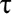
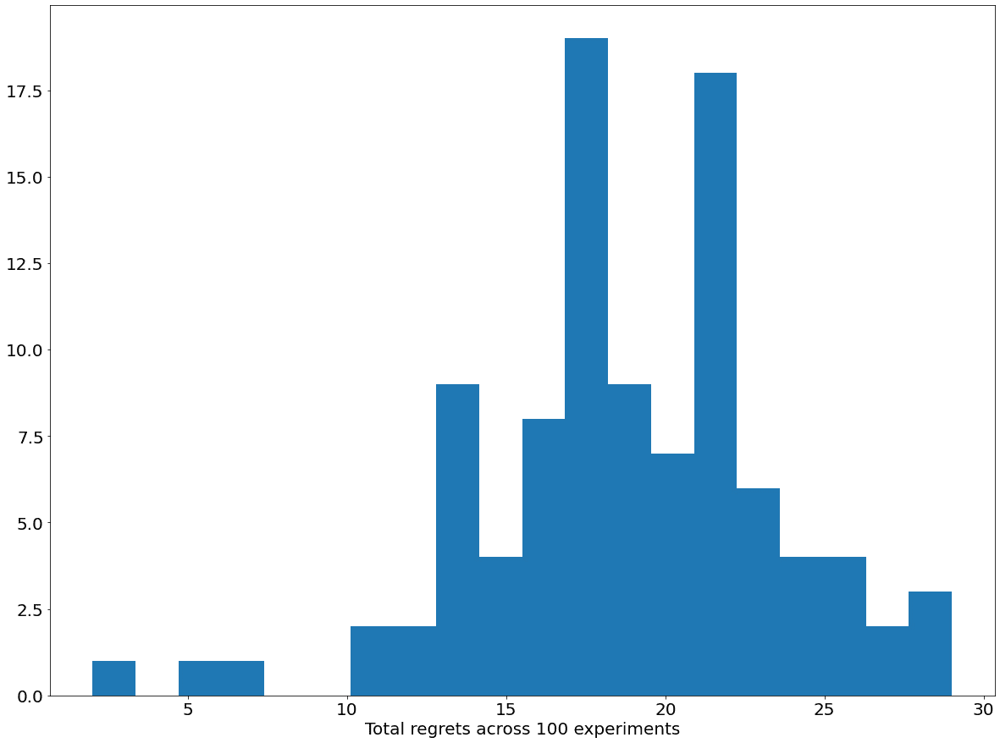
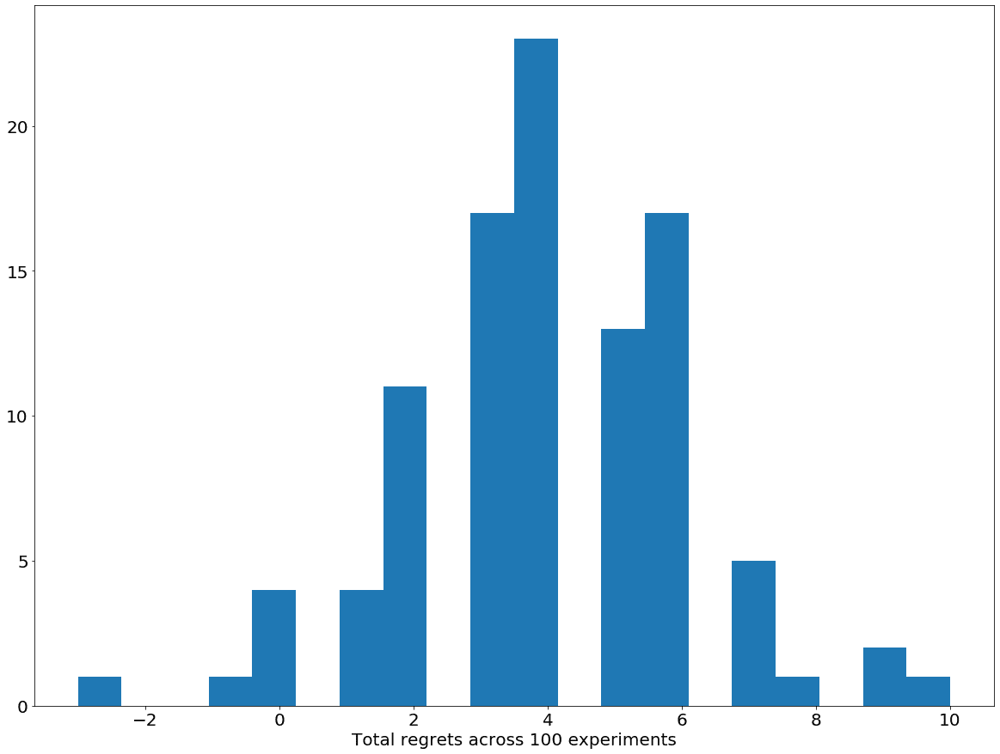

# 第八章：8\. 多臂老虎机问题

概述

本章将介绍流行的多臂老虎机问题及其一些常用的解决算法。我们将通过一个互动示例学习如何用 Python 实现这些算法，如 Epsilon 贪心算法、上置信界算法和汤普森采样。我们还将了解作为一般多臂老虎机问题扩展的上下文老虎机问题。通过本章的学习，你将深入理解一般的多臂老虎机问题，并具备应用一些常见方法来解决该问题的技能。

# 介绍

在上一章中，我们讨论了时间差分学习方法，这是一种流行的无模型强化学习算法，它通过信号的未来值来预测一个量。在本章中，我们将关注另一个常见话题，这不仅在强化学习中应用广泛，在人工智能和概率论中也具有重要地位——**多臂老虎机**（**MAB**）问题。

作为一个顺序决策问题，旨在通过在赌场老虎机上游戏来最大化奖励，多臂老虎机问题广泛适用于任何需要在不确定性下进行顺序学习的情况，如 A/B 测试或设计推荐系统。本章将介绍该问题的形式化方法，了解几种常见的解决算法（即 Epsilon 贪心算法、上置信界算法和汤普森采样），并最终在 Python 中实现它们。

总体来说，本章将让你深入理解多臂老虎机问题在不同的顺序决策场景中的应用，并为你提供将这一知识应用于解决一种变体问题——排队老虎机问题的机会。

首先，让我们从讨论问题的背景和理论表述开始。

# 多臂老虎机问题的表述

最简单形式的多臂老虎机（MAB）问题由多个老虎机（赌场赌博机）组成，每次玩家玩一个老虎机时（具体来说，当它的臂被拉动时），老虎机会随机地给玩家一个奖励。玩家希望在固定轮次结束时最大化自己的总奖励，但他们不知道每个老虎机的概率分布或平均奖励。因此，这个问题的核心就是设计一个学习策略，在这个策略中，玩家需要探索每个老虎机可能返回的奖励值，并从中快速识别出最有可能返回最大期望奖励的那个老虎机。

在本节中，我们将简要探讨问题的背景，并建立本章中将使用的符号和术语。

## 多臂老虎机问题的应用

我们之前提到的老虎机只是我们设定的一个简化版。在一般情况下的 MAB 问题中，我们在每一步面临一组可选择的多个决策，并且我们需要充分探索每个决策，以便更加了解我们所处的环境，同时确保尽早收敛到最优决策，以使得最终的总奖励最大化。这就是我们在常见的强化学习问题中面临的经典探索与利用的权衡。

MAB 问题的常见应用包括推荐系统、临床试验、网络路由，以及如我们将在本章末尾看到的排队理论。这些应用都包含了定义 MAB 问题的典型特征：在每一个顺序决策过程中，决策者需要从预定的可选项中进行选择，并且根据过去的观察，决策者需要在探索不同选择和利用认为最有利的选择之间找到平衡。

举个例子，推荐系统的目标之一是展示客户最可能考虑或购买的产品。当一个新客户登录像购物网站或在线流媒体服务这样的系统时，推荐系统可以观察客户的过去行为和选择，并根据这些信息决定应向客户展示什么样的产品广告。它这样做是为了最大化客户点击广告的概率。

另一个例子，稍后我们将更详细地讨论，是在一个由多个客户类别组成的排队系统中，每个类别都具有一个未知的服务速率。排队协调员需要弄清楚如何最好地安排这些客户，以优化某个目标，例如整个队列的累计等待时间。

总体而言，MAB 问题是人工智能领域，尤其是强化学习中的一个日益普遍的问题，它有许多有趣的应用。在接下来的章节中，我们将正式化该问题并介绍本章将使用的术语。

## 背景与术语

MAB 问题的特征如下：

+   一组可以选择的“K”个动作。每个动作称为“臂”，这是根据传统的老虎机术语来命名的。

+   一位中央决策者需要在每一步从这组动作中做出选择。我们将选择动作的行为称为“拉臂”，而决策者则称为“玩家”。

+   当拉动其中一个“K”个可用臂时，玩家会从该臂特定的概率分布中随机抽取一个随机奖励。重要的是，奖励是从各自的分布中随机选择的；如果奖励是固定的，玩家就能快速识别出能够提供最高回报的臂，这样问题就不再有趣。

+   玩家目标仍然是，在每个步骤中从“K”个臂中选择一个，以便在最后最大化奖励。过程中的步骤数称为视野，玩家可能知道也可能不知道。

+   在大多数情况下，每个臂可以被拉动无限次。当玩家确定某个特定臂是最优的时，他们可以继续选择该臂进行后续操作而不偏离。然而，在不同的环境下，某个臂被拉动的次数是有限的，从而增加了问题的复杂性。

下图展示了我们所使用环境中的一个迭代步骤，其中有四个臂，其成功率分别估计为 70%、30%、55%和 40%。


图 8.1：典型的 MAB 迭代

在每一步中，我们需要决定应该选择哪个臂来拉动：

+   与奖励的语言和相应的最大化目标相对，一个 MAB 问题也可以从成本最小化目标的角度来框定。排队的例子可以再次使用：整个队列的累计等待时间是一个负值，换句话说，这就是需要最小化的成本。

+   通常将一个策略的表现与最优策略或天才策略进行比较，天才策略事先知道哪个臂是最优的，并在每一步都拉动那个臂。当然，任何现实中的学习策略都不太可能模拟天才策略的表现，但它为我们提供了一个固定的度量标准来与我们的策略进行比较。给定策略与天才策略的表现差异称为遗憾，目标是最小化这个遗憾。

MAB 问题的核心问题是如何以最小的探索（拉动次优臂）识别出具有最大*期望*奖励（或最小*期望*成本）的臂。这是因为玩家的探索越多，选择最优臂的频率就越低，最终的奖励也会随之减少。然而，如果玩家没有充分探索所有的臂，他们可能会错误地识别最优臂，最终导致总奖励受到负面影响。

当真实最优臂的随机奖励在前几次实验中看起来低于其他臂的奖励（由于随机性）时，可能会导致玩家错误地识别最优臂。根据每个臂的实际奖励分布，这种情况发生的可能性较高。

所以，这就是我们在本章中要解决的总体问题。我们现在需要简要考虑多臂赌博机背景下的奖励概率分布的概念，以便充分理解我们正在尝试解决的问题。

## 多臂赌博机奖励分布

在传统的多臂赌博机问题中，每个臂的奖励都与伯努利分布相关联。每个伯努利分布又由一个非负数*p*来参数化，*p*的最大值为 1。当从伯努利分布中抽取一个数时，它可以取两个可能的值：1，其概率为*p*，以及 0，其概率为*1 - p*。因此，*p*的较高值对应玩家应当拉动的较好臂。这是因为玩家更有可能收到 1 作为奖励。当然，*p*的高值并不保证从特定臂获得的奖励始终为 1，事实上，即使是从*p*值最高的臂（也就是最优臂）拉取，某些奖励也可能为 0。

以下图是伯努利赌博机设置的一个示例：


图 8.2：样本伯努利多臂赌博机问题

每个臂都有自己独特的奖励分布：第一个臂返回 1 的概率为 75%，返回 0 的概率为 25%；第二个臂返回 1 的概率为 25%，返回 0 的概率为 75%，依此类推。请注意，我们经验上观察到的比例并不总是与真实比例匹配。

从这里，我们可以将多臂赌博机问题推广到奖励遵循任何概率分布的情况。虽然这些分布的内部机制不同，但多臂赌博机算法的目标保持不变：识别与期望值最高的分布相关联的臂，以最大化最终的累计奖励。

在本章中，我们将使用伯努利分布的奖励，因为它们是最自然和直观的奖励分布之一，并且为我们提供了一个可以研究各种多臂赌博机算法的背景。最后，在我们考虑本章将涉及的不同算法之前，先花点时间熟悉我们将要使用的编程接口。

# Python 接口

帮助我们讨论多臂赌博机算法的 Python 环境包含在本章代码库的`utils.py`文件中，代码库地址为：https://packt.live/3cWiZ8j。

我们可以从这个文件中将`Bandit`类导入到一个独立的脚本或 Jupyter 脚本中。这个类是我们用来创建、互动和解决各种 MAB 问题的接口。如果我们正在使用的代码与该文件位于同一目录下，我们可以通过以下代码简单导入`Bandit`类：

```py
from utils import Bandit
```

然后，我们可以将 MAB 问题声明为`Bandit`对象的实例：

```py
my_bandit = Bandit()
```

由于我们没有向此声明传递任何参数，因此此`Bandit`实例采用其默认值：一个具有 0.7 和 0.3 概率的两个伯努利臂的 MAB 问题（尽管我们的算法在技术上并不知道这一点）。

我们需要注意的`Bandit`类中最核心的方法是`pull()`。该方法接受一个整数作为参数，表示我们希望在给定步骤拉取的臂的索引，并返回一个数字，表示从与该臂相关的分布中抽取的随机奖励。

例如，在以下代码片段中，我们调用`pull()`方法，并传递`0`参数来拉取第一个臂并记录返回的奖励，代码如下：

```py
reward = my_bandit.pull(0)
reward
```

在这里，您可能会看到数字`0`或数字`1`被打印出来，这表示通过拉取臂 0 获得的奖励。假设我们想要拉取臂 1 一次，可以使用相同的 API：

```py
reward = my_bandit.pull(1)
reward
```

同样，由于我们从伯努利分布中抽取，输出可能是`0`或`1`。

假设我们想要检查每个臂的奖励分布是什么样的，或者更具体地说，想知道这两个臂中哪个更有可能返回更多的奖励。为此，我们从每个臂拉取 10 次并记录每一步返回的奖励：

```py
running_rewards = [[], []]
for _ in range(10):
    running_rewards[0].append(my_bandit.pull(0))
    running_rewards[1].append(my_bandit.pull(1))

running_rewards
```

这段代码会产生以下输出：

```py
[[1, 1, 1, 0, 0, 1, 1, 1, 0, 0], [0, 0, 1, 0, 0, 1, 0, 1, 1, 1]]
```

由于随机性的原因，您可能会得到不同的输出。根据前述的输出，我们可以看到，臂 0 在 10 次拉取中返回了 6 次正奖励，而臂 1 返回了 5 次正奖励。

我们还希望绘制每个臂在 20 步过程中累计奖励的变化图。在这里，我们可以使用 NumPy 库中的`np.cumsum()`函数来计算这一量，并通过 Matplotlib 库进行绘制，代码如下：

```py
rounds = [i for i in range(1, 11)]
plt.plot(rounds, np.cumsum(running_rewards[0]),\
         label='Cumulative reward from arm 0')
plt.plot(rounds, np.cumsum(running_rewards[1]), \
         label='Cumulative reward from arm 1')
plt.legend()
plt.show()
```

接着会生成如下图表：


图 8.3：累计奖励的示例图

该图表允许我们直观地检查从每个臂上获得的累计奖励在 10 次拉取过程中增长的速度。我们还可以看到，臂 0 的累计奖励始终大于臂 1 的累计奖励，这表明在这两个臂中，臂 0 是最优的。这与臂 0 被初始化为具有*p = 0.7*的伯努利奖励分布的事实一致，而臂 1 的奖励分布则是*p = 0.3*。

`pull()`方法是更底层的 API，用于在每一步中促进处理。然而，在设计各种 MAB 算法时，我们将允许这些算法自动与赌博机问题进行交互，而无需人工干预。这就引出了`Bandit`类的第二个方法，我们将用它来测试我们的算法：`automate()`。

正如我们将在下一节中看到的，这个方法接收一个算法对象的实现，并简化了我们的测试过程。具体来说，这个方法将调用算法对象，记录其决策，并以自动化的方式返回相应的奖励。除了算法对象外，它还接收其他两个优化参数：`n_rounds`，用于指定我们与赌博机互动的次数，以及`visualize_regret`，这是一个布尔标志，指示我们是否希望绘制所考虑算法与精灵算法之间的后悔值。

这个整个过程被称为实验，其中一个没有任何先验知识的算法会被测试用于解决多臂赌博机（MAB）问题。为了全面分析给定算法的性能，我们需要通过多个实验来验证该算法，并研究它在所有实验中的总体表现。这是因为 MAB 问题的特定初始化可能会使某个算法优于其他算法；通过在多个实验中比较不同算法的表现，我们对哪种算法更优的最终见解将更加稳健。

这时，`Bandit`类的`repeat()`方法派上了用场。该方法接收一个算法类的实现（与对象实现相对），并重复调用之前描述的`automate()`方法来操作算法类的实例。通过这样做，可以对我们考虑的算法进行多次实验，并且能给我们提供该算法表现的更全面视角。

为了与`Bandit`类的方法进行交互，我们将把 MAB 算法实现为 Python 类。`pull()`方法，因此包括`automate()`和`repeat()`方法，要求这些算法类实现有两个独立的方法：`decide()`，该方法应该返回算法认为应该在任意时刻拉动的臂的索引；以及`update()`，该方法接收一个臂的索引和刚从该臂获得的新奖励。在本章后续编写算法时，我们将牢记这两个方法。

关于 bandit API 的最后说明，由于随机性，在你自己的实现中，完全可能得到与本章中显示的结果不同的结果。为了更好的可复现性，我们已经将本章所有脚本的随机种子固定为 `0`，这样你就可以通过从本书的 GitHub 仓库获取任何 Jupyter Notebook，并使用以下截图中显示的选项运行代码，从而获得相同的结果：


图 8.4：使用 Jupyter Notebooks 重现结果

话虽如此，即使有随机性，我们也会看到一些算法在解决 MAB 问题时比其他算法表现得更好。这也是我们将通过许多重复实验分析算法性能的原因，确保任何性能上的优势在面对随机性时是稳健的。

这就是我们理解 MAB 问题所需的所有背景信息。现在，我们准备开始讨论解决该问题时常用的方法，首先从贪婪算法开始。

# 贪婪算法

回想一下我们在上一节中与`Bandit`实例的简短互动，我们拉取了第一个臂 10 次，第二个臂 10 次。这可能不是最大化累积奖励的最佳策略，因为我们在花费 10 轮拉取一个次优臂时，无论它是哪一个，都不是最优选择。因此，幼稚的做法是简单地将每个臂（或所有臂）拉一次，然后贪婪地选择返回正奖励的臂。

这个策略的一般化形式是贪婪算法，在该算法中，我们会保持一个奖励均值列表，包含所有可用臂的奖励均值，并在每一步选择拉取具有最高均值的臂。虽然直觉上很简单，但它遵循了一个概率推理：在经过大量样本后，经验均值（样本的平均值）是实际分布期望的一个良好近似。如果一个臂的奖励均值比其他任何臂都大，那么该臂实际上是最优臂的概率应该不低。

## 实现贪婪算法

现在，让我们尝试实现这个算法。如前一节所述，我们将把 MAB 算法写成 Python 类，以与本书提供的 bandit API 进行交互。在这里，我们要求该算法类具有两个属性：可拉取的臂的数量和算法从每个臂观察到的奖励列表：

```py
class Greedy:
    def __init__(self, n_arms=2):
        self.n_arms = n_arms
        self.reward_history = [[] for _ in range(n_arms)]
```

在这里，`reward_history` 是一个包含多个子列表的列表，每个子列表包含给定臂返回的历史奖励。这个属性中存储的数据将用于驱动我们的 MAB 算法的决策。

回想一下，算法类实现需要两个特定的方法来与老虎机 API 交互，分别是`decide()`和`update()`，后者较为简单，已在此实现：

```py
class Greedy:
    ...
    def update(self, arm_id, reward):
        self.reward_history[arm_id].append(reward)
```

再次强调，`update()`方法需要接收两个参数：一个臂的索引（对应`arm_id`变量）和一个数字，表示通过拉动该臂所获得的最新奖励（`reward`变量）。在此方法中，我们只需要将此信息通过将数字附加到`reward_history`属性中对应的奖励子列表来存储。

对于`decide()`方法，我们需要实现之前描述的贪心算法逻辑：计算所有臂的奖励平均值，并返回平均值最高的臂。然而，在此之前，我们需要处理前几轮，算法尚未从任何臂中观察到奖励的情况。这里的惯例是强制算法至少拉动每个臂一次，这通过代码开头的条件来实现：

```py
def decide(self):
        for arm_id in range(self.n_arms):
            if len(self.reward_history[arm_id]) == 0:
                return arm_id
        mean_rewards = [np.mean(history) for history in self.reward_history]
        return int(np.random.choice\
                  (np.argwhere(mean_rewards == np.max(mean_rewards))\
                  .flatten()))
```

如你所见，我们首先检查是否有任何奖励子列表的长度为 0，这意味着算法未曾拉动过该臂。如果是这种情况，我们直接返回该臂的索引。

否则，我们使用`mean_rewards`变量来计算奖励的平均值：`np.mean()`方法计算存储在`reward_history`属性中的每个子列表的均值，我们通过列表推导式遍历它们。

最后，我们找到奖励平均值最高的臂索引，这是通过`np.max(mean_rewards)`计算的。关于我们在此实现的算法有一个微妙的要点：`np.random.choice()`函数：在某些情况下，多个臂可能有相同的最高奖励平均值，这时算法应随机选择其中的一个臂，而不会偏向任何一个。这里的期望是，如果选择了一个次优臂，未来的奖励将表明该臂确实不太可能获得正奖励，而我们最终仍然会收敛到最优臂。

就是这样。如前所述，贪心算法相当简单且符合直觉。现在，我们希望通过与我们的老虎机 API 互动来查看算法的实际效果。首先，我们需要创建一个新的 MAB 问题实例：

```py
N_ARMS = 3
bandit = Bandit(optimal_arm_id=0,\
                n_arms=3,\
                reward_dists=[np.random.binomial \
                              for _ in range(N_ARMS)],\
                reward_dists_params=[(1, 0.9), (1, 0.8), (1, 0.7)])
```

在这里，我们的 MAB 问题有三个臂，它们的奖励都遵循伯努利分布（由 NumPy 中的`np.random.binomial`随机函数实现）。第一个臂的奖励概率为*p = 0.9*，第二个臂为*p = 0.8*，第三个臂为*p = 0.7*；因此，第一个臂是最优臂，我们的算法需要识别出来。

（顺便提一下，要从伯努利分布中抽取参数为*p*的值，我们使用`np.random.binomial(1, p)`，所以这就是为什么我们在前面的代码片段中将每个*p*的值与数字`1`配对的原因。）

现在，我们声明一个适当数量臂的贪心算法实例，并调用 bandit 问题的`automate()`方法，让算法与 bandit 进行 500 轮交互，具体如下：

```py
greedy_policy = Greedy(n_arms=N_ARMS)
history, rewards, optimal_rewards = bandit.automate\
                                    (greedy_policy, n_rounds=500,\
                                     visualize_regret=True)
```

如我们所见，`automate()`方法返回一个包含三个对象的元组：`history`，即算法在整个过程中选择的臂的顺序列表；`rewards`，是通过拉动这些臂获得的对应奖励；以及`optimal_rewards`，是如果在每一步都选择最优臂时我们将获得的奖励列表（换句话说，这是精灵算法的奖励列表）。该元组通过以下图表可视化，这是前面代码的实际输出。

在`automate()`方法中，我们还有一个选项来可视化`rewards`和`optimal_rewards`这两个列表之间的累计和差异，这由`visualize_regret`参数指定。实质上，这个选项将绘制出我们算法的累计遗憾与轮次号之间的关系图。由于我们在调用中启用了此选项，将生成以下图表：


](img/B16182_08_05.jpg)

图 8.5：由 automate()绘制的样本累计遗憾

虽然我们没有其他算法进行比较，但从这张图中可以看到，我们的贪心算法表现得相当好，因为它能够在整个 500 轮中始终保持累计遗憾不超过 2。另一个评估我们算法表现的方法是查看`history`列表，该列表包含了算法选择拉动的臂：

```py
print(*history)
```

这将以以下格式打印出列表：

```py
0 1 2 0 1 2 2 2 0 0 0 0 0 0 0 0 0 0 0 0 0 0 0 0 0 0 0 0 0 0 0 0 
0 0 0 0 0 0 0 0 0 0 0 0 0 0 0 0 0 0 0 0 0 0 0 0 0 0 0 0 0 0 0 0 
0 0 0 0 0 0 0 0 0 0 0 0 0 0 0 0 0 0 0 0 0 0 0 0 0 0 0 0 0 0 0 0 
0 0 0 0 0 0 0 0 0 0 0 0 0 0 0 0 0 0 0 0 0 0 0 0 0 0 0 0 0 0 0 0 
0 0 0 0 0 0 0 0 0 0 0 0 0 0 0 0 0 0 0 0 0 0 0 0 0 0 0 0 0 0 0 0 
0 0 0 0 0 0 0 0 0 0 0 0 0 0 0 0 0 0 0 0 0 0 0 0 0 0 0 0 0 0 0 0 
0 0 0 0 0 0 0 0 0 0 0 0 0 0 0 0 0 0 0 0 0 0 0 0 0 0 0 0 0 0 0 0 
0 0 0 0 0 0 0 0 0 0 0 0 0 0 0 0 0 0 0 0 0 0 0 0 0 0 0 0 0 0 0 0 
0 0 0 0 0 0 0 0 0 0 0 0 0 0 0 0 0 0 0 0 0 0 0 0 0 0 0 0 0 0 0 0 
0 0 0 0 0 0 0 0 0 0 0 0 0 0 0 0 0 0 0 0 0 0 0 0 0 0 0 0 0 0 0 0 
0 0 0 0 0 0 0 0 0 0 0 0 0 0 0 0 0 0 0 0 0 0 0 0 0 0 0 0 0 0 0 0 
0 0 0 0 0 0 0 0 0 0 0 0 0 0 0 0 0 0 0 0 0 0 0 0 0 0 0 0 0 0 0 0 
0 0 0 0 0 0 0 0 0 0 0 0 0 0 0 0 0 0 0 0 0 0 0 0 0 0 0 0 0 0 0 0 
0 0 0 0 0 0 0 0 0 0 0 0 0 0 0 0 0 0 0 0 0 0 0 0 0 0 0 0 0 0 0 0 
0 0 0 0 0 0 0 0 0 0 0 0 0 0 0 0 0 0 0 0 0 0 0 0 0 0 0 0 0 0 0 0 
0 0 0 0 0 0 0 0 0 0 0 0 0 0 0 0 0 0 0 0
```

如我们所见，在最初的三轮探索之后，当算法每个臂拉动一次时，它在臂之间稍微摇摆了一下，但很快就收敛到选择臂 0，即实际的最优臂，来进行剩余的所有轮次。这就是为什么算法最终的累计遗憾如此之低的原因。

话虽如此，这仅仅是一次实验。如前所述，为了充分评估我们算法的性能，我们需要多次重复这个实验，确保我们考虑的单个实验不是由于随机性导致算法表现特别好或特别差的异常情况。

为了便于反复实验，我们利用了 bandit API 的`repeat()`方法，具体如下：

```py
regrets = bandit.repeat(Greedy, [N_ARMS], n_experiments=100, \
                        n_rounds=300, visualize_regret_dist=True)
```

记住，`repeat()`方法接受的是给定算法的类实现，而不是像`automate()`那样仅接受算法的实例。这就是为什么我们将整个`Greedy`类传递给该方法的原因。此外，通过该方法的第二个参数，我们可以指定算法类实现所需的任何参数。在这个例子中，它仅仅是可拉动的臂的数量，但在后续章节中，我们会使用不同算法时有不同的参数。

在这里，我们通过`n_experiments`参数对 Greedy 算法进行 100 次实验，每次实验使用我们之前声明的三个伯努利臂的相同赌博机问题。为了节省时间，我们只要求每个实验持续 300 轮，使用`n_rounds`参数。最后，我们将`visualize_regret_dist`设置为`True`，这将帮助我们绘制每次实验结束时算法的累积遗憾分布图。

确实，当这段代码运行完成时，以下图形将被生成：


图 8.6：Greedy 算法的累积遗憾分布

在这里，我们可以看到，在大多数情况下，Greedy 算法表现得足够好，保持累积遗憾低于`10`。然而，也有一些情况下，累积遗憾高达`60`。我们推测这些是算法错误估计每个臂的真实期望奖励并过早做出决策的情况。

作为衡量算法表现的最终方式，我们考虑这些实验的平均累积遗憾和最大累积遗憾，具体如下：

```py
np.mean(regrets), np.max(regrets)
```

在我们当前的实验中，以下数字将被打印出来：

```py
(8.66, 62)
```

这与我们这里看到的分布一致：大多数遗憾都足够低，使得平均值相对较低（`8.66`），但最大遗憾可能高达`62`。

这就是我们关于 Greedy 算法讨论的结束。接下来的部分，我们将讨论两种流行的算法变种，即探索后再决策（Explore-then-commit）和ε-Greedy 算法。

# 探索后再决策算法

我们提到过，Greedy 算法在某些情况下表现不佳的潜在原因是过早做出决策，而没有足够观察到每个臂的样本奖励。探索后再决策算法试图通过明确规定在过程开始时应花费多少轮来探索每个臂，从而解决这个问题。

具体而言，每个探索后决策（Explore-then-commit）算法由一个数字* T * 参数化。在每个多臂赌博机问题中，探索后决策算法将花费正好*T*轮来拉取每个可用的臂。只有在这些强制探索轮之后，算法才会开始选择奖励平均值最大的臂。贪婪算法是探索后决策算法的特例，其中*T*被设定为 1。因此，这个通用算法使我们能够根据情况定制此参数并进行适当设置。

这个算法的实现与贪婪算法非常相似，所以我们在这里不再讨论。简而言之，在确保贪婪算法每个臂至少拉取一次的条件下，我们可以在其`decide()`方法中修改条件，如下所示，前提是已经设置了`T`变量的值：

```py
def decide(self):
        for arm_id in range(self.n_arms):
            if len(self.reward_history[arm_id]) < T:
                return arm_id

        mean_rewards = [np.mean(history) \
                        for history in self.reward_history]
        return int(np.random.choice\
               (np.argwhere(mean_rewards == np.max(mean_rewards))\
               .flatten()))
```

尽管探索后决策算法是贪婪算法的更灵活版本，但它仍然留出了如何选择*T*值的问题。实际上，如果没有关于问题的先验知识，如何为特定的多臂赌博机问题设置*T*并不明显。通常，*T*会根据已知的时间范围进行设置；*T*的常见值可能是 3、5、10，甚至 20。

# ε-贪婪算法

贪婪算法的另一个变种是ε-贪婪算法。对于探索后决策，强制探索的次数取决于可设置的参数*T*，这再次引出了如何最好地设置它的问题。对于ε-贪婪算法，我们不明确要求算法在每个臂上探索超过一轮。相反，我们将探索何时发生以及何时继续利用最优臂的决策交给随机性来决定。

正式地说，ε-贪婪算法由一个数字ε（介于 0 和 1 之间）参数化，表示算法的探索概率。在第一次探索轮之后，算法将以 1 - ε的概率选择拉取奖励平均值最大的臂。否则，它将以ε的概率均匀地选择一个可用的臂。与探索后决策不同，在后者中我们可以确定算法在前几轮会被强制探索，ε-贪婪算法可能在后续轮次中也会探索奖励平均值不佳的臂。然而，当探索发生时，这完全是由随机性决定的，参数ε的选择控制了这些探索轮次发生的频率。

例如，ε的常见选择是 0.01。在典型的强盗问题中，ε-贪婪算法将在过程开始时每个臂都拉一次，然后开始选择具有最佳奖励历史的臂。然而，在每一步中，以 0.01（1%）的概率，算法可能会选择进行探索，在这种情况下，它将随机选择一个臂而不带任何偏见。ε就像*Explore-then-commit*算法中的*T*一样，用于控制 MAB 算法应该进行多少探索。较高的ε值会导致算法更频繁地进行探索，尽管同样地，当它进行探索时，这完全是随机的。

ε-贪婪算法的直觉很明确：我们仍然希望保留贪婪算法的贪婪特性，但为了避免由于不具代表性的奖励样本而错误地选择一个次优臂，我们还希望在整个过程中不时进行探索。希望ε-贪婪能够一举两得，在贪婪地利用暂时表现较好的臂的同时，也留给其他看似次优的臂更好的机会。

从实现角度来看，算法的`decide()`方法应该增加一个条件判断，检查算法是否应该进行探索：

```py
def decide(self):
        ...
        if np.random.rand() < self.e:
            return np.random.randint(0, self.n_arms)
        ...
```

那么，现在我们继续并完成本章的第一个练习，我们将在其中实现ε-贪婪算法。

## 练习 8.01 实现ε-贪婪算法

类似于实现贪婪算法时的做法，在本练习中，我们将学习如何实现ε-贪婪算法。这个练习将分为三个主要部分：实现ε-贪婪的逻辑，测试其在示例强盗问题中的表现，最后通过多次实验来评估其性能。

我们将按照以下步骤来实现：

1.  创建一个新的 Jupyter Notebook，并导入 NumPy、Matplotlib 以及本章代码库中`utils.py`文件中的`Bandit`类：

    ```py
    import numpy as np
    np.random.seed(0)
    import matplotlib.pyplot as plt
    from utils import Bandit
    ```

    请注意，我们现在将 NumPy 的随机种子数固定，以确保代码的可重复性。

1.  现在，开始实现ε-贪婪算法的逻辑。首先，它的初始化方法应该接受两个参数：要解决的强盗问题的臂数和ε，探索概率：

    ```py
    class eGreedy:
        def __init__(self, n_arms=2, e=0.01):
            self.n_arms = n_arms
            self.e = e
            self.reward_history = [[] for _ in range(n_arms)]
    ```

    与贪婪算法类似，在这里，我们也在跟踪奖励历史，这些历史记录存储在类对象的`reward_history`属性中。

1.  在同一个代码单元格中，实现`eGreedy`类的`decide()`方法。

    该方法应该与`Greedy`类中的对应方法大致相似。然而，在计算各臂的奖励平均值之前，它应该生成一个介于 0 和 1 之间的随机数，并检查它是否小于其参数ε。如果是这种情况，它应该随机返回一个臂的索引：

    ```py
        def decide(self):
            for arm_id in range(self.n_arms):
                if len(self.reward_history[arm_id]) == 0:
                    return arm_id

            if np.random.rand() < self.e:
                return np.random.randint(0, self.n_arms)

            mean_rewards = [np.mean(history) \
                            for history in self.reward_history]

            return int(np.random.choice(np.argwhere\
                      (mean_rewards == np.max(mean_rewards))\
                      .flatten()))
    ```

1.  在同一代码单元格中，为`eGreedy`类实现`update()`方法，该方法应与`Greedy`类中的相应方法相同：

    ```py
        def update(self, arm_id, reward):
            self.reward_history[arm_id].append(reward)
    ```

    再次说明，这种方法只需要将最近一次的奖励添加到该臂的奖励历史中。

    这就是我们ε-Greedy 算法的完整实现。

1.  在下一个代码单元格中，创建一个具有三个伯努利臂的赌博机问题实验，这些臂的相应概率分别为`0.9`、`0.8`和`0.7`，并使用`eGreedy`类的实例（`ε = 0.01`，即默认值，不需要显式指定）通过`automate()`方法运行该实验。

    确保指定`visualize_regret=True`参数，以便绘制算法在整个过程中累积后悔的图表：

    ```py
    N_ARMS = 3
    bandit = Bandit(optimal_arm_id=0, \
                    n_arms=3,\
                    reward_dists=[np.random.binomial \
                                  for _ in range(N_ARMS)],\
                                  reward_dists_params=[(1, 0.9), \
                                                       (1, 0.8), \
                                                       (1, 0.7)])
    egreedy_policy = eGreedy(n_arms=N_ARMS)
    history, rewards, optimal_rewards = bandit.automate\
                                        (egreedy_policy, \
                                         n_rounds=500, \
                                         visualize_regret=True)
    ```

    这应该会产生以下图表：

    

    图 8.7：ε-Greedy 算法的样本累积后悔

    与我们在 Greedy 算法中看到的相应图表相比，这里的累积后悔变化更大，有时会增长到`4`，有时会降到`-2`。这正是算法探索增加的效果。

1.  在下一个代码单元格中，我们打印出`history`变量，看看它与 Greedy 算法的历史相比如何：

    ```py
    print(*history)
    ```

    这将产生以下输出：

    ```py
    0 1 2 1 2 1 0 0 1 2 1 0 0 2 0 1 1 0 0 0 0 0 0 0 0 0 0 0 0 0 
    0 0 0 0 0 0 0 0 0 0 0 0 0 0 0 0 0 0 0 0 0 0 0 0 0 0 0 0 0 0 
    0 0 0 0 0 0 0 0 0 0 0 0 0 0 0 0 0 0 0 0 0 0 0 0 0 0 0 0 0 0 
    0 0 0 0 0 0 0 0 0 0 0 0 0 0 0 0 0 0 0 0 0 0 0 0 0 0 0 0 0 0 
    0 0 0 0 0 0 0 0 0 1 0 0 0 0 0 0 0 0 0 0 0 0 0 0 0 0 0 0 0 0 
    0 0 0 0 0 0 0 0 0 0 0 0 0 0 0 0 0 0 0 0 0 0 0 0 0 0 0 0 0 0 
    0 0 0 0 0 0 0 0 0 0 0 0 0 0 0 0 0 0 0 0 0 0 0 0 0 0 0 0 0 0 
    0 0 0 0 0 0 0 0 0 0 0 0 0 0 0 0 0 0 0 0 0 0 0 0 0 0 0 0 0 0 
    0 0 1 1 1 1 1 1 0 0 0 0 0 0 0 0 0 0 0 0 0 0 0 2 0 0 0 0 0 0 
    0 0 0 0 0 0 0 0 0 0 0 0 0 0 0 0 0 0 0 0 0 0 0 0 1 1 0 0 0 0 
    0 0 0 0 0 0 0 0 0 0 0 0 0 0 0 0 0 0 0 0 0 0 0 0 0 0 0 0 0 0 
    0 0 0 0 0 0 0 0 0 0 0 0 0 0 0 0 0 0 0 0 0 0 0 0 0 0 0 0 0 0 
    0 0 0 0 0 0 0 1 0 0 0 0 0 0 0 0 0 0 0 0 0 0 0 0 0 0 0 0 0 0 
    0 0 0 0 0 0 1 0 0 0 0 0 0 0 0 0 0 0 0 0 0 0 0 0 0 0 0 0 0 0 
    0 0 0 0 0 0 0 0 0 0 0 0 0 0 0 0 0 0 0 0 0 0 0 0 0 0 0 0 0 0 
    0 0 0 0 0 0 0 0 0 0 0 0 0 0 0 0 0 0 0 0 0 0 0 0 0 0 0 0 0 0 
    0 0 0 0 0 0 0 0 0 0 0 0 0 0 0 0 0 0 0 0
    ```

    在这里，我们可以看到，在前几轮之后，算法做出的选择大多数都是臂 0。但偶尔也会选择臂 1 或臂 2，这大概是由于随机探索概率的原因。

1.  在下一个代码单元格中，我们将进行相同的实验，不过这次我们将设置`ε = 0.1`：

    ```py
    egreedy_policy_v2 = eGreedy(n_arms=N_ARMS, e=0.1)
    history, rewards, optimal_rewards = bandit.automate\
                                        (egreedy_policy_v2, \
                                         n_rounds=500, \
                                         visualize_regret=True)
    ```

    这将产生以下图表：

    

    图 8.8：增加探索概率后的样本累积后悔

    在这里，我们的累积后悔比在*步骤 5* 中设置`ε = 0.01`时要高得多。这大概是因为增加的探索概率过高所导致的。

1.  为了进一步分析这个实验，我们可以再次打印出动作历史：

    ```py
    print(*history)
    ```

    这将产生以下输出：

    ```py
    0 1 2 2 0 1 0 1 2 2 0 2 2 0 2 0 0 0 0 0 0 0 0 0 0 0 0 0 0 0 
    0 0 0 0 0 1 0 0 0 2 0 0 0 0 0 0 0 0 0 0 0 0 0 0 0 0 0 0 0 0 
    0 0 0 2 0 0 0 0 0 0 0 0 0 0 0 0 0 0 0 2 0 0 0 0 0 1 2 0 1 0 
    0 0 0 0 0 0 0 0 2 0 0 0 0 0 0 0 0 0 0 0 0 0 0 0 0 0 0 0 0 0 
    0 0 0 0 0 0 0 0 0 0 0 1 2 0 0 0 0 0 1 0 0 0 1 0 0 0 0 0 0 0 
    0 0 0 0 0 0 0 0 0 0 0 0 0 1 0 0 0 0 0 0 0 0 0 0 0 0 0 0 2 0 
    0 0 0 1 0 0 0 0 0 0 0 0 0 0 0 0 0 0 0 0 0 0 0 0 0 0 0 0 0 0 
    0 0 0 0 0 0 0 0 0 0 0 1 0 0 0 0 0 0 0 0 0 0 0 0 0 0 0 0 1 1 
    0 0 0 0 0 0 2 0 0 0 1 0 0 0 0 0 0 0 0 0 0 0 0 0 0 0 0 0 2 0 
    0 0 0 0 0 0 0 0 0 0 0 0 0 0 0 1 0 1 0 0 0 0 0 0 0 0 0 2 0 0 
    0 0 0 0 0 0 0 0 0 2 0 0 0 0 0 0 0 0 0 0 0 0 0 0 0 0 0 0 0 0 
    0 0 0 0 0 0 0 2 2 1 0 0 0 0 0 0 0 0 0 0 0 0 0 0 0 0 0 0 0 0 
    0 0 2 0 0 0 0 0 0 0 0 1 0 0 0 0 0 0 0 0 0 1 0 0 0 0 0 0 0 0 
    0 0 0 0 0 0 0 0 0 0 0 0 0 0 0 1 0 0 0 0 0 0 0 0 0 0 0 0 0 0 
    0 0 0 0 0 0 0 0 0 0 0 0 0 0 0 0 1 0 0 0 0 0 0 0 0 0 0 0 0 0 
    0 0 0 0 0 0 0 1 0 0 0 0 0 0 0 0 0 0 2 0 0 0 2 0 0 0 0 0 0 0 
    0 0 0 0 1 0 0 0 0 0 0 0 0 0 0 0 0 0 0 0
    ```

    将此与之前算法相同历史的数据进行比较，可以看到该算法确实在后期的轮次中进行了更多的探索。所有这些都表明，`ε = 0.1` 可能不是一个合适的探索概率。

1.  作为我们对ε-Greedy 算法分析的最后一个部分，让我们利用重复实验选项。这次，我们将选择`ε = 0.03`，如下所示：

    ```py
    regrets = bandit.repeat(eGreedy, [N_ARMS, 0.03], \
                            n_experiments=100, n_rounds=300,\
                            visualize_regret_dist=True)
    ```

    接下来的图表将展示来自这些重复实验的累积后悔分布：

    

    图 8.9：ε-Greedy 算法的累积后悔分布

    这个分布与我们在贪婪算法中得到的结果非常相似。接下来，我们将进一步比较这两种算法。

1.  使用以下代码计算这些累积遗憾值的均值和最大值：

    ```py
    np.mean(regrets), np.max(regrets)
    ```

    输出结果如下：

    ```py
    (9.95, 64)
    ```

将这一点与我们在贪婪算法中得到的结果（`8.66` 和 `62`）进行比较，结果表明在这个特定的强盗问题中，ε-贪婪算法可能会表现得较差。然而，它通过探索率成功地形式化了探索与利用之间的选择，而这是贪婪算法所缺乏的。这是一个多臂强盗（MAB）算法的宝贵特性，也是我们将在本章后面讨论的其他算法的重点。

注意

要访问这一特定部分的源代码，请参考 [`packt.live/3fiE3Y5`](https://packt.live/3fiE3Y5)。

你也可以在网上运行这个例子，链接是 [`packt.live/3cYT4fY`](https://packt.live/3cYT4fY)。

在进入下一部分之前，让我们简要讨论一下另一种所谓的贪婪算法变种——Softmax 算法。

## Softmax 算法

Softmax 算法试图通过选择每个可用臂的概率来量化探索与利用之间的权衡，这个概率与其平均奖励成正比。形式上，算法在每个时间步骤*t*选择臂*i*的概率如下：


图 8.10：表示算法在每个时间步骤选择该臂的概率的公式

指数中的每一项  是从臂*i*在前*(t - 1)*个时间步骤中观察到的平均奖励。根据定义概率的方式，平均奖励越大，相应的臂被选择的可能性就越大。在其最一般的形式下，这个平均项被一个可调参数  除以，后者控制算法的探索率。具体来说，当趋向于无穷大时，最大臂的选择概率会趋近于 1，而其他臂的选择概率趋近于 0，使得算法完全贪婪（这也是我们认为它是贪婪算法的一种推广的原因）。当 趋近于 0 时，选择一个暂时次优的臂的可能性增大。当它趋向于 0 时，算法会无限期地均匀探索所有可用的臂。

类似于我们在设计ε-贪婪算法时遇到的问题，如何为每个特定的强盗问题设置该参数的值并不完全明确，尽管算法的性能在很大程度上依赖于该参数。因此，Softmax 算法不像我们将在本章讨论的其他算法那样流行。

就这样，我们结束了对贪心算法的讨论，这是我们解决 MAB 问题的第一种方法，以及它的三种变体：先探索后承诺、ε-贪心和 Softmax。总体来说，这些算法专注于利用具有最大奖励均值的臂，同时有时偏离这个臂去探索其他看似次优的臂。

在接下来的章节中，我们将介绍另一种常见的 MAB 算法——**上置信界限**（**UCB**），其直觉与我们到目前为止所看到的稍有不同。

# UCB 算法

*上置信界限*这个术语表示，算法不是像贪心算法那样考虑每个臂返回的过去奖励的平均值，而是计算每个臂预期奖励的估计值的上界。

置信界限这个概念在概率论和统计学中是非常常见的，其中我们关心的量（在这个例子中是每个臂的奖励）的分布不能仅通过过去观测值的平均值来良好表示。相反，置信界限是一个数值范围，旨在估计并缩小在该分布中大多数值所在的范围。例如，这一概念在贝叶斯分析和贝叶斯优化中被广泛应用。

在接下来的章节中，我们将讨论 UCB 如何建立其使用置信界限的方法。

## 不确定性面前的乐观主义

考虑一个只有两个臂的赌博机过程的中间部分。我们已经拉动过第一个臂 100 次，并观察到平均奖励为`0.61`；对于第二个臂，我们仅见过五个样本，其中三个样本的奖励为`1`，所以它的平均奖励是`0.6`。我们是否应该承诺在剩余的回合中探索第一个臂并忽视第二个臂？

很多人会说不；我们至少应该更多地探索第二个臂，以便更好地估计其期望奖励。这一观察的动机是，由于我们仅有很少的第二个臂的奖励样本，我们不应该*确信*第二个臂的平均奖励实际上低于第一个臂。那么，我们应该如何将我们的直觉形式化呢？UCB 算法，或者说其最常见的变种——UCB1 算法——指出，我们将不再使用平均奖励，而是使用以下平均奖励和置信界限之和：


图 8.11：UCB 算法的表达式

在这里，表示当前我们与赌博机互动时的时间步长，或回合数，表示我们已经拉动过的臂数，直到回合。UCB 的其余部分与贪心算法的运作方式相同：在每一步中，我们选择拉动能够最大化前述总和的臂，观察返回的奖励，将其加到我们的奖励中，然后重复这个过程。

要实现这一逻辑，我们可以使用`decide()`方法，方法中包含如下代码：

```py
def decide(self):
        for arm_id in range(self.n_arms):
            if len(self.reward_history[arm_id]) == 0:
                return arm_id
        conf_bounds = [np.mean(history) \
                       + np.sqrt(2 * np.log(self.t) / len(history))\
                       for history in self.reward_history]
        return int(np.random.choice\
                  (np.argwhere(conf_bounds == np.max(conf_bounds))\
                  .flatten()))
```

在这里，`self.t`应当等于当前的步骤时间。正如我们所见，该方法返回的是使`conf_bounds`中元素最大化的臂，这个列表存储了每只臂的乐观估算值。

你可能会想，为什么使用前述的量能捕捉我们想要应用于期望奖励估算的置信区间的概念。请记住我们之前所举的两臂赌博机的例子，我们希望有一个形式化的过程，能够鼓励探索那些很少被探索的臂（在我们的例子中是第二只臂）。正如你所见，在任何给定回合，这个量是的递减函数。换句话说，当很大时，这个量会变小；而当情况相反时，它会变大。因此，这个量由那些拉动次数较少的臂最大化——也就是那些探索较少的臂。在我们的例子中，第一只臂的估算如下：


图 8.12：第一只臂的估算

第二只臂的估算如下：


图 8.13：第二只臂的估算

使用 UCB 算法时，我们选择拉取第二只臂，这也是我们认为正确的选择。通过在平均奖励中加入所谓的探索项，我们从某种意义上来说，是在估算期望均值的最大可能值，而不仅仅是期望均值本身。这一直觉可以用“*在不确定性面前保持乐观*”这一术语来总结，它是 UCB 算法的核心特征。

## UCB 的其他特性

UCB 并非毫无根据地乐观。当一只臂显著未被充分探索时，探索项会使得该量变大，从而增加被 UCB 选择的可能性，但并不能保证这只臂一定会被选择。具体来说，当某只臂的平均奖励非常低，以至于探索项无法弥补时，UCB 依然会选择利用那些表现良好的臂。

我们还应当讨论它在以成本为中心的 MAB 问题中的变化，这就是**下置信区间**（**LCB**）。对于奖励为中心的问题，我们将探索项加入到平均奖励中，以计算对真实均值的乐观估算。当 MAB 问题是最小化臂返回的成本时，我们的乐观估算变成了平均成本*减去*探索项，UCB 将选择最小化这一量的臂，或者在这种情况下，选择 LCB。

具体来说，我们在这里说的是，如果某个臂的探索次数较少，它的真实平均成本可能比我们目前观察到的要低，因此我们从探索项中减去平均成本，以估算某个臂的最低可能成本。除此之外，这种 UCB 变体的实现保持不变。

这就是关于 UCB 的全部理论内容。为了总结我们对该算法的讨论，我们将在下一个练习中实现它，以解决我们之前使用的伯努利三臂赌博机问题。

## 练习 8.02 实现 UCB 算法

在本次练习中，我们将实现 UCB 算法。本练习将引导我们通过熟悉的工作流程来分析 MAB 算法的表现：将其实现为一个 Python 类，进行一次实验并观察其行为，最后多次重复实验，考虑由此产生的后悔分布。

我们将按照以下步骤进行：

1.  创建一个新的 Jupyter Notebook，导入 `NumPy`、`Matplotlib`，以及从代码库中包含的 `utils.py` 文件中的 `Bandit` 类：

    ```py
    import numpy as np
    np.random.seed(0)
    import matplotlib.pyplot as plt
    from utils import Bandit
    ```

1.  声明一个名为 `UCB` 的 Python 类，并定义以下初始化方法：

    ```py
    class UCB:
        def __init__(self, n_arms=2):
            self.n_arms = n_arms
            self.reward_history = [[] for _ in range(n_arms)]
            self.t = 0
    ```

    与 Greedy 及其变体不同，我们对 `UCB` 的实现需要在其属性 `t` 中跟踪一个额外的信息——当前轮次号。这个信息在计算上置信界限的探索项时使用。

1.  实现类的 `decide()` 方法，如下所示：

    ```py
        def decide(self):
            for arm_id in range(self.n_arms):
                if len(self.reward_history[arm_id]) == 0:
                    return arm_id

            conf_bounds = [np.mean(history) \
                           + np.sqrt(2 * np.log(self.t) \
                                     / len(history))\
                           for history in self.reward_history]
            return int(np.random.choice\
                      (np.argwhere\
                      (conf_bounds == np.max(conf_bounds))\
                      .flatten()))
    ```

    上述代码不言自明：在每个臂至少拉一次之后，我们计算置信界限，作为经验均值奖励和探索项的总和。最后，我们返回具有最大总和的臂，必要时随机打破平局。

1.  在同一个代码单元中，像这样实现类的 `update()` 方法：

    ```py
        def update(self, arm_id, reward):
            self.reward_history[arm_id].append(reward)
            self.t += 1
    ```

    我们已经对大部分逻辑比较熟悉，来自之前的算法。注意，在每次调用 `update()` 时，我们还需要递增属性 `t`。

1.  声明我们一直在考虑的伯努利三臂赌博机问题，并在我们刚刚实现的 UCB 算法实例上运行它：

    ```py
    N_ARMS = 3
    bandit = Bandit(optimal_arm_id=0,\
                    n_arms=3,\
                    reward_dists=[np.random.binomial \
                                  for _ in range(N_ARMS)],\
                    reward_dists_params=[(1, 0.9), (1, 0.8), \
                                         (1, 0.7)])
    ucb_policy = UCB(n_arms=N_ARMS)
    history, rewards, optimal_rewards = bandit.automate\
                                        (ucb_policy, n_rounds=500, \
                                         visualize_regret=True)
    ```

    这段代码将生成以下图表：

    

    图 8.14：UCB 算法的样本累计后悔

    在这里，我们可以看到，这个累计后悔显著比我们在 Greedy 算法中看到的要糟糕，后者最多为 2。我们假设这种差异直接源自算法的乐观性质。

1.  为了更好地理解这种行为，我们将检查算法的拉臂历史：

    ```py
    print(*history)
    ```

    这将产生以下输出：

    ```py
    0 1 2 1 0 2 0 1 1 0 1 0 2 0 2 0 0 1 0 1 0 1 0 1 2 0 1 0 1 0 0 
    1 0 1 0 1 0 0 0 2 2 1 1 0 1 0 1 0 1 0 1 1 1 2 2 2 2 0 2 0 2 0 
    1 1 1 1 1 0 0 0 0 0 2 2 0 0 1 0 1 0 0 0 0 0 1 0 2 2 2 0 0 0 0 
    0 0 0 0 1 0 1 0 1 1 0 1 0 1 0 1 0 0 0 0 2 2 2 0 0 0 0 0 0 0 0 
    0 1 1 0 1 0 0 0 0 0 0 2 2 2 2 2 0 1 0 1 1 0 1 0 0 0 0 0 0 2 2 
    2 2 0 0 1 0 1 1 0 1 0 0 0 0 0 0 0 0 0 1 0 1 1 1 0 2 1 1 0 1 0 
    1 1 1 1 1 1 1 0 0 0 0 0 0 1 1 1 0 0 2 2 2 0 0 0 1 1 1 0 0 0 0 
    0 0 2 2 0 0 0 0 0 1 0 0 0 0 0 0 0 0 0 0 0 0 0 0 1 1 1 0 0 0 0 
    0 0 0 0 0 0 2 2 2 2 2 2 2 2 0 0 0 0 0 0 2 2 2 2 1 1 1 1 1 1 0 
    0 0 0 0 0 1 1 1 1 1 1 1 1 1 2 2 2 2 0 0 0 0 0 0 1 1 0 0 0 0 0 
    0 0 0 0 0 0 0 0 0 0 0 0 0 0 0 2 2 0 0 0 0 0 0 0 0 0 0 0 0 0 1 
    1 1 1 0 0 0 0 0 0 0 0 0 0 0 0 0 0 0 0 0 2 2 1 0 0 0 0 0 0 0 0 
    0 0 0 0 0 0 0 0 0 0 0 1 1 1 1 0 2 2 0 0 0 0 0 0 0 0 0 0 0 0 1 
    1 1 1 0 0 0 0 0 0 0 0 0 0 0 0 0 0 0 0 0 0 0 0 0 0 0 0 0 2 1 1 
    1 0 0 0 0 0 0 0 0 1 1 1 1 0 0 0 0 0 0 0 0 2 2 2 2 2 2 2 0 0 0 
    0 0 0 0 0 0 0 0 0 0 1 1 1 1 1 1 1 1 1 0 0 0 2 2 2 2 2 0 0 1 1 0 0 0 0
    ```

    在这里，我们可以观察到，UCB 经常选择偏离真正的最优臂（臂 0）。这是由于它倾向于乐观地探索看似次优的臂的直接影响。

1.  表面上，我们可能会得出结论：对于这个赌博机问题，UCB 算法实际上并不优于贪婪算法。但要真正确认这一点，我们需要检查该算法在多个实验中的表现。使用来自赌博机 API 的`repeat()`方法来确认这一点：

    ```py
    regrets = bandit.repeat(UCB, [N_ARMS], n_experiments=100, \
                            n_rounds=300, visualize_regret_dist=True)
    ```

    这段代码将生成以下图表：

    

    图 8.15：UCB 算法的遗憾分布

    令我们惊讶的是，这个分布中的遗憾值明显低于由贪婪算法得出的结果。

1.  除了可视化分布外，我们还需要考虑所有实验的平均遗憾和最大遗憾：

    ```py
    np.mean(regrets), np.max(regrets)
    ```

    输出结果如下：

    ```py
    (18.78, 29)
    ```

如你所见，数值明显低于我们在贪婪算法中看到的对应统计数据，后者为`8.66`和`62`。在这里，我们可以说有证据支持“UCB 算法在最小化赌博机问题的累计遗憾方面优于贪婪算法”这一说法。

注意

要访问此特定部分的源代码，请参考[`packt.live/3fhxSmX`](https://packt.live/3fhxSmX)。

你还可以在网上运行这个示例，地址是：[`packt.live/2XXuJmK`](https://packt.live/2XXuJmK)。

这个示例也说明了在分析 MAB 算法性能时重复实验的重要性。正如我们之前所见，仅使用一次实验，我们可能得出错误的结论，认为 UCB 算法在我们考虑的特定赌博机问题中劣于贪婪算法。然而，通过多次重复实验，我们可以看到事实恰恰相反。

在整个过程中，我们实现了 UCB 算法，并学习了在使用多臂老虎机算法（MAB）时进行全面分析的必要性。这也标志着 UCB 算法话题的结束。在接下来的章节中，我们将开始讨论本章的最后一种 MAB 算法：汤普森采样。

# 汤普森采样

到目前为止，我们所看到的算法组成了一套多元化的见解：贪婪算法及其变体主要关注利用，可能需要明确地强制执行探索；而 UCB 则倾向于对尚未充分探索的臂的真实期望回报持乐观态度，因此自然地，但也正当合理地，专注于探索。

汤普森采样也采用了完全不同的直觉。然而，在我们理解算法背后的思想之前，需要讨论其主要构建模块之一：贝叶斯概率的概念。

## 贝叶斯概率简介

一般来说，使用贝叶斯概率描述某个量的工作流程包括以下元素：

+   一个先验概率，表示我们对某个量的先验知识或信念。

+   一个似然概率，表示正如术语的名称所示，当前为止我们所观察到的数据的可能性。

+   最后，后验概率是前面两个元素的组合。

贝叶斯概率的一个基本组成部分是贝叶斯定理：


图 8.16：贝叶斯定理

在这里，*P(X)*表示给定事件*X*的概率，而*P(X | Y)*是给定事件*Y*已经发生的情况下，事件*X*发生的概率。后者是条件概率的一个例子，条件概率是机器学习中常见的对象，尤其是当不同事件/量彼此条件依赖时。

这个公式具体阐明了我们这里的贝叶斯概率的基本思想：假设我们给定了一个事件*A*的先验概率，并且我们也知道在事件*A*发生的情况下，事件*B*发生的概率。这里，给定事件*B*发生后，事件*A*的后验概率与上述两种概率的乘积成正比。事件 A 通常是我们关心的事件，而事件 B 则是我们已经观察到的数据。为了更好理解，让我们将这个公式应用于伯努利分布的背景下。

我们想估计未知参数*p*，该参数描述了一个伯努利分布，从中我们已经观察到了五个样本。由于伯努利分布的定义，这五个样本的和等于*x*，即一个介于 0 到 5 之间的整数的概率为（如果你不熟悉这个表达式也不用担心）。

但是，如果样本是我们能观察到的，而我们不确定*p*的实际值是什么，该怎么办呢？我们如何“翻转”前面提到的概率量，以便从样本中得出关于*p*值的结论？这时贝叶斯定理就派上用场了。在伯努利例子中，给定任何*p*值的观察样本的似然性，我们可以计算*p*确实是该值的概率，前提是我们有了观察数据。

这与 MAB 问题直接相关。当然，我们总是从不知道实际值*p*开始，它是给定臂的奖励分布的参数，但我们可以通过拉动该臂来观察从中获得的奖励样本。因此，从若干样本中，我们可以计算*p*等于 0.5 的概率，并判断该概率是否大于*p*等于 0.6 的概率。

仍然有一个问题是如何选择*p*的先验分布。在我们的例子中，当我们没有关于*p*的任何先验信息时，我们可以说*p*在 0 到 1 之间是等概率的。因此，我们使用一个 0 到 1 之间的均匀分布来对*p*进行建模。Beta 分布是均匀分布的一种广义形式，其参数为α = 1 和β = 1，因此暂时假设*p*服从 Beta(1, 1)分布。

贝叶斯定理允许我们在看到一些观察后，*更新*这个 Beta 分布，得到一个具有不同参数的 Beta 分布。以我们正在进行的示例为例，假设在对这个伯努利分布进行五次独立观察后，我们得到三次 1 和两次 0。根据贝叶斯更新规则（具体的数学内容超出了本书的范围），一个具有α和β参数的 Beta 分布将更新为α + 3 和β + 2。

注意

一般来说，在*n*次观察中，其中`x`次是`1`，其余的是`0`，一个`Beta(α, β)`分布将更新为`Beta(α + x, β + n - x)`。粗略来说，在一次更新中，*α*应该根据观察到的样本数递增，而*β*应该根据零样本的数量递增。

从这个新的更新分布中，它反映了我们可以观察到的数据，新的*p*估计值，即分布的均值，可以计算为α / (α + β)。我们说过，通常我们从一个均匀分布，或者 Beta(1, 1)，来建模*p*；在这种情况下，*p*的期望值是 1 / (1 + 1) = 0.5。当我们看到越来越多来自伯努利分布的样本，且真实的*p*值被确认后，我们将更新我们使用的 Beta 分布，从而更好地建模*p*，使其反映出根据这些样本，目前最可能的*p*值。

让我们考虑一个可视化的例子来把这一切联系起来。考虑一个伯努利分布，其中*p = 0.9*，我们假设这个值对我们是未知的。我们同样只能从这个分布中抽样，并且希望使用前面描述的贝叶斯更新规则来建模我们对*p*的信念。假设在每个时刻中，我们从这个分布中抽取一个样本，总共进行 1,000 次时刻。我们的观察结果如下：

+   在第 0 时刻，我们还没有任何观察。

+   在第 5 时刻，我们的所有观察都是 1，且没有零观察。

+   在第 10 时刻，我们有 9 个正向观察和 1 个零观察。

+   在第 20 时刻，我们有 18 个正向观察和 2 个零观察。

+   在第 100 时刻，我们有 91 个正向观察和 9 个零观察。

+   在第 1,000 时刻，我们有 892 个正向观察和 108 个零观察。

首先，我们可以看到正向观察的比例大致等于未知的真实值*p = 0.9*。此外，我们对*p*的值没有任何先验知识，因此我们选择使用 Beta(1, 1)来建模它。这对应于下图左上面板中的水平概率密度函数。

对于其余的面板，我们使用贝叶斯更新规则来计算一个新的 Beta 分布，以便更好地拟合我们观察到的数据。蓝色的线表示*p*的概率密度函数，显示了根据我们拥有的观察数据，*p*等于某个介于 0 和 1 之间特定值的可能性。

在第 5 时间步，我们的所有观察值都是 1，因此我们的信念会更新，反映出*p*接近 1 的概率非常大。这通过图表右侧概率质量的增加得以体现。到第 10 时间步时，出现了一个零值观察，因此*p*恰好为 1 的概率下降，将更多的概率质量分配给接近但小于 1 的值。在后续的时间步中，曲线越来越紧密，表明模型对*p*可能取的值越来越有信心。最终，在第 1000 时间步时，函数在 0.9 附近达到峰值，并且没有其他地方的峰值，表明它非常有信心*p 大约为 0.9*：


图 8.17：贝叶斯更新过程的视觉说明

在我们的示例中，Beta 分布用于对伯努利分布中的未知参数进行建模；使用 Beta 分布是非常重要的，因为当应用贝叶斯定理时，Beta 分布的先验概率与伯努利分布的似然概率结合起来，显著简化了数学计算，使后验分布成为一个不同的 Beta 分布，并更新了参数。如果使用 Beta 以外的其他分布，公式将不会以这种方式简化。因此，Beta 分布被称为伯努利分布的*共轭先验*。在贝叶斯概率中，当我们希望对给定分布的未知参数进行建模时，应使用该分布的共轭先验，这样数学推导才会顺利进行。

如果这个过程仍然让你感到困惑，不用担心，因为贝叶斯更新和共轭先验背后的大部分理论已经为常见概率分布得到了很好的推导。对于我们的目的，我们只需要记住我们刚才讨论过的伯努利/Beta 分布的更新规则。

注意

对于感兴趣的读者，欢迎查阅以下来自麻省理工学院的材料，进一步介绍各种概率分布的共轭先验：[`ocw.mit.edu/courses/mathematics/18-05-introduction-to-probability-and-statistics-spring-2014/readings/MIT18_05S14_Reading15a.pdf`](https://ocw.mit.edu/courses/mathematics/18-05-introduction-to-probability-and-statistics-spring-2014/readings/MIT18_05S14_Reading15a.pdf)。

到目前为止，我们已经学会了如何在给定可观察数据的情况下，以贝叶斯方式对伯努利分布中的未知参数*p*进行建模。在下一节中，我们将最终将这个话题与我们最初的讨论点——汤普森采样算法——连接起来。

## 汤普森采样算法

考虑我们刚刚在 Bernoulli 奖励分布的 MAB 问题背景下学习的贝叶斯技术来建模*p*。我们现在有了一种方法，可以通过概率的方式量化我们对*p*值的信念，前提是我们已经观察到了来自相应臂的奖励样本。从这里，我们可以再次简单地采用贪婪策略，选择具有最大期望值的臂，即再次计算为*α / (α + β)*，其中*α*和*β*是当前 Beta 分布的运行参数，用于建模*p*。

相反，为了实现 Thompson 采样，我们从每个 Beta 分布中抽取一个样本，这些 Beta 分布建模了每个 Bernoulli 分布的*p*参数，然后选择最大的样本。换句话说，带宽问题中的每个臂都有一个 Bernoulli 奖励分布，其参数*p*由某个 Beta 分布建模。我们从这些 Beta 分布中抽样，并选择样本值最高的臂。

假设在我们用来实现 MAB 算法的类对象语法中，我们将用于 Beta 分布的α和β的运行值存储在`temp_beliefs`属性中，以建模每个臂的*p*参数。Thompson 采样的逻辑可以如下应用：

```py
def decide(self):
        for arm_id in range(self.n_arms):
            if len(self.reward_history[arm_id]) == 0:
                return arm_id
        draws = [np.random.beta(alpha, beta, size=1)\
                 for alpha, beta in self.temp_beliefs]
        return int(np.random.choice\
                  (np.argwhere(draws == np.max(draws)).flatten()))
```

与贪婪算法或 UCB 不同，为了估计每个臂的真实值*p*，我们从相应的 Beta 分布中随机抽取一个样本，该分布的参数通过贝叶斯更新规则在整个过程中不断更新（如`draws`变量所示）。为了选择一个臂进行拉动，我们只需识别出具有最佳样本的臂。

有两个直接的问题：首先，为什么这个采样过程是估计每个臂奖励期望的好方法；其次，这个技术是如何解决探索与开发之间的权衡问题的？

当我们从每个 Beta 分布中抽样时，*p*值越可能等于某个给定值，那么这个值作为我们的样本被选中的可能性就越大——这就是概率分布的本质。所以，从某种意义上讲，分布的样本是对该分布所建模的量的近似。这就是为什么从 Beta 分布中抽取的样本可以合理地用作每个 Bernoulli 分布中*p*真实值的估计。

话虽如此，当当前表示我们对给定 Bernoulli 参数*p*的信念的分布是平坦的，且没有尖峰时（与前面可视化的最后一面图不同），这表明我们对*p*的具体值仍然有很多不确定性，这就是为什么在这种分布中，许多数值被赋予比单一尖峰分布更多的概率质量。当分布相对平坦时，从中抽取的样本很可能会分散在分布的范围内，而不是集中在某个单一区域，这再次表明我们对真实值的认识存在不确定性。所有这些都意味着，尽管样本可以作为给定量的近似值，但这些近似的准确性取决于建模分布的平坦程度（因此，最终取决于我们对真实值的信念有多确定）。

这一事实直接帮助我们解决了探索-开发困境。当从具有单一尖峰的分布中抽取*p*的样本时，它们更可能非常接近对应*p*的真实值，因此选择样本值最高的臂相当于选择具有最高*p*（或期望奖励）的臂。当分布仍然平坦时，从中抽取的样本值可能会波动，因此可能会取较大的值。如果因这个原因选择了某个臂，这意味着我们对该臂的*p*值还不够确定，因此值得进行探索。

Thompson 采样通过从建模分布中抽样，提供了一种平衡开发与探索的优雅方法：如果我们对每个臂的信念非常确定，选择最佳样本可能就等同于选择实际的最优臂；如果我们对某个臂的信念还不够确定，以至于其对应样本没有最佳值，进行探索将是有益的。

正如我们将在接下来的练习中看到的，Thompson 采样的实际实现非常直接，我们在实现中不需要包含我们之前讨论的太多理论贝叶斯概率。

## 练习 8.03：实现 Thompson 采样算法

在本练习中，我们将实现 Thompson 采样算法。像往常一样，我们将以 Python 类的形式实现该算法，并随后将其应用于 Bernoulli 三臂赌博机问题。具体来说，我们将按以下步骤进行操作：

1.  创建一个新的 Jupyter Notebook，导入`NumPy`、`Matplotlib`以及来自代码库中`utils.py`文件的`Bandit`类：

    ```py
    import numpy as np
    np.random.seed(0)
    import matplotlib.pyplot as plt
    from utils import Bandit
    ```

1.  声明一个名为`BernoulliThompsonSampling`的 Python 类（表示该类将实现 Bernoulli/Beta 分布的贝叶斯更新规则），并使用以下初始化方法：

    ```py
    class BernoulliThompsonSampling:
        def __init__(self, n_arms=2):
            self.n_arms = n_arms
            self.reward_history = [[] for _ in range(n_arms)]
            self.temp_beliefs = [(1, 1) for _ in range(n_arms)]
    ```

    请记住，在汤普森采样中，我们通过 Beta 分布维持每个伯努利臂的*p*的运行信念，这两个参数会根据更新规则更新。因此，我们只需要追踪这些参数的运行值；`temp_beliefs`属性包含了每个臂的这些信息，默认值为(*1, 1*)。

1.  实现`decide()`方法，使用 NumPy 中的`np.random.beta`函数从 Beta 分布中抽取样本，如下所示：

    ```py
        def decide(self):
            for arm_id in range(self.n_arms):
                if len(self.reward_history[arm_id]) == 0:
                    return arm_id
            draws = [np.random.beta(alpha, beta, size=1)\
                     for alpha, beta in self.temp_beliefs]
            return int(np.random.choice\
                      (np.argwhere(draws == np.max(draws)).flatten()))
    ```

    在这里，我们可以看到，我们并不是计算均值奖励或其上置信边界，而是从每个由`temp_beliefs`属性存储的 Beta 分布中抽取样本。

    最后，我们选择与最大样本对应的臂。

1.  在同一代码单元中，为类实现`update()`方法。除了将最新的奖励附加到相应臂的历史记录中，我们还需要实现更新规则的逻辑：

    ```py
        def update(self, arm_id, reward):
            self.reward_history[arm_id].append(int(reward))
            # Update parameters according to Bayes rule
            alpha, beta = self.temp_beliefs[arm_id]
            alpha += reward
            beta += 1 - reward
            self.temp_beliefs[arm_id] = alpha, beta
    ```

    请记住，第一个参数α应该随着我们观察到的每个样本而递增，而β应该在样本为零时递增。前面的代码实现了这一逻辑。

1.  接下来，设置熟悉的伯努利三臂赌博机问题，并将汤普森采样类的实例应用于该问题，以绘制单次实验中的累积遗憾：

    ```py
    N_ARMS = 3
    bandit = Bandit(optimal_arm_id=0,\
                    n_arms=3,\
                    reward_dists=[np.random.binomial \
                                  for _ in range(N_ARMS)],\
                    reward_dists_params=[(1, 0.9), (1, 0.8), \
                                         (1, 0.7)])
    ths_policy = BernoulliThompsonSampling(n_arms=N_ARMS)
    history, rewards, optimal_rewards = bandit.automate\
                                        (ths_policy, n_rounds=500, \
                                         visualize_regret=True)
    ```

    将生成以下图形：

    

    图 8.18：汤普森采样的样本累积遗憾

    这个遗憾图比我们用 UCB 得到的要好，但比用贪心算法得到的要差。该图将在下一步中与拉取历史一起使用，用于进一步分析。我们来进一步分析拉取历史。

1.  打印出拉取历史：

    ```py
    print(*history)
    ```

    输出将如下所示：

    ```py
    0 1 2 0 0 2 0 0 0 1 0 2 2 0 0 0 2 0 2 2 0 0 0 2 2 0 0 0 0 0 0 
    0 0 0 0 0 2 2 0 0 0 0 0 0 0 0 0 0 1 0 0 0 0 0 0 0 0 0 0 0 0 1 
    0 1 2 0 0 0 0 0 0 2 0 0 0 0 0 0 0 0 0 1 0 1 0 1 0 0 2 1 1 0 2 
    0 1 0 0 0 0 0 0 0 0 0 0 0 0 0 0 2 0 0 0 0 0 0 0 0 1 1 0 0 0 1 
    0 0 0 0 0 0 0 0 0 0 0 2 0 0 0 1 0 0 0 0 0 0 0 0 0 0 1 0 0 0 0 
    0 0 0 0 0 0 0 0 0 0 0 1 0 0 0 0 0 0 0 2 0 0 0 0 0 0 0 0 0 0 0 
    0 0 0 0 0 0 0 0 0 0 0 1 2 0 0 0 0 0 0 0 0 0 0 2 0 0 0 0 0 0 0 
    0 0 0 0 0 0 1 0 0 0 0 0 0 0 0 0 0 0 0 0 0 0 0 0 0 0 0 0 0 0 0 
    0 0 0 0 0 0 0 0 0 0 0 0 0 0 0 0 0 0 0 0 0 0 0 0 0 0 0 0 0 0 0 
    0 0 0 2 1 0 0 0 0 0 0 0 2 0 0 0 0 0 0 2 0 0 0 0 0 0 0 0 2 0 2 
    0 0 0 0 0 0 0 2 2 0 0 0 0 0 0 2 0 0 0 0 0 0 0 0 0 0 0 0 0 2 0 
    0 0 0 0 0 0 0 0 0 0 0 0 0 0 0 0 0 0 0 0 0 0 0 0 0 0 0 0 0 1 0 
    0 0 1 0 0 0 0 1 0 0 0 0 0 0 0 0 0 0 0 0 0 0 0 0 0 0 0 0 0 0 0 
    0 0 0 0 0 0 0 0 0 0 0 0 0 0 0 0 0 0 0 1 0 0 0 0 0 0 0 0 0 0 0 
    0 0 0 0 2 0 0 2 0 0 0 0 0 0 0 1 0 0 0 0 0 0 0 0 0 0 0 0 0 0 0 
    1 0 0 0 0 0 0 0 0 0 0 0 0 0 0 0 0 0 0 0 2 0 0 0 0 0 0 0 0 0 0 0 0 0 0
    ```

    如你所见，算法能够识别出最佳臂，但偶尔会偏向臂 1 和臂 2。然而，随着时间的推移，探索的频率减少，这表明算法对其信念越来越确定（换句话说，每次运行的 Beta 分布都集中在一个峰值周围）。这是汤普森采样的典型行为。

1.  正如我们所学，考虑单个实验可能不足以分析算法的表现。为了对汤普森采样的表现进行更全面的分析，我们来设置常规的重复实验：

    ```py
    regrets = bandit.repeat(BernoulliThompsonSampling, [N_ARMS], \
                            n_experiments=100, n_rounds=300,\
                            visualize_regret_dist=True)
    ```

    这将生成以下的遗憾分布：

    

    图 8.19：汤普森采样的累积遗憾分布

    在这里，我们可以看到，汤普森采样能够将所有实验中的累积遗憾大幅度地最小化，相比其他算法（分布中的最大值仅为`10`）。

1.  为了量化这一说法，我们来打印出这些实验中的平均和最大后悔值：

    ```py
    np.mean(regrets), np.max(regrets)
    ```

    输出将如下所示：

    ```py
    (4.03, 10)
    ```

这显著优于其他算法的对比统计：Greedy 算法的值为`8.66`和`62`，而 UCB 的值为`18.78`和`29`。

注意

要访问此特定部分的源代码，请参考[`packt.live/2UCbZXw`](https://packt.live/2UCbZXw)。

你也可以在 [`packt.live/37oQrTz`](https://packt.live/37oQrTz) 上在线运行这个示例。

Thompson Sampling 也是本书中将要讨论的最后一个常见的 MAB 算法。在本章的下一节也是最后一节中，我们将简要讨论经典 MAB 问题的一个常见变种——即上下文 bandit 问题。

# 上下文 bandit

在经典的 bandit 问题中，拉取某个 arm 所获得的奖励完全依赖于该 arm 的奖励分布，我们的目标是尽早识别出最优 arm，并在整个过程中一直拉取它。而上下文 bandit 问题则在此基础上增加了一个额外的元素：环境或上下文。类似于在强化学习中的定义，环境包含关于问题设置的所有信息、在任何给定时间的世界状态，以及可能与我们玩家在同一环境中参与的其他代理。

## 定义 bandit 问题的上下文

在传统的 MAB 问题中，我们只关心每次拉取某个 arm 时，它会返回什么潜在奖励。而在上下文 bandit 中，我们会提供有关我们所操作环境的上下文信息，并且根据设置的不同，某个 arm 的奖励分布可能会有所变化。换句话说，我们在每一步所做的拉取决策应该依赖于环境的状态，或者说是上下文。

这个设置使得我们正在使用的模型变得复杂，因为现在我们需要考虑我们感兴趣的量作为条件概率：给定我们看到的上下文，假设 arm 0 是最优 arm 的概率是多少？在上下文 bandit 问题中，上下文可能在我们算法的决策过程中扮演次要角色，也可能是驱动算法决策的主要因素。

一个现实世界的例子是推荐系统。我们在本章开头提到，推荐系统是 MAB 问题的常见应用，在每个刚刚访问网站的用户面前，系统需要决定哪种广告/推荐能够最大化用户对此感兴趣的概率。每个用户都有自己的偏好和喜好，而这些因素可能在帮助系统决定用户是否会对某个广告感兴趣时发挥重要作用。

例如，狗主人点击狗玩具广告的概率将明显高于普通用户，且可能点击猫粮广告的概率较低。这些关于用户的信息是 MAB 问题的一部分，MAB 是我们当前所考虑的推荐系统。其他因素可能包括他们的个人资料、购买/浏览历史等等。

总的来说，在上下文强盗问题中，我们需要考虑每个决策臂/决策的奖励期望，并在此过程中始终考虑当前的上下文。现在，让我们开始讨论即将解决的上下文强盗问题；这也是本书中多次提到的一个问题：排队强盗。

## 排队强盗

我们的强盗问题包含以下几个要素：

+   我们从一个客户队列开始，每个客户都属于预定的某个客户类别。例如，假设我们的队列总共有 300 个客户。在这些客户中，100 个客户属于类别 0，另外 100 个属于类别 1，其余 100 个属于类别 2。

+   我们还需要一个单一的服务器来按照特定顺序为所有这些客户提供服务。每次只能为一个客户提供服务，当一个客户正在接受服务时，队列中的其他客户必须等待，直到轮到他们为止。一旦一个客户被服务完毕，他们就会完全离开队列。

+   每个客户都有一个特定的工作时长，即服务器开始并结束客户服务所需的时间。属于类别 i（i 为 0、1 或 2）的客户的工作时长是从参数为λi 的指数分布中随机抽取的样本，称为速率参数。参数越大，从该分布中抽取到的小样本的概率就越大。换句话说，样本的期望值与速率参数成反比。（实际上，指数分布的均值是 1 除以其速率参数。）

    注意

    如果你有兴趣了解更多关于指数分布的信息，可以在这里找到更多内容：[`mathworld.wolfram.com/ExponentialDistribution.html`](https://mathworld.wolfram.com/ExponentialDistribution.html)。就我们来说，我们只需要知道，指数分布随机变量的期望值与其速率参数成反比。

+   当一个顾客正在被服务时，队列中剩余的所有顾客将贡献到我们在整个过程结束时所产生的总累计等待时间。作为队列协调员，我们的目标是提出一种方法来安排这些顾客的顺序，以便在整个过程结束时最小化所有顾客的总累计等待时间。已知，最小化总累计等待时间的最佳顺序是“最短作业优先”，也就是说，在任何给定时间，剩余顾客中应该选择作业时间最短的顾客。

有了这个，我们可以看到队列问题与经典的多臂赌博（MAB）问题之间的相似性。如果我们不知道表征某个类别顾客作业时间分布的真实率参数，我们需要通过观察每个类别中几个样本顾客的作业时间来估计这个参数。一旦我们能够尽早识别并集中处理具有最高率参数的顾客，我们的总累计等待时间将尽可能低。在这里，拉取一个“臂”相当于选择一个给定类别的顾客来接下来服务，而我们需要最小化的负奖励（或成本）是整个队列的累计等待时间。

作为一个上下文赌博问题，队列问题在每个步骤中也包含一些额外的上下文，需要在决策过程中加以考虑。例如，我们提到，在每次实验中，我们从一个有限数量的顾客队列开始（每个三种不同类别的顾客各 100 个），一旦一个顾客被处理完毕，他们将永远离开队列。这意味着我们的赌博问题的三个“臂”每个都必须被拉取 100 次，而算法需要找到一种方法来优化这些拉取的顺序。

在下一节中，我们将讨论为您提供的队列赌博问题的 API。

## 使用队列 API

为了通过 API 定义该问题，请确保从本章的代码库中下载以下两个文件：`utils.py`，它包含我们一直使用的传统赌博问题和队列赌博问题的 API，以及`data.csv`，它包含将用于队列实验的输入数据。

现在，与我们一直在使用的 API 不同，我们需要执行以下操作来与队列赌博进行交互。首先，需要从`utils.py`文件中导入`QueueBandit`类。该类的实例声明如下：

```py
queue_bandit = QueueBandit(filename='../data.csv')
```

`filename` 参数接受你代码和 `data.csv` 文件的相对位置，因此可能会根据你自己笔记本的位置发生变化。与 `Bandit` 类不同，由于 `data.csv` 文件包含来自多个实验的数据，这些实验使用不同的随机选择参数，因此我们不需要自己声明这些具体细节。事实上，我们之前提到的内容适用于我们将使用的所有实验：在每个实验中，我们都有一个由 300 个客户组成的队列，这些客户属于三个不同的客户类别，并具有不同的未知速率参数。

这个 API 还提供了 `repeat()` 方法，使我们能够使用某个算法与排队问题进行交互，该方法同样接受该算法的类实现和任何可能的参数作为其两个主要参数。该方法会通过许多不同的初始队列运行输入算法（这些队列再次是通过不同速率参数生成的三类客户队列），并返回每个队列的累计等待时间。该方法还有一个名为 `visualize_cumulative_times` 的参数，如果设置为 `True`，将会以直方图形式可视化累计等待时间的分布。

调用此方法应该如下所示：

```py
cumulative_times = queue_bandit.repeat\
                   ([ALG NAME], [ANY ALG ARGUMENTS], \
                    visualize_cumulative_times=True)
```

最后，我们需要牢记的最后一个区别是对算法实现的要求。算法的类实现应该具有一个 `update()` 方法，该方法的作用与我们已经熟悉的相同（它应该接受一个臂的索引（或一个客户类别的索引）和最相关的最新成本（或工作长度），并更新该算法所跟踪的任何适当信息）。

更重要的是，`decide()` 方法现在应该接受一个参数，该参数指示在任何给定时间队列中每个类别剩余的客户数量，存储在一个包含三个元素的 Python 列表中。记住，我们总是从一个包含每个类别 100 个客户的队列开始，所以开始时的列表将是 `[100, 100, 100]`。随着客户被我们的算法选择并服务，这个客户数量的列表将相应更新。这是我们的算法在做出决策时需要牢记的上下文；显然，如果队列中没有剩余的类别 1 客户，算法就不能选择下一个服务类别 1 的客户。最后，`decide()` 方法应该返回应该选择服务的类别的索引，类似于传统的多臂老虎机问题。

这就是我们需要了解的排队盗贼问题。在标志着本章内容结束的同时，本节也为我们即将进行的活动做好了准备：实现各种算法来解决排队盗贼问题。

## 活动 8.01：排队盗贼问题

如前所述，客户作业长度的真实速率参数未知的排队问题可以被框架化为一个 MAB 问题。在这个活动中，我们将重新实现本章中学习到的算法，并在排队问题的背景下比较它们的表现。因此，本活动将加深我们对本章所讨论概念的理解，并使我们有机会解决一个上下文强盗问题。

通过这些步骤，让我们开始活动：

1.  创建一个新的 Jupyter Notebook，在其第一个代码单元格中，导入`NumPy`和`utils.py`中的 QueueBandit 类。务必将 NumPy 的随机种子设置为`0`。

1.  使用前文代码声明该类的实例。

1.  在新的代码单元格中，实现该排队问题的贪心算法，并使用前文提供的代码将其应用于强盗对象。除了显示累计等待时间分布的直方图外，还需要打印出其中的平均值和最大值。

    再次，贪心算法应该选择在每次队列迭代中具有较低平均作业长度的客户类别。

    输出结果如下：

    

    ```py
    (1218887.7924350922, 45155.236786598274)
    ```

1.  在新的代码单元格中，实现该问题的 Explore-then-commit 算法。该算法的类实现应接受一个名为`T`的参数，指定在实验开始时算法应进行多少次探索轮次。

1.  类似于贪心算法，将`T=2`的 Explore-then-commit 算法应用于强盗对象。比较该算法产生的累计等待时间分布以及其结果中的平均值和最大值与贪心算法的结果。

    这将生成以下图表：

    

    ```py
    (1238591.3208636027, 45909.77140562623)
    ```

1.  在新的代码单元格中，实现该问题的 Thompson Sampling 算法。

    要对指数分布的未知速率参数进行建模，应使用伽马分布作为共轭先验。伽马分布也由两个参数α和β来参数化；它们关于样本作业长度 *x* 的更新规则是 *α = α + 1* 和 *β = β + x*。一开始，两个参数都应初始化为`0`。

    要从伽马分布中抽取样本，可以使用`np.random.gamma()`函数，该函数接受α和 1 / β。与我们的贪心算法和探索-再承诺算法的逻辑类似，应该在每次迭代中选择采样率最高的类别。

1.  将算法应用于强盗对象，并通过累计等待时间分析其性能。与贪心算法和探索-再承诺算法进行比较。

    将生成以下图形：

    

    ```py
    (1218887.7924350922, 45129.343871806814)
    ```

1.  在上下文老虎机问题中，通常会开发专门的算法。这些算法是常见 MAB 算法的变种，专门设计用于利用上下文信息。

    在一个新的代码单元中，实现汤普森采样的一个利用型变种，其逻辑在每个实验开始时类似于汤普森采样，并且在至少一半客户被服务后，完全依靠贪心策略（像贪婪算法那样），选择具有最低平均作业时长的类别。

1.  将该算法应用于老虎机对象，并将其性能与传统汤普森采样以及我们已实现的其他算法进行比较。

    绘图结果如下：

    

图 8.23：修改版汤普森采样的累计等待时间分布

最大和平均累计等待时间如下：

```py
(1218887.7924350922, 45093.244027644556)
```

注

本活动的解决方案可以在第 734 页找到。

# 总结

在本章中，介绍了多臂老虎机（MAB）问题及其作为强化学习和人工智能问题的动机。我们探讨了许多常用于解决 MAB 问题的算法，包括贪婪算法及其变种、UCB 和汤普森采样。通过这些算法，我们获得了如何平衡探索与利用（这是强化学习中最基本的组成部分之一）的独特见解和启发式方法，例如随机探索、不确定性下的乐观估计，或者从贝叶斯后验分布中采样。

这些知识得到了实践应用，我们学习了如何从零开始在 Python 中实现这些算法。在此过程中，我们还探讨了在多次重复实验中分析 MAB 算法的重要性，以获得稳健的结果。这个过程是任何涉及随机性的分析框架的核心。最后，在本章的活动中，我们将所学知识应用于排队老虎机问题，并学习了如何修改 MAB 算法，以使其适应给定的上下文老虎机。

本章也标志着马尔可夫决策问题这一主题的结束，该主题涵盖了过去四章的内容。从下一章开始，我们将开始探索作为强化学习框架的深度 Q 学习这一激动人心的领域。
