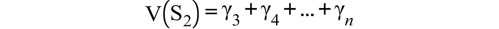
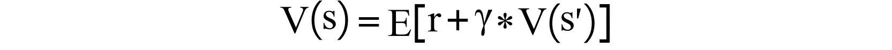
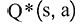
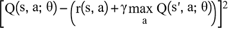

# 第九章：9. 什么是深度 Q 学习？

概述

在本章中，我们将详细学习深度 Q 学习以及所有可能的变种。你将学习如何实现 Q 函数，并结合深度学习使用 Q 学习算法来解决复杂的**强化学习**（**RL**）问题。在本章结束时，你将能够描述并实现 PyTorch 中的深度 Q 学习算法，我们还将实践实现一些深度 Q 学习的高级变种，例如使用 PyTorch 实现的双重深度 Q 学习。

# 介绍

在上一章中，我们学习了**多臂赌博机**（**MAB**）问题——这是一种常见的序列决策问题，目的是在赌场的老虎机上最大化奖励。在本章中，我们将结合深度学习技术与一种流行的**强化学习**（**RL**）技术，叫做 Q 学习。简而言之，Q 学习是一种强化学习算法，决定代理采取的最佳行动，以获得最大奖励。在 Q 学习中，“Q”表示用于获得未来奖励的行动的质量。在许多 RL 环境中，我们可能没有状态转移动态（即从一个状态转移到另一个状态的概率），或者收集状态转移动态太复杂。在这些复杂的 RL 环境中，我们可以使用 Q 学习方法来实现 RL。

在本章中，我们将从理解深度学习的基础知识开始，了解什么是感知器、梯度下降以及构建深度学习模型需要遵循的步骤。接下来，我们将学习 PyTorch 以及如何使用 PyTorch 构建深度学习模型。了解了 Q 学习后，我们将学习并实现一个**深度 Q 网络**（**DQN**），并借助 PyTorch 实现。然后，我们将通过经验重放和目标网络来提高 DQN 的性能。最后，你将实现 DQN 的另一种变体——**双重深度 Q 网络**（**DDQN**）。

# 深度学习基础

我们已经在*第三章*《TensorFlow 2 实战深度学习》中实现了深度学习算法。在我们开始本章重点的深度 Q 学习之前，有必要快速回顾一下深度学习的基础知识。

在我们深入研究神经网络之前，首先了解一下什么是感知器。下图表示的是一个通用的感知器：


图 9.1：感知器

感知器是一种二元线性分类器，输入首先与权重相乘，然后我们将所有这些乘积的值加权求和。接着，我们将这个加权和通过激活函数或阶跃函数。激活函数用于将输入值转换为特定的输出值，例如（0，1），用于二元分类。这个过程可以在前面的图中可视化。

深度前馈网络，通常我们也称之为**多层感知机**（**MLPs**），在多个层次上有多个感知机，如*图 9.2*所示。MLP 的目标是逼近任何函数。例如，对于一个分类器，这个函数，将输入映射，，通过学习参数的值将其归类为 y（对于二分类问题，可能是 0 或 1） 

描述自动生成](img/B16182_09_01c.png)或者权重。下图展示了一个通用的深度神经网络：


图 9.2：深度神经网络

MLP（多层感知机）的基本构建块由人工神经元（也称为节点）组成。它们自动学习最佳的权重系数，并将其与输入的特征相乘，从而决定神经元是否激活。网络由多个层组成，其中第一层称为输入层，最后一层称为输出层。中间的层被称为隐藏层。隐藏层的数量可以是“一个”或更多，具体取决于你希望网络有多深。

下图展示了训练深度学习模型所需的一般步骤：


图 9.3：深度学习模型训练流程

一个典型深度学习模型的训练过程可以解释如下：

1.  **决定网络架构**：

    首先，我们需要决定网络的架构，比如网络中有多少层，以及每一层将包含多少个节点。

1.  **初始化权重和偏置**：

    在网络中，每一层的每个神经元都将与上一层的所有神经元相连。这些神经元之间的连接都有相应的权重。在整个神经网络的训练过程中，我们首先初始化这些权重的值。每个神经元还会附带一个相应的偏置组件。这一初始化过程是一次性的。

1.  `sigmoid`、`relu` 或 `tanh`）用于产生非线性输出。这些值会通过每一层的隐藏层传播，最终在输出层产生输出。

1.  **计算损失**：

    网络的输出与训练数据集的真实/实际值或标签进行比较，从而计算出网络的损失。网络的损失是衡量网络性能的指标。损失越低，网络性能越好。

1.  **更新权重（反向传播）**：

    一旦我们计算出网络的损失，目标就是最小化网络的损失。这是通过使用梯度下降算法来调整与每个节点相关的权重来实现的。梯度下降是一种用于最小化各种机器学习算法中损失的优化算法：

    

    图 9.4：梯度下降

    损失最小化反过来推动预测值在训练过程中更接近实际值。学习率在决定这些权重更新的速率中起着至关重要的作用。其他优化器的例子有 Adam、RMSProp 和 Momentum。

1.  继续迭代：

    前面的步骤（*步骤 3 到 5*）将继续进行，直到损失被最小化到某个阈值，或者我们完成一定次数的迭代来完成训练过程。

以下列出了在训练过程中应该调整的一些超参数：

+   网络中的层数

+   每一层中神经元或节点的数量

+   每层中激活函数的选择

+   学习率的选择

+   梯度算法变种的选择

+   如果我们使用迷你批梯度下降算法，则批次大小

+   用于权重优化的迭代次数

现在我们已经对深度学习的基本概念有了较好的回顾，接下来我们将开始了解 PyTorch。

# PyTorch 基础

在本章中，我们将使用 PyTorch 来构建深度学习解决方案。一个显而易见的问题是，为什么选择 PyTorch？以下是一些我们应使用 PyTorch 来构建深度学习模型的原因：

+   **Python 风格深度集成**：

    由于 PyTorch 的 Python 风格编程方式和面向对象方法的应用，PyTorch 的学习曲线非常平滑。一个例子是与 NumPy Python 库的深度集成，您可以轻松地将 NumPy 数组转换为 torch 张量，反之亦然。此外，Python 调试器与 PyTorch 的配合也非常流畅，使得在使用 PyTorch 时代码调试变得更加容易。

+   **动态计算图**：

    许多其他深度学习框架采用静态计算图；然而，在 PyTorch 中，支持动态计算图，这使得开发人员能更深入地理解每个算法中的执行过程，并且可以在运行时编程改变网络的行为。

+   **OpenAI 采用 PyTorch**：

    在强化学习（RL）领域，PyTorch 因其速度和易用性而获得了巨大的关注。如您所注意到的，现在 OpenAI Gym 常常是解决 RL 问题的默认环境。最近，OpenAI 宣布将 PyTorch 作为其研究和开发工作的主要框架。

以下是构建 PyTorch 深度神经网络时应该遵循的一些步骤：

1.  导入所需的库，准备数据，并定义源数据和目标数据。请注意，当使用任何 PyTorch 模型时，您需要将数据转换为 torch 张量。

1.  使用类构建模型架构。

1.  定义要使用的损失函数和优化器。

1.  训练模型。

1.  使用模型进行预测。

让我们进行一个练习，构建一个简单的 PyTorch 深度学习模型。

## 练习 9.01：在 PyTorch 中构建一个简单的深度学习模型

本练习的目的是在 PyTorch 中构建一个工作的端到端深度学习模型。本练习将带您逐步了解如何在 PyTorch 中创建神经网络模型，并如何使用示例数据在 PyTorch 中训练同一模型。这将展示 PyTorch 中的基本过程，我们稍后将在*深度 Q 学习*部分中使用：

1.  打开一个新的 Jupyter 笔记本。我们将导入所需的库：

    ```py
    # Importing the required libraries
    import numpy as np
    import torch
    from torch import nn, optim
    ```

1.  然后，使用 NumPy 数组，我们将源数据和目标数据转换为 torch 张量。请记住，为了使 PyTorch 模型正常工作，您应始终将源数据和目标数据转换为 torch 张量，如以下代码片段所示：

    ```py
    #input data and converting to torch tensors
    inputs = np.array([[73, 67, 43],\
                       [91, 88, 64],\
                       [87, 134, 58],\
                       [102, 43, 37],\
                       [69, 96, 70]], dtype = 'float32')
    inputs = torch.from_numpy(inputs)
    #target data and converting to torch tensors
    targets = np.array([[366], [486], [558],\
                        [219], [470]], dtype = 'float32')
    targets = torch.from_numpy(targets)
    #Checking the shapes
    inputs.shape , targets.shape
    ```

    输出将如下所示：

    ```py
    (torch.Size([5, 3]), torch.Size([5, 1]))
    ```

    非常重要的是要注意输入和目标数据集的形状。这是因为深度学习模型应与输入和目标数据的形状兼容，以进行矩阵乘法运算。

1.  将网络架构定义如下：

    ```py
    class Model(nn.Module):
        def __init__(self):
            super().__init__()
            self.fc1 = nn.Linear(3, 10)
            self.fc2 = nn.Linear(10, 1)
        def forward(self, x): 
            x = torch.relu(self.fc1(x))
            x = self.fc2(x)
            return x
    # Instantiating the model
    model = Model()
    ```

    一旦我们将源数据和目标数据转换为张量格式，我们应该为神经网络模型架构创建一个类。这个类使用 `Module` 包从 `nn` 基类继承属性。这个新类叫做 `Model`，将有一个正向函数和一个常规构造函数，叫做 (`__init__`)。

    `__init__` 方法首先将调用 `super` 方法以访问基类。然后，在此构造方法内编写所有层的定义。forward 方法的作用是提供神经网络前向传播步骤所需的步骤。

    `nn.Linear()` 的语法是（输入大小，输出大小），用于定义模型的线性层。我们可以在 forward 函数中与线性层结合使用非线性函数，如 `relu` 或 `tanh`。

    神经网络架构表示输入层中的 3 个节点，隐藏层中的 10 个节点和输出层中的 1 个节点。在 forward 函数中，我们将在隐藏层中使用 `relu` 激活函数。一旦定义了模型类，我们必须实例化模型。

    现在，您应该已经成功创建并启动了一个模型。

1.  现在定义损失函数和优化器。我们正在处理的练习是一个回归问题；在回归问题中，我们通常使用均方误差作为损失函数。在 PyTorch 中，我们使用 `MSELoss()` 函数用于回归问题。通常，将损失赋给 `criterion`。

    `Model`参数和学习率必须作为必需的参数传递给优化器以进行反向传播。可以使用`model.parameters()`函数访问模型参数。现在使用 Adam 优化器定义损失函数和优化器。在创建 Adam 优化器时，将`0.01`作为学习率和模型参数一起传入：

    ```py
    # Loss function and optimizer
    criterion = nn.MSELoss()  
    optimizer = torch.optim.Adam(model.parameters(), lr=0.01)
    ```

    此时，你应该已经成功定义了损失和优化函数。

    注意

    `torch.optim`包。

1.  将模型训练 20 个周期并监控损失值。为了形成训练循环，创建一个名为`n_epochs`的变量，并将其初始化为 20。创建一个`for`循环，循环`n_epoch`次。在循环内部，完成以下步骤：使用`optimizer.zero_grad()`将参数梯度清零。将输入传入模型，获取输出。使用`criterion`通过传入输出和目标来获得损失。使用`loss.backward()`和`optimizer.step()`执行反向传播步骤。每个周期后打印损失值：

    ```py
    # Train the model
    n_epochs = 20
    for it in range(n_epochs):
        # zero the parameter gradients
        optimizer.zero_grad()
        # Forward pass
        outputs = model(inputs)
        loss = criterion(outputs, targets)
        # Backward and optimize
        loss.backward()
        optimizer.step()
        print(f'Epoch {it+1}/{n_epochs}, Loss: {loss.item():.4f}')
    ```

    默认情况下，PyTorch 会在每一步计算时累积梯度。我们需要在训练过程中处理这一点，以确保权重根据正确的梯度更新。`optimizer.zero_grad()`会将前一步训练的梯度清零，以停止梯度的累积。此步骤应在每个周期计算梯度之前完成。为了计算损失，我们应将预测值和实际值传入损失函数。`criterion(outputs, targets)`用于计算损失。`loss.backward()`用于计算权重梯度，我们将使用这些梯度来更新权重，从而获得最佳权重。权重更新是通过`optimizer.step()`函数完成的。

    输出将如下所示：

    ```py
    Epoch 1/20, Loss: 185159.9688
    Epoch 2/20, Loss: 181442.8125
    Epoch 3/20, Loss: 177829.2188
    Epoch 4/20, Loss: 174210.5938
    Epoch 5/20, Loss: 170534.4375
    Epoch 6/20, Loss: 166843.9531
    Epoch 7/20, Loss: 163183.2500
    Epoch 8/20, Loss: 159532.0625
    Epoch 9/20, Loss: 155861.8438
    Epoch 10/20, Loss: 152173.0000
    Epoch 11/20, Loss: 148414.5781
    Epoch 12/20, Loss: 144569.6875
    Epoch 13/20, Loss: 140625.1094
    Epoch 14/20, Loss: 136583.0625
    Epoch 15/20, Loss: 132446.6719
    Epoch 16/20, Loss: 128219.9688
    Epoch 17/20, Loss: 123907.7422
    Epoch 18/20, Loss: 119515.7266
    Epoch 19/20, Loss: 115050.4375
    Epoch 20/20, Loss: 110519.2969
    ```

    如你所见，输出在每个周期后打印损失值。你应该密切监控训练损失。从前面的输出中我们可以看到，训练损失在逐步减少。

1.  一旦模型训练完成，我们可以使用训练好的模型进行预测。将输入数据传入模型，获取预测结果并观察输出：

    ```py
    #Prediction using the trained model
    preds = model(inputs)
    print(preds)
    ```

    输出如下：

    ```py
    tensor([[ 85.6779],
            [115.3034],
            [146.7106],
            [ 69.4034],
            [120.5457]], grad_fn=<AddmmBackward>)
    ```

前面的输出展示了模型对相应输入数据的预测结果。

注意

若要访问此特定部分的源代码，请参考[`packt.live/3e2DscY`](https://packt.live/3e2DscY)。

你也可以在网上运行这个例子，访问[`packt.live/37q0J68`](https://packt.live/37q0J68)。

我们现在已经了解了一个 PyTorch 模型是如何工作的。这个例子对于你训练深度 Q 神经网络时会非常有用。然而，除了这个，还有一些其他重要的 PyTorch 工具是你应该了解的，接下来你将学习这些工具。理解这些工具对于实现深度 Q 学习至关重要。

## PyTorch 工具

为了使用这些工具，首先我们将创建一个大小为 10 的 torch 张量，包含从 1 到 9 的数字，使用 PyTorch 的 `arange` 函数。torch 张量本质上是一个元素矩阵，所有元素属于同一数据类型，可以具有多个维度。请注意，像 Python 一样，PyTorch 也会排除在 `arange` 函数中给定的数字：

```py
import torch
t = torch.arange(10)
print(t) 
print(t.shape)
```

输出将如下所示：

```py
tensor([0, 1, 2, 3, 4, 5, 6, 7, 8, 9])
torch.Size([10])
```

现在我们开始逐个探索不同的函数。

### view 函数

使用 `view` 函数重新调整张量的形状如下所示：

```py
t.view(2,5) # reshape the tensor to of size - (2,5)
```

输出将如下所示：

```py
tensor([[0, 1, 2, 3, 4],
        [5, 6, 7, 8, 9]])
```

现在让我们尝试一个新的形状：

```py
t.view(-1,5) 
# -1 will by default infer the first dimension 
# use when you are not sure about any dimension size
```

输出将如下所示：

```py
tensor([[0, 1, 2, 3, 4],
        [5, 6, 7, 8, 9]])
```

### squeeze 函数

`squeeze` 函数用于移除任何值为 1 的维度。以下是一个形状为 (5,1) 的张量示例：

```py
x = torch.zeros(5, 1)
print(x)
print(x.shape)
```

输出将如下所示：

```py
tensor([[0.],
        [0.],
        [0.],
        [0.],
        [0.]])
torch.Size([5, 1])
```

对张量应用 `squeeze` 函数：

```py
# squeeze will remove any dimension with a value of 1
y = x.squeeze(1)
# turns a tensor of shape [5, 1] to [5]
y.shape
```

输出将如下所示：

```py
torch.Size([5])
```

如你所见，使用 `squeeze` 后，维度为 1 的维度已被移除。

### unsqueeze 函数

正如其名所示，`unsqueeze` 函数执行与 `squeeze` 相反的操作。它向输入数据添加一个维度为 1 的维度。

考虑以下示例。首先，我们创建一个形状为 `5` 的张量：

```py
x = torch.zeros(5)
print(x)
print(x.shape)
```

输出将如下所示：

```py
tensor([0., 0., 0., 0., 0.])
torch.Size([5])
```

对张量应用 `unsqueeze` 函数：

```py
y = x.unsqueeze(1) # unsqueeze will add a dimension of 1 
print(y.shape) # turns a tensor of shape [5] to [5,1]
```

输出将如下所示：

```py
torch.Size([5, 1])
```

如你所见，已向张量添加了一个维度为 1 的维度。

### max 函数

如果将多维张量传递给 `max` 函数，函数将返回指定轴上的最大值及其相应的索引。更多细节请参考代码注释。

首先，我们创建一个形状为 `(4, 4)` 的张量：

```py
a = torch.randn(4, 4)
a
```

输出将如下所示：

```py
tensor([[-0.5462,  1.3808,  1.4759,  0.1665],
        [-1.6576, -1.2805,  0.5480, -1.7803],
        [ 0.0969, -1.7333,  1.0639, -0.4660],
        [ 0.3135, -0.4781,  0.3603, -0.6883]])
```

现在，让我们对张量应用 `max` 函数：

```py
"""
returns max values in the specified dimension along with index
specifying 1 as dimension means we want to do the operation row-wise
"""
torch.max(a , 1)
```

输出将如下所示：

```py
torch.return_types.max(values=tensor([1.4759, 0.5480, \
                                      1.0639, 0.3603]),\
                       indices=tensor([2, 2, 2, 2]))
```

现在让我们尝试从张量中找出最大值：

```py
torch.max(a , 1)[0] # to fetch the max values
```

输出将如下所示：

```py
tensor([1.4759, 0.5480, 1.0639, 0.3603])
```

要找到最大值的索引，可以使用以下代码：

```py
# to fetch the index of the corresponding max values
torch.max(a , 1)[1]
```

输出将如下所示：

```py
tensor([2, 2, 2, 2])
```

如你所见，最大值的索引已显示。

### gather 函数

`gather` 函数通过沿指定的轴（由 `dim` 指定）收集值来工作。`gather` 函数的一般语法如下：

```py
torch.gather(input, dim, index)
```

语法可以解释如下：

+   `input` (tensor): 在这里指定源张量。

+   `dim` (python:int): 指定索引的轴。

+   `index` (`LongTensor`): 指定要收集的元素的索引。

在下面的示例中，我们有一个形状为(`4,4`)的 `q_values`，它是一个 torch 张量，而 `action` 是一个 `LongTensor`，它包含我们想从 `q_values` 张量中提取的索引：

```py
q_values = torch.randn(4, 4)
print(q_values)
```

输出将如下所示：

```py
q_values = torch.randn(4, 4)
print(q_values)
tensor([[-0.2644, -0.2460, -1.7992, -1.8586],
        [ 0.3272, -0.9674, -0.2881,  0.0738],
        [ 0.0544,  0.5494, -1.7240, -0.8058],
        [ 1.6687,  0.0767,  0.6696, -1.3802]])
```

接下来，我们将应用 `LongTensor` 来指定要收集的张量元素的索引：

```py
# index must be defined as LongTensor
action =torch.LongTensor([0 , 1, 2, 3])
```

然后，找到 `q_values` 张量的形状：

```py
q_values.shape , action.shape 
# q_values -> 2-dimensional tensor 
# action -> 1-dimension tensor
```

输出将如下所示：

```py
 (torch.Size([4, 4]), torch.Size([4]))
```

现在让我们应用 `gather` 函数：

```py
"""
unsqueeze is used to take care of the error - Index tensor 
must have same dimensions as input tensor
returns the values from q_values using the action as indexes
"""
torch.gather(q_values , 1, action.unsqueeze(1))
```

输出将如下所示：

```py
tensor([[-0.2644],
        [-0.9674],
        [-1.7240],
        [-1.3802]])
```

现在你已经对神经网络有了基本了解，并且知道如何在 PyTorch 中实现一个简单的神经网络。除了标准的神经网络（即线性层与非线性激活函数的组合）之外，还有两个变体，分别是**卷积神经网络**（**CNNs**）和**递归神经网络**（**RNNs**）。CNN 主要用于图像分类和图像分割任务，而 RNN 则用于具有顺序模式的数据，例如时间序列数据或语言翻译任务。

现在，在我们已经掌握了深度学习的基本知识以及如何在 PyTorch 中构建深度学习模型后，我们将重点转向 Q 学习，以及如何在强化学习（RL）中利用深度学习，借助 PyTorch 实现。首先，我们将从状态值函数和贝尔曼方程开始，然后再深入探讨 Q 学习。

## 状态值函数和贝尔曼方程

随着我们逐渐进入 Q 函数和 Q 学习过程的核心，让我们回顾一下贝尔曼方程，它是 Q 学习过程的支柱。在接下来的部分，我们将首先复习“期望值”的定义，并讨论它如何在贝尔曼方程中应用。

### 期望值

下图展示了状态空间中的期望值：


图 9.5：期望值

假设一个智能体处于状态 `S`，并且它有两条可以选择的路径。第一条路径的转移概率为 0.6，关联的奖励为 1；第二条路径的转移概率为 0.4，关联的奖励为 0。

现在，状态 `S` 的期望值或奖励如下所示：

```py
(0.6 * 1) + (0.4 * 1) = 0.6 
```

从数学上讲，它可以表示为：


图 9.6：期望值的表达式

### 值函数

当一个智能体处于某个环境中时，值函数提供了关于各个状态所需的信息。值函数为智能体提供了一种方法，通过这种方法，智能体可以知道某一给定状态对其有多好。所以，如果一个智能体可以从当前状态选择两个状态，它将总是选择值函数较大的那个状态。

值函数可以递归地通过未来状态的值函数来表示。当我们在一个随机环境中工作时，我们将使用期望值的概念，正如前一节所讨论的那样。

### 确定性环境的值函数

对于一个确定性世界，状态的值就是所有未来奖励的总和。

状态 1 的值函数可以表示如下：


图 9.7：状态 1 的值函数

状态 1 的值函数可以通过状态 2 来表示，如下所示：



图 9.8：状态 2 的值函数

使用状态 2 值函数的状态 1 简化值函数可以表示如下：


图 9.9：使用状态 2 值函数的状态 1 简化值函数

带折扣因子的状态 1 简化值函数可以表示如下：


图 9.10：带折扣因子的状态 1 简化值函数

通常，我们可以将值函数重新写为如下形式：


图 9.11：确定性环境下的值函数

### 随机环境下的值函数：

对于随机行为，由于环境中存在的随机性或不确定性，我们不直接使用原始的未来奖励，而是取从某个状态到达的期望总奖励来得出值函数。前述方程中新增加的是期望部分。方程如下：



图 9.12：随机环境下的值函数

这里，`s` 是当前状态，是下一个状态，`r` 是从 `s` 到的奖励。

# 动作值函数（Q 值函数）

在前面的章节中，我们学习了状态值函数，它告诉我们某个状态对智能体有多大的奖励。现在我们将学习另一个函数，在这个函数中，我们可以将状态与动作结合起来。动作值函数将告诉我们，对于智能体从某个给定状态采取任何特定动作的好坏。我们也称动作值为**Q 值**。方程可以写成如下形式：


图 9.13：Q 值函数表达式

上述方程可以按迭代方式写成如下：


图 9.14：带迭代的 Q 值函数表达式

这个方程也被称为**贝尔曼方程**。从这个方程，我们可以递归地表示的 Q 值，表示为下一个状态的 Q 值。贝尔曼方程可以描述如下：

*“处于状态 s 并采取动作 a 的总期望奖励是两个部分的和：我们从状态‘s’采取动作 a 能够获得的奖励（即 r），加上我们从任何可能的下一状态-动作对（s′，a′）中能够获得的最大期望折扣回报**。a′是下一最佳可能动作。”*

## 实现 Q 学习以找到最佳动作

使用 Q 函数从任何状态中找到最佳动作的过程称为 Q 学习。Q 学习也是一种表格方法，其中状态和动作的组合以表格格式存储。在接下来的部分中，我们将学习如何通过 Q 学习方法逐步找到最佳动作。考虑以下表格：


图 9.15：Q 学习的示例表格

正如前面的表格所示，Q 值以表格的形式存储，其中行代表环境中的状态，列代表代理的所有可能动作。你可以看到，所有的状态都表示为行，而所有动作，如上、下、右和左，都存储为列。

任何一行和一列交叉点上的值即为该特定状态-动作对的 Q 值。

最初，所有状态-动作对的值都初始化为零。代理在某一状态下将选择具有最高 Q 值的动作。例如，如上图所示，当处于状态 001 时，代理将选择向右移动，因为它的 Q 值最高（0.98）。

在初期阶段，当大多数状态-动作对的值为零时，我们将利用之前讨论的ε-贪心策略来解决探索-利用的困境，具体如下：

+   设置ε的值（例如 0.90 这样的较高值）。

+   在 0 到 1 之间选择一个随机数：

    ```py
    if random_number > ε :
        choose the best action(exploitation)
    else:
        choose the random action (exploration)
    decay ε 
    ```

状态中较高的ε值逐渐衰减。其思想是最初进行探索，然后进行利用。

使用上一章中描述的**时序差分**（**TD**）方法，我们以迭代方式更新 Q 值，如下所示：


图 9.16：通过迭代更新 Q 值

时间戳`t`为当前迭代，时间戳`(t-1)`为上一轮迭代。通过这种方式，我们用`TD`方法更新上一轮时间戳的 Q 值，并尽可能将 Q 值推近到最优 Q 值，这也叫做。

我们可以将上面的方程重新写为：


图 9.17：更新 Q 值的表达式

通过简单的数学运算，我们可以进一步简化方程，如下所示：


图 9.18：Q 值更新方程

学习率决定了我们在更新 Q 值时应该采取多大的步伐。这个迭代和更新 Q 值的过程会持续进行，直到 Q 值趋近于 或者当我们达到某个预定义的迭代次数时。迭代过程可以如下可视化：


图 9.19：Q 学习过程

如你所见，经过多次迭代后，Q 表最终准备好了。

### Q 学习的优点

以下是使用 Q 学习在强化学习领域中的一些优点：

+   我们不需要知道完整的转移动态；这意味着我们不必了解所有可能不存在的状态转移概率。

+   由于我们以表格格式存储状态-动作组合，通过从表格中提取细节，理解和实现 Q 学习算法变得更加简单。

+   我们不必等到整个回合结束才更新任何状态的 Q 值，因为学习过程是连续在线更新的，这与蒙特卡罗方法不同，在蒙特卡罗方法中我们必须等到回合结束才能更新动作值函数。

+   当状态和动作空间的组合较少时，这种方法效果较好。

由于我们现在已经了解了 Q 学习的基础知识，我们可以使用 OpenAI Gym 环境实现 Q 学习。因此，在进行练习之前，让我们回顾一下 OpenAI Gym 的概念。

## OpenAI Gym 回顾

在我们实现 Q 学习表格方法之前，先快速回顾并重新审视 Gym 环境。OpenAI Gym 是一个用于开发强化学习（RL）算法的工具包。它支持教导代理从行走到玩像 CartPole 或 FrozenLake-v0 等游戏。Gym 提供了一个环境，开发者可以根据需要编写和实现任何强化学习算法，如表格方法或深度 Q 学习。我们也可以使用现有的深度学习框架，如 PyTorch 或 TensorFlow 来编写算法。以下是一个与现有 Gym 环境一起使用的示例代码：


图 9.20：Gym 环境

让我们理解代码的几个部分如下：

+   `gym.make("CartPole-v1")`

    这会创建一个现有的 Gym 环境（`CartPole-v1`）。

+   `env.reset()`

    这会重置环境，因此环境将回到初始状态。

+   `env.action_space.sample()`

    这会从动作空间（可用动作的集合）中选择一个随机动作。

+   `env.step(action)`

    这会执行上一阶段选择的动作。一旦你采取了动作，环境将返回`new_state`、`reward`和`done`标志（用于指示游戏是否结束），以及一些额外信息。

+   `env.render()`

    这会呈现出代理执行动作或进行游戏的过程。

我们现在已经对 Q 学习过程有了理论理解，并且我们也回顾了 Gym 环境。现在轮到你自己实现使用 Gym 环境的 Q 学习了。

## 练习 9.02：实现 Q 学习表格方法

在这个练习中，我们将使用 OpenAI Gym 环境实现表格 Q 学习方法。我们将使用`FrozenLake-v0` Gym 环境来实现表格 Q 学习方法。目标是通过 Q 学习过程进行游戏并收集最大奖励。你应该已经熟悉来自*第五章*、*动态规划*中的 FrozenLake-v0 环境。以下步骤将帮助你完成练习：

1.  打开一个新的 Jupyter notebook 文件。

1.  导入所需的库：

    ```py
    # Importing the required libraries
    import gym
    import numpy as np
    import matplotlib.pyplot as plt
    ```

1.  创建 `'FrozenLake-v0'` Gym 环境，以实现一个随机环境：

    ```py
    env = gym.make('FrozenLake-v0')
    ```

1.  获取状态和动作的数量：

    ```py
    number_of_states = env.observation_space.n
    number_of_actions = env.action_space.n
    # checking the total number of states and action
    print('Total number of States : {}'.format(number_of_states)) 
    print('Total number of Actions : {}'.format(number_of_actions))
    ```

    输出将如下所示：

    ```py
    Total number of States : 16
    Total number of Actions : 4
    ```

1.  使用从上一步获取的详细信息创建 Q 表：

    ```py
    # Creation of Q table
    Q_TABLE = np.zeros([number_of_states, number_of_actions])
    # Looking at the initial values Q table
    print(Q_TABLE)
    print('shape of Q table : {}'.format(Q_TABLE.shape)
    ```

    输出如下：

    ```py
    [[0\. 0\. 0\. 0.]
     [0\. 0\. 0\. 0.]
     [0\. 0\. 0\. 0.]
     [0\. 0\. 0\. 0.]
     [0\. 0\. 0\. 0.]
     [0\. 0\. 0\. 0.]
     [0\. 0\. 0\. 0.]
     [0\. 0\. 0\. 0.]
     [0\. 0\. 0\. 0.]
     [0\. 0\. 0\. 0.]
     [0\. 0\. 0\. 0.]
     [0\. 0\. 0\. 0.]
     [0\. 0\. 0\. 0.]
     [0\. 0\. 0\. 0.]
     [0\. 0\. 0\. 0.]
     [0\. 0\. 0\. 0.]]
    shape of Q table : (16, 4)
    ```

    现在我们知道 Q 表的形状，并且每个状态-动作对的初始值都是零。

1.  设置所有用于 Q 学习的必需超参数值：

    ```py
    # Setting the Hyper parameter Values for Q Learning
    NUMBER_OF_EPISODES = 10000
    MAX_STEPS = 100 
    LEARNING_RATE = 0.1
    DISCOUNT_FACTOR = 0.99
    EGREEDY = 1
    MAX_EGREEDY = 1
    MIN_EGREEDY = 0.01
    EGREEDY_DECAY_RATE = 0.001
    ```

1.  创建空列表以存储奖励值和衰减的 egreedy 值用于可视化：

    ```py
    # Creating empty lists to store rewards of all episodes
    rewards_all_episodes = []
    # Creating empty lists to store egreedy_values of all episodes
    egreedy_values = []
    ```

1.  实现 Q 学习训练过程，通过固定次数的回合来进行游戏。使用之前学到的 Q 学习过程（来自*实施 Q 学习以寻找最佳行动*部分），以便从给定状态中找到最佳行动。

    创建一个 `for` 循环，迭代 `NUMBER_OF_EPISODES`。重置环境并将 `done` 标志设置为 `False`，`current_episode_rewards` 设置为 `zero`。创建另一个 `for` 循环，在 `MAX_STEPS` 内运行一个回合。在 `for` 循环内，使用 epsilon-greedy 策略选择最佳动作。执行该动作并使用*图 9.18*中展示的公式更新 Q 值。收集奖励并将 `new_state` 赋值为当前状态。如果回合结束，则跳出循环，否则继续执行步骤。衰减 epsilon 值，以便继续进行下一回合：

    ```py
    # Training Process
    for episode in range(NUMBER_OF_EPISODES):
        state = env.reset()
        done = False
        current_episode_rewards = 0
        for step in range(MAX_STEPS):
            random_for_egreedy = np.random.rand()
            if random_for_egreedy > EGREEDY:
                action = np.argmax(Q_TABLE[state,:])
            else:
                action = env.action_space.sample()

            new_state, reward, done, info = env.step(action)
            Q_TABLE[state, action] = (1 - LEARNING_RATE) \
                                     * Q_TABLE[state, action] \
                                     + LEARNING_RATE \
                                     * (reward + DISCOUNT_FACTOR \
                                        * np.max(Q_TABLE[new_state,:]))
            state = new_state
            current_episode_rewards += reward
            if done:
                break
        egreedy_values.append(EGREEDY)
        EGREEDY = MIN_EGREEDY + (MAX_EGREEDY - MIN_EGREEDY) \
                  * np.exp(-EGREEDY_DECAY_RATE*episode)
        rewards_all_episodes.append(current_episode_rewards)
    ```

1.  实现一个名为 `rewards_split` 的函数，该函数将 10,000 个奖励拆分为 1,000 个单独的奖励列表，并计算这些 1,000 个奖励列表的平均奖励：

    ```py
    def rewards_split(rewards_all_episodes , total_episodes , split):
        """
        Objective:
        To split and calculate average reward or percentage of 
        completed rewards per splits
        inputs: 
        rewards_all_episodes - all the per episode rewards
        total_episodes - total of episodes
        split - number of splits on which we will check the reward
        returns:
        average reward of percentage of completed rewards per splits
        """
        splitted = np.split(np.array(rewards_all_episodes),\
                                     total_episodes/split)
        avg_reward_per_splits = []
        for rewards in splitted:
            avg_reward_per_splits.append(sum(rewards)/split)
        return avg_reward_per_splits
    avg_reward_per_splits = rewards_split\
                            (rewards_all_episodes , \
                             NUMBER_OF_EPISODES , 1000)
    ```

1.  可视化平均奖励或已完成回合的百分比：

    ```py
    plt.figure(figsize=(12,5))
    plt.title("% of Episodes completed")
    plt.plot(np.arange(len(avg_reward_per_splits)), \
             avg_reward_per_splits, 'o-')
    plt.show()
    ```

    输出如下：

    

    图 9.21：可视化已完成回合的百分比

    从前面的图中可以看出，回合已完成，并且百分比呈指数增长，直到达到一个点后变得恒定。

1.  现在我们将可视化 `Egreedy` 值的衰减：

    ```py
    plt.figure(figsize=(12,5))
    plt.title("Egreedy value")
    plt.bar(np.arange(len(egreedy_values)), egreedy_values, \
            alpha=0.6, color='blue', width=5)
    plt.show()
    ```

    图形将如下所示：

    

图 9.22：Egreedy 值衰减

在*图 9.22*中，我们可以看到`Egreedy`值随着步骤数的增加逐渐衰减。这意味着，随着值接近零，算法变得越来越贪婪，选择具有最大奖励的动作，而不探索那些奖励较少的动作，这些动作通过足够的探索，可能会在长期内带来更多的奖励，但在初期我们对模型了解不够。

这突出了在学习初期阶段需要更高探索的需求。通过更高的 epsilon 值可以实现这一点。随着训练的进行，epsilon 值逐渐降低。这会导致较少的探索和更多利用过去运行中获得的知识。

因此，我们已经成功实现了表格 Q 学习方法。

注意

要访问此特定部分的源代码，请参考[`packt.live/2B3NziM`](https://packt.live/2B3NziM)。

您也可以在线运行此示例，网址为[`packt.live/2AjbACJ`](https://packt.live/2AjbACJ)。

现在我们已经对所需的实体有了充分的了解，我们将学习强化学习中的另一个重要概念：深度 Q 学习。

# 深度 Q 学习

在深入讨论深度 Q 学习过程的细节之前，让我们先讨论传统表格 Q 学习方法的缺点，然后我们将看看将深度学习与 Q 学习结合如何帮助我们解决表格方法的这些缺点。

以下描述了表格 Q 学习方法的几个缺点：

+   性能问题：当状态空间非常大时，表格的迭代查找操作将变得更加缓慢和昂贵。

+   存储问题：除了性能问题，当涉及到存储大规模状态和动作空间的表格数据时，存储成本也很高。

+   表格方法仅在代理遇到 Q 表中已有的离散状态时表现良好。对于 Q 表中没有的未见过的状态，代理的表现可能是最优的。

+   对于之前提到的连续状态空间，表格 Q 学习方法无法以高效或恰当的方式近似 Q 值。

考虑到所有这些问题，我们可以考虑使用一个函数逼近器，将其作为状态与 Q 值之间的映射。在机器学习中，我们可以将这个问题看作是使用非线性函数逼近器来解决回归问题。既然我们在考虑使用一个函数逼近器，神经网络作为函数逼近器最为适合，通过它我们可以为每个状态-动作对近似 Q 值。将 Q 学习与神经网络结合的这个过程称为深度 Q 学习或 DQN。

让我们分解并解释这个难题的每个部分：

+   **DQN 的输入**：

    神经网络接受环境的状态作为输入。例如，在 FrozenLake-v0 环境中，状态可以是任何给定时刻网格上的简单坐标。对于像 Atari 这样的复杂游戏，输入可以是几张连续的屏幕快照，作为状态表示的图像。输入层中的节点数将与环境中存在的状态数相同。

+   **DQN 输出**：

    输出将是每个动作的 Q 值。例如，对于任何给定的环境，如果有四个可能的动作，那么输出将为每个动作提供四个 Q 值。为了选择最佳动作，我们将选择具有最大 Q 值的动作。

+   **损失函数和学习过程**：

    DQN 将接受来自环境的状态，并且对于每个给定的输入或状态，网络将输出每个动作的估计 Q 值。其目标是逼近最优的 Q 值，这将满足贝尔曼方程右侧的要求，如下所示：

    

图 9.23：贝尔曼方程

为了计算损失，我们需要目标 Q 值和来自网络的 Q 值。从前面的贝尔曼方程中，目标 Q 值是在方程的右侧计算出来的。DQN 的损失是通过将 DQN 输出的 Q 值与目标 Q 值进行比较来计算的。一旦我们计算出损失，我们就通过反向传播更新 DQN 的权重，以最小化损失并使 DQN 输出的 Q 值更接近最优 Q 值。通过这种方式，在 DQN 的帮助下，我们将强化学习问题视为一个有源和目标的监督学习问题。

DQN 实现可以如下可视化：


图 9.24：DQN

我们可以按以下步骤编写深度 Q 学习过程：

1.  初始化权重以获得`Q(s,a)`的初始近似值：

    ```py
    class DQN(nn.Module):
        def __init__(self , hidden_layer_size):
            super().__init__()
            self.hidden_layer_size = hidden_layer_size
            self.fc1 = nn.Linear\
                       (number_of_states,self.hidden_layer_size)
            self.fc2 = nn.Linear\
                       (self.hidden_layer_size,number_of_actions)
        def forward(self, x):
            output = torch.tanh(self.fc1(x))
            output = self.fc2(output)
            return output
    ```

    如你所见，我们已经用权重初始化了 DQN 类。`__init__` 函数中的两行代码负责给网络连接赋予随机权重。我们也可以显式地初始化权重。现在常见的做法是让 PyTorch 或 TensorFlow 使用其内部的默认初始化逻辑来创建初始权重向量，如下所示的代码示例：

    ```py
    self.fc1 = nn.Linear(number_of_states,self.hidden_layer_size)
    self.fc2 = nn.Linear(self.hidden_layer_size,number_of_actions)
    ```

1.  通过网络进行一次前向传播，获取标志（`state`、`action`、`reward` 和 `new_state`）。通过对 Q 值取最大值的索引（选择最大 Q 值的索引）来选择动作，或者在探索阶段随机选择动作。我们可以使用以下代码示例来实现这一点：

    ```py
    def select_action(self,state,EGREEDY):
            random_for_egreedy = torch.rand(1)[0]
            if random_for_egreedy > EGREEDY:
                with torch.no_grad():
                    state = torch.Tensor(state).to(device)
                    q_values = self.dqn(state)
                    action = torch.max(q_values,0)[1]
                    action = action.item()
            else:
                action = env.action_space.sample()
            return action
    ```

    正如你在前面的代码片段中看到的，使用了 egreedy 算法来选择动作。`select_action`函数通过 DQN 传递状态来获得 Q 值，并在利用过程中选择 Q 值最高的动作。`if`语句决定是否进行探索。

1.  如果 episode 结束，则目标 Q 值将是获得的奖励；否则，使用 Bellman 方程来估计目标 Q 值。你可以在以下代码示例中实现：

    ```py
    def optimize(self, state, action, new_state, reward, done):
            state = torch.Tensor(state).to(device)
            new_state = torch.Tensor(new_state).to(device)
            reward = torch.Tensor([reward]).to(device)
            if done:
                target_value = reward
            else:
                new_state_values = self.dqn(new_state).detach()
                max_new_state_values = torch.max(new_state_values)
                target_value = reward + DISCOUNT_FACTOR \
                               * max_new_state_values
    ```

1.  获得的损失如下所示。

    如果 episode 结束，则损失将是。

    否则，损失将被称为。

    以下是`loss`的示例代码：

    ```py
            loss = self.criterion(predicted_value, target_value)
    ```

1.  使用反向传播，我们更新网络权重（θ）。此迭代将针对每个状态运行，直到我们足够地最小化损失并得到一个近似最优的 Q 函数。以下是示例代码：

    ```py
            self.optimizer.zero_grad()
            loss.backward()
            self.optimizer.step()
    ```

现在我们对深度 Q 学习的实现有了较为清晰的理解，接下来让我们通过一个练习来测试我们的理解。

## 练习 9.03：在 CartPole-v0 环境中使用 PyTorch 实现一个有效的 DQN 网络

在本练习中，我们将使用 OpenAI Gym CartPole 环境实现深度 Q 学习算法。此练习的目的是构建一个基于 PyTorch 的 DQN 模型，学习在 CartPole 环境中平衡小车。请参考本章开始时解释的构建神经网络的 PyTorch 示例。

我们的主要目标是应用 Q 学习算法，在每一步保持杆子稳定，并在每个 episode 中收集最大奖励。当杆子保持直立时，每一步会获得+1 的奖励。当杆子偏离垂直位置超过 15 度，或小车在 CartPole 环境中偏离中心位置超过 2.4 单位时，episode 将结束：

1.  打开一个新的 Jupyter 笔记本并导入所需的库：

    ```py
    import gym
    import matplotlib.pyplot as plt
    import torch
    import torch.nn as nn
    from torch import optim
    import numpy as np
    import math
    ```

1.  根据**图形处理单元**（**GPU**）环境的可用性创建设备：

    ```py
    # selecting the available device (cpu/gpu)
    use_cuda = torch.cuda.is_available()
    device = torch.device("cuda:0" if use_cuda else "cpu")
    print(device)
    ```

1.  使用`'CartPole-v0'`环境创建一个 Gym 环境：

    ```py
    env = gym.make('CartPole-v0')
    ```

1.  设置`seed`以保证 torch 和环境的可复现结果：

    ```py
    seed = 100
    env.seed(seed)
    torch.manual_seed(seed) 
    ```

1.  设置 DQN 过程所需的所有超参数值：

    ```py
    NUMBER_OF_EPISODES = 700
    MAX_STEPS = 1000
    LEARNING_RATE = 0.01
    DISCOUNT_FACTOR = 0.99
    HIDDEN_LAYER_SIZE = 64
    EGREEDY = 0.9
    EGREEDY_FINAL = 0.02
    EGREEDY_DECAY = 500
    ```

1.  实现一个在每一步后衰减 epsilon 值的函数。我们将使用指数方式衰减 epsilon 值。epsilon 值从`EGREEDY`开始，并会衰减直到达到`EGREEDY_FINAL`。使用以下公式：

    ```py
    EGREEDY_FINAL + (EGREEDY - EGREEDY_FINAL) \
    * math.exp(-1\. * steps_done / EGREEDY_DECAY )
    ```

    代码将如下所示：

    ```py
    def calculate_epsilon(steps_done):
        """
        Decays epsilon with increasing steps
        Parameter:
        steps_done (int) : number of steps completed
        Returns:
        int - decayed epsilon
        """
        epsilon = EGREEDY_FINAL + (EGREEDY - EGREEDY_FINAL) \
                  * math.exp(-1\. * steps_done / EGREEDY_DECAY )
        return epsilon
    ```

1.  从环境中获取状态和动作的数量：

    ```py
    number_of_states = env.observation_space.shape[0]
    number_of_actions = env.action_space.n
    print('Total number of States : {}'.format(number_of_states))
    print('Total number of Actions : {}'.format(number_of_actions))
    ```

    输出将如下所示：

    ```py
    Total number of States : 4
    Total number of Actions : 2
    ```

1.  创建一个名为`DQN`的类，该类接受状态数量作为输入，并输出环境中动作数量的 Q 值，并具有一个大小为`64`的隐藏层网络：

    ```py
    class DQN(nn.Module):
        def __init__(self , hidden_layer_size):
            super().__init__()
            self.hidden_layer_size = hidden_layer_size
            self.fc1 = nn.Linear\
                       (number_of_states,self.hidden_layer_size)
            self.fc2 = nn.Linear\
                       (self.hidden_layer_size,number_of_actions)
        def forward(self, x):
            output = torch.tanh(self.fc1(x))
            output = self.fc2(output)
            return output
    ```

1.  创建一个`DQN_Agent`类，并实现构造函数`_init_`。该函数将在其中创建一个 DQN 类的实例，并传递隐藏层大小。它还将定义`MSE`作为损失标准。接下来，定义`Adam`作为优化器，并设置模型参数及预定义的学习率：

    ```py
    class DQN_Agent(object):
        def __init__(self):
            self.dqn = DQN(HIDDEN_LAYER_SIZE).to(device)
            self.criterion = torch.nn.MSELoss()
            self.optimizer = optim.Adam\
                             (params=self.dqn.parameters() , \
                              lr=LEARNING_RATE)
    ```

1.  接下来，定义`select_action`函数，该函数将接受`state`和 epsilon 值作为输入参数。使用`egreedy`算法选择动作。该函数将通过 DQN 传递`state`以获取 Q 值，然后在利用阶段使用`torch.max`操作选择具有最高 Q 值的动作。在此过程中，不需要梯度计算；因此我们使用`torch.no_grad()`函数来关闭梯度计算：

    ```py
        def select_action(self,state,EGREEDY):
            random_for_egreedy = torch.rand(1)[0]
            if random_for_egreedy > EGREEDY:
                with torch.no_grad():
                    state = torch.Tensor(state).to(device)
                    q_values = self.dqn(state)
                    action = torch.max(q_values,0)[1]
                    action = action.item()
            else:
                action = env.action_space.sample()
            return action
    ```

1.  定义`optimize`函数，该函数将接受`state`、`action`、`new_state`、`reward`和`done`作为输入，并将它们转换为张量，同时保持它们与所用设备的兼容性。如果该回合已结束，则将奖励设为目标值；否则，将新状态通过 DQN（用于断开连接并关闭梯度计算）传递，以计算贝尔曼方程右侧的最大部分。利用获得的奖励和折扣因子，我们可以计算目标值：

    ```py
        def optimize(self, state, action, new_state, reward, done):
            state = torch.Tensor(state).to(device)
            new_state = torch.Tensor(new_state).to(device)
            reward = torch.Tensor([reward]).to(device)
            if done:
                target_value = reward
            else:
                new_state_values = self.dqn(new_state).detach()
                max_new_state_values = torch.max(new_state_values)
                target_value = reward + DISCOUNT_FACTOR \
                               * max_new_state_values
            predicted_value = self.dqn(state)[action].view(-1)
            loss = self.criterion(predicted_value, target_value)
            self.optimizer.zero_grad()
            loss.backward()
            self.optimizer.step()
    ```

1.  使用`for`循环编写训练过程。首先，使用之前创建的类实例化 DQN 智能体。创建一个空的`steps_total`列表，用于收集每个回合的总步数。将`steps_counter`初始化为零，并用它来计算每个步骤的衰减 epsilon 值。在训练过程中使用两个循环。第一个循环是进行一定步数的游戏。第二个循环确保每个回合持续固定的步数。在第二个`for`循环中，第一步是计算当前步骤的 epsilon 值。使用当前状态和 epsilon 值，选择要执行的动作。接下来的步骤是执行该动作。一旦执行动作，环境将返回`new_state`、`reward`和`done`标志。利用`optimize`函数，执行一步梯度下降来优化 DQN。现在，将新状态作为下次迭代的当前状态。最后，检查该回合是否结束。如果回合结束，则可以收集并记录当前回合的奖励：

    ```py
    # Instantiating the DQN Agent
    dqn_agent = DQN_Agent()
    steps_total = []
    steps_counter = 0
    for episode in range(NUMBER_OF_EPISODES):
        state = env.reset()
        done = False
        step = 0
        for I in range(MAX_STEPS):
            step += 1
            steps_counter += 1
            EGREEDY = calculate_epsilon(steps_counter)
            action = dqn_agent.select_action(state, EGREEDY)
            new_state, reward, done, info = env.step(action)
            dqn_agent.optimize(state, action, new_state, reward, done)
            state = new_state
            if done:
                steps_total.append(step)
                break
    ```

1.  现在观察奖励，因为奖励是标量反馈，能够指示智能体的表现如何。你应该查看平均奖励以及过去 100 回合的平均奖励：

    ```py
    print("Average reward: %.2f" \
          % (sum(steps_total)/NUMBER_OF_EPISODES))
    print("Average reward (last 100 episodes): %.2f" \
          % (sum(steps_total[-100:])/100))
    ```

    输出将如下所示：

    ```py
    Average reward: 158.83
    Average reward (last 100 episodes): 176.28
    ```

1.  执行奖励的图形表示。检查代理在更多回合中如何表现，并检查过去 100 回合的奖励平均值：

    ```py
    plt.figure(figsize=(12,5))
    plt.title("Rewards Collected")
    plt.bar(np.arange(len(steps_total)), steps_total, \
            alpha=0.5, color='green', width=6)
    plt.show()
    ```

    输出图应该如下所示：

    

图 9.26：收集的奖励

*图 9.26*显示了最初的步数和奖励值较低。然而，随着步数的增加，我们通过 DQN 算法收集到了稳定且更高的奖励值。

注意

要访问此特定部分的源代码，请参阅[`packt.live/3cUE8Q9`](https://packt.live/3cUE8Q9)。

您也可以在线运行此示例，网址是[`packt.live/37zeUpz`](https://packt.live/37zeUpz)。

因此，我们已经成功实现了在 CartPole 环境中使用 PyTorch 的 DQN。现在，让我们看看 DQN 中的一些挑战性问题。

# DQN 中的挑战

前面章节中解释的内容看起来很好；然而，DQN 存在一些挑战。以下是 DQN 面临的几个挑战：

+   步数之间的相关性在训练过程中造成了收敛问题

+   非稳定目标的挑战。

这些挑战及其相应的解决方案将在接下来的章节中进行解释。

## 步数之间的相关性和收敛问题

从前面的练习中，我们已经看到，在 Q 学习中，我们将 RL 问题视为监督学习问题，其中有预测值和目标值，并通过梯度下降优化来减少损失，找到最优的 Q 函数。

梯度下降算法假设训练数据点是独立同分布的（即`i.i.d`），这一点在传统机器学习数据中通常成立。然而，在强化学习（RL）中，每个数据点是高度相关且依赖于其他数据点的。简而言之，下一状态取决于前一状态的动作。由于 RL 数据中的相关性，我们在梯度下降算法的情况下遇到了收敛问题。

为了解决收敛问题，我们将在接下来的章节中介绍一个可能的解决方案——**经验回放**。

## 经验回放

为了打破 RL 中数据点之间的相关性，我们可以使用一种名为经验回放（experience replay）的技术。在训练的每个时间步，我们将代理的经验存储在**回放缓冲区**（Replay Buffer）中（这只是一个 Python 列表）。

例如，在时间 t 的训练过程中，以下代理经验作为一个元组存储在回放缓冲区中 ，其中：

+   - 当前状态

+   - 执行动作

+   - 新状态

+   - 奖励

+   - 表示该回合是否完成

我们为重放缓冲区设置了最大大小；随着新经验的出现，我们将继续添加新的经验元组。因此，当我们达到最大大小时，我们将丢弃最旧的值。在任何给定时刻，重放缓冲区始终会存储最新的经验，且大小不超过最大限制。

在训练过程中，为了打破相关性，我们将从重放缓冲区随机采样这些经验来训练 DQN。这个获取经验并从存储这些经验的重放缓冲区中进行采样的过程称为经验重放。

在 Python 实现中，我们将使用一个 `push` 函数来将经验存储在重放缓冲区中。将实现一个示例函数，从缓冲区采样经验，指针和长度方法将帮助我们跟踪重放缓冲区的大小。

以下是经验重放的详细代码实现示例。

我们将实现一个包含之前解释的所有功能的 `ExperienceReplay` 类。在该类中，构造函数将包含以下变量：`capacity`，表示重放缓冲区的最大大小；`buffer`，一个空的 Python 列表，充当内存缓冲区；以及 `pointer`，指向内存缓冲区当前的位置，在将内存推送到缓冲区时使用。

该类将包含 `push` 函数，该函数使用 `pointer` 变量检查缓冲区中是否有空闲空间。如果有空闲空间，`push` 将在缓冲区的末尾添加一个经验元组，否则该函数将替换缓冲区起始点的内存。它还包含 `sample` 函数，返回批量大小的经验元组，以及 `__len__` 函数，返回当前缓冲区的长度，作为实现的一部分。

以下是指针、容量和模除在经验重放中的工作示例。

我们将指针初始化为零，并将容量设置为三。每次操作后，我们增加指针值，并通过模除运算得到指针的当前值。当指针超过最大容量时，值将重置为零：

![图 9.27：经验重放类中的指针、容量和模除]

](img/B16182_09_27.jpg)

图 9.27：经验重放类中的指针、容量和模除

添加上述所有功能后，我们可以实现如下代码片段所示的 `ExperienceReplay` 类：

```py
class ExperienceReplay(object):
    def __init__(self , capacity):
        self.capacity = capacity
        self.buffer = []
        self.pointer = 0
    def push(self , state, action, new_state, reward, done):
         experience = (state, action, new_state, reward, done)
         if self.pointer >= len(self.buffer):
            self.buffer.append(experience)
         else:
            self.buffer[self.pointer] = experience
         self.pointer = (self.pointer + 1) % self.capacity
    def sample(self , batch_size):
         return zip(*random.sample(self.buffer , batch_size))
    def __len__(self):
         return len(self.buffer)
```

如你所见，经验类已经被初始化。

## 非平稳目标的挑战

请看下面的代码片段。如果仔细查看以下 `optimize` 函数，你会看到我们通过 DQN 网络进行了两次传递：一次计算目标 Q 值（使用贝尔曼方程），另一次计算预测的 Q 值。之后，我们计算了损失：

```py
def optimize(self, state, action, new_state, reward, done):
        state = torch.Tensor(state).to(device)
        new_state = torch.Tensor(new_state).to(device)
        reward = torch.Tensor([reward]).to(device)

        if done:
            target_value = reward
        else:
            # first pass
            new_state_values = self.dqn(new_state).detach()
            max_new_state_values = torch.max(new_state_values)
            target_value = reward + DISCOUNT_FACTOR \
                           * max_new_state_values
        # second pass
        predicted_value = self.dqn(state)[action].view(-1)
        loss = self.criterion(predicted_value, target_value)
        self.optimizer.zero_grad()
        loss.backward()
        self.optimizer.step() # weight optimization
```

第一次传递只是通过 Bellman 方程来近似最优 Q 值；然而，在计算目标 Q 值和预测 Q 值时，我们使用的是来自网络的相同权重。这个过程使整个深度 Q 学习过程变得不稳定。在损失计算过程中，考虑以下方程：


图 9.28：损失计算的表达式

损失计算完成后，我们执行一次梯度下降步骤，优化权重以最小化损失。一旦权重更新，预测的 Q 值将发生变化。然而，我们的目标 Q 值也会发生变化，因为在计算目标 Q 值时，我们使用的是相同的权重。由于固定目标 Q 值不可用，当前架构下整个过程是不稳定的。

解决这个问题的一个方法是，在整个训练过程中保持固定的目标 Q 值。

## 目标网络的概念

为了解决非平稳目标的问题，我们可以通过在流程中引入目标神经网络架构来解决这个问题。我们称这个网络为**目标网络**。目标网络的架构与基础神经网络相同。我们可以将这个基础神经网络称为预测 DQN。

如前所述，为了计算损失，我们必须通过 DQN 做两次传递：第一次是计算目标 Q 值，第二次是计算预测的 Q 值。

由于架构的变化，目标 Q 值将通过目标网络计算，而预测 Q 值的过程保持不变，如下图所示：


图 9.29：目标网络

从前面的图可以推断，损失函数可以写成如下形式：


图 9.30：损失函数的表达式

目标网络的整个目的就是使用新的状态-动作对来计算 Bellman 方程中的最大部分。

此时，您可能会问一个显而易见的问题，那就是，这个目标网络的权重或参数怎么办？我们如何从这个目标网络中以最优的方式获取目标值？为了在固定目标值和使用目标网络进行最优目标逼近之间保持平衡，我们将在每次固定的迭代后，从预测值更新目标网络的权重。但是，应该在多少次迭代后从预测网络更新目标网络的权重呢？这个问题的答案是一个超参数，在 DQN 的训练过程中需要进行调整。整个过程使得训练过程更加稳定，因为目标 Q 值会在一段时间内保持固定。

我们可以总结使用经验回放和目标网络训练 DQN 的步骤如下：

1.  初始化回放缓冲区。

1.  创建并初始化预测网络。

1.  创建预测网络的副本作为目标网络。

1.  运行固定次数的回合。

在每一回合中，执行以下步骤：

1.  使用 egreedy 算法选择一个动作。

1.  执行动作并收集奖励和新状态。

1.  将整个经验存储在重放缓冲区中。

1.  从重放缓冲区中随机选择一批经验。

1.  将这一批状态通过预测网络传递，以获得预测的 Q 值。

1.  使用一个新的状态，通过目标网络计算目标 Q 值。

1.  执行梯度下降，以优化预测网络的权重。

1.  在固定的迭代次数后，将预测网络的权重克隆到目标网络。

现在我们理解了 DQN 的概念、DQN 的不足之处以及如何通过经验重放和目标网络来克服这些不足；我们可以将这些结合起来，构建一个强健的 DQN 算法。让我们在接下来的练习中实现我们的学习。

## 练习 9.04：在 PyTorch 中实现带有经验重放和目标网络的有效 DQN 网络

在之前的练习中，你实现了一个有效的 DQN 来与 CartPole 环境一起工作。然后，我们看到了 DQN 的不足之处。现在，在本练习中，我们将使用 PyTorch 实现带有经验重放和目标网络的 DQN 网络，以构建一个更加稳定的 DQN 学习过程：

1.  打开一个新的 Jupyter notebook，并导入所需的库：

    ```py
    import gym
    import matplotlib.pyplot as plt
    import torch
    import torch.nn as nn
    from torch import optim
    import numpy as np
    import random
    import math
    ```

1.  编写代码，根据 GPU 环境的可用性创建一个设备：

    ```py
    use_cuda = torch.cuda.is_available()
    device = torch.device("cuda:0" if use_cuda else "cpu")
    print(device)
    ```

1.  使用 `'CartPole-v0'` 环境创建一个 `gym` 环境：

    ```py
    env = gym.make('CartPole-v0')
    ```

1.  设置 torch 和环境的种子以保证可复现性：

    ```py
    seed = 100
    env.seed(seed)
    torch.manual_seed(seed)
    random.seed(seed)
    ```

1.  从环境中获取状态和动作的数量：

    ```py
    number_of_states = env.observation_space.shape[0]
    number_of_actions = env.action_space.n
    print('Total number of States : {}'.format(number_of_states))
    print('Total number of Actions : {}'.format(number_of_actions))
    ```

    输出如下：

    ```py
    Total number of States : 4
    Total number of Actions : 2
    ```

1.  设置 DQN 过程所需的所有超参数值。请添加几个新超参数，如这里所述，并与常规参数一起设置：

    `REPLAY_BUFFER_SIZE` – 这设置了重放缓冲区的最大长度。

    `BATCH_SIZE` – 这表示有多少组经验！

    描述自动生成](img/B16182_09_30a.png) 用于训练 DQN。

    `UPDATE_TARGET_FREQUENCY` – 这是目标网络权重从预测网络中刷新周期的频率：

    ```py
    NUMBER_OF_EPISODES = 500
    MAX_STEPS = 1000
    LEARNING_RATE = 0.01
    DISCOUNT_FACTOR = 0.99
    HIDDEN_LAYER_SIZE = 64
    EGREEDY = 0.9
    EGREEDY_FINAL = 0.02
    EGREEDY_DECAY = 500
    REPLAY_BUFFER_SIZE = 6000
    BATCH_SIZE = 32
    UPDATE_TARGET_FREQUENCY = 200
    ```

1.  使用先前实现的 `calculate_epsilon` 函数，通过增加的步数值来衰减 epsilon 值：

    ```py
    def calculate_epsilon(steps_done):
        """
        Decays epsilon with increasing steps
        Parameter:
        steps_done (int) : number of steps completed
        Returns:
        int - decayed epsilon
        """
        epsilon = EGREEDY_FINAL + (EGREEDY - EGREEDY_FINAL) \
                  * math.exp(-1\. * steps_done / EGREEDY_DECAY )
        return epsilon
    ```

1.  创建一个名为 `DQN` 的类，该类接受状态数作为输入，并输出环境中动作数的 Q 值，网络的隐藏层大小为 `64`：

    ```py
    class DQN(nn.Module):
        def __init__(self , hidden_layer_size):
            super().__init__()
            self.hidden_layer_size = hidden_layer_size
            self.fc1 = nn.Linear\
                       (number_of_states,self.hidden_layer_size)
            self.fc2 = nn.Linear\
                       (self.hidden_layer_size,number_of_actions)
        def forward(self, x):
            output = torch.tanh(self.fc1(x))
            output = self.fc2(output)
            return output
    ```

1.  实现 `ExperienceReplay` 类：

    ```py
    class ExperienceReplay(object):
        def __init__(self , capacity):
            self.capacity = capacity
            self.buffer = []
            self.pointer = 0
        def push(self , state, action, new_state, reward, done):
            experience = (state, action, new_state, reward, done)
                if self.pointer >= len(self.buffer):
                self.buffer.append(experience)
            else:
                self.buffer[self.pointer] = experience
            self.pointer = (self.pointer + 1) % self.capacity
        def sample(self , batch_size):
            return zip(*random.sample(self.buffer , batch_size))
        def __len__(self):
            return len(self.buffer)
    ```

1.  现在通过传入缓冲区大小作为输入，实例化 `ExperienceReplay` 类：

    ```py
    memory = ExperienceReplay(REPLAY_BUFFER_SIZE)
    ```

1.  实现 `DQN_Agent` 类。

    请注意，以下是`DQN_Agent`类中的一些更改（我们在*练习 9.03*中使用了该类，即*在 CartPole-v0 环境中使用 PyTorch 实现一个有效的 DQN 网络*），这些更改需要与之前实现的`DQN_Agent`类进行整合。

    创建一个普通 DQN 网络的副本，并将其命名为`target_dqn`。使用`target_dqn_update_counter`周期性地从 DQN 网络更新目标 DQN 的权重。添加以下步骤：`memory.sample(BATCH_SIZE)`将从回放缓冲区随机抽取经验用于训练。将`new_state`传入目标网络，以从目标网络获取目标 Q 值。最后，在`UPDATE_TARGET_FREQUENCY`指定的某次迭代后，更新目标网络的权重。

    请注意，我们使用了`gather`、`squeeze`和`unsqueeze`函数，这些是我们在专门的*PyTorch 实用工具*部分中学习过的：

    ```py
    class DQN_Agent(object):
        def __init__(self):
            self.dqn = DQN(HIDDEN_LAYER_SIZE).to(device)
            self.target_dqn = DQN(HIDDEN_LAYER_SIZE).to(device)
            self.criterion = torch.nn.MSELoss()
            self.optimizer = optim.Adam(params=self.dqn.parameters(),\
                                        lr=LEARNING_RATE)
            self.target_dqn_update_counter = 0
        def select_action(self,state,EGREEDY):
            random_for_egreedy = torch.rand(1)[0]
            if random_for_egreedy > EGREEDY:
                with torch.no_grad():
                    state = torch.Tensor(state).to(device)
                    q_values = self.dqn(state)
                    action = torch.max(q_values,0)[1]
                    action = action.item()
            else:
                action = env.action_space.sample()
            return action
        def optimize(self):
            if (BATCH_SIZE > len(memory)):
                return
            state, action, new_state, reward, done = memory.sample\
                                                     (BATCH_SIZE)
            state = torch.Tensor(state).to(device)
            new_state = torch.Tensor(new_state).to(device)
            reward = torch.Tensor(reward).to(device)
            # to be used as index
            action = torch.LongTensor(action).to(device)
            done = torch.Tensor(done).to(device)
            new_state_values = self.target_dqn(new_state).detach()
            max_new_state_values = torch.max(new_state_values , 1)[0]
            # when done = 1 then target = reward
            target_value = reward + (1 - done) * DISCOUNT_FACTOR \
                           * max_new_state_values 
            predicted_value = self.dqn(state)\
                              .gather(1, action.unsqueeze(1))\
                              .squeeze(1)
            loss = self.criterion(predicted_value, target_value)
            self.optimizer.zero_grad()
            loss.backward()
            self.optimizer.step()

            if self.target_dqn_update_counter \
               % UPDATE_TARGET_FREQUENCY == 0:
                self.target_dqn.load_state_dict(self.dqn.state_dict())
            self.target_dqn_update_counter += 1
    ```

1.  编写 DQN 网络的训练过程。使用经验回放和目标 DQN 的训练过程通过更少的代码简化了这个过程。

    首先，使用之前创建的类实例化 DQN 代理。创建一个`steps_total`空列表，用于收集每个回合的总步数。将`steps_counter`初始化为零，并用它计算每步的衰减 epsilon 值。在训练过程中使用两个循环：第一个循环用于进行一定数量的回合；第二个循环确保每个回合进行固定数量的步骤。

    在第二个`for`循环内部，第一步是计算当前步骤的 epsilon 值。利用当前状态和 epsilon 值，选择要执行的动作。

    下一步是采取行动。一旦执行动作，环境会返回`new_state`、`reward`和`done`标志。将`new_state`、`reward`、`done`和`info`推送到经验回放缓冲区。使用`optimize`函数，执行一次梯度下降步骤来优化 DQN。

    现在将新的状态设为下次迭代的当前状态。最后，检查回合是否结束。如果回合结束，则可以收集并记录当前回合的奖励：

    ```py
    dqn_agent = DQN_Agent()
    steps_total = []
    steps_counter = 0
    for episode in range(NUMBER_OF_EPISODES):
        state = env.reset()
        done = False
        step = 0
        for i in range(MAX_STEPS):
            step += 1
            steps_counter += 1
            EGREEDY = calculate_epsilon(steps_counter)
            action = dqn_agent.select_action(state, EGREEDY)
            new_state, reward, done, info = env.step(action)
            memory.push(state, action, new_state, reward, done)
            dqn_agent.optimize()
            state = new_state
            if done:
                steps_total.append(step)
                break
    ```

1.  现在观察奖励。由于奖励是标量反馈，并能指示代理的表现情况，您应该查看平均奖励和最后 100 个回合的平均奖励。同时，进行奖励的图形表示。检查代理在进行更多回合时的表现，以及最后 100 个回合的奖励平均值：

    ```py
    print("Average reward: %.2f" \
          % (sum(steps_total)/NUMBER_OF_EPISODES))
    print("Average reward (last 100 episodes): %.2f" \
          % (sum(steps_total[-100:])/100))
    ```

    输出将如下所示：

    ```py
    Average reward: 154.41
    Average reward (last 100 episodes): 183.28
    ```

    现在我们可以看到，对于最后 100 个回合，使用经验回放的 DQN 的平均奖励更高，并且固定目标比之前练习中实现的普通 DQN 更高。这是因为我们在 DQN 训练过程中实现了稳定性，并且加入了经验回放和目标网络。

1.  将奖励绘制在 y 轴上，并将步数绘制在 x 轴上，以查看随着步数增加，奖励的变化：

    ```py
    plt.figure(figsize=(12,5))
    plt.title("Rewards Collected")
    plt.xlabel('Steps')
    plt.ylabel('Reward')
    plt.bar(np.arange(len(steps_total)), steps_total, alpha=0.5, \
            color='green', width=6)
    plt.show()
    ```

    

图 9.31：收集的奖励

正如你在前面的图表中看到的，使用带有目标网络的经验回放时，最初的奖励相较于之前的版本（请参见*图 9.26*）稍低；然而，经过若干回合后，奖励相对稳定，且最后 100 个回合的平均奖励较高。

注意

要访问该特定部分的源代码，请参考[`packt.live/2C1KikL`](https://packt.live/2C1KikL)。

您也可以在线运行此示例，访问[`packt.live/3dVwiqB`](https://packt.live/3dVwiqB)。

在本次练习中，我们在原始 DQN 网络中添加了经验回放和目标网络（该网络在*练习 9.03*中进行了说明，*在 CartPole-v0 环境中使用 PyTorch 实现工作 DQN 网络*），以克服原始 DQN 的缺点。结果在奖励方面表现更好，因为我们看到了在过去 100 个回合中的平均奖励更加稳定。输出的比较如下所示：

**原始 DQN 输出**：

```py
Average reward: 158.83
Average reward (last 100 episodes): 176.28
```

**具有经验回放和目标网络输出的 DQN**：

```py
Average reward: 154.41
Average reward (last 100 episodes): 183.28
```

然而，DQN 过程仍然存在另一个问题，即 DQN 中的高估问题。我们将在下一节中了解更多关于这个问题以及如何解决它。

## DQN 中的高估问题

在上一节中，我们引入了目标网络作为解决非平稳目标问题的方案。使用这个目标网络，我们计算了目标 Q 值并计算了损失。引入新的目标网络来计算固定目标值的整个过程在某种程度上使训练过程变得更加稳定。然而，2015 年，*Hado van Hasselt* 在他名为《*深度强化学习与双重 Q 学习*》的论文中，通过多个实验展示了这一过程高估了目标 Q 值，使整个训练过程变得不稳定：


图 9.32：DQN 和 DDQN 中的 Q 值估计

注意

上述图表来自*Hasselt 等人，2015 年*的论文《*深度强化学习与双重 Q 学习*》。欲了解 DDQN 的更深入阅读，请参阅以下链接：[`arxiv.org/pdf/1509.06461.pdf`](https://arxiv.org/pdf/1509.06461.pdf)。

在对多个 Atari 游戏进行实验后，论文的作者展示了使用 DQN 网络可能导致 Q 值的高估（如图中橙色所示），这表示与真实 DQN 值的偏差很大。在论文中，作者提出了一种新的算法叫做**双重 DQN**。我们可以看到，通过使用双重 DQN，Q 值估计值更接近真实值，任何过估计都大大降低。现在，让我们讨论一下什么是双重 DQN 以及它与具有目标网络的 DQN 有什么不同。

## 双重深度 Q 网络（DDQN）

相比于具有目标网络的 DQN，DDQN 的细微差异如下：

+   DDQN 通过选择具有最高 Q 值的动作，使用我们的预测网络选择下一状态下要采取的最佳动作。

+   DDQN 使用来自预测网络的动作来计算下一个状态下目标 Q 值的对应估计（使用目标网络）。

如*深度 Q 学习*部分所述，DQN 的损失函数如下：


图 9.33：DQN 的损失函数

DDQN 的更新损失函数如下：


图 9.34：更新后的 DDQN 损失函数

以下图示展示了典型 DDQN 的工作原理：


图 9.35：DDQN

以下概述了 DDQN 实现中优化函数所需的更改：

1.  使用预测网络选择一个动作。

    我们将通过预测网络传递`new_state`，以获取`new_state`的 Q 值，如下代码所示：

    ```py
        new_state_indxs = self.dqn(new_state).detach()
    ```

    为了选择动作，我们将从输出的 Q 值中选择最大索引值，如下所示：

    ```py
        max_new_state_indxs = torch.max(new_state_indxs, 1)[1]
    ```

1.  使用目标网络选择最佳动作的 Q 值。

    我们将通过目标网络传递`new_state`，以获取`new_state`的 Q 值，如下代码所示：

    ```py
                new_state_values = self.target_dqn(new_state).detach()
    ```

    对于与`new_state`相关的最佳动作的 Q 值，我们使用目标网络，如下代码所示：

    ```py
                  max_new_state_values = new_state_values.gather\
                                         (1, max_new_state_indxs\
                                             .unsqueeze(1))\
                                         .squeeze(1)
    ```

    `gather` 函数用于通过从预测网络获取的索引来选择 Q 值。

以下是具有所需更改的完整 DDQN 实现：

```py
def optimize(self):
        if (BATCH_SIZE > len(memory)):
            return
        state, action, new_state, reward, done = memory.sample\
                                                 (BATCH_SIZE)
        state = torch.Tensor(state).to(device)
        new_state = torch.Tensor(new_state).to(device)
        reward = torch.Tensor(reward).to(device)
        action = torch.LongTensor(action).to(device)
        done = torch.Tensor(done).to(device)
        """
        select action : get the index associated with max q value 
        from prediction network
        """
        new_state_indxs = self.dqn(new_state).detach()
        # to get the max new state indexes
        max_new_state_indxs = torch.max(new_state_indxs, 1)[1]
        """
        Using the best action from the prediction nn get the max new state 
        value in target dqn
        """
        new_state_values = self.target_dqn(new_state).detach()
        max_new_state_values = new_state_values.gather\
                               (1, max_new_state_indxs\
                                   .unsqueeze(1))\
                               .squeeze(1)
        #when done = 1 then target = reward
        target_value = reward + (1 - done) * DISCOUNT_FACTOR \
                       * max_new_state_values
        predicted_value = self.dqn(state).gather\
                          (1, action.unsqueeze(1)).squeeze(1)
        loss = self.criterion(predicted_value, target_value)
        self.optimizer.zero_grad()
        loss.backward()
        self.optimizer.step()
        if self.target_dqn_update_counter \
           % UPDATE_TARGET_FREQUENCY == 0:
            self.target_dqn.load_state_dict(self.dqn.state_dict())
        self.target_dqn_update_counter += 1
```

现在我们已经学习了 DQN 和 DDQN 的各种概念，让我们通过一个活动来具体化我们的理解。

## 活动 9.01：在 PyTorch 中为 CartPole 环境实现双重深度 Q 网络

在这个活动中，你的任务是在 PyTorch 中实现一个 DDQN，以解决 CartPole 环境中 DQN 的过估计问题。我们可以总结出使用经验重放和目标网络训练 DQN 的步骤。

以下步骤将帮助你完成该活动：

1.  打开一个新的 Jupyter 笔记本并导入所需的库：

    ```py
    import gym
    import matplotlib.pyplot as plt
    import torch
    import torch.nn as nn
    from torch import optim
    import numpy as np
    import random
    import math
    ```

1.  编写代码，根据 GPU 环境的可用性创建设备。

1.  使用`CartPole-v0`环境创建一个`gym`环境。

1.  设置 torch 和环境的种子以确保结果可复现。

1.  从环境中获取状态和动作的数量。

1.  设置 DQN 过程所需的所有超参数值。

1.  实现`calculate_epsilon`函数。

1.  创建一个名为`DQN`的类，该类接受状态数量作为输入，并输出环境中动作数量的 Q 值，网络具有 64 大小的隐藏层。

1.  初始化回放缓冲区。

1.  在`DQN_Agent`类中创建并初始化预测网络，如*练习 9.03*中所示，*在 PyTorch 中实现一个带有经验回放和目标网络的工作 DQN 网络*。创建预测网络的副本作为目标网络。

1.  根据*双深度 Q 网络（DDQN）*部分中展示的代码示例，修改`DQN_Agent`类中的`optimize`函数。

1.  运行固定数量的回合。在每个回合中，使用ε-greedy 算法选择一个动作。

1.  执行动作并收集奖励和新状态。将整个经验存储在回放缓冲区中。

1.  从回放缓冲区中选择一个随机的经验批次。将状态批次通过预测网络，以获得预测的 Q 值。

1.  使用我们的预测网络选择下一状态要执行的最佳动作，通过选择具有最高 Q 值的动作。使用预测网络中的动作计算下一状态下目标 Q 值的对应估计。

1.  执行梯度下降优化预测网络的权重。经过固定迭代后，将预测网络的权重克隆到目标网络中。

1.  训练 DDQN 代理后，检查平均奖励以及最后 100 回合的平均奖励。

1.  在 y 轴绘制收集的奖励，x 轴绘制回合数，以可视化随着回合数增加，奖励是如何被收集的。

    平均奖励的输出应类似于以下内容：

    ```py
    Average reward: 174.09
    Average reward (last 100 episodes): 186.06
    ```

    奖励的图表应与以下类似：

    

图 9.36：奖励收集图

注意

该活动的解决方案可以在第 743 页找到。

在本章结束之前，我们展示了不同 DQN 技术和 DDQN 的平均奖励对比：

**普通 DQN 输出：**

```py
Average reward: 158.83
Average reward (last 100 episodes): 176.28
```

**带有经验回放和目标网络的 DQN 输出：**

```py
Average reward: 154.41
Average reward (last 100 episodes): 183.28
```

**DDQN 输出：**

```py
Average reward: 174.09
Average reward (last 100 episodes): 186.06
```

正如你从前面的图表中看到的，结合之前展示的结果对比，DDQN 相比其他 DQN 实现具有最高的平均奖励，且最后 100 个回合的平均奖励也较高。我们可以说，DDQN 相比其他两种 DQN 技术显著提高了性能。在完成整个活动后，我们学会了如何将 DDQN 网络与经验回放结合，克服普通 DQN 的问题，并实现更稳定的奖励。

# 总结

在本章中，我们首先介绍了深度学习，并探讨了深度学习过程中的不同组成部分。然后，我们学习了如何使用 PyTorch 构建深度学习模型。

接下来，我们慢慢将焦点转向了强化学习（RL），在这里我们学习了价值函数和 Q 学习。我们展示了 Q 学习如何帮助我们在不知道环境过渡动态的情况下构建 RL 解决方案。我们还研究了表格 Q 学习相关的问题，以及如何通过深度 Q 学习解决这些与性能和内存相关的问题。

然后，我们深入研究了与普通 DQN 实现相关的问题，以及如何使用目标网络和经验回放机制克服训练 DQN 时出现的相关数据和非平稳目标等问题。最后，我们学习了双重深度 Q 学习如何帮助我们克服 DQN 中的过度估计问题。在下一章，你将学习如何将卷积神经网络（CNN）和循环神经网络（RNN）与 DQN 结合使用来玩非常受欢迎的 Atari 游戏《Breakout》。
