# 第十章：10\. 使用深度递归 Q 网络玩 Atari 游戏

引言

在本章中，我们将介绍 **深度递归 Q 网络**（**DRQNs**）及其变种。你将使用 **卷积神经网络**（**CNNs**）和 **递归神经网络**（**RNNs**）训练 **深度 Q 网络**（**DQN**）模型。你将获得使用 OpenAI Gym 包训练强化学习代理玩 Atari 游戏的实践经验。你还将学习如何使用注意力机制分析长时间序列的输入和输出数据。在本章结束时，你将对 DRQNs 有一个清晰的理解，并能够使用 TensorFlow 实现它们。

# 引言

在上一章中，我们了解到 DQNs 相比传统强化学习技术取得了更高的性能。视频游戏是 DQN 模型表现优异的典型例子。训练一个代理来玩视频游戏对于传统的强化学习代理来说非常困难，因为在训练过程中需要处理和分析大量可能的状态、动作和 Q 值组合。

深度学习算法以处理高维张量而闻名。一些研究人员将 Q 学习技术与深度学习模型相结合，克服了这一局限性，并提出了 DQNs。DQN 模型包含一个深度学习模型，作为 Q 值的函数逼近。此技术在强化学习领域取得了重大突破，因为它有助于处理比传统模型更大的状态空间和动作空间。

从那时起，进一步的研究已展开，设计了不同类型的 DQN 模型，如 DRQNs 或 **深度注意力递归 Q 网络**（**DARQNs**）。在本章中，我们将看到 DQN 模型如何从 CNN 和 RNN 模型中受益，这些模型在计算机视觉和自然语言处理领域取得了惊人的成果。我们将在下一节中介绍如何训练这些模型来玩著名的 Atari 游戏《打砖块》。

# 理解《打砖块》环境

在本章中，我们将训练不同的深度强化学习代理来玩《打砖块》游戏。在深入之前，先了解一下这款游戏。

《打砖块》是一款由 Atari 在 1976 年设计并发布的街机游戏。苹果公司联合创始人 Steve Wozniak 是设计和开发团队的一员。这款游戏在当时非常受欢迎，随着时间的推移，多个版本被开发出来。

游戏的目标是用一个球打破位于屏幕顶部的所有砖块（由于该游戏于 1974 年开发，屏幕分辨率较低，因此球由像素表示，在以下截图中它的形状看起来像一个矩形），而不让球掉下来。玩家可以在屏幕底部水平移动一个挡板，在球掉下之前将其击打回来，并将球弹回砖块。同时，球在撞击侧墙或天花板后会反弹。游戏结束时，如果球掉落（此时玩家失败），或者当所有砖块都被打破，玩家获胜并可进入下一阶段：

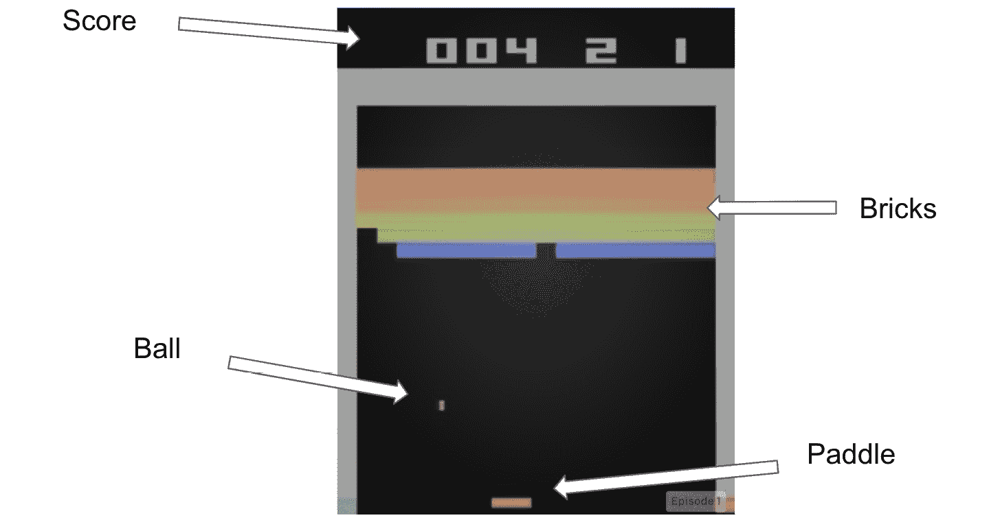

图 10.1: 《打砖块》游戏截图

OpenAI 的`gym`包提供了一个模拟此游戏的环境，允许深度强化学习智能体在其上进行训练和游戏。我们将使用的环境名称是`BreakoutDeterministic-v4`。下面是该环境的一些基本代码实现。

在能够训练智能体玩这个游戏之前，你需要从`gym`包中加载《打砖块》环境。为此，我们将使用以下代码片段：

```py
import gym
env = gym.make('BreakoutDeterministic-v4')
```

这是一个确定性游戏，智能体选择的动作每次都会按预期发生，并且具有`4`的帧跳跃率。帧跳跃指的是在执行新动作之前，一个动作会被重复多少帧。

该游戏包括四个确定性的动作，如以下代码所示：

```py
env.action_space
```

以下是代码的输出结果：

```py
Discrete(4)
```

观察空间是一个大小为`210` x `160`的彩色图像（包含`3`个通道）：

```py
env.observation_space
```

以下是代码的输出结果：

```py
Box(210, 160, 3)
```

要初始化游戏并获取第一个初始状态，我们需要调用`.reset()`方法，代码如下所示：

```py
state = env.reset()
```

从动作空间中采样一个动作（即从所有可能的动作中随机选择一个），我们可以使用`.sample()`方法：

```py
action = env.action_space.sample()
```

最后，要执行一个动作并获取其从环境中返回的结果，我们需要调用`.step()`方法：

```py
new_state, reward, is_done, info = env.step(action)
```

以下截图展示的是执行一个动作后的环境状态的`new_state`结果：

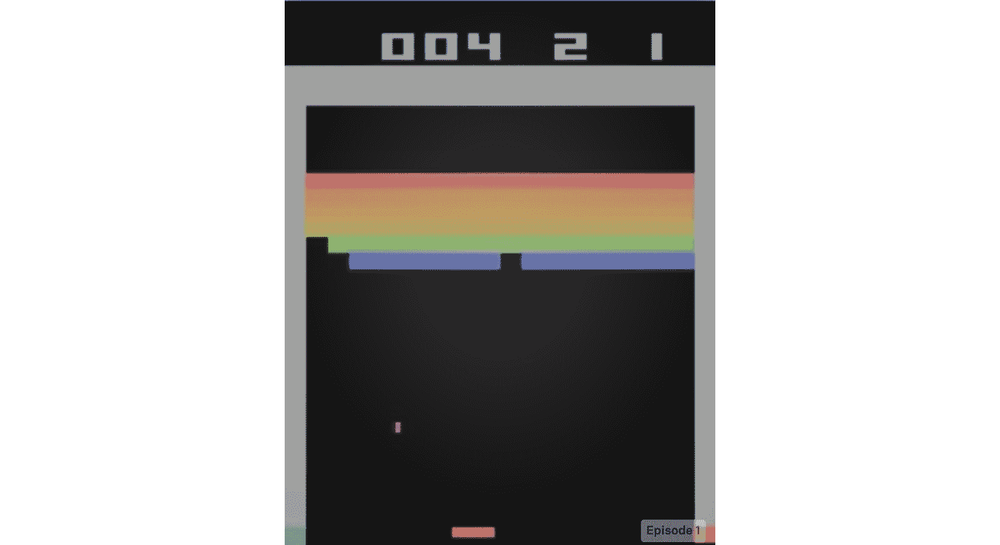

图 10.2: 执行动作后的新状态结果

`.step()`方法返回四个不同的对象：

+   由前一个动作产生的新环境状态。

+   与前一个动作相关的奖励。

+   一个标志，指示在前一个动作之后游戏是否已经结束（无论是胜利还是游戏结束）。

+   来自环境的其他信息。正如 OpenAI 的说明所述，这些信息不能用于训练智能体。

在完成了一些关于 OpenAI 中《打砖块》游戏的基本代码实现后，接下来我们将进行第一次练习，让我们的智能体来玩这个游戏。

## 练习 10.01: 使用随机智能体玩《打砖块》

在本练习中，我们将实现一些用于玩 Breakout 游戏的函数，这些函数将在本章剩余部分中非常有用。我们还将创建一个随机动作的智能体：

1.  打开一个新的 Jupyter Notebook 文件并导入`gym`库：

    ```py
    import gym
    ```

1.  创建一个名为`RandomAgent`的类，该类接收一个名为`env`的输入参数，即游戏环境。该类将拥有一个名为`get_action()`的方法，该方法将从环境中返回一个随机动作：

    ```py
    class RandomAgent():
        def __init__(self, env):
            self.env = env
        def get_action(self, state):
            return self.env.action_space.sample()
    ```

1.  创建一个名为`initialize_env()`的函数，该函数将返回给定输入环境的初始状态，一个对应于完成标志初始值的`False`值，以及作为初始奖励的`0`：

    ```py
    def initialize_env(env):
        initial_state = env.reset()
        initial_done_flag = False
        initial_rewards = 0
        return initial_state, initial_done_flag, initial_rewards
    ```

1.  创建一个名为`play_game()`的函数，该函数接收一个智能体、一个状态、一个完成标志和一个奖励列表作为输入。该函数将返回收到的总奖励。`play_game()`函数将在完成标志为`True`之前进行迭代。在每次迭代中，它将执行以下操作：从智能体获取一个动作，在环境中执行该动作，累计收到的奖励，并为下一状态做准备：

    ```py
    def play_game(agent, state, done, rewards):
        while not done:
            action = agent.get_action(state)
            next_state, reward, done, _ = env.step(action)
            state = next_state
            rewards += reward
        return rewards
    ```

1.  创建一个名为`train_agent()`的函数，该函数接收一个环境、一个游戏轮数和一个智能体作为输入。该函数将从`collections`包中创建一个`deque`对象，并根据提供的轮数进行迭代。在每次迭代中，它将执行以下操作：使用`initialize_env()`初始化环境，使用`play_game()`玩游戏，并将收到的奖励追加到`deque`对象中。最后，它将打印游戏的平均得分：

    ```py
    def train_agent(env, episodes, agent):
        from collections import deque
        import numpy as np
        scores = deque(maxlen=100)
        for episode in range(episodes)
            state, done, rewards = initialize_env(env)
            rewards = play_game(agent, state, done, rewards)
            scores.append(rewards)
        print(f"Average Score: {np.mean(scores)}")
    ```

1.  使用`gym.make()`函数实例化一个名为`env`的 Breakout 环境：

    ```py
    env = gym.make('BreakoutDeterministic-v4')
    ```

1.  实例化一个名为`agent`的`RandomAgent`对象：

    ```py
    agent = RandomAgent(env)
    ```

1.  创建一个名为`episodes`的变量，并将其值设置为`10`：

    ```py
    episodes = 10
    ```

1.  通过提供`env`、轮次和智能体来调用`train_agent`函数：

    ```py
    train_agent(env, episodes, agent)
    ```

    在训练完智能体后，你将期望达到以下分数（由于游戏的随机性，你的分数可能略有不同）：

    ```py
    Average Score: 0.6
    ```

随机智能体在 10 轮游戏后取得了较低的分数，即 0.6。我们会认为当智能体的得分超过 10 时，它已经学会了玩这个游戏。然而，由于我们使用的游戏轮数较少，我们还没有达到得分超过 10 的阶段。然而，在这一阶段，我们已经创建了一些玩 Breakout 游戏的函数，接下来我们将重用并更新这些函数。

注意

要访问此部分的源代码，请参考[`packt.live/30CfVeH`](https://packt.live/30CfVeH)。

你也可以在网上运行此示例，网址为[`packt.live/3hi12nU`](https://packt.live/3hi12nU)。

在下一节中，我们将学习 CNN 模型以及如何在 TensorFlow 中构建它们。

# TensorFlow 中的 CNN

CNN 是一种深度学习架构，在计算机视觉任务中取得了惊人的成果，如图像分类、目标检测和图像分割。自动驾驶汽车是这种技术的实际应用示例。

CNN 的主要元素是卷积操作，其中通过将滤波器应用于图像的不同部分来检测特定的模式，并生成特征图。特征图可以看作是一个突出显示检测到的模式的图像，如下例所示：

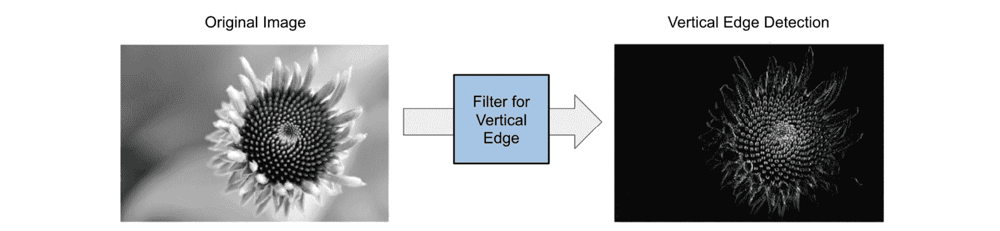

图 10.3：垂直边缘特征图示例

CNN 由多个卷积层组成，每个卷积层使用不同的滤波器进行卷积操作。CNN 的最后几层通常是一个或多个全连接层，负责为给定数据集做出正确的预测。例如，训练用于预测数字图像的 CNN 的最后一层将是一个包含 10 个神经元的全连接层。每个神经元将负责预测每个数字（0 到 9）的发生概率：

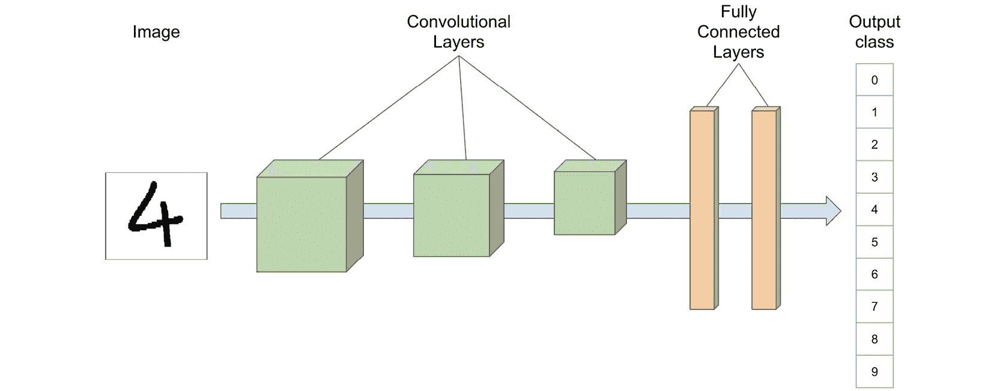

图 10.4：用于分类数字图像的 CNN 架构示例

使用 TensorFlow 构建 CNN 模型非常简单，这要归功于 Keras API。要定义一个卷积层，我们只需要使用`Conv2D()`类，如以下代码所示：

```py
from tensorflow.keras.layers import Conv2D
Conv2D(128, kernel_size=(3, 3), activation="relu")
```

在前面的例子中，我们创建了一个具有`128`个`3x3`大小的滤波器（或内核）的卷积层，并使用`relu`作为激活函数。

注意

在本章中，我们将使用 ReLU 激活函数来构建 CNN 模型，因为它是最具性能的激活函数之一。

要定义一个全连接层，我们将使用`Dense()`类：

```py
from tensorflow.keras.layers import Dense
Dense(units=10, activation='softmax')
```

在 Keras 中，我们可以使用`Sequential()`类来创建一个多层 CNN：

```py
import tensorflow as tf
from tensorflow.keras.layers import Conv2D, Dense
model = tf.keras.Sequential()
model.add(Conv2D(128, kernel_size=(3, 3), activation="relu"), \
          input_shape=(100, 100, 3))
model.add(Conv2D(128, kernel_size=(3, 3), activation="relu"))
model.add(Dense(units=100, activation="relu"))
model.add(Dense(units=10, activation="softmax"))
```

请注意，您只需要为第一个卷积层提供输入图像的维度。定义完模型的各层后，您还需要通过提供损失函数、优化器和要显示的度量标准来编译模型：

```py
model.compile(loss='sparse_categorical_crossentropy', \
              optimizer="adam", metrics=['accuracy'])
```

最后，最后一步是用训练集和指定数量的`epochs`来训练 CNN：

```py
model.fit(features_train, label_train, epochs=5)
```

TensorFlow 中的另一个有用方法是`tf.image.rgb_to_grayscale()`，它用于将彩色图像转换为灰度图像：

```py
img = tf.image.rgb_to_grayscale(img)
```

要调整输入图像的大小，我们将使用`tf.image.resize()`方法：

```py
img = tf.image.resize(img, [50, 50])
```

现在我们知道如何构建 CNN 模型，接下来让我们在以下练习中将其付诸实践。

## 练习 10.02：使用 TensorFlow 设计 CNN 模型

在本次练习中，我们将使用 TensorFlow 设计一个 CNN 模型。该模型将用于我们在*活动 10.01*中使用的 DQN 代理，*使用 CNN 训练 DQN 玩打砖块游戏*，我们将在其中训练这个模型玩打砖块游戏。执行以下步骤来实现这个练习：

1.  打开一个新的 Jupyter Notebook 文件并导入`tensorflow`包：

    ```py
    import tensorflow as tf
    ```

1.  从`tensorflow.keras.models`导入`Sequential`类：

    ```py
    from tensorflow.keras.models import Sequential
    ```

1.  实例化一个顺序模型并将其保存到变量`model`中：

    ```py
    model = Sequential()
    ```

1.  从`tensorflow.keras.layers`导入`Conv2D`类：

    ```py
    from tensorflow.keras.layers import Conv2D
    ```

1.  使用`Conv2D`实例化一个卷积层，设置`32`个大小为`8`的滤波器，步幅为 4x4，激活函数为 relu，输入形状为（`84`，`84`，`1`）。这些维度与 Breakout 游戏屏幕的大小有关。将其保存到变量`conv1`中：

    ```py
    conv1 = Conv2D(32, 8, (4,4), activation='relu', \
                   padding='valid', input_shape=(84, 84, 1))
    ```

1.  使用`Conv2D`实例化第二个卷积层，设置`64`个大小为`4`的滤波器，步幅为 2x2，激活函数为`relu`。将其保存到变量`conv2`中：

    ```py
    conv2 = Conv2D(64, 4, (2,2), activation='relu', \
                   padding='valid')
    ```

1.  使用`Conv2D`实例化第三个卷积层，设置`64`个大小为`3`的滤波器，步幅为 1x1，激活函数为`relu`。将其保存到变量`conv3`中：

    ```py
    conv3 = Conv2D(64, 3, (1,1), activation='relu', padding='valid')
    ```

1.  通过`add()`方法将三个卷积层添加到模型中：

    ```py
    model.add(conv1)
    model.add(conv2)
    model.add(conv3)
    ```

1.  从`tensorflow.keras.layers`导入`Flatten`类。这个类将调整卷积层输出的大小，转化为一维向量：

    ```py
    from tensorflow.keras.layers import Flatten
    ```

1.  通过`add()`方法将一个实例化的`Flatten`层添加到模型中：

    ```py
    model.add(Flatten())
    ```

1.  从`tensorflow.keras.layers`导入`Dense`类：

    ```py
    from tensorflow.keras.layers import Dense
    ```

1.  使用`256`个单元实例化一个全连接层，并将激活函数设置为`relu`：

    ```py
    fc1 = Dense(256, activation='relu')
    ```

1.  使用`4`个单元实例化一个全连接层，这与 Breakout 游戏中可能的操作数量相对应：

    ```py
    fc2 = Dense(4)
    ```

1.  通过`add()`方法将两个全连接层添加到模型中：

    ```py
    model.add(fc1)
    model.add(fc2)
    ```

1.  从`tensorflow.keras.optimizers`导入`RMSprop`类：

    ```py
    from tensorflow.keras.optimizers import RMSprop
    ```

1.  使用`0.00025`作为学习率实例化一个`RMSprop`优化器：

    ```py
    optimizer=RMSprop(lr=0.00025)
    ```

1.  通过在`compile`方法中指定`mse`作为损失函数，`RMSprop`作为优化器，`accuracy`作为训练期间显示的指标，来编译模型：

    ```py
    model.compile(loss='mse', optimizer=optimizer, \
                  metrics=['accuracy'])
    ```

1.  使用`summary`方法打印模型的摘要：

    ```py
    model.summary()
    ```

    以下是代码的输出：

    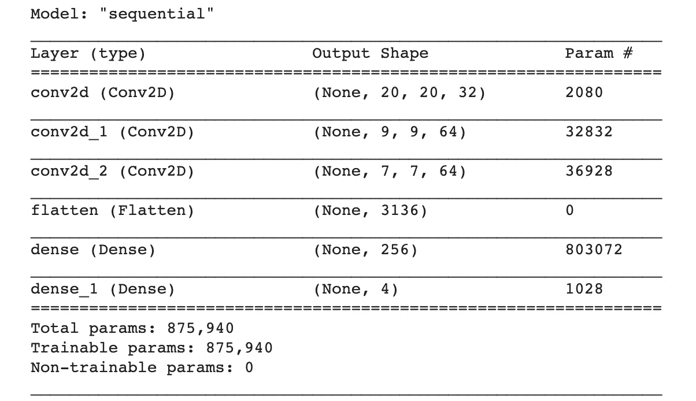

图 10.5：CNN 模型摘要

输出显示了我们刚刚构建的模型的架构，包括不同的层以及在模型训练过程中使用的参数数量。

注意

要访问此特定部分的源代码，请参考[`packt.live/2YrqiiZ`](https://packt.live/2YrqiiZ)。

你也可以在[`packt.live/3fiNMxE`](https://packt.live/3fiNMxE)上在线运行这个示例。

我们已经设计了一个包含三个卷积层的 CNN 模型。在接下来的部分，我们将看到如何将这个模型与 DQN 代理结合使用。

# 将 DQN 与 CNN 结合

人类通过视觉玩视频游戏。他们观察屏幕，分析情况，并决定最合适的行动。在视频游戏中，屏幕上可能会发生许多事情，因此能够看到所有这些模式可以在游戏中提供显著的优势。将 DQN 与 CNN 结合，可以帮助强化学习智能体根据特定情况学习采取正确的行动。

不仅仅使用全连接层，DQN 模型还可以通过卷积层作为输入来扩展。模型将能够分析输入图像，找到相关模式，并将它们输入到负责预测 Q 值的全连接层，如下所示：

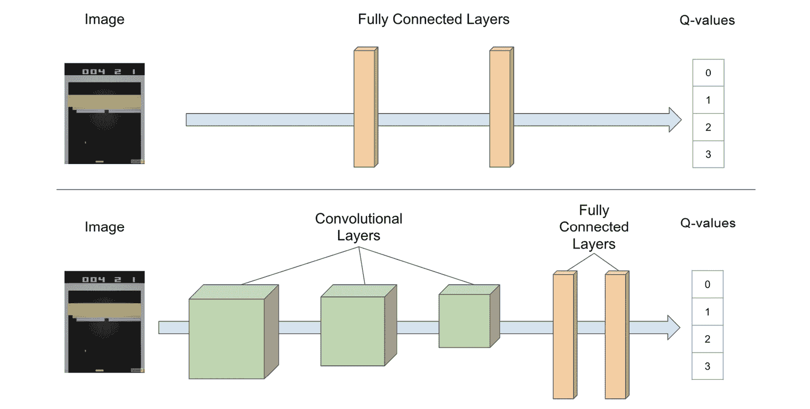

图 10.6：普通 DQN 与结合卷积层的 DQN 之间的区别

添加卷积层有助于智能体更好地理解环境。我们将在接下来的活动中构建的 DQN 智能体将使用*练习 10.02*中的 CNN 模型，*使用 TensorFlow 设计 CNN 模型*，以输出给定状态的 Q 值。但我们将使用两个模型，而不是单一模型。这两个模型将共享完全相同的架构。

第一个模型将负责预测玩游戏时的 Q 值，而第二个模型（称为目标模型）将负责学习应当是什么样的最优 Q 值。这种技术帮助目标模型更快地收敛到最优解。

## 活动 10.01：训练 DQN 与 CNN 一起玩 Breakout

在本活动中，我们将构建一个带有额外卷积层的 DQN，并训练它使用 CNN 玩 Breakout 游戏。我们将为智能体添加经验回放。我们需要预处理图像，以便为 Breakout 游戏创建四张图像的序列。

以下指令将帮助你完成此任务：

1.  导入相关的包（`gym`、`tensorflow`、`numpy`）。

1.  对训练集和测试集进行重塑。

1.  创建一个包含`build_model()`方法的 DQN 类，该方法将实例化一个由`get_action()`方法组成的 CNN 模型，`get_action()`方法将应用 epsilon-greedy 算法选择要执行的动作，`add_experience()`方法将存储通过玩游戏获得的经验，`replay()`方法将执行经验回放，通过从记忆中抽样经验并训练 DQN 模型，`update_epsilon()`方法将逐渐减少 epsilon 值以适应 epsilon-greedy 算法。

1.  使用`initialize_env()`函数通过返回初始状态、`False`表示任务未完成标志、以及`0`作为初始奖励来初始化环境。

1.  创建一个名为`preprocess_state()`的函数，该函数将对图像执行以下预处理：裁剪图像以去除不必要的部分，将图像转换为灰度图像，并将图像调整为正方形。

1.  创建一个名为`play_game()`的函数，该函数将在游戏结束前持续进行游戏，然后存储经验和累积的奖励。

1.  创建一个名为`train_agent()`的函数，该函数将通过多个回合进行迭代，代理将在每回合中玩游戏并进行经验回放。

1.  实例化一个 Breakout 环境并训练一个 DQN 代理进行`50`个回合的游戏。请注意，由于我们正在训练较大的模型，这一步骤可能需要更长时间才能完成。

    预期输出将接近这里显示的结果。由于游戏的随机性以及 epsilon-greedy 算法选择执行动作时的随机性，您可能会看到略有不同的值：

    ```py
    [Episode 0] - Average Score: 3.0
    Average Score: 0.59
    ```

    注意

    本次活动的解答可以在第 752 页找到。

在下一节中，我们将看到如何通过另一种深度学习架构来扩展这个模型：RNN。

# TensorFlow 中的 RNN

在上一节中，我们展示了如何将卷积神经网络（CNN）集成到深度 Q 网络（DQN）模型中，以提高强化学习代理的性能。我们添加了一些卷积层，作为 DQN 模型的全连接层的输入。这些卷积层帮助模型分析游戏环境中的视觉模式，并做出更好的决策。

然而，使用传统的 CNN 方法有一个局限性。CNN 只能分析单张图像。而在玩像 Breakout 这样的电子游戏时，分析图像序列要比分析单张图像更有力，因为它有助于理解球的运动轨迹。这就是 RNN 发挥作用的地方：

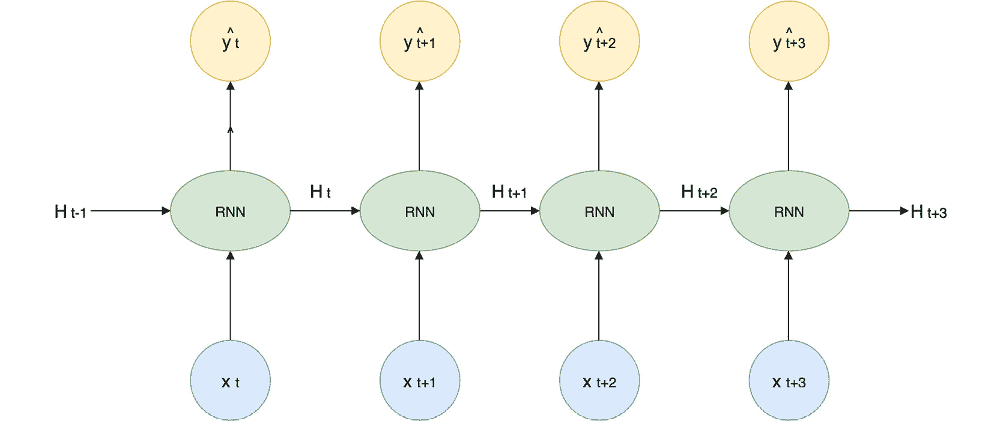

图 10.7：RNN 的序列化

RNN 是神经网络的一种特定架构，它处理一系列输入。它们在自然语言处理领域非常流行，用于处理语料库中的文本，例如语音识别、聊天机器人或文本翻译。文本可以被定义为一系列相互关联的单词。仅凭单个单词很难判断一个句子或段落的主题。你必须查看多个单词的序列，才能做出猜测。

有不同类型的 RNN 模型，其中最流行的是**门控循环单元**（**GRU**）和**长短期记忆**（**LSTM**）。这两种模型都有记忆功能，可以记录模型已经处理过的不同输入（例如，句子的前五个单词），并将它们与新的输入（如句子的第六个单词）结合起来。

在 TensorFlow 中，我们可以按照如下方式构建一个包含`10`个单元的`LSTM`层：

```py
from tensorflow.keras.layers import LSTM
LSTM(10, activation='tanh', recurrent_activation='sigmoid')
```

Sigmoid 激活函数是 RNN 模型中最常用的激活函数。

定义`GRU`层的语法与此非常相似：

```py
from tensorflow.keras.layers import GRU
GRU(10, activation='tanh', recurrent_activation='sigmoid')
```

在 Keras 中，我们可以使用 `Sequential()` 类来创建一个多层 LSTM：

```py
import tensorflow as tf
from tensorflow.keras.layers import LSTM, Dense
model = tf.keras.Sequential()
model.add(LSTM(128, activation='tanh', \
               recurrent_activation='sigmoid'))
model.add(Dense(units=100, activation="relu")))
model.add(Dense(units=10, activation="softmax"))
```

在拟合模型之前，你需要通过提供损失函数、优化器和要显示的度量标准来编译它：

```py
model.compile(loss='sparse_categorical_crossentropy', \
              optimizer="adam", metrics=['accuracy'])
```

我们之前已经看到如何定义 LSTM 层，但为了将其与 CNN 模型结合使用，我们需要在 TensorFlow 中使用一个名为 `TimeDistributed()` 的封装类。该类用于将相同的指定层应用到输入张量的每个时间步，如下所示：

```py
TimeDistributed(Dense(10))
```

在前面的示例中，完全连接的层被应用到接收到的每个时间步。在我们的案例中，我们希望在将图像序列输入到 LSTM 模型之前，先对每个图像应用卷积层。为了构建这样的序列，我们需要将多个图像堆叠在一起，以便 RNN 模型可以将其作为输入。现在，让我们进行一个练习，设计一个 CNN 和 RNN 模型的组合。

## 练习 10.03：设计一个结合 CNN 和 RNN 模型的 TensorFlow 组合

在这个练习中，我们将设计一个结合了 CNN 和 RNN 的模型，该模型将被我们的 DRQN 代理用于 *活动 10.02，训练 DRQN 玩 Breakout*，以玩 Breakout 游戏：

1.  打开一个新的 Jupyter Notebook 并导入 `tensorflow` 包：

    ```py
    import tensorflow as tf
    ```

1.  从 `tensorflow.keras.models` 导入 `Sequential` 类：

    ```py
    from tensorflow.keras.models import Sequential
    ```

1.  实例化一个 `sequential` 模型，并将其保存到名为 `model` 的变量中：

    ```py
    model = Sequential()
    ```

1.  从 `tensorflow.keras.layers` 导入 `Conv2D` 类：

    ```py
    from tensorflow.keras.layers import Conv2D
    ```

1.  使用 `Conv2D` 实例化一个卷积层，该层具有 `32` 个大小为 `8` 的滤波器，步长为 `4` x `4`，激活函数为 `relu`。并将其保存到名为 `conv1` 的变量中：

    ```py
    conv1 = Conv2D(32, 8, (4,4), activation='relu', \
                   padding='valid', input_shape=(84, 84, 1))
    ```

1.  使用 `Conv2D` 实例化第二个卷积层，该层具有 `64` 个大小为 `4` 的滤波器，步长为 `2` x `2`，激活函数为 `relu`。并将其保存到名为 `conv2` 的变量中：

    ```py
    conv2 = Conv2D(64, 4, (2,2), activation='relu', \
                   padding='valid')
    ```

1.  使用 `Conv2D` 实例化第三个卷积层，该层具有 `64` 个大小为 `3` 的滤波器，步长为 `1` x `1`，激活函数为 `relu`。并将其保存到名为 `conv3` 的变量中：

    ```py
    conv3 = Conv2D(64, 3, (1,1), activation='relu', \
                   padding='valid')
    ```

1.  从 `tensorflow.keras.layers` 导入 `TimeDistributed` 类：

    ```py
    from tensorflow.keras.layers import TimeDistributed
    ```

1.  实例化一个时间分布层，该层将 `conv1` 作为输入，输入形状为 (`4`, `84`, `84`, `1`)。并将其保存到一个名为 `time_conv1` 的变量中：

    ```py
    time_conv1 = TimeDistributed(conv1, input_shape=(4, 84, 84, 1))
    ```

1.  实例化第二个时间分布层，该层将 `conv2` 作为输入，并将其保存到名为 `time_conv2` 的变量中：

    ```py
    time_conv2 = TimeDistributed(conv2)
    ```

1.  实例化第三个时间分布层，该层将 `conv3` 作为输入，并将其保存到名为 `time_conv3` 的变量中：

    ```py
    time_conv3 = TimeDistributed(conv3)
    ```

1.  使用 `add()` 方法将三个时间分布层添加到模型中：

    ```py
    model.add(time_conv1)
    model.add(time_conv2)
    model.add(time_conv3)
    ```

1.  从 `tensorflow.keras.layers` 导入 `Flatten` 类：

    ```py
    from tensorflow.keras.layers import Flatten
    ```

1.  实例化一个时间分布层，该层将 `Flatten()` 层作为输入，并将其保存到名为 `time_flatten` 的变量中：

    ```py
    time_flatten = TimeDistributed(Flatten())
    ```

1.  使用 `add()` 方法将 `time_flatten` 层添加到模型中：

    ```py
    model.add(time_flatten)
    ```

1.  从 `tensorflow.keras.layers` 导入 `LSTM` 类：

    ```py
    from tensorflow.keras.layers import LSTM
    ```

1.  实例化一个具有 `512` 单元的 LSTM 层，并将其保存到名为 `lstm` 的变量中：

    ```py
    lstm = LSTM(512)
    ```

1.  使用 `add()` 方法将 LSTM 层添加到模型中：

    ```py
    model.add(lstm)
    ```

1.  从 `tensorflow.keras.layers` 导入 `Dense` 类：

    ```py
    from tensorflow.keras.layers import Dense
    ```

1.  实例化一个包含 `128` 个单元且激活函数为 `relu` 的全连接层：

    ```py
    fc1 = Dense(128, activation='relu')
    ```

1.  使用 `4` 个单元实例化一个全连接层：

    ```py
    fc2 = Dense(4)
    ```

1.  使用 `add()` 方法将两个全连接层添加到模型中：

    ```py
    model.add(fc1)
    model.add(fc2)
    ```

1.  从 `tensorflow.keras.optimizers` 导入 `RMSprop` 类：

    ```py
    from tensorflow.keras.optimizers import RMSprop
    ```

1.  使用学习率为 `0.00025` 的 `RMSprop` 实例：

    ```py
    optimizer=RMSprop(lr=0.00025)
    ```

1.  通过在 `compile` 方法中指定 `mse` 作为损失函数，`RMSprop` 作为优化器，以及 `accuracy` 作为在训练期间显示的度量，来编译模型：

    ```py
    model.compile(loss='mse', optimizer=optimizer, \
                  metrics=['accuracy'])
    ```

1.  使用 `summary` 方法打印模型摘要：

    ```py
    model.summary()
    ```

    以下是代码输出：

    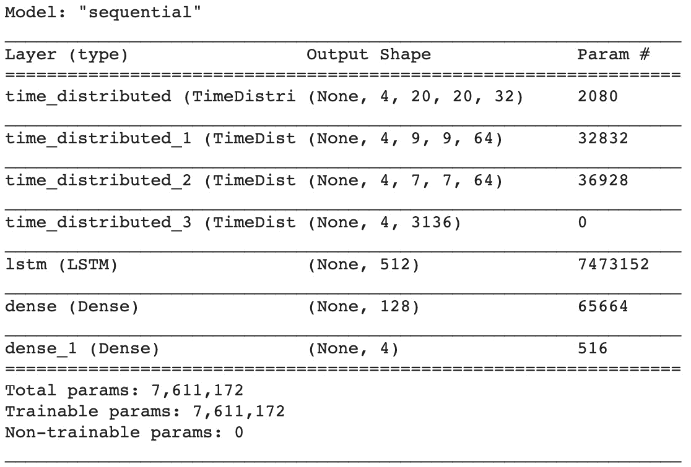

图 10.8：CNN+RNN 模型摘要

我们已经成功地将 CNN 模型与 RNN 模型结合。前面的输出展示了我们刚刚构建的模型架构，其中包含不同的层和在训练过程中使用的参数数量。该模型以四张图像的序列作为输入，并将其传递给 RNN，RNN 会分析它们之间的关系，然后将结果传递给全连接层，全连接层将负责预测 Q 值。

注意

要查看该部分的源代码，请访问 [`packt.live/2UDB3h4`](https://packt.live/2UDB3h4)。

你也可以在线运行这个示例，访问 [`packt.live/3dVrf9T`](https://packt.live/3dVrf9T)。

现在我们知道如何构建一个 RNN，我们可以将这个技术与 DQN 模型结合。这样的模型被称为 DRQN，我们将在下一节中探讨这个模型。

# 构建 DRQN

DQN 可以从 RNN 模型中受益，RNN 可以帮助处理序列图像。这种架构被称为 **深度递归 Q 网络** (**DRQN**)。将 GRU 或 LSTM 模型与 CNN 模型结合，将使强化学习代理能够理解球的运动。为了实现这一点，我们只需在卷积层和全连接层之间添加一个 LSTM（或 GRU）层，如下图所示：

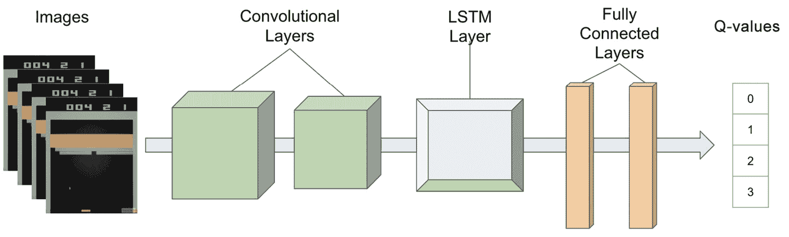

图 10.9：DRQN 架构

为了将图像序列输入到 RNN 模型中，我们需要将多张图像堆叠在一起。对于 Breakout 游戏，在初始化环境之后，我们需要获取第一张图像并将其复制多次，以形成第一组初始图像序列。完成后，在每次动作后，我们可以将最新的图像附加到序列中，并移除最旧的图像，从而保持序列大小不变（例如，最大四张图像的序列）。

## 活动 10.02：训练 DRQN 玩 Breakout 游戏

在本活动中，我们将通过替换*活动 10.01*中的 DQN 模型来构建一个 DRQN 模型，*使用 CNN 训练 DQN 玩 Breakout 游戏*。然后，我们将训练 DRQN 模型来玩 Breakout 游戏，并分析智能体的性能。以下说明将帮助您完成本活动：

1.  导入相关的包（`gym`、`tensorflow`、`numpy`）。

1.  重塑训练集和测试集。

1.  创建`DRQN`类，并包含以下方法：`build_model()`方法用于实例化一个结合 CNN 和 RNN 的模型，`get_action()`方法用于应用 epsilon-greedy 算法选择要执行的动作，`add_experience()`方法用于将游戏过程中获得的经验存储在记忆中，`replay()`方法通过从记忆中采样经验进行经验回放，并每两轮保存一次模型，`update_epsilon()`方法用于逐渐减少 epsilon-greedy 中的 epsilon 值。

1.  使用`initialize_env()`函数来训练智能体，该函数通过返回初始状态、`False`的 done 标志和`0`作为初始奖励来初始化环境。

1.  创建一个名为`preprocess_state()`的函数，对图像进行以下预处理：裁剪图像以去除不必要的部分，将图像转换为灰度图像，然后将图像调整为方形。

1.  创建一个名为`combine_images()`的函数，用于堆叠一系列图像。

1.  创建一个名为`play_game()`的函数，该函数将玩一局游戏直到结束，然后存储经验和累积奖励。

1.  创建一个名为`train_agent()`的函数，该函数将通过多轮训练让智能体玩游戏并执行经验回放。

1.  实例化一个 Breakout 环境，并训练一个`DRQN`智能体进行`200`轮游戏。

    注意

    我们建议训练 200 轮（或 400 轮），以便正确训练模型并获得良好的性能，但这可能需要几个小时，具体取决于系统配置。或者，您可以减少训练轮数，这会减少训练时间，但会影响智能体的性能。

预期的输出结果将接近此处显示的内容。由于游戏的随机性和 epsilon-greedy 算法在选择动作时的随机性，您可能会得到稍微不同的值：

```py
[Episode 0] - Average Score: 0.0
[Episode 50] - Average Score: 0.43137254901960786
[Episode 100] - Average Score: 0.4
[Episode 150] - Average: 0.54
Average Score: 0.53
```

注意

本活动的解决方案可以在第 756 页找到。

在接下来的章节中，我们将看到如何通过将注意力机制添加到 DRQN 中来提高模型的性能，并构建 DARQN 模型。

# **注意力机制和 DARQN 介绍**

在前一部分，我们看到将 RNN 模型添加到 DQN 中有助于提高其性能。RNN 因处理序列数据（如时间信息）而闻名。在我们的案例中，我们使用了 CNN 和 RNN 的组合，帮助我们的强化学习智能体更好地理解来自游戏的图像序列。

然而，RNN 模型在分析长序列输入或输出数据时确实存在一些局限性。为了解决这一问题，研究人员提出了一种叫做注意力机制的技术，这也是**深度注意力递归 Q 网络**（**DARQN**）的核心技术。DARQN 模型与 DRQN 模型相同，只是增加了一个注意力机制。为了更好地理解这个概念，我们将通过一个应用实例：神经翻译。神经翻译是将文本从一种语言翻译成另一种语言的领域，例如将莎士比亚的戏剧（原文为英语）翻译成法语。

序列到序列模型最适合此类任务。它们包括两个组件：编码器和解码器。它们都是 RNN 模型，如 LSTM 或 GRU 模型。编码器负责处理输入数据中的一系列词语（在我们之前的例子中，这将是一个英语单词的句子），并生成一个被称为上下文向量的编码版本。解码器将这个上下文向量作为输入，并预测相关的输出序列（在我们的例子中是法语单词的句子）：

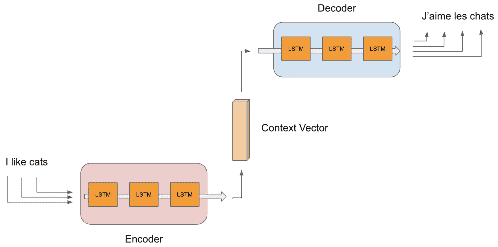

图 10.10: 序列到序列模型

上下文向量的大小是固定的。它是输入序列的编码版本，只包含相关信息。你可以将它视为输入数据的总结。然而，这个向量的固定大小限制了模型从长序列中保留足够相关信息的能力。它往往会“遗忘”序列中的早期元素。但在翻译的情况下，句子的开头通常包含非常重要的信息，例如其主语。

注意力机制不仅为解码器提供上下文向量，还提供编码器的前一个状态。这使得解码器能够找到前一个状态、上下文向量和所需输出之间的相关关系。在我们的例子中，这有助于理解输入序列中两个远离彼此的元素之间的关系：

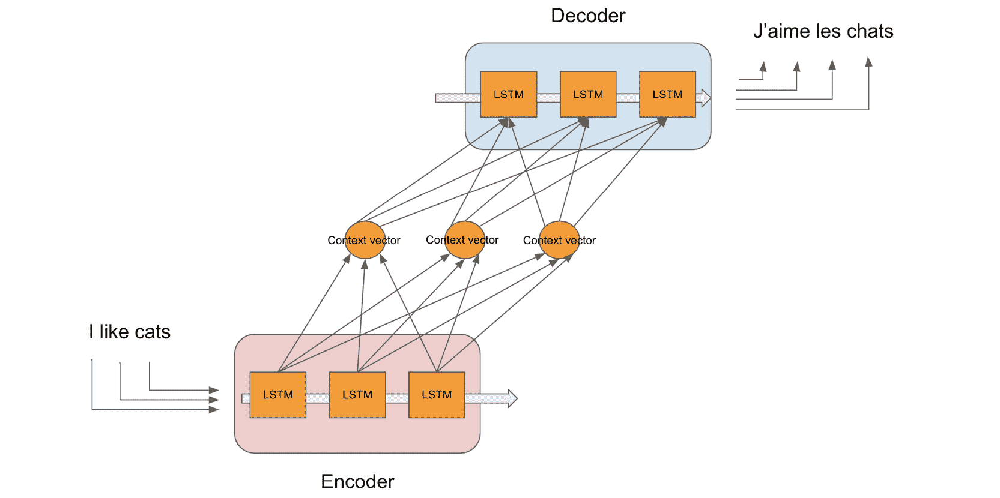

图 10.11: 带有注意力机制的序列到序列模型

TensorFlow 提供了一个`Attention`类。它的输入是一个形状为`[output, states]`的张量。最好通过使用函数式 API 来使用它，其中每个层作为一个函数接受输入并提供输出结果。在这种情况下，我们可以简单地从 GRU 层提取输出和状态，并将它们作为输入提供给注意力层：

```py
from tensorflow.keras.layers import GRU, Attention
out, states = GRU(512, return_sequences=True, \
                  return_state=True)(input)
att = Attention()([out, states])
```

要构建 DARQN 模型，我们只需要将注意力机制添加到 DRQN 模型中。

让我们将这个注意力机制添加到我们之前的 DRQN 代理（在*活动 10.02*，*训练 DRQN 玩 Breakout*中），并在下一个活动中构建 DARQN 模型。

## 活动 10.03：训练 DARQN 玩 Breakout

在本次活动中，我们将通过向之前的 DRQN 中添加一个注意力机制来构建 DARQN 模型（来自*活动 10.02*，*训练 DRQN 玩 Breakout*）。然后，我们将训练该模型来玩 Breakout 游戏，并分析代理的表现。以下说明将帮助你完成此活动：

1.  导入相关的包（`gym`、`tensorflow`和`numpy`）。

1.  重塑训练集和测试集。

1.  创建一个`DARQN`类，包含以下方法：`build_model()`方法，它将实例化一个结合了 CNN 和 RNN 的模型（类似于*练习 10.03*，*使用 TensorFlow 设计 CNN 和 RNN 模型的组合*）；`get_action()`方法，它将应用 epsilon-greedy 算法选择要执行的动作；`add_experience()`方法，用于将游戏中获得的经验存储到内存中；`replay()`方法，它将通过从内存中采样经验并训练 DARQN 模型来执行经验重放，并在每两次回合后保存模型；以及`update_epsilon()`方法，用于逐渐减少 epsilon 值以进行 epsilon-greedy。

1.  使用`initialize_env()`函数初始化环境，返回初始状态，`False`作为 done 标志，以及`0`作为初始奖励。

1.  使用`preprocess_state()`函数对图像进行以下预处理：裁剪图像以去除不必要的部分，转换为灰度图像，并将图像调整为正方形。

1.  创建一个名为`combine_images()`的函数，用于堆叠一系列图像。

1.  使用`play_game()`函数进行游戏直到结束，然后存储经验和累积奖励。

1.  通过若干回合进行迭代，代理将进行游戏并使用`train_agent()`函数执行经验重放。

1.  实例化一个 Breakout 环境并训练一个`DARQN`代理玩这个游戏，共进行`400`个回合。

    注意

    我们建议训练 400 个回合，以便正确训练模型并获得良好的性能，但这可能会根据系统配置花费几个小时。或者，你可以减少回合数，这将减少训练时间，但会影响代理的表现。

输出结果将接近你看到的这里。由于游戏的随机性以及 epsilon-greedy 算法在选择行动时的随机性，你可能会看到略有不同的值：

```py
[Episode 0] - Average Score: 1.0
[Episode 50] - Average Score: 2.4901960784313726
[Episode 100] - Average Score: 3.92
[Episode 150] - Average Score: 7.37
[Episode 200] - Average Score: 7.76
[Episode 250] - Average Score: 7.91
[Episode 300] - Average Score: 10.33
[Episode 350] - Average Score: 10.94
Average Score: 10.83
```

注意

此活动的解答可以在第 761 页找到。

# 摘要

在本章中，我们学习了如何将深度学习技术与 DQN 模型相结合，并训练它来玩 Atari 游戏《Breakout》。我们首先探讨了如何为智能体添加卷积层，以处理来自游戏的截图。这帮助智能体更好地理解游戏环境。

我们进一步改进了模型，在 CNN 模型的输出上添加了一个 RNN。我们创建了一系列图像并将其输入到 LSTM 层。这种顺序模型使得 DQN 智能体能够“可视化”球的方向。这种模型被称为 DRQN。

最后，我们使用了注意力机制并训练了一个 DARQN 模型来玩《Breakout》游戏。该机制帮助模型更好地理解之前相关的状态，并显著提高了其表现。随着新的深度学习技术和模型的设计，该领域仍在不断发展，这些新技术在不断超越上一代模型的表现。

在下一章，你将接触到基于策略的方法和演员-评论员模型，该模型由多个子模型组成，负责根据状态计算行动并计算 Q 值。
