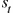

# 第十一章：11\. 基于策略的强化学习方法

概述

在本章中，我们将实现不同的基于策略的强化学习方法（**RL**），如策略梯度法、**深度确定性策略梯度**（**DDPGs**）、**信任区域策略优化**（**TRPO**）和**近端策略优化**（**PPO**）。你将了解一些算法背后的数学原理，还将学习如何在 OpenAI Gym 环境中为 RL 智能体编写策略代码。在本章结束时，你不仅将对基于策略的强化学习方法有一个基础的理解，而且还将能够使用前面提到的基于策略的 RL 方法创建完整的工作原型。

# 介绍

本章的重点是基于策略的强化学习方法（RL）。然而，在正式介绍基于策略的强化学习方法之前，我们先花些时间理解它们背后的动机。让我们回到几百年前，那时地球大部分地方还未被探索，地图也不完整。那个时候，勇敢的水手们凭借坚定的勇气和不屈的好奇心航行在广阔的海洋上。但是，他们在辽阔的海洋中并非完全盲目。他们仰望夜空寻找方向。夜空中的星星和行星引导着他们走向目的地。不同时间和地点看到的夜空是不同的。正是这些信息，加上精确的夜空地图，指引着这些勇敢的探险家们到达目的地，有时甚至是未知的、未标记的土地。

现在，你可能会问这个故事与强化学习有什么关系。那些水手们并非总是能够获得夜空的地图。这些地图是由环球旅行者、水手、天文爱好者和天文学家们经过数百年创造的。水手们实际上曾经一度在盲目中航行。他们在夜间观察星星，每次转弯时，他们都会标记自己相对于星星的位置。当到达目的地时，他们会评估每个转弯，并找出哪些转弯在航行过程中更为有效。每一艘驶向相同目的地的船只也可以做同样的事情。随着时间的推移，他们对哪些转弯在相对于船只在海上的位置，结合夜空中星星的位置，能更有效地到达目的地有了较为清晰的评估。你可以把它看作是在计算价值函数，通过这种方式，你能知道最优的即时动作。但一旦水手们拥有了完整的夜空地图，他们就可以简单地推导出一套策略，带领他们到达目的地。

你可以将大海和夜空视为环境，而将水手视为其中的智能体。在几百年的时间里，我们的智能体（水手）建立了对环境的模型，从而能够得出一个价值函数（计算船只相对位置），进而引导他们采取最佳的即时行动步骤（即时航行步骤），并帮助他们建立了最佳策略（完整的航行路线）。

在上一章中，你学习了**深度递归 Q 网络**（**DRQN**）及其相较于简单深度 Q 网络的优势。你还为非常流行的雅达利电子游戏*Breakout*建模了一个 DRQN 网络。在本章中，你将学习基于策略的强化学习方法。

我们还将学习策略梯度，它将帮助你实时学习模型。接着，我们将了解一种名为 DDPG 的策略梯度技术，以便理解连续动作空间。在这里，我们还将学习如何编写月球着陆模拟（Lunar Lander）代码，使用`OUActionNoise`类、`ReplayBuffer`类、`ActorNetwork`类和`CriticNetwork`类等类来理解 DDPG。我们将在本章后面详细了解这些类。最后，我们将学习如何通过使用 TRPO、PPO 和**优势演员评论家**（**A2C**）技术来改进策略梯度方法。这些技术将帮助我们减少训练模型的运行成本，从而改进策略梯度技术。

让我们从以下小节开始，学习一些基本概念，如基于值的强化学习（RL）、基于模型的强化学习（RL）、演员-评论家方法、动作空间等。

## 值基和模型基强化学习简介

虽然拥有一个良好的环境模型有助于预测某个特定动作相对于其他可能动作是否更好，但你仍然需要评估每一个可能状态下的所有可能动作，以便制定出最佳策略。这是一个非平凡的问题，如果我们的环境是一个仿真，且智能体是**人工智能**（**AI**），那么计算开销也非常大。将基于模型的学习方法应用到仿真中时，可以呈现如下情景。

以*乒乓*（*图 11.1*）为例。（*乒乓*——发布于 1972 年——是雅达利公司制造的第一批街机电子游戏之一。）现在，让我们看看基于模型的学习方法如何有助于为*乒乓*制定最佳策略，并探讨其可能的缺点。那么，假设我们的智能体通过观察游戏环境（即，观察每一帧的黑白像素）学会了如何玩*乒乓*。接下来，我们可以要求智能体根据游戏环境中的某一帧黑白像素来预测下一个可能的状态。但如果环境中有任何背景噪音（例如，背景中播放着一个随机的、无关的视频），我们的智能体也会将其考虑在内。

现在，在大多数情况下，这些背景噪声对我们的规划没有帮助——也就是说，确定最优策略——但仍然会消耗我们的计算资源。以下是*Pong*游戏的截图：


图 11.1：雅达利 Pong 游戏

基于值的方法优于基于模型的方法，因为在执行从一个状态到另一个状态的转换时，基于值的方法只关心每个动作的价值，基于我们为每个动作预测的累积奖励。它会认为任何背景噪声大多是无关紧要的。基于值的方法非常适合推导最优策略。假设你已经学会了一个动作-值函数——一个 Q 函数。那么，你可以简单地查看每个状态下的最高值，这样就能得出最优策略。然而，基于值的函数仍然可能效率低下。让我用一个例子来解释为什么。在从欧洲到北美，或者从南非到印度南部海岸的旅行中，我们的探索船的最优策略可能只是直接前进。然而，船可能会遇到冰山、小岛或洋流，这些可能会暂时偏离航道。它仍然可能是船只前进的最优策略，但值函数可能会任意变化。所以，在这种情况下，基于值的方法会尝试逼近所有这些任意值，而基于策略的方法可以是盲目的，因此在计算成本上可能更高效。因此，在很多情况下，基于值的函数计算最优策略可能效率较低。

## 演员-评论员模型简介

所以，我们简要解释了基于值方法和基于模型方法之间的权衡。现在，我们能否以某种方式结合这两者的优点，创建一个它们的混合模型呢？演员-评论员模型将帮助我们实现这一点。如果我们画出一个维恩图（*图 11.2*），我们会发现演员-评论员模型位于基于值和基于策略的强化学习方法的交集处。它们基本上可以同时学习值函数和策略。我们将在接下来的章节中进一步讨论演员-评论员模型。


图 11.2：不同强化学习方法之间的关系

在实践中，大多数时候，我们尝试基于价值函数所产生的值来学习策略，但实际上我们是同时学习策略和值的。为了结束这部分关于演员-评论家方法的介绍，我想分享一句 Bertrand Russell 的名言。Russell 在他的书《哲学问题》中说：“*我们可以不通过实例推导一般命题，而仅凭一般命题的意义就能理解它，尽管一些实例通常是必需的，用以帮助我们弄清楚一般命题的含义。*” 这句话值得我们思考。关于如何实现演员-评论家模型的代码将在本章后面介绍。接下来，我们将学习动作空间的内容，我们已经在*第一章*《强化学习导论》中涉及了它的基本概念。

在前面的章节中，我们已经介绍了动作空间的基本定义和类型。在这里，我们将快速回顾一下动作空间的概念。动作空间定义了游戏环境的特性。让我们看一下以下图示来理解这些类型：


图 11.3：动作空间

动作空间有两种类型——离散和连续。离散动作空间允许离散的输入——例如，游戏手柄上的按钮。这些离散动作可以向左或向右移动，向上或向下移动，向前或向后移动，等等。

另一方面，连续动作空间允许连续输入——例如，方向盘或摇杆的输入。在接下来的章节中，我们将学习如何将策略梯度应用于连续动作空间。

# 策略梯度

既然我们已经通过上一节中的导航示例阐明了偏好基于策略的方法而非基于价值的方法的动机，那么让我们正式介绍策略梯度。与使用存储缓冲区存储过去经验的 Q 学习不同，策略梯度方法是实时学习的（即它们从最新的经验或动作中学习）。策略梯度的学习是由智能体在环境中遇到的任何情况驱动的。每次梯度更新后，经验都会被丢弃，策略继续前进。让我们看一下我们刚才学到的内容的图示表示：


图 11.4：策略梯度方法的图示解释

一个立即引起我们注意的事情是，策略梯度方法通常比 Q 学习效率低，因为每次梯度更新后，经验都会被丢弃。策略梯度估计器的数学表示如下：


图 11.5：策略梯度估计器的数学表示

在这个公式中， 是随机策略， 是我们在时间点  上的优势估计函数——即所选动作的相对价值估计。期望值，，表示我们算法中有限样本批次的平均值，在其中我们交替进行采样和优化。这里， 是梯度估计器。 和  变量定义了在时间间隔  时的动作和状态。

最后，策略梯度损失定义如下：


图 11.6：策略梯度损失定义

为了计算优势函数，，我们需要 **折扣奖励** 和 **基准估计**。折扣奖励也称为 **回报**，它是我们智能体在当前回合中获得的所有奖励的加权和。之所以称为折扣奖励，是因为它关联了一个折扣因子，优先考虑即时奖励而非长期奖励。 本质上是折扣奖励和基准估计之间的差值。

请注意，如果你在理解这个概念时仍然有问题，那也不是大问题。只需尝试抓住整体概念，最终你会理解完整的概念。话虽如此，我还将向你介绍一个简化版的基础策略梯度算法。

我们首先初始化策略参数，，以及基准值，：

```py
for iteration=1, 2, 3, … do
    Execute the current policy and collect a set of trajectories
    At each timestep in each trajectory, compute
        the return Rt and the advantage estimate .
    Refit the baseline minimizing ,
        summed over all trajectories and timesteps.
    Update the policy using the policy gradient estimate 
end for
```

一个建议是反复浏览算法，并配合初步解释，来更好地理解策略梯度的概念。但再说一次，首先掌握整体的理解才是最重要的。

在实现实际元素之前，请通过 PyPI 安装 OpenAI Gym 和 Box2D 环境（包括如 Lunar Lander 等环境）。要进行安装，请在终端/命令提示符中输入以下命令：

```py
pip install torch==0.4.1
pip install pillow
pip install gym "gym[box2d]"
```

现在，让我们使用策略梯度方法来实现一个练习。

## 练习 11.01：使用策略梯度和演员-评论员方法将航天器着陆在月球表面

在这个练习中，我们将处理一个玩具问题（OpenAI Lunar Lander），并使用基础策略梯度和演员-评论员方法帮助将月球着陆器着陆到 OpenAI Gym Lunar Lander 环境中。以下是实现此练习的步骤：

1.  打开一个新的 Jupyter Notebook，导入所有必要的库（`gym`，`torch` 和 `numpy`）：

    ```py
    import gym
    import torch as T
    import numpy as np
    ```

1.  定义 `ActorCritic` 类：

    ```py
    class ActorCritic(T.nn.Module):
        def __init__(self):
            super(ActorCritic, self).__init__()
            self.transform = T.nn.Linear(8, 128)
            self.act_layer = T.nn.Linear(128, 4) # Action layer
            self.val_layer = T.nn.Linear(128, 1) # Value layer
            self.log_probs = []
            self.state_vals = []
            self.rewards = []
    ```

    因此，在前面代码中初始化 `ActorCritic` 类时，我们正在创建我们的动作和价值网络。我们还创建了空数组来存储对数概率、状态值和奖励。

1.  接下来，创建一个函数，将我们的状态通过各个层并命名为 `forward`：

    ```py
        def forward(self, state):
            state = T.from_numpy(state).float()
            state = T.nn.functional.relu(self.transform(state))
            state_value = self.val_layer(state)
            act_probs = T.nn.functional.softmax\
                        (self.act_layer(state))
            act_dist = T.distributions.Categorical(act_probs)
            action = act_dist.sample()
            self.log_probs.append(act_dist.log_prob(action))
            self.state_vals.append(state_value)
            return action.item()
    ```

    在这里，我们将状态传递通过值层，经过 ReLU 转换后得到状态值。类似地，我们将状态通过动作层，然后使用 softmax 函数得到动作概率。接着，我们将概率转换为离散值以供采样。最后，我们将对数概率和状态值添加到各自的数组中并返回一个动作项。

1.  创建 `computeLoss` 函数，首先计算折扣奖励。这有助于优先考虑即时奖励。然后，我们将按照策略梯度损失方程来计算损失：

    ```py
        def computeLoss(self, gamma=0.99):
            rewards = []
            discounted_reward = 0
            for reward in self.rewards[::-1]:
                discounted_reward = reward + gamma \
                                    * discounted_reward
                rewards.insert(0, discounted_reward)
            rewards = T.tensor(rewards)
            rewards = (rewards – rewards.mean()) / (rewards.std())
            loss = 0
            for log_probability, value, reward in zip\
            (self.log_probs, self.state_vals, rewards):
                advantage = reward – value.item()
                act_loss = -log_probability * advantage
                val_loss = T.nn.functional.smooth_l1_loss\
                           (value, reward)
                loss += (act_loss + val_loss)
            return loss
    ```

1.  接下来，创建一个 `clear` 方法，用于在每回合后清除存储对数概率、状态值和奖励的数组：

    ```py
        def clear(self):
            del self.log_probs[:]
            del self.state_vals[:]
            del self.rewards[:]
    ```

1.  现在，让我们开始编写主代码，这将帮助我们调用之前在练习中定义的类。我们首先分配一个随机种子：

    ```py
    np.random.seed(0)
    ```

1.  然后，我们需要设置我们的环境并初始化我们的策略：

    ```py
    env = gym.make(""LunarLander-v2"")
    policy = ActorCritic()
    optimizer = T.optim.Adam(policy.parameters(), \
                             lr=0.02, betas=(0.9, 0.999))
    ```

1.  最后，我们迭代至少`10000`次以确保适当收敛。在每次迭代中，我们采样一个动作并获取该动作的状态和奖励。然后，我们基于该动作更新我们的策略，并清除我们的观察数据：

    ```py
    render = True
    np.random.seed(0)
    running_reward = 0
    for i in np.arange(0, 10000):
        state = env.reset()
        for t in range(10000):
            action = policy(state)
            state, reward, done, _ = env.step(action)
            policy.rewards.append(reward)
            running_reward += reward
            if render and i > 1000:
                env.render()
            if done:
                break
        print("Episode {}\tReward: {}".format(i, running_reward))
        # Updating the policy
        optimizer.zero_grad()
        loss = policy.computeLoss(0.99)
        loss.backward()
        optimizer.step()
        policy.clear()
        if i % 20 == 0:
            running_reward = running_reward / 20
            running_reward = 0
    ```

    现在，当你运行代码时，你将看到每个回合的运行奖励。以下是前 20 个回合的奖励，总代码为 10,000 回合：

    ```py
    Episode 0	Reward: -320.65657506841114
    Episode 1	Reward: -425.64874914703705
    Episode 2	Reward: -671.2867424162646
    Episode 3	Reward: -1032.281198268248
    Episode 4	Reward: -1224.3354097571892
    Episode 5	Reward: -1543.1792365484055
    Episode 6	Reward: -1927.4910808775028
    Episode 7	Reward: -2023.4599189797761
    Episode 8	Reward: -2361.9002491621986
    Episode 9	Reward: -2677.470775357419
    Episode 10	Reward: -2932.068423127369
    Episode 11	Reward: -3204.4024449864355
    Episode 12	Reward: -3449.3136628102934
    Episode 13	Reward: -3465.3763860613317
    Episode 14	Reward: -3617.162199366013
    Episode 15	Reward: -3736.83983321837
    Episode 16	Reward: -3883.140249551331
    Episode 17	Reward: -4100.137703945375
    Episode 18	Reward: -4303.308164747067
    Episode 19	Reward: -4569.71587308837
    Episode 20	Reward: -4716.304224574078
    ```

    注意

    为了方便展示，这里仅展示了前 20 个回合的输出。

    要访问该特定部分的源代码，请参阅 [`packt.live/3hDibst`](https://packt.live/3hDibst)。

    本部分目前没有在线互动示例，需要在本地运行。

这个输出表示我们的智能体——月球着陆器，已经开始采取行动。负奖励表明一开始，智能体不够聪明，无法采取正确的行动，因此它采取了随机行动，并因此受到了负面奖励。负奖励是惩罚。随着时间的推移，智能体将开始获得正面奖励，因为它开始学习。很快，你会看到游戏窗口弹出，展示月球着陆器的实时进展，如下图所示：


图 11.7：月球着陆器的实时进展

在下一部分，我们将研究 DDPG，它扩展了策略梯度的思想。

# 深度确定性策略梯度

在本节中，我们将应用 DDPG 技术以理解连续动作空间。此外，我们还将学习如何编写月球着陆模拟程序来理解 DDPG。

注意

我们建议你将本节中给出的所有代码输入到你的 Jupyter 笔记本中，因为我们将在后续的*练习 11.02*中使用它，*创建学习智能体*。

我们将在这里使用 OpenAI Gym 的 Lunar Lander 环境来处理连续动作空间。让我们首先导入必要的内容：

```py
import os
import gym
import torch as T
import numpy as np
```

现在，我们将学习如何定义一些类，如`OUActionNoise`类、`ReplayBuffer`类、`ActorNetwork`类和`CriticNetwork`类，这些将帮助我们实现 DDPG 技术。在本节结束时，你将获得一个完整的代码库，可以在我们的 OpenAI Gym 游戏环境中应用 DDPG。

## Ornstein-Uhlenbeck 噪声

首先，我们将定义一个类，提供一种被称为 Ornstein-Uhlenbeck 噪声的东西。物理学中的 Ornstein–Uhlenbeck 过程用于模拟在摩擦力作用下布朗运动粒子的速度。如你所知，布朗运动是指悬浮在液体或气体中的粒子，由于与同一流体中其他粒子的碰撞而产生的随机运动。Ornstein–Uhlenbeck 噪声提供的是一种具有时间相关性的噪声，并且其均值为 0。由于智能体对模型的了解为零，因此训练它变得很困难。在这种情况下，Ornstein–Uhlenbeck 噪声可以用作生成这种知识的样本。让我们来看一下这个类的代码实现：

```py
class OUActionNoise(object):
    def __init__(self, mu, sigma=0.15, theta=.2, dt=1e-2, x0=None):
        self.theta = theta
        self.mu = mu
        self.sigma = sigma
        self.dt = dt
        self.x0 = x0
        self.reset()
    def __call__(self):
        x = self.x_previous
        dx = self.theta * (self.mu –- x) * self.dt + self.sigma \
             * np.sqrt(self.dt) * np.random.normal\
             (size=self.mu.shape)
        self.x_previous = x + dx
        return x
    def reset(self):
        self.x_previous = self.x0 if self.x0 is not None \
                          else np.zeros_like(self.mu)
```

在前面的代码中，我们定义了三个不同的函数——即`_init_()`、`_call()_`和`reset()`。在接下来的部分，我们将学习如何实现`ReplayBuffer`类来存储智能体的过去学习记录。

## ReplayBuffer 类

Replay buffer 是我们从 Q-learning 中借用的一个概念。这个缓冲区本质上是一个存储所有智能体过去学习记录的空间，它将帮助我们更好地训练模型。我们将通过定义状态、动作和奖励的记忆大小来初始化该类。所以，初始化看起来会像这样：

```py
class ReplayBuffer(object):
    def __init__(self, max_size, inp_shape, nb_actions):
        self.memory_size = max_size
        self.memory_counter = 0
        self.memory_state = np.zeros\
                            ((self.memory_size, *inp_shape))
        self.new_memory_state = np.zeros\
                                ((self.memory_size, *inp_shape))
        self.memory_action = np.zeros\
                             ((self.memory_size, nb_actions))
        self.memory_reward = np.zeros(self.memory_size)
    self.memory_terminal = np.zeros(self.memory_size, \
                                    dtype=np.float32)
```

接下来，我们需要定义`store_transition`方法。这个方法接受状态、动作、奖励和新状态作为参数，并存储从一个状态到另一个状态的过渡。这里还有一个`done`标志，用于指示智能体的终止状态。请注意，这里的索引只是一个计数器，我们之前已初始化，它从`0`开始，当其值等于最大内存大小时：

```py
    def store_transition(self, state, action, \
                         reward, state_new, done):
        index = self.memory_counter % self.memory_size
        self.memory_state[index] = state
        self.new_memory_state[index] = state_new
        self.memory_action[index] = action
        self.memory_reward[index] = reward
        self.memory_terminal[index] = 1  - done
        self.memory_counter += 1
```

最后，我们需要`sample_buffer`方法，它将用于随机抽样缓冲区：

```py
    def sample_buffer(self, bs):
        max_memory = min(self.memory_counter, self.memory_size)
        batch = np.random.choice(max_memory, bs)
        states = self.memory_state[batch]
        actions = self.memory_action[batch]
        rewards = self.memory_reward[batch]
        states_ = self.new_memory_state[batch]
        terminal = self.memory_terminal[batch]
        return states, actions, rewards, states_, terminal
```

所以，整个类一目了然，应该是这样的：

```py
DDPG_Example.ipynb
class ReplayBuffer(object):
    def __init__(self, max_size, inp_shape, nb_actions):
        self.memory_size = max_size
        self.memory_counter = 0
        self.memory_state = np.zeros((self.memory_size, *inp_shape))
        self.new_memory_state = np.zeros\
                                ((self.memory_size, *inp_shape))
        self.memory_action = np.zeros\
                             ((self.memory_size, nb_actions))
        self.memory_reward = np.zeros(self.memory_size)
        self.memory_terminal = np.zeros(self.memory_size, \
                                        dtype=np.float32)
The complete code for this example can be found at https://packt.live/2YNL2BO.
```

在这一部分，我们学习了如何存储智能体的过去学习记录以更好地训练模型。接下来，我们将更详细地学习我们在本章简介中简要解释过的 actor-critic 模型。

## Actor-Critic 模型

接下来，在 DDPG 技术中，我们将定义演员和评论家网络。现在，我们已经介绍了演员-评论家模型，但我们还没有详细讨论过它。可以将演员视为当前的策略，评论家则是价值函数。你可以将演员-评论家模型概念化为一个引导策略。我们将使用全连接神经网络来定义我们的演员-评论家模型。

`CriticNetwork`类从初始化开始。首先，我们将解释参数。`Linear`层，我们将使用输入和输出维度对其进行初始化。接下来是全连接层的权重和偏置的初始化。此初始化将权重和偏置的值限制在参数空间的一个非常窄的范围内，我们在`-f1`到`f1`之间采样，如下代码所示。这有助于我们的网络更好地收敛。我们的初始层后面跟着一个批量归一化层，这同样有助于更好地收敛网络。我们将对第二个全连接层重复相同的过程。`CriticNetwork`类还会获取一个动作值。最后，输出是一个标量值，我们接下来将其初始化为常数初始化。

我们将使用学习率为 beta 的`Adam`优化器来优化我们的`CriticNetwork`类：

```py
class CriticNetwork(T.nn.Module):
    def __init__(self, beta, inp_dimensions,\
                 fc1_dimensions, fc2_dimensions,\
                 nb_actions):
        super(CriticNetwork, self).__init__()
        self.inp_dimensions = inp_dimensions
        self.fc1_dimensions = fc1_dimensions
        self.fc2_dimensions = fc2_dimensions
        self.nb_actions = nb_actions
        self.fc1 = T.nn.Linear(*self.inp_dimensions, \
                               self.fc1_dimensions)
        f1 = 1./np.sqrt(self.fc1.weight.data.size()[0])
        T.nn.init.uniform_(self.fc1.weight.data, -f1, f1)
        T.nn.init.uniform_(self.fc1.bias.data, -f1, f1)
        self.bn1 = T.nn.LayerNorm(self.fc1_dimensions)
        self.fc2 = T.nn.Linear(self.fc1_dimensions, \
                               self.fc2_dimensions)
        f2 = 1./np.sqrt(self.fc2.weight.data.size()[0])
        T.nn.init.uniform_(self.fc2.weight.data, -f2, f2)
        T.nn.init.uniform_(self.fc2.bias.data, -f2, f2)
        self.bn2 = T.nn.LayerNorm(self.fc2_dimensions)
        self.action_value = T.nn.Linear(self.nb_actions, \
                                        self.fc2_dimensions)
        f3 = 0.003
        self.q = T.nn.Linear(self.fc2_dimensions, 1)
        T.nn.init.uniform_(self.q.weight.data, -f3, f3)
        T.nn.init.uniform_(self.q.bias.data, -f3, f3)
        self.optimizer = T.optim.Adam(self.parameters(), lr=beta)
        self.device = T.device(""gpu"" if T.cuda.is_available() \
                               else ""cpu"")
        self.to(self.device)
```

现在，我们必须为我们的网络编写`forward`函数。该函数接受一个状态和一个动作作为输入。我们通过这个方法获得状态-动作值。因此，我们的状态经过第一个全连接层，接着是批量归一化和 ReLU 激活函数。激活值通过第二个全连接层，然后是另一个批量归一化层，在最终激活之前，我们考虑动作值。请注意，我们将状态和动作值相加，形成状态-动作值。然后，状态-动作值通过最后一层，最终得到我们的输出：

```py
def forward(self, state, action):
    state_value = self.fc1(state)
    state_value = self.bn1(state_value)
    state_value = T.nn.functional.relu(state_value)
    state_value = self.fc2(state_value)
    state_value = self.bn2(state_value)
    action_value = T.nn.functional.relu(self.action_value(action))
    state_action_value = T.nn.functional.relu\
                         (T.add(state_value, action_value))
    state_action_value = self.q(state_action_value)
    return state_action_value
```

所以，最终，`CriticNetwork`类的结构如下所示：

```py
DDPG_Example.ipynb
class CriticNetwork(T.nn.Module):
    def __init__(self, beta, inp_dimensions,\
                 fc1_dimensions, fc2_dimensions,\
                 nb_actions):
        super(CriticNetwork, self).__init__()
        self.inp_dimensions = inp_dimensions
        self.fc1_dimensions = fc1_dimensions
        self.fc2_dimensions = fc2_dimensions
        self.nb_actions = nb_actions
The complete code for this example can be found at https://packt.live/2YNL2BO.
```

接下来，我们将定义`ActorNetwork`。它与`CriticNetwork`类大致相同，但有一些细微而重要的变化。让我们先编写代码，然后再解释：

```py
class ActorNetwork(T.nn.Module):
    def __init__(self, alpha, inp_dimensions,\
                 fc1_dimensions, fc2_dimensions, nb_actions):
        super(ActorNetwork, self).__init__()
        self.inp_dimensions = inp_dimensions
        self.fc1_dimensions = fc1_dimensions
        self.fc2_dimensions = fc2_dimensions
        self.nb_actions = nb_actions
        self.fc1 = T.nn.Linear(*self.inp_dimensions, \
                               self.fc1_dimensions)
        f1 = 1./np.sqrt(self.fc1.weight.data.size()[0])
        T.nn.init.uniform_(self.fc1.weight.data, -f1, f1)
        T.nn.init.uniform_(self.fc1.bias.data, -f1, f1)
        self.bn1 = T.nn.LayerNorm(self.fc1_dimensions)
        self.fc2 = T.nn.Linear(self.fc1_dimensions, \
                               self.fc2_dimensions)
        f2 = 1./np.sqrt(self.fc2.weight.data.size()[0])
        T.nn.init.uniform_(self.fc2.weight.data, -f2, f2)
        T.nn.init.uniform_(self.fc2.bias.data, -f2, f2)
        self.bn2 = T.nn.LayerNorm(self.fc2_dimensions)
        f3 = 0.003
        self.mu = T.nn.Linear(self.fc2_dimensions, \
                              self.nb_actions)
        T.nn.init.uniform_(self.mu.weight.data, -f3, f3)
        T.nn.init.uniform_(self.mu.bias.data, -f3, f3)
        self.optimizer = T.optim.Adam(self.parameters(), lr=alpha)
        self.device = T.device("gpu" if T.cuda.is_available() \
                               else "cpu")
        self.to(self.device)
    def forward(self, state):
        x = self.fc1(state)
        x = self.bn1(x)
        x = T.nn.functional.relu(x)
        x = self.fc2(x)
        x = self.bn2(x)
        x = T.nn.functional.relu(x)
        x = T.tanh(self.mu(x))
        return x
```

如你所见，这与我们的`CriticNetwork`类类似。这里的主要区别是，我们没有动作值，并且我们以稍微不同的方式编写了`forward`函数。请注意，`forward`函数的最终输出是一个`tanh`函数，它将我们的输出限制在`0`和`1`之间。这对于我们将要处理的环境是必要的。让我们实现一个练习，帮助我们创建一个学习代理。

## 练习 11.02：创建一个学习代理

在这个练习中，我们将编写我们的`Agent`类。我们已经熟悉学习智能体的概念，那么让我们看看如何实现一个。这个练习将完成我们一直在构建的 DDPG 示例。在开始练习之前，请确保已经运行了本节中的所有示例代码。

注意

我们假设你已经将前一节中呈现的代码输入到新的笔记本中。具体来说，我们假设你已经在笔记本中编写了导入必要库的代码，并创建了`OUActionNoise`、`ReplayBuffer`、`CriticNetwork`和`ActorNetwork`类。本练习开始时会创建`Agent`类。

为了方便起见，本练习的完整代码，包括示例中的代码，可以在[`packt.live/37Jwhnq`](https://packt.live/37Jwhnq)找到。

以下是实现此练习的步骤：

1.  首先使用`__init__`方法，传入 alpha 和 beta，它们分别是我们演员和评论家网络的学习率。然后，传入输入维度和一个名为`tau`的参数，我们稍后会解释它。接着，我们希望传入环境，它是我们的连续动作空间，gamma 是智能体的折扣因子，之前我们已经讨论过。然后，传入动作数量、记忆的最大大小、两层的大小和批处理大小。接着，初始化我们的演员和评论家。最后，我们将引入噪声和`update_params`函数：

    ```py
    class Agent(object):
        def __init__(self, alpha, beta, inp_dimensions, \
                     tau, env, gamma=0.99, nb_actions=2, \
                     max_size=1000000, l1_size=400, \
                     l2_size=300, bs=64):
            self.gamma = gamma
            self.tau = tau
            self.memory = ReplayBuffer(max_size, inp_dimensions, \
                                       nb_actions)
            self.bs = bs
            self.actor = ActorNetwork(alpha, inp_dimensions, \
                                      l1_size, l2_size, \
                                      nb_actions=nb_actions)
            self.critic = CriticNetwork(beta, inp_dimensions, \
                                        l1_size, l2_size, \
                                        nb_actions=nb_actions)
            self.target_actor = ActorNetwork(alpha, inp_dimensions, \
                                             l1_size, l2_size, \
                                             nb_actions=nb_actions)
            self.target_critic = CriticNetwork(beta, inp_dimensions, \
                                               l1_size, l2_size, \
                                               nb_actions=nb_actions)
            self.noise = OUActionNoise(mu=np.zeros(nb_actions))
            self.update_params(tau=1)
    ```

    `update_params`函数更新我们的参数，但有一个关键问题。我们基本上有一个动态目标。这意味着我们使用相同的网络来同时计算动作和动作的值，同时在每个回合中更新估计值。由于我们为两者使用相同的参数，这可能会导致发散。为了解决这个问题，我们使用目标网络，它学习值和动作的组合，另一个网络则用于学习策略。我们将定期用评估网络的参数更新目标网络的参数。

1.  接下来，我们有`select_action`方法。在这里，我们从演员（actor）获取观察结果，并将其通过前馈网络传递。这里的`mu_prime`基本上是我们添加到网络中的噪声，也称为探索噪声。最后，我们调用`actor.train()`并返回`mu_prime`的`numpy`值：

    ```py
    def select_action(self, observation):
        self.actor.eval()
        observation = T.tensor(observation, dtype=T.float)\
                      .to(self.actor.device)
        mu = self.actor.forward(observation).to(self.actor.device)
        mu_prime = mu + T.tensor(self.noise(),\
                                 dtype=T.float).to(self.actor.device)
        self.actor.train()
        return mu_prime.cpu().detach().numpy()
    ```

1.  接下来是我们的`remember`函数，它不言自明。这个函数接收`state`、`action`、`reward`、`new_state`和`done`标志，以便将它们存储到记忆中：

    ```py
    def remember(self, state, action, reward, new_state, done):
        self.memory.store_transition(state, action, reward, \
                                     new_state, done)
    ```

1.  接下来，我们将定义`learn`函数：

    ```py
    def learn(self):
        if self.memory.memory_counter < self.bs:
            return
        state, action, reward, new_state, done = self.memory\
                                                 .sample_buffer\
                                                 (self.bs)
        reward = T.tensor(reward, dtype=T.float)\
                 .to(self.critic.device)
        done = T.tensor(done).to(self.critic.device)
        new_state = T.tensor(new_state, dtype=T.float)\
                    .to(self.critic.device)
        action = T.tensor(action, dtype=T.float).to(self.critic.device)
        state = T.tensor(state, dtype=T.float).to(self.critic.device)
        self.target_actor.eval()
        self.target_critic.eval()
        self.critic.eval()
        target_actions = self.target_actor.forward(new_state)
        critic_value_new = self.target_critic.forward\
                           (new_state, target_actions)
        critic_value = self.critic.forward(state, action)
        target = []
        for j in range(self.bs):
            target.append(reward[j] + self.gamma\
                          *critic_value_new[j]*done[j])
        target = T.tensor(target).to(self.critic.device)
        target = target.view(self.bs, 1)
        self.critic.train()
        self.critic.optimizer.zero_grad()
        critic_loss = T.nn.functional.mse_loss(target, critic_value)
        critic_loss.backward()
        self.critic.optimizer.step()
        self.critic.eval()
        self.actor.optimizer.zero_grad()
        mu = self.actor.forward(state)
        self.actor.train()
        actor_loss = -self.critic.forward(state, mu)
        actor_loss = T.mean(actor_loss)
        actor_loss.backward()
        self.actor.optimizer.step()
        self.update_params()
    ```

    在这里，我们首先检查我们是否在内存缓冲区中有足够的样本用于学习。因此，如果我们的内存计数器小于批次大小——意味着我们在内存缓冲区中没有足够的样本——我们将直接返回该值。否则，我们将从内存缓冲区中抽取`state`（状态）、`action`（动作）、`reward`（奖励）、`new_state`（新状态）和`done`（结束）标志。一旦采样，我们必须将所有这些标志转换为张量以进行实现。接下来，我们需要计算目标动作，然后使用目标动作状态和新状态计算新的批评者值。然后，我们计算批评者值，这是我们在当前回放缓冲区中遇到的状态和动作的值。之后，我们计算目标。请注意，在我们将`gamma`与新的批评者值相乘时，如果`done`标志为`0`，结果会变为`0`。这基本上意味着当回合结束时，我们只考虑当前状态的奖励。然后，目标被转换为张量并重塑，以便实现目的。现在，我们可以计算并反向传播我们的批评者损失。接下来，我们对执行者网络做同样的事。最后，我们更新目标执行者和目标批评者网络的参数。

1.  接下来，定义`update_params`函数：

    ```py
    def update_params(self, tau=None):
        if tau is None:
            tau = self.tau # tau is 1
        actor_params = self.actor.named_parameters()
        critic_params = self.critic.named_parameters()
        target_actor_params = self.target_actor.named_parameters()
        target_critic_params = self.target_critic.named_parameters()
        critic_state_dict = dict(critic_params)
        actor_state_dict = dict(actor_params)
        target_critic_dict = dict(target_critic_params)
        target_actor_dict = dict(target_actor_params)
        for name in critic_state_dict:
            critic_state_dict[name] = tau*critic_state_dict[name]\
                                      .clone() + (1-tau)\
                                      *target_critic_dict[name]\
                                      .clone()
        self.target_critic.load_state_dict(critic_state_dict)
        for name in actor_state_dict:
            actor_state_dict[name] = tau*actor_state_dict[name]\
                                     .clone() + (1-tau)\
                                     *target_actor_dict[name]\
                                     .clone()
        self.target_actor.load_state_dict(actor_state_dict)
    ```

    在这里，`update_params`函数接受一个`tau`值，它基本上允许我们以非常小的步骤更新目标网络。`tau`的值通常非常小，远小于`1`。需要注意的是，我们从`tau`等于`1`开始，但后来将其值减少到一个更小的数字。该函数的作用是首先获取批评者、执行者、目标批评者和目标执行者的所有参数名称。然后，它使用目标批评者和目标执行者更新这些参数。现在，我们可以创建 Python 代码的主要部分。

1.  如果你已经正确创建了`Agent`类，那么，结合前面的示例代码，你可以使用以下代码初始化我们的学习智能体：

    ```py
    env = gym.make("LunarLanderContinuous-v2")
    agent = Agent(alpha=0.000025, beta=0.00025, \
                  inp_dimensions=[8], tau=0.001, \
                  env=env, bs=64, l1_size=400, \
                  l2_size=300, nb_actions=2)
    for i in np.arange(100):
        observation = env.reset()
        action = agent.select_action(observation)
        state_new, reward, _, _ = env.step(action)
        observation = state_new
        env.render()
        print("Episode {}\tReward: {}".format(i, reward))
    ```

    对于输出，你将看到每一回合的奖励。以下是前 10 回合的输出：

    ```py
    Episode 0	Reward: -0.2911892911560017
    Episode 1	Reward: -0.4945150137594737
    Episode 2	Reward: 0.5150667951556557
    Episode 3	Reward: -1.33324749569461
    Episode 4	Reward: -0.9969126433110092
    Episode 5	Reward: -1.8466220765944854
    Episode 6	Reward: -1.6207456680346013
    Episode 7	Reward: -0.4027838988393455
    Episode 8	Reward: 0.42631743995534066
    Episode 9	Reward: -1.1961709218053898
    Episode 10	Reward: -1.0679394471159185
    ```

你在前面的输出中看到的奖励在负数和正数之间波动。这是因为到目前为止，我们的智能体一直在从它可以采取的所有动作中随机选择。

注意

要访问这一部分的源代码，请参考[`packt.live/37Jwhnq`](https://packt.live/37Jwhnq)。

本节目前没有在线互动示例，需要在本地运行。

在接下来的活动中，我们将让智能体记住它过去的学习内容，并从中学习。以下是游戏环境的样子：


图 11.8：显示 Lunar Lander 在游戏环境中悬停的输出窗口

然而，你会发现 Lander 并没有尝试着陆，而是悬停在我们的游戏环境中的月球表面。这是因为我们还没有让代理学习。我们将在接下来的活动中做到这一点。

在下一个活动中，我们将创建一个代理，帮助学习一个使用 DDPG 的模型。

## 活动 11.01：创建一个通过 DDPG 学习模型的代理

在这个活动中，我们将实现本节所学，并创建一个通过 DDPG 学习的代理。

注意

我们已经为实际的 DDPG 实现创建了一个 Python 文件，可以通过 `from ddpg import *` 作为模块导入。该模块和活动代码可以从 GitHub 下载，网址是 [`packt.live/2YksdXX`](https://packt.live/2YksdXX)。

以下是执行此活动的步骤：

1.  导入必要的库（`os`、`gym` 和 `ddpg`）。

1.  首先，我们像之前一样创建我们的 Gym 环境（`LunarLanderContinuous-v2`）。

1.  使用一些合理的超参数初始化代理，参考 *练习 11.02*，*创建学习代理*。

1.  设置随机种子，以便我们的实验可重复。

1.  创建一个空数组来存储分数；你可以将其命名为 `history`。至少迭代 `1000` 次，每次迭代时，将运行分数变量设置为 `0`，并将 `done` 标志设置为 `False`，然后重置环境。然后，当 `done` 标志不为 `True` 时，执行以下步骤。

1.  从观察中选择一个动作，并获取新的 `state`、`reward` 和 `done` 标志。保存 `observation`、`action`、`reward`、`state_new` 和 `done` 标志。调用代理的 `learn` 函数，并将当前奖励添加到运行分数中。将新的状态设置为观察，最后，当 `done` 标志为 `True` 时，将 `score` 附加到 `history`。

    注意

    要观察奖励，我们只需添加一个 `print` 语句。奖励值将类似于前一个练习中的奖励。

    以下是预期的仿真输出：

    

图 11.9：训练 1000 轮后的环境截图

注意

本活动的解决方案可以在第 766 页找到。

在下一节中，我们将看到如何改善刚刚实现的策略梯度方法。

# 改善策略梯度

在本节中，我们将学习一些有助于改善我们在前一节中学习的策略梯度方法的各种方法。我们将学习诸如 TRPO 和 PPO 等技术。

我们还将简要了解 A2C 技术。让我们在下一节中理解 TRPO 优化技术。

## 信任域策略优化

在大多数情况下，强化学习对权重初始化非常敏感。例如，学习率。如果我们的学习率太高，那么可能发生的情况是，我们的策略更新将我们的策略网络推向参数空间的一个区域，在该区域中，下一个批次收集到的数据会遇到一个非常差的策略。这可能导致我们的网络再也无法恢复。现在，我们将讨论一些新方法，这些方法试图消除这个问题。但在此之前，让我们快速回顾一下我们已经涵盖的内容。

在 *策略梯度* 部分，我们定义了优势函数的估计器，，作为折扣奖励与基线估计之间的差异。从直观上讲，优势估计器量化了在某一状态下，代理所采取的行动相较于该状态下通常发生的情况有多好。优势函数的一个问题是，如果我们仅仅根据一批样本使用梯度下降不断更新权重，那么我们的参数更新可能会偏离数据采样的范围。这可能导致优势函数的估计不准确。简而言之，如果我们持续在一批经验上运行梯度下降，我们可能会破坏我们的策略。

确保这一问题不发生的一种方法是确保更新后的策略与旧策略差异不大。这基本上是 TRPO 的核心要点。

我们已经理解了普通策略梯度的梯度估计器是如何工作的：


图 11.10：普通策略梯度方法

下面是 TRPO 的效果：


图 11.11：TRPO 的数学表示

这里唯一的变化是，前面公式中的对数运算符被除以  代替。这就是所谓的 TRPO 目标，优化它将得到与普通策略梯度相同的结果。为了确保新更新的策略与旧策略差异不大，TRPO 引入了一个叫做 KL 约束的限制。

用简单的话来说，这个约束确保我们的新策略不会偏离旧策略太远。需要注意的是，实际的 TRPO 策略提出的是一个惩罚，而不是一个约束。

## 近端策略优化（PPO）

对于 TRPO，看起来一切都很好，但引入 KL 约束会为我们的策略增加额外的操作成本。为了解决这个问题，并基本上一次性解决普通策略梯度的问题，OpenAI 的研究人员引入了 PPO，我们现在来探讨这个方法。

PPO 背后的主要动机如下：

+   实现的便捷性

+   参数调优的便捷性

+   高效的采样

需要注意的一点是，PPO 方法不使用重放缓冲区来存储过去的经验，而是直接从代理在环境中遇到的情况中进行学习。这也被称为`在线`学习方法，而前者——使用重放缓冲区存储过去的经验——被称为`离线`学习方法。

PPO 的作者定义了一个概率比率，，它基本上是新旧策略之间的概率比率。因此，我们得到以下内容：


图 11.12：旧策略和新策略之间的概率比率

当提供一批采样的动作和状态时，如果该动作在当前策略下比在旧策略下更有可能，那么这个比率将大于`1`。否则，它将保持在`0`和`1`之间。现在，PPO 的最终目标写下来是这样的：


图 11.13：PPO 的最终目标

让我们解释一下。像传统的策略梯度一样，PPO 试图优化期望，因此我们对一批轨迹计算期望算子。现在，这是我们在 TRPO 中看到的修改后的策略梯度目标的最小值，第二部分是它的截断版本。截断操作保持策略梯度目标在和之间。这里的是一个超参数，通常等于`0.2`。

虽然这个函数乍一看很简单，但它的巧妙之处非常显著。可以是负数也可以是正数，分别表示负优势估计和正优势估计。这种优势估计器的行为决定了`min`操作符的工作方式。以下是实际 PPO 论文中`clip`参数的插图：


图 11.14：clip 参数插图

左侧的图表示优势为正。这意味着我们的动作产生的结果好于预期。右侧的图表示我们的动作产生的结果低于预期回报。

请注意，在左侧的图中，当`r`过高时，损失趋于平坦。这可能发生在当前策略下的动作比旧策略下的动作更有可能时。在这种情况下，目标函数会在这里被截断，从而确保梯度更新不会超过某个限制。

另一方面，当目标函数为负时，当 `r` 接近 `0` 时，损失会趋于平缓。这与在当前策略下比旧策略更不可能执行的动作相关。现在你可能已经能理解截断操作如何将网络参数的更新保持在一个理想的范围内。通过实现 PPO 技术来学习它会是一个更好的方法。所以，让我们从一个练习开始，使用 PPO 来降低我们策略的操作成本。

## 练习 11.03：使用 PPO 改进月球着陆器示例

在本练习中，我们将使用 PPO 实现月球着陆器示例。我们将遵循几乎与之前相同的结构，如果你已经完成了之前的练习和示例，你将能够轻松跟进这个练习：

1.  打开一个新的 Jupyter Notebook，并导入必要的库（`gym`、`torch` 和 `numpy`）：

    ```py
    import gym
    import torch as T
    import numpy as np
    ```

1.  按照在 DDPG 示例中的做法设置我们的设备：

    ```py
    device = T.device("cuda:0" if T.cuda.is_available() else "cpu")
    ```

1.  接下来，我们将创建 `ReplayBuffer` 类。在这里，我们将创建数组来存储动作、状态、对数概率、奖励和终止状态：

    ```py
    class ReplayBuffer:
        def __init__(self):
            self.memory_actions = []
            self.memory_states = []
            self.memory_log_probs = []
            self.memory_rewards = []
            self.is_terminals = []
        def clear_memory(self):
            del self.memory_actions[:]
            del self.memory_states[:]
            del self.memory_log_probs[:]
            del self.memory_rewards[:]
            del self.is_terminals[:]
    ```

1.  现在，我们将定义我们的 `ActorCritic` 类。我们将首先定义 `action` 和 `value` 层：

    ```py
    class ActorCritic(T.nn.Module):
    def __init__(self, state_dimension, action_dimension, \
                 nb_latent_variables):
        super(ActorCritic, self).__init__()
        self.action_layer = T.nn.Sequential\
                            (T.nn.Linear(state_dimension, \
                                         nb_latent_variables),\
                            T.nn.Tanh(),\
                            T.nn.Linear(nb_latent_variables, \
                                        nb_latent_variables),\
                            T.nn.Tanh(),\
                            T.nn.Linear(nb_latent_variables, \
                                        action_dimension),\
                            T.nn.Softmax(dim=-1))
        self.value_layer = T.nn.Sequential\
                           (T.nn.Linear(state_dimension, \
                                        nb_latent_variables),\
                           T.nn.Tanh(), \
                           T.nn.Linear(nb_latent_variables, \
                                       nb_latent_variables),\
                           T.nn.Tanh(),\
                           T.nn.Linear(nb_latent_variables, 1))
    ```

1.  现在，我们将定义方法，从动作空间中采样并评估动作的对数概率、状态值和分布的熵：

    ```py
    # Sample from the action space
    def act(self, state, memory):
        state = T.from_numpy(state).float().to(device)
        action_probs = self.action_layer(state)
        dist = T.distributions.Categorical(action_probs)
        action = dist.sample()
        memory.memory_states.append(state)
        memory.memory_actions.append(action)
        memory.memory_log_probs.append(dist.log_prob(action))
        return action.item()
    # Evaluate log probabilities
    def evaluate(self, state, action):
        action_probs = self.action_layer(state)
        dist = T.distributions.Categorical(action_probs)
        action_log_probs = dist.log_prob(action)
        dist_entropy = dist.entropy()
        state_value = self.value_layer(state)
        return action_log_probs, \
               T.squeeze(state_value), dist_entropy
    ```

    最后，`ActorCritic` 类看起来像这样：

    ```py
    Exercise11_03.ipynb
    class ActorCritic(T.nn.Module):
        def __init__(self, state_dimension, \
                     action_dimension, nb_latent_variables):
            super(ActorCritic, self).__init__()
            self.action_layer = T.nn.Sequential(T.nn.Linear\
                                               (state_dimension, \
                                                nb_latent_variables),\
                                T.nn.Tanh(), \
                                T.nn.Linear(nb_latent_variables, \
                                            nb_latent_variables),\
                                T.nn.Tanh(),\
                                T.nn.Linear(nb_latent_variables, \
                                            action_dimension),\
                                T.nn.Softmax(dim=-1))
    The complete code for this example can be found at https://packt.live/2zM1Z6Z.
    ```

1.  现在，我们将使用 `__init__()` 和 `update()` 函数定义我们的 `Agent` 类。首先让我们定义 `__init__()` 函数：

    ```py
    class Agent:
        def __init__(self, state_dimension, action_dimension, \
                     nb_latent_variables, lr, betas, gamma, \
                     K_epochs, eps_clip):
            self.lr = lr
            self.betas = betas
            self.gamma = gamma
            self.eps_clip = eps_clip
            self.K_epochs = K_epochs
            self.policy = ActorCritic(state_dimension,\
                                      action_dimension,\
                                      nb_latent_variables)\
                                      .to(device)
            self.optimizer = T.optim.Adam\
                             (self.policy.parameters(), \
                              lr=lr, betas=betas)
            self.policy_old = ActorCritic(state_dimension,\
                                          action_dimension,\
                                          nb_latent_variables)\
                                          .to(device)
            self.policy_old.load_state_dict(self.policy.state_dict())
            self.MseLoss = T.nn.MSELoss()
    ```

1.  现在让我们定义 `update` 函数：

    ```py
        def update(self, memory):
            # Monte Carlo estimate
            rewards = []
            discounted_reward = 0
            for reward, is_terminal in \
                zip(reversed(memory.memory_rewards), \
                             reversed(memory.is_terminals)):
                if is_terminal:
                    discounted_reward = 0
                discounted_reward = reward + \
                                    (self.gamma * discounted_reward)
                rewards.insert(0, discounted_reward)
    ```

1.  接下来，规范化奖励并将其转换为张量：

    ```py
            rewards = T.tensor(rewards).to(device)
            rewards = (rewards - rewards.mean()) \
                       / (rewards.std() + 1e-5)
            # Convert to Tensor
            old_states = T.stack(memory.memory_states)\
                         .to(device).detach()
            old_actions = T.stack(memory.memory_actions)\
                          .to(device).detach()
            old_log_probs = T.stack(memory.memory_log_probs)\
                            .to(device).detach()
            # Policy Optimization
            for _ in range(self.K_epochs):
                log_probs, state_values, dist_entropy = \
                self.policy.evaluate(old_states, old_actions)
    ```

1.  接下来，找到概率比，找到损失并向后传播我们的损失：

    ```py
                # Finding ratio: pi_theta / pi_theta__old
                ratios = T.exp(log_probs - old_log_probs.detach())
                # Surrogate Loss
                advantages = rewards - state_values.detach()
                surr1 = ratios * advantages
                surr2 = T.clamp(ratios, 1-self.eps_clip, \
                                1+self.eps_clip) * advantages
                loss = -T.min(surr1, surr2) \
                       + 0.5*self.MseLoss(state_values, rewards) \
                       - 0.01*dist_entropy
                # Backpropagation
                self.optimizer.zero_grad()
                loss.mean().backward()
                self.optimizer.step()
    ```

1.  使用新权重更新旧策略：

    ```py
            # New weights to old policy
            self.policy_old.load_state_dict(self.policy.state_dict())
    ```

    所以，在本练习的*步骤 6-10*中，我们通过初始化我们的策略、优化器和旧策略来定义一个智能体。然后，在 `update` 函数中，我们首先采用状态奖励的蒙特卡洛估计。奖励规范化后，我们将其转换为张量。

    然后，我们进行 `K_epochs` 次策略优化。在这里，我们需要找到概率比，，即新策略和旧策略之间的概率比，如前所述。

    之后，我们找到损失，，并向后传播我们的损失。最后，我们使用新权重更新旧策略。

1.  现在，我们可以像在上一个练习中一样运行模拟，并保存策略以供将来使用：

```py
Exercise11_03.ipynb
env = gym.make("LunarLander-v2")
render = False
solved_reward = 230
logging_interval = 20
update_timestep = 2000
np.random.seed(0)
memory = ReplayBuffer()
agent = Agent(state_dimension=env.observation_space.shape[0],\
              action_dimension=4, nb_latent_variables=64, \
              lr=0.002, betas=(0.9, 0.999), gamma=0.99,\
              K_epochs=4, eps_clip=0.2)
current_reward = 0
avg_length = 0
timestep = 0
for i_ep in range(50000):
    state = env.reset()
    for t in range(300):
        timestep += 1
The complete code for this example can be found at https://packt.live/2zM1Z6Z.
```

以下是输出的前 10 行：

```py
Episode 0, reward: -8
Episode 20, reward: -182
Episode 40, reward: -154
Episode 60, reward: -175
Episode 80, reward: -136
Episode 100, reward: -178
Episode 120, reward: -128
Episode 140, reward: -137
Episode 160, reward: -140
Episode 180, reward: -150
```

请注意，我们会在一定间隔保存我们的策略。如果你想稍后加载该策略并从那里运行模拟，这会非常有用。此练习的模拟输出将与*图 11.9*相同，唯一不同的是这里操作成本已被降低。

在这里，如果你观察奖励之间的差异，由于我们使用了 PPO 技术，每个连续回合中给予的积分要小得多。这意味着学习并没有像在*练习 11.01*、*使用策略梯度和演员-评论员方法将航天器降落在月球表面*中那样失控，因为在那个例子中，奖励之间的差异更大。

注

要访问本节的源代码，请参考[`packt.live/2zM1Z6Z`](https://packt.live/2zM1Z6Z)。

本节目前没有在线互动示例，需要在本地运行。

我们几乎涵盖了与基于策略的强化学习相关的所有重要主题。所以，接下来我们将讨论最后一个话题——A2C 方法。

## 优势演员-评论员方法

我们已经在介绍中学习了演员-评论员方法及其使用原因，并且在我们的编码示例中也见过它的应用。简单回顾一下——演员-评论员方法位于基于价值和基于策略方法的交集处，我们同时更新我们的策略和我们的价值，后者充当着衡量我们策略实际效果的评判标准。

接下来，我们将学习 A2C 是如何工作的：

1.  我们首先通过随机权重初始化策略参数，。

1.  接下来，我们使用当前策略进行*N*步的操作，，并存储状态、动作、奖励和转移。

1.  如果我们到达状态的最终回合，我们将奖励设置为`0`；否则，我们将奖励设置为当前状态的值。

1.  然后，我们通过从最后一个回合反向循环，计算折扣奖励、策略损失和价值损失。

1.  最后，我们应用**随机梯度下降**（**SGD**），使用每个批次的平均策略和值损失。

1.  从*步骤 2*开始，重复执行直到达到收敛。

    注

    我们在这里仅简要介绍了 A2C。该方法的详细描述和实现超出了本书的范围。

我们讨论的第一个编码示例（*练习 11.01*、*使用策略梯度和演员-评论员方法将航天器降落在月球表面*）遵循了基本的 A2C 方法。然而，还有另一种技术，叫做**异步优势演员-评论员**（**A3C**）方法。记住，我们的策略梯度方法是在线工作的。也就是说，我们只在使用当前策略获得的数据上进行训练，并且不跟踪过去的经验。然而，为了保持我们的数据是独立同分布的，我们需要一个大的转移缓冲区。A3C 提供的解决方案是并行运行多个训练环境，以获取大量训练数据。借助 Python 中的多进程，这实际上在实践中非常快速。

在下一个活动中，我们将编写代码来运行我们在 *练习 11.03* 中学习的月球着陆器仿真，*使用 PPO 改进月球着陆器示例*。我们还将渲染环境以查看月球着陆器。为此，我们需要导入 PIL 库。渲染图像的代码如下：

```py
if render:
    env.render()

    img = env.render(mode = "rgb_array")
    img = Image.fromarray(img)
    image_dir = "./gif"
    if not os.path.exists(image_dir):
        os.makedirs(image_dir)
    img.save(os.path.join(image_dir, "{}.jpg".format(t)))
```

让我们从最后一个活动的实现开始。

## 活动 11.02：加载已保存的策略以运行月球着陆器仿真

在这个活动中，我们将结合之前章节中解释的 RL 多个方面。我们将利用在 *练习 11.03* 中学到的知识，*使用 PPO 改进月球着陆器示例*，编写简单代码来加载已保存的策略。这个活动结合了构建工作 RL 原型的所有基本组件——在我们的案例中，就是月球着陆器仿真。

需要执行的步骤如下：

1.  打开 Jupyter，并在新笔记本中导入必要的 Python 库，包括 PIL 库来保存图像。

1.  使用 `device` 参数设置你的设备。

1.  定义 `ReplayBuffer`、`ActorCritic` 和 `Agent` 类。我们已经在前面的练习中定义过这些类。

1.  创建月球着陆器环境。初始化随机种子。

1.  创建内存缓冲区并初始化代理与超参数，就像在前一个练习中一样。

1.  将已保存的策略加载为旧策略。

1.  最后，循环遍历你希望的回合数。在每次迭代开始时，将回合奖励初始化为 `0`。不要忘记重置状态。再执行一个循环，指定 `max` 时间戳。获取每个动作所采取的 `state`、`reward` 和 `done` 标志，并将奖励加入回合奖励中。

1.  渲染环境以查看你的月球着陆器运行情况。

    以下是预期的输出：

    ```py
    Episode: 0, Reward: 272
    Episode: 1, Reward: 148
    Episode: 2, Reward: 249
    Episode: 3, Reward: 169
    Episode: 4, Reward: 35
    ```

    以下屏幕截图展示了某些阶段的仿真输出：

    

    ](img/B16182_11_15.jpg)

图 11.15：展示月球着陆器仿真环境

完整的仿真输出可以在 [`packt.live/3ehPaAj`](https://packt.live/3ehPaAj) 以图像形式找到。

注意

该活动的解决方案可以在第 769 页找到。

# 总结

在本章中，我们学习了基于策略的方法，主要是值方法（如 Q 学习）的缺点，这些缺点促使了策略梯度的使用。我们讨论了 RL 中基于策略的方法的目的，以及其他 RL 方法的权衡。

你已经了解了帮助模型在实时环境中学习的策略梯度。接下来，我们学习了如何使用演员-评论员模型、`ReplayBuffer` 类以及奥恩斯坦-乌伦贝克噪声实现 DDPG，以理解连续动作空间。我们还学习了如何通过使用 TRPO 和 PPO 等技术来改进策略梯度。最后，我们简要讨论了 A2C 方法，它是演员-评论员模型的一个高级版本。

此外，在本章中，我们还在 OpenAI Gym 中的月球着陆器环境中进行了一些实验——包括连续和离散动作空间——并编写了我们讨论过的多种基于策略的强化学习方法。

在下一章中，我们将学习一种无梯度的优化方法，用于优化神经网络和基于强化学习的算法。随后，我们将讨论基于梯度的方法的局限性。本章通过遗传算法提出了一种替代梯度方法的优化方案，因为它们能够确保全局最优收敛。我们还将学习使用遗传算法解决复杂问题的混合神经网络。
