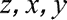
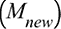

# 第十二章：12. **强化学习**的进化策略

概述

本章中，我们将识别梯度方法的局限性以及进化策略的动机。我们将分解遗传算法的组成部分，并将其应用于**强化学习**（**RL**）。在本章结束时，你将能够将进化策略与传统机器学习方法结合，特别是在选择神经网络超参数时，同时识别这些进化方法的局限性。

# 引言

在上一章中，我们讨论了各种基于策略的方法及其优势。在本章中，我们将学习无梯度方法，即遗传算法；逐步开发这些算法，并利用它们优化神经网络和基于 RL 的算法。本章讨论了梯度方法的局限性，如在局部最优解处停滞，以及在处理噪声输入时收敛速度较慢。本章通过遗传算法提供了梯度方法的替代优化解决方案，因为遗传算法确保全局最优收敛。你将研究并实现遗传算法的结构，并通过神经网络的超参数选择和网络拓扑结构的演化来实现它们，同时将其与 RL 结合用于平衡车杆活动。使用遗传算法的混合神经网络用于解决复杂问题，如建模等离子体化学反应器、设计分形频率选择性表面或优化生产过程。在接下来的部分中，你将审视梯度方法带来的问题。

# 梯度方法的问题

在本节中，你将了解基于价值的方法与基于策略的方法的区别，以及在策略搜索算法中使用梯度方法。你将进一步分析在基于策略的方法中使用梯度方法的优缺点，并通过 TensorFlow 实现随机梯度下降，以解决带有两个未知数的立方函数。

强化学习有两种方法：基于价值的方法和基于策略的方法。这些方法用于解决与**马尔可夫决策过程**（**MDPs**）和**部分可观察马尔可夫决策过程**（**POMDPs**）相关的复杂决策问题。基于价值的方法依赖于通过识别最优价值函数来确定和推导最优策略。像 Q-learning 或 SARSA(λ)这样的算法属于这一类，对于涉及查找表的任务，它们的实现能导致全局最优的回报收敛。由于这些算法依赖于已知的环境模型，因此对于部分可观察或连续空间，使用这些价值搜索方法时无法保证收敛到最优解。

相反，基于策略的方法不是依赖于价值函数来最大化回报，而是使用梯度方法（随机优化）来探索策略空间。基于梯度的方法或策略梯度方法通过使用损失函数将参数化空间（环境）映射到策略空间，从而使 RL 代理能够直接探索整个策略空间或其一部分。其中最常用的方法（将在本节中实现）是梯度下降。

注意

有关梯度下降的进一步阅读，请参考*Marbach, 2001*的技术论文，链接如下：https://link.springer.com/article/10.1023/A:1022145020786。

梯度方法（随机梯度下降或上升法）的优点是它们适用于 POMDP 或非 MDP 问题，尤其是在解决具有多个约束的机器人问题时。然而，采用基于梯度的方法也有几个缺点。最显著的一个缺点是像**REINFORCE**和**DPG**这样的算法只能确定期望回报的局部最优解。当局部最优解被找到时，RL 代理不会进行全局搜索。例如，解决迷宫问题的机器人可能会被困在一个角落，并且会不断尝试在同一位置移动。此外，在处理高回报方差或噪声输入数据时，算法的性能会受到影响，因为它们的收敛速度较慢。例如，当一个机器人臂被编程为捡起并放置一个蓝色部件到托盘中，但桌面颜色带有蓝色调，导致传感器（如摄像头）无法正确识别部件时，算法的表现就会受到干扰。

注意

有关**REINFORCE**算法的进一步阅读，请参考*Williams, 1992*的技术论文，链接如下：https://link.springer.com/article/10.1007/BF00992696。

同样，请阅读*Silvester, 2014*的**DPG**算法，链接如下：http://proceedings.mlr.press/v32/silver14.pdf。

基于梯度的方法的替代方案是使用无梯度方法，这些方法依赖于进化算法来实现回报的全局最优解。

以下练习将帮助你理解梯度方法在收敛到最优解过程中的潜力以及在方法逐步寻找最优解时所需的漫长过程。你将面对一个数学函数（损失函数），它将输入值，，映射到输出值，。目标是确定输入的最优值，以使输出值达到最低；然而，这个过程依赖于每一步，并且存在停留在局部最优解的风险。我们将使用`GradientTape()`函数来计算梯度，这实际上就是求导的解决方案。这将帮助你理解这种优化策略的局限性。

## 练习 12.01：使用随机梯度下降法进行优化

本练习旨在使你能够应用梯度方法，最著名的 **随机梯度下降法** (**SGD**)，并通过遵循所需步骤收敛到最优解。

以下损失函数有两个未知数， ：


图 12.1：示例损失函数

在 100 步内，使用学习率 `0.1` 查找  的最优值。

执行以下步骤以完成练习：

1.  创建一个新的 Jupyter Notebook。

1.  将 `tensorflow` 包导入为 `tf`：

    ```py
    import tensorflow as tf
    ```

1.  定义一个输出  的函数：

    ```py
    def funct(x,y):
        return x**2-8*x+y**2+3*y
    ```

1.  定义一个初始化 `x` 和 `y` 变量的函数，并将它们初始化为值 `5` 和 `10`：

    ```py
    def initialize():
        x = tf.Variable(5.0)
        y = tf.Variable(10.0)
        return x, y
    x, y= initialize()
    ```

1.  在上述代码片段中，我们使用了十进制格式为 `x` 和 `y` 分配初始值，以启动优化过程，因为 `Variable()` 构造函数需要具有 `float32` 类型的张量。

1.  通过选择 TensorFlow 中 `keras` 的 `SGD` 来实例化优化器，并输入学习率 0.1：

    ```py
    optimizer = tf.keras.optimizers.SGD(learning_rate = 0.1)
    ```

1.  设置一个 `100` 步的循环，其中你计算损失，使用 `GradientTape()` 函数进行自动微分，并处理梯度：

    ```py
    for i in range(100):
        with tf.GradientTape() as tape:
            # Calculate loss function using x and y values
            loss= funct(x,y)
            # Get gradient values
            gradients = tape.gradient(loss, [x, y])
            # Save gradients in array without altering them
            p_gradients = [grad for grad in gradients]
    ```

    在前面的代码中，我们使用了 TensorFlow 的 `GradientTape()` 来计算梯度（本质上是微分解）。我们创建了一个损失参数，当调用该函数时，存储了  值。`GradientTape()` 在调用 `gradient()` 方法时激活，后者用于在单次计算中计算多个梯度。梯度被存储在 `p_gradients` 数组中。

1.  使用 `zip()` 函数将梯度与值聚合：

    ```py
            ag = zip(p_gradients, [x,y])
    ```

1.  打印步骤和  的值：

    ```py
            print('Step={:.1f} , z ={:.1f},x={:.1f},y={:.1f}'\
                  .format(i, loss.numpy(), x.numpy(), y.numpy()))
    ```

1.  使用已处理的梯度应用优化器：

    ```py
            optimizer.apply_gradients(ag)
    ```

1.  运行应用程序。

    你将得到以下输出：

    

图 12.2：使用 SGD 逐步优化

你可以在输出中看到，从 `Step=25` 开始，  的值没有变化；因此，它们被认为是相应损失函数的最优值。

通过打印输入和输出的步骤和值，你可以观察到算法在 100 步之前就收敛到最优值 。然而，你可以观察到问题是与步骤相关的：如果优化在全局最优收敛之前停止，得到的解将是次优解。

注意

要访问此特定部分的源代码，请参考 [`packt.live/2C10rXD`](https://packt.live/2C10rXD)。

你也可以在 [`packt.live/2DIWSqc`](https://packt.live/2DIWSqc) 在线运行此示例。

这项练习帮助你理解并应用 SGD 来求解损失函数，提升了你的分析能力以及使用 TensorFlow 编程的技能。这将有助于你选择优化算法，让你理解基于梯度方法的局限性。

在本节中，我们探讨了梯度方法在强化学习（RL）算法中的优缺点，识别了它们在决策过程中的适用问题类型。示例展示了梯度下降法的简单应用，通过使用 SGD 优化算法在 TensorFlow 中找到了两个未知数的最优解。在下一节中，我们将探讨一种不依赖梯度的优化方法：遗传算法。

# 遗传算法简介

由于梯度方法的一个问题是解决方案可能会卡在某个局部最优点，其他方法如不依赖梯度的算法可以作为替代方案。在本节中，你将学习关于不依赖梯度的方法，特别是进化算法（例如遗传算法）。本节概述了遗传算法实现的步骤，并通过练习教你如何实现进化算法来求解上一节给出的损失函数。

当存在多个局部最优解或需要进行函数优化时，推荐使用不依赖梯度的方法。这些方法包括进化算法和粒子群优化。此类方法的特点是依赖于一组优化解，这些解通常被称为种群。方法通过迭代搜索找到一个良好的解或分布，从而解决问题或数学函数。寻找最优解的模式基于达尔文的自然选择范式以及遗传进化的生物学现象。进化算法从生物进化模式中汲取灵感，如突变、繁殖、重组和选择。粒子群算法受到群体社会行为的启发，比如蜜蜂巢或蚁群，在这些群体中，单一的解被称为粒子，能够随着时间演化。

自然选择的前提是遗传物质（染色体）以某种方式编码了物种的生存。物种的进化依赖于它如何适应外部环境以及父母传递给子代的信息。在遗传物质中，不同代之间会发生变异（突变），这些变异可能导致物种成功或不成功地适应环境（尤其在恶劣环境下）。因此，遗传算法有三个步骤：选择、繁殖（交叉）和突变。

演化算法通过创建一个原始解的种群、选择一个子集，并使用重组或突变来获得不同的解来进行处理。这一新解集可以部分或完全替代原始解集。为了实现替代，这些解会经历一个基于适应度分析的选择过程。这增加了更适合用于开发新解集的解的机会。

除了解的开发外，演化算法还可以通过使用概率分布来进行参数适应。仍然会生成种群；然而，使用适应度方法来选择分布的参数，而不是实际的解。在确定新参数后，新的分布将用于生成新的解集。以下是一些参数选择的策略：

+   在估算出原始种群的参数梯度后，使用自然梯度上升，也称为**自然进化策略**（**NESes**）。

+   选择具有特定参数的解，并使用该子集的均值来寻找新的分布均值，这被称为**交叉熵优化**（**CEO**）。

+   根据每个解的适应度赋予权重，使用加权平均值作为新的分布均值 —— **协方差矩阵适应进化策略**（**CMAESes**）。

演化策略中发现的一个主要问题是，实现解的适应度可能会在计算上昂贵且噪声较大。

**遗传算法**（**GAs**）保持解种群，并通过多个方向进行搜索（通过染色体），进一步促进这些方向上的信息交换。算法最常见的实现是字符串处理，字符串可以是二进制或基于字符的。主要的两个操作是突变和交叉。后代的选择基于解与目标（目标函数）的接近程度，这表示它们的适应度。

总体而言，遗传算法（GAs）有以下几个步骤：

1.  种群创建。

1.  适应度得分的创建并分配给种群中的每个解。

1.  选择两个父代进行繁殖，依据适应度得分（可能是表现最好的解）。

1.  通过结合和重新组织两个父代的代码，创建两个子代解。

1.  应用随机突变。

1.  孩子代的生成会重复进行，直到达到新的种群规模，并为种群分配权重（适应度得分）。

1.  该过程将重复进行，直到达到最大代数或实现目标性能。

我们将在本章中进一步详细查看这些步骤。

在梯度算法和遗传算法之间有许多差异，其中一个差异是开发过程。基于梯度的算法依赖于微分，而遗传算法则使用选择、繁殖和变异等遗传过程。以下练习将使你能够实现遗传算法并评估其性能。你将使用一个简单的遗传算法在 TensorFlow 中进行优化，找到`tensorflow_probability`包的最佳解决方案。

## 练习 12.02：使用遗传算法实现固定值和均匀分布优化

在本练习中，你仍然需要像前一个练习那样求解以下函数：


图 12.3：样本损失函数

找到种群大小为 100 时的的最优值，初始值为，然后扩展到从类似于基于梯度方法的分布中随机抽样。

本练习的目标是让你分析应用遗传算法（GAs）和梯度下降方法的差异，从一对变量和多种潜在解决方案开始。该算法通过应用选择、交叉和变异来帮助优化问题，达到最优或接近最优的解决方案。此外，你将从一个均匀分布中抽样 100 个样本的值。在本练习结束时，你将评估从固定变量开始和从分布中抽样之间的差异：

1.  创建一个新的 Jupyter Notebook。

1.  导入`tensorflow`包，并下载和导入`tensorflow_probability`：

    ```py
    import tensorflow as tf
    import tensorflow_probability as tfp
    ```

1.  定义一个函数，输出：

    ```py
    def funct(x,y):
        return x**2-8*x+y**2+3*y
    ```

1.  通过定义值为 5 和 10 的变量来确定初始步长：

    ```py
    initial_position = (tf.Variable(5.0), tf.Variable(10.0))
    ```

1.  通过选择名为`differential_evolution_minimize`的`tensorflow_probability`优化器来实例化优化器：

    ```py
    optimizer1 = tfp.optimizer.differential_evolution_minimize\
                 (funct, initial_position = initial_position, \
                  population_size = 100, \
                  population_stddev = 1.5, seed = 879879)
    ```

1.  使用`objective_value`和`position`函数打印的最终值：

    ```py
    print('Final solution: z={:.1f}, x={:.1f}, y={:.1f}'\
          .format(optimizer1.objective_value.numpy(),\
          optimizer1.position[0].numpy(), \
          optimizer1.position[1].numpy()))
    ```

1.  运行应用程序。你将获得以下输出。你可以观察到最终的值与*图 12.2*中`Step=25.0`的值是相同的：

    ```py
    Final solution: z=-18.2, x=4.0, y=-1.5
    ```

    在本练习中，将显示最终的最优解。不需要额外的优化步骤来达到与基于梯度的方法相同的解决方案。你可以看到，你使用的代码行数更少，并且算法收敛所需的时间更短。

    对于均匀优化，修改代码的步骤如下：

1.  导入`random`包：

    ```py
    import random
    ```

1.  初始化种群大小，并通过从种群大小的随机均匀分布中抽样变量来创建初始种群：

    ```py
    size = 100
    initial_population = (tf.random.uniform([size]), \
                          tf.random.uniform([size]))
    ```

1.  使用相同的优化器，将`initial_position`参数更改为`initial_population`；使用相同的种子：

    ```py
    optimizer2 = tfp.optimizer.differential_evolution_minimize\
                 (funct, initial_population= initial_population,\
                  seed=879879)
    ```

1.  使用`objective_value`和`position`函数打印最终值！12：

    ```py
    print('Final solution: z={:.1f}, x={:.1f}, y={:.1f}'\
          .format(optimizer2.objective_value.numpy(),\
          optimizer2.position[0].numpy(),\
          optimizer2.position[1].numpy()))
    ```

    输出将如下所示：

    ```py
    Final solution: z=-18.2, x=4.0, y=-1.5
    ```

尽管值有所不同，你仍然会得到相同的结果。这意味着我们可以随机采样或选择一组特定的初始值，遗传算法仍然会更快地收敛到最优解，这意味着我们可以通过使用比梯度法更少的代码行来改进我们的代码。

注意

若要访问该特定部分的源代码，请参考[`packt.live/2MQmlPr`](https://packt.live/2MQmlPr)。

你也可以在线运行这个例子，访问[`packt.live/2zpH6hJ`](https://packt.live/2zpH6hJ)。

该解将收敛到最优值，无论初始起点如何，无论是使用固定的输入值还是随机采样的染色体种群。

本节提供了进化算法的概述，解释了进化策略和遗传算法（GA）之间的区别。你有机会使用`tensorflow_probabilities`包实现差分进化，以优化损失函数的解法，分析了两种不同技术的实现：从固定输入值开始和使用输入值的随机采样。你还可以评估遗传算法与梯度下降方法的实施。遗传算法可以使用独立的起始值，并且其收敛到全局最优解的速度更快，不容易受到梯度下降方法的干扰，而梯度下降方法是逐步依赖的，并且对输入变量更敏感。

在接下来的部分中，我们将基于开发遗传算法的原则，首先从种群创建的角度开始。

## 组件：种群创建

在上一节中，你已经了解了用于函数优化的进化方法。在本节中，我们将重点讨论种群创建、适应度得分创建以及创建遗传算法的任务。

种群，，被识别为一组个体或染色体：


图 12.4：种群表达式

这里，`s` 代表染色体的总数（种群大小），`i` 是迭代次数。每个染色体是以抽象形式表示的、对所提出问题的可能解决方案。对于二元问题，种群可以是一个随机生成的包含一和零的矩阵。

染色体是输入变量（基因）的组合：


图 12.5：染色体表达式

这里，`m` 是基因（或变量）的最大数量。

转换为代码后，种群创建可以如下所示：

```py
    population =  np.zeros((no_chromosomes, no_genes))
    for i in range(no_chromosomes):
        ones = random.randint(0, no_genes)
        population[i, 0:ones] = 1
        np.random.shuffle(population[i])
```

然后，每个染色体将通过适应度函数进行比较：


图 12.6：适应度函数

适应度函数可以通过如下方式转化为代码：

```py
identical_to_target = population == target
```

函数的输出是一个分数，表示染色体与目标（最优解）之间的接近程度。目标通过最大化适应度函数来表示。有些优化问题依赖于最小化一个成本函数。这个函数可以是数学函数、热力学模型，或者计算机游戏。这可以通过考虑权重较低（分数较低）的染色体，或者将成本函数转化为适应度函数来完成。

一旦适应度函数被识别并定义，进化过程就可以开始。初始种群被生成。初始种群的一个特点是多样性。为了提供这种多样性，元素可以是随机生成的。为了使种群进化，迭代过程从选择适应度最佳的父代开始，进而启动繁殖过程。

## 练习 12.03：种群创建

在这个练习中，我们将创建一个原始的二进制染色体种群，长度为 5。每个染色体应该包含八个基因。我们将定义一个目标解，并输出每个染色体与目标的相似度。这个练习的目的是让你设计并建立 GA 的第一组步骤，并找到适应目标的二进制解。这个练习类似于将一个控制系统的输出与目标匹配：

1.  创建一个新的 Jupyter Notebook。导入`random`和`numpy`库：

    ```py
    import random
    import numpy as np
    ```

1.  创建一个生成随机种群的函数：

    ```py
    # create function for random population
    def original_population(chromosomes, genes):
        #initialize the population with zeroes
        population =  np.zeros((chromosomes, genes))
        #loop through each chromosome
        for i in range(chromosomes):
            #get random no. of ones to be created
            ones = random.randint(0, genes)
            #change zeroes to ones
            population[i, 0:ones] = 1
            #shuffle rows
            np.random.shuffle(population[i])
        return population
    ```

1.  定义一个创建目标解的函数：

    ```py
    def create_target_solution(gene):
        #assume that there is an equal number of ones and zeroes
        counting_ones = int(gene/2)
        # build array with equal no. of ones and zeros
        target = np.zeros(gene)
        target[0:counting_ones] = 1
        # shuffle the array to mix zeroes and ones
        np.random.shuffle(target)
        return target
    ```

1.  定义一个函数来计算每个染色体的适应度权重：

    ```py
    def fitness_function(target,population):
        #create an array of true/false compared to the reference
        identical_to_target = population == target
        #sum no. of genes that are identical
        fitness_weights = identical_to_target.sum(axis = 1)
        return fitness_weights
    ```

    在前面的代码中，你正在将种群中的每个染色体与目标进行比较，并将相似度以布尔值的形式记录下来——如果相似则为`True`，如果不同则为`False`，这些值保存在名为`identical_to_target`的矩阵中。统计所有为`True`的元素，并将它们作为权重输出。

1.  初始化种群，包含`5`个染色体和`8`个基因，并计算`weights`：

    ```py
    #population of 5 chromosomes, each having 8 genes
    population = original_population(5,8)
    target = create_target_solution(8)
    weights = fitness_function(target,population)
    ```

    在前面的代码中，我们根据三个开发的函数计算`population`、`target`和`weights`。

1.  使用`for`循环打印目标解、染色体的索引、染色体和权重：

    ```py
    print('\n target:', target)
    for i in range(len(population)):
        print('Index:', i, '\n chromosome:', population[i],\
              '\n similarity to target:', weights[i])
    ```

1.  运行程序，你将得到类似如下的输出，因为种群元素是随机化的：

    ```py
    target: [0\. 0\. 1\. 1\. 1\. 0\. 0\. 1.]
    Index: 0 
     chromosome: [1\. 1\. 1\. 1\. 1\. 0\. 1\. 1.] 
     similarity to target: 5
    Index: 1 
     chromosome: [1\. 0\. 1\. 1\. 1\. 0\. 0\. 0.] 
     similarity to target: 6
    Index: 2 
     chromosome: [1\. 0\. 0\. 0\. 0\. 0\. 0\. 0.] 
     similarity to target: 3
    Index: 3 
     chromosome: [0\. 0\. 0\. 1\. 1\. 0\. 1\. 0.] 
     similarity to target: 5
    Index: 4 
     chromosome: [1\. 0\. 0\. 1\. 1\. 1\. 0\. 1.] 
     similarity to target: 5
    ```

你会注意到，每个染色体都会与目标进行比较，并且相似度（基于适应度函数）会被打印出来。

注意

要访问此特定部分的源代码，请参阅[`packt.live/2zrjadT`](https://packt.live/2zrjadT)。

你也可以在线运行这个例子，网址是[`packt.live/2BSSeEG`](https://packt.live/2BSSeEG)。

本节展示了遗传算法开发的第一步：生成随机种群、为种群中的每个元素（染色体）分配适应度分数，以及获得与目标最匹配的元素数量（在此情况下与最优解的相似度最高）。接下来的章节将扩展代码生成，直到达到最优解。为了实现这一点，在下一节中，你将探索用于繁殖过程的父代选择。

## 组成部分：父代选择

前一节展示了种群的概念；我们讨论了创建目标解并将其与种群中的元素（染色体）进行比较。这些概念已在一个练习中实现，接下来将在本节继续。在本节中，你将探索选择的概念，并实现两种选择策略。

对于繁殖过程（这是遗传算法的核心部分，因为它依赖于创建更强的后代染色体），有三个步骤：

1.  父代选择

1.  混合父代以创建新的子代（交叉）

1.  用子代替代种群中的父代

选择本质上是选择两个或更多父代进行混合过程。一旦选择了适应度标准，就需要决定如何进行父代选择，以及将从父代中产生多少子代。选择是进行遗传进化的重要步骤，因为它涉及确定适应度最高的子代。选择最佳个体的最常见方法是通过“适者生存”。这意味着算法将逐步改进种群。遗传算法的收敛性依赖于选择更高适应度的染色体的程度。因此，收敛速度高度依赖于染色体的成功选择。如果优先选择适应度最高的染色体，可能会找到一个次优解；如果候选染色体的适应度始终较低，那么收敛将非常缓慢。

可用的选择方法如下：

+   **自上而下配对**：这是指创建一个染色体列表，并将其两两配对。奇数索引的染色体与偶数索引的染色体配对，从而生成母-父对。列表顶部的染色体会被选中。

+   **随机选择**：这涉及使用均匀分布的数字生成器来选择父代。

+   **随机加权选择或轮盘赌法**：这涉及到计算染色体相对于整个种群的适应度概率。父代的选择是随机进行的。概率（权重）可以通过排名或适应度来确定。第一种方法（见*图 12.7*）依赖于染色体的排名 ()，它可以作为染色体在种群列表中的索引， 表示所需的染色体数量（父代）：

图 12.7：基于排名的概率

第二种方法（见*图 12.8*）依赖于染色体的适应度 () 与整个种群适应度之和的比较（）：


图 12.8：基于染色体适应度的概率

另外，概率（见*图 12.9*）也可以基于染色体的适应度 () 与种群中最高适应度的比较来计算 ()。在所有这些情况下，概率将与随机选择的数字进行比较，以识别具有最佳权重的父代：


图 12.9：基于种群中最高适应度的概率

+   **锦标赛选择法**：该方法基于从染色体子集中随机选择染色体，其中适应度最高的染色体被选为父代。这个过程会重复，直到确定所需数量的父代。

轮盘赌和锦标赛技术是遗传算法中最常用的选择方法，因为它们受到生物过程的启发。轮盘赌方法的问题是它可能会有噪音，而且根据所使用的选择类型，收敛速度可能会受到影响。锦标赛方法的一个优点是它可以处理大规模种群，从而实现更平滑的收敛。轮盘赌方法用于在种群中加入随机元素，而当你希望识别与目标最相似的父代时，则使用锦标赛方法。以下练习将帮助你实现锦标赛和轮盘赌技术，并评估你对它们的理解。

## 练习 12.04：实现锦标赛和轮盘赌选择技术

在本练习中，你将实现锦标赛选择和轮盘选择方法，针对的是 *Exercise 12.02, Implementing Fixed Value and Uniform Distribution Optimization Using GAs* 中的二进制染色体种群。每个染色体应该包含八个基因。我们将定义一个目标解决方案，并打印出两组父母：一组基于锦标赛方法，另一组基于轮盘选择，从剩余种群中选出。每次选择父母后，适应度排名都将设为最小值：

1.  创建一个新的 Jupyter Notebook，导入 `random` 和 `numpy` 库：

    ```py
    import random
    import numpy as np
    ```

1.  创建一个用于生成随机种群的函数：

    ```py
    # create  function for random population
    def original_population(chromosomes, genes):
        #initialize the population with zeroes
        population =  np.zeros((chromosomes, genes))
        #loop through each chromosome
        for i in range(chromosomes):
            #get random no. of ones to be created
            ones = random.randint(0, genes)
            #change zeroes to ones
            population[i, 0:ones] = 1
            #shuffle rows
            np.random.shuffle(population[i])
        return population
    ```

1.  定义一个函数，用于创建目标解决方案：

    ```py
    def create_target_solution(gene):
        #assume that there is an equal number of ones and zeroes
        counting_ones = int(gene/2)
        # build array with equal no. of ones and zeros
        target = np.zeros(gene)
        target[0:counting_ones] = 1
        # shuffle the array to mix zeroes and ones
        np.random.shuffle(target)
        return target
    ```

1.  定义一个函数，用于计算每个染色体的适应度权重：

    ```py
    def fitness_function(target,population):
        #create an array of true/false compared to the reference
        identical_to_target = population == target
        #sum no. of genes that are identical
        fitness_weights = identical_to_target.sum(axis = 1)
        return fitness_weights
    ```

1.  定义一个函数，用于选择权重最高（适应度评分最高）的父母对。由于种群规模缩小，染色体之间的竞争更加激烈。这个方法也被称为锦标赛选择：

    ```py
    # select the best parents
    def select_parents(population, weights):
        #identify the parent with the highest weight
        parent1 = population[np.argmax(weights)]
        #replace weight with the minimum number
        weights[np.argmax(weights)] = 0
        #identify the parent with the second-highest weight
        parent2 = population[np.argmax(weights)]
        return parent1, parent2
    ```

1.  创建一个轮盘函数，通过从均匀分布中选择一个随机数来实现：

    ```py
    def choice_by_roulette(sorted_population, fitness):
        normalised_fitness_sum = 0
        #get a random draw probability
        draw = random.uniform(0,1)
        prob = []
    ```

1.  在函数中，计算所有适应度评分的总和：

    ```py
        for i in range(len(fitness)):
            normalised_fitness_sum += fitness[i]
    ```

1.  计算染色体的适应度概率，与所有适应度评分的总和以及与适应度最高的染色体相比：

    ```py
        ma = 0
        n = 0
    # calculate the probability of the fitness selection
        for i in range(len(sorted_population)):
               probability = fitness[i]/normalised_fitness_sum
               #compare fitness to the maximum fitness and track it
               prob_max = fitness[i]/np.argmax(fitness)
               prob.append(probability)
                if ma < prob_max:
                    ma = prob_max
                    n = i
    ```

1.  遍历所有染色体，选择适应度概率更高的父母，条件是其适应度评分总和高于 `draw`，或者其适应度评分比最大适应度评分的父母概率更高：

    ```py
          for i in range(len(sorted_population)):
                if draw <= prob[i]:
                    fitness[i] = 0
                    return sorted_population[i], fitness
                else:
                    fitness[n] = 0
                    return sorted_population[n], fitness
    ```

1.  初始化 `population`，计算 `target` 和适应度评分，并打印出评分和 `target`：

    ```py
    population = original_population(5,8)
    target = create_target_solution(8)
    weights = fitness_function(target,population)
    print(weights)
    print('\n target:', target)
    ```

    你将会得到类似于这样的输出：

    ```py
    [5 1 5 3 4]
    ```

1.  应用第一个选择方法，并打印出父母和新的评分：

    ```py
    print('\n target:', target)
    parents = select_parents(population,weights)
    print('Parent 1:', parents[0],'\nParent 2:', parents[1])
    print(weights)
    ```

    你将会看到锦标赛选择过程的类似输出：

    ```py
    target: [0\. 1\. 1\. 1\. 1\. 0\. 0\. 0.]
    Parent 1: [1\. 1\. 1\. 1\. 1\. 0\. 1\. 1.] 
    Parent 2: [1\. 1\. 1\. 1\. 1\. 1\. 1\. 0.]
    [0 1 5 3 4]
    ```

    你可以观察到，对于父母 1，分数已被替换为 `0`。对于父母 2，分数保持不变。

1.  使用轮盘函数选择下一个父母对，并打印出父母和权重：

    ```py
    parent3, weights = choice_by_roulette(population, weights)
    print('Parent 3:', parent3, 'Weights:', weights)
    parent4, weights = choice_by_roulette(population, weights)
    print('Parent 4:', parent4,'Weights:', weights)
    ```

    你将会看到类似于这样的输出：

    ```py
    0.8568696148662779
    [0.0, 0.07692307692307693, 0.38461538461538464, 
     0.23076923076923078, 0.3076923076923077]
    Parent 3: [1\. 1\. 1\. 1\. 1\. 1\. 1\. 0.] Weights: [0 1 0 3 4]
    0.4710306341255527
    [0.0, 0.125, 0.0, 0.375, 0.5]
    Parent 4: [0\. 0\. 1\. 0\. 1\. 1\. 1\. 0.] Weights: [0 1 0 3 0]
    ```

你可以看到父母 2 和父母 3 是相同的。这一次，父母的权重被修改为 0。此外，父母 4 被选中，并且它的权重也被改为 0。

注意

若要访问该部分的源代码，请参考 [`packt.live/2MTsKJO`](https://packt.live/2MTsKJO)。

你也可以在线运行这个示例，网址是 [`packt.live/2YrwMhP`](https://packt.live/2YrwMhP)。

通过这个练习，你实现了一种类似锦标赛的方法，通过选择得分最高的父代，以及轮盘选择技术。同时，你还开发了一种避免重复选择相同染色体的方法。第一组父代是使用第一种方法选择的，而第二种方法用于选择第二组父代。我们还发现需要一种替换索引的方法，以避免重复选择相同的染色体，这是选择过程中可能出现的陷阱之一。这帮助你理解了这两种方法之间的差异，并使你能够将与遗传算法相关的方法从种群生成到选择实际运用。

## 组件：交叉应用

本节扩展了通过交叉将父代的遗传代码重组到子代中的方法（即通过结合和重新组织两个父代的代码创建两个子代解决方案）。可以使用各种技术来创建新的解决方案，从而生成新的种群。机器学习中两个有效解的二进制信息可以通过一种称为交叉的过程重新组合，这类似于生物遗传交换，其中遗传信息从父代传递到子代。交叉确保了解决方案的遗传物质传递到下一代。

交叉是最常见的繁殖技术或交配方式。在父代（选定染色体）的第一个和最后一个基因之间，交叉点表示二进制代码的分裂点，这些代码将传递给子代（后代）：第一个父代交叉点左侧的部分将由第一个子代继承，而第二个父代交叉点右侧的部分将成为第一个子代的一部分。第二个父代的左侧部分与第一个父代的右侧部分结合，形成第二个子代：

```py
child1 = np.hstack((parent1[0:p],parent2[p:]))
child2 = np.hstack((parent2[0:p], parent1[p:]))
```

有多种交叉技术，如下所示：

+   单点交叉（你可以在前面的代码中看到）涉及在一个点上分割父代的遗传代码，并将第一部分传递给第一个子代，第二部分传递给第二个子代。传统遗传算法使用这种方法；交叉点对于两个染色体是相同的，并且是随机选择的。

+   两点交叉涉及两个交叉点，影响两个父代之间的基因交换。引入更多的交叉点可能会降低遗传算法的性能，因为遗传信息会丧失。然而，采用两点交叉可以更好地探索状态或参数空间。

+   多点交叉涉及多个分裂。如果分裂次数是偶数，那么分裂点是随机选择的，染色体中的各部分会交换。如果次数是奇数，则交换的部分是交替进行的。

+   均匀交叉涉及随机选择（如同抛硬币一样）一个父代，提供染色体（基因）中的某个元素。

+   三父代交叉涉及对比两个父代的每个基因。如果它们的值相同，子代继承该基因；如果不同，子代从第三个父代继承该基因。

请参考以下代码示例：

```py
def crossover_reproduction(parents, population):
    #define parents separately
    parent1 = parents[0]
    parent2 = parents[1]
    #randomly assign a point for cross-over
    p = random.randrange(0, len(population))
    print("Crossover point:", p)
    #create children by joining the parents at the cross-over point
    child1 = np.hstack((parent1[0:p],parent2[p:]))
    child2 = np.hstack((parent2[0:p], parent1[p:]))
    return child1, child2
```

在前面的代码中，我们定义了两个父代之间的交叉函数。我们分别定义了父代，然后随机指定一个交叉点。接着，我们定义了通过在定义的交叉点将父代结合起来创建子代。

在接下来的练习中，你将继续实现遗传算法的组件，创建子代染色体。

## 练习 12.05：为新一代实施交叉

在这个练习中，我们将实现两个父代之间的交叉，以生成新的子代。按照*练习 12.04：实现锦标赛和轮盘赌*中的步骤，并使用权重最高的染色体，我们将应用单点交叉来创建第一组新的子代：

1.  创建一个新的 Jupyter Notebook。导入`random`和`numpy`库：

    ```py
    import random
    import numpy as np
    ```

1.  创建一个随机种群的函数：

    ```py
    def original_population(chromosomes, genes):
        #initialize the population with zeroes
        population =  np.zeros((chromosomes, genes))
        #loop through each chromosome
        for i in range(chromosomes):
            #get random no. of ones to be created
            ones = random.randint(0, genes)
            #change zeroes to ones
            population[i, 0:ones] = 1
            #shuffle rows
            np.random.shuffle(population[i])
        return population
    ```

    如你在前面的代码中所见，我们已经创建了一个`population`函数。

1.  定义一个函数来创建目标解：

    ```py
    def create_target_solution(gene):
        #assume that there is an equal number of ones and zeroes
        counting_ones = int(gene/2)
        # build array with equal no. of ones and zeros
        target = np.zeros(gene)
        target[0:counting_ones] = 1
        # shuffle the array to mix zeroes and ones
        np.random.shuffle(target)
        return target
    ```

1.  定义一个函数来计算每个染色体的适应度权重：

    ```py
    def fitness_function(target,population):
        #create an array of true/false compared to the reference
        identical_to_target = population == target
        #sum no. of genes that are identical
        fitness_weights = identical_to_target.sum(axis = 1)
        return fitness_weights
    ```

1.  定义一个函数来选择具有最高权重（最高适应度得分）的父代对。由于种群较小，染色体之间的竞争更为激烈。此方法也被称为锦标赛选择：

    ```py
    # select the best parents
    def select_parents(population, weights):
        #identify the parent with the highest weight
        parent1 = population[np.argmax(weights)]
        #replace weight with the minimum number
        weights[np.argmax(weights)] = 0
        #identify the parent with the second-highest weight
        parent2 = population[np.argmax(weights)]
        return parent1, parent2
    ```

1.  定义一个使用随机选择的交叉点的交叉函数：

    ```py
    def crossover_reproduction(parents, population):
        #define parents separately
        parent1 = parents[0]
        parent2 = parents[1]
        #randomly assign a point for cross-over
        p = random.randrange(0, len(population))
        print("Crossover point:", p)
        #create children by joining the parents at the cross-over point
        child1 = np.hstack((parent1[0:p],parent2[p:]))
        child2 = np.hstack((parent2[0:p], parent1[p:]))
        return child1, child2
    ```

1.  初始化种群，设置`5`个染色体和`8`个基因，并计算`权重`：

    ```py
    population = original_population(5,8)
    target = create_target_solution(8)
    weights = fitness_function(target,population)
    ```

1.  打印`目标`解：

    ```py
    print('\n target:', target)
    ```

    输出结果如下：

    ```py
    target: [1\. 0\. 0\. 1\. 1\. 0\. 1\. 0.]
    ```

1.  选择权重最高的父代并打印最终选择：

    ```py
    parents = select_parents(population,weights)
    print('Parent 1:', parents[0],'\nParent 2:', parents[1])
    ```

    输出结果如下：

    ```py
    Parent 1: [1\. 0\. 1\. 1\. 1\. 0\. 1\. 1.] 
    Parent 2: [1\. 0\. 0\. 0\. 0\. 0\. 0\. 0.]
    ```

1.  应用`crossover`函数并打印子代：

    ```py
    children = crossover_reproduction(parents,population)
    print('Child 1:', children[0],'\nChild 2:', children[1])
    ```

    输出结果如下：

    ```py
    Crossover point: 4 
    Child 1: [1\. 0\. 1\. 1\. 0\. 0\. 0\. 0.] 
    Child 2: [1\. 0\. 0\. 0\. 1\. 0\. 1\. 1.]
    ```

1.  运行应用程序。

    你将获得与以下代码片段相似的输出。正如你所见，种群元素是随机化的。检查`Child 1`和`Child 2`的元素是否与`Parent 1`和`Parent 2`的元素相同：

    ```py
    target: [1\. 0\. 1\. 1\. 0\. 0\. 1\. 0.]
    . . .
    Parent 1: [1\. 0\. 1\. 1\. 1\. 0\. 1\. 1.]
    Parent 2: [0\. 0\. 1\. 1\. 0\. 1\. 0\. 0.]
    . . .
    Crossover point: 1
    Child 1: [1\. 0\. 1\. 1\. 0\. 1\. 0\. 0.]
    Child 2: [0\. 0\. 1\. 1\. 1\. 0\. 1\. 1.]. . .
    ```

你可以检查`Child 1`的交叉点之后的元素与`Parent 2`的数组元素是否相同，且`Child 2`的元素与`Parent 1`的数组元素相同。

注意

要访问此特定部分的源代码，请参考[`packt.live/30zHbup`](https://packt.live/30zHbup)。

你也可以在网上运行这个示例：[`packt.live/3fueZxx`](https://packt.live/3fueZxx)。

在本节中，我们识别了称为交叉的重新组合技术的各种策略。展示了随机生成交叉点的单点交叉的基本实现。在接下来的章节中，我们将讨论遗传算法设计的最后一个元素：群体变异。

## 组件：群体变异

在前面的章节中，你已经实现了群体生成、父代选择和交叉繁殖。本节将集中讨论随机变异的应用，以及重复生成子代直到达到新的群体大小，并为遗传算法群体分配权重（适应度评分）。本节将包括对变异技术的解释。接下来将介绍可用的变异技术，并讨论群体替换。最后，将提供一个实施变异技术的练习。

梯度方法的一个警告是算法可能会停留在局部最优解。为了防止这种情况发生，可以向解决方案群体引入变异。变异通常发生在交叉过程之后。变异依靠随机分配二进制信息，可以是在染色体集合中，也可以是在整个群体中。变异通过引入群体中的随机变化来提供问题空间的探索途径。这种技术防止了快速收敛，并鼓励探索新的解决方案。在最后几代（最后的世代）或者达到最优解时，变异不再被应用。

有各种变异技术，如下：

+   单点变异（翻转）涉及随机选择不同染色体的基因，并将它们的二进制值更改为它们的相反值（从 0 到 1，从 1 到 0）。

+   交换涉及选择一个父代染色体的两个部分并交换它们，从而生成一个新的子代。

+   你还可以在父代或染色体群体中随机选择一个段落进行反转，所有的二进制值都会变成它们的相反值。

变异的发生由其概率决定。概率定义了在群体内发生变异的频率。如果概率为 0%，那么在交叉后，子代不变；如果发生变异，染色体或整个群体的一部分将被改变。如果概率为 100%，则整个染色体都将被改变。

变异过程发生后，计算新子代的适应度，并将它们包含在群体中。这导致了群体的新一代。根据使用的策略，适应度最低的父代被丢弃，以给新生成的子代腾出位置。

## 练习 12.06：使用变异开发新的子代

在这个练习中，我们将专注于新一代的开发。我们将再次创建一个新种群，选择两个父代染色体，并使用交叉操作来生成两个子代。然后我们将这两个新染色体添加到种群中，并以 0.05 的概率对整个种群进行突变：

1.  创建一个新的 Jupyter Notebook。导入`random`和`numpy`库：

    ```py
    import random
    import numpy as np
    ```

1.  创建一个用于生成随机种群的函数：

    ```py
    def original_population(chromosomes, genes):
        #initialize the population with zeroes
        population =  np.zeros((chromosomes, genes))
        #loop through each chromosome
        for i in range(chromosomes):
            #get random no. of ones to be created
            ones = random.randint(0, genes)
            #change zeroes to ones
            population[i, 0:ones] = 1
            #shuffle rows
            np.random.shuffle(population[i])
        return population
    ```

1.  定义一个创建目标解的函数：

    ```py
    def create_target_solution(gene):
        #assume that there is an equal number of ones and zeroes
        counting_ones = int(gene/2)
        # build array with equal no. of ones and zeros
        target = np.zeros(gene)
        target[0:counting_ones] = 1
        # shuffle the array to mix zeroes and ones
        np.random.shuffle(target)
        return target
    ```

1.  定义一个函数来计算每个染色体的适应度权重：

    ```py
    def fitness_function(target,population):
        #create an array of true/false compared to the reference
        identical_to_target = population == target
        #sum no. of genes that are identical
        fitness_weights = identical_to_target.sum(axis = 1)
        return fitness_weights
    ```

1.  定义一个函数来选择具有最高权重（最高适应度得分）的父代对。由于种群较小，染色体之间的竞争更为激烈。这种方法也称为锦标赛选择：

    ```py
    # select the best parents
    def select_parents(population, weights):
        #identify the parent with the highest weight
        parent1 = population[np.argmax(weights)]
        #replace weight with the minimum number
        weights[np.argmax(weights)] = 0
        #identify the parent with the second-highest weight
        parent2 = population[np.argmax(weights)]
        return parent1, parent2
    ```

1.  定义一个使用随机选择交叉点的交叉函数：

    ```py
    def crossover_reproduction(parents, population):
        #define parents separately
        parent1 = parents[0]
        parent2 = parents[1]
        #randomly assign a point for cross-over
        p = random.randrange(0, len(population))
        print("Crossover point:", p)
        #create children by joining the parents at the cross-over point
        child1 = np.hstack((parent1[0:p],parent2[p:]))
        child2 = np.hstack((parent2[0:p], parent1[p:]))
        return child1, child2
    ```

1.  定义一个突变函数，使用概率和种群作为输入：

    ```py
    def mutate_population(population, mutation_probability):
        #create array of random mutations that uses the population
        mutation_array = np.random.random(size = (population.shape))
        """
        compare elements of the array with the probability and 
        put the results into an array
        """
        mutation_boolean = mutation_array \
                           >= mutation_probability
        """
        convert boolean into binary and store to create a new 
        array for the population
        """
        population[mutation_boolean] = np.logical_not\
                                       (population[mutation_boolean])
        return population
    ```

    在前面的代码片段中，设置突变选择的条件是检查数组中的每个元素是否大于突变概率，该概率作为阈值。如果元素大于阈值，则应用突变。

1.  将`children`数组附加到原始种群中，创建一个新的交叉`population`，并使用`print()`函数显示它：

    ```py
    population = original_population(5,8)
    target = create_target_solution(8)
    weights = fitness_function(target,population)
    parents = select_parents(population,weights)
    children = crossover_reproduction(parents,population)
    ```

    输出将如下所示：

    ```py
    Crossover point: 3
    ```

1.  接下来，将`population`与`children`合并：

    ```py
    population_crossover = np.append(population, children, axis= 0)
    print('\nPopulation after the cross-over:\n', \
          population_crossover)
    ```

    种群将如下所示：

    ```py
    Population after the cross-over:
     [[0\. 1\. 0\. 0\. 0\. 0\. 1\. 0.]
     [0\. 0\. 0\. 0\. 0\. 1\. 0\. 0.]
     [1\. 1\. 1\. 1\. 1\. 0\. 0\. 1.]
     [1\. 1\. 1\. 0\. 1\. 1\. 1\. 1.]
     [0\. 1\. 1\. 1\. 1\. 0\. 0\. 0.]
     [1\. 1\. 1\. 1\. 1\. 0\. 0\. 1.]
     [1\. 1\. 1\. 0\. 1\. 1\. 1\. 1.]]
    ```

1.  使用交叉种群和突变概率`0.05`来创建一个新种群，并显示突变后的种群：

    ```py
    mutation_probability = 0.05
    new_population = mutate_population\
                     (population_crossover,mutation_probability)
    print('\nNext generation of the population:\n',\
          new_population)
    ```

    如你所见，阈值（mutation_probability）是 0.05。因此，如果元素大于这个阈值，它们将发生突变（所以基因发生突变的几率是 95%）。

    输出将如下所示：

    ```py
    Next generation of the population:
     [[1\. 0\. 1\. 1\. 1\. 1\. 0\. 1.]
     [1\. 0\. 1\. 1\. 1\. 0\. 1\. 1.]
     [1\. 0\. 0\. 0\. 0\. 1\. 1\. 0.]
     [0\. 0\. 0\. 1\. 0\. 0\. 0\. 0.]
     [1\. 0\. 0\. 0\. 1\. 1\. 1\. 1.]
     [0\. 0\. 0\. 0\. 0\. 1\. 1\. 0.]
     [0\. 0\. 0\. 1\. 0\. 1\. 0\. 1.]]
    ```

你将得到一个类似的输出，因为种群元素是随机化的。你可以看到交叉操作生成的染色体被添加到原始种群中，且在突变后，种群的染色体数量相同，但基因不同。交叉和突变步骤可以通过循环函数重复，直到达到目标解。这些循环也被称为代。

注意

要访问此特定部分的源代码，请参考 [`packt.live/3dXaBqi`](https://packt.live/3dXaBqi)。

你还可以在网上运行这个示例，网址是 [`packt.live/2Ysc5Cl`](https://packt.live/2Ysc5Cl)。

在本节中，描述了突变的概念。突变的好处在于它为染色体引入了随机变异，促进了探索，并帮助避免局部最优。介绍了不同的突变技术。我们使用的示例展示了通过在交叉过程完成后对种群实施反向突变来观察突变概率的影响。

## 应用于超参数选择

在本节中，我们将探讨遗传算法（GAs）在参数选择中的应用，尤其是在使用神经网络时。遗传算法广泛应用于生产调度和铁路管理中的优化问题。这类问题的解决方案依赖于将神经网络与遗传算法结合，作为函数优化器。

本节的练习提供了一个平台，用于调整神经网络的超参数，以预测风流模式。您将应用一个简单的遗传算法来优化用于训练神经网络的超参数值。

**人工神经网络**（**ANNs**）模拟了大脑中神经元的生物学过程和结构。人工神经网络中的神经元依赖于输入信息（参数）和权重的组合。该乘积（加上偏置）通过传递函数，这是一组并行排列的神经元，形成一个层。

对于权重和偏置优化，人工神经网络使用梯度下降法进行训练和反向传播过程。这影响了神经网络的发展，因为在训练开始之前，神经网络拓扑结构需要完全设计。由于设计是预设的，某些神经元在训练过程中可能没有被使用，但它们可能仍然处于活跃状态，因此变得冗余。此外，使用梯度方法的神经网络可能会陷入局部最优，因此需要依赖其他方法来帮助其继续处理，如正则化、岭回归或套索回归。人工神经网络广泛应用于语音识别、特征检测（无论是图像、拓扑还是信号处理）和疾病检测。

为了防止这些问题并增强神经网络的训练，遗传算法可以被实现。遗传算法用于函数优化，而交叉和变异技术则有助于问题空间的探索。最初，遗传算法被用于优化神经网络的权重和节点数。为此，遗传算法的染色体编码了可能的权重和节点变动。神经网络生成的适应度函数依赖于潜在值与参数的实际值之间的均方误差。

然而，研究已经扩展到**递归神经网络**（**RNNs**）的实现，并将其与强化学习（RL）结合，旨在提高多处理器性能。递归神经网络是一种人工神经网络（ANN），其输出不仅是输入加权过程的结果，还包含了一个包含先前输入和输出的向量。这使得神经网络能够保持对先前训练实例的知识。

遗传算法有助于扩展神经网络的拓扑结构，超越权重调整。一例是 EDEN，其中编码在染色体内进行，并且网络架构和学习率在多个 TensorFlow 数据集上实现了高精度。训练神经网络时，最具挑战性的问题之一是馈送给网络的特征（或输入超参数）的质量。如果参数不合适，输入和输出的映射将会错误。因此，遗传算法可以作为人工神经网络的替代方法，通过优化特征选择来发挥作用。

以下练习将教你如何应用简单的遗传算法来识别 RNN 的最佳参数（窗口大小和单元数量）。所实现的遗传算法使用 `deap` 包，通过 `eaSimple()` 函数，可以使用基于工具箱的代码创建一个简单的遗传算法，包括种群创建、通过 `selRandom()` 函数进行选择、通过 `cxTwoPoint()` 函数进行交叉和通过 `mutFlipBit()` 函数进行变异。为了进行比较和超参数选择，使用 `selBest()` 函数。

## 练习 12.07：为 RNN 训练实现遗传算法超参数优化

本次练习的目标是通过简单的遗传算法识别 RNN 使用的最佳超参数。在本次练习中，我们使用的是一个 2012 年天气预报挑战赛中的数据集。训练和验证参数时仅使用一个特征 `wp2`。使用的两个超参数是单元数量和窗口大小。这些超参数代表染色体的遗传物质：

注意

数据集可以在以下 GitHub 仓库中找到：https://packt.live/2Ajjz2F。

原始数据集可以在以下链接找到：https://www.kaggle.com/c/GEF2012-wind-forecasting/data。

1.  创建一个新的 Jupyter Notebook。导入 `pandas` 和 `numpy` 库及其函数：

    ```py
    import numpy as np
    import pandas as pd
    from sklearn.metrics import mean_squared_error
    from sklearn.model_selection import train_test_split as split
    from tensorflow.keras.layers import SimpleRNN, Input, Dense
    from tensorflow.keras.models import Model
    from deap import base, creator, tools, algorithms
    from scipy.stats import bernoulli
    from bitstring import BitArray
    ```

    从 `sklearn` 包中导入 `mean_squared_error` 和 `train_test_split`。同时，从 `tensorflow` 和 `keras` 包中导入 `SimpleRNN`、`Input`、`Dense`（来自 `layers` 文件夹）和模型（来自 `Model` 类）。为了创建遗传算法，必须从 `deap` 包中调用 `base`、`creator`、`tools` 和 `algorithms`。对于统计学，我们使用的是伯努利方程；因此，我们将从 `scipy.stats` 包中调用 `bernoulli`。从 `bitstrings` 中，我们将调用 `BitArray`。

1.  使用随机种子进行模型开发；`998` 是种子的初始化数字：

    ```py
    np.random.seed(998)
    ```

1.  从 `train.csv` 文件加载数据，使用 `np.reshape()` 将数据修改为只包含 `wp2` 列的数组，并选择前 1,501 个元素：

    ```py
    #read data from csv
    data = pd.read_csv('../Dataset/train.csv')
    #use column wp2
    data = np.reshape(np.array(data['wp2']), (len(data['wp2']), 1))
    data = data[0:1500]
    ```

1.  定义一个函数，根据窗口大小划分数据集：

    ```py
    def format_dataset(data, w_size):
        #initialize as empty array
        X, Y = np.empty((0, w_size)), np.empty(0)
        """
        depending on the window size the data is separated in 
        2 arrays containing each of the sizes
        """
        for i in range(len(data)-w_size-1):
            X = np.vstack([X,data[i:(i+w_size),0]])
            Y = np.append(Y, data[i+w_size,0])
        X = np.reshape(X,(len(X),w_size,1))
        Y = np.reshape(Y,(len(Y), 1))
        return X, Y
    ```

1.  定义一个函数，通过简单的遗传算法训练 RNN，识别最佳超参数：

    ```py
    def training_hyperparameters(ga_optimization):
        """
        decode GA solution to integer window size and number of units
        """
        w_size_bit = BitArray(ga_optimization[0:6])
        n_units_bit = BitArray(ga_optimization[6:])
        w_size = w_size_bit.uint
        n_units = n_units_bit.uint
        print('\nWindow Size: ', w_size, \
              '\nNumber of units: ',n_units)
        """
        return fitness score of 100 if the size or the units are 0
        """
        if w_size == 0 or n_units == 0:
            return 100
        """
        segment train data on the window size splitting it into 
        90 train, 10 validation
        """
        X,Y = format_dataset(data, w_size)
        X_train, X_validate, Y_train, Y_validate = \
        split(X, Y, test_size= 0.10, random_state= 998)
    ```

    第一阶段是识别与窗口大小和单元数量相关的染色体部分。接下来，如果没有窗口大小或单元数量，则返回一个极高的适应度得分。将两个数组按 90:10 的比例分割为训练数组和验证数组。

1.  初始化输入特征，并使用训练数据集训练`SimpleRNN`模型。为了优化，使用 Adam 算法，并将均方误差作为损失函数。为了训练模型，使用`fit`函数，设置`epochs`为`5`，批次大小为`4`。要生成预测值，使用存储在`X_validate`中的输入值，在模型的`predict`函数中进行预测。计算`RMSE`：

    ```py
        input_features = Input(shape=(w_size,1))
        x = SimpleRNN(n_units,input_shape=(w_size,1))(input_features)
        output = Dense(1, activation='linear')(x)
        rnnmodel = Model(inputs=input_features, outputs = output)
        rnnmodel.compile(optimizer='adam', \
                         loss = 'mean_squared_error')
        rnnmodel.fit(X_train, Y_train, epochs=5, \
                     batch_size=4, shuffle = True)
        Y_predict = rnnmodel.predict(X_validate)
        # calculate RMSE score as fitness score for GA
        RMSE = np.sqrt(mean_squared_error(Y_validate, Y_predict))
        print('Validation RMSE: ', RMSE, '\n')
        return RMSE,
    ```

1.  实例化种群大小、遗传算法使用的代数和基因长度，分别设置为`4`、`5`和`10`：

    ```py
    population_size = 4
    generations = 5
    gene = 10
    ```

1.  使用`deap`包中的工具箱实例化遗传算法，`eaSimple()`。为此，使用创建器工具将适应度函数实例化为`RMSE`：

    ```py
    creator.create('FitnessMax', base.Fitness, weights= (-1.0,))
    creator.create('Individual', list, fitness = creator.FitnessMax)
    toolbox = base.Toolbox()
    toolbox.register('bernoulli', bernoulli.rvs, 0.5)
    toolbox.register('chromosome', tools.initRepeat, \
                     creator.Individual, toolbox.bernoulli, n = gene)
    toolbox.register('population', tools.initRepeat, \
                     list, toolbox.chromosome)
    toolbox.register('mate', tools.cxTwoPoint)
    toolbox.register('mutate', tools.mutFlipBit, indpb = 0.6)
    toolbox.register('select', tools.selRandom)
    toolbox.register('evaluate', training_hyperparameters)
    population = toolbox.population(n = population_size)
    algo = algorithms.eaSimple(population,toolbox,cxpb=0.4, \
                               mutpb=0.1, ngen=generations, \
                               verbose=False)
    ```

    输出的最后几行如下所示：

    ```py
    Window Size:  48 
    Number of units:  15
    Train on 1305 samples
    Epoch 1/5
    1305/1305 [==============================] - 3s 2ms/sample 
    - loss: 0.0106
    Epoch 2/5
    1305/1305 [==============================] - 3s 2ms/sample 
    - loss: 0.0066
    Epoch 3/5
    1305/1305 [==============================] - 3s 2ms/sample 
    - loss: 0.0057
    Epoch 4/5
    1305/1305 [==============================] - 3s 2ms/sample 
    - loss: 0.0051
    Epoch 5/5
    1305/1305 [==============================] - 3s 2ms/sample 
    - loss: 0.0049
    Validation RMSE:  0.05564985152918074
    ```

    `RMSE`值越低，超参数越好。伯努利分布用于随机初始化染色体基因。基于染色体，初始化种群。在工具箱中，创建新种群有四个步骤：`cxTwoPoint()`表示父代在两个点交叉信息（交叉），`mutFlipBit()`会以`0.6`的概率仅突变染色体的一个元素，`selRandom()`函数，**evaluate**（这使用来自*第 6 步*和*第 7 步*的 RNN 训练函数）。

1.  使用`selBest()`函数选择单一最佳解，`k=1`，比较解的适应度函数，选择与最优解最相似的那个。为了获得最佳窗口大小和单元数量，遍历染色体，将比特值转换为无符号整数，并打印最优超参数：

    ```py
    optimal_chromosome = tools.selBest(population, k = 1)
    optimal_w_size = None
    optimal_n_units = None
    for op in optimal_chromosome:
        w_size_bit = BitArray(op[0:6])
        n_units_bit = BitArray(op[6:])
        optimal_w_size = w_size_bit.uint
        optimal_n_units = n_units_bit.uint
        print('\nOptimal window size:', optimal_w_size, \
              '\n Optimal number of units:', optimal_n_units)
    ```

    输出将如下所示：

    ```py
    Optimal window size: 48 
    Optimal number of units: 15
    ```

1.  运行应用程序，你将得到类似的输出。窗口大小和单元数量的初始值将显示。遗传算法将使用 RNN 运行指定的代数。在每个代的结束时，`RMSE`值会显示出来。一旦所有代数完成，最佳值将显示出来：

图 12.10：使用遗传算法优化窗口大小和单元数量

我们从初始窗口大小`51`和`15`个单元开始；最佳窗口大小减少为`28`，单元数量减少到`4`。根据`RMSE`计算，参数之间的差异减少至`0.05`。

注意

要访问该特定部分的源代码，请参考[`packt.live/37sgQA6`](https://packt.live/37sgQA6)。

你也可以在[`packt.live/30AOKRK`](https://packt.live/30AOKRK)在线运行此示例。

本节内容已经涵盖了将遗传算法与神经网络结合，作为替代梯度下降方法的方案。遗传算法主要用于优化神经网络的神经元数量和权重，但通过混合方法，其应用可以扩展到优化网络结构和超参数选择。本次练习测试了你应用遗传算法来寻找与天气预测问题相关的两个特征的最佳值的能力。这些特征被用来训练一个递归神经网络（RNN），利用 RMSE 值估计风流。在接下来的部分中，你将扩展对整个神经网络架构优化的混合技术的知识，使用 NEAT 方法。

## NEAT 与其他形式

神经进化是指使用遗传算法（GA）进化神经网络的术语。这一机器学习分支在各种问题中已被证明优于强化学习（RL），并且可以与强化学习结合使用，因为它是一种无监督学习方法。如前一节所述，神经进化系统专注于改变人工神经网络（ANN）的权重、神经元数量（在隐藏层中）和拓扑结构。

**增强拓扑的神经进化**（**NEAT**）专注于人工神经网络（ANN）的拓扑进化。它涉及训练一个简单的 ANN 结构，该结构由输入和输出神经元以及表示偏置的单元组成，但没有隐藏层。每个 ANN 结构都在一个染色体中编码，其中包含节点基因和连接基因（即两个节点基因之间的映射或连接）。每个连接指定输入、输出、权重节点、连接的激活以及创新编号，这个编号作为基因交叉过程中的链接。

突变与连接的权重或整个系统的结构相关。结构突变可以通过在两个未连接的节点之间加入连接，或者通过在已有连接上增加一个新节点，从而产生两个新的连接（一个是在现有的节点对之间，另一个是包含新创建节点的连接）。

交叉过程涉及识别种群中不同染色体之间的共同基因。这依赖于关于基因派生的历史信息，使用全球创新编号。由突变产生的基因会从其突变的基因获得递增编号，而通过交叉产生的基因保持原来的编号。这项技术有助于解决因基因匹配问题而导致的神经网络拓扑结构问题。没有相同创新编号的基因从具有最高适应度的父本中选择。如果两个父本具有相同的适应度，基因将从每个父本中随机选择。

拥有相似拓扑的染色体根据它们之间的距离进行分组 ；因此，个体根据与平均基因数  的差异，以及不同的基因 、附加基因  和权重差异  进行评估。每个系数  作为一个权重，强调每个参数的重要性：


图 12.11：拓扑距离计算

为了将染色体分类到不同物种中，比较距离  与阈值 。如果 ，那么染色体属于满足此条件的第一个物种。为了防止物种主导，物种中的所有元素需要具有相同的适应度水平，该水平是根据物种中的成员数量计算的。物种的进化（包括多少新染色体被包含，）取决于物种适应度与种群平均适应度之间的比较，：


图 12.12：新染色体数量的计算

NEAT 的优势在于，与那些具有随机拓扑参数的神经进化算法不同，它从最简单的神经网络拓扑形式开始，并逐步进化以寻找最优解，从而显著减少了所使用的代数数量。

进化拓扑算法被分类为 **权重进化人工神经网络** (**TWEANNs**)，包括 EDEN、**细胞编码** (**CE**)、**强制子群体** (**SE**) —— 这是一种固定拓扑系统（其中 NEAT 在 CartPole 上优于后两者）—— **并行分布式遗传编程** (**PDGP**)，和 **广义递归链接获取** (**GNARL**).

现在我们将通过一个练习，展示如何应用 NEAT 来解决一个简单的 XNOR 门问题，XNOR 门是一种具有二进制输出的逻辑门。二进制输入和输出通过真值表进行量化，真值表是布尔逻辑表达式功能值集合的表示，展示了逻辑值的组合。

## 练习 12.08：使用 NEAT 实现 XNOR 门功能

在练习中，您将看到 NEAT 在解决简单布尔代数问题中的影响。该问题涉及实现 NEAT 算法以识别用于再现互斥非（XNOR）门的二进制输出的最佳神经网络拓扑结构。这是一种逻辑门，当两个输入信号相同时（即 0 或 1 - 分别等同于关闭和打开），逻辑门的输出将为 1（打开），而当一个输入为高（1）而另一个输入为低（0）时，输出将为 0（关闭）。

我们有以下 XNOR 逻辑门的真值表：


图 12.13：XNOR 门的真值表

使用 NEAT 算法创建一个前馈神经网络，可以模拟 XNOR 门的输出。

执行以下步骤完成练习：

1.  在您的 Anaconda 环境中执行以下命令：

    ```py
    conda install neat
    ```

1.  创建一个新的 Jupyter Notebook。

1.  从`__future__`文件中导入`print_function`，并导入`neat`和`os`包：

    ```py
    from __future__ import print_function
    import os
    import neat
    ```

1.  根据真值表初始化 XNOR 门的输入和输出：

    ```py
    xnor_inputs = [(0.0, 0.0), (0.0, 1.0), (1.0, 0.0), (1.0, 1.0)]
    xnor_output = [(1.0,),(0.0,),(0.0,),(1.0,)]
    ```

1.  创建一个适应性函数，该函数使用实际输出和使用 NEAT 的前馈神经网络输出之间的平方差：

    ```py
     def fitness_function(chromosomes, configuration):
        for ch_id, chromosome in chromosomes:
            chromosome.fitness = 4.0
            neural_net = neat.nn.FeedForwardNetwork.create\
                         (chromosome, configuration)
            for xnor_i,xnor_o in zip(xnor_inputs, xnor_output):
                output = neural_net.activate(xnor_i)
                squared_diff = (output[0] - xnor_o[0])**2
                chromosome.fitness -= squared_diff
    ```

1.  创建一个名为`config-feedforward-xnor`的新文本文件。在文件中包含以下 NEAT 算法的参数。对于适应性函数，选择最大值，阈值接近`4`，人口大小为`200`：

    ```py
    [NEAT]
    fitness_criterion    = max
    fitness_threshold    = 3.9
    pop_size             = 200
    reset_on_extinction   = False
    ```

1.  在同一`config-feedforward-xnor`文件中，包括使用`0.01`的变异率的节点激活的`sigmoid`函数。聚合选项主要是添加值，聚合的变异率为 0：

    ```py
    [DefaultGenome]
    # activation options of the nodes
    activation_default      = sigmoid
    activation_mutate_rate  = 0.01
    activation_options      = sigmoid
    # aggregation options for the node
    aggregation_default    = sum
    aggregation_mutate_rate = 0.0
    aggregation_options    = sum
    ```

1.  为算法设置`bias`参数：

    ```py
    # bias options for the node
    bias_init_mean          = 0.0
    bias_init_stdev         = 0.05
    bias_max_value          = 30.0
    bias_min_value          = -30.0
    bias_mutate_power       = 0.5
    bias_mutate_rate        = 0.8
    bias_replace_rate       = 0.1
    ```

    对于偏置，最小值和最大值分别为`-30`和`30`。将初始标准差设置为`0.05`，尽可能低，幂为`0.5`，变异率为`0.8`，替换率为`0.1`。这些值对实施遗传算法优化至关重要。

1.  定义系数，因为我们仅考虑基因之间的差异（它们的不一致性）和权重之间的差异：

    ```py
    # compatibility options for the genes in the chromosome
    compatibility_disjoint_coefficient = 1.0
    compatibility_weight_coefficient   = 0.5
    ```

1.  包括关于拓扑、连接以及与节点的包含或移除相关的参数信息：

    ```py
    # add/remove rates for connections between nodes
    conn_add_prob           = 0.5
    conn_delete_prob        = 0.5
    # connection enable options
    enabled_default         = True
    enabled_mutate_rate     = 0.01
    feed_forward            = True
    initial_connection      = full
    # add/remove rates for nodes
    node_add_prob           = 0.2
    node_delete_prob        = 0.2
    ```

1.  从一个没有任何隐藏层的简单网络开始，并设置节点和连接的响应参数：

    ```py
    # network parameters
    num_hidden              = 0
    num_inputs              = 2
    num_outputs             = 1
    # node response options
    response_init_mean      = 1.0
    response_init_stdev     = 0.0
    response_max_value      = 30.0
    response_min_value      = -30.0
    response_mutate_power   = 0.0
    response_mutate_rate    = 0.0
    response_replace_rate   = 0.0
    # connection weight options
    weight_init_mean        = 0.0
    weight_init_stdev       = 1.0
    weight_max_value        = 30
    weight_min_value        = -30
    weight_mutate_power     = 0.5
    weight_mutate_rate      = 0.9
    weight_replace_rate     = 0.15
    ```

1.  选择距离阈值、物种适应性函数和父代选择的默认参数。这是要包含在`config-feedforward-xnor`文件中的最终参数集：

    ```py
    [DefaultSpeciesSet]
    compatibility_threshold = 3.0
    [DefaultStagnation]
    species_fitness_func = max
    max_stagnation       = 20
    species_elitism      = 2
    [DefaultReproduction]
    Elitism            = 2
    survival_threshold = 0.2
    ```

1.  现在，在主代码文件中，使用`config-feedforward-xnor`文件配置神经网络的 NEAT 公式，并输出网络的每个配置在`Exercise 12.08`内：

    ```py
    #load configuration
    configuration = neat.Config(neat.DefaultGenome, \
                                neat.DefaultReproduction, \
                                neat.DefaultSpeciesSet, \
                                neat.DefaultStagnation,\
                                "../Dataset/config-feedforward-xnor")
    print("Output of file configuration:", configuration)
    ```

    输出如下：

    ```py
    Output of file configuration: <neat.config.Config object at 
    0x0000017618944AC8>
    ```

1.  根据 NEAT 算法的配置获取种群，并将进度输出到终端，以监控统计差异：

    ```py
    #load the population size
    pop = neat.Population(configuration)
    #add output for progress in terminal
    pop.add_reporter(neat.StdOutReporter(True))
    statistics = neat.StatisticsReporter()
    pop.add_reporter(statistics)
    pop.add_reporter(neat.Checkpointer(5))
    ```

1.  运行算法`200`代，并为神经网络拓扑选择最佳解决方案：

    ```py
    #run for 200 generations using
    best = pop.run(fitness_function, 200)
    #display the best chromosome
    print('\n Best chromosome:\n{!s}'.format(best))
    ```

    输出将类似于以下内容：

    ```py
    ****** Running generation 0 ****** 
    Population's average fitness: 2.45675 stdev: 0.36807
    Best fitness: 2.99412 - size: (1, 2) - species 1 - id 28
    Average adjusted fitness: 0.585
    Mean genetic distance 0.949, standard deviation 0.386
    Population of 200 members in 1 species:
       ID   age  size  fitness  adj fit  stag
      ====  ===  ====  =======  =======  ====
         1    0   200      3.0    0.585     0
    Total extinctions: 0
    Generation time: 0.030 sec
     ****** Running generation 1 ****** 
    Population's average fitness: 2.42136 stdev: 0.28774
    Best fitness: 2.99412 - size: (1, 2) - species 1 - id 28
    Average adjusted fitness: 0.589
    Mean genetic distance 1.074, standard deviation 0.462
    Population of 200 members in 1 species:
       ID   age  size  fitness  adj fit  stag
      ====  ===  ====  =======  =======  ====
         1    1   200      3.0    0.589     1
    Total extinctions: 0
    Generation time: 0.032 sec (0.031 average)
    ```

1.  使用函数将神经网络的输出与期望输出进行比较：

    ```py
    #show output of the most fit chromosome against the data
    print('\n Output:')
    best_network = neat.nn.FeedForwardNetwork.create\
                   (best, configuration)
    for xnor_i, xnor_o in zip(xnor_inputs, xnor_output):
        output = best_network.activate(xnor_i)
        print("input{!r}, expected output {!r}, got: {:.1f}"\
              .format(xnor_i,xnor_o,output[0]))
    ```

    输出将如下所示：

    ```py
    Output:
    input(0.0, 0.0), expected output (1.0,), got: 0.9
    input(0.0, 1.0), expected output (0.0,), got: 0.0
    input(1.0, 0.0), expected output (0.0,), got: 0.2
    input(1.0, 1.0), expected output (1.0,), got: 0.9
    ```

1.  运行代码后，你将得到类似于此处所见的输出。由于染色体是随机生成的，算法将在不同的代数中收敛到一个接近最优的解：

    ```py
    ****** Running generation 41 ******
    Population's average fitness: 2.50036 stdev: 0.52561
    Best fitness: 3.97351 - size: (8, 16) - species 2 - id 8095
    Best individual in generation 41 meets fitness threshold \
    - complexity: (8, 16)
    Best chromosome:
    Key: 8095
    Fitness: 3.9735119749933214
    Nodes:
        0 DefaultNodeGene(key=0, bias=-0.02623087593563278, \
                          response=1.0, activation=sigmoid, \
                          aggregation=sum)
        107 DefaultNodeGene(key=107, bias=-1.5209385195946818, \
                            response=1.0, activation=sigmoid, \
                            aggregation=sum)[…]

    Connections:
        DefaultConnectionGene(key=(-2, 107), \
                              weight=1.8280370376000628, \
                              enabled=True)
        DefaultConnectionGene(key=(-2, 128), \
                              weight=0.08641968818530771, \
                              enabled=True)
        DefaultConnectionGene(key=(-2, 321), \
                              weight=1.2366021868005421, \
                              enabled=True)[…]
    ```

通过运行这个实验，你可以看到转换到接近最优解的过程发生在小于最大代数（`200`）的情况下。前馈神经网络的输出几乎是最优的，因为它的值是整数。它们的值接近 1 和 0。你还可以观察到，从一个没有隐藏层的神经网络开始，ANN 进化成了具有 `1149` 个节点和各种连接的网络。

注意

若要访问此特定部分的源代码，请参考 [`packt.live/2XTBs0M`](https://packt.live/2XTBs0M)。

本节目前没有在线互动示例，需在本地运行。

在本节中，介绍了 NEAT 算法，这是一种变异神经网络拓扑的神经进化算法。NEAT 算法与其他 TWEANNs（拓扑进化神经网络）的不同之处在于变异、交叉和选择的方式，这些操作优化神经网络的结构，从一个没有隐藏层的简单网络开始，并演化成一个更复杂的网络，节点和连接的数量增加。

这个练习涉及实现 NEAT 来重现 XNOR 逻辑门的输出，使你能够理解 NEAT 算法的结构，并分析将神经进化技术应用于简单电子问题的好处和意义。在下一节中，你将通过解决小车摆杆问题来测试你的编程能力和遗传算法（GA）的知识。

## 活动 12.01：小车摆杆活动

自动控制是一项挑战，尤其是在使用机械臂或小车运输车间设备时。这个问题通常被概括为小车摆杆问题。你将编写程序控制一个自动化小车以保持一根杆子平衡。目标是最大化杆子保持平衡的时间。为了解决这个问题，代理可以使用神经网络进行状态-动作映射。挑战在于确定神经网络的结构，并为神经网络每一层确定最优的权重、偏差和神经元数量的解决方案。我们将使用遗传算法（GA）来确定这些参数的最佳值。

该活动的目标是实现一个遗传算法，用于选择人工神经网络（ANN）的参数，经过 20 代之后，可以在 500 次试验中获得高的平均分数。你将输出每代和每集的平均分数，并通过调整神经网络的参数，使用遗传算法监控收敛到最优策略的过程，以图形方式呈现。此活动旨在通过实现前几章和本章的概念，测试你的编程能力。以下是实现此活动所需的步骤：

1.  创建一个 Jupyter Notebook 文件并导入适当的包，如下所示：

    ```py
    import gym 
    import numpy as np 
    import math 
    import tensorflow as tf
    from matplotlib import pyplot as plt
    from random import randint
    from statistics import median, mean
    ```

1.  初始化环境以及状态和动作空间的形状。

1.  创建一个函数，用于生成随机选择的初始网络参数。

1.  创建一个函数，使用一组参数生成神经网络。

1.  创建一个函数，获取使用神经网络时 300 步的总奖励。

1.  创建一个函数，在运行初始随机选择时，获取种群中每个元素的适应度分数。

1.  创建一个突变函数。

1.  创建一个单点交叉函数。

1.  创建一个函数，通过选择奖励最高的对来生成下一代。

1.  在函数中选择参数，构建神经网络并添加这些参数。

1.  使用识别的参数构建神经网络，并根据构建的神经网络获得新的奖励。

1.  创建一个函数，用于输出收敛图。

1.  创建一个遗传算法函数，根据最高的平均奖励输出神经网络的参数。

1.  创建一个函数，将参数数组解码为每个神经网络参数。

1.  设置代数为 50，试验次数为 15，步骤数和试验数为 500。你将得到类似以下的输出（这里只显示前几行）：

    ```py
    Generation:1, max reward:11.0
    Generation:2, max reward:11.0
    Generation:3, max reward:10.0
    Generation:4, max reward:10.0
    Generation:5, max reward:11.0
    Generation:6, max reward:10.0
    Generation:7, max reward:10.0
    Generation:8, max reward:10.0
    Generation:9, max reward:11.0
    Generation:10, max reward:10.0
    Generation:11, max reward:10.0
    Generation:12, max reward:10.0
    Generation:13, max reward:10.0
    Generation:14, max reward:10.0
    Generation:15, max reward:10.0
    Generation:16, max reward:10.0
    Generation:17, max reward:10.0
    Generation:18, max reward:10.0
    Generation:19, max reward:11.0
    Generation:20, max reward:11.0
    ```

    奖励与代数的关系图将类似于以下内容：

    

图 12.14：代数中获得的奖励

平均奖励的输出（这里只显示最后几行）将类似于以下内容：

```py
Trial:486, total reward:8.0
Trial:487, total reward:9.0
Trial:488, total reward:10.0
Trial:489, total reward:10.0
Trial:490, total reward:8.0
Trial:491, total reward:9.0
Trial:492, total reward:9.0
Trial:493, total reward:10.0
Trial:494, total reward:10.0
Trial:495, total reward:9.0
Trial:496, total reward:10.0
Trial:497, total reward:9.0
Trial:498, total reward:10.0
Trial:499, total reward:9.0
Average reward: 9.384
```

注意

该活动的解决方案可以在第 774 页找到。

# 总结

本章中，你探讨了基于梯度和非基于梯度的算法优化方法，重点介绍了进化算法的潜力——特别是遗传算法——通过模仿自然的方式解决优化问题，比如亚优解。遗传算法由特定元素组成，如种群生成、父代选择、父代重组或交叉、以及最终突变发生，利用这些元素生成二进制最优解。

接着，探索了遗传算法（GAs）在神经网络的超参数调优和选择中的应用，帮助我们找到最合适的窗口大小和单元数。我们看到了结合深度神经网络和进化策略的最先进算法的实现，例如用于 XNOR 输出估计的 NEAT。最后，你有机会通过 OpenAI Gym 的平衡杆模拟来实现本章所学的内容，在这个模拟中，我们研究了使用深度神经网络进行动作选择时，遗传算法在参数调优中的应用。

强化学习（RL）系统中混合方法的发展是最近的优化发展之一。你已经开发并实现了适用于无模型 RL 系统的优化方法。在附加章节中（该章节可以通过互动版本的研讨会在 [courses.packtpub.com](http://courses.packtpub.com) 上访问），你将探索基于模型的 RL 方法以及深度 RL 在控制系统中的最新进展，这些进展可以应用于机器人技术、制造业和交通领域。

现在，你已经能够利用本书中学到的概念，使用各种编码技术和模型来进一步提升你的专业领域，并可能带来新的变化和进步。你的旅程才刚刚开始——你已经迈出了破解强化学习（RL）世界的第一步，并且你现在拥有了提升 Python 编程技能的工具，所有这些你都可以独立应用。
