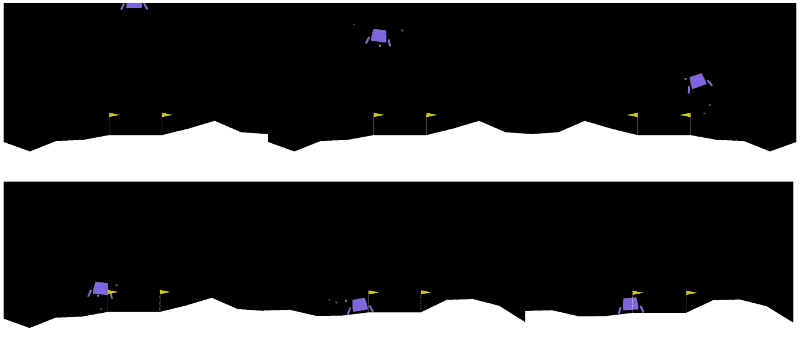

# 附录

# 1\. 强化学习简介

## 活动 1.01：测量随机智能体的表现

1.  导入所需的库—`abc`、`numpy`和`gym`：

    ```py
    import abc
    import numpy as np
    import gym
    ```

1.  定义表示智能体的抽象类：

    ```py
    """
    Abstract class representing the agent
    Init with the action space and the function pi returning the action
    """
    class Agent:
        def __init__(self, action_space: gym.spaces.Space):
            """
            Constructor of the agent class.
            Args:
                action_space (gym.spaces.Space): environment action space
            """
            raise NotImplementedError("This class cannot be instantiated.")
        @abc.abstractmethod
        def pi(self, state: np.ndarray) -> np.ndarray:
            """
            Agent's policy.
            Args:
                state (np.ndarray): environment state
            Returns:
                The selected action
            """
            pass
    ```

    智能体仅通过构造函数和一个抽象方法`pi`表示。该方法是实际的策略；它以环境状态为输入，返回选定的动作。

1.  定义连续智能体。连续智能体必须根据传递给构造函数的动作空间初始化概率分布：

    ```py
    class ContinuousAgent(Agent):
        def __init__(self, action_space: gym.spaces.Space, seed=46):
            # setup seed
            np.random.seed(seed)
            # check the action space type
            if not isinstance(action_space, gym.spaces.Box):
                raise ValueError\
                      ("This is a Continuous Agent pass as "\
                       "input a Box Space.")
    ```

1.  如果上下界是无限的，则概率分布只是一个以 0 为中心的正态分布，尺度等于 1：

    ```py
            """
            initialize the distribution according to the action space type
            """
            if (action_space.low == -np.inf) and \
               (action_space.high == np.inf):
                # the distribution is a normal distribution
                self._pi = lambda: np.random.normal\
                                   (loc=0, scale=1, \
                                    size=action_space.shape)
                return
    ```

1.  如果上下界都是有限的，则分布是定义在该范围内的均匀分布：

    ```py
            if (action_space.low != -np.inf) and \
               (action_space.high != np.inf):
                # the distribution is a uniform distribution
                self._pi = lambda: np.random.uniform\
                           (low=action_space.low, \
                            high=action_space.high, \
                            size=action_space.shape)
                return
    ```

    如果下界是，则概率分布是一个平移的负指数分布：

    ```py
            if action_space.low == -np.inf:
                # negative exponential distribution
                self._pi = (lambda: -np.random.exponential\
                            (size=action_space.shape)
                            + action_space.high)
                return
    ```

    如果上界是，则概率分布是一个平移的指数分布：

    ```py
            if action_space.high == np.inf:
                # exponential distribution
                self._pi = (lambda: np.random.exponential\
                            (size=action_space.shape)
                            + action_space.low)
                return
    ```

1.  定义`pi`方法，这只是对构造函数中定义的分布的调用：

    ```py
        def pi(self, observation: np.ndarray) -> np.ndarray:
            """
            Policy: simply call the internal _pi().

            This is a random agent, so the action is independent 
            from the observation.
            For real agents the action depends on the observation.
            """
            return self._pi()
    ```

1.  我们准备定义离散智能体。与之前一样，智能体必须根据传递的动作空间正确初始化动作分布：

    ```py
    class DiscreteAgent(Agent):
        def __init__(self, action_space: gym.spaces.Space, seed=46):
            # setup seed
            np.random.seed(seed)
            # check the action space type
            if not isinstance(action_space, gym.spaces.Discrete):
                raise ValueError("This is a Discrete Agent pass "\
                                 "as input a Discrete Space.")
            """
            initialize the distribution according to the action 
            space n attribute
            """
            # the distribution is a uniform distribution
            self._pi = lambda: np.random.randint\
                       (low=0, high=action_space.n)
        def pi(self, observation: np.ndarray) -> np.ndarray:
            """
            Policy: simply call the internal _pi().
            This is a random agent, so the action is independent 
            from the observation.
            For real agents the action depends on the observation.
            """
            return self._pi()
    ```

1.  现在，定义一个实用函数来根据动作空间创建正确的智能体类型是有用的：

    ```py
    def make_agent(action_space: gym.spaces.Space, seed=46):
        """
        Returns the correct agent based on the action space type
        """
        if isinstance(action_space, gym.spaces.Discrete):
            return DiscreteAgent(action_space, seed)
        if isinstance(action_space, gym.spaces.Box):
            return ContinuousAgent(action_space, seed)
        raise ValueError("Only Box spaces or Discrete Spaces "\
                         "are allowed, check the action space of "\
                         "the environment")
    ```

1.  最后一步是定义强化学习循环，其中智能体与环境互动并收集奖励。

    定义参数，然后创建环境和智能体：

    ```py
    # Environment Name
    env_name = "CartPole-v0"
    # Number of episodes
    episodes = 10
    # Number of Timesteps of each episode
    timesteps = 100
    # Discount factor
    gamma = 1.0
    # seed environment
    seed = 46
    # Needed to show the environment in a notebook
    from gym import wrappers
    env = gym.make(env_name)
    env.seed(seed)
    # the last argument is needed to record all episodes
    # otherwise gym would record only some of them
    # The monitor saves the episodes inside the folder ./gym-results
    env = wrappers.Monitor(env, "./gym-results", force=True, \
                           video_callable=lambda episode_id: True)
    agent = make_agent(env.action_space, seed)
    ```

1.  我们需要跟踪每个回合的回报；为此，我们可以使用一个简单的列表：

    ```py
    # list of returns
    episode_returns = []
    ```

1.  为每个回合开始一个循环：

    ```py
    # loop for the episodes
    for episode_number in range(episodes):
        # here we are inside an episode
    ```

1.  初始化计算累计折扣因子和当前回合回报的变量：

    ```py
        # reset cumulated gamma
        gamma_cum = 1
        # return of the current episode
        episode_return = 0
    ```

1.  重置环境并获取第一个观察：

    ```py
        # the reset function resets the environment and returns
        # the first environment observation
        observation = env.reset()
    ```

1.  循环执行若干时间步：

    ```py
        # loop for the given number of timesteps or
        # until the episode is terminated
        for timestep_number in range(timesteps):
    ```

1.  渲染环境，选择动作，然后应用它：

    ```py
            # if you want to render the environment
            # uncomment the following line
            # env.render()
            # select the action
            action = agent.pi(observation)
            # apply the selected action by calling env.step
            observation, reward, done, info = env.step(action)
    ```

1.  增加回报，并计算累计折扣因子：

    ```py
            # increment the return
            episode_return += reward * gamma_cum
            # update the value of cumulated discount factor
            gamma_cum = gamma_cum * gamma
    ```

1.  如果回合已结束，则跳出时间步循环：

    ```py
            """
            if done the episode is terminated, we have to reset
            the environment
            """
            if done:
                print(f"Episode Number: {episode_number}, \
    Timesteps: {timestep_number}, Return: {episode_return}")
                # break from the timestep loop
                break
    ```

1.  在时间步循环结束后，我们必须通过将当前回报添加到每个回合的回报列表中来记录当前回报：

    ```py
        episode_returns.append(episode_return)
    ```

1.  在回合循环结束后，关闭环境并计算`statistics`：

    ```py
    # close the environment
    env.close()
    # Calculate return statistics
    avg_return = np.mean(episode_returns)
    std_return = np.std(episode_returns)
    var_return = std_return ** 2  # variance is std²
    print(f"Statistics on Return: Average: {avg_return}, \
    Variance: {var_return}")
    ```

    你将获得以下结果：

    ```py
    Episode Number: 0, Timesteps: 27, Return: 28.0
    Episode Number: 1, Timesteps: 9, Return: 10.0
    Episode Number: 2, Timesteps: 13, Return: 14.0
    Episode Number: 3, Timesteps: 16, Return: 17.0
    Episode Number: 4, Timesteps: 31, Return: 32.0
    Episode Number: 5, Timesteps: 10, Return: 11.0
    Episode Number: 6, Timesteps: 14, Return: 15.0
    Episode Number: 7, Timesteps: 11, Return: 12.0
    Episode Number: 8, Timesteps: 10, Return: 11.0
    Episode Number: 9, Timesteps: 30, Return: 31.0
    Statistics on Return: Average: 18.1, Variance: 68.89000000000001
    ```

在本活动中，我们实现了两种不同类型的智能体：离散智能体，适用于离散环境，和连续智能体，适用于连续环境。

此外，你可以使用以下代码在笔记本中渲染回合：

```py
# Render the episodes
import io
import base64
from IPython.display import HTML, display
episodes_to_watch = 1
for episode in range(episodes_to_watch):
    video = io.open(f"./gym-results/openaigym.video\
.{env.file_infix}.video{episode:06d}.mp4", "r+b").read()
    encoded = base64.b64encode(video)
    display(
        HTML(
            data="""
        <video width="360" height="auto" alt="test" controls>
        <source src="img/mp4;base64,{0}" type="video/mp4" />
        </video>""".format(
                encoded.decode("ascii")
            )
        )
    )
```

你可以看到回合持续时间不长。这是因为动作是随机执行的，因此在若干时间步后，杆子会倒下。

注意

要访问此特定部分的源代码，请参阅[`packt.live/3fbxR3Y`](https://packt.live/3fbxR3Y)。

本节当前没有在线交互式示例，需要在本地运行。

离散代理和连续代理是在面对新强化学习问题时的两种不同可能性。

我们设计的代理非常灵活，可以应用于几乎所有环境，而无需更改代码。

我们还实现了一个简单的强化学习循环，并衡量了代理在经典强化学习问题中的表现。

# 2\. 马尔可夫决策过程与贝尔曼方程

## 活动 2.01：求解 Gridworld

1.  导入所需的库：

    ```py
    from enum import Enum, auto
    import matplotlib.pyplot as plt
    import numpy as np
    from scipy import linalg
    from typing import Tuple
    ```

1.  定义 `visualization` 函数：

    ```py
    # helper function
    def vis_matrix(M, cmap=plt.cm.Blues):
        fig, ax = plt.subplots()
        ax.matshow(M, cmap=cmap)
        for i in range(M.shape[0]):
            for j in range(M.shape[1]):
                c = M[j, i]
                ax.text(i, j, "%.2f" % c, va="center", ha="center")
    ```

1.  定义可能的动作：

    ```py
    # Define the actions
    class Action(Enum):
        UP = auto()
        DOWN = auto()
        LEFT = auto()
        RIGHT = auto()
    ```

1.  定义 `Policy` 类，表示随机策略：

    ```py
    # Agent Policy, random
    class Policy:
        def __init__(self):
            self._possible_actions = [action for action in Action]
            self._action_probs = {a: 1 / len(self._possible_actions) \
                                  for a in self._possible_actions}
        def __call__(self, state: Tuple[int, int], \
                     action: Action) -> float:
            """
            Returns the action probability
            """
            assert action in self._possible_actions
            # state is unused for this policy
            return self._action_probs[action]
    ```

1.  定义 `Environment` 类和 `step` 函数：

    ```py
    class Environment:
        def __init__(self):
            self.grid_width = 5
            self.grid_height = 5
            self._good_state1 = (0, 1)
            self._good_state2 = (0, 3)
            self._to_state1 = (4, 2)
            self._to_state2 = (2, 3)
            self._bad_state1 = (1, 1)
            self._bad_state2 = (4, 4)
            self._bad_states = [self._bad_state1, self._bad_state2]
            self._good_states = [self._good_state1, self._good_state2]
            self._to_states = [self._to_state1, self._to_state2]
            self._good_rewards = [10, 5]
        def step(self, state, action):
            i, j = state
            # search among good states
            for good_state, reward, \
                to_state in zip(self._good_states, \
                                self._good_rewards, \
                                self._to_states):
                if (i, j) == good_state:
                    return (to_state, reward)
            reward = 0
            # if the state is a bad state, the reward is -1
            if state in self._bad_states:
                reward = -1
            # calculate next state based on the action
            if action == Action.LEFT:
                j_next = max(j - 1, 0)
                i_next = i
                if j - 1 < 0:
                    reward = -1
            elif action == Action.RIGHT:
                j_next = min(j + 1, self.grid_width - 1)
                i_next = i
                if j + 1 > self.grid_width - 1:
                    reward = -1
            elif action == Action.UP:
                j_next = j
                i_next = max(i - 1, 0)
                if i - 1 < 0:
                    reward = -1
            elif action == Action.DOWN:
                j_next = j
                i_next = min(i + 1, self.grid_height - 1)
                if i + 1 > self.grid_height - 1:
                    reward = -1
            else:
                 raise ValueError("Invalid action")
            return ((i_next, j_next), reward)
    ```

1.  针对所有状态和动作进行循环，构建转移矩阵和奖励矩阵：

    ```py
    pi = Policy()
    env = Environment()
    # setup probability matrix and reward matrix
    P = np.zeros((env.grid_width*env.grid_height, \
                  env.grid_width*env.grid_height))
    R = np.zeros_like(P)
    possible_actions = [action for action in Action]
    # Loop for all states and fill up P and R
    for i in range(env.grid_height):
        for j in range(env.grid_width):
            state = (i, j)
            # loop for all action and setup P and R
            for action in possible_actions:
                next_state, reward = env.step(state, action)
                (i_next, j_next) = next_state
                P[i*env.grid_width+j, \
                  i_next*env.grid_width \
                  + j_next] += pi(state, action)
                """
                the reward depends only on the starting state and 
                the final state
                """
                R[i*env.grid_width+j, \
                  i_next*env.grid_width + j_next] = reward
    ```

1.  检查矩阵的正确性：

    ```py
    # check the correctness
    assert((np.sum(P, axis=1) == 1).all())
    ```

1.  计算每个状态的预期奖励：

    ```py
    # expected reward for each state
    R_expected = np.sum(P * R, axis=1, keepdims=True)
    ```

1.  使用该函数可视化预期奖励：

    ```py
    # reshape the state values in a matrix
    R_square = R_expected.reshape((env.grid_height,env.grid_width))
    # Visualize
    vis_matrix(R_square, cmap=plt.cm.Reds)
    ```

    该函数使用 Matplotlib 可视化矩阵。你应该看到类似于以下内容：

    

    ](img/B16182_02_62.jpg)

    图 2.62：每个状态的预期奖励

    前面的图像是一个颜色表示，展示了在当前策略下与每个状态相关联的预期奖励。注意，坏状态的预期奖励恰好等于 `-1`。好状态的预期奖励分别恰好等于 `10` 和 `5`。

1.  现在设置贝尔曼期望方程的矩阵形式：

    ```py
    # define the discount factor
    gamma = 0.9
    # Now it is possible to solve the Bellman Equation
    A = np.eye(env.grid_width*env.grid_height) - gamma * P
    B = R_expected
    ```

1.  求解贝尔曼方程：

    ```py
    # solve using scipy linalg
    V = linalg.solve(A, B)
    ```

1.  可视化结果：

    ```py
    # reshape the state values in a matrix
    V_square = V.reshape((env.grid_height,env.grid_width))
    # visualize results
    vis_matrix(V_square, cmap=plt.cm.Reds)
    ```


](img/B16182_02_63.jpg)

图 2.63：Gridworld 的状态值

注意，好状态的值小于这些状态的预期奖励。这是因为着陆状态的预期奖励为负，或者着陆状态接近奖励为负的状态。你可以看到，值较高的状态是状态 ，接下来是状态 。另一个有趣的现象是位置 (`0, 2`) 上的状态值较高，且靠近好状态。

注意

要访问此部分的源代码，请参考 [`packt.live/2Al9xOB`](https://packt.live/2Al9xOB)。

你也可以在线运行此示例，网址为 [`packt.live/2UChxBy`](https://packt.live/2UChxBy)。

在这个活动中，我们尝试了 Gridworld 环境，这是最常见的强化学习玩具环境之一。我们定义了一个随机策略，并使用 `scipy.linalg.solve` 求解贝尔曼期望方程，以找到该策略的状态值。

重要的是在可能的情况下可视化结果，以便更好地理解并发现任何错误。

# 3\. 使用 TensorFlow 2 进行深度学习实践

## 活动 3.01：使用 TensorFlow 数据集和 TensorFlow 2 分类时尚服装

1.  导入所有所需的模块：

    ```py
    from __future__ import absolute_import, division, \
    print_function, unicode_literals
    import numpy as np
    import matplotlib.pyplot as plt
    # TensorFlow
    import tensorflow as tf
    import tensorflow_datasets as tfds
    ```

1.  使用 TensorFlow 数据集导入 Fashion MNIST 数据集，并将其拆分为训练集和测试集。然后，创建一个类别列表：

    ```py
    # Construct a tf.data.Dataset
    (train_images, train_labels), (test_images, test_labels) = \
    tfds.as_numpy(tfds.load('fashion_mnist', \
                            split=['train', 'test'],\
                            batch_size=-1, as_supervised=True,))
    train_images = np.squeeze(train_images)
    test_images = np.squeeze(test_images)
    classes = ['T-shirt/top', 'Trouser', 'Pullover', 'Dress', \
               'Coat','Sandal', 'Shirt', 'Sneaker', 'Bag', \
               'Ankle boot']
    ```

1.  探索数据集，熟悉输入特征，即形状、标签和类别：

    ```py
    print("Training dataset shape =", train_images.shape)
    print("Training labels length =", len(train_labels))
    print("Some training labels =", train_labels[:5])
    print("Test dataset shape =", test_images.shape)
    print("Test labels length =", len(test_labels))
    ```

    输出将如下所示：

    ```py
    Training dataset shape = (60000, 28, 28)
    Training labels length = 60000
    Some training labels = [2 1 8 4 1]
    Test dataset shape = (10000, 28, 28)
    Test labels length = 10000
    ```

1.  可视化一些训练集实例。

    观察图像的显示效果也很有用。以下代码片段展示了第一个训练集实例：

    ```py
    plt.figure()
    plt.imshow(train_images[0])
    plt.colorbar()
    plt.grid(False)
    plt.show()
    ```

    输出图像将如下所示：

    

    图 3.30：第一个训练图像图

1.  执行特征归一化：

    ```py
    train_images = train_images / 255.0
    test_images = test_images / 255.0
    ```

1.  现在，让我们通过绘制`25`个样本及其对应的标签来查看一些训练集实例：

    ```py
    plt.figure(figsize=(10,10))
    for i in range(25):
        plt.subplot(5,5,i+1)
        plt.xticks([])
        plt.yticks([])
        plt.grid(False)
        plt.imshow(train_images[i], cmap=plt.cm.binary)
        plt.xlabel(classes[train_labels[i]])
    plt.show()
    ```

    输出图像将如下所示：

    

    图 3.31：一组 25 个训练样本及其对应的标签

1.  构建分类模型。首先，使用一系列层创建一个模型：

    ```py
    model = tf.keras.Sequential\
            ([tf.keras.layers.Flatten(input_shape=(28, 28)),\
              tf.keras.layers.Dense(128, activation='relu'),\
              tf.keras.layers.Dense(10)])
    ```

1.  然后，将模型与`优化器`、`损失`函数和`指标`关联起来：

    ```py
    model.compile(optimizer='adam',\
                  loss=tf.keras.losses.SparseCategoricalCrossentropy\
                  (from_logits=True), metrics=['accuracy'])
    ```

1.  训练深度神经网络：

    ```py
    model.fit(train_images, train_labels, epochs=10)
    ```

    最后的输出行将如下所示：

    ```py
    Epoch 9/1060000/60000 [==============================] \
    - 2s 40us/sample - loss: 0.2467 - accuracy: 0.9076
    Epoch 10/1060000/60000 [==============================] \
    - 2s 40us/sample - loss: 0.2389 - accuracy: 0.9103
    ```

1.  测试模型的准确性。准确率应超过 88%。

1.  在测试集上评估模型，并打印准确率得分：

    ```py
    test_loss, test_accuracy = model.evaluate\
                               (test_images, test_labels, verbose=2)
    print('\nTest accuracy:', test_accuracy)
    ```

    输出将如下所示：

    ```py
    10000/10000 - 0s - loss: 0.3221 - accuracy: 0.8878
    Test accuracy: 0.8878
    ```

    注意

    由于随机抽样和可变的随机种子，准确率可能会有所不同。

1.  执行推理并检查预测结果与真实值的对比。

    首先，向模型中添加一个`softmax`层，使其输出概率而不是对数几率。然后，使用以下代码打印出第一个测试实例的概率：

    ```py
    probability_model = tf.keras.Sequential\
                        ([model,tf.keras.layers.Softmax()])
    predictions = probability_model.predict(test_images)
    print(predictions[0:3])
    ```

    输出将如下所示：

    ```py
    [[3.85897374e-06 2.33953915e-06 2.30801385e-02 4.74092474e-07
      9.55752671e-01 1.56392260e-10 2.11589299e-02 8.57651870e-08
      1.49855202e-06 1.05843508e-10]
    ```

1.  接下来，将一个模型的预测（即最高预测概率的类别）与第一个测试实例的真实标签进行对比：

    ```py
    print("Class ID, predicted | real =", \
          np.argmax(predictions[0]), "|", test_labels[0])
    ```

    输出将如下所示：

    ```py
    Class ID, predicted | real = 4 | 4
    ```

1.  为了进行更清晰的对比，创建以下两个函数。第一个函数绘制第`i`个测试集实例图像，并显示最高预测概率的类别、其百分比概率，以及括号中的真实标签。对于正确预测，标题将显示为`蓝色`，对于错误预测，则显示为`红色`：

    ```py
    def plot_image(i, predictions_array, true_label, img):
        predictions_array, true_label, img = predictions_array,\
                                             true_label[i], img[i]
        plt.grid(False)
        plt.xticks([])
        plt.yticks([])
        plt.imshow(img, cmap=plt.cm.binary)
        predicted_label = np.argmax(predictions_array)
        if predicted_label == true_label:
            color = 'blue'
        else:
            color = 'red'
        plt.xlabel("{} {:2.0f}% ({})".format\
                   (classes[predicted_label], \
                    100*np.max(predictions_array),\
                    classes[true_label]),\
                    color=color)
    ```

1.  第二个函数创建第二个图像，显示所有类别的预测概率的条形图。如果预测正确，它将以`蓝色`标记概率最高的类别，若预测错误，则用`红色`标记。如果是后者，与正确标签对应的条形图将以`蓝色`标记：

    ```py
    def plot_value_array(i, predictions_array, true_label):
        predictions_array, true_label = predictions_array,\
                                        true_label[i]
        plt.grid(False)
        plt.xticks(range(10))
        plt.yticks([])
        thisplot = plt.bar(range(10), predictions_array,\
                   color="#777777")
        plt.ylim([0, 1])
        predicted_label = np.argmax(predictions_array)
        thisplot[predicted_label].set_color('red')
        thisplot[true_label].set_color('blue')
    ```

1.  使用这两个函数，我们可以检查测试集中的每个实例。在下面的代码片段中，正在绘制第一个测试实例：

    ```py
    i = 0
    plt.figure(figsize=(6,3))
    plt.subplot(1,2,1)
    plot_image(i, predictions[i], test_labels, test_images)
    plt.subplot(1,2,2)
    plot_value_array(i, predictions[i],  test_labels)
    plt.show()
    ```

    输出将如下所示：

    

    图 3.32：第一个测试实例，正确预测

1.  同样的方法也可以用来绘制用户自定义数量的测试实例，并将输出安排在子图中，如下所示：

    ```py
    """
    Plot the first X test images, their predicted labels, and the true labels.
    Color correct predictions in blue and incorrect predictions in red.
    """
    num_rows = 5
    num_cols = 3
    num_images = num_rows*num_cols
    plt.figure(figsize=(2*2*num_cols, 2*num_rows))
    for i in range(num_images):
        plt.subplot(num_rows, 2*num_cols, 2*i+1)
        plot_image(i, predictions[i], test_labels, test_images)
        plt.subplot(num_rows, 2*num_cols, 2*i+2)
        plot_value_array(i, predictions[i], test_labels)
    plt.tight_layout()
    plt.show()
    ```

    输出将如下所示：

    

    ](img/B16182_04_14.jpg)

图 3.33：前 25 个测试实例及其预测类别与真实标签的对比

注意

要访问此特定部分的源代码，请参考 [`packt.live/3dXv3am`](https://packt.live/3dXv3am)。

你还可以在线运行这个示例，地址是 [`packt.live/2Ux5JR5`](https://packt.live/2Ux5JR5)。

在这个活动中，我们面临了一个与现实世界问题非常相似的挑战。我们必须处理复杂的高维输入——在我们的案例中是灰度图像——并且我们希望构建一个能够自动将它们分成 10 个不同类别的模型。得益于深度学习的强大能力和最先进的机器学习框架，我们成功构建了一个全连接神经网络，达到了超过 88% 的分类准确率。

# 4\. 使用 OpenAI 和 TensorFlow 开始强化学习

## 活动 4.01：训练强化学习智能体玩经典视频游戏

1.  导入所有必要的模块，包括 OpenAI Baselines 和 TensorFlow，以便使用 `PPO` 算法：

    ```py
    from baselines.ppo2.ppo2 import learn
    from baselines.ppo2 import defaults
    from baselines.common.vec_env import VecEnv, VecFrameStack
    from baselines.common.cmd_util import make_vec_env, make_env
    from baselines.common.models import register
    import tensorflow as tf
    ```

1.  为策略网络定义并注册一个自定义卷积神经网络：

    ```py
    @register("custom_cnn")
    def custom_cnn():
        def network_fn(input_shape, **conv_kwargs):
            """
            Custom CNN
            """
            print('input shape is {}'.format(input_shape))
            x_input = tf.keras.Input\
                      (shape=input_shape, dtype=tf.uint8)
            h = x_input
            h = tf.cast(h, tf.float32) / 255.
            h = tf.keras.layers.Conv2D\
                (filters=32,kernel_size=8,strides=4, \
                 padding='valid', data_format='channels_last',\
                 activation='relu')(h)
            h2 = tf.keras.layers.Conv2D\
                 (filters=64, kernel_size=4,strides=2,\
                  padding='valid', data_format='channels_last',\
                  activation='relu')(h)
            h3 = tf.keras.layers.Conv2D\
                 (filters=64, kernel_size=3,strides=1,\
                  padding='valid', data_format='channels_last',\
                  activation='relu')(h2)
            h3 = tf.keras.layers.Flatten()(h3)
            h3 = tf.keras.layers.Dense\
                 (units=512, name='fc1', activation='relu')(h3)
            network = tf.keras.Model(inputs=[x_input], outputs=[h3])
            network.summary()
            return network
        return network_fn
    ```

1.  创建一个函数，以 OpenAI Baselines 所需的格式构建环境：

    ```py
    def build_env(env_id, env_type):
        if env_type in {'atari', 'retro'}:
            env = make_vec_env(env_id, env_type, 1, None, \
                               gamestate=None, reward_scale=1.0)
            env = VecFrameStack(env, 4)
        else:
            env = make_vec_env(env_id, env_type, 1, None,\
                               reward_scale=1.0,\
                               flatten_dict_observations=True)
        return env
    ```

1.  构建 `PongNoFrameskip-v4` 环境，选择所需的策略网络参数并进行训练：

    ```py
    env_id = 'PongNoFrameskip-v0'
    env_type = 'atari'
    print("Env type = ", env_type)
    env = build_env(env_id, env_type)
    model = learn(network="custom_cnn", env=env, total_timesteps=1e4)
    ```

    在训练过程中，模型会输出类似以下内容（这里只报告了部分行）：

    ```py
    Env type =  atari
    Logging to /tmp/openai-2020-05-11-16-19-42-770612
    input shape is (84, 84, 4)
    Model: "model"
    _________________________________________________________________
    Layer (type)                 Output Shape              Param #  
    =================================================================
    input_1 (InputLayer)         [(None, 84, 84, 4)]       0        
    _________________________________________________________________
    tf_op_layer_Cast (TensorFlow [(None, 84, 84, 4)]       0        
    _________________________________________________________________
    tf_op_layer_truediv (TensorF [(None, 84, 84, 4)]       0        
    _________________________________________________________________
    conv2d (Conv2D)              (None, 20, 20, 32)        8224     
    _________________________________________________________________
    conv2d_1 (Conv2D)            (None, 9, 9, 64)          32832    
    _________________________________________________________________
    conv2d_2 (Conv2D)            (None, 7, 7, 64)          36928    
    _________________________________________________________________
    flatten (Flatten)            (None, 3136)              0        
    _________________________________________________________________
    fc1 (Dense)                  (None, 512)               1606144  
    =================================================================
    Total params: 1,684,128
    Trainable params: 1,684,128
    Non-trainable params: 0
    _________________________________________________________________
    --------------------------------------------
    | eplenmean               | 1e+03          |
    | eprewmean               | -20            |
    | fps                     | 213            |
    | loss/approxkl           | 0.00012817292  |
    | loss/clipfrac           | 0.0            |
    | loss/policy_entropy     | 1.7916294      |
    | loss/policy_loss        | -0.00050599687 |
    | loss/value_loss         | 0.06880974     |
    | misc/explained_variance | 0.000675       |
    | misc/nupdates           | 1              |
    | misc/serial_timesteps   | 2048           |
    | misc/time_elapsed       | 9.6            |
    | misc/total_timesteps    | 2048           |
    --------------------------------------------
    ```

1.  在环境中运行训练好的智能体并打印累积奖励：

    ```py
    obs = env.reset()
    if not isinstance(env, VecEnv):
        obs = np.expand_dims(np.array(obs), axis=0)
    episode_rew = 0
    while True:
        actions, _, state, _ = model.step(obs)
        obs, reward, done, info = env.step(actions.numpy())
        if not isinstance(env, VecEnv):
            obs = np.expand_dims(np.array(obs), axis=0)
        env.render()
        print("Reward = ", reward)
        episode_rew += reward
        if done:
            print('Episode Reward = {}'.format(episode_rew))
            break
    env.close()
    ```

    以下几行显示了输出的最后部分：

    ```py
    [...]
    Reward =  [0.]
    Reward =  [0.]
    Reward =  [0.]
    Reward =  [0.]
    Reward =  [0.]
    Reward =  [0.]
    Reward =  [0.]
    Reward =  [0.]
    Reward =  [0.]
    Reward =  [-1.]
    Episode Reward = [-17.]
    ```

    它还呈现了环境，实时显示环境中的变化：

    

    ](img/B16182_04_14.jpg)

    图 4.14：渲染后的实时环境中的一帧

1.  使用内置的 OpenAI Baselines 运行脚本，在 `PongNoFrameskip-v0` 环境中训练 PPO：

    ```py
    !python -m baselines.run --alg=ppo2 --env=PongNoFrameskip-v0 
    --num_timesteps=2e7 --save_path=./models/Pong_20M_ppo2 
    --log_path=./logs/Pong/
    ```

    输出的最后几行将类似于以下内容：

    ```py
    Stepping environment...
    -------------------------------------------
    | eplenmean               | 867           |
    | eprewmean               | -20.8         |
    | fps                     | 500           |
    | loss/approxkl           | 4.795634e-05  |
    | loss/clipfrac           | 0.0           |
    | loss/policy_entropy     | 1.7456135     |
    | loss/policy_loss        | -0.0005875508 |
    | loss/value_loss         | 0.050125826   |
    | misc/explained_variance | 0.145         |
    | misc/nupdates           | 19            |
    | misc/serial_timesteps   | 2432          |
    | misc/time_elapsed       | 22            |
    | misc/total_timesteps    | 9728          |
    -------------------------------------------
    ```

1.  使用内置的 OpenAI Baselines 运行脚本，在 `PongNoFrameskip-v0` 环境中运行训练好的模型：

    ```py
    !python -m baselines.run --alg=ppo2 --env=PongNoFrameskip-v0
        --num_timesteps=0 --load_path=./models/Pong_20M_ppo2 --play
    ```

    输出将类似于以下内容：

    ```py
    episode_rew=-21.0
    episode_rew=-20.0
    episode_rew=-20.0
    episode_rew=-19.0
    ```

1.  使用提供的预训练权重查看训练好的智能体的表现：

    ```py
    !wget -O pong_20M_ppo2.tar.gz \
    https://github.com/PacktWorkshops\
    /The-Reinforcement-Learning-Workshop/blob/master\
    /Chapter04/pong_20M_ppo2.tar.gz?raw=true
    ```

    输出将如下所示：

    ```py
    Saving to: 'pong_20M_ppo2.tar.gz'
    pong_20M_ppo2.tar.g 100%[===================>]  17,44M  15,
    1MB/s    in 1,2s   
    2020-05-11 16:19:11 (15,1 MB/s) - 'pong_20M_ppo2.tar.gz' saved [18284569/18284569]
    ```

    你可以使用以下命令读取 `.tar` 文件：

    ```py
    !tar xvzf pong_20M_ppo2.tar.gz
    ```

    输出将如下所示：

    ```py
    pong_20M_ppo2/ckpt-1.data-00000-of-00001
    pong_20M_ppo2/ckpt-1.index
    pong_20M_ppo2/
    pong_20M_ppo2/checkpoint
    ```

1.  使用内置的 OpenAI Baselines 运行脚本，在 `PongNoFrameskip-v0` 上训练 PPO：

    ```py
    !python -m baselines.run --alg=ppo2 --env=PongNoFrameskip-v0 --num_timesteps=0 --load_path=./pong_20M_ppo2 –play
    ```

    注意

    要访问此特定部分的源代码，请参考 [`packt.live/30yFmOi`](https://packt.live/30yFmOi)。

    本部分目前没有在线互动示例，需在本地运行。

在本活动中，我们学习了如何训练一个最先进的强化学习智能体，该智能体通过仅查看屏幕像素，就能在玩经典的 Atari 视频游戏时实现超越人类的表现。我们利用卷积神经网络对环境观察进行编码，并利用最先进的 OpenAI 工具成功训练了 PPO 算法。

# 5\. 动态规划

## 活动 5.01：在 FrozenLake-v0 环境中实现策略和价值迭代

1.  导入所需的库：

    ```py
    import numpy as np
    import gym
    ```

1.  初始化环境并重置当前环境。在初始化器中将`is_slippery=False`。显示动作空间的大小和可能的状态数量：

    ```py
    def initialize_environment():
        """initialize the OpenAI Gym environment"""
        env = gym.make("FrozenLake-v0", is_slippery=False)
        print("Initializing environment")
        # reset the current environment
        env.reset()
        # show the size of the action space
        action_size = env.action_space.n
        print(f"Action space: {action_size}")
        # Number of possible states
        state_size = env.observation_space.n
        print(f"State space: {state_size}")
        return env
    ```

1.  执行策略评估迭代，直到最小变化小于`smallest_change`：

    ```py
    def policy_evaluation(V, current_policy, env, \
                          gamma, small_change):
        """
        Perform policy evaluation iterations until the smallest 
        change is less than
        'smallest_change'
        Args:
            V: the value function table
            current_policy: current policy
            env: the OpenAI FrozenLake-v0 environment
            gamma: future reward coefficient
            small_change: how small should the change be for the 
              iterations to stop
        Returns:
            V: the value function after convergence of the evaluation
        """
        state_size = env.observation_space.n
        while True:
            biggest_change = 0
            # loop through every state present
            for state in range(state_size):
                old_V = V[state]
    ```

1.  根据当前策略执行动作：

    ```py
                action = current_policy[state]
                prob, new_state, reward, done = env.env.P[state]\
                                                [action][0]
    ```

1.  使用贝尔曼最优方程更新 :

    ```py
                V[state] = reward + gamma * V[new_state]
                # if the biggest change is small enough then it means
                # the policy has converged, so stop.
                biggest_change = max(biggest_change, abs(V[state] \
                                     - old_V))
            if biggest_change < small_change:
                break
        return V
    ```

1.  使用贝尔曼最优方程进行策略改进：

    ```py
    def policy_improvement(V, current_policy, env, gamma):
        """
        Perform policy improvement using the Bellman Optimality Equation.
        Args:
            V: the value function table
            current_policy: current policy
            env: the OpenAI FrozenLake-v0 environment
            gamma: future reward coefficient
        Returns:
            current_policy: the updated policy
            policy_changed: True, if the policy was changed, else, 
              False
        """
        state_size = env.observation_space.n
        action_size = env.action_space.n
        policy_changed = False
        for state in range(state_size):
            best_val = -np.inf
            best_action = -1
            # loop over all actions and select the best one
            for action in range(action_size):
                prob, new_state, reward, done = env.env.\
                                                P[state][action][0]
    ```

1.  通过执行此动作计算未来的奖励。请注意，我们使用的是简化方程，因为我们没有非一的转移概率：

    ```py
                future_reward = reward + gamma * V[new_state]
                if future_reward > best_val:
                    best_val = future_reward
                    best_action = action
    ```

1.  使用`assert`语句，我们可以避免进入不期望的情况：

    ```py
            assert best_action != -1
            if current_policy[state] != best_action:
                policy_changed = True
    ```

1.  更新当前状态下的最佳动作：

    ```py
            current_policy[state] = best_action
        # if the policy didn't change, it means we have converged
        return current_policy, policy_changed
    ```

1.  使用策略迭代为 FrozenLake-v0 环境找到最优策略：

    ```py
    def policy_iteration(env):
        """
        Find the most optimal policy for the FrozenLake-v0 
        environment using Policy
        Iteration
        Args:
            env: FrozenLake-v0 environment
        Returns:
            policy: the most optimal policy
        """
        V = dict()
        """
        initially the value function for all states
        will be random values close to zero
        """
        state_size = env.observation_space.n
        for i in range(state_size):
            V[i] = np.random.random()
        # when the change is smaller than this, stop
        small_change = 1e-20
        # future reward coefficient
        gamma = 0.9
        episodes = 0
        # train for these many episodes
        max_episodes = 50000
        # initially we will start with a random policy
        current_policy = dict()
        for s in range(state_size):
            current_policy[s] = env.action_space.sample()
        while episodes < max_episodes:
            episodes += 1
            # policy evaluation
            V = policy_evaluation(V, current_policy,\
                                  env, gamma, small_change)
            # policy improvement
            current_policy, policy_changed = policy_improvement\
                                             (V, current_policy, \
                                              env, gamma)
            # if the policy didn't change, it means we have converged
            if not policy_changed:
                break
        print(f"Number of episodes trained: {episodes}")
        return current_policy
    ```

1.  在 FrozenLake-v0 环境中执行测试：

    ```py
    def play(policy, render=False):
        """
        Perform a test pass on the FrozenLake-v0 environment
        Args:
            policy: the policy to use
            render: if the result should be rendered at every step. 
              False by default
        """
        env = initialize_environment()
        rewards = []
    ```

1.  定义智能体允许采取的最大步数。如果在此时间内未找到解决方案，则称之为一个回合，并继续：

    ```py
        max_steps = 25
        test_episodes = 50
        for episode in range(test_episodes):
            # reset the environment every new episode
            state = env.reset()
            total_rewards = 0
            print("*" * 100)
            print("Episode {}".format(episode))
            for step in range(max_steps):
    ```

1.  在当前状态下选择具有最高 Q 值的动作：

    ```py
                action = policy[state]
                new_state, reward, done, info = env.step(action)
                if render:
                    env.render()
                total_rewards += reward
                if done:
                    rewards.append(total_rewards)
                    print("Score", total_rewards)
                    break
                state = new_state
        env.close()
        print("Average Score", sum(rewards) / test_episodes)
    ```

1.  随机在`FrozenLake-v0`环境中执行操作：

    ```py
    def random_step(n_steps=5):
        """
        Steps through the FrozenLake-v0 environment randomly
        Args:
            n_steps: Number of steps to step through
        """
        # reset the environment
        env = initialize_environment()
        state = env.reset()
        for i in range(n_steps):
            # choose an action at random
            action = env.action_space.sample()
            env.render()
            new_state, reward, done, info = env.step(action)
            print(f"New State: {new_state}\n"\
                  f"reward: {reward}\n"\
                  f"done: {done}\n"\
                  f"info: {info}\n")
            print("*" * 20)
    ```

1.  执行价值迭代，找到 FrozenLake-v0 环境的最优策略：

    ```py
    def value_iteration(env):
        """
        Performs Value Iteration to find the most optimal policy for the
        FrozenLake-v0 environment
        Args:
            env: FrozenLake-v0 Gym environment
        Returns:
            policy: the most optimum policy
        """
        V = dict()
        gamma = 0.9
        state_size = env.observation_space.n
        action_size = env.action_space.n
        policy = dict()
    ```

1.  随机初始化价值表，并随机初始化策略：

    ```py
        for x in range(state_size):
            V[x] = -1
            policy[x] = env.action_space.sample()
        """
        this loop repeats until the change in value function
        is less than delta
        """
        while True:
            delta = 0
            for state in reversed(range(state_size)):
                old_v_s = V[state]
                best_rewards = -np.inf
                best_action = None
                # for all the actions in current state
                for action in range(action_size):
    ```

1.  检查执行此动作时获得的奖励：

    ```py
                   prob, new_state, reward, done = env.env.P[state]\
                                                   [action][0]
                   potential_reward = reward + gamma * V[new_state]
                   """
                   select the one that has the best reward
                   and also save the action to the policy
                   """
                if potential_reward > best_rewards:
                    best_rewards = potential_reward
                    best_action = action
                policy[state] = best_action
                V[state] = best_rewards
                # terminate if the change is not high
                delta = max(delta, abs(V[state] - old_v_s))
            if delta < 1e-30:
                break
        print(policy)
        print(V)
        return policy
    ```

1.  运行代码并确保输出与期望一致，可以在`main`块中运行代码进行验证：

    ```py
    if __name__ == '__main__':
        env = initialize_environment()
        # policy = policy_iteration(env)
        policy = value_iteration(env)
        play(policy, render=True)
    ```

    运行此代码后，你应该能看到如下输出：

    

图 5.27: FrozenLake-v0 环境输出

从输出中可以看出，我们成功达成了获取飞盘的目标。

注意

若要获取此部分的源代码，请参考[`packt.live/3fxtZuq`](https://packt.live/3fxtZuq)。

你也可以在[`packt.live/2ChI1Ss`](https://packt.live/2ChI1Ss) 在线运行此示例。

# 6\. 蒙特卡洛方法

## 活动 6.01：探索冰湖问题——奖励函数

1.  导入必要的库：

    ```py
    import gym
    import numpy as np
    from collections import defaultdict
    ```

1.  选择环境为`FrozenLake`。`is_slippery`设置为`False`。通过`env.reset()`重置环境，并通过`env.render()`渲染环境：

    ```py
    env = gym.make("FrozenLake-v0", is_slippery=False)
    env.reset()
    env.render()
    ```

    你将看到如下输出：

    

    图 6.15: 冰湖状态渲染

    这是一个文本网格，字母`S`、`F`、`G`和`H`用于表示`FrozenLake`的当前环境。突出显示的单元格`S`是代理的当前状态。

1.  分别使用`print(env.observation_space)`和`print(env.action_space)`函数打印观察空间中的可能值和动作值的数量：

    ```py
    print(env.observation_space)
    print(env.action_space)
    name_action = {0:'Left',1:'Down',2:'Right',3:'Up'}
    ```

    你将获得以下输出：

    ```py
    Discrete(16)
    Discrete(4)
    ```

    `16`是网格中的单元格数，因此`print(env.observation_space)`打印出`16`。`4`是可能的动作数，因此`print(env.action_space)`打印出`4`。`Discrete`表示观察空间和动作空间仅取离散值，不取连续值。

1.  下一步是定义一个函数来生成冻结湖泊 episode。我们初始化`episodes`和环境：

    ```py
    def generate_frozenlake_episode():
        episode = []
        state = env.reset()
        step = 0;
    ```

1.  逐步导航并存储`episode`并返回`reward`：

    ```py
        while (True):
            action = env.action_space.sample()
            next_state, reward, done, info = env.step(action)
            episode.append((next_state, action, reward))
            if done:
                break
            state = next_state
            step += 1
        return episode, reward
    ```

    动作通过`env.action_space.sample()`获得。`next_state`、`action`和`reward`是通过调用`env_step(action)`函数获得的，然后它们被添加到一个 episode 中。现在，`episode`是一个由状态、动作和奖励组成的列表。

    关键在于计算成功率，即一批 episode 的成功概率。我们通过计算一批 episode 中的总尝试次数来实现这一点，接着计算其中有多少次成功到达目标。代理成功到达目标的比例与代理尝试次数之比就是成功率。

1.  首先，我们初始化总奖励：

    ```py
    def frozen_lake_prediction(batch):
        for batch_number in range(batch+1):
            total_reward = 0
    ```

1.  为每次迭代生成 episode 和 reward，并计算总奖励：

    ```py
            for i_episode in range(100):
                episode, reward = generate_frozenlake_episode()
                total_reward += reward
    ```

1.  通过将`total_reward`除以`100`来计算成功率，并打印出来：

    ```py
            success_percent = total_reward/100
            print("Episode", batch_number*100, \
                  "Policy Win Rate=>", float(success_percent*100), \
                  "%")
    ```

1.  使用`frozen_lake_prediction`函数计算冻结湖泊预测：

    ```py
    frozen_lake_prediction(100)
    ```

    你将获得以下输出：

    

图 6.16：没有学习的冻结湖泊输出

输出打印了每 100 个 episode 的策略胜率。由于这是模拟代理遵循随机策略的情况，因此这些比率相当低。我们将在下一个练习中看到，通过结合贪心策略和 epsilon 软策略，如何将其提高到更高水平。

注意

若要访问此特定部分的源代码，请参考[`packt.live/2Akh8Nm`](https://packt.live/2Akh8Nm)。

你也可以在[`packt.live/2zruU07`](https://packt.live/2zruU07)在线运行此示例。

## 活动 6.02 使用蒙特卡洛控制法每次访问解决冻结湖泊问题 epsilon 软策略

1.  导入必要的库：

    ```py
    import gym
    import numpy as np
    ```

1.  选择环境为`FrozenLake`，并将`is_slippery`设置为`False`：

    ```py
    #Setting up the Frozen Lake environment
    env = gym.make("FrozenLake-v0", is_slippery=False)
    ```

1.  将`Q`值和`num_state_action`初始化为零：

    ```py
    #Initializing the Q and num_state_action
    Q = np.zeros([env.observation_space.n, env.action_space.n])
    num_state_action = np.zeros([env.observation_space.n, \
                                 env.action_space.n])
    ```

1.  将`num_episodes`的值设为`100000`，并创建`rewardsList`。我们将`epsilon`设置为`0.30`：

    ```py
    num_episodes = 100000
    epsilon = 0.30
    rewardsList = []
    ```

    将 epsilon 设置为`0.30`意味着我们以 0.30 的概率进行探索，以 1-0.30 或 0.70 的概率进行贪婪选择。

1.  运行循环直到`num_episodes`。我们将环境、`results_List`和`result_sum`初始化为零。同时，重置环境：

    ```py
    for x in range(num_episodes):
        state = env.reset()
        done = False
        results_list = []
        result_sum = 0.0
    ```

1.  开始一个`while`循环，检查是否需要以`ε`的概率选择一个随机动作，或以 1-ε的概率选择贪婪策略：

    ```py
        while not done:

            #random action less than epsilon
            if np.random.rand() < epsilon:
                #we go with the random action
                action = env.action_space.sample()
            else:
                """
                1 - epsilon probability, we go with the greedy algorithm
                """
                action = np.argmax(Q[state, :])
    ```

1.  现在进行`action`，并获取`new_state`和`reward`：

    ```py
            #action is performed and assigned to new_state, reward
            new_state, reward, done, info = env.step(action)
    ```

1.  结果列表附加`state`和`action`对。`result_sum`按结果的值递增：

    ```py
            results_list.append((state, action))
            result_sum += reward
    ```

1.  将`new_state`赋值给`state`，并将`result_sum`附加到`rewardsList`：

    ```py
            #new state is assigned as state
            state = new_state
        #appending the results sum to the rewards list
        rewardsList.append(result_sum)
    ```

1.  使用增量方法计算`Q[s,a]`，即`Q[s,a] + (result_sum – Q[s,a]) / N(s,a)`：

    ```py
        for (state, action) in results_list:
            num_state_action[state, action] += 1.0
            sa_factor = 1.0 / num_state_action[state, action]
            Q[state, action] += sa_factor * \
                                (result_sum - Q[state, action])
    ```

1.  每`1000`次批量打印成功率的值：

    ```py
        if x % 1000 == 0 and x is not 0:
            print('Frozen Lake Success rate=>', \
                  str(sum(rewardsList) * 100 / x ), '%')
    ```

1.  打印最终的成功率：

    ```py
    print("Frozen Lake Success rate=>", \
          str(sum(rewardsList)/num_episodes * 100), "%")
    ```

    你最初将得到以下输出：

    

    ](img/B16182_06_17.jpg)

图 6.17：冰湖成功率的初始输出

最终你将得到以下输出：


](img/B16182_06_18.jpg)

图 6.18：冰湖成功率的最终输出

成功率从接近 0%的非常低值开始，但通过强化学习，它逐渐学习，成功率逐步增加，最终达到 60%。

注意

要访问此特定部分的源代码，请参考[`packt.live/2Ync9Dq`](https://packt.live/2Ync9Dq)。

你也可以在网上运行这个示例：[`packt.live/3cUJLxQ`](https://packt.live/3cUJLxQ)。

# 7. 时间差分学习

## 活动 7.01：使用 TD(0) Q-Learning 解决 FrozenLake-v0 随机转移

1.  导入所需的模块：

    ```py
    import numpy as np
    import matplotlib.pyplot as plt
    %matplotlib inline
    import gym
    ```

1.  使用`is_slippery`标志设置为`True`来实例化名为`FrozenLake-v0`的`gym`环境，以启用随机性：

    ```py
    env = gym.make('FrozenLake-v0', is_slippery=True)
    ```

1.  看一下动作和观察空间：

    ```py
    print("Action space = ", env.action_space)
    print("Observation space = ", env.observation_space)
    ```

    这将打印出以下内容：

    ```py
    Action space =  Discrete(4)
    Observation space =  Discrete(16)
    ```

1.  创建两个字典以轻松地将`actions`的数字转换为动作：

    ```py
    actionsDict = {}
    actionsDict[0] = " L "
    actionsDict[1] = " D "
    actionsDict[2] = " R "
    actionsDict[3] = " U "
    actionsDictInv = {}
    actionsDictInv["L"] = 0
    actionsDictInv["D"] = 1
    actionsDictInv["R"] = 2
    actionsDictInv["U"] = 3
    ```

1.  重置环境并渲染它，以查看网格问题：

    ```py
    env.reset()
    env.render()
    ```

    它的初始状态如下：

    

    ](img/B16182_07_39.jpg)

    图 7.39：环境的初始状态

1.  可视化此环境的最佳策略：

    ```py
    optimalPolicy = ["  *  ","  U  ","L/R/D","  U  ",\
                     "  L  ","  -  "," L/R ","  -  ",\
                     "  U  ","  D  ","  L  ","  -  ",\
                     "  -  ","  R  ","R/D/U","  !  ",]
    print("Optimal policy:")
    idxs = [0,4,8,12]
    for idx in idxs:
        print(optimalPolicy[idx+0], optimalPolicy[idx+1], \
              optimalPolicy[idx+2], optimalPolicy[idx+3])
    ```

    这将打印出以下输出：

    ```py
    Optimal policy:  
      L/R/D  U    U    U
        L    -   L/R   -
        U    D    L    -
        -    R    D    !
    ```

1.  定义执行ε-贪婪动作的函数：

    ```py
    def action_epsilon_greedy(q, s, epsilon=0.05):
        if np.random.rand() > epsilon:
            return np.argmax(q[s])
        return np.random.randint(4)
    ```

1.  定义一个执行贪婪策略的函数：

    ```py
    def greedy_policy(q, s):
        return np.argmax(q[s])
    ```

1.  定义一个函数来计算代理的平均表现：

    ```py
    def average_performance(policy_fct, q):
        acc_returns = 0.
        n = 500
        for i in range(n):
            done = False
            s = env.reset()
            while not done:
                a = policy_fct(q, s)
                s, reward, done, info = env.step(a)
                acc_returns += reward
        return acc_returns/n
    ```

1.  初始化 Q 表，使得所有值都等于`1`，终止状态的值除外：

    ```py
    q = np.ones((16, 4))
    # Set q(terminal,*) equal to 0
    q[5,:] = 0.0
    q[7,:] = 0.0
    q[11,:] = 0.0
    q[12,:] = 0.0
    q[15,:] = 0.0
    ```

1.  设置总回合数、表示我们评估代理平均表现的步骤间隔数、学习率、折扣因子、探索策略的`ε`值，以及一个数组来收集训练期间代理的所有表现评估：

    ```py
    nb_episodes = 80000
    STEPS = 2000
    alpha = 0.01
    gamma = 0.99
    epsilon_expl = 0.2
    q_performance = np.ndarray(nb_episodes//STEPS)
    ```

1.  训练 Q 学习算法。循环所有的回合：

    ```py
    for i in range(nb_episodes):
    ```

1.  重置环境并开始回合内循环：

    ```py
        done = False
        s = env.reset()
        while not done:
    ```

1.  使用 ε-贪婪策略选择探索动作：

    ```py
            # behavior policy
            a = action_epsilon_greedy(q, s, epsilon=epsilon_expl)
    ```

1.  步进环境，选择探索动作，并获取新的状态、奖励和完成条件：

    ```py
            new_s, reward, done, info = env.step(a)
    ```

1.  使用贪婪策略选择一个新的动作：

    ```py
            a_max = np.argmax(q[new_s]) # estimation policy
    ```

1.  使用 Q-learning TD(0) 规则更新 Q 表：

    ```py
            q[s, a] = q[s, a] + alpha * \
                      (reward + gamma * q[new_s, a_max] - q[s, a])
    ```

1.  使用新值更新状态：

    ```py
            s = new_s
    ```

1.  评估代理在每一步的平均表现：

    ```py
        if i%STEPS == 0:
            q_performance[i//STEPS] = average_performance\
                                      (greedy_policy, q)
    ```

1.  绘制 Q-learning 代理在训练过程中的平均奖励历史：

    ```py
    plt.plot(STEPS * np.arange(nb_episodes//STEPS), q_performance)
    plt.xlabel("Epochs")
    plt.ylabel("Average reward of an epoch")
    plt.title("Learning progress for Q-Learning")
    ```

    这将生成以下输出，展示 Q-learning 算法的学习进展：

    ```py
    Text(0.5, 1.0, 'Learning progress for Q-Learning')
    ```

    这个图表可以按如下方式可视化：

    

    图 7.40：训练周期中每个周期的平均奖励趋势

    在这种情况下，和应用于确定性环境的 Q-learning 一样，图表显示了随着代理收集越来越多的经验，Q-learning 性能在周期中增长的速度有多快。它还证明了，由于随机性的限制，该算法在学习后无法达到 100% 的成功率。与在随机环境中使用 SARSA 方法的表现相比，如 *图 7.15* 所示，该算法的性能增长速度更快且更稳步。

1.  评估训练后的代理（Q 表）的贪婪策略表现：

    ```py
    greedyPolicyAvgPerf = average_performance(greedy_policy, q=q)
    print("Greedy policy Q-learning performance =", \
          greedyPolicyAvgPerf)
    ```

    这将打印出以下内容：

    ```py
    Greedy policy Q-learning performance = 0.708
    ```

1.  显示 Q 表的值：

    ```py
    q = np.round(q,3)
    print("(A,S) Value function =", q.shape)
    print("First row")
    print(q[0:4,:])
    print("Second row")
    print(q[4:8,:])
    print("Third row")
    print(q[8:12,:])
    print("Fourth row")
    print(q[12:16,:])
    ```

    这将生成以下输出：

    ```py
    (A,S) Value function = (16, 4)
    First row
    [[0.543 0.521 0.516 0.515]
     [0.319 0.355 0.322 0.493]
     [0.432 0.431 0.425 0.461]
     [0.32  0.298 0.296 0.447]]
    Second row
    [[0.559 0.392 0.396 0.393]
     [0\.    0\.    0\.    0\.   ]
     [0.296 0.224 0.327 0.145]
     [0\.    0\.    0\.    0\.   ]]
    Third row
    [[0.337 0.366 0.42  0.595]
     [0.484 0.639 0.433 0.415]
     [0.599 0.511 0.342 0.336]
     [0\.    0\.    0\.    0\.   ]]
    Fourth row
    [[0\.    0\.    0\.    0\.   ]
     [0.46  0.53  0.749 0.525]
     [0.711 0.865 0.802 0.799]
     [0\.    0\.    0\.    0\.   ]]
    ```

1.  打印出找到的贪婪策略，并与最优策略进行比较：

    ```py
    policyFound = [actionsDict[np.argmax(q[0,:])],\
                   actionsDict[np.argmax(q[1,:])],\
                   actionsDict[np.argmax(q[2,:])],\
                   actionsDict[np.argmax(q[3,:])],\
                   actionsDict[np.argmax(q[4,:])],\
                   " - ",\
                   actionsDict[np.argmax(q[6,:])],\
                   " - ",\
                   actionsDict[np.argmax(q[8,:])],\
                   actionsDict[np.argmax(q[9,:])],\
                   actionsDict[np.argmax(q[10,:])],\
                   " - ",\
                   " - ",\
                   actionsDict[np.argmax(q[13,:])],\
                   actionsDict[np.argmax(q[14,:])],\
                   " ! "]
    print("Greedy policy found:")
    idxs = [0,4,8,12]
    for idx in idxs:
        print(policyFound[idx+0], policyFound[idx+1], \
              policyFound[idx+2], policyFound[idx+3])
    print(" ")
    print("Optimal policy:")
    idxs = [0,4,8,12]
    for idx in idxs:
        print(optimalPolicy[idx+0], optimalPolicy[idx+1], \
              optimalPolicy[idx+2], optimalPolicy[idx+3])
    ```

    这将生成以下输出：

    ```py
    Greedy policy found:
        L    U    U    U
        L    -    R    -
        U    D    L    -
        -    R    D    !
    Optimal policy:  
      L/R/D  U    U    U
        L    -   L/R   -
        U    D    L    -
        -    R    D    !
    ```

这个输出显示了，正如本章中所有练习的情况一样，离策略、一阶段的 Q-learning 算法能够通过简单地探索环境找到最优策略，即使在随机环境转移的背景下也是如此。如预期的那样，在这个设置下，不可能 100% 的时间内实现最大奖励。

正如我们所看到的，对于网格世界的每个状态，通过我们算法计算出的 Q 表所得到的贪婪策略都会指定一个符合最优策略的动作，而最优策略是通过分析环境问题定义的。正如我们之前所看到的，有两个状态，在这些状态下，许多不同的动作都是最优的，代理正确地执行了其中之一。

注意

要访问此特定部分的源代码，请参考 [`packt.live/3elMxxu`](https://packt.live/3elMxxu)。

你也可以在线运行这个示例，访问 [`packt.live/37HSDWx`](https://packt.live/37HSDWx)。

# 8\. 多臂赌博机问题

## 活动 8.01：排队赌博机

1.  导入必要的库和工具，如下所示：

    ```py
    import numpy as np
    from utils import QueueBandit
    ```

1.  声明 bandit 对象，如下所示：

    ```py
    N_CLASSES = 3
    queue_bandit = QueueBandit(filename='data.csv')
    ```

    `N_CLASSES` 变量将在我们后续的代码中使用。

1.  实现贪婪算法，如下所示：

    ```py
    class GreedyQueue:
        def __init__(self, n_classes=3):
            self.n_classes = n_classes
            self.time_history = [[] for _ in range(n_classes)]

        def decide(self, queue_lengths):
            for class_ in range(self.n_classes):
                if queue_lengths[class_] > 0 and \
                   len(self.time_history[class_]) == 0:
                    return class_
            mean_times = [np.mean(self.time_history[class_])\
                          if queue_lengths[class_] > 0 else np.inf\
                          for class_ in range(self.n_classes)]
            return int(np.random.choice\
                      (np.argwhere\
                      (mean_times == np.min(mean_times)).flatten()))
        def update(self, class_, time):
            self.time_history[class_].append(time)
    ```

    请注意，我们通过检查 `queue_lengths[class_]` 是否大于 0 来小心避免选择一个没有剩余客户的类别。剩余的代码与我们早先讨论的贪婪算法类似。

    随后，将算法应用于赌博机对象，如下所示：

    ```py
    cumulative_times = queue_bandit.repeat\
                       (GreedyQueue, [N_CLASSES], \
                        visualize_cumulative_times=True)
    np.max(cumulative_times), np.mean(cumulative_times)
    ```

    这将生成如下图表：

    

    ```py
    (1218887.7924350922, 45155.236786598274)
    ```

    虽然这些值与我们之前的讨论相比看起来较大，但这是因为我们这里所使用的奖励/成本分布的数值较高。我们将使用贪婪算法的这些值作为参考框架，分析后续算法的表现。

1.  使用以下代码实现探索后再承诺（Explore-then-commit）算法：

    ```py
    class ETCQueue:
        def __init__(self, n_classes=3, T=3):
            self.n_classes = n_classes
            self.T = T
            self.time_history = [[] for _ in range(n_classes)]
        def decide(self, queue_lengths):
            for class_ in range(self.n_classes):
                if queue_lengths[class_] > 0 and \
                len(self.time_history[class_]) < self.T:
                    return class_
            mean_times = [np.mean(self.time_history[class_])\
                          if queue_lengths[class_] > 0 else np.inf\
                          for class_ in range(self.n_classes)]
            return int(np.random.choice\
                      (np.argwhere(mean_times == np.min(mean_times))\
                      .flatten()))
        def update(self, class_, time):
            self.time_history[class_].append(time)
    ```

1.  将算法应用于赌博机对象，如下所示：

    ```py
    cumulative_times = queue_bandit.repeat\
                       (ETCQueue, [N_CLASSES, 2],\
                        visualize_cumulative_times=True)
    np.max(cumulative_times), np.mean(cumulative_times)
    ```

    这将产生以下图表：

    

    图 8.25：来自探索后再承诺（Explore-then-commit）算法的累积等待时间分布

    这也将产生最大值和平均累积等待时间：（`(1238591.3208636027, 45909.77140562623)`）。与贪婪算法的结果（`(1218887.7924350922, 45155.236786598274)`）相比，探索后再承诺算法在这个排队赌博机问题上表现较差。

1.  实现汤普森采样，如下所示：

    ```py
    class ExpThSQueue:
        def __init__(self, n_classes=3):
            self.n_classes = n_classes
            self.time_history = [[] for _ in range(n_classes)]
            self.temp_beliefs = [(0, 0) for _ in range(n_classes)]

        def decide(self, queue_lengths):
            for class_ in range(self.n_classes):
                if queue_lengths[class_] > 0 and \
                len(self.time_history[class_]) == 0:
                    return class_

            rate_draws = [np.random.gamma\
                          (self.temp_beliefs[class_][0],1 \
                           / self.temp_beliefs[class_][1])\
                         if queue_lengths[class_] > 0 else -np.inf\
                         for class_ in range(self.n_classes)]
            return int(np.random.choice\
                      (np.argwhere(rate_draws == np.max(rate_draws))\
                      .flatten()))
        def update(self, class_, time):
            self.time_history[class_].append(time)

            # Update parameters according to Bayes rule
            alpha, beta = self.temp_beliefs[class_]
            alpha += 1
            beta += time
            self.temp_beliefs[class_] = alpha, beta
    ```

    回顾我们之前讨论汤普森采样时，我们从每个臂的对应伽玛分布中抽取随机样本（这些分布用于建模服务率），以估算各个臂的奖励期望值。在这里，我们从相应的伽玛分布中抽取随机样本（这些伽玛分布用于建模服务率），以估算服务率（或工作时长的倒数），并选择最大值作为被抽取的样本。

1.  这可以通过以下代码应用于解决赌博机问题：

    ```py
    cumulative_times = queue_bandit.repeat\
                       (ExpThSQueue, [N_CLASSES], \
                        visualize_cumulative_times=True)
    np.max(cumulative_times), np.mean(cumulative_times)
    ```

    将产生以下图表：

    

    图 8.26：来自汤普森采样（Thompson Sampling）的累积等待时间分布

    从最大值和平均等待时间（`(1218887.7924350922, 45129.343871806814)`）来看，我们可以看到汤普森采样在贪婪算法上有所改进。

1.  汤普森采样的修改版本可以实现如下：

    ```py
    class ExploitingThSQueue:
        def __init__(self, n_classes=3, r=1):
            self.n_classes = n_classes
            self.time_history = [[] for _ in range(n_classes)]
            self.temp_beliefs = [(0, 0) for _ in range(n_classes)]
            self.t = 0
            self.r = r

        def decide(self, queue_lengths):
            for class_ in range(self.n_classes):
                if queue_lengths[class_] > 0 and \
                len(self.time_history[class_]) == 0:
                    return class_
            if self.t > self.r * np.sum(queue_lengths):
                mean_times = [np.mean(self.time_history[class_])\
                              if queue_lengths[class_] > 0 \
                              else np.inf\
                              for class_ in range(self.n_classes)]
                return int(np.random.choice\
                          (np.argwhere\
                          (mean_times == np.min(mean_times))\
                          .flatten()))
            rate_draws = [np.random.gamma\
                          (self.temp_beliefs[class_][0],\
                           1 / self.temp_beliefs[class_][1])\
                          if queue_lengths[class_] > 0 else -np.inf\
                          for class_ in range(self.n_classes)]
            return int(np.random.choice\
                      (np.argwhere\
                      (rate_draws == np.max(rate_draws)).flatten()))
    ```

    该类实现的初始化方法增加了一个额外的属性 `r`，我们将用它来实现利用逻辑。

    在 `decide()` 方法中，在我们抽取样本来估算服务率之前，我们检查当前时间（`t`）是否大于当前队列长度（`queue_lengths` 的总和）。该布尔值指示我们是否已经处理了超过一半的客户。如果是，我们就直接实现贪婪算法的逻辑，并返回具有最佳平均速率的臂。如果不是，我们就执行实际的汤普森采样逻辑。

    `update()` 方法应与上一阶段实际的汤普森采样算法相同，如下所示：

    ```py
        def update(self, class_, time):
            self.time_history[class_].append(time)
            self.t += 1

            # Update parameters according to Bayes rule
            alpha, beta = self.temp_beliefs[class_]
            alpha += 1
            beta += time
            self.temp_beliefs[class_] = alpha, beta
    ```

1.  最后，将算法应用于赌博机问题：

    ```py
    cumulative_times = queue_bandit.repeat\
                       (ExploitingThSQueue, [N_CLASSES, 1], \
                        visualize_cumulative_times=True)
    np.max(cumulative_times), np.mean(cumulative_times)
    ```

    我们将得到如下图表：

    

图 8.27：修改版汤普森采样的累积等待时间分布

结合最大和平均等待时间`(1218887.7924350922, 45093.244027644556)`，我们可以看到，修改版的汤普森采样在减少实验中的累积等待时间方面比原版更有效。

这表明设计专门针对上下文赌博机问题的算法可能带来的潜在益处。

注意

要访问本节的源代码，请参考[`packt.live/2Yuw2IQ`](https://packt.live/2Yuw2IQ)。

你也可以在[`packt.live/3hnK5Z5`](https://packt.live/3hnK5Z5)在线运行此示例。

在整个活动过程中，我们学习了如何将本章讨论的方法应用于排队赌博机问题，即探索一个潜在的上下文赌博机过程。最重要的是，我们考虑了一个修改版的汤普森采样，使其适应排队问题的上下文，从而成功地降低了我们的累积遗憾，相较于其他算法。本活动也标志着本章的结束。

# 9\. 什么是深度 Q 学习？

## 活动 9.01：在 PyTorch 中实现双深度 Q 网络（DDQN）以应对 CartPole 环境

1.  打开一个新的 Jupyter 笔记本，并导入所有必需的库：

    ```py
    import gym
    import matplotlib.pyplot as plt
    import torch
    import torch.nn as nn
    from torch import optim
    import numpy as np
    import random
    import math
    ```

1.  编写代码，基于 GPU 环境的可用性来创建设备：

    ```py
    use_cuda = torch.cuda.is_available()
    device = torch.device("cuda:0" if use_cuda else "cpu")
    print(device)
    ```

1.  使用`'CartPole-v0'`环境创建一个`gym`环境：

    ```py
    env = gym.make('CartPole-v0')
    ```

1.  设置`seed`以确保 torch 和环境的可复现性：

    ```py
    seed = 100
    env.seed(seed)
    torch.manual_seed(seed)
    random.seed(seed)
    ```

1.  从环境中获取状态数和动作数：

    ```py
    number_of_states = env.observation_space.shape[0]
    number_of_actions = env.action_space.n
    print('Total number of States : {}'.format(number_of_states))
    print('Total number of Actions : {}'.format(number_of_actions))
    ```

    输出如下：

    ```py
    Total number of States : 4
    Total number of Actions : 2
    ```

1.  设置 DDQN 过程所需的所有超参数值：

    ```py
    NUMBER_OF_EPISODES = 500
    MAX_STEPS = 1000
    LEARNING_RATE = 0.01
    DISCOUNT_FACTOR = 0.99
    HIDDEN_LAYER_SIZE = 64
    EGREEDY = 0.9
    EGREEDY_FINAL = 0.02
    EGREEDY_DECAY = 500
    REPLAY_BUFFER_SIZE = 6000
    BATCH_SIZE = 32
    UPDATE_TARGET_FREQUENCY = 200
    ```

1.  实现`calculate_epsilon`函数，如前面练习中所描述的：

    ```py
    def calculate_epsilon(steps_done):
        """
        Decays epsilon with increasing steps
        Parameter:
        steps_done (int) : number of steps completed
        Returns:
        int - decayed epsilon
        """
        epsilon = EGREEDY_FINAL + (EGREEDY - EGREEDY_FINAL) \
                  * math.exp(-1\. * steps_done / EGREEDY_DECAY )
        return epsilon
    ```

1.  创建一个名为`DQN`的类，接受状态数作为输入，并输出环境中存在的动作数的 Q 值，网络的隐藏层大小为`64`：

    ```py
    class DQN(nn.Module):
        def __init__(self , hidden_layer_size):
            super().__init__()
            self.hidden_layer_size = hidden_layer_size
            self.fc1 = nn.Linear(number_of_states,\
                                 self.hidden_layer_size)
            self.fc2 = nn.Linear(self.hidden_layer_size,\
                                 number_of_actions)
        def forward(self, x):
            output = torch.tanh(self.fc1(x))
            output = self.fc2(output)
            return output
    ```

1.  实现`ExperienceReplay`类，如前面练习中所描述的：

    ```py
    class ExperienceReplay(object):
        def __init__(self , capacity):
            self.capacity = capacity
            self.buffer = []
            self.pointer = 0
        def push(self , state, action, new_state, reward, done):
            experience = (state, action, new_state, reward, done)
            if self.pointer >= len(self.buffer):
                self.buffer.append(experience)
            else:
                self.buffer[self.pointer] = experience
            self.pointer = (self.pointer + 1) % self.capacity
        def sample(self , batch_size):
            return zip(*random.sample(self.buffer , batch_size))
        def __len__(self):
            return len(self.buffer)
    ```

1.  通过传递缓冲区大小作为输入来实例化`ExperienceReplay`类：

    ```py
    memory = ExperienceReplay(REPLAY_BUFFER_SIZE)
    ```

1.  实现 DQN 代理类，并修改`optimize`函数（参考*双深度 Q 网络（DDQN）*部分给出的代码示例）：

    ```py
    class DQN_Agent(object):
        def __init__(self):
            self.dqn = DQN(HIDDEN_LAYER_SIZE).to(device)
            self.target_dqn = DQN(HIDDEN_LAYER_SIZE).to(device)
            self.criterion = torch.nn.MSELoss()
            self.optimizer = optim.Adam\
                             (params=self.dqn.parameters(), \
                              lr=LEARNING_RATE)
            self.target_dqn_update_counter = 0
        def select_action(self,state,EGREEDY):
            random_for_egreedy = torch.rand(1)[0]
            if random_for_egreedy > EGREEDY:
                with torch.no_grad():
                    state = torch.Tensor(state).to(device)
                    q_values = self.dqn(state)
                    action = torch.max(q_values,0)[1]
                    action = action.item()
            else:
                action = env.action_space.sample()
            return action
        def optimize(self):
            if (BATCH_SIZE > len(memory)):
                return
            state, action, new_state, reward, done = memory.sample\
                                                     (BATCH_SIZE)
            state = torch.Tensor(state).to(device)
            new_state = torch.Tensor(new_state).to(device)
            reward = torch.Tensor(reward).to(device)
            action = torch.LongTensor(action).to(device)
            done = torch.Tensor(done).to(device)
            """
            select action : get the index associated with max q 
            value from prediction network
            """
            new_state_indxs = self.dqn(new_state).detach() 
            # to get the max new state indexes
            max_new_state_indxs = torch.max(new_state_indxs, 1)[1]
            """
            Using the best action from the prediction nn get 
            the max new state value in target dqn
            """
            new_state_values = self.target_dqn(new_state).detach()
            max_new_state_values = new_state_values.gather\
                                   (1, max_new_state_indxs\
                                    .unsqueeze(1))\
                                   .squeeze(1)
            #when done = 1 then target = reward
            target_value = reward + (1 - done) * DISCOUNT_FACTOR \
                           * max_new_state_values
            predicted_value = self.dqn(state).gather\
                              (1, action.unsqueeze(1))\
                              .squeeze(1)
            loss = self.criterion(predicted_value, target_value)
            self.optimizer.zero_grad()
            loss.backward()
            self.optimizer.step()
            if self.target_dqn_update_counter \
            % UPDATE_TARGET_FREQUENCY == 0:
                self.target_dqn.load_state_dict(self.dqn.state_dict())
            self.target_dqn_update_counter += 1
    ```

1.  按照以下步骤编写训练过程的循环。首先，使用之前创建的类实例化 DQN 代理。创建一个`steps_total`空列表，用于收集每个回合的总步数。将`steps_counter`初始化为零，并用它来计算每个步骤的衰减 epsilon 值：

    ```py
    dqn_agent = DQN_Agent()
    steps_total = []
    steps_counter = 0
    ```

    在训练过程中使用两个循环；第一个循环用于执行游戏若干步，第二个循环确保每个回合持续固定的步数。在第二个`for`循环中，第一步是计算当前步骤的 epsilon 值。

    使用当前状态和 epsilon 值，你可以选择要执行的动作。下一步是执行动作。一旦你执行了动作，环境将返回`new_state`、`reward`和`done`标志。

    使用`optimize`函数执行一次梯度下降步骤来优化 DQN。然后将新状态设置为下一次迭代的当前状态。最后，检查回合是否结束。如果回合结束，那么你可以收集并记录当前回合的奖励：

    ```py
    for episode in range(NUMBER_OF_EPISODES):
        state = env.reset()
        done = False
        step = 0
        for i in range(MAX_STEPS):
            step += 1
            steps_counter += 1
            EGREEDY = calculate_epsilon(steps_counter)
            action = dqn_agent.select_action(state, EGREEDY)
            new_state, reward, done, info = env.step(action)
            memory.push(state, action, new_state, reward, done)
            dqn_agent.optimize()
            state = new_state
            if done:
                steps_total.append(step)
                break
    ```

1.  现在观察奖励。由于奖励是标量反馈，能够指示代理的表现，你应查看平均奖励和最后 100 个回合的平均奖励。同时，绘制奖励的图形表示。检查代理在进行更多回合时的表现，以及最后 100 个回合的奖励平均值：

    ```py
    print("Average reward: %.2f" \
          % (sum(steps_total)/NUMBER_OF_EPISODES))
    print("Average reward (last 100 episodes): %.2f" \
          % (sum(steps_total[-100:])/100))
    ```

    输出将如下所示：

    ```py
    Average reward: 174.09
    Average reward (last 100 episodes): 186.06
    ```

1.  在 y 轴绘制收集到的奖励，在 x 轴绘制游戏的回合数，以可视化奖励随回合数的变化：

    ```py
    Plt.figure(figsize=(12,5))
    plt.title("Rewards Collected")
    plt.xlabel('Steps')
    plt.ylabel('Reward')
    plt.bar(np.arange(len(steps_total)), steps_total, \
            alpha=0.5, color='green', width=6)
    plt.show()
    ```

    输出将如下所示：

    

图 9.37：代理收集的奖励图

注意

要访问此特定部分的源代码，请参阅[`packt.live/3hnLDTd`](https://packt.live/3hnLDTd)。

你也可以在线运行这个示例，访问 [`packt.live/37ol5MK`](https://packt.live/37ol5MK)。

以下是不同 DQN 技术与 DDQN 的比较：

**基础 DQN 输出：**

```py
Average reward: 158.83
Average reward (last 100 episodes): 176.28
```

**带有经验回放和目标网络的 DQN 输出：**

```py
Average reward: 154.41
Average reward (last 100 episodes): 183.28
```

**DDQN 输出：**

```py
Average reward: 174.09
Average reward (last 100 episodes): 186.06
```

正如前图所示，通过前面的结果对比，DDQN 相较于其他 DQN 实现具有最高的平均奖励，并且最后 100 个回合的平均奖励也更高。我们可以说，DDQN 相较于其他两种 DQN 技术，显著提高了性能。完成整个活动后，我们学会了如何将 DDQN 网络与经验回放结合，克服基础 DQN 的问题，并实现更稳定的奖励。

# 10\. 使用深度递归 Q 网络（DRQN）玩 Atari 游戏

## 活动 10.01：使用 CNN 训练 DQN 玩 Breakout

**解决方案**

1.  打开一个新的 Jupyter Notebook，并导入相关的包：`gym`、`random`、`tensorflow`、`numpy` 和 `collections`：

    ```py
    import gym
    import random
    import numpy as np
    from collections import deque
    import tensorflow as tf
    from tensorflow.keras.models import Sequential
    from tensorflow.keras.layers import Dense, Conv2D, \
    MaxPooling2D, Flatten
    from tensorflow.keras.optimizers import RMSprop
    import datetime
    ```

1.  为 NumPy 和 TensorFlow 设置种子为`168`：

    ```py
    np.random.seed(168)
    tf.random.set_seed(168)
    ```

1.  创建`DQN`类，其中包含以下方法：`build_model()`方法，用于实例化一个 CNN；`get_action()`方法，应用 epsilon-greedy 算法来选择要执行的动作；`add_experience()`方法，将玩游戏过程中获得的经验存储到内存中；`replay()`方法，通过从内存中采样经验并训练 DQN 模型，每两回合保存一次模型；`update_epsilon()`方法，用于逐渐减少 epsilon-greedy 的 epsilon 值：

    ```py
    Activity10_01.ipynb
    class DQN():
        def __init__(self, env, batch_size=64, max_experiences=5000):
            self.env = env
            self.input_size = self.env.observation_space.shape[0]
            self.action_size = self.env.action_space.n
            self.max_experiences = max_experiences
            self.memory = deque(maxlen=self.max_experiences)
            self.batch_size = batch_size
            self.gamma = 1.0
            self.epsilon = 1.0
            self.epsilon_min = 0.01
            self.epsilon_decay = 0.995
            self.model = self.build_model()
            self.target_model = self.build_model()

        def build_model(self):
            model = Sequential()
            model.add(Conv2D(32, 8, (4,4), activation='relu', \
                             padding='valid',\
                             input_shape=(IMG_SIZE, IMG_SIZE, 1)))
            model.add(Conv2D(64, 4, (2,2), activation='relu', \
                             padding='valid'))
            model.add(Conv2D(64, 3, (1,1), activation='relu', \
                             padding='valid'))
            model.add(Flatten())
            model.add(Dense(256, activation='relu'))
            model.add(Dense(self.action_size))
            model.compile(loss='mse', \
                          optimizer=RMSprop(lr=0.00025, \
                          epsilon=self.epsilon_min), \
                          metrics=['accuracy'])
            return model
    The complete code for this step can be found at https://packt.live/3hoZXdV.
    ```

1.  创建`initialize_env()`函数，它将初始化 Breakout 环境：

    ```py
    def initialize_env(env):
        initial_state = env.reset()
        initial_done_flag = False
        initial_rewards = 0
        return initial_state, initial_done_flag, initial_rewards
    ```

1.  创建`preprocess_state()`函数来预处理输入图像：

    ```py
    def preprocess_state(image, img_size):
        img_temp = image[31:195]
        img_temp = tf.image.rgb_to_grayscale(img_temp)
        img_temp = tf.image.resize\
                   (img_temp, [img_size, img_size],\
                    method=tf.image.ResizeMethod.NEAREST_NEIGHBOR)
        img_temp = tf.cast(img_temp, tf.float32)
        return img_temp
    ```

1.  创建`play_game()`函数，它将玩一个完整的 Breakout 游戏：

    ```py
    def play_game(agent, state, done, rewards):
        while not done:
            action = agent.get_action(state)
            next_state, reward, done, _ = env.step(action)
            next_state = preprocess_state(next_state, IMG_SIZE)
            agent.add_experience(state, action, reward, \
                                 next_state, done)
            state = next_state
            rewards += reward
        return rewards
    ```

1.  创建`train_agent()`函数，它将通过多个回合进行迭代，代理将在每一轮中玩游戏并执行经验重放：

    ```py
    def train_agent(env, episodes, agent):
      from collections import deque
      import numpy as np
      scores = deque(maxlen=100)
      for episode in range(episodes):
        state, done, rewards = initialize_env(env)
        state = preprocess_state(state, IMG_SIZE)
        rewards = play_game(agent, state, done, rewards)
        scores.append(rewards)
        mean_score = np.mean(scores)
        if episode % 50 == 0:
            print(f'[Episode {episode}] \
    - Average Score: {mean_score}')
            agent.target_model.set_weights(agent.model.get_weights())
            agent.target_model.save_weights\
            (f'dqn/dqn_model_weights_{episode}')
        agent.replay(episode)
      print(f"Average Score: {np.mean(scores)}")
    ```

1.  使用`gym.make()`函数实例化一个名为`env`的 Breakout 环境：

    ```py
    env = gym.make('BreakoutDeterministic-v4')
    ```

1.  创建两个变量，`IMG_SIZE`和`SEQUENCE`，分别设置为`84`和`4`：

    ```py
    IMG_SIZE = 84
    SEQUENCE = 4
    ```

1.  实例化一个名为`agent`的`DQN`对象：

    ```py
    agent = DQN(env)
    ```

1.  创建一个名为`episodes`的变量，值设为`50`：

    ```py
    episodes = 50
    ```

1.  通过提供`env`、`episodes`和`agent`来调用`train_agent`函数：

    ```py
    train_agent(env, episodes, agent)
    ```

    以下是代码的输出：

    ```py
    [Episode 0] - Average Score: 3.0
    Average Score: 0.59
    ```

    注意

    要访问此特定部分的源代码，请参见[`packt.live/3hoZXdV`](https://packt.live/3hoZXdV)。

    你也可以在线运行此示例，网址为[`packt.live/3dWLwfa`](https://packt.live/3dWLwfa)。

你刚刚完成了本章的第一个活动。你成功地构建并训练了一个结合了 CNN 的 DQN 代理来玩 Breakout 游戏。该模型的表现与随机代理非常相似（平均得分为 0.6）。然而，如果你训练更长时间（通过增加训练集数目），它可能会取得更好的成绩。

## 活动 10.02：训练 DRQN 玩 Breakout

**解决方案**

1.  打开一个新的 Jupyter Notebook 并导入相关的包：`gym`、`random`、`tensorflow`、`numpy`和`collections`：

    ```py
    import gym
    import random
    import numpy as np
    from collections import deque
    import tensorflow as tf
    from tensorflow.keras.models import Sequential
    from tensorflow.keras.layers import Dense, Conv2D, \
    MaxPooling2D, TimeDistributed, Flatten, LSTM
    from tensorflow.keras.optimizers import RMSprop
    import datetime
    ```

1.  将 NumPy 和 TensorFlow 的随机种子设置为`168`：

    ```py
    np.random.seed(168)
    tf.random.set_seed(168)
    ```

1.  创建`DRQN`类，其中包含以下方法：`build_model()`方法，用于实例化一个结合了 CNN 和 RNN 的模型；`get_action()`方法，应用 epsilon-greedy 算法来选择要执行的动作；`add_experience()`方法，用于将玩游戏过程中获得的经验存储到内存中；`replay()`方法，通过从内存中采样经验并训练 DRQN 模型，每两回合保存一次模型；`update_epsilon()`方法，用于逐渐减少 epsilon-greedy 的 epsilon 值：

    ```py
    Activity10_02.ipynb
    class DRQN():
        def __init__(self, env, batch_size=64, max_experiences=5000):
            self.env = env
            self.input_size = self.env.observation_space.shape[0]
            self.action_size = self.env.action_space.n
            self.max_experiences = max_experiences
            self.memory = deque(maxlen=self.max_experiences)
            self.batch_size = batch_size
            self.gamma = 1.0
            self.epsilon = 1.0
            self.epsilon_min = 0.01
            self.epsilon_decay = 0.995

            self.model = self.build_model()
            self.target_model = self.build_model()

        def build_model(self):
            model = Sequential()
            model.add(TimeDistributed(Conv2D(32, 8, (4,4), \
                                      activation='relu', \
                                      padding='valid'), \
                      input_shape=(SEQUENCE, IMG_SIZE, IMG_SIZE, 1)))
            model.add(TimeDistributed(Conv2D(64, 4, (2,2), \
                                      activation='relu', \
                                      padding='valid')))
            model.add(TimeDistributed(Conv2D(64, 3, (1,1), \
                                      activation='relu', \
                                      padding='valid')))
            model.add(TimeDistributed(Flatten()))
            model.add(LSTM(512))
            model.add(Dense(128, activation='relu'))
            model.add(Dense(self.action_size))
            model.compile(loss='mse', \
                          optimizer=RMSprop(lr=0.00025, \
                                            epsilon=self.epsilon_min), \
                          metrics=['accuracy'])
            return model
    The complete code for this step can be found at https://packt.live/2AjdgMx .
    ```

1.  创建`initialize_env()`函数，它将初始化 Breakout 环境：

    ```py
    def initialize_env(env):
      initial_state = env.reset()
      initial_done_flag = False
      initial_rewards = 0
      return initial_state, initial_done_flag, initial_rewards
    ```

1.  创建`preprocess_state()`函数来预处理输入图像：

    ```py
    def preprocess_state(image, img_size):
        img_temp = image[31:195]
        img_temp = tf.image.rgb_to_grayscale(img_temp)
        img_temp = tf.image.resize\
                   (img_temp, [img_size, img_size], \
                    method=tf.image.ResizeMethod.NEAREST_NEIGHBOR)
        img_temp = tf.cast(img_temp, tf.float32)
        return img_temp
    ```

1.  创建`combine_images()`函数，用于将之前的四个截图堆叠在一起：

    ```py
    def combine_images(new_img, prev_img, img_size, seq=4):
        if len(prev_img.shape) == 4 and prev_img.shape[0] == seq:
            im = np.concatenate\
                 ((prev_img[1:, :, :], \
                   tf.reshape(new_img, [1, img_size, img_size, 1])), \
                   axis=0)
        else:
            im = np.stack([new_img] * seq, axis=0)
        return im
    ```

1.  创建`play_game()`函数，该函数将进行一整局 Breakout 游戏：

    ```py
    def play_game(agent, state, done, rewards):
        while not done:
            action = agent.get_action(state)
            next_state, reward, done, _ = env.step(action)
            next_state = preprocess_state(next_state, IMG_SIZE)
            next_state = combine_images\
                         (new_img=next_state, prev_img=state, \
                          img_size=IMG_SIZE, seq=SEQUENCE)
            agent.add_experience(state, action, \
                                 reward, next_state, done)
            state = next_state
            rewards += reward 
        return rewards
    ```

1.  创建`train_agent()`函数，该函数将在多个回合中反复进行，代理将玩游戏并进行经验回放：

    ```py
    def train_agent(env, episodes, agent):
      from collections import deque
      import numpy as np
      scores = deque(maxlen=100)
      for episode in range(episodes):
        state, done, rewards = initialize_env(env)
        state = preprocess_state(state, IMG_SIZE)
        state = combine_images(new_img=state, prev_img=state, \
                               img_size=IMG_SIZE, seq=SEQUENCE)
        rewards = play_game(agent, state, done, rewards)
        scores.append(rewards)
        mean_score = np.mean(scores)
        if episode % 50 == 0:
            print(f'[Episode {episode}] - Average Score: {mean_score}')
            agent.target_model.set_weights\
            (agent.model.get_weights())
            agent.target_model.save_weights\
            (f'drqn_model_weights_{episode}')
        agent.replay(episode)
      print(f"Average Score: {np.mean(scores)}")
    ```

1.  使用`gym.make()`实例化一个名为`env`的 Breakout 环境：

    ```py
    env = gym.make('BreakoutDeterministic-v4')
    ```

1.  创建两个变量，`IMG_SIZE`和`SEQUENCE`，分别赋值为`84`和`4`：

    ```py
    IMG_SIZE = 84
    SEQUENCE = 4
    ```

1.  实例化一个名为`agent`的`DRQN`对象：

    ```py
    agent = DRQN(env)
    ```

1.  创建一个名为`episodes`的变量，赋值为`200`：

    ```py
    episodes = 200
    ```

1.  调用`train_agent`函数，传入`env`，`episodes`和`agent`：

    ```py
    train_agent(env, episodes, agent)
    ```

    以下是代码的输出：

    ```py
    [Episode 0] - Average Score: 0.0
    [Episode 50] - Average Score: 0.43137254901960786
    [Episode 100] - Average Score: 0.4
    [Episode 150] - Average Score: 0.54
    Average Score: 0.53
    ```

    注意：

    要访问此特定部分的源代码，请参考[`packt.live/2AjdgMx`](https://packt.live/2AjdgMx)。

    你还可以在[`packt.live/37mhlLM`](https://packt.live/37mhlLM)在线运行此示例。

在此活动中，我们添加了一个 LSTM 层并构建了一个 DRQN 代理。它学会了如何玩 Breakout 游戏，但即使经过 200 回合，也没有取得令人满意的结果。看来它仍处于探索阶段。你可以尝试训练更多回合。

## 活动 10.03：训练 DARQN 玩 Breakout

**解决方案**

1.  打开一个新的 Jupyter Notebook 并导入相关的包：`gym`，`random`，`tensorflow`，`numpy`和`collections`：

    ```py
    import gym
    import random
    import numpy as np
    from collections import deque
    import tensorflow as tf
    from tensorflow.keras.models import Sequential
    from tensorflow.keras.layers import Dense, Conv2D, \
    MaxPooling2D, TimeDistributed, Flatten, GRU, Attention
    from tensorflow.keras.optimizers import RMSprop
    import datetime
    ```

1.  将 NumPy 和 TensorFlow 的种子设置为`168`：

    ```py
    np.random.seed(168)
    tf.random.set_seed(168)
    ```

1.  创建`DARQN`类并创建以下方法：`build_model()`方法，用于实例化一个结合了 CNN 和 RNN 模型的网络，`get_action()`方法，用于应用 epsilon-greedy 算法选择要执行的动作，`add_experience()`方法，用于将通过玩游戏获得的经验存储到内存中，`replay()`方法，将通过从内存中采样经验并进行经验回放来训练 DARQN 模型，并设置回调每两个回合保存一次模型，`update_epsilon()`方法，用于逐步减少 epsilon-greedy 中的 epsilon 值：

    ```py
    Activity10_03.ipynb
    class DARQN():
        def __init__(self, env, batch_size=64, max_experiences=5000):
            self.env = env
            self.input_size = self.env.observation_space.shape[0]
            self.action_size = self.env.action_space.n
            self.max_experiences = max_experiences
            self.memory = deque(maxlen=self.max_experiences)
            self.batch_size = batch_size
            self.gamma = 1.0
            self.epsilon = 1.0
            self.epsilon_min = 0.01
            self.epsilon_decay = 0.995
            self.model = self.build_model()
            self.target_model = self.build_model()
        def build_model(self):
            inputs = Input(shape=(SEQUENCE, IMG_SIZE, IMG_SIZE, 1))
            conv1 = TimeDistributed(Conv2D(32, 8, (4,4), \
                                    activation='relu', \
                                    padding='valid'))(inputs)
            conv2 = TimeDistributed(Conv2D(64, 4, (2,2), \
                                    activation='relu', \
                                    padding='valid'))(conv1)
            conv3 = TimeDistributed(Conv2D(64, 3, (1,1), \
                                    activation='relu', \
                                    padding='valid'))(conv2)
            flatten = TimeDistributed(Flatten())(conv3)
            out, states = GRU(512, return_sequences=True, \
                              return_state=True)(flatten)
            att = Attention()([out, states])
            output_1 = Dense(256, activation='relu')(att)
            predictions = Dense(self.action_size)(output_1)
            model = Model(inputs=inputs, outputs=predictions)
            model.compile(loss='mse', \
                          optimizer=RMSprop(lr=0.00025, \
                                            epsilon=self.epsilon_min), \
                          metrics=['accuracy'])
            return model
    The complete code for this step can be found at https://packt.live/2XUDZrH.
    ```

1.  创建`initialize_env()`函数，该函数将初始化 Breakout 环境：

    ```py
    def initialize_env(env):
      initial_state = env.reset()
      initial_done_flag = False
      initial_rewards = 0
      return initial_state, initial_done_flag, initial_rewards
    ```

1.  创建`preprocess_state()`函数，用于预处理输入图像：

    ```py
    def preprocess_state(image, img_size):
        img_temp = image[31:195]
        img_temp = tf.image.rgb_to_grayscale(img_temp)
        img_temp = tf.image.resize\
                   (img_temp, [img_size, img_size],\
                   method=tf.image.ResizeMethod.NEAREST_NEIGHBOR)
        img_temp = tf.cast(img_temp, tf.float32)
        return img_temp
    ```

1.  创建`combine_images()`函数，用于将之前的四个截图堆叠在一起：

    ```py
    def combine_images(new_img, prev_img, img_size, seq=4):
        if len(prev_img.shape) == 4 and prev_img.shape[0] == seq:
            im = np.concatenate((prev_img[1:, :, :], \
                                 tf.reshape\
                                 (new_img, [1, img_size, \
                                            img_size, 1])), axis=0)
        else:
            im = np.stack([new_img] * seq, axis=0)
        return im
    ```

1.  创建`preprocess_state()`函数，用于预处理输入图像：

    ```py
    def play_game(agent, state, done, rewards):
        while not done:
            action = agent.get_action(state)
            next_state, reward, done, _ = env.step(action)
            next_state = preprocess_state(next_state, IMG_SIZE)
            next_state = combine_images\
                         (new_img=next_state, prev_img=state, \
                          img_size=IMG_SIZE, seq=SEQUENCE)
            agent.add_experience(state, action, reward, \
                                 next_state, done)
             state = next_state
           rewards += reward
        return rewards
    ```

1.  创建`train_agent()`函数，该函数将在多个回合中反复进行，代理将玩游戏并进行经验回放：

    ```py
    def train_agent(env, episodes, agent):
      from collections import deque
      import numpy as np
      scores = deque(maxlen=100)
      for episode in range(episodes):
        state, done, rewards = initialize_env(env)
        state = preprocess_state(state, IMG_SIZE)
        state = combine_images\
                (new_img=state, prev_img=state, \
                 img_size=IMG_SIZE, seq=SEQUENCE)
        rewards = play_game(agent, state, done, rewards)
        scores.append(rewards)
        mean_score = np.mean(scores)
        if episode % 50 == 0:
            print(f'[Episode {episode}] - Average Score: {mean_score}')
            agent.target_model.set_weights\
            (agent.model.get_weights())
            agent.target_model.save_weights\
            (f'drqn_model_weights_{episode}')
        agent.replay(episode)
      print(f"Average Score: {np.mean(scores)}")
    ```

1.  使用`gym.make()`实例化一个名为`env`的 Breakout 环境：

    ```py
    env = gym.make('BreakoutDeterministic-v4')
    ```

1.  创建两个变量，`IMG_SIZE`和`SEQUENCE`，分别赋值为`84`和`4`：

    ```py
    IMG_SIZE = 84
    SEQUENCE = 4
    ```

1.  实例化一个名为`agent`的`DRQN`对象：

    ```py
    agent = DRQN(env)
    ```

1.  创建一个名为`episodes`的变量，赋值为`400`：

    ```py
    episodes = 400
    ```

1.  调用`train_agent`函数，传入`env`，`episodes`和`agent`：

    ```py
    train_agent(env, episodes, agent)
    ```

    以下是代码的输出：

    ```py
    [Episode 0] - Average Score: 1.0
    [Episode 50] - Average Score: 2.4901960784313726
    [Episode 100] - Average Score: 3.92
    [Episode 150] - Average Score: 7.37
    [Episode 200] - Average Score: 7.76
    [Episode 250] - Average Score: 7.91
    [Episode 300] - Average Score: 10.33
    [Episode 350] - Average Score: 10.94
    Average Score: 10.83
    ```

在这个活动中，我们构建并训练了一个`DARQN`代理。它成功学会了如何玩 Breakout 游戏。它的初始分数是 `1.0`，经过 `400` 回合后，最终得分超过 `10`，如前面的结果所示。这是相当出色的表现。

注意

要访问此特定部分的源代码，请参考 [`packt.live/2XUDZrH`](https://packt.live/2XUDZrH)。

你也可以在 [`packt.live/2UDCsUP`](https://packt.live/2UDCsUP) 上在线运行此示例。

# 11. 强化学习的基于策略方法

## 活动 11.01：创建一个使用 DDPG 学习模型的代理

1.  导入必要的库（`os`、`gym` 和 `ddpg`）：

    ```py
    import os
    import gym
    from ddpg import *
    ```

1.  首先，我们创建我们的 Gym 环境（`LunarLanderContinuous-v2`），就像之前一样：

    ```py
    env = gym.make("LunarLanderContinuous-v2")
    ```

1.  使用一些合理的超参数初始化代理，如*练习 11.02*，*创建学习代理*：

    ```py
    agent = Agent(alpha=0.000025, beta=0.00025, \
                  inp_dimensions=[8], tau=0.001,\
                  env=env, bs=64, l1_size=400, l2_size=300, \
                  nb_actions=2)
    ```

1.  设置一个随机种子，以便我们的实验可以复现。

    ```py
    np.random.seed(0)
    ```

1.  创建一个空数组来存储分数，你可以将其命名为`history`。循环至少进行`1000`个回合，在每个回合中，将运行分数变量设置为`0`，并将`done`标志设置为`False`，然后重置环境。然后，当`done`标志不为`True`时，执行以下步骤：

    ```py
    history = []
    for i in np.arange(1000):
        observation = env.reset()
        score = 0
        done = False
        while not done:
    ```

1.  选择观察结果并获取新的`state`、`reward`和`done`标志。保存`observation`、`action`、`reward`、`state_new`和`done`标志。调用代理的`learn`函数并将当前奖励添加到运行分数中。将新状态设置为观察，并最终，当`done`标志为`True`时，将`score`添加到`history`中：

    ```py
    history = []
    for i in np.arange(1000):
        observation = env.reset()
        score = 0
        done = False
        while not done:
            action = agent.select_action(observation)
            state_new, reward, done, info = env.step(action)
            agent.remember(observation, action, reward, \
                           state_new, int(done))
            agent.learn()
            score += reward
            observation = state_new
            # env.render() # Uncomment to see the game window
        history.append(score)
    ```

    你可以打印出`score`和平均`score_history`结果，查看代理在一段时间内如何学习。

    注意

    要观察奖励，我们可以简单地添加 `print` 语句。奖励将与前面练习中的类似。

    运行代码至少 1,000 次，并观看你的着陆器尝试着陆在月球表面。

    注意

    要查看学习到策略后的月球着陆仿真，我们只需要取消注释前面代码块中的`env.render()`代码。如前面的练习所示，这将打开另一个窗口，我们可以在其中看到游戏仿真。

    这是你创建的月球着陆器在学习策略后可能的行为表现：

    

图 11.16：经过 1,000 轮训练后的环境截图

注意

要访问此特定部分的源代码，请参考 [`packt.live/30X03Ul`](https://packt.live/30X03Ul)。

本节目前没有在线互动示例，需要在本地运行。

## 活动 11.02：加载保存的策略以运行月球着陆仿真

1.  导入必要的 Python 库：

    ```py
    import os
    import gym
    import torch as T
    import numpy as np
    from PIL import Image
    ```

1.  使用`device`参数设置你的设备：

    ```py
    device = T.device("cuda:0" if T.cuda.is_available() else "cpu")
    ```

1.  定义 `ReplayBuffer` 类，如我们在上一练习中所做的：

    ```py
    class ReplayBuffer:
        def __init__(self):
            self.memory_actions = []
            self.memory_states = []
            self.memory_log_probs = []
            self.memory_rewards = []
            self.is_terminals = []
        def clear_memory(self):
            del self.memory_actions[:]
            del self.memory_states[:]
            del self.memory_log_probs[:]
            del self.memory_rewards[:]
            del self.is_terminals[:]
    ```

1.  定义 `ActorCritic` 类，如我们在前一个练习中所做的：

    ```py
    Activity11_02.ipynb
    class ActorCritic(T.nn.Module):
        def __init__(self, state_dimension, action_dimension, \
                     nb_latent_variables):
            super(ActorCritic, self).__init__()
            self.action_layer = T.nn.Sequential\
                                (T.nn.Linear(state_dimension, \
                                             nb_latent_variables),\
                                T.nn.Tanh(),\
                                T.nn.Linear(nb_latent_variables, \
                                            nb_latent_variables),\
                                T.nn.Tanh(),\
                                T.nn.Linear(nb_latent_variables, \
                                            action_dimension),\
                                T.nn.Softmax(dim=-1))
    The complete code for this step can be found at https://packt.live/2YhzrvD.
    ```

1.  定义`Agent`类，如我们在前面的练习中所做的：

    ```py
    Activity11_02.ipynb
    class Agent:
        def __init__(self, state_dimension, action_dimension, \
        nb_latent_variables, lr, betas, gamma, K_epochs, eps_clip):\
            self.lr = lr
            self.betas = betas
            self.gamma = gamma
            self.eps_clip = eps_clip
            self.K_epochs = K_epochs

            self.policy = ActorCritic(state_dimension,\
                                      action_dimension,\
                                      nb_latent_variables).to(device)
            self.optimizer = T.optim.Adam\
                             (self.policy.parameters(), \
                              lr=lr, betas=betas)
            self.policy_old = ActorCritic(state_dimension,\
                                          action_dimension,\
                                          nb_latent_variables)\
                                          .to(device)
            self.policy_old.load_state_dict(self.policy.state_dict())
    The complete code for this step can be found at https://packt.live/2YhzrvD.
    ```

1.  创建月球着陆器环境。初始化随机种子：

    ```py
    env = gym.make(„LunarLander-v2")
    np.random.seed(0)
    render = True
    ```

1.  创建内存缓冲区，并按照前面的练习初始化代理和超参数：

    ```py
    memory = ReplayBuffer()
    agent = Agent(state_dimension=env.observation_space.shape[0],\
                  action_dimension=4, nb_latent_variables=64,\
                  lr=0.002, betas=(0.9, 0.999), gamma=0.99,\
                  K_epochs=4,eps_clip=0.2)
    ```

1.  从`Exercise11.03`文件夹加载保存的策略作为旧策略：

    ```py
    agent.policy_old.load_state_dict\
    (T.load("../Exercise11.03/PPO_LunarLander-v2.pth"))
    ```

1.  最后，循环遍历你期望的回合数。在每次迭代中，首先将回合奖励初始化为`0`。不要忘记重置状态。再运行一个循环，指定`max`时间戳。获取每个动作的`state`、`reward`和`done`标志，并将奖励加到回合奖励中。渲染环境，查看你的月球着陆器的表现：

    ```py
    for ep in range(5):
        ep_reward = 0
        state = env.reset()
        for t in range(300):
            action = agent.policy_old.act(state, memory)
            state, reward, done, _ = env.step(action)
            ep_reward += reward
            if render:
                env.render()
                img = env.render(mode = „rgb_array")
                img = Image.fromarray(img)
                image_dir = "./gif"
                if not os.path.exists(image_dir):
                    os.makedirs(image_dir)
                img.save(os.path.join(image_dir, "{}.jpg".format(t)))
            if done:
                break
        print("Episode: {}, Reward: {}".format(ep, int(ep_reward)))
        ep_reward = 0
        env.close()
    ```

    以下是代码的输出：

    ```py
    Episode: 0, Reward: 272
    Episode: 1, Reward: 148
    Episode: 2, Reward: 249
    Episode: 3, Reward: 169
    Episode: 4, Reward: 35
    ```

    你会看到奖励在正区间波动，因为我们的月球着陆器现在对什么是好的策略有了一些了解。由于学习的空间较大，奖励可能会波动。你可能需要再迭代几千次，以便让代理学习出更好的策略。不要犹豫，随时调整代码中指定的参数。以下截图展示了某些阶段的仿真输出：

    

图 11.17：显示月球着陆器仿真的环境

在这项活动之前，我们单独解释了一些必要的概念，例如创建学习代理、训练策略、保存和加载已学习的策略等等。通过进行这项活动，你学会了如何通过结合本章所学的内容，自己构建一个完整的 RL 项目或工作原型。

注意

完整的仿真输出可以通过[`packt.live/3ehPaAj`](https://packt.live/3ehPaAj)以图像形式查看。

若要访问此部分的源代码，请参考[`packt.live/2YhzrvD`](https://packt.live/2YhzrvD)。

本节当前没有在线互动示例，需要在本地运行。

# 12. 强化学习的进化策略

## 活动 12.01：倒立摆活动

1.  导入所需的包，代码如下：

    ```py
    import gym 
    import numpy as np 
    import math 
    import tensorflow as tf
    from matplotlib import pyplot as plt
    from random import randint
    from statistics import median, mean
    ```

1.  初始化环境、状态和动作空间形状：

    ```py
    env = gym.make('CartPole-v0')
    no_states = env.observation_space.shape[0]
    no_actions = env.action_space.n
    ```

1.  创建一个函数，用于生成随机选择的初始网络参数：

    ```py
    def initial(run_test):
        #initialize arrays
        i_w = []
        i_b = []
        h_w = []
        o_w = []
        no_input_nodes = 8
        no_hidden_nodes = 4

        for r in range(run_test):
            input_weight = np.random.rand(no_states, no_input_nodes)
            input_bias = np.random.rand((no_input_nodes))
            hidden_weight = np.random.rand(no_input_nodes,\
                                           no_hidden_nodes)
            output_weight = np.random.rand(no_hidden_nodes, \
                                           no_actions)
            i_w.append(input_weight)
            i_b.append(input_bias)
            h_w.append(hidden_weight)
            o_w.append(output_weight)
        chromosome =[i_w, i_b, h_w, o_w]
        return chromosome
    ```

1.  创建一个函数，使用参数集生成神经网络：

    ```py
    def nnmodel(observations, i_w, i_b, h_w, o_w):
        alpha = 0.199
        observations = observations/max\
                       (np.max(np.linalg.norm(observations)),1)
        #apply relu on layers
        funct1 = np.dot(observations, i_w)+ i_b.T
        layer1= tf.nn.relu(funct1)-alpha*tf.nn.relu(-funct1)
        funct2 = np.dot(layer1,h_w)
        layer2 = tf.nn.relu(funct2) - alpha*tf.nn.relu(-funct2)
        funct3 = np.dot(layer2, o_w)
        layer3 = tf.nn.relu(funct3)-alpha*tf.nn.relu(-funct3)
        #apply softmax
        layer3 = np.exp(layer3)/np.sum(np.exp(layer3))
        output = layer3.argsort().reshape(1,no_actions)
        action = output[0][0]
        return action
    ```

1.  创建一个函数，在使用神经网络时获取`300`步的总奖励：

    ```py
    def get_reward(env, i_w, i_b, h_w, o_w):
        current_state = env.reset()
        total_reward = 0
        for step in range(300):
            action = nnmodel(current_state, i_w, i_b, h_w, o_w)
            next_state, reward, done, info = env.step(action)
            total_reward += reward
            current_state = next_state
            if done:
                break
        return total_reward
    ```

1.  创建一个函数，在执行初始随机选择时获取种群中每个元素的适应度评分：

    ```py
    def get_weights(env, run_test):
        rewards = []
        chromosomes = initial(run_test)
        for trial in range(run_test):
            i_w = chromosomes[0][trial]
            i_b = chromosomes[1][trial]
            h_w = chromosomes[2][trial]
            o_w = chromosomes[3][trial]
            total_reward = get_reward(env, i_w, i_b, h_w, o_w)
            rewards = np.append(rewards, total_reward)
        chromosome_weight = [chromosomes, rewards]
        return chromosome_weight
    ```

1.  创建一个变异函数：

    ```py
    def mutate(parent):
        index = np.random.randint(0, len(parent))
        if(0 < index < 10):
            for idx in range(index):
                n = np.random.randint(0, len(parent))
                parent[n] = parent[n] + np.random.rand()
        mutation = parent
        return mutation
    ```

1.  创建一个单点交叉函数：

    ```py
    def crossover(list_chr):
        gen_list = []
        gen_list.append(list_chr[0])
        gen_list.append(list_chr[1])
        for i in range(10):
            m = np.random.randint(0, len(list_chr[0]))
            parent = np.append(list_chr[0][:m], list_chr[1][m:])
            child = mutate(parent)
            gen_list.append(child)
        return gen_list
    ```

1.  创建一个函数，通过选择奖励最高的一对来创建下一代：

    ```py
    def generate_new_population(rewards, chromosomes):
        #2 best reward indexes selected
        best_reward_idx = rewards.argsort()[-2:][::-1]
        list_chr = []
        new_i_w =[]
        new_i_b = []
        new_h_w = []
        new_o_w = []
        new_rewards = []
    ```

1.  使用`for`循环遍历索引，获取权重和偏置的当前参数：

    ```py
        for ind in best_reward_idx:
            weight1 = chromosomes[0][ind]
            w1 = weight1.reshape(weight1.shape[1], -1)
            bias1 = chromosomes[1][ind]
            b1 = np.append(w1, bias1)
            weight2 = chromosomes[2][ind]
            w2 = np.append\
                 (b1, weight2.reshape(weight2.shape[1], -1))
            weight3 = chromosomes[3][ind]
            chr = np.append(w2, weight3)
            #the 2 best parents are selected
            list_chr.append(chr)
        gen_list = crossover(list_chr)
    ```

1.  使用已识别的参数构建神经网络，并基于构建的神经网络获得新的奖励：

    ```py
        for l in gen_list:
            chromosome_w1 = np.array(l[:chromosomes[0][0].size])
            new_input_weight = np.reshape(chromosome_w1,(-1,chromosomes[0][0].shape[1]))
            new_input_bias = np.array\
                             ([l[chromosome_w1.size:chromosome_w1\
                               .size+chromosomes[1][0].size]]).T
            hidden = chromosome_w1.size + new_input_bias.size
            chromosome_w2 = np.array\
                            ([l[hidden:hidden \
                             + chromosomes[2][0].size]])
            new_hidden_weight = np.reshape\
                                (chromosome_w2, \
                                (-1, chromosomes[2][0].shape[1]))
            final = chromosome_w1.size+new_input_bias.size\
                    +chromosome_w2.size
            new_output_weight = np.array([l[final:]]).T
            new_output_weight = np.reshape\
                                (new_output_weight,\
                                (-1, chromosomes[3][0].shape[1]))
            new_i_w.append(new_input_weight)
            new_i_b.append(new_input_bias)
            new_h_w.append(new_hidden_weight)
            new_o_w.append(new_output_weight)
            new_reward = get_reward(env, new_input_weight, \
                                    new_input_bias, new_hidden_weight, \
                                    new_output_weight)
            new_rewards = np.append(new_rewards, new_reward)
        generation = [new_i_w, new_i_b, new_h_w, new_o_w]
        return generation, new_rewards
    ```

1.  创建一个函数来输出收敛图：

    ```py
    def graphics(act):
        plt.plot(act)
        plt.xlabel('No. of generations')
        plt.ylabel('Rewards')
        plt.grid()
        print('Mean rewards:', mean(act))
        return plt.show()
    ```

1.  创建一个用于遗传算法的函数，根据最高平均奖励输出神经网络的参数：

    ```py
    def ga_algo(env, run_test, no_gen):
        weights = get_weights(env, run_test)
        chrom = weights[0]
        current_rewards = weights[1]
        act = []
        for n in range(no_gen):
            gen, new_rewards = generate_new_population\
                               (current_rewards, chrom)
            average = np.average(current_rewards)
            new_average = np.average(new_rewards)
            if average >  new_average:
                parameters = [chrom[0][0], chrom[1][0], \
                              chrom[2][0], chrom[3][0]]
            else:
                 parameters = [gen[0][0], gen[1][0], \
                               gen[2][0], gen[3][0]]
            chrom = gen
            current_rewards = new_rewards
            max_arg = np.amax(current_rewards)
            print('Generation:{}, max reward:{}'.format(n+1, max_arg))
            act = np.append(act, max_arg)
        graphics(act)
        return parameters
    ```

1.  创建一个函数，用于解码参数数组到每个神经网络参数：

    ```py
    def params(parameters):
        i_w = parameters[0]
        i_b = parameters[1]
        h_w = parameters[2]
        o_w = parameters[3]
        return i_w,i_b,h_w,o_w
    ```

1.  将代数设置为`50`，试验次数设置为`15`，步数和试验数设置为`500`：

    ```py
    generations = []
    no_gen = 50
    run_test = 15
    trial_length = 500
    no_trials = 500
    rewards = []
    final_reward = 0
    parameters = ga_algo(env, run_test, no_gen)
    i_w, i_b, h_w, o_w = params(parameters)
    for trial in range(no_trials):
        current_state = env.reset()
        total_reward = 0
        for step in range(trial_length):
            env.render()
            action = nnmodel(current_state, i_w,i_b, h_w, o_w)
            next_state,reward, done, info = env.step(action)
            total_reward += reward
            current_state = next_state
            if done:
                break
        print('Trial:{}, total reward:{}'.format(trial, total_reward))
        final_reward +=total_reward
    print('Average reward:', final_reward/no_trials)
    env.close()
    ```

    输出（这里只显示了前几行）将类似于以下内容：

    ```py
    Generation:1, max reward:11.0
    Generation:2, max reward:11.0
    Generation:3, max reward:10.0
    Generation:4, max reward:10.0
    Generation:5, max reward:11.0
    Generation:6, max reward:10.0
    Generation:7, max reward:10.0
    Generation:8, max reward:10.0
    Generation:9, max reward:11.0
    Generation:10, max reward:10.0
    Generation:11, max reward:10.0
    Generation:12, max reward:10.0
    Generation:13, max reward:10.0
    Generation:14, max reward:10.0
    Generation:15, max reward:10.0
    Generation:16, max reward:10.0
    Generation:17, max reward:10.0
    Generation:18, max reward:10.0
    Generation:19, max reward:11.0
    Generation:20, max reward:11.0
    ```

    输出可以通过如下图形进行可视化：

    

图 12.15：在各代中获得的奖励

输出的奖励平均值（这里只显示了最后几行）将类似于以下内容：

```py
Trial:486, total reward:8.0
Trial:487, total reward:9.0
Trial:488, total reward:10.0
Trial:489, total reward:10.0
Trial:490, total reward:8.0
Trial:491, total reward:9.0
Trial:492, total reward:9.0
Trial:493, total reward:10.0
Trial:494, total reward:10.0
Trial:495, total reward:9.0
Trial:496, total reward:10.0
Trial:497, total reward:9.0
Trial:498, total reward:10.0
Trial:499, total reward:9.0
Average reward: 9.384
```

你会注意到，根据初始状态的不同，GA 算法收敛到最高分数的速度会有所不同；另外，神经网络模型并不总是能够达到最优解。这个活动的目的是让你实现本章学习的遗传算法技术，并观察如何结合神经网络参数调优的进化方法来进行动作选择。

注意

要访问该特定部分的源代码，请参考[`packt.live/2AmKR8m`](https://packt.live/2AmKR8m)。

本节目前没有在线交互示例，需要在本地运行。
