# 第一章：引入循环神经网络

本章将介绍**循环神经网络**（**RNN**）模型的理论部分。了解这种强大架构背后的原理将帮助你更好地掌握本书后续提供的实际示例。由于你可能会经常遇到需要为应用做出关键决策的情况，因此了解这个模型的构成部分是至关重要的。这将帮助你在面对不同情况时做出合适的反应。

本章的前提知识包括基础的线性代数（矩阵运算）。对深度学习和神经网络有一定了解也是一个加分项。如果你是该领域的新手，我建议你首先观看 Andrew Ng 制作的优秀视频系列（[`www.youtube.com/playlist?list=PLkDaE6sCZn6Ec-XTbcX1uRg2_u4xOEky0`](https://www.youtube.com/playlist?list=PLkDaE6sCZn6Ec-XTbcX1uRg2_u4xOEky0)）；这些视频将帮助你迈出第一步，为你扩展知识做好准备。阅读本章后，你将能够回答如下问题：

+   什么是 RNN？

+   为什么 RNN 比其他解决方案更好？

+   如何训练 RNN？

+   RNN 模型有哪些问题？

# 什么是 RNN？

RNN 是深度学习家族中一个强大的模型，在过去五年中取得了令人惊讶的成果。它通过利用强大的基于记忆的架构，旨在对顺序数据进行预测。

但它与标准神经网络有何不同？普通（也叫**前馈**）神经网络像一个映射函数，其中一个输入对应一个输出。在这种架构中，没有两个输入共享知识，每个输入只沿着一个方向移动——从输入节点开始，经过隐藏节点，最终到达输出节点。下面是上述模型的示意图：

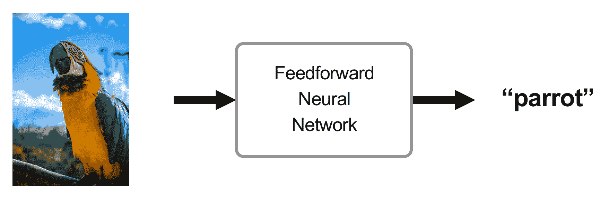

相反，循环神经网络（也叫反馈神经网络）使用额外的记忆状态。当输入 A[1]（单词**I**）被加入时，网络会产生输出 B[1]（单词**love**）并将输入 A[1]的信息存储在记忆状态中。当下一个输入 A[2]（单词**love**）加入时，网络会借助记忆状态生成关联的输出 B[2]（单词**to**）。然后，记忆状态会使用来自新输入 A[2]的信息进行更新。这个操作会对每个输入重复进行：

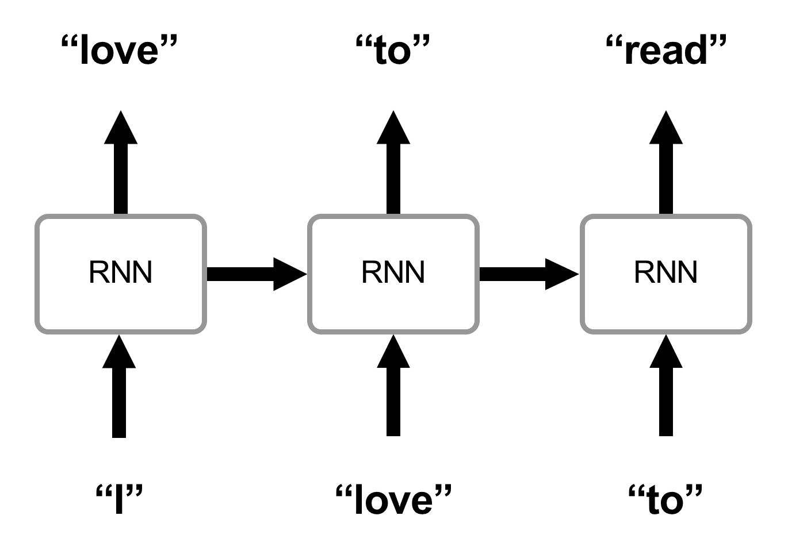

你可以看到，在这种方法中，我们的预测不仅依赖于当前输入，还依赖于之前的数据。这就是为什么 RNN 是处理序列问题的最先进模型。让我们通过一些例子来说明这一点。

典型的前馈网络应用案例是图像识别。我们可以看到它在农业中的应用，例如分析植物，在医疗保健中用于疾病诊断，以及在无人驾驶汽车中用于检测行人。由于这些例子中的任何输出都不需要来自先前输入的特定信息，前馈网络非常适合这种类型的问题。

还有另一类问题，基于序列数据。在这些情况下，预测序列中的下一个元素依赖于所有先前的元素。以下是一些示例：

+   文本转语音

+   预测句子中的下一个词

+   将音频转换为文本

+   语言翻译

+   视频字幕生成

RNN 最早是在 1980 年代通过霍普菲尔德网络的发明而提出的。后来，在 1997 年，Hochreiter 和 Schmidhuber 提出了一个先进的 RNN 模型，叫做 **长短时记忆**（**LSTM**）。它旨在解决一些最简单的递归神经网络模型存在的主要问题，这些问题将在本章稍后揭示。2014 年，Chung 等人提出了 RNN 系列的另一个改进。这种新架构叫做门控递归单元（GRU），以更简单的方式解决了与 LSTM 相同的问题。

在本书的下一章中，我们将介绍上述模型，了解它们的工作原理，并探讨为什么研究人员和大公司每天都在使用它们来解决基本问题。

# 比较递归神经网络与类似模型

近年来，类似于任何神经网络模型，RNN 因为更容易访问大量结构化数据和计算能力的提升而变得广泛流行。但研究人员通过其他方法（如隐马尔可夫模型）已经解决序列问题几十年了。我们将简要地将这种技术与 RNN 进行比较，并概述两种方法的优点。

**隐马尔可夫模型**（**HMM**）是一种概率序列模型，旨在为序列中的每个元素分配一个标签（类别）。HMM 计算每个可能序列的概率，并选择最可能的一个。

HMM 和 RNN 都是强大的模型，能够产生惊人的结果，但根据使用场景和可用资源，RNN 可以更为有效。

# 隐马尔可夫模型

以下是隐马尔可夫模型在解决序列相关任务时的优缺点：

+   **优点：** 实现起来较为简单，且在中等难度问题上能像 RNN 一样更快速、高效地工作。

+   **缺点：** 随着精度要求的提高，HMM 会变得指数级昂贵。例如，预测句子中的下一个词可能依赖于一个很久之前的词。HMM 需要执行一些昂贵的操作来获取这些信息。这也是该模型不适合处理需要大量数据的复杂任务的原因。

这些昂贵的操作包括计算相对于序列中所有先前元素的每个可能元素的概率。

# 递归神经网络

以下是递归神经网络在解决与序列相关任务时的优缺点：

+   **优点**：在处理复杂任务和大量数据时，表现显著更好，且成本较低。

+   **缺点**：构建适合特定问题的正确架构较为复杂。如果准备的数据相对较小，结果不会更好。

通过我们的观察，可以得出结论，RNN 正在逐渐取代大多数实际应用中的 HMM。我们应该了解这两种模型，但在正确的架构和数据下，RNN 往往是更好的选择。

然而，如果你有兴趣深入了解隐马尔可夫模型，我强烈建议你观看一些视频系列（[`www.youtube.com/watch?v=TPRoLreU9lA`](https://www.youtube.com/watch?v=TPRoLreU9lA)）和一些应用实例的论文，如 Degirmenci（哈佛大学）撰写的《隐马尔可夫模型简介》（[`scholar.harvard.edu/files/adegirmenci/files/hmm_adegirmenci_2014.pdf`](https://scholar.harvard.edu/files/adegirmenci/files/hmm_adegirmenci_2014.pdf)）或《隐马尔可夫模型在语音处理中的问题与局限性：综述》（[`pdfs.semanticscholar.org/8463/dfee2b46fa813069029149e8e80cec95659f.pdf`](https://pdfs.semanticscholar.org/8463/dfee2b46fa813069029149e8e80cec95659f.pdf)）。

# 理解递归神经网络的工作原理

使用记忆状态，RNN 架构完美地解决了每一个基于序列的问题。在这一章节中，我们将全面解释其工作原理。你将了解神经网络的基本特征，以及 RNN 的独特之处。本节重点讲解理论部分（包括数学公式），但我可以保证，一旦你掌握了基础，任何实际案例都将顺利进行。

为了让解释更易于理解，我们来讨论一下生成文本的任务，特别是基于我最喜欢的书籍系列之一《饥饿游戏》（*The Hunger Games*）由 Suzanne Collins 编写的，创作一个新章节。

# 基本的神经网络概述

在最高层次上，解决监督问题的神经网络的工作方式如下：

1.  获取训练数据（例如图像用于图像识别或句子用于生成文本）

1.  编码数据（神经网络处理的是数字，因此需要数据的数字表示）

1.  构建神经网络模型的架构

1.  训练模型直到你对结果满意为止

1.  通过做出一个全新的预测来评估你的模型

让我们看看这些步骤如何应用于 RNN。

# 获取数据

对于基于《饥饿游戏》系列书籍生成新章节的问题，你可以通过复制和粘贴的方式提取《饥饿游戏》系列所有书籍中的文本（《饥饿游戏》，《嘲笑鸟》和《燃烧的旗帜》）。为此，你需要在网上找到这些书籍和内容。

# 编码数据

我们使用 *词嵌入*（[`www.analyticsvidhya.com/blog/2017/06/word-embeddings-count-word2veec/`](https://www.analyticsvidhya.com/blog/2017/06/word-embeddings-count-word2veec/)）来实现这一目标。词嵌入是将词汇表中的单词或短语映射到实数向量的一种集体称谓。一些方法包括 *独热编码*、*word2vec* 和 *GloVe*。你将在接下来的章节中了解更多关于它们的信息。

# 构建架构

每个神经网络由三组层组成——输入层、隐藏层和输出层。总是有一个输入层和一个输出层。如果神经网络较深，则会有多个隐藏层：

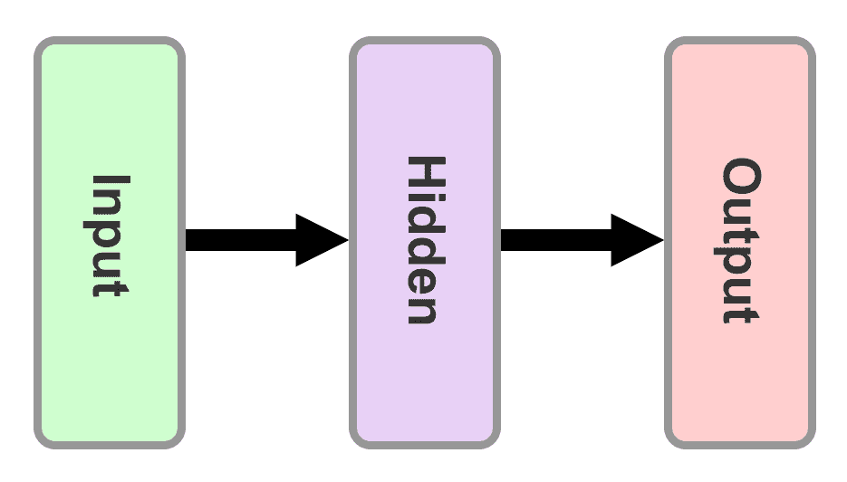

RNN 和标准前馈网络的区别在于其循环隐藏状态。正如下图所示，循环神经网络使用循环隐藏状态。这样，数据从一个时间步传播到另一个时间步，使得每一个时间步都依赖于前一个时间步：

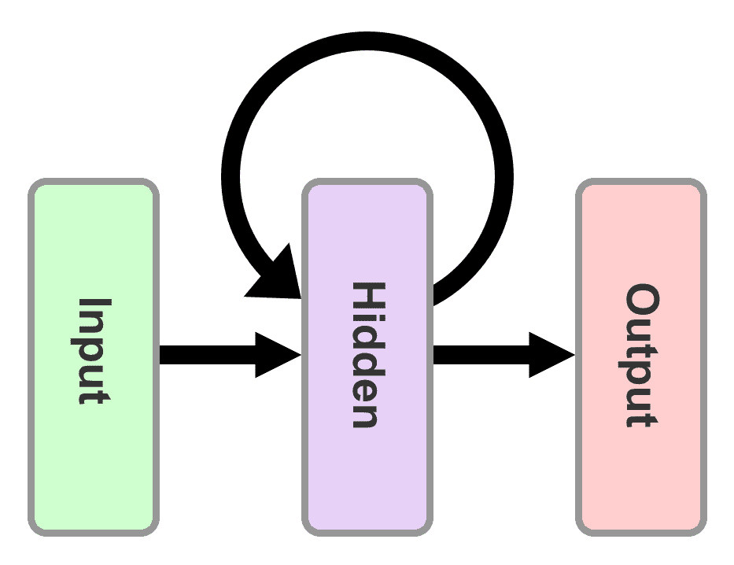

一种常见的做法是展开上述图示，以便更好、更流畅地理解。通过将插图垂直旋转并添加一些符号和标签，基于我们之前选择的示例（基于《饥饿游戏》书籍生成新章节），我们最终得到了以下图示：

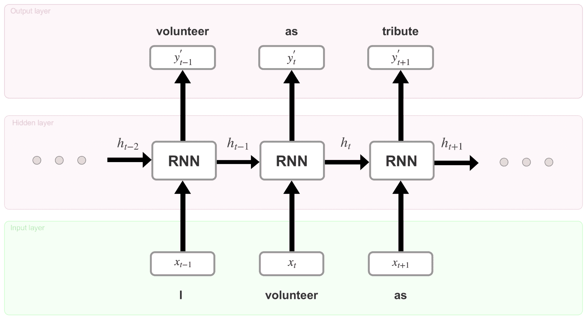

这是一个展开的 RNN，具有一个隐藏层。看似相同的（输入 + 隐藏 RNN 单元 + 输出）集合实际上是 RNN 中的不同时间步（或循环）。例如，组合 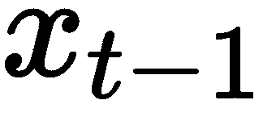 + RNN + 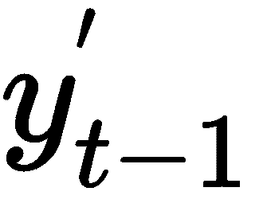 展示了在时间步 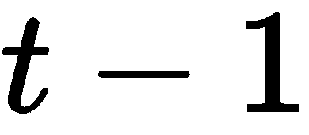 时发生的情况。在每个时间步，这些操作执行如下：

1.  网络使用任何词嵌入技术对当前时间步（例如，*t-1*）的词进行编码，并生成一个向量 （生成的向量可以是  或 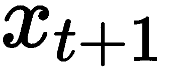，具体取决于时间步的不同）

1.  然后，，输入单词**I**在时间步* t-1 *的编码版本，被插入到 RNN 单元（位于隐藏层）。经过若干方程（此处未显示，但在 RNN 单元内部发生），单元生成输出 和一个记忆状态 。记忆状态是输入 和该记忆状态的前一个值 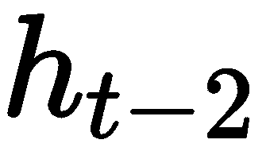的结果。对于初始时间步，可以假设 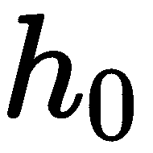是一个零向量。

1.  在时间步* t-1 *时生成实际的单词（志愿者）发生在解码输出 时，使用的是训练开始时指定的*文本语料库*。

1.  最后，网络继续向前推进多个时间步，直到达到最终步骤，在那里它预测出单词。

你可以看到每一个{…, , , 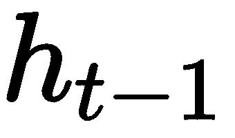, …}都包含有关所有先前输入的信息。这使得 RNN（循环神经网络）非常特殊，且在预测序列中的下一个单元时表现得尤为出色。现在让我们来看一下支撑这些操作的数学方程。

文本语料库——示例词汇表中所有单词的数组。

# 训练模型

该模型的所有“魔法”都在于 RNN 单元。在我们简单的例子中，每个单元呈现相同的方程，只是变量集不同。一个单元的详细版本如下所示：

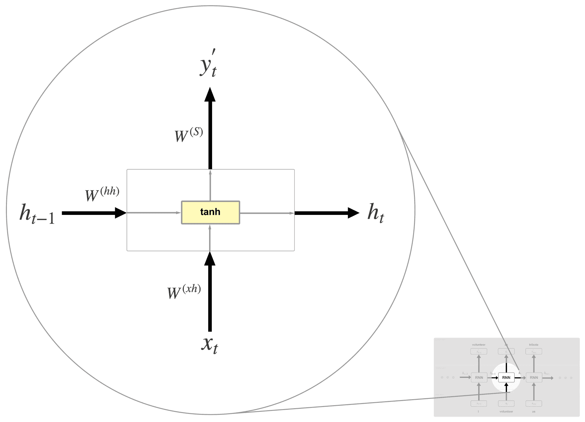

首先，让我们解释前面图表中出现的新术语：

+   **权重**（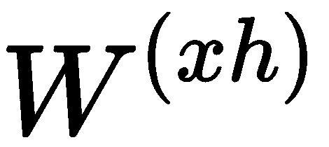, 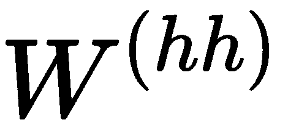, 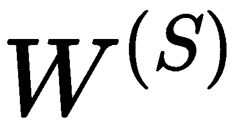）：权重是一个矩阵（或数字），表示它所应用的值的强度。例如，决定了输入 在后续方程中应该被考虑的程度。

    如果 包含较高的值，那么 应该对最终结果有显著的影响。权重值通常是随机初始化的，或者使用某种分布（例如正态/高斯分布）。需要注意的是， ， ，以及  在每个步骤中都是相同的。通过反向传播算法，它们会被修改，目的是产生准确的预测。

+   **偏置** (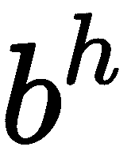, 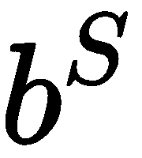): 一个偏移向量（每一层不同），它将一个变化加到输出值上！

+   **激活函数** (**tanh**): 这个函数决定当前记忆状态  和输出 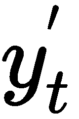 的最终值。基本上，激活函数将类似以下的多个方程式的结果值映射到期望的范围：如果使用 **tanh** 函数，则范围为 (`-1, 1`)；如果使用 sigmoid 函数，则范围为 (`0, 1`)；如果使用 ReLu，则范围为 (`0, +infinity`) ([`ai.stackexchange.com/questions/5493/what-is-the-purpose-of-an-activation-function-in-neural-networks`](https://ai.stackexchange.com/questions/5493/what-is-the-purpose-of-an-activation-function-in-neural-networks))

现在，让我们回顾一下计算变量的过程。为了计算 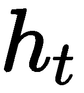 和 ，我们可以做如下操作：

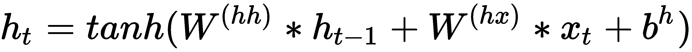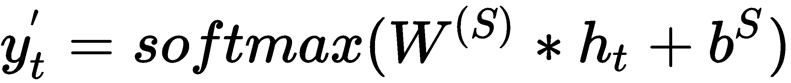

如你所见，记忆状态  是前一个值  和输入  的结果。使用此公式有助于保留关于所有先前状态的信息。

输入  是单词 *volunteer* 的独热编码表示。回想一下，独热编码是一种词嵌入方式。如果文本语料库包含 20,000 个独特的单词，且 "volunteer" 是第 19 个单词，那么 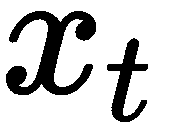 是一个 20,000 维的向量，所有元素为 0，除了第 19 个位置，其值为 1，表示我们只考虑这个特定的单词。

通过将 、  和  相加，结果被传递到 *tanh* 激活函数，该函数使用以下公式将结果压缩到 `-1` 和 `1` 之间：

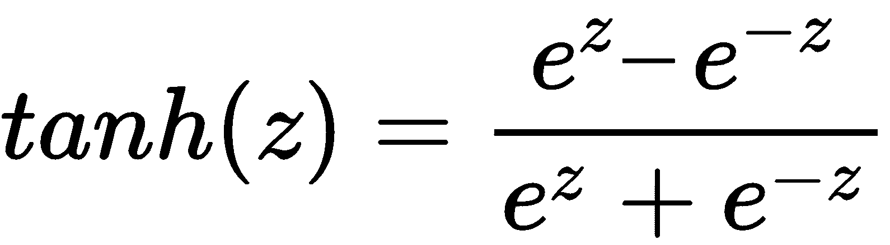

在此，`e = 2.71828`（欧拉数），*z* 是任何实数。

时间步 t 时的输出  是通过  和 `softmax` 函数计算得出的。这个函数可以归类为激活函数，但与其他激活函数不同的是，它主要用于输出层，尤其是在需要概率分布时。例如，在分类问题中，预测正确结果可以通过从一个所有元素总和为`1`的向量中选取概率最高的值来实现。Softmax 就是生成这种向量的函数，具体如下：

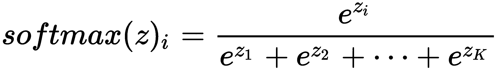

在此，`e = 2.71828`（欧拉数），z 是一个 K 维向量。该公式计算了向量 z 中`i`^(th)位置值的概率。

应用`softmax`函数后，变成了与（语料库大小`20,000`）相同维度的向量，且所有元素的总和为`1`。有了这一点，从文本语料库中找到预测的单词变得非常简单。

# 评估模型

一旦对序列中的下一个单词做出假设，我们需要评估这个预测有多准确。为了做到这一点，我们需要将预测的单词  与训练数据中的实际单词（我们称之为 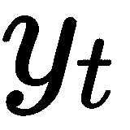）进行比较。这个操作可以通过损失（代价）函数来完成。这些函数旨在找到预测值与实际值之间的误差。我们选择的函数是交叉熵损失函数，公式如下：

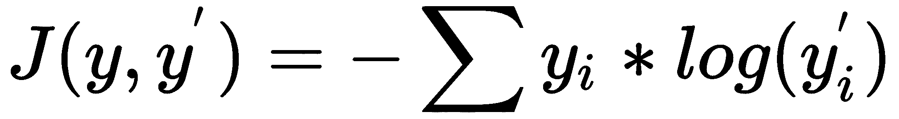

由于我们不会对这个公式进行详细解释，你可以把它当作一个黑箱。如果你对它是如何工作的感兴趣，建议阅读 Michael Nielson 写的文章《改进神经网络的工作方式》([`neuralnetworksanddeeplearning.com/chap3.html#introducing_the_cross-entropy_cost_function`](http://neuralnetworksanddeeplearning.com/chap3.html#introducing_the_cross-entropy_cost_function))。有用的信息是，交叉熵函数在分类问题中表现得非常好。

在计算完误差后，我们进入了深度学习中最复杂且最强大的技术之一——反向传播。

简单来说，我们可以这样表述：反向传播算法会在更新网络的权重和偏置时，逆向遍历所有（或多个）时间步。经过多次重复这一过程，并进行一定数量的训练步骤后，网络能够学习到正确的参数，并能够产生更好的预测结果。

为了澄清任何混淆，训练和时间步骤是完全不同的术语。在一个时间步骤中，我们从序列中获得一个元素并预测下一个元素。一个训练步骤由多个时间步骤组成，时间步骤的数量取决于该训练步骤的序列长度。此外，时间步骤仅在 RNN 中使用，而训练步骤是一个通用的神经网络概念。

每个训练步骤后，我们可以看到来自损失函数的值减小。一旦它超过某个阈值，我们可以说网络已经成功学会了预测文本中的新词。

最后的步骤是生成新的章节。这可以通过选择一个随机词作为开始（例如：games），然后使用先前的公式和预训练的权重与偏置预测下一个词。最终，我们应该得到一些有意义的文本。

# 标准递归神经网络模型的关键问题

希望现在你已经对递归神经网络的工作原理有了很好的理解。不幸的是，这个简单的模型在处理更长和更复杂的序列时无法做出好的预测。其背后的原因在于所谓的梯度消失/爆炸问题，这使得网络无法高效地学习。

如你所知，训练过程通过反向传播算法更新权重和偏置。让我们进一步深入数学解释。为了知道该调整多少参数（权重和偏置），网络计算损失函数相对于当前参数值的导数（在每个时间步骤）。当对多个时间步骤使用相同的参数集进行此操作时，导数的值可能会变得过大或过小。由于我们用它来更新参数，过大的值可能导致权重和偏置未定义，过小的值则可能导致没有显著更新，从而没有*学习*。

导数是表示变化率的一种方式；也就是说，它表示函数在某个特定点的变化量。在我们的例子中，这是损失函数相对于给定权重和偏置的变化率。

这个问题最早由 Bengio 等人在 1994 年提出，这导致了 LSTM 网络的引入，旨在解决梯度消失/爆炸问题。稍后在本书中，我们将揭示 LSTM 是如何以出色的方式解决这一问题的。另一个同样克服这一挑战的模型是门控递归单元。在第三章，*生成你的章节*，你将看到如何做到这一点。

想了解更多关于梯度消失/爆炸问题的信息，建议回顾斯坦福大学的《深度学习自然语言处理》课程第 8 讲([`www.youtube.com/watch?v=Keqep_PKrY8`](https://www.youtube.com/watch?v=Keqep_PKrY8))和论文《训练递归神经网络的困难》([`proceedings.mlr.press/v28/pascanu13.pdf`](http://proceedings.mlr.press/v28/pascanu13.pdf))。

# 总结

在本章中，我们通过理论解释和一个具体示例介绍了递归神经网络模型。目的是掌握这个强大系统的基础知识，以便更好地理解编程练习。总体来说，本章包括了以下内容：

+   RNN 简要介绍

+   RNN 与其他流行模型的区别

+   通过一个示例说明 RNN 的使用

+   标准 RNN 的主要问题

在下一章中，我们将通过第一个实际的递归神经网络练习进行讲解。你将了解流行的 TensorFlow 库，这使得构建机器学习模型变得容易。接下来的部分将为你提供一个很好的第一次实践经验，并为解决更复杂的问题做好准备。

# 外部链接

+   Andrew Ng 的深度学习课程：[`www.youtube.com/playlist?list=PLkDaE6sCZn6Ec-XTbcX1uRg2_u4xOEky0`](https://www.youtube.com/playlist?list=PLkDaE6sCZn6Ec-XTbcX1uRg2_u4xOEky0)

+   隐马尔可夫模型：[`www.youtube.com/watch?v=TPRoLreU9lA`](https://www.youtube.com/watch?v=TPRoLreU9lA)

+   *隐马尔可夫模型简介* 由 Degirmenci 撰写：[`scholar.harvard.edu/files/adegirmenci/files/hmm_adegirmenci_2014.pdf`](https://scholar.harvard.edu/files/adegirmenci/files/hmm_adegirmenci_2014.pdf)

+   *语音处理中的 HMM 问题与局限性：一项调查：* [`pdfs.semanticscholar.org/8463/dfee2b46fa813069029149e8e80cec95659f.pdf`](https://pdfs.semanticscholar.org/8463/dfee2b46fa813069029149e8e80cec95659f.pdf)

+   词向量：[`www.analyticsvidhya.com/blog/2017/06/word-embeddings-count-word2veec/`](https://www.analyticsvidhya.com/blog/2017/06/word-embeddings-count-word2veec/) 和 [`towardsdatascience.com/word-embeddings-exploration-explanation-and-exploitation-with-code-in-python-5dac99d5d795`](https://towardsdatascience.com/word-embeddings-exploration-explanation-and-exploitation-with-code-in-python-5dac99d5d795)

+   *理解激活函数：* [`ai.stackexchange.com/questions/5493/what-is-the-purpose-of-an-activation-function-in-neural-networks`](https://ai.stackexchange.com/questions/5493/what-is-the-purpose-of-an-activation-function-in-neural-networks)

+   *改善神经网络工作方式* 由 Michael Nielson 撰写：[`neuralnetworksanddeeplearning.com/chap3.html#introducing_the_cross-entropy_cost_function`](http://neuralnetworksanddeeplearning.com/chap3.html#introducing_the_cross-entropy_cost_function)

+   斯坦福大学课程《*深度学习自然语言处理*》的第 8 讲：[`www.youtube.com/watch?v=Keqep_PKrY8`](https://www.youtube.com/watch?v=Keqep_PKrY8)

+   *训练递归神经网络的难度*：[`proceedings.mlr.press/v28/pascanu13.pdf`](http://proceedings.mlr.press/v28/pascanu13.pdf)
