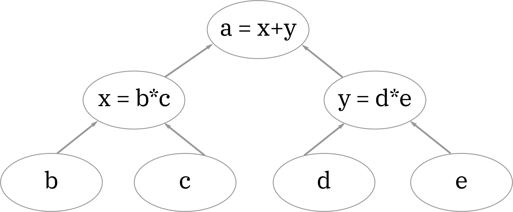
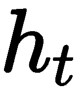
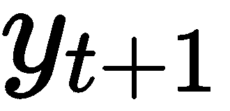
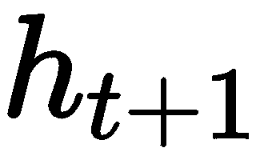

# 第二章：使用 TensorFlow 构建你的第一个 RNN

在本章中，你将获得构建**循环神经网络**（**RNN**）的实践经验。首先，你将学习最广泛使用的机器学习库——TensorFlow。从学习基础知识到掌握一些基本技术，你将合理理解如何将这个强大的库应用于你的应用中。然后，你将开始一个相对简单的任务，构建一个实际的模型。这个过程将向你展示如何准备数据、训练网络并进行预测。

总结一下，本章的主题包括以下内容：

+   **你将要构建什么？**：你的任务介绍

+   **TensorFlow 简介**：开始学习 TensorFlow 框架的第一步

+   **编写 RNN 代码**：你将经历编写第一个神经网络的过程。包括完成解决方案所需的所有步骤

本章的前提条件是基本的 Python 编程知识，以及对循环神经网络的基本理解，参见第一章，*介绍循环神经网络*。阅读本章后，你应该能够全面了解如何使用 Python 和 TensorFlow，并明白构建神经网络是多么简单直接。

# 你将要构建什么？

你进入实际应用领域的第一步将是构建一个简单的模型，该模型用于确定一个比特序列的奇偶性 ([`mathworld.wolfram.com/Parity.html`](http://mathworld.wolfram.com/Parity.html))。这是 OpenAI 在 2018 年 1 月发布的一个热身练习 ([`blog.openai.com/requests-for-research-2/`](https://blog.openai.com/requests-for-research-2/))。这个任务可以这样解释：

给定一个长度为`50`的二进制字符串，确定其中是否包含偶数个或奇数个 1。如果该数字是偶数，则输出`0`，否则输出`1`。

本章稍后将详细解释解决方案，并讨论一些难点及其应对方法。

# TensorFlow 简介

TensorFlow 是 Google 构建的一个开源库，旨在帮助开发人员创建各种类型的机器学习模型。深度学习领域的最新进展促使了对一种易于快速构建神经网络的方法的需求。TensorFlow 通过提供丰富的 API 和工具来解决这个问题，帮助开发者专注于他们的具体问题，而不必处理数学方程和可扩展性问题。

TensorFlow 提供了两种主要的模型编程方式：

+   基于图的执行

+   急切执行

# 基于图的执行

基于图的执行是一种表示数学方程和函数的替代方式。考虑表达式 *a = (b*c) + (d*e)*，我们可以用图形表示如下：

1.  将表达式分解为以下部分：

    +   *x = b*c*

    +   *y = d*e*

    +   *a = x+y*

1.  构建以下图形：



从之前的示例可以看出，使用图形可以并行计算两个方程。这样，代码可以分布到多个 CPU/GPU 上。

该示例的更复杂变体被用于 TensorFlow 中训练大型模型。按照这种方法，基于图的 TensorFlow 执行在构建神经网络时需要一个两步法。首先应构建图架构，然后执行它以获取结果。

这种方法使你的应用程序运行得更快，并且能够分布到多个 CPU、GPU 等设备上。不幸的是，它也带来了一些复杂性。理解这种编程方式是如何工作的，以及无法像以前那样调试代码（例如，在程序的任何点打印值），使得基于图的执行（更多细节请见 [`smahesh.com/blog/2017/07/10/understanding-tensorflow-graph/`](http://smahesh.com/blog/2017/07/10/understanding-tensorflow-graph/)）对于初学者来说有些挑战。

尽管这种技术可能会引入一种新的编程方式，我们的示例将基于它。做出这个决定的原因在于，外面有更多的资源，而且几乎你遇到的每一个 TensorFlow 示例都是基于图的。此外，我认为理解基础知识至关重要，即使它们引入了不熟悉的技术。

# 急切执行

急切执行是一种由 Google 最近推出的方法，正如文档中所述 ([`www.tensorflow.org/guide/eager`](https://www.tensorflow.org/guide/eager))，它使用以下内容：

一种命令式编程环境，立即评估操作，而不是构建图形：操作返回具体的值，而不是构建一个计算图以便稍后运行。这使得开始使用 TensorFlow 和调试模型变得更加容易，同时也减少了模板代码。

如你所见，学习这种新的编程技术没有额外负担，调试也很顺畅。为了更好地理解，我建议查看 TensorFlow 2018 年大会的这篇教程 ([`www.youtube.com/watch?v=T8AW0fKP0Hs`](https://www.youtube.com/watch?v=T8AW0fKP0Hs))。

我必须声明，一旦你学会如何操作 TF API，在图计算和急切执行（eager execution）上构建模型会变得非常容易。如果一开始前者看起来很复杂，不用慌张——我可以向你保证，花时间理解它是值得的。

# 编写递归神经网络代码

如前所述，我们的任务目标是构建一个递归神经网络，用于预测比特序列的奇偶性。我们将以略有不同的方式来处理这个问题。由于序列的奇偶性取决于 1 的数量，我们将对序列的元素进行求和，找出结果是否为偶数。如果是偶数，我们将输出`0`，否则输出`1`。

本章的这一部分包括代码示例，并执行以下步骤：

+   生成用于训练模型的数据

+   构建 TensorFlow 图（使用 TensorFlow 内置的递归神经网络函数）

+   使用生成的数据训练神经网络

+   评估模型并确定其准确性

# 生成数据

让我们重新审视 OpenAI 的任务([`blog.openai.com/requests-for-research-2/`](https://blog.openai.com/requests-for-research-2/))。如文中所述，我们需要生成一个包含 100,000 个长度为 50 的随机二进制字符串的数据集。换句话说，我们的训练集将由 100,000 个示例组成，递归神经网络将接受 50 个时间步长。最后一个时间步的结果将被视为模型的预测值。

确定序列和求和任务可以被视为一个分类问题，其中结果可以是`0`到`50`之间的任何类别。机器学习中的一种标准做法是将数据编码为易于解码的数字格式。那为什么要这么做呢？大多数机器学习算法只能接受数字数据，因此我们总是需要对输入/输出进行编码。这意味着我们的预测也将以编码格式输出。因此，理解这些预测背后的实际值是至关重要的。这意味着我们需要能够轻松地将它们解码为人类可理解的格式。一种常见的分类问题数据编码方式是独热编码（one-hot encoding）。

这是该技术的一个示例。

假设某个特定序列的预测输出为`30`。我们可以通过引入一个`1x50`的数组来编码这个数字，其中除了第 30 个位置上的数字，其余位置都是`0`——`[0, 0,..., 0, 1, 0, ..., 0, 0, 0]`。

在准备实际数据之前，我们需要导入所有必需的库。为此，请访问此链接([`www.python.org/downloads/`](https://www.python.org/downloads/))来在你的计算机上安装 Python。在命令行/终端窗口中安装以下软件包：

```py
pip3 install tensorflow
```

完成这一步后，创建一个名为`ch2_task.py`的新文件，并导入以下库：

```py
import tensorflow as tf
import random
```

准备数据需要输入和输出值。输入值是一个三维数组，大小为`[100000, 50, 1]`，包含`100000`个项目，每个项目包含`50`个一元素数组（值为`0`或`1`），示例如下：

```py
[ [ [1], [0], [1], [1], …, [0], [1] ]
[ [0], [1], [0], [1], …, [0], [1] ]
[ [1], [1], [1], [0], …, [0], [0] ]
[ [1], [0], [0], [0], …, [1], [1] ] ]

```

以下示例展示了实现过程：

```py
num_examples = 100000
num_classes = 50

def input_values():
    multiple_values = [map(int, '{0:050b}'.format(i)) for i in range(2**20)]
    random.shuffle(multiple_values)
    final_values = []
    for value in multiple_values[:num_examples]:
        temp = []
        for number in value:
            temp.append([number])
        final_values.append(temp)
    return final_values
```

这里，`num_classes`是我们 RNN 中的时间步数（在这个例子中是`50`）。前面的代码返回一个包含`100000`个二进制序列的列表。虽然这种写法不是特别符合 Python 的风格，但这样写使得跟踪和理解变得更加容易。

首先，我们从初始化`multiple_values`变量开始。它包含了前`2²⁰=1,048,576`个数字的二进制表示，其中每个二进制数都用零填充以适应`50`的长度。获得如此多的示例可以最小化任何两个之间的相似性。我们使用`map`函数与`int`结合，目的是将生成的字符串转换为数字。

这是一个简短的示例，说明它是如何工作的。我们想要在`multiple_values`数组中表示数字`2`。`2`的二进制版本是`'10'`，所以在`'{0:050b}'.format(i)`中，`i = 2`生成的字符串是`'00000000000000000000000000000000000000000000000010'`（前面有 48 个零以适应长度为`50`）。最后，`map`函数将这个字符串转换为数字，并且不会去掉前面的零。

然后，我们打乱`multiple_values`数组，确保相邻元素之间有所不同。这在反向传播过程中非常重要，因为我们在训练网络时是逐步遍历数组，并在每一步使用单个示例来训练网络。如果数组中相似的值彼此紧挨着，可能会导致偏倚结果和不正确的未来预测。

最后，我们进入一个循环，遍历所有的二进制元素，并构建一个与之前看到的类似的数组。需要注意的是`num_examples`的使用，它会对数组进行切片，因此我们只选择前`100,000`个值。

本部分的第二部分展示了如何生成预期的输出（输入集中每个列表中所有元素的总和）。这些输出用于评估模型并在反向传播过程中调整`weight`/`biases`。以下示例展示了实现方式：

```py
def output_values(inputs):
    final_values = []
    for value in inputs:
        output_values = [0 for _ in range(num_classes)]
        count = 0
        for i in value:
            count += i[0]
        if count < num_classes:
            output_values[count] = 1
        final_values.append(output_values)
    return final_values
```

`inputs`参数是我们之前声明的`input_values()`的结果。`output_values()`函数返回`inputs`中每个成员的独热编码表示列表。如果`[[0], [1], [1], [1], [0], ..., [0], [1]]`序列中所有元素的总和为`48`，那么它在`output_values`中的对应值就是`[0, 0, 0, ..., 1, 0, 0]`，其中`1`位于第`48`的位置。

最后，我们使用`generate_data()`函数获取网络输入和输出的最终值，如下例所示：

```py
def generate_data():
    inputs = input_values()
    return inputs, output_values(inputs)
```

我们使用之前的函数来创建这两个新变量：`input_values`和`output_values = generate_data()`。需要注意的是这些列表的维度：

+   `input_values`的大小为`[num_examples, num_classes, 1]`

+   `output_values`的大小为`[num_examples, num_classes]`

其中，`num_examples = 100000` 和 `num_classes = 50`。

# 构建 TensorFlow 图

构建 TensorFlow 图可能是构建神经网络中最复杂的部分。我们将仔细检查所有步骤，确保你能够全面理解。

TensorFlow 图可以看作是递归神经网络模型的直接实现，包括在第一章中介绍的所有方程和算法，*引入递归神经网络*。

首先，我们从设置模型的参数开始，如下例所示：

```py
X = tf.placeholder(tf.float32, shape=[None, num_classes, 1])
Y = tf.placeholder(tf.float32, shape=[None, num_classes])
num_hidden_units = 24
weights = tf.Variable(tf.truncated_normal([num_hidden_units, num_classes]))
biases = tf.Variable(tf.truncated_normal([num_classes]))
```

`X` 和 `Y` 被声明为 `tf.placeholder`，这会在图中插入一个占位符（用于一个始终会被馈送的张量）。占位符用于在训练网络时预期接收数据的变量。它们通常保存网络训练输入和预期输出的值。你可能会对其中一个维度是 `None` 感到惊讶。原因是我们在训练网络时使用了批量。批量是由多个来自训练数据的元素堆叠在一起形成的集合。当指定维度为 None 时，我们让张量决定这个维度，并通过其他两个值来计算它。

根据 TensorFlow 文档：张量是对向量和矩阵的一个推广，允许更高维度的表示。在 TensorFlow 内部，张量被表示为 n 维数组，元素类型是基本数据类型。

在使用批量进行训练时，我们将训练数据拆分成若干个小的数组，每个数组的大小为 `batch_size`。然后，我们不再一次性使用所有示例来训练网络，而是一次使用一个批量。

这样做的优点是，所需的内存更少，学习速度更快。

`weight` 和 `biases` 被声明为 `tf.Variable`，它在训练过程中持有某个值，这个值是可以修改的。当一个变量首次引入时，应该指定其初始值、类型和形状。类型和形状保持不变，不能更改。

接下来，让我们构建 RNN 单元。如果你回忆起第一章，*引入递归神经网络*，在时间步长 *t* 时，输入被传入 RNN 单元，以产生一个输出，，以及一个隐藏状态，。然后，隐藏状态和时间步长 `*t*+1` 时的新输入被传入一个新的 RNN 单元（该单元与前一个共享相同的权重和偏差）。它会产生自己的输出，，以及隐藏状态，。这个模式会在每个时间步长中重复。

使用 TensorFlow，之前的操作仅需要一行代码：

`rnn_cell = tf.contrib.rnn.BasicRNNCell(num_units=num_hidden_units)`

正如你已经知道的，每个单元都需要一个应用于隐状态的激活函数。默认情况下，TensorFlow 选择**tanh**（非常适合我们的用例），但你可以指定任何你想要的函数。只需添加一个名为`activation`的额外参数。

在`weights`和`rnn_cell`中，你可以看到一个名为`num_hidden_units`的参数。正如这里所述（[`stackoverflow.com/questions/37901047/what-is-num-units-in-tensorflow-basiclstmcell`](https://stackoverflow.com/questions/37901047/what-is-num-units-in-tensorflow-basiclstmcell)），`num_hidden_units`是神经网络学习能力的直接表现。它决定了记忆状态的维度，，以及输出的维度，。

下一步是生成网络的输出。这也可以通过一行代码实现：

`outputs, state = tf.nn.dynamic_rnn(rnn_cell, inputs=X, dtype=tf.float32)`

由于`X`是一个输入序列的批次，因此`outputs`表示每个时间步在所有序列中的输出批次。为了评估预测，我们需要批次中每个输出的最后一个时间步的值。这可以通过以下三步来实现，如下所述：

+   我们从最后一个时间步获得值：`outputs = tf.transpose(outputs, [1, 0, 2])`

这将把输出的张量从（`1000, 50, 24`）重塑为（`50, 1,000, 24`），以便可以使用以下方法获取每个序列中最后一个时间步的输出：`last_output = tf.gather(outputs, int(outputs.get_shape()[0]) - 1)`。

让我们回顾以下图表，以理解如何获得这个`last_output`：

前面的图表展示了如何将一个输入示例的`50`个时间步输入到网络中。这个操作应该对每个具有`50`个时间步的独立示例执行`1,000`次，但为了简便起见，我们这里只展示了一个示例。

在迭代地遍历每个时间步后，我们产生`50`个输出，每个输出的维度为（`24, 1`）。因此，对于一个具有`50`个输入时间步的示例，我们会产生`50`个输出时间步。将所有输出以数学形式表示时，得到一个（`1,000, 50, 24`）的矩阵。矩阵的高度为`1,000`——即单独的示例数量。矩阵的宽度为`50`——即每个示例的时间步数量。矩阵的深度为`24`——即每个元素的维度。

为了做出预测，我们只关心每个示例中的`output_last`，由于示例的数量为`1,000`，我们只需要`1,000`个输出值。正如在前面的示例中所见，我们将矩阵（`1000, 50, 24`）转置为（`50, 1000, 24`），这样可以更容易地从每个示例中获得`output_last`。然后，我们使用`tf.gather`来获取`last_output`张量，其大小为（`1000, 24, 1`）。

构建图的最后几行包括：

+   我们预测特定序列的输出：

```py
     prediction = tf.matmul(last_output, weights) + biases
```

使用新获得的张量`last_output`，我们可以利用权重和偏置来计算预测值。

+   我们根据期望值来评估输出：

```py
    loss = tf.nn.softmax_cross_entropy_with_logits_v2(labels=Y,    
    logits=prediction)
    total_loss = tf.reduce_mean(loss)
```

我们可以将流行的交叉熵损失函数与`softmax`结合使用。如果你还记得第一章《介绍递归神经网络》中的内容，`softmax`函数会将张量转换为强调最大值并抑制显著低于最大值的值。这是通过将初始数组中的值归一化为总和为`1`的数值来实现的。例如，输入`[0.1, 0.2, 0.3, 0.4, 0.1, 0.2, 0.3]`变为[`0.125, 0.138, 0.153, 0.169, 0.125, 0.138, 0.153`]。交叉熵是一个损失函数，用于计算`label`（期望值）与`logits`（预测值）之间的差异。

由于`tf.nn.softmax_cross_entropy_with_logits_v2`返回一个长度为`batch_size`（在下面声明）的 1 维张量，我们使用`tf.reduce_mean`来计算该张量中所有元素的平均值。

最后一步，我们将看到 TensorFlow 如何简化我们优化权重和偏置的过程。一旦我们获得了损失函数，就需要执行反向传播算法，调整权重和偏置以最小化损失。这可以通过以下方式完成：

```py
learning_rate = 0.001
optimizer = tf.train.AdamOptimizer(learning_rate=learning_rate).minimize(loss=total_loss)
```

`learning_rate`是模型的超参数之一，在优化损失函数时使用。调节这个值对提高性能至关重要，因此可以随意调整并评估结果。

最小化损失函数的误差是通过使用 Adam 优化器完成的。这里的([`stats.stackexchange.com/questions/184448/difference-between-gradientdescentoptimizer-and-adamoptimizer-tensorflow`](https://stats.stackexchange.com/questions/184448/difference-between-gradientdescentoptimizer-and-adamoptimizer-tensorflow))提供了一个很好的解释，说明了为什么它优于梯度下降法。

我们刚刚构建了递归神经网络的架构。现在，让我们将所有内容整合起来，如下例所示：

```py
X = tf.placeholder(tf.float32, shape=[None, num_classes, 1])
Y = tf.placeholder(tf.float32, shape=[None, num_classes])

num_hidden_units = 24

weights = tf.Variable(tf.truncated_normal([num_hidden_units, num_classes]))
biases = tf.Variable(tf.truncated_normal([num_classes]))

rnn_cell = tf.contrib.rnn.BasicRNNCell(num_units=num_hidden_units, activation=tf.nn.relu)
outputs1, state = tf.nn.dynamic_rnn(rnn_cell, inputs=X, dtype=tf.float32)
outputs = tf.transpose(outputs1, [1, 0, 2])

last_output = tf.gather(outputs, int(outputs.get_shape()[0]) - 1)
prediction = tf.matmul(last_output, weights) + biases

loss = tf.nn.softmax_cross_entropy_with_logits_v2(labels=Y, logits=prediction)
total_loss = tf.reduce_mean(loss)

learning_rate = 0.001
optimizer = tf.train.AdamOptimizer(learning_rate=learning_rate).minimize(loss=total_loss)
```

下一步任务是使用 TensorFlow 图与之前生成的数据结合训练神经网络。

# 训练 RNN

在本节中，我们将讲解 TensorFlow 程序的第二部分——执行带有预定义数据的计算图。为了实现这一点，我们将使用`Session`对象，它封装了一个执行张量对象的环境。

我们训练的代码如下所示：

```py
batch_size = 1000
number_of_batches = int(num_examples/batch_size)
epoch = 100
with tf.Session() as sess:
    sess.run(tf.global_variables_initializer()) 
    X_train, y_train = generate_data()
    for epoch in range(epoch):
        iter = 0
        for _ in range(number_of_batches):
            training_x = X_train[iter:iter+batch_size]
            training_y = y_train[iter:iter+batch_size]
            iter += batch_size
            _, current_total_loss = sess.run([optimizer, total_loss], 
            feed_dict={X: training_x, Y: training_y})
            print("Epoch:", epoch, "Iteration:", iter, "Loss", current_total_loss)
            print("__________________")
```

首先，我们初始化批次大小。在每次训练步骤中，网络会根据所选批次中的示例进行调优。然后，我们计算批次数量以及迭代次数——这决定了我们的模型应该遍历训练集多少次。`tf.Session()`将代码封装在 TensorFlow 的`Session`中，而`sess.run(tf.global_variables_initializer())`（[`stackoverflow.com/questions/44433438/understanding-tf-global-variables-initializer`](https://stackoverflow.com/questions/44433438/understanding-tf-global-variables-initializer)）确保所有变量都保持其值。

然后，我们将训练集中的一个独立批次存储在`training_x`和`training_y`中。

训练网络的最后一个也是最重要的部分是使用`sess.run()`。通过调用这个函数，你可以计算任何张量的值。此外，你可以按照顺序在列表中指定任意数量的参数——在我们的例子中，我们指定了优化器和损失函数。还记得在构建图时，我们为当前批次的值创建了占位符吗？这些值应当在运行`Session`时通过`feed_dict`参数传入。

训练这个网络大约需要四到五个小时。你可以通过检查损失函数的值来验证它是否在学习。如果值在减小，那么网络正在成功地调整权重和偏置。如果值没有减小，你可能需要做一些额外的调整来优化性能。这些将在第六章中讲解，*提升你的 RNN 性能*。

# 评估预测结果

使用一个全新的示例来测试模型可以通过以下方式完成：

```py
prediction_result = sess.run(prediction, {X: test_example})
largest_number_index = prediction_result[0].argsort()[-1:][::-1]

print("Predicted sum: ", largest_number_index, "Actual sum:", 30)
print("The predicted sequence parity is ", largest_number_index % 2, " and it should be: ", 0)

```

这里，`test_example`是一个大小为（`1 x num_classes x 1`）的数组。

设`test_example`为以下内容：

```py
[[[1],[0],[0],[1],[1],[0],[1],[1],[1],[0],[1],[0],[0],[1],[1],[0],[1],[1],[1],[0],
[1],[0],[0],[1],[1],[0],[1],[1],[1],[0],[1],[0],[0],[1],[1],[0],[1],[1],[1],[0],
[1],[0],[0],[1],[1],[0],[1],[1],[1],[0]]]
```

上述数组中所有元素的总和等于`30`。通过最后一行`prediction_result[0].argsort()[-1:][::-1]`，我们可以找到最大数字的索引。这个索引将告诉我们序列的和。最后一步，我们需要找到这个数字除以`2`后的余数，这将给我们序列的奇偶性。

训练和评估是在你运行`python3 ch2_task.py`后一起进行的。如果你只想做评估，可以将程序中第 70 行到第 91 行的代码注释掉，再重新运行。

# 总结

在本章中，你探索了如何构建一个简单的循环神经网络来解决识别序列奇偶性的问题。你对 TensorFlow 库及其在构建深度学习模型中的应用有了简要的了解。希望本章的学习能够让你对深度学习的知识更加自信，并激励你在这个领域继续学习和成长。

在下一章中，你将通过实现一个更复杂的神经网络来生成文本。你将获得理论和实践经验。这将使你学习到一种新的网络类型——GRU，并理解如何在 TensorFlow 中实现它。此外，你还将面临正确格式化输入文本的挑战，并将其用于训练 TensorFlow 图。

我可以向你保证，激动人心的学习经历即将到来，我迫不及待希望你成为其中的一部分。

# 外部链接

+   奇偶性：[`mathworld.wolfram.com/Parity.html`](http://mathworld.wolfram.com/Parity.html)

+   OpenAI 研究请求 2.0：[`blog.openai.com/requests-for-research-2/`](https://blog.openai.com/requests-for-research-2/)

+   迫切执行文档：[`www.tensorflow.org/guide/eager`](https://www.tensorflow.org/guide/eager)

+   迫切执行（TensorFlow 会议 2018）：[`www.youtube.com/watch?v=T8AW0fKP0Hs`](https://www.youtube.com/watch?v=T8AW0fKP0Hs)

+   Python 安装：[`www.python.org/downloads/`](https://www.python.org/downloads/)

+   理解`num_hidden_units`：[`stackoverflow.com/questions/37901047/what-is-num-units-in-tensorflow-basiclstmcell`](https://stackoverflow.com/questions/37901047/what-is-num-units-in-tensorflow-basiclstmcell)

+   Adam 与梯度下降优化器：[`stats.stackexchange.com/questions/184448/difference-between-gradientdescentoptimizer-and-adamoptimizer-tensorflow`](https://stats.stackexchange.com/questions/184448/difference-between-gradientdescentoptimizer-and-adamoptimizer-tensorflow)

+   理解`sess.run(tf.global_variables_initializer())`：[`stackoverflow.com/questions/44433438/understanding-tf-global-variables-initializer`](https://stackoverflow.com/questions/44433438/understanding-tf-global-variables-initializer)
