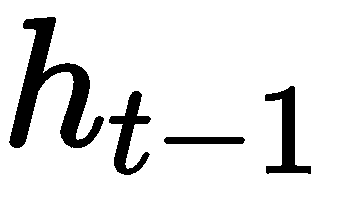

# 第三章：生成你自己的书籍章节

本章将进一步探索 TensorFlow 库，并了解如何利用它来解决复杂的任务。特别是，你将构建一个神经网络，通过学习现有章节中的模式，生成一本书的新（不存在的）章节。此外，你还将掌握更多 TensorFlow 的功能，例如保存/恢复模型等。

本章还将介绍一个新的、更强大的递归神经网络模型——**门控递归单元（GRU）**。你将了解它的工作原理，以及为什么我们选择它而不是简单的 RNN。

总结来说，本章节的主题包括以下内容：

+   为什么使用 GRU 网络？你将了解 GRU 网络是如何工作的，它解决了哪些问题，以及它的优势是什么。

+   生成书籍章节—你将一步一步地了解生成书籍章节的过程。这包括收集和格式化训练数据，构建 GRU 模型的 TensorFlow 图，训练网络，最后逐字生成文本。

到章节结束时，你应该已经获得了理论和实践知识，这将使你能够自由地实验解决中等难度的问题。

# 为什么使用 GRU 网络？

近年来，递归神经网络模型呈现出令人着迷的成果，这些成果甚至可以在实际应用中看到，如语言翻译、语音合成等。GRU 的一个非凡应用就是文本生成。通过当前最先进的模型，我们可以看到十年前只存在于梦想中的结果。如果你想真正欣赏这些成果，我强烈建议你阅读 Andrej Karpathy 的文章《*递归神经网络的非理性有效性*》([`karpathy.github.io/2015/05/21/rnn-effectiveness/`](http://karpathy.github.io/2015/05/21/rnn-effectiveness/))。

话虽如此，我们可以介绍**门控递归单元（GRU）**，它是这些卓越成果背后的模型。另一个类似的模型是**长短期记忆网络**（**LSTM**），它稍微先进一些。这两种架构都旨在解决消失梯度问题——这是简单 RNN 模型的一个主要问题。如果你还记得第一章，*介绍递归神经网络*，这个问题代表着网络无法学习长距离的依赖关系，因此它无法对复杂任务做出准确预测。

GRU 和 LSTM 都通过所谓的“门”来处理这个问题。这些门决定了哪些信息需要被抹去或传递到预测中。

我们将首先关注 GRU 模型，因为它更简单、更容易理解，之后，你将有机会在接下来的章节中探索 LSTM 模型。

如上所述，GRU 的主要目标是对长序列产生优异的结果。它通过引入更新门和重置门来修改标准 RNN 单元，以实现这一目标。就输入、记忆状态和输出而言，这个网络与普通 RNN 模型的工作方式相同。关键的不同在于每个时间步长内单元的具体细节。通过下图，你将更好地理解这一点：


以下是前述图表的符号说明：


插图展示了一个单一的 GRU 单元。该单元接收  和  作为输入，其中  是输入词汇在时间步长上的向量表示，  和  是来自上一步* t-1 *的记忆状态。此外，单元输出当前时间步长 t 的计算记忆状态。如果你还记得之前的内容，记忆状态的作用是通过所有时间步传递信息，并决定是否保留或丢弃知识。前述过程你应该已经在第一章《递归神经网络介绍》中有所了解。

新颖和有趣的部分是 GRU 单元内部发生了什么。计算的目标是决定从  和  中哪些信息应该被传递或删除。这个决策过程由以下一组方程式来处理：


+   第一个方程表示更新门。它的目的是决定过去的信息应当传递多少到未来。为此，首先我们将输入  与其自身的权重  相乘，然后将结果与上一步的记忆状态  和其权重  相乘的结果相加。此权重的具体值是在训练过程中确定的。如下截图所示：


+   第二个方程介绍了重置门。顾名思义，这个门用于决定应该丢弃多少过去的信息。同样，使用  和  来计算它的值。不同之处在于，我们的网络不是使用相同的权重，而是学习了一组不同的权重—— 和 。这在下面的截图中有展示：


更新门和重置门在生成值时，都会使用 sigmoid 作为最终步骤。如果你还记得第一章《介绍递归神经网络》中的内容，sigmoid 激活函数（[`www.youtube.com/watch?v=WcDtwxi7Ick&t=3s`](https://www.youtube.com/watch?v=WcDtwxi7Ick&t=3s)）是一种激活函数，它将输入值压缩在 `0` 和 `1` 之间：

+   第三个方程是一个临时的内部记忆状态，它使用输入  和重置门  来存储来自过去的相关信息。在这里我们使用的是 *tanh* 激活函数，它类似于 sigmoid，但不同之处在于，它将输出压缩在 `-1` 和 `1` 之间。这里的 ([`stats.stackexchange.com/questions/101560/tanh-activation-function-vs-sigmoid-activation-function`](https://stats.stackexchange.com/questions/101560/tanh-activation-function-vs-sigmoid-activation-function)) 是对两者激活函数区别的一个很好解释。如你所见，我们使用了不同的符号 ，这叫做逐元素（element-wise）或 Hadamard 乘法 ([`www.youtube.com/watch?v=2GPZlRVhQWY`](https://www.youtube.com/watch?v=2GPZlRVhQWY))。

如果你有两个向量 `[1, 2, 3]` 和 `[0, -1, 4]`，那么 Hadamard 乘积就是 `[1*0, 2*(-1), 3*4] = [0, -2, 12]`。这在下面的截图中有展示：


+   最终方程计算当前时间步 t 的记忆状态 。为此，我们使用临时内部记忆状态 ，前一时刻的记忆状态  和更新门 。同样，我们使用逐元素乘法来决定更新门要传播多少信息。我们通过一个例子来说明：

假设你想对一本书的评论进行情感分析，以确定人们对这本书的感受。假设评论开始是这样的：*这本书非常激动人心，我非常喜欢。它揭示了一个年轻女性的故事……*。在这里，我们希望保留评论的前半部分，直到结尾，以便做出准确的预测。在这种情况下，网络将学会将  接近 1，这样  就会接近 0。这样，所有未来的记忆状态将主要保留关于这部分信息（*这本书非常激动人心，我非常喜欢。*），而不会考虑接下来的任何无关信息。

将上述方程结合起来，结果是一个强大的模型，它能够学习在任何步骤保持完整或部分信息，从而增强最终的预测。你可以很容易地看到，这个解决方案是如何通过让网络（根据权重）决定什么应该影响预测，来解决梯度消失问题的。

# 生成你的书籍章节

在完成了本章的理论部分后，我们准备进入编码部分。我希望你能掌握 GRU 模型的基本原理，并且在看到 TensorFlow 程序中的符号时能感到轻松。它由五个部分组成，其中大部分内容你应该在第二章，*用 TensorFlow 构建你的第一个 RNN*中有所接触：

+   **获取书籍文本**：这一部分非常直接。你的任务是确保有大量的纯文本为训练做好准备。

+   **编码文本**：这一部分可能比较有挑战性，因为我们需要将编码与适当的维度进行对接。有时候，这个操作可能会比预期花费更多时间，但它是完美编译程序的必要条件。编码算法有很多种，我们将选择一个相对简单的算法，这样你就能完全理解它的真正含义。

+   **构建 TensorFlow 图**：这一步你应该从第二章，*用 TensorFlow 构建你的第一个 RNN*中有所了解。我们将使用类似的步骤，唯一的区别是现在操作单元是 GRU，而不是普通的 RNN。

+   **训练网络**：这一步你应该从第二章，*用 TensorFlow 构建你的第一个 RNN*中有所了解。我们将再次使用批处理来加速训练并减少内存占用。

+   **生成你的新文本**：这是我们程序中的新步骤，也是独特的步骤。我们将使用已经训练好的权重和偏置来预测词语序列。使用适当的超参数和大量数据集，可以生成可以理解的段落，读者很容易认为这些段落是真实的。

你将在一个新的文件中编写代码，文件名为 `ch3_task.py`。首先，使用以下代码安装 Python 库：

```py
pip3 install tensorflow
pip3 install numpy
```

然后，打开`ch3_task.py`并导入之前的库，如下所示：

```py
import numpy as np
import tensorflow as tf
import sys
import collections
```

现在是探索步骤的时候了。

# 获取书籍文本

构建任何机器学习任务的第一步是获取数据。在专业环境中，通常会将数据划分为训练、验证和测试数据。通常的分配比例为 60%、20%、20%。人们常常将验证数据与测试数据混淆，甚至忽略使用前者。验证数据用于在调整超参数时评估模型。相比之下，测试数据仅用于对模型进行总体评估。你不应该使用测试数据来对模型进行调整。由于该任务是生成文本，我们的数据将仅用于训练。然后，我们可以利用该模型逐个猜测单词。

我们的目标是根据*饥饿游戏*书籍生成有意义的新章节。我们应该将文本存储在一个名为`the_hunger_games.txt`的新文件中。

首先，我们需要使用该文件构建我们的字典。这将通过两个名为`get_words(file_name)`和`build_dictionary(words)`的函数完成，如下所示：

```py
def get_words(file_name):
    with open(file_name) as file:
        all_lines = file.readlines()
    lines_without_spaces = [x.strip() for x in all_lines]
    words = []
    for line in lines_without_spaces:
        words.extend(line.split())
    words = np.array(words)
    return words
```

前一个函数的目的是创建`the_hunger_games.txt`中所有单词的列表。现在，让我们使用以下代码构建实际的字典：

```py
def build_dictionary(words):
    most_common_words = collections.Counter(words).most_common()
    word2id = dict((word, id) for (id, (word, _)) in enumerate(most_common_words))
    id2word = dict((id, word) for (id, (word, _)) in enumerate(most_common_words))
    return most_common_words, word2id, id2word
```

这里我们使用 Python 内置库 collections。它可以轻松创建一个元组列表，其中每个元组由一个字符串（单词）和该单词在列表`words`中出现的次数组成。因此，`most_common_words` 不包含任何重复元素。

字典`word2id`和`id2word`将每个单词与一个数字关联，从而确保可以直接访问所有单词。

最后，我们执行`get_words()`和`build_dictionary()`函数，以便可以全局访问单词和字典，如下所示：

```py
words = get_words("the_hunger_games.txt")
most_common_words, word2id, id2word = build_dictionary(words)
most_common_words_length = len(most_common_words)
```

# 编码文本

这一部分展示了如何使用流行的独热编码对我们的数据集进行编码。进行此操作的原因在于，任何神经网络都通过某种数字表示来处理字符串。

首先，我们声明`section_length = 20`，表示我们编码数据集中单个片段的长度。该数据集是一个由多个片段组成的集合，每个片段包含 20 个独热编码的单词。

然后，我们将 20 个单词的片段存储在`input_values`数组中。第 21 个单词作为该特定片段的输出值。这意味着，在训练过程中，网络会学习到像*我喜欢阅读非小说类书籍……我能找到这些类型的*（从训练集中提取的 20 个单词示例序列）之后会出现*书籍*。

接下来是独热编码（one-hot encoding），这也相当简单。我们创建两个零数组，维度为`(num_sections, section_length, most_common_words_length)`——用于输入，`(num_sections, most_common_words_length)`——用于输出。我们遍历`input_values`，并找到每个词在每个部分中的索引。使用这些索引，我们用`1`替换独热数组中的值。

相关的代码在以下示例中：

```py
section_length = 20

def input_output_values(words):
    input_values = []
    output_values = []
    num_sections = 0
    for i in range(len(words) - section_length):
        input_values.append(words[i: i + section_length])
        output_values.append(words[i + section_length])
        num_sections += 1

    one_hot_inputs = np.zeros((num_sections, section_length, most_common_words_length))
    one_hot_outputs = np.zeros((num_sections, most_common_words_length))

    for s_index, section in enumerate(input_values):
        for w_index, word in enumerate(section):
            one_hot_inputs[s_index, w_index, word2id[word]] = 1.0
        one_hot_outputs[s_index, word2id[output_values[s_index]]] = 1.0

    return one_hot_inputs, one_hot_outputs   
```

最后，我们将编码后的词汇存储在两个全局变量中（我们还使用了上一部分中的`words`参数），如下所示：

```py
training_X, training_y = input_output_values(words)
```

# 构建 TensorFlow 图

这一步构建了我们程序中最基本的部分——神经网络图。

首先，我们开始初始化模型的超参数，如下例所示：

```py
learning_rate = 0.001
batch_size = 512
number_of_iterations = 100000
number_hidden_units = 1024
```

人们通常会反复尝试上述值，直到模型得到较好的结果：

+   `learning_rate` ([`towardsdatascience.com/understanding-learning-rates-and-how-it-improves-performance-in-deep-learning-d0d4059c1c10`](https://towardsdatascience.com/understanding-learning-rates-and-how-it-improves-performance-in-deep-learning-d0d4059c1c10)) 用于反向传播，通常应设置为一个较小的值。

+   `batch_size`决定了每个批次应包含多少个元素。数据通常被划分成批次，以便加速训练并减少内存需求。稍后你会了解更多批次使用的内容。

+   `number_of_iterations`表示我们应该进行多少训练步骤。一个训练步骤包括从数据中选择一个批次，并进行前向传播和后向传播，这会更新权重和偏差。

+   `number_hidden_units` ([`stackoverflow.com/questions/37901047/what-is-num-units-in-tensorflow-basiclstmcell`](https://stackoverflow.com/questions/37901047/what-is-num-units-in-tensorflow-basiclstmcell)) 是每个 RNN 单元中使用的单元数。实际上，有一个非常巧妙的公式 ([`stats.stackexchange.com/questions/181/how-to-choose-the-number-of-hidden-layers-and-nodes-in-a-feedforward-neural-network`](https://stats.stackexchange.com/questions/181/how-to-choose-the-number-of-hidden-layers-and-nodes-in-a-feedforward-neural-network)[)](https://stackoverflow.com/questions/37901047/what-is-num-units-in-tensorflow-basiclstmcell)，它根据网络的输入和输出神经元来计算这个数值。

在定义了上述参数后，接下来是指定我们的图结构。这在以下代码片段中演示：

+   我们从 TensorFlow 的占位符 X 开始，它存储当前批次的训练数据，Y 存储当前批次的预测数据。这在以下代码中展示：

```py
      X = tf.placeholder(tf.float32, shape=[batch_size, section_length,                                most_common_words_length])
      y = tf.placeholder(tf.float32, shape=[batch_size, most_common_words_length])
```

+   然后，我们使用正态分布初始化权重和偏置。权重的维度是`[number_hidden_units, most_common_words_length]`，这确保了我们预测中的正确乘法。同样的逻辑也适用于维度为`[most_common_words_length]`的偏置。以下示例展示了这一过程：

```py
      weights = tf.Variable(tf.truncated_normal([num_hidden_units, 
      most_common_words_length]))
      biases = 
      tf.Variable(tf.truncated_normal([most_common_words_length]))
```

+   接下来，我们指定 GRU 单元。第一部分章节中学到的所有复杂逻辑都隐藏在前一行代码背后。第二章，*使用 TensorFlow 构建你的第一个 RNN*，解释了为什么我们随后传递参数`num_units`，如下示例所示：

```py
      gru_cell = tf.contrib.rnn.GRUCell(num_units=num_hidden_units)
```

+   然后，我们使用 GRU 单元和输入 X 来计算输出。一个重要步骤是对这些输出进行[1, 0, 2]的转置操作。

```py
      outputs, state = tf.nn.dynamic_rnn(gru_cell, inputs=X, 
       dtype=tf.float32)
      outputs = tf.transpose(outputs, perm=[1, 0, 2])

      last_output = tf.gather(outputs, int(outputs.get_shape()[0]) - 1)
```

让我们通过以下示意图来理解如何获得这个`last_output`：


示意图展示了如何将一个包含`section_length`步的输入例子插入到网络中。这个操作应该对每个包含`section_length`步的单独例子执行`batch_size`次，但为了简化起见，我们这里只展示了一个例子。

在每次迭代地经过每个时间步后，我们会生成一个`section_length`数量的输出，每个输出的维度为`[most_common_words_length, 1]`。因此，对于一个`section_length`输入时间步的例子，我们会产生`section_length`个输出步。将所有输出数学表示会得到一个`[batch_size, section_length, most_common_words_length]`矩阵。矩阵的高度是`batch_size`——单个批次中的例子数量。矩阵的宽度是`section_length`——每个例子的时间步数。矩阵的深度是`most_common_words_length`——每个元素的维度。

为了进行预测，我们只关注每个例子的`output_last`，并且由于例子的数量是`batch_size`，我们只需要`batch_size`个输出值。如前所示，我们将矩阵`[batch_size, section_length, most_common_words_length]`重塑为`[section_length, batch_size, most_common_words_length]`，这样可以更容易地从每个例子中获取`output_last`。接着，我们使用`tf.gather`来获取`last_output`张量。

以下是上述解释的代码实现：

+   现在我们已经得到了包含这些最终步骤值的数组，我们可以进行预测，并将其与标签值（如前面示例第四行所示）结合使用，以计算此训练步骤的损失。由于损失的维度与标签（预期输出值）和 logits（预测输出值）相同，我们使用`tf.reduce_mean`来生成一个单一的`total_loss`。以下代码演示了这一过程：

```py
      prediction = tf.matmul(last_output, weights) + biases

      loss = tf.nn.softmax_cross_entropy_with_logits_v2(labels=y, 
      logits=prediction)
      total_loss = tf.reduce_mean(loss)
```

+   最终，`total_loss` 在反向传播中使用，目的是通过调整模型的权重和偏置来提高模型的性能。这是通过在训练过程中运行的 `tf.train.AdamOptimizer` 实现的，详细内容将在接下来的章节中介绍：

```py
      optimizer = 
     tf.train.AdamOptimizer(learning_rate=learning_rate).minimize(
     loss=total_loss)
```

# 训练网络

一旦模型建立完成，我们需要使用预先收集的数据来训练它。这个操作遵循下面的代码片段：

+   我们首先初始化所有的 TensorFlow 变量。然后，我们使用 `iter_offset` 确保从数据中提取正确的批次。以下代码展示了这一过程：

```py
      with tf.Session() as sess:
          sess.run(tf.global_variables_initializer())
          iter_offset = 0
```

+   接下来，`tf.train.Saver()` 创建了一个保存器对象，它定期将模型保存在本地。这有助于我们在训练过程中出现中断的情况下恢复模型。此外，它还可以帮助我们在预测阶段查找预训练的参数，从而不必每次进行预测时都重新训练模型：

```py
      saver = tf.train.Saver()
```

现在，真正的训练开始了。我们循环遍历训练数据，并使用每个批次计算优化器。这些计算将最小化损失函数，我们可以通过打印损失值看到它的减少，下面的代码片段展示了这一点：

+   首先，我们需要将数据划分为批次。我们通过 `iter_offset` 参数来实现这一点。它跟踪每个批次的下限，确保我们总是从训练集获取下一个批次，以下代码展示了这一过程：

```py
      for iter in range(number_of_iterations):
          length_X = len(training_X)

          if length_X != 0:
              iter_offset = iter_offset % length_X

          if iter_offset <= length_X - batch_size:
              training_X_batch = training_X[iter_offset: iter_offset +               
                batch_size]
              training_y_batch = training_y[iter_offset: iter_offset + 
               batch_size]
              iter_offset += batch_size
          else:
              add_from_the_beginning = batch_size - (length_X - 
               iter_offset)
              training_X_batch = 
               np.concatenate((training_X[iter_offset: length_X], X[0:                         
               add_from_the_beginning]))
              training_y_batch = 
               np.concatenate((training_y[iter_offset:  
              length_X], y[0: add_from_the_beginning]))
              iter_offset = add_from_the_beginning
```

+   接下来，我们应该通过计算 `optimizer` 和 `total_loss` 来进行训练。我们可以运行一个 TensorFlow 会话，使用当前批次的输入和输出。最后，我们应该打印损失函数的值，以便跟踪我们的进展。如果网络训练成功，损失函数的值应该在每一步都减少：

```py
        _, training_loss = sess.run([optimizer, total_loss], feed_dict=
         {X: training_X_batch, y: training_y_batch})
        if iter % 10 == 0:
            print("Loss:", training_loss)
            saver.save(sess, 'ckpt/model', global_step=iter)
```

通常，这个训练过程需要几个小时才能完成。你可以通过增加计算能力来加速这个过程。我们将在第六章中讨论一些加速的方法，*提升你的 RNN 性能*。

# 生成你的新文本

在成功训练模型之后，接下来是生成你新的 *饥饿游戏* 章节的时候。

前面的代码可以分为两部分：

+   使用自定义输入训练模型

+   预测序列中的下一个 1,000 个词

让我们探索下面的代码片段：

+   一开始，我们初始化了一个包含 21 个词的自定义输入（我们使用了 (`section_length + 1`) 来匹配模型的维度）。这个输入用于提供我们预测的起始点。接下来，我们将用这个输入训练现有的网络，以便优化权重和偏置，以应对即将到来的预测，下面的示例展示了这一过程：

```py
      starting_sentence = 'I plan to make the world a better place 
       because I love seeing how people grow and do in their lives '
```

+   然后，我们可以从 `ckpt` 文件夹恢复已保存的模型，并使用最新的输入对其进行训练，如下面的代码所示：

```py
      with tf.Session() as sess:
          sess.run(tf.global_variables_initializer())
          model = tf.train.latest_checkpoint('ckpt')
          saver = tf.train.Saver()
          saver.restore(sess, model)
```

+   然后，我们应该将该输入编码成一个维度为`[1, section_length, most_common_words_length]`的 one-hot 向量。这个数组应该被输入到我们的模型中，以便生成的预测单词能够遵循顺序。你可能会注意到，我们省略了最后一个单词，稍后会添加它，以生成`text_next_X`数组（见以下代码）。我们这样做是为了给文本生成提供一个无偏的起点。下面的示例中进行了演示：

```py
      generated_text = starting_sentence
      words_in_starting_sentence = starting_sentence.split()
      test_X = np.zeros((1, section_length, 
      most_common_words_length))

      for index, word in enumerate(words_in_starting_sentence[:-1]):
          if index < section_length:
              test_X[0, index, word2id[word]] = 1
```

+   最后，我们应该使用编码后的输入句子来训练网络。为了保持训练的无偏起点，我们需要在开始预测之前，添加句子中的最后一个单词，如下例所示。稍微有些令人困惑的部分可能是`np.concatenate`方法。我们首先应重塑`text_X`，以便轻松附加最后一部分，然后再重塑结果以适应预测评估。这在以下示例中展示：

```py
        _ = sess.run(prediction, feed_dict={X: test_X})

        test_last_X = np.zeros((1, 1, most_common_words_length))
        test_last_X[0, 0, word2id[words_in_starting_sentence[-1]]] = 1
        test_next_X = np.reshape(np.concatenate((test_X[0, 1:], 
        test_last_X[0])), (1, section_length, most_common_words_length)
```

+   最后一步实际上是生成单词。在每一步（共 1,000 步）中，我们可以使用当前的`test_next_X`来计算预测。然后，我们可以从当前的`test_next_X`中移除第一个字符，并附加预测结果。通过这种方式，我们始终保持一个包含 20 个单词的集合，其中最后一个元素是一个全新的预测单词。这个过程在以下示例中进行了展示：

```py
         for i in range(1000):
             test_prediction = prediction.eval({X: test_next_X})[0]
             next_word_one_hot = prediction_to_one_hot(test_prediction)
             next_word = id2word[np.argmax(next_word_one_hot)]
             generated_text += next_word + " "
             test_next_X = 
              np.reshape(np.concatenate((test_next_X[0,1:],
                                np.reshape(next_word_one_hot, (1, 
                                most_common_words_length)))),
                                (1, section_length,   
                                 most_common_words_length))
                 print("Generated text: ", generated_text)
```

`prediction_to_one_hot`方法将预测结果编码成一个 one hot 编码数组。这个方法在以下示例中定义：

```py
    def prediction_to_one_hot(prediction):
        zero_array = np.zeros(np.shape(prediction))
        zero_array[np.argmax(prediction)] = 1
        return zero_array
```

运行代码后，你应该能在控制台看到最终的章节输出。如果单词之间存在不一致的情况，你需要调整一些超参数。我将在最后一章中解释如何优化你的模型并获得良好的性能。请使用上面的代码片段训练网络，并随时告诉我你的性能表现。我会非常高兴看到你的最终结果。

# 总结

在本章中，你学习了如何使用门控循环单元（GRU）神经网络构建一个书籍章节生成器的过程。你了解了这个强大模型背后的原理，以及如何通过几行代码在 TensorFlow 中将其付诸实践。此外，你还面临了准备和清理数据的挑战，以确保模型能够正确训练。

在下一章中，你将通过实现第一个现实中的实际应用——语言翻译器，进一步巩固你的技能。你可能已经使用过在线的 Google 翻译软件，并且对其出色的表现感到惊讶。在下一章中，你将了解像这样一个复杂系统背后的原理，以及为什么它的准确度在近年来大幅提高。

我希望当前章节能提升你对深度学习的知识，并且让你对探索递归神经网络的世界感到兴奋。我迫不及待想看到你开始下一节。

# 外部链接

+   循环神经网络的非理性有效性—[`karpathy.github.io/2015/05/21/rnn-effectiveness/`](http://karpathy.github.io/2015/05/21/rnn-effectiveness/)

+   Sigmoid 激活函数—[`www.youtube.com/watch?v=WcDtwxi7Ick&t=3s`](https://www.youtube.com/watch?v=WcDtwxi7Ick&t=3s)

+   Sigmoid 激活函数与 tanh 激活函数的区别—[`stats.stackexchange.com/questions/101560/tanh-activation-function-vs-sigmoid-activation-function`](https://stats.stackexchange.com/questions/101560/tanh-activation-function-vs-sigmoid-activation-function)

+   元素级乘法—[`www.youtube.com/watch?v=2GPZlRVhQWY`](https://www.youtube.com/watch?v=2GPZlRVhQWY)

+   神经网络中的学习率—[`towardsdatascience.com/understanding-learning-rates-and-how-it-improves-performance-in-deep-learning-d0d4059c1c10`](https://towardsdatascience.com/understanding-learning-rates-and-how-it-improves-performance-in-deep-learning-d0d4059c1c10)

+   TensorFlow 中隐藏单元的数量—[`stackoverflow.com/questions/37901047/what-is-num-units-in-tensorflow-basiclstmcell`](https://stackoverflow.com/questions/37901047/what-is-num-units-in-tensorflow-basiclstmcell)

+   计算隐藏单元数量的公式—[`stats.stackexchange.com/questions/181/how-to-choose-the-number-of-hidden-layers-and-nodes-in-a-feedforward-neural-network`](https://stats.stackexchange.com/questions/181/how-to-choose-the-number-of-hidden-layers-and-nodes-in-a-feedforward-neural-network)
