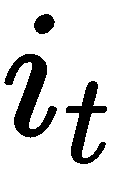

# 第四章：创建一个西班牙语到英语的翻译器

本章将通过引入当今最强大语言翻译系统核心的最前沿概念，进一步推动你的神经网络知识。你将构建一个简单版本的西班牙语到英语的翻译器，该翻译器接受西班牙语句子并输出其英文等效句子。

本章包括以下部分：

+   **理解翻译模型**：本节完全专注于该系统背后的理论。

+   **什么是 LSTM 网络**：我们将了解这一先进版本的循环神经网络背后是什么。

+   **理解带注意力机制的序列到序列网络**：你将掌握这个强大模型背后的理论，了解它实际做了什么，以及为什么它在不同问题中被广泛使用。

+   **构建西班牙语到英语的翻译器**：本节完全专注于将到目前为止获得的知识实现为一个可运行的程序。它包括以下内容：

    +   训练模型

    +   预测英文翻译

    +   评估模型的准确性

# 理解翻译模型

机器翻译通常采用所谓的**统计机器翻译**，基于统计模型。这种方法效果很好，但一个关键问题是，对于每一对语言，我们都需要重建架构。幸运的是，在 2014 年，Cho *等人*（[`arxiv.org/pdf/1406.1078.pdf`](https://arxiv.org/pdf/1406.1078.pdf)）发布了一篇论文，旨在通过日益流行的循环神经网络来解决这个问题及其他问题。该模型被称为序列到序列（sequence-to-sequence），通过提供足够的数据，可以在任意语言对上进行训练。此外，它的强大之处在于能够匹配不同长度的序列，例如在机器翻译中，英文句子和西班牙语句子的长度可能不同。我们来看看这些任务是如何完成的。

首先，我们将介绍以下图表并解释它的组成：


该架构有三个主要部分：**编码器**RNN 网络（左侧）、中间状态（由中间箭头标记）和**解码器**RNN 网络（右侧）。将西班牙语句子**Como te llamas?**（西班牙语）翻译为**What is your name?**（英语）的操作流程如下：

+   使用编码器 RNN 将西班牙语句子编码为中间状态

+   使用该状态和解码器 RNN，生成英文的输出句子

这个简单方法适用于短小且简单的句子，但实际上，翻译模型的真正应用在于更长且更复杂的序列。这就是为什么我们将使用强大的 LSTM 网络和注意力机制来扩展我们的基本方法。接下来让我们在各节中探讨这些技术。

# 什么是 LSTM 网络？

**LSTM**（**长短期记忆**）网络是一种先进的 RNN 网络，旨在解决梯度消失问题，并在长序列上取得优异的结果。在前一章中，我们介绍了 GRU 网络，它是 LSTM 的简化版本。两者都包括记忆状态，用于决定每个时间步应该传播哪些信息。LSTM 单元如下所示：


让我们介绍主要的方程式，这些方程式将澄清前面的图示。它们与门控递归单元（请参见第三章，*生成你自己的书章节*）的方程式相似。以下是每个给定时间步 *t* 发生的事情：


 是 **输出门**，它决定了当前预测中哪些信息是重要的，以及哪些信息应该保留以便未来使用。  被称为 **输入门**，它决定了我们在当前向量（单元）上应该关注多少。  是新记忆单元的值。  是 **遗忘门**，它决定了应该忘记当前向量中的多少信息（如果遗忘门为 0，我们就完全忘记过去）。这四个，，有相同的方程洞察（以及相应的权重），但  使用的是 tanh，而其他的使用 sigmoid。

最后，我们得到了最终的记忆单元  和最终的隐藏状态 ：


最终的记忆单元将输入门和遗忘门分开，并决定保留多少先前的输出  以及多少当前输出  应该向前传播（简单来说，这意味着：*忘记过去还是不忘，是否接受当前输入*）。 *点乘* 符号叫做哈达玛积——如果 `x = [1, 2, 3]` 且 `y = [4, 5, 6]`，则 `x dot y = [1*4, 2*5, 3*6] = [4, 10, 18]`。

最终的隐藏状态定义如下：


它决定是否暴露此特定时间步的单元内容。由于当前单元的某些信息  可能在  中被省略，我们将  向前传递，以便在下一个时间步使用。

这个相同的系统在神经网络中被多次重复。通常情况下，多个 LSTM 单元会堆叠在一起，并使用共享的权重和偏置。

提升你对 LSTM 理解的两个重要来源是 Colah 的文章*理解 LSTM 网络*（[`colah.github.io/posts/2015-08-Understanding-LSTMs/`](http://colah.github.io/posts/2015-08-Understanding-LSTMs/)）和斯坦福大学的 LSTM 讲座（[`www.youtube.com/watch?v=QuELiw8tbx8`](https://www.youtube.com/watch?v=QuELiw8tbx8)），讲解者是 Richard Socher。

# 理解带有注意力机制的序列到序列网络

既然你已经理解了 LSTM 网络的工作原理，让我们退后一步，看看整个网络架构。正如我们之前所说，我们使用的是带有注意力机制的序列到序列模型。这个模型由 LSTM 单元组成，分为编码器和解码器部分。

在一个简单的序列到序列模型中，我们输入一个给定长度的句子，并创建一个向量来捕获该句子中的所有信息。之后，我们使用该向量来预测翻译。你可以在本章末尾的*外部链接*部分阅读更多关于这一过程的精彩 Google 论文（[`arxiv.org/pdf/1409.3215.pdf`](https://arxiv.org/pdf/1409.3215.pdf)）。

这种方法是可行的，但像在任何情况下，我们都可以并且必须做得更好。在这种情况下，一个更好的方法是使用注意力机制。这种方法受到人类翻译语言方式的启发。人类不会先阅读输入句子，然后在试图写下输出句子时把文本隐藏起来。他们在翻译的过程中持续跟踪原始句子。这就是注意力机制的工作原理。在解码器的每个时间步，网络会决定使用编码器输入中的哪些部分以及多少部分。为了做出这个决策，特定的权重被分配给每个编码器单词。实际上，注意力机制试图解决递归神经网络的一个根本问题——记住长期依赖关系的能力。

一个很好的注意力机制示例可以在这里看到：


 是输入， 是预测的输出。你可以看到表示注意力权重的，每个权重都附加在相应的输入上。这些权重在训练过程中学习，并决定特定输入对最终输出的影响。这使得每个输出依赖于所有输入状态的加权组合。

不幸的是，注意力机制是有代价的。请考虑以下内容，来自一篇 WildML 的文章（[`www.wildml.com/2016/01/attention-and-memory-in-deep-learning-and-nlp/`](http://www.wildml.com/2016/01/attention-and-memory-in-deep-learning-and-nlp/)）：

如果我们更仔细地观察注意力机制的公式，我们可以看到注意力是有代价的。我们需要计算每一对输入和输出单词的注意力值。如果你有一个 50 个单词的输入序列，并生成一个 50 个单词的输出序列，那么就会有 2500 个注意力值。这并不算太糟糕，但如果你进行字符级别的计算，并处理包含数百个标记的序列，上述注意力机制可能会变得代价高昂。

尽管如此，注意力机制仍然是机器翻译领域的一种最先进的模型，能产生优秀的结果。前面的陈述仅表明还有很大的改进空间，因此我们应该尽可能地为其发展做出贡献。

# 构建西班牙语到英语的翻译器

我希望前面的部分已经让你对我们即将构建的模型有了清晰的理解。现在，我们将实际动手编写我们翻译系统背后的代码。最终，我们应该得到一个经过训练的网络，能够预测任何西班牙语句子的英语版本。让我们开始编程吧。

# 准备数据

第一步，像往常一样，是收集所需的数据并为训练做准备。我们的系统变得越复杂，整理数据并将其转换为正确格式的过程就越复杂。我们将使用来自 OpenSubtitles 免费数据源的西班牙语到英语的短语（[`opus.nlpl.eu/OpenSubtitles.php`](http://opus.nlpl.eu/OpenSubtitles.php)）。我们将使用`data_utils.py`脚本来完成这个任务，您可以在提供的 GitHub 仓库中找到该脚本（[`github.com/simonnoff/Recurrent-Neural-Networks-with-Python-Quick-Start-Guide`](https://github.com/simonnoff/Recurrent-Neural-Networks-with-Python-Quick-Start-Guide)）。在该仓库中，您还可以找到有关从 OpenSubtitles 下载哪些数据集的更多详细信息。该文件计算了以下属性，这些属性可在我们的模型中进一步使用：

+   `spanish_vocab`：一个包含所有西班牙语训练集单词的集合，按频率排序

+   `english_vocab`：一个包含所有英语训练集单词的集合，按频率排序

+   `spanish_idx2word`：一个包含键和值的字典，其中键是单词在`spanish_vocab`中的顺序

+   `spanish_word2idx`：`spanish_idx2word`的反向版本

+   `english_idx2word`：一个包含键和值的字典，其中键是单词在`english_vocab`中的顺序

+   `english_word2idx`：`english_idx2word`的反向版本

+   `X`：一个包含数字数组的数组。我们通过首先逐行读取西班牙文文本文件，并将这些单词存储在单独的数组中来生成这个数组。然后，我们将每个句子的数组编码成一个数字数组，每个单词都用它在 `spanish_word2idx` 中的索引替换。

+   `Y`：一个包含数字数组的数组。我们通过首先逐行读取英文文本文件，并将这些单词存储在单独的数组中来生成这个数组。然后，我们将每个句子的数组编码成一个数字数组，每个单词都用它在 `english_word2idx` 中的索引替换。

你将在接下来的部分中看到这些集合在模型训练和测试期间的使用方式。下一步是构建 TensorFlow 图。

# 构建 TensorFlow 图

作为初步步骤，我们导入所需的 Python 库（你可以在 `neural_machine_translation.py` 文件中看到这一点）：

```py
import tensorflow as tf
import numpy as np
from sklearn.model_selection import train_test_split
import data_utils
import matplotlib.pyplot as plt
```

`tensorflow` 和 `numpy` 应该已经对你很熟悉了。`matplotlib` 是一个用于数据可视化的便捷 Python 库（稍后你将看到我们如何使用它）。然后，我们使用 `sklearn` 的 `train_test_split` 函数将数据拆分为随机的训练和测试数组。

我们还导入了 `data_utils`，它用于访问上一部分提到的数据集合。

在拆分数据之前，一个重要的修改是确保 *X* 和 *Y* 中的每个数组都进行了填充，以表示新序列的开始：

```py
def data_padding(x, y, length = 15):
    for i in range(len(X)):
        x[i] = x[i] + (length - len(x[i])) * [spanish_word2idx['<pad>']]
        y[i] = [english_word2idx['<go>']] + y[i] + (length - len(y[i])) * [english_word2idx['<pad>']]
```

然后，我们按如下方式拆分数据：

```py
X_train,  X_test, Y_train, Y_test = train_test_split(X, Y, test_size = 0.1)
```

现在，到了定义实际的 TensorFlow 图的时间。我们从确定输入和输出序列长度的变量开始：

```py
input_sequence_length = 15
output_sequence_length = 16
```

然后，我们计算每个词汇表的大小：

```py
spanish_vocab_size = len(spanish_vocab) + 2 # + <pad>, <unk>
english_vocab_size = len(english_vocab) + 4 # + <pad>, <eos>, <go>
```

`<pad>` 符号用于对齐时间步，`<go>` 用于指示解码器序列的开始，`<eos>` 表示空白位置。

之后，我们初始化了 TensorFlow 的占位符：

```py
encoder_inputs = [tf.placeholder(dtype=tf.int32, shape=[None], name="encoder{}".format(i)) for i in range(input_sequence_length)]

decoder_inputs = [tf.placeholder(dtype=tf.int32, shape=[None], name="decoder{}".format(i)) for i in range(output_sequence_length)]

targets = [decoder_inputs[i] for i in range(output_sequence_length - 1)]
targets.append(tf.placeholder(dtype = tf.int32, shape=[None], name="last_output"))

target_weights = [tf.placeholder(dtype = tf.float32, shape = [None], name="target_w{}".format(i)) for i in range(output_sequence_length)]
```

+   `encoder_inputs`：这个变量保存西班牙文训练输入单词的值。

+   `decoder_inputs`：这个变量保存英文训练输入单词的值。

+   `target`：这个变量保存英文预测的真实值。它与 `decoder_inputs` 的长度相同，每个单词是下一个预测的单词。

+   `target_weights`：这是一个张量，用于为所有预测值分配权重。

构建图的最后两个步骤是生成输出并优化网络的权重和偏差。

前者使用方便的 TensorFlow 函数 `tf.contrib.legacy_seq2seq.embedding_attention_seq2seq`（[`www.tensorflow.org/api_docs/python/tf/contrib/legacy_seq2seq/embedding_attention_seq2seq`](https://www.tensorflow.org/api_docs/python/tf/contrib/legacy_seq2seq/embedding_attention_seq2seq)），该函数构建一个带有注意力机制的序列到序列网络，并返回解码器网络生成的输出。实现如下：

```py
size = 512 # num_hidden_units
embedding_size = 100

with tf.variable_scope("model_params"):
    w_t = tf.get_variable('proj_w', [english_vocab_size, size], tf.float32)
    b = tf.get_variable('proj_b', [english_vocab_size], tf.float32)
    w = tf.transpose(w_t)
    output_projection = (w, b)

    outputs, states = tf.contrib.legacy_seq2seq.embedding_attention_seq2seq(
                      encoder_inputs,
                      decoder_inputs,
                      tf.contrib.rnn.BasicLSTMCell(size),
                      num_encoder_symbols=spanish_vocab_size,
                      num_decoder_symbols=english_vocab_size,
                      embedding_size=embedding_size,
                      feed_previous=False,
                      output_projection=output_projection,
                      dtype=tf.float32)
```

让我们讨论一下函数的参数：

+   `encoder_inputs` 和 `decoder_inputs` 包含每一对西班牙语和英语句子的训练数据。

+   `tf.contrib.rnn.BasicLSTMCell(size)` 是用于序列模型的 RNN 单元。这是一个具有 `size`（`=512`）个隐藏单元的 LSTM 单元。

+   `num_encoder_symbols` 和 `num_decoder_symbols` 是模型的西班牙语和英语词汇表。

+   `embedding_size` 表示每个单词的嵌入向量的长度。这个向量可以通过 `word2vec` 算法获得，并帮助网络在反向传播过程中学习。

+   `feed_previous` 是一个布尔值，表示是否在某个时间步使用先前的输出作为下一个解码器输入。

+   `output_projection` 包含一对网络的权重和偏置。正如前面的代码块所示，权重的形状是 `[english_vocab_size, size]`，偏置的形状是 `[english_vocab_size]`。

在计算输出之后，我们需要通过最小化该模型的损失函数来优化这些权重和偏置。为此，我们将使用 `tf.contrib.legacy_seq2seq.sequence_loss` TensorFlow 函数，如下所示：

```py
loss = tf.contrib.legacy_seq2seq.sequence_loss(outputs, targets, target_weights, softmax_loss_function = sampled_loss)

learning_rate = 5e-3 (5*10^(-3) = 0.005)
optimizer = tf.train.AdamOptimizer(learning_rate).minimize(loss)
```

我们提供预测的 `outputs`，以及网络的实际值 `targets`。此外，我们提供了标准 softmax 损失函数的轻微修改。

最后，我们定义了优化器，它的目标是最小化损失函数。

为了澄清 `sample_loss` 变量的混淆，我们将给出它的定义：

```py
def sampled_loss(labels, logits):
    return tf.nn.sampled_softmax_loss(
        weights=w_t,
        biases=b,
        labels=tf.reshape(labels, [-1, 1]),
        inputs=logits,
        num_sampled=size,
        num_classes=english_vocab_size
    )
```

这个 `softmax` 函数仅用于训练。你可以通过 TensorFlow 文档了解更多关于它的内容（[`www.tensorflow.org/api_docs/python/tf/nn/sampled_softmax_loss`](https://www.tensorflow.org/api_docs/python/tf/nn/sampled_softmax_loss)）。

这些方程式生成了一个功能完备的 TensorFlow 图，用于我们的带有注意力机制的序列到序列模型。再一次，你可能会惊讶于构建一个强大的神经网络以获得优秀的结果竟然只需要这么少的代码。

接下来，我们将数据集合插入到这个图中，并实际训练模型。

# 训练模型

训练神经网络是通过使用与之前相同的模式来完成的：

```py
def train():
    init = tf.global_variables_initializer()
    saver = tf.train.Saver()

    with tf.Session() as sess:
        sess.run(init)
        for step in range(steps):
            feed = feed_dictionary_values(X_train, Y_train)
            sess.run(optimizer, feed_dict=feed)
            if step % 5 == 4 or step == 0:
                loss_value = sess.run(loss, feed_dict = feed)
                losses.append(loss_value)
                print("Step {0}/{1} Loss {2}".format(step, steps, 
                loss_value))
            if step % 20 == 19:
                saver.save(sess, 'ckpt/', global_step = step)
```

前面的实现中有一个有趣的部分是 `feed_dictionary_values` 函数，它通过 `X_train` 和 `Y_train` 来构建占位符：

```py
def feed_dictionary_values(x, y, batch_size):
    feed = {}
    indices_x = np.random.choice(len(x), size=batch_size, replace=False)
    indices_y = np.random.choice(len(y), size=batch_size, replace=False)

    for i in range(input_sequence_length):
        feed[encoder_inputs[i].name] = np.array([x[j][i] for j in indices_x], dtype=np.int32)

    for i in range(output_sequence_length):
        feed[decoder_inputs[i].name] = np.array([y[j][i] for j in indices_y], dtype=np.int32)

    feed[targets[len(targets)-1].name] = np.full(shape = [batch_size], fill_value=english_word2idx['<pad>'], dtype=np.int32)

    for i in range(output_sequence_length - 1):
        batch_weights = np.ones(batch_size, dtype=np.float32)
        target = feed[decoder_inputs[i+1].name]
        for j in range(batch_size):
            if target[j] == english_word2idx['<pad>']:
                batch_weigths[j] = 0.0
        feed[target_weights[i].name] = batch_weigths

    feed[target_weights[output_sequence_length - 1].name] = np.zeros(batch_size, dtype=np.float32)

    return feed
```

让我们逐行分析上面的函数。

它需要返回一个字典，包含所有占位符的值。回想一下，它们的名称是：

```py
"encoder0", "encoder1", ..., "encoder14" (input_sequence_length=15), "decoder0", "decoder1" through to "decoder15" (output_sequence_length=16), "last_output", "target_w0", "target_w1", and so on, through to "target_w15" 
```

`indices_x` 是一个大小为 64 (`batch_size`) 的数组，包含从 `0` 到 `len(X_train)` 范围内随机选择的索引。

`indices_y` 是一个大小为 64 (`batch_size`) 的数组，包含从 `0` 到 `len(Y_train)` 范围内随机选择的索引。

`"encoder-"` 的值通过从 `indices_x` 中找到每个索引的数组并收集特定编码器的值来获取。

类似地，`"decoder-"` 的值是通过从 `indices_y` 中查找每个索引的数组，并收集该解码器的特定值来获得的。

请考虑以下示例：假设我们的 `X_train` 是 `[[x11, x12, ...], [x21, x22, ...], ...]`，`indices_x` 是 `[1, 0, ...]`，那么 `"encoder0"` 将是 `[x21, x11, ...]`，并且将包含 `X_train` 中所有数组的第 0 个元素，这些数组的索引已存储在 `indices_x` 中。

`last_output` 的值是一个大小为 `batch_size` 的数组，数组中的值全部是 3（即 `"<pad>"` 符号的关联索引）。

最后，`"target_w-"` 元素是大小为 `batch_size` 的 1 和 0 组成的数组。这些数组在解码器数组中 `"<pad>"` 值的索引位置上包含 0。我们用以下例子来说明这一点：

如果 `"decoder0"` 的值是 `[10, 8, 3, ...]`，其中 3 是 `"<pad>"` 在 `en_idx2word` 数组中的索引，那么我们的 `"target0"` 将是 `[1, 1, 0, ...]`。

最后一个 `"target15"` 是一个只有 0 的数组。

牢记前面的计算，我们可以开始训练我们的网络。这个过程需要一些时间，因为我们需要迭代 1,000 步。与此同时，我们将在每 20 步时存储训练好的参数，之后可以用于预测。

# 预测翻译

在我们训练好模型后，将使用其参数把一些西班牙语句子翻译成英语。让我们创建一个名为 `predict.py` 的新文件，并将预测代码写入其中。逻辑如下：

+   定义与训练时完全相同的序列到序列模型架构

+   使用已经训练好的权重和偏置生成输出

+   编码一组西班牙语句子，准备进行翻译

+   预测最终结果并打印出相应的英语句子

如你所见，这个流程相当直接：

1.  为了实现这一点，我们首先导入两个 Python 库以及 `neural_machine_translation.py` 文件（用于训练）。

```py
          import tensorflow as tf
          import numpy as np
          import neural_machine_translation as nmt
```

1.  然后，我们定义与相关占位符配套的模型：

```py
          # Placeholders
          encoder_inputs = [tf.placeholder(dtype = tf.int32, shape = 
          [None],   
          name = 'encoder{}'.format(i)) for i in   
          range(nmt.input_sequence_length)]
          decoder_inputs = [tf.placeholder(dtype = tf.int32, shape = 
          [None],   
          name = 'decoder{}'.format(i)) for i in   
          range(nmt.output_sequence_length)]
          with tf.variable_scope("model_params", reuse=True):
              w_t = tf.get_variable('proj_w', [nmt.english_vocab_size, 
              nmt.size], tf.float32)
              b = tf.get_variable('proj_b', [nmt.english_vocab_size], 
               tf.float32)
              w = tf.transpose(w_t)
               output_projection = (w, b)

              outputs, states = 
               tf.contrib.legacy_seq2seq.embedding_attention_seq2seq(
                        encoder_inputs,
                        decoder_inputs,
                        tf.contrib.rnn.BasicLSTMCell(nmt.size),
                        num_encoder_symbols = nmt.spanish_vocab_size,
                        num_decoder_symbols = nmt.english_vocab_size,
                        embedding_size = nmt.embedding_size,
                        feed_previous = True,
                        output_projection = output_projection,
                        dtype = tf.float32)
```

1.  使用 TensorFlow 函数的输出，我们计算最终的翻译结果如下：

```py
        outputs_proj = [tf.matmul(outputs[i], output_projection[0]) +   
        output_projection for i in range(nmt.output_sequence_length)]
```

1.  下一步是定义输入句子，并使用编码字典进行编码：

```py
       spanish_sentences = ["Como te llamas", "Mi nombre es", "Estoy 
         leyendo un libro","Que tal", "Estoy bien", "Hablas espanol", 
         "Que hora es", "Hola", "Adios", "Si", "No"]

         spanish_sentences_encoded = [[nmt.spanish_word2idx.get(word, 
          0) for word in sentence.split()] for sentence in 
          spanish_sentences]

       for i in range(len(spanish_sentences_encoded)):
           spanish_sentences_encoded[i] += (nmt.input_sequence_length -
           len(spanish_sentences_encoded[i])) * 
           [nmt.spanish_word2idx['<pad>']]
```

如你所见，我们也在对输入句子进行填充，使它们与占位符 (`nmt.input_sequence_length`) 的长度匹配。

1.  最后，我们将使用 `spanish_sentences_encoded` 和前述的 TensorFlow 模型来计算 `outputs_proj` 的值，并得到我们的结果：

```py
          saver = tf.train.Saver()
          path = tf.train.latest_checkpoint('ckpt')
          with tf.Session() as sess:
             saver.restore(sess, path)

           feed = {}
                for i in range(nmt.input_sequence_length):
                  feed[encoder_inputs[i].name] =   
            np.array([spanish_sentences_encoded[j][i] for j in    
            range(len(spanish_sentences_encoded))], dtype = np.int32)

             feed[decoder_inputs[0].name] =  
           np.array([nmt.english_word2idx['<go>']] *     
          len(spanish_sentences_encoded), dtype = np.int32)

            output_sequences = sess.run(outputs_proj, feed_dict = feed)

              for i in range(len(english_sentences_encoded)):
                   ouput_seq = [output_sequences[j][i] for j in 
                    range(nmt.output_sequence_length)]
                    words = decode_output(ouput_seq)

                for j in range(len(words)):
                   if words[j] not in ['<eos>', '<pad>', '<go>']:
                       print(words[j], end=" ")

                 print('\n--------------------------------')
```

1.  现在，我们定义 `decode_output` 函数，并详细解释其功能：

```py
         def decode_output(output_sequence):
             words = []
            for i in range(nmt.output_sequence_length):
                smax = nmt.softmax(output_sequence[i])
                maxId = np.argmax(smax)
               words.append(nmt.english_idx2word[maxId])
              return words
```

1.  我们以与占位符名称相同的方式准备数据字典。对于 `encoder_inputs`，我们使用来自 `spanish_sentences_encoded` 的值。对于 `decoder_inputs`，我们使用保存在模型检查点文件夹中的值。

1.  使用前述数据，我们的模型计算 `output_sentences`。

1.  最后，我们使用`decode_output`函数将预测的`output_sentences`矩阵转换为实际的句子。为此，我们使用`english_idx2word`字典。

在运行前面的代码之后，你应该能看到原始的西班牙语句子以及其英文翻译。正确的输出如下：

```py
1--------------------------------
Como te llamas
What's your name

2--------------------------------
Mi nombre es
My name is
3--------------------------------
Estoy leyendo un libro
I am reading a book
4--------------------------------
Que tal
How are you
5--------------------------------
Estoy bien
I am good
6--------------------------------
Hablas espanol
Do you speak Spanish
7--------------------------------
Que hora es
What time is it
8--------------------------------
Hola
Hi
9--------------------------------
Adios
Goodbye
10--------------------------------
Si 
Yes
11--------------------------------
No
No
```

接下来，我们将看到如何评估我们的结果，并识别我们的翻译模型表现如何。

# 评估最终结果

翻译模型通常使用所谓的 BLEU 评分来评估（[`www.youtube.com/watch?v=DejHQYAGb7Q`](https://www.youtube.com/watch?v=DejHQYAGb7Q)）。这是一个自动生成的评分，它将人类生成的翻译与预测进行比较。它检查特定单词的出现与否、它们的排序以及任何扭曲——也就是说，它们在输出中的分离程度。

BLEU 评分的范围在`0`到`1`之间，`0`表示预测与人类生成的句子没有匹配的单词，`1`则表示两个句子完全匹配。

不幸的是，这个评分对单词断裂的位置较为敏感。如果单词断裂的位置不同，评分可能会完全不准确。

一个好的机器翻译模型，例如谷歌的多语言神经机器翻译系统，在西班牙语到英语的翻译中得分大约为`38.0 (0.38*100)`。这是一个表现异常出色的模型示例。结果相当显著，但正如你所见，仍然有很大的改进空间。

# 总结

本章带你通过使用 TensorFlow 库实现的序列到序列模型构建了一个相当复杂的神经网络模型。

首先，你了解了理论部分，理解了模型的工作原理及其应用为何能取得显著的成就。此外，你学习了 LSTM 网络的工作原理，并且明白了为什么它被认为是最佳的 RNN 模型。

其次，你看到了如何将这里学到的知识通过几行代码付诸实践。此外，你理解了如何准备数据以适配序列到序列模型。最后，你成功地将西班牙语句子翻译成了英语。

我真心希望本章能够让你对深度学习的知识更有信心，并赋予你可以应用于未来应用程序的新技能。

# 外部链接

+   序列到序列模型（Cho 等人，2014）：[`arxiv.org/pdf/1406.1078.pdf`](https://arxiv.org/pdf/1406.1078.pdf)

+   理解 LSTM 网络：[`colah.github.io/posts/2015-08-Understanding-LSTMs/`](http://colah.github.io/posts/2015-08-Understanding-LSTMs/)

+   斯坦福大学关于 LSTM 的讲座：[`www.youtube.com/watch?v=QuELiw8tbx8`](https://www.youtube.com/watch?v=QuELiw8tbx8)

+   使用神经网络的序列到序列学习：[`arxiv.org/pdf/1409.3215.pdf`](https://arxiv.org/pdf/1409.3215.pdf)

+   WildML 文章关于 *深度学习和自然语言处理中的注意力与记忆*： [`www.wildml.com/2016/01/attention-and-memory-in-deep-learning-and-nlp/`](http://www.wildml.com/2016/01/attention-and-memory-in-deep-learning-and-nlp/)

+   OpenSubtitles: [`opus.nlpl.eu/OpenSubtitles.php`](http://opus.nlpl.eu/OpenSubtitles.php)

+   `tf.contrib.legacy_seq2seq.embedding_attention_seq2seq`: [`www.tensorflow.org/api_docs/python/tf/contrib/legacy_seq2seq/embedding_attention_seq2seq`](https://www.tensorflow.org/api_docs/python/tf/contrib/legacy_seq2seq/embedding_attention_seq2seq)

+   `tf.nn.sampled_softmax_loss`: [`www.tensorflow.org/api_docs/python/tf/nn/sampled_softmax_loss`](https://www.tensorflow.org/api_docs/python/tf/nn/sampled_softmax_loss)

+   BLEU 分数: [`www.youtube.com/watch?v=DejHQYAGb7Q`](https://www.youtube.com/watch?v=DejHQYAGb7Q)
