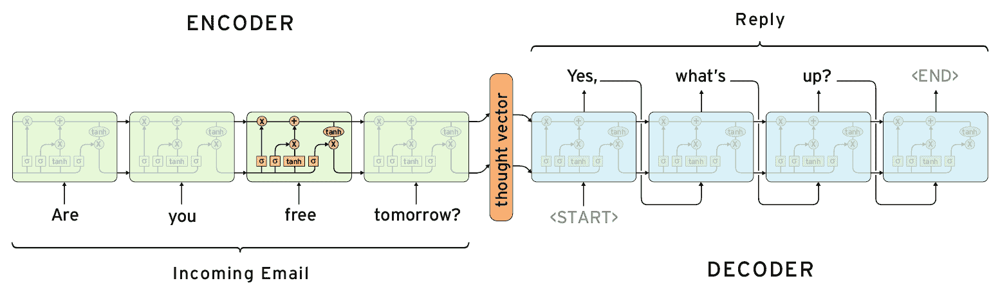
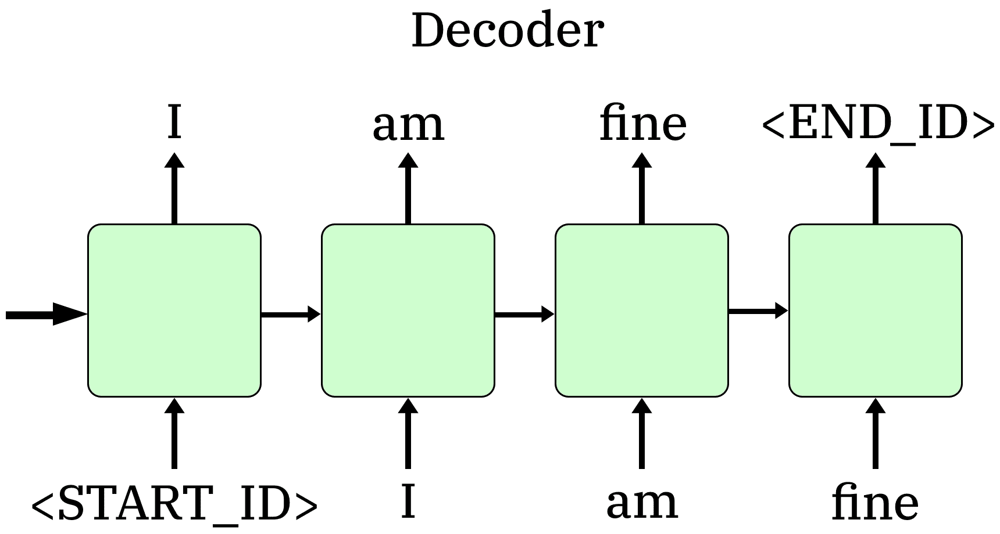

# 第五章：构建你的个人助手

在本章中，我们将将全部注意力集中在构建对话型聊天机器人时递归神经网络的实际应用上。通过利用你最新掌握的序列模型知识，你将创建一个端到端的模型，旨在得到有意义的结果。你将使用一个基于 TensorFlow 的高级库，名为 TensorLayer。这个库可以让你更轻松地创建像聊天机器人这样的复杂系统的简单原型。我们将涵盖以下主要话题：

+   **我们在构建什么？**：这是对具体问题及其解决方案的更详细介绍。

+   **准备数据**：和往常一样，任何深度学习模型都需要这一步，因此在这里提及它至关重要。

+   **创建聊天机器人网络**：你将学习如何使用 TensorLayer 构建聊天机器人所需的序列到序列模型图。

+   **训练聊天机器人**：这一步将数据和网络图结合起来，以找到最合适的权重和偏置的组合。

+   **构建对话**：最后一步使用已经训练好的模型，并结合示例句子，生成有意义的对话。

# 我们在构建什么？

本章的重点是带你一步步构建一个能够回答不同问题的简单对话型聊天机器人。近年来，聊天机器人越来越受欢迎，我们可以在许多实际应用中看到它们。

你可以在以下一些领域看到此软件的应用：

+   **客户与企业之间的沟通**，其中聊天机器人帮助用户找到他们需要的东西，或者提供支持如果某些东西没有正常工作。例如，Facebook 提供了一种非常方便的方式来为你的企业实现聊天机器人。

+   **语音控制系统背后的个人助手，如 Amazon Alexa、Apple Siri 等**：你将体验一个完整的端到端类人对话，可以设置提醒、订购产品等。

我们的简单示例将展示一个稍微扩展版的 TensorLayer 聊天机器人代码示例（[`github.com/tensorlayer/seq2seq-chatbot`](https://github.com/tensorlayer/seq2seq-chatbot)）。我们将使用由预收集推文组成的数据集，并将利用序列到序列模型。回顾之前的章节，这种模型使用两个递归神经网络，第一个是编码器，第二个是解码器。稍后我们将详细介绍如何使用这种架构来构建聊天机器人。

# 准备数据

在本节中，我们将专注于如何将我们的数据（在此案例中为推文）转换以满足模型的要求。我们将首先看到，如何使用来自 GitHub 任务仓库中的`data/`文件夹中的文件，模型可以帮助我们提取所需的推文。然后，我们将看看如何通过一组简单的函数，将数据拆分并转换为所需的结果。

一个重要的文件是`data.py`，位于`data/twitter`文件夹内。它将纯文本转换为数字格式，以便我们轻松训练网络。我们不会深入探讨其实现，因为你可以自己查看。在运行代码后，我们会生成三个重要的文件：

+   `idx_q.npy`：这是一个包含所有单词在不同句子中索引表示的数组，构成了聊天机器人问题的内容。

+   `idx_a.npy`：这是一个包含所有单词在不同句子中索引表示的数组，构成了聊天机器人回答的内容。

+   `metadata.pkl`：它包含了用于此数据集的*索引到单词*（`idx2w`）和*单词到索引*（`w2idx`）字典。

现在，让我们聚焦于这个数据的实际应用。你可以在本章 GitHub 仓库中的`ch5_task.py`文件的前 20 行查看它的使用。

首先，我们导入几个将在整个程序中使用的 Python 库：

```py
import time
import tensorflow as tflow
import tensorlayer as tlayer
from sklearn.utils import shuffle
from tensorlayer.layers import EmbeddingInputlayer, Seq2Seq, DenseLayer, retrieve_seq_length_op2
```

以下是这些库的详细说明，附带描述：

+   `time`：这是用于跟踪操作所花时间的变量。你将在接下来的部分看到它的使用，在那里我们将训练网络。

+   `tensorflow`：它仅用于执行少数操作（初始化变量、使用 Adam 优化器优化网络，以及初始化 TensorFlow 会话：`tf.Session()`）。

+   `tensorlayer`：正如你已经知道的，TensorLayer（[`tensorlayer.readthedocs.io/en/stable/`](https://tensorlayer.readthedocs.io/en/stable/)）是一个基于 TensorFlow 的深度学习库。它提供了广泛的方法和类，使得任何开发者都能轻松构建复杂任务的解决方案。这个库将帮助我们轻松构建和训练我们的序列到序列模型。

+   `shuffle`：我们用它来打乱`trainX`和`trainY`中表示不同句子的所有数组。你将在接下来的部分看到我们如何获取`trainX`和`trainY`。

+   `EmbeddingInputlayer`：一个 TensorLayer 类，表示序列到序列模型的输入层。正如你所知道的，每个`Seq2Seq`模型都有两个输入层，编码器和解码器。

+   `Seq2Seq`：一个 TensorLayer 类，用于构建类似于下图所示的序列到序列模型：



+   `DenseLayer`：TensorLayer 表示的全连接（密集）层。有多种类型的层执行不同的转换，且在特定场景中使用。例如，我们已经使用过递归层，它用于时间序列数据。还有用于图像的卷积层等等。你可以通过这个视频了解更多内容（[`www.youtube.com/watch?v=FK77zZxaBoI`](https://www.youtube.com/watch?v=FK77zZxaBoI)）。

+   `retrieve_seq_length_op2`：一个 TensorLayer 函数，用于计算序列长度，排除任何零填充部分。我们将会在编码和解码序列中使用这个函数。

导入库后，我们需要按如下方式访问数据：

```py
from data.twitter import data
metadata, idx_q, idx_a = data.load_data(PATH='data/twitter/')
(trainX, trainY), (testX, testY), (validX, validY) = data.split_dataset(idx_q, idx_a)
```

首先，我们从 GitHub 仓库中的`data/twitter/`文件夹加载`metadata`、`idx_q`和`idx_a`。其次，我们使用`split_dataset`方法将编码器（`idx_q`）和解码器（`idx_a`）数据分为训练集（70%）、测试集（15%）和验证集（15%）。

最后，我们将`trainX, trainY, testX, testY, validX, validY`转换为 Python 列表，然后使用 TensorLayer 函数`tlayer.prepro.remove_pad_sequences()`从每个列表的末尾去除填充（零元素）。

将前面的操作结合起来，就得到了明确的训练、测试和验证数据。你将在本章后面看到我们如何在训练和预测中使用这些数据。

# 创建聊天机器人网络

本节是最重要的部分之一，因此你需要确保自己能够充分理解它，以便掌握我们应用程序的整体概念。我们将介绍将用于训练和预测的网络图。

但首先，让我们定义模型的超参数。这些是预定义的常量，对于确定模型的表现非常重要。正如你将在下一章中学到的那样，我们的主要任务是调整超参数的值，直到我们对模型的预测满意为止。在这种情况下，选择了一组初始的超参数。当然，为了更好的性能，必须对它们进行一些优化。本章不会专注于这一部分，但我强烈建议你使用本书最后一章（第六章，*提升你的 RNN 性能*）中的技术来优化这些参数。当前的超参数选择如下：

```py
batch_size = 34
embedding_dimension = 1024
learning_rate = 0.0001
number_epochs = 1000
```

以下是这些超参数的简要解释：

+   `batch_size`：此项决定每个批次应包含多少元素。通常，训练是在批次上进行的，其中数据被分割成子数组，每个子数组的大小为`batch_size`。

+   `embedding_dimension`：此项决定词嵌入向量的大小。输入中的一个单词会被编码成大小为`embedding_dimension`的向量。

+   `learning_rate`：其值决定了网络学习的速度。通常这是一个非常小的值（`0.001, 0.0001`）。如果在训练过程中损失函数没有下降，通常的做法是减小学习率。

+   `number_epochs`：此项决定训练迭代次数（epoch）。在每次迭代开始时，我们会打乱数据，并且由于一个 epoch 的大小太大，无法一次性输入计算机，我们将其分成多个较小的批次。然后，我们使用这些批次来训练网络。在每次迭代之后，我们会再次打乱数据并执行第二个 epoch。这个操作会根据我们设置的 epoch 数量进行。

在确定了超参数集后，接下来需要为我们构建模型提供额外的值：

```py
xseq_len = len(trainX)
yseq_len = len(trainY)
assert xseq_len == yseq_len

n_step = int(xseq_len/batch_size)

w2idx = metadata['w2idx']
idx2w = metadata['idx2w']

xvocab_size = len(metadata['idx2w'])
start_id = xvocab_size
end_id = xvocab_size+1

w2idx.update({'start_id': start_id})
w2idx.update({'end_id': end_id})
idx2w = idx2w + ['start_id', 'end_id']

xvocab_size = yvocab_size = xvocab_size + 2
```

让我们逐行检查每一项：

```py
xseq_len = len(trainX)
yseq_len = len(trainY)
assert xseq_len == yseq_len
```

我们使用`xseq_len`和`yseq_len`来存储编码器和解码器输入序列的长度。然后，我们确保这两个值相等，否则程序将会中断。

`n_step = int(xseq_len/batch_size)`：通过这个，我们存储训练即将执行的步数。这个值仅用于打印训练状态，稍后我们会在本章中看到它的用法。

我们使用`w2idx`和`idx2w`以两种格式存储词典（词作为字典键，ID 作为字典键）。这些字典在预测聊天机器人响应时使用：

```py
w2idx = metadata['w2idx']
idx2w = metadata['idx2w']
```

我们设置`start_id = xvocab_size`和`end_id = xvocab_size + 1`以确保这两个索引的唯一性。它们用于表示单个句子的开始和结束：

```py
xvocab_size = len(metadata['idx2w'])
start_id = xvocab_size
end_id = xvocab_size+1
```

最后，我们扩展这些字典，包含起始和结束元素。我们数据的一个示例集如下：

+   `encode_seqs`（输入编码器句子）：`['how', 'are', 'you', '<PAD_ID>']`

+   `decode_seqs`（输入解码器句子）：`['<START_ID>', 'I', 'am', 'fine', '<PAD_ID>']`

+   `target_seqs`（预测的解码器句子）：`['I', 'am', 'fine', '<END_ID>', '<PAD_ID>']`

+   `target_mask`（每个序列应用的掩码）：`[1, 1, 1, 1, 0]`。这是一个与`target_seqs`大小相同的数组，但在应用填充的地方为`0`，其他地方为`1`。你可以通过阅读这篇很棒的 Quora 回答来了解更多关于循环神经网络中掩码的知识（[`www.quora.com/What-is-masking-in-a-recurrent-neural-network-RNN`](https://www.quora.com/What-is-masking-in-a-recurrent-neural-network-RNN)）。

下一步是定义我们的模型结构。我们从引入模型的占位符开始：

```py
encode_seqs = tf.placeholder(dtype=tf.int64, shape=[batch_size, None], name="encode_seqs")
decode_seqs = tf.placeholder(dtype=tf.int64, shape=[batch_size, None], name="decode_seqs")
target_seqs = tf.placeholder(dtype=tf.int64, shape=[batch_size, None], name="target_seqs")
target_mask = tf.placeholder(dtype=tf.int64, shape=[batch_size, None], name="target_mask")
```

如你所见，这是之前展示的相同变量集。每个变量都有一个`batch_size`维度和`tf.int64`类型。然后，我们按如下方式计算模型输出：

```py
net_out, _ = model(encode_seqs, decode_seqs, is_train=True, reuse=False)
```

上述代码行的目的是通过输入编码器和解码器序列来找到网络的输出。我们将在接下来的部分定义并解释`model`方法。

最后，我们定义损失函数和优化器：

```py
loss = tl.cost.cross_entropy_seq_with_mask(logits=net_out.outputs, target_seqs=target_seqs, input_mask=target_mask, name='cost')

optimizer = tf.train.AdamOptimizer(learning_rate=learning_rate).minimize(loss)
```

如你所见，损失函数是应用了掩码的交叉熵，以确保每个输入序列的长度相同。`logits`（预测输出）来自前面的模型输出，并通过`net_out.outputs`访问。`target_seqs`是每个输入的预期结果。

模型的优化器是`AdamOptimizer`，并通过 TensorFlow 内置函数`tf.train.AdamOptimizer`来定义。像往常一样，我们传递`learning_rate`来决定`loss`函数最小化的速率。

最后的步骤是定义并解释`model`函数：

```py
def model(encode_seqs, decode_seqs, is_train=True, reuse=False):
   with tf.variable_scope("model", reuse=reuse):
        with tf.variable_scope("embedding") as vs:
            net_encode = EmbeddingInputlayer(
                inputs = encode_seqs,
                vocabulary_size = xvocab_size,
                embedding_size = embedding_dimension,
                name = 'seq_embedding')
                vs.reuse_variables()
            net_decode = EmbeddingInputlayer(
                inputs = decode_seqs,
                vocabulary_size = xvocab_size,
                embedding_size = embedding_dimension,
                name = 'seq_embedding')
           net_rnn = Seq2Seq(net_encode, net_decode,
                cell_fn = tf.contrib.rnn.BasicLSTMCell,
                n_hidden = embedding_dimension,
                initializer = tf.random_uniform_initializer(-0.1, 0.1),
                encode_sequence_length = 
                retrieve_seq_length_op2(encode_seqs),
                decode_sequence_length = 
                retrieve_seq_length_op2(decode_seqs),
                initial_state_encode = None,
                n_layer = 3,
                return_seq_2d = True,
                name = 'seq2seq')
                net_out = DenseLayer(net_rnn, n_units=xvocab_size, 
                act=tf.identity, name='output')
      return net_out, net_rnn
```

TensorLayer 尽可能简化了构建序列到序列模型的过程。它使用了四个主要组件：

+   `net_encode`：使用`EmbeddingInputlayer`类的编码器网络。

+   `net_decode`：使用`EmbeddingInputlayer`类的解码器网络。

+   `net_rnn`: 一个将两个上述网络组合起来的序列到序列模型。它使用`Seq2Seq` 类实现。

+   `net_out`: 最终的全连接（密集）层，产生最终结果。该层建立在序列到序列网络之上。

使用`EmbeddingInputlayer` ([`tensorlayer.readthedocs.io/en/stable/modules/layers.html#tensorlayer.layers.EmbeddingInputlayer`](https://tensorlayer.readthedocs.io/en/stable/modules/layers.html#tensorlayer.layers.EmbeddingInputlayer)) 类初始化`net_encode` 和 `net_decode`。使用了三个重要的参数：`inputs`、`vocabulary_size` 和 `embedding_size`。`inputs` 是我们在前面部分中定义的 `encode_seqs` 或 `decode_seqs`。在两种情况下，`vocabulary_size` 等于 `xvocab_size`，`embedding_size` 等于 `embedding_dimension`。这个嵌入层将输入向量转换为指定 `embedding_dimension` 大小之一。

`net_rnn` 将编码器和解码器层结合成一个完整的序列到序列模型。以下是其参数：

+   `cell_fn`: 整个网络中使用的 RNN 单元。在我们的情况下，这是`BasicLSTMCell`。

+   `n_hidden`: 每个网络层中隐藏单元的数量。

+   `initializer`: 用于定义参数（权重、偏置）的分布。

+   `encode_sequence_length`: 指定编码器输入序列的长度。它使用`retrieve_seq_length_op2` ([`tensorlayer.readthedocs.io/en/stable/modules/layers.html#tensorlayer.layers.retrieve_seq_length_op2`](https://tensorlayer.readthedocs.io/en/stable/modules/layers.html#tensorlayer.layers.retrieve_seq_length_op2)) 方法来处理`encode_seqs`。

+   `decode_sequence_length`: 指定解码器输入序列的长度。它使用`retrieve_seq_length_op2` 方法处理`decode_seqs`。

+   `initial_state_encode`: 如果为`None`，编码器网络的初始状态为零状态，并可以由占位符或另一个循环神经网络自动设置。

+   `n_layer`: 每个两个网络（编码器和解码器）堆叠的 RNN 层的数量。

+   `return_seq_2d`: 如果为 `True`，返回 `2D Tensor [n_example, 2 * n_hidden]`，以便在其后堆叠 `DenseLayer`。

最后，我们使用一个全连接（密集）层`net_out`来计算网络的最终输出。它将`Seq2Seq` 网络作为前一层，词汇表大小（`xvocab_size`）作为单元数，并使用`tf.identity` 作为激活函数。通常用于在设备之间显式传输张量的场景（例如，从 GPU 到 CPU）。在我们的情况下，我们使用它来构建复制前一层数值的虚拟节点。

最后需要指出的是`reuse`参数和`vs.reuse_variables()`方法调用的使用。在训练过程中，我们并没有重用模型的参数（权重和偏置），因此`reuse = False`，但是在预测聊天机器人响应时，我们会利用预训练的参数，因此将`reuse = True`。该方法调用会触发下一组计算的重用。

到这里，我们已经完成了模型的定义。从现在开始，剩下的只有两个部分：训练和预测。

# 训练聊天机器人

一旦我们定义了模型图，我们就希望使用输入数据来训练它。然后，我们将拥有一组经过良好调整的参数，可以用于准确的预测。

首先，我们指定 TensorFlow 的 Session 对象，它封装了执行操作（加法、减法等）对象和评估张量（占位符、变量等）对象的环境：

```py
sess = tf.Session(config=tf.ConfigProto(allow_soft_placement=True, log_device_placement=False))
sess.run(tf.global_variables_initializer())
```

关于`config`参数的一个很好的解释可以在[`stackoverflow.com/questions/44873273/what-do-the-options-in-configproto-like-allow-soft-placement-and-log-device-plac`](https://stackoverflow.com/questions/44873273/what-do-the-options-in-configproto-like-allow-soft-placement-and-log-device-plac)找到。总结来说，一旦我们指定了`allow_soft_placement`，只有在没有注册 GPU 的情况下，操作才会在 CPU 上执行。如果该值为 false，则不允许在 GPU 上执行任何操作。

只有在运行第二行代码（`sess.run(tf.global_variables_initializer())`）后，所有的变量才会实际持有它们的值。最初，它们只存储一个持久的张量。

现在，我们将使用`train()`函数来训练网络，函数定义如下：

```py
def train():
    print("Start training")
    for epoch in range(number_epochs):
        epoch_time = time.time()
        trainX_shuffled, trainY_shuffled = shuffle(trainX, trainY, 
        random_state=0)
        total_err, n_iter = 0, 0

        for X, Y in tl.iterate.minibatches(inputs=trainX_shuffled, 
        targets=trainY_shuffled, batch_size=batch_size, shuffle=False):

            X = tl.prepro.pad_sequences(X)

            _decode_seqs = tl.prepro.sequences_add_start_id(Y, 
             start_id=start_id, remove_last=False)
            _decode_seqs = tl.prepro.pad_sequences(_decode_seqs)   

            _target_seqs = tl.prepro.sequences_add_end_id(Y, 
             end_id=end_id)
            _target_seqs = tl.prepro.pad_sequences(_target_seqs)
            _target_mask = tl.prepro.sequences_get_mask(_target_seqs)

            _, err = sess.run([optimizer, loss],
                                {encode_seqs: X,
                                decode_seqs: _decode_seqs,
                                target_seqs: _target_seqs,
                                target_mask: _target_mask})

            if n_iter % 200 == 0:
                print("Epoch[%d/%d] step:[%d/%d] loss:%f took:%.5fs" % 
                (epoch, number_epochs, n_iter, n_step, err, time.time() 
                 - epoch_time))

                total_err += err; n_iter += 1
```

让我们逐行解释前面的代码做了什么。

该实现有两个嵌套循环，其中外层循环决定训练应该遍历整个数据集多少次。通常使用 epoch 来完成此任务，目的是加强模型的准确性。因为权重和偏置在仅仅一次传播中，往往无法从某个示例中学到足够的内容。所以，我们应该多次遍历每个示例——在我们这个例子中是 1,000 次（epoch 的数量）。

在进入一个 epoch 迭代后，我们使用`sklearn`中的`shuffle`函数打乱数据，为进入内部循环做准备。然后，我们使用`tl.iterate.minibatches`将数据分割成子数组，每个子数组的大小为`batch_size`。内部循环中的每一次迭代都会使用当前批次的数据训练网络。

在计算优化器之前，我们对 X（编码器批数据）和 Y（解码器批数据）做一些小的修改。如你所记得，模型有一个编码器输入（`encoder_seqs`）、一个解码器输入（`decoder_seqs`）和一个目标输出（`target_seqs`），并且它们被结合进两个 RNN 中。

第一个递归神经网络是编码器，它接受`encoder_seqs`作为输入。在上面的代码块中，它标记为*X*。我们只需要在将此序列应用到网络之前给它添加填充。填充是将零添加到序列的末尾，使其与固定长度匹配，这个长度是由训练集中最长的序列决定的。这个网络会生成一个向量，之后它会被用到第二个 RNN 中。

第二个递归神经网络接收来自第一个 RNN 的编码向量和解码器输入序列（`decoder_seqs`），并返回预测结果。在训练过程中，我们将预测结果与目标序列（`target_seqs`）进行比较，而目标序列恰好与预测结果相同。

让我们澄清一下前面的陈述。假设你有一个输入句子*Hello, how are you?*，它的回应是*I am fine.*。第一个句子进入编码器网络。第二个句子是第二个解码器网络的预期输出。我们需要将这个预期输出与解码器实际产生的输出进行比较。我们先得到第一个单词**I**，并尝试预测下一个单词**am**，然后得到**am**并尝试预测**fine**，依此类推。刚开始时，我们的预测可能会偏差很大，但随着时间推移，权重和偏差应该会调整得更加准确。下面的图表可以辅助说明：



如你所见，我们需要在`decoder_seqs`中添加一个起始符号，在`target_seqs`中添加一个结束符号。这正是`_decode_seqs = tl.prepro.sequences_add_start_id(Y, start_id=start_id, remove_last=False)`和`_target_seqs = tl.prepro.sequences_add_end_id(Y, end_id=end_id)`所做的事情，其中`start_id = xvocab_size`和`end_id = xvocab_size+1`。最后，我们给两个序列都添加填充，使它们长度相等。

在实际训练之前，我们从`_target_seqs`中提取`_target_mask`。回想一下，如果`_target_seqs = ["I", "am", "fine", "<END_ID>", "<PAD_ID>"]`，那么`_target_mask = [1, 1, 1, 1, 0]`。

最终，我们使用之前定义的序列数组来训练我们的网络。这可能需要一些时间，因此我们在每 200 次迭代后添加了打印语句。我建议你在训练时让计算机整夜运行，这样你就能从数据中提取最大潜力。

下一步是使用我们的模型预测实际输出。让我们看看它能多好地完成这个任务。

# 构建对话

这一步实际上与训练步骤非常相似。第一个区别是我们不会对预测结果进行评估，而是使用输入生成结果。第二个区别是我们使用已训练好的变量集来生成此结果。你将看到本章后面如何实现这一点。

为了更清楚地说明，我们首先初始化一个新的序列到序列的模型。其目的是使用已经训练好的权重和偏置，并根据不同的输入集进行预测。我们只有一个编码器和解码器序列，其中编码器序列是输入句子，而解码器序列则是一次输入一个单词。我们定义新模型如下：

```py
encode_seqs2 = tf.placeholder(dtype=tf.int64, shape=[1, None], name="encode_seqs")
decode_seqs2 = tf.placeholder(dtype=tf.int64, shape=[1, None], name="decode_seqs")
net, net_rnn = model(encode_seqs2, decode_seqs2, is_train=False, reuse=True)
y = tf.nn.softmax(net.outputs)
```

如你所见，它遵循与训练架构完全相同的模式，唯一的区别是我们的序列矩阵形状为 `1`，而不是 `batch_size`。

需要注意的一点是，在计算网络结果时，我们必须**重用**训练过程中使用的相同参数。这一步至关重要，因为它确保了我们的预测是最近训练结果的产物。

最后，我们使用 softmax 函数计算最终输出`y`。这通常在最后一层完成，以确保我们的向量值加起来为 1，并且是分类过程中的必要步骤。

在定义好我们的新模型后，接下来就是进行实际预测的时刻。我们遵循以下模式：

1.  生成一个初始句子，作为对话的开端。

1.  使用 `word2idx` 字典将句子转换为单词索引列表。

1.  决定我们希望对话有多少次来回交互（在我们的案例中，这将是五次）。

1.  通过将初始句子传入 `net_rnn`（如前所定义）来计算编码器的最终状态。

1.  最后，我们使用之前预测的单词和网络迭代地预测下一个单词。在第一次迭代时，我们使用先前定义的 `start_id` 作为解码器的第一个单词。

这些步骤在以下代码片段中执行：

```py
def predict():
    seeds = ["happy birthday have a nice day",
            "the presidential debate held last night was spectacular"]
    for seed in seeds:
        seed_id = [w2idx[w] for w in seed.split(" ")]
        for _ in range(5):  # 5 Replies
            # 1\. encode, get state
            state = sess.run(net_rnn.final_state_encode,
                            {encode_seqs2: [seed_id]})

            # 2\. decode, feed start_id, get first word
            o, state = sess.run([y, net_rnn.final_state_decode],
                            {net_rnn.initial_state_decode: state,
                            decode_seqs2: [[start_id]]})

            w_id = tl.nlp.sample_top(o[0], top_k=3)
            w = idx2w[w_id]

            # 3\. decode, feed state iteratively
            sentence = [w]
            for _ in range(30): # max sentence length
                o, state = sess.run([y, net_rnn.final_state_decode],
                                {net_rnn.initial_state_decode: state,
                                decode_seqs2: [[w_id]]})
                w_id = tl.nlp.sample_top(o[0], top_k=2)
                w = idx2w[w_id]
                if w_id == end_id:
                    break
                sentence = sentence + [w]

            print(" >", ' '.join(sentence))
```

一个有趣的地方在于，`# 2\. decode, feed start_id, get first word` 和 `# 3\. decode, feed state iteratively` 执行的动作完全相同，但步骤 #2 是一个特殊的情况，专注于仅预测第一个单词。步骤 #3 使用第一个单词，迭代地预测后续所有单词。

`tl.nlp.sample_top(o[0], top_k=3)` 可能也会让你感到困惑。这一行从概率数组 o[0] 中采样一个索引，考虑的候选项只有三个。同样的功能也适用于 `w_id = tl.nlp.sample_top(o[0], top_k = 2)`。你可以在 TensorLayer 文档中了解更多内容（[`tensorlayer.readthedocs.io/en/stable/modules/nlp.html#sampling-functions`](https://tensorlayer.readthedocs.io/en/stable/modules/nlp.html#sampling-functions)）。

最后，我们打印出由 30 个单词组成的句子（我们限制了每个句子的单词数）。如果你训练了足够长的时间，你应该能看到一些不错的结果。如果结果不满意，那就需要进行大量的工作。你将在接下来的第六章中了解更多内容，*提升你的 RNN 性能*。

# 总结

本章展示了一个完整的聊天机器人系统实现，该系统能够构建一个简短的对话。原型详细展示了构建智能聊天机器人的每个阶段，包括收集数据、训练网络和进行预测（生成对话）。

对于网络的架构，我们使用强大的编码器-解码器序列到序列模型，该模型利用两个递归神经网络，并通过编码器向量连接它们。在实际实现中，我们使用一个建立在 TensorFlow 之上的深度学习库——TensorLayer。通过引入简单的一行代码实现标准模型，如*序列到序列*，它简化了大部分工作。此外，该库在训练之前对数据进行预处理时也非常有用。

下一章将重点讨论构建递归神经网络（以及任何深度学习模型）过程中，可能是最重要的部分——如何提升性能并使程序返回令人满意的结果。正如你已经看到的，在大多数基础/中等难度的示例中，构建神经网络遵循类似的模式。困难的部分是确保实现确实有效并产生有意义的结果。这将是我们下一章的重点——希望你能喜欢。

# 外部链接

+   TensorLayer 聊天机器人代码示例：[`github.com/tensorlayer/seq2seq-chatbot`](https://github.com/tensorlayer/seq2seq-chatbot)

+   TensorLayer 库：[`tensorlayer.readthedocs.io/en/stable/`](https://tensorlayer.readthedocs.io/en/stable/)

+   神经网络中的层：[`www.youtube.com/watch?v=FK77zZxaBoI`](https://www.youtube.com/watch?v=FK77zZxaBoI)

+   递归神经网络（RNN）中的掩码是什么？：[`www.quora.com/What-is-masking-in-a-recurrent-neural-network-RNN`](https://www.quora.com/What-is-masking-in-a-recurrent-neural-network-RNN)

+   TensorLayer 的 embeddingInputlayer 类：[`tensorlayer.readthedocs.io/en/stable/modules/layers.html#tensorlayer.layers.EmbeddingInputlayer`](https://tensorlayer.readthedocs.io/en/stable/modules/layers.html#tensorlayer.layers.EmbeddingInputlayer)

+   TensorLayer 的`retrieve_seq_length_op2`方法：[`tensorlayer.readthedocs.io/en/stable/modules/layers.html#tensorlayer.layers.retrieve_seq_length_op2`](https://tensorlayer.readthedocs.io/en/stable/modules/layers.html#tensorlayer.layers.retrieve_seq_length_op2)

+   TensorFlow 会话的 config 参数：[`stackoverflow.com/questions/44873273/what-do-the-options-in-configproto-like-allow-soft-placement-and-log-device-plac`](https://stackoverflow.com/questions/44873273/what-do-the-options-in-configproto-like-allow-soft-placement-and-log-device-plac)

+   TensorLayer 采样函数：[`tensorlayer.readthedocs.io/en/stable/modules/nlp.html#sampling-functions`](https://tensorlayer.readthedocs.io/en/stable/modules/nlp.html#sampling-functions)
