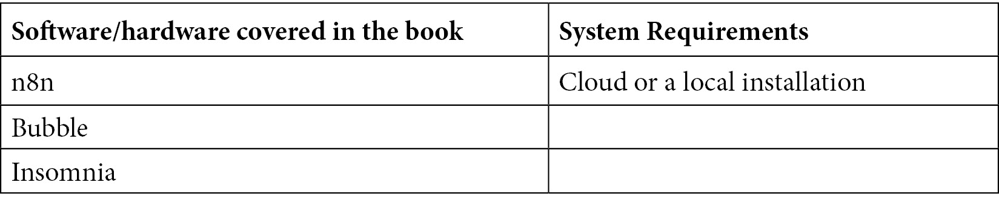

# 前言

n8n使用户能够连接不同的系统和云服务，而无需昂贵的开发者或技术技能。它允许你减少开发新产品所需的时间，帮助你比组建一个完整的开发团队更快地将产品推向市场。

与n8n一起工作的开发者将能够通过这本构建低代码应用的实用指南将他们的知识付诸实践。本书采用动手实践的方法，以及相关的实施方法，将使你迅速上手并变得高效。

你将从了解n8n在你的业务技术栈中的位置以及它如何提供降低成本、提高效率和收入的机会开始。稍后，你将识别出可以在工作环境中利用n8n的连接性和自动化功能的机会，并逐步构建一个基于n8n的工具集，这将立即对你的业务运营的底线产生积极影响。

在本书结束时，你将能够识别出在现实世界中产生收入、提高效率和构建利用这些机会的工具的机会。

# 本书面向的对象

本书面向的是对JavaScript编程语言和Web概念（如API和Webhook）有基本了解的Web开发者和低代码爱好者。本书假设读者对JavaScript编程有入门级知识。

# 本书涵盖的内容

[*第1章*](B17493_01_Final_PD_ePub.xhtml#_idTextAnchor015)*，无代码、n8n和Bubble简介*，你将了解无代码以及为什么它对商业和技术变得越来越重要。你还将熟悉n8n，一个无代码自动化工具，以及Bubble，一个无代码开发平台。

[*第2章*](B17493_02_Final_PD_ePub.xhtml#_idTextAnchor029)*，使用编辑器UI创建工作流*，本章教你如何使用n8n的编辑器UI。你还将了解n8n中不同类型的节点以及如何使用它们。然后，你将学习关于工作流的内容，处理动态数据，并最终在n8n中创建你的第一个工作流。

[*第3章*](B17493_03_Final_PD_ePub.xhtml#_idTextAnchor039)*，深入n8n的核心节点和数据*，你将学习如何使用n8n的数据结构来操纵和转换工作流中的数据，并在你的低代码工作流中使用JavaScript来解锁自定义功能。你将使用HTTP请求节点在你的工作流中调用REST API。本章还将涵盖如何使用Webhook节点处理实时事件以及如何根据这些数据触发工作流。你将在n8n中处理数组和JSON对象，了解何时使用何种数据格式，并在你的工作流中转换数据。

[*第4章*](B17493_04_Final_PD_ePub.xhtml#_idTextAnchor069)*，通过实践学习：构建两个n8n应用*，展示了如何将前几章的概念结合起来，并使用它们来构建多个项目。其中一些项目将加强你之前学到的概念，而其他项目将引入一些新想法。这将帮助你了解你可以使用n8n构建的产品类型。最后，你将学习如何分享和发现新的工作流程，以及如何参与n8n的活跃社区。

[*第5章*](B17493_05_Final_PD_ePub.xhtml#_idTextAnchor079)*，构建你的第一个API端点*，将指导你创建API端点的蓝图，以便在构建API时摩擦最小；你还将配置Webhook节点，使其能够处理发送到API的请求并对其进行回复。你将在n8n中基于你之前创建的蓝图构建API端点，并通过使用Webhook节点中可用的不同身份验证方法来保护你的API端点。稍后，你还将测试你的API，以确保你实现的所有功能都按预期工作。

[*第6章*](B17493_06_Final_PD_ePub.xhtml#_idTextAnchor116)*，用无代码数据库为你的API提供动力*，展示了如何使用无代码数据库进行数据存储。你将了解无代码数据库、为你的项目选择数据库，以及如何向Airtable读写数据。你还将了解在处理这些数据库时的一些最佳实践。本章涵盖的概念将帮助你使用数据存储来存储用户生成数据并构建完整的产品。

[*第7章*](B17493_07_Final_PD_ePub.xhtml#_idTextAnchor147)*，在工作流程中转换你的数据*，探讨了如何在工作流程中操作数据，以便你创建的API可以以有用的格式返回数据。你还将了解在工作流程之间共享数据、处理数组和JSON对象、合并数据集以及执行分析和计算。

[*第8章*](B17493_08_Final_PD_ePub.xhtml#_idTextAnchor155)*，*在n8n中利用Bubble API*，探讨了如何实现Bubble和n8n之间的通信，使用数据API访问Bubble的数据，使用Bubble的工作流程并通过工作流程API与之交互，以及在n8n中接收来自Bubble的事件和数据。

[*第9章*](B17493_09_Final_PD_ePub.xhtml#_idTextAnchor180)*，构建应用程序的用户界面*，深入探讨了如何使用Bubble图形用户界面设计响应式应用程序，以及应用程序的外观和感觉如何改变用户体验。你将了解底层的数据结构以及如何指导用户将适当的数据输入到数据结构中。你将发现如何识别应用程序和工作流程中的错误，并主动处理如何向用户展示错误。最后，你将设计一个日志系统来捕获事件和错误，并分析日志中捕获的数据以改进应用程序。

[*第10章*](B17493_10_Final_PD_ePub.xhtml#_idTextAnchor204)*，我们才刚刚开始*，在这里你可以看到在如此短的时间内你取得了多么大的进步！在本章的最后，你将回顾你在本书中学到的内容，并获得一些帮助来寻找和启动下一个n8n项目！

# 为了充分利用本书

根据你目前使用的版本，你可能注意到屏幕上的内容可能看起来与书中略有不同。由于我们接近本书的结尾，n8n更新了他们的用户界面，这就是为什么这里的示例与书中不同。话虽如此，所有的脚本都继续按照书中的描述完全一样地工作，并且应该对你来说工作得很好。



**如果你使用的是本书的数字版，我们建议你亲自输入代码或从本书的GitHub仓库（下一节中有一个链接）访问代码。这样做将帮助你避免与代码复制和粘贴相关的任何潜在错误。**

# 下载示例代码文件

你可以从GitHub下载本书的示例代码文件，网址为[https://github.com/PacktPublishing/Rapid-Product-Development-with-n8n](https://github.com/PacktPublishing/Rapid-Product-Development-with-n8n)。如果代码有更新，它将在GitHub仓库中更新。

我们还提供了其他代码包，这些代码包来自我们丰富的书籍和视频目录，可在[https://github.com/PacktPublishing/](https://github.com/PacktPublishing/)找到。查看它们吧！

# 下载彩色图像

我们还提供了一个包含本书中使用的截图和图表的彩色图像的PDF文件。你可以从这里下载：

[https://static.packt-cdn.com/downloads/9781801817363_ColorImages.pdf](https://static.packt-cdn.com/downloads/9781801817363_ColorImages.pdf)

# 使用的约定

本书使用了多种文本约定。

`文本中的代码`：表示文本中的代码单词、数据库表名、文件夹名、文件名、文件扩展名、路径名、虚拟URL、用户输入和Twitter昵称。以下是一个示例：“现在，转到你的机器人并输入`/pokemon ditto`。”

代码块设置如下：

```py
<html> <body> <h1>From n8n with love  </h1> <b>Host:</b> {{$json["headers"]["host"]}} </br> <b>User Agent:</b> {{$json["headers"]["user-agent"]}} </body> </html> 
```

任何命令行输入或输出都写作如下：

```py
npm install pm2@latest -g
```

**粗体**：表示新术语、重要单词或您在屏幕上看到的单词。例如，菜单或对话框中的单词以**粗体**显示。以下是一个示例：“接下来，我们有**执行**选项卡，它打开一个模态（弹出窗口），您可以在其中查看您不同工作流程的执行情况。”

**提示或重要注意事项**

**看起来像这样**。

# **联系**

**读者反馈始终欢迎**。

**总体反馈**：如果您对本书的任何方面有任何疑问，请通过电子邮件发送至[customercare@packtpub.com](http://customercare@packtpub.com)，并在邮件主题中提及书名。

**勘误表**：尽管我们已经尽一切努力确保内容的准确性，但错误仍然可能发生。如果您在这本书中发现了错误，我们将不胜感激，如果您能向我们报告这一点。请访问[www.packtpub.com/support/errata](http://www.packtpub.com/support/errata)并填写表格。

**盗版**：如果您在互联网上发现任何形式的我们作品的非法副本，如果您能提供位置地址或网站名称，我们将不胜感激。请通过[copyright@packt.com](http://copyright@packt.com)与我们联系，并提供材料的链接。

**如果您有兴趣成为作者**：如果您在某个领域有专业知识，并且有兴趣撰写或为书籍做出贡献，请访问[authors.packtpub.com](http://authors.packtpub.com)。

# **分享您的想法**

一旦您阅读了《使用n8n进行快速产品开发》，我们很乐意听到您的想法！请[点击此处直接访问此书的亚马逊评论页面](https://packt.link/r/1801817367)并分享您的反馈。

您的评论对我们和科技社区都至关重要，并将帮助我们确保我们提供高质量的内容。
