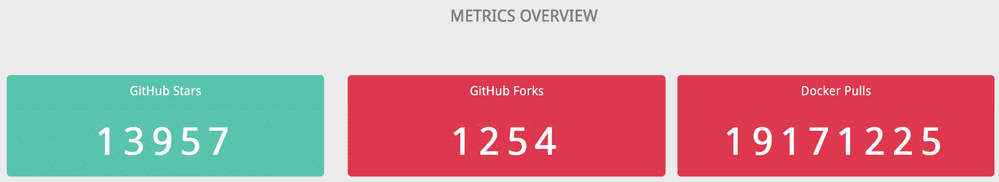
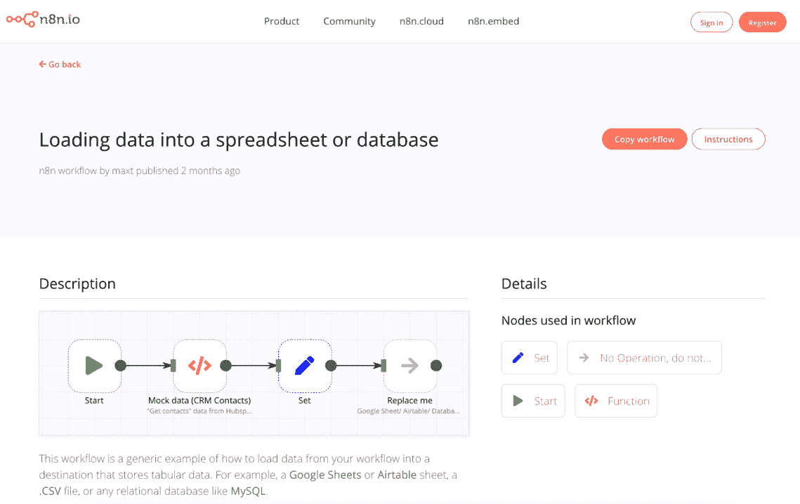

# 第四章：通过实践学习：构建两个 n8n 应用

在本章中，你将学习如何将前几章的概念结合起来，并使用它们来构建多个项目。其中一些项目将加强你之前学到的概念，而其他项目将介绍一些新想法。这将帮助你了解你可以使用 n8n 构建的产品类型。最后，我们将学习如何分享和发现新的工作流程，以及如何参与 n8n 的活跃社区。

本章将涵盖以下主要主题：

+   使用 n8n 构建产品

+   构建 Telegram 机器人

+   创建指标仪表板

+   分享和发现工作流程

# 技术要求

这是你在继续本章之前需要准备的技术要求列表：

+   安装 n8n。

+   确保 n8n 正在运行，并且编辑器 UI 已打开。

+   在 Telegram 上获取一个账户。

+   在 GitHub 上获取一个账户。

你可以在 GitHub 上找到本章的完整代码示例，地址为 [https://github.com/PacktPublishing/Rapid-Product-Development-with-n8n/tree/main/Chapter%204](https://github.com/PacktPublishing/Rapid-Product-Development-with-n8n/tree/main/Chapter%204)

# 使用 n8n 构建产品

如果你和我一样，你有很多想法来构建新的和令人兴奋的在线服务或自动化每天重复的枯燥任务。从历史上看，许多这些想法从未进一步发展，我不知道如何进入实际构建解决方案或开始原型开发的下一步。

无代码工具提供了一种更简单的方法来生产早期的 **最小可行产品**（**MVP**）或设计下一个伟大的网络服务。

n8n 与此无代码理念相同，允许你在比使用常规编程语言构建它们的时间少得多的时间内构建应用程序和工具。这不仅更快，而且更容易，因为你只需要了解一点 JavaScript（对于更复杂的应用程序），也许甚至不需要，这取决于你想要构建什么！

为了激发你使用 n8n 开始构建一些应用程序的动力，这里有一些执行有趣功能并展示如何快速轻松地启动的示例应用程序。

# 构建 Telegram 机器人

*宝可梦*是我成长过程中最喜欢的节目之一。即使今天，我也喜欢玩 *宝可梦 Go*。有时，你会在游戏中遇到非常强大的对手，你必须研究一下对方宝可梦的弱点。我的搜索历史充满了像“如何击败泰兰蒂拉”这样的查询。让我们创建一个提供宝可梦能力、招式和类型的信息的 Telegram 机器人。

在 [*第 2 章*](B17493_02_Final_PD_ePub.xhtml#_idTextAnchor029) 中，*使用编辑器 UI 创建工作流程*，我们学习了如何创建 Telegram 机器人，以及如何查询 REST API。我们将使用类似的流程，但也有一些需要注意的地方：

+   我们需要检查机器人用户是否输入了宝可梦的名字以及斜杠命令。

+   我们将查询宝可梦 API ([https://pokeapi.co](https://pokeapi.co)) 来获取数据。然而，该 API 非常全面，我们需要对数据进行处理，以便它符合我们想要消费这些信息的格式。

让我们按照 [*第 2 章*](B17493_02_Final_PD_ePub.xhtml#_idTextAnchor029)*，使用编辑器 UI 创建工作流程* 中提供的说明创建一个新的 Telegram 机器人。我给我的机器人命名为 `/setcommands`。选择你刚刚创建的机器人，并输入以下内容：

```py
pokemon - Get details about a specific pokemon
```

在运行命令后，你应该能看到以下截图类似的内容：


图 4.1 – 为我们的 Telegram 机器人设置命令

恭喜，你刚刚为你的机器人创建了一个命令。

让我们在 n8n 中开始构建这个机器人的后端。为此，请按照以下步骤操作：

1.  打开你的 n8n 编辑器 UI 并添加一个 **Telegram 触发** 节点。

1.  输入你新机器人的凭证，并在 **更新** 字段的下拉列表中选择 *****。

1.  现在，保存并执行工作流程。


图 4.2 – Telegram 触发节点设置

注意

如果你是在本地运行 n8n，请确保你正在使用隧道模式运行。

1.  现在，前往你的机器人并输入 `/pokemon ditto`。


图 4.3 – 向宝可梦机器人发送命令

1.  返回编辑器 UI，你将看到那里有一个响应。很可能是响应是 `/start`。如果是这样，请在响应中按 `/pokemon ditto`。


图 4.4 – 使用 Telegram 触发节点接收 /pokemon ditto 作为命令

你会注意到，有人可能只是点击了命令而没有输入宝可梦的名字。我们必须考虑到有人在使用这个机器人时可能会犯同样的错误。为了确保这种情况不会发生，让我们添加一个 **IF** 节点来检查用户是否提供了宝可梦的名字。

在编辑器 UI 中添加一个 **IF** 节点，并确保它与 **Telegram 触发** 节点连接。进入节点编辑视图，点击 **添加条件** 按钮，并选择 **字符串**。将 **操作** 设置为 **为空**。在 **值 1** 字段中添加一个表达式，并输入以下内容：

```py
{{ $json["message"]["text"].split(' ')[1] }}
```

这个 JavaScript 片段使用 `$json["message"]["text"]` 指向 `'/pokemon ditto'`。`.split(' ')` 方法在空格处拆分字符串并将其转换为数组，看起来像这样：`['/pokemon', 'ditto']`。然后我们选择位置 1 的项，即 `'ditto'`。执行节点。


图4.5 – 执行的IF节点，true没有输出

你会注意到**true**部分的输出为空，因为我们指定的条件是错误的。如果你在上面的**输出**字段中选择**false**而不是**true**，你会看到一个结果。现在让我们设置一个默认消息，以防没有指定宝可梦的名字。

1.  在编辑器UI中添加一个**Telegram**节点，并将其连接到**IF**节点的**true**输出。

1.  配置节点的凭据，并使用表达式设置**Chat ID**的值（你可以从**Telegram触发**节点中获取）。表达式应该看起来像这样：

    ```py
    {{$node["Telegram1 Trigger"].json["message"]["chat"]["id"]}}
    ```

    注意

    我们在这里使用了一个表达式，而不是[*第2章*](B17493_02_Final_PD_ePub.xhtml#_idTextAnchor029)*，使用编辑器UI创建工作流程*中的**Telegram**节点，因为许多人可能在使用**Telegram**机器人，我们希望将答案发送给查询的人。

1.  在文本字段中输入以下内容， `请输入宝可梦的名字。例如，'/pokemon ditto'（不带引号）。` 随意自定义信息。

1.  现在我们执行工作流程，这次我们只向机器人发送 `/pokemon`。响应应该看起来像这样。


图4.6 – 向机器人发送/pokemon作为命令后的响应

现在我们已经解决了我们之前提到的一个挑战，让我们专注于从API获取数据并将其发送回用户。为此，请按照以下步骤操作：

1.  在编辑器UI中添加一个**HTTP请求**节点，并将其连接到**IF**节点的**false**输出。现在工作流程应该看起来像这样。


图4.7 – 添加HTTP请求节点后，你的工作流程应该看起来像这样

在我们继续之前，再次执行工作流程，并向机器人发送`/pokemon ditto`。这将使工作流程中的数据流向我们正在构建的false分支。

1.  打开**HTTP请求**节点，将表达式添加到**URL**字段，并输入以下内容：

    ```py
    https://pokeapi.co/api/v2/pokemon/{{$json["message"]["text"].split(' ')[1]}}
    ```

这将确保API返回你请求的宝可梦的详细信息。执行节点，你会注意到你得到了关于Ditto的大量数据。我们特别关注的是能力、招式和类型。然而，这些是包含对象的数组。我们将不得不调整数据，使其转换为对我们有用的格式。我们将使用**函数**节点来完成这项工作。

在编辑器UI中添加一个**函数**节点，并将其连接到**HTTP请求**节点。打开**JavaScript代码**字段，并输入以下代码：

```py
const abilities = [];
const moves = [];
const types = [];
for (let i=0; i<items[0].json.abilities.length;i++) {
abilities.push(items[0].json.abilities[i].ability.name);
}
for (let i=0; i<items[0].json.moves.length;i++) {
moves.push(items[0].json.moves[i].move.name);
}
for (let i=0; i<items[0].json.types.length;i++) {
types.push(items[0].json.types[i].type.name);
}
return [{json: {name: items[0].json.name, abilities, moves, types}}];
```

让我们来理解这里发生了什么。我们创建了三个新的数组，分别命名为 `abilities`、`moves` 和 `types`。然后我们创建了一个循环，将每个能力、动作和类型的名称推入相应的数组。最后，我们以 n8n 预期的格式返回数据。执行节点后，它应该看起来像这样：


图 4.8 – 函数节点的输出

完美，我们现在只得到了我们需要的资料。现在我们需要将其发送到 Telegram 机器人。

添加一个新的 Telegram 节点，并将其与 **函数** 节点连接起来。配置您的凭据和之前讨论过的 **聊天 ID**。现在，在 **文本** 字段中添加一个表达式，并按您认为合适的方式格式化数据。

这就是我的表达式的样子：

```py
<b>Name:</b> {{$json["name"]}}
<b>Abilities:</b> {{$json["abilities"].join(', ')}}
<b>Moves:</b> {{$json["moves"].join(', ')}}
<b>Types:</b> {{$json["types"].join(', ')}}
```

备注

当向表达式添加数组值时，例如 `abilities`，您可以在表达式编辑器中点击值旁边的灰色点，然后点击 **值**，如下面的截图所示。

在前面的例子中，我使用了粗体的 HTML 标签来加粗一些文本。如果您也想包含这些，请点击 **添加字段** 按钮，选择 **解析模式**，并将其设置为 **HTML**。


图 4.9 – 在表达式编辑器中添加数组值

现在，保存并激活您的流程。您的流程应该看起来像这样：


图 4.10 – 最终工作流程

现在，在您的 Telegram 机器人中输入 `/pokemon ditto`。这是我得到的结果：


图 4.11 – Telegram 机器人中 /pokemon ditto 命令的结果

尝试更多。以下是一些宝可梦的名字：皮卡丘、小火龙、妙蛙种子。必须全部捕捉到。

让我们利用我们在 [*第 3 章*](B17493_03_Final_PD_ePub.xhtml#_idTextAnchor039)*，深入 n8n 的核心节点和数据* 中对 webhooks 的了解，使用 n8n 构建一个指标仪表板。

# 构建指标仪表板

指标是任何业务的关键组成部分。关注指标以衡量社区、产品、收入以及许多其他事物的健康和增长非常重要。让我们构建一个指标仪表板，它将显示以下内容的计数：

+   GitHub 星标

+   GitHub 分支

+   Docker 拉取

添加或删除您想在该仪表板中看到的任何其他数字应该很简单。构建这个数字仪表板有两个主要组件：

+   以易于阅读的格式提供显示指标的网络页面

+   从不同的服务获取数据并将其插入到网页中

让我们从学习如何使用 n8n 提供网页开始。以下是它的步骤：

1.  打开您的编辑器 UI 并添加一个 **Webhook** 节点。对于 **响应模式** 字段，从下拉列表中选择 **上一个节点**。

1.  在**属性名称**字段中点击`html`。

1.  保存工作流程并执行工作流程。复制测试 Webhook URL 并将其粘贴到你的网络浏览器中。**Webhook**节点现在应该看起来像这样。


图 4.12 – 配置 Webhook 节点以提供网页

1.  在编辑器 UI 中添加一个**设置**节点，并将其连接到**Webhook**节点。将**仅保留设置**按钮切换到 true（绿色）。

1.  在**名称**字段中点击`html`，并在**值**字段中输入以下表达式：

    ```py
    <html>
    <body>
    <h1>From n8n with love </h1>
    <b>Host:</b> {{$json["headers"]["host"]}}
    </br>
    <b>User Agent:</b> {{$json["headers"]["user-agent"]}}
    </body>
    </html>
    ```

在这里，我们添加了一些 HTML 并使用表达式指向**Webhook**节点提供的宿主和用户代理值。执行你的工作流程，并在浏览器中再次打开测试 Webhook URL。你应该看到如下内容。


图 4.13 – n8n 工作流程提供的网页

现在我们知道了如何使用 n8n 提供网页，让我们看看拼图中的下一部分——从 GitHub 和 Docker Hub 获取数据。为此，请按照以下步骤操作：

1.  在你当前的工作流程中，删除**设置**节点。将**GitHub**节点添加到编辑器 UI，并与**Webhook**节点连接。

1.  按照以下步骤配置**GitHub**节点的凭据：[https://docs.n8n.io/credentials/github](https://docs.n8n.io/credentials/github)。

1.  分别在字段中选择`n8n-io`和`n8n`。

1.  点击**执行节点**按钮，它应该返回你指定的仓库的详细信息。它看起来应该像这样：


图 4.14 – GitHub 节点的输出

如果你浏览此节点的输出，你会注意到我们还会得到星级和分支计数的结果。接下来，我们需要从 Docker Hub 获取拉取次数。我们将使用**HTTP 请求**节点来完成此操作。

1.  在编辑器 UI 中添加**HTTP 请求**节点，并将其连接到**GitHub**节点。在**HTTP 请求**节点中输入以下 URL：[https://hub.docker.com/v2/repositories/n8nio/n8n](https://hub.docker.com/v2/repositories/n8nio/n8n)。你可以自由地替换为你的仓库的 URL。执行节点，输出应该看起来像这样：


图 4.15 – HTTP 请求节点的输出

现在我们已经拥有了所有需要的信息，我们只需要创建一个漂亮的 HTML 模板来显示所有这些信息，我们就可以准备就绪了。

1.  在编辑器 UI 中添加一个**设置**节点，并将其连接到**HTTP 请求**节点。将**仅保留设置**字段切换到 true（绿色）。

1.  在**名称**字段中点击`html`，并将表达式添加到**值**字段中。将以下 HTML 代码粘贴到表达式编辑器中：

    ```py
    <html>
    <head>
    Add styling to our dashboard so that it looks nice
    <style>
    @importurl(https://fonts.googleapis.com/css?family=Droid+Sans);
    @importurl(http://weloveiconfonts.com/api/?family=fontawesome);
    /* fontawesome */
    [class*="fontawesome-"]:before {
    font-family: 'FontAwesome', sans-serif;
    }
    * {
         margin: 0;
         padding: 0;
         border: 0;
         font-size: 100%;
         font: inherit;
         vertical-align: baseline;
         -webkit-box-sizing: border-box;
         -moz-box-sizing: border-box;
         box-sizing: border-box;
    }
    .fl{ float:left; }
    .fr{ float: right; }
    /*its also known as clearfix*/
    .group:before,
    .group:after {
         content: "";
         display: table;
    }
    .group:after {
         clear: both;
    }
    .group {
         zoom: 1;  /*For IE 6/7 (trigger hasLayout) */
    }
    body {
         background: #F2F2F2;
         font-family: 'Droid Sans', sans-serif;
         line-height: 1;
         font-size: 16px;    
    }
    .pricing-table {
         width: 80%;
         margin: 50px auto;
         text-align: center;
         padding: 10px;
         padding-right: 0;
    }
    .pricing-table.heading{
         color: #9C9E9F;
         text-transform: uppercase;
         font-size: 1.3rem;
         margin-bottom: 4rem;
    }
    .block{
         width: 30%;    
         margin: 015px;
         overflow: hidden;
         -webkit-border-radius: 5px;
         -moz-border-radius: 5px;
         border-radius: 5px;    
    /*     border: 1px solid red;*/
    }
    /*Shared properties*/
    .title,.pt-footer{
         color: #FEFEFE;
         text-transform: capitalize;
         line-height: 2.5;
         position: relative;
    }
    .content{
         position: relative;
         color: #FEFEFE;
         padding: 20px010px0;
    }
    .price{
         position: relative;
         display: inline-block;
         margin-bottom: 0.625rem;
    }
    .pricespan{    
         font-size: 3rem;
         letter-spacing: 8px;
         font-weight: bold;   
    }
    .pt-footer{
         font-size: 0.95rem;
         text-transform: capitalize;
    }
    /*PERSONAL*/
    .block.personal.fl{ 
        background: #78CFBF;    
    }
    .block.personal.fl .content,.block.personal.fl .pt-footer{
         background: #82DACA;
    }
    .block.personal.fl .content:after{    
    border-top-color: #82DACA;    
    }
    .block.personal.fl .pt-footer:after{
         border-top-color: #FFFFFF;
    }
    .block.business .title{
         background: #3EC6E0;
    }
    .block.business .content,.professional .pt-footer{
         background: #53CFE9;
    }
    .block.business .content:after{    
    border-top-color: #53CFE9;    
    }
    .block.business .pt-footer:after{
         border-top-color: #FFFFFF;
    }
    /*BUSINESS*/
    .block.business.fl .title{
         background: #E3536C;
    }
    .block.business.fl .content, .block.business.fl .pt-footer{
         background: #EB6379;
    }
    .block.business.fl .content:after{    
    border-top-color: #EB6379;    
    }
    .block.business.fl .pt-footer:after {    
    border-top-color: #FFFFFF;    
    }
    </style>
    </head>
    Create three different div elements to position and display the three metrics
    <body>
         <div class="wrapper">
         <div class="pricing-table group">
         <h1 class="heading">
         Metrics overview
         </h1>
         <div class="block personal fl">
         <h2 class="title">GitHub Stars</h2>
         <div class="content">
         <p class="price">
         <span>{{$node["GitHub"].json
            ["stargazers_count"]}}</span>
         </p>
         </div>
         </div>
         <div class="block business fl">
         <h2 class="title">GitHub Forks</h2>
         <div class="content">
         <p class="price">
         <span>{{$node["GitHub"].json["forks"]}}</span>
         </p>
         </div>
         </div>
         <div class="block business">
         <h2 class="title">Docker Pulls</h2>
         <div class="content">
         <p class="price">
         <span>{{$node["HTTP 
           Request"].json["pull_count"]}}</span>
         </p>
         </div>
         </div>
         </div>
         </div>
    </body>
    </html>
    ```

我们使用了一些 HTML 和 CSS 使指标仪表板更具可展示性。您会注意到，我们有三个不同的容器来展示我们从 GitHub 和 Docker Hub 拉取的三个不同值。

1.  保存并激活工作流程。现在获取生产 webhook URL 并在浏览器中打开它。它应该看起来像这样：



](img/Figure_4.16_B17493.jpg)

图 4.16 – 使用生产 webhook URL 打开仪表板

恭喜您，您已经构建了一个指标仪表板，它从两个不同的来源拉取数据，并使用从您的 n8n 工作流程提供的网页显示它。

随着我们继续前进，您将构建许多不同的工作流程。让我们看看您如何发现和与 n8n 社区分享工作流程。

# 分享和发现工作流程

有时，与社区分享您的工作流程来展示您所构建的内容并激发他人是有意义的。发现其他社区成员提交的工作流程以获取您下一个项目的灵感也是很有用的。

n8n.io 网站有一个专门用于分享和发现工作流程的页面。您可以通过以下链接访问该页面：[https://n8n.io/workflows](https://n8n.io/workflows)。您可以使用标题、描述和 JSON 提交工作流程。这是提交的工作流程的样子：



](img/Figure_4.17_B17493.jpg)

图 4.17 – n8n.io/workflows 上提交的工作流程示例

网站会自动识别您在工作流程中包含的节点，并在右侧列出它们。在提交工作流程时，请确保以下事项：

+   特定的工作流程尚未存在。

+   标题是描述性的。

+   描述解释了工作流程的功能，并附有截图以帮助说明。

这也是一个发现社区其他成员提交的工作流程以获取灵感的好地方。在构建您的工作流程时，如果您遇到任何问题，您总是可以在社区论坛中发布您的问题：[https://community.n8n.io/](https://community.n8n.io/)。

n8n 拥有一个非常活跃的社区，论坛在您遇到问题时提供及时帮助非常有用。我们自己也在论坛上花费大量时间回答问题，所以如果您在阅读本书的任何地方遇到困难，请在社区论坛中告诉我们，我们会尽力帮助您。我们在论坛上的用户名是 **@tanay** 和 **@tephlon**。

# 摘要

在本章中，我们了解了为什么使用 n8n 构建产品是有意义的，并通过构建一个 Telegram 机器人和一个 **指标仪表板** 将我们的两个产品想法翻译成 n8n 工作流程。拥有产品思维并了解如何使用节点推动您的项目前进将在下一章中很有用，我们将使用 n8n 和 Bubble 构建自己的项目。

在下一章中，我们将探讨如何构建现代系统之间通用的通信方式：**应用程序编程接口**，或更常见的简称**API**。我们将学习如何使用n8n构建API，以便为那些尚未拥有这种信息访问方式系统的数据暴露和收集提供支持。
