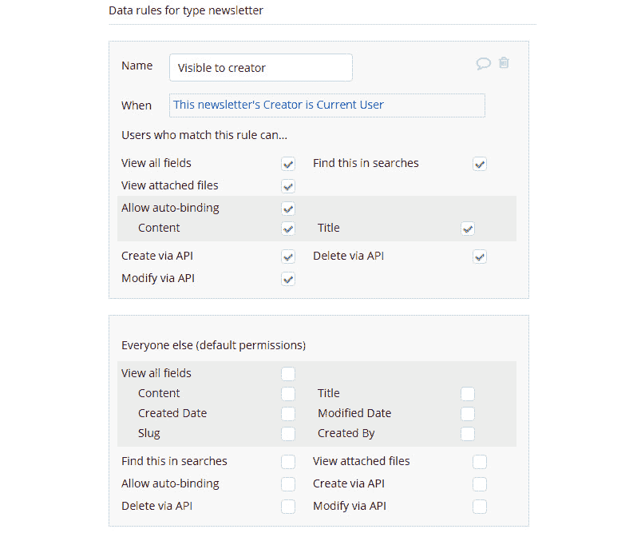
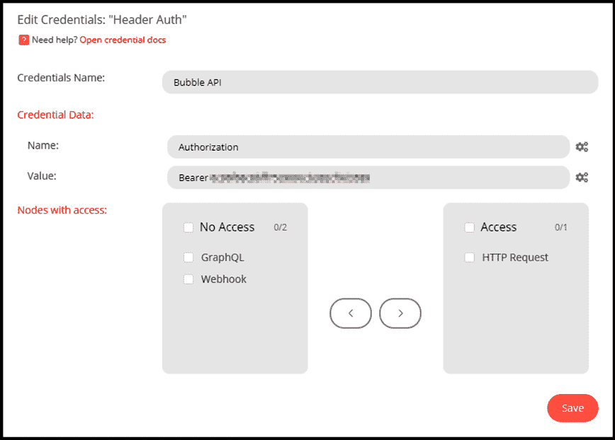
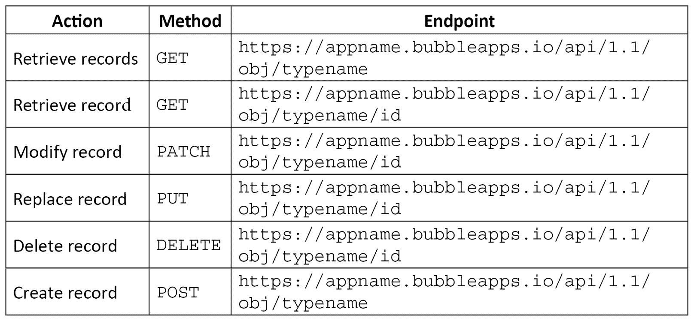
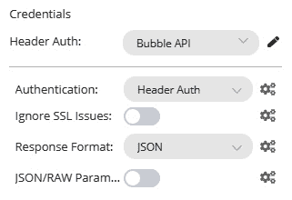
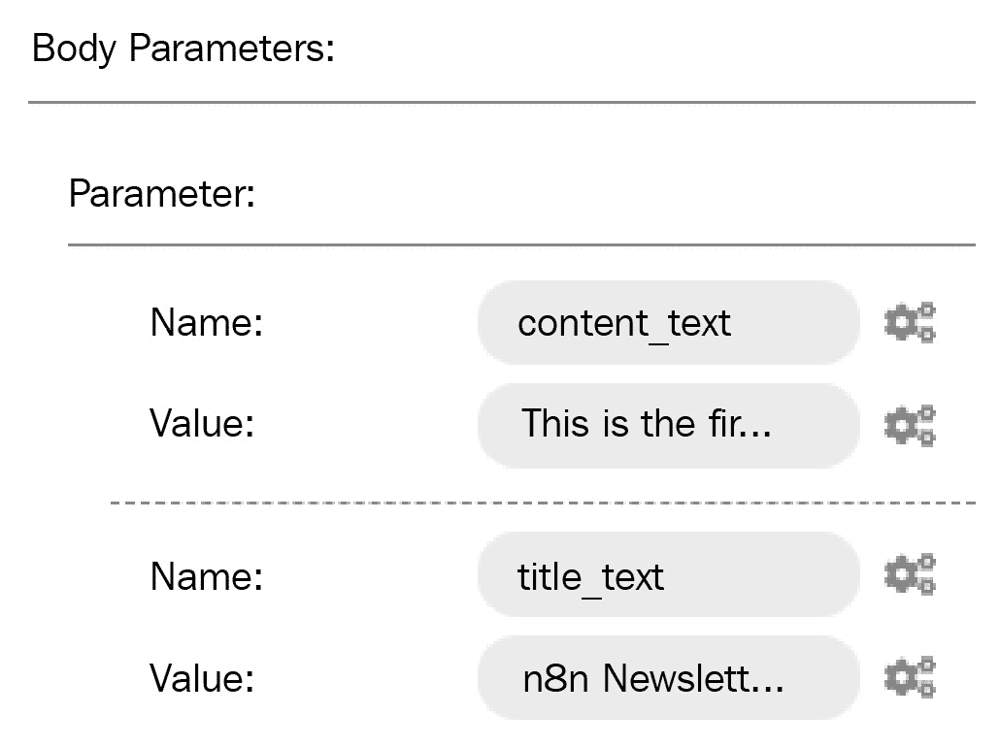
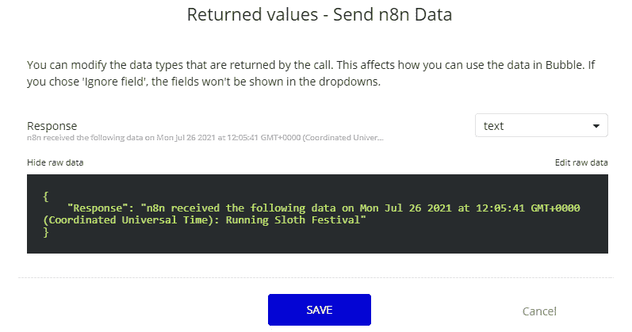
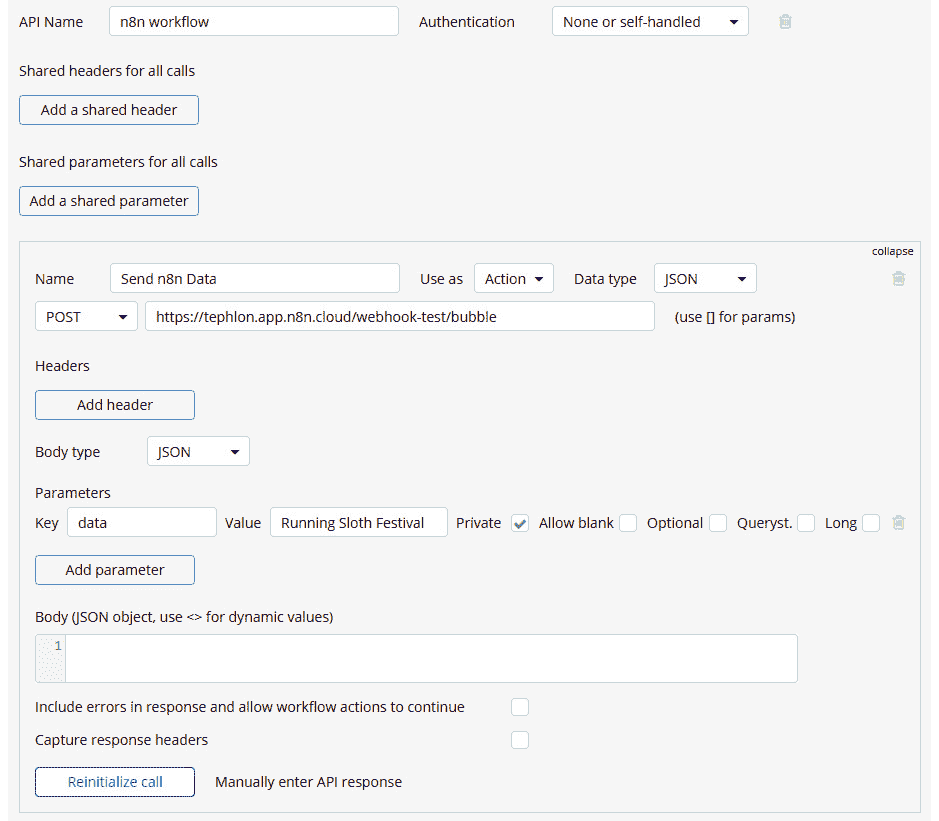
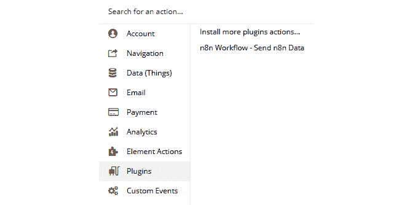

# 第八章：在 n8n 中利用 Bubble API

无论我们多么努力，我们不可能在所有事情上都做得很好！有些人擅长组织，有些人擅长规划，而有些人擅长公共演讲。当我们注意到我们在某件事上做得很好时，我们往往会专注于那件事并追求它，使我们在这方面变得更加出色。

无代码工具也是如此。它们发现它们真正擅长的事情并专注于它。n8n 真的很擅长连接系统和自动化它们的任务，这是这个工具的主要焦点。

有时，就像人一样，如果无代码工具想要完成某事但需要一点帮助，它们会转向朋友。

对于我们来说，我们已经转向 Bubble 成为 n8n 的合作伙伴。Bubble 被设计成一款非常好的网络应用程序开发工具，使我们能够为 n8n 创建网络前端。它允许无代码构建者设计网页以提交信息到 n8n，甚至完整的网络应用程序，以便 n8n 可以将数据连接到其他系统并自动化流程。

本章涵盖了以下主题：

+   介绍 Bubble **应用程序编程接口**（**API**）

+   理解 Bubble 的数据结构

+   理解 Bubble 的工作流引擎

+   使用 Bubble 的 Data API

+   使用 Bubble 的 Workflow API

+   从 Bubble 接收事件和数据

一旦您完成本章，您将知道如何做以下事情：

+   在 Bubble 和 n8n 之间进行通信。

+   使用数据 API 访问 Bubble 的数据。

+   使用 Bubble 的工作流并通过 Workflow API 与它们交互。

+   在 n8n 中接收来自 Bubble 的事件和数据。

# 技术要求

您可以在 GitHub 上找到本章的完整代码示例，链接为 [https://github.com/PacktPublishing/Rapid-Product-Development-with-n8n/tree/main/Chapter%208](https://github.com/PacktPublishing/Rapid-Product-Development-with-n8n/tree/main/Chapter%208)。

# 介绍 Bubble API

如果您以前使用过其他 API，您应该会完全舒适地使用 Bubble API。它遵循相对标准的 API 设计实践，例如使用常规 **超文本传输协议**（**HTTP**）响应和 **HTTP 安全**（**HTTPS**）进行线上加密。

然而，如果您提前了解一些关于 API 的具体信息，这将使您更容易早期取得成功。

## Bubble API 端点

您应用程序的主要端点取决于几个因素，如下所示：

+   您是否正在使用自定义域名？

+   您是在使用实时环境还是开发环境？

+   您正在使用哪个版本的 API？

### 基础 URL

首先要考虑的是，您是否为您的 Bubble 应用程序使用了自定义域名。这用于确定您的基 **统一资源定位符**（**URL**）。您可以通过打开 Bubble 应用程序，转到 **设置** 菜单，然后点击 **域名/电子邮件** 选项卡来确定您是否正在使用自定义域名，如下面的截图所示：


图8.1 – 无自定义域的Bubble域设置

如果你有一个自定义域，它将注册在这个位置。否则，它将显示默认设置，如图*图8.1*所示。

对于默认域设置，基础URL是`https://<appname>.bubbleapps.io`，其中`<appname>`是你为你的应用程序提供的名称。例如，如果你将你的应用程序命名为`fancyApp`，那么基础URL是[https://fancyApp.bubbleapps.io](https://fancyApp.bubbleapps.io)。

如果你为你的应用程序有自定义域，那么URL是你的自定义域。

### 实时或开发

确定你的API端点的下一个因素是你在使用Bubble应用的实时版本还是开发版本。默认情况下，你将在开发版本中。一旦你准备好将你的应用程序公开，你就可以将其切换到实时版本。

注意，当你从开发版本切换到实时版本时，API端点会发生变化。

如果你使用应用程序的实时版本，那么基础URL之后的路径是`/api`，但如果你正在对你的应用程序的开发版本进行一些测试，那么这个子目录是`/version-test/api`。

### API版本

很可能你正在使用API的最新版本。版本1.1于2017年1月19日发布，如果你是在2017年1月19日之后创建的应用程序，那么你很可能正在使用版本1.1。

指定你的环境之后的路径是你的API版本。这取决于你的应用程序是在何时创建的，要么是`/1.0`要么是`/1.1`。

### 工作流或数据

Bubble可以分为两个不同的部分：工作流和数据。工作流处理在Bubble中发生的事件（例如，按钮被点击），然后根据您对Bubble的配置执行特定的操作。

数据块指的是Bubble使用的内置数据库（例如，关于通讯录的信息）。它主要涉及在Bubble环境中保存、更改和删除数据。

一旦指定了API版本，你需要指出你是否访问工作流或数据API。这将在路径的下一部分完成。如果你正在访问工作流数据，路径的下一部分是`/wf`。同时，如果你想访问API的数据部分，这部分路径是`/obj`。

### 名称

端点的最后一部分是指定你要访问的项目名称。根据你是否访问工作流或数据项，这个值指定了那个项目。

例如，如果你正在访问一个名为`users`的数据项，那么`/obj`之后的路径部分是`/users`。

### 构建你的API端点

现在我们已经对API端点的构建有了稳固的理解，让我们通过一个示例来展示如何构建一个API端点。

假设我们正在访问2019年5月创建的`myApp`应用程序收集的新闻稿信息开发版本。有一个计划为该应用程序使用自定义域名，但尚未部署。

由于此应用程序没有自定义域名，基础URL是https://myApp.bubbleapps.io。我们正在访问开发环境，因此我们在路径中添加`/version-test/api`。此应用程序使用API的1.1版本，因为它是在2017年1月19日之后创建的，因此路径的这一部分是`/1.1`。然后我们在路径中添加`/obj`，后面跟着`/newsletter`数据项名称，以访问数据API。

在本例中，我们的最终API端点是`https://myApp.bubbleapps.io/version-test/api/1.1/obj/newsletter`。

## Bubble API设置

您可以控制Bubble API的多个方面。通过访问应用程序中的**设置**并选择**API**选项卡，如图下所示，您可以进行多项更改：


图8.2 – Bubble API设置选项

### 启用/禁用API访问

您可以通过选择或取消选择**启用工作流API和后端工作流**或**启用数据API**旁边的复选框来启用或禁用API访问。

您也可以通过选择或取消选择其名称旁边的复选框来指定工作流或数据项。

### API令牌

为了确保您的API访问安全，创建一个私有的API密钥是至关重要的。您可以在本节中重新生成API令牌，或者完全创建一个新的令牌。

您可以通过添加一个键为`Bearer <API key>`的头部来使用API令牌进行认证，如图下所示：


图8.3 – Bubble API头部认证

现在我们对Bubble的API工作方式有了更好的理解，以便我们可以从其他系统访问数据，让我们更深入地了解数据的实际结构。这很重要，这样您在使用API时就能确切知道您正在检索什么，您将能够正确地导航API以检索特定数据。

# 理解Bubble的数据结构

为了正确使用Bubble API访问和修改数据，了解数据在Bubble中的存储方式至关重要。

## 数据类型

在Bubble中，数据类型本质上等同于**JavaScript对象表示法**（**JSON**）对象。它在应用程序的**数据**部分下定义，并提供了一个字段列表（在JSON中表示为键）。每个字段都是数据类型的属性。您可以在以下屏幕截图中看到一个示例Bubble数据类型：


图8.4 – 示例Bubble数据类型

例如，如图所示的**Newsletter**数据类型有六个字段，其中两个是自定义的，如下所示：

+   **内容** —新闻稿的实际正文

+   **标题** —通讯录的标题

其中四个字段是默认字段，如下所示：

+   **创建者**—创建记录/通讯录条目的用户的用户名

+   **修改日期**—记录最后创建、更改或更新的日期

+   **创建日期**—记录最初创建的日期

+   **别名**—用于访问记录的快捷方式，通常在URL形式中使用

## 数据安全（隐私）

对于数据类型，存在两种一般的隐私或数据安全设置，如下所示：

+   **公共**

+   **私有**

**公共**隐私设置允许每个人访问读取数据类型中的数据。这通常是不被推荐的，除非数据确实是公共的，并且你不在乎谁可以读取信息。

**私有**隐私设置阻止除数据类型创建者之外的人实际与数据交互。这是数据类型的首选安全设置。

以下截图显示了Bubble具有API访问权限的私有权限：

![图8.5 – Bubble具有API访问权限的私有权限



图8.5 – Bubble具有API访问权限的私有权限

要通过API访问受保护的数据，你需要做几件事情，如下所示：

1.  在应用程序的**设置API**选项卡中启用对数据类型的访问。

1.  在应用程序的**数据**部分的**隐私**选项卡中选择至少一个API设置（**通过API修改**、**通过API删除**和**通过API创建**）。

1.  使用应用程序的**设置API**选项卡中的API密钥进行身份验证。

理解Bubble的数据结构是实现自动化的关键步骤。虽然n8n是我们首选的自动化工具，但Bubble在系统中集成了自己的工作流引擎，我们将在下文中总结。

# 理解Bubble的工作流引擎

Bubble在系统中集成了自己的自动化版本。它不如n8n强大或功能丰富，因为它旨在自动化并与自身通信，在这方面表现卓越。每个工作流执行一个或多个步骤以执行Bubble应用程序支持的操作。

在Bubble环境中存在两种不同类型的工作流。第一种是前端工作流。这些工作流旨在用户在Bubble的应用程序页面上执行操作时与用户交互。例如，当你在Bubble中点击**提交**按钮时，这会执行一个前端工作流。

同样，也存在后端工作流。这些工作流旨在与用户非交互式地工作，并根据各种触发器自动执行任务，例如一天中的时间、数据的变化或API的输入/请求。

当与Bubble的工作流引擎交互时，n8n专门与后端API工作流进行通信。

根据API工作流的配置，你可以向API发送数据，这些数据将在工作流中使用。例如，`发送电子邮件`工作流将从API接受以下输入：

+   `收件人`

+   `主题`

+   `正文`

这在以下截图中得到了说明：


图 8.6 – 示例后端 API 工作流程配置屏幕

因此，现在我们已经对工作流程引擎有了基本的了解，让我们开始使用实际的 Bubble API，从数据 API 开始。

# 使用 Bubble 的数据 API

使用数据 API 通过 n8n 访问 Bubble 的数据相对简单。根据访问的端点和使用的 HTTP 方法，您可以以任何您想要的方式操作 Bubble 应用程序中的数据。

要加载一些示例 n8n 节点以与数据 API 一起工作，请参阅 [https://github.com/PacktPublishing/Rapid-Product-Development-with-n8n/blob/main/Chapter%208/Bubble_Data_API.json](https://github.com/PacktPublishing/Rapid-Product-Development-with-n8n/blob/main/Chapter%208/Bubble_Data_API.json) 中的 `Bubble_API.json` 工作流程。

## 认证

在您可以在 n8n 中使用 Bubble 数据 API 之前，您需要创建适当的凭据。我们将使用 **HTTP 请求** 节点进行所有 API 交互，因此我们需要创建一个 **头部认证** 凭据，如下面的截图所示：

![图 8.7 – 访问 Bubble API 的头部认证凭据



图 8.7 – 访问 Bubble API 的头部认证凭据

在 **凭据数据** 下的 **名称** 字段中填写 **授权** 是很重要的，并且 **值** 字段必须填写 **Bearer**，后跟您的 API 私钥，该私钥可以在 **API** 选项卡下的 **设置** 部分找到。

您还必须确保您提供了对 **HTTP 请求** 节点的访问权限。

## 数据操作

一旦您创建了凭据，现在您就可以使用它们来操作 Bubble 数据。

这里有一份您可以使用数据 API 在 Bubble 中检索和操作数据的不同方式的列表：



在每个端点中，两个特殊词汇代表来自您的 Bubble 应用程序的实际唯一值，如下所示：

+   `typename`—这是 Bubble 中数据类型的实际名称。这通常是移除了所有空格的小写数据类型名称。

+   `id`—Bubble 中记录的唯一标识符（**UID**）号码。

例如，如果您有一个数据类型为 `1626690254917x279129440443256930`，您将能够使用 `https://appname.bubbleapps.io/api/1.1/obj/newsletter/1626690254917x279129440443256930` 端点检索此记录。

我们现在有了开始处理 Bubble 应用程序中的数据所需的所有信息。

n8n 使用 **HTTP 请求** 节点执行所有数据操作，如下面的截图所示：


图 8.8 – 使用 n8n HTTP 请求节点操作 Bubble 数据

使用前表中提供的信息，我们可以配置**HTTP请求**节点以按我们的意愿处理数据。在以下屏幕截图中，您可以看到**HTTP请求**节点的常规设置：

![Figure 8.9 – 一般HTTP请求节点设置]



Figure 8.9 – 一般HTTP请求节点设置

通常，所有**HTTP请求**节点都将具有以下共同设置：

+   **头部认证**—选择您之前创建的Bubble API凭证。

+   **认证**—**头部认证**。

+   **忽略SSL问题**—**False**。

+   **响应格式**—**JSON**。

+   **JSON/RAW参数**—**False**。

一旦设置好，您现在可以继续进行每个操作的定制设置。

要从API读取所有数据，请设置`GET`和URL到数据类型的端点（例如，`https://appname.bubbleapps.io/api/1.1/obj/typename`）。这将生成一个包含该数据类型中所有记录数组的JSON对象。输出将类似于以下内容：

```py
[
  {
    "response": {
      "cursor": 0,
      "results": [
        {
          "content_text": "Welcome to the n8n Newsletter!",
          "Modified Date": "2021-07-25T13:00:35.174Z",
          "title_text": "First n8n Newsletter",
          "_id": "1627217777235x670007482175516000"
        }
      ],
      "remaining": 0,
      "count": 1
    }
  }
]
```

这将一次返回最多100条记录。

如果您只想获取特定记录的信息，可以通过将其附加到URL的末尾来指定ID（例如，`https://appname.bubbleapps.io/api/1.1/obj/typename/1627217777235x670007482175516000`）。这将仅返回单个记录。

要创建新记录，请设置`POST`和URL到数据类型的端点（例如，`https://appname.bubbleapps.io/api/1.1/obj/typename`）。然后，为每个自定义字段创建一个正文参数，并附带您希望字段值具有的值。该过程在以下屏幕截图中进行说明：

![Figure 8.10 – 创建、更新或替换记录数据的正文参数]



Figure 8.10 – 创建、更新或替换记录数据的正文参数

API将返回状态值和新的记录ID，格式为JSON。

您还可以通过设置`PATCH`并将请求提交到记录的端点（例如，`https://appname.bubbleapps.io/api/1.1/obj/typename/1627217777235x670007482175516000`）来更新数据类型中的特定记录，同时附带一个或多个包含需要更新的字段信息的正文参数。如果此更新成功，它将不会返回任何数据，并以`204`状态代码响应。

替换整个记录类似于使用两个例外来更新记录。首先，`PUT`中的值，其次，正文必须包含所有自定义字段值。成功时，它也不会返回数据，并返回`204`响应代码。

您可以使用API执行的最后一个操作是删除记录。与返回单个记录类似，您使用记录的端点（例如，`https://appname.bubbleapps.io/api/1.1/obj/typename/1627217777235x670007482175516000`）并设置`DELETE`。

## 搜索数据

有时，当你不知道记录ID时，使用`GET`请求方法请求数据时，记录太多以至于无法处理。幸运的是，有一些额外的搜索选项可以让你减少每次API请求返回的记录数。

搜索条件作为**HTTP请求**节点中的查询参数以名称-值对的形式输入，如下面的截图所示：

![图8.11 – 使用查询参数设置搜索限制

![图8.11 – 使用查询参数设置搜索限制

图8.11 – 使用查询参数设置搜索限制

通过使用`limit`参数减少返回的记录数是第一种方法。例如，将`limit`参数设置为`2`将每次只返回一条记录。

如果你想要的记录在第一组记录中（称为`cursor`参数开始发挥作用。`cursor`参数，你可以从特定的记录开始搜索。记录索引从零开始，每次增加一个。

当你通过使用之前`GET`查询返回的三个键/值对来确定其值时，设置`cursor`参数可能会有用。这三个对在此处描述：

+   `cursor`—结果中第一个条目的记录索引

+   `remaining`—此页面之后剩余的记录数

+   `count`—返回的项目数

你还可以通过使用`sort_field`参数并设置为其中的一个数据字段名称来控制返回数据的顺序。添加`descending`参数并将其设置为`true`或`false`也将控制数据是按降序还是升序排序。

如果你将`sort_field`参数设置为`_random_sorting`，它将以随机顺序返回记录。因此，为了接收一条随机记录，你可以将`limit`参数设置为`1`并将`sort_field`参数设置为`_random_sorting`！

限制从API返回的记录数的另一种方法是使用`constraints`参数。它包含一个或多个JSON对象数组，告诉API如何限制传入的数据。每个JSON对象有三个键值对，如下所示：

+   `key`—用于约束的字段名称。你可以使用`_all`关键字来检查所有字段。

+   `constraint_type`—要应用的约束类型，可以是以下之一：

    +   `equals`

    +   `not equal`

    +   `is_empty`

    +   `is_not_empty`

    +   `text contains`

    +   `not text contains`

    +   `greater than`

    +   `less than`

    +   `in`

    +   `not in`

    +   `contains`

    +   `not contains`

    +   `empty`

    +   `not empty`

    +   `geographic_search`

+   `value`—用于约束搜索的值。

例如，如果我们只想返回`title_text`字段包含单词`Newsletter`的记录，我们会将`constraints`参数设置为以下内容：

```py
[
  { 
    "key": "title_text", 
    "constraint_type": "text contains", 
    "value": "Newsletter" 
  }
]
```

你可以在这个数组中包含任意数量的JSON记录。

到目前为止，你应该已经很好地理解了Bubble Data API的工作方式，因此让我们更深入地看看Workflow API。

# 使用Bubble的Workflow API

工作流程API通常用于激活Bubble工作流程，有时也用于向Bubble应用程序传递信息。您将使用相同的凭据和**HTTP请求**节点来激活工作流程和发送数据。

## 激活工作流程

激活工作流程的`POST`请求方法将正确运行时接收`"status": "success"`响应。

**HTTP请求**节点的**URL**字段将由以下两部分组成：

+   `https://<appname>.bubbleapps.io/api/1.1/wf`，其中`<appname>`是您Bubble应用程序的名称。

+   **工作流程名称**—这是您工作流程的名称。

因此，例如，为了在我的`n8n-book`应用程序中激活`send-email`工作流程，我会使用`https://n8n-book.bubbleapps.io/version-test/api/1.1/wf/send-email`作为URL。

## 向工作流程发送数据

为了将数据发送到工作流程，工作流程需要定义API工作流程中的参数（见*图8.6*），然后这些参数需要在操作中定义为动态数据。

在我们的示例中，可以通过API将以下三个参数发送到`send-email`工作流程：

+   `to`

+   `subject`

+   `body`

这在下面的屏幕截图中有说明：


图8.12 – 带有动态数据的示例工作流程操作

要通过n8n的**HTTP请求**节点将此信息发送到工作流程，为每个值添加一个正文参数，如下面的截图所示：


图8.13 – 发送到工作流程API的正文参数

当**HTTP请求**节点执行时，它将信息发送到工作流程，并使用它作为相应处理的输入，如下所示：


图8.14 – 使用Bubble工作流程API和提交的数据发送的电子邮件

您可以从GitHub存储库中获取此示例工作流程的副本，网址为[https://github.com/PacktPublishing/Rapid-Product-Development-with-n8n/blob/main/Chapter%208/Bubble_Workflow_API.json](https://github.com/PacktPublishing/Rapid-Product-Development-with-n8n/blob/main/Chapter%208/Bubble_Workflow_API.json)。

现在我们知道了如何激活工作流程并向Bubble发送数据，让我们反过来，让Bubble激活工作流程并向n8n发送数据。

# 从Bubble接收事件和数据

Bubble可以向n8n发送事件，甚至发送数据。通过设计n8n接收这些信息，Bubble可以直接执行n8n工作流程并扩展其功能。

## 配置n8n

要做到这一点，首先创建一个简单的**Webhook**节点，设置如下：

+   **身份验证**—**无**

+   `POST`

+   `bubble`

+   `200`

+   **响应模式**—**最后一个节点**

+   **响应数据**—**第一个条目JSON**

你还可以复制测试**Webhook** URL，因为配置Bubble时你需要这些信息。

接下来，添加`n8n在{{new Date().toDateString()}}于{{new Date().toTimeString()}}接收了以下数据：{{$json["body"]["data"]}}`。

现在，保存工作流以便初始化Webhook。

你可以从GitHub上获取此工作流的副本，链接为[https://github.com/PacktPublishing/Rapid-Product-Development-with-n8n/blob/main/Chapter%208/Bubble_Events.json](https://github.com/PacktPublishing/Rapid-Product-Development-with-n8n/blob/main/Chapter%208/Bubble_Events.json)。

## 配置Bubble

现在n8n已经准备就绪，是时候准备Bubble了。

首先，确保**API连接器**插件已安装在你的Bubble应用程序中。如果没有，现在就安装它。你可以在[https://manual.bubble.io/core-resources/bubble-made-plugins/api-connector](https://manual.bubble.io/core-resources/bubble-made-plugins/api-connector)上了解更多关于**API连接器**插件的信息。

接下来，我们将配置**API连接器**插件。在**API连接器**插件页面上，点击**添加另一个API**按钮。将**API名称**字段设置为**n8n工作流**。

要配置API调用，点击`GET`到`POST`，然后将测试**Webhook** URL传递到旁边的字段中。

通过点击**添加参数**按钮向n8n发送一个参数。然后，对于**键**值，输入**data**，对于**值**，输入**Running Sloth Festival**。

插件现在应该已经准备好通过向n8n发送信息并查看它发送回的响应来初始化。要初始化插件，首先，返回到你的n8n工作流并点击**执行工作流**按钮以启动监听输入的Webhook。你应该会看到一个类似这样的屏幕：

![图8.15 – 从n8n初始化响应



图8.15 – 从n8n初始化响应

接下来，返回到Bubble插件并点击**初始化调用**按钮。应该会出现一个弹出窗口，显示n8n发送的响应。点击**显示原始数据**文本以查看n8n发送的确切响应。这应该与n8n **设置**节点中显示的信息相匹配，如下面的截图所示：

![图8.16 – 完成的Bubble API连接器插件



图8.16 – 完成的Bubble API连接器插件

现在，无论你在Bubble中工作在哪个工作流上，你都可以在**插件**部分使用**n8n工作流 - 发送n8n数据**操作，如下面的截图所示：

![图8.17 – Bubble工作流编辑器中的新n8n操作



图8.17 – Bubble工作流编辑器中的新n8n操作

现在你已经配置了n8n和Bubble协同工作，你可以利用n8n的所有功能，包括其节点和它可以访问的任何服务，来扩展Bubble。这将为你的Bubble应用程序打开几乎可以实现你所有梦想的功能。

# 摘要

在本章中，我们学习了Bubble API。我们使用数据API在Bubble中操作信息，并使用工作流API执行工作流。我们还学习了如何使用n8n来完成所有这些操作，主要使用**HTTP请求**节点。

我们还学习了如何使用Bubble激活n8n中的Webhooks，并在两个系统之间传递信息。

在下一章中，我们将使用Bubble来学习如何构建一个应用的前端，该应用将在后端使用n8n来处理信息。
