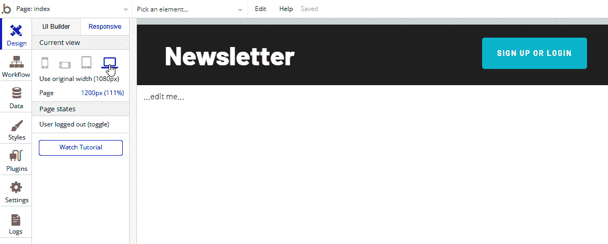
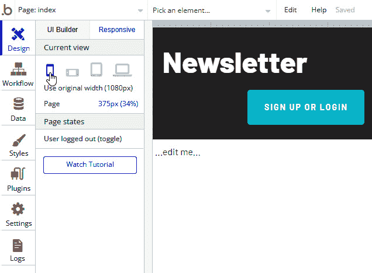

# 第九章：构建应用程序的用户界面

尽管本书的主要重点是教授您如何使用n8n构建应用程序工作流程并将各种工具连接起来，但您的应用程序拥有适当的**用户界面**（**UI**）至关重要。这是人们与您的产品互动的主要方式，也是**用户体验**（**UX**）最重要的方面。

在上一章中花费时间学习Bubble **应用程序编程接口**（**API**）的工作原理后，我们对Bubble“内部”发生的事情有了很好的理解。现在，我们将使用Bubble来构建一个UI和设计模型，这将允许您创建自己的UI。

本章涵盖了以下主题：

+   为您的Web应用程序实现响应式设计

+   在Bubble中处理事件

+   在Bubble中验证数据

+   设计应用程序结构

+   在Bubble中处理错误

完成本章后，您将了解如何进行以下操作：

+   使用Bubble **图形用户界面**（**GUI**）设计响应式应用程序。

+   学习应用程序的外观和感觉如何改变用户体验。

+   理解底层数据结构。

+   引导用户输入适当的数据以适应数据结构。

+   识别应用程序和工作流程中的错误。

+   积极处理向用户展示错误的方式。

+   设计一个日志系统来捕获事件和错误。

+   分析日志中捕获的数据以改进应用程序。

让我们从研究响应式设计并将其实现到您的Bubble Web应用程序中开始本章。

# 为您的Web应用程序实现响应式设计

响应式设计是一种构建基于Web的应用程序的方法，无论设备或屏幕/窗口大小如何，都能正确显示信息。在过去十年中，在各种设备和屏幕尺寸上查看信息的能力变得越来越重要。以下截图反映了这一趋势：

图9.1 – 过去十年桌面与移动使用对比

根据*StatCounter* ([https://gs.statcounter.com/platform-market-share/desktop-mobile/worldwide/#monthly-201111-202111](https://gs.statcounter.com/platform-market-share/desktop-mobile/worldwide/#monthly-201111-202111))，十年前，超过93%的人使用电脑上网。如今，这个数字下降到大约44%。更多的人从大电脑屏幕转向了更小的移动设备来与基于Web的UI交互。因此，无论您是在30英寸的电脑显示器上还是在4英寸的手机屏幕上使用，您的Web应用程序看起来都很好，并且易于使用。

## 响应式设计因素

为了使您的应用程序能够响应式工作，在构建应用程序时需要考虑以下因素。

### 使用响应式查看器

在 Bubble 应用程序界面的 **设计** 选项卡中，您可以在 **UI 构建器** 选项卡的右侧找到 **响应式** 选项卡。**响应式查看器**允许您查看您的页面在不同尺寸的设备上的外观。

### 最小宽度

增加元素的最小宽度以使用更多的页面边距。更大的最小宽度使设计在小屏幕上看起来更好。

### 固定宽度

一些元素，例如图标，应该具有固定的宽度。这可以防止元素在屏幕尺寸变化时变得过大或过小。

### 最大宽度

如果按钮和输入项太大，它们可能会看起来很奇怪。通过设置控制最大宽度侧来纠正此问题。

### 边距

一致的边距大小是设计美学的组成部分。尽可能保持边距大小一致。

### 收缩边距

当屏幕尺寸变小时，移除特定元素（例如，图形；嵌入元素）周围的左右边距。这更有效地利用了宝贵的屏幕空间。

### 对齐

将元素对齐到左或右边距，使其“粘”到一边。这使设计在屏幕尺寸变化时更具可预测性。

### 隐藏元素

当父元素（例如，页面）的宽度下降到指定大小以下时，不要显示该元素。在较小的屏幕上，这为用户提供了一个更好的体验。

### 换行到上一行

如果页面大小足够大，可以容纳上一行的元素，则将其移动到上一行。这可以防止在大屏幕上沿右侧边距出现大片空白区域。

### 文本元素选项

当处理文本元素时，还有一些其他选项应该考虑，如下所述：

+   `…`.

+   **如果文本变短则缩小**—如果存在空白空间，则减少文本元素的长度。

### 图片/谷歌地图/形状元素比例

使用 **保持元素比例** 选项来保持宽度和高度比，无论屏幕大小如何。

### 重复组单元格宽度

**当前单元格最小宽度** 选项允许您“堆叠”单元格，而不是仅仅将单元格缩小到难以阅读的程度。您通过增加 **当前单元格最小宽度** 值来实现这一点。

## 使用响应式查看器

默认情况下，响应式查看器处于大屏幕模式，它显示您的页面在宽度为 1,200 **像素**（**px**）的屏幕上看起来如何，如下面的截图所示：

图 9.2 – 大屏幕模式下的响应式查看器

您可以更改此视图以查看，例如，页面在从手机等移动设备查看时的外观，如下面的截图所示：

图 9.3 – 从移动设备查看的响应式查看器

在整个设计过程中，当你构建你的应用程序时，经常回到响应式查看器是一个好主意，以确保你的应用程序无论使用哪种设备都能保持良好的外观。

## 学习更多

这只是一个响应式设计的概述，你还可以从Bubble和响应式设计如何实现中学到更多。如果你想要深入了解Bubble的响应式设计，请参阅Bubble文档中的*构建响应式页面*网页（[https://manual.bubble.io/help-guides/building-a-user-interface/building-responsive-pages](https://manual.bubble.io/help-guides/building-a-user-interface/building-responsive-pages)）。

响应式页面对于现代网络应用程序的用户非常重要，它可以决定应用程序的有用性，但即使是最优秀的响应式网络应用程序，如果它没有设计成能够正确处理事件，那么它也将完全无用。幸运的是，这正是我们接下来要讨论的主题！

# 在Bubble中处理事件

事件是在Bubble应用程序内部发生以触发工作流程的操作。Bubble界面内的操作通常会触发事件，但系统也可以在Bubble之外触发事件，例如n8n。

## 事件类型

虽然在Bubble中存在许多不同类型的事件，但大多数事件都是设计用于在Bubble内部使用，并且不与Bubble环境之外的系统交互。当与Bubble一起工作时，这些内部事件非常重要，我们强烈建议你熟悉它们。

### 通用事件

这些事件在Bubble的多数区域都很常见，并且可以相应地访问。它们在此概述：

+   **用户登录**—每当用户登录到你的Bubble应用程序时，都会触发此事件。

+   **用户登出**—与该事件相关的操作将在用户从Bubble应用程序登出时执行。

+   **页面加载**—当一个人在他们的电脑上打开一个网页时，就会发生页面加载。每当这种情况发生时，都会触发此事件。

+   **每X秒执行一次**—根据自上次事件发生以来经过的时间来重复执行操作可能是有用的。此事件每`X`秒触发一次，其中`X`代表事件之间的秒数。

+   **当条件为真时**—此事件将系统的一些参数（例如，星期几）与一个值（例如，星期二）进行比较，并且仅在比较为真时执行操作（例如，如果星期几是星期二，则将执行该操作）。

### 元素事件

元素事件与实际的UI本身相关，并设计为通过Web UI与用户交互。这些事件通常是对用户在应用程序中执行的操作做出响应。它们在此概述：

+   **元素点击**—当用户在Web UI中点击特定元素时，会触发此事件。

+   **输入值更改**—如果表单中的一个字段具有用户随后更改的值，则此事件被触发。

+   **地图标记点击**—Bubble 中的地图元素可以放置标记。当用户点击这些元素之一时，此事件被触发。

+   **弹出打开**—气泡允许您以弹出窗口的形式向用户显示消息。当其中一个这样的弹出窗口打开时，此事件被触发。

+   **弹出关闭**—您还可以在用户关闭显示给用户的弹出窗口时触发事件。

### 触发事件

触发事件是 Bubble 系统中的特殊事件，当数据库中发生更改时发生。这些事件可以引用数据库更改之前的数据值，或者可以引用数据库更改后的值。

关于触发事件的一些注意事项。首先，这些事件以完全权限运行，并可以访问系统中的所有数据，而不仅仅是触发事件的用户的个人数据。其次，触发事件只能触发一个操作，并且该操作不能用来触发其他操作。

## 设置事件

在 Bubble 中，事件在 **工作流** 编辑器标签中管理。您可以通过此页面配置在特定事件被触发时发生的操作，如下面的截图所示：

图 9.4 – 工作流编辑器中的事件

例如，*图 9.4* 展示了当用户登录到 Bubble 应用程序时，个人可以运行 **n8n Workflows - Send n8n Data** 插件操作。

当一个事件发生时，您也可以运行多个操作，将操作链起来依次执行。这允许您执行复杂操作，同时保持单个操作简单。以下截图展示了这个过程：

图 9.5 – 将操作链接到事件

## 深入了解

这只是对 Bubble 事件的简要介绍，您可以更深入地了解这个主题。如果您想更深入地了解 Bubble 环境中的事件，我建议您从 Bubble 文档中的 *构建工作流* ([https://manual.bubble.io/help-guides/building-workflows](https://manual.bubble.io/help-guides/building-workflows)) 和 *事件* ([https://manual.bubble.io/core-resources/events](https://manual.bubble.io/core-resources/events)) 开始。

事件是 Bubble 架构的一个重要方面，并且是正确数据操作的关键部分。但是，如果输入到您的 Bubble 应用程序中的数据有误或系统混淆了不同类型的数据，那么应用程序突然就变得无用了。

下一个部分通过向我们展示如何验证输入或分析的数据是正确数据来帮助避免这些问题。

# 在气泡中验证数据

许多应用程序的核心是数据。这些应用程序依赖于一致、准确和结构化的数据来提供分析和有洞察力的信息。它们还使用数据来控制应用程序本身的不同方面。

因此，重要的是你所收集和保存的数据尽可能准确，尤其是在从用户那里收集数据时。

## 字段类型

控制数据的第一种方式是通过字段类型。字段类型描述了可以输入到特定字段中的数据，并限制可以输入到该字段的信息为该类型的数据。如果你有数据库背景，这些可以等同于数据库中的数据类型。

在Bubble中，有九种内置字段类型，如下所示：

+   **文本**——任何基于**美国信息交换标准代码**（**ASCII**）的文本。类似于**可变字符字段**（**VARCHAR**）。

+   `FLOAT`或`DECIMAL`，但没有精度要求。

+   `CHECK`范围到`INT`字段值。

+   `DATETIME`数据类型。

+   `CHECK`范围用于`DATETIME`数据类型的列。

+   `TRUE`)或`FALSE`)。类似于数据库中的`BOOLEAN`数据类型。此字段没有`NULL`值，因为空字段转换为`FALSE`)值。

+   `VARCHAR`值，引用文件系统中的文件位置。

+   `VARCHAR`值，引用文件系统中的文件位置。

+   **地理地址**——这是一种独特的字段类型，它以经过Google Maps API验证的文本形式存储地理信息。它看起来就像邮寄信件时找到的街道地址。

## 自定义数据类型

你还可以创建自定义数据类型。这些通常是字段或其他自定义数据类型的组合，它们协同工作。例如，**会议**类型可能由**日期**、**地点**和**主题**组成。

## 使用字段

一旦定义了字段和数据类型，这就可以控制数据输入所需的数据类型。根据数据库中存储的数据类型，你将拥有不同的选项来限制字段可接受的数据类型，如下面的截图所示：

图9.6 – 日期和时间字段限制

例如，*图9.6*显示了**日期和时间**输入类型中可用的某些限制。你可以控制日期和小时的最低值和最高值，并要求字段不能为空。

## 更多数据验证

在数据验证方面，这只是冰山一角。对于应用程序允许的数据类型，可能存在一些非常复杂的规则，真正理解这些数据规则应该是什么，以及如何确保应用程序遵循这些规则，这是值得你花时间的。

为了更深入地了解如何更好地管理你应用程序的数据，我建议从Bubble文档中的 *与数据一起工作* 开始([https://manual.bubble.io/help-guides/working-with-data](https://manual.bubble.io/help-guides/working-with-data))，并使用你所学到的知识来维护你数据的一致性。

现在我们知道系统中有了正确的数据类型，重要的是确保这些数据在应用程序中正确移动，并且以可预测的方式存储在正确的位置。就像把你的车开到你家的主走廊，然后停在大厅里一样，一个设计不良的应用程序结构可能导致不可预测（并且通常是灾难性的）的结果。下一节将介绍如何规划和构建应用程序结构。

# 设计应用程序结构

一个应用程序并不是凭空出现的。在正确构建一个既简单又实用的应用程序结构之前，需要大量的规划和思考。在设计应用程序结构时需要考虑的因素包括以下内容：

+   用户需要执行多少个活动？

+   将收集哪些类型的数据？

+   用户是否需要身份验证？

+   用户体验是否简单且逻辑？

极其重要的是，你要考虑这些（以及其他）因素如何影响你的应用程序以及你的用户如何与之互动。这有助于使你的应用程序易于管理和维护。

你应该完成的第一项任务之一，甚至在开始编码单个页面之前，是创建一个流程图，显示用户如何通过每个他们将执行的操作在应用程序中移动。这应该显示用户如何与应用程序互动，以及用户和应用程序如何与应用程序中的数据进行互动。

以下截图展示了这样的工作流程。这显示了每个页面显示的数据/用户，以及用户必须遵循的路径才能到达每个页面：

图9.7 – 简单的应用程序工作流程

这是一种极其宝贵的资产，特别是如果你的团队很大，不同的人分别开发应用程序的不同部分时。这确保了每个人都理解应用程序将如何工作以及数据将如何被管理。

确保应用程序的范围不发生变化或扩展也是有用的。它清楚地说明了应该和不应该设计的内容。

## 审查设计

一旦你完成了整体设计，让团队中的其他人（或者如果你是一个人的团队，自己审查）来确保设计符合应用程序的目标和需求是非常值得的。

一种优秀的方法是创建用户故事，从用户的角度描述一项活动。这些故事通常以 *作为 <用户类型>，我想 <要达成的目标> 以便 <活动的理由>* 的形式出现。

例如，你可能有以下用户故事：

*作为作者，我希望能够编辑已经发布的通讯稿，以便我可以更新可能不再有效的信息。*

你现在可以采取这个用户故事，看看你的工作流程中是否有路径可以实现这一点。如果结果证明没有实现这一点的途径（正如我们的*图9.7*所示），你可能需要回过头来更新你的应用程序设计。

一旦你对应用程序的设计感到满意，确保将其标记为最终设计，并与你的开发团队分享，这样每个人都在使用相同的设计，并朝着相同的目标努力。

即使设计得非常好，事情仍然可能出错。这就是错误处理和故障排除发挥作用的地方。

# 在Bubble中处理错误

应用程序本质上是非常复杂的系统。幕后发生着各种事件，用户以意想不到的方式行为，以及意外的平台升级可能会破坏之前可用的代码。有时，真是个奇迹，任何应用程序都能正常工作。

由于这种复杂性，设计应用程序时必须能够预见用户可能会滥用系统的方式，同时处理尽管应用程序的设计师和开发者尽了最大努力仍然发生的错误。

Bubble提供了一些工具来帮助处理可能出现在应用程序中的错误，并且如果出现问题需要重新正确工作，一些最佳实践将帮助你。

## 为用户错误做准备

用户通常是你应用程序中错误的一个重要来源。要么是因为他们根本不理解你的应用程序试图实现什么，要么是恶意尝试绕过设置的安全和限制，用户可以并且会破坏你的应用程序。但你可以通过遵循一些最佳实践来最小化用户对应用程序的影响。

其中一种最好的方法是像用户一样思考。让一个标准用户测试应用程序，他在推出到全世界之前对应用程序的工作方式一无所知。仔细记录用户是如何进入产生错误的情况的，以及错误是如何处理的。然后，更新工作流程，处理错误，再次测试。

## 加密应用程序

应用程序内部有许多不同的区域，如果允许用户进入，可能会引起问题。例如，如果用户可以进入用户管理部分，他们可以随意添加或删除用户，造成各种混乱。

因此，确保应用程序被锁定，防止随机用户访问他们不应能够访问的应用程序部分，这是至关重要的。这不仅适用于应用程序本身，还适用于任何管理控制台、管理员面板和数据管理门户。

## 详细记录

如果确实发生了错误，重要的是你需要一种方法来确定导致错误的原因。内置详细的日志服务将允许你追踪错误发生之前发生的事情，以便你可以排查问题并希望解决导致错误的原因。

## 调试工具

Bubble 有两款出色的工具，可以帮助你解决在开发应用程序时遇到的问题。

第一款工具是**问题检查器**。它以红色警告图标和红色文字的形式出现，指示你的应用程序中存在的问题数量。

你可以通过点击**问题检查器**来获取更多关于问题的信息。这将弹出一个包含所有问题的列表。点击问题列表中的任何一项将打开存在问题的屏幕。

第二款调试工具是**调试器**。调试器允许你逐步遍历你的应用程序，并看到用户看不到的幕后问题。

要启动调试器，只需打开你的应用程序中的任何页面，然后在**统一资源定位符**（**URL**）的末尾添加 `&debug_mode=true`。这将重新打开你的应用程序页面，并在底部显示调试器工具栏，如下面的截图所示：

图 9.8 – 带有调试工具栏的应用程序

这让你能够获得更多关于应用程序正在做什么的详细信息，并为你提供如何纠正问题的线索。

# 摘要

设计和构建一个合适的基于网络的 UI 是你应用程序构建中最关键的方面之一。这是用户与你和你的品牌互动的主要方式，也是你组织的代表。因此，它必须尽可能用户友好、易于访问、易于理解且无错误。希望现在你已经完成了这一章，对构建此 UI 所需采取的步骤充满信心。

但当你完成了 UI 设计，所有的工作流程都已被优化，而应用程序仍然无法完成你所需要的功能时，会发生什么？如何扩展功能，使其超越 Bubble 开发环境允许的范围？

这就是 n8n 在扩展这些功能中扮演重要角色的地方。我们将在下一章中介绍如何做到这一点。
