# 第一章：分析保险赔付严重度

预测保险公司理赔的成本，从而预测赔付严重度，是一个需要准确解决的现实问题。在本章中，我们将向您展示如何使用一些最广泛使用的回归算法，开发一个用于分析保险赔付严重度的预测模型。

我们将从简单的**线性回归**（**LR**）开始，看看如何通过一些集成技术（如**梯度提升树**（**GBT**）回归器）提高性能。接着我们将研究如何使用随机森林回归器提升性能。最后，我们将展示如何选择最佳模型并将其部署到生产环境中。此外，我们还将提供一些关于机器学习工作流程、超参数调优和交叉验证的背景知识。

对于实现，我们将使用**Spark ML** API，以实现更快的计算和大规模扩展。简而言之，在整个端到端项目中，我们将学习以下主题：

+   机器学习与学习工作流程

+   机器学习模型的超参数调优与交叉验证

+   用于分析保险赔付严重度的线性回归（LR）

+   使用梯度提升回归器提高性能

+   使用随机森林回归器提升性能

+   模型部署

# 机器学习与学习工作流程

**机器学习**（**ML**）是使用一组统计学和数学算法来执行任务，如概念学习、预测建模、聚类和挖掘有用模式。最终目标是以一种自动化的方式改进学习，使得不再需要人工干预，或者尽可能减少人工干预的程度。

我们现在引用**Tom M. Mitchell**在《*机器学习*》一书中的著名定义（*Tom Mitchell, McGraw Hill, 1997**），他从计算机科学的角度解释了什么是学习：

“计算机程序被称为从经验 E 中学习，针对某类任务 T 和性能度量 P，如果它在 T 类任务中的表现，通过 P 衡量，在经验 E 下有所提高。”

根据前面的定义，我们可以得出结论：计算机程序或机器可以执行以下操作：

+   从数据和历史中学习

+   通过经验得到改善

+   交互式地增强一个可以用来预测结果的模型

一个典型的机器学习（ML）函数可以被表示为一个凸优化问题，目的是找到一个凸函数*f*的最小值，该函数依赖于一个变量向量*w*（权重），并且包含*d*条记录。形式上，我们可以将其写为以下优化问题：

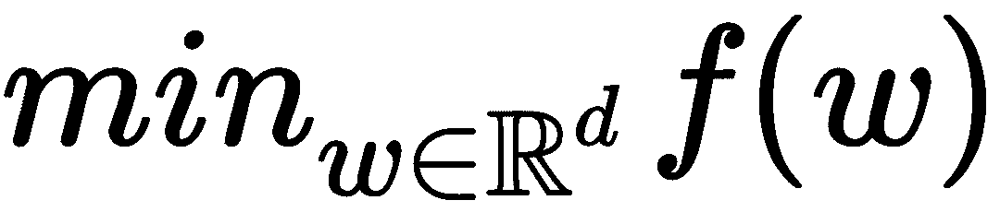

在这里，目标函数的形式为：

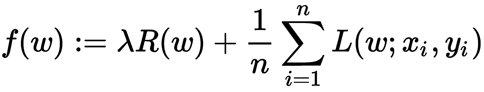

在这里，向量 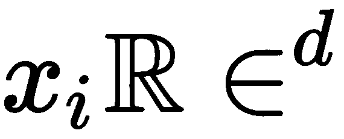 是 *1≤i≤n* 的训练数据点，它们是我们最终想要预测的相应标签。如果 *L(w;x,y)* 可以表示为 *wTx* 和 *y* 的函数，我们称该方法为*线性*。

目标函数 *f* 有两个组成部分：

+   控制模型复杂度的正则化器

+   测量模型在训练数据上误差的损失函数

损失函数 *L(w;)* 通常是 *w* 的凸函数。固定的正则化参数 *λ≥*0 定义了训练误差最小化和模型复杂度最小化之间的权衡，以避免过拟合。在各章节中，我们将详细学习不同的学习类型和算法。

另一方面，**深度神经网络**（**DNN**）是**深度学习**（**DL**）的核心，它通过提供建模复杂和高级数据抽象的算法，能够更好地利用大规模数据集来构建复杂的模型。

有一些广泛使用的基于人工神经网络的深度学习架构：DNN、胶囊网络、限制玻尔兹曼机、深度信念网络、矩阵分解机和递归神经网络。

这些架构已广泛应用于计算机视觉、语音识别、自然语言处理、音频识别、社交网络过滤、机器翻译、生物信息学和药物设计等领域。在各章节中，我们将看到多个使用这些架构的实际案例，以实现最先进的预测精度。

# 典型的机器学习工作流程

典型的机器学习应用涉及多个处理步骤，从输入到输出，形成一个科学工作流程，如*图 1，机器学习工作流程*所示。一个典型的机器学习应用包括以下步骤：

1.  加载数据

1.  将数据解析成算法所需的输入格式

1.  对数据进行预处理并处理缺失值

1.  将数据分为三个集合，分别用于训练、测试和验证（训练集和验证集），以及一个用于测试模型（测试数据集）

1.  运行算法来构建和训练你的机器学习模型

1.  使用训练数据进行预测并观察结果

1.  使用测试数据测试并评估模型，或者使用交叉验证技术通过第三个数据集（称为**验证数据集**）来验证模型。

1.  调整模型以提高性能和准确性

1.  扩展模型，使其能够处理未来的大规模数据集

1.  在生产环境中部署机器学习模型：

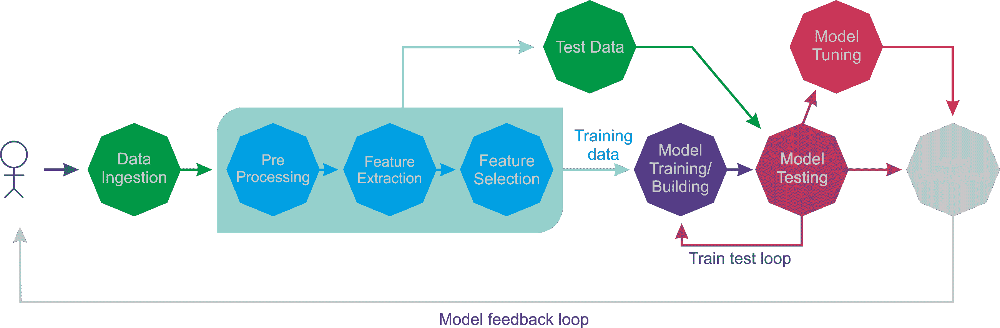

图 1：机器学习工作流程

上述工作流程表示了解决机器学习问题的几个步骤，其中，机器学习任务可以大致分为监督学习、无监督学习、半监督学习、强化学习和推荐系统。下面的*图 2，监督学习的应用*显示了监督学习的示意图。当算法找到了所需的模式后，这些模式可以用于对未标记的测试数据进行预测：


图 2：监督学习的应用

示例包括用于解决监督学习问题的分类和回归，从而可以基于这些问题构建预测分析的预测模型。在接下来的章节中，我们将提供多个监督学习的示例，如 LR、逻辑回归、随机森林、决策树、朴素贝叶斯、多层感知机等。

回归算法旨在产生连续的输出。输入可以是离散的也可以是连续的：

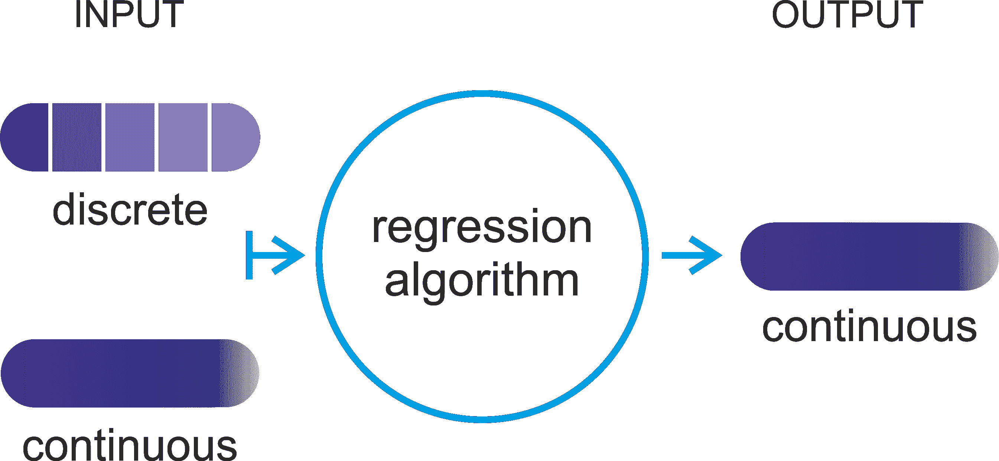

图 3：回归算法旨在产生连续输出

而分类算法则旨在从一组离散或连续的输入值中产生离散的输出。这一区别很重要，因为离散值的输出更适合由分类处理，这将在后续章节中讨论：

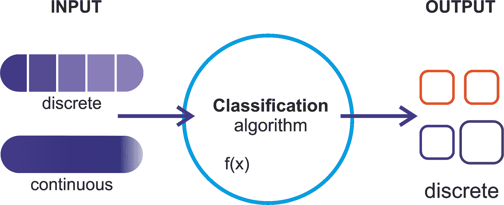

图 4：分类算法旨在产生离散输出

在本章中，我们将主要关注监督回归算法。我们将从描述问题陈述开始，然后介绍非常简单的 LR 算法。通常，这些机器学习模型的性能通过超参数调整和交叉验证技术进行优化。因此，简要了解它们是必要的，这样我们才能在后续章节中轻松使用它们。

# 超参数调整和交叉验证

调整算法简单来说是一个过程，通过这个过程可以使算法在运行时间和内存使用方面达到最佳表现。在贝叶斯统计学中，超参数是先验分布的一个参数。在机器学习中，超参数指的是那些无法通过常规训练过程直接学习到的参数。

超参数通常在实际训练过程开始之前就已固定。通过为这些超参数设置不同的值，训练不同的模型，然后通过测试它们来决定哪些效果最好。以下是一些典型的此类参数示例：

+   树的叶子数、箱数或深度

+   迭代次数

+   矩阵分解中的潜在因子数量

+   学习率

+   深度神经网络中的隐藏层数量

+   k-means 聚类中的簇数量等等

简而言之，超参数调优是一种根据所呈现数据的表现选择合适的超参数组合的技术。它是从机器学习算法中获取有意义和准确结果的基本要求之一。下图展示了模型调优过程、需要考虑的事项以及工作流程：

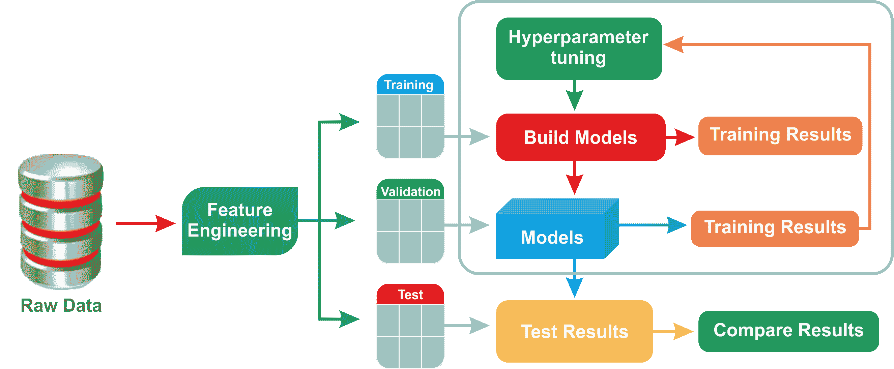

图 5：模型调优过程

交叉验证（也称为**旋转估计**）是一种用于评估统计分析和结果质量的模型验证技术。其目标是使模型对独立的测试集具有较强的泛化能力。如果你希望估计预测模型在实践中部署为机器学习应用时的表现，交叉验证会有所帮助。在交叉验证过程中，通常会使用已知类型的数据集训练模型。

相反，它是使用一个未知类型的数据集进行测试。在这方面，交叉验证有助于通过使用验证集在训练阶段描述数据集，以测试模型。有两种类型的交叉验证，具体如下：

+   **穷尽性交叉验证**：包括留 p 交叉验证和留一交叉验证

+   **非穷尽性交叉验证**：包括 K 折交叉验证和重复随机子抽样交叉验证

在大多数情况下，研究人员/数据科学家/数据工程师使用 10 折交叉验证，而不是在验证集上进行测试（见 *图 6*，*10 折交叉验证技术*）。正如下图所示，这种交叉验证技术是所有使用案例和问题类型中最广泛使用的。

基本上，使用该技术时，您的完整训练数据会被分割成若干个折叠。这个参数是可以指定的。然后，整个流程会针对每个折叠运行一次，并为每个折叠训练一个机器学习模型。最后，通过分类器的投票机制或回归的平均值将获得的不同机器学习模型结合起来：

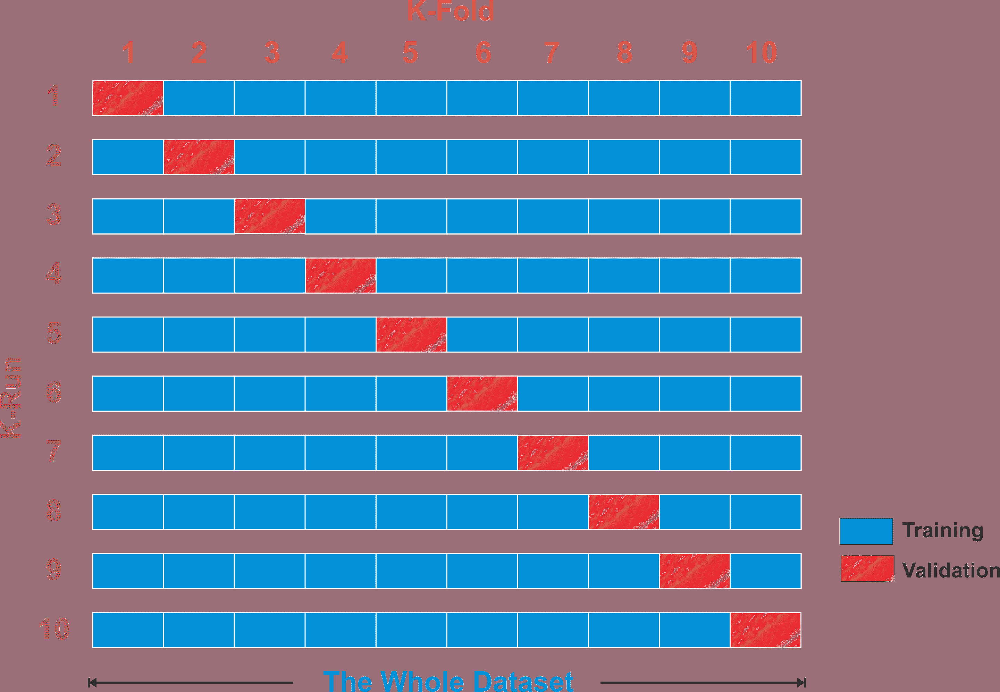

图 6：10 折交叉验证技术

此外，为了减少变异性，交叉验证会进行多次迭代，使用不同的数据分割；最后，验证结果会在各轮次中进行平均。

# 分析和预测保险索赔的严重性

预测保险公司索赔的费用，从而推测其严重性，是一个需要以更精确和自动化的方式解决的现实问题。在本示例中，我们将做类似的事情。

我们将从简单的逻辑回归开始，并学习如何使用一些集成技术（如随机森林回归器）来提高性能。接着，我们将看看如何使用梯度提升回归器来进一步提升性能。最后，我们将展示如何选择最佳模型并将其部署到生产环境中。

# 动机

当一个人遭遇严重的车祸时，他的关注点在于自己的生命、家人、孩子、朋友和亲人。然而，一旦提交了保险索赔文件，计算索赔严重程度的整个纸质流程就成了一项繁琐的任务。

这就是为什么保险公司不断寻求创新思路，自动化改进客户索赔服务的原因。因此，预测分析是预测索赔费用，从而预测其严重程度的可行解决方案，基于现有和历史数据。

# 数据集描述

将使用来自**Allstate 保险公司**的数据集，该数据集包含超过 30 万个示例，数据是经过掩码处理和匿名化的，并包含超过 100 个分类和数值属性，符合保密性约束，足够用于构建和评估各种机器学习技术。

数据集是从 Kaggle 网站下载的，网址是 [`www.kaggle.com/c/allstate-claims-severity/data`](https://www.kaggle.com/c/allstate-claims-severity/data)。数据集中的每一行代表一次保险索赔。现在，任务是预测`loss`列的值。以`cat`开头的变量是分类变量，而以`cont`开头的变量是连续变量。

需要注意的是，Allstate 公司是美国第二大保险公司，成立于 1931 年。我们正在努力使整个过程自动化，预测事故和损坏索赔的费用，从而预测其严重程度。

# 数据集的探索性分析

让我们看看一些数据属性（可以使用`EDA.scala`文件）。首先，我们需要读取训练集，以查看可用的属性。首先，将你的训练集放在项目目录或其他位置，并相应地指向它：

```py
val train = "data/insurance_train.csv"
```

我希望你已经在机器上安装并配置了 Java、Scala 和 Spark。如果没有，请先完成安装。无论如何，我假设它们已经安装好了。那么，让我们创建一个活跃的 Spark 会话，这是任何 Spark 应用程序的入口：

```py
val spark = SparkSessionCreate.createSession()
import spark.implicits._
```

**Scala REPL 中的 Spark 会话别名**：

如果你在 Scala REPL 中，Spark 会话别名`spark`已经定义好了，所以可以直接开始。

在这里，我有一个名为`createSession()`的方法，它位于`SparkSessionCreate`类中，代码如下：

```py
import org.apache.spark.sql.SparkSession 

object SparkSessionCreate { 
  def createSession(): SparkSession = { 
    val spark = SparkSession 
      .builder 
      .master("local[*]") // adjust accordingly 
      .config("spark.sql.warehouse.dir", "E:/Exp/") //change accordingly 
      .appName("MySparkSession") //change accordingly 
      .getOrCreate() 
    return spark 
    }
} 
```

由于在本书中会频繁使用此功能，我决定创建一个专门的方法。因此，我们使用`read.csv`方法加载、解析并创建 DataFrame，但使用 Databricks `.csv` 格式（也称为`com.databricks.spark.csv`），因为我们的数据集是以`.csv`格式提供的。

此时，我必须打断一下，告诉你一个非常有用的信息。由于我们将在接下来的章节中使用 Spark MLlib 和 ML API，因此，提前解决一些问题是值得的。如果你是 Windows 用户，那么我得告诉你一个很奇怪的问题，你在使用 Spark 时可能会遇到。

好的，事情是这样的，Spark 可以在**Windows**、**Mac OS**和**Linux**上运行。当你在 Windows 上使用`Eclipse`或`IntelliJ IDEA`开发 Spark 应用程序（或者通过 Spark 本地作业提交）时，你可能会遇到 I/O 异常错误，导致应用程序无法成功编译或被中断。

原因在于 Spark 期望在 Windows 上有一个`Hadoop`的运行环境。不幸的是，**Spark**的**二进制**发布版（例如**v2.2.0**）不包含一些 Windows 本地组件（例如，`winutils.exe`，`hadoop.dll`等）。然而，这些是运行`Hadoop`在 Windows 上所必需的（而不是可选的）。因此，如果你无法确保运行环境，就会出现类似以下的 I/O 异常：

```py
24/01/2018 11:11:10 
ERROR util.Shell: Failed to locate the winutils binary in the hadoop binary path
java.io.IOException: Could not locate executable null\bin\winutils.exe in the Hadoop binaries.
```

现在有两种方法来解决这个问题，针对 Windows 系统：

1.  **来自 IDE，如 Eclipse 和 IntelliJ IDEA**：从[`github.com/steveloughran/winutils/tree/master/hadoop-2.7.1/bin/`](https://github.com/steveloughran/winutils/tree/master/hadoop-2.7.1/bin/)下载`winutils.exe`。然后下载并将其复制到 Spark 分发版中的`bin`文件夹——例如，`spark-2.2.0-bin-hadoop2.7/bin/`。然后选择项目 | 运行配置... | 环境 | 新建 | 创建一个名为`HADOOP_HOME`的变量，并在值字段中填入路径——例如，`c:/spark-2.2.0-bin-hadoop2.7/bin/` | 确定 | 应用 | 运行。这样就完成了！

1.  **使用本地 Spark** **作业提交**：将`winutils.exe`文件路径添加到 hadoop 主目录，使用 System 设置属性——例如，在 Spark 代码中`System.setProperty("hadoop.home.dir", "c:\\\spark-2.2.0-bin-hadoop2.7\\\bin\winutils.exe")`

好的，让我们回到你原始的讨论。如果你看到上面的代码块，我们设置了读取 CSV 文件的头部，它直接应用于创建的 DataFrame 的列名，并且`inferSchema`属性被设置为`true`。如果你没有明确指定`inferSchema`配置，浮动值将被视为`strings`*.* 这可能导致`VectorAssembler`抛出像`java.lang.IllegalArgumentException: Data type StringType is not supported`的异常：

```py
 val trainInput = spark.read 
    .option("header", "true") 
    .option("inferSchema", "true") 
    .format("com.databricks.spark.csv") 
    .load(train) 
    .cache 
```

现在让我们打印一下我们刚才创建的 DataFrame 的 schema。我已经简化了输出，只显示了几个列：

```py
Println(trainInput.printSchema()) 
root 
 |-- id: integer (nullable = true) 
 |-- cat1: string (nullable = true) 
 |-- cat2: string (nullable = true) 
 |-- cat3: string (nullable = true) 
  ... 
 |-- cat115: string (nullable = true) 
 |-- cat116: string (nullable = true)
  ... 
 |-- cont14: double (nullable = true) 
 |-- loss: double (nullable = true) 
```

你可以看到有 116 个分类列用于分类特征。还有 14 个数值特征列。现在让我们使用`count()`方法看看数据集中有多少行：

```py
println(df.count())
>>>
 188318 
```

上述的数字对于训练 ML 模型来说相当高。好的，现在让我们通过`show()`方法查看数据集的快照，但只选取一些列，以便更有意义。你可以使用`df.show()`来查看所有列：

```py
df.select("id", "cat1", "cat2", "cat3", "cont1", "cont2", "cont3", "loss").show() 
>>> 
```

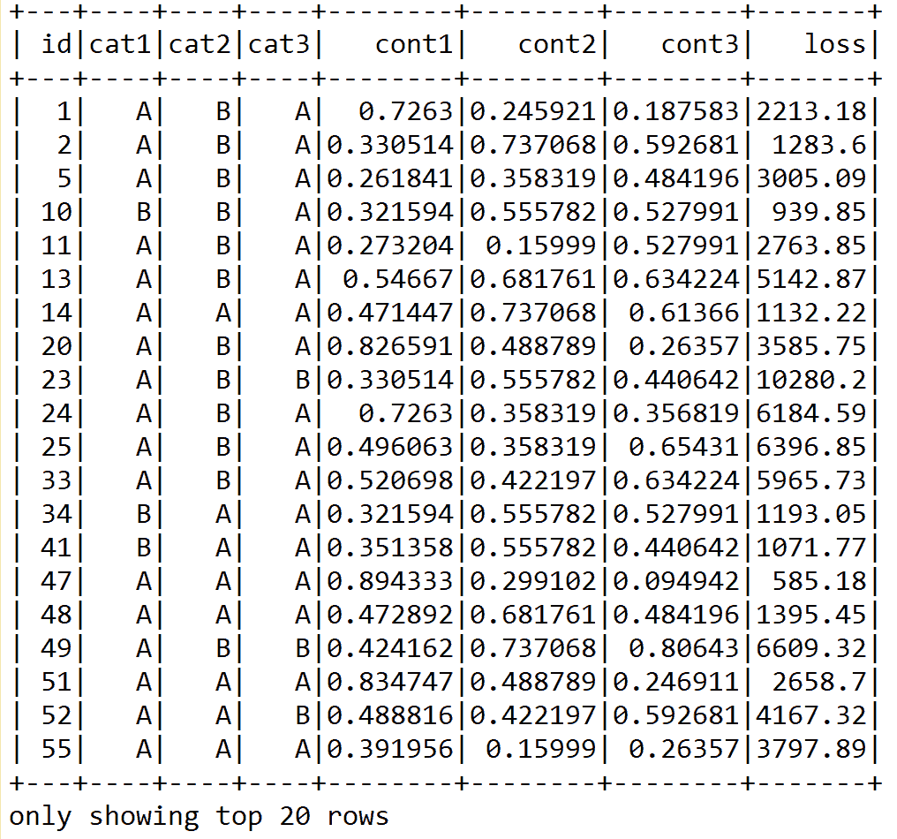

然而，如果你使用`df.show()`查看所有行，你会看到一些分类列包含了过多的类别。更具体地说，`cat109`到`cat116`这些分类列包含了过多的类别，具体如下：

```py
df.select("cat109", "cat110", "cat112", "cat113", "cat116").show() 
>>> 
```

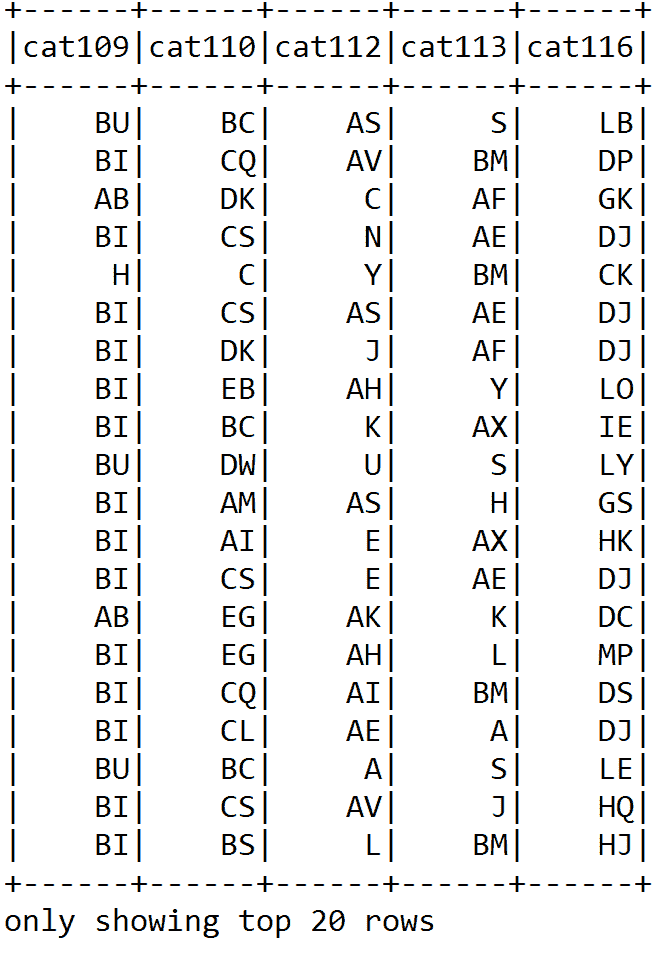

在后续阶段，值得删除这些列，以去除数据集中的偏斜性。需要注意的是，在统计学中，偏斜度是衡量一个实值随机变量的概率分布相对于均值的非对称性的一种度量。

现在我们已经看到了数据集的快照，接下来值得查看一些其他统计信息，比如平均索赔或损失、最小值、最大损失等等，使用 Spark SQL 来进行计算。但在此之前，我们先将最后一列的`loss`重命名为`label`，因为 ML 模型会对此产生警告。即使在回归模型中使用`setLabelCol`，它仍然会查找名为`label`的列。这会导致一个令人烦恼的错误，提示`org.apache.spark.sql.AnalysisException: cannot resolve 'label' given input columns`：

```py
val newDF = df.withColumnRenamed("loss", "label") 
```

现在，由于我们想要执行 SQL 查询，我们需要创建一个临时视图，以便操作可以在内存中执行：

```py
newDF.createOrReplaceTempView("insurance") 
```

现在让我们计算客户声明的平均损失：

```py
spark.sql("SELECT avg(insurance.label) as AVG_LOSS FROM insurance").show()
>>>
+------------------+
| AVG_LOSS |
+------------------+
|3037.3376856699924|
+------------------+
```

类似地，让我们看看到目前为止的最低索赔：

```py
spark.sql("SELECT min(insurance.label) as MIN_LOSS FROM insurance").show() 
>>>  
+--------+
|MIN_LOSS|
+--------+
| 0.67|
+--------+
```

让我们看看到目前为止的最高索赔：

```py
spark.sql("SELECT max(insurance.label) as MAX_LOSS FROM insurance").show() 
>>> 
+---------+
| MAX_LOSS|
+---------+
|121012.25|
+---------+
```

由于 Scala 或 Java 没有自带便捷的可视化库，我暂时无法做其他处理，但现在我们集中精力在数据预处理上，准备训练集之前进行清理。

# 数据预处理

既然我们已经查看了一些数据属性，接下来的任务是进行一些预处理，如清理数据，然后再准备训练集。对于这一部分，请使用`Preprocessing.scala`文件。对于这部分，需要以下导入：

```py
import org.apache.spark.ml.feature.{ StringIndexer, StringIndexerModel}
import org.apache.spark.ml.feature.VectorAssembler
```

然后我们加载训练集和测试集，如以下代码所示：

```py
var trainSample = 1.0 
var testSample = 1.0 
val train = "data/insurance_train.csv" 
val test = "data/insurance_test.csv" 
val spark = SparkSessionCreate.createSession() 
import spark.implicits._ 
println("Reading data from " + train + " file") 

 val trainInput = spark.read 
        .option("header", "true") 
        .option("inferSchema", "true") 
        .format("com.databricks.spark.csv") 
        .load(train) 
        .cache 

    val testInput = spark.read 
        .option("header", "true") 
        .option("inferSchema", "true") 
        .format("com.databricks.spark.csv") 
        .load(test) 
        .cache 
```

下一步任务是为我们的 ML 模型准备训练集和测试集。在之前的训练数据框中，我们将`loss`重命名为`label`。接着，将`train.csv`的内容分割为训练数据和（交叉）验证数据，分别为 75%和 25%。

`test.csv`的内容用于评估 ML 模型。两个原始数据框也进行了采样，这对在本地机器上运行快速执行非常有用：

```py
println("Preparing data for training model") 
var data = trainInput.withColumnRenamed("loss", "label").sample(false, trainSample) 
```

我们还应该进行空值检查。这里，我采用了一种简单的方法。因为如果训练数据框架中包含任何空值，我们就会完全删除这些行。这是有意义的，因为在 188,318 行数据中，删除少数几行并不会造成太大问题。不过，你也可以采取其他方法，如空值插补：

```py
var DF = data.na.drop() 
if (data == DF) 
  println("No null values in the DataFrame")     
else{ 
  println("Null values exist in the DataFrame") 
  data = DF 
} 
val seed = 12345L 
val splits = data.randomSplit(Array(0.75, 0.25), seed) 
val (trainingData, validationData) = (splits(0), splits(1)) 
```

接着我们缓存这两个数据集，以便更快速地进行内存访问：

```py
trainingData.cache 
validationData.cache 
```

此外，我们还应该对测试集进行采样，这是评估步骤中所需要的：

```py
val testData = testInput.sample(false, testSample).cache 
```

由于训练集包含了数值型和分类值，我们需要分别识别并处理它们。首先，让我们只识别分类列：

```py
def isCateg(c: String): Boolean = c.startsWith("cat") 
def categNewCol(c: String): String = if (isCateg(c)) s"idx_${c}" else c 
```

接下来，使用以下方法删除类别过多的列，这是我们在前一节中已经讨论过的：

```py
def removeTooManyCategs(c: String): Boolean = !(c matches "cat(109$|110$|112$|113$|116$)")
```

接下来使用以下方法只选择特征列。所以本质上，我们应该删除 ID 列（因为 ID 只是客户的识别号码，不包含任何非平凡的信息）和标签列：

```py
def onlyFeatureCols(c: String): Boolean = !(c matches "id|label") 
```

好的，到目前为止，我们已经处理了一些无关或不需要的列。现在下一步任务是构建最终的特征列集：

```py
val featureCols = trainingData.columns 
    .filter(removeTooManyCategs) 
    .filter(onlyFeatureCols) 
    .map(categNewCol) 
```

`StringIndexer`将给定的字符串标签列编码为标签索引列。如果输入列是数值类型的，我们使用`StringIndexer`将其转换为字符串，并对字符串值进行索引。当下游管道组件（如 Estimator 或 Transformer）使用这个字符串索引标签时，必须将该组件的输入列设置为该字符串索引列名。在许多情况下，你可以通过`setInputCol`来设置输入列。

现在，我们需要使用`StringIndexer()`来处理类别列：

```py
val stringIndexerStages = trainingData.columns.filter(isCateg) 
      .map(c => new StringIndexer() 
      .setInputCol(c) 
      .setOutputCol(categNewCol(c)) 
      .fit(trainInput.select(c).union(testInput.select(c)))) 
```

请注意，这不是一种高效的方法。另一种替代方法是使用 OneHotEncoder 估算器。

OneHotEncoder 将标签索引列映射到二进制向量列，每个向量最多只有一个值为 1。该编码允许期望连续特征的算法（如逻辑回归）利用类别特征。

现在让我们使用`VectorAssembler()`将给定的列列表转换为单一的向量列：

```py
val assembler = new VectorAssembler() 
    .setInputCols(featureCols) 
    .setOutputCol("features")
```

`VectorAssembler`是一个转换器。它将给定的列列表合并为单一的向量列。它对于将原始特征和由不同特征转换器生成的特征合并为一个特征向量非常有用，以便训练机器学习模型，如逻辑回归和决策树。

在开始训练回归模型之前，这就是我们需要做的全部。首先，我们开始训练 LR 模型并评估其性能。

# 用 LR 预测保险赔偿的严重程度

正如你已经看到的，预测的损失包含连续值，也就是说，这是一个回归任务。因此，在此使用回归分析时，目标是预测一个连续的目标变量，而另一个领域——分类，则预测从有限集合中选择一个标签。

**逻辑回归**（**LR**）属于回归算法家族。回归的目标是寻找变量之间的关系和依赖性。它通过线性函数建模连续标量因变量*y*（即标签或目标）与一个或多个（D 维向量）解释变量（也称为自变量、输入变量、特征、观察数据、观测值、属性、维度和数据点）*x*之间的关系：

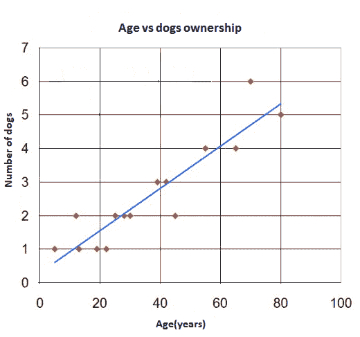

图 9：回归图将数据点（红色圆点）分开，蓝线为回归线

LR 模型描述了因变量 *y* 与一组相互依赖的自变量 *x[i]* 之间的关系。字母 *A* 和 *B* 分别表示描述 *y* 轴截距和回归线斜率的常数：

*y = A+Bx*

*图 9*，*回归图将数据点（红色点）与回归线（蓝色线）分开*，显示了一个简单的 LR 示例，只有一个自变量——即一组数据点和一个**最佳拟合**线，这是回归分析的结果。可以观察到，这条线并不完全通过所有数据点。

任何数据点（实际测量值）与回归线（预测值）之间的距离称为回归误差。较小的误差有助于更准确地预测未知值。当误差被减少到最小水平时，最终的回归误差会生成最佳拟合线。请注意，在回归误差方面没有单一的度量标准，以下是几种常见的度量：

+   **均方误差**（**MSE**）：它是衡量拟合线与数据点接近程度的指标。MSE 越小，拟合程度越接近数据。

+   **均方根误差**（**RMSE**）：它是均方误差（MSE）的平方根，但可能是最容易解释的统计量，因为它与纵轴上绘制的量具有相同的单位。

+   **R 平方**：R 平方是衡量数据与拟合回归线之间接近程度的统计量。R 平方总是介于 0 和 100%之间。R 平方越高，模型越能拟合数据。

+   **平均绝对误差**（**MAE**）：MAE 衡量一组预测中误差的平均幅度，而不考虑其方向。它是测试样本中预测值与实际观察值之间的绝对差异的平均值，其中所有个体差异具有相同的权重。

+   **解释方差**：在统计学中，**解释**方差衡量数学模型在多大程度上能够解释给定数据集的变化。

# 使用 LR 开发保险赔偿严重性预测模型

在本小节中，我们将开发一个预测分析模型，用于预测客户在事故损失中的赔偿严重性。我们从导入所需的库开始：

```py
import org.apache.spark.ml.regression.{LinearRegression, LinearRegressionModel} 
import org.apache.spark.ml.{ Pipeline, PipelineModel } 
import org.apache.spark.ml.evaluation.RegressionEvaluator 
import org.apache.spark.ml.tuning.ParamGridBuilder 
import org.apache.spark.ml.tuning.CrossValidator 
import org.apache.spark.sql._ 
import org.apache.spark.sql.functions._ 
import org.apache.spark.mllib.evaluation.RegressionMetrics 
```

然后，我们创建一个活动的 Spark 会话，作为应用程序的入口点。此外，导入 `implicits__`，这是隐式转换所需的，如将 RDD 转换为 DataFrame。

```py
val spark = SparkSessionCreate.createSession() 
import spark.implicits._ 
```

然后，我们定义一些超参数，如交叉验证的折数、最大迭代次数、回归参数的值、容差值以及弹性网络参数，如下所示：

```py
val numFolds = 10 
val MaxIter: Seq[Int] = Seq(1000) 
val RegParam: Seq[Double] = Seq(0.001) 
val Tol: Seq[Double] = Seq(1e-6) 
val ElasticNetParam: Seq[Double] = Seq(0.001) 
```

现在，我们创建一个 LR 估计器：

```py
val model = new LinearRegression()
        .setFeaturesCol("features")
        .setLabelCol("label") 
```

现在，让我们通过连接变换器和 LR 估计器来构建一个管道估计器：

```py
println("Building ML pipeline") 
val pipeline = new Pipeline()
         .setStages((Preproessing.stringIndexerStages  
         :+ Preproessing.assembler) :+ model)
```

Spark ML 管道包含以下组件：

+   **数据框**：用作中央数据存储，所有原始数据和中间结果都存储在这里。

+   **转换器**：转换器通过添加额外的特征列将一个 DataFrame 转换成另一个 DataFrame。转换器是无状态的，意味着它们没有内部记忆，每次使用时的行为都完全相同。

+   **估算器**：估算器是一种机器学习模型。与转换器不同，估算器包含内部状态表示，并且高度依赖于它已经见过的数据历史。

+   **管道**：将前面的组件、DataFrame、转换器和估算器连接在一起。

+   **参数**：机器学习算法有许多可调整的参数。这些称为**超参数**，而机器学习算法通过学习数据来拟合模型的值称为**参数**。

在开始执行交叉验证之前，我们需要有一个参数网格（paramgrid）。所以让我们通过指定最大迭代次数、回归参数值、公差值和弹性网络参数来创建参数网格，如下所示：

```py
val paramGrid = new ParamGridBuilder() 
      .addGrid(model.maxIter, MaxIter) 
      .addGrid(model.regParam, RegParam) 
      .addGrid(model.tol, Tol) 
      .addGrid(model.elasticNetParam, ElasticNetParam) 
      .build() 
```

现在，为了获得更好且稳定的性能，让我们准备 K 折交叉验证和网格搜索作为模型调优的一部分。正如你们可能猜到的，我将进行 10 折交叉验证。根据你的设置和数据集，可以自由调整折数：

```py
println("Preparing K-fold Cross Validation and Grid Search: Model tuning") 
val cv = new CrossValidator() 
      .setEstimator(pipeline) 
      .setEvaluator(new RegressionEvaluator) 
      .setEstimatorParamMaps(paramGrid) 
      .setNumFolds(numFolds) 
```

太棒了——我们已经创建了交叉验证估算器。现在是训练 LR 模型的时候了：

```py
println("Training model with Linear Regression algorithm") 
val cvModel = cv.fit(Preproessing.trainingData) 
```

现在，我们已经有了拟合的模型，这意味着它现在能够进行预测。所以，让我们开始在训练集和验证集上评估模型，并计算 RMSE、MSE、MAE、R 平方等指标：

```py
println("Evaluating model on train and validation set and calculating RMSE") 
val trainPredictionsAndLabels = cvModel.transform(Preproessing.trainingData)
                .select("label", "prediction")
                .map { case Row(label: Double, prediction: Double) 
                => (label, prediction) }.rdd 

val validPredictionsAndLabels = cvModel.transform(Preproessing.validationData)
                                .select("label", "prediction")
                                .map { case Row(label: Double, prediction: Double) 
                                => (label, prediction) }.rdd 

val trainRegressionMetrics = new RegressionMetrics(trainPredictionsAndLabels) 
val validRegressionMetrics = new RegressionMetrics(validPredictionsAndLabels) 
```

太棒了！我们已经成功计算了训练集和测试集的原始预测结果。接下来，让我们寻找最佳模型：

```py
val bestModel = cvModel.bestModel.asInstanceOf[PipelineModel] 
```

一旦我们有了最佳拟合并且通过交叉验证的模型，我们可以期望得到良好的预测准确性。现在，让我们观察训练集和验证集上的结果：

```py
val results = "n=====================================================================n" + s"Param trainSample: ${Preproessing.trainSample}n" + 
      s"Param testSample: ${Preproessing.testSample}n" + 
      s"TrainingData count: ${Preproessing.trainingData.count}n" + 
      s"ValidationData count: ${Preproessing.validationData.count}n" + 
      s"TestData count: ${Preproessing.testData.count}n" +      "=====================================================================n" +   s"Param maxIter = ${MaxIter.mkString(",")}n" + 
      s"Param numFolds = ${numFolds}n" +      "=====================================================================n" +   s"Training data MSE = ${trainRegressionMetrics.meanSquaredError}n" + 
      s"Training data RMSE = ${trainRegressionMetrics.rootMeanSquaredError}n" + 
      s"Training data R-squared = ${trainRegressionMetrics.r2}n" + 
      s"Training data MAE = ${trainRegressionMetrics.meanAbsoluteError}n" + 
      s"Training data Explained variance = ${trainRegressionMetrics.explainedVariance}n" +      "=====================================================================n" +   s"Validation data MSE = ${validRegressionMetrics.meanSquaredError}n" + 
      s"Validation data RMSE = ${validRegressionMetrics.rootMeanSquaredError}n" + 
      s"Validation data R-squared = ${validRegressionMetrics.r2}n" + 
      s"Validation data MAE = ${validRegressionMetrics.meanAbsoluteError}n" + 
      s"Validation data Explained variance = ${validRegressionMetrics.explainedVariance}n" + 
      s"CV params explained: ${cvModel.explainParams}n" + 
      s"LR params explained: ${bestModel.stages.last.asInstanceOf[LinearRegressionModel].explainParams}n" +      "=====================================================================n" 
```

现在，我们将打印前面的结果，如下所示：

```py
println(results)
>>> 
Building Machine Learning pipeline 
Reading data from data/insurance_train.csv file 
Null values exist in the DataFrame 
Training model with Linear Regression algorithm
===================================================================== 
Param trainSample: 1.0 
Param testSample: 1.0 
TrainingData count: 141194 
ValidationData count: 47124 
TestData count: 125546 
===================================================================== 
Param maxIter = 1000 
Param numFolds = 10 
===================================================================== 
Training data MSE = 4460667.3666198505 
Training data RMSE = 2112.0292059107164 
Training data R-squared = -0.1514435541595276 
Training data MAE = 1356.9375609756164 
Training data Explained variance = 8336528.638733305 
===================================================================== 
Validation data MSE = 4839128.978963534 
Validation data RMSE = 2199.802031766389 
Validation data R-squared = -0.24922962724089603 
Validation data MAE = 1356.419484419514 
Validation data Explained variance = 8724661.329105612 
CV params explained: estimator: estimator for selection (current: pipeline_d5024480c670) 
estimatorParamMaps: param maps for the estimator (current: [Lorg.apache.spark.ml.param.ParamMap;@2f0c9855) 
evaluator: evaluator used to select hyper-parameters that maximize the validated metric (current: regEval_00c707fcaa06) 
numFolds: number of folds for cross validation (>= 2) (default: 3, current: 10) 
seed: random seed (default: -1191137437) 
LR params explained: aggregationDepth: suggested depth for treeAggregate (>= 2) (default: 2) 
elasticNetParam: the ElasticNet mixing parameter, in range [0, 1]. For alpha = 0, the penalty is an L2 penalty. For alpha = 1, it is an L1 penalty (default: 0.0, current: 0.001) 
featuresCol: features column name (default: features, current: features) 
fitIntercept: whether to fit an intercept term (default: true) 
labelCol: label column name (default: label, current: label) 
maxIter: maximum number of iterations (>= 0) (default: 100, current: 1000) 
predictionCol: prediction column name (default: prediction) 
regParam: regularization parameter (>= 0) (default: 0.0, current: 0.001) 
solver: the solver algorithm for optimization. If this is not set or empty, default value is 'auto' (default: auto) 
standardization: whether to standardize the training features before fitting the model (default: true) 
tol: the convergence tolerance for iterative algorithms (>= 0) (default: 1.0E-6, current: 1.0E-6) 
weightCol: weight column name. If this is not set or empty, we treat all instance weights as 1.0 (undefined) 
===================================================================== 
```

所以，我们的预测模型在训练集和测试集上的 MAE 约为`1356.419484419514`。然而，在 Kaggle 的公共和私人排行榜上，MAE 要低得多（请访问：[`www.kaggle.com/c/allstate-claims-severity/leaderboard`](https://www.kaggle.com/c/allstate-claims-severity/leaderboard)），公共和私人的 MAE 分别为 1096.92532 和 1109.70772。

等等！我们还没有完成。我们仍然需要在测试集上进行预测：

```py
println("Run prediction on the test set") 
cvModel.transform(Preproessing.testData) 
      .select("id", "prediction") 
      .withColumnRenamed("prediction", "loss") 
      .coalesce(1) // to get all the predictions in a single csv file 
      .write.format("com.databricks.spark.csv")
      .option("header", "true") 
      .save("output/result_LR.csv")
```

前面的代码应生成一个名为`result_LR.csv`的 CSV 文件。如果我们打开文件，我们应该能够看到每个 ID（即索赔）对应的损失。我们将在本章结束时查看 LR、RF 和 GBT 的内容。尽管如此，结束 Spark 会话时，调用`spark.stop()`方法总是个好主意。

集成方法是一种学习算法，它创建一个由其他基础模型组成的模型。Spark ML 支持两种主要的集成算法，分别是基于决策树的 GBT 和随机森林。接下来，我们将看看是否可以通过显著减少 MAE 误差来提高预测准确度，使用 GBT。

# 用于预测保险赔付严重性的 GBT 回归器

为了最小化`loss`函数，**梯度提升树**（**GBT**）通过迭代训练多棵决策树。在每次迭代中，算法使用当前的集成模型来预测每个训练实例的标签。

然后，原始预测与真实标签进行比较。因此，在下一次迭代中，决策树将帮助纠正之前的错误，如果数据集被重新标记以强调对预测不准确的训练实例进行训练。

既然我们讨论的是回归，那么讨论 GBT 的回归能力及其损失计算会更有意义。假设我们有以下设置：

+   *N* 数据实例

+   *y[i]* = 实例*i*的标签

+   *x[i]* = 实例*i*的特征

然后，*F(x[i])*函数是模型的预测标签；例如，它试图最小化误差，即损失：

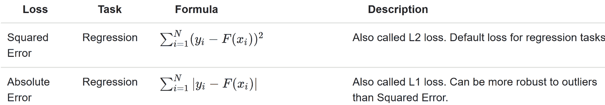

现在，与决策树类似，GBT 也会：

+   处理类别特征（当然也包括数值特征）

+   扩展到多类分类设置

+   执行二分类和回归（目前尚不支持多类分类）

+   不需要特征缩放

+   捕捉线性模型中（如线性回归）严重缺失的非线性和特征交互

**训练过程中的验证**：梯度提升可能会过拟合，尤其是在你使用更多树训练模型时。为了防止这个问题，训练过程中进行验证是非常有用的。

既然我们已经准备好了数据集，我们可以直接进入实现基于 GBT 的预测模型来预测保险赔付严重性。让我们从导入必要的包和库开始：

```py
import org.apache.spark.ml.regression.{GBTRegressor, GBTRegressionModel} 
import org.apache.spark.ml.{Pipeline, PipelineModel} 
import org.apache.spark.ml.evaluation.RegressionEvaluator 
import org.apache.spark.ml.tuning.ParamGridBuilder 
import org.apache.spark.ml.tuning.CrossValidator 
import org.apache.spark.sql._ 
import org.apache.spark.sql.functions._ 
import org.apache.spark.mllib.evaluation.RegressionMetrics 
```

现在让我们定义并初始化训练 GBT 所需的超参数，例如树的数量、最大分箱数、交叉验证中使用的折数、训练的最大迭代次数，最后是最大树深度：

```py
val NumTrees = Seq(5, 10, 15) 
val MaxBins = Seq(5, 7, 9) 
val numFolds = 10 
val MaxIter: Seq[Int] = Seq(10) 
val MaxDepth: Seq[Int] = Seq(10) 
```

然后，我们再次实例化一个 Spark 会话并启用隐式转换，如下所示：

```py
val spark = SparkSessionCreate.createSession() 
import spark.implicits._ 
```

既然我们关心的是一个估算器算法，即 GBT：

```py
val model = new GBTRegressor()
                .setFeaturesCol("features")
                .setLabelCol("label") 
```

现在，我们通过将变换和预测器串联在一起构建管道，如下所示：

```py
val pipeline = new Pipeline().setStages((Preproessing.stringIndexerStages :+ Preproessing.assembler) :+ model) 
```

在开始执行交叉验证之前，我们需要一个参数网格。接下来，我们通过指定最大迭代次数、最大树深度和最大分箱数来开始创建参数网格：

```py
val paramGrid = new ParamGridBuilder() 
      .addGrid(model.maxIter, MaxIter) 
      .addGrid(model.maxDepth, MaxDepth) 
      .addGrid(model.maxBins, MaxBins) 
      .build() 
```

现在，为了获得更好且稳定的性能，让我们准备 K-fold 交叉验证和网格搜索作为模型调优的一部分。如你所料，我将进行 10-fold 交叉验证。根据你的设置和数据集，你可以自由调整折数：

```py
println("Preparing K-fold Cross Validation and Grid Search") 
val cv = new CrossValidator() 
      .setEstimator(pipeline) 
      .setEvaluator(new RegressionEvaluator) 
      .setEstimatorParamMaps(paramGrid) 
      .setNumFolds(numFolds) 
```

很棒，我们已经创建了交叉验证估算器。现在是时候训练 GBT 模型了：

```py
println("Training model with GradientBoostedTrees algorithm ") 
val cvModel = cv.fit(Preproessing.trainingData) 
```

现在我们已经得到了拟合的模型，这意味着它现在能够进行预测。所以让我们开始在训练集和验证集上评估模型，并计算 RMSE、MSE、MAE、R-squared 等指标：

```py
println("Evaluating model on train and test data and calculating RMSE") 
val trainPredictionsAndLabels = cvModel.transform(Preproessing.trainingData).select("label", "prediction").map { case Row(label: Double, prediction: Double) => (label, prediction) }.rdd 

val validPredictionsAndLabels = cvModel.transform(Preproessing.validationData).select("label", "prediction").map { case Row(label: Double, prediction: Double) => (label, prediction) }.rdd 

val trainRegressionMetrics = new RegressionMetrics(trainPredictionsAndLabels) 
val validRegressionMetrics = new RegressionMetrics(validPredictionsAndLabels) 
```

很好！我们已经成功计算了训练集和测试集的原始预测值。让我们开始寻找最佳模型：

```py
val bestModel = cvModel.bestModel.asInstanceOf[PipelineModel] 
```

如前所述，使用 GBT 可以衡量特征重要性，这样在后续阶段我们可以决定哪些特征要使用，哪些要从 DataFrame 中删除。让我们找到之前创建的最佳模型的特征重要性，并按升序列出所有特征，如下所示：

```py
val featureImportances = bestModel.stages.last.asInstanceOf[GBTRegressionModel].featureImportances.toArray 
val FI_to_List_sorted = featureImportances.toList.sorted.toArray  
```

一旦我们有了最佳拟合且交叉验证的模型，就可以期待良好的预测精度。现在让我们观察训练集和验证集上的结果：

```py
val output = "n=====================================================================n" + s"Param trainSample: ${Preproessing.trainSample}n" + 
      s"Param testSample: ${Preproessing.testSample}n" + 
      s"TrainingData count: ${Preproessing.trainingData.count}n" + 
      s"ValidationData count: ${Preproessing.validationData.count}n" + 
      s"TestData count: ${Preproessing.testData.count}n" +      "=====================================================================n" +   s"Param maxIter = ${MaxIter.mkString(",")}n" + 
      s"Param maxDepth = ${MaxDepth.mkString(",")}n" + 
      s"Param numFolds = ${numFolds}n" +      "=====================================================================n" +   s"Training data MSE = ${trainRegressionMetrics.meanSquaredError}n" + 
      s"Training data RMSE = ${trainRegressionMetrics.rootMeanSquaredError}n" + 
      s"Training data R-squared = ${trainRegressionMetrics.r2}n" + 
      s"Training data MAE = ${trainRegressionMetrics.meanAbsoluteError}n" + 
      s"Training data Explained variance = ${trainRegressionMetrics.explainedVariance}n" +      "=====================================================================n" +    s"Validation data MSE = ${validRegressionMetrics.meanSquaredError}n" + 
      s"Validation data RMSE = ${validRegressionMetrics.rootMeanSquaredError}n" + 
      s"Validation data R-squared = ${validRegressionMetrics.r2}n" + 
      s"Validation data MAE = ${validRegressionMetrics.meanAbsoluteError}n" + 
      s"Validation data Explained variance = ${validRegressionMetrics.explainedVariance}n" +      "=====================================================================n" +   s"CV params explained: ${cvModel.explainParams}n" + 
      s"GBT params explained: ${bestModel.stages.last.asInstanceOf[GBTRegressionModel].explainParams}n" + s"GBT features importances:n ${Preproessing.featureCols.zip(FI_to_List_sorted).map(t => s"t${t._1} = ${t._2}").mkString("n")}n" +      "=====================================================================n" 
```

现在，我们按如下方式打印之前的结果：

```py
println(results)
 >>> 
===================================================================== 
Param trainSample: 1.0 
Param testSample: 1.0 
TrainingData count: 141194 
ValidationData count: 47124 
TestData count: 125546 
===================================================================== 
Param maxIter = 10 
Param maxDepth = 10 
Param numFolds = 10 
===================================================================== 
Training data MSE = 2711134.460296872 
Training data RMSE = 1646.5522950385973 
Training data R-squared = 0.4979619968485668 
Training data MAE = 1126.582534126603 
Training data Explained variance = 8336528.638733303 
===================================================================== 
Validation data MSE = 4796065.983773314 
Validation data RMSE = 2189.9922337244293 
Validation data R-squared = 0.13708582379658474 
Validation data MAE = 1289.9808960385383 
Validation data Explained variance = 8724866.468978886 
===================================================================== 
CV params explained: estimator: estimator for selection (current: pipeline_9889176c6eda) 
estimatorParamMaps: param maps for the estimator (current: [Lorg.apache.spark.ml.param.ParamMap;@87dc030) 
evaluator: evaluator used to select hyper-parameters that maximize the validated metric (current: regEval_ceb3437b3ac7) 
numFolds: number of folds for cross validation (>= 2) (default: 3, current: 10) 
seed: random seed (default: -1191137437) 
GBT params explained: cacheNodeIds: If false, the algorithm will pass trees to executors to match instances with nodes. If true, the algorithm will cache node IDs for each instance. Caching can speed up training of deeper trees. (default: false) 
checkpointInterval: set checkpoint interval (>= 1) or disable checkpoint (-1). E.g. 10 means that the cache will get checkpointed every 10 iterations (default: 10) 
featuresCol: features column name (default: features, current: features) 
impurity: Criterion used for information gain calculation (case-insensitive). Supported options: variance (default: variance) 
labelCol: label column name (default: label, current: label) 
lossType: Loss function which GBT tries to minimize (case-insensitive). Supported options: squared, absolute (default: squared) 
maxBins: Max number of bins for discretizing continuous features. Must be >=2 and >= number of categories for any categorical feature. (default: 32) 
maxDepth: Maximum depth of the tree. (>= 0) E.g., depth 0 means 1 leaf node; depth 1 means 1 internal node + 2 leaf nodes. (default: 5, current: 10) 
maxIter: maximum number of iterations (>= 0) (default: 20, current: 10) 
maxMemoryInMB: Maximum memory in MB allocated to histogram aggregation. (default: 256) 
minInfoGain: Minimum information gain for a split to be considered at a tree node. (default: 0.0) 
minInstancesPerNode: Minimum number of instances each child must have after split. If a split causes the left or right child to have fewer than minInstancesPerNode, the split will be discarded as invalid. Should be >= 1\. (default: 1) 
predictionCol: prediction column name (default: prediction) 
seed: random seed (default: -131597770) 
stepSize: Step size (a.k.a. learning rate) in interval (0, 1] for shrinking the contribution of each estimator. (default: 0.1) 
subsamplingRate: Fraction of the training data used for learning each decision tree, in range (0, 1]. (default: 1.0) 
GBT features importance: 
   idx_cat1 = 0.0 
   idx_cat2 = 0.0 
   idx_cat3 = 0.0 
   idx_cat4 = 3.167169394850417E-5 
   idx_cat5 = 4.745749854188828E-5 
... 
   idx_cat111 = 0.018960701085054904 
   idx_cat114 = 0.020609596772820878 
   idx_cat115 = 0.02281267960792931 
   cont1 = 0.023943087007850663 
   cont2 = 0.028078353534251005 
   ... 
   cont13 = 0.06921704925937068 
   cont14 = 0.07609111789104464 
===================================================================== 
```

所以我们的预测模型显示训练集和测试集的 MAE 分别为 `1126.582534126603` 和 `1289.9808960385383`。最后一个结果对理解特征重要性至关重要（前面的列表已经简化以节省空间，但你应该收到完整的列表）。特别是，我们可以看到前三个特征完全不重要，因此我们可以安全地将它们从 DataFrame 中删除。在下一节中我们会提供更多的见解。

最后，让我们在测试集上运行预测，并为每个客户的理赔生成预测损失：

```py
println("Run prediction over test dataset") 
cvModel.transform(Preproessing.testData) 
      .select("id", "prediction") 
      .withColumnRenamed("prediction", "loss") 
      .coalesce(1) 
      .write.format("com.databricks.spark.csv") 
      .option("header", "true") 
      .save("output/result_GBT.csv") 
```

上述代码应该生成一个名为 `result_GBT.csv` 的 CSV 文件。如果我们打开文件，我们应该能看到每个 ID 对应的损失，也就是理赔。我们将在本章末尾查看 LR、RF 和 GBT 的内容。不过，结束时调用 `spark.stop()` 方法停止 Spark 会话总是一个好主意。

# 使用随机森林回归器提升性能

在之前的章节中，尽管我们对每个实例的损失严重性做出了预测，但并没有得到预期的 MAE 值。在本节中，我们将开发一个更稳健的预测分析模型，目的是相同的，但使用随机森林回归器。不过，在正式实现之前，我们需要简要了解一下随机森林算法。

# 随机森林用于分类和回归

随机森林是一种集成学习技术，用于解决监督学习任务，如分类和回归。随机森林的一个优势特性是它能够克服训练数据集上的过拟合问题。随机森林中的一片“森林”通常由数百到数千棵树组成。这些树实际上是在同一训练集的不同部分上训练的。

更技术性地说，单棵树如果长得很深，往往会从高度不可预测的模式中学习。这会导致训练集上的过拟合问题。此外，较低的偏差会使分类器表现较差，即使你的数据集在特征呈现方面质量很好。另一方面，随机森林通过将多棵决策树进行平均，目的是减少方差，确保一致性，通过计算案例对之间的接近度来实现。

**GBT**还是**随机森林**？虽然 GBT 和随机森林都是树的集成方法，但它们的训练过程不同。两者之间存在一些实际的权衡，这常常会带来选择困难。然而，在大多数情况下，随机森林是更优的选择。以下是一些理由：

+   GBT 每次训练一棵树，而随机森林则可以并行训练多棵树。所以随机森林的训练时间较短。然而，在某些特殊情况下，使用较少数量的树进行 GBT 训练更简单且速度更快。

+   在大多数情况下，随机森林不易过拟合，因此降低了过拟合的可能性。换句话说，随机森林通过增加树的数量来减少方差，而 GBT 通过增加树的数量来减少偏差。

+   最后，随机森林相对更容易调优，因为性能会随着树的数量单调提升，但 GBT 随着树的数量增加表现较差。

然而，这会略微增加偏差，并使得结果更难以解释。但最终，最终模型的性能会显著提高。在使用随机森林作为分类器时，有一些参数设置：

+   如果树的数量是 1，则完全不使用自助抽样；但如果树的数量大于 1，则需要使用自助抽样。支持的值有`auto`、`all`、`sqrt`、`log2`和`onethird`。

+   支持的数值范围是*(0.0-1.0)*和*[1-n]*。但是，如果选择`featureSubsetStrategy`为`auto`，算法将自动选择最佳的特征子集策略。

+   如果`numTrees == 1`，则`featureSubsetStrategy`设置为`all`。但是，如果`numTrees > 1`（即森林），则`featureSubsetStrategy`将设置为`sqrt`用于分类。

+   此外，如果设置了一个实数值`n`，并且`n`的范围在*(0, 1.0)*之间，则将使用`n*number_of_features`。但是，如果设置了一个整数值`n`，并且`n`的范围在(1，特征数)之间，则仅交替使用`n`个特征。

+   参数 `categoricalFeaturesInfo` 是一个映射，用于存储任意或分类特征。一个条目 *(n -> k)* 表示特征 `n` 是分类的，有 I 个类别，索引从 *0: (0, 1,...,k-1)*。

+   纯度标准用于信息增益计算。支持的值分别为分类和回归中的 `gini` 和 `variance`。

+   `maxDepth` 是树的最大深度（例如，深度为 0 表示一个叶节点，深度为 1 表示一个内部节点加上两个叶节点）。

+   `maxBins` 表示用于拆分特征的最大桶数，建议的值是 100，以获得更好的结果。

+   最后，随机种子用于自助抽样和选择特征子集，以避免结果的随机性。

正如前面提到的，由于随机森林足够快速且可扩展，适合处理大规模数据集，因此 Spark 是实现 RF 的合适技术，并实现这种大规模的可扩展性。然而，如果计算了邻近性，存储需求也会呈指数增长。

好的，关于 RF 就讲到这里。现在是时候动手实践了，开始吧。我们从导入所需的库开始：

```py
import org.apache.spark.ml.regression.{RandomForestRegressor, RandomForestRegressionModel} 
import org.apache.spark.ml.{ Pipeline, PipelineModel } 
import org.apache.spark.ml.evaluation.RegressionEvaluator 
import org.apache.spark.ml.tuning.ParamGridBuilder 
import org.apache.spark.ml.tuning.CrossValidator 
import org.apache.spark.sql._ 
import org.apache.spark.sql.functions._ 
import org.apache.spark.mllib.evaluation.RegressionMetrics 
```

然后，我们创建一个活动的 Spark 会话并导入隐式转换：

```py
val spark = SparkSessionCreate.createSession() 
import spark.implicits._ 
```

然后我们定义一些超参数，比如交叉验证的折数、最大迭代次数、回归参数的值、公差值以及弹性网络参数，如下所示：

```py
val NumTrees = Seq(5,10,15)  
val MaxBins = Seq(23,27,30)  
val numFolds = 10  
val MaxIter: Seq[Int] = Seq(20) 
val MaxDepth: Seq[Int] = Seq(20) 
```

请注意，对于基于决策树的随机森林，我们要求 `maxBins` 至少与每个分类特征中的值的数量一样大。在我们的数据集中，我们有 110 个分类特征，其中包含 23 个不同的值。因此，我们必须将 `MaxBins` 设置为至少 23。然而，还是可以根据需要调整之前的参数。好了，现在是时候创建 LR 估计器了：

```py
val model = new RandomForestRegressor().setFeaturesCol("features").setLabelCol("label")
```

现在，让我们通过将变换器和 LR 估计器连接起来，构建一个管道估计器：

```py
println("Building ML pipeline") 
val pipeline = new Pipeline().setStages((Preproessing.stringIndexerStages :+ Preproessing.assembler) :+ model) 
```

在我们开始执行交叉验证之前，需要有一个参数网格。所以让我们通过指定树的数量、最大树深度的数字和最大桶数参数来创建参数网格，如下所示：

```py
val paramGrid = new ParamGridBuilder() 
      .addGrid(model.numTrees, NumTrees) 
      .addGrid(model.maxDepth, MaxDepth) 
      .addGrid(model.maxBins, MaxBins) 
      .build() 
```

现在，为了获得更好且稳定的性能，让我们准备 K 折交叉验证和网格搜索作为模型调优的一部分。正如你可能猜到的，我将执行 10 折交叉验证。根据你的设置和数据集，随时调整折数：

```py
println("Preparing K-fold Cross Validation and Grid Search: Model tuning") 
val cv = new CrossValidator() 
      .setEstimator(pipeline) 
      .setEvaluator(new RegressionEvaluator) 
      .setEstimatorParamMaps(paramGrid) 
      .setNumFolds(numFolds) 
```

太棒了，我们已经创建了交叉验证估计器。现在是训练 LR 模型的时候了：

```py
println("Training model with Random Forest algorithm")  
val cvModel = cv.fit(Preproessing.trainingData) 
```

现在我们已经有了拟合的模型，这意味着它现在能够进行预测。那么让我们开始在训练集和验证集上评估模型，并计算 RMSE、MSE、MAE、R-squared 等指标：

```py
println("Evaluating model on train and validation set and calculating RMSE") 
val trainPredictionsAndLabels = cvModel.transform(Preproessing.trainingData).select("label", "prediction").map { case Row(label: Double, prediction: Double) => (label, prediction) }.rdd 

val validPredictionsAndLabels = cvModel.transform(Preproessing.validationData).select("label", "prediction").map { case Row(label: Double, prediction: Double) => (label, prediction) }.rdd 

val trainRegressionMetrics = new RegressionMetrics(trainPredictionsAndLabels) 
val validRegressionMetrics = new RegressionMetrics(validPredictionsAndLabels) 
```

很棒！我们已经成功地计算了训练集和测试集的原始预测结果。接下来，让我们寻找最佳模型：

```py
val bestModel = cvModel.bestModel.asInstanceOf[PipelineModel]
```

如前所述，通过使用 RF（随机森林），可以衡量特征的重要性，以便在后续阶段决定哪些特征应该保留，哪些特征应从 DataFrame 中删除。接下来，让我们按升序查找刚刚为所有特征创建的最佳模型的特征重要性，如下所示：

```py
val featureImportances = bestModel.stages.last.asInstanceOf[RandomForestRegressionModel].featureImportances.toArray 
val FI_to_List_sorted = featureImportances.toList.sorted.toArray  
```

一旦我们得到了最佳拟合并经过交叉验证的模型，就可以期待较好的预测准确性。现在，让我们观察训练集和验证集的结果：

```py
val output = "n=====================================================================n" + s"Param trainSample: ${Preproessing.trainSample}n" + 
      s"Param testSample: ${Preproessing.testSample}n" + 
      s"TrainingData count: ${Preproessing.trainingData.count}n" + 
      s"ValidationData count: ${Preproessing.validationData.count}n" + 
      s"TestData count: ${Preproessing.testData.count}n" +      "=====================================================================n" +   s"Param maxIter = ${MaxIter.mkString(",")}n" + 
      s"Param maxDepth = ${MaxDepth.mkString(",")}n" + 
      s"Param numFolds = ${numFolds}n" +      "=====================================================================n" +   s"Training data MSE = ${trainRegressionMetrics.meanSquaredError}n" + 
      s"Training data RMSE = ${trainRegressionMetrics.rootMeanSquaredError}n" + 
      s"Training data R-squared = ${trainRegressionMetrics.r2}n" + 
      s"Training data MAE = ${trainRegressionMetrics.meanAbsoluteError}n" + 
      s"Training data Explained variance = ${trainRegressionMetrics.explainedVariance}n" +      "=====================================================================n" +   s"Validation data MSE = ${validRegressionMetrics.meanSquaredError}n" + 
      s"Validation data RMSE = ${validRegressionMetrics.rootMeanSquaredError}n" + 
      s"Validation data R-squared = ${validRegressionMetrics.r2}n" + 
      s"Validation data MAE = ${validRegressionMetrics.meanAbsoluteError}n" + 
      s"Validation data Explained variance =
${validRegressionMetrics.explainedVariance}n" +      "=====================================================================n" +   s"CV params explained: ${cvModel.explainParams}n" + 
      s"RF params explained: ${bestModel.stages.last.asInstanceOf[RandomForestRegressionModel].explainParams}n" + 
      s"RF features importances:n ${Preproessing.featureCols.zip(FI_to_List_sorted).map(t => s"t${t._1} = ${t._2}").mkString("n")}n" +      "=====================================================================n" 
```

现在，我们按如下方式打印前面的结果：

```py
println(results)
>>>Param trainSample: 1.0
 Param testSample: 1.0
 TrainingData count: 141194
 ValidationData count: 47124
 TestData count: 125546
 Param maxIter = 20
 Param maxDepth = 20
 Param numFolds = 10
 Training data MSE = 1340574.3409399686
 Training data RMSE = 1157.8317412042081
 Training data R-squared = 0.7642745310548124
 Training data MAE = 809.5917285994619
 Training data Explained variance = 8337897.224852404
 Validation data MSE = 4312608.024875177
 Validation data RMSE = 2076.6819749001475
 Validation data R-squared = 0.1369507149716651"
 Validation data MAE = 1273.0714382935894
 Validation data Explained variance = 8737233.110450774
```

因此，我们的预测模型在训练集和测试集上分别显示出 MAE（平均绝对误差）为`809.5917285994619`和`1273.0714382935894`。最后的结果对于理解特征重要性非常重要（前面的列表已简化以节省空间，但您应该会收到完整的列表）。

我已经在 Python 中绘制了类别特征和连续特征及其相应的重要性，因此这里不再展示代码，只展示图表。让我们看看类别特征的特征重要性，以及对应的特征编号：

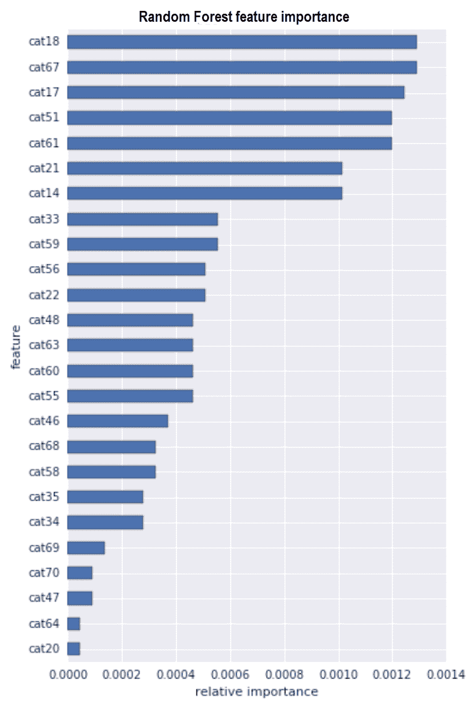

图 11：随机森林类别特征重要性

从前面的图表中可以清楚地看出，类别特征`cat20`、`cat64`、`cat47`和`cat69`的重要性较低。因此，删除这些特征并重新训练随机森林模型，以观察更好的表现是有意义的。

现在，让我们看看连续特征与损失列的相关性及其贡献。从下图中可以看到，所有连续特征与损失列之间都有正相关关系。这也意味着，这些连续特征与我们在前面图中看到的类别特征相比并不那么重要：

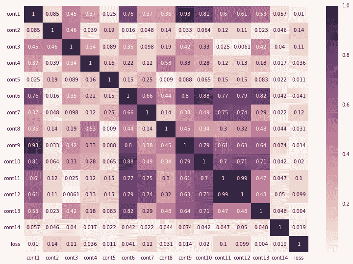

图 12：连续特征与标签之间的相关性

从这两个分析中我们可以得出结论：我们可以简单地删除一些不重要的列，并训练随机森林模型，观察训练集和验证集的 MAE 值是否有所减少。最后，让我们对测试集进行预测：

```py
println("Run prediction on the test set") 
cvModel.transform(Preproessing.testData) 
      .select("id", "prediction") 
      .withColumnRenamed("prediction", "loss") 
      .coalesce(1) // to get all the predictions in a single csv file                 
      .write.format("com.databricks.spark.csv") 
      .option("header", "true") 
      .save("output/result_RF.csv") 
```

此外，与 LR（逻辑回归）类似，您可以通过调用`stop()`方法停止 Spark 会话。现在生成的`result_RF.csv`文件应该包含每个 ID（即索赔）的损失。

# 比较分析与模型部署

你已经看到，LR 模型对于小型训练数据集来说训练起来要容易得多。然而，与 GBT（梯度提升树）和随机森林模型相比，我们并没有看到更好的准确性。然而，LR 模型的简洁性是一个非常好的起点。另一方面，我们已经讨论过，随机森林在许多方面都会胜过 GBT。让我们在表格中查看结果：

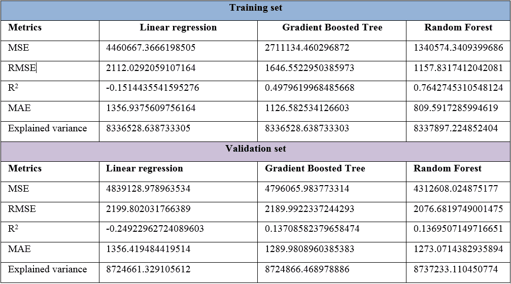

现在，让我们看看每个模型对于 20 起事故或损害索赔的预测情况：

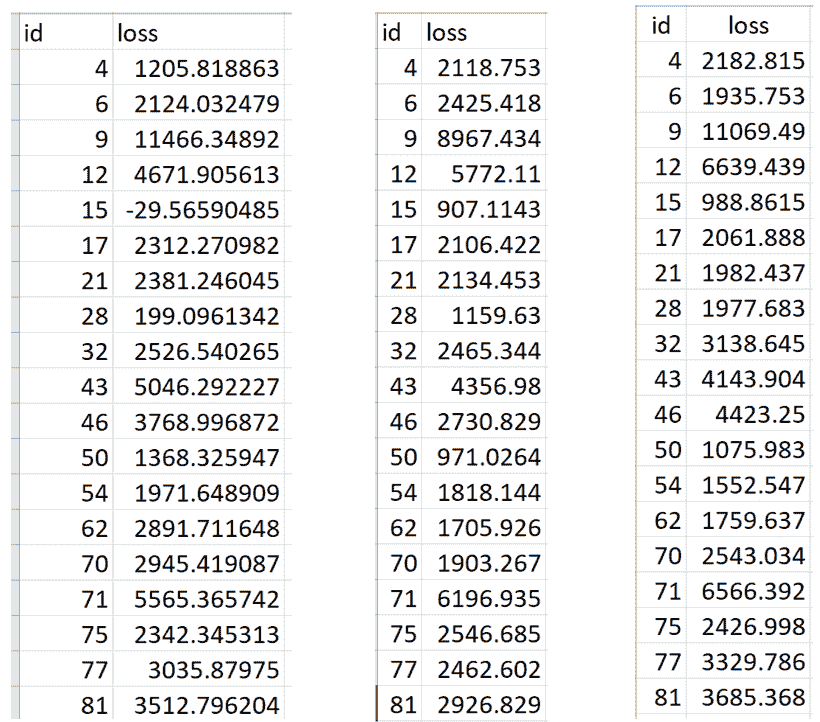

图 13：i) 线性回归（LR）、ii) 梯度提升树（GBT）和 iii) 随机森林模型的损失预测

因此，根据表 2，我们可以清楚地看到，我们应该选择随机森林回归模型（Random Forest regressor）来预测保险理赔损失以及其生产情况。现在我们将简要概述如何将我们最好的模型，即随机森林回归模型投入生产。这个想法是，作为数据科学家，你可能已经训练了一个机器学习模型，并将其交给公司中的工程团队进行部署，以便在生产环境中使用。

在这里，我提供了一种简单的方法，尽管 IT 公司肯定有自己的模型部署方式。尽管如此，本文的最后会有专门的章节。通过使用模型持久化功能——即 Spark 提供的保存和加载模型的能力，这种场景完全可以变为现实。通过 Spark，你可以选择：

+   保存和加载单一模型

+   保存并加载整个工作流

单一模型相对简单，但效果较差，主要适用于基于 Spark MLlib 的模型持久化。由于我们更关心保存最好的模型，也就是随机森林回归模型，我们首先将使用 Scala 拟合一个随机森林回归模型，保存它，然后再使用 Scala 加载相同的模型：

```py
// Estimator algorithm 
val model = new RandomForestRegressor() 
                    .setFeaturesCol("features") 
                    .setLabelCol("label") 
                    .setImpurity("gini") 
                    .setMaxBins(20) 
                    .setMaxDepth(20) 
                    .setNumTrees(50) 
fittedModel = rf.fit(trainingData) 
```

现在我们可以简单地调用`write.overwrite().save()`方法将该模型保存到本地存储、HDFS 或 S3，并使用加载方法将其重新加载以便将来使用：

```py
fittedModel.write.overwrite().save("model/RF_model")  
val sameModel = CrossValidatorModel.load("model/RF_model") 
```

现在我们需要知道的是如何使用恢复后的模型进行预测。答案如下：

```py
sameModel.transform(Preproessing.testData) 
    .select("id", "prediction") 
    .withColumnRenamed("prediction", "loss") 
    .coalesce(1) 
    .write.format("com.databricks.spark.csv") 
    .option("header", "true") 
    .save("output/result_RF_reuse.csv") 
```

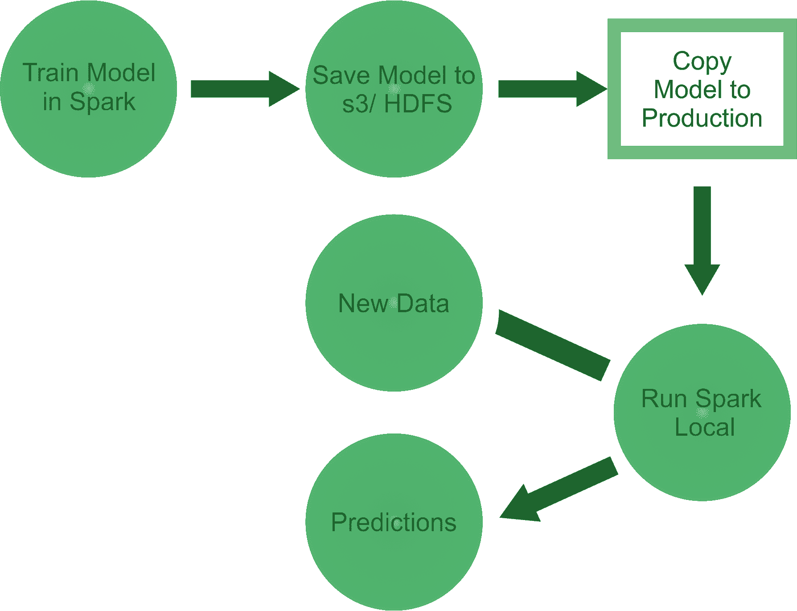

图 14：Spark 模型在生产中的部署

到目前为止，我们只看过如何保存和加载单一的机器学习模型，但没有涉及调优或稳定的模型。这个模型可能甚至会给你很多错误的预测。因此，现在第二种方法可能更有效。

现实情况是，在实际操作中，机器学习工作流包括多个阶段，从特征提取和转换到模型拟合和调优。Spark ML 提供了工作流帮助工具，以帮助用户构建这些工作流。类似地，带有交叉验证模型的工作流也可以像我们在第一种方法中做的那样保存和恢复。

我们用训练集对交叉验证后的模型进行拟合：

```py
val cvModel = cv.fit(Preproessing.trainingData)   
```

然后我们保存工作流/流水线：

```py
cvModel.write.overwrite().save("model/RF_model") 
```

请注意，前面的代码行将把模型保存在你选择的位置，并具有以下目录结构：

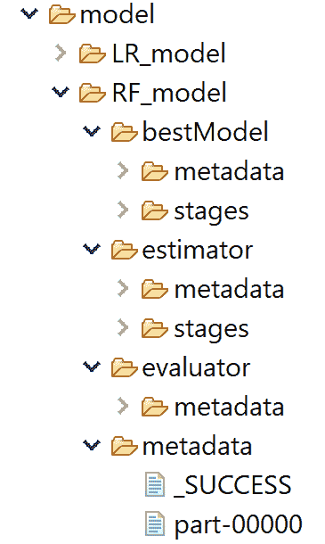

图 15：保存的模型目录结构

```py
//Then we restore the same model back:
val sameCV = CrossValidatorModel.load("model/RF_model") 
Now when you try to restore the same model, Spark will automatically pick the best one. Finally, we reuse this model for making a prediction as follows:
sameCV.transform(Preproessing.testData) 
      .select("id", "prediction") 
      .withColumnRenamed("prediction", "loss") 
      .coalesce(1) 
      .write.format("com.databricks.spark.csv") 
      .option("header", "true") 
      .save("output/result_RF_reuse.csv")  
```

# 基于 Spark 的模型部署用于大规模数据集

在生产环境中，我们常常需要以规模化的方式部署预训练模型。尤其是当我们需要处理大量数据时，我们的 ML 模型必须解决这个可扩展性问题，以便持续执行并提供更快速的响应。为了克服这个问题，Spark 为我们带来的一大大数据范式就是引入了内存计算（尽管它支持磁盘操作），以及缓存抽象。

这使得 Spark 非常适合大规模数据处理，并使得计算节点能够通过访问多个计算节点上的相同输入数据，执行多个操作，无论是在计算集群还是云计算基础设施中（例如，Amazon AWS、DigitalOcean、Microsoft Azure 或 Google Cloud）。为此，Spark 支持四种集群管理器（不过最后一个仍然处于实验阶段）：

+   **Standalone**: Spark 附带的简单集群管理器，使得设置集群变得更加容易。

+   **Apache Mesos**: 一个通用的集群管理器，也可以运行 Hadoop MapReduce 和服务应用程序。

+   **Hadoop YARN**: Hadoop 2 中的资源管理器。

+   **Kubernetes（实验性）**: 除了上述内容外，还支持 Kubernetes 的实验性功能。Kubernetes 是一个开源平台，用于提供容器为中心的基础设施。更多信息请见 [`spark.apache.org/docs/latest/cluster-overview.html`](https://spark.apache.org/docs/latest/cluster-overview.html)。

你可以将输入数据集上传到 **Hadoop 分布式文件系统**（**HDFS**）或 **S3** 存储中，以实现高效计算和低成本存储大数据。然后，Spark 的 bin 目录中的 `spark-submit` 脚本将用于在任意集群模式下启动应用程序。它可以通过统一的接口使用所有集群管理器，因此你不需要为每个集群专门配置应用程序。

然而，如果你的代码依赖于其他项目，那么你需要将它们与应用程序一起打包，以便将代码分发到 Spark 集群中。为此，创建一个包含你的代码及其依赖项的 assembly jar 文件（也称为 `fat` 或 `uber` jar）。然后将代码分发到数据所在的地方，并执行 Spark 作业。`SBT` 和 `Maven` 都有 assembly 插件，可以帮助你准备这些 jar 文件。

在创建 assembly jar 文件时，也需要将 Spark 和 Hadoop 列为依赖项。这些依赖项不需要打包，因为它们会在运行时由集群管理器提供。创建了合并的 jar 文件后，可以通过以下方式传递 jar 来调用脚本：

```py
  ./bin/spark-submit \
      --class <main-class> \
      --master <master-url> \
      --deploy-mode <deploy-mode> \
      --conf <key>=<value> \
       ... # other options
       <application-jar> \
       [application-arguments]
```

在上面的命令中，列出了以下一些常用的选项：

+   `--class`: 应用程序的入口点（例如，`org.apache.spark.examples.SparkPi`）。

+   `--master`: 集群的主 URL（例如，`spark://23.195.26.187:7077`）。

+   `--deploy-mode`: 是否将驱动程序部署在工作节点（集群）上，还是作为外部客户端在本地部署。

+   `--conf`: 任意的 Spark 配置属性，采用 key=value 格式。

+   `application-jar`：包含你的应用程序和所有依赖项的捆绑 jar 文件的路径。URL 必须在你的集群中全局可见，例如，`hdfs://` 路径或在所有节点上都存在的 `file://` 路径。

+   `application-arguments`：传递给主类主方法的参数（如果有的话）。

例如，你可以在客户端部署模式下，在 Spark 独立集群上运行 `AllstateClaimsSeverityRandomForestRegressor` 脚本，如下所示：

```py
./bin/spark-submit \
   --class com.packt.ScalaML.InsuranceSeverityClaim.AllstateClaimsSeverityRandomForestRegressor\
   --master spark://207.184.161.138:7077 \
   --executor-memory 20G \
   --total-executor-cores 100 \
   /path/to/examples.jar
```

如需更多信息，请参见 Spark 网站：[`spark.apache.org/docs/latest/submitting-applications.html`](https://spark.apache.org/docs/latest/submitting-applications.html)。不过，你也可以从在线博客或书籍中找到有用的信息。顺便提一下，我在我最近出版的一本书中详细讨论了这个话题：Md. Rezaul Karim, Sridhar Alla, **Scala 和 Spark 在大数据分析中的应用**，Packt Publishing Ltd. 2017。更多信息请见：[`www.packtpub.com/big-data-and-business-intelligence/scala-and-spark-big-data-analytics`](https://www.packtpub.com/big-data-and-business-intelligence/scala-and-spark-big-data-analytics)。

无论如何，我们将在接下来的章节中学习更多关于如何在生产环境中部署 ML 模型的内容。因此，这一章就写到这里。

# 总结

在本章中，我们已经学习了如何使用一些最广泛使用的回归算法开发用于分析保险严重性索赔的预测模型。我们从简单的线性回归（LR）开始。然后我们看到如何通过使用 GBT 回归器来提升性能。接着，我们体验了使用集成技术（如随机森林回归器）来提高性能。最后，我们进行了这些模型之间的性能对比分析，并选择了最佳模型来部署到生产环境中。

在下一章中，我们将介绍一个新的端到端项目，名为 *电信客户流失分析与预测*。流失预测对于企业至关重要，因为它可以帮助你发现那些可能取消订阅、产品或服务的客户。它还可以最大限度地减少客户流失。通过预测哪些客户更有可能取消服务订阅，达到了这一目的。
