# 第二章：分析与预测电信行业流失

在这一章中，我们将开发一个**机器学习**（**ML**）项目，用于分析和预测客户是否可能取消其电信合同的订阅。此外，我们还将对数据进行一些初步分析，仔细查看哪些客户特征通常与这种流失相关。

广泛使用的分类算法，如决策树、随机森林、逻辑回归和**支持向量机**（**SVM**），将用于分析和做出预测。最终，读者将能够选择最适合生产环境的最佳模型。

简而言之，在这个端到端的项目中，我们将学习以下主题：

+   为什么以及如何进行流失预测？

+   基于逻辑回归的流失预测

+   基于 SVM 的流失预测

+   基于决策树的流失预测

+   基于随机森林的流失预测

+   选择最佳模型进行部署

# 为什么我们要进行流失分析，如何进行流失分析？

**客户流失**是指客户或顾客的流失（也称为**客户流失率**、客户流动率或客户弃用）。这一概念最初用于电信行业，当时许多用户转向其他服务提供商。然而，这已成为其他业务领域的重要问题，如银行、互联网服务提供商、保险公司等。嗯，流失的主要原因之一是客户不满，以及竞争对手提供更便宜或更好的优惠。

如你在*图 1*中所见，商业行业中与客户可能签订的合同有四种类型：契约性合同、非契约性合同、自愿性合同和非自愿性合同。客户流失的全部成本包括失去的收入以及与用新客户替代这些流失客户所涉及的（电）营销成本。然而，这种类型的损失可能会给企业带来巨大的损失。想想十年前，当诺基亚是手机市场的霸主时，突然，苹果发布了 iPhone 3G，这标志着智能手机时代的革命。接着，大约 10%到 12%的客户停止使用诺基亚，转而选择了 iPhone。虽然后来诺基亚也尝试推出智能手机，但最终，它们无法与苹果竞争：

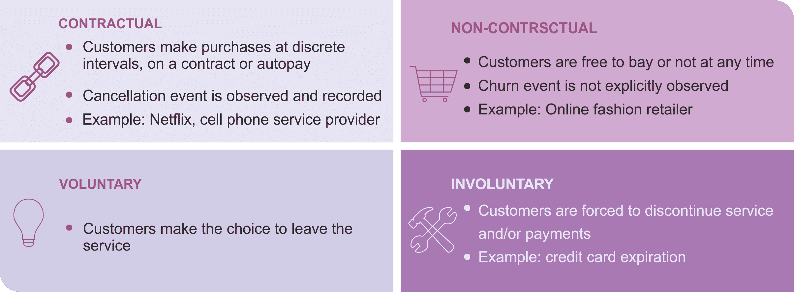

图 1：与客户可能签订的四种合同类型

流失预测对企业至关重要，因为它能帮助企业检测出可能取消订阅、产品或服务的客户。它还可以最大限度地减少客户流失。通过预测哪些客户可能取消订阅服务，企业可以为这些客户（可能取消订阅的客户）提供特别优惠或计划。这样，企业就可以减少流失率。这应该是每个在线业务的关键目标。

在员工流失预测方面，典型的任务是确定哪些因素预测员工离职。这类预测过程依赖于大量数据，通常需要利用先进的机器学习技术。然而，在本章中，我们将主要关注客户流失的预测和分析。为此，应该分析多个因素，以便理解客户行为，包括但不限于：

+   客户的基本信息数据，如年龄、婚姻状况等

+   客户的社交媒体情感分析

+   从点击流日志中获取的浏览行为

+   显示行为模式的历史数据，提示可能的客户流失

+   客户的使用模式和地理位置使用趋势

+   通话圈数据和支持呼叫中心统计信息

# 开发一个流失分析管道

在机器学习中，我们将算法的表现分为两个阶段：学习和推理。学习阶段的最终目标是准备和描述可用数据，也称为**特征向量**，它用于训练模型。

学习阶段是最重要的阶段之一，但也是极其耗时的。它包括从经过转换的训练数据中准备特征向量（也称为特征向量，表示每个特征值的数字向量），以便我们可以将其输入到学习算法中。另一方面，训练数据有时也包含一些不纯净的信息，需要一些预处理，例如清理。

一旦我们拥有特征向量，接下来的步骤是准备（或编写/重用）学习算法。下一个重要步骤是训练算法，以准备预测模型。通常，（当然根据数据大小），运行一个算法可能需要几个小时（甚至几天），以使特征收敛为有用的模型，如下图所示：

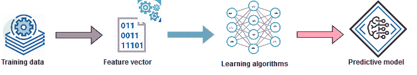

图 2：学习和训练预测模型 - 展示了如何从训练数据中生成特征向量，进而训练学习算法，最终产生预测模型

第二个最重要的阶段是推理，它用于智能地利用模型，例如对从未见过的数据进行预测、提供推荐、推断未来规则等。通常，与学习阶段相比，推理所需的时间较短，有时甚至是实时的。因此，推理的核心是通过新的（即未观察过的）数据测试模型，并评估模型本身的表现，如下图所示：

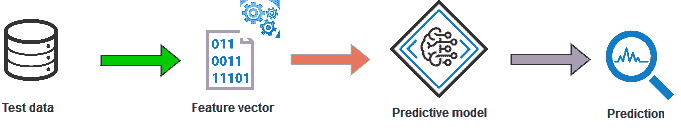

图 3：从现有模型进行推理以进行预测分析（特征向量由未知数据生成，用于做出预测）

然而，在整个过程中，为了使预测模型成功，数据在所有机器学习任务中都是至关重要的。考虑到这一点，下面的图表展示了电信公司可以使用的分析管道：

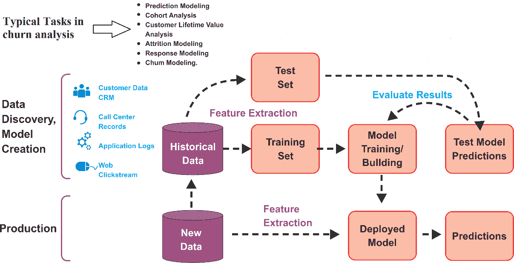

图 4：流失分析管道

通过这种分析，电信公司可以辨别如何预测并改善客户体验，从而防止客户流失并量身定制营销活动。在实际操作中，这类商业评估通常用于留住最可能流失的客户，而非那些可能留下的客户。

因此，我们需要开发一个预测模型，确保我们的模型对 `Churn = True` 样本具有敏感性——这是一个二分类问题。我们将在接下来的章节中详细探讨。

# 数据集描述

**Orange Telecom 的客户流失数据集**，包含了清理后的客户活动数据（特征），以及一个流失标签，指示客户是否取消了订阅。我们将使用该数据集来开发我们的预测模型。可以通过以下链接分别下载 churn-80 和 churn-20 数据集：

+   [`bml-data.s3.amazonaws.com/churn-bigml-80.csv`](https://bml-data.s3.amazonaws.com/churn-bigml-80.csv)

+   [`bml-data.s3.amazonaws.com/churn-bigml-20.csv`](https://bml-data.s3.amazonaws.com/churn-bigml-20.csv)

然而，由于更多的数据对于开发机器学习模型通常是有利的，因此我们将使用较大的数据集（即 churn-80）进行训练和交叉验证，使用较小的数据集（即 churn-20）进行最终测试和模型性能评估。

请注意，后者数据集仅用于评估模型（即用于演示目的）。在生产环境中，电信公司可以使用自己的数据集，经过必要的预处理和特征工程。该数据集的结构如下：

+   **州**: `String`

+   **账户时长**: `Integer`

+   **区号**: `Integer`

+   **国际计划**: `String`

+   **语音邮件计划**: `String`

+   **电子邮件消息数量**: `Integer`

+   **总白天分钟数**: `Double`

+   **总白天电话数量**: `Integer`

+   **总白天费用**: `Double`

+   **总傍晚分钟数**: `Double`

+   **总傍晚电话数量**: `Integer`

+   **总傍晚费用**: `Double`

+   **总夜间通话分钟数**: `Double`

+   **总夜间电话数量**: `Integer`

+   **总夜间费用**: `Double`

+   **总国际分钟数**: `Double`

+   **总国际电话数量**: `Integer`

+   **总国际费用**: `Double`

+   **客户服务电话**: `Integer`

# 探索性分析与特征工程

在这一小节中，我们将在开始预处理和特征工程之前，对数据集进行一些探索性数据分析（EDA）。只有在此之后，创建分析管道才有意义。首先，让我们导入必要的软件包和库，代码如下：

```py
import org.apache.spark._
import org.apache.spark.sql.functions._
import org.apache.spark.sql.types._
import org.apache.spark.sql._
import org.apache.spark.sql.Dataset
```

然后，让我们指定数据集的来源和模式。当将数据加载到 DataFrame 时，我们可以指定模式。这一指定相比于 Spark 2.x 之前的模式推断提供了优化的性能。

首先，我们创建一个包含所有字段的 Scala 案例类。变量名一目了然：

```py
case class CustomerAccount(state_code: String, 
    account_length: Integer, 
    area_code: String, 
    international_plan: String, 
    voice_mail_plan: String, 
    num_voice_mail: Double, 
    total_day_mins: Double, 
    total_day_calls: Double, 
    total_day_charge: Double,
    total_evening_mins: Double, 
    total_evening_calls: Double, 
    total_evening_charge: Double,
    total_night_mins: Double, 
    total_night_calls: Double, 
    total_night_charge: Double,
    total_international_mins: Double, 
    total_international_calls: Double, 
    total_international_charge: Double,
    total_international_num_calls: Double, 
    churn: String)
```

现在，让我们创建一个自定义模式，结构与我们已创建的数据源相似，如下所示：

```py
val schema = StructType(Array(
    StructField("state_code", StringType, true),
    StructField("account_length", IntegerType, true),
    StructField("area_code", StringType, true),
    StructField("international_plan", StringType, true),
    StructField("voice_mail_plan", StringType, true),
    StructField("num_voice_mail", DoubleType, true),
    StructField("total_day_mins", DoubleType, true),
    StructField("total_day_calls", DoubleType, true),
    StructField("total_day_charge", DoubleType, true),
    StructField("total_evening_mins", DoubleType, true),
    StructField("total_evening_calls", DoubleType, true),
    StructField("total_evening_charge", DoubleType, true),
    StructField("total_night_mins", DoubleType, true),
    StructField("total_night_calls", DoubleType, true),
    StructField("total_night_charge", DoubleType, true),
    StructField("total_international_mins", DoubleType, true),
    StructField("total_international_calls", DoubleType, true),
    StructField("total_international_charge", DoubleType, true),
    StructField("total_international_num_calls", DoubleType, true),
    StructField("churn", StringType, true)
))
```

让我们创建一个 Spark 会话并导入`implicit._`，以便我们指定 DataFrame 操作，如下所示：

```py
val spark: SparkSession = SparkSessionCreate.createSession("preprocessing")
import spark.implicits._
```

现在，让我们创建训练集。我们使用 Spark 推荐的格式`com.databricks.spark.csv`读取 CSV 文件。我们不需要显式的模式推断，因此将推断模式设置为 false，而是需要我们之前创建的自定义模式。接着，我们从所需位置加载数据文件，最后指定数据源，确保我们的 DataFrame 与我们指定的结构完全一致：

```py
val trainSet: Dataset[CustomerAccount] = spark.read.
        option("inferSchema", "false")
        .format("com.databricks.spark.csv")
        .schema(schema)
        .load("data/churn-bigml-80.csv")
        .as[CustomerAccount]
```

现在，让我们看看模式是什么样的：

```py
trainSet.printSchema()
>>>
```

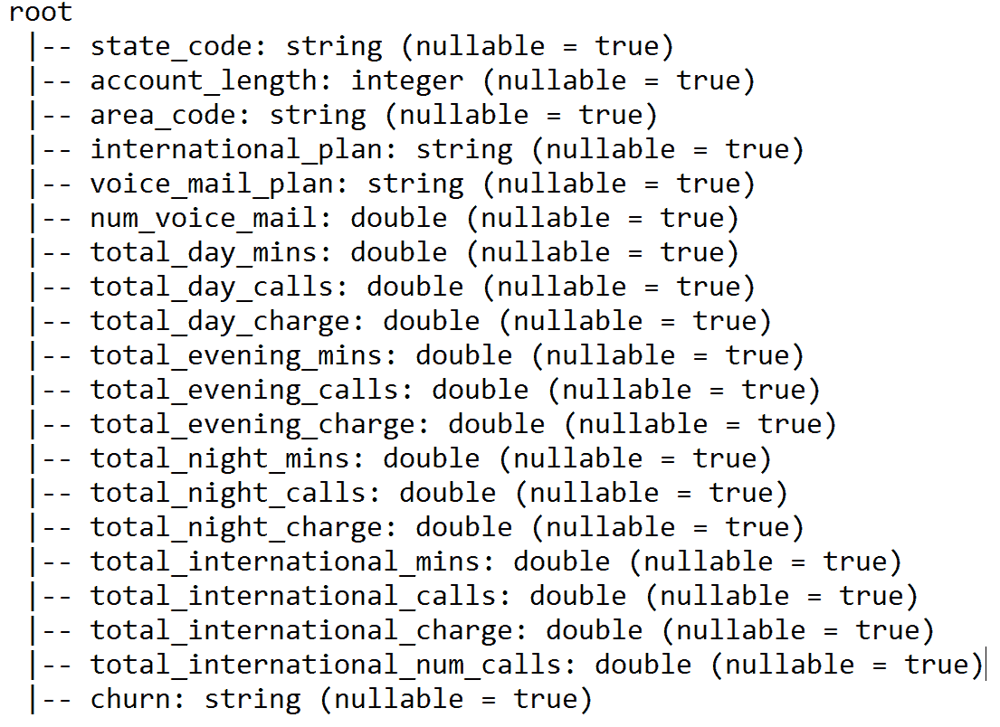

太棒了！它看起来与数据结构完全相同。现在让我们使用`show()`方法查看一些示例数据，如下所示：

```py
trainSet.show()
>>>
```

在下图中，列名已被缩短，以便在图中显示：

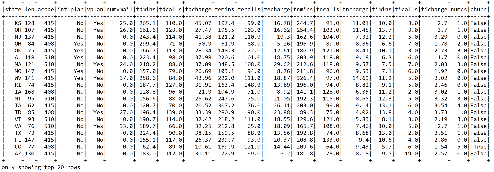

我们还可以使用 Spark 的`describe()`方法查看训练集的相关统计数据：

`describe()`方法是 Spark DataFrame 的内置方法，用于统计处理。它对所有数值列应用汇总统计计算，最后将计算值作为单个 DataFrame 返回。

```py
val statsDF = trainSet.describe()
statsDF.show()
>>>
```

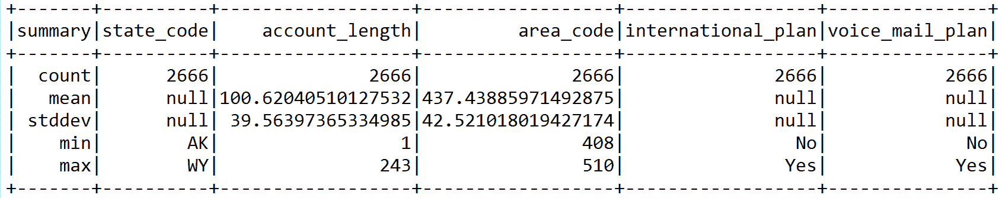

如果这个数据集可以装入内存，我们可以使用 Spark 的`cache()`方法将其缓存，以便快速和重复地访问：

```py
trainSet.cache()
```

让我们查看一些有用的属性，比如与流失（churn）的变量相关性。例如，看看流失与国际通话总数之间的关系：

```py
trainSet.groupBy("churn").sum("total_international_num_calls").show()
>>>
+-----+----------------------------------+
churn|sum(total_international_num_calls)|
+-----+----------------------------------+
|False| 3310.0|
| True| 856.0|
+-----+----------------------------------+
```

让我们看看流失与国际通话费用总额之间的关系：

```py
trainSet.groupBy("churn").sum("total_international_charge").show()
 >>>
+-----+-------------------------------+
|churn|sum(total_international_charge)|
+-----+-------------------------------+
|False| 6236.499999999996|
| True| 1133.63|
+-----+-------------------------------+
```

既然我们还需要准备测试集来评估模型，让我们准备与训练集相似的测试集，如下所示：

```py
val testSet: Dataset[CustomerAccount] = 
    spark.read.
    option("inferSchema", "false")
    .format("com.databricks.spark.csv")
    .schema(schema)
    .load("data/churn-bigml-20.csv")
    .as[CustomerAccount]
```

现在，让我们将它们缓存，以便更快地进行进一步操作：

```py
testSet.cache()
```

现在，让我们查看一些训练集的相关属性，以了解它是否适合我们的目的。首先，我们为当前会话创建一个临时视图以用于持久化。我们可以创建一个目录作为接口，用于创建、删除、修改或查询底层数据库、表、函数等：

```py
trainSet.createOrReplaceTempView("UserAccount")
spark.catalog.cacheTable("UserAccount")
```

按照流失标签对数据进行分组并计算每个组中的实例数量，显示出假流失样本大约是实际流失样本的六倍。让我们使用以下代码验证这一说法：

```py
trainSet.groupBy("churn").count.show()
>>>
+-----+-----+
|churn|count|
+-----+-----+
|False| 2278|
| True| 388 |
+-----+-----+
```

我们还可以看到前面的语句，使用 Apache Zeppelin 验证过的（有关如何配置和入门的更多细节，请参见第八章，*在银行营销中使用深度信念网络*），如下所示：

```py
spark.sqlContext.sql("SELECT churn,SUM(international_num_calls) as Total_intl_call FROM UserAccount GROUP BY churn").show()
>>>
```

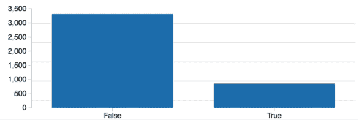

如我们所述，在大多数情况下，目标是保留那些最有可能流失的客户，而不是那些可能会留下或已经留下的客户。这也意味着我们应该准备我们的训练集，确保我们的 ML 模型能够敏感地识别真正的流失样本——即，标记为流失（True）的样本。

我们还可以观察到，前面的训练集高度不平衡。因此，使用分层抽样将两种样本类型放在同等基础上是可行的。当提供每种样本类型的返回比例时，可以使用 `sampleBy()` 方法来实现。

在这里，我们保留了所有 `True` 流失类的实例，但将 `False` 流失类下采样至 *388/2278*，约为 `0.1675`：

```py
val fractions = Map("False" -> 0.1675, "True" -> 1.0)
```

这样，我们也仅映射了 `True` 流失样本。现在，让我们为仅包含下采样样本的训练集创建一个新的 DataFrame：

```py
val churnDF = trainSet.stat.sampleBy("churn", fractions, 12345L)
```

第三个参数是用于可重复性目的的种子值。现在让我们来看一下：

```py
churnDF.groupBy("churn").count.show()
>>>
+-----+-----+
|churn|count|
+-----+-----+
|False| 390|
| True| 388|
+-----+-----+
```

现在让我们看看变量之间的关系。让我们查看白天、夜晚、傍晚和国际语音通话如何影响 `churn` 类别。只需执行以下代码：

```py
spark.sqlContext.sql("SELECT churn, SUM(total_day_charge) as TDC, SUM(total_evening_charge) as TEC,    
                      SUM(total_night_charge) as TNC, SUM(total_international_charge) as TIC,  
                      SUM(total_day_charge) + SUM(total_evening_charge) + SUM(total_night_charge) + 
                      SUM(total_international_charge) as Total_charge FROM UserAccount GROUP BY churn 
                      ORDER BY Total_charge DESC")
.show()
>>>
```

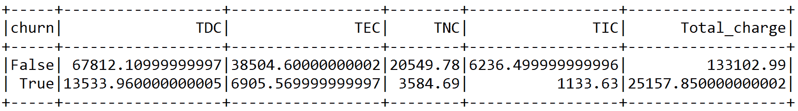

在 Apache Zeppelin 上，可以看到如下的前置结果：

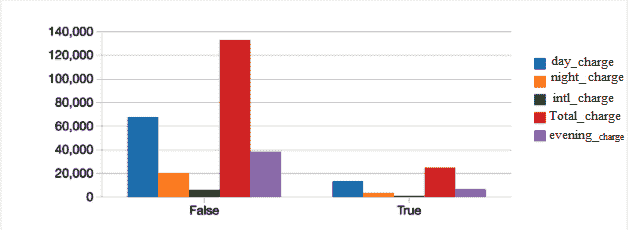

现在，让我们看看白天、夜晚、傍晚和国际语音通话分别对 `churn` 类别的前置总费用贡献了多少。只需执行以下代码：

```py
spark.sqlContext.sql("SELECT churn, SUM(total_day_mins) 
                      + SUM(total_evening_mins) + SUM(total_night_mins) 
                      + SUM(total_international_mins) as Total_minutes 
                    FROM UserAccount GROUP BY churn").show()
>>>
```


在 Apache Zeppelin 上，可以看到如下的前置结果：

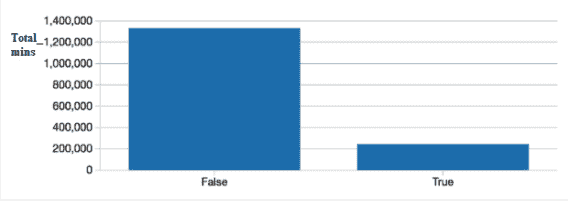

从前面的两张图表和表格可以清楚地看出，总白天通话分钟数和总白天费用是这个训练集中的高度相关特征，这对我们的 ML 模型训练并不有利。因此，最好将它们完全去除。此外，以下图表展示了所有可能的相关性（虽然是用 PySpark 绘制的）：

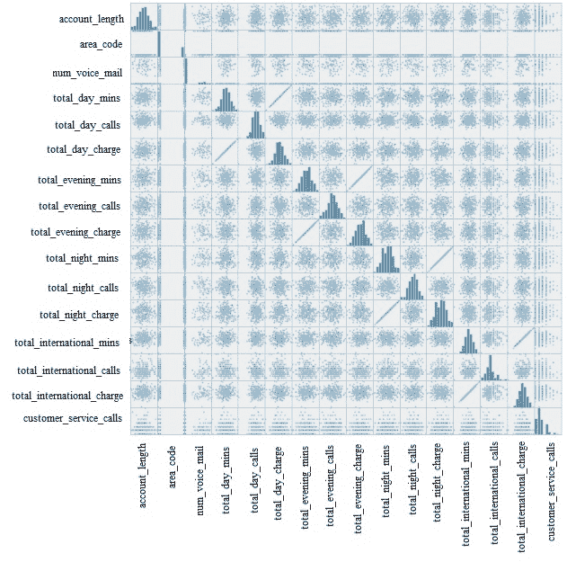

图 5：包含所有特征的相关矩阵

让我们丢弃每对相关字段中的一列，同时也丢弃**State**和**Area code**列，因为这些列也不会使用：

```py
val trainDF = churnDF
    .drop("state_code")
    .drop("area_code")
    .drop("voice_mail_plan")
    .drop("total_day_charge")
    .drop("total_evening_charge")
```

很好。最后，我们得到了可以用于更好的预测建模的训练 DataFrame。让我们看一下结果 DataFrame 的一些列：

```py
trainDF.select("account_length", "international_plan", "num_voice_mail",         
               "total_day_calls","total_international_num_calls", "churn")
.show(10)
>>>
```

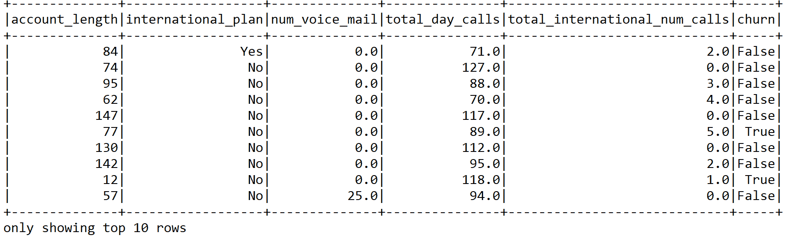

然而，我们还没有完成；当前的 DataFrame 不能作为估算器输入给模型。如我们所描述的，Spark ML API 要求我们的数据必须转换为 Spark DataFrame 格式，包含标签（Double 类型）和特征（Vector 类型）。

现在，我们需要创建一个管道来传递数据，并将多个变换器和估算器连接起来。这个管道随后作为特征提取器工作。更具体地说，我们已经准备好了两个`StringIndexer`变换器和一个`VectorAssembler`。

`StringIndexer`将一个分类标签列编码为标签索引列（即数字）。如果输入列是数字类型，我们必须将其转换为字符串并对字符串值进行索引。其他 Spark 管道组件，如估算器或变换器，都会利用这个字符串索引标签。为了做到这一点，组件的输入列必须设置为这个字符串索引列的名称。在许多情况下，你可以使用`setInputCol`来设置输入列。有兴趣的读者可以参考这个[`spark.apache.org/docs/latest/ml-features.html`](https://spark.apache.org/docs/latest/ml-features.html)以获取更多详情。

第一个`StringIndexer`将分类特征`international_plan`和标签转换为数字索引。第二个`StringIndexer`将分类标签（即`churn`）转换为数字。通过这种方式，索引化的分类特征使得决策树和随机森林等分类器能够适当处理分类特征，从而提高性能。

现在，添加以下代码行，对标签列进行索引标签和元数据处理。在整个数据集上进行拟合，以确保所有标签都包括在索引中：

```py
val ipindexer = new StringIndexer()
    .setInputCol("international_plan")
    .setOutputCol("iplanIndex")

val labelindexer = new StringIndexer()
    .setInputCol("churn")
    .setOutputCol("label")
```

现在我们需要提取对分类最有贡献的最重要特征。由于我们已经删除了一些列，结果列集包含以下字段：

```py
* Label → churn: True or False
* Features → {("account_length", "iplanIndex", "num_voice_mail", "total_day_mins", "total_day_calls", "total_evening_mins", "total_evening_calls", "total_night_mins", "total_night_calls", "total_international_mins", "total_international_calls", "total_international_num_calls"}
```

由于我们已经使用`StringIndexer`将分类标签转换为数字，接下来的任务是提取特征：

```py
val featureCols = Array("account_length", "iplanIndex", 
                        "num_voice_mail", "total_day_mins", 
                        "total_day_calls", "total_evening_mins", 
                        "total_evening_calls", "total_night_mins", 
                        "total_night_calls", "total_international_mins", 
                        "total_international_calls", "total_international_num_calls")
```

现在，让我们将特征转换为特征向量，特征向量是表示每个特征值的数字向量。在我们的例子中，我们将使用`VectorAssembler`。它将所有的`featureCols`合并/转换成一个名为**features**的单列：

```py
val assembler = new VectorAssembler()
    .setInputCols(featureCols)
    .setOutputCol("features")
```

现在我们已经准备好了包含标签和特征向量的真实训练集，接下来的任务是创建一个估算器——管道的第三个元素。我们从一个非常简单但强大的逻辑回归分类器开始。

# 用于流失预测的 LR

LR 是预测二元响应最常用的分类器之一。它是一种线性机器学习方法，正如在第一章中所描述的，*分析保险严重性理赔*。`loss`函数是由逻辑损失给出的公式：

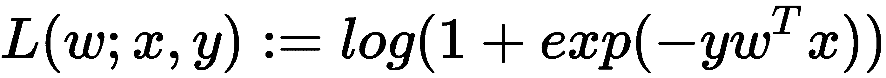

对于 LR 模型，`loss` 函数是逻辑损失函数。对于二分类问题，该算法输出一个二元 LR 模型，对于给定的新数据点，记为 *x*，该模型通过应用逻辑函数进行预测：

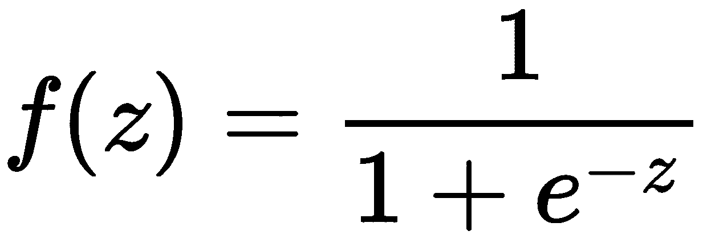

在上述方程中，*z = W^TX*，如果 *f(W^TX)>0.5*，则结果为正；否则为负。

请注意，LR 模型的原始输出 *f(z)* 具有概率解释。

请注意，与线性回归相比，逻辑回归为你提供了更高的分类精度。此外，它是一种灵活的方式来对模型进行正则化，以进行自定义调整，总体而言，模型的响应是概率的度量。

最重要的是，尽管线性回归只能预测连续值，线性回归仍然足够通用，可以预测离散值：

```py
import org.apache.spark._
import org.apache.spark.sql.SparkSession
import org.apache.spark.sql.functions._
import org.apache.spark.ml.classification.{BinaryLogisticRegressionSummary, LogisticRegression, LogisticRegressionModel}
import org.apache.spark.ml.Pipeline
import org.apache.spark.ml.tuning.{ParamGridBuilder, CrossValidator}
import org.apache.spark.mllib.evaluation.BinaryClassificationMetrics 
import org.apache.spark.ml.evaluation.BinaryClassificationEvaluator
```

既然我们已经知道线性回归的工作原理，让我们开始使用基于 Spark 的线性回归实现。首先，让我们导入所需的包和库。

现在，让我们创建一个 Spark 会话并导入隐式转换：

```py
val spark: SparkSession = SparkSessionCreate.createSession("ChurnPredictionLogisticRegression")
import spark.implicits._
```

我们现在需要定义一些超参数来训练基于线性回归的管道：

```py
val numFolds = 10
val MaxIter: Seq[Int] = Seq(100)
val RegParam: Seq[Double] = Seq(1.0) // L2 regularization param, set 1.0 with L1 regularization
val Tol: Seq[Double] = Seq(1e-8)// for convergence tolerance for iterative algorithms
val ElasticNetParam: Seq[Double] = Seq(0.0001) //Combination of L1 & L2
```

`RegParam` 是一个标量，用于调整约束的强度：较小的值表示软边界，因此，自然地，较大的值表示硬边界，而无限大则是最硬的边界。

默认情况下，LR 执行 L2 正则化，正则化参数设置为 1.0。相同的模型执行 L1 正则化变种的 LR，正则化参数（即 `RegParam`）设置为 0.10。弹性网络是 L1 和 L2 正则化的组合。

另一方面，`Tol` 参数用于迭代算法（如逻辑回归或线性支持向量机）的收敛容忍度。现在，一旦我们定义并初始化了超参数，接下来的任务是实例化一个线性回归估算器，如下所示：

```py
val lr = new LogisticRegression()
    .setLabelCol("label")
    .setFeaturesCol("features")
```

现在，我们已经有了三个变换器和一个估算器，接下来的任务是将它们串联成一个单一的管道——即，它们每一个都作为一个阶段：

```py
val pipeline = new Pipeline()
    .setStages(Array(PipelineConstruction.ipindexer,
    PipelineConstruction.labelindexer,
    PipelineConstruction.assembler, lr))
```

为了在超参数空间上执行这样的网格搜索，我们需要先定义它。在这里，Scala 的函数式编程特性非常方便，因为我们只需将函数指针和要评估的相应参数添加到参数网格中，在该网格中你设置要测试的参数，并使用交叉验证评估器来构建一个模型选择工作流。这将搜索线性回归的最大迭代次数、正则化参数、容忍度和弹性网络，以找到最佳模型：

```py
val paramGrid = new ParamGridBuilder()
    .addGrid(lr.maxIter, MaxIter)
    .addGrid(lr.regParam, RegParam)
    .addGrid(lr.tol, Tol)
    .addGrid(lr.elasticNetParam, ElasticNetParam)
    .build()
```

请注意，超参数形成了一个 n 维空间，其中*n*是超参数的数量。这个空间中的每个点是一个特定的超参数配置，即超参数向量。当然，我们无法探索该空间中的每个点，因此我们基本上做的是在该空间中对（希望均匀分布的）子集进行网格搜索。

然后我们需要定义一个`BinaryClassificationEvaluator`评估器，因为这是一个二分类问题。使用该评估器，模型将通过比较测试标签列与测试预测列，根据精度指标进行评估。默认的度量标准是精度-召回曲线下面积和**接收者操作特征**（**ROC**）曲线下面积：

```py
val evaluator = new BinaryClassificationEvaluator()
    .setLabelCol("label")
    .setRawPredictionCol("prediction")
```

我们使用`CrossValidator`进行最佳模型选择。`CrossValidator`使用估算器管道、参数网格和分类评估器。`CrossValidator`使用`ParamGridBuilder`来遍历线性回归的最大迭代次数、回归参数、容差和弹性网参数，然后评估模型，对于每个参数值重复 10 次以获得可靠结果——即进行 10 折交叉验证：

```py
val crossval = new CrossValidator()
    .setEstimator(pipeline)
    .setEvaluator(evaluator)
    .setEstimatorParamMaps(paramGrid)
    .setNumFolds(numFolds)
```

前面的代码旨在执行交叉验证。验证器本身使用`BinaryClassificationEvaluator`评估器来评估每一折中的训练，确保没有过拟合发生。

尽管后台有很多复杂操作，`CrossValidator`对象的接口依然简洁且熟悉，因为`CrossValidator`也继承自估算器，并支持 fit 方法。这意味着，在调用 fit 后，完整的预定义管道，包括所有特征预处理和 LR 分类器，将被多次执行——每次使用不同的超参数向量：

```py
val cvModel = crossval.fit(Preprocessing.trainDF)
```

现在是时候使用测试数据集评估我们创建的 LR 模型的预测能力了，该测试数据集此前未用于任何训练或交叉验证——也就是说，对模型来说是未见过的数据。第一步，我们需要将测试集转换为模型管道，这将根据我们在前述特征工程步骤中描述的相同机制映射特征：

```py
val predictions = cvModel.transform(Preprocessing.testSet)
al result = predictions.select("label", "prediction", "probability")
val resutDF = result.withColumnRenamed("prediction", "Predicted_label")
resutDF.show(10)
>>>
```

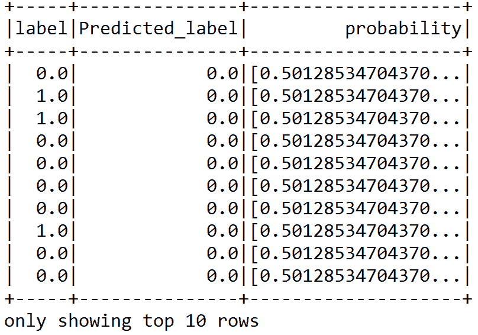

预测概率在根据客户的缺陷可能性进行排名时也非常有用。通过这种方式，电信业务可以利用有限的资源进行保留，并集中于最有价值的客户。

然而，看到之前的预测数据框，实际上很难猜测分类准确率。在第二步中，评估器通过`BinaryClassificationEvaluator`自行进行评估，如下所示：

```py
val accuracy = evaluator.evaluate(predictions)
println("Classification accuracy: " + accuracy)
>>>
Classification accuracy: 0.7670592565329408
```

所以，我们的二分类模型的分类准确率大约为 77%。现在，使用准确率来评估二分类器并没有太大意义。

因此，研究人员经常推荐其他性能指标，如精确度-召回率曲线下的面积和 ROC 曲线下的面积。然而，为此我们需要构建一个包含测试集原始得分的 RDD：

```py
val predictionAndLabels = predictions
    .select("prediction", "label")
    .rdd.map(x => (x(0).asInstanceOf[Double], x(1)
    .asInstanceOf[Double]))
```

现在，可以使用前述 RDD 来计算之前提到的两个性能指标：

```py
val metrics = new BinaryClassificationMetrics(predictionAndLabels)
println("Area under the precision-recall curve: " + metrics.areaUnderPR)
println("Area under the receiver operating characteristic (ROC) curve : " + metrics.areaUnderROC)
>>>
Area under the precision-recall curve: 0.5761887477313975
Area under the receiver operating characteristic (ROC) curve: 0.7670592565329408
```

在这种情况下，评估结果为 77% 的准确率，但只有 58% 的精确度。接下来，我们计算一些其他的性能指标；例如，假阳性、真阳性和假阴性预测对评估模型的性能也非常有用：

+   **真阳性**：模型正确预测订阅取消的频率

+   **假阳性**：模型错误预测订阅取消的频率

+   **真阴性**：模型正确预测没有取消的频率

+   **假阴性**：模型错误预测没有取消的频率

```py
val lp = predictions.select("label", "prediction")
val counttotal = predictions.count()
val correct = lp.filter($"label" === $"prediction").count()

val wrong = lp.filter(not($"label" === $"prediction")).count()
val ratioWrong = wrong.toDouble / counttotal.toDouble
val ratioCorrect = correct.toDouble / counttotal.toDouble

val truep = lp.filter($"prediction" === 0.0).filter($"label" ===
$"prediction").count() / counttotal.toDouble

val truen = lp.filter($"prediction" === 1.0).filter($"label" ===
$"prediction").count() / counttotal.toDouble

val falsep = lp.filter($"prediction" === 1.0).filter(not($"label" ===
$"prediction")).count() / counttotal.toDouble

val falsen = lp.filter($"prediction" === 0.0).filter(not($"label" ===
$"prediction")).count() / counttotal.toDouble

println("Total Count : " + counttotal)
println("Correct : " + correct)
println("Wrong: " + wrong)
println("Ratio wrong: " + ratioWrong)
println("Ratio correct: " + ratioCorrect)
println("Ratio true positive : " + truep)
println("Ratio false positive : " + falsep)
println("Ratio true negative : " + truen)
println("Ratio false negative : " + falsen)
>>>
```

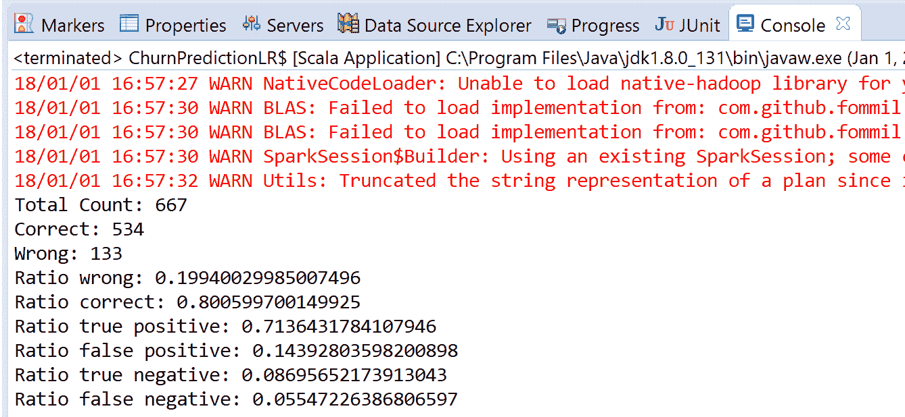

然而，我们还没有得到良好的准确性，因此让我们继续尝试其他分类器，例如 SMV。这次，我们将使用来自 Apache Spark ML 包的线性 SVM 实现。

# SVM 用于流失预测

SVM 也广泛用于大规模分类任务（即二分类以及多项分类）。此外，它也是一种线性机器学习方法，如第一章《分析保险赔偿严重性》中所描述。线性 SVM 算法输出一个 SVM 模型，其中 SVM 使用的损失函数可以通过铰链损失来定义，如下所示：

*L(**w**;**x**,y):=max{0,1−y**w**^T**x**}*

Spark 中的线性 SVM 默认使用 L2 正则化进行训练。然而，它也支持 L1 正则化，通过这种方式，问题本身变成了一个线性规划问题。

现在，假设我们有一组新的数据点 *x*；模型根据 ***w**^T**x*** 的值做出预测。默认情况下，如果 ***w****^T****x**≥0*，则结果为正，否则为负。

现在我们已经了解了 SVM 的工作原理，让我们开始使用基于 Spark 的 SVM 实现。我们从导入所需的包和库开始：

```py
import org.apache.spark._
import org.apache.spark.sql.SparkSession
import org.apache.spark.sql.functions._
import org.apache.spark.ml.classification.{LinearSVC, LinearSVCModel}
import org.apache.spark.sql.SparkSession
import org.apache.spark.sql.functions.max
import org.apache.spark.ml.Pipeline
import org.apache.spark.ml.tuning.{ParamGridBuilder, CrossValidator}
import org.apache.spark.mllib.evaluation.BinaryClassificationMetrics
import org.apache.spark.ml.evaluation.BinaryClassificationEvaluator
```

现在，让我们创建一个 Spark 会话并导入隐式转换：

```py
val spark: SparkSession = SparkSessionCreate.createSession("ChurnPredictionLogisticRegression")
import spark.implicits._
```

我们现在需要定义一些超参数来训练基于 LR 的管道：

```py
val numFolds = 10
val MaxIter: Seq[Int] = Seq(100)
val RegParam: Seq[Double] = Seq(1.0) // L2 regularization param, set 0.10 with L1 reguarization
val Tol: Seq[Double] = Seq(1e-8)
val ElasticNetParam: Seq[Double] = Seq(1.0) // Combination of L1 and L2
```

现在，一旦我们定义并初始化了超参数，下一步是实例化一个 LR 估计器，如下所示：

```py
val svm = new LinearSVC()
```

现在我们已经准备好三个转换器和一个估计器，下一步是将它们串联成一个管道——也就是说，每个都充当一个阶段：

```py
val pipeline = new Pipeline()
     .setStages(Array(PipelineConstruction.ipindexer,
                      PipelineConstruction.labelindexer,
                      PipelineConstruction.assembler,svm)
                      )
```

让我们定义 `paramGrid`，以便在超参数空间上执行网格搜索。这个搜索将遍历 SVM 的最大迭代次数、正则化参数、容差和弹性网，以寻找最佳模型：

```py
val paramGrid = new ParamGridBuilder()
    .addGrid(svm.maxIter, MaxIter)
    .addGrid(svm.regParam, RegParam)
    .addGrid(svm.tol, Tol)
    .addGrid(svm.elasticNetParam, ElasticNetParam)
    .build()
```

让我们定义一个 `BinaryClassificationEvaluator` 评估器来评估模型：

```py
val evaluator = new BinaryClassificationEvaluator()
    .setLabelCol("label")
    .setRawPredictionCol("prediction")
```

我们使用 `CrossValidator` 执行 10 次交叉验证，以选择最佳模型：

```py
val crossval = new CrossValidator()
    .setEstimator(pipeline)
    .setEvaluator(evaluator)
    .setEstimatorParamMaps(paramGrid)
    .setNumFolds(numFolds)
```

现在我们调用`fit`方法，以便完整的预定义流水线，包括所有特征预处理和 LR 分类器，将被执行多次——每次使用不同的超参数向量：

```py
val cvModel = crossval.fit(Preprocessing.trainDF)
```

现在是时候评估 SVM 模型在测试数据集上的预测能力了。第一步，我们需要使用模型流水线转换测试集，这将根据我们在前面特征工程步骤中描述的机制来映射特征：

```py
val predictions = cvModel.transform(Preprocessing.testSet)
prediction.show(10)
>>>
```

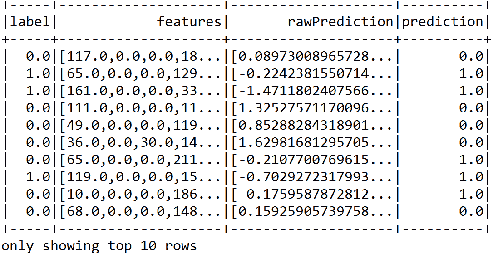

然而，从之前的预测数据框中，确实很难猜测分类准确率。在第二步中，评估器使用`BinaryClassificationEvaluator`进行自我评估，如下所示：

```py
val accuracy = evaluator.evaluate(predictions)
println("Classification accuracy: " + accuracy)
>>>
Classification accuracy: 0.7530180345969819
```

所以我们从我们的二分类模型中得到了大约 75%的分类准确率。现在，单单使用二分类器的准确率并没有太大意义。

因此，研究人员通常推荐其他性能指标，比如精确度-召回曲线下面积和 ROC 曲线下面积。然而，为此我们需要构建一个包含测试集原始分数的 RDD：

```py
val predictionAndLabels = predictions
    .select("prediction", "label")
    .rdd.map(x => (x(0).asInstanceOf[Double], x(1)
    .asInstanceOf[Double]))
```

现在，可以使用前面的 RDD 来计算两个之前提到的性能指标：

```py
val metrics = new BinaryClassificationMetrics(predictionAndLabels)
println("Area under the precision-recall curve: " + metrics.areaUnderPR)
println("Area under the receiver operating characteristic (ROC) curve : " + metrics.areaUnderROC)
>>>
Area under the precision-recall curve: 0.5595712265324828
Area under the receiver operating characteristic (ROC) curve: 0.7530180345969819
```

在这种情况下，评估返回了 75%的准确率，但仅有 55%的精确度。接下来，我们再次计算一些其他指标；例如，假阳性、真阳性、假阴性和真阴性预测也有助于评估模型的性能：

```py
val lp = predictions.select("label", "prediction")
val counttotal = predictions.count()

val correct = lp.filter($"label" === $"prediction").count()

val wrong = lp.filter(not($"label" === $"prediction")).count()
val ratioWrong = wrong.toDouble / counttotal.toDouble

val ratioCorrect = correct.toDouble / counttotal.toDouble

val truep = lp.filter($"prediction" === 0.0).filter($"label" ===
$"prediction").count() / counttotal.toDouble

val truen = lp.filter($"prediction" === 1.0).filter($"label" ===
$"prediction").count() / counttotal.toDouble

val falsep = lp.filter($"prediction" === 1.0).filter(not($"label" ===
$"prediction")).count() / counttotal.toDouble

val falsen = lp.filter($"prediction" === 0.0).filter(not($"label" ===
$"prediction")).count() / counttotal.toDouble

println("Total Count : " + counttotal)
println("Correct : " + correct)
println("Wrong: " + wrong)
println("Ratio wrong: " + ratioWrong)
println("Ratio correct: " + ratioCorrect)
println("Ratio true positive : " + truep)
println("Ratio false positive : " + falsep)
println("Ratio true negative : " + truen)
println("Ratio false negative : " + falsen)
>>>
```

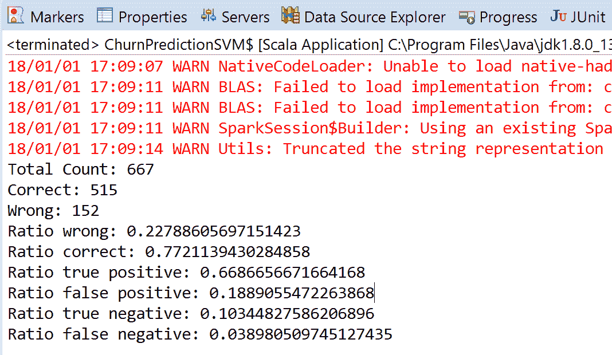

然而，我们使用 SVM 时并没有获得好的准确率。而且，无法选择最合适的特征，这会帮助我们用最合适的特征训练模型。这一次，我们将再次使用一个更强大的分类器，比如 Apache Spark ML 包中的**决策树**（**DTs**）实现。

# 用于流失预测的决策树

决策树通常被认为是一种监督学习技术，用于解决分类和回归任务。

更技术性地讲，决策树中的每个分支代表一个可能的决策、事件或反应，基于统计概率。与朴素贝叶斯相比，决策树是一种更强健的分类技术。原因在于，首先，决策树将特征分为训练集和测试集。然后，它通过良好的泛化能力来推断预测标签或类别。最有趣的是，决策树算法可以处理二分类和多分类问题。

例如，在下面的示例图中，DT 从入学数据中学习，通过一组**if...else**决策规则来近似正弦曲线。数据集包含每个申请入学学生的记录，例如，申请进入美国大学的学生。每条记录包含研究生入学考试成绩、CGPA 成绩和排名。现在，我们需要根据这三个特征（变量）预测谁是合格的。DTs 可以在训练 DT 模型并剪枝不需要的树枝后，用于解决这种问题。通常来说，更深的树表示更复杂的决策规则和更好的拟合模型：

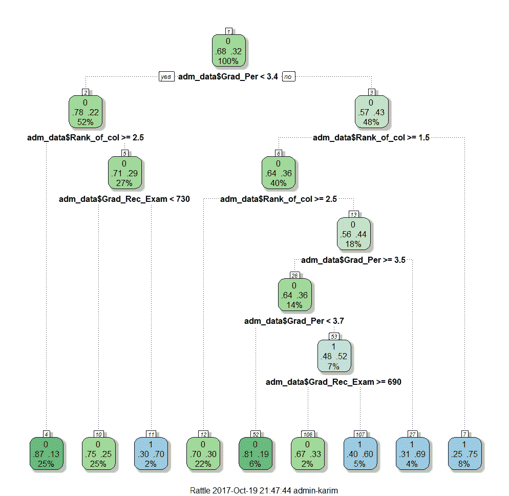

图 6：大学入学数据的决策树

因此，树越深，决策规则越复杂，模型拟合度越高。现在，让我们看一下 DT 的优缺点：

|  | **优点** | **缺点** | **更擅长** |
| --- | --- | --- | --- |
| **决策树 (DTs)** | -简单实现、训练和解释-可以可视化树-数据准备要求少-模型构建和预测时间较短-可以处理数值和分类数据-通过统计测试验证模型的可能性-对噪声和缺失值具有鲁棒性-高精度 | -大而复杂的树难以解释-同一子树中可能出现重复-可能存在对角决策边界的问题-决策树学习者可能会创建过于复杂的树，无法很好地泛化数据-有时 DTs 可能因为数据中的微小变化而不稳定-学习 DT 本身是一个 NP 完全问题-如果某些类占主导地位，DT 学习者会创建偏倚的树 | -目标是实现高准确度的分类-医学诊断和预后-信用风险分析 |

现在，我们已经了解了 DT 的工作原理，接下来让我们开始使用基于 Spark 的 DT 实现。首先，导入所需的包和库：

```py
import org.apache.spark._
import org.apache.spark.sql.SparkSession
import org.apache.spark.sql.functions._
import org.apache.spark.sql.types._
import org.apache.spark.sql._
import org.apache.spark.ml.Pipeline
import org.apache.spark.ml.classification.{DecisionTreeClassifier, DecisionTreeClassificationModel}
import org.apache.spark.mllib.evaluation.BinaryClassificationMetrics
import org.apache.spark.ml.evaluation.BinaryClassificationEvaluator
import org.apache.spark.ml.tuning.{ParamGridBuilder, CrossValidator}
```

现在让我们创建一个 Spark 会话并导入隐式转换：

```py
val spark: SparkSession = SparkSessionCreate.createSession("ChurnPredictionDecisionTrees")
import spark.implicits._
```

现在，一旦我们定义并初始化了超参数，下一步是实例化一个`DecisionTreeClassifier`估算器，如下所示：

```py
val dTree = new DecisionTreeClassifier()
                .setLabelCol("label")
                .setFeaturesCol("features")
                .setSeed(1234567L)
```

现在，我们有三个转换器和一个估算器准备好，接下来的任务是将它们串联成一个单一的管道——即它们每个都作为一个阶段：

```py
val pipeline = new Pipeline()
                .setStages(Array(PipelineConstruction.ipindexer,
                PipelineConstruction.labelindexer,
                PipelineConstruction.assembler,dTree))
```

让我们定义参数网格，在超参数空间上执行这样的网格搜索。这个搜索通过 DT 的杂质、最大分箱数和最大深度来寻找最佳模型。树的最大深度：深度 0 表示 1 个叶节点；深度 1 表示 1 个内部节点+2 个叶节点。

另一方面，最大分箱数用于分离连续特征并选择每个节点上如何分裂特征。更多的分箱提供更高的粒度。简而言之，我们通过决策树的`maxDepth`和`maxBins`参数来搜索最佳模型：

```py
var paramGrid = new ParamGridBuilder()
    .addGrid(dTree.impurity, "gini" :: "entropy" :: Nil)
    .addGrid(dTree.maxBins, 2 :: 5 :: 10 :: 15 :: 20 :: 25 :: 30 :: Nil)
    .addGrid(dTree.maxDepth, 5 :: 10 :: 15 :: 20 :: 25 :: 30 :: 30 :: Nil)
    .build()
```

在前面的代码段中，我们通过序列格式创建了一个逐步的参数网格。这意味着我们正在创建一个包含不同超参数组合的网格空间。这将帮助我们提供由最优超参数组成的最佳模型。

让我们定义一个`BinaryClassificationEvaluator`评估器来评估模型：

```py
val evaluator = new BinaryClassificationEvaluator()
    .setLabelCol("label")
    .setRawPredictionCol("prediction")
```

我们使用`CrossValidator`进行 10 折交叉验证，以选择最佳模型：

```py
val crossval = new CrossValidator()
    .setEstimator(pipeline)
    .setEvaluator(evaluator)
    .setEstimatorParamMaps(paramGrid)
    .setNumFolds(numFolds)
```

现在让我们调用`fit`方法，这样完整的预定义管道，包括所有特征预处理和决策树分类器，将被多次执行——每次使用不同的超参数向量：

```py
val cvModel = crossval.fit(Preprocessing.trainDF)
```

现在是时候评估决策树模型在测试数据集上的预测能力了。第一步，我们需要使用模型管道转换测试集，这将按照我们在前面的特征工程步骤中描述的相同机制映射特征：

```py
val predictions = cvModel.transform(Preprocessing.testSet)
prediction.show(10)
>>>
```

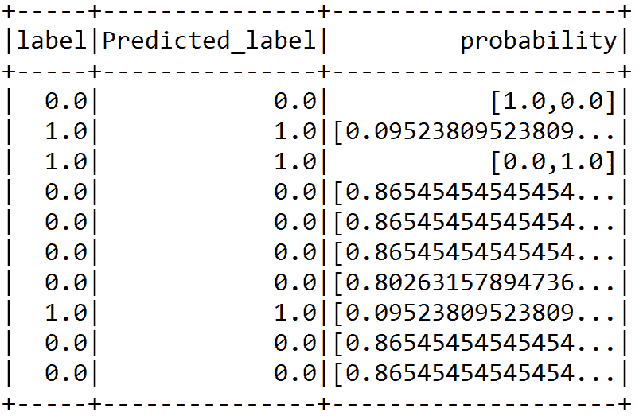

然而，看到前面的预测 DataFrame，真的很难猜测分类准确率。在第二步中，评估是通过使用`BinaryClassificationEvaluator`进行评估，如下所示：

```py
val accuracy = evaluator.evaluate(predictions)
println("Classification accuracy: " + accuracy)
>>>
Accuracy: 0.870334928229665
```

所以，我们从我们的二元分类模型中得到了大约 87%的分类准确率。现在，类似于 SVM 和 LR，我们将基于以下包含测试集原始分数的 RDD，观察精确度-召回曲线下的面积和 ROC 曲线下的面积：

```py
val predictionAndLabels = predictions
    .select("prediction", "label")
    .rdd.map(x => (x(0).asInstanceOf[Double], x(1)
    .asInstanceOf[Double]))
```

现在，前面的 RDD 可以用于计算之前提到的两个性能指标：

```py
val metrics = new BinaryClassificationMetrics(predictionAndLabels)
println("Area under the precision-recall curve: " + metrics.areaUnderPR)
println("Area under the receiver operating characteristic (ROC) curve : " + metrics.areaUnderROC)
>>>
Area under the precision-recall curve: 0.7293101942399631
Area under the receiver operating characteristic (ROC) curve: 0.870334928229665
```

在这种情况下，评估结果返回 87%的准确率，但只有 73%的精确度，这比 SVM 和 LR 要好得多。接下来，我们将再次计算一些其他指标；例如，假阳性和真阳性及假阴性预测也有助于评估模型的性能：

```py
val lp = predictions.select("label", "prediction")
val counttotal = predictions.count()

val correct = lp.filter($"label" === $"prediction").count()

val wrong = lp.filter(not($"label" === $"prediction")).count()

val ratioWrong = wrong.toDouble / counttotal.toDouble

val ratioCorrect = correct.toDouble / counttotal.toDouble

val truep = lp.filter($"prediction" === 0.0).filter($"label" ===
$"prediction").count() / counttotal.toDouble

val truen = lp.filter($"prediction" === 1.0).filter($"label" ===
$"prediction").count() / counttotal.toDouble

val falsep = lp.filter($"prediction" === 1.0).filter(not($"label" ===
$"prediction")).count() / counttotal.toDouble

val falsen = lp.filter($"prediction" === 0.0).filter(not($"label" ===
$"prediction")).count() / counttotal.toDouble

println("Total Count : " + counttotal)
println("Correct : " + correct)
println("Wrong: " + wrong)
println("Ratio wrong: " + ratioWrong)
println("Ratio correct: " + ratioCorrect)
println("Ratio true positive : " + truep)
println("Ratio false positive : " + falsep)
println("Ratio true negative : " + truen)
println("Ratio false negative : " + falsen)
>>>
```

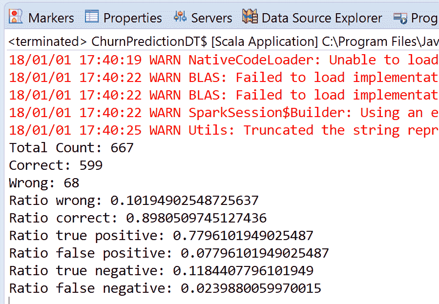

太棒了；我们达到了 87%的准确率，但是什么因素导致的呢？嗯，可以通过调试来获得分类过程中构建的决策树。但首先，让我们看看在交叉验证后我们在什么层次上达到了最佳模型：

```py
val bestModel = cvModel.bestModel
println("The Best Model and Parameters:n--------------------")
println(bestModel.asInstanceOf[org.apache.spark.ml.PipelineModel].stages(3))
>>>
```

最佳模型和参数：

```py
DecisionTreeClassificationModel (uid=dtc_1fb45416b18b) of depth 5 with 53 nodes.
```

这意味着我们在深度为 5，节点数为 53 的决策树模型上达到了最佳效果。现在，让我们通过展示树来提取树构建过程中做出的决策。这棵树帮助我们找出数据集中最有价值的特征：

```py
bestModel.asInstanceOf[org.apache.spark.ml.PipelineModel]
    .stages(3)
    .extractParamMap

val treeModel = bestModel.asInstanceOf[org.apache.spark.ml.PipelineModel]
    .stages(3)
    .asInstanceOf[DecisionTreeClassificationModel]
println("Learned classification tree model:n" + treeModel.toDebugString)
>>>
```

学到的分类树模型：

```py
If (feature 3 <= 245.2)
    If (feature 11 <= 3.0)
        If (feature 1 in {1.0})
            If (feature 10 <= 2.0)
                Predict: 1.0
            Else (feature 10 > 2.0)
            If (feature 9 <= 12.9)
                Predict: 0.0
            Else (feature 9 > 12.9)
                Predict: 1.0
        ...
    Else (feature 7 > 198.0)
        If (feature 2 <= 28.0)
            Predict: 1.0
        Else (feature 2 > 28.0)
            If (feature 0 <= 60.0)
                Predict: 0.0
            Else (feature 0 > 60.0)
                Predict: 1.0
```

在前面的输出中，`toDebugString()`函数打印了决策树的决策节点，最终预测结果出现在叶子节点上。我们也可以清楚地看到特征 11 和 3 被用来做决策；它们是客户可能流失的两个最重要因素。那么这两个特征是什么呢？我们来看一下：

```py
println("Feature 11:" + Preprocessing.trainDF.filter(PipelineConstruction.featureCols(11)))
println("Feature 3:" + Preprocessing.trainDF.filter(PipelineConstruction.featureCols(3)))
>>>
Feature 11: [total_international_num_calls: double]
Feature 3: [total_day_mins: double]
```

因此，客户服务电话和总通话时长被决策树选中，因为它提供了一种自动化机制来确定最重要的特征。

等等！我们还没完成。最后但同样重要的是，我们将使用一种集成技术——随机森林（RF），它被认为比决策树（DTs）更强大的分类器。同样，让我们使用 Apache Spark ML 包中的随机森林实现。

# 随机森林用于流失预测

正如在第一章中所述，*分析保险严重性索赔*，随机森林是一种集成技术，它通过构建决策树集成来进行预测——即，多个决策树的集成。更技术地讲，它构建多个决策树，并将它们集成在一起，以获得更准确和更稳定的预测。

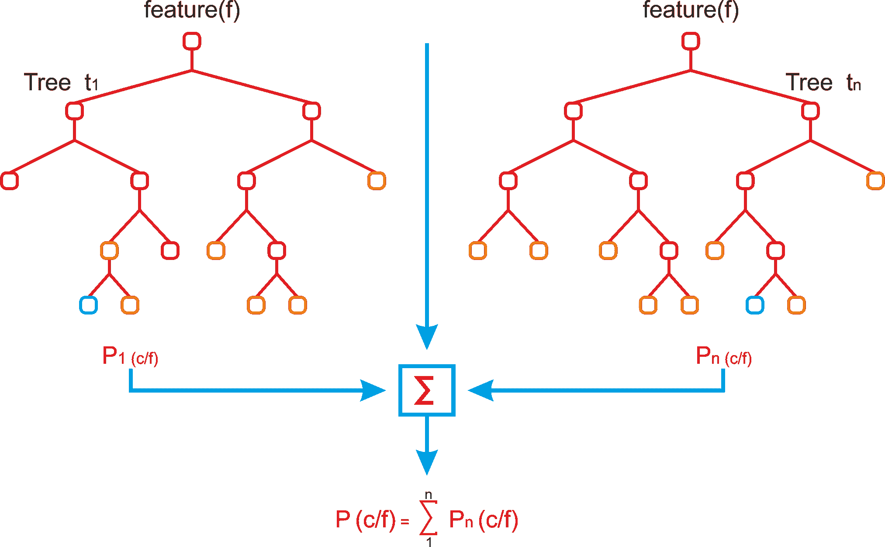

图 7：随机森林及其集成技术的解释

这是一个直接的结果，因为通过独立评审团的最大投票，我们得到了比最佳评审团更好的最终预测（见前图）。现在我们已经知道了随机森林（RF）的工作原理，让我们开始使用基于 Spark 的 RF 实现。首先，导入所需的包和库：

```py
import org.apache.spark._
import org.apache.spark.sql.SparkSession
import org.apache.spark.sql.functions._
import org.apache.spark.sql.types._
import org.apache.spark.sql._
import org.apache.spark.ml.Pipeline
import org.apache.spark.ml.classification.{RandomForestClassifier, RandomForestClassificationModel}
import org.apache.spark.mllib.evaluation.BinaryClassificationMetrics
import org.apache.spark.ml.evaluation.BinaryClassificationEvaluator
import org.apache.spark.ml.tuning.{ParamGridBuilder, CrossValidator}
```

现在让我们创建 Spark 会话并导入隐式库：

```py
val spark: SparkSession = SparkSessionCreate.createSession("ChurnPredictionRandomForest")
import spark.implicits._
```

现在，一旦我们定义并初始化了超参数，接下来的任务是实例化一个`DecisionTreeClassifier`估计器，如下所示：

```py
val rf = new RandomForestClassifier()
    .setLabelCol("label")
    .setFeaturesCol("features")
    .setSeed(1234567L)// for reproducibility
```

现在我们已经准备好了三个变换器和一个估计器，接下来的任务是将它们串联成一个单一的管道——也就是说，每个变换器作为一个阶段：

```py
val pipeline = new Pipeline()
    .setStages(Array(PipelineConstruction.ipindexer,
    PipelineConstruction.labelindexer,
    PipelineConstruction.assembler,rf))
```

让我们定义 paramgrid，以便在超参数空间上执行网格搜索：

```py
val paramGrid = new ParamGridBuilder()
    .addGrid(rf.maxDepth, 3 :: 5 :: 15 :: 20 :: 50 :: Nil)
    .addGrid(rf.featureSubsetStrategy, "auto" :: "all" :: Nil)
    .addGrid(rf.impurity, "gini" :: "entropy" :: Nil)
    .addGrid(rf.maxBins, 2 :: 5 :: 10 :: Nil)
    .addGrid(rf.numTrees, 10 :: 50 :: 100 :: Nil)
    .build()
```

让我们定义一个`BinaryClassificationEvaluator`评估器来评估模型：

```py
val evaluator = new BinaryClassificationEvaluator()
    .setLabelCol("label")
    .setRawPredictionCol("prediction")
```

我们使用`CrossValidator`执行 10 折交叉验证，以选择最佳模型：

```py
val crossval = new CrossValidator()
    .setEstimator(pipeline)
    .setEvaluator(evaluator)
    .setEstimatorParamMaps(paramGrid)
    .setNumFolds(numFolds)
```

现在，让我们调用`fit`方法，以便执行完整的预定义管道，其中包括所有的特征预处理和决策树分类器，每次都会用不同的超参数向量执行：

```py
val cvModel = crossval.fit(Preprocessing.trainDF)
```

现在是时候评估决策树模型在测试数据集上的预测能力了。第一步，我们需要将测试集转换为模型管道，这将按照我们在之前的特征工程步骤中描述的相同机制映射特征：

```py
val predictions = cvModel.transform(Preprocessing.testSet)
prediction.show(10)
>>>
```


然而，通过查看前述的预测数据框，确实很难猜测分类准确性。在第二步中，评估是通过使用`BinaryClassificationEvaluator`来进行的，如下所示：

```py
val accuracy = evaluator.evaluate(predictions)
println("Classification accuracy: " + accuracy)
>>>
Accuracy: 0.870334928229665
```

因此，我们的二分类模型得到了约 87%的分类准确率。现在，类似于 SVM 和 LR，我们将根据以下包含测试集原始分数的 RDD，观察精度-召回曲线下的面积以及 ROC 曲线下的面积：

```py
val predictionAndLabels = predictions
    .select("prediction", "label")
    .rdd.map(x => (x(0).asInstanceOf[Double], x(1)
    .asInstanceOf[Double]))
```

现在，前述的 RDD 可以用来计算之前提到的两个性能指标：

```py
val metrics = new BinaryClassificationMetrics(predictionAndLabels)

println("Area under the precision-recall curve: " + metrics.areaUnderPR)
println("Area under the receiver operating characteristic (ROC) curve : " + metrics.areaUnderROC)
>>>
Area under the precision-recall curve: 0.7293101942399631
Area under the receiver operating characteristic (ROC) curve: 0.870334928229665
```

在这种情况下，评估返回了 87%的准确性，但仅有 73%的精度，这比 SVM 和 LR 要好得多。接下来，我们将再次计算一些更多的指标；例如，假阳性和真阳性、假阴性和真阴性预测也有助于评估模型的性能：

```py
val lp = predictions.select("label", "prediction")
val counttotal = predictions.count()

val correct = lp.filter($"label" === $"prediction").count()

val wrong = lp.filter(not($"label" === $"prediction")).count()

val ratioWrong = wrong.toDouble / counttotal.toDouble

val ratioCorrect = correct.toDouble / counttotal.toDouble

val truep = lp.filter($"prediction" === 0.0).filter($"label" ===
$"prediction").count() / counttotal.toDouble

val truen = lp.filter($"prediction" === 1.0).filter($"label" ===
$"prediction").count() / counttotal.toDouble

val falsep = lp.filter($"prediction" === 1.0).filter(not($"label" ===
$"prediction")).count() / counttotal.toDouble

val falsen = lp.filter($"prediction" === 0.0).filter(not($"label" ===
$"prediction")).count() / counttotal.toDouble

println("Total Count : " + counttotal)
println("Correct : " + correct)
println("Wrong: " + wrong)
println("Ratio wrong: " + ratioWrong)
println("Ratio correct: " + ratioCorrect)
println("Ratio true positive : " + truep)
println("Ratio false positive : " + falsep)
println("Ratio true negative : " + truen)
println("Ratio false negative : " + falsen)
>>>
```

我们将得到以下结果：

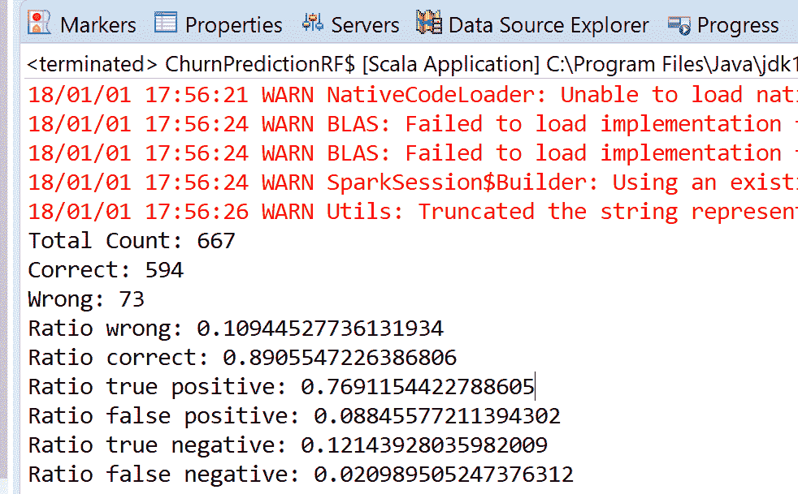

太棒了；我们达到了 91%的准确率，但是什么因素导致的呢？嗯，类似于决策树，随机森林也可以调试，获取分类过程中构建的决策树。为了打印树并选择最重要的特征，尝试 DT 的最后几行代码，您就完成了。

现在，你能猜到训练了多少个不同的模型吗？嗯，我们在交叉验证上有 10 折，超参数空间的基数为 2 到 7 的五个维度。现在来做一些简单的数学计算：10 * 7 * 5 * 2 * 3 * 6 = 12600 个模型！

请注意，我们仍然将超参数空间限制在`numTrees`、`maxBins`和`maxDepth`的范围内，最大为 7。此外，请记住，较大的树通常会表现得更好。因此，欢迎在此代码上进行尝试，添加更多特性，并使用更大的超参数空间，例如，更大的树。

# 选择最佳模型进行部署

从前述结果可以看出，LR 和 SVM 模型的假阳性率与随机森林和决策树相同，但较高。因此，我们可以说，在真正的阳性计数方面，决策树和随机森林的准确性整体上更好。让我们通过每个模型的饼图预测分布来验证前述说法的有效性：

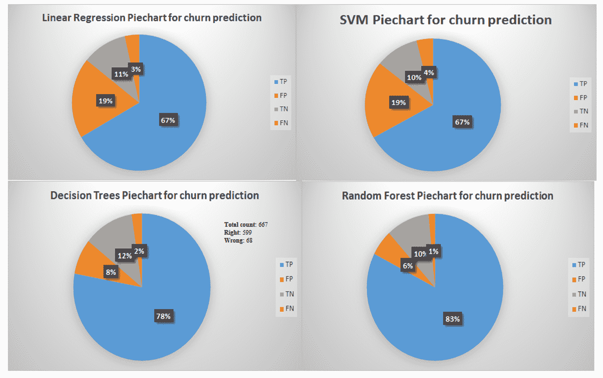

现在，值得一提的是，使用随机森林时，我们实际上能获得较高的准确性，但这是一个非常耗费资源和时间的工作；特别是训练，与 LR 和 SVM 相比，训练时间显著较长。

因此，如果您的内存或计算能力较低，建议在运行此代码之前增加 Java 堆空间，以避免 OOM 错误。

最后，如果您想部署最佳模型（在我们的案例中是随机森林），建议在`fit()`方法调用后立即保存交叉验证模型：

```py
// Save the workflow
cvModel.write.overwrite().save("model/RF_model_churn")
```

训练好的模型将保存在该位置。该目录将包含：

+   最佳模型

+   估计器

+   评估器

+   训练本身的元数据

现在，接下来的任务是恢复相同的模型，如下所示：

```py
// Load the workflow back
val cvModel = CrossValidatorModel.load("model/ RF_model_churn/")
```

最后，我们需要将测试集转换为模型管道，以便根据我们在前述特征工程步骤中描述的相同机制映射特征：

```py
val predictions = cvModel.transform(Preprocessing.testSet)
```

最后，我们评估恢复的模型：

```py
val evaluator = new BinaryClassificationEvaluator()
    .setLabelCol("label")
    .setRawPredictionCol("prediction")

val accuracy = evaluator.evaluate(predictions)
    println("Accuracy: " + accuracy)
    evaluator.explainParams()

val predictionAndLabels = predictions
    .select("prediction", "label")
    .rdd.map(x => (x(0).asInstanceOf[Double], x(1)
    .asInstanceOf[Double]))

val metrics = new BinaryClassificationMetrics(predictionAndLabels)
val areaUnderPR = metrics.areaUnderPR
println("Area under the precision-recall curve: " + areaUnderPR)
val areaUnderROC = metrics.areaUnderROC
println("Area under the receiver operating characteristic (ROC) curve: " + areaUnderROC)
>>>
```

您将收到以下输出：


好了，完成了！我们成功地重用了模型并进行了相同的预测。但是，由于数据的随机性，我们观察到略微不同的预测结果。

# 总结

在本章中，我们已经学习了如何开发一个机器学习项目来预测客户是否有可能取消订阅，并通过此方法开发了一个真实的预测模型。我们使用了逻辑回归（LR）、支持向量机（SVM）、决策树（DT）和随机森林（Random Forest）来构建预测模型。我们还分析了通常用来进行数据初步分析的客户数据类型。最后，我们了解了如何选择适合生产环境的模型。

在下一章中，我们将学习如何开发一个真实项目，该项目收集历史和实时的**比特币**数据，并预测未来一周、一个月等的价格。此外，我们还将学习如何为在线加密货币交易生成一个简单的信号。
