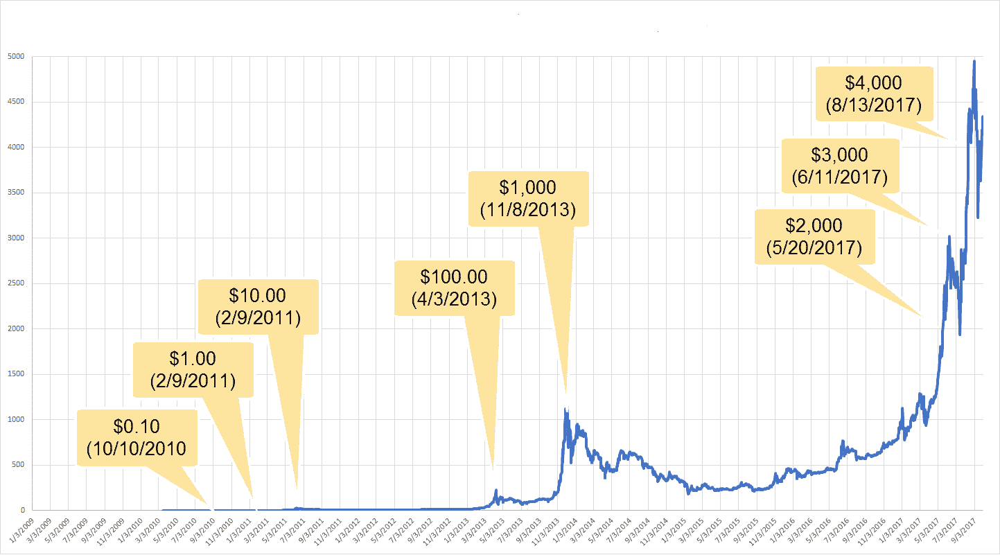
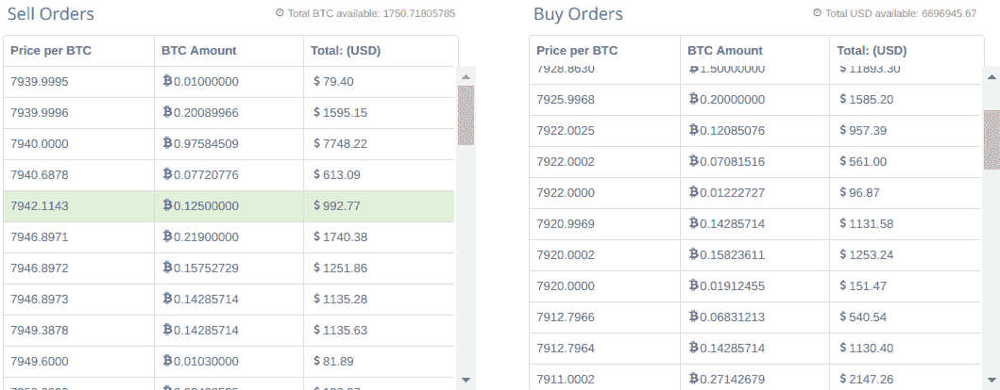
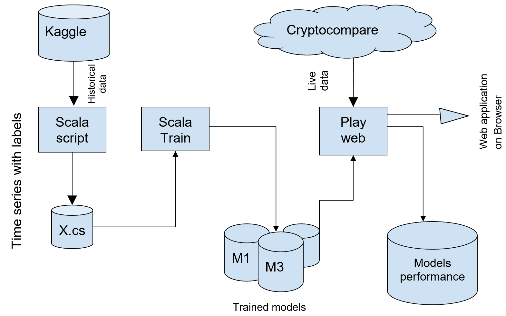
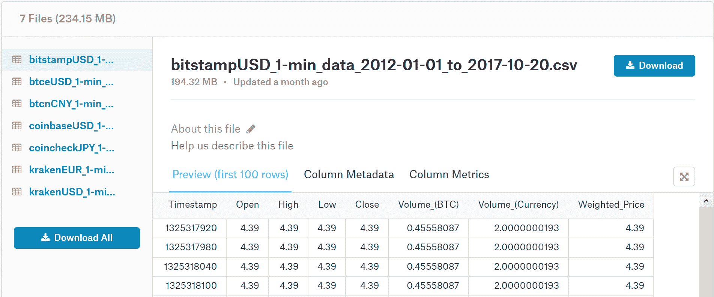
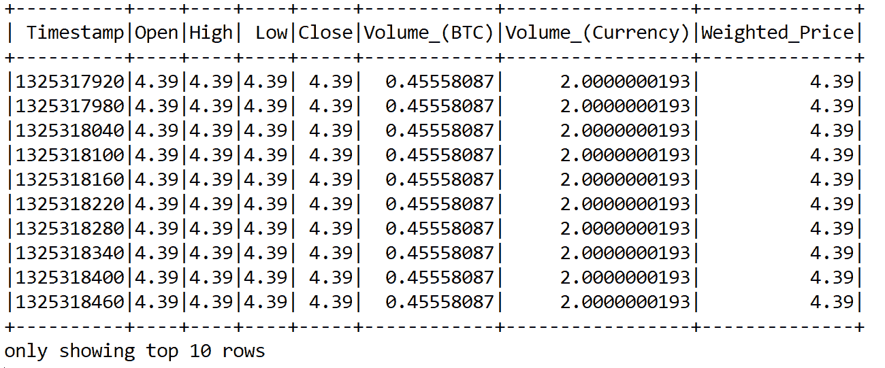
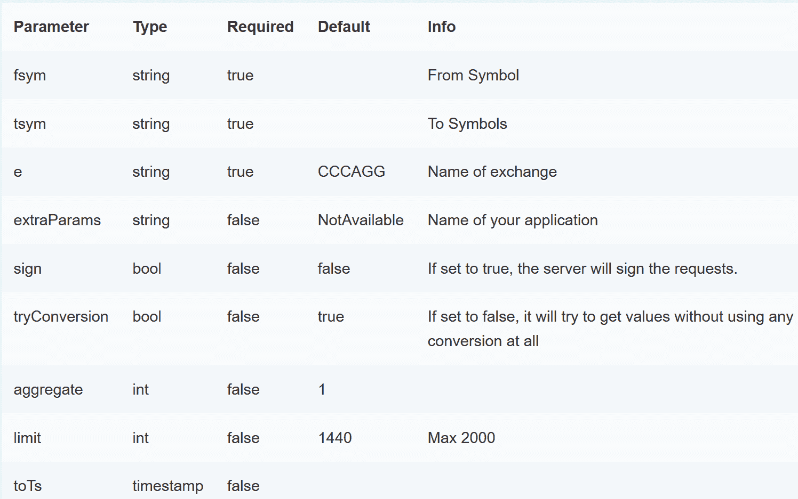
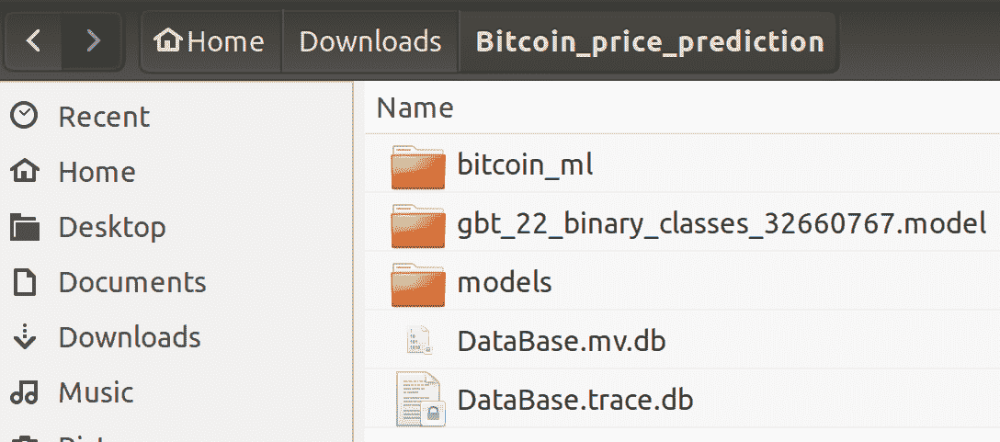
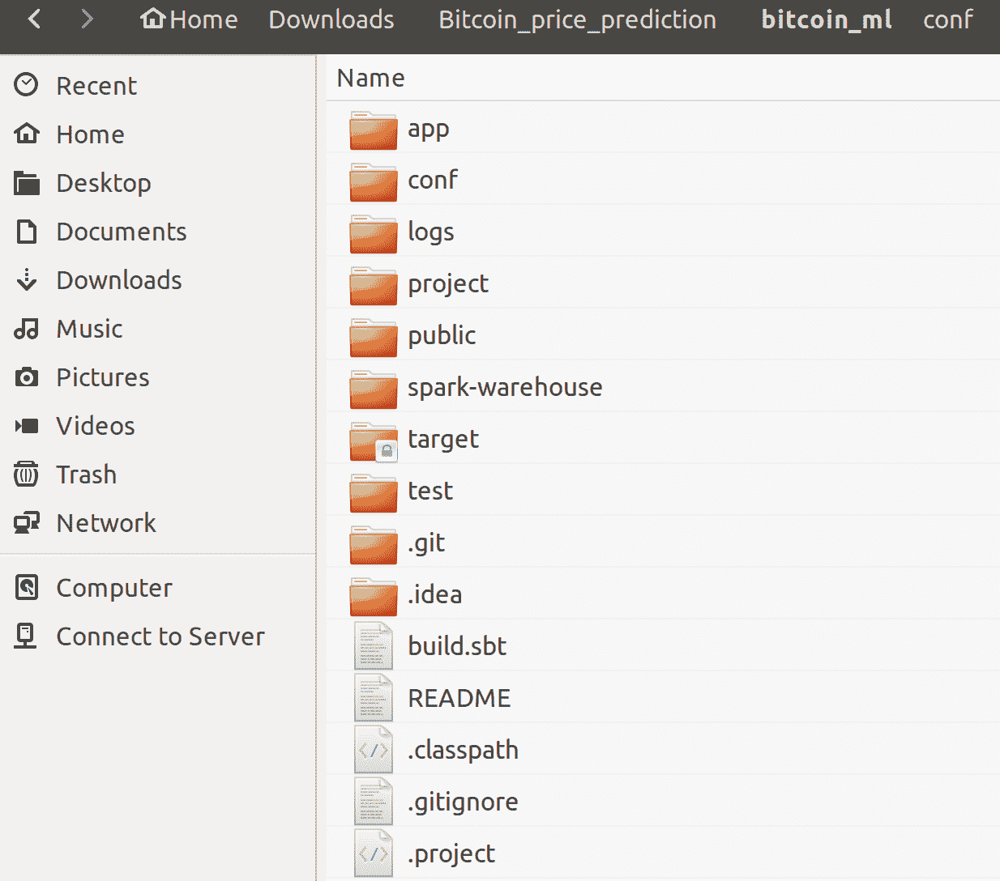
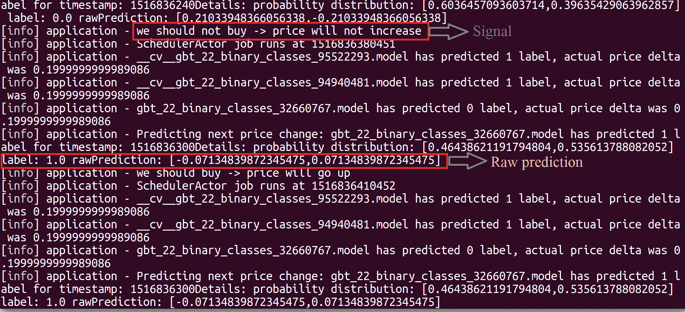
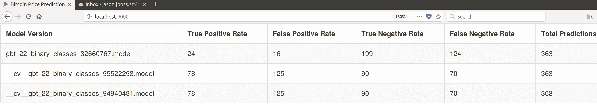

# 第三章：基于历史和实时数据的高频比特币价格预测

比特币是一种全球性的加密货币和数字支付系统，被认为是**第一种去中心化的数字货币**，因为该系统无需中央存储库或单一管理员即可运行。近年来，它在全球范围内获得了极大的关注和流行。

在本章中，我们将展示如何使用 Scala、Spark ML、Cryptocompare API 和比特币历史（以及实时）数据来预测未来一周、一个月等的价格，这将帮助我们为在线加密货币交易做出自动化决策。此外，我们还将展示如何生成一个简单的信号用于在线比特币交易。

简要来说，在这个端到端的项目中，我们将学习以下主题：

+   比特币，加密货币与在线交易

+   历史和实时价格数据收集

+   原型的高级管道

+   使用梯度提升树回归预测比特币价格

+   使用 Scala play 框架进行的演示预测和信号生成

+   未来展望——使用相同的技术处理其他数据集

# 比特币，加密货币与在线交易

比特币，作为按发行时间和市值（截至 2017 年 12 月）排名第一的加密货币，因其易于开始交易、能够保持伪匿名性以及历史上的剧烈增长（参见*表 1*和*图 1*获取一些统计数据）而吸引了投资者和交易员。这吸引了长期投资者；而其高度的波动性也吸引了日内交易者。

然而，很难预测比特币的长期价值，因为比特币背后的价值较为抽象。其价格主要反映市场认知，并且高度依赖新闻、法规、政府和银行的合作、平台的技术问题（如交易费用和区块大小）、机构投资者将比特币纳入其投资组合的兴趣等因素：



图 1：比特币及其剧烈的价格上涨

然而，从短期来看，比特币价格是市场活动的副产品，通常发生在一个被称为**交易所**的平台上（其中最著名的**交易所**包括 Bitstamp、Coinbase、Kraken 和 Bitfinex）。用户注册并完成**KYC**（**了解你的客户**）程序后，可以在其中交易比特币，兑换成法币如美元和欧元，也可以交易其他加密货币，称为**山寨币**（例如以太坊、莱特币和达世币等较为知名的山寨币）：

**表 1 - 比特币历史价格变动**

| **日期** | **USD: 1 BTC** |
| --- | --- |
| 2009 年 1 月到 2010 年 3 月 | 基本上没有 |
| 2010 年 3 月 | $0.003 |
| 2010 年 5 月 | 低于$0.01 |
| 2010 年 7 月 | $0.08 |
| 2011 年 2 月到 4 月 | $1.00 |
| 2011 年 7 月 8 日 | $31.00 |
| 2011 年 12 月 | $2.00 |
| 2012 年 12 月 | $13.00 |
| 2013 年 4 月 11 日 | $266 |
| 2013 年 5 月 | $130 |
| 2013 年 6 月 | $100 |
| 2013 年 11 月 | $350 至 $1,242 |
| 2013 年 12 月 | $600 至 $1,000 |
| 2014 年 1 月 | $750 至 $1,000 |
| 2014 年 2 月 | $550 至 $750 |
| 2014 年 3 月 | $450 至 $700 |
| 2014 年 4 月 | $340 至 $530 |
| 2014 年 5 月 | $440 至 $630 |
| 2015 年 3 月 | $200 至 $300 |
| 2015 年 11 月初 | $395 至 $504 |
| 2016 年 5 月至 6 月 | $450 至 $750 |
| 2016 年 7 月至 9 月 | $600 至 $630 |
| 2016 年 10 月至 11 月 | $600 至 $780 |
| 2017 年 1 月 | $800 至 $1,150 |
| 2017 年 1 月 5 日至 12 日 | $750 至 $920 |
| 2017 年 3 月 2 日至 3 日 | $1,290+  |
| 2017 年 4 月 | $1,210 至 $1,250 |
| 2017 年 5 月 | $2,000  |
| 2017 年 5 月至 6 月 | $2,000 至 $3,200+ |
| 2017 年 8 月 | $4,400  |
| 2017 年 9 月 | $5,000 |
| 2017 年 9 月 12 日 | $2,900 |
| 2017 年 10 月 13 日 | $5,600 |
| 2017 年 10 月 21 日 | $6,180  |
| 2017 年 11 月 6 日 | $7,300  |
| 2017 年 11 月 12 日 | $5,519 至 $6,295  |
| 2017 年 11 月 17 日至 20 日 | $7,600 至 $8,100  |
| 2017 年 12 月 15 日 | 17,900  |

交易所维护订单簿——列出了所有买卖订单、其数量和价格——并在买卖双方匹配时执行交易。此外，交易所还保持并提供有关交易状态的统计信息，通常以 OCHL（开盘、最高、最低、收盘）和成交量表示，涵盖交易对的两种货币。对于这个项目，我们将使用 BTC/USD 加密货币对。

这些数据按周期汇总展示，从秒到天，甚至到月。为专业交易员和机构收集比特币数据的专用服务器也在运行。虽然不可能期望所有订单数据都能免费获取，但其中一些数据对公众开放并且可以使用。

# 最先进的比特币自动化交易

在传统证券的世界中，比如公司的股票，过去是由人类来进行分析、预测股票价格并进行交易的。今天，**机器学习**（**ML**）的发展和数据的日益丰富几乎已将人类从高频交易中排除，因为普通人无法捕捉并处理所有数据，而且情绪会影响决策；因此，这一领域现在主要由投资机构的自动化交易系统主导。

当前，比特币交易的交易量相对于传统交易所较低；金融机构传统上谨慎且风险厌恶，尚未涉足比特币交易（至少，尚未公开知晓）。其中一个原因是高费用和对加密货币法规的不确定性。

所以今天，大多数人购买和出售比特币，伴随着所有与非理性行为相关的后果，但也有人尝试自动化比特币交易。最著名的一次尝试是在 MIT 的一篇论文中提出的，另一次是在 2014 年由斯坦福研究人员发布的。很多事情发生了变化，考虑到这三年中比特币价格的大幅上涨，任何只是买入并持有的人都会对结果感到满意：



图 2：比特币买卖订单（截至 2017 年 11 月）

当然，确实有一些交易员使用**机器学习**进行交易，这类应用看起来前景广阔。到目前为止，从研究论文中确定的最佳方法如下：

# 训练

使用订单簿数据，而不是衍生的 OHLC + 成交量数据。因此，训练和预测时，使用的数据看起来是这样的：

+   将数据划分为一定`大小`的时间序列（`大小`是一个需要调整的参数）。

+   将时间序列数据聚类为`K`个聚类（`K`是一个需要调整的参数）。假设会出现一些具有自然趋势的聚类（如价格剧烈下降/上升等）。

+   对于每个聚类，训练回归模型和分类器，分别预测价格和价格变化。

# 预测

这种方法考虑了具有特定窗口大小的最新时间序列，并对模型进行训练。然后，它对数据进行如下分类：

+   采用用于训练的最新时间序列和窗口大小

+   进行分类——它属于哪个聚类？

+   使用该聚类的 ML 模型预测价格或价格变化

这个解决方案可以追溯到 2014 年，但它仍然提供了一定程度的鲁棒性。由于需要识别许多参数，并且没有容易获得的订单簿历史数据，本项目使用了更简单的方法和数据集。

# 原型的高级数据管道

本章的目标是开发一个原型系统，该系统将预测比特币价格的短期变化，使用历史数据训练算法，并使用实时数据预测和选择表现更好的算法。在本项目范围内，并不尝试预测实际的美元价格，而仅仅是预测其是否会上涨。因为比特币价格在某种程度上实际上并不只是价格本身，而是市场预期。这可以看作是交易者行为中的模式，从更高层次上讲，表现为历史价格本身。



图 3：原型的高级数据管道

当然，比特币有一个客观的价格；矿工愿意出售比特币以获取利润。因此，基准价格可以通过了解所有矿工为开采比特币必须支付的费用来估算，但这超出了本项目的范围。

从这个角度来看，与其试图预测美元价格，不如寻找价格上涨、下跌或保持不变的趋势，并根据这些趋势采取行动。第二个目标是构建一个实验工具，允许我们尝试不同的价格预测方法，并能轻松在实际数据上进行评估。代码必须具有灵活性、稳健性，并且易于扩展。

因此，总结来说，系统有三个主要组成部分：

+   用于将历史数据预处理成所需格式的 Scala 脚本

+   Scala 应用程序用于训练机器学习模型

+   Scala 网络服务预测未来价格

# 历史和实时价格数据收集

如前所述，我们将同时使用历史数据和实时数据。我们将使用来自 Kaggle 的比特币历史价格数据。对于实时数据，将使用 Cryptocompare API。

# 历史数据收集

为了训练机器学习算法，有一个公开的`比特币历史价格数据`数据集（版本 10），可以在 Kaggle 上找到。该数据集包含来自多个交易所的 BTC-USD 对的 1 分钟 OHLC 数据，可以从[`www.kaggle.com/mczielinski/bitcoin-historical-data/`](https://www.kaggle.com/mczielinski/bitcoin-historical-data/)下载。

在项目初期，大多数数据可用的时间范围是从 2012 年 1 月 1 日到 2017 年 5 月 31 日；但是对于 Bitstamp 交易所，数据可用时间截至 2017 年 10 月 20 日（对于 Coinbase 也是如此，但该数据集稍后才提供）：



图 4：Kaggle 上的比特币历史数据集

请注意，您需要是注册用户并已登录才能下载该文件。我们使用的文件是`bitstampUSD_1-min_data_2012-01-01_to_2017-10-20.csv`*。*现在，让我们来获取我们拥有的数据。它有八列：

+   **时间戳**：自 1970 年 1 月 1 日以来的秒数。对于第一行，它是 1,325,317,920，对于第二行也是 1,325,317,920。（完整性检查！它们之间的差异是 60 秒）。

+   **开盘价**：该时间区间的开盘价格。为 4.39 美元。因此，它是发生在**时间戳**（第一个行中的时间戳为 1,325,317,920）之后的第一次交易的价格。

+   **收盘价**：该时间区间的收盘价格。

+   **最高价**：在该区间内执行的所有订单中的最高价格。

+   **最低价**：与**最高价**相同，但它是最低价格。

+   **交易量 _(BTC)**：在该时间区间内转移的所有比特币的总和。因此，选择该区间内发生的所有交易并将每笔交易的 BTC 值相加。

+   **交易量 _(货币)**：转移的所有美元的总和。

+   **加权价格**：这是根据 BTC 和 USD 的交易量得出的。通过将所有交易的美元数额除以所有比特币的交易量，我们可以得出该分钟的 BTC 加权平均价格。所以`加权价格=交易量 _(货币)/交易量 _(BTC)`。

数据科学流程中最重要的部分之一是数据预处理——清理数据集并将其转换为适合我们需求的形式，这发生在数据收集之后（在某种意义上，数据收集是外包的；我们使用的是他人收集的数据）。

# 历史数据转换为时间序列

从我们的目标出发——预测价格变化的方向——我们可能会问自己，*实际的美元价格是否有助于实现这一目标？* 历史上，比特币的价格通常是上涨的，所以如果我们尝试拟合线性回归，它将显示出进一步的指数增长（长期内是否会如此，还需要观察）。

# 假设和设计选择

这个项目的一个假设是：无论我们是在考虑 2016 年 11 月比特币的交易价格大约为 700 美元，还是 2017 年 11 月的价格在 6500 至 7000 美元区间，交易模式是相似的。现在，我们还有几个其他的假设，如下所述：

+   **假设一**：根据前面的说法，我们可以忽略实际价格，而是关注价格变化。作为这一变化的度量，我们可以取开盘价和收盘价之间的差值。如果为正，表示该分钟内价格上涨；如果为负，表示价格下跌；如果差值为 0，表示价格保持不变。

    在下图中，我们可以看到，观察的第一分钟 Delta 为 -1.25，第二分钟为 -12.83，第三分钟为 -0.23。有时候，开盘价与上一分钟的收盘价差异较大（尽管在观察的三分钟内，Delta 都是负值，但在第三分钟，显示的价格实际上比收盘价略高）。但这种情况并不常见，通常情况下开盘价与上一分钟的收盘价变化不大。

+   **假设二**：接下来需要考虑的是在**黑箱**环境下预测价格变化。我们不使用新闻、Twitter 动态等其他信息来源来预测市场如何对它们做出反应。这是一个更为高级的话题。我们唯一使用的数据是价格和成交量。为了简化原型，我们可以只关注价格并构建时间序列数据。

    时间序列预测是基于该参数过去的值来预测该参数的未来值。最常见的一个例子是温度预测。尽管有许多超级计算机使用卫星和传感器数据来预测天气，但简单的时间序列分析也能得出一些有价值的结果。例如，我们可以基于 T 时刻、T-60 秒、T-120 秒等时刻的价格来预测 T+60 秒时的价格。

+   **假设三**：数据集中并非所有数据都有价值。前 60 万条记录不具备信息量，因为价格变化稀少，成交量较小。这可能会影响我们训练的模型，从而导致最终结果变差。因此，数据集中前 60 万条记录会被剔除。

+   **假设四**：我们需要`标签化`我们的数据，以便使用监督式机器学习算法。这是最简单的措施，且无需担心交易费用。

# 数据预处理

考虑到数据准备的目标，选择了 Scala 作为一种简便且交互性强的数据处理方式：

```py
val priceDataFileName: String = "bitstampUSD_1-min_data_2012-01-01_to_2017-10-20.csv"

val spark = SparkSession
    .builder()
    .master("local[*]")
    .config("spark.sql.warehouse.dir", "E:/Exp/")
    .appName("Bitcoin Preprocessing")
    .getOrCreate()

val data = spark.read.format("com.databricks.spark.csv").option("header", "true").load(priceDataFileName)
data.show(10)
>>>
```



图 5：比特币历史价格数据集一瞥

```py
println((data.count(), data.columns.size))
```

>>>

```py
(3045857, 8)
```

在前面的代码中，我们从 Kaggle 下载的文件中加载数据，并查看其内容。数据集中有`3045857`行数据，`8`列，之前已经描述过。接着我们创建了`Delta`列，包含了收盘价与开盘价之间的差值（也就是只考虑那些已经开始有意义的交易数据）：

```py
val dataWithDelta = data.withColumn("Delta", data("Close") - data("Open"))
```

以下代码通过将`Delta`值为正的行标记为 1，其他行标记为`0`，为我们的数据打上标签：

```py
import org.apache.spark.sql.functions._
import spark.sqlContext.implicits._

val dataWithLabels = dataWithDelta.withColumn("label", when($"Close" - $"Open" > 0, 1).otherwise(0))
rollingWindow(dataWithLabels, 22, outputDataFilePath, outputLabelFilePath)
```

这段代码将原始数据集转换为时间序列数据。它将`WINDOW_SIZE`行（在此实验中为`22`）的 Delta 值合并成一行。这样，第一行包含从`t0`到`t21`的 Delta 值，第二行包含从`t1`到`t22`的 Delta 值。然后我们创建相应的标签数组（`1`或`0`）。

最后，我们将 `X` 和 `Y` 保存到文件中，其中 `612000` 行数据被从原始数据集中截取；`22` 表示滚动窗口大小，2 个类别表示标签是二进制的 `0` 和 `1`：

```py
val dropFirstCount: Int = 612000

def rollingWindow(data: DataFrame, window: Int, xFilename: String, yFilename: String): Unit = {
 var i = 0
 val xWriter = new BufferedWriter(new FileWriter(new File(xFilename)))
 val yWriter = new BufferedWriter(new FileWriter(new File(yFilename)))
 val zippedData = data.rdd.zipWithIndex().collect()
    System.gc()
 val dataStratified = zippedData.drop(dropFirstCount)//slice 612K

 while (i < (dataStratified.length - window)) {
 val x = dataStratified
                .slice(i, i + window)
                    .map(r => r._1.getAsDouble).toList
 val y = dataStratified.apply(i + window)._1.getAsInteger
 val stringToWrite = x.mkString(",")
        xWriter.write(stringToWrite + "n")
        yWriter.write(y + "n")
        i += 1

 if (i % 10 == 0) {
            xWriter.flush()
            yWriter.flush()
            }
        }
    xWriter.close()
    yWriter.close()
}
```

在前面的代码段中：

```py
val outputDataFilePath: String = "output/scala_test_x.csv"
val outputLabelFilePath: String = "output/scala_test_y.csv"
```

# 通过 Cryptocompare API 获取实时数据

对于实时数据，使用 Cryptocompare API（[`www.cryptocompare.com/api/#`](https://www.cryptocompare.com/api/#)），更具体来说是 HistoMinute（[`www.cryptocompare.com/api/#-api-data-histominute-`](https://www.cryptocompare.com/api/#-api-data-histominute-)），它使我们可以访问最多过去七天的 OHLC 数据。API 的细节将在专门讨论实现的部分中说明，但 API 响应与我们的历史数据集非常相似，这些数据是通过常规的 HTTP 请求获取的。例如，来自 [`min-api.cryptocompare.com/data/histominute?fsym=BTC&tsym=USD&limit=23&aggregate=1&e=Bitstamp`](https://min-api.cryptocompare.com/data/histominute?fsym=BTC&tsym=USD&limit=23&aggregate=1&e=Bitstamp) 的简单 JSON 响应具有以下结构：

```py
{
    "Response":"Success",
    "Type":100,
    "Aggregated":false,
    "Data":
    [{"time":1510774800,"close":7205,"high":7205,"low":7192.67,"open":7198,                                             "volumefrom":81.73,"volumeto":588726.94},
        {"time":1510774860,"close":7209.05,"high":7219.91,"low":7205,"open":7205,                                 "volumefrom":16.39,"volumeto":118136.61},
        ... (other price data)
        ],
    "TimeTo":1510776180,
    "TimeFrom":1510774800,
    "FirstValueInArray":true,
    "ConversionType":{"type":"force_direct","conversionSymbol":""}
}
```

通过 Cryptocompare HistoMinute，我们可以获取每分钟的历史数据中的 `open`、`high`、`low`、`close`、`volumefrom` 和 `volumeto`。这些数据仅保存 7 天；如果需要更多数据，可以使用按小时或按日的路径。如果数据不可用（因为该货币没有在指定的货币中进行交易），它会使用 BTC 转换：



图 6：通过 Cryptocompare HistoMinute 获取的开盘价、最高价、最低价、收盘价和交易量值

现在，以下方法获取正确格式的 Cryptocompare API URL（[`www.cryptocompare.com/api/#-api-data-histominute-`](https://www.cryptocompare.com/api/#-api-data-histominute-)），这是一个完全形成的 URL，指定了所有的参数，如货币、限制和聚合等。它最终返回一个 future 对象，该对象将解析响应体并转化为数据模型，价格列表将在上层进行处理：

```py
import javax.inject.Inject
import play.api.libs.json.{JsResult, Json}
import scala.concurrent.Future
import play.api.mvc._
import play.api.libs.ws._
import processing.model.CryptoCompareResponse

class RestClient @Inject() (ws: WSClient) {
 def getPayload(url : String): Future[JsResult[CryptoCompareResponse]] = {
        val request: WSRequest = ws.url(url)
        val future = request.get()
        implicit val context = play.api.libs.concurrent.Execution.Implicits.defaultContext
        future.map {
            response => response.json.validate[CryptoCompareResponse]
            }
        }
    }
```

在前面的代码段中，`CryptoCompareResponse` 类是 API 的模型，它需要以下参数：

+   `响应`

+   `类型`

+   `聚合`

+   `数据`

+   `FirstValueInArray`

+   `TimeTo`

+   `TimeFrom`

现在，它具有以下签名：

```py
case class CryptoCompareResponse(Response : String,
    Type : Int,
    Aggregated : Boolean,
    Data : List[OHLC],
    FirstValueInArray : Boolean,
    TimeTo : Long,
    TimeFrom: Long)

object CryptoCompareResponse {
    implicit val cryptoCompareResponseReads = Json.reads[CryptoCompareResponse]
    }
```

再次说明，前两个代码段中的 **open-high-low-close**（也称为 **OHLC**）是用于与 CryptoAPI 响应的 `data` 数组内部映射的模型类。它需要这些参数：

+   `Time`：时间戳（以秒为单位），例如 `1508818680`。

+   `Open`：给定分钟间隔的开盘价。

+   `High`：最高价。

+   `Low`：最低价。

+   `Close`：区间结束时的价格。

+   `Volumefrom`：`from` 货币的交易量。在我们的例子中是 BTC。

+   `Volumeto`：`to` 货币的交易量，在我们的例子中是 USD。

+   将 `Volumeto` 除以 `Volumefrom` 可以给我们带来 BTC 的加权价格。

现在，它具有以下签名：

```py
case class OHLC(time: Long,
    open: Double,
    high: Double,
    low: Double,
    close: Double,
    volumefrom: Double,
    volumeto: Double)

    object OHLC {
    implicit val implicitOHLCReads = Json.reads[OHLC]
        }
```

# 预测模型训练

在项目中，`prediction.training`包下有一个名为`TrainGBT.scala`的 Scala 对象。在启动之前，你需要指定/更改以下四个设置：

+   在代码中，你需要设置` spark.sql.warehouse.dir`，将其指向你电脑中某个有足够存储空间的实际路径：`set("spark.sql.warehouse.dir", "/home/user/spark")`

+   `RootDir`是主文件夹，所有文件和训练模型将存储在此处：`rootDir = "/home/user/projects/btc-prediction/"`

+   确保`x`文件名与前一步 Scala 脚本生成的文件名匹配：`x = spark.read.format("com.databricks.spark.csv ").schema(xSchema).load(rootDir + "scala_test_x.csv")`

+   确保`y`文件名与 Scala 脚本生成的文件名匹配：`y_tmp=spark.read.format("com.databricks.spark.csv").schema(ySchema).load(rootDir + "scala_test_y.csv")`

训练的代码使用了 Apache Spark 的 ML 库（以及为其所需的库）来训练分类器，这意味着这些库必须出现在你的`class`路径中，才能运行它。最简单的做法是（由于整个项目使用 SBT），从项目根文件夹运行，输入` sbt run-main prediction.training.TrainGBT`，这将解析所有依赖并启动训练。

根据迭代次数和深度的不同，训练模型可能需要几个小时。现在，让我们通过梯度提升树模型的示例来看看训练是如何进行的。首先，我们需要创建一个`SparkSession`对象：

```py
val spark = SparkSession
        .builder()
        .master("local[*]")
        .config("spark.sql.warehouse.dir", ""/home/user/spark/")
        .appName("Bitcoin Preprocessing")
        .getOrCreate()
```

然后，我们定义`x`和`y`的数据模式。我们将列重命名为`t0`至`t21`，表示它是时间序列数据：

```py
val xSchema = StructType(Array(
    StructField("t0", DoubleType, true),
    StructField("t1", DoubleType, true),
    StructField("t2", DoubleType, true),
    StructField("t3", DoubleType, true),
    StructField("t4", DoubleType, true),
    StructField("t5", DoubleType, true),
    StructField("t6", DoubleType, true),
    StructField("t7", DoubleType, true),
    StructField("t8", DoubleType, true),
    StructField("t9", DoubleType, true),
    StructField("t10", DoubleType, true),
    StructField("t11", DoubleType, true),
    StructField("t12", DoubleType, true),
    StructField("t13", DoubleType, true),
    StructField("t14", DoubleType, true),
    StructField("t15", DoubleType, true),
    StructField("t16", DoubleType, true),
    StructField("t17", DoubleType, true),
    StructField("t18", DoubleType, true),
    StructField("t19", DoubleType, true),
    StructField("t20", DoubleType, true),
    StructField("t21", DoubleType, true))
    )
```

然后，我们读取为模式定义的文件。为了方便起见，我们在 Scala 中生成了两个单独的文件来存储数据和标签，因此这里我们需要将它们合并为一个 DataFrame：

```py
import spark.implicits._
val y = y_tmp.withColumn("y", 'y.cast(IntegerType))
import org.apache.spark.sql.functions._

val x_id = x.withColumn("id", monotonically_increasing_id())
val y_id = y.withColumn("id", monotonically_increasing_id())
val data = x_id.join(y_id, "id")
```

下一步是 Spark 要求的——我们需要将特征向量化：

```py
val featureAssembler = new VectorAssembler()
        .setInputCols(Array("t0", "t1", "t2", "t3",
                            "t4", "t5", "t6", "t7",
                            "t8", "t9", "t10", "t11",
                            "t12", "t13", "t14", "t15",
                            "t16", "t17", "t18", "t19",
                            "t20", "t21"))
        .setOutputCol("features")
```

我们将数据随机拆分为训练集和测试集，比例为 75%对 25%。我们设置种子，以确保每次运行训练时，数据拆分相同：

```py
val Array(trainingData,testData) = dataWithLabels.randomSplit(Array(0.75, 0.25), 123)
```

然后，我们定义模型。它告诉我们哪些列是特征，哪些是标签，同时设置参数：

```py
val gbt = new GBTClassifier()
        .setLabelCol("label")
        .setFeaturesCol("features")
        .setMaxIter(10)
        .setSeed(123)
```

创建一个`pipeline`步骤——特征向量组合和 GBT 运行：

```py
val pipeline = new Pipeline()
            .setStages(Array(featureAssembler, gbt))
```

定义评估器函数——模型如何知道自己是否表现良好。由于我们只有两个不平衡的类别，准确率是一个不好的衡量标准；ROC 曲线下的面积更合适：

```py
val rocEvaluator = new BinaryClassificationEvaluator()
        .setLabelCol("label")
        .setRawPredictionCol("rawPrediction")
        .setMetricName("areaUnderROC")
```

使用 K 折交叉验证来避免过拟合；每次迭代会去除五分之一的数据，利用其余数据训练模型，然后在这一五分之一的数据上进行测试：

```py
val cv = new CrossValidator()
        .setEstimator(pipeline)
        .setEvaluator(rocEvaluator)
        .setEstimatorParamMaps(paramGrid)
        .setNumFolds(numFolds)
        .setSeed(123)
val cvModel = cv.fit(trainingData)
```

在获得训练后的模型后（根据迭代次数和我们在`paramGrid`中指定的参数，可能需要一个小时或更长时间），我们接着在测试数据上计算预测结果：

```py
val predictions = cvModel.transform(testData)
```

此外，评估预测的质量：

```py
val roc = rocEvaluator.evaluate(predictions)
```

训练后的模型将被保存，以便预测服务后续使用：

```py
val gbtModel = cvModel.bestModel.asInstanceOf[PipelineModel]
gbtModel.save(rootDir + "__cv__gbt_22_binary_classes_" + System.nanoTime() / 1000000 + ".model")
```

总结来说，模型训练的代码如下所示：

```py
import org.apache.spark.{ SparkConf, SparkContext }
import org.apache.spark.ml.{ Pipeline, PipelineModel }

import org.apache.spark.ml.classification.{ GBTClassificationModel, GBTClassifier, RandomForestClassificationModel, RandomForestClassifier}
import org.apache.spark.ml.evaluation.{BinaryClassificationEvaluator, MulticlassClassificationEvaluator}
import org.apache.spark.ml.feature.{IndexToString, StringIndexer, VectorAssembler, VectorIndexer}
import org.apache.spark.ml.tuning.{CrossValidator, ParamGridBuilder}
import org.apache.spark.sql.types.{DoubleType, IntegerType, StructField, StructType}
import org.apache.spark.sql.SparkSession

object TrainGradientBoostedTree {
    def main(args: Array[String]): Unit = {
        val maxBins = Seq(5, 7, 9)
        val numFolds = 10
        val maxIter: Seq[Int] = Seq(10)
        val maxDepth: Seq[Int] = Seq(20)
        val rootDir = "output/"
        val spark = SparkSession
            .builder()
            .master("local[*]")
            .config("spark.sql.warehouse.dir", ""/home/user/spark/")
            .appName("Bitcoin Preprocessing")
            .getOrCreate()

        val xSchema = StructType(Array(
            StructField("t0", DoubleType, true),
            StructField("t1", DoubleType, true),
            StructField("t2", DoubleType, true),
            StructField("t3", DoubleType, true),
            StructField("t4", DoubleType, true),
            StructField("t5", DoubleType, true),
            StructField("t6", DoubleType, true),
            StructField("t7", DoubleType, true),
            StructField("t8", DoubleType, true),
            StructField("t9", DoubleType, true),
            StructField("t10", DoubleType, true),
            StructField("t11", DoubleType, true),
            StructField("t12", DoubleType, true),
            StructField("t13", DoubleType, true),
            StructField("t14", DoubleType, true),
            StructField("t15", DoubleType, true),
            StructField("t16", DoubleType, true),
            StructField("t17", DoubleType, true),
            StructField("t18", DoubleType, true),
            StructField("t19", DoubleType, true),
            StructField("t20", DoubleType, true),
            StructField("t21", DoubleType, true)))

        val ySchema = StructType(Array(StructField("y", DoubleType,
        true)))
        val x = spark.read.format("csv").schema(xSchema).load(rootDir +
        "scala_test_x.csv")
        val y_tmp =
        spark.read.format("csv").schema(ySchema).load(rootDir +
        "scala_test_y.csv")

        import spark.implicits._
        val y = y_tmp.withColumn("y", 'y.cast(IntegerType))

        import org.apache.spark.sql.functions._
        //joining 2 separate datasets in single Spark dataframe
        val x_id = x.withColumn("id", monotonically_increasing_id())
        val y_id = y.withColumn("id", monotonically_increasing_id())
        val data = x_id.join(y_id, "id")
        val featureAssembler = new VectorAssembler()
            .setInputCols(Array("t0", "t1", "t2", "t3", "t4", "t5", 
                                "t6", "t7", "t8", "t9", "t10", "t11", 
                                "t12", "t13", "t14", "t15", "t16",
                                "t17","t18", "t19", "t20", "t21"))
            .setOutputCol("features")
        val encodeLabel = udf[Double, String] { case "1" => 1.0 case
                                                "0" => 0.0 }
        val dataWithLabels = data.withColumn("label",
                                encodeLabel(data("y")))

        //123 is seed number to get same datasplit so we can tune
        params
        val Array(trainingData, testData) =
        dataWithLabels.randomSplit(Array(0.75, 0.25), 123)
        val gbt = new GBTClassifier()
            .setLabelCol("label")
            .setFeaturesCol("features")
            .setMaxIter(10)
            .setSeed(123)
        val pipeline = new Pipeline()
            .setStages(Array(featureAssembler, gbt))
        // ***********************************************************
        println("Preparing K-fold Cross Validation and Grid Search")
        // ***********************************************************
        val paramGrid = new ParamGridBuilder()
            .addGrid(gbt.maxIter, maxIter)
            .addGrid(gbt.maxDepth, maxDepth)
            .addGrid(gbt.maxBins, maxBins)
            .build()
        val cv = new CrossValidator()
            .setEstimator(pipeline)
            .setEvaluator(new BinaryClassificationEvaluator())
            .setEstimatorParamMaps(paramGrid)
            .setNumFolds(numFolds)
            .setSeed(123)
        // ************************************************************
        println("Training model with GradientBoostedTrees algorithm")
        // ************************************************************
        // Train model. This also runs the indexers.
        val cvModel = cv.fit(trainingData)
        cvModel.save(rootDir + "cvGBT_22_binary_classes_" +
        System.nanoTime() / 1000000 + ".model")
        println("Evaluating model on train and test data and
        calculating RMSE")
        // **********************************************************************
        // Make a sample prediction
        val predictions = cvModel.transform(testData)

        // Select (prediction, true label) and compute test error.
        val rocEvaluator = new BinaryClassificationEvaluator()
            .setLabelCol("label")
            .setRawPredictionCol("rawPrediction")
            .setMetricName("areaUnderROC")
        val roc = rocEvaluator.evaluate(predictions)
        val prEvaluator = new BinaryClassificationEvaluator()
            .setLabelCol("label")
            .setRawPredictionCol("rawPrediction")
            .setMetricName("areaUnderPR")
        val pr = prEvaluator.evaluate(predictions)
        val gbtModel = cvModel.bestModel.asInstanceOf[PipelineModel]
        gbtModel.save(rootDir + "__cv__gbt_22_binary_classes_" +
        System.nanoTime()/1000000 +".model")

        println("Area under ROC curve = " + roc)
        println("Area under PR curve= " + pr)
        println(predictions.select().show(1))
        spark.stop()
    }
}
```

现在让我们看看训练的进展：

```py
>>> 
Area under ROC curve = 0.6045355104779828
Area under PR curve= 0.3823834607704922
```

因此，我们并未获得非常高的准确度，因为最佳 GBT 模型的 ROC 仅为 60.50%。尽管如此，如果我们调整超参数，准确度会更好。

然而，由于时间不足，我并未长时间进行训练迭代，但你绝对应该尝试一下。

# Scala Play Web 服务

作为应用框架，Play2 被选择为一个易于配置且强大的框架。与 Spring（另一个流行框架）相比，Play2 在从零开始构建一个小型应用时所需时间更少。Play 自带 Guice 用于依赖注入，并且使用 SBT 作为包管理器：

+   **Spark ML**：选择 Spark ML 库是因为它是 Java 世界中维护得最好的库之一。许多库本身没有的算法是由第三方开发者实现的，并且可以在 Spark 上进行训练。Spark 的一个缺点是它相对较慢，因为它设计上是分布式的；它使用 Hadoop 并大量写入文件系统。

+   **Akka**：这使得实现 Actor 模式成为可能——拥有多个独立对象实例并在彼此之间并发传递消息，从而提高了系统的健壮性。

+   **Anorm**：这是一个基于 JDBC 的 SQL 操作库。Slick 是另一个选择，功能更强大，但由于 Akka 和 Slick 所需库之间的兼容性问题，最终选择了另一个库。

+   **H2**：一个数据库，作为 Play 和 Ruby-on-Rails 的默认数据库，易于启动，且可以将数据存储在本地数据库文件中，而无需安装数据库服务器。这提供了可移植性并加快了开发速度。在后期阶段，它可以被其他数据库替代，因为 Scala 代码与特定数据库无关；所有配置均在配置层面完成。

# 通过 Akka Actor 实现并发

通过使用 Akka Scala 库中的 `actor` 模型来实现并发。Actor 作为独立的实体，可以异步地向其他 Actor 传递消息。在这个项目中，有三个 Actor：`SchedulerActor`、`PredictionActor` 和 `TraderActor`：

+   `SchedulerActor`：请求价格数据，将其存入数据库，向`PredictionActor`发送价格消息，接收答案并将其传递给`TraderActor`。

+   `PredictionActor`：在接收到带有价格的消息后，使用最佳模型预测下一个价格（此模型需要在 `application.conf` 中选择；稍后我们会看到详细信息）。它将带有预测结果的消息传回 `SchedulerActor`，并使用 `model` 文件夹中的其他模型对历史数据进行预测，最后使用最新的价格来评估预测。这样的预测结果将存储在数据库中。

+   `TraderActor`：在接收到预测消息后，使用 `rules`（此时规则非常简单，*如果预测价格上涨则买入，**否则不操作*），它将决策写入日志。它还可以向一个 URL 发送 HTTP 请求来触发这个决策。

# Web 服务工作流

现在让我们更深入地了解代码是如何执行预测的。如前所述，每隔 60 秒，应用程序会触发从 Cryptocompare 获取数据，将价格存储到数据库中，并运行预测，保存回溯测试结果以验证预测质量。

在这一部分，我们将更深入地了解哪些 Scala 类在这个项目中扮演了重要角色以及它们是如何互相通信的。

# JobModule

当应用程序启动时，一切从 `JobModule` 开始。它配置了 `Scheduler` 的创建，`Scheduler` 根据 `application.conf` 中的设置向 `SchedulerActor` 发送消息：

```py
class JobModule extends AbstractModule with AkkaGuiceSupport {
    def configure(): Unit = {
        //configuring launch of price-fetching Actor
        bindActorSchedulerActor
        bind(classOf[Scheduler]).asEagerSingleton()
    }
}
```

要启用此模块，在 `application.conf` 中需要添加以下行：

```py
play.modules.enabled += "modules.jobs.JobModule"
```

# Scheduler

`Scheduler` 从 `application.conf` 中获取频率常量，并使用 `Actor` 系统每隔 X 秒向 `SchedulerActor` 发送 `update` 消息（消息的内容不重要；`SchedulerActor` 对任何消息都有反应）：

```py
class Scheduler @Inject()
    (val system: ActorSystem, @Named("scheduler-actor") val schedulerActor: ActorRef, configuration:     Configuration)(implicit ec: ExecutionContext) {
    //constants.frequency is set in conf/application.conf file
    val frequency = configuration.getInt("constants.frequency").get
    var actor = system.scheduler.schedule(
    0.microseconds, //initial delay: whether execution starts immediately after app launch
    frequency.seconds, //every X seconds, specified above
    schedulerActor,
    "update")
}
```

# SchedulerActor

相关的代码部分已经显示并解释过了。现在让我们看看如何获取价格数据：

```py
def constructUrl(exchange: String): String =
{
 "https://min-api.cryptocompare.com/data/histominute?fsym=BTC&tsym=USD&limit=23&aggregate=1&e=" + exchange
 }
```

`ConstructUrl` 返回一个完全构造好的 URL，用于向 Cryptocompare API 发送请求。更多细节请参见与 API 相关的章节：

```py
final val predictionActor = system.actorOf(Props(new PredictionActor(configuration, db)))
final val traderActor = system.actorOf(Props(new TraderActor(ws)))
```

创建 `PredictionActor` 和 `TraderActor` 的实例：

```py
override def receive: Receive = {
```

`Receive` 方法在 `actor` 特质中定义并且必须实现。当有人向这个 `actor`（在我们这个例子中是 `Scheduler`）传递消息时，它会被触发：

```py
case _ =>
    val futureResponse=restClient.getPayload(constructUrl(exchange))
```

在前面的代码中，`case _ =>` 表示我们对任何类型和内容的消息做出反应。首先，通过前面指定的 URL 异步调用 Cryptocompare API。这个过程借助 `RestClient` 完成，它返回一个带有响应 JSON 的 `Future`。在接收到响应后（在 `futureResponse` 的 complete 回调中），`.json` 被映射到自定义的 case 类 `CryptoCompareResponse`：

```py
case class CryptoCompareResponse(Response: String, Type: Int, Aggregated: Boolean, Data: List[OHLC],     FirstValueInArray: Boolean, TimeTo: Long,TimeFrom: Long)
```

这个 case 类类似于 **POJO**（**Plain Old Java Object**），不需要编写构造函数和 getter/setter：

```py
object CryptoCompareResponse {
 implicit val cryptoCompareResponseReads = Json.reads[CryptoCompareResponse]
            }
```

这个伴随对象用于将 JSON 映射到这个类中。`CryptocompareResponse` 对象存储了 API 的输出——OHLC 数据的列表、数据的时间范围以及其他与我们无关的内容。`OHLC` 类对应实际的价格数据：

```py
case class OHLC(time: Long, open: Double, 
                high: Double, 
                low: Double, 
                close: Double, 
                volumefrom: Double, 
                volumeto: Double)
```

数据准备好后，通过调用 `storePriceData(cryptoCompareResponse)` 将价格存储到数据库中。首先，它使用 Anorm 的 **BatchSQL** 批量插入到 `PRICE_STAGING` 表中，然后根据时间戳去重后再插入到 `PRICE` 表中，因为我们收到的价格数据可能会有重叠：

```py
val batch = BatchSql(
        """|INSERT INTO PRICE_STAGING(TIMESTAMP,EXCHANGE,PRICE_OPEN,PRICE_CLOSED,VOLUME_BTC,             
            VOLUME_USD)| VALUES({timestamp}, {exchange}, {priceOpen}, {priceClosed}, {volumeBTC},                   {volumeUSD})""".stripMargin,transformedPriceDta.head,transformedPriceDta.tail:_*)
val res: Array[Int] = batch.execute() // array of update count
val reInsert = SQL(
        """
          |INSERT INTO PRICE(TIMESTAMP, EXCHANGE, PRICE_OPEN, PRICE_CLOSED, VOLUME_BTC, VOLUME_USD)
          |SELECT  TIMESTAMP, EXCHANGE, PRICE_OPEN, PRICE_CLOSED, VOLUME_BTC, VOLUME_USD
          |FROM PRICE_STAGING AS s
          |WHERE NOT EXISTS (
          |SELECT *
          |FROM PRICE As t
          |WHERE t.TIMESTAMP = s.TIMESTAMP
          |)
        """.stripMargin).execute()
      Logger.debug("reinsert " + reInsert)
```

在存入数据库后，`SchedulerActor`将 OHLC 数据转换为（时间戳，增量）元组，其中增量是（`closePrice`-`openPrice`）。因此，格式适用于机器学习模型。转换后的数据作为消息传递给`PredictionActor`，并明确等待响应。这是通过使用`?`操作符实现的。我们向预测`actor`提出请求：

```py
(predictionActor ? CryptoCompareDTOToPredictionModelTransformer.tranform(cryptoCompareResponse)).mapTo[CurrentDataWithShortTermPrediction].map {
```

它的响应被映射到`CurrentDataWithShortTermPrediction`类，并通过`!`操作符传递给`TraderActor`。与`?`不同，`!`操作符不要求响应：

```py
predictedWithCurrent =>
traderActor ! predictedWithCurrent}
```

这基本上是`SchedulerActor`的操作流程。我们从 Cryptocompare API 读取数据，存储到数据库中，发送给`PredictionActor`并等待其响应。然后我们将其响应转发给`TraderActor`。

现在让我们看看`PredictionActor`内部发生了什么：

# `PredictionActor`和预测步骤

该 Scala web 应用程序每分钟从 Cryptocompare API 获取 Bitstamp 交易所最新的比特币价格数据，使用训练好的机器学习分类器预测下一分钟的价格变动方向，并通知用户决策结果。

现在，要启动它，可以从项目目录中使用`sbt run`（或者在需要时使用`$ sudo sbt run`）。现在让我们看看`application.conf`文件的内容：

```py
# This is the main configuration file for the application.
# Secret key
# The secret key is used to secure cryptographics functions.
# If you deploy your application to several instances be sure to use the same key!
application.secret="%APPLICATION_SECRET%"
# The application languages
application.langs="en"
# Global object class
# Define the Global object class for this application.
# Default to Global in the root package.sb
# application.global=Global
# Router
# Define the Router object to use for this application.
# This router will be looked up first when the application is starting up,
# so make sure this is the entry point.
# Furthermore, it's assumed your route file is named properly.
# So for an application router like `my.application.Router`,
# you may need to define a router file `conf/my.application.routes`.
# Default to Routes in the root package (and conf/routes)
# application.router=my.application.Routes
# Database configuration
# You can declare as many datasources as you want.
# By convention, the default datasource is named `default`
rootDir = "<path>/Bitcoin_price_prediction/"
db.default.driver = org.h2.Driver
db.default.url = "jdbc:h2: "<path>/Bitcoin_price_prediction/DataBase"
db.default.user = user
db.default.password = ""
play.evolutions.db.default.autoApply = true
# Evolutions
# You can disable evolutions if needed
# evolutionplugin=disabled
# Logger
# You can also configure logback (http://logback.qos.ch/),
# by providing an application-logger.xml file in the conf directory.
# Root logger:
logger.root=ERROR
# Logger used by the framework:
logger.play=INFO
# Logger provided to your application:
logger.application=DEBUG
#Enable JobModule to run scheduler
play.modules.enabled += "modules.jobs.JobModule"
#Frequency in seconds to run job. Might make sense to put 30 seconds, for recent data
constants.frequency = 30
ml.model_version = "gbt_22_binary_classes_32660767.model"
```

现在你可以理解，有几个变量需要根据你的平台和选择进行配置/更改：

+   将`rootDir`目录更改为你在`TrainGBT`中使用的目录：

```py
rootDir = "<path>/ Bitcoin_price_prediction"
```

+   指定数据库文件的名称：

```py
db.default.url = "jdbc:h2: "<path>/Bitcoin_price_prediction/DataBase"
```

+   指定用于实际预测的模型版本：

```py
ml.model_version = "gbt_22_binary_classes_32660767.model"
```

请注意，具有此名称的文件夹必须位于`rootDir`内部。因此，在`rootDir`中创建一个名为`models`的文件夹，并将所有训练模型的文件夹复制到其中。

该类还实现了`actor`特性并重写了`receive`方法。最佳实践是，在伴随对象中定义`actor`可以接收的类型，从而为其他类建立接口：

```py
object PredictionActor {
    def props = Props[PredictionActor]
    case class PriceData(timeFrom: Long,
                        timeTo: Long, 
                        priceDelta: (Long, Double)*)
        }
```

首先，`PredictionActor`从`models`文件夹加载模型列表并加载`etalon`模型：

```py
val models: List[(Transformer, String)] =
            SubDirectoryRetriever.getListOfSubDirectories(modelFolder)
            .map(modelMap => (PipelineModel.load(modelMap("path")),modelMap("modelName")))
        .toList
```

首先，我们从`models`文件夹中提取子目录列表，并从每个子目录中加载训练好的`PipeLine`模型。以类似的方式加载`etalon`模型，但我们已经知道它的目录。以下是如何在`receive`方法中处理`PriceData`类型消息的方式：

```py
override def receive: Receive = {
    case data: PriceData =>
        val priceData = shrinkData(data, 1, 22)
        val (predictedLabelForUnknownTimestamp, details) =             
            predictionService.predictPriceDeltaLabel(priceData,productionModel)
```

预测的标签（字符串）和分类详细信息会被记录，是否有可能看到每个类别的概率分布？如果`actor`收到其他类型的消息，则会显示错误并且不执行任何操作。然后，结果被发送回`SchedulerActor`，并存储在`predictedWithCurrent`变量中，如前面的代码所示：

```py
sender() ! CurrentDataWithShortTermPrediction(predictedLabelForUnknownTimestamp, data)
```

`sender`是一个`ActorRef`引用，指向正在处理的消息的发送者对象，因此我们可以使用`!`运算符将消息返回给它。然后，对于我们最开始加载的每个模型，我们会预测 1 分钟前的数据（总共 23 行中的第 0-21 行），并获取我们所知道的最新一分钟的实际价格变化：

```py
models.foreach { mlModel =>
    val (predictedLabel, details) =predictionService.predictPriceDeltaLabel(shrinkData(data, 0, 21),     mlModel._1)
    val actualDeltaPoint = data.priceDelta.toList(22)
```

对于每个模型，我们在数据库中存储以下信息：模型名称、每次测试预测的时间戳、模型预测的标签以及实际的价格变化（delta）。这些信息稍后会用于生成关于模型表现的报告：

```py
storeShortTermBinaryPredictionIntoDB( mlModel._2, actualDeltaPoint._1,
predictedLabel, actualDeltaPoint._2)
```

# TraderActor

`TraderActor`接收预测结果，并根据标签写入日志信息。它可以触发对指定端点的 HTTP 请求：

```py
override def receive: Receive = {
    case data: CurrentDataWithShortTermPrediction =>
        Logger.debug("received short-term prediction" + data)
        data.prediction match {
            case "0" => notifySellShortTerm()
            case "1" => notifyHoldShortTerm()
    }
```

# 预测价格并评估模型

`ShortTermPredictionServiceImpl`是实际执行预测的类，使用给定的模型和数据。首先，它通过调用`transformPriceData(priceData: PriceData)`方法将`PriceData`转换为 Spark DataFrame，该 DataFrame 的模式与用于训练的数据模式相对应。接下来，调用`model.transform(dataframe)`方法；我们提取需要的变量，写入调试日志并返回给调用者：

```py
override def predictPriceDeltaLabel(priceData: PriceData, mlModel: org.apache.spark.ml.Transformer): (String, Row) = {
        val df = transformPriceData(priceData)
        val prediction = mlModel.transform(df)
        val predictionData = prediction.select("probability", "prediction", "rawPrediction").head()
        (predictionData.get(1).asInstanceOf[Double].toInt.toString, predictionData)
        }
```

在运行时，应用程序会收集有关预测输出的数据：预测标签和实际的价格变化（delta）。这些信息用于构建根网页，显示如**TPR**（**真正率**）、**FPR**（**假正率**）、**TNR**（**真负率**）和**FNR**（**假负率**）等统计数据，这些内容在之前已经描述过。

这些统计数据是从`SHORT_TERM_PREDICTION_BINARY`表中动态计算得出的。基本上，通过使用`CASE-WHEN`构造，我们添加了新的列：TPR、FPR、TNR 和 FNR。它们的定义如下：

+   如果预测标签为 1 且价格变化（delta）> `0`，则 TPR 值为`1`，否则为`0`

+   如果预测标签为 1 且价格变化（delta）<=`0`，则 FPR 值为`1`，否则为`0`

+   如果预测标签为 0 且价格变化（delta）<= `0`，则 TNR 值为`1`，否则为`0`

+   如果预测标签为 0 且价格变化（delta）> `0`，则 FNR 值为`1`，否则为`0`

然后，所有记录按照模型名称进行分组，TPR、FPR、TNR 和 FNR 进行求和，得到每个模型的总数。以下是负责此操作的 SQL 代码：

```py
SELECT MODEL, SUM(TPR) as TPR, SUM(FPR) as FPR, SUM(TNR) as TNR, 
    SUM(FNR) as FNR, COUNT(*) as TOTAL FROM (SELECT *,
    case when PREDICTED_LABEL='1' and ACTUAL_PRICE_DELTA > 0
        then 1 else 0 end as TPR,
    case when PREDICTED_LABEL='1' and ACTUAL_PRICE_DELTA <=0
        then 1 else 0 end as FPR,
    case when PREDICTED_LABEL='0' and ACTUAL_PRICE_DELTA <=0
        then 1 else 0 end as TNR,
    case when PREDICTED_LABEL='0' and ACTUAL_PRICE_DELTA > 0
        then 1 else 0 end as FNR
FROM SHORT_TERM_PREDICTION_BINARY)
GROUP BY MODEL
```

# 使用 Scala Play 框架进行演示预测

现在我们已经看到了这个项目的所有步骤，是时候查看现场演示了。我们将把整个应用程序打包成一个 Scala Play 的 Web 应用程序。在查看演示之前，先让我们将项目启动并运行。然而，了解一些关于使用 Scala Play 的 RESTful 架构基础会非常有帮助。

# 为什么使用 RESTful 架构？

好吧，Play 的架构默认是 RESTful 的。其核心基于模型-视图-控制器（MVC）模式。每个入口点，配合 HTTP 动词，都会映射到一个控制器函数。控制器使得视图可以是网页、JSON、XML 或几乎任何其他形式。

Play 的无状态架构使得水平扩展成为可能，非常适合处理大量的请求，而不需要在它们之间共享资源（如会话）。它走在响应式编程（Reactive Programming）趋势的前沿，在这种编程模式下，服务器是事件驱动的，并通过并行处理来应对现代网站日益增长的需求。

在某些配置下，Play 启用完全异步和非阻塞的 I/O，贯穿整个应用程序。其目的是通过高效的线程管理和并行处理，在网络上实现更高的可扩展性，同时避免 JavaScript 解决方案常见的**回调地狱**问题。

AngularJS 是一个基于 JavaScript 的开源前端 Web 应用框架，主要由 Google 和一群个人及公司维护，旨在解决开发单页应用时遇到的诸多挑战。

现在问题是，为什么选择 AngularJS 呢？好吧，HTML 非常适合声明静态文档，但当我们尝试使用它来声明动态视图时，效果就不太理想。AngularJS 让您可以扩展 HTML 词汇以适应您的应用程序。最终的开发环境非常富有表现力、易于阅读，并且开发迅速。

另一个问题是，难道没有其他替代方案吗？好吧，其他框架通过抽象掉 HTML、CSS 和/或 JavaScript，或者通过提供一种命令式的方式来操作 DOM，解决了 HTML 的不足。但这些都没有解决根本问题，即 HTML 并未为动态视图设计。

最后，关于可扩展性如何呢？好吧，AngularJS 是一个用于构建最适合您应用程序开发框架的工具集。它是完全可扩展的，并且与其他库兼容。每个功能都可以被修改或替换，以适应您独特的开发工作流和功能需求。继续阅读，了解更多信息。

# 项目结构

包装后的 Scala Web ML 应用具有以下目录结构：



图 7：Scala ML Web 应用目录结构

在上述结构中，`bitcoin_ml` 文件夹包含所有后端和前端代码。`models` 文件夹包含所有训练好的模型。一个示例训练模型位于 `gbt_22_binary_classes_32660767` 文件夹中。最后，数据库文件和痕迹分别存放在 `DataBase.mv.db` 和 `DataBase.trace.db` 文件中。

那么我们来看看包含实际代码的 `bitcoin_ml` 文件夹的子文件夹结构：



图 8： bitcoin_ml 目录结构

在前面的图示中，`conf` 文件夹包含 Scala Web 应用配置文件 `application.conf`，该文件包含必要的配置（如已显示）。所有依赖项在 `build.sbt` 文件中定义，如下所示：

```py
libraryDependencies ++= Seq(jdbc, evolutions,
 "com.typesafe.play" %% "anorm" % "2.5.1",
 cache, ws, specs2 % Test, ws)

unmanagedResourceDirectories in Test <+= baseDirectory(_ / "target/web/public/test")
resolvers += "scalaz-bintray" at "https://dl.bintray.com/scalaz/releases"

resolvers ++= Seq(
     "apache-snapshots" at "http://repository.apache.org/snapshots/")
    routesGenerator := InjectedRoutesGenerator
    val sparkVersion = "2.2.0"
    libraryDependencies += "org.apache.spark" %% "spark-mllib" % sparkVersion
    libraryDependencies += "org.apache.hadoop" % "hadoop-mapreduce-client-core" % "2.7.2"
    libraryDependencies += "org.apache.hadoop" % "hadoop-common" % "2.7.2"
    libraryDependencies += "commons-io" % "commons-io" % "2.4"
    libraryDependencies += "org.codehaus.janino" % "janino" % "3.0.7" //fixing     "java.lang.ClassNotFoundException: de.unkrig.jdisasm.Disassembler" exception

    libraryDependencies ++= Seq(
     "com.typesafe.slick" %% "slick" % "3.1.1",
     "org.slf4j" % "slf4j-nop" % "1.6.4"
)
```

坦白说，在最初写作时，我并没有想到将这个应用包装成 Scala Play Web 应用。因此，过程有些无序。然而，不必担心，想了解更多关于后端和前端的内容，请参考 第七章，*使用 Q 学习和 Scala Play 框架进行期权交易*。

# 运行 Scala Play Web 应用

要运行应用程序，只需按照以下步骤操作：

1.  从 [`www.kaggle.com/mczielinski/bitcoin-historical-data`](https://www.kaggle.com/mczielinski/bitcoin-historical-data) 下载历史比特币数据。然后解压并提取 `.csv` 文件。

1.  打开你喜欢的 IDE（例如，Eclipse/IntelliJ）并创建 Maven 或 SBT 项目。

1.  运行 `Preprocess.scala` 脚本将历史数据转换为时间序列。此脚本应生成两个 `.csv` 文件（即 `scala_test_x.csv` 和 `scala_test_y.csv`）。

1.  然后使用之前生成的文件，训练 `GradientBoostedTree` 模型（使用 `TrainGBT.scala` 脚本）。

1.  保存最好的（即交叉验证的）`Pipeline` 模型，该模型包含所有管道的步骤。

1.  然后从 Packt 仓库或 GitHub 下载 Scala Play 应用程序和所有文件（即 `Bitcoin_price_prediction`），可在书中找到（见书中内容）。

1.  接下来将训练好的模型复制到 `Bitcoin_price_prediction/models/` 目录下。

1.  然后：`$ cd Bitcoin_price_prediction/bitcoin_ml/conf/` 并更新 `application.conf` 文件中的参数值，如前所示。

1.  最后，使用 `$ sudo sbt run` 命令运行该项目。

启动应用后，使用 `$ sudo sbt run`，应用程序将从 `models` 文件夹读取所有模型，`etalon` 模型由 `ml.model_version` 指定。每 30 秒（在 `application.conf` 文件中指定为 `constants.frequency = 30`），从 Cryptocompare API 获取最新的价格数据。使用 `etalon` 模型进行预测，结果会通过控制台日志消息的形式展示给用户，并有可能触发指定端点的 HTTP 请求。

之后，`models` 文件夹中的所有模型都会用于基于前 22 分钟的数据进行预测，并使用最新的价格数据作为当前分钟的预测质量检查方式。每个模型所做的所有预测都会存储在一个数据库文件中。当用户访问 `http://localhost:9000` 时，系统会展示一个包含预测摘要的表格给用户：

+   模型名称

+   TPR（实际上不是比率，在这种情况下只是原始计数）- 模型预测价格会增加的次数，以及这些预测中有多少次是正确的

+   FPR，模型预测价格会增加，但价格却下降或保持不变的次数

+   TNR，模型预测价格不增加并且正确的次数

+   FNR，即模型预测价格不升高时的错误次数

+   模型进行预测的总次数

好的，接下来是，使用`$` sudo sbt `run`（在终端中）启动应用程序：



图 9：基于历史价格和实时数据生成的模型样本信号

前面的图显示了我们基于历史价格和实时数据生成的模型样本信号。此外，我们还可以看到模型的原始预测。当你尝试通过浏览器访问`http://localhost:9000`时，你应该能看到这个（不过，随着时间推移，计数会增加）：



图 10：使用 Scala Play2 框架的模型表现

在前面的图中，模型的表现并不令人满意，但我建议您使用最合适的超参数并进行更多次的训练，例如，训练 10,000 次。此外，在接下来的章节中，我尝试提供一些更深入的见解和改进指南。

最后，如果你计划在进行了一些扩展（如果有的话）后部署此应用程序，那么我建议你快速查看第七章中的最后一节，*使用 Q-Learning 和 Scala Play 框架进行期权交易*，在该节中，你将找到关于如何将应用程序部署为 Web 应用的服务器指南。

# 总结

本章实现了一个完整的机器学习流水线，从收集历史数据，到将其转换为适合测试假设的格式，训练机器学习模型，并在`实时`数据上运行预测，还可以评估多种不同的模型并选择最佳模型。

测试结果表明，与原始数据集类似，约 60 万个分钟（2.4 百万中的一部分）可以被分类为**价格上涨**（收盘价高于开盘价）；该数据集可以视为不平衡数据集。尽管随机森林通常在不平衡数据集上表现良好，但 ROC 曲线下的面积为 0.74，仍然不是最佳值。由于我们需要减少假阳性（减少在触发**购买**时价格下跌的次数），我们可能需要考虑一种更加严格的模型来惩罚这种错误。

尽管分类器获得的结果不能用于盈利交易，但它为测试新方法提供了基础，可以相对快速地进行测试。在这里，列出了一些进一步发展的可能方向：

+   实现一开始讨论的管道：将时间序列数据转换成几个簇，并为每个簇训练回归模型/分类器；然后将最近的数据分类到某个簇中，并使用为该簇训练的预测模型。根据定义，机器学习是**从数据中推导模式**，因此可能不会有一种适合比特币历史所有数据的模式；这就是为什么我们需要理解市场可能处于不同的阶段，而每个阶段有其独特的模式。

+   比特币价格预测的一个主要挑战可能是，训练数据（历史数据）在随机划分为训练集和测试集时，可能与测试数据的分布不一致。由于 2013 年和 2016 年间价格模式发生了变化，它们可能属于完全不同的分布。这可能需要对数据进行人工检查，并制作一些信息图表。可能已经有人做过这项研究。

+   其中一个主要的尝试方向是训练两个**一对多**分类器：一个用于预测价格上涨超过 20 美元，另一个用于预测价格下跌超过 20 美元；这样就可以相应地采取做多/做空的策略。

+   也许，预测下一分钟的变化并不是我们需要的；我们更愿意预测平均价格。因为开盘价可能比上一分钟的收盘价高很多，而下一分钟的收盘价可能稍微低于开盘价，但仍高于当前价格，这样的交易就会是有利可图的。所以，如何精确标记数据也是一个悬而未决的问题。

+   尝试使用不同的时间序列窗口大小（甚至 50 分钟可能适合），并使用 ARIMA 时间序列预测模型，因为它是最广泛使用的算法之一。然后，尝试预测价格变化，不是预测下一分钟的价格，而是预测接下来的 2-3 分钟的价格。此外，还可以尝试加入交易量。

+   如果价格在接下来的三个分钟中的至少一个时间段内上涨了 20 美元，标记数据为**价格上涨**，这样我们就可以从交易中获利。

+   目前，`Scheduler`与 Cryptocompare 的分钟数据不同步。这意味着我们可以在下一个分钟的任何时刻获取关于 12:00:00 - 12:00:59 的分钟间隔数据，或者是 12:01:00 到 12:01:59 的数据。在后一种情况下，进行交易是没有意义的，因为我们是基于已经**过时**的数据做出的预测。

+   与其每分钟基于**旧的**数据进行预测来积累`actor`的预测结果，不如直接获取最大可用的 HistoMinute 数据（七天），然后使用用于历史数据的 Scala 脚本将其拆分成时间序列数据，并对七天的数据进行预测。将这个过程作为定时任务每天运行一次，这样可以减少数据库和`PredictionActor`的负载。

+   与通常的数据集相比，在比特币中，历史数据的行是按日期升序排列的，这意味着：

    +   最新的数据可能与今天的价格更相关，而“少即是多”的方法也适用；采用数据的一个较小子集可能会带来更好的性能。

    +   数据的子抽样方法可能会影响结果（如将数据分为训练集和测试集）。

    +   最后，尝试使用 LSTM 网络以获得更好的预测准确性（可以参考第十章获得一些提示）。

对基因组序列中变异的理解有助于我们识别容易罹患常见疾病的个体，解决罕见疾病问题，并从一个更大的群体中找到相应的特定人群。尽管经典的机器学习技术可以帮助研究人员识别相关变量的群体（簇），但这些方法在处理像全人类基因组这样的大型和高维数据集时，其准确性和有效性会有所下降。另一方面，深度神经网络架构（深度学习的核心）能更好地利用大规模数据集来构建复杂的模型。

在下一章中，我们将看到如何在《千人基因组计划》的大规模基因组数据上应用 K-means 算法，旨在对人群规模上的基因型变异进行聚类。然后，我们将训练一个基于 H2O 的深度学习模型，用于预测地理民族。最后，将使用基于 Spark 的随机森林算法来提高预测准确性。
