# 第四章：人口规模的聚类与民族预测

理解基因组序列的变异有助于我们识别易患常见疾病的人群、治愈罕见疾病，并从更大的群体中找到对应的目标群体。尽管经典的机器学习技术可以帮助研究人员识别相关变量的群体（即簇），但这些方法在处理如整个基因组这类大规模和高维度数据集时，准确性和有效性会下降。

另一方面，**深度神经网络** (**DNNs**) 形成了**深度学习** (**DL**)的核心，并提供了建模复杂、高层次数据抽象的算法。它们能够更好地利用大规模数据集来构建复杂的模型。

本章中，我们将应用 K-means 算法对来自 1000 基因组计划分析的大规模基因组数据进行聚类，旨在在人群规模上聚类基因型变异。最后，我们训练一个基于 H2O 的 DNN 模型和一个基于 Spark 的随机森林模型，用于预测地理民族。本章的主题是*给我你的基因变异数据，我会告诉你你的民族*。

尽管如此，我们将配置 H2O，以便在接下来的章节中也可以使用相同的设置。简而言之，我们将在这个端到端项目中学习以下内容：

+   人口规模的聚类与地理民族预测

+   1000 基因组计划——一个深入的人的基因变异目录

+   算法与工具

+   使用 K-means 进行人口规模的聚类

+   使用 H2O 进行民族预测

+   使用随机森林进行民族预测

# 人口规模聚类与地理民族

**下一代基因组测序** (**NGS**)减少了基因组测序的开销和时间，以前所未有的方式产生了大数据。相比之下，分析这些大规模数据在计算上非常昂贵，且逐渐成为关键瓶颈。随着 NGS 数据中样本数量和每个样本特征的增加，这对大规模并行数据处理提出了需求，从而对机器学习解决方案和生物信息学方法带来了前所未有的挑战。在医疗实践中使用基因组信息需要高效的分析方法来应对来自数千人及其数百万变异的数据。

其中一项最重要的任务是分析基因组特征，以便将个体归类为特定的民族群体，或分析核苷酸单倍型与疾病易感性的关系。来自 1000 基因组计划的数据作为分析全基因组**单核苷酸多态性** (**SNPs**)的主要来源，旨在预测个体的祖先背景，涉及大陆和区域的起源。

# 基因变异的机器学习

研究表明，来自亚洲、欧洲、非洲和美洲的群体可以根据其基因组数据进行区分。然而，准确预测单倍群和起源大陆（即，地理、民族和语言）的难度更大。其他研究表明，Y 染色体谱系可以在地理上定位，为（地理）聚类人类基因型中的人类等位基因提供证据。

因此，个体的聚类与地理来源和祖先有关系。由于种族也依赖于祖先，聚类与更传统的种族概念之间也存在关联，但这种关联并不完全准确，因为基因变异是按照概率原则发生的。因此，它并不遵循在不同种族间的连续分布，而是呈现出交叉或重叠的现象。

因此，确定祖先，甚至是种族，可能对生物医学有一定的用处，但任何直接评估与疾病相关的基因变异，最终将提供更为准确和有益的信息。

各种基因组学项目提供的数据集，如**癌症基因组图谱**（**TCGA**）、**国际癌症基因组联盟**（**ICGC**）、**1000 基因组计划**以及**个人基因组计划**（**PGP**），都包含了大规模数据。为了快速处理这些数据，已提出基于 ADAM 和 Spark 的解决方案，并且这些解决方案现在广泛应用于基因组数据分析研究。

Spark 形成了最有效的数据处理框架，并且提供了内存集群计算的基本构件，例如用于反复查询用户数据的功能。这使得 Spark 成为机器学习算法的优秀候选框架，其性能超过了基于 Hadoop 的 MapReduce 框架。通过使用来自 1000 基因组计划的基因变异数据集，我们将尝试回答以下问题：

+   人类的基因变异在不同群体之间的地理分布是怎样的？

+   我们能否利用个体的基因组信息，将其归类为特定的群体，或从其核苷酸单倍型中推导出疾病易感性？

+   个体的基因组数据是否适合预测其地理来源（即，个体所属的群体）？

在本项目中，我们以一种可扩展且更高效的方式解决了前述问题。特别地，我们研究了如何应用 Spark 和 ADAM 进行大规模数据处理，使用 H2O 对整个群体进行 K-means 聚类以确定群体内外的组别，以及通过调节更多超参数来进行基于 MLP 的监督学习，以更准确地根据个体的基因组数据预测该个体所属的群体。现在不必担心；我们将在后续部分提供关于这些技术的工作细节。

然而，在开始之前，让我们简要了解一下 1000 基因组项目的数据集，以便为您提供一些关于为什么跨技术互操作如此重要的理由。

# 1000 基因组项目数据集描述

1000 基因组项目的数据是一个非常庞大的人类遗传变异目录。该项目旨在确定在研究的人群中频率超过 1%的遗传变异。数据已经公开，并通过公共数据仓库向全球科学家自由访问。此外，1000 基因组项目的数据广泛用于筛选在遗传性疾病个体的外显子数据中发现的变异，以及在癌症基因组项目中的应用。

**变异调用格式**（**VCF**）中的基因型数据集提供了人类个体（即样本）及其遗传变异的数据，此外，还包括全球的等位基因频率，以及各超人群的等位基因频率。数据指明了每个样本所属的人群地区，这些信息用于我们方法中的预测类别。特定的染色体数据（以 VCF 格式呈现）可能包含其他信息，表明样本的超人群或所使用的测序平台。对于多等位基因变异，每个替代**等位基因频率**（**AF**）以逗号分隔的列表形式呈现，如下所示：

```py
1 15211 rs78601809 T G 100 PASS AC=3050;
 AF=0.609026;
 AN=5008;
 NS=2504;
 DP=32245;
 EAS_AF=0.504;
 AMR_AF=0.6772;
 AFR_AF=0.5371;
 EUR_AF=0.7316;
 SAS_AF=0.6401;
 AA=t|||;
 VT=SNP
```

**等位基因频率**（**AF**）是通过**等位基因计数**（**AC**）与**等位基因总数**（**AN**）的商计算得出的，而 NS 则是具有数据的样本总数，而`_AF`表示特定区域的 AF 值。

1000 基因组计划始于 2008 年；该联盟由 400 多名生命科学家组成，第三阶段于 2014 年 9 月完成，共涵盖了来自 26 个人群（即种族背景）的`2,504`个个体。总共识别出了超过 8800 万个变异（8470 万个**单核苷酸多态性**（**SNPs**）、360 万个短插入/缺失（indels）和 6 万个结构变异），这些变异被确定为高质量的单倍型。

简而言之，99.9%的变异是由 SNPs 和短插入/缺失（indels）组成的。较不重要的变异——包括 SNPs、indels、缺失、复杂的短替代以及其他结构变异类别——已被去除以进行质量控制。因此，第三阶段发布的数据保留了 8440 万个变异。

这 26 个人群中的每一个大约有 60 到 100 个来自欧洲、非洲、美洲（南美和北美）以及亚洲（南亚和东亚）的个体。这些人群样本根据其主要祖先的来源被分为超人群组：东亚人群（**CHB**，**JPT**，**CHS**，**CDX**，和**KHV**）、欧洲人群（**CEU**，**TSI**，**FIN**，**GBR**，和**IBS**）、非洲人群（**YRI**，**LWK**，**GWD**，**MSL**，**ESN**，**ASW**，和**ACB**）、美洲人群（**MXL**，**PUR**，**CLM**，和**PEL**）以及南亚人群（**GIH**，**PJL**，**BEB**，**STU**，和**ITU**）。具体内容请参考*图 1*：

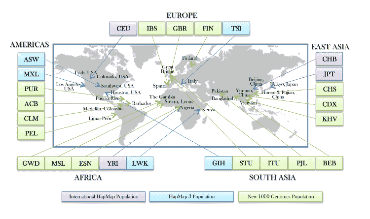

图 1：来自 1000 基因组项目发布版 3 的地理种族群体（来源 [`www.internationalgenome.org/`](http://www.internationalgenome.org/)）

发布的数据集提供了来自 2,504 名健康成年人的数据（年龄 18 岁及以上，第三阶段项目）；只有至少 70 **碱基对** (**bp**) 的读取被使用，直到有更先进的解决方案可用为止。所有来自所有样本的基因组数据被整合，以便将所有变异归因于某个区域。然而，值得注意的是，特定的单倍型可能不会出现在某个特定区域的基因组中；也就是说，多样本方法允许将变异归因于个体的基因型，即使这些变异未被该样本的测序读取覆盖。

换句话说，提供的是重叠的读取数据，并且单一样本基因组未必已被整合。所有个体均使用以下两种技术进行测序：

+   全基因组测序 (*平均深度 = 7.4x*，其中 *x* 表示在给定参考 *bp* 上，平均可能对齐的读取数量)

+   靶向外显子组测序 (*平均深度 = 65.7x*)

此外，个体及其直系亲属（如成人后代）通过高密度 SNP 微阵列进行基因分型。每个基因型包含所有 23 对染色体，并且一个单独的面板文件记录了样本和种群信息。*表 1* 给出了 1000 基因组项目不同发布版的概览：

**表 1 – 1000 基因组项目基因型数据集统计** **（来源：** [`www.internationalgenome.org/data`](http://www.internationalgenome.org/data) **）**

| **1000 基因组发布版** | **变异** | **个体** | **种群** | **文件格式** |
| --- | --- | --- | --- | --- |
| 第 3 阶段 | 第 3 阶段 | 2,504 | 26 | VCF |
| 第 1 阶段 | 3,790 万 | 1,092 | 14 | VCF |
| 试点 | 1,480 万 | 179 | 4 | VCF |

计算五个超级种群组中的等位基因频率（AF）：**EAS=东亚**，**EUR=欧洲**，**AFR=非洲**，**AMR=美洲**，**SAS=南亚**，这些频率来自等位基因数（AN，范围 = [0, 1]）。

请参阅面板文件的详细信息：ftp://ftp.1000genomes.ebi.ac.uk/vol1/ftp/release/20130502/integrated_call_samples_v3.20130502.ALL.panel。

# 算法、工具和技术

来自 1000 基因组项目发布版 3 的大规模数据贡献了 820 GB 的数据。因此，使用 ADAM 和 Spark 来以可扩展的方式预处理和准备数据（即训练、测试和验证集），以供 MLP 和 K-means 模型使用。Sparkling water 用于在 H2O 和 Spark 之间转换数据。

然后，使用 K-means 聚类和多层感知机（MLP，使用 H2O）进行训练。对于聚类和分类分析，需要使用样本 ID、变异 ID 以及替代等位基因的计数，这些基因型信息来自每个样本，我们所使用的大多数变异为 SNP 和插入缺失（indels）。

现在，我们应该了解每个工具的最基本信息，如 ADAM、H2O 以及关于算法的一些背景信息，如 K-means、MLP 用于聚类和分类人口群体。

# H2O 和 Sparkling water

H2O 是一个机器学习的人工智能平台。它提供了丰富的机器学习算法和一个基于网页的数据处理用户界面，既有开源版本，也有商业版本。使用 H2O，可以通过多种语言（如 Java、Scala、Python 和 R）开发机器学习和深度学习应用：

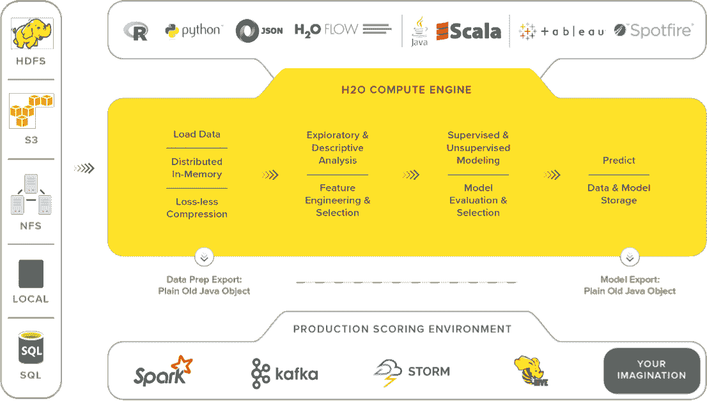

图 2：H2O 计算引擎及其可用功能（来源：https://h20.ai/）

它还具有与 Spark、HDFS、SQL 和 NoSQL 数据库接口的能力。简而言之，H2O 可在 Hadoop/Yarn、Spark 或笔记本电脑上与 R、Python 和 Scala 配合使用。另一方面，Sparkling water 将 H2O 的快速、可扩展机器学习算法与 Spark 的功能结合起来。它通过 Scala/R/Python 驱动计算，并利用 H2O flow 用户界面。简而言之，Sparkling *water = H2O + Spark*。

在接下来的几章中，我们将探索 H2O 和 Sparkling water 的广泛丰富功能；然而，我认为提供一张涵盖所有功能领域的图表会更有帮助：

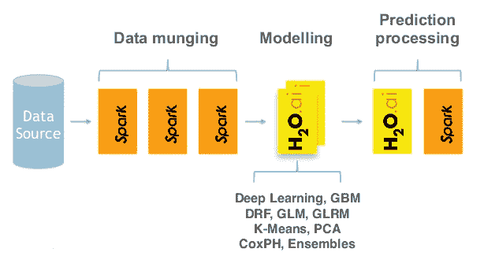

图 3：可用算法和支持的 ETL 技术概览（来源：https://h20.ai/）

这是从 H2O 网站整理出的功能和技术列表。它可以用于数据清洗、使用数据建模以及评分结果模型：

+   流程

+   模型

+   评分工具

+   数据概况

+   **广义线性模型**（**GLM**）

+   预测

+   总结统计

+   决策树

+   混淆矩阵

+   聚合、过滤、分箱和推导列

+   **梯度提升机**（**GBM**）

+   AUC

+   切片、对数变换和匿名化

+   K-means

+   命中率

+   变量创建

+   异常检测

+   PCA/PCA 评分

+   深度学习（DL）

+   多模型评分

+   训练和验证抽样计划

+   朴素贝叶斯

+   网格搜索

以下图表展示了如何清晰地描述 H2O Sparkling water 如何被用来扩展 Apache Spark 的功能。H2O 和 Spark 都是开源系统。Spark MLlib 包含大量功能，而 H2O 在此基础上扩展了许多额外功能，包括深度学习（DL）。它提供了数据转换、建模和评分的工具，正如我们在 Spark ML 中看到的那样。它还提供了一个基于网页的用户界面来进行交互：

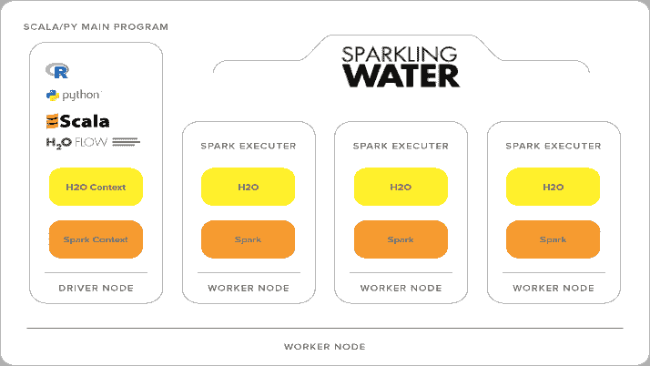

图 4：Sparkling water 扩展 H2O，并与 Spark 互操作（来源：https://h20.ai/）

以下图表展示了 H2O 如何与 Spark 集成。正如我们所知，Spark 有主节点和工作节点；工作节点创建执行器来执行实际的工作。以下是运行基于 Sparkling water 的应用程序的步骤：

+   Spark 的提交命令将 Sparkling water JAR 发送到 Spark 主节点

+   Spark 主节点启动工作节点并分发 JAR 文件

+   Spark 工作节点启动 Executor JVM 以执行工作

+   Spark 执行器启动一个 H2O 实例

H2O 实例嵌入在 Executor JVM 中，因此它与 Spark 共享 JVM 堆内存。当所有 H2O 实例启动后，H2O 将形成一个集群，并提供 H2O flow 网页界面：

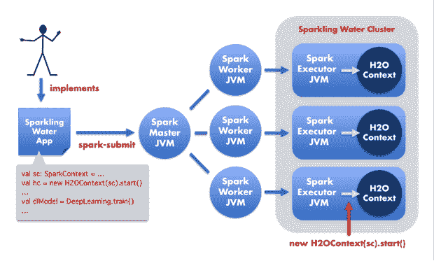

图 5：Sparkling Water 如何融入 Spark 架构（来源：http://blog.cloudera.com/blog/2015/10/how-to-build-a-machine-learning-app-using-sparkling-water-and-apache-spark/）

前面的图解释了 H2O 如何融入 Spark 架构以及如何启动，但数据共享又该如何处理呢？现在的问题是：数据如何在 Spark 和 H2O 之间传递？下面的图解释了这一点：

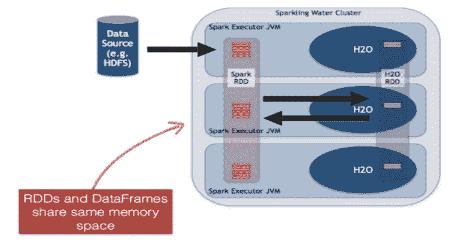

图 6：Spark 和 H2O 之间的数据传递机制

为了更清晰地查看前面的图，已经为 H2O 和 Sparkling Water 创建了一个新的 H2O RDD 数据结构。它是基于 H2O 框架顶部的一个层，每一列代表一个数据项，并独立压缩，以提供最佳的压缩比。

# ADAM 用于大规模基因组数据处理

分析 DNA 和 RNA 测序数据需要大规模的数据处理，以根据其上下文解释数据。优秀的工具和解决方案已经在学术实验室中开发出来，但往往在可扩展性和互操作性方面存在不足。因此，ADAM 是一个基因组分析平台，采用了 Apache Avro、Apache Spark 和 Parquet 构建的专用文件格式。

然而，像 ADAM-Spark 这样的规模化数据处理解决方案可以直接应用于测序管道的输出数据，也就是说，在质量控制、比对、读段预处理和变异定量之后，使用单一样本数据进行处理。举几个例子，DNA 测序的 DNA 变异、RNA 测序的读数计数等。

更多内容见[`bdgenomics.org/`](http://bdgenomics.org/)以及相关的出版物：Massie, Matt 和 Nothaft, Frank 等人，《ADAM：用于云规模计算的基因组格式与处理模式》，UCB/EECS-2013-207，加利福尼亚大学伯克利分校电子工程与计算机科学系。

在我们的研究中，使用 ADAM 实现了支持 VCF 文件格式的可扩展基因组数据分析平台，从而将基于基因型的 RDD 转化为 Spark DataFrame。

# 无监督机器学习

无监督学习是一种机器学习算法，用于通过推理未标记数据集（即由没有标签的输入数据组成的训练集）来对相关数据对象进行分组并发现隐藏的模式。

让我们看一个现实生活中的例子。假设你在硬盘上有一个装满非盗版且完全合法的 MP3 文件的大文件夹。如果你能建立一个预测模型，帮助你自动将相似的歌曲分组并组织成你喜欢的类别，比如乡村、说唱和摇滚，如何？

这是一种将项目分配到组中的行为，以便 MP3 文件能够以无监督的方式添加到相应的播放列表中。对于分类，我们假设你提供了一个正确标记的数据训练集。不幸的是，当我们在现实世界中收集数据时，我们并不总是有这种奢侈的条件。

例如，假设我们想将大量的音乐分成有趣的播放列表。如果我们没有直接访问它们的元数据，我们如何可能将歌曲分组呢？一种可能的方法是混合使用各种机器学习技术，但聚类通常是解决方案的核心：

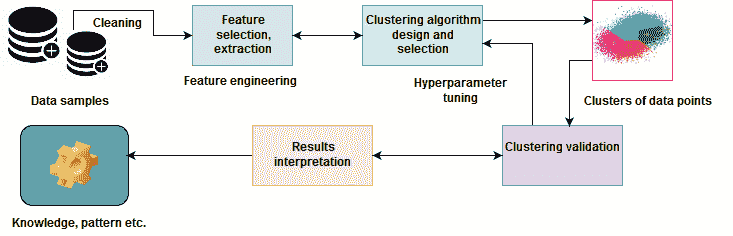

图 7：聚类数据样本一览

换句话说，无监督学习算法的主要目标是探索输入数据中未知/隐藏的模式，这些数据是没有标签的。然而，无监督学习也包含其他技术，以探索性方式解释数据的关键特征，寻找隐藏的模式。为了克服这一挑战，聚类技术被广泛应用于基于某些相似性度量，无监督地对未标记数据点进行分组。

# 人群基因组学与聚类

聚类分析是将数据样本或数据点划分并放入相应的同质类或聚类中。因此，聚类的简单定义可以被看作是将对象组织成一些成员在某种方式上相似的组的过程，如下所示。

这样，聚类就是将一些在某种程度上彼此相似的对象集合在一起，并与属于其他聚类的对象不相似的集合。如果给定的是遗传变异集合，聚类算法会基于相似性将这些对象放入一个组中——也就是人口组或超级人口组。

# K 均值算法是如何工作的？

聚类算法，如 K 均值算法，定位数据点组的质心。然而，为了使聚类更加准确和有效，算法会评估每个点与聚类质心的距离。

最终，聚类的目标是确定一组未标记数据中的内在分组。例如，K 均值算法尝试将相关的数据点聚类到预定义的**三**个（即*k = 3*）聚类中，如*图 8*所示：

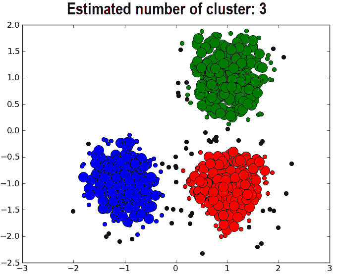

图 8：典型聚类算法的结果及聚类中心的表示

在我们的案例中，结合使用 Spark、ADAM 和 H2O 的方法能够处理大量不同的数据点。假设我们有 n 个数据点（x[i]，i=1, 2… n，举例来说，是遗传变异），这些数据点需要被分为*k*个簇。然后，K-means 将每个数据点分配给一个簇，目标是找到簇的位置*μ[i]*，*i=1...k*，以最小化数据点到簇的距离。从数学上讲，K-means 试图通过解一个方程来实现这一目标——也就是一个优化问题：

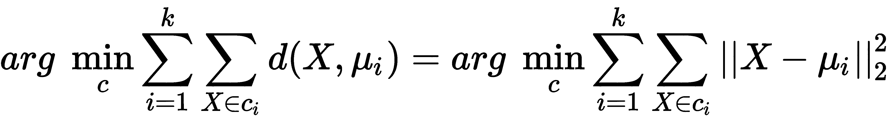

在前面的方程中，*c[i]*是分配给簇*i*的数据点集合，*d(x,μ[i])=∥x−μ[i]∥[2]²*是需要计算的欧几里得距离。该算法通过最小化**簇内平方和**（即**WCSS**），计算数据点与 k 个簇中心之间的距离，其中*c[i]*是属于簇*i*的点的集合。

因此，我们可以理解，使用 K-means 进行的总体聚类操作并非一项简单的任务，而是一个 NP 难优化问题。这也意味着 K-means 算法不仅尝试找到全局最小值，而且经常陷入不同的解中。K-means 算法通过交替执行两个步骤进行：

+   **簇分配步骤**：将每个观测值分配给使得均值产生最小**WCSS**的簇。平方和是平方欧几里得距离。

+   **质心更新步骤**：计算新簇中观测值的均值作为质心。

简而言之，K-means 训练的整体方法可以用下图描述：


图 9：K-means 算法过程的总体方法

# 用于地理族群预测的 DNN

**多层感知器**（**MLP**）是一个示例 DNN，它是一个前馈神经网络；即神经元之间只有不同层之间的连接。它有一个（通过）输入层，一个或多个**线性阈值单元**（**LTUs**）（称为**隐藏层**），以及一个 LTU 的最终层（称为**输出层**）。

每一层（输出层除外）都涉及一个偏置神经元，并且与下一层完全连接，形成一个完全连接的二分图。信号只从输入流向输出，即单向(**前馈**)

直到最近，MLP 是通过反向传播训练算法进行训练的，但现在优化版本（即梯度下降）使用反向模式自动微分；即神经网络通过 SGD 和反向传播作为梯度计算技术进行训练。在 DNN 训练中，为了解决分类问题，使用了两层抽象：

+   **梯度计算**：使用反向传播

+   **优化层级**：使用 SGD、ADAM、RMSPro 和 Momentum 优化器来计算之前计算的梯度

在每个训练周期中，算法将数据输入到网络中，并计算每个神经元在连续层中的状态和输出。然后，算法衡量网络中的输出误差，即期望输出与当前输出之间的差距，并计算最后一个隐藏层中每个神经元对该误差的贡献。

逐步地，输出误差通过所有隐藏层反向传播到输入层，并在反向传播过程中计算所有连接权重的误差梯度：

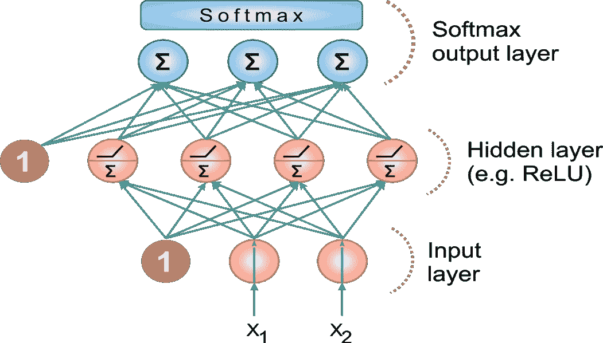

图 10：由输入层、ReLU 和 softmax 组成的现代 MLP

对于多类别分类任务，输出层通常由一个共享的 softmax 函数决定（更多内容请参见*图 2*），与单独的激活函数不同，每个输出神经元提供对应类别的估计概率。

此外，我们将使用树集成方法，例如随机森林来进行分类。目前，我认为我们可以跳过随机森林的基础介绍，因为我们已经在第一章《分析保险赔付严重性》、第二章《分析和预测电信流失》和第三章《基于历史数据的高频比特币价格预测》中详细讲解过它。好了，现在是时候开始了。不过，在动手之前，确保你的编程环境已经准备好总是一个好习惯。

# 配置编程环境

在本节中，我们将介绍如何配置我们的编程环境，以便能够与 Spark、H2O 和 ADAM 互操作。请注意，在笔记本电脑或台式机上使用 H2O 会消耗大量资源。因此，请确保你的笔记本至少有 16GB 的 RAM 和足够的存储空间。

无论如何，我打算在 Eclipse 上将这个项目设置为 Maven 项目。不过，你也可以尝试在 SBT 中定义相同的依赖项。让我们在 `pom.xml` 文件中定义属性标签，以便构建一个适合 Maven 的项目：

```py
<properties>
    <spark.version>2.2.1</spark.version>
    <scala.version>2.11.12</scala.version>
    <h2o.version>3.16.0.2</h2o.version>
    <sparklingwater.version>2.2.6</sparklingwater.version>
    <adam.version>0.23.0</adam.version>
</properties>
```

然后，我们可以使用 Spark 2.2.1 的最新版本（任何 2.x 版本甚至更高版本都应该能正常工作）：

```py
<dependency>
    <groupId>org.apache.spark</groupId>
    <artifactId>spark-core_2.11</artifactId>
    <version>${spark.version}</version>
</dependency>
```

然后，我们需要声明 H2O 和 Sparkling Water 的依赖项，确保它们与属性标签中指定的版本匹配。较新版本可能也能正常工作，你可以尝试：

```py
<dependency>
    <groupId>ai.h2o</groupId>
    <artifactId>sparkling-water-core_2.11</artifactId>
    <version>2.2.6</version>
</dependency>
<dependency>
    <groupId>ai.h2o</groupId>
    <artifactId>sparkling-water-examples_2.11</artifactId>
    <version>2.2.6</version>
</dependency>
<dependency>
    <groupId>ai.h2o</groupId>
    <artifactId>h2o-core</artifactId>
    <version>${h2o.version}</version>
</dependency>
<dependency>
    <groupId>ai.h2o</groupId>
    <artifactId>h2o-scala_2.11</artifactId>
    <version>${h2o.version}</version>
</dependency>
<dependency>
    <groupId>ai.h2o</groupId>
    <artifactId>h2o-algos</artifactId>
    <version>${h2o.version}</version>
</dependency>
<dependency>
    <groupId>ai.h2o</groupId>
    <artifactId>h2o-app</artifactId>
    <version>${h2o.version}</version>
</dependency>
<dependency>
    <groupId>ai.h2o</groupId>
    <artifactId>h2o-persist-hdfs</artifactId>
    <version>${h2o.version}</version>
</dependency>
<dependency>
    <groupId>ai.h2o</groupId>
    <artifactId>google-analytics-java</artifactId>
    <version>1.1.2-H2O-CUSTOM</version>
</dependency>
```

最后，让我们定义 ADAM 及其依赖项：

```py
<dependency>
    <groupId>org.bdgenomics.adam</groupId>
    <artifactId>adam-core_2.11</artifactId>
    <version>0.23.0</version>
</dependency>
```

当我在 Windows 机器上尝试时，我还需要安装 `joda-time` 依赖项。让我们来做这件事（但根据你的平台，可能不需要）：

```py
<dependency>
    <groupId>joda-time</groupId>
    <artifactId>joda-time</artifactId>
    <version>2.9.9</version>
</dependency>
```

一旦你在 Eclipse 中创建了一个 Maven 项目（无论是通过 IDE 手动创建还是使用 `$ mvn install`），所有必需的依赖项将会被下载！我们现在可以开始编码了！

等等！如何在浏览器中查看 H2O 的 UI 界面？为此，我们必须手动下载 H2O 的 JAR 文件并将其作为常规的`.jar`文件运行。简而言之，这是一个三步过程：

+   从[`www.h2o.ai/download/`](https://www.h2o.ai/download/)下载**最新稳定版**H[2]O。然后解压，它包含了开始所需的一切。

+   从你的终端/命令提示符中，使用`java -jar h2o.jar`运行`.jar`文件。

+   在浏览器中输入`http://localhost:54321`：

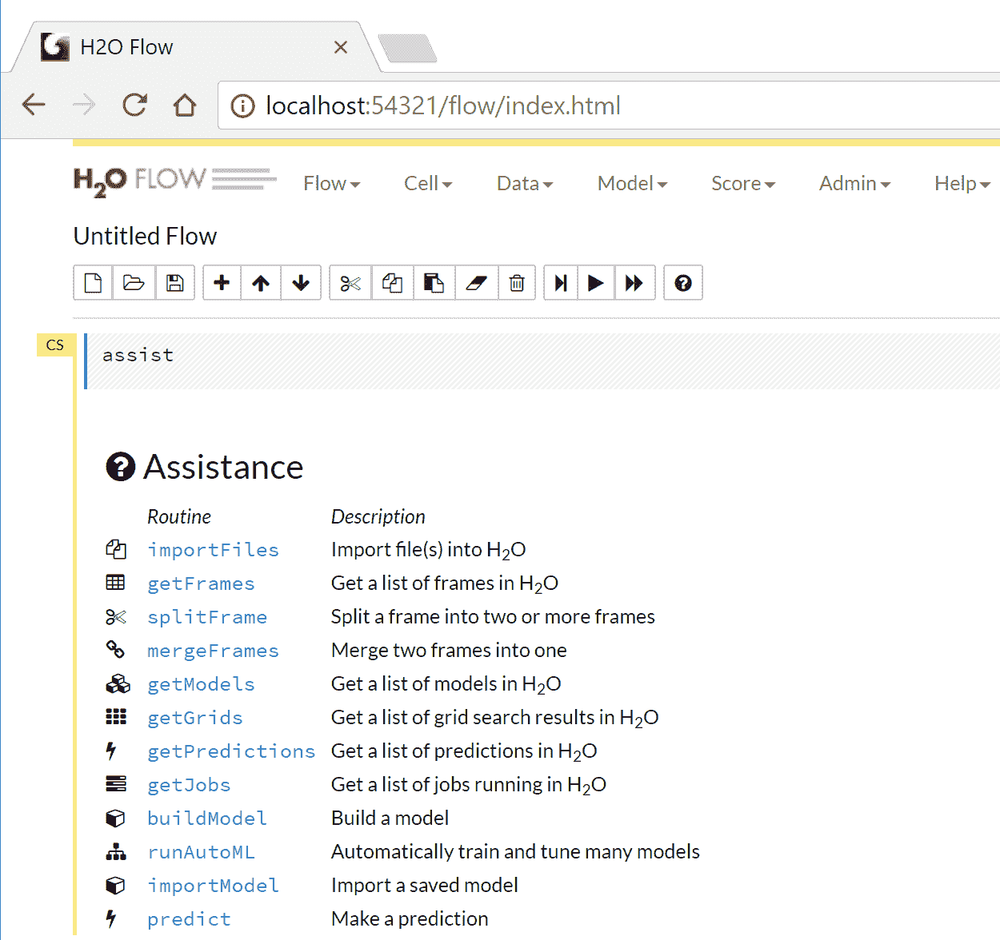

图 11：H2O FLOW 的 UI 界面

这显示了最新版本（即截至 2018 年 1 月 19 日的 h2o-3.16.0.4 版）H2O 的可用功能。然而，我不打算在这里解释所有内容，所以让我们停止探索，因为我相信目前为止，这些关于 H2O 和 Sparkling Water 的知识已经足够。

# 数据预处理和特征工程

我已经说明所有的 24 个 VCF 文件贡献了 820 GB 的数据。因此，我决定只使用 Y 染色体的遗传变异来使演示更加清晰。其大小约为 160 MB，这样不会带来巨大的计算挑战。你可以从 ftp://ftp.1000genomes.ebi.ac.uk/vol1/ftp/release/20130502/下载所有的 VCF 文件以及面板文件。

让我们开始吧。我们从创建`SparkSession`开始，这是 Spark 应用程序的网关：

```py
val spark:SparkSession = SparkSession
    .builder()
    .appName("PopStrat")
    .master("local[*]")
    .config("spark.sql.warehouse.dir", "C:/Exp/")
    .getOrCreate()
```

然后让我们告诉 Spark VCF 文件和面板文件的路径：

```py
val genotypeFile = "<path>/ALL.chrY.phase3_integrated_v2a.20130502.genotypes.vcf"
val panelFile = "<path>/integrated_call_samples_v3.20130502.ALL.panel "
```

我们使用 Spark 处理面板文件，以访问目标种群数据并识别种群组。我们首先创建一个我们想要预测的种群集合：

```py
val populations = Set("FIN", "GBR", "ASW", "CHB", "CLM")
```

然后我们需要创建一个样本 ID → 种群的映射，以便筛选出我们不感兴趣的样本：

```py
def extract(file: String,
filter: (String, String) => Boolean): Map[String, String] = {
Source
    .fromFile(file)
    .getLines()
    .map(line => {
val tokens = line.split(Array('t', ' ')).toList
tokens(0) -> tokens(1)
}).toMap.filter(tuple => filter(tuple._1, tuple._2))
}

val panel: Map[String, String] = extract(
panelFile,
(sampleID: String, pop: String) => populations.contains(pop))
```

请注意，面板文件会生成所有个体的样本 ID、种群组、族群、超种群组以及性别，具体如下所示：

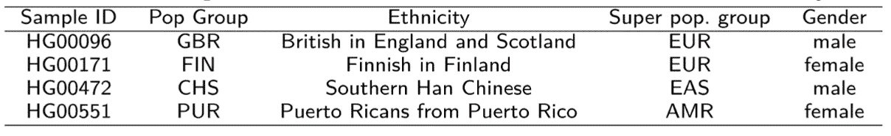

图 12：样本面板文件的内容

然后加载 ADAM 基因型，并筛选基因型，使我们仅保留那些在我们感兴趣的种群中的基因型：

```py
val allGenotypes: RDD[Genotype] = sc.loadGenotypes(genotypeFile).rdd
val genotypes: RDD[Genotype] = allGenotypes.filter(genotype => {
    panel.contains(genotype.getSampleId)
    })
```

接下来的工作是将`Genotype`对象转换为我们自己的`SampleVariant`对象，以尽量节省内存。然后，将`genotype`对象转换为一个`SampleVariant`对象，其中只包含我们进一步处理所需的数据：样本 ID（唯一标识特定样本）；变异 ID（唯一标识特定遗传变异）；以及替代等位基因的计数（仅在样本与参考基因组不同的情况下）。

准备样本变异的签名如下所示；它接受`sampleID`、`variationId`和`alternateCount`：

```py
case class SampleVariant(sampleId: String,
        variantId: Int,
        alternateCount: Int)
```

好的！让我们从`genotype`文件中找到`variantID`。`variantId`是一个`String`类型，由名称、起始位置和染色体上的终止位置组成：

```py
def variantId(genotype: Genotype): String = {
 val name = genotype.getVariant.getContigName
 val start = genotype.getVariant.getStart
 val end = genotype.getVariant.getEnd
s"$name:$start:$end"
}
```

一旦我们有了`variantID`，就应该寻找替代计数。在 `genotype` 文件中，那些没有等位基因参考的对象大致上是遗传变体：

```py
def alternateCount(genotype: Genotype): Int = {
      genotype.getAlleles.asScala.count(_ != GenotypeAllele.REF)
   }
```

最后，我们构建一个简单的变体对象。为此，我们需要对样本 ID 进行内联，因为它们在 VCF 文件中会频繁出现：

```py
def toVariant(genotype: Genotype): SampleVariant = {
 new SampleVariant(genotype.getSampleId.intern(),
            variantId(genotype).hashCode(),
            alternateCount(genotype))
        }
```

很棒！我们已经能够构建简单的变体了。现在，下一项具有挑战性的任务是准备 `variantsRDD`，然后我们才能创建 `variantsBySampleId` RDD：

```py
val variantsRDD: RDD[SampleVariant] = genotypes.map(toVariant)
```

然后，我们必须按样本 ID 对变体进行分组，以便逐个样本处理变体。之后，我们可以获得将用于查找缺失变体的样本总数。最后，我们必须按变体 ID 对变体进行分组，并过滤掉那些在某些样本中缺失的变体：

```py
val variantsBySampleId: RDD[(String, Iterable[SampleVariant])] =
variantsRDD.groupBy(_.sampleId)

val sampleCount: Long = variantsBySampleId.count()
println("Found " + sampleCount + " samples")

val variantsByVariantId: RDD[(Int, Iterable[SampleVariant])] =
variantsRDD.groupBy(_.variantId).filter {
 case (_, sampleVariants) => sampleVariants.size == sampleCount
    }
```

现在，让我们创建一个变体 ID → 替代计数大于零的样本计数的映射。然后我们过滤掉那些不在所需频率范围内的变体。这里的目标只是减少数据集中的维度数量，以便更容易训练模型：

```py
val variantFrequencies: collection.Map[Int, Int] = variantsByVariantId
.map {
 case (variantId, sampleVariants) =>
        (variantId, sampleVariants.count(_.alternateCount > 0))
        }.collectAsMap()
```

在基于变体 ID 对样本进行分组并过滤掉没有支持的变体之前，样本（或个体）的总数已确定，以简化数据预处理并更好地应对大量变体（总计 8440 万个）。

*图 13* 显示了 1000 基因组项目中基因型变体集合的概念视图，并展示了从相同数据中提取特征，以训练我们的 K-means 和 MLP 模型的过程：

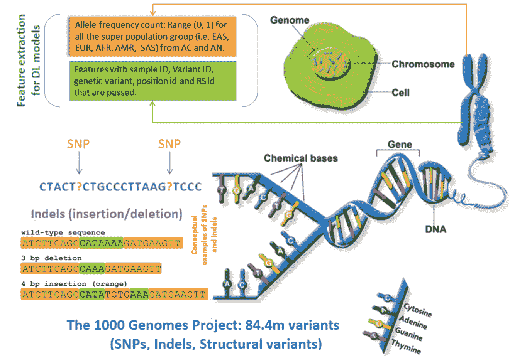

图 13：1000 基因组项目中基因型变体集合的概念视图

指定的范围是任意的，选择它是因为它包含了一个合理数量的变体，但不至于太多。具体来说，对于每个变体，都计算了替代等位基因的频率，排除了少于 12 个替代等位基因的变体，分析中留下了约 300 万个变体（来自 23 个染色体文件）：

```py
val permittedRange = inclusive(11, 11)
val filteredVariantsBySampleId: RDD[(String, Iterable[SampleVariant])] =
    variantsBySampleId.map {
 case (sampleId, sampleVariants) =>
 val filteredSampleVariants = sampleVariants.filter(
        variant =>
        permittedRange.contains(
        variantFrequencies.getOrElse(variant.variantId, -1)))
    (sampleId, filteredSampleVariants)
    }
```

一旦我们有了`filteredVariantsBySampleId`，下一个任务是对每个样本 ID 的变体进行排序。每个样本现在应该具有相同数量的排序变体：

```py
val sortedVariantsBySampleId: RDD[(String, Array[SampleVariant])] =
    filteredVariantsBySampleId.map {
 case (sampleId, variants) =>
        (sampleId, variants.toArray.sortBy(_.variantId))
        }
    println(s"Sorted by Sample ID RDD: " + sortedVariantsBySampleId.first())
```

现在，RDD 中的所有项应该具有相同顺序的相同变体。最终任务是使用`sortedVariantsBySampleId`构建一个包含区域和替代计数的 `Row` 类型 RDD：

```py
val rowRDD: RDD[Row] = sortedVariantsBySampleId.map {
 case (sampleId, sortedVariants) =>
 val region: Array[String] = Array(panel.getOrElse(sampleId, "Unknown"))
 val alternateCounts: Array[Int] = sortedVariants.map(_.alternateCount)
        Row.fromSeq(region ++ alternateCounts)
        }
```

因此，我们只需使用第一个来构建训练数据框架的头部：

```py
val header = StructType(
        Seq(StructField("Region", StringType)) ++
        sortedVariantsBySampleId
            .first()
            ._2
            .map(variant => {
                StructField(variant.variantId.toString, IntegerType)
        }))
```

干得好！到目前为止，我们已经得到了我们的 RDD 和 `StructType` 头信息。现在，我们可以通过最小的调整/转换来使用 H2O 和 Spark 的深度/机器学习算法。整个端到端项目的流程如下图所示：

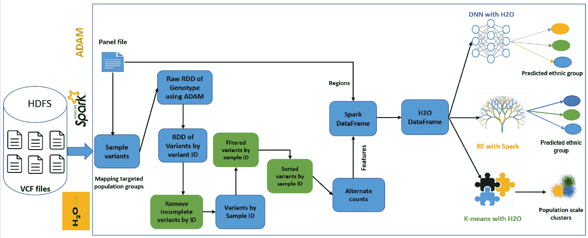

图 14：整体方法的管道流程

# 模型训练与超参数调优

一旦我们有了`rowRDD`和表头，接下来的任务是使用表头和`rowRDD`构建 Schema DataFrame 的行：

```py
val sqlContext = spark.sqlContext
val schemaDF = sqlContext.createDataFrame(rowRDD, header)
schemaDF.printSchema()
schemaDF.show(10)
>>>
```

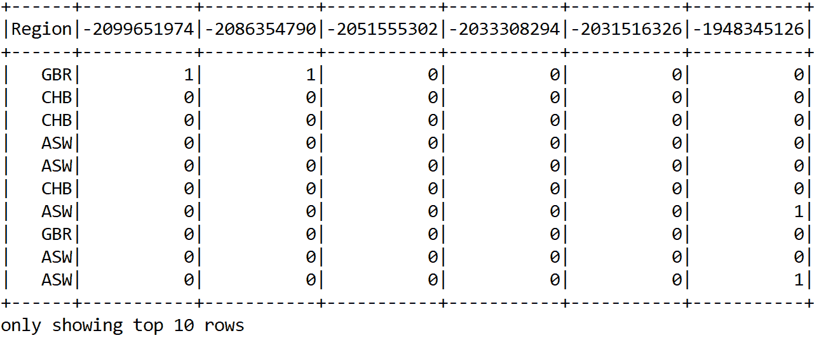

图 15：包含特征和标签（即 Region）列的训练数据集快照

在前面的 DataFrame 中，仅显示了少数列，包括标签，以便适合页面。

# 基于 Spark 的 K-means 用于大规模人口聚类

在前面的章节中，我们已经了解了 K-means 的工作原理。所以我们可以直接进入实现部分。由于训练是无监督的，我们需要删除标签列（即`Region`）：

```py
val sqlContext = sparkSession.sqlContext
val schemaDF = sqlContext.createDataFrame(rowRDD, header).drop("Region")
schemaDF.printSchema()
schemaDF.show(10)
>>>
```

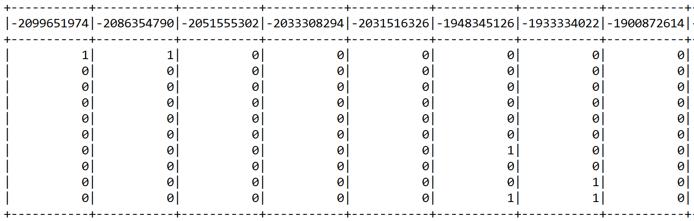

图 16：没有标签（即 Region）的 K-means 训练数据集快照

现在，我们已经在第一章，《分析保险严重性索赔》和第二章，《分析与预测电信流失》中看到，Spark 期望监督训练时有两列（即特征和标签），而无监督训练时它只期望包含特征的单列。由于我们删除了标签列，现在需要将整个变量列合并为一个`features`列。因此，我们将再次使用`VectorAssembler()`转换器。首先，我们选择要嵌入向量空间的列：

```py
val featureCols = schemaDF.columns
```

然后，我们实例化`VectorAssembler()`转换器，指定输入列和输出列：

```py
val assembler = 
new VectorAssembler()
    .setInputCols(featureCols)
    .setOutputCol("features")
val assembleDF = assembler.transform(schemaDF).select("features")
```

现在让我们看看它的效果：

```py
assembleDF.show()
>>>
```

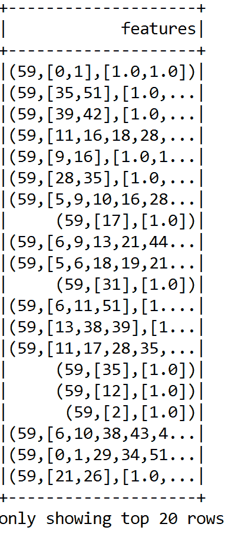

图 17：K-means 特征向量的快照

由于我们的数据集维度非常高，我们可以使用一些降维算法，如 PCA。因此，我们通过实例化一个`PCA()`转换器来实现，如下所示：

```py
val pca = 
new PCA()
    .setInputCol("features")
    .setOutputCol("pcaFeatures")
    .setK(50)
    .fit(assembleDF)
```

然后我们转换组合后的 DataFrame（即已组合的）和前 50 个主成分。你可以调整这个数量。最后，为了避免歧义，我们将`pcaFeatures`列重命名为`features`：

```py
val pcaDF = pca.transform(assembleDF)
            .select("pcaFeatures")
            .withColumnRenamed("pcaFeatures", "features")
pcaDF.show()
>>>
```

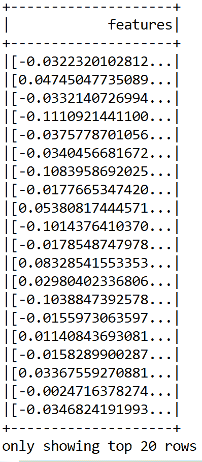

图 18：前 50 个主成分的快照，作为最重要的特征

很棒！一切顺利。最后，我们准备好训练 K-means 算法了：

```py
val kmeans = 
new KMeans().setK(5).setSeed(12345L)
val model = kmeans.fit(pcaDF)
```

所以我们通过计算**组内平方误差和**（**WSSSE**）来评估聚类效果：

```py
val WSSSE = model.computeCost(pcaDF)
println("Within-Cluster Sum of Squares for k = 5 is" + WSSSE)
>>>
```

# 确定最佳聚类数

像 K-means 这样的聚类算法的优点是，它们可以对具有无限特征数的数据进行聚类。当你拥有原始数据并且希望了解数据中的模式时，它们是非常有用的工具。然而，在进行实验之前决定聚类数可能并不成功，有时甚至会导致过拟合或欠拟合的问题。

另一方面，K-means、二分 K-means 和高斯混合这三种算法的一个共同点是，聚类数必须事先确定，并作为参数传递给算法。因此，非正式地说，确定聚类数是一个独立的优化问题，需要解决。

现在，我们将使用基于肘部法则的启发式方法。从 K=2 个聚类开始，然后通过增加 K 值运行 K-means 算法，观察成本函数 WCSS 的变化：

```py
val iterations = 20
for (i <- 2 to iterations) {
 val kmeans = new KMeans().setK(i).setSeed(12345L)
 val model = kmeans.fit(pcaDF)
 val WSSSE = model.computeCost(pcaDF)
        println("Within-Cluster Sum of Squares for k = " + i + " is " +
                WSSSE)
    }
```

在某些时刻，可以观察到成本函数有一个大幅下降，但随着`k`值增加，改进变得非常微小。正如聚类分析文献中所建议的，我们可以选择在 WCSS 的最后一次大幅下降之后的`k`值作为最优值。现在，让我们来看一下在 2 到 20 之间的不同聚类数的 WCSS 值，例如：

```py
Within-Cluster Sum of Squares for k = 2 is 453.161838161838
Within-Cluster Sum of Squares for k = 3 is 438.2392344497606
Within-Cluster Sum of Squares for k = 4 is 390.2278787878787
Within-Cluster Sum of Squares for k = 5 is 397.72112098427874
Within-Cluster Sum of Squares for k = 6 is 367.8890909090908
Within-Cluster Sum of Squares for k = 7 is 362.3360347662672
Within-Cluster Sum of Squares for k = 8 is 347.49306362861336
Within-Cluster Sum of Squares for k = 9 is 327.5002901103624
Within-Cluster Sum of Squares for k = 10 is 327.29376873556436
Within-Cluster Sum of Squares for k = 11 is 315.2954156954155
Within-Cluster Sum of Squares for k = 12 is 320.2478696814693
Within-Cluster Sum of Squares for k = 13 is 308.7674242424241
Within-Cluster Sum of Squares for k = 14 is 314.64784054938576
Within-Cluster Sum of Squares for k = 15 is 297.38523698523704
Within-Cluster Sum of Squares for k = 16 is 294.26114718614707
Within-Cluster Sum of Squares for k = 17 is 284.34890572390555
Within-Cluster Sum of Squares for k = 18 is 280.35662525879917
Within-Cluster Sum of Squares for k = 19 is 272.765762015762
Within-Cluster Sum of Squares for k = 20 is 272.05702362771336
```

现在让我们讨论如何利用肘部法则来确定聚类数。如下面所示，我们计算了成本函数 WCSS，作为 K-means 算法在选定人群组的 Y 染色体基因变异上的聚类数函数。

可以观察到，当`k = 9`时出现了一个相对**较大的下降**（尽管这并不是一个剧烈的下降）。因此，我们选择将聚类数设置为 10，如*图 10*所示：

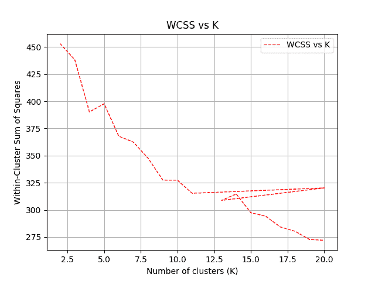

图 19：聚类数与 WCSS 的关系

# 使用 H2O 进行种族预测

到目前为止，我们已经看到如何聚类基因变异。我们还使用了肘部法则，找到了最优`k`值和初步的聚类数。现在我们应该探索另一个我们一开始计划的任务——即种族预测。

在之前的 K-means 部分中，我们准备了一个名为`schemaDF`的 Spark 数据框。这个数据框不能直接用于 H2O。然而，我们需要进行额外的转换。我们使用`asH2OFrame()`方法将 Spark 数据框转换为 H2O 框架：

```py
val dataFrame = h2oContext.asH2OFrame(schemaDF)
```

现在，有一件重要的事情你需要记住，当使用 H2O 时，如果没有将标签列转换为类别型，它会将分类任务视为回归任务。为了避免这种情况，我们可以使用 H2O 的`toCategoricalVec()`方法。由于 H2O 框架是弹性的，我们可以进一步更新相同的框架：

```py
dataFrame.replace(dataFrame.find("Region"),
dataFrame.vec("Region").toCategoricalVec()).remove()
dataFrame.update()
```

现在我们的 H2O 框架已准备好训练基于 H2O 的深度学习模型（即 DNN，或者更具体地说，是深度 MLP）。然而，在开始训练之前，让我们使用 H2O 内置的`FrameSplitter()`方法随机将数据框拆分为 60%的训练集、20%的测试集和 20%的验证集：

```py
val frameSplitter = new FrameSplitter(
        dataFrame, Array(.8, .1), Array("training", "test", "validation")
        .map(Key.make[Frame]),null)

water.H2O.submitTask(frameSplitter)
val splits = frameSplitter.getResult
val training = splits(0)
val test = splits(1)
val validation = splits(2)
```

太棒了！我们的训练集、测试集和验证集已经准备好，现在让我们为我们的深度学习模型设置参数：

```py
// Set the parameters for our deep learning model.
val deepLearningParameters = new DeepLearningParameters()
        deepLearningParameters._train = training
        deepLearningParameters._valid = validation
        deepLearningParameters._response_column = "Region"
        deepLearningParameters._epochs = 200
        deepLearningParameters._l1 = 0.01
        deepLearningParameters._seed = 1234567
        deepLearningParameters._activation = Activation.RectifierWithDropout
        deepLearningParameters._hidden = ArrayInt
```

在前面的设置中，我们已经指定了一个具有三层隐藏层的 MLP，隐藏层神经元数分别为 128、256 和 512。因此，总共有五层，包括输入层和输出层。训练将迭代最多 200 次。由于隐藏层神经元数量较多，我们应该使用 dropout 来避免过拟合。为了获得更好的正则化效果，我们使用了 L1 正则化。

前面的设置还表明，我们将使用训练集来训练模型，同时使用验证集来验证训练结果。最后，响应列为`Region`。另一方面，种子用于确保结果的可复现性。

一切准备就绪！现在，让我们来训练深度学习模型：

```py
val deepLearning = new DeepLearning(deepLearningParameters)
val deepLearningTrained = deepLearning.trainModel
val trainedModel = deepLearningTrained.get
```

根据你的硬件配置，这可能需要一段时间。因此，现在是时候休息一下，喝杯咖啡了！一旦我们得到训练好的模型，我们可以查看训练误差：

```py
val error = trainedModel.classification_error()
println("Training Error: " + error)
>>>
Training Error: 0.5238095238095238
```

不幸的是，训练结果并不理想！不过，我们应该尝试不同的超参数组合。尽管误差较高，但让我们不要过于担心，先评估一下模型，计算一些模型指标，并评估模型质量：

```py
val trainMetrics = ModelMetricsSupport.modelMetricsModelMetricsMultinomial
val met = trainMetrics.cm()

println("Accuracy: "+ met.accuracy())
println("MSE: "+ trainMetrics.mse)
println("RMSE: "+ trainMetrics.rmse)
println("R2: " + trainMetrics.r2)
>>>
Accuracy: 0.42105263157894735
MSE: 0.49369297490740655
RMSE: 0.7026328877211816
R2: 0.6091597281983032
```

准确率不高！不过，你应该尝试其他 VCF 文件，并调整超参数。例如，在减少隐藏层神经元数量、使用 L2 正则化和 100 轮训练后，我的准确率提高了大约 20%：

```py
val deepLearningParameters = new DeepLearningParameters()
        deepLearningParameters._train = training
        deepLearningParameters._valid = validation
        deepLearningParameters._response_column = "Region"
        deepLearningParameters._epochs = 100
        deepLearningParameters._l2 = 0.01
        deepLearningParameters._seed = 1234567
        deepLearningParameters._activation = Activation.RectifierWithDropout
        deepLearningParameters._hidden = ArrayInt
>>>
Training Error: 0.47619047619047616
Accuracy: 0.5263157894736843
MSE: 0.39112548936806274
RMSE: 0.6254002633258662
R2: 0.690358987583617
```

另一个改进的线索在这里。除了这些超参数外，使用基于 H2O 的深度学习算法的另一个优势是我们可以获取相对的变量/特征重要性。在前面的章节中，我们已经看到，在 Spark 中使用随机森林算法时，也可以计算变量的重要性。

因此，基本思路是，如果模型表现不佳，值得删除一些不重要的特征并重新进行训练。现在，在有监督训练过程中，我们可以找到特征的重要性。我观察到以下特征重要性：

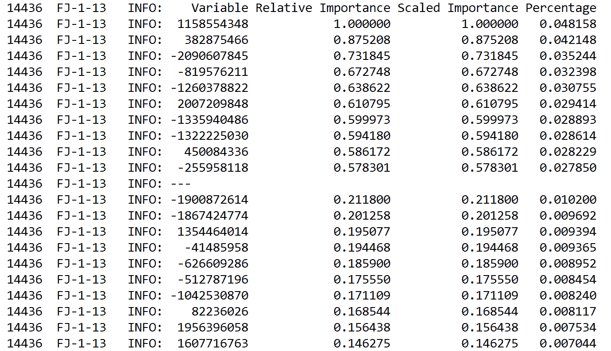

图 20：使用 H2O 计算的相对特征重要性

现在的问题是，为什么不尝试删除这些特征，然后重新训练并观察准确性是否提高？这个问题留给读者思考。

# 使用随机森林进行种族预测

在上一节中，我们已经看到了如何使用 H2O 进行种族预测。然而，我们未能取得更好的预测准确性。因此，H2O 目前还不够成熟，无法计算所有必要的性能指标。

那么，为什么不尝试基于 Spark 的树集成技术，比如随机森林或梯度提升树（GBT）呢？因为我们已经看到在大多数情况下，随机森林（RF）表现出更好的预测精度，所以我们就从这个开始试试。

在 K-means 部分，我们已经准备好了名为`schemaDF`的 Spark DataFrame。因此，我们可以简单地将变量转换成我们之前描述的特征向量。然而，为了实现这一点，我们需要排除标签列。我们可以使用`drop()`方法来做到这一点，如下所示：

```py
val featureCols = schemaDF.columns.drop(1)
val assembler = 
new VectorAssembler()
    .setInputCols(featureCols)
    .setOutputCol("features")
val assembleDF = assembler.transform(schemaDF).select("features", "Region")
assembleDF.show()
```

在此阶段，您可以进一步降低维度，并使用 PCA 或任何其他特征选择算法提取最主要的成分。然而，我将把这个留给您决定。由于 Spark 期望标签列是数值型的，我们必须将民族名称转换为数值。我们可以使用`StringIndexer()`来完成这一操作。这是非常简单的：

```py
val indexer = 
new StringIndexer()
    .setInputCol("Region")
    .setOutputCol("label")

val indexedDF =  indexer.fit(assembleDF)
                .transform(assembleDF)
                .select("features", "label") 
```

然后我们随机划分数据集进行训练和测试。在我们的例子中，假设我们使用 75%作为训练数据，其余作为测试数据：

```py
val seed = 12345L
val splits = indexedDF.randomSplit(Array(0.75, 0.25), seed)
val (trainDF, testDF) = (splits(0), splits(1))
```

由于这是一个小数据集，考虑到这一点，我们可以`缓存`训练集和测试集，以便更快地访问：

```py
trainDF.cache
testDF.cache
val rf = new RandomForestClassifier()
    .setLabelCol("label")
    .setFeaturesCol("features")
    .setSeed(1234567L)
```

现在让我们创建一个`paramGrid`，用于在决策树的`maxDepth`参数中进行搜索，以获得最佳模型：

```py
val paramGrid =
new ParamGridBuilder()
    .addGrid(rf.maxDepth, 3 :: 5 :: 15 :: 20 :: 25 :: 30 :: Nil)
    .addGrid(rf.featureSubsetStrategy, "auto" :: "all" :: Nil)
    .addGrid(rf.impurity, "gini" :: "entropy" :: Nil)
    .addGrid(rf.maxBins, 3 :: 5 :: 10 :: 15 :: 25 :: 35 :: 45 :: Nil)
    .addGrid(rf.numTrees, 5 :: 10 :: 15 :: 20 :: 30 :: Nil)
    .build()

val evaluator = new MulticlassClassificationEvaluator()
    .setLabelCol("label")
    .setPredictionCol("prediction")
```

接着，我们设置 10 折交叉验证，以获得优化且稳定的模型。这将减少过拟合的可能性：

```py
val numFolds = 10
val crossval = 
new CrossValidator()
    .setEstimator(rf)
    .setEvaluator(evaluator)
    .setEstimatorParamMaps(paramGrid)
    .setNumFolds(numFolds)
```

好的，现在我们准备进行训练了。那么让我们使用最佳超参数设置来训练随机森林模型：

```py
val cvModel = crossval.fit(trainDF)
```

现在我们已经得到了交叉验证和最佳模型，为什么不使用测试集来评估模型呢？为什么不呢？首先，我们为每个实例计算预测 DataFrame。然后我们使用`MulticlassClassificationEvaluator()`来评估性能，因为这是一个多类分类问题。

此外，我们还计算了性能指标，如`准确率`、`精确率`、`召回率`和`F1`值。请注意，使用 RF 分类器时，我们可以获得`加权精确率`和`加权召回率`：

```py
val predictions = cvModel.transform(testDF)
predictions.show(10)
>>>
```

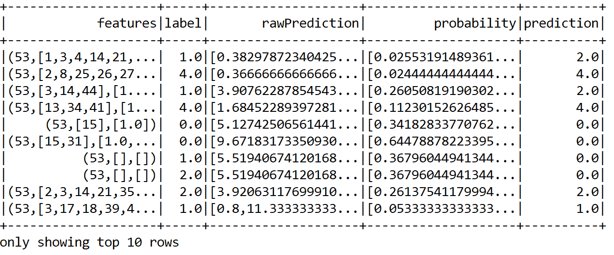

图 21：使用随机森林的原始预测概率、真实标签和预测标签

```py
val metric = 
new MulticlassClassificationEvaluator()
    .setLabelCol("label")
    .setPredictionCol("prediction")

val evaluator1 = metric.setMetricName("accuracy")
val evaluator2 = metric.setMetricName("weightedPrecision")
val evaluator3 = metric.setMetricName("weightedRecall")
val evaluator4 = metric.setMetricName("f1")
```

现在让我们计算分类的`准确率`、`精确率`、`召回率`、`F1`值以及测试数据上的错误率：

```py
val accuracy = evaluator1.evaluate(predictions)
val precision = evaluator2.evaluate(predictions)
val recall = evaluator3.evaluate(predictions)
val f1 = evaluator4.evaluate(predictions)
```

最后，我们打印出性能指标：

```py
println("Accuracy = " + accuracy);
println("Precision = " + precision)
println("Recall = " + recall)
println("F1 = " + f1)
println(s"Test Error = ${1 - accuracy}")
>>>
Accuracy = 0.7196470196470195
Precision = 0.7196470196470195
Recall = 0.7196470196470195
F1 = 0.7196470196470195
Test Error = 0.28035298035298046
```

是的，结果证明它的表现更好。这有点出乎意料，因为我们原本希望从深度学习模型中获得更好的预测准确性，但并没有得到。如我之前所说，我们仍然可以尝试使用 H2O 的其他参数。无论如何，现在我们看到使用随机森林大约提高了 25%。不过，可能仍然可以进一步改进。

# 总结

在本章中，我们展示了如何与一些大数据工具（如 Spark、H2O 和 ADAM）进行交互，以处理大规模基因组数据集。我们应用了基于 Spark 的 K-means 算法，分析了来自 1000 基因组计划的数据，旨在对人群规模的基因型变异进行聚类。

然后，我们应用基于 H2O 的深度学习（DL）算法和基于 Spark 的随机森林模型来预测地理族群。此外，我们还学习了如何安装和配置 H2O 进行深度学习。这些知识将在后续章节中使用。最后，也是最重要的，我们学会了如何使用 H2O 计算变量重要性，以便选择训练集中最重要的特征。

在下一章中，我们将看到如何有效地使用**潜在狄利克雷分配**（**LDA**）算法来发现数据中的有用模式。我们将比较其他主题建模算法以及 LDA 的可扩展性。同时，我们还将利用**自然语言处理**（**NLP**）库，如斯坦福 NLP。
