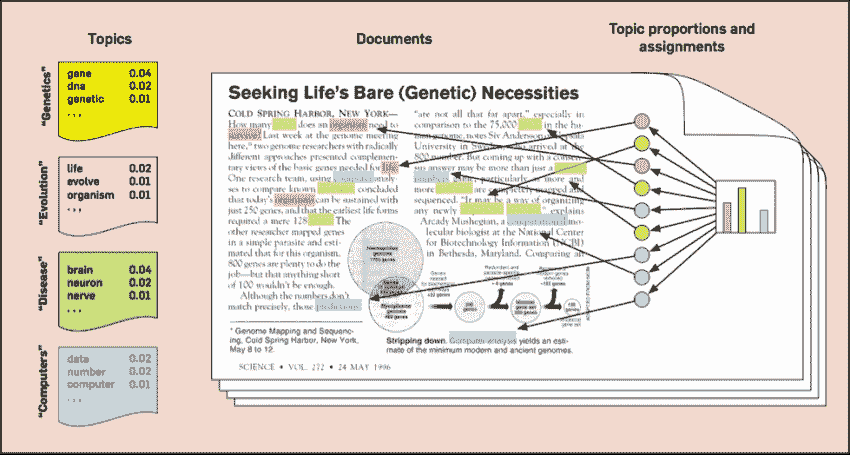
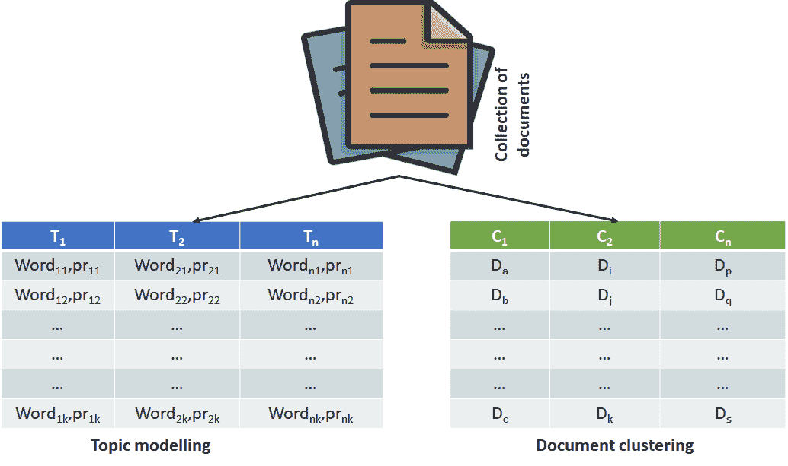
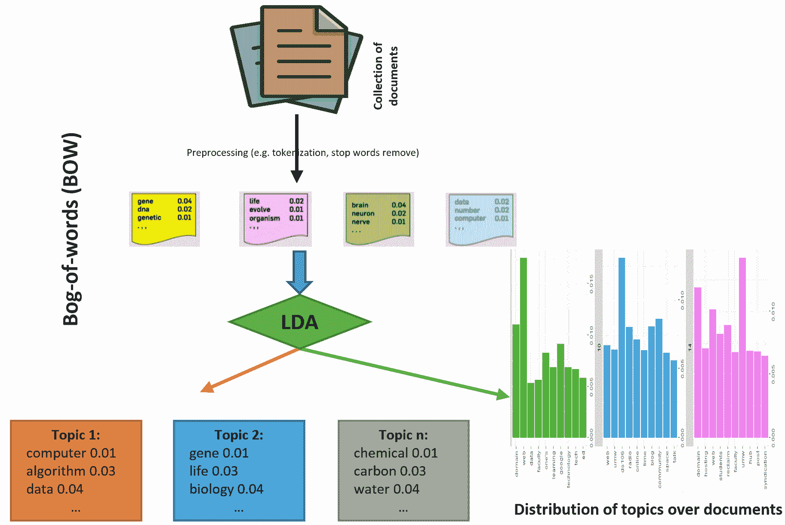
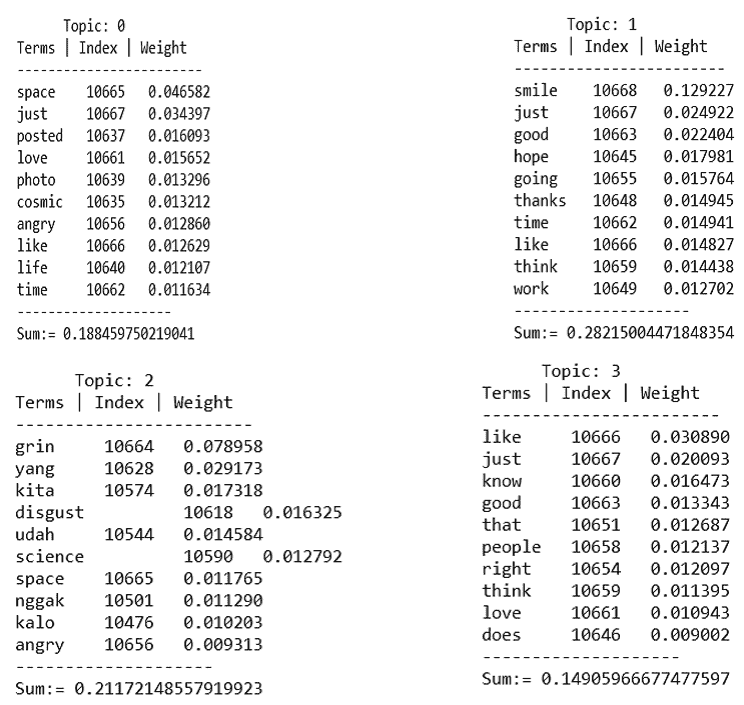
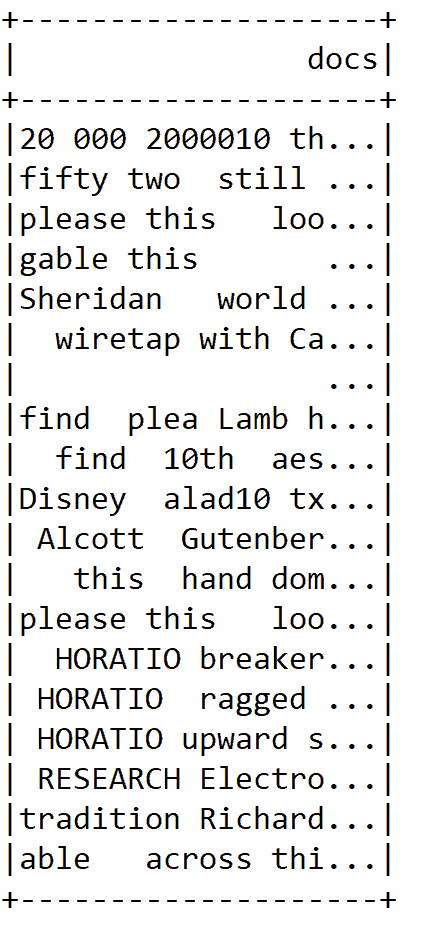
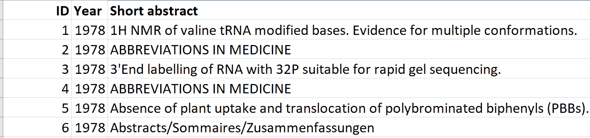
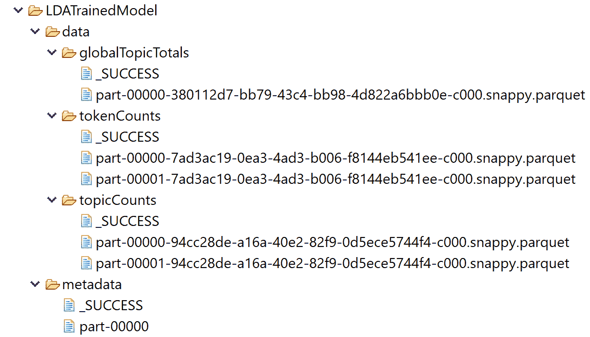

# 第五章：主题建模 - 对大规模文本的深入理解

**主题建模**（**TM**）是一种广泛用于从大量文档中挖掘文本的技术。通过这些主题，可以总结和组织包含主题词及其相对权重的文档。这个项目将使用的数据集是纯文本格式，未经过结构化处理。

我们将看到如何有效地使用**潜在狄利克雷分配**（**LDA**）算法来发现数据中的有用模式。我们将比较其他 TM 算法及 LDA 的可扩展性。此外，我们还将利用**自然语言处理**（**NLP**）库，如斯坦福 NLP。

简而言之，在这个端到端的项目中，我们将学习以下主题：

+   主题建模与文本聚类

+   LDA 算法是如何工作的？

+   使用 LDA、Spark MLlib 和标准 NLP 进行主题建模

+   其他主题模型与 LDA 的可扩展性测试

+   模型部署

# 主题建模与文本聚类

在 TM 中，主题是通过一组词汇来定义的，每个词汇在该主题下都有一个出现的概率，不同的主题有各自的词汇集合及其相应的概率。不同的主题可能共享一些词汇，而一个文档可能与多个主题相关联。简而言之，我们有一组文本数据集，即一组文本文件。现在，挑战在于使用 LDA 从数据中发现有用的模式。

有一种流行的基于 LDA 的 TM 方法，其中每个文档被视为多个主题的混合，每个文档中的词汇被认为是从文档的主题中随机抽取的。这些主题被视为隐藏的，必须通过分析联合分布来揭示，从而计算给定观察变量和文档中的词语的条件分布（主题）。TM 技术广泛应用于从大量文档中挖掘文本的任务。这些主题随后可以用来总结和组织包含主题词及其相对权重的文档（见*图 1*）：



图 1：TM 概述（来源：Blei, D.M.等，概率主题模型，ACM 通信，55(4)，77-84，2012）

如前图所示，主题的数量远小于与文档集合相关联的词汇量，因此主题空间的表示可以被看作是一种降维过程：



图 2：TM 与文本聚类的对比

与 TM 相比，在文档聚类中，基本思想是根据一种广为人知的相似性度量，将文档分组。为了进行分组，每个文档都由一个向量表示，该向量表示文档中词汇的权重。

通常使用词频-逆文档频率（也称为 **TF-IDF** 方案）来进行加权。聚类的最终结果是一个簇的列表，每个文档出现在某一个簇中。TM 和文本聚类的基本区别可以通过下图来说明：

# LDA 算法是如何工作的？

LDA 是一个主题模型，用于从一组文本文档中推断主题。LDA 可以被看作是一个聚类算法，其中主题对应于聚类中心，文档对应于数据集中的实例（行）。主题和文档都存在于特征空间中，其中特征向量是词频向量（词袋）。LDA 不是通过传统的距离估计聚类，而是使用基于文本文档生成的统计模型的函数（见 *图 3*）：



图 3：LDA 算法在一组文档上的工作原理

具体来说，我们希望讨论人们在大量文本中最常谈论的话题。自 Spark 1.3 发布以来，MLlib 支持 LDA，这是文本挖掘和自然语言处理领域中最成功使用的主题模型（TM）技术之一。

此外，LDA 还是第一个采用 Spark GraphX 的 MLlib 算法。以下术语是我们正式开始 TM 应用之前值得了解的：

+   `"word" = "term"`：词汇表中的一个元素

+   `"token"`：出现在文档中的术语实例

+   `"topic"`：表示某一概念的词汇的多项式分布

在 Spark 中开发的基于 RDD 的 LDA 算法是一个为文本文档设计的主题模型。它基于原始的 LDA 论文（期刊版）：Blei, Ng, 和 Jordan，*Latent Dirichlet Allocation*，JMLR，2003。

此实现通过 `setOptimizer` 函数支持不同的推理算法。`EMLDAOptimizer` 使用 **期望最大化**（**EM**）在似然函数上进行聚类学习，并提供全面的结果，而 `OnlineLDAOptimizer` 使用迭代的小批量采样进行在线变分推理，并且通常对内存友好。

EM 是一种迭代方式，用于逼近最大似然函数。在实际应用中，当输入数据不完整、缺失数据点或存在隐藏潜在变量时，最大似然估计可以找到 `最佳拟合` 模型。

LDA 输入一组文档，作为词频向量，并使用以下参数（通过构建器模式设置）：

+   `K`：主题的数量（即聚类中心的数量）（默认值是 10）。

+   `ldaOptimizer`：用于学习 LDA 模型的优化器，可以是 `EMLDAOptimizer` 或 `OnlineLDAOptimizer`（默认是 `EMLDAOptimizer`）。

+   `Seed`：用于可重复性的随机种子（虽然是可选的）。

+   `docConcentration`：文档主题分布的 Dirichlet 参数。较大的值会鼓励推断出的分布更平滑（默认值是 `Vectors.dense(-1)`）。

+   `topicConcentration`: Drichilet 参数，用于先验主题在术语（单词）分布上的分布。较大的值确保推断分布更加平滑（默认为 -1）。

+   `maxIterations`: 迭代次数的限制（默认为 20）。

+   `checkpointInterval`: 如果使用检查点（在 Spark 配置中设置），此参数指定创建检查点的频率。如果 `maxIterations` 很大，使用检查点可以帮助减少磁盘上的洗牌文件大小，并有助于故障恢复（默认为 10）。



图 4：主题分布及其外观

让我们看一个例子。假设篮子里有 *n* 个球，有 *w* 种不同的颜色。现在假设词汇表中的每个术语都有 *w* 种颜色之一。现在还假设词汇表中的术语分布在 *m* 个主题中。现在篮子中每种颜色出现的频率与对应术语在主题 *φ* 中的权重成比例。

然后，LDA 算法通过使每个球的大小与其对应术语的权重成比例来包含一个术语加权方案。在 *图 4* 中，*n* 个术语在一个主题中具有总权重，例如主题 0 到 3。*图 4* 展示了从随机生成的 Twitter 文本中的主题分布。

现在我们已经看到通过使用 TM，我们可以在非结构化的文档集合中找到结构。一旦 **发现** 结构，如 *图 4* 所示，我们可以回答几个问题，如下所示：

+   文档 X 是关于什么的？

+   文档 X 和 Y 有多相似？

+   如果我对主题 Z 感兴趣，我应该先阅读哪些文档？

在接下来的部分中，我们将看到一个使用基于 Spark MLlib 的 LDA 算法的 TM 示例，以回答前面的问题。

# 使用 Spark MLlib 和 Stanford NLP 进行主题建模

在本小节中，我们使用 Spark 表示了一种半自动化的 TM 技术。在模型重用和部署阶段，我们将使用从 GitHub 下载的数据集训练 LDA，位于 [`github.com/minghui/Twitter-LDA/tree/master/data/Data4Model/test`](https://github.com/minghui/Twitter-LDA/tree/master/data/Data4Model/test)。然而，稍后在本章节中，我们将使用更知名的文本数据集。

# 实施

以下步骤展示了从数据读取到打印主题的 TM 过程，以及它们的术语权重。以下是 TM 管道的简短工作流程：

```py
object topicmodelingwithLDA {
 def main(args: Array[String]): Unit = {
 val lda = 
 new LDAforTM() 
// actual computations are done here
 val defaultParams = Params().copy(input = "data/docs/") //Loading parameters for training
        lda.run(defaultParams) 
// Training the LDA model with the default parameters.
      }
}
```

我们还需要导入一些相关的包和库：

```py
import edu.stanford.nlp.process.Morphology
import edu.stanford.nlp.simple.Document
import org.apache.log4j.{Level, Logger}
import scala.collection.JavaConversions._
import org.apache.spark.{SparkConf, SparkContext}
import org.apache.spark.ml.Pipeline
import org.apache.spark.ml.feature._
import org.apache.spark.ml.linalg.{Vector => MLVector}
import org.apache.spark.mllib.clustering.{DistributedLDAModel, EMLDAOptimizer, LDA, OnlineLDAOptimizer, LDAModel}
import org.apache.spark.mllib.linalg.{ Vector, Vectors }
import org.apache.spark.rdd.RDD
import org.apache.spark.sql.{Row, SparkSession}
```

实际上，TM 的计算是在 `LDAforTM` 类中完成的。`Params` 是一个案例类，用于加载用于训练 LDA 模型的参数。最后，我们通过 `Params` 类设置的参数来训练 LDA 模型。现在我们将详细解释每个步骤，逐步源代码：

# 第一步 - 创建一个 Spark 会话

让我们通过以下方式创建一个 Spark 会话：定义计算核心数量、SQL 仓库和应用程序名称。

```py
val spark = SparkSession
    .builder
    .master("local[*]")
    .config("spark.sql.warehouse.dir", "C:/data/")
    .appName(s"LDA")
    .getOrCreate()
```

# 步骤 2 - 创建词汇表和标记计数以训练 LDA 模型，在文本预处理后进行

`run()` 方法接受 `params`，如输入文本、预定义的词汇表大小和停用词文件：

```py
def run(params: Params)
```

然后，它将开始为 LDA 模型进行文本预处理，如下所示（即在 `run` 方法内部）：

```py
// Load documents, and prepare them for LDA.
val preprocessStart = System.nanoTime()
val (corpus, vocabArray, actualNumTokens) = preprocess(params.input, params.vocabSize, params.stopwordFile)  
```

`Params` case 类用于定义训练 LDA 模型的参数。代码如下所示：

```py
//Setting the parameters before training the LDA model
case class Params(var input: String = "", var ldaModel: LDAModel = null,
    k: Int = 5,
    maxIterations: Int = 100,
    docConcentration: Double = 5,
    topicConcentration: Double = 5,
    vocabSize: Int = 2900000,
    stopwordFile: String = "data/docs/stopWords.txt",
    algorithm: String = "em",
    checkpointDir: Option[String] = None,
    checkpointInterval: Int = 100)
```

为了获得更好的结果，你需要通过反复试验来设置这些参数。或者，你可以选择交叉验证以获得更好的性能。如果你想检查当前的参数，可以使用以下代码：

```py
if (params.checkpointDir.nonEmpty) {
    spark.sparkContext.setCheckpointDir(params.checkpointDir.get)
     }
```

`preprocess` 方法用于处理原始文本。首先，让我们使用 `wholeTextFiles()` 方法读取整个文本，如下所示：

```py
val initialrdd = spark.sparkContext.wholeTextFiles(paths).map(_._2) 
initialrdd.cache()  
```

在前面的代码中，`paths` 是文本文件的路径。然后，我们需要根据 `lemma` 文本准备从原始文本中提取的形态学 RDD，如下所示：

```py
val rdd = initialrdd.mapPartitions { partition =>
 val morphology = new Morphology()
    partition.map { value => helperForLDA.getLemmaText(value, morphology) }
}.map(helperForLDA.filterSpecialCharacters)
```

在这里，`helperForLDA` 类中的 `getLemmaText()` 方法提供了经过过滤特殊字符后的 `lemma` 文本，如 (``"""[! @ # $ % ^ & * ( ) _ + - − , " ' ; : . ` ? --]``)，作为正则表达式，使用 `filterSpecialCharacters()` 方法。方法如下所示：

```py
def getLemmaText(document: String, morphology: Morphology) = {
 val string = 
 new StringBuilder()
 val value = 
 new Document(document).sentences().toList.flatMap { 
        a =>
 val words = a.words().toList
 val tags = a.posTags().toList
        (words zip tags).toMap.map { 
        a =>
 val newWord = morphology.lemma(a._1, a._2)
 val addedWoed = 
 if (newWord.length > 3) {
        newWord
            }
 else { "" }
        string.append(addedWoed + " ")
        }
        }
    string.toString()
} 
```

需要注意的是，`Morphology()` 类通过移除仅有屈折变化的部分（而非派生形态学）来计算英语单词的基本形式。也就是说，它只处理名词复数、代词的格、动词词尾，而不涉及比较级形容词或派生名词等内容。`getLemmaText()` 方法接收文档及其对应的形态学信息，并最终返回已词干化的文本。

这个来自斯坦福 NLP 小组。要使用它，你需要在主类文件中添加以下导入：`edu.stanford.nlp.process.Morphology`。在 `pom.xml` 文件中，你需要包含以下条目作为依赖项：

```py
<dependency>
    <groupId>edu.stanford.nlp</groupId>
    <artifactId>stanford-corenlp</artifactId>
    <version>3.6.0</version>
</dependency>
<dependency>
    <groupId>edu.stanford.nlp</groupId>
    <artifactId>stanford-corenlp</artifactId>
    <version>3.6.0</version>
    <classifier>models</classifier>
</dependency>
```

`filterSpecialCharacters()` 方法如下所示：

```py
def filterSpecialCharacters(document: String) = document.replaceAll("""[! @ # $ % ^ & * ( ) _ + - − , " ' ; : . ` ? --]""", " ")
```

一旦我们得到了移除特殊字符的 RDD，就可以创建 DataFrame 来构建文本分析管道：

```py
rdd.cache()
initialrdd.unpersist()
val df = rdd.toDF("docs")
df.show() 
```

DataFrame 只包含文档标签。DataFrame 的快照如下：



图 5：来自输入数据集的原始文本

现在，如果你仔细观察前面的 DataFrame，你会发现我们仍然需要对其进行分词。此外，DataFrame 中包含停用词，如 this、with 等，因此我们还需要将它们移除。首先，让我们使用 `RegexTokenizer` API 对其进行分词，如下所示：

```py
val tokenizer = new RegexTokenizer()
                .setInputCol("docs")
                .setOutputCol("rawTokens")
```

现在让我们按照以下方式移除所有停用词：

```py
val stopWordsRemover = new StopWordsRemover()
                        .setInputCol("rawTokens")
                        .setOutputCol("tokens")
stopWordsRemover.setStopWords(stopWordsRemover.getStopWords ++ customizedStopWords)
```

此外，我们还需要应用计数向量，以便从标记中找到仅重要的特征。这将有助于将管道阶段链接在一起。我们按照以下方式进行：

```py
val countVectorizer = new CountVectorizer()
                    .setVocabSize(vocabSize)
                    .setInputCol("tokens")
                    .setOutputCol("features")
```

当先验词典不可用时，可以使用`CountVectorizer`作为估算器来提取词汇并生成`CountVectorizerModel`。换句话说，`CountVectorizer`用于将一组文本文档转换为标记（即术语）计数的向量。`CountVectorizerModel`为文档提供稀疏表示，这些文档会基于词汇表然后输入到 LDA 模型中。从技术上讲，当调用`fit()`方法进行拟合时，`CountVectorizer`会选择按术语频率排序的前`vocabSize`个词。

现在，通过链接转换器（tokenizer、`stopWordsRemover`和`countVectorizer`）来创建管道，代码如下：

```py
val pipeline = new Pipeline().setStages(Array(tokenizer, stopWordsRemover, countVectorizer)) 
```

现在，让我们将管道拟合并转换为词汇表和标记数：

```py
val model = pipeline.fit(df)
val documents = model.transform(df).select("features").rdd.map {
 case Row(features: MLVector) => Vectors.fromML(features)
    }.zipWithIndex().map(_.swap) 
```

最后，返回词汇和标记计数对，代码如下：

```py
(documents, model.stages(2).asInstanceOf[CountVectorizerModel].vocabulary, documents.map(_._2.numActives).sum().toLong) Now let's see the statistics of the training data: 

println() println("Training corpus summary:") 
println("-------------------------------")
println("Training set size: " + actualCorpusSize + " documents")
println("Vocabulary size: " + actualVocabSize + " terms")
println("Number of tockens: " + actualNumTokens + " tokens")
println("Preprocessing time: " + preprocessElapsed + " sec")
println("-------------------------------")
println()
>>>
Training corpus summary:
-------------------------------
Training set size: 19 documents
Vocabulary size: 21611 terms
Number of tockens: 75784 tokens
Preprocessing time: 46.684682086 sec
```

# 第 3 步 - 在训练之前实例化 LDA 模型

在开始训练 LDA 模型之前，让我们实例化 LDA 模型，代码如下：

```py
val lda = new LDA() 
```

# 第 4 步 - 设置 NLP 优化器

为了从 LDA 模型获得更好的优化结果，我们需要设置一个包含 LDA 算法的优化器，它执行实际的计算，并存储算法的内部数据结构（例如图形或矩阵）及其他参数。

在这里，我们使用了`EMLDAOPtimizer`优化器。你也可以使用`OnlineLDAOptimizer()`优化器。`EMLDAOPtimizer`存储一个*数据+参数*图形，以及算法参数。其底层实现使用 EM（期望最大化）。

首先，让我们通过添加`(1.0 / actualCorpusSize)`以及一个非常低的学习率（即 0.05）到`MiniBatchFraction`来实例化`EMLDAOptimizer`，以便在像我们这样的小数据集上收敛训练，代码如下：

```py
val optimizer = params.algorithm.toLowerCase 
 match {
 case "em" => 
 new EMLDAOptimizer
// add (1.0 / actualCorpusSize) to MiniBatchFraction be more robust on tiny datasets.
 case "online" => 
 new OnlineLDAOptimizer().setMiniBatchFraction(0.05 + 1.0 / actualCorpusSize)
 case _ => 
 thrownew IllegalArgumentException("Only em, online are supported but got 
            ${params.algorithm}.")
    } 
```

现在，使用 LDA API 中的`setOptimizer()`方法设置优化器，代码如下：

```py
lda.setOptimizer(optimizer)
    .setK(params.k)
    .setMaxIterations(params.maxIterations)
    .setDocConcentration(params.docConcentration)
    .setTopicConcentration(params.topicConcentration)
    .setCheckpointInterval(params.checkpointInterval)
```

# 第 5 步 - 训练 LDA 模型

让我们开始使用训练语料库训练 LDA 模型，并跟踪训练时间，代码如下：

```py
val startTime = System.nanoTime()
ldaModel = lda.run(corpus)

val elapsed = (System.nanoTime() - startTime) / 1e9
println("Finished training LDA model. Summary:")
println("Training time: " + elapsed + " sec")
```

现在，此外，我们可以保存训练好的模型以供将来重用，保存的代码如下：

```py
//Saving the model for future use
params.ldaModel.save(spark.sparkContext, "model/LDATrainedModel")
```

请注意，一旦完成训练并获得最优训练效果，部署模型之前需要取消注释前面的行。否则，它将在模型重用阶段因抛出异常而被停止。

对于我们拥有的文本，LDA 模型训练耗时 6.309715286 秒。请注意，这些时间代码是可选的。我们仅提供它们供参考，以便了解训练时间：

# 第 6 步 - 准备感兴趣的主题

准备前 5 个主题，每个主题包含 10 个术语。包括术语及其对应的权重：

```py
val topicIndices = ldaModel.describeTopics(maxTermsPerTopic = 10)
println(topicIndices.length)
val topics = topicIndices.map {
 case (terms, termWeights) => terms.zip(termWeights).map {
 case (term, weight) => (vocabArray(term.toInt), weight) 
   }
}
```

# 第 7 步 - 主题建模

打印出前 10 个主题，展示每个主题的权重最高的词汇。同时，还包括每个主题的总权重，代码如下：

```py
var sum = 0.0
println(s"${params.k} topics:")
topics.zipWithIndex.foreach {
 case (topic, i) =>
        println(s"TOPIC $i")
        println("------------------------------")
        topic.foreach {
 case (term, weight) =>
        term.replaceAll("\s", "")
        println(s"$termt$weight")
        sum = sum + weight
    }
println("----------------------------")
println("weight: " + sum)
println()
```

现在让我们看看 LDA 模型在主题建模方面的输出：

```py
 5 topics:
 TOPIC 0
 ------------------------------
 come 0.0070183359426213635
 make 0.006893251344696077
 look 0.006629265338364568
 know 0.006592594912464674
 take 0.006074234442310174
 little 0.005876330712306203
 think 0.005153843469004155
 time 0.0050685675513282525
 hand 0.004524837827665401
 well 0.004224698942533204
 ----------------------------
 weight: 0.05805596048329406
 TOPIC 1
 ------------------------------
 thus 0.008447268016707914
 ring 0.00750959344769264
 fate 0.006802070476284118
 trojan 0.006310545607626158
 bear 0.006244268350438889
 heav 0.005479939900136969
 thro 0.005185211621694439
 shore 0.004618008184651363
 fight 0.004161178536600401
 turnus 0.003899151842042464
 ----------------------------
 weight: 0.11671319646716942
 TOPIC 2
 ------------------------------
 aladdin 7.077183389325728E-4
 sultan 6.774311890861097E-4
 magician 6.127791175835228E-4
 genie 6.06094509479989E-4
 vizier 6.051618911188781E-4
 princess 5.654756758514474E-4
 fatima 4.050749957608771E-4
 flatland 3.47788388834721E-4
 want 3.4263963705536023E-4
 spaceland 3.371784715458026E-4
 ----------------------------
 weight: 0.1219205386824187
 TOPIC 3
 ------------------------------
 aladdin 7.325869707607238E-4
 sultan 7.012354862373387E-4
 magician 6.343184784726607E-4
 genie 6.273921840260785E-4
 vizier 6.264266945018852E-4
 princess 5.849046214967484E-4
 fatima 4.193089052802858E-4
 flatland 3.601371993827707E-4
 want 3.5398019331108816E-4
 spaceland 3.491505202713831E-4
 ----------------------------
 weight: 0.12730997993615964
 TOPIC 4
 ------------------------------
 captain 0.02931475169407467
 fogg 0.02743105575940755
 nautilus 0.022748371008515483
 passepartout 0.01802140608022664
 nemo 0.016678258146358142
 conseil 0.012129894049747918
 phileas 0.010441664411654412
 canadian 0.006217638883315841
 vessel 0.00618937301246955
 land 0.00615311666365297
 ----------------------------
 weight: 0.28263550964558276
```

从上述输出中，我们可以看到输入文档的主题五占据了最大权重，权重为 `0.28263550964558276`。该主题涉及的词汇包括 `captain`、`fogg`、`nemo`、`vessel` 和 `land` 等。

# 第 8 步 - 测量两个文档的似然度

现在为了获取一些其他统计数据，例如文档的最大似然或对数似然，我们可以使用以下代码：

```py
if (ldaModel.isInstanceOf[DistributedLDAModel]) {
 val distLDAModel = ldaModel.asInstanceOf[DistributedLDAModel]
 val avgLogLikelihood = distLDAModel.logLikelihood / actualCorpusSize.toDouble
    println("The average log likelihood of the training data: " +
avgLogLikelihood)
    println()
}
```

上述代码计算了 LDA 模型的平均对数似然度，作为 LDA 分布式版本的一个实例：

```py
The average log likelihood of the training data: -209692.79314860413
```

有关似然度测量的更多信息，感兴趣的读者可以参考[`en.wikipedia.org/wiki/Likelihood_function`](https://en.wikipedia.org/wiki/Likelihood_function)。

现在假设我们已经计算了文档 X 和 Y 的前述度量。然后我们可以回答以下问题：

+   文档 X 和 Y 有多相似？

关键在于，我们应该尝试从所有训练文档中获取最低的似然值，并将其作为前述比较的阈值。最后，回答第三个也是最后一个问题：

+   如果我对主题 Z 感兴趣，应该先阅读哪些文档？

最小化的答案：通过仔细查看主题分布和相关词汇的权重，我们可以决定首先阅读哪个文档。

# LDA 的可扩展性与其他主题模型的比较

在整个端到端的项目中，我们使用了 LDA，它是最流行的文本挖掘主题建模算法之一。我们还可以使用更强大的主题建模算法，如 **概率潜在语义分析**（**pLSA**）、**帕金科分配模型**（**PAM**）和 **层次狄利克雷过程**（**HDP**）算法。

然而，pLSA 存在过拟合问题。另一方面，HDP 和 PAM 是更复杂的主题建模算法，用于处理复杂的文本挖掘任务，例如从高维文本数据或非结构化文本文档中挖掘主题。最后，非负矩阵分解是另一种在文档集合中寻找主题的方法。无论采用哪种方法，所有主题建模算法的输出都是一个包含相关词汇簇的主题列表。

上述示例展示了如何使用 LDA 算法作为独立应用程序来执行主题建模。LDA 的并行化并不简单，许多研究论文提出了不同的策略。关键障碍在于所有方法都涉及大量的通信。

根据 Databricks 网站上的博客（[`databricks.com/blog/2015/03/25/topic-modeling-with-lda-mllib-meets-graphx.html`](https://databricks.com/blog/2015/03/25/topic-modeling-with-lda-mllib-meets-graphx.html)），以下是实验过程中使用的数据集以及相关的训练和测试集的统计数据：

+   **训练集大小**：460 万份文档

+   **词汇表大小**：110 万个词条

+   **训练集大小**：11 亿个词条（约 239 个词/文档）

+   100 个主题

+   例如，16 个工作节点的 EC2 集群，可以选择 M4.large 或 M3.medium，具体取决于预算和需求

对于上述设置，经过 10 次迭代，平均时间结果为 176 秒/迭代。从这些统计数据可以看出，LDA 对于非常大的语料库也是非常具有可扩展性的。

# 部署训练好的 LDA 模型

对于这个小型部署，我们使用一个现实生活中的数据集：PubMed。包含 PubMed 术语的示例数据集可以从以下链接下载：[`nlp.stanford.edu/software/tmt/tmt-0.4/examples/pubmed-oa-subset.csv`](https://nlp.stanford.edu/software/tmt/tmt-0.4/examples/pubmed-oa-subset.csv)。这个链接实际上包含一个 CSV 格式的数据集，但其文件名为奇怪的`4UK1UkTX.csv`。

更具体地说，该数据集包含了一些生物学文章的摘要、它们的出版年份以及序列号。以下图像给出了一些示例：



图 6：示例数据集的快照

在以下代码中，我们已经保存了训练好的 LDA 模型以备未来使用，如下所示：

```py
params.ldaModel.save(spark.sparkContext, "model/LDATrainedModel")
```

训练好的模型将被保存到之前提到的位置。该目录将包含模型和训练本身的数据以及元数据，如下图所示：



图 7：训练和保存的 LDA 模型的目录结构

如预期的那样，数据文件夹中包含了一些 parquet 文件，这些文件包含全球主题、它们的计数、标记及其计数，以及主题与相应的计数。现在，接下来的任务是恢复相同的模型，如下所示：

```py
//Restoring the model for reuse
val savedLDAModel = DistributedLDAModel.load(spark.sparkContext, "model/LDATrainedModel/")

//Then we execute the following workflow:
val lda = new LDAforTM() 
// actual computations are done here 

 // Loading the parameters to train the LDA model 
val defaultParams = Params().copy(input = "data/4UK1UkTX.csv", savedLDAModel)
lda.run(defaultParams) 
// Training the LDA model with the default parameters.
spark.stop()
```

```py
>>>
 Training corpus summary:
 -------------------------------
 Training set size: 1 documents
 Vocabulary size: 14670 terms
 Number of tockens: 14670 tokens
 Preprocessing time: 12.921435786 sec
 -------------------------------
 Finished training LDA model.
 Summary:
 Training time: 23.243336895 sec
 The average log likelihood of the training data: -1008739.37857908
 5 topics:
 TOPIC 0
 ------------------------------
 rrb 0.015234818404037585
 lrb 0.015154125349208018
 sequence 0.008924621534990771
 gene 0.007391453509409655
 cell 0.007020265462594214
 protein 0.006479622004524878
 study 0.004954523307983932
 show 0.0040023453035193685
 site 0.0038006126784248945
 result 0.0036634344941610534
 ----------------------------
 weight: 0.07662582204885438
 TOPIC 1
 ------------------------------
 rrb 1.745030693927338E-4
 lrb 1.7450110447001028E-4
 sequence 1.7424254444446083E-4
 gene 1.7411236867642102E-4
 cell 1.7407234230511066E-4
 protein 1.7400587965300172E-4
 study 1.737407317498879E-4
 show 1.7347354627656383E-4
 site 1.7339989737227756E-4
 result 1.7334522348574853E-4
 ---------------------------
 weight: 0.07836521875668061
 TOPIC 2
 ------------------------------
 rrb 1.745030693927338E-4
 lrb 1.7450110447001028E-4
 sequence 1.7424254444446083E-4
 gene 1.7411236867642102E-4
 cell 1.7407234230511066E-4
 protein 1.7400587965300172E-4
 study 1.737407317498879E-4
 show 1.7347354627656383E-4
 site 1.7339989737227756E-4
 result 1.7334522348574853E-4
 ----------------------------
 weight: 0.08010461546450684
 TOPIC 3
 ------------------------------
 rrb 1.745030693927338E-4
 lrb 1.7450110447001028E-4
 sequence 1.7424254444446083E-4
 gene 1.7411236867642102E-4
 cell 1.7407234230511066E-4
 protein 1.7400587965300172E-4
 study 1.737407317498879E-4
 show 1.7347354627656383E-4
 site 1.7339989737227756E-4
 result 1.7334522348574853E-4
 ----------------------------
 weight: 0.08184401217233307
 TOPIC 4
 ------------------------------
 rrb 1.745030693927338E-4
 lrb 1.7450110447001028E-4
 sequence 1.7424254444446083E-4
 gene 1.7411236867642102E-4
 cell 1.7407234230511066E-4
 protein 1.7400587965300172E-4
 study 1.737407317498879E-4
 show 1.7347354627656383E-4
 site 1.7339989737227756E-4
 result 1.7334522348574853E-4
 ----------------------------
 weight: 0.0835834088801593
```

做得好！我们成功地重新使用了模型并进行了相同的预测。但由于数据的随机性，我们观察到略有不同的预测结果。让我们看看完整的代码以便更清晰地了解：

```py
package com.packt.ScalaML.Topicmodeling
import org.apache.spark.sql.SparkSession
import org.apache.spark.mllib.clustering.{DistributedLDAModel, LDA}

object LDAModelReuse {
 def main(args: Array[String]): Unit = {
 val spark = SparkSession
                    .builder
                    .master("local[*]")
                    .config("spark.sql.warehouse.dir", "data/")
                    .appName(s"LDA_TopicModelling")
                    .getOrCreate()

//Restoring the model for reuse
 val savedLDAModel = DistributedLDAModel.load(spark.sparkContext, "model/LDATrainedModel/")
 val lda = new LDAforTM() 
// actual computations are done here
 val defaultParams = Params().copy(input = "data/4UK1UkTX.csv", savedLDAModel) 
//Loading params 
    lda.run(defaultParams) 
// Training the LDA model with the default parameters.
    spark.stop()
        }
    }
```

# 总结

在本章中，我们已经看到如何高效地使用和结合 LDA 算法与自然语言处理库，如斯坦福 NLP，从大规模文本中发现有用的模式。我们还进行了 TM 算法与 LDA 可扩展性之间的对比分析。

最后，对于一个现实的示例和用例，有兴趣的读者可以参考以下博客文章：[`blog.codecentric.de/en/2017/01/topic-modeling-codecentric-blog-articles/`](https://blog.codecentric.de/en/2017/01/topic-modeling-codecentric-blog-articles/)。

**Netflix** 是一家美国娱乐公司，由 Reed Hastings 和 Marc Randolph 于 1997 年 8 月 29 日在加利福尼亚州斯科茨谷成立。它专门提供流媒体媒体和按需视频服务，通过在线和 DVD 邮寄的方式提供。在 2013 年，Netflix 扩展到电影和电视制作，以及在线分发。Netflix 为其订阅者使用基于模型的协同过滤方法进行实时电影推荐。

在下一章，我们将看到两个端到端的项目：一个基于项目的**协同过滤**电影相似度测量，以及一个基于模型的电影推荐引擎，利用 Spark 为新用户推荐电影。我们将看到如何在这两个可扩展的电影推荐引擎中实现**ALS**与**矩阵分解**的互操作。
