# 第六章：开发基于模型的电影推荐引擎

Netflix 是一家由 Reed Hastings 和 Marc Randolph 于 1997 年 8 月 29 日在加利福尼亚州 Scotts Valley 创立的美国娱乐公司。它专注于并提供流媒体、视频点播在线服务以及 DVD 邮寄服务。2013 年，Netflix 扩展到电影和电视制作及在线分发。Netflix 使用基于模型的协同过滤方法，为其订阅用户提供实时电影推荐。

本章中，我们将看到两个端到端的项目，并为电影相似度测量开发基于物品的协同过滤模型，以及使用 Spark 的基于模型的电影推荐引擎，后者能够为新用户推荐电影。我们将看到如何在 ALS 和**矩阵分解**（**MF**）之间进行交互操作，以实现这两个可扩展的电影推荐引擎。我们将使用电影镜头数据集进行该项目。最后，我们将看到如何将最佳模型部署到生产环境中。

简而言之，我们将通过两个端到端的项目学习以下内容：

+   推荐系统—如何以及为什么？

+   基于物品的协同过滤用于电影相似度测量

+   基于模型的电影推荐与 Spark

+   模型部署

# 推荐系统

**推荐系统**（即**推荐引擎**或**RE**）是信息过滤系统的一个子类，它帮助根据用户对某个项目的评分预测其**评分**或**偏好**。近年来，推荐系统变得越来越流行。简而言之，推荐系统试图根据其他用户的历史记录预测某个用户可能感兴趣的潜在项目。

因此，它们被广泛应用于电影、音乐、新闻、书籍、研究文章、搜索查询、社交标签、产品、合作、喜剧、餐厅、时尚、金融服务、寿险和在线约会等多个领域。开发推荐引擎的方式有很多，通常会生成一系列推荐结果，例如基于协同过滤和基于内容的过滤，或者基于个性化的方式。

# 协同过滤方法

使用协同过滤方法，可以基于用户过去的行为来构建推荐引擎，其中会根据用户购买的物品给出数值评分。有时，它还可以基于其他用户做出的相似决策来开发，这些用户也购买了相同的物品。从下图中，你可以对不同的推荐系统有一些了解：

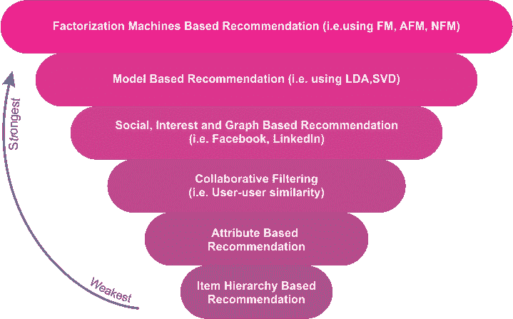

图 1：不同推荐系统的比较视图

基于协同过滤的方法通常会面临三个问题——冷启动、可扩展性和稀疏性：

+   **冷启动**：当需要大量关于用户的数据来做出更准确的推荐时，有时会陷入困境。

+   **可扩展性**：通常需要大量的计算能力来从拥有数百万用户和产品的数据集中计算推荐。

+   **稀疏性**：当大量商品在主要电商网站上销售时，通常会发生这种情况，尤其是在众包数据集的情况下。在这种情况下，活跃用户可能只会对少数几件商品进行评分——也就是说，即使是最受欢迎的商品也会有很少的评分。因此，用户与商品的矩阵变得非常稀疏。换句话说，不能处理一个大规模的稀疏矩阵。

为了克服这些问题，一种特定类型的协同过滤算法使用 MF，一种低秩矩阵近似技术。我们将在本章后面看到一个例子。

# 基于内容的过滤方法

使用基于内容的过滤方法，利用项目的离散特征系列推荐具有相似属性的其他项目。有时它基于对项目的描述和用户偏好的个人资料。这些方法尝试推荐与用户过去喜欢或当前正在使用的项目相似的项目。

基于内容的过滤的一个关键问题是，系统是否能够从用户对某个内容源的行为中学习用户偏好，并将其应用于其他内容类型。当这种类型的推荐引擎被部署时，它可以用来预测用户感兴趣的项目或项目的评分。

# 混合推荐系统

如你所见，使用协同过滤和基于内容的过滤各有优缺点。因此，为了克服这两种方法的局限性，近年来的趋势表明，混合方法通过结合协同过滤和基于内容的过滤，可能更加有效和准确。有时，为了使其更强大，会使用如 MF 和**奇异值分解**（**SVD**）等因式分解方法。混合方法可以通过几种方式实现：

+   最初，基于内容的预测和基于协同的预测是分别计算的，之后我们将它们结合起来，即将这两者统一为一个模型。在这种方法中，FM 和 SVD 被广泛使用。

+   向基于协同的方式添加基于内容的能力，或反之。再次，FM 和 SVD 被用来进行更好的预测。

Netflix 是一个很好的例子，它使用这种混合方法向订阅者推荐内容。该网站通过两种方式进行推荐：

+   **协同过滤**：通过比较相似用户的观看和搜索习惯

+   **基于内容的过滤**：通过提供与用户高度评分的电影共享特征的电影

# 基于模型的协同过滤

如*图 1*所示，我确实计划使用因式分解机来实施一个系统化的项目，但最终由于时间限制未能实现。因此，决定开发一个基于协同过滤的方法的电影推荐系统。基于协同过滤的方法可以分为：

+   基于记忆的算法，即基于用户的算法

+   基于模型的协同过滤算法，即核映射

在基于模型的协同过滤技术中，用户和产品由一组较小的因素描述，这些因素也被称为**潜在因素**（**LFs**）。然后使用这些潜在因素来预测缺失的条目。**交替最小二乘法**（**ALS**）算法用于学习这些潜在因素。从计算的角度来看，基于模型的协同过滤通常用于许多公司，如 Netflix，用于实时电影推荐。

# 效用矩阵

在一个混合推荐系统中，有两类实体：用户和物品（例如电影、产品等）。现在，作为一个用户，你可能会对某些物品有偏好。因此，这些偏好必须从关于物品、用户或评分的数据中提取出来。通常这些数据表示为效用矩阵，例如用户-物品对。这种值可以表示已知的该用户对某个物品的偏好程度。矩阵中的条目，即一个表格，可以来自有序集合。例如，可以使用整数 1-5 来表示用户为物品评分的星级。

我们曾指出，通常用户可能没有对物品进行评分；也就是说，大多数条目是**未知的**。这也意味着矩阵可能是稀疏的。一个未知的评分意味着我们没有关于用户对物品偏好的明确反馈。*表 1*展示了一个效用矩阵示例。该矩阵表示用户对电影的评分，评分范围为 1 到 5，5 为最高评分。空白条目表示没有用户为这些电影提供评分。

在这里，**HP1**、**HP2**和**HP3**分别是电影**哈利·波特 I**、**II**和**III**的缩写；**TW**代表**暮光之城**；**SW1**、**SW2**和**SW3**分别代表**星球大战**系列的第**1**、**2**和**3**部。用户由大写字母**A**、**B**、**C**和**D**表示：

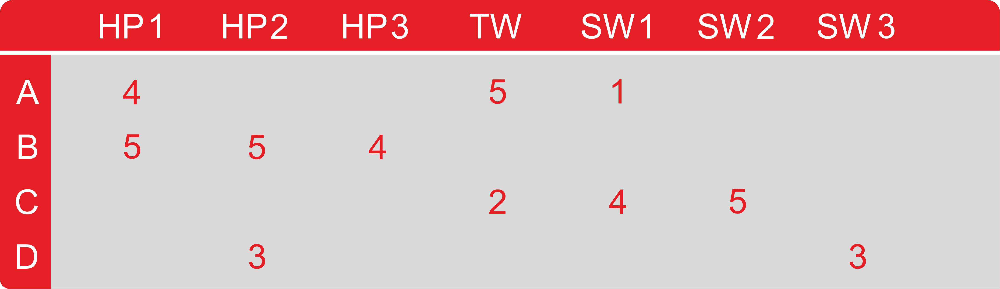

图 2：效用矩阵（用户与电影矩阵）

用户-电影对中有许多空白条目。这意味着用户没有为那些电影评分。在实际场景中，矩阵可能更加稀疏，典型的用户仅为所有可用电影中的一小部分评分。现在，利用这个矩阵，目标是预测效用矩阵中的空白部分。让我们来看一个例子。假设我们想知道用户**A**是否喜欢**SW2**。然而，由于矩阵中在*表 1*中几乎没有相关证据，确定这一点是非常困难的。

因此，在实际应用中，我们可能会开发一个电影推荐引擎来考虑电影的一些不常见属性，如制片人名称、导演名称、主演，甚至是它们名称的相似性。通过这种方式，我们可以计算电影**SW1**和**SW2**的相似性。这种相似性会引导我们得出结论：由于 A 不喜欢**SW1**，他们也不太可能喜欢**SW2**。

然而，这对于更大的数据集可能不适用。因此，随着数据量的增大，我们可能会观察到那些同时评分过**SW1**和**SW2**的用户倾向于给予它们相似的评分。最终，我们可以得出结论：**A**也会像评分**SW1**那样对**SW2**给出低分。

# 基于 Spark 的电影推荐系统

Spark MLlib 中的实现支持基于模型的协同过滤。在基于模型的协同过滤技术中，用户和产品通过一组小的因子（也称为 LF）来描述。在本节中，我们将看到两个完整的示例，展示它如何为新用户推荐电影。

# 基于物品的协同过滤用于电影相似度计算

首先，我们从文件中读取评分数据。对于这个项目，我们可以使用来自[`www.grouplens.org/node/73`](http://www.grouplens.org/node/73)的 MovieLens 100k 评分数据集。训练集评分数据保存在一个名为`ua.base`的文件中，而电影项数据保存在`u.item`中。另一方面，`ua.test`包含了用于评估我们模型的测试集。由于我们将使用这个数据集，因此我们应该感谢明尼苏达大学的 GroupLens 研究项目团队，他们编写了以下文字：

F. Maxwell Harper 和 Joseph A. Konstan. 2015\. The MovieLens 数据集: *历史与背景*。ACM 交互式智能系统交易（**TiiS**）5, 4, 第 19 号文章（2015 年 12 月），共 19 页。DOI：[`dx.doi.org/10.1145/2827872`](http://dx.doi.org/10.1145/2827872)。

该数据集包含了来自 943 名用户对 1682 部电影的 1 至 5 分的 100,000 条评分。每个用户至少评分过 20 部电影。数据集还包含了关于用户的基本人口统计信息（如年龄、性别、职业和邮政编码）。

# 第 1 步 - 导入必要的库并创建 Spark 会话

我们需要导入一个 Spark 会话，以便我们可以创建 Spark 会话，这是我们 Spark 应用程序的入口：

```py
import org.apache.spark.sql.SparkSession 
val spark: SparkSession = SparkSession 
    .builder() 
    .appName("MovieSimilarityApp") 
    .master("local[*]") 
    .config("spark.sql.warehouse.dir", "E:/Exp/") 
    .getOrCreate() 
```

# 第 2 步 - 读取和解析数据集

我们可以使用 Spark 的`textFile`方法从你首选的存储系统（如 HDFS 或本地文件系统）读取文本文件。然而，我们需要自己指定如何分割字段。在读取输入数据集时，我们首先进行`groupBy`操作，并在与`flatMap`操作进行联接后进行转换，以获取所需字段：

```py
val TRAIN_FILENAME = "data/ua.base" 
val TEST_FIELNAME = "data/ua.test" 
val MOVIES_FILENAME = "data/u.item" 

  // get movie names keyed on id 
val movies = spark.sparkContext.textFile(MOVIES_FILENAME) 
    .map(line => { 
      val fields = line.split("\|") 
      (fields(0).toInt, fields(1)) 
    }) 
val movieNames = movies.collectAsMap() 
  // extract (userid, movieid, rating) from ratings data 
val ratings = spark.sparkContext.textFile(TRAIN_FILENAME) 
    .map(line => { 
      val fields = line.split("t") 
      (fields(0).toInt, fields(1).toInt, fields(2).toInt) 
    }) 
```

# 第 3 步 - 计算相似度

通过基于物品的协同过滤，我们可以计算两部电影之间的相似度。我们按照以下步骤进行：

1.  对于每一对电影（**A**，**B**），我们找出所有同时评分过**A**和**B**的用户。

1.  现在，使用前述的评分，我们计算出电影**A**的向量，比如**X**，和电影**B**的向量，比如**Y**

1.  然后我们计算**X**和**Y**之间的相关性

1.  如果一个用户观看了电影**C**，我们可以推荐与其相关性最高的电影

然后我们计算每个评分向量**X**和**Y**的各种向量度量，如大小、点积、范数等。我们将使用这些度量来计算电影对之间的各种相似度度量，也就是（**A**，**B**）。对于每对电影（**A**，**B**），我们计算多个度量，如余弦相似度、Jaccard 相似度、相关性和常规相关性。让我们开始吧。前两步如下：

```py
// get num raters per movie, keyed on movie id 
val numRatersPerMovie = ratings 
    .groupBy(tup => tup._2) 
    .map(grouped => (grouped._1, grouped._2.size)) 

// join ratings with num raters on movie id 
val ratingsWithSize = ratings 
    .groupBy(tup => tup._2) 
    .join(numRatersPerMovie) 
    .flatMap(joined => { 
      joined._2._1.map(f => (f._1, f._2, f._3, joined._2._2)) 
    }) 
```

`ratingsWithSize`变量现在包含以下字段：`user`，`movie`，`rating`和`numRaters`。接下来的步骤是创建评分的虚拟副本以进行自连接。技术上，我们通过`userid`进行连接，并过滤电影对，以避免重复计数并排除自对：

```py
val ratings2 = ratingsWithSize.keyBy(tup => tup._1) 
val ratingPairs = 
    ratingsWithSize 
      .keyBy(tup => tup._1) 
      .join(ratings2) 
      .filter(f => f._2._1._2 < f._2._2._2) 
```

现在让我们计算每对电影的相似度度量的原始输入：

```py
val vectorCalcs = ratingPairs 
      .map(data => { 
        val key = (data._2._1._2, data._2._2._2) 
        val stats = 
          (data._2._1._3 * data._2._2._3, // rating 1 * rating 2 
            data._2._1._3, // rating movie 1 
            data._2._2._3, // rating movie 2 
            math.pow(data._2._1._3, 2), // square of rating movie 1 
            math.pow(data._2._2._3, 2), // square of rating movie 2 
            data._2._1._4, // number of raters movie 1 
            data._2._2._4) // number of raters movie 2 
        (key, stats) 
      }) 
.groupByKey() 
.map(data => { 
    val key = data._1 
    val vals = data._2 
    val size = vals.size 
    val dotProduct = vals.map(f => f._1).sum 
    val ratingSum = vals.map(f => f._2).sum 
    val rating2Sum = vals.map(f => f._3).sum 
    val ratingSq = vals.map(f => f._4).sum 
    val rating2Sq = vals.map(f => f._5).sum 
    val numRaters = vals.map(f => f._6).max 
    val numRaters2 = vals.map(f => f._7).max 
        (key, (size, dotProduct, ratingSum, rating2Sum, ratingSq, rating2Sq, numRaters, numRaters2))}) 
```

这是计算相似度的第三步和第四步。我们为每对电影计算相似度度量：

```py
  val similarities = 
    vectorCalcs 
      .map(fields => { 
        val key = fields._1 
        val (size, dotProduct, ratingSum, rating2Sum, ratingNormSq, rating2NormSq, numRaters, numRaters2) = fields._2 
        val corr = correlation(size, dotProduct, ratingSum, rating2Sum, ratingNormSq, rating2NormSq) 
        val regCorr = regularizedCorrelation(size, dotProduct, ratingSum, rating2Sum,ratingNormSq, rating2NormSq, PRIOR_COUNT, PRIOR_CORRELATION) 
        val cosSim = cosineSimilarity(dotProduct, scala.math.sqrt(ratingNormSq), scala.math.sqrt(rating2NormSq)) 
        val jaccard = jaccardSimilarity(size, numRaters, numRaters2) 
        (key, (corr, regCorr, cosSim, jaccard))}) 
```

接下来是我们刚才使用的方法的实现。我们从`correlation()`方法开始，用来计算两个向量（*A*，*B*）之间的相关性，公式为*cov(A, B)/(stdDev(A) * stdDev(B))*：

```py
def correlation(size: Double, dotProduct: Double, ratingSum: Double, 
    rating2Sum: Double, ratingNormSq: Double, rating2NormSq: Double) = { 
    val numerator = size * dotProduct - ratingSum * rating2Sum 
    val denominator = scala.math.sqrt(size * ratingNormSq - ratingSum * ratingSum)  
                        scala.math.sqrt(size * rating2NormSq - rating2Sum * rating2Sum) 
    numerator / denominator} 
```

现在，通过在先验上添加虚拟伪计数来对相关性进行常规化，*RegularizedCorrelation = w * ActualCorrelation + (1 - w) * PriorCorrelation，其中 w = # actualPairs / (# actualPairs + # virtualPairs)*：

```py
def regularizedCorrelation(size: Double, dotProduct: Double, ratingSum: Double, 
    rating2Sum: Double, ratingNormSq: Double, rating2NormSq: Double, 
    virtualCount: Double, priorCorrelation: Double) = { 
    val unregularizedCorrelation = correlation(size, dotProduct, ratingSum, rating2Sum, ratingNormSq, rating2NormSq) 
    val w = size / (size + virtualCount) 
    w * unregularizedCorrelation + (1 - w) * priorCorrelation 
  } 
```

两个向量 A，B 之间的余弦相似度为 dotProduct(A, B) / (norm(A) * norm(B))：

```py
def cosineSimilarity(dotProduct: Double, ratingNorm: Double, rating2Norm: Double) = { 
    dotProduct / (ratingNorm * rating2Norm) 
  } 
```

最后，两个集合*A*和*B*之间的 Jaccard 相似度为*|Intersection (A, B)| / |Union (A, B)|*：

```py
def jaccardSimilarity(usersInCommon: Double, totalUsers1: Double, totalUsers2: Double) = { 
    val union = totalUsers1 + totalUsers2 - usersInCommon 
    usersInCommon / union 
    } 
```

# 第 4 步 - 测试模型

让我们看看与`Die Hard (1998)`最相似的 10 部电影，按常规相关性排名：

```py
evaluateModel("Die Hard (1988)") 
>>>
```

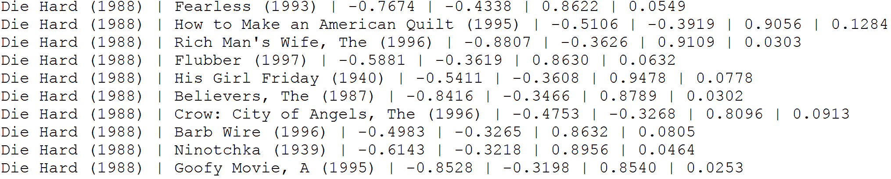

在前面的图表中，列包括电影 1，电影 2，相关性，常规相关性，余弦相似度和 Jaccard 相似度。现在，让我们看看与*Postino, Il*（1994）最相似的 10 部电影，按常规相关性排名：

```py
evaluateModel("Postino, Il (1994)") 
>>>
```

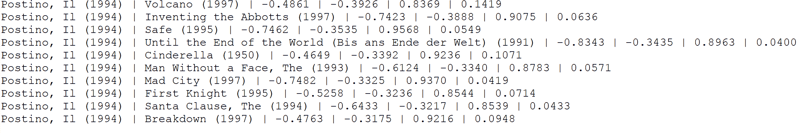

最后，让我们看看与`Star Wars (1977)`最相似的 10 部电影，按常规相关性排名：

```py
evaluateModel("Star Wars (1977)") 
>>>
```

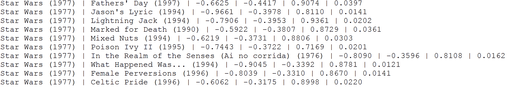

现在，从输出结果中，我们可以看到一些电影对的共同评分者非常少；可以看出，使用原始的相关性计算得出的相似度并不理想。虽然余弦相似度是协同过滤方法中的标准相似度度量，但其表现不佳。

原因在于有许多电影的余弦相似度为 1.0。顺便提一下，前面的`evaluateModel()`方法会测试几部电影（用相关的电影名称替代 contains 调用），具体如下：

```py
def evaluateModel(movieName: String): Unit = { 
    val sample = similarities.filter(m => { 
    val movies = m._1
    (movieNames(movies._1).contains(movieName)) 
    }) 
// collect results, excluding NaNs if applicable 
val result = sample.map(v => { 
val m1 = v._1._1 
val m2 = v._1._2 
val corr = v._2._1 
val rcorr = v._2._2 
val cos = v._2._3 
val j = v._2._4 
(movieNames(m1), movieNames(m2), corr, rcorr, cos, j) 
}).collect().filter(e => !(e._4 equals Double.NaN)) // test for NaNs must use equals rather than == 
      .sortBy(elem => elem._4).take(10) 
    // print the top 10 out 
result.foreach(r => println(r._1 + " | " + r._2 + " | " + r._3.formatted("%2.4f") + " | " + r._4.formatted("%2.4f") 
      + " | " + r._5.formatted("%2.4f") + " | " + r._6.formatted("%2.4f"))) } 
```

你可以理解基于这些协同过滤方法的局限性。当然，这些方法有计算复杂性，但你部分是对的。最重要的方面是，这些方法无法预测在实际应用中缺失的条目。它们还存在一些前面提到的问题，如冷启动、可扩展性和稀疏性。因此，我们将看看如何使用 Spark MLlib 中的基于模型的推荐系统来改进这些局限性。

# 基于模型的推荐（使用 Spark）

为了为任何用户做出偏好预测，协同过滤使用其他兴趣相似的用户的偏好，并预测你可能感兴趣但未知的电影。Spark MLlib 使用 **交替最小二乘法**（**ALS**）来进行推荐。以下是 ALS 算法中使用的一种协同过滤方法的概览：

**表 1 – 用户-电影矩阵**

| **用户** | **M1** | **M2** | **M3** | **M4** |
| --- | --- | --- | --- | --- |
| **U1** | 2 | 4 | 3 | 1 |
| **U2** | 0 | 0 | 4 | 4 |
| **U3** | 3 | 2 | 2 | 3 |
| **U4** | 2 | ? | 3 | ? |

在前面的表格中，用户对电影的评分表示为一个矩阵（即用户-物品矩阵），其中每个单元格表示一个用户对特定电影的评分。单元格中的 **?** 代表用户 **U4** 不知道或没有看过的电影。根据 **U4** 当前的偏好，单元格中的 **?** 可以通过与 **U4** 兴趣相似的用户的评分来填充。因此，ALS 本身无法完成此任务，但可以利用 LF 来预测缺失的条目。

Spark API 提供了 ALS 算法的实现，该算法用于基于以下六个参数学习这些 LF：

+   `numBlocks`: 这是用于并行计算的块数（设置为 -1 会自动配置）。

+   `rank`: 这是模型中 LF（潜在因子）的数量。

+   `iterations`: 这是 ALS 运行的迭代次数。ALS 通常在 20 次迭代或更少的次数内收敛到合理的解决方案。

+   `lambda`: 这是 ALS 中指定的正则化参数。

+   `implicitPrefs`: 这是指定是否使用 ALS 变体中的显式反馈（或用户定义的）来处理隐式反馈数据。

+   `alpha`: 这是 ALS 的隐式反馈变体中的一个参数，用于控制偏好观察的基准信心。

请注意，要构造一个使用默认参数的 ALS 实例，可以根据需要设置相应的值。默认值如下：`numBlocks: -1`，`rank: 10`，`iterations: 10`，`lambda: 0.01`，`implicitPrefs: false`，`alpha: 1.0`。

# 数据探索

电影和相应的评分数据集是从 MovieLens 网站下载的（[`movielens.org`](https://movielens.org)）。根据 MovieLens 网站上的数据说明，所有评分都记录在 `ratings.csv` 文件中。该文件中的每一行（包括标题行）代表一个用户对某部电影的评分。

该 CSV 数据集包含以下列：`userId`、`movieId`、`rating` 和 `timestamp`。这些在*图 14*中显示。行按照`userId`排序，并在每个用户内部按`movieId`排序。评分采用五分制，并有半星递增（从 0.5 星到 5.0 星）。时间戳表示自 1970 年 1 月 1 日午夜以来的秒数，时间格式为**协调世界时**（**UTC**）。我们从 668 个用户那里收到了 105,339 个评分，涵盖 10,325 部电影：

**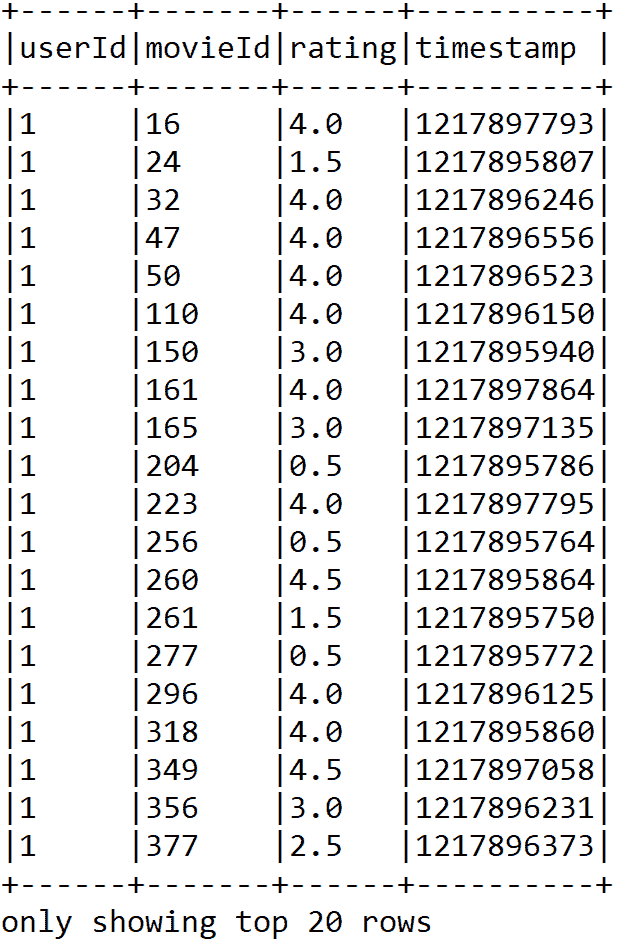**

图 2：评分数据集的快照

另一方面，电影信息包含在`movies.csv`文件中。每行（除去表头信息）代表一部电影，包含这些列：`movieId`、`title` 和 `genres`（见*图 2*）。电影标题要么是手动创建或插入的，要么是从电影数据库网站（[`www.themoviedb.org/`](https://www.themoviedb.org/)）导入的。上映年份则以括号形式显示。

由于电影标题是手动插入的，因此这些标题可能存在一些错误或不一致的情况。因此，建议读者查阅 IMDb 数据库（[`www.imdb.com/`](https://www.imdb.com/)），确保没有不一致或错误的标题和对应的上映年份：

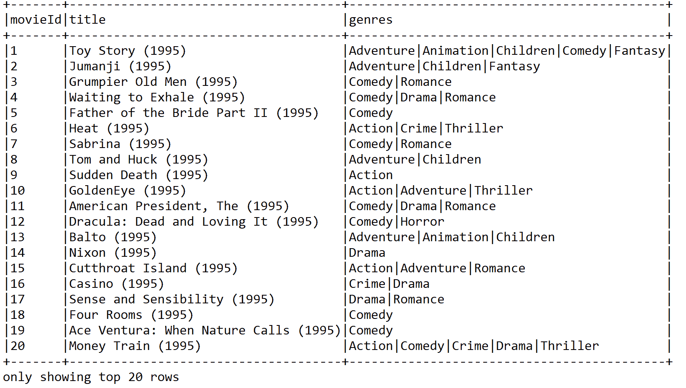

图 3：前 20 部电影的标题和类型

类型以分隔列表的形式出现，并从以下类型类别中选择：

+   动作、冒险、动画、儿童、喜剧和犯罪

+   纪录片、剧情、幻想、黑色电影、恐怖和音乐剧

+   神秘、浪漫、科幻、惊悚、西部和战争

# 使用 ALS 进行电影推荐

在本小节中，我们将通过一个系统的示例向您展示如何向其他用户推荐电影，从数据收集到电影推荐。

# 步骤 1 - 导入软件包，加载、解析并探索电影和评分数据集

我们将加载、解析并进行一些探索性分析。不过，在此之前，我们先导入必要的软件包和库：

```py
package com.packt.ScalaML.MovieRecommendation 
import org.apache.spark.sql.SparkSession 
import org.apache.spark.mllib.recommendation.ALS 
import org.apache.spark.mllib.recommendation.MatrixFactorizationModel 
import org.apache.spark.mllib.recommendation.Rating 
import scala.Tuple2 
import org.apache.spark.rdd.RDD 
```

该代码段应返回评分的 DataFrame：

```py
val ratigsFile = "data/ratings.csv"
val df1 = spark.read.format("com.databricks.spark.csv").option("header", true).load(ratigsFile)    
val ratingsDF = df1.select(df1.col("userId"), df1.col("movieId"), df1.col("rating"), df1.col("timestamp"))
ratingsDF.show(false)
```

以下代码段展示了电影的 DataFrame：

```py
val moviesFile = "data/movies.csv"
val df2 = spark.read.format("com.databricks.spark.csv").option("header", "true").load(moviesFile)
val moviesDF = df2.select(df2.col("movieId"), df2.col("title"), df2.col("genres"))
```

# 步骤 2 - 注册两个 DataFrame 作为临时表，以便更方便地查询

要注册这两个数据集，我们可以使用以下代码：

```py
ratingsDF.createOrReplaceTempView("ratings")
moviesDF.createOrReplaceTempView("movies")
```

这将通过在内存中创建一个临时视图作为表来加快内存查询的速度。使用`createOrReplaceTempView()`方法创建的临时表的生命周期与用于创建该 DataFrame 的`[[SparkSession]]`相关联。

# 步骤 3 - 探索和查询相关统计数据

让我们检查与评分相关的统计数据。只需使用以下代码行：

```py
val numRatings = ratingsDF.count()
val numUsers = ratingsDF.select(ratingsDF.col("userId")).distinct().count()
val numMovies = ratingsDF.select(ratingsDF.col("movieId")).distinct().count() 
println("Got " + numRatings + " ratings from " + numUsers + " users on " + numMovies + " movies.") 
>>>
Got 105339 ratings from 668 users on 10325 movies.
```

你应该会发现`668`用户在`10,325`部电影上有`105,339`条评分。现在，让我们获取最大和最小评分以及评分过电影的用户数量。然而，你需要对我们在上一步骤中创建的评分表执行 SQL 查询。在这里进行查询很简单，类似于从 MySQL 数据库或关系型数据库管理系统（RDBMS）中进行查询。

然而，如果你不熟悉基于 SQL 的查询，建议查看 SQL 查询规范，了解如何使用`SELECT`从特定表中选择数据，如何使用`ORDER`进行排序，以及如何使用`JOIN`关键字进行连接操作。好吧，如果你熟悉 SQL 查询，你应该使用复杂的 SQL 查询来获取新的数据集，如下所示：

```py
// Get the max, min ratings along with the count of users who have rated a movie.
val results = spark.sql("select movies.title, movierates.maxr, movierates.minr, movierates.cntu "
       + "from(SELECT ratings.movieId,max(ratings.rating) as maxr,"
       + "min(ratings.rating) as minr,count(distinct userId) as cntu "
       + "FROM ratings group by ratings.movieId) movierates "
       + "join movies on movierates.movieId=movies.movieId " + "order by movierates.cntu desc") 
results.show(false) 
```

输出：

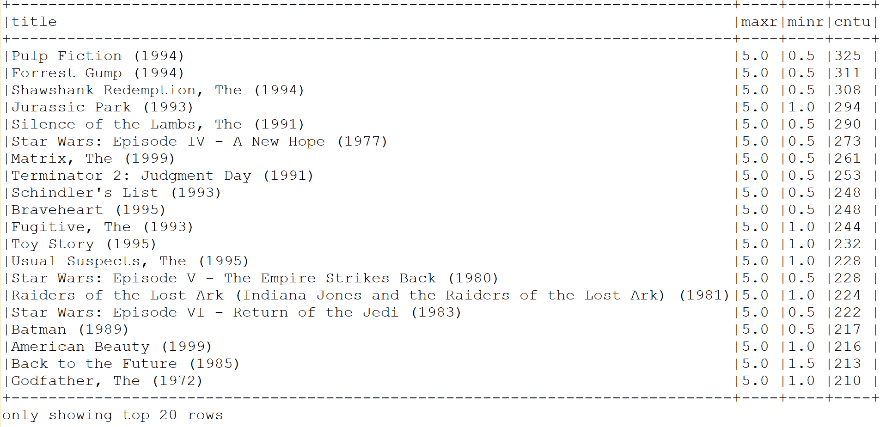

图 4：最大和最小评分以及评分过电影的用户数量

为了获得一些洞察，我们需要更多了解用户及其评分。现在，让我们找出排名前 10 的活跃用户及其评分次数：

```py
val mostActiveUsersSchemaRDD = spark.sql("SELECT ratings.userId, count(*) as ct from ratings "+ "group by ratings.userId order by ct desc limit 10")
mostActiveUsersSchemaRDD.show(false) 
>>> 
```

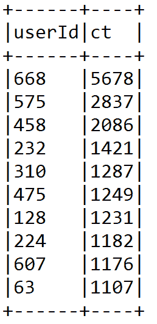

图 5：排名前 10 的活跃用户及其评分次数

让我们来看一下特定用户，并找出例如用户`668`评分高于`4`的电影：

```py
val results2 = spark.sql( 
              "SELECT ratings.userId, ratings.movieId,"  
              + "ratings.rating, movies.title FROM ratings JOIN movies" 
              + "ON movies.movieId=ratings.movieId"  
              + "where ratings.userId=668 and ratings.rating > 4") 
results2.show(false) 
>>>
```

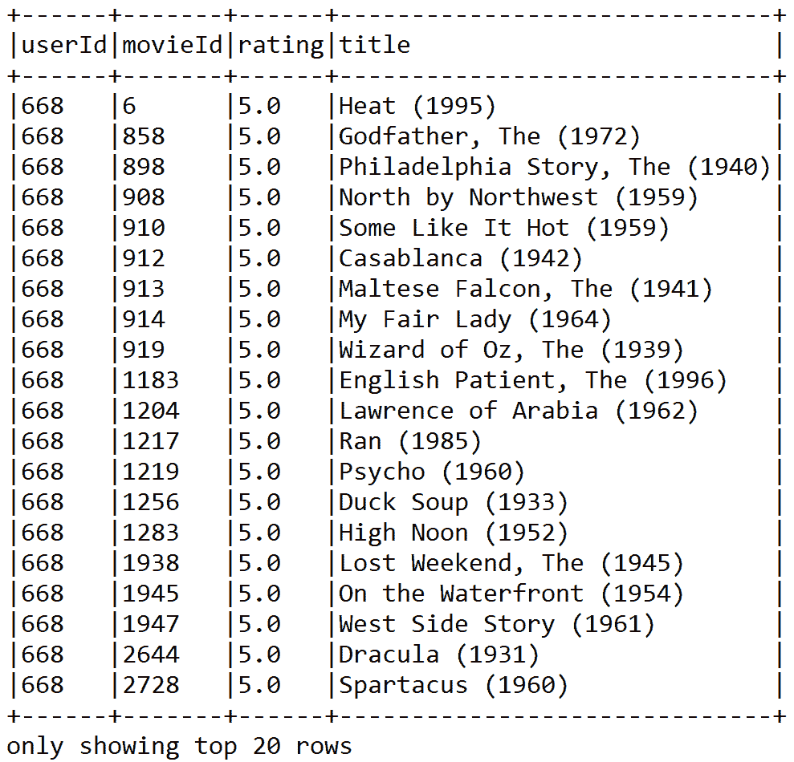

图 6：用户 668 评分高于 4 分的电影

# 步骤 4 - 准备训练和测试评分数据并检查计数

以下代码将评分 RDD 拆分为训练数据 RDD（75%）和测试数据 RDD（25%）。这里的种子是可选的，但为了可重复性，需要指定：

```py
// Split ratings RDD into training RDD (75%) & test RDD (25%) 
val splits = ratingsDF.randomSplit(Array(0.75, 0.25), seed = 12345L) 
val (trainingData, testData) = (splits(0), splits(1)) 
val numTraining = trainingData.count() 
val numTest = testData.count() 
println("Training: " + numTraining + " test: " + numTest)
```

你应该注意到，训练数据中有 78,792 条评分，测试数据中有 26,547 条评分。

DataFrame。

# 步骤 5 - 准备数据以构建使用 ALS 的推荐模型

ALS 算法使用训练数据的评分 RDD。为此，以下代码展示了如何使用 API 构建推荐模型：

```py
val ratingsRDD = trainingData.rdd.map(row => { 
                    val userId = row.getString(0) 
                    val movieId = row.getString(1) 
                    val ratings = row.getString(2) 
                    Rating(userId.toInt, movieId.toInt, ratings.toDouble)
})
```

`ratingsRDD`是一个包含`userId`、`movieId`及相应评分的 RDD，来源于我们在上一步骤中准备的训练数据集。另一方面，也需要一个测试 RDD 来评估模型。以下`testRDD`也包含来自我们在上一步骤中准备的测试 DataFrame 的相同信息：

```py
val testRDD = testData.rdd.map(row => { 
    val userId = row.getString(0) 
    val movieId = row.getString(1) 
    val ratings = row.getString(2) 
    Rating(userId.toInt, movieId.toInt, ratings.toDouble)
})
```

# 步骤 6 - 构建 ALS 用户-电影矩阵

基于`ratingsRDD`构建一个 ALS 用户矩阵模型，通过指定最大迭代次数、块数、alpha、rank、lambda、种子以及`implicitPrefs`来实现。基本上，这种技术根据其他用户对其他电影的相似评分来预测特定用户和特定电影的缺失评分：

```py
val rank = 20 
val numIterations = 15 
val lambda = 0.10 
val alpha = 1.00 val block = -1 
val seed = 12345L 
val implicitPrefs = false 

val model = new ALS().setIterations(numIterations)
        .setBlocks(block).setAlpha(alpha)
        .setLambda(lambda)
        .setRank(rank) .setSeed(seed)
        .setImplicitPrefs(implicitPrefs)
        .run(ratingsRDD)
```

最后，我们迭代训练了模型 15 次。在这个设置下，我们得到了良好的预测准确性。建议读者进行超参数调优，以找到这些参数的最优值。此外，将用户块和产品块的块数设置为-1，以便并行化计算并自动配置块数。该值为-1。

# 步骤 7 - 进行预测

让我们为用户`668`获取前六部电影的预测。以下源代码可以用于进行预测：

```py
// Making Predictions. Get the top 6 movie predictions for user 668 
println("Rating:(UserID, MovieID, Rating)") println("----------------------------------") 
val topRecsForUser = model.recommendProducts(668, 6) for (rating <- topRecsForUser) { println(rating.toString()) } println("----------------------------------")
>>>
```

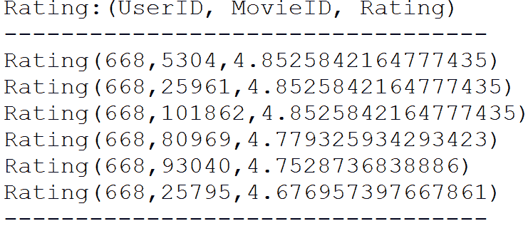

图 7：用户 668 的前六部电影预测

# 步骤 8 - 评估模型

为了验证模型的质量，**均方根误差**（**RMSE**）被用来衡量模型预测值与实际观测值之间的差异。默认情况下，计算的误差越小，模型越好。为了测试模型的质量，使用了测试数据（该数据在*步骤 4*中已拆分）。

根据许多机器学习从业者的说法，RMSE 是一个良好的准确度衡量标准，但仅适用于比较不同模型在特定变量上的预测误差。他们表示，RMSE 不适合用于比较不同变量之间的误差，因为它依赖于尺度。以下代码行计算了使用训练集训练的模型的 RMSE 值：

```py
val rmseTest = computeRmse(model, testRDD, true) 
println("Test RMSE: = " + rmseTest) //Less is better
```

对于这个设置，我们得到以下输出：

```py
Test RMSE: = 0.9019872589764073
```

该方法通过计算 RMSE 来评估模型。RMSE 越小，模型和预测能力越好。需要注意的是，`computeRmse()`是一个 UDF，其实现如下：

```py
def computeRmse(model: MatrixFactorizationModel, data: RDD[Rating], implicitPrefs: Boolean): Double = {         val predictions: RDD[Rating] = model.predict(data.map(x => (x.user, x.product))) 
    val predictionsAndRatings = predictions.map { x => ((x.user, x.product), x.rating) }
        .join(data.map(x => ((x.user, x.product), x.rating))).values 
    if (implicitPrefs) { println("(Prediction, Rating)")                 
        println(predictionsAndRatings.take(5).mkString("n")) } 
        math.sqrt(predictionsAndRatings.map(x => (x._1 - x._2) * (x._1 - x._2)).mean()) 
    }
>>>
```

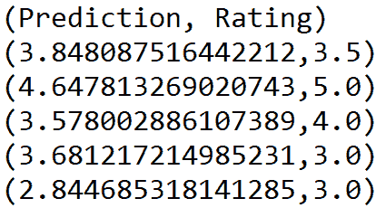

最后，让我们为特定用户提供一些电影推荐。让我们为用户`668`获取前六部电影的预测：

```py
println("Recommendations: (MovieId => Rating)") 
println("----------------------------------") 
val recommendationsUser = model.recommendProducts(668, 6) 
recommendationsUser.map(rating => (rating.product, rating.rating)).foreach(println) println("----------------------------------")
>>>
```

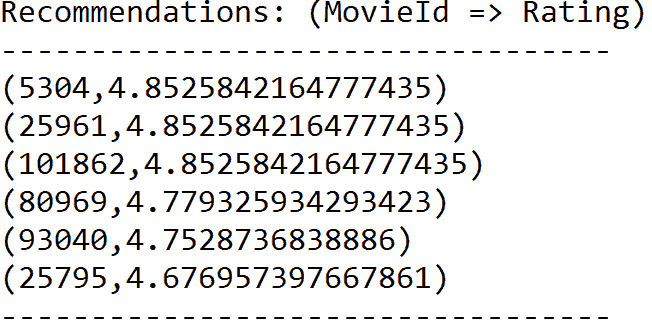

我们相信，前一个模型的性能可以进一步提高。然而，迄今为止，基于 MLlib 的 ALS 算法没有我们所知的模型调优工具。

有兴趣的读者可以参考这个网址，了解更多关于调优基于 ML 的 ALS 模型的内容：[`spark.apache.org/docs/preview/ml-collaborative-filtering.html`](https://spark.apache.org/docs/preview/ml-collaborative-filtering.html)。

# 选择并部署最佳模型

值得一提的是，第一个项目中开发的第一个模型无法持久化，因为它仅是计算电影相似性的几行代码。它还有另一个之前未提到的限制。它可以计算两部电影之间的相似度，但如果是多于两部电影呢？坦率地说，像第一个模型这样的模型很少会应用于真实的电影推荐。因此，我们将重点关注基于模型的推荐引擎。

尽管用户的评分会不断出现，但仍然值得存储当前的评分。因此，我们还希望持久化当前的基础模型，以便以后使用，从而在启动服务器时节省时间。我们的想法是使用当前模型进行实时电影推荐。

然而，如果我们持久化一些已生成的 RDD，尤其是那些处理时间较长的 RDD，可能也能节省时间。以下代码保存了我们训练好的 ALS 模型（具体细节请参见`MovieRecommendation.scala`脚本）：

```py
//Saving the model for future use 
val savedALSModel = model.save(spark.sparkContext, "model/MovieRecomModel")
```

与其他 Spark 模型不同，我们保存的 ALS 模型将仅包含训练过程中数据和一些元数据，采用 parquet 格式，具体如下图所示：

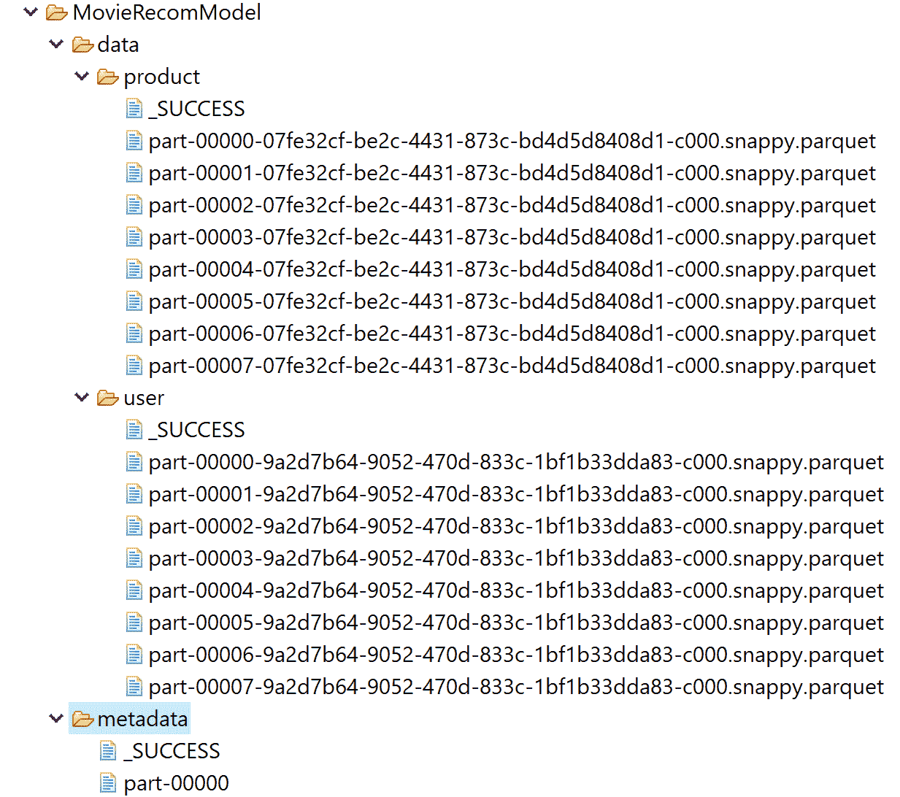

现在，下一个任务是恢复相同的模型，并提供与前面步骤中展示的类似的工作流：

```py
val same_model = MatrixFactorizationModel.load(spark.sparkContext, "model/MovieRecomModel/")
```

不过我不会让你感到困惑，特别是如果你是 Spark 和 Scala 的新手的话。这是预测用户 558 评分的完整代码：

```py
package com.packt.ScalaML.MovieRecommendation 

import org.apache.spark.sql.SparkSession 
import org.apache.spark.mllib.recommendation.ALS 
import org.apache.spark.mllib.recommendation.MatrixFactorizationModel 
import org.apache.spark.mllib.recommendation.Rating 
import scala.Tuple2 
import org.apache.spark.rdd.RDD 

object RecommendationModelReuse { 
 def main(args: Array[String]): Unit = { 
 val spark: SparkSession = SparkSession.builder()
                                  .appName("JavaLDAExample")
                                  .master("local[*]")
                                  .config("spark.sql.warehouse.dir", "E:/Exp/")
                                  .getOrCreate() 

 val ratigsFile = "data/ratings.csv" 
 val ratingDF =  spark.read
                        .format("com.databricks.spark.csv")
                        .option("header", true)
                        .load(ratigsFile) 

 val selectedRatingsDF = ratingDF.select(ratingDF.col("userId"), ratingDF.col("movieId"),                                                     ratingDF.col("rating"), ratingDF.col("timestamp")) 

        // Randomly split ratings RDD into training data RDD (75%) and test data RDD (25%) 
        val splits = selectedRatingsDF.randomSplit(Array(0.75, 0.25), seed = 12345L) 
        val testData = splits(1) 
        val testRDD = testData.rdd.map(row => { 
        val userId = row.getString(0) 
        val movieId = row.getString(1) 
        val ratings = row.getString(2) 
        Rating(userId.toInt, movieId.toInt, ratings.toDouble) }) 

        //Load the workflow back 
        val same_model = MatrixFactorizationModel.load(spark.sparkContext, "model/MovieRecomModel/") 

        // Making Predictions. Get the top 6 movie predictions for user 668 
        println("Rating:(UserID, MovieID, Rating)") 
        println("----------------------------------") 
        val topRecsForUser = same_model.recommendProducts(458, 10) 

        for (rating <- topRecsForUser) { 
            println(rating.toString()) } 

        println("----------------------------------") 
        val rmseTest = MovieRecommendation.computeRmse(same_model, testRDD, true) 
        println("Test RMSE: = " + rmseTest) //Less is better 

        //Movie recommendation for a specific user. Get the top 6 movie predictions for user 668 
        println("Recommendations: (MovieId => Rating)") 
        println("----------------------------------") 
        val recommendationsUser = same_model.recommendProducts(458, 10) 

        recommendationsUser.map(rating => 
        (rating.product, rating.rating)).foreach(println) 
        println("----------------------------------") 
        spark.stop() 
    } 
}
```

如果前面的脚本成功执行，您应该会看到以下输出：

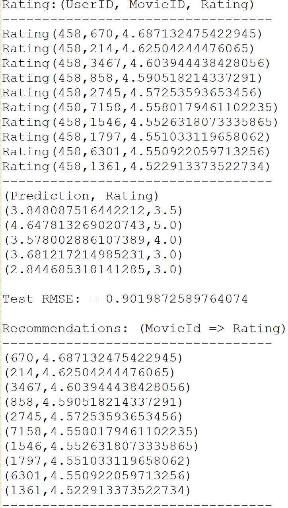

做得好！我们成功地重用了模型，并为不同的用户（即 558）进行了相同的预测。然而，可能由于数据的随机性，我们观察到略微不同的 RMSE。

# 总结

在本章中，我们实现了两个端到端项目，分别开发了基于项目的协同过滤来进行电影相似度测量和基于模型的推荐，均使用 Spark 完成。我们还展示了如何在 ALS 和 MF 之间进行互操作，并开发可扩展的电影推荐引擎。最后，我们看到了如何将此模型部署到生产环境中。

作为人类，我们通过过去的经验学习。我们之所以变得如此迷人，并非偶然。多年的正面赞美和批评都帮助我们塑造了今天的自我。你通过与朋友、家人，甚至陌生人互动，学习如何让别人开心；你通过尝试不同的肌肉运动，直到自行车骑行技巧自然流畅，来学会骑车。当你执行某些动作时，有时会立即获得奖励。这一切都是关于**强化学习**（**RL**）。

下一章将讨论如何设计一个由反馈和奖励驱动的机器学习项目。我们将看到如何应用强化学习（RL）算法，利用现实中的 IBM 股票和期权价格数据集开发期权交易应用。
