# 第七章：使用 Q 学习和 Scala Play 框架进行期权交易

作为人类，我们通过经验学习。我们并不是偶然变得如此迷人。多年的正面夸奖和负面批评，塑造了今天的我们。我们通过尝试不同的肌肉动作来学习骑自行车，直到掌握为止。当你执行某些动作时，往往会立即获得奖励。这就是**强化学习**（**RL**）的核心。

本章将专注于设计一个由批评和奖励驱动的机器学习系统。我们将展示如何将强化学习算法应用于实际数据集的预测模型中。

从交易的角度来看，期权是一种合约，赋予持有者在固定价格（行权价）下，在固定日期（到期日）或之前买入（看涨期权）或卖出（看跌期权）金融资产（标的资产）的权利。

我们将展示如何利用强化学习算法（称为**QLearning**）为期权交易开发一个实际应用。更具体地说，我们将解决计算期权交易中最佳策略的问题，并希望在某些市场条件和交易数据下进行特定类型的期权交易。

我们将使用 IBM 股票数据集来设计一个由批评和奖励驱动的机器学习系统。我们将从强化学习及其理论背景开始，以便更容易理解这个概念。最后，我们将通过使用 Scala Play 框架将整个应用程序封装为一个 Web 应用。

简言之，在这个从头到尾的项目中，我们将学习以下内容：

+   使用 Q 学习——一种强化学习算法

+   期权交易——它到底是怎么回事？

+   技术概述

+   为期权交易实现 Q 学习

+   使用 Scala Play 框架将应用程序封装为 Web 应用

+   模型部署

# 强化学习与监督学习和无监督学习的比较

虽然监督学习和无监督学习处于光谱的两端，但强化学习位于其中间。它不是监督学习，因为训练数据来自算法在探索和利用之间的选择。此外，它也不是无监督学习，因为算法会从环境中获得反馈。只要你处于一个执行某个动作能带来奖励的状态，你就可以使用强化学习来发现一个能够获得最大预期奖励的良好动作序列。

强化学习（RL）智能体的目标是最大化最终获得的总奖励。第三个主要子元素是`价值`函数。奖励决定了状态的即时吸引力，而价值则表示状态的长期吸引力，考虑到可能跟随的状态以及这些状态中的可用奖励。`价值`函数是根据所选择的策略来定义的。在学习阶段，智能体尝试那些能确定最高价值状态的动作，因为这些动作最终将获得最佳的奖励数量。

# 使用强化学习（RL）

*图 1* 显示了一个人做出决策以到达目的地。此外，假设你从家到公司时，总是选择相同的路线。然而，有一天你的好奇心占了上风，你决定尝试一条不同的道路，希望能更快到达。这个尝试新路线与坚持最熟悉路线的困境，就是探索与利用之间的例子：

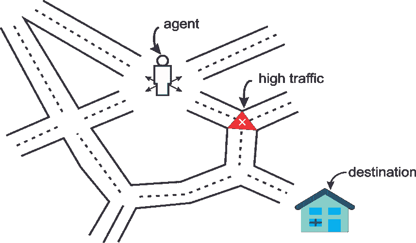

图 1：一个代理始终尝试通过特定路线到达目的地

强化学习技术正在许多领域中被应用。目前正在追求的一个普遍理念是创建一个算法，它只需要任务的描述而不需要其他任何东西。当这种性能实现时，它将被几乎应用于所有领域。

# 强化学习中的符号、策略和效用

你可能会注意到，强化学习的术语涉及将算法化身为在情境中采取动作以获得奖励。事实上，算法通常被称为与环境互动的代理。你可以将它看作一个智能硬件代理，使用传感器感知环境，并利用执行器与环境互动。因此，强化学习理论在机器人学中的广泛应用并不令人惊讶。现在，为了进一步展开讨论，我们需要了解一些术语：

+   **环境**：环境是任何拥有状态以及在不同状态之间转换机制的系统。例如，一个机器人的环境就是它所操作的景观或设施。

+   **代理**：代理是一个与环境互动的自动化系统。

+   **状态**：环境或系统的状态是完全描述环境的变量或特征的集合。

+   **目标**：目标是一个状态，它提供比任何其他状态更高的折扣累计奖励。高累计奖励能够防止最佳策略在训练过程中依赖于初始状态。

+   **动作**：动作定义了状态之间的转变，代理负责执行或至少推荐某个动作。在执行动作后，代理会从环境中收获奖励（或惩罚）。

+   **策略**：策略定义了在环境的任何状态下需要执行的动作。

+   **奖励**：奖励量化了代理与环境之间的正向或负向互动。奖励本质上是学习引擎的训练集。

+   **回合** *(***也称为 **试验**)*：这定义了从初始状态到达目标状态所需的步骤数量。

我们将在本节稍后讨论更多关于策略和效用的内容。*图 2* 展示了**状态**、**动作**和**奖励**之间的相互作用。如果你从状态 **s[1]** 开始，你可以执行动作 **a[1]** 来获得奖励 **r (s[1], a[1])**。箭头代表**动作**，**状态**由圆圈表示：

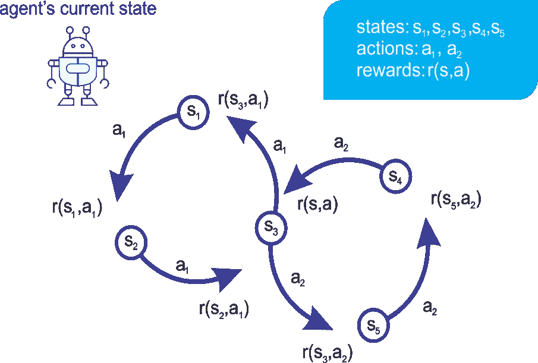

图 2：代理在一个状态下执行一个动作会产生回报

机器人执行动作以在不同状态之间变化。但它如何决定采取哪种动作呢？嗯，这一切都与使用不同的或具体的策略有关。

# 策略

在 RL 术语中，我们称一个策略为**策略**。RL 的目标是发现一个好的策略。解决 RL 问题的最常见方法之一是通过观察在每个状态下采取动作的长期后果。短期后果很容易计算：它就是回报。尽管执行某个动作会产生即时回报，但贪婪地选择回报最好的动作并不总是一个好主意。这也是生活中的一课，因为最直接的最佳选择可能不会在长远看来是最令人满足的。最好的策略被称为最优策略，它通常是 RL 中的“圣杯”，如*图 3*所示，展示了在给定任何状态下的最优动作：

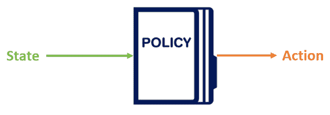

图 3：策略定义了在给定状态下要采取的动作

我们看到过一种类型的策略，其中代理始终选择具有最大即时回报的动作，称为**贪心策略**。另一个简单的策略例子是随意选择一个动作，称为**随机策略**。如果你想出一个策略来解决一个 RL 问题，通常一个好主意是重新检查你的学习策略是否优于随机策略和贪心策略。

此外，我们还将看到如何开发另一种强健的策略，称为**策略梯度**，在这种策略中，神经网络通过使用来自环境的反馈调整其权重，通过梯度下降学习选择动作的策略。我们将看到，尽管两种方法都被使用，策略梯度更为直接且充满乐观。

# 效用

长期回报被称为**效用**。事实证明，如果我们知道在某一状态下执行某个动作的效用，那么解决强化学习（RL）就变得容易。例如，为了决定采取哪种动作，我们只需选择产生最高效用的动作。然而，揭示这些效用值是困难的。在状态*s*下执行动作*a*的效用被写为一个函数，*Q(s, a)*，称为**效用函数**。它预测期望的即时回报，以及根据最优策略执行后续回报，如*图 4*所示：

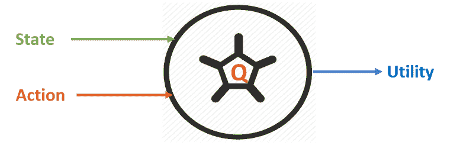

图 4：使用效用函数

大多数 RL 算法归结为三个主要步骤：推断、执行和学习。在第一步中，算法根据当前所掌握的知识选择给定状态*s*下的最佳动作*a*。接下来，执行该动作以获得回报*r*以及下一个状态*s'*。然后，算法利用新获得的知识*(s, r, a, s')*来改进对世界的理解。然而，正如你可能同意的那样，这只是计算效用的一种朴素方法。

现在，问题是：有什么更稳健的方法来计算它呢？我们可以通过递归地考虑未来动作的效用来计算某个特定状态-动作对*(s, a)*的效用。当前动作的效用不仅受到即时奖励的影响，还受到下一最佳动作的影响，如下式所示：

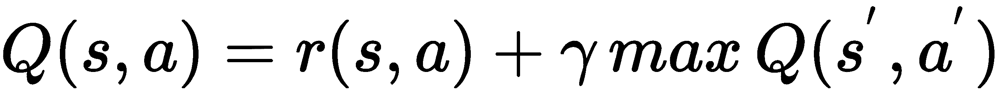

*s'*表示下一个状态，*a'*表示下一个动作。在状态*s*下采取动作*a*的奖励用*r(s, a)*表示。这里，*γ*是一个超参数，你可以选择它，称为折扣因子。如果*γ*为*0*，那么智能体选择的是最大化即时奖励的动作。较高的*γ*值会使智能体更加重视长期后果。在实际应用中，我们还需要考虑更多这样的超参数。例如，如果一个吸尘器机器人需要快速学习解决任务，但不一定要求最优，我们可能会希望设置一个较快的学习率。

另外，如果允许机器人有更多时间来探索和利用，我们可以调低学习率。我们将学习率称为*α*，并将我们的效用函数修改如下（请注意，当*α = 1*时，两个方程是相同的）：

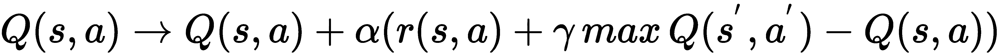

总结来说，如果我们知道这个*Q(s, a)*函数，就可以解决一个强化学习问题。接下来是一个叫做 Q 学习的算法。

# 一个简单的 Q 学习实现

Q 学习是一种可以用于金融和市场交易应用的算法，例如期权交易。一个原因是最佳策略是通过训练生成的。也就是说，强化学习通过在 Q 学习中定义模型，并随着每一个新的实验不断更新它。Q 学习是一种优化（累计）折扣奖励的方法，使得远期奖励低于近期奖励；Q 学习是一种无模型的强化学习方法。它也可以看作是异步**动态规划**（**DP**）的一种形式。

它为智能体提供了通过体验行动的后果来学习在马尔科夫领域中最优行动的能力，而无需它们建立领域的映射。简而言之，Q 学习被认为是一种强化学习技术，因为它不严格要求标签数据和训练。此外，Q 值不一定是连续可微的函数。

另一方面，马尔科夫决策过程提供了一个数学框架，用于在结果部分随机且部分受决策者控制的情况下建模决策过程。在这种框架中，随机变量在未来某一时刻的概率仅依赖于当前时刻的信息，而与任何历史值无关。换句话说，概率与历史状态无关。

# Q 学习算法的组成部分

这个实现深受 Patrick R. Nicolas 所著《*Scala for Machine Learning - Second Edition*》一书中的 Q 学习实现的启发，出版于 Packt Publishing Ltd.，2017 年 9 月。感谢作者和 Packt Publishing Ltd.。源代码可以在[`github.com/PacktPublishing/Scala-for-Machine-Learning-Second-Edition/tree/master/src/main/scala/org/scalaml/reinforcement`](https://github.com/PacktPublishing/Scala-for-Machine-Learning-Second-Edition/tree/master/src/main/scala/org/scalaml/reinforcement)获取。

有兴趣的读者可以查看原始实现，扩展版课程可以从 Packt 仓库或本书的 GitHub 仓库下载。Q 学习算法实现的关键组件有几个类——`QLearning`、`QLSpace`、`QLConfig`、`QLAction`、`QLState`、`QLIndexedState`和`QLModel`——如以下几点所描述：

+   `QLearning`：实现训练和预测方法。它使用类型为`QLConfig`的配置定义一个类型为`ETransform`的数据转换。

+   `QLConfig`：这个参数化的类定义了 Q 学习的配置参数。更具体地说，它用于保存用户的显式配置。

+   `QLAction`**：** 这是一个定义在源状态和多个目标状态之间执行的动作的类。

+   `QLPolicy`：这是一个枚举器，用于定义在 Q 学习模型训练过程中更新策略时使用的参数类型。

+   `QLSpace`：它有两个组成部分：类型为`QLState`的状态序列和序列中一个或多个目标状态的标识符`id`。

+   `QLState`：包含一系列`QLAction`实例，帮助从一个状态过渡到另一个状态。它还用作要评估和预测状态的对象或实例的引用。

+   `QLIndexedState`：这个类返回一个索引状态，用于在搜索目标状态的过程中索引一个状态。

+   `QLModel`：这个类用于通过训练过程生成一个模型。最终，它包含最佳策略和模型的准确性。

注意，除了前面的组件外，还有一个可选的约束函数，限制从当前状态搜索下一个最有回报的动作的范围。以下图示展示了 Q 学习算法的关键组件及其交互：

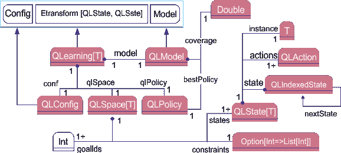

图 5：QLearning 算法的组成部分及其交互

# QLearning 中的状态和动作

`QLAction`类指定了从一个状态到另一个状态的过渡。它接受两个参数——即从和到。它们各自有一个整数标识符，且需要大于 0：

+   `from`：动作的源

+   `to`：动作的目标

其签名如下所示：

```py
case class QLAction(from: Int, to: Int) {
    require(from >= 0, s"QLAction found from: 
    $from required: >=0")require(to >= 0, s"QLAction found to: 
    $to required: >=0")

override def toString: String = s"n
    Action: state 
    $from => state $to"
}
```

`QLState`类定义了 Q 学习中的状态。它接受三个参数：

+   `id`：一个唯一标识状态的标识符

+   `actions`：从当前状态过渡到其他状态的动作列表，

+   `instance`：状态可能具有`T`类型的属性，与状态转移无关

这是类的签名：

```py
case class QLStateT {
 import QLState._check(id)
 final def isGoal: Boolean = actions.nonEmpty
 override def toString: String =s"state: $id ${actions.mkString(" ")
        }
    nInstance: ${instance.toString}"
}
```

在上述代码中，`toString()`方法用于表示 Q-learning 中状态的文本形式。状态由其 ID 和可能触发的动作列表定义。

状态可能没有任何动作。通常这种情况发生在目标状态或吸收状态中。在这种情况下，列表为空。参数化实例是指为其计算状态的对象。

现在我们知道要执行的状态和动作。然而，`QLearning`代理需要知道形如（状态 *x* 动作）的搜索空间。下一步是创建图形或搜索空间。

# 搜索空间

搜索空间是负责任何状态序列的容器。`QLSpace`类定义了 Q-learning 算法的搜索空间（状态 *x* 动作），如下图所示：

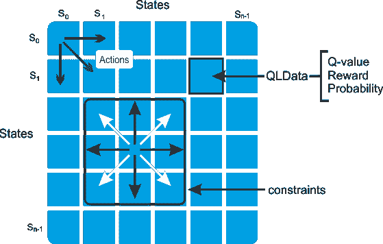

图 6：带有 QLData（Q 值、奖励、概率）的状态转移矩阵

搜索空间可以通过最终用户提供状态和动作的列表来提供，或者通过提供以下参数来自动创建状态数量：

+   `States`：Q-learning 搜索空间中定义的所有可能状态的序列

+   `goalIds`：目标状态的标识符列表

现在让我们来看一下这个类的实现。这是一个相当大的代码块。因此，我们从构造函数开始，它生成一个名为`statesMap`的映射。它通过`id`获取状态，并使用目标数组`goalStates`：

```py
private[scalaml] class QLSpace[T] protected (states: Seq[QLState[T]], goalIds: Array[Int]) {
 import QLSpace._check(states, goalIds)
```

然后它创建一个不可变的状态映射，映射包含状态 ID 和状态实例：

```py
private[this] val statesMap: immutable.Map[Int, QLState[T]] = states.map(st => (st.id, st)).toMap
```

现在我们已经有了策略和动作状态，接下来的任务是根据状态和策略计算最大值：

```py
final def maxQ(state: QLState[T], policy: QLPolicy): Double = {
 val best=states.filter(_ != state).maxBy(st=>policy.EQ(state.id, st.id))policy.EQ(state.id, best.id)
    }
```

此外，我们还需要通过访问搜索空间中的状态数来知道状态的数量：

```py
final def getNumStates: Int = states.size
```

然后，`init`方法选择一个初始状态用于训练集。 如果`state0`参数无效，则随机选择该状态：

```py
def init(state0: Int): QLState[T] =
 if (state0 < 0) {
 val r = new Random(System.currentTimeMillis 
                + Random.nextLong)states(r.nextInt(states.size - 1))
        } 
 else states(state0)
```

最后，`nextStates`方法检索执行所有与该状态相关的动作后得到的状态列表。搜索空间`QLSpace`由在`QLSpace`伴生对象中定义的工厂方法`apply`创建，如下所示：

```py
final def nextStates(st: QLState[T]): Seq[QLState[T]] =
 if (st.actions.isEmpty)Seq.empty[QLState[T]]
 else st.actions.flatMap(ac => statesMap.get(ac.to))
```

此外，如何知道当前状态是否为目标状态？嗯，`isGoal()`方法可以解决这个问题。

它接受一个名为`state`*的参数，*它是*一个*被测试是否为目标状态的状态，并且如果该状态是目标状态，则返回`Boolean: true`；否则返回 false：

```py
final def isGoal(state: QLState[T]): Boolean = goalStates.contains(state.id)
```

apply 方法使用实例集合、目标和约束函数`constraints`作为输入，创建一个状态列表。每个状态都会创建一个动作列表。动作是从这个状态到任何其他状态生成的：

```py
def applyT: QLSpace[T] =             
    apply(ArrayInt, instances, constraints)
```

函数约束限制了从任何给定状态触发的操作范围，如图 X 所示。

# 策略和行动值

`QLData` 类通过创建一个具有给定奖励、概率和 Q 值的 `QLData` 记录或实例来封装 Q-learning 算法中策略的属性，这些值在训练过程中被计算和更新。概率变量用于建模执行操作的干预条件。

如果操作没有任何外部约束，则概率为 1（即最高概率），否则为零（即无论如何该操作都不被允许）。签名如下所示：

```py
final private[scalaml] class QLData(
 val reward: Double, 
 val probability: Double = 1.0) {

 import QLDataVar._
 var value: Double = 0.0
    @inline final def estimate: Double = value * probability

 final def value(varType: QLDataVar): Double = varType 
 match {
 case REWARD => reward
 case PROB => probability
 case VALUE => value
            }
override def toString: String = s"nValue= $value Reward= $reward Probability= $probability"}
```

在前面的代码块中，Q 值通过 Q-learning 公式在训练过程中更新，但整体值是通过使用奖励调整其概率来计算的，然后返回调整后的值。然后，`value()` 方法使用属性的类型选择 Q-learning 策略元素的属性。它接受属性的 `varType`（即 `REWARD`、`PROBABILITY` 和 `VALUE`），并返回该属性的值。

最后，`toString()` 方法有助于表示值、奖励和概率。现在我们知道数据将如何操作，接下来的任务是创建一个简单的模式，用于初始化与每个操作相关的奖励和概率。以下 Scala 示例是一个名为 `QLInput` 的类；它输入到 Q-learning 搜索空间（`QLSpace`）和策略（`QLPolicy`）中：

```py
case class QLInput(from: Int, to: Int, reward: Double = 1.0, prob: Double = 1.0)
```

在前面的签名中，构造函数创建了一个 Q-learning 的操作输入。它接受四个参数：

+   `from`，源状态的标识符

+   `to`，目标或目的地状态的标识符

+   `reward`，即从状态 `from` 转移到状态 `to` 的奖励或惩罚

+   prob，表示从状态 `from` 转移到状态 `to` 的概率

在前面的类中，`from` 和 `to` 参数用于特定操作，而最后两个参数分别是操作完成后收集的奖励和其概率。默认情况下，这两个操作的奖励和概率均为 1。简而言之，我们只需要为那些具有更高奖励或更低概率的操作创建输入。

状态数和输入序列定义了 `QLPolicy` 类型的策略，这是一个数据容器。一个操作有一个 Q 值（也称为**行动值**）、一个奖励和一个概率。实现通过三个独立的矩阵定义这三个值——*Q* 用于行动值，*R* 用于奖励，*P* 用于概率——以保持与数学公式的一致性。以下是此类的工作流程：

1.  使用输入的概率和奖励初始化策略（参见 `qlData` 变量）。

1.  根据输入大小计算状态数（参见`numStates`变量）。

1.  设置从状态`from`到状态`to`的动作的 Q 值（见`setQ`方法），并通过`get()`方法获取 Q 值。

1.  获取从状态`from`到状态`to`的状态转移动作的 Q 值（见 Q 方法）。

1.  获取从状态`from`到状态`to`的状态转移动作的估计值（见`EQ`方法），并以`double`类型返回该值。

1.  获取从状态`from`到状态`to`的状态转移动作的奖励（见 R 方法）。

1.  获取从状态`from`到状态`to`的状态转移动作的概率（见`P`方法）。

1.  计算`Q`的最小值和最大值（见`minMaxQ`方法）。

1.  获取一对（源状态索引，目标状态索引），其转移值为正。状态的索引将转换为 Double 类型（见`EQ: Vector[DblPair]`方法）。

1.  使用第一个`toString()`方法获取此策略的奖励矩阵的文本描述。

1.  使用第二个`toString()`方法，文本表示以下任意一项：Q 值、奖励或概率矩阵。

1.  使用`check()`方法验证`from`和`to`的值。

现在让我们来看一下包含前述工作流的类定义：

```py
final private[scalaml] class QLPolicy(val input: Seq[QLInput]) {
 import QLDataVar._QLPolicy.check(input)
 private[this] val qlData = input.map(qlIn => new QLData(qlIn.reward, qlIn.prob))
 private[this] val numStates = Math.sqrt(input.size).toInt

 def setQ(from: Int, to: Int, value: Double): Unit = 
        {check(from, to, "setQ")qlData(from * numStates + to).value = value}

 final def get(from: Int, to: Int, varType: QLDataVar): String
    {f"${qlData(from * numStates + to).value(varType)}%2.2f"}

 final def Q(from: Int, to: Int): Double = {check(from, to, "Q") qlData(from * numStates + to).value}
 final def EQ(from: Int, to: Int): Double = {check(from, to, "EQ") qlData(from * numStates + to).estimate}
 final def R(from: Int, to: Int): Double = {check(from, to, "R") qlData(from * numStates + to).reward}
 final def P(from: Int, to: Int): Double = {check(from, to, "P") qlData(from * numStates + to).probability}

 final def minMaxQ: DblPair = {
 val r = Range(0, numStates)
 val _min = r.minBy(from => r.minBy(Q(from, _)))
 val _max = r.maxBy(from => r.maxBy(Q(from, _)))(_min, _max)}

 final def EQ: Vector[DblPair] = {
 import scala.collection.mutable.ArrayBuffer
 val r = Range(0, numStates)r.flatMap(from =>r.map(to => (from, to, Q(from, to)))).map { 
 case (i, j, q) => 
 if (q > 0.0) (i.toDouble, j.toDouble) 
 else (0.0, 0.0) }.toVector}

override def toString: String = s"Rewardn${toString(REWARD)}"

def toString(varType: QLDataVar): String = {
 val r = Range(1, numStates)r.map(i => r.map(get(i, _, varType)).mkString(",")).mkString("n")}
 private def check(from: Int, to: Int, meth: String): Unit = {require(from >= 0 && from <                         numStates,s"QLPolicy.
            $meth Found from:
            $from required >= 0 and < 
            $numStates")require(to >= 0 && to < numStates,s"QLPolicy.
            $meth Found to: $to required >= 0 and < $numStates")
}
```

# QLearning 模型的创建与训练

`QLearning`类封装了 Q 学习算法，更具体地说，是动作-值更新方程。它是`ETransform`类型的数据转换（我们稍后会讨论），并有一个明确的`QLConfig`类型配置。该类是一个泛型参数化类，实现了`QLearning`算法。Q 学习模型在类实例化时进行初始化和训练，以便它能处于正确的状态，进行运行时预测。

因此，类实例只有两种状态：成功训练和失败训练（我们稍后会看到这一点）。

实现不假设每个回合（或训练周期）都会成功。训练完成后，计算初始训练集上标签的比例。客户端代码负责通过测试该比例来评估模型的质量（见模型评估部分）。

构造函数接受算法的配置（即`config`）、搜索空间（即`qlSpace`）和策略（即`qlPolicy`）参数，并创建一个 Q 学习算法：

```py
final class QLearningT
 extends ETransform[QLState[T], QLState[T]](conf) with Monitor[Double]
```

如果在类实例化过程中达到（或训练）最小覆盖率，模型会自动有效地创建，这本质上是一个 Q 学习模型。

以下的`train()`方法应用于每个回合，并随机生成初始状态。然后，它根据由`conf`对象提供的`minCoverage`配置值计算覆盖率，即每个目标状态达到的回合数：

```py
private def train: Option[QLModel] = Try {
 val completions = Range(0, conf.numEpisodes).map(epoch => 
 if (heavyLiftingTrain (-1)) 1 else 0)
        .sum
        completions.toDouble / conf.numEpisodes
        }
    .filter(_ > conf.minCoverage).map(new QLModel(qlPolicy, _)).toOption;
```

在上述代码块中，`heavyLiftingTrain(state0: Int)`方法在每个回合（或迭代）中执行繁重的工作。它通过选择初始状态 state 0 或使用新种子生成的随机生成器*r*来触发搜索，如果`state0`小于 0。

首先，它获取当前状态的所有相邻状态，然后从相邻状态列表中选择回报最高的状态。如果下一个回报最高的状态是目标状态，那么任务完成。否则，它将使用奖励矩阵（即`QLPolicy.R`）重新计算状态转移的策略值。

对于重新计算，它通过更新 Q 值来应用 Q 学习更新公式，然后使用新的状态和递增的迭代器调用搜索方法。让我们来看一下该方法的主体：

```py
private def heavyLiftingTrain(state0: Int): Boolean = {
    @scala.annotation.tailrec
 def search(iSt: QLIndexedState[T]): QLIndexedState[T] = {
 val states = qlSpace.nextStates(iSt.state)
 if (states.isEmpty || iSt.iter >= conf.episodeLength)
            QLIndexedState(iSt.state, -1)
 else {
 val state = states.maxBy(s => qlPolicy.EQ(iSt.state.id, s.id))
 if (qlSpace.isGoal(state))
                QLIndexedState(state, iSt.iter)

 else {
 val fromId = iSt.state.id
 val r = qlPolicy.R(fromId, state.id)
 val q = qlPolicy.Q(fromId, state.id)
 val nq = q + conf.alpha * (r + conf.gamma * qlSpace.maxQ(state, qlPolicy) - q)
                count(QVALUE_COUNTER, nq)
                qlPolicy.setQ(fromId, state.id, nq)
                search(QLIndexedState(state, iSt.iter + 1))
                }
            }
        }

val finalState = search(QLIndexedState(qlSpace.init(state0), 0))
if (finalState.iter == -1)
 false else
    qlSpace.isGoal(finalState.state)
    }
}
```

给出一组策略和训练覆盖率后，让我们获取训练后的模型：

```py
private[this] val model: Option[QLModel] = train
```

请注意，上述模型是通过用于训练 Q 学习算法的输入数据（参见类`QLPolicy`）和内联方法`getInput()`进行训练的：

```py
def getInput: Seq[QLInput] = qlPolicy.input
```

现在我们需要执行一个在期权交易应用中将会用到的重要步骤。因此，我们需要将 Q 学习的模型作为一个选项进行检索：

```py
@inline
finaldef getModel: Option[QLModel] = model
```

如果模型未定义，则整体应用程序会失败（参见`validateConstraints()`方法进行验证）：

```py
@inline
finaldef isModel: Boolean = model.isDefined
override def toString: String = qlPolicy.toString + qlSpace.toString
```

然后，使用 Scala 尾递归执行下一最有回报的状态的递归计算。其思路是在所有状态中搜索，并递归选择为最佳策略给予最多奖励的状态。

```py
@scala.annotation.tailrec
private def nextState(iSt: QLIndexedState[T]): QLIndexedState[T] = {
 val states = qlSpace.nextStates(iSt.state)
 if (states.isEmpty || iSt.iter >= conf.episodeLength)
                iSt
 else {
 val fromId = iSt.state.id
 val qState = states.maxBy(s => model.map(_.bestPolicy.EQ(fromId, s.id)).getOrElse(-1.0))
                nextState(QLIndexedStateT)
        }
}
```

在上述代码块中，`nextState()`方法检索可以从当前状态转移到的合适状态。然后，它通过递增迭代计数器来提取具有最高回报策略的状态`qState`。最后，如果没有更多状态或方法未在由`config.episodeLength`参数提供的最大迭代次数内收敛，它将返回状态。

**尾递归**：在 Scala 中，尾递归是一种非常有效的结构，用于对集合中的每个项应用操作。它在递归过程中优化了函数栈帧的管理。注解触发了编译器优化函数调用所需的条件验证。

最后，Q 学习算法的配置`QLConfig`指定：

+   学习率，`alpha`

+   折扣率，`gamma`

+   一个回合的最大状态数（或长度），`episodeLength`

+   训练中使用的回合数（或迭代次数），`numEpisodes`

+   选择最佳策略所需的最小覆盖率，`minCoverage`

这些内容如下所示：

```py
case class QLConfig(alpha: Double,gamma: Double,episodeLength: Int,numEpisodes: Int,minCoverage: Double) 
extends Config {
import QLConfig._check(alpha, gamma, episodeLength, numEpisodes, minCoverage)}
```

现在我们几乎完成了，除了验证尚未完成。然而，让我们先看一下 Q 学习算法配置的伴生对象。此单例定义了`QLConfig`类的构造函数，并验证其参数：

```py
private[scalaml] object QLConfig {
 private val NO_MIN_COVERAGE = 0.0
 private val MAX_EPISODES = 1000

 private def check(alpha: Double,gamma: Double,
                          episodeLength: Int,numEpisodes: Int,
                          minCoverage: Double): Unit = {
                    require(alpha > 0.0 && alpha < 1.0,s"QLConfig found alpha: $alpha required 
                            > 0.0 and < 1.0")
                    require(gamma > 0.0 && gamma < 1.0,s"QLConfig found gamma $gamma required 
                           > 0.0 and < 1.0")
                    require(numEpisodes > 2 && numEpisodes < MAX_EPISODES,s"QLConfig found 
                            $numEpisodes $numEpisodes required > 2 and < $MAX_EPISODES")
                    require(minCoverage >= 0.0 && minCoverage <= 1.0,s"QLConfig found $minCoverage 
                            $minCoverage required > 0 and <= 1.0")
        }
```

太棒了！我们已经看到了如何在 Scala 中实现 `QLearning` 算法。然而，正如我所说，实施是基于公开的来源，训练可能并不总是收敛。对于这种在线模型，一个重要的考虑因素是验证。商业应用（或甚至是我们将在下一节讨论的高大上的 Scala Web 应用）可能需要多种验证机制，涉及状态转换、奖励、概率和 Q 值矩阵。

# QLearning 模型验证

一个关键的验证是确保用户定义的约束函数不会在 Q-learning 的搜索或训练中产生死锁。约束函数确定了从给定状态通过行动可以访问的状态列表。如果约束过于严格，一些可能的搜索路径可能无法到达目标状态。下面是对约束函数的一个简单验证：

```py
def validateConstraints(numStates: Int, constraint: Int => List[Int]): Boolean = {require(numStates > 1,         s"QLearning validateConstraints found $numStates states should be >1")!Range(0,                 
        numStates).exists(constraint(_).isEmpty)
}
```

# 使用训练好的模型进行预测

现在我们可以递归地选择给定最佳策略的最多奖励的状态（参见下面代码中的`nextState`方法），例如，可以对期权交易执行 Q-learning 算法的在线训练。

因此，一旦 Q-learning 模型使用提供的数据进行了训练，下一状态就可以通过覆盖数据转换方法（`PipeOperator`，即`|`）来使用 Q-learning 模型进行预测，转换为预测的目标状态：

```py
override def |> : PartialFunction[QLState[T], Try[QLState[T]]] = {
 case st: QLState[T] 
 if isModel =>
            Try(
 if (st.isGoal) st 
 else nextState(QLIndexedStateT).state)
    }
```

我想这已经够多了，虽然评估模型会很好。但是，在真实数据集上进行评估会更好，因为在假数据上运行和评估模型的表现，就像是买了辆新车却从未开过。因此，我想结束实现部分，继续进行基于这个 Q-learning 实现的期权交易应用。

# 使用 Q-learning 开发期权交易 Web 应用

交易算法是利用计算机编程，按照定义的一组指令执行交易，以生成人类交易员无法匹敌的速度和频率的利润。定义的规则集基于时机、价格、数量或任何数学模型。

# 问题描述

通过这个项目，我们将根据当前一组从到期时间、证券价格和波动性派生的观察特征，预测期权在未来*N*天的价格。问题是：我们应该使用什么模型来进行这种期权定价？答案是，实际上有很多模型；其中 Black-Scholes 随机**偏微分方程**（**PDE**）是最为人熟知的。

在数学金融学中，Black-Scholes 方程是必然的偏微分方程，它覆盖了欧式看涨期权或欧式看跌期权在 Black-Scholes 模型下的价格演变。对于不支付股息的标的股票的欧式看涨期权或看跌期权，方程为：

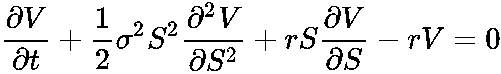

其中 *V* 表示期权价格，是股票价格 *S* 和时间 *t* 的函数，*r* 是无风险利率，*σ* 是股票的波动率。方程背后的一个关键金融洞察是，任何人都可以通过正确的方式买卖标的资产来完美对冲期权而不承担任何风险。这种对冲意味着只有一个正确的期权价格，由 Black-Scholes 公式返回。

考虑一种行使价格为 $95 的 IBM 一月到期期权。你写出一种行使价格为 $85 的 IBM 一月看跌期权。让我们考虑和关注给定安全性 IBM 的看涨期权。下图绘制了 2014 年 5 月 IBM 股票及其衍生看涨期权的每日价格，行使价格为 $190：

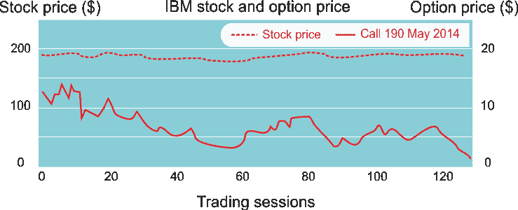

图 7：2013 年 5 月至 10 月期间 IBM 股票和行使价格为 $190 的看涨期权定价

现在，如果 IBM 在期权到期日以 $87 出售，这个头寸的盈亏将是多少？或者，如果 IBM 以 $100 出售呢？嗯，计算或预测答案并不容易。然而，在期权交易中，期权价格取决于一些参数，如时间衰减、价格和波动率：

+   期权到期时间（时间衰减）

+   标的证券的价格

+   标的资产收益的波动率

定价模型通常不考虑标的证券的交易量变化。因此，一些研究人员将其纳入期权交易模型中。正如我们所描述的，任何基于强化学习的算法应该具有显式状态（或状态），因此让我们使用以下四个归一化特征定义期权的状态：

+   **时间衰减** (`timeToExp`)：这是归一化后的到期时间在 (0, 1) 范围内。

+   **相对波动性** (`volatility`)：在一个交易会话内，这是标的证券价格相对变化的相对值。这与 Black-Scholes 模型中定义的更复杂收益波动性不同。

+   **波动性相对于成交量** (`vltyByVol`)：这是调整后的标的证券价格相对于其成交量的相对波动性。

+   **当前价格与行权价格之间的相对差异** (`priceToStrike`)：这衡量的是价格与行权价格之间差异与行权价格的比率。

下图显示了可以用于 IBM 期权策略的四个归一化特征：

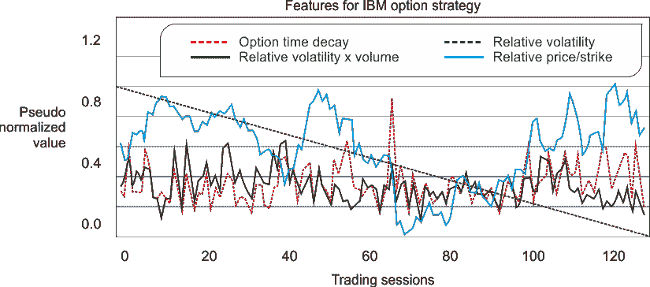

图 8：IBM 股票的归一化相对股价波动性、相对于交易量的波动性以及相对于行权价格的股价

现在让我们看看股票和期权价格的数据集。有两个文件，`IBM.csv`和`IBM_O.csv`，分别包含 IBM 股票价格和期权价格。股票价格数据集包含日期、开盘价、最高价、最低价、收盘价、交易量和调整后的收盘价。数据集的一部分如下图所示：

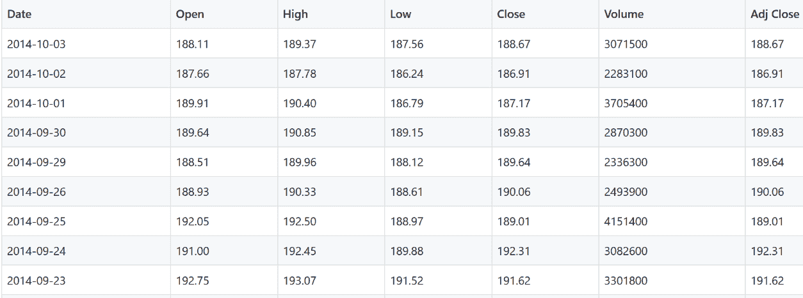

图 9：IBM 股票数据

另一方面，`IBM_O.csv`包含了 127 个 IBM 190 Oct 18, 2014 的期权价格。其中几个值为 1.41、2.24、2.42、2.78、3.46、4.11、4.51、4.92、5.41、6.01 等。到此为止，我们能否利用`QLearning`算法开发一个预测模型，帮助我们回答之前提到的问题：它能告诉我们如何通过利用所有可用特征帮助 IBM 实现最大利润吗？

好的，我们知道如何实现`QLearning`，也知道什么是期权交易。另一个好处是，本项目将使用的技术，如 Scala、Akka、Scala Play 框架和 RESTful 服务，已经在第三章《从历史数据中进行高频比特币价格预测》中进行了讨论。*因此，可能是可行的*。接下来我们尝试开发一个 Scala Web 项目，帮助我们最大化利润。

# 实现期权交易 Web 应用程序

本项目的目标是创建一个期权交易的 Web 应用程序，该程序从 IBM 股票数据中创建一个 QLearning 模型。然后，应用程序将从模型中提取输出作为 JSON 对象，并将结果显示给用户。*图 10*显示了整体工作流程：

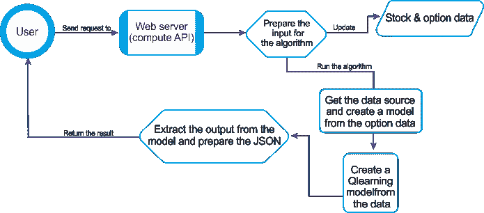

图 10：期权交易 Scala Web 的工作流程

计算 API 为 Q-learning 算法准备输入数据，算法通过从文件中提取数据来构建期权模型。然后，它对数据进行归一化和离散化等操作。所有这些数据都传递给 Q-learning 算法以训练模型。之后，计算 API 从算法中获取模型，提取最佳策略数据，并将其放入 JSON 中返回给 Web 浏览器。期权交易策略的实现，使用 Q-learning 包含以下几个步骤：

+   描述期权的属性

+   定义函数近似

+   指定状态转换的约束条件

# 创建一个期权属性

考虑到市场波动性，我们需要更现实一点，因为任何长期预测都相当不可靠。原因是它将超出离散马尔科夫模型的约束。因此，假设我们想预测未来两天的价格——即 *N= 2*。这意味着期权未来两天的价格是利润或损失的奖励值。那么，让我们封装以下四个参数：

+   `timeToExp`：期权到期前剩余时间，占期权整体持续时间的百分比

+   波动性标准化：给定交易时段内，基础证券的相对波动性

+   `vltyByVol`：在给定交易时段内，相对于该时段交易量的基础证券波动性

+   `priceToStrike`：相对于行使价的基础证券价格，在给定交易时段内

`OptionProperty` 类定义了一个交易期权的属性。构造函数为期权创建属性：

```py
class OptionProperty(timeToExp: Double,volatility: Double,vltyByVol: Double,priceToStrike: Double) {
 val toArray = ArrayDouble
        require(timeToExp > 0.01, s"OptionProperty time to expiration found $timeToExp required 0.01")
    }
```

# 创建一个期权模型

现在，我们需要创建一个 `OptionModel` 来充当期权属性的容器和工厂。它接受以下参数，并通过访问之前描述的四个特征的数据源，创建一个期权属性列表 `propsList`：

+   证券的符号。

+   `option` 的行使价格，`strikePrice`。

+   `data` 的来源，`src`。

+   最小时间衰减或到期时间，`minTDecay`。期权价值低于行使价的期权会变得毫无价值，而价值高于行使价的期权在接近到期时价格行为差异很大。因此，期权到期日前的最后 `minTDecay` 个交易时段不会参与训练过程。

+   用于近似每个特征值的步数（或桶数），`nSteps`。例如，四步近似会创建四个桶：（0，25），（25，50），（50，75），和（75，100）。

然后，它会组装 `OptionProperties` 并计算期权到期的最小标准化时间。接着，它通过将实际价值离散化为多个层次，从期权价格数组中近似计算期权的价值；最后，它返回一个包含期权价格和精度层次的映射。以下是该类的构造函数：

```py
class OptionModel(
    symbol: String,
    strikePrice: Double,
    src: DataSource,
    minExpT: Int,
    nSteps: Int
    )
```

在这个类的实现中，首先通过 `check()` 方法进行验证，检查以下内容：

+   `strikePrice`：需要一个正的价格

+   `minExpT`：此值必须介于 2 和 16 之间

+   `nSteps`：至少需要两个步数

以下是调用该方法的示例：

```py
check(strikePrice, minExpT, nSteps)
```

上述方法的签名如下所示：

```py
def check(strikePrice: Double, minExpT: Int, nSteps: Int): Unit = {
    require(strikePrice > 0.0, s"OptionModel.check price found $strikePrice required > 0")
    require(minExpT > 2 && minExpT < 16,s"OptionModel.check Minimum expiration time found $minExpT                     required ]2, 16")
    require(nSteps > 1,s"OptionModel.check, number of steps found $nSteps required > 1")
    }
```

一旦满足前述约束条件，期权属性列表 `propsList` 被创建如下：

```py
val propsList = (for {
    price <- src.get(adjClose)
    volatility <- src.get(volatility)
    nVolatility <- normalize[Double
    vltyByVol <- src.get(volatilityByVol)
    nVltyByVol <- normalizeDouble
    priceToStrike <- normalizeDouble)
    } 
 yield {
        nVolatility.zipWithIndex./:(List[OptionProperty]()) {
 case (xs, (v, n)) =>
 val normDecay = (n + minExpT).toDouble / (price.size + minExpT)
 new OptionProperty(normDecay, v, nVltyByVol(n), priceToStrike(n)) :: xs
        }
     .drop(2).reverse
    }).get
```

在前面的代码块中，工厂使用了`zipWithIndex`的 Scala 方法来表示交易会话的索引。所有的特征值都在区间(0, 1)内进行归一化，包括`normDecay`期权的时间衰减（或到期时间）。

`OptionModel`类的`quantize()`方法将每个期权属性的归一化值转换为一个桶索引数组。它返回一个以桶索引数组为键的盈亏映射表：

```py
def quantize(o: Array[Double]): Map[Array[Int], Double] = {
 val mapper = new mutable.HashMap[Int, Array[Int]]
 val acc: NumericAccumulator[Int] = propsList.view.map(_.toArray)
    map(toArrayInt(_)).map(ar => {
 val enc = encode(ar)
        mapper.put(enc, ar)
        enc
            })
    .zip(o)./:(
 new NumericAccumulator[Int]) {
 case (_acc, (t, y)) => _acc += (t, y); _acc
            }
        acc.map {
 case (k, (v, w)) => (k, v / w) }
            .map { 
 case (k, v) => (mapper(k), v) }.toMap
    }
```

该方法还创建了一个映射器实例，用于索引桶数组。一个类型为`NumericAccumulator`的累加器`acc`扩展了`Map[Int, (Int, Double)]`，并计算这个元组*(每个桶中特征的出现次数，期权价格的增减总和)*。

`toArrayInt`方法将每个期权属性（如`timeToExp`、`volatility`等）的值转换为相应桶的索引。然后，索引数组被编码以生成一个状态的 id 或索引。该方法更新累加器，记录每个交易会话的期权出现次数及其总盈亏。最后，它通过对每个桶的盈亏进行平均计算每个操作的奖励。`encode()`、`toArrayInt()`方法的签名如下所示：

```py
private def encode(arr: Array[Int]): Int = arr./:((1, 0)) { 
 case ((s, t), n) => (s * nSteps, t + s * n) }._2
 private def toArrayInt(feature: Array[Double]): Array[Int] = feature.map(x => (nSteps *         
            x).floor.toInt)

final class NumericAccumulator[T] 
 extends mutable.HashMap[T, (Int, Double)] {
 def +=(key: T, x: Double): Option[(Int, Double)] = {
 val newValue = 
 if (contains(key)) (get(key).get._1 + 1, get(key).get._2 + x) 
 else (1, x)
 super.put(key, newValue)
    }
}
```

最后，也是最重要的，如果前述约束条件得到满足（不过你可以修改这些约束），并且一旦`OptionModel`类的实例化成功生成`OptionProperty`元素的列表；否则，它将生成一个空列表。

# 将它们汇总在一起

由于我们已经实现了 Q-learning 算法，我们现在可以使用 Q-learning 开发期权交易应用程序。然而，首先，我们需要使用`DataSource`类加载数据（稍后我们将看到其实现）。然后，我们可以为给定股票创建一个期权模型，使用`OptionModel`，它定义了一个在证券上交易的期权模型，并设置默认的行权价和最短到期时间参数。然后，我们需要为期权的盈亏模型创建基础证券。

盈亏被调整为产生正值。它实例化了一个 Q-learning 类的实例，即一个实现了 Q-learning 算法的通用参数化类。Q-learning 模型在类实例化时被初始化和训练，因此它可以在运行时进行预测时处于正确的状态。

因此，类的实例只有两种状态：成功训练和失败训练的 Q-learning 值操作。然后模型被返回并处理和可视化。

那么，让我们创建一个 Scala 对象并命名为`QLearningMain`。接着，在`QLearningMain`对象内部，定义并初始化以下参数：

+   `Name`：用于指示强化算法的名称（在我们的例子中是 Q-learning）

+   `STOCK_PRICES`: 包含股票数据的文件

+   `OPTION_PRICES`: 包含可用期权数据的文件

+   `STRIKE_PRICE`: 期权行权价格

+   `MIN_TIME_EXPIRATION`: 记录的期权最小到期时间

+   `QUANTIZATION_STEP`: 用于对证券值进行离散化或近似的步长

+   `ALPHA`: Q-learning 算法的学习率

+   `DISCOUNT`（gamma）：Q-learning 算法的折扣率

+   `MAX_EPISODE_LEN`: 每个回合访问的最大状态数

+   `NUM_EPISODES`: 训练过程中使用的回合数

+   `MIN_COVERAGE`: Q-learning 模型训练过程中允许的最小覆盖率

+   `NUM_NEIGHBOR_STATES`: 从任何其他状态可访问的状态数

+   `REWARD_TYPE`: 最大奖励或随机

每个参数的初步初始化如下代码所示：

```py
val name: String = "Q-learning"// Files containing the historical prices for the stock and option
val STOCK_PRICES = "/static/IBM.csv"
val OPTION_PRICES = "/static/IBM_O.csv"// Run configuration parameters
val STRIKE_PRICE = 190.0 // Option strike price
val MIN_TIME_EXPIRATION = 6 // Min expiration time for option recorded
val QUANTIZATION_STEP = 32 // Quantization step (Double => Int)
val ALPHA = 0.2 // Learning rate
val DISCOUNT = 0.6 // Discount rate used in Q-Value update equation
val MAX_EPISODE_LEN = 128 // Max number of iteration for an episode
val NUM_EPISODES = 20 // Number of episodes used for training.
val NUM_NEIGHBHBOR_STATES = 3 // No. of states from any other state
```

现在，`run()`方法接受作为输入的奖励类型（在我们的例子中是`最大奖励`）、量化步长（在我们的例子中是`QUANTIZATION_STEP`）、alpha（学习率，在我们的例子中是`ALPHA`）和 gamma（在我们的例子中是`DISCOUNT`，Q-learning 算法的折扣率）。它显示了模型中的值分布。此外，它在散点图上显示了最佳策略的估计 Q 值（我们稍后会看到）。以下是前述方法的工作流程：

1.  首先，它从`IBM.csv`文件中提取股票价格

1.  然后它使用股票价格和量化方法`quantizeR`创建一个选项模型`createOptionModel`（有关更多信息，请参见`quantize`方法和稍后的主方法调用）

1.  期权价格从`IBM_o.csv`文件中提取

1.  然后，使用期权模型创建另一个模型`model`，并使用期权价格`oPrices`对其进行评估

1.  最后，估计的 Q 值（即，*Q 值 = 值 * 概率*）在散点图上显示，使用`display`方法

通过结合前述步骤，以下是`run()`方法的签名：

```py
private def run(rewardType: String,quantizeR: Int,alpha: Double,gamma: Double): Int = {
 val sPath = getClass.getResource(STOCK_PRICES).getPath
 val src = DataSource(sPath, false, false, 1).get
 val option = createOptionModel(src, quantizeR)

 val oPricesSrc = DataSource(OPTION_PRICES, false, false, 1).get
 val oPrices = oPricesSrc.extract.get

 val model = createModel(option, oPrices, alpha, gamma)model.map(m => {if (rewardType != "Random")
    display(m.bestPolicy.EQ,m.toString,s"$rewardType with quantization order             
            $quantizeR")1}).getOrElse(-1)
}
```

现在，这是`createOptionModel()`方法的签名，该方法使用（请参见`OptionModel`类）创建一个期权模型：

```py
private def createOptionModel(src: DataSource, quantizeR: Int): OptionModel =
 new OptionModel("IBM", STRIKE_PRICE, src, MIN_TIME_EXPIRATION, quantizeR)
```

接着，`createModel()`方法创建一个期权的利润和亏损模型，给定基础证券。请注意，期权价格是使用之前定义的`quantize()`方法量化的。然后，使用约束方法限制给定状态下可用的动作数。这个简单的实现计算了该状态范围内的所有状态列表。然后，它确定了一个预定义半径内的邻接状态。

最后，它使用输入数据训练 Q-learning 模型，计算最小的利润值和亏损值，以便最大亏损被转化为零利润。请注意，利润和亏损被调整为正值。现在让我们看看此方法的签名：

```py
def createModel(ibmOption: OptionModel,oPrice: Seq[Double],alpha: Double,gamma: Double): Try[QLModel] = {
 val qPriceMap = ibmOption.quantize(oPrice.toArray)
 val numStates = qPriceMap.size
 val neighbors = (n: Int) => {
def getProximity(idx: Int, radius: Int): List[Int] = {
 val idx_max =
 if (idx + radius >= numStates) numStates - 1 
 else idx + radius
 val idx_min = 
 if (idx < radius) 0 
 else idx - radiusRange(idx_min, idx_max + 1).filter(_ != idx)./:(List[Int]())((xs, n) => n :: xs)}getProximity(n, NUM_NEIGHBHBOR_STATES)
        }
 val qPrice: DblVec = qPriceMap.values.toVector
 val profit: DblVec = normalize(zipWithShift(qPrice, 1).map {
 case (x, y) => y - x}).get
 val maxProfitIndex = profit.zipWithIndex.maxBy(_._1)._2
 val reward = (x: Double, y: Double) => Math.exp(30.0 * (y - x))
 val probabilities = (x: Double, y: Double) => 
 if (y < 0.3 * x) 0.0 
 else 1.0println(s"$name Goal state index: $maxProfitIndex")
 if (!QLearning.validateConstraints(profit.size, neighbors))
 thrownew IllegalStateException("QLearningEval Incorrect states transition constraint")
 val instances = qPriceMap.keySet.toSeq.drop(1)
 val config = QLConfig(alpha, gamma, MAX_EPISODE_LEN, NUM_EPISODES, 0.1)
 val qLearning = QLearning[Array[Int]](config,ArrayInt,profit,reward,probabilities,instances,Some(neighbors))    val modelO = qLearning.getModel
 if (modelO.isDefined) {
 val numTransitions = numStates * (numStates - 1)println(s"$name Coverage ${modelO.get.coverage} for $numStates states and $numTransitions transitions")
 val profile = qLearning.dumpprintln(s"$name Execution profilen$profile")display(qLearning)Success(modelO.get)} 
 else Failure(new IllegalStateException(s"$name model undefined"))
}
```

请注意，如果前面的调用无法创建一个选项模型，代码不会显示模型创建失败的消息。尽管如此，请记住，考虑到我们使用的小数据集，接下来的这一行中使用的`minCoverage`非常重要（因为算法会非常快速地收敛）：

```py
val config = QLConfig(alpha, gamma, MAX_EPISODE_LEN, NUM_EPISODES, 0.0)
```

尽管我们已经说明模型的创建和训练未必成功，但一个简单的线索是使用一个非常小的`minCoverage`值，范围在`0.0`到`0.22`之间。如果前面的调用成功，那么模型已训练完成，可以进行预测。如果成功，那么就可以使用显示方法，在散点图中显示估算的*Q 值 = 值 * 概率*。方法的签名如下：

```py
private def display(eq: Vector[DblPair],results: String,params: String): Unit = {
 import org.scalaml.plots.{ScatterPlot, BlackPlotTheme, Legend}
 val labels = Legend(name, s"Q-learning config: $params", "States", "States")ScatterPlot.display(eq, 
        labels, new BlackPlotTheme)
}
```

稍等一下，不要急！我们终于准备好查看一个简单的`rn`并检查结果。让我们来看看：

```py
def main(args: Array[String]): Unit = {
 run("Maximum reward",QUANTIZATION_STEP, ALPHA, DISCOUNT)
 } 
>>> 
Action: state 71 => state 74
Action: state 71 => state 73
Action: state 71 => state 72
Action: state 71 => state 70
Action: state 71 => state 69
Action: state 71 => state 68...Instance: I@1f021e6c - state: 124
Action: state 124 => state 125
Action: state 124 => state 123
Action: state 124 => state 122
Action: state 124 => state 121Q-learning Coverage 0.1 for 126 states and 15750 transitions
Q-learning Execution profile
Q-Value -> 5.572310105096295, 0.013869013819834967, 4.5746487300071825, 0.4037703812585325, 0.17606260549479869, 0.09205272504875522, 0.023205692430068765, 0.06363082458984902, 50.405283888218435... 6.5530411130514015
Model: Success(Optimal policy: Reward - 1.00,204.28,115.57,6.05,637.58,71.99,12.34,0.10,4939.71,521.30,402.73, with coverage: 0.1)
```

# 评估模型

上述输出显示了从一个状态到另一个状态的转变，对于**0.1**的覆盖率，`QLearning`模型在 126 个状态中有 15,750 次转变，最终达到了目标状态 37，且获得了最优奖励。因此，训练集相当小，只有少数桶包含实际值。所以我们可以理解，训练集的大小对状态的数量有影响。对于一个小的训练集（比如我们这个例子中的情况），`QLearning`会收敛得太快。

然而，对于更大的训练集，`QLearning`需要一定的时间才能收敛；它会为每个由近似生成的桶提供至少一个值。同时，通过查看这些值，很难理解 Q 值和状态之间的关系。

那么，如果我们能看到每个状态的 Q 值呢？当然可以！我们可以在散点图中看到它们：

![图 11：每个状态的 Q 值现在让我们展示 Q 值（`QLData.value`）对数的曲线，作为递归搜索（或训练）过程中不同轮次或周期的进展。测试使用学习率*α = 0.1*和折扣率*γ = 0.9*（更多细节见部署部分）：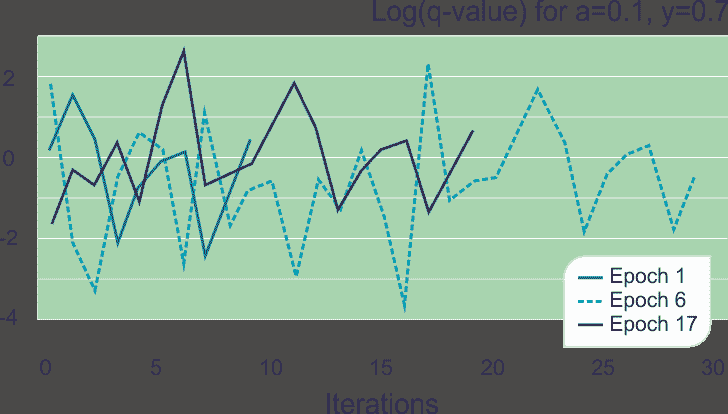

图 12：Q-learning 训练过程中，不同周期的对数 Q 值曲线

上述图表说明了每个轮次中的 Q 值与训练的顺序无关。然而，达到目标状态所需的迭代次数则取决于在此示例中随机选择的初始状态。为了获得更多的见解，请检查编辑器中的输出，或者访问 API 端点`http://localhost:9000/api/compute`（见下文）。那么，如果我们在模型中显示值的分布，并在散点图中展示给定配置参数下最佳策略的估算 Q 值会怎么样呢？

*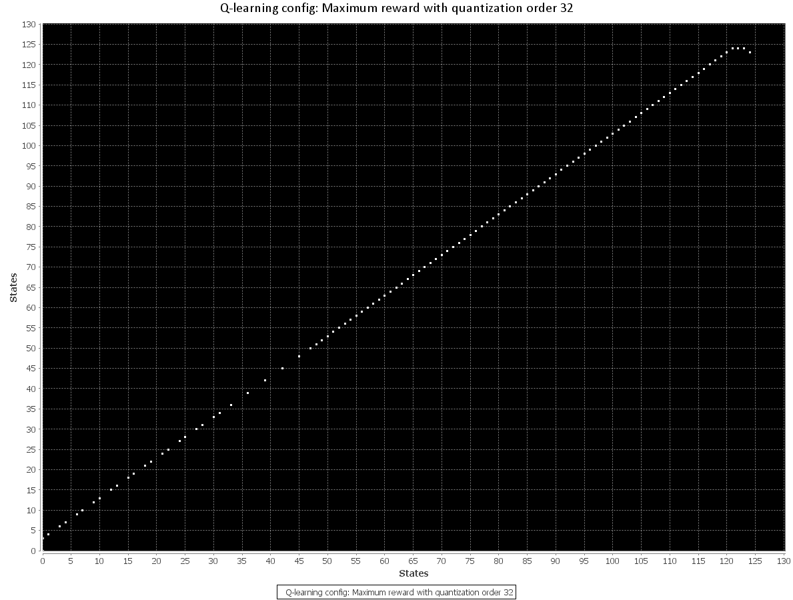*

图 13：在量化 32 的情况下，QLearning 的最大奖励

最终评估包括评估学习率和折扣率对训练覆盖率的影响：

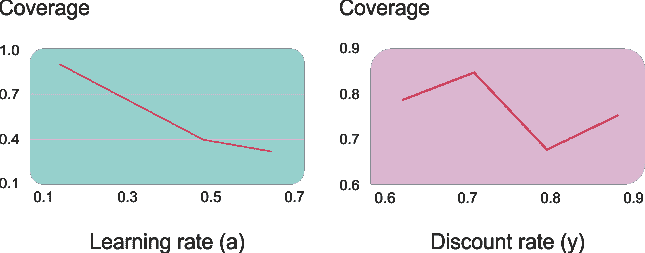

图 14：学习率和折扣率对训练覆盖率的影响

随着学习率的增加，覆盖率降低。这个结果验证了使用*学习率* *< 0.2*的普遍规律。为了评估折扣率对覆盖率的影响，进行的类似测试并没有得出明确结论。我们可能会有成千上万种这种配置参数的不同选择和组合。那么，如果我们能将整个应用程序包装成类似于我们在第三章中做的那样的 Scala Web 应用程序——*基于历史数据的高频比特币价格预测*，会怎么样呢？我猜这应该不会是个坏主意。那么让我们深入研究一下吧。

# 将期权交易应用程序封装为 Scala Web 应用程序

这个想法是获取训练好的模型并构建最佳策略的 JSON 输出，以便得到最大回报的情况。`PlayML`是一个 Web 应用程序，使用期权交易 Q-learning 算法，提供一个计算 API 端点，接收输入数据集和一些选项来计算 q 值，并以 JSON 格式返回这些值，以便在前端进行建模。

封装后的 Scala Web ML 应用程序具有以下目录结构：

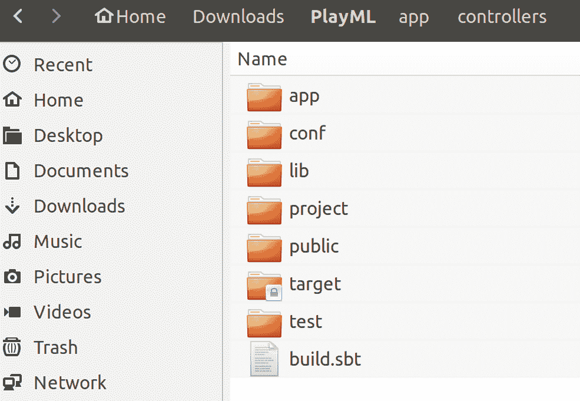

图 15：Scala ML Web 应用程序目录结构

在前面的结构中，应用程序文件夹包含了原始的 QLearning 实现（见`ml`文件夹）以及一些额外的后端代码。`controller`子文件夹中有一个名为`API.scala`的 Scala 类，它作为 Scala 控制器，用于控制前端的模型行为。最后，`Filters.scala`作为`DefaultHttpFilters`起作用：

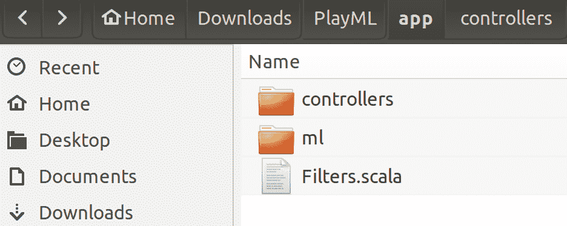

图 16：ml 目录结构

`conf`文件夹包含 Scala Web 应用程序的配置文件`application.conf`，其中包含必要的配置。所有的依赖项都在`build.sbt`文件中定义，如下所示：

```py
name := "PlayML"version := "1.0"
lazy val `playml` = (project in file(".")).enablePlugins(PlayScala)
resolvers += "scalaz-bintray" 
scalaVersion := "2.11.11"
libraryDependencies ++= Seq(filters, cache, ws, "org.apache.commons" % "commons-math3" %                 
        "3.6","com.typesafe.play" %% "play-json" % "2.5",
        "org.jfree" % "jfreechart" % "1.0.17",
        "com.typesafe.akka" %% "akka-actor" % "2.3.8",
        "org.apache.spark" %% "spark-core" % "2.1.0",
        "org.apache.spark" %% "spark-mllib" % "2.1.0",
        "org.apache.spark" %% "spark-streaming" % "2.1.0")
```

`lib`文件夹包含一些作为外部依赖项的`.jar`文件，这些依赖项在`build.sbt`文件中定义。`public`文件夹包含 UI 中使用的静态页面。此外，数据文件`IBM.csv`和`IBM_O.csv`也存放在其中。最后，`target`文件夹保存打包后的应用程序（如果有的话）。

# 后端

在后端，我封装了前面提到的 Q-learning 实现，并额外创建了一个 Scala 控制器，来控制前端模型的行为。其结构如下：

```py
import java.nio.file.Paths
import org.codehaus.janino.Java
import ml.stats.TSeries.{normalize, zipWithShift}
import ml.workflow.data.DataSource
import ml.trading.OptionModel
import ml.Predef.{DblPair, DblVec}
import ml.reinforcement.qlearning.{QLConfig, QLModel, QLearning}
import scala.util.{Failure, Success, Try}
import play.api._
import play.api.data.Form
import play.api.libs.json._
import play.api.mvc._
import scala.util.{Failure, Success, Try}

class API extends Controller {
 protected val name: String = "Q-learning"
 private var sPath = Paths.get((s"${"public/data/IBM.csv"}")).toAbsolutePath.toString
 private var oPath = Paths.get((s"${"public/data/IBM_O.csv"}")).toAbsolutePath.toString

   // Run configuration parameters
 private var STRIKE_PRICE = 190.0 // Option strike price
 private var MIN_TIME_EXPIRATION = 6 // Minimum expiration time for the option recorded
 private var QUANTIZATION_STEP = 32 // Quantization step (Double => Int)
 private var ALPHA = 0.2 // Learning rate
 private var DISCOUNT = 0.6 // Discount rate used in the Q-Value update equation
 private var MAX_EPISODE_LEN = 128 // Maximum number of iteration for an episode
 private var NUM_EPISODES = 20 // Number of episodes used for training.
 private var MIN_COVERAGE = 0.1
 private var NUM_NEIGHBOR_STATES = 3 // Number of states accessible from any other state
 private var REWARD_TYPE = "Maximum reward"
 private var ret = JsObject(Seq())
 private var retry = 0

 private def run(REWARD_TYPE: String,quantizeR: Int,alpha: Double,gamma: Double) = {
 val maybeModel = createModel(createOptionModel(DataSource(sPath, false, false, 1).get, quantizeR),             DataSource(oPath, false, false, 1).get.extract.get, alpha, gamma)
 if (maybeModel != None) {
 val model = maybeModel.get
 if (REWARD_TYPE != "Random") {
 var value = JsArray(Seq())
 var x = model.bestPolicy.EQ.distinct.map(x => {value = value.append(JsObject(Seq("x" ->                     JsNumber(x._1), "y" -> JsNumber(x._2))))})ret = ret.+("OPTIMAL", value)
                }
            }
        }
/** Create an option model for a given stock with default strike and minimum expiration time parameters.
*/
 privatedef createOptionModel(src: DataSource, quantizeR: Int): OptionModel =
 new OptionModel("IBM", STRIKE_PRICE, src, MIN_TIME_EXPIRATION, quantizeR)
/** Create a model for the profit and loss on an option given
* the underlying security. The profit and loss is adjusted to
* produce positive values.
*/
 privatedef createModel(ibmOption: OptionModel,oPrice: Seq[Double],alpha: Double,gamma: Double): Option[QLModel] = {
 val qPriceMap = ibmOption.quantize(oPrice.toArray)
 val numStates = qPriceMap.size
 val neighbors = (n: Int) => {
 def getProximity(idx: Int, radius: Int): List[Int] = {
 val idx_max = if (idx + radius >= numStates) numStates - 1
            else idx + radius
 val idx_min = if (idx < radius) 0 
                        else idx - radiusscala.collection.immutable.Range(idx_min, idx_max + 1)
                            .filter(_ != idx)./:(List[Int]())((xs, n) => n :: xs)
                        }
                getProximity(n, NUM_NEIGHBOR_STATES)
            }
       // Compute the minimum value for the profit, loss so the maximum loss is converted to a null profit
 val qPrice: DblVec = qPriceMap.values.toVector
 val profit: DblVec = normalize(zipWithShift(qPrice, 1).map {
        case (x, y) => y - x }).get
 val maxProfitIndex = profit.zipWithIndex.maxBy(_._1)._2
 val reward = (x: Double, y: Double) => Math.exp(30.0 * (y - x))

 val probabilities = (x: Double, y: Double) =>
             if (y < 0.3 * x) 0.0 else 1.0ret = ret.+("GOAL_STATE_INDEX", JsNumber(maxProfitIndex))
 if (!QLearning.validateConstraints(profit.size, neighbors)) {ret = ret.+("error",                             JsString("QLearningEval Incorrect states transition constraint"))

 thrownew IllegalStateException("QLearningEval Incorrect states transition constraint")}

 val instances = qPriceMap.keySet.toSeq.drop(1)
 val config = QLConfig(alpha, gamma, MAX_EPISODE_LEN, NUM_EPISODES, MIN_COVERAGE)
 val qLearning = QLearning[Array[Int]](config,Array[Int]                
                (maxProfitIndex),profit,reward,probabilities,instances,Some(neighbors))    
            val modelO = qLearning.getModel

 if (modelO.isDefined) {
 val numTransitions = numStates * (numStates - 1)ret = ret.+("COVERAGE",             
                JsNumber(modelO.get.coverage))ret = ret.+("COVERAGE_STATES", JsNumber(numStates))
                ret = ret.+("COVERAGE_TRANSITIONS", JsNumber(numTransitions))
 var value = JsArray()
 var x = qLearning._counters.last._2.distinct.map(x => {value = value.append(JsNumber(x))
                })    
                ret = ret.+("Q_VALUE", value)modelO
                } 
 else {
                if (retry > 5) {ret = ret.+("error", JsString(s"$name model undefined"))
 return None
                 }
                retry += 1Thread.sleep(500)
 return createModel(ibmOption,oPrice,alpha,gamma)
            }        
        }
def compute = Action(parse.anyContent) { request =>
 try {
        if (request.body.asMultipartFormData != None) {
 val formData = request.body.asMultipartFormData.get
 if (formData.file("STOCK_PRICES").nonEmpty && formData.file("STOCK_PRICES").get.filename.nonEmpty)sPath = formData.file("STOCK_PRICES").get.ref.file.toString
 if (formData.file("OPTION_PRICES").nonEmpty && formData.file("OPTION_PRICES").get.filename.nonEmpty)oPath = formData.file("OPTION_PRICES").get.ref.file.toString
 val parts = formData.dataParts
 if (parts.get("STRIKE_PRICE") != None)STRIKE_PRICE = parts.get("STRIKE_PRICE").get.mkString("").toDouble
 if (parts.get("MIN_TIME_EXPIRATION") != None)MIN_TIME_EXPIRATION = parts.get("MIN_TIME_EXPIRATION").get.mkString("").toInt
 if (parts.get("QUANTIZATION_STEP") != None)QUANTIZATION_STEP = parts.get("QUANTIZATION_STEP").get.mkString("").toInt
 if (parts.get("ALPHA") != None)ALPHA = parts.get("ALPHA").get.mkString("").toDouble
 if (parts.get("DISCOUNT") != None)DISCOUNT = parts.get("DISCOUNT").get.mkString("").toDouble
 if (parts.get("MAX_EPISODE_LEN") != None)MAX_EPISODE_LEN = parts.get("MAX_EPISODE_LEN").get.mkString("").toInt
 if (parts.get("NUM_EPISODES") != None)NUM_EPISODES = parts.get("NUM_EPISODES").get.mkString("").toInt
 if (parts.get("MIN_COVERAGE") != None)MIN_COVERAGE = parts.get("MIN_COVERAGE").get.mkString("").toDouble
 if (parts.get("NUM_NEIGHBOR_STATES") != None)NUM_NEIGHBOR_STATES = parts.get("NUM_NEIGHBOR_STATES").get.mkString("").toInt
 if (parts.get("REWARD_TYPE") != None)REWARD_TYPE = parts.get("REWARD_TYPE").get.mkString("")
            }
        ret = JsObject(Seq("STRIKE_PRICE" ->
        JsNumber(STRIKE_PRICE),"MIN_TIME_EXPIRATION" -> JsNumber(MIN_TIME_EXPIRATION),
        "QUANTIZATION_STEP" -> 
JsNumber(QUANTIZATION_STEP),
        "ALPHA" -> JsNumber(ALPHA),
        "DISCOUNT" -> JsNumber(DISCOUNT),
        "MAX_EPISODE_LEN" -> 
JsNumber(MAX_EPISODE_LEN),
        "NUM_EPISODES" -> JsNumber(NUM_EPISODES),
        "MIN_COVERAGE" -> JsNumber(MIN_COVERAGE),
        "NUM_NEIGHBOR_STATES" -> 
JsNumber(NUM_NEIGHBOR_STATES),
        "REWARD_TYPE" -> JsString(REWARD_TYPE)))
        run(REWARD_TYPE, QUANTIZATION_STEP, ALPHA, DISCOUNT)
    }
 catch {
        case e: Exception => {
            ret = ret.+("exception", JsString(e.toString))
                }
            }
```

```py
       Ok(ret)
    }
}
```

仔细查看前面的代码，它与`QLearningMain.scala`文件的结构差不多。这里只有两件重要的事，如下所示：

+   计算作为一个 Action 进行，该 Action 接收来自 UI 的输入并计算结果值

+   然后，结果作为 JSON 对象通过`JsObject()`方法返回，用于在 UI 上显示（见下文）

# 前端

该应用由两个主要部分组成：API 端点，使用 Play 框架构建，以及前端单页面应用，使用`Angular.js`构建。前端应用将数据发送到 API 进行计算，然后使用`chart.js`展示结果。我们需要的步骤如下：

+   初始化表单

+   与 API 通信

+   用覆盖数据和图表填充视图

算法的 JSON 输出应如下所示：

+   所有的配置参数都会被返回

+   `GOAL_STATE_INDEX`，最大利润指数

+   `COVERAGE`，达到预定义目标状态的训练试验或周期的比率

+   `COVERAGE_STATES`，量化期权值的大小

+   `COVERAGE_TRANSITIONS`，状态的平方数

+   `Q_VALUE`，所有状态的 q 值

+   `OPTIMAL`，如果奖励类型不是随机的，返回最多奖励的状态

**前端代码**使用如下代码初始化`Angular.js`应用，并集成`chart.js`模块（见`PlayML/public/assets/js/main.js`文件）：

```py
angular.module("App", ['chart.js']).controller("Ctrl", ['$scope', '$http', function ($scope, $http) {
// First we initialize the form:
$scope.form = {REWARD_TYPE: "Maximum reward",NUM_NEIGHBOR_STATES: 3,STRIKE_PRICE: 190.0,MIN_TIME_EXPIRATION: 6,QUANTIZATION_STEP: 32,ALPHA: 0.2,DISCOUNT: 0.6,MAX_EPISODE_LEN: 128,NUM_EPISODES: 20,MIN_COVERAGE: 0.1
};
```

然后，运行按钮的操作准备表单数据并将其发送到 API，接着将返回的数据传递给结果变量，在前端使用。接下来，它会清除图表并重新创建；如果找到最优解，则初始化最优图表。最后，如果找到了 Q 值，则初始化 Q 值图表：

```py
$scope.run = function () {
    var formData = new FormData(document.getElementById('form'));
    $http.post('/api/compute', formData, {
    headers: {'Content-Type': undefined}}).then(function successCallback(response) {
    $scope.result = response.data;
    $('#canvasContainer').html('');

    if (response.data.OPTIMAL) {
        $('#canvasContainer').append('<canvas id="optimalCanvas"></canvas>')
        Chart.Scatter(document.getElementById("optimalCanvas").getContext("2d"), {data: { datasets:             [{data: response.data.OPTIMAL}] }, options: {...}});}if (response.data.Q_VALUE) {
        $('#canvasContainer').append('<canvas id="valuesCanvas"></canvas>')
        Chart.Line(document.getElementById("valuesCanvas").getContext("2d"), {
        data: { labels: new Array(response.data.Q_VALUE.length), datasets: [{
        data: response.data.Q_VALUE }] }, options: {...}});}});}}]
    );
```

上述前端代码随后嵌入到 HTML 中（见`PlayML/public/index.html`），使 UI 能够作为一个精美的应用通过 Web 在`http://localhost:9000/`访问。根据您的需求，您可以随意编辑内容。我们很快会看到详细信息。

# 运行和部署说明

正如在第三章《从历史数据中预测高频比特币价格》中已经提到的，您需要 Java 1.8+和 SBT 作为依赖。然后按照以下说明操作：

+   下载应用。我将代码命名为`PlayML.zip`。

+   解压文件后，您将得到一个文件夹`ScalaML`。

+   转到 PlayML 项目文件夹。

+   运行`$ sudo sbt run`来下载所有依赖并运行应用。

然后可以通过`http://localhost:9000/`访问该应用，在这里我们可以上传 IBM 的股票和期权价格，并且提供其他配置参数：

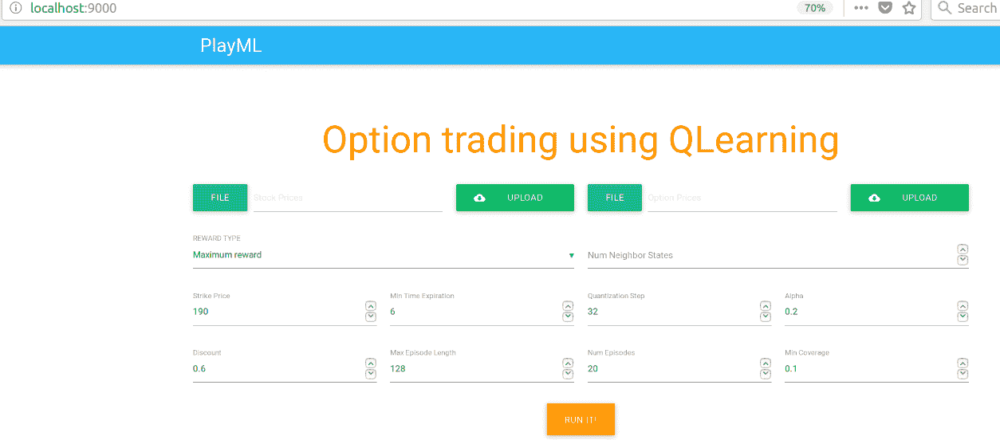

图 17：使用 QLearning 进行期权交易的 UI

现在，如果您上传股票价格和期权价格数据并点击运行按钮，系统将生成如下图表：

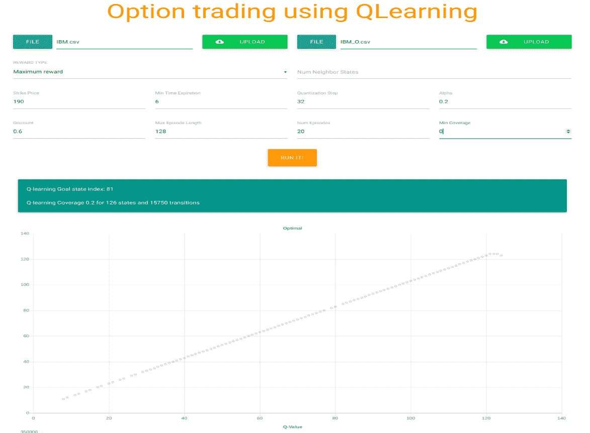

图 18：QLearning 以 0.2 的覆盖率在 126 个状态和 15,750 次转换中达到了目标状态 81

另一方面，API 端点可以通过[`localhost:9000/api/compute`](http://localhost:9000/api/compute)进行访问。

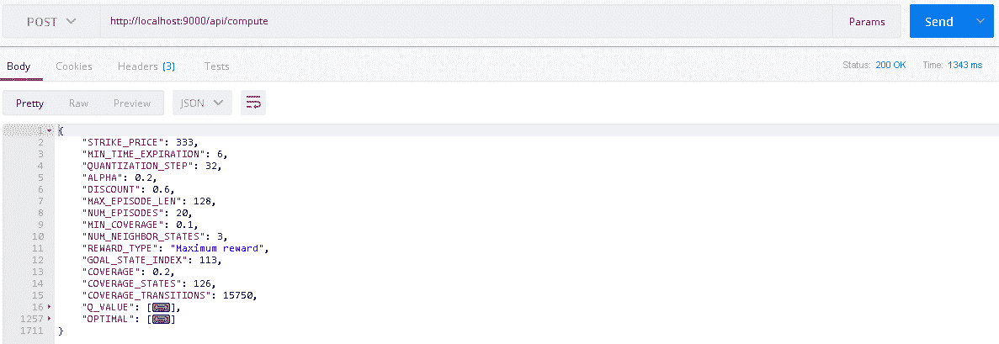

图 19：API 端点（简化版）

# 模型部署

您可以通过将应用程序的 HTTP 端口设置为 9000 来轻松地将应用程序部署为独立服务器，例如：

```py
$ /path/to/bin/<project-name> -Dhttp.port=9000
```

请注意，您可能需要根权限才能将进程绑定到此端口。以下是一个简短的工作流程：

+   运行`$ sudo sbt dist`来构建应用程序二进制文件。输出可以在`PlayML /target/universal/APP-NAME-SNAPSHOT.zip`找到。在我们的案例中，它是`playml-1.0.zip`。

+   现在，要运行该应用程序，解压文件，然后在`bin`目录中运行脚本：

```py
$ unzip APP-NAME-SNAPSHOT.zip$ APP-NAME-SNAPSHOT /bin/ APP-NAME -Dhttp.port=9000
```

然后，您需要配置您的 web 服务器，以映射到应用程序的端口配置。不过，您可以通过将应用程序的 HTTP 端口设置为`9000`，轻松将应用程序部署为独立服务器：

```py
$ /path/to/bin/<project-name> -Dhttp.port=9000
```

然而，如果您打算在同一服务器上托管多个应用程序，或为了可扩展性或容错性而对多个应用程序实例进行负载均衡，您可以使用前端 HTTP 服务器。请注意，使用前端 HTTP 服务器通常不会比直接使用 Play 服务器提供更好的性能。

然而，HTTP 服务器非常擅长处理 HTTPS、条件 GET 请求和静态资源，许多服务假设前端 HTTP 服务器是您架构的一部分。更多信息可以在[`www.playframework.com/documentation/2.6.x/HTTPServer`](https://www.playframework.com/documentation/2.6.x/HTTPServer)中找到。

# 总结

本章中，我们学习了如何使用 Q-learning 算法开发一个名为“期权交易”的真实应用程序。我们使用了 IBM 股票数据集来设计一个由批评和奖励驱动的机器学习系统。此外，我们还学习了一些理论背景。最后，我们学习了如何使用 Scala Play Framework 将一个 Scala 桌面应用程序打包为 Web 应用，并部署到生产环境中。

在下一章中，我们将看到使用 H2O 在银行营销数据集上构建非常稳健和准确的预测模型的两个示例。在这个例子中，我们将使用银行营销数据集。该数据与葡萄牙银行机构的电话营销活动相关。营销活动是通过电话进行的。该端到端项目的目标是预测客户是否会订阅定期存款。
