# 第八章：使用深度神经网络评估银行电话营销客户订阅情况

本章将展示两个例子，说明如何使用 H2O 在银行营销数据集上构建非常稳健且准确的预测模型进行预测分析。数据与葡萄牙一家银行机构的直接营销活动相关，这些营销活动基于电话进行。这个端到端项目的目标是预测客户是否会订阅定期存款。

本项目将涵盖以下主题：

+   客户订阅评估

+   数据集描述

+   数据集的探索性分析

+   使用 H2O 进行客户订阅评估

+   调整超参数

# 通过电话营销进行客户订阅评估

一段时间前，由于全球金融危机，银行在国际市场获得信贷的难度加大。这使得银行开始关注内部客户及其存款以筹集资金。这导致了对客户存款行为及其对银行定期电话营销活动响应的需求。通常，为了评估产品（银行定期存款）是否会被（**是**）或（**否**）订阅，需要与同一客户进行多次联系。

本项目的目的是实现一个机器学习模型，预测客户是否会订阅定期存款（变量`y`）。简而言之，这是一个二分类问题。在开始实现应用之前，我们需要了解数据集。接着，我们将进行数据集的解释性分析。

# 数据集描述

我想感谢两个数据来源。此数据集曾被 Moro 等人在论文《A Data-Driven Approach to Predict the Success of Bank Telemarketing》中使用，发表在《决策支持系统》期刊（Elsevier，2014 年 6 月）。之后，它被捐赠到 UCI 机器学习库，并可以从[`archive.ics.uci.edu/ml/datasets/bank+marketing`](https://archive.ics.uci.edu/ml/datasets/bank+marketing)下载。根据数据集描述，数据集包括四个子集：

+   `bank-additional-full.csv`：包含所有示例（41,188 个）和 20 个输入，按日期排序（从 2008 年 5 月到 2010 年 11 月），与 Moro 等人 2014 年分析的数据非常接近

+   `bank-additional.csv`：包含 10%的示例（4,119 个），从 1 和 20 个输入中随机选择

+   `bank-full.csv`：包含所有示例和 17 个输入，按日期排序（该数据集的旧版本，输入较少）

+   `bank.csv`：包含 10%的示例和 17 个输入，随机选择自三个输入（该数据集的旧版本，输入较少）

数据集包含 21 个属性。独立变量，即特征，可以进一步分类为与银行客户相关的数据（属性 1 到 7），与本次活动的最后一次联系相关的数据（属性 8 到 11），其他属性（属性 12 到 15），以及社会和经济背景属性（属性 16 到 20）。因变量由`y`指定，即最后一个属性（21）：

| **ID** | **属性** | **解释** |
| --- | --- | --- |
| 1 | `age` | 年龄（数值）。 |
| 2 | `job` | 这是工作类型的分类格式，可能的值有：`admin`、`blue-collar`、`entrepreneur`、`housemaid`、`management`、`retired`、`self-employed`、`services`、`student`、`technician`、`unemployed`和`unknown`。 |
| 3 | `marital` | 这是婚姻状况的分类格式，可能的值有：`divorced`、`married`、`single`和`unknown`。其中，`divorced`表示离婚或丧偶。 |
| 4 | `education` | 这是教育背景的分类格式，可能的值如下：`basic.4y`、`basic.6y`、`basic.9y`、`high.school`、`illiterate`、`professional.course`、`university.degree`和`unknown`。 |
| 5 | `default` | 这是一个分类格式，表示信用是否违约，可能的值为`no`、`yes`和`unknown`。 |
| 6 | `housing` | 客户是否有住房贷款？ |
| 7 | `loan` | 个人贷款的分类格式，可能的值为`no`、`yes`和`unknown`。 |
| 8 | `contact` | 这是联系的沟通方式，采用分类格式。可能的值有`cellular`和`telephone`。 |
| 9 | `month` | 这是最后一次联系的月份，采用分类格式，可能的值为`jan`、`feb`、`mar`、...、`nov`和`dec`。 |
| 10 | `day_of_week` | 这是最后一次联系的星期几，采用分类格式，可能的值有`mon`、`tue`、`wed`、`thu`和`fri`。 |
| 11 | `duration` | 这是最后一次联系的持续时间，单位为秒（数值）。这个属性对输出目标有很大影响（例如，如果`duration=0`，则`y=no`）。然而，持续时间在通话之前是未知的。此外，通话结束后，`y`显然已知。因此，只有在基准测试时才应包括此输入，如果目的是建立一个现实的预测模型，则应丢弃此输入。 |
| 12 | `campaign` | 这是本次活动中与此客户进行的联系次数。 |
| 13 | `pdays` | 这是自上次与客户的前一个活动联系以来经过的天数（数值；999 表示客户之前没有被联系过）。 |
| 14 | `previous` | 这是此客户在本次活动之前进行的联系次数（数值）。 |
| 15 | `poutcome` | 上一次营销活动的结果（分类：`failure`、`nonexistent`和`success`）。 |
| 16 | `emp.var.rate` | 就业变化率—季度指标（数值）。 |
| 17 | `cons.price.idx` | 消费者价格指数—月度指标（数字）。 |
| 18 | `cons.conf.idx` | 消费者信心指数—月度指标（数字）。 |
| 19 | `euribor3m` | 欧元区 3 个月利率—每日指标（数字）。 |
| 20 | `nr.employed` | 员工人数—季度指标（数字）。 |
| 21 | `y` | 表示客户是否订阅了定期存款。其值为二进制（`yes` 和 `no`）。 |

表 1：银行营销数据集描述

对于数据集的探索性分析，我们将使用 Apache Zeppelin 和 Spark。我们将首先可视化分类特征的分布，然后是数值特征。最后，我们将计算一些描述数值特征的统计信息。但在此之前，让我们配置 Zeppelin。

# 安装并开始使用 Apache Zeppelin

Apache Zeppelin 是一个基于 Web 的笔记本，允许您以交互方式进行数据分析。使用 Zeppelin，您可以制作美丽的、数据驱动的、互动的和协作的文档，支持 SQL、Scala 等。Apache Zeppelin 的解释器概念允许将任何语言/数据处理后端插件集成到 Zeppelin 中。目前，Apache Zeppelin 支持许多解释器，如 Apache Spark、Python、JDBC、Markdown 和 Shell。

Apache Zeppelin 是 Apache 软件基金会推出的一项相对较新的技术，它使数据科学家、工程师和从业者能够进行数据探索、可视化、共享和协作，支持多种编程语言的后端（如 Python、Scala、Hive、SparkSQL、Shell、Markdown 等）。由于本书的目标不是使用其他解释器，因此我们将在 Zeppelin 上使用 Spark，所有代码将使用 Scala 编写。因此，在本节中，我们将向您展示如何使用仅包含 Spark 解释器的二进制包配置 Zeppelin。Apache Zeppelin 官方支持并在以下环境中经过测试：

| **要求** | **值/版本** |
| --- | --- |
| Oracle JDK | 1.7+（设置 `JAVA_HOME`） |

| 操作系统 | Mac OS X Ubuntu 14.X+

CentOS 6.X+

Windows 7 Pro SP1+ |

如上表所示，执行 Spark 代码需要 Java。因此，如果未设置 Java，请在前述任何平台上安装并配置 Java。可以从 [`zeppelin.apache.org/download.html`](https://zeppelin.apache.org/download.html) 下载 Apache Zeppelin 的最新版本。每个版本都有三种选项：

+   **包含所有解释器的二进制包**：包含对多个解释器的支持。例如，Zeppelin 目前支持 Spark、JDBC、Pig、Beam、Scio、BigQuery、Python、Livy、HDFS、Alluxio、Hbase、Scalding、Elasticsearch、Angular、Markdown、Shell、Flink、Hive、Tajo、Cassandra、Geode、Ignite、Kylin、Lens、Phoenix 和 PostgreSQL 等。

+   **包含 Spark 解释器的二进制包**：通常，这仅包含 Spark 解释器。它还包含一个解释器网络安装脚本。

+   **Source**：你也可以从 GitHub 仓库构建带有所有最新更改的 Zeppelin（稍后详细讲解）。为了向你展示如何安装和配置 Zeppelin，我们从此网站的镜像下载了二进制包。下载后，将其解压到你的机器上的某个位置。假设你解压的路径是`/home/Zeppelin/`。

# 从源代码构建

你还可以从 GitHub 仓库构建带有所有最新更改的 Zeppelin。如果你想从源代码构建，必须首先安装以下依赖项：

+   **Git**：任何版本

+   **Maven**：3.1.x 或更高版本

+   **JDK**：1.7 或更高版本

如果你还没有安装 Git 和 Maven，可以查看[`zeppelin.apache.org/docs/latest/install/build.html#build-requirements`](http://zeppelin.apache.org/docs/latest/install/build.html#build-requirements)中的构建要求。由于页面限制，我们没有详细讨论所有步骤。感兴趣的读者应参考此 URL，获取更多关于 Apache Zeppelin 的信息：[`zeppelin.apache.org/`](http://zeppelin.apache.org/)。

# 启动和停止 Apache Zeppelin

在所有类 Unix 平台（如 Ubuntu、Mac 等）上，使用以下命令：

```py
$ bin/zeppelin-daemon.sh start
```

如果前面的命令成功执行，你应该在终端中看到以下日志：

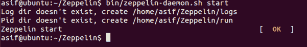

图 1：从 Ubuntu 终端启动 Zeppelin

如果你使用 Windows，使用以下命令：

```py
$ binzeppelin.cmd 
```

在 Zeppelin 成功启动后，使用你的网页浏览器访问`http://localhost:8080`，你将看到 Zeppelin 正在运行。更具体地说，你将在浏览器中看到以下内容：

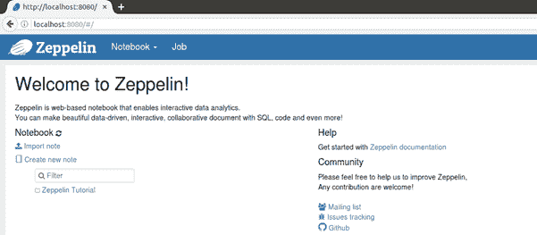

图 2：Zeppelin 正在`http://localhost:8080`上运行

恭喜！你已经成功安装了 Apache Zeppelin！现在，让我们在浏览器中访问 Zeppelin，地址是`http://localhost:8080/`，并在配置好首选解释器后开始我们的数据分析。现在，要从命令行停止 Zeppelin，请执行以下命令：

```py
$ bin/zeppelin-daemon.sh stop
```

# 创建笔记本

一旦你进入`http://localhost:8080/`，你可以探索不同的选项和菜单，帮助你了解如何熟悉 Zeppelin。有关 Zeppelin 及其用户友好界面的更多信息，感兴趣的读者可以参考[`zeppelin.apache.org/docs/latest/`](http://zeppelin.apache.org/docs/latest/)。现在，首先让我们创建一个示例笔记本并开始使用。如下图所示，你可以通过点击*图 2*中的“Create new note”选项来创建一个新的笔记本：

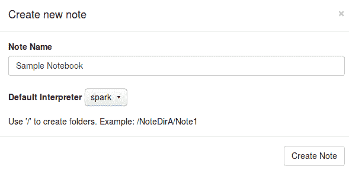

图 3：创建示例 Zeppelin 笔记本

如*图 3*所示，默认解释器被选为 Spark。在下拉列表中，你只会看到 Spark，因为你已下载了仅包含 Spark 的 Zeppelin 二进制包。

# 数据集的探索性分析

做得好！我们已经能够安装、配置并开始使用 Zeppelin。现在我们开始吧。我们将看到变量与标签之间的关联。首先，我们在 Apache 中加载数据集，如下所示：

```py
val trainDF = spark.read.option("inferSchema", "true")
            .format("com.databricks.spark.csv")
            .option("delimiter", ";")
            .option("header", "true")
            .load("data/bank-additional-full.csv")
trainDF.registerTempTable("trainData")
```

# 标签分布

我们来看看类别分布。我们将使用 SQL 解释器来进行此操作。在 Zeppelin 笔记本中执行以下 SQL 查询：

```py
%sql select y, count(1) from trainData group by y order by y
>>>
```

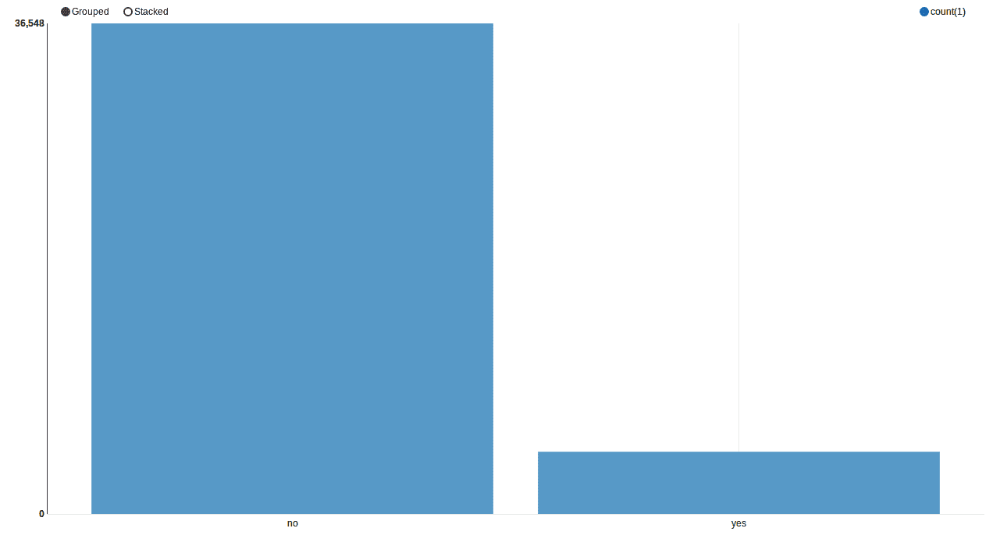

# 职业分布

现在我们来看看职位名称是否与订阅决策相关：

```py
%sql select job,y, count(1) from trainData group by job, y order by job, y
```


从图表中可以看到，大多数客户的职位是行政人员、蓝领工人或技术员，而学生和退休客户的*计数(y) / 计数(n)*比率最高。

# 婚姻分布

婚姻状况与订阅决策有关吗？让我们看看：

```py
%sql select marital,y, count(1) from trainData group by marital,y order by marital,y
>>>
```

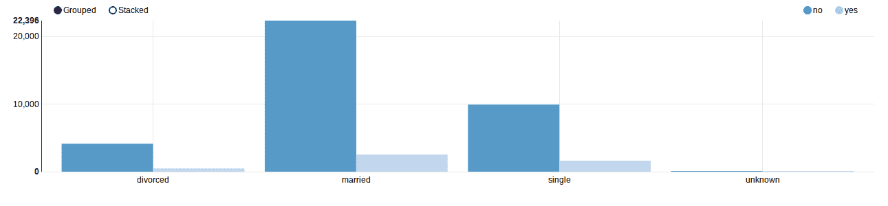

分布显示，订阅与实例数量成比例，而与客户的婚姻状况无关。

# 教育分布

现在我们来看看教育水平是否与订阅决策有关：

```py
%sql select education,y, count(1) from trainData group by education,y order by education,y
```

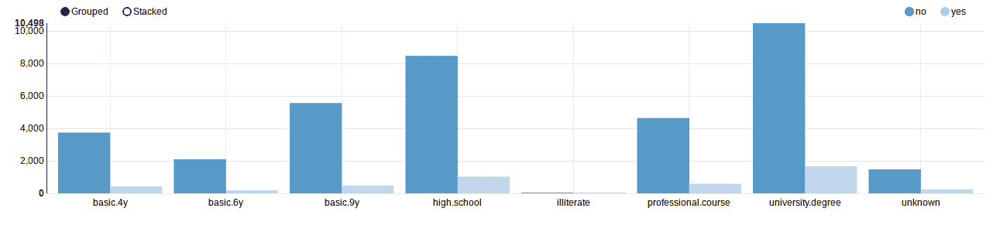

因此，与婚姻状况类似，教育水平并不能揭示关于订阅的任何线索。现在我们继续探索其他变量。

# 默认分布

我们来检查默认信用是否与订阅决策相关：

```py
%sql select default,y, count(1) from trainData group by default,y order by default,y
```

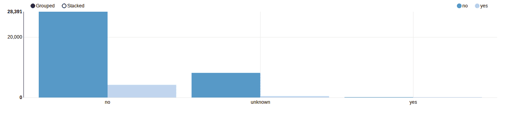

该图表显示几乎没有客户有默认信用，而没有默认信用的客户有轻微的订阅比率。

# 住房分布

现在我们来看看是否拥有住房与订阅决策之间有趣的关联：

```py
%sql select housing,y, count(1) from trainData group by housing,y order by housing,y
```

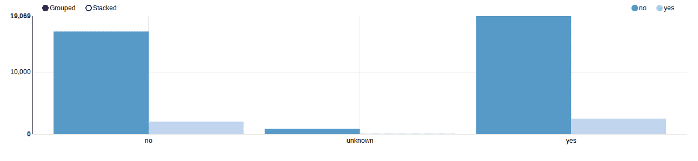

以上图表显示住房也不能揭示关于订阅的线索。

# 贷款分布

现在我们来看看贷款分布：

```py
%sql select loan,y, count(1) from trainData group by loan,y order by loan,y
```

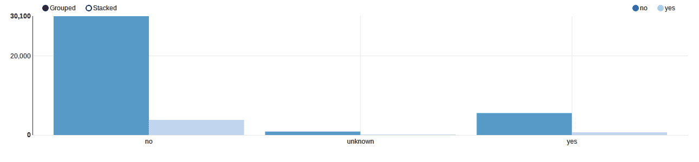

图表显示大多数客户没有个人贷款，贷款对订阅比率没有影响。

# 联系方式分布

现在我们来检查联系方式是否与订阅决策有显著关联：

```py
%sql select contact,y, count(1) from trainData group by contact,y order by contact,y
```

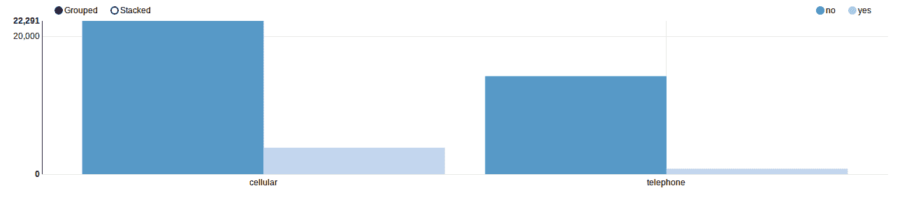

# 月份分布

这可能听起来有些奇怪，但电话营销的月份与订阅决策可能有显著的关联：

```py
%sql select month,y, count(1) from trainData group by month,y order by month,y
```

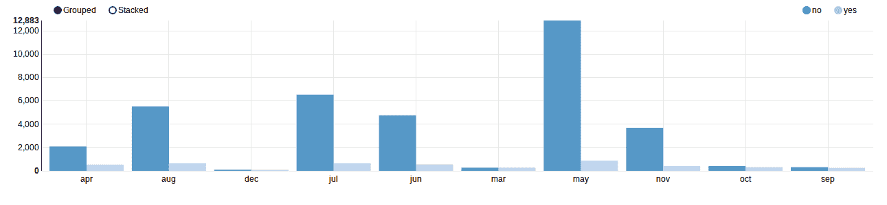

所以，之前的图表显示，在实例较少的月份（例如 12 月、3 月、10 月和 9 月）中，订阅比率最高。

# 日期分布

现在，星期几与订阅决策之间有何关联：

```py
%sql select day_of_week,y, count(1) from trainData group by day_of_week,y order by day_of_week,y
```

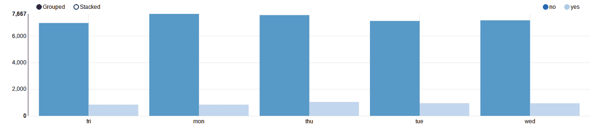

日期特征呈均匀分布，因此不那么显著。

# 之前的结果分布

那么，先前的结果及其与订阅决策的关联情况如何呢：

```py
%sql select poutcome,y, count(1) from trainData group by poutcome,y order by poutcome,y
```

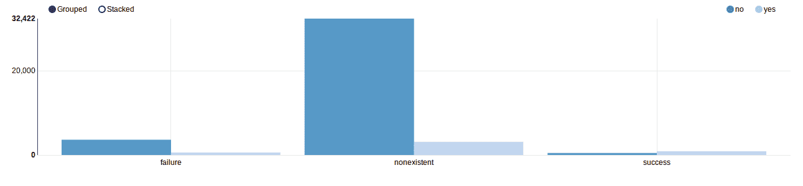

分布显示，来自上次营销活动的成功结果的客户最有可能订阅。同时，这些客户代表了数据集中的少数。

# 年龄特征

让我们看看年龄与订阅决策的关系：

```py
%sql select age,y, count(1) from trainData group by age,y order by age,y
```

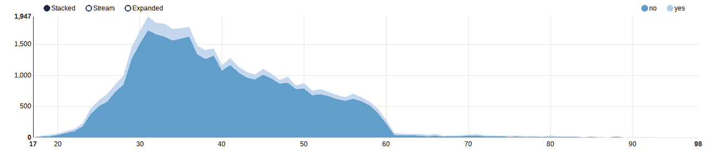

标准化图表显示，大多数客户的年龄在**25**到**60**岁之间。

以下图表显示，银行在年龄区间*(25, 60)*内的客户有较高的订阅率。

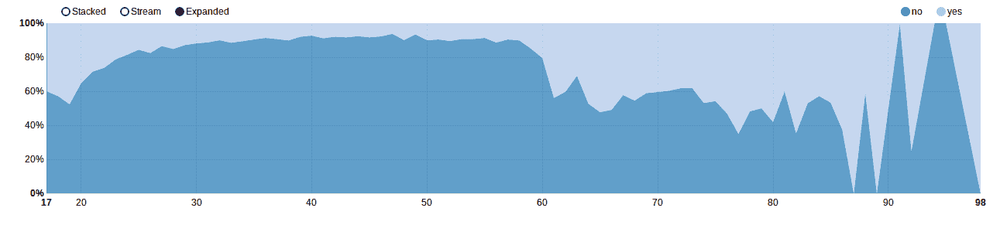

# 持续时间分布

现在让我们来看看通话时长与订阅之间的关系：

```py
%sql select duration,y, count(1) from trainData group by duration,y order by duration,y
```

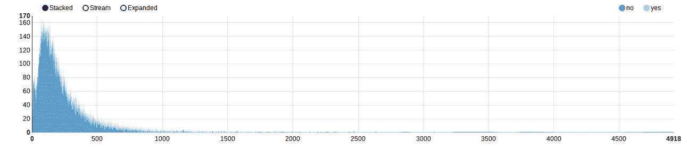

图表显示，大多数通话时间较短，并且订阅率与通话时长成正比。扩展版提供了更深入的见解：

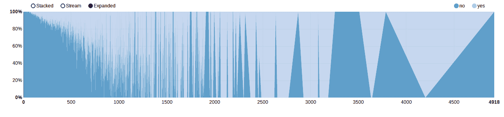

# 活动分布

现在我们来看一下活动分布与订阅之间的相关性：

```py
%sql select campaign, count(1), y from trainData group by campaign,y order by campaign,y
```

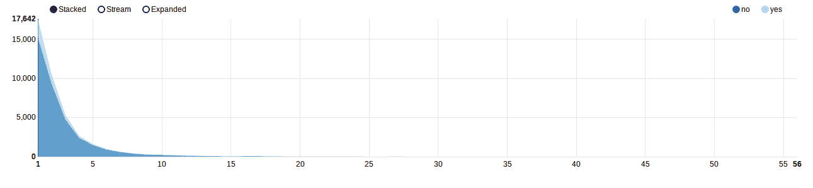

图表显示，大多数客户的联系次数少于五次，而客户被联系的次数越多，他们订阅的可能性就越低。现在，扩展版提供了更深入的见解：

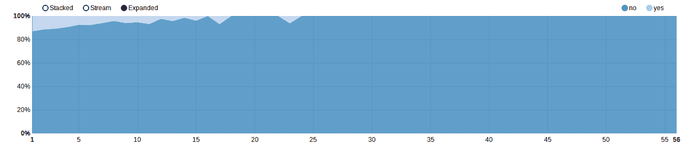

# Pdays 分布

现在让我们来看看 `pdays` 分布与订阅之间的关系：

```py
%sql select pdays, count(1), y from trainData group by pdays,y order by pdays,y
```

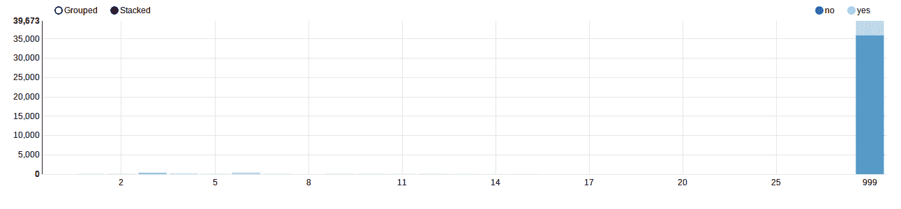

图表显示，大多数客户此前没有被联系过。

# 先前分布

在以下命令中，我们可以看到之前的分布如何影响订阅：

```py
%sql select previous, count(1), y from trainData group by previous,y order by previous,y
```

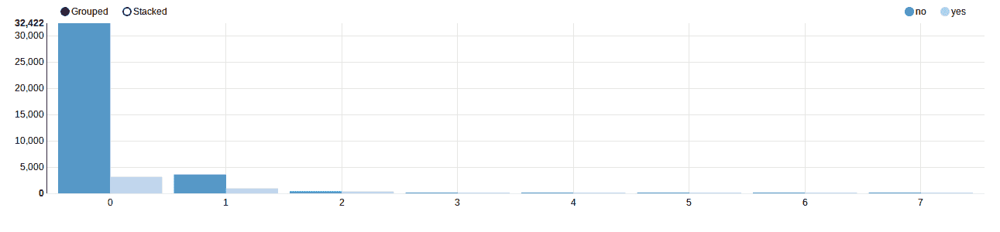

与之前的图表类似，这张图表确认大多数客户在此次活动前没有被联系过。

# emp_var_rate 分布

以下命令显示了 `emp_var_rate` 分布与订阅之间的相关性：

```py
%sql select emp_var_rate, count(1), y from trainData group by emp_var_rate,y order by emp_var_rate,y
```

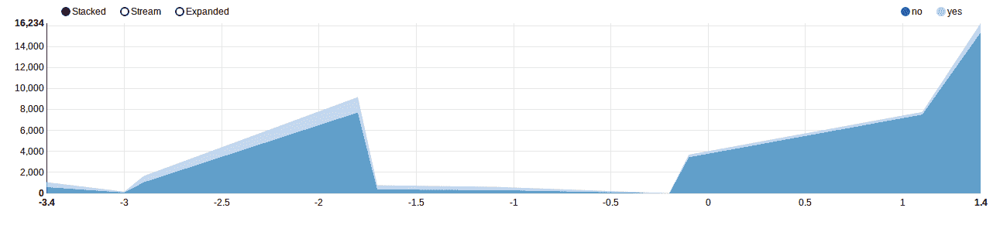

图表显示，雇佣变动率较少见的客户更可能订阅。现在，扩展版提供了更深入的见解：

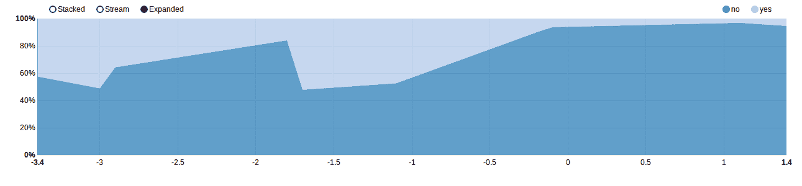

# cons_price_idx 特征

`con_price_idx` 特征与订阅之间的相关性可以通过以下命令计算：

```py
%sql select cons_price_idx, count(1), y from trainData group by cons_price_idx,y order by cons_price_idx,y
```

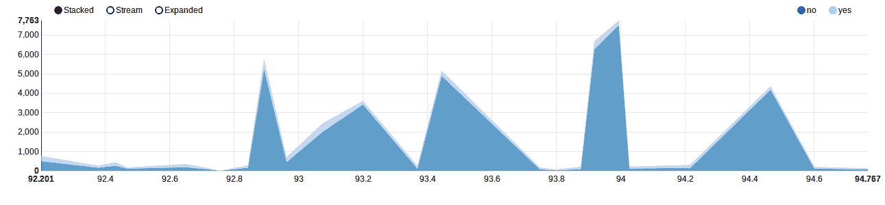

图表显示，消费者价格指数较少见的客户相比其他客户更有可能订阅。现在，扩展版提供了更深入的见解：

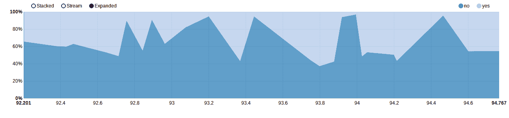

# cons_conf_idx 分布

`cons_conf_idx` 分布与订阅之间的相关性可以通过以下命令计算：

```py
%sql select cons_conf_idx, count(1), y from trainData group by cons_conf_idx,y order by cons_conf_idx,y
```

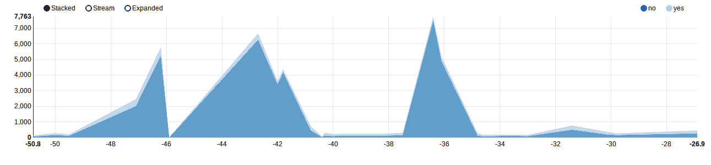

消费者信心指数较少见的客户相比其他客户更有可能订阅。

# Euribor3m 分布

让我们看看`euribor3m`的分布与订阅之间的相关性：

```py
%sql select euribor3m, count(1), y from trainData group by euribor3m,y order by euribor3m,y
```

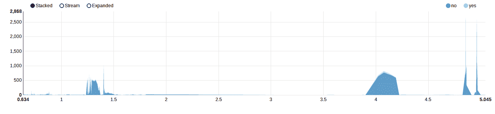

该图表显示，euribor 三个月期利率的范围较大，大多数客户聚集在该特征的四个或五个值附近。

# nr_employed 分布

`nr_employed`分布与订阅的相关性可以通过以下命令查看：

```py
%sql select nr_employed, count(1), y from trainData group by nr_employed,y order by nr_employed,y
```

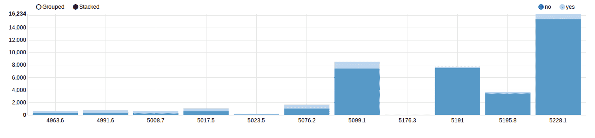

图表显示，订阅率与员工数量呈反比。

# 数值特征统计

现在，我们来看一下数值特征的统计数据：

```py
import org.apache.spark.sql.types._

val numericFeatures = trainDF.schema.filter(_.dataType != StringType)
val description = trainDF.describe(numericFeatures.map(_.name): _*)

val quantils = numericFeatures
                .map(f=>trainDF.stat.approxQuantile(f.name,                 
                Array(.25,.5,.75),0)).transposeval 

rowSeq = Seq(Seq("q1"+:quantils(0): _*),
            Seq("median"+:quantils(1): _*),
            Seq("q3"+:quantils(2): _*))

val rows = rowSeq.map(s=> s match{ 
    case Seq(a:String,b:Double,c:Double,d:Double,
             e:Double,f:Double,g:Double,                                              
             h:Double,i:Double,j:Double,k:Double)=> (a,b,c,d,e,f,g,h,i,j,k)})
         val allStats = description.unionAll(sc.parallelize(rows).toDF)
         allStats.registerTempTable("allStats")

%sql select * from allStats
>>>
```

| `summary` | `age` | `duration` | `campaign` | `pdays` | `previous` |
| --- | --- | --- | --- | --- | --- |
| `count` | 41188.00 | 41188.00 | 41188.00 | 41188.00 | 41188.00 |
| `mean` | 40.02 | 258.29 | 2.57 | 962.48 | 0.17 |
| `stddev` | 10.42 | 259.28 | 2.77 | 186.91 | 0.49 |
| `min` | 17.00 | 0.00 | 1.00 | 0.00 | 0.00 |
| `max` | 98.00 | 4918.00 | 56.00 | 999.00 | 7.00 |
| `q1` | 32.00 | 102.00 | 1.00 | 999.00 | 0.00 |
| `median` | 38.00 | 180.00 | 2.00 | 999.00 | 0.00 |
| `q3` | 47.00 | 319.00 | 3.00 | 999.00 | 0.00 |
|  |  |  |  |  |  |
| `summary` | `emp_var_rate` | `cons_price_idx` | `cons_conf_idx` | `euribor3m` | `nr_employed` |
| `count` | 41188.00 | 41188.00 | 41188.00 | 41188.00 | 41188.00 |
| `mean` | 0.08 | 93.58 | -40.50 | 3.62 | 5167.04 |
| `stddev` | 1.57 | 0.58 | 4.63 | 1.73 | 72.25 |
| `min` | -3.40 | 92.20 | -50.80 | 0.63 | 4963.60 |
| `max` | 1.40 | 94.77 | -26.90 | 5.05 | 5228.10 |
| `q1` | -1.80 | 93.08 | -42.70 | 1.34 | 5099.10 |
| `median` | 1.10 | 93.75 | -41.80 | 4.86 | 5191.00 |
| `q3` | 1.40 | 93.99 | -36.40 | 4.96 | 5228.10 |

# 实现客户订阅评估模型

为了预测客户订阅评估，我们使用 H2O 中的深度学习分类器实现。首先，我们设置并创建一个 Spark 会话：

```py
val spark = SparkSession.builder
        .master("local[*]")
        .config("spark.sql.warehouse.dir", "E:/Exp/") // change accordingly
        .appName(s"OneVsRestExample")
        .getOrCreate()
```

然后我们将数据集加载为数据框：

```py
spark.sqlContext.setConf("spark.sql.caseSensitive", "false");
val trainDF = spark.read.option("inferSchema","true")
            .format("com.databricks.spark.csv")
            .option("delimiter", ";")
            .option("header", "true")
            .load("data/bank-additional-full.csv")
```

尽管这个数据集中包含了分类特征，但由于这些分类特征的域较小，因此无需使用`StringIndexer`。如果将其索引，会引入一个并不存在的顺序关系。因此，更好的解决方案是使用 One Hot Encoding，事实证明，H2O 默认使用此编码策略处理枚举。

在数据集描述中，我已经说明了`duration`特征只有在标签已知后才可用，因此不能用于预测。因此，在调用客户之前，我们应该丢弃它作为不可用的特征：

```py
val withoutDuration = trainDF.drop("duration")
```

到目前为止，我们已经使用 Spark 的内置方法加载了数据集并删除了不需要的特征，但现在我们需要设置`h2o`并导入其隐式功能：

```py
implicit val h2oContext = H2OContext.getOrCreate(spark.sparkContext)
import h2oContext.implicits._implicit 

val sqlContext = SparkSession.builder().getOrCreate().sqlContext
import sqlContext.implicits._
```

然后我们将训练数据集打乱，并将其转换为 H2O 框架：

```py
val H2ODF: H2OFrame = withoutDuration.orderBy(rand())
```

字符串特征随后被转换为分类特征（"2 Byte"类型表示 H2O 中的字符串类型）：

```py
H2ODF.types.zipWithIndex.foreach(c=> if(c._1.toInt== 2) toCategorical(H2ODF,c._2))
```

在前面的代码行中，`toCategorical()`是一个用户定义的函数，用于将字符串特征转换为类别特征。以下是该方法的签名：

```py
def toCategorical(f: Frame, i: Int): Unit = {f.replace(i,f.vec(i).toCategoricalVec)f.update()}
```

现在是时候将数据集分为 60%的训练集、20%的验证集和 20%的测试集：

```py
val sf = new FrameSplitter(H2ODF, Array(0.6, 0.2), 
                            Array("train.hex", "valid.hex", "test.hex")
                            .map(Key.makeFrame), null)

water.H2O.submitTask(sf)
val splits = sf.getResultval (train, valid, test) = (splits(0), splits(1), splits(2))
```

然后我们使用训练集训练深度学习模型，并使用验证集验证训练，具体如下：

```py
val dlModel = buildDLModel(train, valid)
```

在前面的代码行中，`buildDLModel()`是一个用户定义的函数，用于设置深度学习模型并使用训练和验证数据框架进行训练：

```py
def buildDLModel(train: Frame, valid: Frame,epochs: Int = 10, 
                l1: Double = 0.001,l2: Double = 0.0,
                hidden: Array[Int] = ArrayInt
               )(implicit h2oContext: H2OContext): 
     DeepLearningModel = {import h2oContext.implicits._
                // Build a model
    val dlParams = new DeepLearningParameters()
        dlParams._train = traindlParams._valid = valid
        dlParams._response_column = "y"
        dlParams._epochs = epochsdlParams._l1 = l2
        dlParams._hidden = hidden

    val dl = new DeepLearning(dlParams, water.Key.make("dlModel.hex"))
    dl.trainModel.get
    }
```

在这段代码中，我们实例化了一个具有三层隐藏层的深度学习（即 MLP）网络，L1 正则化，并且仅计划迭代训练 10 次。请注意，这些是超参数，尚未调优。因此，您可以自由更改这些参数并查看性能，以获得一组最优化的参数。训练阶段完成后，我们打印训练指标（即 AUC）：

```py
val auc = dlModel.auc()println("Train AUC: "+auc)
println("Train classification error" + dlModel.classification_error())
>>>
Train AUC: 0.8071186909427446
Train classification error: 0.13293674881631662
```

大约 81%的准确率看起来并不好。现在我们在测试集上评估模型。我们预测测试数据集的标签：

```py
val result = dlModel.score(test)('predict)
```

然后我们将原始标签添加到结果中：

```py
result.add("actual",test.vec("y"))
```

将结果转换为 Spark DataFrame 并打印混淆矩阵：

```py
val predict_actualDF = h2oContext.asDataFrame(result)predict_actualDF.groupBy("actual","predict").count.show
>>>
```

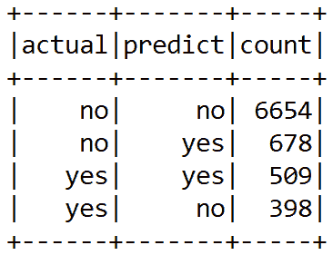

现在，前面的混淆矩阵可以通过以下图表在 Vegas 中表示：

```py
Vegas().withDataFrame(predict_actualDF)
    .mark(Bar)
     .encodeY(field="*", dataType=Quantitative, AggOps.Count, axis=Axis(title="",format=".2f"),hideAxis=true)
    .encodeX("actual", Ord)
    .encodeColor("predict", Nominal, scale=Scale(rangeNominals=List("#FF2800", "#1C39BB")))
    .configMark(stacked=StackOffset.Normalize)
    .show()
>>>
```

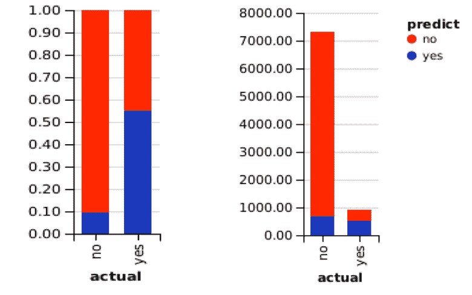

图 4：混淆矩阵的图形表示——归一化（左）与未归一化（右）

现在让我们看看测试集上的整体性能摘要——即测试 AUC：

```py
val trainMetrics = ModelMetricsSupport.modelMetricsModelMetricsBinomialprintln(trainMetrics)
>>>
```

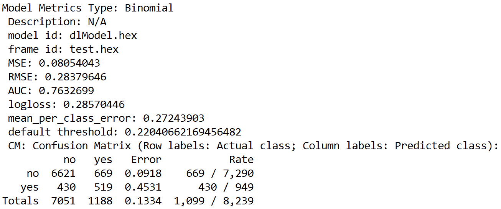

所以，AUC 测试准确率为 76%，这并不是特别好。但为什么我们不再迭代训练更多次（比如 1000 次）呢？嗯，这个问题留给你去决定。但我们仍然可以直观地检查精确度-召回率曲线，以看看评估阶段的情况：

```py
val auc = trainMetrics._auc//tp,fp,tn,fn
val metrics = auc._tps.zip(auc._fps).zipWithIndex.map(x => x match { 
    case ((a, b), c) => (a, b, c) })

val fullmetrics = metrics.map(_ match { 
    case (a, b, c) => (a, b, auc.tn(c), auc.fn(c)) })

val precisions = fullmetrics.map(_ match {
     case (tp, fp, tn, fn) => tp / (tp + fp) })

val recalls = fullmetrics.map(_ match { 
    case (tp, fp, tn, fn) => tp / (tp + fn) })

val rows = for (i <- 0 until recalls.length) 
    yield r(precisions(i), recalls(i))

val precision_recall = rows.toDF()

//precision vs recall
Vegas("ROC", width = 800, height = 600)
    .withDataFrame(precision_recall).mark(Line)
    .encodeX("re-call", Quantitative)
    .encodeY("precision", Quantitative)
    .show()
>>>
```

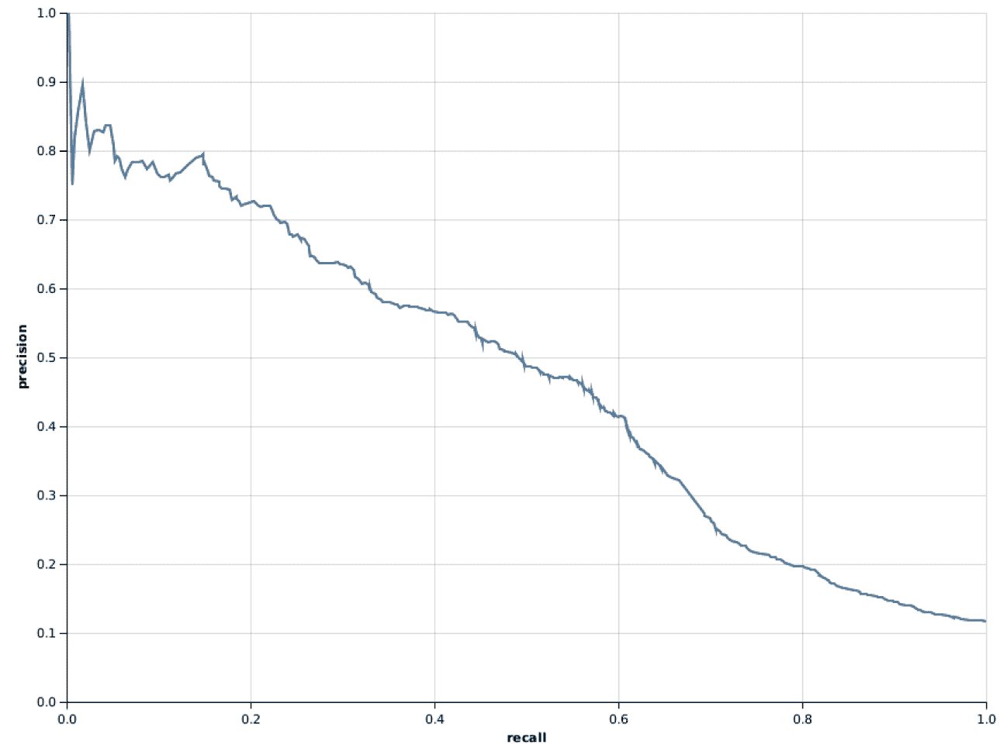

图 5：精确度-召回率曲线

然后我们计算并绘制敏感度特异度曲线：

```py
val sensitivity = fullmetrics.map(_ match { 
    case (tp, fp, tn, fn) => tp / (tp + fn) })

val specificity = fullmetrics.map(_ match {
    case (tp, fp, tn, fn) => tn / (tn + fp) })
val rows2 = for (i <- 0 until specificity.length) 
    yield r2(sensitivity(i), specificity(i))
val sensitivity_specificity = rows2.toDF

Vegas("sensitivity_specificity", width = 800, height = 600)
    .withDataFrame(sensitivity_specificity).mark(Line)
    .encodeX("specificity", Quantitative)
    .encodeY("sensitivity", Quantitative).show()
>>>
```

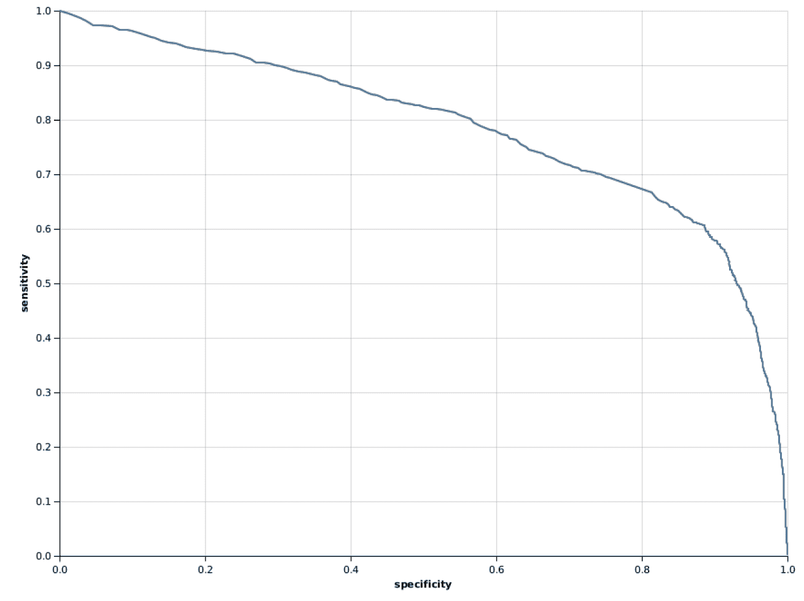

图 6：敏感度特异度曲线

现在，敏感度特异度曲线告诉我们正确预测的类别与两个标签之间的关系。例如，如果我们正确预测了 100%的欺诈案例，那么就不会有正确分类的非欺诈案例，反之亦然。最后，从另一个角度仔细观察这个问题，手动遍历不同的预测阈值，计算在两个类别中正确分类的案例数量，将会非常有益。

更具体地说，我们可以通过不同的预测阈值（例如**0.0**到**1.0**）来直观检查真正例、假正例、真负例和假负例：

```py
val withTh = auc._tps.zip(auc._fps).zipWithIndex.map(x => x match {
    case ((a, b), c) => (a, b, auc.tn(c), auc.fn(c), auc._ths(c)) })

val rows3 = for (i <- 0 until withTh.length) 
    yield r3(withTh(i)._1, withTh(i)._2, withTh(i)._3, withTh(i)._4, withTh(i)._5)
```

首先，让我们绘制真正例：

```py
Vegas("tp", width = 800, height = 600).withDataFrame(rows3.toDF)
    .mark(Line).encodeX("th", Quantitative)
    .encodeY("tp", Quantitative)
    .show
>>>
```

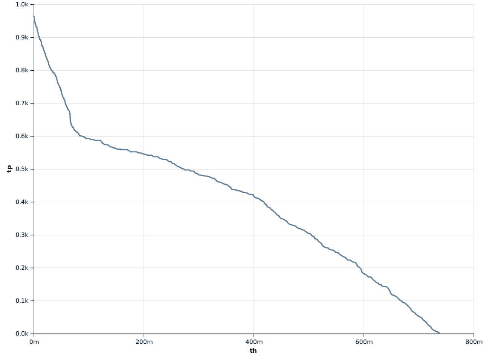

图 7：在[0.0, 1.0]之间不同预测阈值下的真正例

第二步，让我们绘制假阳性：

```py
Vegas("fp", width = 800, height = 600)
    .withDataFrame(rows3.toDF).mark(Line)
    .encodeX("th", Quantitative)
    .encodeY("fp", Quantitative)
    .show
>>>
```

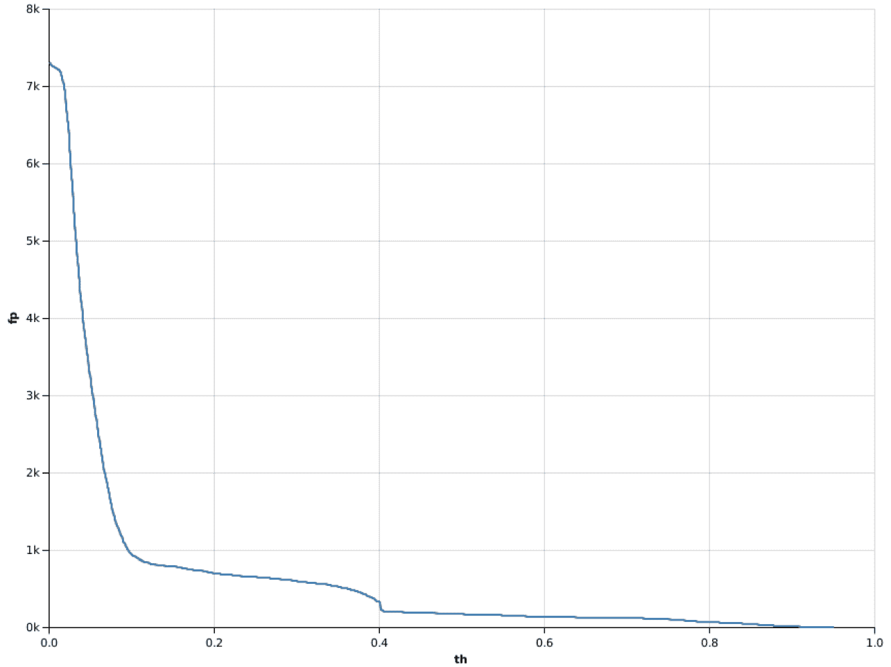

图 8：在[0.0, 1.0]范围内，不同预测阈值下的假阳性

接下来是正确的负类：

```py
Vegas("tn", width = 800, height = 600)
    .withDataFrame(rows3.toDF).mark(Line)
    .encodeX("th", Quantitative)
    .encodeY("tn", Quantitative)
    .show
>>>
```

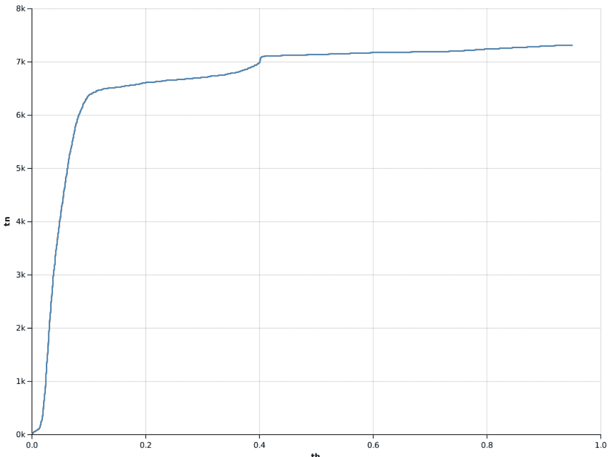

图 9：在[0.0, 1.0]范围内，不同预测阈值下的假阳性

最后，让我们绘制假阴性：

```py
Vegas("fn", width = 800, height = 600)
    .withDataFrame(rows3.toDF).mark(Line)
    .encodeX("th", Quantitative)
    .encodeY("fn", Quantitative)
    .show
>>>
```

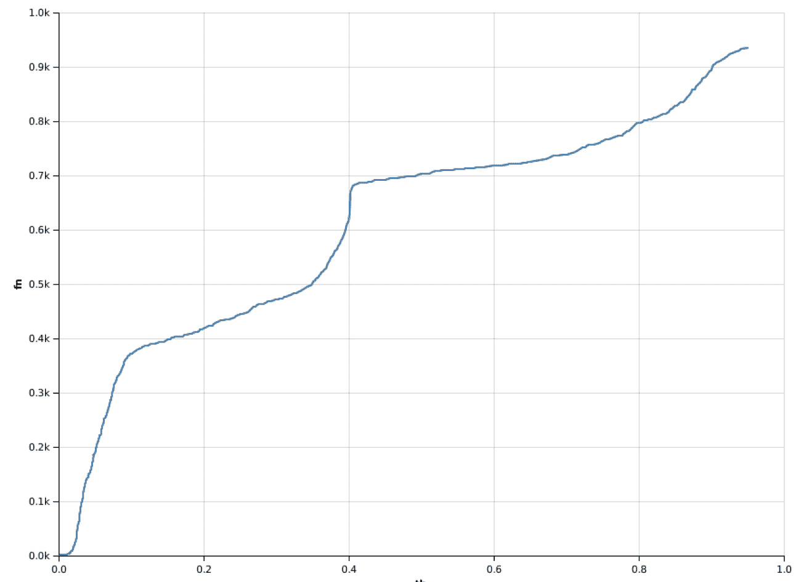

图 10：在[0.0, 1.0]范围内，不同预测阈值下的假阳性

因此，前面的图表告诉我们，当我们将预测阈值从默认的**0.5**提高到**0.6**时，可以在不丢失正确分类的欺诈案例的情况下，增加正确分类的非欺诈案例数量。

除了这两种辅助方法外，我还定义了三个 Scala case 类来计算`precision`、`recall`、`sensitivity`、`specificity`、真正例（`tp`）、真负例（`tn`）、假阳性（`fp`）、假阴性（`fn`）等。其签名如下：

```py
case class r(precision: Double, recall: Double)
case class r2(sensitivity: Double, specificity: Double)
case class r3(tp: Double, fp: Double, tn: Double, fn: Double, th: Double)
```

最后，停止 Spark 会话和 H2O 上下文。`stop()`方法调用将分别关闭 H2O 上下文和 Spark 集群：

```py
h2oContext.stop(stopSparkContext = true)
spark.stop()
```

第一个尤其重要；否则，有时它并不会停止 H2O 流，但仍会占用计算资源。

# 超参数调优和特征选择

神经网络的灵活性也是它们的主要缺点之一：有许多超参数需要调整。即使在一个简单的 MLP 中，你也可以更改层数、每层的神经元数量、每层使用的激活函数类型、训练轮次、学习率、权重初始化逻辑、丢弃保持概率等。那么，如何知道哪种超参数组合最适合你的任务呢？

当然，你可以使用网格搜索结合交叉验证来为线性机器学习模型寻找合适的超参数，但对于深度学习模型来说，有很多超参数需要调优。而且，由于在大数据集上训练神经网络需要大量时间，你只能在合理的时间内探索超参数空间的一小部分。以下是一些有用的见解。

# 隐藏层数量

对于许多问题，你可以从一两个隐藏层开始，使用两个隐藏层并保持相同的神经元总数，训练时间大致相同，效果也很好。对于更复杂的问题，你可以逐渐增加隐藏层的数量，直到开始出现过拟合。非常复杂的任务，如大规模图像分类或语音识别，通常需要几十层的网络，并且需要大量的训练数据。

# 每个隐藏层的神经元数量

显然，输入层和输出层的神经元数量是由任务所需的输入和输出类型决定的。例如，如果你的数据集形状为 28 x 28，那么它的输入神经元数量应该是 784，输出神经元数量应等于要预测的类别数。

在这个项目中，我们通过下一个使用 MLP 的示例，展示了它在实践中的运作方式，我们设置了 256 个神经元，每个隐藏层 4 个；这只是一个需要调节的超参数，而不是每层一个。就像层数一样，你可以逐渐增加神经元的数量，直到网络开始过拟合。

# 激活函数

在大多数情况下，你可以在隐藏层使用 ReLU 激活函数。它比其他激活函数计算速度更快，而且与逻辑函数或双曲正切函数相比，梯度下降在平坦区域更不容易停滞，因为后者通常在 1 处饱和。

对于输出层，softmax 激活函数通常是分类任务的不错选择。对于回归任务，你可以简单地不使用任何激活函数。其他激活函数包括 Sigmoid 和 Tanh。当前基于 H2O 的深度学习模型支持以下激活函数：

+   指数线性整流器（ExpRectifier）

+   带 Dropout 的指数线性整流器（ExpRectifierWithDropout）

+   Maxout

+   带 Dropout 的 Maxout（MaxoutWithDropout）

+   线性整流器（Rectifier）

+   带 Dropout 的线性整流器（RectifierWthDropout）

+   Tanh

+   带 Dropout 的 Tanh（TanhWithDropout）

除了 Tanh（H2O 中的默认函数），我没有尝试过其他激活函数用于这个项目。然而，你应该肯定尝试其他的。

# 权重和偏置初始化

初始化隐藏层的权重和偏置是需要注意的一个重要超参数：

+   **不要进行全零初始化**：一个看似合理的想法是将所有初始权重设置为零，但实际上并不可行，因为如果网络中的每个神经元计算相同的输出，那么它们的权重初始化为相同的值时，就不会有神经元之间的对称性破坏。

+   **小随机数**：也可以将神经元的权重初始化为小数值，而不是完全为零。或者，也可以使用从均匀分布中抽取的小数字。

+   **初始化偏置**：将偏置初始化为零是可能的，且很常见，因为破坏对称性是通过权重中的小随机数来完成的。将偏置初始化为一个小常数值，例如将所有偏置设为 0.01，确保所有 ReLU 单元能够传播梯度。然而，这种做法既不能很好地执行，也没有持续的改进效果。因此，推荐将偏置设为零。

# 正则化

有几种方法可以控制神经网络的训练，防止在训练阶段过拟合，例如 L2/L1 正则化、最大范数约束和 Dropout：

+   **L2 正则化**：这可能是最常见的正则化形式。通过梯度下降参数更新，L2 正则化意味着每个权重都会线性衰减到零。

+   **L1 正则化**：对于每个权重*w*，我们将项λ∣w∣添加到目标函数中。然而，也可以结合 L1 和 L2 正则化*以实现*弹性网正则化。

+   **最大范数约束**：用于对每个隐藏层神经元的权重向量的大小施加绝对上限。然后，可以使用投影梯度下降进一步强制执行该约束。

+   **Dropout（丢弃法）**：在使用神经网络时，我们需要另一个占位符用于丢弃法，这是一个需要调优的超参数，它仅影响训练时间而非测试时间。其实现方式是通过以某种概率（假设为*p<1.0*）保持一个神经元活跃，否则将其设置为零。其理念是在测试时使用一个没有丢弃法的神经网络。该网络的权重是经过训练的权重的缩小版。如果在训练过程中一个单元在`dropout_keep_prob` *< 1.0*时被保留，那么该单元的输出权重在测试时会乘以*p*（*图 17*）。

除了这些超参数，使用基于 H2O 的深度学习算法的另一个优点是我们可以得到相对变量/特征的重要性。在之前的章节中，我们看到通过在 Spark 中使用随机森林算法，也可以计算变量重要性。

所以，基本思想是，如果你的模型表现不佳，去掉不太重要的特征然后重新训练可能会有所帮助。现在，在监督学习过程中是可以找到特征重要性的。我观察到的特征重要性如下：

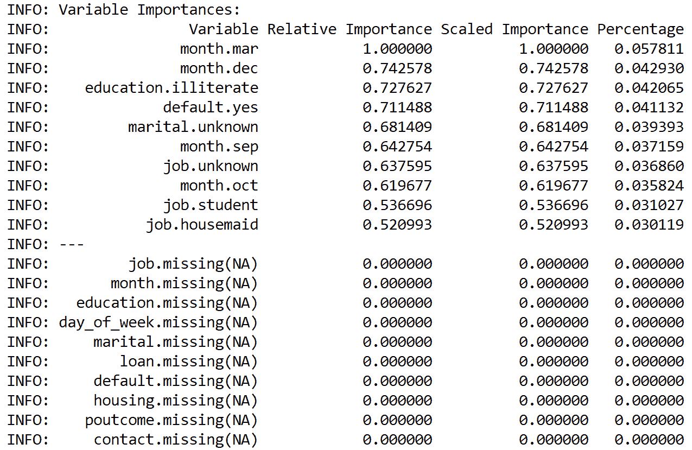

图 25：相对变量重要性

现在问题是：为什么不去掉它们，再次训练看看准确性是否有所提高？嗯，我将这个问题留给读者自己思考。

# 摘要

在本章中，我们展示了如何使用 H2O 在银行营销数据集上开发一个**机器学习**（**ML**）项目来进行预测分析。我们能够预测客户是否会订阅定期存款，准确率达到 80%。此外，我们还展示了如何调优典型的神经网络超参数。考虑到这是一个小规模数据集，最终的改进建议是使用基于 Spark 的随机森林、决策树或梯度提升树来提高准确性。

在下一章中，我们将使用一个包含超过 284,807 个信用卡使用实例的数据集，其中只有 0.172%的交易是欺诈的——也就是说，这是一个高度不平衡的数据集。因此，使用自编码器预训练一个分类模型并应用异常检测来预测可能的欺诈交易是有意义的——也就是说，我们预期我们的欺诈案件将是整个数据集中的异常。
