# 第九章：使用自编码器和异常检测进行欺诈分析

在金融公司，如银行、保险公司和信用合作社，检测和防止欺诈是一个重要任务，这对于业务的增长至关重要。到目前为止，在上一章中，我们已经学习了如何使用经典的有监督机器学习模型；现在是时候使用其他的无监督学习算法，比如自编码器。

在本章中，我们将使用一个包含超过 284,807 个信用卡使用实例的数据集，其中只有 0.172%的交易是欺诈交易。因此，这是一个高度不平衡的数据。因此，使用自编码器来预训练分类模型并应用异常检测技术以预测可能的欺诈交易是有意义的；也就是说，我们预计欺诈案件将在整个数据集中表现为异常。

总结来说，通过这个端到端项目，我们将学习以下主题：

+   使用异常值进行异常检测

+   在无监督学习中使用自编码器

+   开发一个欺诈分析预测模型

+   超参数调优，最重要的是特征选择

# 异常值和异常检测

异常是观察世界中不寻常和意外的模式。因此，分析、识别、理解和预测从已知和未知数据中的异常是数据挖掘中最重要的任务之一。因此，检测异常可以从数据中提取关键信息，这些信息随后可以用于许多应用。

虽然异常是一个广泛接受的术语，但在不同的应用领域中，通常会使用其他同义词，如异常值、背离观察、例外、偏差、惊讶、特异性或污染物。特别是，异常和异常值常常可以互换使用。异常检测在信用卡、保险或医疗保健的欺诈检测、网络安全的入侵检测、安全关键系统的故障检测以及敌方活动的军事监视等领域中得到了广泛应用。

异常检测的重要性源于这样一个事实：在许多应用领域，数据中的异常通常转化为具有重要可操作性的信息。当我们开始探索一个高度不平衡的数据集时，可以使用峰度对数据集进行三种可能的解释。因此，在应用特征工程之前，以下问题需要通过数据探索来回答和理解：

+   所有可用字段中，数据中存在或不存在空值或缺失值的比例是多少？然后，尝试处理这些缺失值，并在不丢失数据语义的情况下很好地解释它们。

+   各个字段之间的相关性是什么？每个字段与预测变量之间的相关性是什么？它们取什么值（即，分类的或非分类的、数值的或字母数字的，等等）？

然后找出数据分布是否有偏。你可以通过查看异常值或长尾来识别偏度（如图 1 所示，可能是稍微偏向右侧或正偏，稍微偏向左侧或负偏）。现在确定异常值是否有助于预测。更准确地说，你的数据具有以下三种可能的峰度之一：

+   如果峰度值小于但接近 3，则为正态峰态（Mesokurtic）

+   如果峰度值大于 3，则为高峰态（Leptokurtic）

+   如果峰度值小于 3，则为低峰态（Platykurtic）

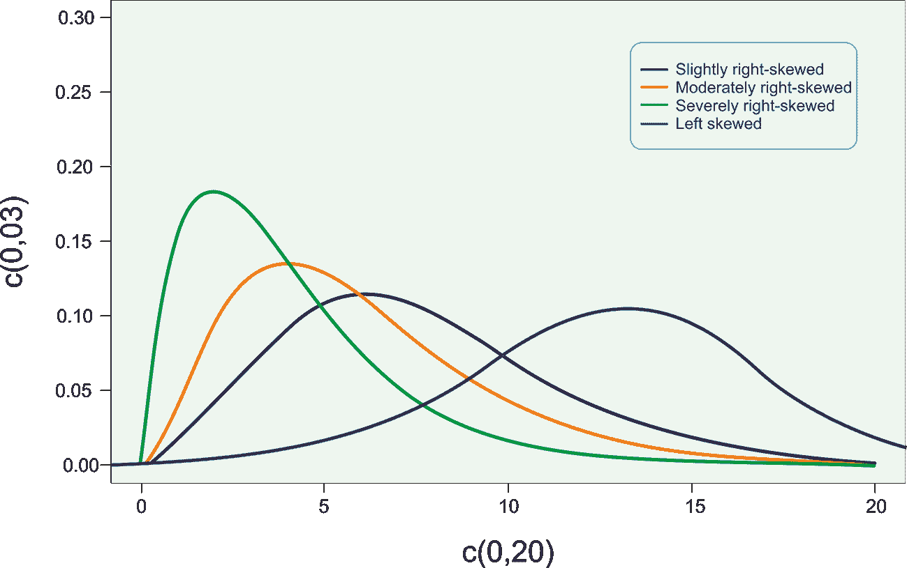

图 1：不平衡数据集中不同类型的偏度

让我们举个例子。假设你对健身步行感兴趣，在过去四周内（不包括周末），你曾在运动场或乡间步行。你花费的时间如下（完成 4 公里步行赛道所需的分钟数）：15，16，18，17.16，16.5，18.6，19.0，20.4，20.6，25.15，27.27，25.24，21.05，21.65，20.92，22.61，23.71，35，39，50。使用 R 计算并解释这些值的偏度和峰度，将生成如下的密度图。

*图 2*中关于数据分布（运动时间）的解释显示，密度图右偏，因此是高峰态（leptokurtic）。因此，位于最右端的数据点可以被视为在我们使用场景中不寻常或可疑。因此，我们可以考虑识别或移除它们以使数据集平衡。然而，这不是该项目的目的，目的仅仅是进行识别。

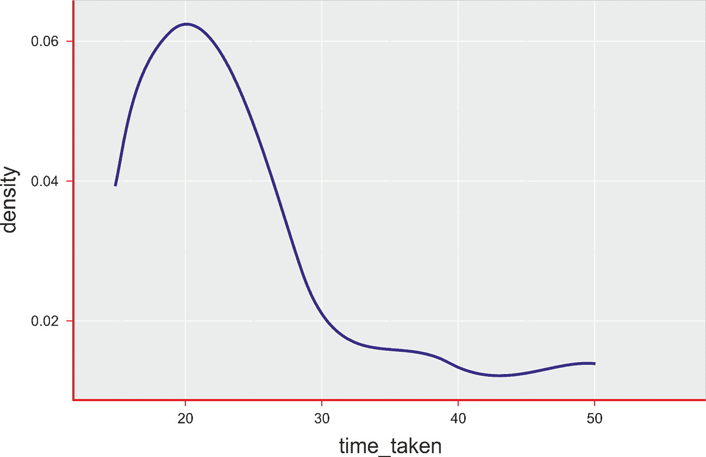

图 2：运动时间的直方图（右偏）

然而，通过去除长尾，我们不能完全去除不平衡问题。还有另一种方法叫做异常值检测，去除这些数据点可能会有帮助。

此外，我们还可以查看每个单独特征的箱型图。箱型图根据五数概括显示数据分布：**最小值**、**第一个四分位数**、中位数、**第三个四分位数**和**最大值**，如*图 3*所示，我们可以通过查看超出三倍四分位距（**IQR**）的异常值来判断：

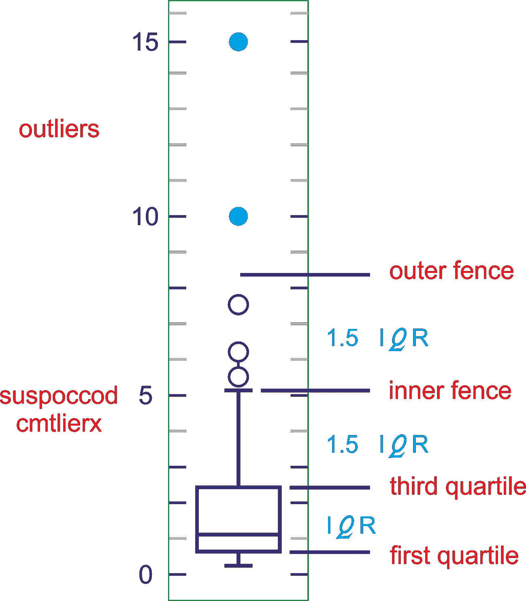

图 3：超出三倍四分位距（IQR）的异常值

因此，探索去除长尾是否能为监督学习或无监督学习提供更好的预测是有用的。但对于这个高度不平衡的数据集，暂时没有明确的建议。简而言之，偏度分析在这方面对我们没有帮助。

最后，如果你发现你的模型无法提供完美的分类，但**均方误差**（**MSE**）可以为你提供一些线索，帮助识别异常值或异常数据。例如，在我们的案例中，即使我们投影的模型不能将数据集分为欺诈和非欺诈案例，欺诈交易的均方误差（MSE）肯定高于常规交易。所以，即使听起来有些天真，我们仍然可以通过应用 MSE 阈值来识别异常值。例如，我们可以认为 MSE > 0.02 的实例是异常值/离群点。

那么问题是，我们该如何做到这一点呢？通过这个端到端的项目，我们将看到如何使用自编码器和异常检测。我们还将看到如何使用自编码器来预训练一个分类模型。最后，我们将看到如何在不平衡数据上衡量模型的表现。让我们从了解自编码器开始。

# 自编码器和无监督学习

自编码器是能够在没有任何监督的情况下（即训练集没有标签）学习输入数据高效表示的人工神经网络。这种编码通常具有比输入数据更低的维度，使得自编码器在降维中非常有用。更重要的是，自编码器充当强大的特征检测器，可以用于深度神经网络的无监督预训练。

# 自编码器的工作原理

自编码器是一个包含三层或更多层的网络，其中输入层和输出层具有相同数量的神经元，而中间（隐藏）层的神经元数量较少。该网络的训练目标是仅仅将每个输入数据的输入模式在输出中再现。问题的显著特点是，由于隐藏层中的神经元数量较少，如果网络能够从示例中学习，并在可接受的范围内进行概括，它将执行数据压缩：隐藏神经元的状态为每个示例提供了输入和输出公共状态的压缩版本。

问题的一个显著特点是，由于隐藏层中的神经元数量较少，如果网络能够从示例中学习，并在可接受的范围内进行概括，它将执行*数据压缩*：隐藏神经元的状态为每个示例提供了*压缩版本*的*输入*和*输出公共状态*。自编码器的有用应用包括**数据去噪**和**数据可视化的降维**。

以下图示展示了自编码器的典型工作原理。它通过两个阶段来重建接收到的输入：一个编码阶段，它对应于原始输入的维度缩减，*和*一个解码阶段，它能够从编码（压缩）表示中重建原始输入：

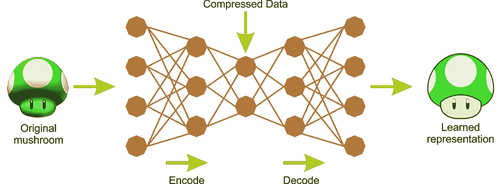

图 4：自编码器中的编码器和解码器阶段

作为一种无监督神经网络，自编码器的主要特点在于其对称结构。自编码器有两个组成部分：一个编码器将输入转换为内部表示，接着是一个解码器将内部表示转换回输出。换句话说，自编码器可以看作是编码器和解码器的组合，其中编码器将输入编码为代码，而解码器则将代码解码/重建为原始输入作为输出。因此，**多层感知机**（**MLP**）通常具有与自编码器相同的结构，除了输出层中的神经元数量必须等于输入数量。

如前所述，训练自编码器的方式不止一种。第一种方法是一次性训练整个层，类似于多层感知机（MLP）。不过，与使用一些标记输出计算代价函数（如监督学习中一样）不同的是，我们使用输入本身。因此，`代价`函数显示实际输入与重构输入之间的差异。

第二种方法是通过贪心训练逐层进行。这种训练实现源自于监督学习中反向传播方法所带来的问题（例如，分类）。在具有大量层的网络中，反向传播方法在梯度计算中变得非常缓慢和不准确。为了解决这个问题，Geoffrey Hinton 应用了一些预训练方法来初始化分类权重，而这种预训练方法是一次对两个相邻层进行的。

# 高效的数据表示与自编码器

所有监督学习系统面临的一个大问题是所谓的**维度诅咒**：随着输入空间维度的增加，性能逐渐下降。这是因为为了充分采样输入空间，所需的样本数随着维度的增加呈指数级增长。为了解决这些问题，已经开发出一些优化网络。

第一类是自编码器网络：这些网络被设计和训练用来将输入模式转化为其自身，以便在输入模式的降级或不完整版本出现时，能够恢复原始模式。网络经过训练，可以生成与输入相似的输出数据，而隐藏层则存储压缩后的数据，也就是捕捉输入数据基本特征的紧凑表示。

第二类优化网络是**玻尔兹曼机**：这类网络由一个输入/输出可见层和一个隐藏层组成。可见层和隐藏层之间的连接是无方向的：数据可以双向流动，即从可见层到隐藏层，或从隐藏层到可见层，不同的神经元单元可以是完全连接的或部分连接的。

让我们看一个例子。决定以下哪个序列你认为更容易记住：

+   45, 13, 37, 11, 23, 90, 79, 24, 87, 47

+   50, 25, 76, 38, 19, 58, 29, 88, 44, 22, 11, 34, 17, 52, 26, 13, 40, 20

看完前面两个序列，似乎第一个序列对于人类来说更容易记住，因为它更短，包含的数字比第二个序列少。然而，如果仔细观察第二个序列，你会发现偶数正好是后一个数字的两倍，而奇数后面跟着一个数字，乘以三再加一。这是一个著名的数字序列，叫做**冰雹序列**。

然而，如果你能轻松记住长序列，你也能更轻松、更快速地识别数据中的模式。在 1970 年代，研究人员观察到，国际象棋高手能够仅仅通过看棋盘五秒钟，就记住游戏中所有棋子的摆放位置。听起来可能有些争议，但国际象棋专家的记忆力并不比你我更强大。问题在于，他们比非棋手更容易识别棋盘上的模式。自编码器的工作原理是，它首先观察输入，将其转化为更好的内部表示，并能够吸收它已经学习过的内容：

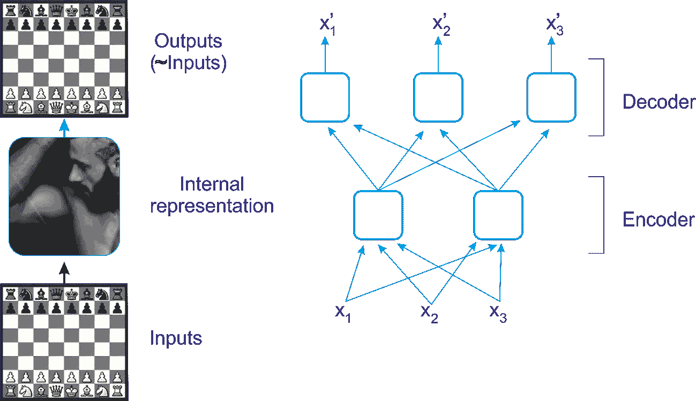

图 5：国际象棋游戏中的自编码器

看一下一个更现实的图形，关于我们刚才讨论的国际象棋例子：隐藏层有两个神经元（即编码器本身），而输出层有三个神经元（换句话说，就是解码器）。因为内部表示的维度低于输入数据（它是 2D 而不是 3D），所以这个自编码器被称为“欠完备”。一个欠完备的自编码器无法轻松地将其输入复制到编码中，但它必须找到一种方法输出其输入的副本。

它被迫学习输入数据中最重要的特征，并丢弃不重要的特征。通过这种方式，自编码器可以与**主成分分析**（**PCA**）进行比较，PCA 用于使用比原始数据更少的维度来表示给定的输入。

到目前为止，我们已经了解了自编码器是如何工作的。现在，了解通过离群值识别进行异常检测将会很有意义。

# 开发欺诈分析模型

在我们完全开始之前，我们需要做两件事：了解数据集，然后准备我们的编程环境。

# 数据集的描述与线性模型的使用

对于这个项目，我们将使用 Kaggle 上的信用卡欺诈检测数据集。数据集可以从[`www.kaggle.com/dalpozz/creditcardfraud`](https://www.kaggle.com/dalpozz/creditcardfraud)下载。由于我正在使用这个数据集，因此通过引用以下出版物来保持透明性是一个好主意：

+   Andrea Dal Pozzolo、Olivier Caelen、Reid A. Johnson 和 Gianluca Bontempi，《用欠采样校准概率进行不平衡分类》，在 IEEE 计算智能与数据挖掘研讨会（CIDM）上发表于 2015 年。

数据集包含 2013 年 9 月欧洲持卡人的信用卡交易，仅为两天。总共有 285,299 笔交易，其中只有 492 笔是欺诈交易，占 284,807 笔交易的 0.172%，表明数据集严重不平衡，正类（欺诈）占所有交易的 0.172%。

它只包含数值输入变量，这些变量是 PCA 转换的结果。不幸的是，由于保密问题，我们无法提供有关数据的原始特征和更多背景信息。有 28 个特征，即`V1`、`V2`、...、`V28`，这些是通过 PCA 获得的主成分，除了`Time`和`Amount`。特征`Class`是响应变量，在欺诈案例中取值为 1，否则为 0。我们稍后会详细了解。

# 问题描述

鉴于类别不平衡比率，我们建议使用**精度-召回率曲线下面积**（**AUPRC**）来衡量准确性。对于不平衡分类，混淆矩阵准确性并不具有意义。关于此，可以通过应用过采样或欠采样技术使用线性机器学习模型，如随机森林、逻辑回归或支持向量机。或者，我们可以尝试在数据中找到异常值，因为假设整个数据集中只有少数欺诈案例是异常。

在处理如此严重的响应标签不平衡时，我们在测量模型性能时也需要小心。由于欺诈案例很少，将所有预测为非欺诈的模型已经达到了超过 99%的准确率。但尽管准确率很高，线性机器学习模型不一定能帮助我们找到欺诈案例。

因此，值得探索深度学习模型，如自编码器。此外，我们需要使用异常检测来发现异常值。特别是，我们将看到如何使用自编码器来预训练分类模型，并在不平衡数据上测量模型性能。

# 准备编程环境

具体而言，我将为这个项目使用多种工具和技术。以下是解释每种技术的列表：

+   **H2O/Sparking water**：用于深度学习平台（详见上一章节）

+   **Apache Spark**：用于数据处理环境

+   **Vegas**：Matplotlib 的替代品，类似于 Python，用于绘图。它可以与 Spark 集成以进行绘图目的。

+   **Scala**：我们项目的编程语言

嗯，我将创建一个 Maven 项目，所有依赖项都将注入到`pom.xml`文件中。`pom.xml`文件的完整内容可以从 Packt 仓库下载。所以让我们开始吧：

```py
<dependencies>
   <dependency>
      <groupId>ai.h2o</groupId>
      <artifactId>sparkling-water-core_2.11</artifactId>
      <version>2.2.2</version>
   </dependency>
   <dependency>
      <groupId>org.vegas-viz</groupId>
      <artifactId>vegas_2.11</artifactId>
      <version>0.3.11</version>
   </dependency>
   <dependency>
     <groupId>org.vegas-viz</groupId>
     <artifactId>vegas-spark_2.11</artifactId>
     <version>0.3.11</version>
     </dependency>
</dependencies>
```

现在，Eclipse 或你喜欢的 IDE 将拉取所有的依赖项。第一个依赖项也会拉取与该 H2O 版本兼容的所有 Spark 相关依赖项。然后，创建一个 Scala 文件并提供一个合适的名称。接下来，我们就准备好了。

# 步骤 1 - 加载所需的包和库

所以，让我们从导入所需的库和包开始：

```py
package com.packt.ScalaML.FraudDetection

import org.apache.spark.sql.SparkSession
import org.apache.spark.sql.functions._
import org.apache.spark.sql._
import org.apache.spark.h2o._
import _root_.hex.FrameSplitter
import water.Key
import water.fvec.Frame
import _root_.hex.deeplearning.DeepLearning
import _root_.hex.deeplearning.DeepLearningModel.DeepLearningParameters
import _root_.hex.deeplearning.DeepLearningModel.DeepLearningParameters.Activation
import java.io.File
import water.support.ModelSerializationSupport
import _root_.hex.{ ModelMetricsBinomial, ModelMetrics }
import org.apache.spark.h2o._
import scala.reflect.api.materializeTypeTag
import water.support.ModelSerializationSupport
import water.support.ModelMetricsSupport
import _root_.hex.deeplearning.DeepLearningModel
import vegas._
import vegas.sparkExt._
import org.apache.spark.sql.types._
```

# 步骤 2 - 创建 Spark 会话并导入隐式转换

然后我们需要创建一个 Spark 会话作为我们程序的入口：

```py
val spark = SparkSession
        .builder
        .master("local[*]")
        .config("spark.sql.warehouse.dir", "tmp/")
        .appName("Fraud Detection")
        .getOrCreate()
```

此外，我们还需要导入 spark.sql 和 h2o 的隐式转换：

```py
implicit val sqlContext = spark.sqlContext
import sqlContext.implicits._
val h2oContext = H2OContext.getOrCreate(spark)
import h2oContext._
import h2oContext.implicits._
```

# 步骤 3 - 加载和解析输入数据

我们加载并获取交易数据。然后我们获得分布：

```py
val inputCSV = "data/creditcard.csv"

val transactions = spark.read.format("com.databricks.spark.csv")
        .option("header", "true")
        .option("inferSchema", true)
        .load(inputCSV)
```

# 步骤 4 - 输入数据的探索性分析

如前所述，数据集包含`V1`到`V28`的数值输入变量，这些变量是原始特征经过 PCA 转换后的结果。响应变量`Class`告诉我们交易是否是欺诈行为（值=1）或正常交易（值=0）。

还有两个额外的特征，`Time`和`Amount`。`Time`列表示当前交易和第一次交易之间的秒数，而`Amount`列表示本次交易转账的金额。所以让我们看看输入数据的一个简要展示（这里只显示了`V1`、`V2`、`V26`和`V27`）在*图 6*中：

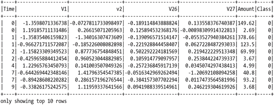

图 6：信用卡欺诈检测数据集的快照

我们已经能够加载交易数据，但上面的 DataFrame 没有告诉我们类别的分布情况。所以，让我们计算类别分布并考虑绘制它们：

```py
val distribution = transactions.groupBy("Class").count.collect
Vegas("Class Distribution").withData(distribution.map(r => Map("class" -> r(0), "count" -> r(1)))).encodeX("class", Nom).encodeY("count", Quant).mark(Bar).show
>>>
```


图 7：信用卡欺诈检测数据集中的类别分布

现在，让我们看看时间是否对可疑交易有重要的影响。`Time`列告诉我们交易发生的顺序，但并未提供任何关于实际时间（即一天中的时间）的信息。因此，将它们按天进行标准化，并根据一天中的时间将其分为四组，以便从`Time`构建一个`Day`列会很有帮助。我为此编写了一个 UDF：

```py
val daysUDf = udf((s: Double) => 
if (s > 3600 * 24) "day2" 
else "day1")

val t1 = transactions.withColumn("day", daysUDf(col("Time")))
val dayDist = t1.groupBy("day").count.collect
```

现在让我们绘制它：

```py
Vegas("Day Distribution").withData(dayDist.map(r => Map("day" -> r(0), "count" -> r(1)))).encodeX("day", Nom).encodeY("count", Quant).mark(Bar).show
>>>
```

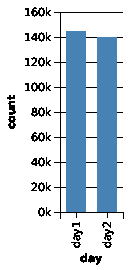

图 8：信用卡欺诈检测数据集中的天数分布

上面的图表显示了这两天的交易数量相同，但更具体地说，`day1`的交易数量略多。现在让我们构建`dayTime`列。我为此编写了一个 UDF：

```py
val dayTimeUDf = udf((day: String, t: Double) => if (day == "day2") t - 86400 else t)
val t2 = t1.withColumn("dayTime", dayTimeUDf(col("day"), col("Time")))

t2.describe("dayTime").show()
>>>
+-------+------------------+
|summary| dayTime |
+-------+------------------+
| count| 284807|
| mean| 52336.926072744|
| stddev|21049.288810608432|
| min| 0.0|
| max| 86400.0|
+-------+------------------+
```

现在我们需要获取分位数（`q1`、中位数、`q2`）并构建时间区间（`gr1`、`gr2`、`gr3`和`gr4`）：

```py

val d1 = t2.filter($"day" === "day1")
val d2 = t2.filter($"day" === "day2")
val quantiles1 = d1.stat.approxQuantile("dayTime", Array(0.25, 0.5, 0.75), 0)

val quantiles2 = d2.stat.approxQuantile("dayTime", Array(0.25, 0.5, 0.75), 0)

val bagsUDf = udf((t: Double) => 
 if (t <= (quantiles1(0) + quantiles2(0)) / 2) "gr1" 
 elseif (t <= (quantiles1(1) + quantiles2(1)) / 2) "gr2" 
 elseif (t <= (quantiles1(2) + quantiles2(2)) / 2) "gr3" 
 else "gr4")

val t3 = t2.drop(col("Time")).withColumn("Time", bagsUDf(col("dayTime")))
```

然后让我们获取类别`0`和`1`的分布：

```py
val grDist = t3.groupBy("Time", "class").count.collect
val grDistByClass = grDist.groupBy(_(1))
```

现在让我们绘制类别`0`的组分布：

```py
Vegas("gr Distribution").withData(grDistByClass.get(0).get.map(r => Map("Time" -> r(0), "count" -> r(2)))).encodeX("Time", Nom).encodeY("count", Quant).mark(Bar).show
>>>
```

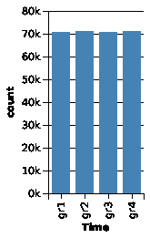

图 9：信用卡欺诈检测数据集中类别 0 的组分布

从前面的图表来看，显然大部分是正常交易。现在让我们看看 `class 1` 的分组分布：

```py
Vegas("gr Distribution").withData(grDistByClass.get(1).get.map(r => Map("Time" -> r(0), "count" -> r(2)))).encodeX("Time", Nom).encodeY("count", Quant).mark(Bar).show
>>>
```

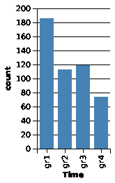

图 10：信用卡欺诈检测数据集中类 1 的分组分布

所以，四个**Time**区间中的交易分布显示，大多数欺诈案件发生在组 1。我们当然可以查看转账金额的分布：

```py
val c0Amount = t3.filter($"Class" === "0").select("Amount")
val c1Amount = t3.filter($"Class" === "1").select("Amount")

println(c0Amount.stat.approxQuantile("Amount", Array(0.25, 0.5, 0.75), 0).mkString(","))

Vegas("Amounts for class 0").withDataFrame(c0Amount).mark(Bar).encodeX("Amount", Quantitative, bin = Bin(50.0)).encodeY(field = "*", Quantitative, aggregate = AggOps.Count).show
>>>
```

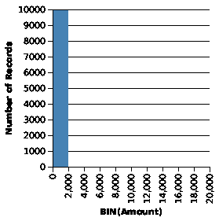

图 11：类 0 转账金额的分布

现在让我们为 `class 1` 绘制相同的图表：

```py
Vegas("Amounts for class 1").withDataFrame(c1Amount).mark(Bar).encodeX("Amount", Quantitative, bin = Bin(50.0)).encodeY(field = "*", Quantitative, aggregate = AggOps.Count).show
>>>
```

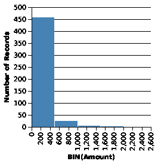

图 12：类 1 转账金额的分布

因此，从前面这两张图表可以看出，欺诈性信用卡交易的转账金额均值较高，但最大金额却远低于常规交易。正如我们在手动构建的 `dayTime` 列中看到的那样，这并不十分显著，因此我们可以直接删除它。我们来做吧：

```py
val t4 = t3.drop("day").drop("dayTime")
```

# 步骤 5 - 准备 H2O DataFrame

到目前为止，我们的 DataFrame（即` t4`）是 Spark DataFrame，但它不能被 H2O 模型使用。所以，我们需要将其转换为 H2O frame。那么我们来进行转换：

```py
val creditcard_hf: H2OFrame = h2oContext.asH2OFrame(t4.orderBy(rand()))
```

我们将数据集划分为，假设 40% 为有监督训练，40% 为无监督训练，20% 为测试集，使用 H2O 内置的分割器 FrameSplitter：

```py
val sf = new FrameSplitter(creditcard_hf, Array(.4, .4), 
                Array("train_unsupervised", "train_supervised", "test")
                .map(Key.makeFrame), null)

water.H2O.submitTask(sf)
val splits = sf.getResult
val (train_unsupervised, train_supervised, test) = (splits(0), splits(1), splits(2))
```

在上面的代码片段中，`Key.makeFrame` 被用作低级任务，用于根据分割比例分割数据帧，同时帮助获得分布式的键/值对。

在 H2O 计算中，键非常关键。H2O 支持分布式的键/值存储，并且具有精确的 Java 内存模型一致性。关键点是，键是用来在云中找到链接值、将其缓存到本地，并允许对链接值进行全局一致的更新的手段。

最后，我们需要将 `Time` 列从字符串类型显式转换为类别类型（即**枚举**）：

```py
toCategorical(train_unsupervised, 30)
toCategorical(train_supervised, 30)
toCategorical(test, 30)
```

# 步骤 6 - 使用自编码器进行无监督预训练

如前所述，我们将使用 Scala 和 `h2o` 编码器。现在是时候开始无监督自编码器训练了。由于训练是无监督的，这意味着我们需要将 `response` 列从无监督训练集中排除：

```py
val response = "Class"
val features = train_unsupervised.names.filterNot(_ == response)
```

接下来的任务是定义超参数，例如隐藏层的数量和神经元、用于重现性的种子、训练轮数以及深度学习模型的激活函数。对于无监督预训练，只需将自编码器参数设置为 `true`：

```py
var dlParams = new DeepLearningParameters()
    dlParams._ignored_columns = Array(response))// since unsupervised, we ignore the label
    dlParams._train = train_unsupervised._key // use the train_unsupervised frame for training
    dlParams._autoencoder = true // use H2O built-in autoencoder    dlParams._reproducible = true // ensure reproducibility    dlParams._seed = 42 // random seed for reproducibility
    dlParams._hidden = ArrayInt
    dlParams._epochs = 100 // number of training epochs
    dlParams._activation = Activation.Tanh // Tanh as an activation function
    dlParams._force_load_balance = false var dl = new DeepLearning(dlParams)
val model_nn = dl.trainModel.get
```

在上面的代码中，我们应用了一种叫做**瓶颈**训练的技术，其中中间的隐藏层非常小。这意味着我的模型必须降低输入数据的维度（在这种情况下，降到两个节点/维度）。

然后，自编码器模型将学习输入数据的模式，而不考虑给定的类别标签。在这里，它将学习哪些信用卡交易是相似的，哪些交易是异常值或离群点。不过，我们需要记住，自编码器模型对数据中的离群点非常敏感，这可能会破坏其他典型模式。

一旦预训练完成，我们应该将模型保存在`.csv`目录中：

```py
val uri = new File(new File(inputCSV).getParentFile, "model_nn.bin").toURI ModelSerializationSupport.exportH2OModel(model_nn, uri)
```

重新加载模型并恢复以便进一步使用：

```py
val model: DeepLearningModel = ModelSerializationSupport.loadH2OModel(uri)
```

现在，让我们打印模型的指标，看看训练的效果如何：

```py
println(model)
>>>
```

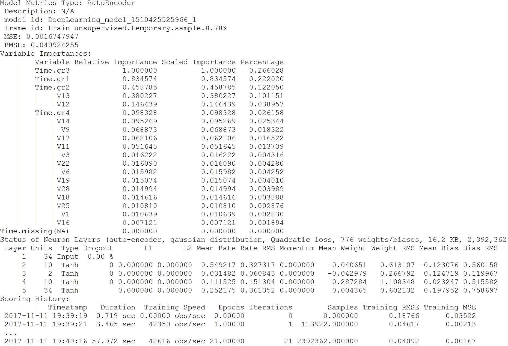

图 13：自编码器模型的指标

太棒了！预训练进展非常顺利，因为我们可以看到 RMSE 和 MSE 都相当低。我们还可以看到，一些特征是相当不重要的，例如`v16`、`v1`、`v25`等。我们稍后会分析这些。

# 步骤 7 - 使用隐藏层进行降维

由于我们使用了一个中间有两个节点的浅层自编码器，因此使用降维来探索我们的特征空间是值得的。我们可以使用`scoreDeepFeatures()`方法提取这个隐藏特征并绘制图形，展示输入数据的降维表示。

`scoreDeepFeatures()`方法会即时评分自编码重构，并提取给定层的深度特征。它需要以下参数：原始数据的框架（可以包含响应，但会被忽略），以及要提取特征的隐藏层的层索引。最后，返回一个包含深度特征的框架，其中列数为隐藏[层]。

现在，对于监督训练，我们需要提取深度特征。我们从第 2 层开始：

```py
var train_features = model_nn.scoreDeepFeatures(train_unsupervised, 1) 
train_features.add("Class", train_unsupervised.vec("Class"))
```

最终聚类识别的绘图如下：

```py
train_features.setNames(train_features.names.map(_.replaceAll("[.]", "-")))
train_features._key = Key.make()
water.DKV.put(train_features)

val tfDataFrame = asDataFrame(train_features) Vegas("Compressed").withDataFrame(tfDataFrame).mark(Point).encodeX("DF-L2-C1", Quantitative).encodeY("DF-L2-C2", Quantitative).encodeColor(field = "Class", dataType = Nominal).show
>>>
```

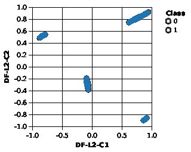

图 14：类别 0 和 1 的最终聚类

从前面的图中，我们无法看到任何与非欺诈实例明显区分的欺诈交易聚类，因此仅使用我们的自编码器模型进行降维不足以识别数据集中的欺诈行为。但我们可以使用隐藏层之一的降维表示作为模型训练的特征。例如，可以使用第一层或第三层的 10 个特征。现在，让我们从第 3 层提取深度特征：

```py
train_features = model_nn.scoreDeepFeatures(train_unsupervised, 2)
train_features._key = Key.make()
train_features.add("Class", train_unsupervised.vec("Class"))
water.DKV.put(train_features)

val features_dim = train_features.names.filterNot(_ == response)
val train_features_H2O = asH2OFrame(train_features)
```

现在，让我们再次使用新维度的数据集进行无监督深度学习：

```py
dlParams = new DeepLearningParameters()
        dlParams._ignored_columns = Array(response)
        dlParams._train = train_features_H2O
        dlParams._autoencoder = true
        dlParams._reproducible = true
        dlParams._ignore_const_cols = false
        dlParams._seed = 42
        dlParams._hidden = ArrayInt
        dlParams._epochs = 100
        dlParams._activation = Activation.Tanh
        dlParams._force_load_balance = false dl = new DeepLearning(dlParams)
val model_nn_dim = dl.trainModel.get
```

然后我们保存模型：

```py
ModelSerializationSupport.exportH2OModel(model_nn_dim, new File(new File(inputCSV).getParentFile, "model_nn_dim.bin").toURI)
```

为了衡量模型在测试数据上的表现，我们需要将测试数据转换为与训练数据相同的降维形式：

```py
val test_dim = model_nn.scoreDeepFeatures(test, 2)
val test_dim_score = model_nn_dim.scoreAutoEncoder(test_dim, Key.make(), false)

val result = confusionMat(test_dim_score, test, test_dim_score.anyVec.mean)
println(result.deep.mkString("n"))
>>>
Array(38767, 29)
Array(18103, 64)
```

现在，从识别欺诈案例的角度来看，这实际上看起来相当不错：93%的欺诈案例已被识别！

# 步骤 8 - 异常检测

我们还可以问一下哪些实例被认为是我们测试数据中的离群值或异常值。根据之前训练的自编码器模型，输入数据将被重构，并为每个实例计算实际值与重构值之间的 MSE。我还计算了两个类别标签的平均 MSE：

```py
test_dim_score.add("Class", test.vec("Class"))
val testDF = asDataFrame(test_dim_score).rdd.zipWithIndex.map(r => Row.fromSeq(r._1.toSeq :+ r._2))

val schema = StructType(Array(StructField("Reconstruction-MSE", DoubleType, nullable = false), StructField("Class", ByteType, nullable = false), StructField("idRow", LongType, nullable = false)))

val dffd = spark.createDataFrame(testDF, schema)
dffd.show()
>>>
```


图 15：显示均方误差（MSE）、类别和行 ID 的数据框

看着这个数据框，确实很难识别出离群值。但如果将它们绘制出来，可能会提供更多的见解：

```py
Vegas("Reduced Test", width = 800, height = 600).withDataFrame(dffd).mark(Point).encodeX("idRow", Quantitative).encodeY("Reconstruction-MSE", Quantitative).encodeColor(field = "Class", dataType = Nominal).show
>>>
```

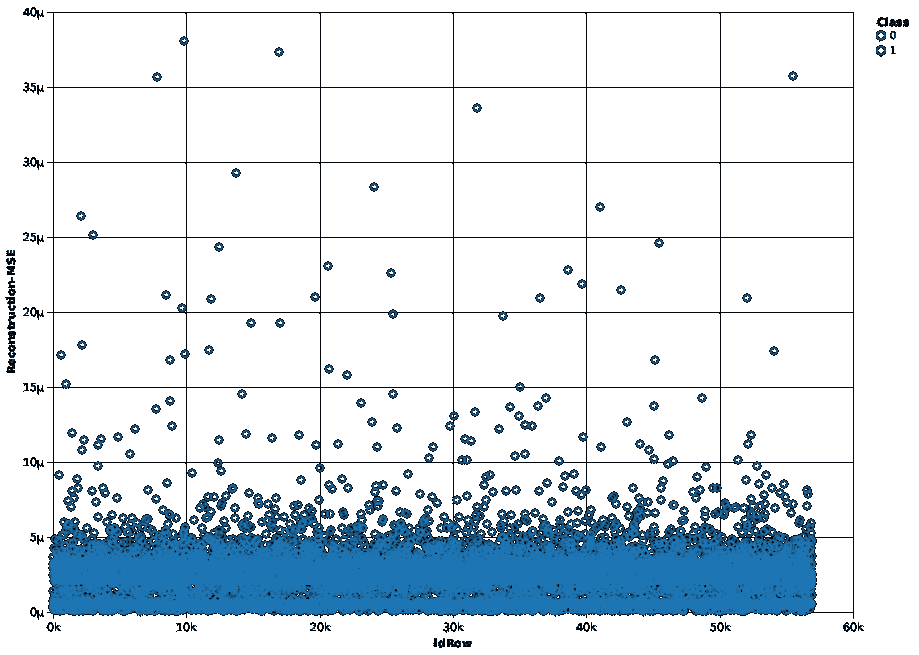

图 16：不同行 ID 下重建的 MSE 分布

正如我们在图表中所看到的，欺诈与非欺诈案例之间并没有完美的分类，但欺诈交易的平均 MSE 确实高于常规交易。但是需要进行最低限度的解释。

从前面的图表中，我们至少可以看到，大多数**idRows**的 MSE 为**5µ**。或者，如果我们将 MSE 阈值提高到**10µ**，那么超出此阈值的数据点可以视为离群值或异常值，即欺诈交易。

# 步骤 9 - 预训练的监督模型

现在我们可以尝试使用自编码器模型作为监督模型的预训练输入。这里，我再次使用神经网络。该模型现在将使用来自自编码器的权重进行模型拟合。然而，需要将类别从整数转换为类别型，以便进行分类训练。否则，H2O 训练算法将把它当作回归问题处理：

```py
toCategorical(train_supervised, 29)
```

现在，训练集（即`train_supervised`）已经为监督学习准备好了，我们可以开始进行训练了：

```py
val train_supervised_H2O = asH2OFrame(train_supervised)
        dlParams = new DeepLearningParameters()
        dlParams._pretrained_autoencoder = model_nn._key
        dlParams._train = train_supervised_H2O
        dlParams._reproducible = true
        dlParams._ignore_const_cols = false
        dlParams._seed = 42
        dlParams._hidden = ArrayInt
        dlParams._epochs = 100
        dlParams._activation = Activation.Tanh
        dlParams._response_column = "Class"
        dlParams._balance_classes = true dl = new DeepLearning(dlParams)
val model_nn_2 = dl.trainModel.get
```

做得很好！我们现在已经完成了监督训练。接下来，让我们看看预测类别与实际类别的对比：

```py
val predictions = model_nn_2.score(test, "predict")
test.add("predict", predictions.vec("predict"))
asDataFrame(test).groupBy("Class", "predict").count.show //print
>>>
+-----+-------+-----+
|Class|predict|count|
+-----+-------+-----+
| 1| 0| 19|
| 0| 1| 57|
| 0| 0|56804|
| 1| 1| 83|
+-----+-------+-----+
```

现在，这看起来好多了！我们确实错过了 17% 的欺诈案例，但也没有错误地分类太多非欺诈案例。在现实生活中，我们会花更多的时间通过示例来改进模型，执行超参数调优的网格搜索，回到原始特征并尝试不同的工程特征和/或尝试不同的算法。现在，如何可视化前面的结果呢？让我们使用 `Vegas` 包来实现：

```py
Vegas().withDataFrame(asDataFrame(test)).mark(Bar).encodeY(field = "*", dataType = Quantitative, AggOps.Count, axis = Axis(title = "", format = ".2f"), hideAxis = true).encodeX("Class", Ord).encodeColor("predict", Nominal, scale = Scale(rangeNominals = List("#EA98D2", "#659CCA"))).configMark(stacked = StackOffset.Normalize).show
>>>
```

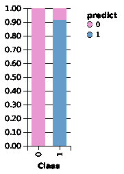

图 17：使用监督训练模型的预测类别与实际类别对比

# 步骤 10 - 在高度不平衡的数据上进行模型评估

由于数据集在非欺诈案例上高度不平衡，因此使用模型评估指标（如准确率或**曲线下面积**（**AUC**））是没有意义的。原因是，这些指标会根据大多数类的高正确分类率给出过于乐观的结果。

AUC 的替代方法是使用精确度-召回率曲线，或者敏感度（召回率）-特异度曲线。首先，让我们使用`ModelMetricsSupport`类中的`modelMetrics()`方法来计算 ROC：

```py
val trainMetrics = ModelMetricsSupport.modelMetricsModelMetricsBinomial
val auc = trainMetrics._auc
val metrics = auc._tps.zip(auc._fps).zipWithIndex.map(x => x match { case ((a, b), c) => (a, b, c) })

val fullmetrics = metrics.map(_ match { case (a, b, c) => (a, b, auc.tn(c), auc.fn(c)) })
val precisions = fullmetrics.map(_ match { case (tp, fp, tn, fn) => tp / (tp + fp) })

val recalls = fullmetrics.map(_ match { case (tp, fp, tn, fn) => tp / (tp + fn) })
val rows = for (i <- 0 until recalls.length) yield r(precisions(i), recalls(i))
val precision_recall = rows.toDF()
```

现在，我们已经有了`precision_recall`数据框，绘制它会非常令人兴奋。那么我们就这样做：

```py
Vegas("ROC", width = 800, height = 600).withDataFrame(precision_recall).mark(Line).encodeX("recall", Quantitative).encodeY("precision", Quantitative).show
>>>
```

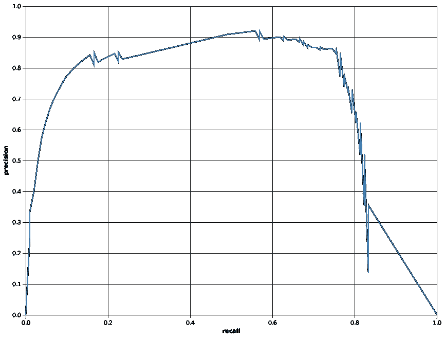

图 18：精确度-召回率曲线

精确度是预测为欺诈的测试案例中，真正是欺诈的比例，也叫做**真实正例**预测。另一方面，召回率或敏感度是被识别为欺诈的欺诈案例的比例。而特异度是被识别为非欺诈的非欺诈案例的比例。

前面的精确度-召回率曲线告诉我们实际欺诈预测与被预测为欺诈的欺诈案例的比例之间的关系。现在，问题是如何计算敏感度和特异度。好吧，我们可以使用标准的 Scala 语法来做到这一点，并通过`Vegas`包绘制它：

```py
val sensitivity = fullmetrics.map(_ 
 match { 
 case (tp, fp, tn, fn) => tp / (tp + fn) })
 val specificity = fullmetrics.map(_ 
 match { 
 case (tp, fp, tn, fn) => tn / (tn + fp) })
 val rows2 = 
 for (i <- 0 until specificity.length) 
 yield r2(sensitivity(i), specificity(i))

val sensitivity_specificity = rows2.toDF
Vegas("sensitivity_specificity", width = 800, height = 600).withDataFrame(sensitivity_specificity).mark(Line).encodeX("specificity", Quantitative).encodeY("sensitivity", Quantitative).show
>>>
```

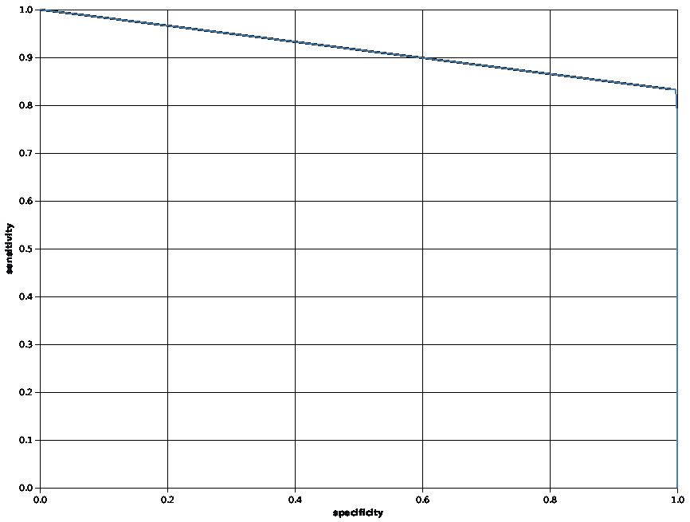

图 19：敏感度与特异度曲线

现在，前面的敏感度-特异度曲线告诉我们两个标签下正确预测类别之间的关系——例如，如果我们有 100%正确预测的欺诈案例，那么将没有正确分类的非欺诈案例，反之亦然。

最后，通过手动检查不同的预测阈值，并计算两个类别中正确分类的案例数量，从不同角度更深入地分析会很有帮助。更具体地说，我们可以直观地检查不同预测阈值下的真实正例、假正例、真实负例和假负例——例如，从 0.0 到 1.0：

```py
val withTh = auc._tps.zip(auc._fps)
            .zipWithIndex
            .map(x => x match { case ((a, b), c) 
            => (a, b, auc.tn(c), auc.fn(c), auc._ths(c)) })
val rows3 = for (i <- 0 until withTh.length) yield r3(withTh(i)._1, withTh(i)._2, withTh(i)._3, withTh(i)._4, withTh(i)._5)
```

首先，让我们绘制真实正例的图：

```py
Vegas("tp", width = 800, height = 600).withDataFrame(rows3.toDF).mark(Line).encodeX("th", Quantitative).encodeY("tp", Quantitative).show
>>>
```

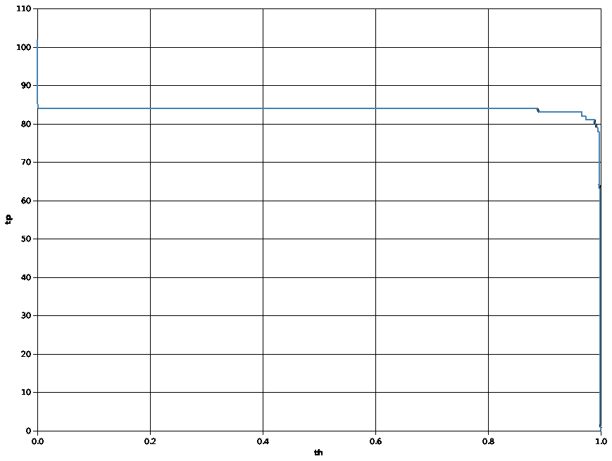

图 20：在[0.0, 1.0]范围内的真实正例数量随不同预测阈值变化

其次，让我们绘制假正例的图：

```py
Vegas("fp", width = 800, height = 600).withDataFrame(rows3.toDF).mark(Line).encodeX("th", Quantitative).encodeY("fp", Quantitative).show
>>>
```

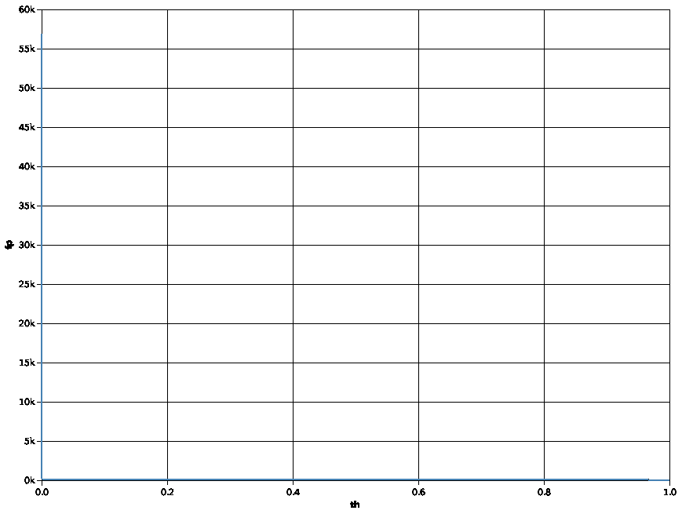

图 21：在[0.0, 1.0]范围内的假正例数量随不同预测阈值变化

然而，前面的图形不容易解读。所以让我们为`datum.th`设置一个 0.01 的阈值，并重新绘制：

```py
Vegas("fp", width = 800, height = 600).withDataFrame(rows3.toDF).mark(Line).filter("datum.th > 0.01").encodeX("th", Quantitative).encodeY("fp", Quantitative).show
>>>
```

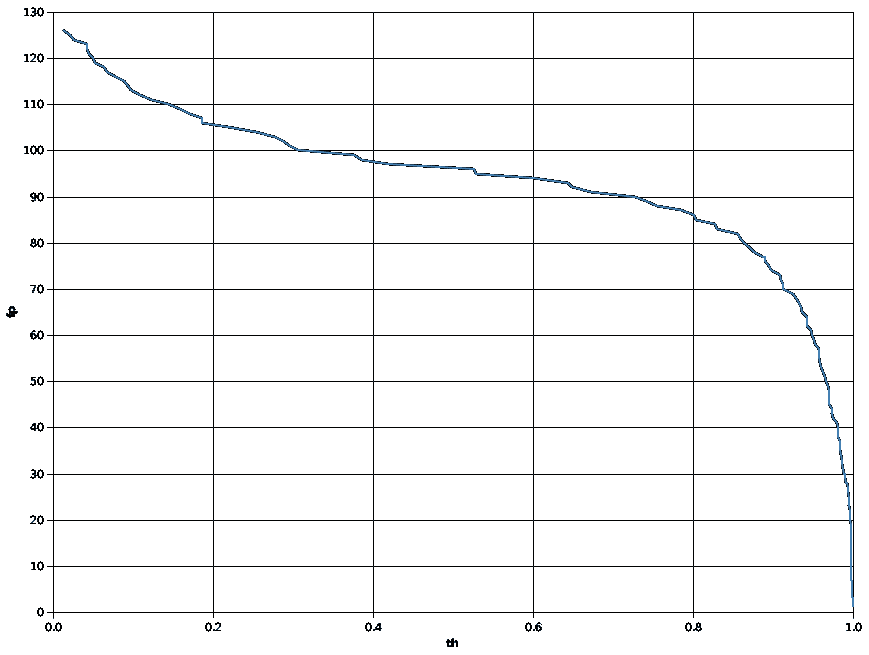

图 22：在[0.0, 1.0]范围内的假正例数量随不同预测阈值变化

然后，轮到绘制真实负例了：

```py
Vegas("tn", width = 800, height = 600).withDataFrame(rows3.toDF).mark(Line).encodeX("th", Quantitative).encodeY("tn", Quantitative).show
>>>
```

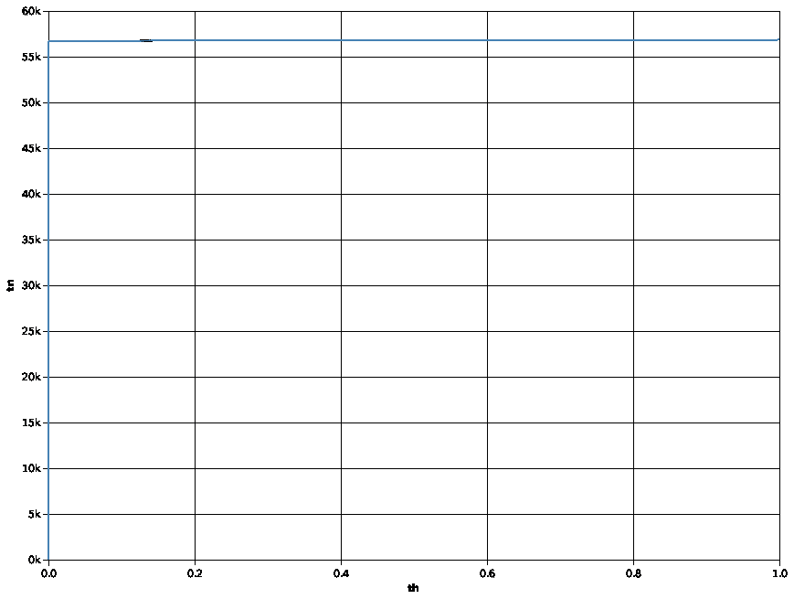

图 23：在[0.0, 1.0]范围内的假正例数量随不同预测阈值变化

最后，让我们绘制假负例的图，如下所示：

```py
Vegas("fn", width = 800, height = 600).withDataFrame(rows3.toDF).mark(Line).encodeX("th", Quantitative).encodeY("fn", Quantitative).show
>>>
```

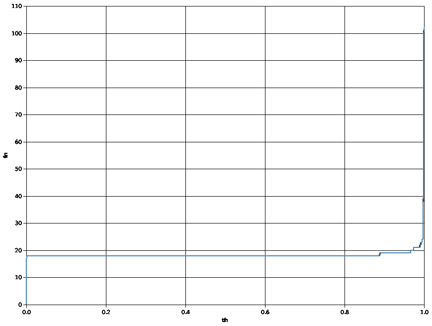

图 24：在[0.0, 1.0]范围内的假正例数量随不同预测阈值变化

因此，前面的图表告诉我们，当我们将预测阈值从默认的 0.5 提高到 0.6 时，我们可以增加正确分类的非欺诈性案例的数量，而不会丧失正确分类的欺诈性案例。

# 第 11 步 - 停止 Spark 会话和 H2O 上下文

最后，停止 Spark 会话和 H2O 上下文。以下的`stop()`方法调用将分别关闭 H2O 上下文和 Spark 集群：

```py
h2oContext.stop(stopSparkContext = true)
spark.stop()
```

第一种尤其重要，否则有时它不会停止 H2O 流动，但仍然占用计算资源。

# 辅助类和方法

在之前的步骤中，我们看到了一些类或方法，这里也应该进行描述。第一个方法名为`toCategorical()`，它将 Frame 列从 String/Int 转换为枚举类型；用于将`dayTime`袋（即`gr1`、`gr2`、`gr3`、`gr4`）转换为类似因子的类型。该函数也用于将`Class`列转换为因子类型，以便执行分类：

```py
def toCategorical(f: Frame, i: Int): Unit = {
    f.replace(i, f.vec(i).toCategoricalVec)
    f.update()
    }
```

这个方法根据一个阈值构建异常检测的混淆矩阵，如果实例被认为是异常的（如果其 MSE 超过给定阈值）：

```py
def confusionMat(mSEs:water.fvec.Frame,actualFrame:water.fvec.Frame,thresh: Double):Array[Array[Int]] = {
 val actualColumn = actualFrame.vec("Class");
 val l2_test = mSEs.anyVec();
 val result = Array.ofDimInt
 var i = 0
 var ii, jj = 0

 for (i <- 0 until l2_test.length().toInt) {
        ii = if (l2_test.at(i) > thresh) 1 else 0;
        jj = actualColumn.at(i).toInt
        result(ii)(jj) = result(ii)(jj) + 1
        }
    result
    }
```

除了这两个辅助方法外，我还定义了三个 Scala 案例类，用于计算精准度、召回率；灵敏度、特异度；真正例、假正例、真负例和假负例等。签名如下：

```py
caseclass r(precision: Double, recall: Double)
caseclass r2(sensitivity: Double, specificity: Double)
caseclass r3(tp: Double, fp: Double, tn: Double, fn: Double, th: Double)
```

# 超参数调优和特征选择

以下是通过调节超参数来提高准确度的一些方法，如隐藏层的数量、每个隐藏层中的神经元数、训练轮次（epochs）以及激活函数。当前基于 H2O 的深度学习模型实现支持以下激活函数：

+   `ExpRectifier`

+   `ExpRectifierWithDropout`

+   `Maxout`

+   `MaxoutWithDropout`

+   `Rectifier`

+   `RectifierWithDropout`

+   `Tanh`

+   `TanhWithDropout`

除了`Tanh`之外，我没有尝试其他激活函数用于这个项目。不过，你应该尝试一下。

使用基于 H2O 的深度学习算法的最大优势之一是我们可以获得相对的变量/特征重要性。在前面的章节中，我们已经看到，使用 Spark 中的随机森林算法也可以计算变量的重要性。因此，如果你的模型表现不好，可以考虑丢弃不重要的特征，并重新进行训练。

让我们来看一个例子；在*图 13*中，我们已经看到在自动编码器的无监督训练中最重要的特征。现在，在监督训练过程中也可以找到特征的重要性。我在这里观察到的特征重要性：

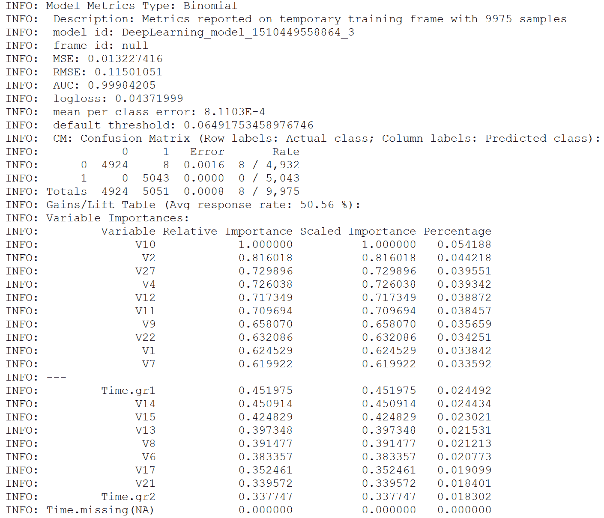

图 25：不同预测阈值下的假正例，范围为[0.0, 1.0]

因此，从*图 25*中可以观察到，特征 Time、`V21`、`V17`和`V6`的重要性较低。那么为什么不将它们去除，再进行训练，看看准确率是否有所提高呢？

然而，网格搜索或交叉验证技术仍然可能提供更高的准确率。不过，我将把这个决定留给你。

# 总结

在本章中，我们使用了一个数据集，该数据集包含了超过 284,807 个信用卡使用实例，并且每笔交易中只有 0.172%的交易是欺诈性的。我们已经看到如何使用自编码器来预训练分类模型，以及如何应用异常检测技术来预测可能的欺诈交易，尤其是在高度不平衡的数据中——也就是说，我们期望欺诈案件在整个数据集中是异常值。

我们的最终模型现在正确识别了 83%的欺诈案件和几乎 100%的非欺诈案件。然而，我们已经了解了如何使用异常检测来识别离群值，一些超参数调整的方法，最重要的是，特征选择。

**循环神经网络**（**RNN**）是一类人工神经网络，其中单元之间的连接形成一个有向循环。RNN 利用来自过去的信息，这样它们就能在具有高时间依赖性的数据中做出预测。这会创建一个网络的内部状态，使其能够展示动态的时间行为。

RNN 接收多个输入向量进行处理，并输出其他向量。与经典方法相比，使用带有**长短期记忆单元**（**LSTM**）的 RNN 几乎不需要特征工程。数据可以直接输入到神经网络中，神经网络就像一个黑箱，能够正确建模问题。就预处理的数据量而言，这里的方法相对简单。

在下一章，我们将看到如何使用名为**LSTM**的循环神经网络（RNN）实现，开发一个**人类活动识别**（**HAR**）的机器学习项目，使用的是智能手机数据集。简而言之，我们的机器学习模型将能够从六个类别中分类运动类型：走路、走楼梯、下楼梯、坐着、站立和躺下。
