# 第十章：使用循环神经网络进行人类活动识别

**循环神经网络**（**RNN**）是一类人工神经网络，其中单元之间的连接形成一个有向循环。RNN 利用过去的信息，这样它们就能够对具有高时间依赖性的数据进行预测。这会创建一个网络的内部状态，使其能够表现出动态的时间行为。

RNN 接受多个输入向量进行处理并输出其他向量。与传统方法相比，使用带有**长短期记忆**单元（**LSTM**）的 RNN 几乎不需要，或者只需极少的特征工程。数据可以直接输入到神经网络中，神经网络像一个黑盒子一样，正确地建模问题。这里的方法在预处理数据的多少上相对简单。

在本章中，我们将看到如何使用 RNN 实现开发机器学习项目，这种实现称为 LSTM，用于**人类活动识别**（**HAR**），并使用智能手机数据集。简而言之，我们的机器学习模型将能够从六个类别中分类运动类型：走路、走楼梯、下楼梯、坐着、站立和躺下。

简而言之，在这个从头到尾的项目中，我们将学习以下主题：

+   使用循环神经网络

+   RNN 的长期依赖性和缺点

+   开发用于人类活动识别的 LSTM 模型

+   调优 LSTM 和 RNN

+   摘要

# 使用 RNN

在本节中，我们首先将提供一些关于 RNN 的背景信息。然后，我们将强调传统 RNN 的一些潜在缺点。最后，我们将看到一种改进的 RNN 变体——LSTM，来解决这些缺点。

# RNN 的背景信息及其架构

人类不会从零开始思考；人类思维有所谓的**记忆持久性**，即将过去的信息与最近的信息关联起来的能力。而传统的神经网络则忽略了过去的事件。例如，在电影场景分类器中，神经网络无法使用过去的场景来分类当前的场景。RNN 的出现是为了解决这个问题：

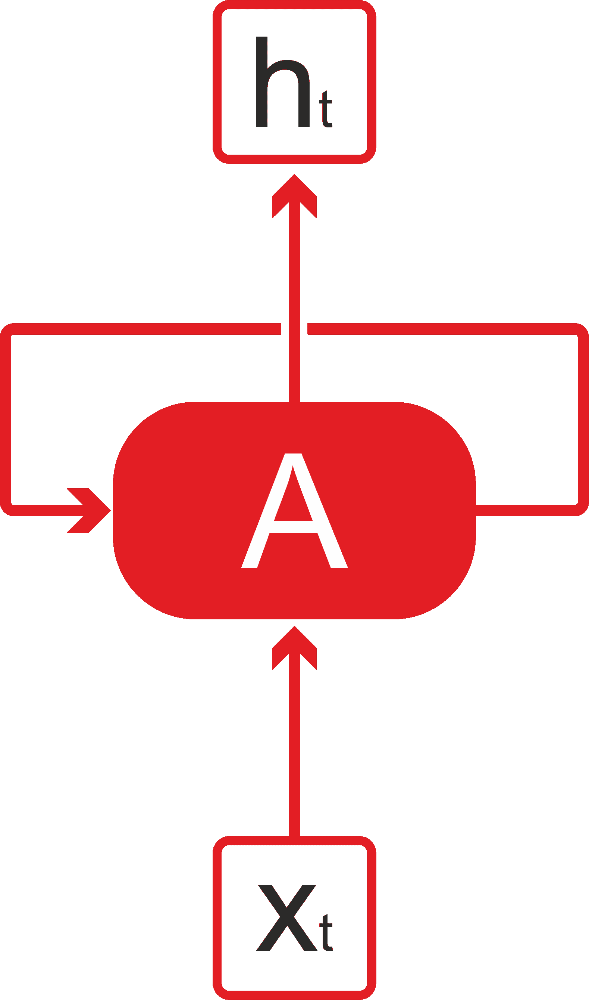

图 1：RNN 具有循环结构

与传统神经网络不同，RNN 是带有循环的网络，允许信息保持（*图 1*）。在一个神经网络中，比如**A**：在某个时刻**t**，输入**x[t]**并输出一个值**h[t]**。因此，从*图 1*来看，我们可以把 RNN 看作是多个相同网络的副本，每个副本将信息传递给下一个副本。如果我们展开之前的网络，会得到什么呢？嗯，下面的图给出了些许启示：

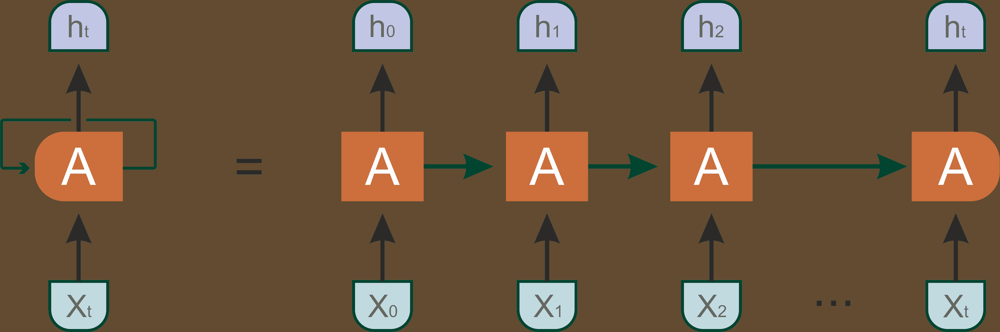

图 2：图 1 中表示的同一 RNN 的展开表示

然而，前面的展开图并没有提供关于 RNN 的详细信息。相反，RNN 与传统神经网络不同，因为它引入了一个过渡权重**W**，用于在时间之间传递信息。RNN 一次处理一个顺序输入，更新一种包含所有过去序列元素信息的向量状态。下图展示了一个神经网络，它将**X(t)**的值作为输入，然后输出**Y(t)**的值：

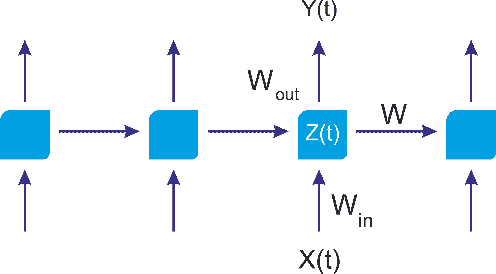

图 3：一个 RNN 架构可以利用网络的先前状态来发挥优势

如*图 1*所示，神经网络的前半部分通过函数*Z(t) = X(t) * W[in]* 表示，神经网络的后半部分则呈现为*Y(t)= Z(t) * W[out]*。如果你愿意，整个神经网络就是函数*Y(t) = (X(t) * W*[in]*) * W*[out]*。

在每个时间点*t*，调用已学习的模型，这种架构没有考虑之前运行的知识。这就像只看当天数据来预测股市趋势。一个更好的方法是利用一周或几个月的数据中的总体模式：

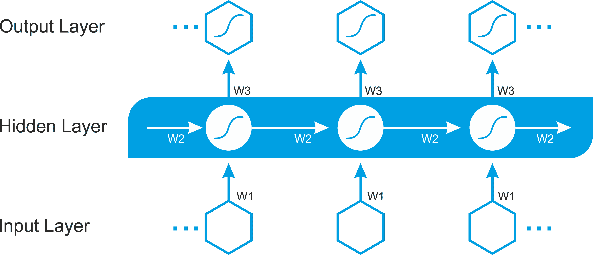

图 4：一个 RNN 架构，其中所有层中的所有权重都需要随着时间学习

一个更为明确的架构可以在*图 4*中找到，其中时间共享的权重**w2**（用于隐藏层）必须在**w1**（用于输入层）和**w3**（用于输出层）之外进行学习。

难以置信的是，在过去的几年里，RNN 已被用于各种问题，如语音识别、语言建模、翻译和图像描述。

# RNN 和长期依赖问题

RNN 非常强大，也很流行。然而，我们通常只需要查看最近的信息来执行当前任务，而不是很久以前存储的信息。这在自然语言处理中（NLP）进行语言建模时尤为常见。让我们来看一个常见的例子：

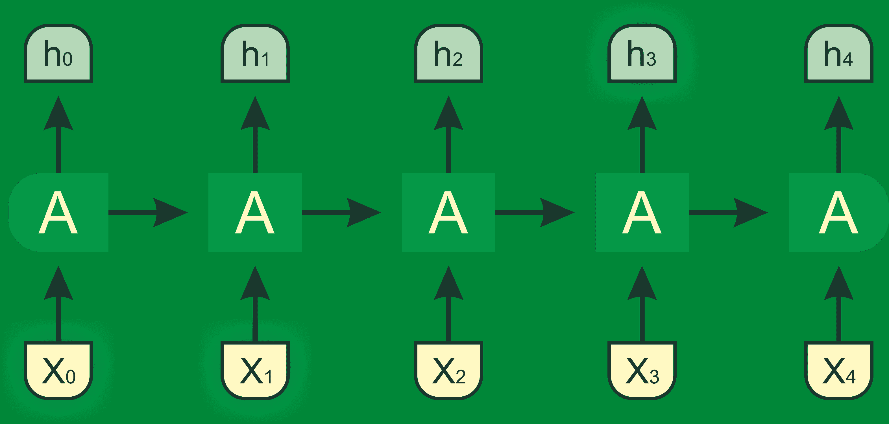

图 5：如果相关信息与所需位置之间的间隙较小，RNN 可以学会利用过去的信息

假设一个语言模型试图基于先前的单词预测下一个单词。作为人类，如果我们试图预测*the sky is blue*中的最后一个词，在没有进一步上下文的情况下，我们最可能预测下一个词是*blue*。在这种情况下，相关信息与位置之间的间隙较小。因此，RNN 可以轻松学习使用过去的信息。

但是考虑一个更长的句子：*Asif 在孟加拉国长大……他在韩国学习……他讲一口流利的孟加拉语*，我们需要更多的上下文。在这个句子中，最新的信息告诉我们，下一个单词可能是某种语言的名称。然而，如果我们想要缩小是哪种语言，我们需要从前面的词汇中得到*孟加拉国*的上下文：

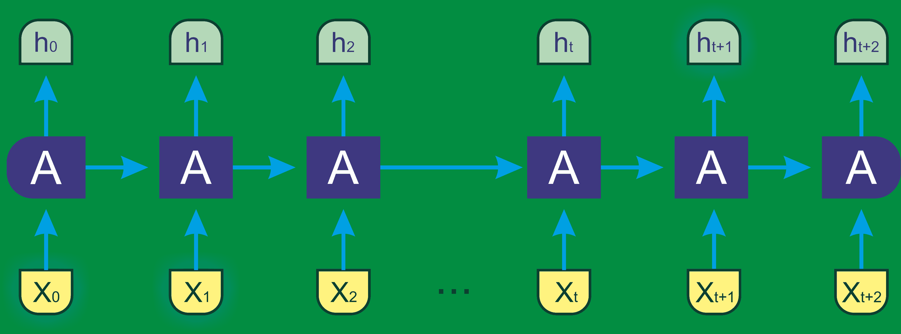

图 6：当相关信息和所需位置之间的间隔较大时，RNNs 无法学会使用过去的信息

在这里，信息间的间隙更大，因此 RNNs 变得无法学习到这些信息。这是 RNN 的一个严重缺点。然而，LSTM 出现并拯救了这一局面。

# LSTM 网络

一种 RNN 模型是**LSTM**。LSTM 的具体实现细节不在本书的范围内。LSTM 是一种特殊的 RNN 架构，最初由 Hochreiter 和 Schmidhuber 在 1997 年提出。这种类型的神经网络最近在深度学习领域被重新发现，因为它避免了梯度消失问题，并提供了出色的结果和性能。基于 LSTM 的网络非常适合时间序列的预测和分类，正在取代许多传统的深度学习方法。

这个名字很有趣，但它的意思正如其字面所示。这个名字表明短期模式在长期内不会被遗忘。LSTM 网络由相互连接的单元（LSTM 块）组成。每个 LSTM 块包含三种类型的门控：输入门、输出门和遗忘门，分别实现写入、读取和重置单元记忆的功能。这些门控不是二进制的，而是模拟的（通常由一个 sigmoid 激活函数管理，映射到范围(0, 1)，其中 0 表示完全抑制，1 表示完全激活）。

如果你把 LSTM 单元看作一个黑箱，它的使用方式与基本单元非常相似，唯一不同的是它的表现会更好；训练过程会更快收敛，而且它能够检测数据中的长期依赖关系。那么，LSTM 单元是如何工作的呢？一个基本的 LSTM 单元架构如*图 7*所示：

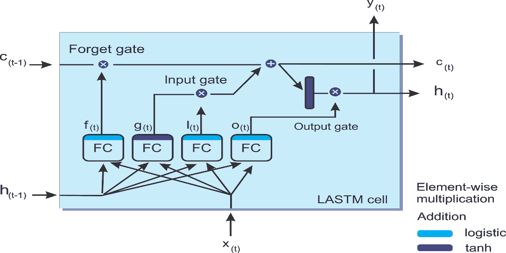

图 7：LSTM 单元的框图

现在，让我们看看这个架构背后的数学符号。如果我们不看 LSTM 箱子内部的内容，LSTM 单元本身看起来就像一个普通的存储单元，唯一的区别是它的状态被分成两个向量，**h(t)** 和 **c(t)**：

+   **c** 是单元

+   **h(t)** 是短期状态

+   **c(t)** 是长期状态

现在让我们打开这个盒子！关键思想是，网络可以学习在长期状态中存储什么，丢弃什么，以及从中读取什么。当长期状态**c[(t-1)]**从左到右遍历网络时，你会看到它首先经过一个遗忘门，丢弃一些记忆，然后通过加法操作（将输入门选择的记忆添加进去）加入一些新的记忆。最终得到的**c(t)**直接输出，不经过进一步的转换。

因此，在每个时间戳，某些记忆被丢弃，某些记忆被添加。此外，在加法操作后，长期状态会被复制并通过**tanh**函数，然后结果会被输出门过滤。这产生了短期状态**h(t)**（即该时间步的单元输出**y(t)**）。现在让我们看看新记忆是从哪里来的，以及门是如何工作的。首先，将当前输入向量**x(t)**和前一个短期状态**h(t-1)**送入四个不同的全连接层。

这些门的存在使得 LSTM 单元可以在无限时间内记住信息；如果输入门低于激活阈值，单元将保留之前的状态；如果当前状态被启用，它将与输入值结合。如其名所示，遗忘门会重置单元的当前状态（当其值清零时），而输出门决定是否必须执行单元的值。以下方程用于执行 LSTM 计算，得到单元在每个时间步的长期状态、短期状态和输出：


在前面的方程中，*W[xi]*、*W[xf]*、*W[xo]*和*W[xg]*是每一层的权重矩阵，用于连接输入向量*x[(t)]*。另一方面，*W[hi]*、*W[hf]*、*W[ho]*和*W[hg]*是每一层的权重矩阵，用于连接前一个短期状态*h[(t-1)]*。最后，*b[i]*、*b[f]*、*b[o]*和*b[g]*是每一层的偏置项。

既然我们已经了解了这些，那么 RNN 和 LSTM 网络是如何工作的呢？是时候动手实践了。我们将开始实现一个基于 MXNet 和 Scala 的 LSTM 模型来进行 HAR。

# 使用 LSTM 模型的人类活动识别

**人类活动识别**（**HAR**）数据库是通过记录 30 名研究参与者执行**日常生活活动**（**ADL**）时佩戴带有惯性传感器的腰部智能手机的活动数据构建的。目标是将活动分类为执行的六种活动之一。

# 数据集描述

实验是在一组 30 名志愿者中进行的，年龄范围为 19 至 48 岁。每个人完成了六项活动，即走路、走楼梯、下楼、坐着、站立和躺下，佩戴的设备是三星 Galaxy S II 智能手机，固定在腰部。通过加速度计和陀螺仪，作者以 50 Hz 的恒定速率捕获了三轴线性加速度和三轴角速度。

仅使用了两个传感器，即加速度计和陀螺仪。传感器信号通过应用噪声滤波器进行预处理，然后在 2.56 秒的固定宽度滑动窗口中采样，重叠 50%。这意味着每个窗口有 128 个读数。通过 Butterworth 低通滤波器将来自传感器加速度信号的重力和身体运动分量分离为身体加速度和重力。

欲了解更多信息，请参考以下论文：Davide Anguita, Alessandro Ghio, Luca Oneto, Xavier Parra 和 Jorge L. Reyes-Ortiz。 *使用智能手机的人体活动识别的公开数据集*。*第 21 届欧洲人工神经网络、计算智能与机器学习研讨会，ESANN* 2013。比利时布鲁日，2013 年 4 月 24 日至 26 日。

为简便起见，假设重力只包含少数但低频的分量。因此，使用了 0.3 Hz 截止频率的滤波器。从每个窗口中，通过计算时间和频域的变量，得出了一个特征向量。

实验已通过视频录制，手动标注数据。获得的数据集已随机划分为两个集合，其中 70%的志愿者用于生成训练数据，30%用于生成测试数据。现在，当我浏览数据集时，训练集和测试集具有以下文件结构：

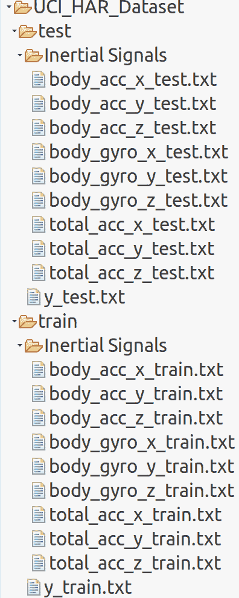

图 8：HAR 数据集文件结构

数据集中的每个记录提供以下内容：

+   来自加速度计的三轴加速度和估计的身体加速度

+   来自陀螺仪传感器的三轴角速度

+   一个包含时间和频域变量的 561 特征向量

+   它的活动标签

+   执行实验的主体的标识符

现在我们知道需要解决的问题，是时候探索技术和相关挑战了。正如我之前所说，我们将使用基于 MXNet 的 LSTM 实现。你可能会问：为什么我们不使用 H2O 或 DeepLearning4j？嗯，答案是这两者要么没有基于 LSTM 的实现，要么无法应用于解决这个问题。

# 设置和配置 Scala 中的 MXNet

Apache MXNet 是一个灵活高效的深度学习库。构建一个高性能的深度学习库需要做出许多系统级设计决策。在这篇设计说明中，我们分享了在设计 MXNet 时所做的具体选择的理由。我们认为这些见解可能对深度学习实践者以及其他深度学习系统的构建者有所帮助。

对于这个项目，我们将需要不同的包和库：Scala、Java、OpenBLAS、ATLAS、OpenCV，最重要的，还有 MXNet。现在让我们一步步地开始配置这些工具。对于 Java 和 Scala，我假设你已经配置好了 Java 和 Scala。接下来的任务是安装构建工具和`git`，因为我们将使用来自 GitHub 仓库的 MXNet。只需要在 Ubuntu 上执行以下命令：

```py
$ sudo apt-get update 
$ sudo apt-get install -y build-essential git 
```

然后，我们需要安装 OpenBLAS 和 ATLAS。这些库是 MXNet 进行线性代数运算时所必需的。要安装它们，只需执行以下命令：

```py
$ sudo apt-get install -y libopenblas-dev 
$ sudo apt-get install -y libatlas-base-dev 
```

我们还需要安装 OpenCV 进行图像处理。让我们通过执行以下命令来安装它：

```py
 $ sudo apt-get install -y libopencv-dev 
```

最后，我们需要生成预构建的 MXNet 二进制文件。为此，我们需要克隆并构建 MXNet 的 Scala 版本：

```py
$ git clone --recursive https://github.com/apache/incubator-mxnet.git mxnet --branch 0.12.0 
$ cd mxnet 
$ make -j $(nproc) USE_OPENCV=1 USE_BLAS=openblas 
$ make scalapkg 
$ make scalainsta 
```

现在，如果前面的步骤顺利进行，MXNet 的预构建二进制文件将在`/home/$user_name/mxnet/scala-package/assembly/linux-x86_64-cpu`（如果配置了 GPU，则为`linux-x86_64-gpu`，在 macOS 上为`osx-x86_64-cpu`）中生成。请看一下 Ubuntu 上的 CPU 截图：

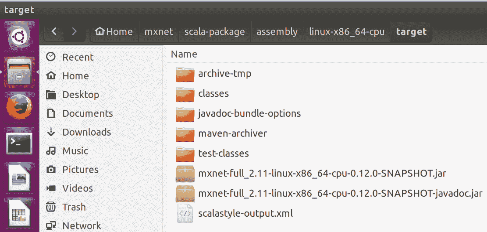

图 9：生成的 MXNet 预构建二进制文件

现在，开始编写 Scala 代码之前（在 Eclipse 或 IntelliJ 中作为 Maven 或 SBT 项目），下一步任务是将这个 JAR 文件包含到构建路径中。此外，我们还需要一些额外的依赖项来支持 Scala 图表和`args4j`：

```py
<dependency>
    <groupId>org.sameersingh.scalaplot</groupId>
    <artifactId>scalaplot</artifactId>
    <version>0.0.4</version>
</dependency>
<dependency>
    <groupId>args4j</groupId>
    <artifactId>args4j</artifactId>
    <version>2.0.29</version>
</dependency>
```

做得好！一切准备就绪，我们可以开始编码了！

# 实现一个用于 HAR 的 LSTM 模型

整体算法（`HumanAR.scala`）的工作流程如下：

+   加载数据

+   定义超参数

+   使用命令式编程和超参数设置 LSTM 模型

+   应用批处理训练，即选择批量大小的数据，将其输入模型，然后在若干次迭代中评估模型，打印批次损失和准确率

+   输出训练和测试误差的图表

前面的步骤可以通过管道方式进行跟踪和构建：

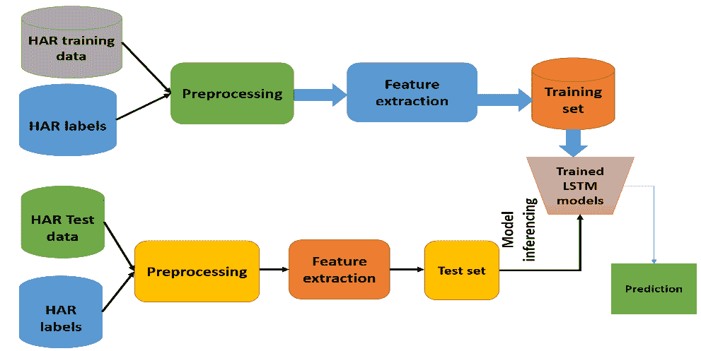

图 10：生成的 MXNet 预构建二进制文件

现在让我们一步一步地开始实现。确保你理解每一行代码，然后将给定的项目导入到 Eclipse 或 SBT 中。

# 步骤 1 - 导入必要的库和包

现在开始编码吧。我们从最基础的开始，也就是导入库和包：

```py
package com.packt.ScalaML.HAR 

import ml.dmlc.mxnet.Context 
import LSTMNetworkConstructor.LSTMModel 
import scala.collection.mutable.ArrayBuffer 
import ml.dmlc.mxnet.optimizer.Adam 
import ml.dmlc.mxnet.NDArray 
import ml.dmlc.mxnet.optimizer.RMSProp 
import org.sameersingh.scalaplot.MemXYSeries 
import org.sameersingh.scalaplot.XYData 
import org.sameersingh.scalaplot.XYChart 
import org.sameersingh.scalaplot.Style._ 
import org.sameersingh.scalaplot.gnuplot.GnuplotPlotter 
import org.sameersingh.scalaplot.jfreegraph.JFGraphPlotter  
```

# 步骤 2 - 创建 MXNet 上下文

然后我们为基于 CPU 的计算创建一个 MXNet 上下文。由于我是在使用 CPU，所以我为 CPU 实例化了它。如果你已经配置了 GPU，可以通过提供设备 ID 来使用 GPU：

```py
// Retrieves the name of this Context object 
val ctx = Context.cpu() 
```

# 第 3 步 - 加载和解析训练集与测试集

现在让我们加载数据集。我假设你已经将数据集复制到`UCI_HAR_Dataset/`目录下。然后，还需要将其他数据文件放在之前描述的地方：

```py
val datasetPath = "UCI_HAR_Dataset/" 
val trainDataPath = s"$datasetPath/train/Inertial Signals" 
val trainLabelPath = s"$datasetPath/train/y_train.txt" 
val testDataPath = s"$datasetPath/test/Inertial Signals" 
val testLabelPath = s"$datasetPath/test/y_test.txt" 
```

现在是时候分别加载训练集和测试集了。为此，我写了两个方法，分别是`loadData()`和`loadLabels()`，它们位于`Utils.scala`文件中。这两个方法及其签名稍后会提供：

```py
val trainData = Utils.loadData(trainDataPath, "train") 
val trainLabels = Utils.loadLabels(trainLabelPath) 
val testData = Utils.loadData(testDataPath, "test") 
val testLabels = Utils.loadLabels(testLabelPath) 
```

`loadData()`方法加载并映射来自每个`.txt`文件的数据，基于`INPUT_SIGNAL_TYPES`数组中定义的输入信号类型，格式为`Array[Array[Array[Float]]]`：

```py
def loadData(dataPath: String, name: String): Array[Array[Array[Float]]] = { 
    val dataSignalsPaths = INPUT_SIGNAL_TYPES.map( signal => s"$dataPath/${signal}${name}.txt" ) 
    val signals = dataSignalsPaths.map { path =>  
      Source.fromFile(path).mkString.split("n").map { line =>  
        line.replaceAll("  ", " ").trim().split(" ").map(_.toFloat) } 
    } 

    val inputDim = signals.length 
    val numSamples = signals(0).length 
    val timeStep = signals(0)(0).length   

    (0 until numSamples).map { n =>  
      (0 until timeStep).map { t => 
        (0 until inputDim).map( i => signals(i)(n)(t) ).toArray 
      }
    .toArray 
    }
    .toArray 
  } 
```

如前所述，`INPUT_SIGNAL_TYPES`包含了一些有用的常量：它们是神经网络的独立、归一化输入特征：

```py
private val INPUT_SIGNAL_TYPES = Array( 
    "body_acc_x_", 
    "body_acc_y_", 
    "body_acc_z_", 
    "body_gyro_x_", 
    "body_gyro_y_", 
    "body_gyro_z_", 
    "total_acc_x_", 
    "total_acc_y_", 
    "total_acc_z_") 
```

另一方面，`loadLabels()`也是一个用户定义的方法，用于仅加载训练集和测试集中的标签：

```py
def loadLabels(labelPath: String): Array[Float] = {          
       Source.fromFile(labelPath).mkString.split("n").map(_.toFloat - 1)
            } 
```

标签在另一个数组中定义，如以下代码所示：

```py
// Output classes: used to learn how to classify 
private val LABELS = Array( 
    "WALKING",  
    "WALKING_UPSTAIRS",  
    "WALKING_DOWNSTAIRS",  
    "SITTING",  
    "STANDING",  
    "LAYING") 
```

# 第 4 步 - 数据集的探索性分析

现在，让我们来看一些关于训练系列数量的统计数据（如前所述，每个系列之间有 50%的重叠）、测试系列数量、每个系列的时间步数以及每个时间步的输入参数数量：

```py
val trainingDataCount = trainData.length // No. of training series  
val testDataCount = testData.length // No. of testing series 
val nSteps = trainData(0).length // No. of timesteps per series 
val nInput = trainData(0)(0).length // No. of input parameters per timestep 

println("Number of training series: "+ trainingDataCount) 
println("Number of test series: "+ testDataCount) 
println("Number of timestep per series: "+ nSteps) 
println("Number of input parameters per timestep: "+ nInput) 
>>>
```

输出结果是：

```py
Number of training series: 7352
Number of test series: 2947
Number of timestep per series: 128
Number of input parameters per timestep: 9
```

# 第 5 步 - 定义内部 RNN 结构和 LSTM 超参数

现在，让我们定义 LSTM 网络的内部神经网络结构和超参数：

```py
val nHidden = 128 // Number of features in a hidden layer  
val nClasses = 6 // Total classes to be predicted  

val learningRate = 0.001f 
val trainingIters = trainingDataCount * 100  // iterate 100 times on trainset: total 7352000 iterations 
val batchSize = 1500 
val displayIter = 15000  // To show test set accuracy during training 
val numLstmLayer = 3 
```

# 第 6 步 - LSTM 网络构建

现在，让我们使用前述参数和结构来设置 LSTM 模型：

```py
val model = LSTMNetworkConstructor.setupModel(nSteps, nInput, nHidden, nClasses, batchSize, ctx = ctx) 
```

在前述行中，`setupModel()`是完成此任务的方法。`getSymbol()`方法实际上构建了 LSTM 单元。稍后我们将看到它的签名。它接受序列长度、输入数量、隐藏层数量、标签数量、批次大小、LSTM 层数量、丢弃率 MXNet 上下文，并使用`LSTMModel`的 case 类构建 LSTM 模型：

```py
case class LSTMModel(exec: Executor, symbol: Symbol, data: NDArray, label: NDArray, argsDict: Map[String,                     NDArray], gradDict: Map[String, NDArray]) 
```

现在这是`setupModel()`的方法签名：

```py
def setupModel(seqLen: Int, nInput: Int, numHidden: Int, numLabel: Int, batchSize: Int, numLstmLayer: Int = 1, dropout: Float = 0f, ctx: Context = Context.cpu()): LSTMModel = { 
//get the symbolic model 
    val sym = LSTMNetworkConstructor.getSymbol(seqLen, numHidden, numLabel, numLstmLayer = numLstmLayer) 
    val argNames = sym.listArguments() 
    val auxNames = sym.listAuxiliaryStates() 
// defining the initial argument and binding them to the model 
    val initC = for (l <- 0 until numLstmLayer) yield (s"l${l}_init_c", (batchSize, numHidden)) 
    val initH = for (l <- 0 until numLstmLayer) yield (s"l${l}_init_h", (batchSize, numHidden)) 
    val initStates = (initC ++ initH).map(x => x._1 -> Shape(x._2._1, x._2._2)).toMap 
    val dataShapes = Map("data" -> Shape(batchSize, seqLen, nInput)) ++ initStates 
    val (argShapes, outShapes, auxShapes) = sym.inferShape(dataShapes) 

    val initializer = new Uniform(0.1f) 
    val argsDict = argNames.zip(argShapes).map { case (name, shape) => 
       val nda = NDArray.zeros(shape, ctx) 
       if (!dataShapes.contains(name) && name != "softmax_label") { 
         initializer(name, nda) 
       } 
       name -> nda 
    }.toMap 

    val argsGradDict = argNames.zip(argShapes) 
         .filter(x => x._1 != "softmax_label" && x._1 != "data") 
         .map( x => x._1 -> NDArray.zeros(x._2, ctx) ).toMap 

    val auxDict = auxNames.zip(auxShapes.map(NDArray.zeros(_, ctx))).toMap 
    val exec = sym.bind(ctx, argsDict, argsGradDict, "write", auxDict, null, null) 
    val data = argsDict("data") 
    val label = argsDict("softmax_label")  
    LSTMModel(exec, sym, data, label, argsDict, argsGradDict)
} 
```

在前述方法中，我们通过`getSymbol()`方法获得了深度 RNN 的符号模型，如下所示。我已经提供了详细的注释，并认为这些足以理解代码的工作流程：

```py
 private def getSymbol(seqLen: Int, numHidden: Int, numLabel: Int, numLstmLayer: Int = 1, 
                        dropout: Float = 0f): Symbol = {  
                //symbolic training and label variables 
                var inputX = Symbol.Variable("data") 
                val inputY = Symbol.Variable("softmax_label") 

                //the initial parameters and cells 
                var paramCells = Array[LSTMParam]() 
                var lastStates = Array[LSTMState]() 
                //numLstmLayer is 1  
                for (i <- 0 until numLstmLayer) { 
                    paramCells = paramCells :+ LSTMParam(i2hWeight =
                    Symbol.Variable(s"l${i}_i2h_weight"), 
                    i2hBias = Symbol.Variable(s"l${i}_i2h_bias"),                                                                                     
                    h2hWeight = Symbol.Variable(s"l${i}_h2h_weight"),                                                                                                                                   
                    h2hBias = Symbol.Variable(s"l${i}_h2h_bias")) 
                    lastStates = lastStates :+ LSTMState(c =
                    Symbol.Variable(s"l${i}_init_c"),                                                                      
                    h = Symbol.Variable(s"l${i}_init_h")) 
            } 
            assert(lastStates.length == numLstmLayer) 
            val lstmInputs = Symbol.SliceChannel()(inputX)(Map("axis" 
            > 1, "num_outputs" -> seqLen,       
            "squeeze_axis" -> 1)) 

            var hiddenAll = Array[Symbol]() 
            var dpRatio = 0f 
            var hidden: Symbol = null 

//for each one of the 128 inputs, create a LSTM Cell 
            for (seqIdx <- 0 until seqLen) { 
                  hidden = lstmInputs.get(seqIdx) 
// stack LSTM, where numLstmLayer is 1 so the loop will be executed only one time 
                  for (i <- 0 until numLstmLayer) { 
                        if (i == 0) dpRatio = 0f else dpRatio = dropout 
//for each one of the 128 inputs, create a LSTM Cell 
                        val nextState = lstmCell(numHidden, inData = hidden, 
                          prevState = lastStates(i), 
                          param = paramCells(i), 
                          seqIdx = seqIdx, layerIdx = i, dropout =
                        dpRatio) 
                    hidden = nextState.h // has no effect 
                    lastStates(i) = nextState // has no effect 
              } 
// adding dropout before softmax has no effect- dropout is 0 due to numLstmLayer == 1 
              if (dropout > 0f) hidden = Symbol.Dropout()()(Map("data" -> hidden, "p" -> dropout)) 
// store the lstm cells output layers 
                  hiddenAll = hiddenAll :+ hidden
    } 
```

总结一下，该算法使用 128 个 LSTM 单元并行工作，我将这 128 个单元连接起来并送入输出激活层。让我们来连接这些单元，输出结果：

```py
val finalOut = hiddenAll.reduce(_+_) 
```

然后我们将它们连接到一个输出层，该层对应 6 个标签：

```py
 val fc = Symbol.FullyConnected()()(Map("data" -> finalOut, "num_hidden" -> numLabel)) 
 //softmax activation against the label 
 Symbol.SoftmaxOutput()()(Map("data" -> fc, "label" -> inputY)) 
```

在前面的代码片段中，`LSTMState`和`LSTMParam`是两个案例类，用于定义每个 LSTM 单元的状态，后者接受构建 LSTM 单元所需的参数。最终案例类`LSTMState(c: Symbol, h: Symbol)`，`LSTMParam(i2hWeight: Symbol, i2hBias: Symbol, h2hWeight: Symbol, h2hBias: Symbol)`。

现在是讨论最重要的步骤——LSTM 单元构建的时候了。我们将使用一些图示和图例，如下图所示：

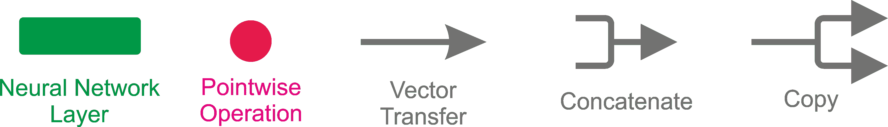

图 11：在接下来的内容中描述 LSTM 单元所用的图例

LSTM 中的重复模块包含四个相互作用的层，如下图所示：

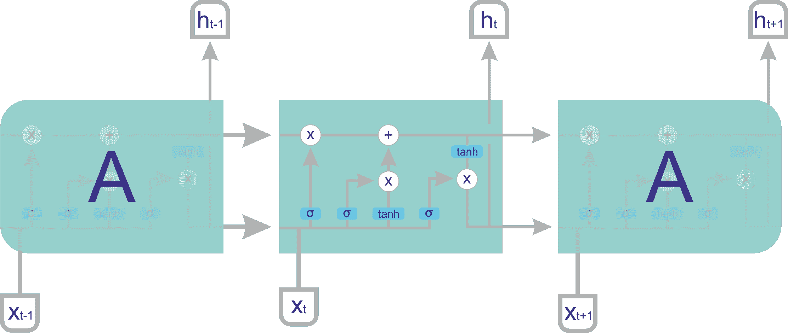

图 12：在 LSTM 单元内部，即 LSTM 中的重复模块包含四个相互作用的层

一个 LSTM 单元由其状态和参数定义，如前面两个案例类所定义：

+   **LSTM 状态**：**c**是单元状态（它的记忆知识），用于训练过程中，**h**是输出

+   **LSTM 参数**：通过训练算法进行优化

+   **i2hWeight**：输入到隐藏的权重

+   **i2hBias**：输入到隐藏的偏置

+   **h2hWeight**：隐藏到隐藏的权重

+   **h2hBias**：隐藏到隐藏的偏置

+   **i2h**：输入数据的神经网络

+   **h2h**：来自前一个**h**的神经网络

在代码中，两个全连接层已经创建、连接，并通过以下代码转换为四个副本。让我们添加一个大小为`numHidden * 4`（`numHidden`设置为 28）的隐藏层，它以`inputdata`作为输入：

```py
val i2h = Symbol.FullyConnected(s"t${seqIdx}_l${layerIdx}_i2h")()(Map("data" -> inDataa, "weight" ->                 param.i2hWeight, "bias" -> param.i2hBias, "num_hidden" -> numHidden * 4)) 
```

然后我们添加一个大小为`numHidden * 4`（`numHidden`设置为 28）的隐藏层，它以单元的先前输出作为输入：

```py
val h2h = Symbol.FullyConnected(s"t${seqIdx}_l${layerIdx}_h2h")()(Map("data" -> prevState.h,"weight" ->             param.h2hWeight,"bias" -> param.h2hBias,"num_hidden" -> numHidden * 4)) 
```

现在让我们将它们连接起来：

```py
val gates = i2h + h2h 
```

然后我们在计算门之前制作四个副本：

```py
val sliceGates = Symbol.SliceChannel(s"t${seqIdx}_l${layerIdx}_slice")(gates)(Map("num_outputs" -> 4)) 
```

然后我们计算各个门：

```py
val sliceGates = Symbol.SliceChannel(s"t${seqIdx}_l${layerIdx}_slice")(gates)(Map("num_outputs" -> 4)) 
```

现在，遗忘门的激活表示为以下代码：

```py
val forgetGate = Symbol.Activation()()(Map("data" -> sliceGates.get(2), "act_type" -> "sigmoid")) 
```

我们可以在以下图示中看到这一点：

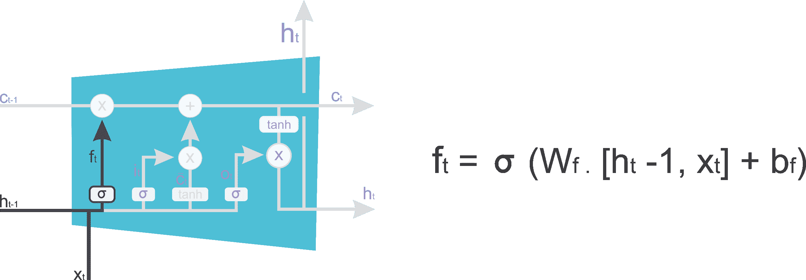

图 13：LSTM 单元中的遗忘门

现在，输入门和输入变换的激活表示为以下代码：

```py
val ingate = Symbol.Activation()()(Map("data" -> sliceGates.get(0), "act_type" -> "sigmoid"))   
val inTransform = Symbol.Activation()()(Map("data" -> sliceGates.get(1), "act_type" -> "tanh")) 
```

我们也可以在*图 14*中看到这一点：

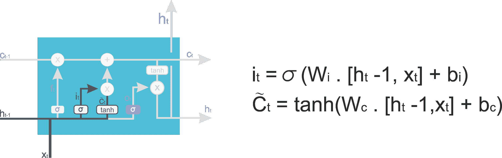

图 14：LSTM 单元中的输入门和变换门

下一个状态由以下代码定义：

```py
val nextC = (forgetGate * prevState.c) + (ingate * inTransform) 
```

前面的代码也可以用以下图示表示：

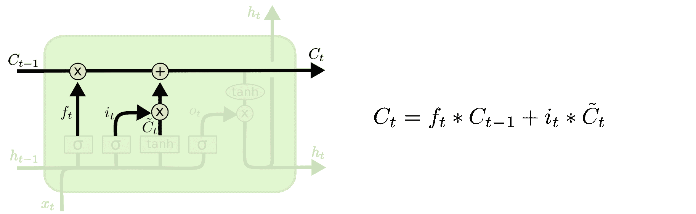

图 15：LSTM 单元中的下一个或转换门

最后，输出门可以用以下代码表示：

```py
val nextH = outGate * Symbol.Activation()()(Map("data" -> nextC, "act_type" -> "tanh")) 
```

前面的代码也可以用以下图示表示：

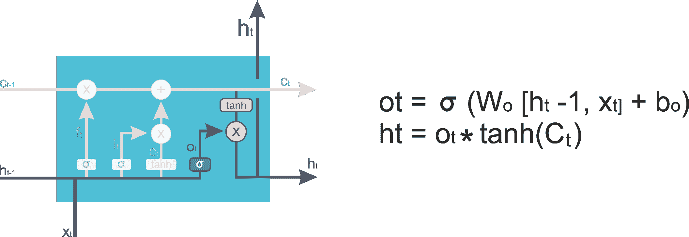

图 16：LSTM 单元中的输出门

太复杂了？没关系，这里我提供了该方法的完整代码：

```py
  // LSTM Cell symbol 
  private def lstmCell( numHidden: Int, inData: Symbol, prevState: LSTMState, param: LSTMParam, 
                        seqIdx: Int, layerIdx: Int, dropout: Float = 0f): LSTMState = { 
        val inDataa = { 
              if (dropout > 0f) Symbol.Dropout()()(Map("data" -> inData, "p" -> dropout)) 
              else inData 
                } 
        // add an hidden layer of size numHidden * 4 (numHidden set //to 28) that takes as input) 
        val i2h = Symbol.FullyConnected(s"t${seqIdx}_l${layerIdx}_i2h")()(Map("data" -> inDataa,"weight"                             -> param.i2hWeight,"bias" -> param.i2hBias,"num_hidden" -> numHidden * 4)) 
        // add an hidden layer of size numHidden * 4 (numHidden set to 28) that takes output of the cell  
        val h2h = Symbol.FullyConnected(s"t${seqIdx}_l${layerIdx}_h2h")()(Map("data" ->                                    prevState.h,"weight" -> param.h2hWeight,"bias" -> param.h2hBias,"num_hidden" -> numHidden * 4)) 

        //concatenate them                                        
        val gates = i2h + h2h  

        //make 4 copies of gates 
        val sliceGates=Symbol.SliceChannel(s"t${seqIdx}_l${layerIdx}_slice")(gates)(Map("num_outputs" 
       -> 4)) 
        // compute the gates 
        val ingate = Symbol.Activation()()(Map("data" -> sliceGates.get(0), "act_type" -> "sigmoid")) 
        val inTransform = Symbol.Activation()()(Map("data" -> sliceGates.get(1), "act_type" -> "tanh")) 
        val forgetGate = Symbol.Activation()()(Map("data" -> sliceGates.get(2), "act_type" -> "sigmoid")) 
        val outGate = Symbol.Activation()()(Map("data" -> sliceGates.get(3), "act_type" -> "sigmoid")) 
        // get the new cell state and the output 
        val nextC = (forgetGate * prevState.c) + (ingate * inTransform) 
        val nextH = outGate * Symbol.Activation()()(Map("data" -> nextC, "act_type" -> "tanh")) 
        LSTMState(c = nextC, h = nextH) 
  } 
```

# 步骤 7 - 设置优化器

正如许多研究人员所建议的，`RMSProp`优化器帮助 LSTM 网络快速收敛。因此，我也决定在这里使用它：

```py
val opt = new RMSProp(learningRate = learningRate) 
```

此外，待优化的模型参数是其所有参数，除了训练数据和标签（权重和偏置）：

```py
val paramBlocks = model.symbol.listArguments() 
      .filter(x => x != "data" && x != "softmax_label") 
      .zipWithIndex.map { case (name, idx) => 
        val state = opt.createState(idx, model.argsDict(name)) 
        (idx, model.argsDict(name), model.gradDict(name), state, name) 
      }
    .toArray 
```

# 第 8 步 - 训练 LSTM 网络

现在我们将开始训练 LSTM 网络。不过，在开始之前，我们先定义一些变量来跟踪训练的表现：

```py
val testLosses = ArrayBuffer[Float]() 
val testAccuracies = ArrayBuffer[Float]() 
val trainLosses = ArrayBuffer[Float]() 
val trainAccuracies = ArrayBuffer[Float]()     
```

然后，我们开始执行训练步骤，每次循环进行`batch_size`次迭代：

```py
var step = 1 
while (step * batchSize <= trainingIters) { 
    val (batchTrainData, batchTrainLabel) = { 
        val idx = ((step - 1) * batchSize) % trainingDataCount 
        if (idx + batchSize <= trainingDataCount) { 
          val datas = trainData.drop(idx).take(batchSize) 
          val labels = trainLabels.drop(idx).take(batchSize) 
          (datas, labels) 
        } else { 
          val right = (idx + batchSize) - trainingDataCount 
          val left = trainingDataCount - idx 
          val datas = trainData.drop(idx).take(left) ++ trainData.take(right) 
          val labels = trainLabels.drop(idx).take(left) ++ trainLabels.take(right) 
          (datas, labels) 
    }  
} 
```

不要偏离主题，但快速回顾一下*第 6 步*，我们在这里实例化了 LSTM 模型。现在是时候将输入和标签传递给 RNN 了：

```py
model.data.set(batchTrainData.flatten.flatten) 
model.label.set(batchTrainLabel) 
```

然后我们进行前向和后向传播：

```py
model.exec.forward(isTrain = true) 
model.exec.backward() 
```

此外，我们需要使用在*第 7 步*中定义的`RMSProp`优化器来更新参数：

```py
paramBlocks.foreach { 
 case (idx, weight, grad, state, name) => opt.update(idx, weight, grad, state) 
    } 
```

获取如训练误差（即训练数据上的损失和准确度）等指标也会非常有用：

```py
val (acc, loss) = getAccAndLoss(model.exec.outputs(0), batchTrainLabel) 
      trainLosses += loss / batchSize 
      trainAccuracies += acc / batchSize 
```

在前面的代码段中，`getAccAndLoss()`是一个计算损失和准确度的方法，具体实现如下：

```py
def getAccAndLoss(pred: NDArray, label: Array[Float], dropNum: Int = 0): (Float, Float) = { 
    val shape = pred.shape 
    val maxIdx = NDArray.argmax_channel(pred).toArray 
    val acc = { 
      val sum = maxIdx.drop(dropNum).zip(label.drop(dropNum)).foldLeft(0f){ case (acc, elem) =>  
        if (elem._1 == elem._2) acc + 1 else acc 
      } 
      sum 
    } 
    val loss = pred.toArray.grouped(shape(1)).drop(dropNum).zipWithIndex.map { case (array, idx) => 
        array(maxIdx(idx).toInt)   
      }.map(-Math.log(_)).sum.toFloat    
 (acc, loss)  
} 
```

此外，为了更快的训练，评估网络的某些步骤是很令人兴奋的：

```py
if ( (step * batchSize % displayIter == 0) || (step == 1) || (step * batchSize > trainingIters) ) { 
        println(s"Iter ${step * batchSize}, Batch Loss = ${"%.6f".format(loss / batchSize)}, 
        Accuracy = ${acc / batchSize}") 
    }
Iter 1500, Batch Loss = 1.189168, Accuracy = 0.14266667
 Iter 15000, Batch Loss = 0.479527, Accuracy = 0.53866667
 Iter 30000, Batch Loss = 0.293270, Accuracy = 0.83933336
 Iter 45000, Batch Loss = 0.192152, Accuracy = 0.78933334
 Iter 60000, Batch Loss = 0.118560, Accuracy = 0.9173333
 Iter 75000, Batch Loss = 0.081408, Accuracy = 0.9486667
 Iter 90000, Batch Loss = 0.109803, Accuracy = 0.9266667
 Iter 105000, Batch Loss = 0.095064, Accuracy = 0.924
 Iter 120000, Batch Loss = 0.087000, Accuracy = 0.9533333
 Iter 135000, Batch Loss = 0.085708, Accuracy = 0.966
 Iter 150000, Batch Loss = 0.068692, Accuracy = 0.9573333
 Iter 165000, Batch Loss = 0.070618, Accuracy = 0.906
 Iter 180000, Batch Loss = 0.089659, Accuracy = 0.908
 Iter 195000, Batch Loss = 0.088301, Accuracy = 0.87333333
 Iter 210000, Batch Loss = 0.067824, Accuracy = 0.9026667
 Iter 225000, Batch Loss = 0.060650, Accuracy = 0.9033333
 Iter 240000, Batch Loss = 0.045368, Accuracy = 0.93733335
 Iter 255000, Batch Loss = 0.049854, Accuracy = 0.96
 Iter 270000, Batch Loss = 0.062839, Accuracy = 0.968
 Iter 285000, Batch Loss = 0.052522, Accuracy = 0.986
 Iter 300000, Batch Loss = 0.060304, Accuracy = 0.98733336
 Iter 315000, Batch Loss = 0.049382, Accuracy = 0.9993333
 Iter 330000, Batch Loss = 0.052441, Accuracy = 0.9766667
 Iter 345000, Batch Loss = 0.050224, Accuracy = 0.9546667
 Iter 360000, Batch Loss = 0.057141, Accuracy = 0.9306667
 Iter 375000, Batch Loss = 0.047664, Accuracy = 0.938
 Iter 390000, Batch Loss = 0.047909, Accuracy = 0.93333334
 Iter 405000, Batch Loss = 0.043014, Accuracy = 0.9533333
 Iter 420000, Batch Loss = 0.054124, Accuracy = 0.952
 Iter 435000, Batch Loss = 0.044272, Accuracy = 0.95133334
 Iter 450000, Batch Loss = 0.058916, Accuracy = 0.96066666
 Iter 465000, Batch Loss = 0.072512, Accuracy = 0.9486667
 Iter 480000, Batch Loss = 0.080431, Accuracy = 0.94733334
 Iter 495000, Batch Loss = 0.072193, Accuracy = 0.9726667
 Iter 510000, Batch Loss = 0.068242, Accuracy = 0.972
 Iter 525000, Batch Loss = 0.057797, Accuracy = 0.964
 Iter 540000, Batch Loss = 0.063531, Accuracy = 0.918
 Iter 555000, Batch Loss = 0.068177, Accuracy = 0.9126667
 Iter 570000, Batch Loss = 0.053257, Accuracy = 0.9206667
 Iter 585000, Batch Loss = 0.058263, Accuracy = 0.9113333
 Iter 600000, Batch Loss = 0.054180, Accuracy = 0.90466666
 Iter 615000, Batch Loss = 0.051008, Accuracy = 0.944
 Iter 630000, Batch Loss = 0.051554, Accuracy = 0.966
 Iter 645000, Batch Loss = 0.059238, Accuracy = 0.9686667
 Iter 660000, Batch Loss = 0.051297, Accuracy = 0.9713333
 Iter 675000, Batch Loss = 0.052069, Accuracy = 0.984
 Iter 690000, Batch Loss = 0.040501, Accuracy = 0.998
 Iter 705000, Batch Loss = 0.053661, Accuracy = 0.96066666
 ter 720000, Batch Loss = 0.037088, Accuracy = 0.958
 Iter 735000, Batch Loss = 0.039404, Accuracy = 0.9533333
```

# 第 9 步 - 评估模型

做得好！我们已经完成了训练。现在如何评估测试集呢：

```py
 val (testLoss, testAcc) = test(testDataCount, batchSize, testData, testLabels, model)         
  println(s"TEST SET DISPLAY STEP:  Batch Loss = ${"%.6f".format(testLoss)}, Accuracy = $testAcc") 
        testAccuracies += testAcc 
        testLosses += testLoss 
      } 
      step += 1 
    }     
  val (finalLoss, accuracy) = test(testDataCount, batchSize, testData, testLabels, model) 
  println(s"FINAL RESULT: Batch Loss= $finalLoss, Accuracy= $accuracy") 
```

```py
TEST SET DISPLAY STEP: Batch Loss = 0.065859, Accuracy = 0.9138107
 TEST SET DISPLAY STEP: Batch Loss = 0.077047, Accuracy = 0.912114
 TEST SET DISPLAY STEP: Batch Loss = 0.069186, Accuracy = 0.90566677
 TEST SET DISPLAY STEP: Batch Loss = 0.059815, Accuracy = 0.93043774
 TEST SET DISPLAY STEP: Batch Loss = 0.064162, Accuracy = 0.9192399
 TEST SET DISPLAY STEP: Batch Loss = 0.063574, Accuracy = 0.9307771
 TEST SET DISPLAY STEP: Batch Loss = 0.060209, Accuracy = 0.9229725
 TEST SET DISPLAY STEP: Batch Loss = 0.062598, Accuracy = 0.9290804
 TEST SET DISPLAY STEP: Batch Loss = 0.062686, Accuracy = 0.9311164
 TEST SET DISPLAY STEP: Batch Loss = 0.059543, Accuracy = 0.9250085
 TEST SET DISPLAY STEP: Batch Loss = 0.059646, Accuracy = 0.9263658
 TEST SET DISPLAY STEP: Batch Loss = 0.062546, Accuracy = 0.92941976
 TEST SET DISPLAY STEP: Batch Loss = 0.061765, Accuracy = 0.9263658
 TEST SET DISPLAY STEP: Batch Loss = 0.063814, Accuracy = 0.9307771
 TEST SET DISPLAY STEP: Batch Loss = 0.062560, Accuracy = 0.9324737
 TEST SET DISPLAY STEP: Batch Loss = 0.061307, Accuracy = 0.93518835
 TEST SET DISPLAY STEP: Batch Loss = 0.061102, Accuracy = 0.93281305
 TEST SET DISPLAY STEP: Batch Loss = 0.054946, Accuracy = 0.9375636
 TEST SET DISPLAY STEP: Batch Loss = 0.054461, Accuracy = 0.9365456
 TEST SET DISPLAY STEP: Batch Loss = 0.050856, Accuracy = 0.9290804
 TEST SET DISPLAY STEP: Batch Loss = 0.050600, Accuracy = 0.9334917
 TEST SET DISPLAY STEP: Batch Loss = 0.057579, Accuracy = 0.9277231
 TEST SET DISPLAY STEP: Batch Loss = 0.062409, Accuracy = 0.9324737
 TEST SET DISPLAY STEP: Batch Loss = 0.050926, Accuracy = 0.9409569
 TEST SET DISPLAY STEP: Batch Loss = 0.054567, Accuracy = 0.94027823
 FINAL RESULT: Batch Loss= 0.0545671,
 Accuracy= 0.94027823
```

哇！我们成功达到了 94%的准确度，真是非常棒。在之前的代码中，`test()`是用来评估模型性能的方法。模型的签名如下所示：

```py
def test(testDataCount: Int, batchSize: Int, testDatas: Array[Array[Array[Float]]], 
      testLabels: Array[Float], model: LSTMModel): (Float, Float) = { 
    var testLoss, testAcc = 0f 
    for (begin <- 0 until testDataCount by batchSize) { 
      val (testData, testLabel, dropNum) = { 
        if (begin + batchSize <= testDataCount) { 
          val datas = testDatas.drop(begin).take(batchSize) 
          val labels = testLabels.drop(begin).take(batchSize) 
          (datas, labels, 0) 
        } else { 
          val right = (begin + batchSize) - testDataCount 
          val left = testDataCount - begin 
          val datas = testDatas.drop(begin).take(left) ++ testDatas.take(right) 
          val labels = testLabels.drop(begin).take(left) ++ testLabels.take(right) 
          (datas, labels, right) 
        } 
      } 
      //feed the test data to the deepNN 
      model.data.set(testData.flatten.flatten) 
      model.label.set(testLabel) 

      model.exec.forward(isTrain = false) 
      val (acc, loss) = getAccAndLoss(model.exec.outputs(0), testLabel) 
      testLoss += loss 
      testAcc += acc 
    } 
    (testLoss / testDataCount, testAcc / testDataCount) 
  } 
```

完成后，最好销毁模型以释放资源：

```py
model.exec.dispose() 
```

我们之前看到，在测试集上取得了高达 93%的准确率。那么，如何通过图形展示之前的准确度和误差呢：

```py
    // visualize 
    val xTrain = (0 until trainLosses.length * batchSize by batchSize).toArray.map(_.toDouble) 
    val yTrainL = trainLosses.toArray.map(_.toDouble) 
    val yTrainA = trainAccuracies.toArray.map(_.toDouble) 

    val xTest = (0 until testLosses.length * displayIter by displayIter).toArray.map(_.toDouble) 
    val yTestL = testLosses.toArray.map(_.toDouble) 
    val yTestA = testAccuracies.toArray.map(_.toDouble) 
    var series = new MemXYSeries(xTrain, yTrainL, "Train losses") 
    val data = new XYData(series)       
    series = new MemXYSeries(xTrain, yTrainA, "Train accuracies") 
    data += series 
    series = new MemXYSeries(xTest, yTestL, "Test losses") 
    data += series     
    series = new MemXYSeries(xTest, yTestA, "Test accuracies") 
    data += series 
    val chart = new XYChart("Training session's progress over iterations!", data) 
    chart.showLegend = true 
    val plotter = new JFGraphPlotter(chart)
    plotter.gui() 
>>>
```

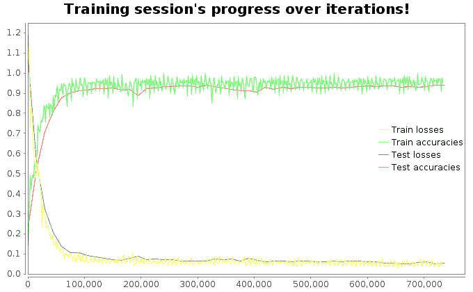

图 17：每次迭代的训练和测试损失及准确度

从前面的图表来看，很明显，经过几次迭代，我们的 LSTM 模型很好地收敛，并且产生了非常好的分类准确度。

# 调整 LSTM 超参数和 GRU

然而，我仍然相信，通过增加更多的 LSTM 层，能够达到接近 100%的准确率。以下是我仍然会尝试调整的超参数，以便查看准确度：

```py
// Hyper parameters for the LSTM training
val learningRate = 0.001f
val trainingIters = trainingDataCount * 1000 // Loop 1000 times on the dataset
val batchSize = 1500 // I would set it 5000 and see the performance
val displayIter = 15000 // To show test set accuracy during training
val numLstmLayer = 3 // 5, 7, 9 etc.
```

LSTM 单元有很多其他变种。其中一个特别流行的变种是**门控循环单元**（**GRU**）单元，它是 LSTM 的稍微变化形式。它还将单元状态和隐藏状态合并，并做了一些其他改动。结果模型比标准的 LSTM 模型更简单，并且越来越受欢迎。这个单元是 Kyunghyun Cho 等人在 2014 年的一篇论文中提出的，论文还介绍了我们之前提到的编码器-解码器网络。

对于这种类型的 LSTM，感兴趣的读者可以参考以下文献：

+   *使用 RNN 编码器-解码器进行统计机器翻译的学习短语表示*，K. Cho 等人（2014）。

+   Klaus Greff 等人于 2015 年发表的论文 *LSTM: A Search Space Odyssey*，似乎表明所有 LSTM 变体的表现大致相同。

从技术上讲，GRU 单元是 LSTM 单元的简化版，其中两个状态向量合并成一个叫做 **h(t)** 的向量。一个单一的门控制器控制着遗忘门和输入门。如果门控制器输出 1，输入门打开，遗忘门关闭：

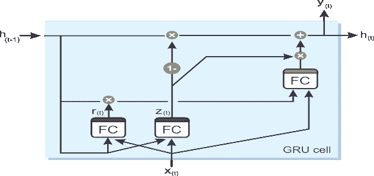

图 18：GRU 单元的内部结构

另一方面，如果输出为 0，则会发生相反的情况。每当需要存储记忆时，首先会清除它将被存储的位置，这实际上是 LSTM 单元的一种常见变体。第二个简化是，由于每个时间步都会输出完整的状态向量，因此没有输出门。然而，引入了一个新的门控制器，用来控制前一个状态的哪个部分会显示给主层。以下方程用于进行 GRU 单元在每个时间步长的长短期状态计算及输出：


LSTM 和 GRU 单元是近年来 RNN 成功的主要原因之一，尤其是在 NLP 应用中。

# 总结

在本章中，我们已经学习了如何使用 RNN 实现开发 ML 项目，并使用智能手机数据集进行 HAR 的 LSTM 模型。我们的 LSTM 模型能够从六个类别中分类运动类型：步行、走楼梯、下楼梯、坐着、站着和躺着。特别地，我们达到了 94% 的准确率。接着，我们讨论了如何通过使用 GRU 单元进一步提高准确性的一些可能方法。

**卷积神经网络**（**CNN**）是一种前馈神经网络，其中神经元之间的连接模式受到动物视觉皮层的启发。近年来，CNN 在复杂的视觉任务中表现出超越人类的性能，如图像搜索服务、自动驾驶汽车、自动视频分类、语音识别和 **自然语言处理**（**NLP**）。

考虑到这些，在下一章我们将看到如何开发一个端到端项目，使用基于 Scala 和 Deeplearning4j 框架的 CNN 来处理多标签（即每个实体可以属于多个类别）图像分类问题，并且使用真实的 Yelp 图像数据集。我们还将在开始之前讨论一些 CNN 的理论方面。更进一步地，我们将讨论如何调整超参数，以获得更好的分类结果。
