# 第十一章：使用卷积神经网络进行图像分类

到目前为止，我们还没有开发过任何用于图像处理任务的 **机器学习**（**ML**）项目。线性机器学习模型和其他常规 **深度神经网络**（**DNN**）模型，例如 **多层感知器**（**MLPs**）或 **深度置信网络**（**DBNs**），无法从图像中学习或建模非线性特征。

另一方面，**卷积神经网络**（**CNN**）是一种前馈神经网络，其中神经元之间的连接模式受到动物视觉皮层的启发。在过去的几年里，CNN 在复杂视觉任务中展现了超越人类的表现，例如图像搜索服务、自动驾驶汽车、自动视频分类、语音识别和 **自然语言处理**（**NLP**）。

在本章中，我们将看到如何基于 Scala 和 **Deeplearning4j**（**DL4j**）框架，使用真实的 **Yelp** 图像数据集开发一个端到端的多标签（即每个实体可以属于多个类别）图像分类项目。我们还将讨论一些 CNN 的理论方面，以及如何调整超参数以获得更好的分类结果，之后再开始实际操作。

简而言之，在这个端到端项目中，我们将学习以下主题：

+   常规 DNN 的缺点

+   CNN 架构：卷积操作和池化层

+   使用 CNN 进行图像分类

+   调整 CNN 超参数

# 图像分类和 DNN 的缺点

在我们开始开发基于 CNN 的图像分类端到端项目之前，我们需要进行一些背景学习，比如常规 DNN 的缺点、CNN 相较于 DNN 在图像分类中的适用性、CNN 的构建方式、CNN 的不同操作等。虽然常规 DNN 对于小尺寸图像（例如 MNIST、CIFAR-10）效果良好，但对于更大尺寸的图像，它会因为所需的巨大参数数量而崩溃。例如，一张 100 x 100 的图像有 10,000 个像素，如果第一层只有 1,000 个神经元（这已经极大限制了传递到下一层的信息量），那么就意味着总共有 1,000 万个连接。而这仅仅是第一层的情况。

CNN 通过使用部分连接层解决了这个问题。由于连续层之间仅部分连接，并且由于其权重的高度重用，CNN 的参数远少于完全连接的 DNN，这使得它训练速度更快，减少了过拟合的风险，并且需要的训练数据量更少。此外，当 CNN 学会了能够检测某一特征的卷积核时，它可以在图像的任何位置检测到该特征。相比之下，当 DNN 在某个位置学到一个特征时，它只能在该位置检测到该特征。由于图像通常具有非常重复的特征，CNN 在图像处理任务（如分类）中能够比 DNN 更好地进行泛化，并且只需较少的训练样本。

重要的是，DNN 并不事先了解像素是如何组织的；它不知道相邻的像素是彼此接近的。而 CNN 的架构则将这种先验知识嵌入其中。较低层通常识别图像的小区域中的特征，而较高层则将低级特征组合成更大的特征。这在大多数自然图像中效果很好，使 CNN 相比 DNN 具有决定性的优势：

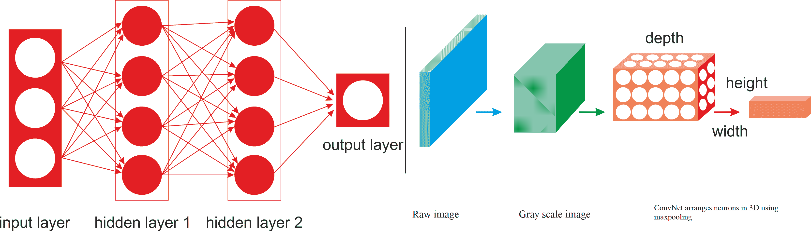

图 1：普通 DNN 与 CNN

例如，在*图 1*中，左侧显示了一个普通的三层神经网络。右侧，ConvNet 将它的神经元以三维（宽度、高度和深度）进行排列，如其中一层的可视化所示。ConvNet 的每一层将 3D 输入体积转换为 3D 输出体积的神经元激活。红色输入层承载着图像，因此它的宽度和高度就是图像的维度，而深度则是三（红色、绿色和蓝色通道）。

所以，我们之前看到的所有多层神经网络的层都是由一长串神经元组成的，在将输入图像或数据传递给神经网络之前，我们需要将其展平成 1D。但是，当你尝试直接将 2D 图像输入时会发生什么呢？答案是，在 CNN 中，每一层都是以 2D 形式表示的，这使得将神经元与它们对应的输入进行匹配变得更加容易。我们将在接下来的部分看到相关示例。

另一个重要的事实是，特征图中的所有神经元共享相同的参数，因此它显著减少了模型中的参数数量，但更重要的是，它意味着一旦 CNN 学会在某个位置识别某个模式，它就能够在任何其他位置识别该模式。相比之下，一旦普通的 DNN 学会在某个位置识别某个模式，它只能在那个特定位置识别该模式。

# CNN 架构

在多层网络中，例如 MLP 或 DBN，输入层所有神经元的输出都连接到隐藏层中的每个神经元，因此输出将再次作为输入传递给全连接层。而在 CNN 网络中，定义卷积层的连接方式有显著不同。卷积层是 CNN 中的主要层类型，每个神经元都连接到输入区域的某个区域，这个区域称为**感受野**。

在典型的 CNN 架构中，几个卷积层以级联样式连接，每一层后面跟着一个**整流线性单元**（**ReLU**）层，然后是一个池化层，再接几个卷积层（+ReLU），再接另一个池化层，如此循环。

每个卷积层的输出是一组由单个核过滤器生成的对象，称为**特征图**。这些特征图可以用来定义下一个层的输入。CNN 网络中的每个神经元都会生成一个输出，之后是一个激活阈值，该阈值与输入成比例，并且没有限制：

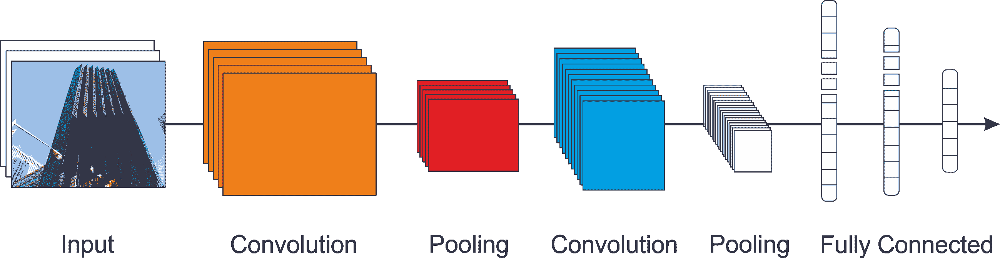

图 2：CNN 的概念架构

如*图 2*所示，池化层通常被放置在卷积层之后。然后，卷积区域会被池化层划分为子区域。接着，使用最大池化或平均池化技术选择一个代表性值，从而减少后续层的计算时间。

这样，特征相对于其空间位置的鲁棒性也得到了增强。更具体地说，当图像特性（作为特征图）通过网络时，它们随着网络的推进变得越来越小，但通常会变得更深，因为更多的特征图将被添加到网络中。在堆叠的顶部，加入了一个常规的前馈神经网络，就像 MLP 一样，可能由几层全连接层（+ReLUs）组成，最后一层输出预测结果，例如，softmax 层输出多类分类的估计类别概率。

# 卷积操作

卷积是一个数学运算，它将一个函数滑过另一个函数，并测量它们逐点相乘的积分。它与傅里叶变换和拉普拉斯变换有着深刻的联系，并广泛应用于信号处理。卷积层实际上使用的是互相关，它与卷积非常相似。

因此，CNN 的最重要组成部分是卷积层：第一卷积层中的神经元并不是与输入图像中的每一个像素相连接（如同前几章所述），而只是与它们感受野中的像素相连接——见*图 3*。反过来，第二卷积层中的每个神经元仅与第一层中位于小矩形区域内的神经元相连接：

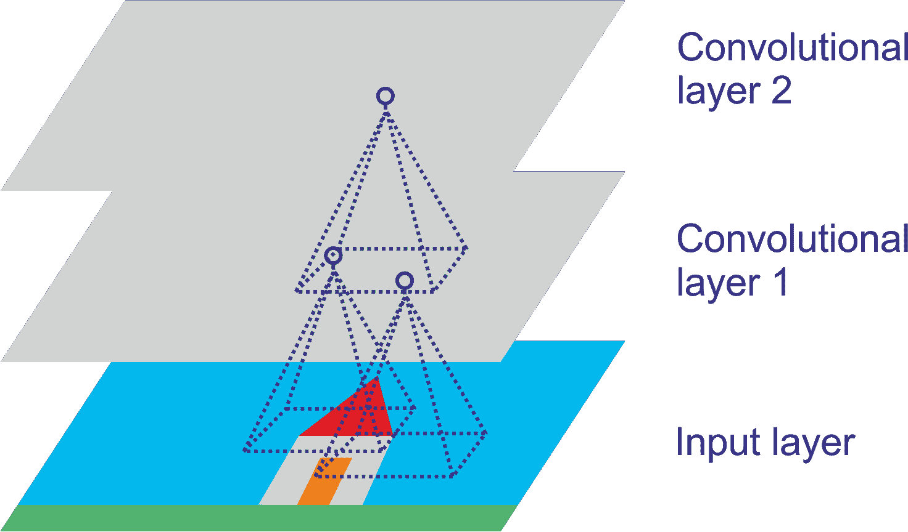

图 3：具有矩形局部感受野的 CNN 层

这种架构使得网络能够在第一隐藏层中集中关注低级特征，然后在接下来的隐藏层中将它们组装成更高级的特征，依此类推。这种层次结构在现实世界的图像中很常见，这也是 CNN 在图像识别中表现如此出色的原因之一。

# 池化层和填充操作

一旦你理解了卷积层的工作原理，池化层就非常容易理解了。池化层通常会独立地处理每一个输入通道，因此输出深度与输入深度相同。你也可以选择在深度维度上进行池化，正如我们接下来将看到的那样，在这种情况下，图像的空间维度（高度和宽度）保持不变，但通道的数量会减少。让我们看一下来自一个知名 TensorFlow 网站的池化层的正式定义：

“池化操作在输入张量上扫过一个矩形窗口，为每个窗口计算一个归约操作（平均、最大值或带有 argmax 的最大值）。每个池化操作使用称为 ksize 的矩形窗口，窗口间隔由偏移步幅定义。例如，如果步幅全为 1，则每个窗口都会被使用；如果步幅全为 2，则每个维度中的每隔一个窗口就会被使用，依此类推。”

因此，就像在卷积层中一样，池化层中的每个神经元与前一层中有限数量的神经元的输出相连接，这些神经元位于一个小的矩形感受野内。你必须像之前一样定义其大小、步幅和填充类型。然而，池化神经元没有权重；它所做的只是使用聚合函数（如最大值或均值）对输入进行聚合。

目标使用池化是为了对子输入图像进行子采样，以减少计算负荷、内存使用和参数数量。这有助于在训练阶段避免过拟合。减少输入图像的大小还使得神经网络能够容忍一定程度的图像位移。在以下示例中，我们使用了 2 x 2 的池化核和步幅为 2 的设置，并且没有填充。只有每个池化核中的最大输入值会传递到下一层，因为其他输入会被丢弃：

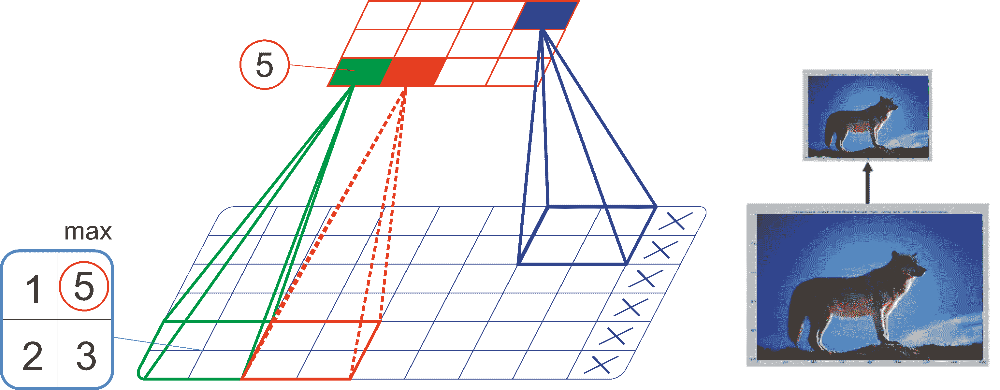

图 4：使用最大池化的示例，即子采样

通常，*（stride_length）* x + filter_size <= input_layer_size* 是大多数基于 CNN 的网络开发中推荐的。

# 子采样操作

如前所述，位于给定层中的神经元与前一层中神经元的输出相连接。现在，为了使一个层具有与前一层相同的高度和宽度，通常会在输入周围添加零，如图所示。这称为**SAME**或**零填充**。

"SAME"一词意味着输出特征图具有与输入特征图相同的空间维度。零填充被引入，以便在需要时使形状匹配，并且在输入图的每一侧填充相等。另一方面，"VALID"意味着没有填充，只是丢弃最右侧的列（或最下方的行）：

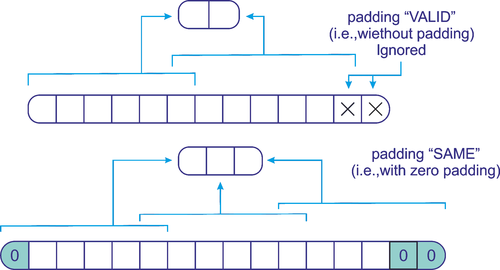

图 5：CNN 中的 SAME 与 VALID 填充

现在我们已经掌握了关于 CNN 及其架构的最基本理论知识，是时候动手实践了，使用 Deeplearning4j（简称 DL4j）创建卷积、池化和子采样操作。DL4j 是最早的商业级分布式开源深度学习库之一，专为 Java 和 Scala 编写。它还提供对 Hadoop 和 Spark 的集成支持。DL4j 旨在用于商业环境中的分布式 GPU 和 CPU。

# DL4j 中的卷积和子采样操作

在开始之前，设置我们的编程环境是一个先决条件。所以我们先做这个。

# 配置 DL4j、ND4s 和 ND4j

以下库可以与 DL4j 集成。无论你是在 Java 还是 Scala 中开发机器学习应用程序，它们都会使你的 JVM 体验更加顺畅：

+   **DL4j**：神经网络平台

+   **ND4J**：JVM 上的 NumPy

+   **DataVec**：机器学习 ETL 操作工具

+   **JavaCPP**：Java 与本地 C++之间的桥梁

+   **Arbiter**：机器学习算法评估工具

+   **RL4J**：JVM 上的深度强化学习

ND4j 就像 JVM 上的 NumPy。它提供了一些线性代数的基本操作，例如矩阵创建、加法和乘法。另一方面，ND4S 是一个科学计算库，专注于线性代数和矩阵操作。基本上，它支持 JVM 语言的 n 维数组。

如果你在 Eclipse（或任何其他编辑器，如 IntelliJ IDEA）中使用 Maven，请在`pom.xml`文件（位于`<dependencies>`标签内）中使用以下依赖项来解决 DL4j、ND4s 和 ND4j 的依赖问题：

```py
<dependency>
    <groupId>org.deeplearning4j</groupId>
    <artifactId>deeplearning4j-core</artifactId>
    <version>0.4-rc3.9</version>
</dependency>
<dependency>
    <artifactId>canova-api</artifactId>
    <groupId>org.nd4j</groupId>
    <version>0.4-rc3.9</version>
</dependency>
<dependency>
    <groupId>org.nd4j</groupId>
    <artifactId>nd4j-native</artifactId>
    <version>0.4-rc3.9</version>
</dependency>
<dependency>
    <groupId>org.nd4j</groupId>
    <artifactId>canova-api</artifactId>
    <version>0.0.0.17</version>
</dependency>
```

我使用的是旧版本，因为遇到了一些兼容性问题，但它仍在积极开发中。不过你可以自由地采用最新版本。我相信读者可以轻松完成这一点。

此外，如果你的系统没有配置本地的 BLAS，ND4j 的性能将会下降。一旦你运行简单的 Scala 代码，就会看到警告：

```py
****************************************************************
WARNING: COULD NOT LOAD NATIVE SYSTEM BLAS
ND4J performance WILL be reduced
****************************************************************
```

然而，安装和配置 BLAS（如 OpenBLAS 或 IntelMKL）并不难，你可以投入一些时间去完成它。详情请参阅以下网址：[`nd4j.org/getstarted.html#open`](http://nd4j.org/getstarted.html#open)。还需要注意的是，在使用 DL4j 时，以下是必备条件：

+   Java（开发者版本）1.8+（仅支持 64 位版本）

+   Apache Maven：用于自动构建和依赖管理

+   IntelliJ IDEA 或 Eclipse

+   Git

做得好！我们的编程环境已经准备好进行简单的深度学习应用开发。现在是时候动手编写一些示例代码了。让我们看看如何使用 CIFAR-10 数据集构建和训练一个简单的 CNN。CIFAR-10 是最受欢迎的基准数据集之一，包含成千上万的标注图像。

# DL4j 中的卷积和子采样操作

在这一小节中，我们将展示如何构建一个用于 MNIST 数据分类的 CNN 示例。该网络将包含两个卷积层、两个子采样层、一个全连接层和一个输出层。第一层是卷积层，接着是子采样层，随后是另一个卷积层。然后是子采样层，接着是全连接层，最后是输出层。

让我们看看这些层在使用 DL4j 时的表现。第一个卷积层，使用 ReLU 作为激活函数：

```py
val layer_0 = new ConvolutionLayer.Builder(5, 5)
    .nIn(nChannels)
    .stride(1, 1)
    .nOut(20)
    .activation("relu")
    .build()
```

DL4j 当前支持以下激活函数：

+   ReLU

+   Leaky ReLU

+   Tanh

+   Sigmoid

+   Hard Tanh

+   Softmax

+   Identity

+   **ELU**（**指数线性单元**）

+   Softsign

+   Softplus

第二层（即第一个子采样层）是一个子采样层，池化类型为`MAX`，卷积核大小为 2 x 2，步幅为 2 x 2，但没有激活函数：

```py
val layer_1 = new SubsamplingLayer.Builder(SubsamplingLayer.PoolingType.MAX)
    .kernelSize(2, 2)
    .stride(2, 2)
    .build()
```

第三层（第二个卷积层）是一个卷积层，使用 ReLU 作为激活函数，步幅为 1*1：

```py

val layer_2 = new ConvolutionLayer.Builder(5, 5)
    .nIn(nChannels)
    .stride(1, 1)
    .nOut(50)
    .activation("relu")
    .build()
```

第四层（即第二个子采样层）是一个子采样层，池化类型为`MAX`，卷积核大小为 2 x 2，步幅为 2 x 2，但没有激活函数：

```py
val layer_3 = new SubsamplingLayer.Builder(SubsamplingLayer.PoolingType.MAX)
    .kernelSize(2, 2)
    .stride(2, 2)
    .build()
```

第五层是一个全连接层，使用 ReLU 作为激活函数：

```py
val layer_4 = new DenseLayer.Builder()
    .activation("relu")
    .nOut(500)
    .build()
```

第六层（即最后一层全连接层）使用 Softmax 作为激活函数，类别数量为待预测的类别数（即 10）：

```py
val layer_5 = new OutputLayer.Builder(LossFunctions.LossFunction.NEGATIVELOGLIKELIHOOD)
    .nOut(outputNum)
    .activation("softmax")
    .build()
```

一旦各层构建完成，接下来的任务是通过链接所有的层来构建 CNN。使用 DL4j，操作如下：

```py
val builder: MultiLayerConfiguration.Builder = new NeuralNetConfiguration.Builder()
    .seed(seed)
    .iterations(iterations)
    .regularization(true).l2(0.0005)
    .learningRate(0.01)
    .weightInit(WeightInit.XAVIER)
   .optimizationAlgo(OptimizationAlgorithm.STOCHASTIC_GRADIENT_DESCENT)
    .updater(Updater.NESTEROVS).momentum(0.9)
    .list()
        .layer(0, layer_0)
        .layer(1, layer_1)
        .layer(2, layer_2)
        .layer(3, layer_3)
        .layer(4, layer_4)
        .layer(5, layer_5)
    .backprop(true).pretrain(false) // feedforward and supervised so no pretraining
```

最后，我们设置所有的卷积层并初始化网络，如下所示：

```py
new ConvolutionLayerSetup(builder, 28, 28, 1) //image size is 28*28
val conf: MultiLayerConfiguration = builder.build()
val model: MultiLayerNetwork = new MultiLayerNetwork(conf)
model.init()
```

按照惯例，要训练一个 CNN，所有的图像需要具有相同的形状和大小。所以我在前面的代码中将尺寸设置为 28 x 28，便于说明。现在，你可能会想，我们如何训练这样的网络呢？好吧，接下来我们就会看到这一点，但在此之前，我们需要准备 MNIST 数据集，使用`MnistDataSetIterator()`方法，如下所示：

```py
val nChannels = 1 // for grayscale image
val outputNum = 10 // number of class
val nEpochs = 10 // number of epoch
val iterations = 1 // number of iteration
val seed = 12345 // Random seed for reproducibility
val batchSize = 64 // number of batches to be sent
log.info("Load data....")
val mnistTrain: DataSetIterator = new MnistDataSetIterator(batchSize, true, 12345)
val mnistTest: DataSetIterator = new MnistDataSetIterator(batchSize, false, 12345)
```

现在让我们开始训练 CNN，使用训练集并为每个周期进行迭代：

```py
log.info("Model training started...")
model.setListeners(new ScoreIterationListener(1))
var i = 0
while (i <= nEpochs) {
    model.fit(mnistTrain);
    log.info("*** Completed epoch {} ***", i)
    i = i + 1
    }
var ds: DataSet = null var output: INDArray = null
```

一旦我们训练好了 CNN，接下来的任务是评估模型在测试集上的表现，如下所示：

```py
log.info("Model evaluation....")
val eval: Evaluation = new Evaluation(outputNum)
while (mnistTest.hasNext()) {
    ds = mnistTest.next()
    output = model.output(ds.getFeatureMatrix(), false)
    }
eval.eval(ds.getLabels(), output)
```

最后，我们计算一些性能矩阵，如`Accuracy`、`Precision`、`Recall`和`F1 measure`，如下所示：

```py
println("Accuracy: " + eval.accuracy())
println("F1 measure: " + eval.f1())
println("Precision: " + eval.precision())
println("Recall: " + eval.recall())
println("Confusion matrix: " + "n" + eval.confusionToString())
log.info(eval.stats())
mnistTest.reset()
>>>
==========================Scores=======================================
 Accuracy: 1
 Precision: 1
 Recall: 1
 F1 Score: 1
=======================================================================
```

为了方便你，我在这里提供了这个简单图像分类器的完整源代码：

```py
package com.example.CIFAR

import org.canova.api.records.reader.RecordReader
import org.canova.api.split.FileSplit
import org.canova.image.loader.BaseImageLoader
import org.canova.image.loader.NativeImageLoader
import org.canova.image.recordreader.ImageRecordReader
import org.deeplearning4j.datasets.iterator.DataSetIterator
import org.canova.image.recordreader.ImageRecordReader
import org.deeplearning4j.datasets.canova.RecordReaderDataSetIterator
import org.deeplearning4j.datasets.iterator.impl.MnistDataSetIterator
import org.deeplearning4j.eval.Evaluation
import org.deeplearning4j.nn.api.OptimizationAlgorithm
import org.deeplearning4j.nn.conf.MultiLayerConfiguration
import org.deeplearning4j.nn.conf.NeuralNetConfiguration
import org.deeplearning4j.nn.conf.Updater
import org.deeplearning4j.nn.conf.layers.ConvolutionLayer
import org.deeplearning4j.nn.conf.layers.DenseLayer
import org.deeplearning4j.nn.conf.layers.OutputLayer
import org.deeplearning4j.nn.conf.layers.SubsamplingLayer
import org.deeplearning4j.nn.conf.layers.setup.ConvolutionLayerSetup
import org.deeplearning4j.nn.multilayer.MultiLayerNetwork
import org.deeplearning4j.nn.weights.WeightInit
import org.deeplearning4j.optimize.listeners.ScoreIterationListener
import org.nd4j.linalg.api.ndarray.INDArray
import org.nd4j.linalg.api.rng.Random
import org.nd4j.linalg.dataset.DataSet
import org.nd4j.linalg.dataset.SplitTestAndTrain
import org.nd4j.linalg.lossfunctions.LossFunctions
import org.slf4j.Logger
import org.slf4j.LoggerFactory
import java.io.File
import java.util.ArrayList
import java.util.List

object MNIST {
 val log: Logger = LoggerFactory.getLogger(MNIST.getClass)
 def main(args: Array[String]): Unit = {
 val nChannels = 1 // for grayscale image
 val outputNum = 10 // number of class
 val nEpochs = 1 // number of epoch
 val iterations = 1 // number of iteration
 val seed = 12345 // Random seed for reproducibility
 val batchSize = 64 // number of batches to be sent

    log.info("Load data....")
 val mnistTrain: DataSetIterator = new MnistDataSetIterator(batchSize, true, 12345)
 val mnistTest: DataSetIterator = new MnistDataSetIterator(batchSize, false, 12345)

    log.info("Network layer construction started...")
    //First convolution layer with ReLU as activation function
 val layer_0 = new ConvolutionLayer.Builder(5, 5)
        .nIn(nChannels)
        .stride(1, 1)
        .nOut(20)
        .activation("relu")
        .build()

    //First subsampling layer
 val layer_1 = new SubsamplingLayer.Builder(SubsamplingLayer.PoolingType.MAX)
        .kernelSize(2, 2)
        .stride(2, 2)
        .build()

    //Second convolution layer with ReLU as activation function
 val layer_2 = new ConvolutionLayer.Builder(5, 5)
        .nIn(nChannels)
        .stride(1, 1)
        .nOut(50)
        .activation("relu")
        .build()

    //Second subsampling layer
 val layer_3 = new SubsamplingLayer.Builder(SubsamplingLayer.PoolingType.MAX)
        .kernelSize(2, 2)
        .stride(2, 2)
        .build()

    //Dense layer
 val layer_4 = new DenseLayer.Builder()
        .activation("relu")
        .nOut(500)
        .build()

    // Final and fully connected layer with Softmax as activation function
 val layer_5 = new OutputLayer.Builder(LossFunctions.LossFunction.NEGATIVELOGLIKELIHOOD)
        .nOut(outputNum)
        .activation("softmax")
        .build()

    log.info("Model building started...")
 val builder: MultiLayerConfiguration.Builder = new NeuralNetConfiguration.Builder()
        .seed(seed)
        .iterations(iterations)
        .regularization(true).l2(0.0005)
        .learningRate(0.01)
        .weightInit(WeightInit.XAVIER)
        .optimizationAlgo(OptimizationAlgorithm.STOCHASTIC_GRADIENT_DESCENT)
        .updater(Updater.NESTEROVS).momentum(0.9)
        .list()
            .layer(0, layer_0)
            .layer(1, layer_1)
            .layer(2, layer_2)
            .layer(3, layer_3)
            .layer(4, layer_4)
            .layer(5, layer_5)
    .backprop(true).pretrain(false) // feedforward so no backprop

// Setting up all the convlutional layers and initialize the network
new ConvolutionLayerSetup(builder, 28, 28, 1) //image size is 28*28
val conf: MultiLayerConfiguration = builder.build()
val model: MultiLayerNetwork = new MultiLayerNetwork(conf)
model.init()

log.info("Model training started...")
model.setListeners(new ScoreIterationListener(1))
 var i = 0
 while (i <= nEpochs) {
        model.fit(mnistTrain);
        log.info("*** Completed epoch {} ***", i)
        i = i + 1
 var ds: DataSet = null
 var output: INDArray = null
        log.info("Model evaluation....")
 val eval: Evaluation = new Evaluation(outputNum)

 while (mnistTest.hasNext()) {
            ds = mnistTest.next()
            output = model.output(ds.getFeatureMatrix(), false)
                }
        eval.eval(ds.getLabels(), output)
        println("Accuracy: " + eval.accuracy())
        println("F1 measure: " + eval.f1())
        println("Precision: " + eval.precision())
        println("Recall: " + eval.recall())
        println("Confusion matrix: " + "n" + eval.confusionToString())
        log.info(eval.stats())
        mnistTest.reset()
                }
    log.info("****************Example finished********************")
            }
    }
```

# 使用 CNN 进行大规模图像分类

在本节中，我们将展示一个逐步开发实际 ML 项目（用于图像分类）的示例。然而，我们首先需要了解问题描述，以便知道需要进行什么样的图像分类。此外，在开始之前，了解数据集是必须的。

# 问题描述

如今，食物自拍和以照片为中心的社交故事讲述正在成为社交趋势。美食爱好者愿意将大量与食物合影的自拍和餐厅的照片上传到社交媒体和相应的网站。当然，他们还会提供书面评论，这能显著提升餐厅的知名度：

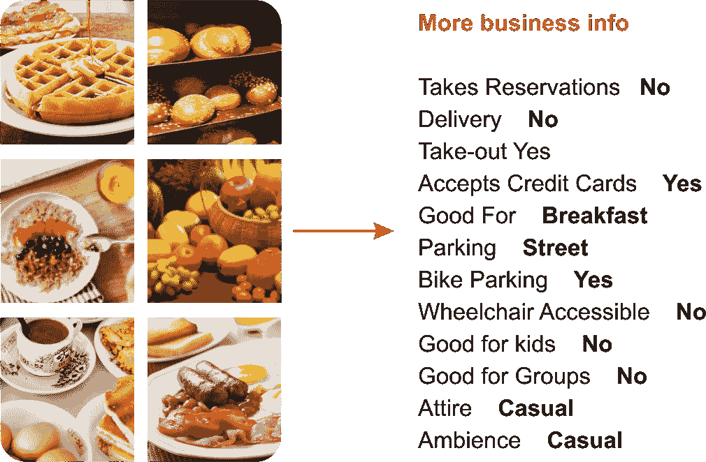

图 6：从 Yelp 数据集中挖掘一些商业洞察

例如，数百万独立访问者访问 Yelp 并撰写了超过 1.35 亿条评论。平台上有大量照片和上传照片的用户。商家可以发布照片并与顾客互动。通过这种方式，Yelp 通过向这些本地商家 **出售广告** 来赚钱。一个有趣的事实是，这些照片提供了丰富的本地商业信息，涵盖了多个类别。因此，训练计算机理解这些照片的上下文并非一件简单的事，也不是一项容易的任务（参考 *图 6* 获取更多的见解）。

现在，这个项目的理念是充满挑战的：我们如何将这些图片转化为文字？让我们试试看。更具体地说，你将获得属于某个商家的照片。现在我们需要建立一个模型，使其能够自动为餐馆标记多个用户提交的照片标签——也就是说，预测商家的属性。

# 图像数据集的描述

对于这样的挑战，我们需要一个真实的数据集。别担心，有多个平台提供公开的数据集，或者可以在一定的条款和条件下下载。一种这样的平台是 **Kaggle**，它为数据分析和机器学习实践者提供了一个平台，参与机器学习挑战并赢取奖品。Yelp 数据集及其描述可以在以下网址找到：[`www.kaggle.com/c/yelp-restaurant-photo-classification`](https://www.kaggle.com/c/yelp-restaurant-photo-classification)。

餐馆的标签是由 Yelp 用户在提交评论时手动选择的。数据集中包含 Yelp 社区标注的九种不同标签：

+   `0: good_for_lunch`

+   `1: good_for_dinner`

+   `2: takes_reservations`

+   `3: outdoor_seating`

+   `4: restaurant_is_expensive`

+   `5: has_alcohol`

+   `6: has_table_service`

+   `7: ambience_is_classy`

+   `8: good_for_kids`

所以我们需要尽可能准确地预测这些标签。需要注意的一点是，由于 Yelp 是一个社区驱动的网站，数据集中存在重复的图片，原因有很多。例如，用户可能会不小心将同一张照片上传到同一商家多次，或者连锁商家可能会将相同的照片上传到不同的分店。数据集包含以下六个文件：

+   `train_photos.tgz`: 用作训练集的照片（234,545 张图片）

+   `test_photos.tgz`: 用作测试集的照片（500 张图片）

+   `train_photo_to_biz_ids.csv`: 提供照片 ID 和商家 ID 之间的映射（234,545 行）

+   `test_photo_to_biz_ids.csv`: 提供照片 ID 和商家 ID 之间的映射（500 行）

+   `train.csv`: 这是主要的训练数据集，包含商家 ID 和它们对应的标签（1996 行）

+   `sample_submission.csv`: 一个示例提交文件——参考正确的格式来提交你的预测结果，包括 `business_id` 和对应的预测标签

# 整个项目的工作流程

在这个项目中，我们将展示如何将`.jpg`格式的图像读取为 Scala 中的矩阵表示。接着，我们将进一步处理并准备这些图像，以便 CNN 能够接收。我们将看到几种图像操作，比如将所有图像转换为正方形，并将每个图像调整为相同的尺寸，然后对图像应用灰度滤镜：

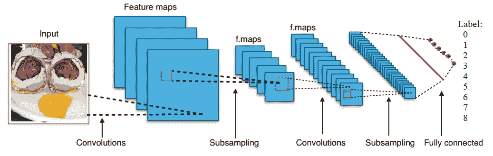

图 7：用于图像分类的 CNN 概念视图

然后我们在训练数据上训练九个 CNN，每个分类一个。一旦训练完成，我们保存训练好的模型、CNN 配置和参数，以便以后恢复，接着我们应用一个简单的聚合函数来为每个餐厅分配类别，每个餐厅都有多个与之相关联的图像，每个图像都有其对应的九个类别的概率向量。然后我们对测试数据打分，最后，使用测试图像评估模型。

现在让我们看看每个 CNN 的结构。每个网络将有两个卷积层，两个子采样层，一个密集层，以及作为完全连接层的输出层。第一层是卷积层，接着是子采样层，再之后是另一个卷积层，然后是子采样层，再接着是一个密集层，最后是输出层。我们稍后会看到每一层的结构。

# 实现 CNN 用于图像分类

包含`main()`方法的 Scala 对象有以下工作流：

1.  我们从`train.csv`文件中读取所有的业务标签

1.  我们读取并创建一个从图像 ID 到业务 ID 的映射，格式为`imageID` → `busID`

1.  我们从`photoDir`目录获取图像列表，加载和处理图像，最后获取 10,000 张图像的图像 ID（可以自由设置范围）

1.  然后我们读取并处理图像，形成`photoID` → 向量映射

1.  我们将*步骤 3*和*步骤 4*的输出链接起来，对齐业务特征、图像 ID 和标签 ID，以提取 CNN 所需的特征

1.  我们构建了九个 CNN。

1.  我们训练所有的 CNN 并指定模型保存的位置

1.  然后我们重复*步骤 2*到*步骤 6*来从测试集提取特征

1.  最后，我们评估模型并将预测结果保存到 CSV 文件中

现在让我们看看前述步骤在高层次的图示中是如何表示的：

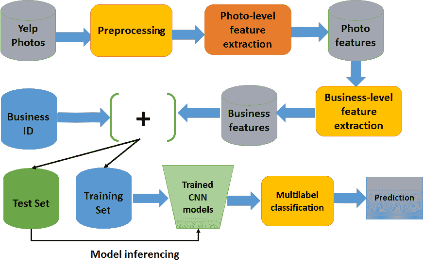

图 8：DL4j 图像处理管道用于图像分类

从程序的角度来看，前述步骤可以表示如下：

```py
val labelMap = readBusinessLabels("data/labels/train.csv")
val businessMap = readBusinessToImageLabels("data/labels/train_photo_to_biz_ids.csv")
val imgs = getImageIds("data/images/train/", businessMap, businessMap.map(_._2).toSet.toList).slice(0,100) // 20000 images

println("Image ID retreival done!")
val dataMap = processImages(imgs, resizeImgDim = 128)
println("Image processing done!")
val alignedData = new featureAndDataAligner(dataMap, businessMap, Option(labelMap))()

println("Feature extraction done!")
val cnn0 = trainModelEpochs(alignedData, businessClass = 0, saveNN = "models/model0")
val cnn1 = trainModelEpochs(alignedData, businessClass = 1, saveNN = "models/model1")
val cnn2 = trainModelEpochs(alignedData, businessClass = 2, saveNN = "models/model2")
val cnn3 = trainModelEpochs(alignedData, businessClass = 3, saveNN = "models/model3")
val cnn4 = trainModelEpochs(alignedData, businessClass = 4, saveNN = "models/model4")
val cnn5 = trainModelEpochs(alignedData, businessClass = 5, saveNN = "models/model5")
val cnn6 = trainModelEpochs(alignedData, businessClass = 6, saveNN = "models/model6")
val cnn7 = trainModelEpochs(alignedData, businessClass = 7, saveNN = "models/model7")
val cnn8 = trainModelEpochs(alignedData, businessClass = 8, saveNN = "models/model8")

val businessMapTE = readBusinessToImageLabels("data/labels/test_photo_to_biz.csv")

val imgsTE = getImageIds("data/images/test//", businessMapTE, businessMapTE.map(_._2).toSet.toList)

val dataMapTE = processImages(imgsTE, resizeImgDim = 128) // make them 128*128

val alignedDataTE = new featureAndDataAligner(dataMapTE, businessMapTE, None)()
val Results = SubmitObj(alignedDataTE, "results/ModelsV0/")
val SubmitResults = writeSubmissionFile("kaggleSubmitFile.csv", Results, thresh = 0.9)
```

觉得太复杂了吗？别担心，我们现在将详细查看每一步。如果仔细看前面的步骤，你会发现*步骤 1*到*步骤 5*基本上是图像处理和特征构建。

# 图像处理

当我试图开发这个应用程序时，我发现照片的大小和形状各不相同：一些图像是高的，一些是宽的，一些在外面，一些在里面，大多数是食物图片。然而，还有一些其他的随机物品。另一个重要的方面是，尽管训练图像在纵向/横向和像素数量上有所不同，大多数都是大致正方形的，许多都是确切的 500 x 375：

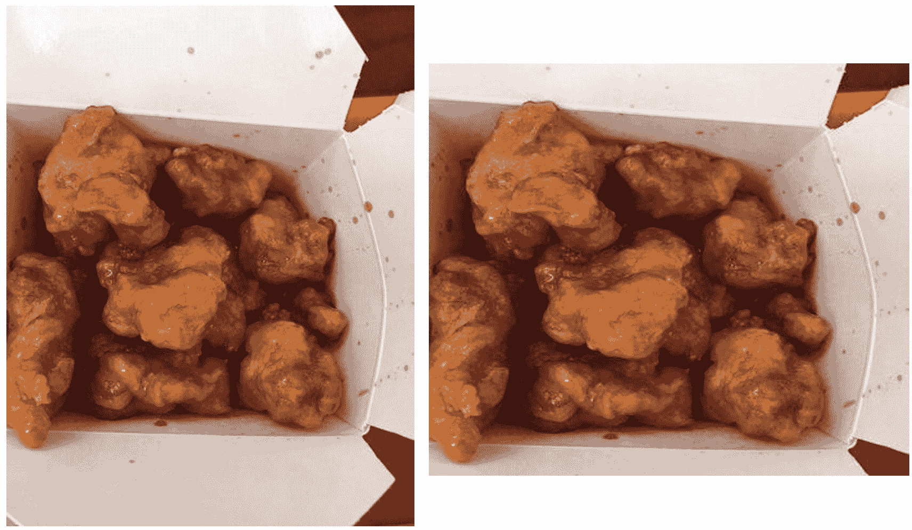

图 9：调整大小后的图像（左边为原始和高大的图像，右边为正方形的图像）

正如我们已经看到的，CNN 无法处理尺寸和形状异质的图像。有许多强大且有效的图像处理技术可以仅提取感兴趣区域（ROI）。但是，老实说，我不是图像处理专家，所以决定简化这个调整大小的步骤。

卷积神经网络（CNN）有一个严重的限制，即不能处理方向和相对空间关系。因此，这些组成部分对 CNN 来说并不重要。简而言之，CNN 不太适合具有异构形状和方向的图像。因此，现在人们开始讨论胶囊网络。详细内容请参见原始论文：[`arxiv.org/pdf/1710.09829v1.pdf`](https://arxiv.org/pdf/1710.09829v1.pdf) 和 [`openreview.net/pdf?id=HJWLfGWRb`](https://openreview.net/pdf?id=HJWLfGWRb)。

简单地说，我将所有图像都制作成了正方形，但仍然努力保持质量。在大多数情况下，ROI 是居中的，因此仅捕获每个图像的中心最方正的部分并不那么简单。尽管如此，我们还需要将每个图像转换为灰度图像。让我们把不规则形状的图像变成正方形。请看下面的图像，左边是原始图像，右边是正方形图像（见*图 9*）。

现在我们已经生成了一个正方形图像，我们是如何做到这一点的呢？好吧，我首先检查高度和宽度是否相同，如果是，则不进行调整大小。在另外两种情况下，我裁剪了中心区域。以下方法可以达到效果（但随意执行`SquaringImage.scala`脚本以查看输出）：

```py
def makeSquare(img: java.awt.image.BufferedImage): java.awt.image.BufferedImage = {
 val w = img.getWidth
 val h = img.getHeight
 val dim = List(w, h).min
    img match {
 case x 
 if w == h => img // do nothing and returns the original one
 case x 
 if w > h => Scalr.crop(img, (w - h) / 2, 0, dim, dim)
 case x 
 if w < h => Scalr.crop(img, 0, (h - w) / 2, dim, dim)
        }
    }
```

干得好！现在我们所有的训练图像都是正方形的，下一个重要的预处理任务是将它们全部调整大小。我决定将所有图像都调整为 128 x 128 的大小。让我们看看之前（原始的）调整大小后的图像如何看起来：

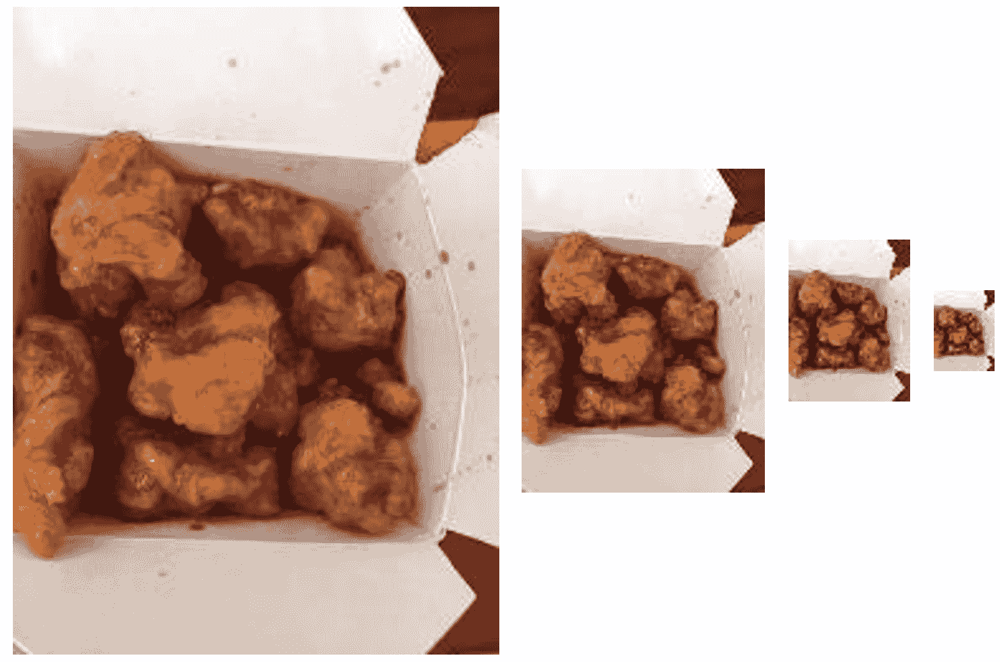

图 10：图像调整（256 x 256, 128 x 128, 64 x 64 和 32 x 32 分别）

以下方法可以达到效果（但随意执行`ImageResize.scala`脚本以查看演示）：

```py
def resizeImg(img: java.awt.image.BufferedImage, width: Int, height: Int) = {
    Scalr.resize(img, Scalr.Method.BALANCED, width, height) 
}
```

顺便说一句，为了图像调整和制作正方形，我使用了一些内置的图像读取包和一些第三方处理包：

```py
import org.imgscalr._
import java.io.File
import javax.imageio.ImageIO
```

要使用上述包，请在 Maven 友好的`pom.xml`文件中添加以下依赖项：

```py
<dependency>
    <groupId>org.imgscalr</groupId>
    <artifactId>imgscalr-lib</artifactId>
    <version>4.2</version>
</dependency>
<dependency>
    <groupId>org.datavec</groupId>
    <artifactId>datavec-data-image</artifactId>
    <version>0.9.1</version>
</dependency>
<dependency>
    <groupId>com.sksamuel.scrimage</groupId>
    <artifactId>scrimage-core_2.10</artifactId>
    <version>2.1.0</version>
</dependency>
```

虽然基于 DL4j 的卷积神经网络（CNN）可以处理彩色图像，但使用灰度图像可以简化计算。虽然彩色图像更具吸引力且效果更好，但通过这种方式，我们可以使整体表示更简单，并且节省空间。

让我们举一个之前步骤的例子。我们将每个图像调整为 256 x 256 像素的图像，表示为 16,384 个特征，而不是为一个有三个 RGB 通道的彩色图像表示为 16,384 x 3（执行`GrayscaleConverter.scala`来查看演示）。让我们看看转换后的图像效果：

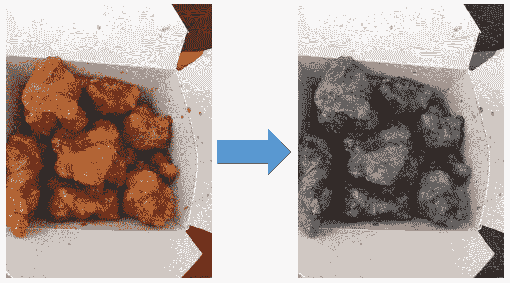

图 11：左 - 原始图像，右 - 灰度图像 RGB 平均化

上述转换是使用名为`pixels2Gray()`和`makeGray()`的两个方法完成的：

```py
def pixels2Gray(R: Int, G: Int, B: Int): Int = (R + G + B) / 3
def makeGray(testImage: java.awt.image.BufferedImage): java.awt.image.BufferedImage = {
 val w = testImage.getWidth
 val h = testImage.getHeight
 for { 
        w1 <- (0 until w).toVector
        h1 <- (0 until h).toVector
        } 
 yield 
    {
 val col = testImage.getRGB(w1, h1)
 val R = (col & 0xff0000) / 65536
 val G = (col & 0xff00) / 256
 val B = (col & 0xff)
 val graycol = pixels2Gray(R, G, B)
testImage.setRGB(w1, h1, new Color(graycol, graycol, graycol).getRGB)
    }
testImage
}
```

那么，幕后发生了什么呢？我们将前面提到的三个步骤串联起来：首先将所有图像调整为正方形，然后将它们转换为 25 x 256，最后将调整大小后的图像转换为灰度图像：

```py
val demoImage = ImageIO.read(new File(x))
    .makeSquare
    .resizeImg(resizeImgDim, resizeImgDim) // (128, 128)
    .image2gray
```

总结一下，现在我们已经对所有图像进行了正方形化和调整大小，图像已经变为灰度。以下图像展示了转换步骤的一些效果：

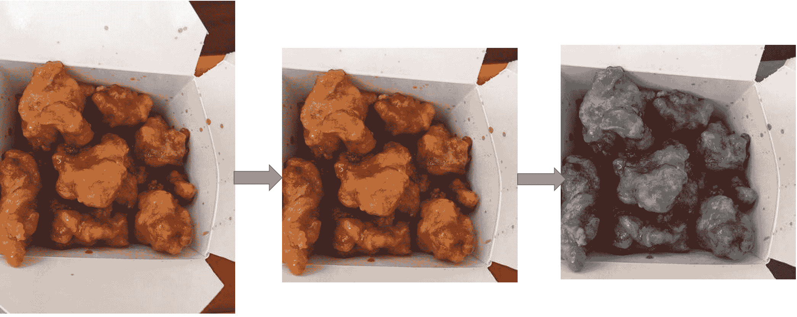

图 12：调整大小后的图像（左侧为原始高图，右侧为调整后的正方形图像）

以下的步骤链式操作也需要额外的努力。现在我们将这三个步骤放在代码中，最终准备好所有的图像：

```py
import scala.Vector
import org.imgscalr._

object imageUtils {
 implicitclass imageProcessingPipeline(img: java.awt.image.BufferedImage) {
    // image 2 vector processing
 def pixels2gray(R: Int, G:Int, B: Int): Int = (R + G + B) / 3
 def pixels2color(R: Int, G:Int, B: Int): Vector[Int] = Vector(R, G, B)
 private def image2vecA => A ): Vector[A] = {
 val w = img.getWidth
 val h = img.getHeight
 for {
            w1 <- (0 until w).toVector
            h1 <- (0 until h).toVector
            } 
 yield {
 val col = img.getRGB(w1, h1)
 val R = (col & 0xff0000) / 65536
 val G = (col & 0xff00) / 256
 val B = (col & 0xff)
        f(R, G, B)
                }
            }

 def image2gray: Vector[Int] = image2vec(pixels2gray)
 def image2color: Vector[Int] = image2vec(pixels2color).flatten

    // make image square
 def makeSquare = {
 val w = img.getWidth
 val h = img.getHeight
 val dim = List(w, h).min
        img match {
 case x     
 if w == h => img
 case x 
 if w > h => Scalr.crop(img, (w-h)/2, 0, dim, dim)
 case x 
 if w < h => Scalr.crop(img, 0, (h-w)/2, dim, dim)
              }
            }

    // resize pixels
 def resizeImg(width: Int, height: Int) = {
        Scalr.resize(img, Scalr.Method.BALANCED, width, height)
            }
        }
    }
```

# 提取图像元数据

到目前为止，我们已经加载并预处理了原始图像，但我们还不知道需要哪些图像元数据来让我们的 CNN 进行学习。因此，现在是时候加载包含每个图像元数据的 CSV 文件了。

我写了一个方法来读取这种 CSV 格式的元数据，叫做`readMetadata()`，稍后两个方法`readBusinessLabels`和`readBusinessToImageLabels`也会使用它。这三个方法定义在`CSVImageMetadataReader.scala`脚本中。下面是`readMetadata()`方法的签名：

```py
def readMetadata(csv: String, rows: List[Int]=List(-1)): List[List[String]] = {
 val src = Source.fromFile(csv)

 def reading(csv: String): List[List[String]]= {
        src.getLines.map(x => x.split(",").toList)
            .toList
            }
 try {
 if(rows==List(-1)) reading(csv)
 else rows.map(reading(csv))
            } 
 finally {
            src.close
            }
        }
```

`readBusinessLabels()`方法将商业 ID 映射到标签，格式为 `businessID` → Set (标签)：

```py
def readBusinessLabels(csv: String, rows: List[Int]=List(-1)): Map[String, Set[Int]] = {
 val reader = readMetadata(csv)
    reader.drop(1)
        .map(x => x match {
 case x :: Nil => (x(0).toString, Set[Int]())
 case _ => (x(0).toString, x(1).split(" ").map(y => y.toInt).toSet)
        }).toMap
}
```

`readBusinessToImageLabels()`方法将图像 ID 映射到商业 ID，格式为 `imageID` → `businessID`：

```py
def readBusinessToImageLabels(csv: String, rows: List[Int] = List(-1)): Map[Int, String] = {
 val reader = readMetadata(csv)
    reader.drop(1)
        .map(x => x match {
 case x :: Nil => (x(0).toInt, "-1")
 case _ => (x(0).toInt, x(1).split(" ").head)
        }).toMap
}
```

# 图像特征提取

到目前为止，我们已经看到了如何预处理图像，以便从中提取特征并将其输入到 CNN 中。此外，我们还看到了如何提取和映射元数据并将其与原始图像链接。现在是时候从这些预处理过的图像中提取特征了。

我们还需要记住每个图像元数据的来源。正如你所猜的那样，我们需要三次映射操作来提取特征。基本上，我们有三个映射。详情请参见`imageFeatureExtractor.scala`脚本：

1.  商业映射形式为 `imageID` → `businessID`

1.  数据映射形式为 `imageID` → 图像数据

1.  标签映射形式为 `businessID` → 标签

我们首先定义一个正则表达式模式，从 CSV `ImageMetadataReader`类中提取`.jpg`名称，该类用于与训练标签匹配：

```py
val patt_get_jpg_name = new Regex("[0-9]")
```

然后，我们提取出所有与相应业务 ID 关联的图像 ID：

```py
def getImgIdsFromBusinessId(bizMap: Map[Int, String], businessIds: List[String]): List[Int] = {
    bizMap.filter(x => businessIds.exists(y => y == x._2)).map(_._1).toList 
    }
```

现在，我们需要加载并处理所有已经预处理过的图像，通过与从业务 ID 提取的 ID 进行映射，如前所示，来提取图像 ID：

```py
def getImageIds(photoDir: String, businessMap: Map[Int, String] = Map(-1 -> "-1"), businessIds:         
    List[String] = List("-1")): List[String] = {
 val d = new File(photoDir)
 val imgsPath = d.listFiles().map(x => x.toString).toList
 if (businessMap == Map(-1 -> "-1") || businessIds == List(-1)) {
        imgsPath
    } 
 else {
 val imgsMap = imgsPath.map(x => patt_get_jpg_name.findAllIn(x).mkString.toInt -> x).toMap
 val imgsPathSub = getImgIdsFromBusinessId(businessMap, businessIds)
        imgsPathSub.filter(x => imgsMap.contains(x)).map(x => imgsMap(x))
        } 
    }
```

到目前为止，我们已经能够提取出所有与至少一个业务相关的图像 ID。下一步是读取并处理这些图像，形成`imageID` → 向量映射：

```py
def processImages(imgs: List[String], resizeImgDim: Int = 128, nPixels: Int = -1): Map[Int,Vector[Int]]= {
    imgs.map(x => patt_get_jpg_name.findAllIn(x).mkString.toInt -> {
 val img0 = ImageIO.read(new File(x))
        .makeSquare
        .resizeImg(resizeImgDim, resizeImgDim) // (128, 128)
        .image2gray
 if(nPixels != -1) img0.slice(0, nPixels)
 else img0
        }
    ).filter( x => x._2 != ())
    .toMap
    }
```

做得很好！我们只差一步，就能提取出训练 CNN 所需的数据。特征提取的最后一步是提取像素数据：

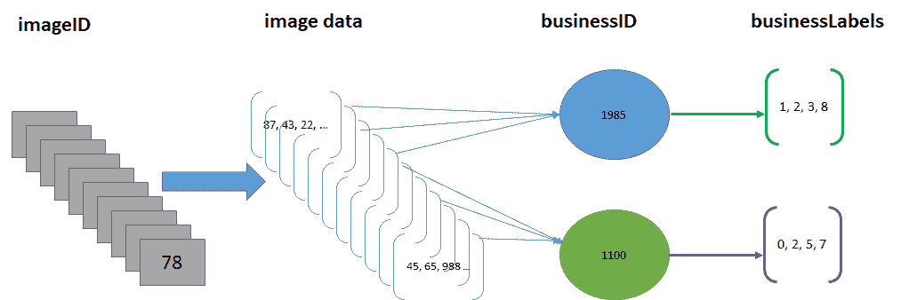

图 13：图像数据表示

总结起来，我们需要为每个图像跟踪四个对象的组成部分——即`imageID`、`businessID`、标签和像素数据。因此，如前图所示，主要数据结构由四种数据类型（四元组）构成——`imgID`、`businessID`、像素数据向量和标签：

```py
List[(Int, String, Vector[Int], Set[Int])]
```

因此，我们应该有一个包含这些对象所有部分的类。别担心，我们需要的所有内容都已在`featureAndDataAligner.scala`脚本中定义。一旦我们在`Main.scala`脚本中的`main`方法下，通过以下代码行实例化`featureAndDataAligner`的实例，就可以提供`businessMap`、`dataMap`和`labMap`：

```py
val alignedData = new featureAndDataAligner(dataMap, businessMap, Option(labelMap))()
```

在这里，`labMap`的选项类型被使用，因为在对测试数据评分时我们没有这个信息——即，对于该调用使用`None`：

```py
class featureAndDataAligner(dataMap: Map[Int, Vector[Int]], bizMap: Map[Int, String], labMap: Option[Map[String, Set[Int]]])(rowindices: List[Int] = dataMap.keySet.toList) {
 def this(dataMap: Map[Int, Vector[Int]], bizMap: Map[Int, String])(rowindices: List[Int]) =         this(dataMap, bizMap, None)(rowindices)

 def alignBusinessImgageIds(dataMap: Map[Int, Vector[Int]], bizMap: Map[Int, String])
        (rowindices: List[Int] = dataMap.keySet.toList): List[(Int, String, Vector[Int])] = {
 for { 
            pid <- rowindices
 val imgHasBiz = bizMap.get(pid) 
            // returns None if img doe not have a bizID
 val bid = if(imgHasBiz != None) imgHasBiz.get 
 else "-1"
 if (dataMap.keys.toSet.contains(pid) && imgHasBiz != None)
            } 
 yield {
        (pid, bid, dataMap(pid))
           }
        }
def alignLabels(dataMap: Map[Int, Vector[Int]], bizMap: Map[Int, String], labMap: Option[Map[String,     Set[Int]]])(rowindices: List[Int] = dataMap.keySet.toList): List[(Int, String, Vector[Int], Set[Int])] = {
 def flatten1A, B, C, D, D)): (A, B, C, D) = (t._1._1, t._1._2, t._1._3, t._2)
 val al = alignBusinessImgageIds(dataMap, bizMap)(rowindices)
 for { p <- al
        } 
 yield {
 val bid = p._2
 val labs = labMap match {
 case None => Set[Int]()
 case x => (if(x.get.keySet.contains(bid)) x.get(bid) 
        else Set[Int]())
            }
            flatten1(p, labs)
        }
    }
 lazy val data = alignLabels(dataMap, bizMap, labMap)(rowindices)
   // getter functions
 def getImgIds = data.map(_._1)
 def getBusinessIds = data.map(_._2)
 def getImgVectors = data.map(_._3)
 def getBusinessLabels = data.map(_._4)
 def getImgCntsPerBusiness = getBusinessIds.groupBy(identity).mapValues(x => x.size) 
}
```

很好！到目前为止，我们已经成功提取了用于训练 CNN 的特征。然而，目前形式下的特征仍然不适合输入到 CNN 中，因为我们只有特征向量而没有标签。因此，我们需要进行中间转换。

# 准备 ND4j 数据集

如我所说，我们需要进行中间转换和预处理，以便将训练集包含特征向量以及标签。这个转换过程非常直接：我们需要特征向量和业务标签。

为此，我们有`makeND4jDataSets`类（详见`makeND4jDataSets.scala`）。该类通过`alignLables`函数中的数据结构（以`List[(imgID, bizID, labels, pixelVector)]`的形式）创建 ND4j 数据集对象。首先，我们使用`makeDataSet()`方法准备数据集：

```py
def makeDataSet(alignedData: featureAndDataAligner, bizClass: Int): DataSet = {
 val alignedXData = alignedData.getImgVectors.toNDArray
 val alignedLabs = alignedData.getBusinessLabels.map(x => 
 if (x.contains(bizClass)) Vector(1, 0) 
    else Vector(0, 1)).toNDArray
 new DataSet(alignedXData, alignedLabs)
    }
```

然后，我们需要进一步转换前面的数据结构，转换为`INDArray`，这样 CNN 就可以使用：

```py
def makeDataSetTE(alignedData: featureAndDataAligner): INDArray = {
    alignedData.getImgVectors.toNDArray
    }
```

# 训练 CNN 并保存训练好的模型

到目前为止，我们已经看到如何准备训练集；现在我们面临一个挑战。我们必须训练 234,545 张图片。尽管测试阶段只用 500 张图片会轻松一些，但最好还是使用批处理模式，通过 DL4j 的`MultipleEpochsIterator`来训练每个 CNN。以下是一些重要的超参数及其详细信息：

+   **层数**：正如我们在简单的 5 层 MNIST 网络中已经观察到的，我们获得了卓越的分类精度，这非常有前景。在这里，我将尝试构建一个类似的网络。

+   **样本数量**：如果你训练所有图片，可能需要很长时间。如果你使用 CPU 而不是 GPU 进行训练，那将需要数天时间。当我尝试使用 50,000 张图片时，一台配置为 i7 处理器和 32 GB 内存的机器用了整整一天。现在你可以想象，如果使用整个数据集会需要多长时间。此外，即使你使用批处理模式进行训练，它也至少需要 256 GB 的 RAM。

+   **训练轮次**：这是遍历所有训练记录的次数。

+   **输出特征图的数量（即 nOut）**：这是特征图的数量。可以仔细查看 DL4j GitHub 仓库中的其他示例。

+   **学习率**：从类似 TensorFlow 的框架中，我获得了一些启示。在我看来，设置学习率为 0.01 和 0.001 会非常合适。

+   **批次数量**：这是每个批次中的记录数量——32、64、128，依此类推。我使用了 128。

现在，使用前面的超参数，我们可以开始训练我们的 CNN。以下代码实现了这一功能。首先，我们准备训练集，然后定义所需的超参数，接着我们对数据集进行归一化，使 ND4j 数据框架被编码，且任何被认为为真实的标签是 1，其余为 0。然后我们对编码后的数据集的行和标签进行洗牌。

现在，我们需要使用`ListDataSetIterator`和`MultipleEpochsIterator`分别为数据集迭代器创建 epoch。将数据集转换为批次模型后，我们就可以开始训练构建的 CNN：

```py
def trainModelEpochs(alignedData: featureAndDataAligner, businessClass: Int = 1, saveNN: String = "") = {
 val ds = makeDataSet(alignedData, businessClass)
 val nfeatures = ds.getFeatures.getRow(0).length // Hyperparameter
 val numRows = Math.sqrt(nfeatures).toInt //numRows*numColumns == data*channels
 val numColumns = Math.sqrt(nfeatures).toInt //numRows*numColumns == data*channels
 val nChannels = 1 // would be 3 if color image w R,G,B
 val outputNum = 9 // # of classes (# of columns in output)
 val iterations = 1
 val splitTrainNum = math.ceil(ds.numExamples * 0.8).toInt // 80/20 training/test split
 val seed = 12345
 val listenerFreq = 1
 val nepochs = 20
 val nbatch = 128 // recommended between 16 and 128

    ds.normalizeZeroMeanZeroUnitVariance()
    Nd4j.shuffle(ds.getFeatureMatrix, new Random(seed), 1) // shuffles rows in the ds.
    Nd4j.shuffle(ds.getLabels, new Random(seed), 1) // shuffles labels accordingly

 val trainTest: SplitTestAndTrain = ds.splitTestAndTrain(splitTrainNum, new Random(seed))

    // creating epoch dataset iterator
 val dsiterTr = new ListDataSetIterator(trainTest.getTrain.asList(), nbatch)
 val dsiterTe = new ListDataSetIterator(trainTest.getTest.asList(), nbatch)
 val epochitTr: MultipleEpochsIterator = new MultipleEpochsIterator(nepochs, dsiterTr)

 val epochitTe: MultipleEpochsIterator = new MultipleEpochsIterator(nepochs, dsiterTe)
    //First convolution layer with ReLU as activation function
 val layer_0 = new ConvolutionLayer.Builder(6, 6)
        .nIn(nChannels)
        .stride(2, 2) // default stride(2,2)
        .nOut(20) // # of feature maps
        .dropOut(0.5)
        .activation("relu") // rectified linear units
        .weightInit(WeightInit.RELU)
        .build()

    //First subsampling layer
 val layer_1 = new SubsamplingLayer.Builder(SubsamplingLayer.PoolingType.MAX)
        .kernelSize(2, 2)
        .stride(2, 2)
        .build()

    //Second convolution layer with ReLU as activation function
 val layer_2 = new ConvolutionLayer.Builder(6, 6)
        .nIn(nChannels)
        .stride(2, 2)
        .nOut(50)
        .activation("relu")
        .build()

    //Second subsampling layer
 val layer_3 = new SubsamplingLayer.Builder(SubsamplingLayer.PoolingType.MAX)
        .kernelSize(2, 2)
        .stride(2, 2)
        .build()

    //Dense layer
 val layer_4 = new DenseLayer.Builder()
        .activation("relu")
        .nOut(500)
        .build()

    // Final and fully connected layer with Softmax as activation function
 val layer_5 = new OutputLayer.Builder(LossFunctions.LossFunction.MCXENT)
        .nOut(outputNum)
        .weightInit(WeightInit.XAVIER)
        .activation("softmax")
        .build()
 val builder: MultiLayerConfiguration.Builder = new NeuralNetConfiguration.Builder()
        .seed(seed)
        .iterations(iterations)
        .miniBatch(true)
        .optimizationAlgo(OptimizationAlgorithm.STOCHASTIC_GRADIENT_DESCENT)
        .regularization(true).l2(0.0005)
        .learningRate(0.01)
        .list(6)
            .layer(0, layer_0)
            .layer(1, layer_1)
            .layer(2, layer_2)
            .layer(3, layer_3)
            .layer(4, layer_4)
            .layer(5, layer_5)
    .backprop(true).pretrain(false)

 new ConvolutionLayerSetup(builder, numRows, numColumns, nChannels)
 val conf: MultiLayerConfiguration = builder.build()
 val model: MultiLayerNetwork = new MultiLayerNetwork(conf)

    model.init()
    model.setListeners(SeqIterationListener).asJava)
    model.fit(epochitTr)

 val eval = new Evaluation(outputNum)
 while (epochitTe.hasNext) {
 val testDS = epochitTe.next(nbatch)
 val output: INDArray = model.output(testDS.getFeatureMatrix)
        eval.eval(testDS.getLabels(), output)
        }
 if (!saveNN.isEmpty) {
        // model config
        FileUtils.write(new File(saveNN + ".json"), model.getLayerWiseConfigurations().toJson())
        // model parameters
 val dos: DataOutputStream = new DataOutputStream(Files.newOutputStream(Paths.get(saveNN + ".bin")))
        Nd4j.write(model.params(), dos)
        }
    }
```

在前面的代码中，我们还保存了一个`.json`文件，包含所有网络配置，以及一个`.bin`文件，用于存储所有 CNN 的权重和参数。这是通过两个方法完成的；即在`NeuralNetwok.scala`脚本中定义的`saveNN()`和`loadNN()`。首先，让我们看看`saveNN()`方法的签名，代码如下：

```py
def saveNN(model: MultiLayerNetwork, NNconfig: String, NNparams: String) = {
    // save neural network config
    FileUtils.write(new File(NNconfig), model.getLayerWiseConfigurations().toJson())
    // save neural network parms
 val dos: DataOutputStream = new DataOutputStream(Files.newOutputStream(Paths.get(NNparams)))
    Nd4j.write(model.params(), dos)
}
```

这个想法既有远见又很重要，因为，正如我所说，你不会为了评估一个新的测试集而第二次训练整个网络——也就是说，假设你只想测试一张图片。我们还有另一种方法叫做`loadNN()`，它将之前创建的`.json`和`.bin`文件读取回`MultiLayerNetwork`并用于评分新的测试数据。方法如下：

```py
def loadNN(NNconfig: String, NNparams: String) = {
    // get neural network config
 val confFromJson: MultiLayerConfiguration =                     
    MultiLayerConfiguration.fromJson(FileUtils.readFileToString(new File(NNconfig)))

    // get neural network parameters
 val dis: DataInputStream = new DataInputStream(new FileInputStream(NNparams))
 val newParams = Nd4j.read(dis)

    // creating network object
 val savedNetwork: MultiLayerNetwork = new MultiLayerNetwork(confFromJson)
    savedNetwork.init()
    savedNetwork.setParameters(newParams)
    savedNetwork 
    }
```

# 评估模型

我们将使用的评分方法非常简单。它通过平均图像级别的预测来分配业务级别的标签。我知道我做得比较简单，但你可以尝试更好的方法。我做的是，如果某个业务的所有图像属于类别`0`的概率平均值大于 0.5，则为该业务分配标签`0`：

```py
def scoreModel(model: MultiLayerNetwork, ds: INDArray) = {
    model.output(ds)
}
```

然后我们从`scoreModel()`方法收集模型预测，并与`alignedData`合并：

```py

def aggImgScores2Business(scores: INDArray, alignedData: featureAndDataAligner ) = {
    assert(scores.size(0) == alignedData.data.length, "alignedData and scores length are different. They     must be equal")

def getRowIndices4Business(mylist: List[String], mybiz: String): List[Int] = mylist.zipWithIndex.filter(x     => x._1 == mybiz).map(_._2)

def mean(xs: List[Double]) = xs.sum / xs.size
    alignedData.getBusinessIds.distinct.map(x => (x, {
 val irows = getRowIndices4Business(alignedData.getBusinessIds, x)
 val ret = 
 for(row <- irows) 
 yield scores.getRow(row).getColumn(1).toString.toDouble
        mean(ret)
        }))
    }
```

最后，我们可以恢复训练并保存的模型，恢复它们，并生成 Kaggle 的提交文件。关键是我们需要将图像预测聚合成每个模型的业务分数。

# 通过执行 main()方法进行总结

让我们通过查看模型的性能来总结整体讨论。以下代码是一个总体概览：

```py
package Yelp.Classifier
import Yelp.Preprocessor.CSVImageMetadataReader._
import Yelp.Preprocessor.featureAndDataAligner
import Yelp.Preprocessor.imageFeatureExtractor._
import Yelp.Evaluator.ResultFileGenerator._
import Yelp.Preprocessor.makeND4jDataSets._
import Yelp.Evaluator.ModelEvaluation._
import Yelp.Trainer.CNNEpochs._
import Yelp.Trainer.NeuralNetwork._

object YelpImageClassifier {
 def main(args: Array[String]): Unit = {
        // image processing on training data
 val labelMap = readBusinessLabels("data/labels/train.csv")
 val businessMap = readBusinessToImageLabels("data/labels/train_photo_to_biz_ids.csv")
 val imgs = getImageIds("data/images/train/", businessMap, 
        businessMap.map(_._2).toSet.toList).slice(0,20000) // 20000 images

        println("Image ID retreival done!")
 val dataMap = processImages(imgs, resizeImgDim = 256)
        println("Image processing done!")

 val alignedData = 
 new featureAndDataAligner(dataMap, businessMap, Option(labelMap))()
        println("Feature extraction done!")

        // training one model for one class at a time. Many hyperparamters hardcoded within
 val cnn0 = trainModelEpochs(alignedData, businessClass = 0, saveNN = "models/model0")
 val cnn1 = trainModelEpochs(alignedData, businessClass = 1, saveNN = "models/model1")
 val cnn2 = trainModelEpochs(alignedData, businessClass = 2, saveNN = "models/model2")
 val cnn3 = trainModelEpochs(alignedData, businessClass = 3, saveNN = "models/model3")
 val cnn4 = trainModelEpochs(alignedData, businessClass = 4, saveNN = "models/model4")
 val cnn5 = trainModelEpochs(alignedData, businessClass = 5, saveNN = "models/model5")
 val cnn6 = trainModelEpochs(alignedData, businessClass = 6, saveNN = "models/model6")
 val cnn7 = trainModelEpochs(alignedData, businessClass = 7, saveNN = "models/model7")
 val cnn8 = trainModelEpochs(alignedData, businessClass = 8, saveNN = "models/model8")

    // processing test data for scoring
 val businessMapTE = readBusinessToImageLabels("data/labels/test_photo_to_biz.csv")
 val imgsTE = getImageIds("data/images/test//", businessMapTE,     
        businessMapTE.map(_._2).toSet.toList)

 val dataMapTE = processImages(imgsTE, resizeImgDim = 128) // make them 256x256
 val alignedDataTE = new featureAndDataAligner(dataMapTE, businessMapTE, None)()

        // creating csv file to submit to kaggle (scores all models)
 val Results = SubmitObj(alignedDataTE, "results/ModelsV0/")
 val SubmitResults = writeSubmissionFile("kaggleSubmitFile.csv", Results, thresh = 0.9)
        }
    }
>>>
==========================Scores======================================
 Accuracy: 0.6833
 Precision: 0.53
 Recall: 0.5222
 F1 Score: 0.5261
======================================================================
```

那么，你的印象如何？确实，我们没有得到优秀的分类准确度。但我们仍然可以尝试调整超参数。下一部分提供了一些见解。

# 调整和优化 CNN 超参数

以下超参数非常重要，必须调整以获得优化结果。

+   **丢弃法（Dropout）**：用于随机省略特征检测器，以防止过拟合

+   **稀疏性**：用于强制激活稀疏/罕见输入

+   **自适应梯度法（Adagrad）**：用于特征特定的学习率优化

+   **正则化**：L1 和 L2 正则化

+   **权重转换**：对深度自编码器有用

+   **概率分布操控**：用于初始权重生成

+   梯度归一化和裁剪

另一个重要的问题是：你什么时候想要添加一个最大池化层，而不是具有相同步幅的卷积层？最大池化层根本没有参数，而卷积层有很多。有时，添加一个局部响应归一化层，可以让最强激活的神经元抑制同一位置但邻近特征图中的神经元，鼓励不同的特征图进行专门化，并将它们分开，迫使它们探索更广泛的特征。通常用于较低层，以便拥有更多低级特征供上层构建。

在训练大规模神经网络时观察到的主要问题之一是过拟合，即为训练数据生成非常好的逼近，但在单个点之间的区域产生噪声。在过拟合的情况下，模型专门针对训练数据集进行调整，因此不能用于泛化。因此，尽管在训练集上表现良好，但在测试集和后续测试中的表现较差，因为它缺乏泛化能力：

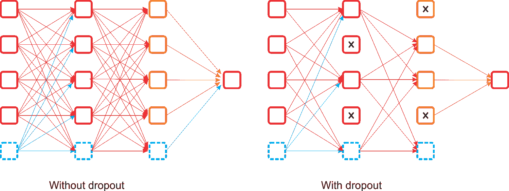

图 14：丢弃法与不丢弃法的对比

该方法的主要优点是避免了同一层的所有神经元同步优化它们的权重。这种在随机组中进行的适应，避免了所有神经元收敛到相同的目标，从而使得适应的权重不相关。应用 dropout 时发现的第二个特性是，隐藏单元的激活变得稀疏，这也是一种理想的特性。

由于在 CNN 中，目标函数之一是最小化计算出的代价，我们必须定义一个优化器。DL4j 支持以下优化器：

+   SGD（仅学习率）

+   Nesterov 的动量

+   Adagrad

+   RMSProp

+   Adam

+   AdaDelta

在大多数情况下，如果性能不满意，我们可以采用已实现的 RMSProp，它是梯度下降的高级形式。RMSProp 表现更好，因为它将学习率除以平方梯度的指数衰减平均值。建议的衰减参数值为 0.9，而学习率的一个良好默认值为 0.001。

更技术性地说，通过使用最常见的优化器，如**随机梯度下降**（**SGD**），学习率必须按 1/T 的比例进行缩放才能收敛，其中 T 是迭代次数。RMSProp 尝试通过自动调整步长来克服这一限制，使步长与梯度处于相同的尺度。因此，如果你正在训练神经网络，但计算梯度是必须的，使用 RMSProp 将是小批量训练中更快的学习方式。研究人员还建议在训练深度 CNN 或 DNN 时使用动量优化器。

从分层架构的角度来看，CNN 与 DNN 不同；它有不同的需求和调优标准。CNN 的另一个问题是卷积层需要大量的 RAM，尤其是在训练过程中，因为反向传播的反向传递需要保留前向传播过程中计算的所有中间值。在推理过程中（即对新实例进行预测时），一个层占用的 RAM 可以在下一个层计算完毕后释放，因此你只需要两个连续层所需的内存。

然而，在训练过程中，前向传播过程中计算的所有内容都需要在反向传播时保留下来，因此所需的内存量至少是所有层所需的总内存量。如果你的 GPU 在训练 CNN 时内存不足，这里有五个解决问题的建议（除了购买更大内存的 GPU）：

+   减小小批量的大小

+   使用较大的步幅在一层或多层中减少维度

+   移除一层或多层

+   使用 16 位浮点数代替 32 位浮点数

+   将 CNN 分布到多个设备上

# 总结

在本章中，我们已经看到如何使用和构建基于卷积神经网络（CNN）的现实应用，CNN 是一种前馈人工神经网络，其神经元之间的连接模式受到动物视觉皮层组织的启发。我们使用 CNN 构建的图像分类应用可以以可接受的准确度对现实世界中的图像进行分类，尽管我们没有达到更高的准确度。然而，鼓励读者在代码中调整超参数，并尝试使用其他数据集采用相同的方法。

然而，重要的是，由于卷积神经网络的内部数据表示没有考虑到简单和复杂物体之间的重要空间层级，因此 CNN 在某些实例中有一些严重的缺点和限制。因此，我建议你查看 GitHub 上关于胶囊网络的最新活动：[`github.com/topics/capsule-network`](https://github.com/topics/capsule-network)。希望你能从中获得一些有用的信息。

这基本上是我们使用 Scala 和不同开源框架开发机器学习项目的小旅程的结束。在各章中，我尝试为你提供了多个示例，展示如何有效地使用这些出色的技术来开发机器学习项目。在写这本书的过程中，我必须考虑到许多限制条件，例如页面数量、API 可用性和我的专业知识。但我尽量使书籍保持简洁，并且避免了过多的理论细节，因为关于 Apache Spark、DL4j 和 H2O 的理论内容，你可以在许多书籍、博客和网站上找到。

我还会在我的 GitHub 仓库上更新这本书的代码：[`github.com/PacktPublishing/Scala-Machine-Learning-Projects`](https://github.com/PacktPublishing/Scala-Machine-Learning-Projects)。随时欢迎提出新问题或提交任何拉取请求，以改善这本书，并保持关注。

最后，我写这本书并不是为了赚钱，但大部分版税将用于资助孟加拉国我家乡地区的儿童教育。我想感谢并对购买并享受这本书的读者表示衷心的感谢！
