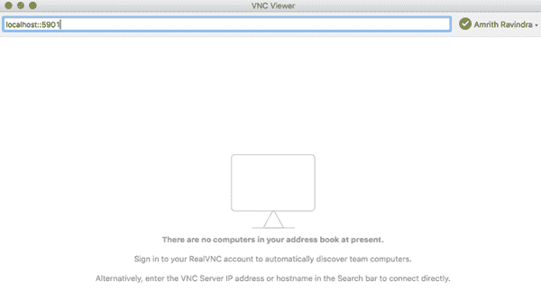
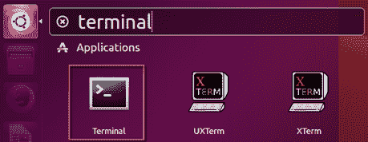

# 第一章：设置 Spark 进行深度学习开发

本章将涵盖以下内容：

+   下载 Ubuntu Desktop 镜像

+   在 macOS 上使用 VMWare Fusion 安装和配置 Ubuntu

+   在 Windows 上使用 Oracle VirtualBox 安装和配置 Ubuntu

+   在 Google Cloud Platform 上安装和配置 Ubuntu Desktop

+   在 Ubuntu Desktop 上安装和配置 Spark 及其先决条件

+   将 Jupyter 笔记本与 Spark 集成

+   启动和配置 Spark 集群

+   停止 Spark 集群

# 介绍

深度学习是机器学习算法的专注研究，采用神经网络作为其主要学习方法。深度学习在过去几年迅速崛起。微软、谷歌、Facebook、亚马逊、苹果、特斯拉及许多其他公司都在他们的应用程序、网站和产品中使用深度学习模型。与此同时，Spark，作为一个基于内存的大数据计算引擎，极大简化了以创纪录的速度和轻松度处理海量信息的过程。事实上，Spark 已经成为数据工程师、机器学习工程师和数据科学家首选的大数据开发工具。

由于深度学习模型在处理更多数据时表现更好，Spark 与深度学习的协同作用促成了二者的完美结合。与执行深度学习算法的代码几乎同等重要的是，能够实现最佳开发的工作环境。许多才俊渴望开发神经网络，以帮助解答研究中的重要问题。不幸的是，深度学习模型开发面临的最大障碍之一是缺乏必要的技术资源来在大数据上进行学习。本章的目的是为在 Spark 上进行深度学习开发创建一个理想的虚拟开发环境。

# 下载 Ubuntu Desktop 镜像

Spark 可以为各种操作系统进行配置，无论它们是本地部署还是云端部署。对于我们的目的，Spark 将安装在基于 Linux 的虚拟机上，操作系统为 Ubuntu。选择 Ubuntu 作为虚拟机的操作系统有几个优势，最重要的一个就是成本。由于 Ubuntu 基于开源软件，因此它是免费的，不需要许可费用。成本始终是一个考虑因素，本书的主要目标之一是尽量减少启动 Spark 框架上深度学习所需的财务支出。

# 准备就绪

下载镜像文件需要满足一些最低推荐要求：

+   最低要求 2 GHz 双核处理器

+   最低要求 2 GB 系统内存

+   至少 25 GB 的空闲硬盘空间

# 如何操作...

按照以下步骤下载 Ubuntu Desktop 镜像：

1.  为了创建 Ubuntu Desktop 虚拟机，必须首先从官方网站下载该文件：[`www.ubuntu.com/download/desktop.`](https://www.ubuntu.com/download/desktop)

1.  截至本文撰写时，Ubuntu Desktop 16.04.3 是最新的可供下载版本。

1.  下载完成后，访问以下`.iso`格式的文件：

    `ubuntu-16.04.3-desktop-amd64.iso`

# 它是如何工作的...

虚拟环境通过隔离与物理或主机机器的关系，为开发者提供了一个理想的开发工作空间。开发者可能使用各种不同的机器作为主机环境，例如运行 macOS 的 MacBook、运行 Windows 的 Microsoft Surface，甚至是运行在云上的虚拟机，如 Microsoft Azure 或 AWS；然而，为了确保代码执行的输出结果的一致性，将在 Ubuntu Desktop 中部署一个虚拟环境，该环境可以在多种主机平台上使用和共享。

# 还有更多...

根据主机环境是 Windows 还是 macOS，桌面虚拟化软件有几种选择。当使用 macOS 时，有两种常见的虚拟化软件应用：

+   VMWare Fusion

+   Parallels

# 参见

要了解更多关于 Ubuntu Desktop 的信息，可以访问 [`www.ubuntu.com/desktop`](https://www.ubuntu.com/desktop)。

# 在 macOS 上使用 VMWare Fusion 安装和配置 Ubuntu

本节将重点介绍使用**VMWare Fusion**构建基于 Ubuntu 操作系统的虚拟机。

# 准备中

你的系统中需要先安装 VMWare Fusion。如果你目前没有安装，可以从以下网站下载试用版：

[`www.vmware.com/products/fusion/fusion-evaluation.html`](https://www.vmware.com/products/fusion/fusion-evaluation.html)

# 如何操作...

按照下面的步骤，在 macOS 上使用 VMWare Fusion 配置 Ubuntu：

1.  一旦 VMWare Fusion 启动并运行，点击左上角的*+*按钮开始配置过程，选择“新建...”选项，如下图所示：


1.  一旦选择完成，选择从磁盘或镜像安装的选项，如下图所示：


1.  选择从 Ubuntu Desktop 网站下载的操作系统`iso`文件，如下图所示：


1.  下一步将询问你是否选择 Linux Easy Install。建议选择此选项，并为 Ubuntu 环境设置显示名称/密码组合，如下图所示：


1.  配置过程几乎完成。显示虚拟机摘要，并提供自定义设置的选项，以增加内存和硬盘，如下图所示：


1.  虚拟机的硬盘空间从 20 GB 到 40 GB 都足够；然而，将内存提升至 2 GB 或 4 GB 将有助于提高虚拟机在后续章节中执行 Spark 代码时的性能。通过选择虚拟机设置中的处理器和内存选项，将内存更新为所需的大小，如下图所示：


# 它是如何工作的...

该设置允许手动配置必要的设置，以便成功在 VMWare Fusion 上启动 Ubuntu Desktop。可以根据主机机器的需要和可用性增加或减少内存和硬盘存储。

# 还有更多内容...

剩下的就是第一次启动虚拟机，这将启动系统的安装过程。一旦所有设置完成并且用户登录后，Ubuntu 虚拟机就可以用于开发了，如下图所示：


# 另见

除了 VMWare Fusion 外，Mac 上还有另一个提供类似功能的产品，叫做 Parallels Desktop for Mac。要了解有关 VMWare 和 Parallels 的更多信息，并决定哪个程序更适合你的开发需求，请访问以下网站：

+   [`www.vmware.com/products/fusion.html`](https://www.vmware.com/products/fusion.html) 下载并安装 Mac 版 VMWare Fusion

+   [`parallels.com`](https://parallels.com) 下载并安装 Mac 版 Parallels Desktop

# 在 Windows 上使用 Oracle VirtualBox 安装和配置 Ubuntu

与 macOS 不同，Windows 有多个选项可以虚拟化系统。这主要是因为在 Windows 上进行虚拟化非常常见，因为大多数开发者使用 Windows 作为主机环境，并需要虚拟环境进行测试，而不影响依赖 Windows 的任何依赖项。

# 准备工作

Oracle 的 VirtualBox 是一种常见的虚拟化产品，可以免费使用。Oracle VirtualBox 提供了一个简单的流程，可以在 Windows 环境中快速启动并运行 Ubuntu Desktop 虚拟机。

# 如何操作...

按照以下步骤使用 **VirtualBox** 在 Windows 上配置 Ubuntu：

1.  启动 Oracle VM VirtualBox 管理器。接下来，点击新建图标创建一个新的虚拟机，并指定虚拟机的名称、类型和版本，如下图所示：


1.  选择专家模式，因为在配置步骤中有几个步骤将被合并，如下图所示：


理想的内存大小应至少设置为 `2048` MB，或者根据主机资源，最好设置为 `4096` MB。

1.  此外，为执行深度学习算法的 Ubuntu 虚拟机设置一个至少为 20 GB 的最佳硬盘大小（如果不是更多），如下面的截图所示：


1.  将虚拟机管理器指向下载了 Ubuntu `iso` 文件的启动盘位置，然后开始创建过程，如下图所示：


1.  安装完成后，选择开始图标以完成虚拟机并准备好进行开发，如下图所示：


# 工作原理...

设置允许手动配置必要的设置，以便在 Oracle VirtualBox 上成功运行 Ubuntu 桌面。与 VMWare Fusion 一样，内存和硬盘存储可以根据主机的需要和可用性进行增加或减少。

# 还有更多...

请注意，一些运行 Microsoft Windows 的机器默认未设置为虚拟化，用户可能会收到一条初始错误提示，表明 VT-x 未启用。这个问题可以通过重新启动时进入 BIOS 并启用虚拟化来解决。

# 另见

要了解更多关于 Oracle VirtualBox 的信息并决定它是否适合使用，请访问以下网站并选择 Windows 主机以开始下载过程：[`www.virtualbox.org/wiki/Downloads`](https://www.virtualbox.org/wiki/Downloads)。

# 为 Google Cloud Platform 安装和配置 Ubuntu 桌面

之前，我们看到如何使用 VMWare Fusion 在本地设置 Ubuntu 桌面。在本节中，我们将学习如何在 **Google Cloud Platform** 上执行相同的操作。

# 准备工作

唯一的要求是 Google 帐号用户名。首先，使用 Google 帐号登录到 Google Cloud Platform。Google 提供一个免费的 12 个月订阅，并为您的账户充值 300 美元。设置过程中会要求您提供银行信息；但 Google 不会在未明确告知的情况下收费。请继续验证您的银行账户，然后就可以开始了。

# 如何操作...

按照步骤配置 Ubuntu 桌面以适配 Google Cloud Platform：

1.  登录到 Google Cloud Platform 后，访问一个类似于以下截图的仪表板：


Google Cloud Platform 仪表板

1.  首先，点击屏幕左上角的产品服务按钮。在下拉菜单中，在计算下点击 VM 实例，如下图所示：


1.  创建一个新的实例并命名。我们在此案例中命名为 `ubuntuvm1`。在启动实例时，Google Cloud 会自动创建一个项目，实例将会在该项目 ID 下启动。项目可以根据需要重新命名。

1.  点击 **创建实例** 后，选择您所在的区域。

1.  在启动磁盘下选择 **Ubuntu 16.04LTS**，这是将在云中安装的操作系统。请注意，LTS 代表版本，并且会获得 Ubuntu 开发者的长期支持。

1.  接下来，在启动磁盘选项下，选择 SSD 持久磁盘，并将大小增加到 50 GB，为实例增加一些存储空间，如下截图所示：


1.  接下来，将访问范围设置为 **允许对所有 Cloud API 的完全访问**。

1.  在防火墙下，请勾选 **允许 HTTP 流量** 和 **允许 HTTPS 流量**，如下面截图所示：


选择允许 HTTP 流量和 HTTPS 流量

1.  一旦按照本节中所示配置完实例，点击创建按钮来创建实例。

点击创建按钮后，您会发现实例被创建，且具有唯一的内部和外部 IP 地址。我们将在后续阶段使用这个 IP 地址。SSH 指的是安全的 shell 隧道，本质上是一种加密的客户端-服务器通信方式。可以把它想象成数据从您的笔记本到 Google 的云服务器，经过加密隧道来回传输。

1.  点击新创建的实例。在下拉菜单中，点击 **在浏览器窗口中打开**，如下面截图所示：


1.  您会看到 Google 打开一个新的 shell/终端窗口，如下截图所示：


1.  一旦打开 shell，您应该看到如下截图所示的窗口：


1.  在 Google 云 Shell 中输入以下命令：

```py
$ sudo apt-get update
$ sudo apt-get upgrade
$ sudo apt-get install gnome-shell
$ sudo apt-get install ubuntu-gnome-desktop
$ sudo apt-get install autocutsel
$ sudo apt-get install gnome-core
$ sudo apt-get install gnome-panel
$ sudo apt-get install gnome-themes-standard
```

1.  当提示是否继续时，输入 `y` 然后按 ENTER，如下截图所示：


1.  完成前面的步骤后，输入以下命令来设置 `vncserver` 并允许连接到本地 shell：

```py
$ sudo apt-get install tightvncserver
$ touch ~/.Xresources
```

1.  接下来，通过输入以下命令来启动服务器：

```py
$ tightvncserver
```

1.  这将提示您输入密码，该密码稍后将用于登录到 Ubuntu Desktop 虚拟机。密码限制为八个字符，并需要设置和验证，如下面截图所示：


1.  shell 会自动生成一个启动脚本，如下面截图所示。可以通过复制并粘贴其 `PATH` 来访问和编辑该启动脚本：


1.  在我们的例子中，查看和编辑脚本的命令是：

```py
:~$ vim /home/amrith2kmeanmachine/.vnc/xstartup
```

这个`PATH`在不同情况下可能不同，请确保设置正确的`PATH`。在 Mac 上，`vim`命令会在文本编辑器中打开脚本。

本地终端生成了一个启动脚本和一个日志文件。需要在文本编辑器中打开并编辑该启动脚本，接下来将讨论这一过程。

1.  输入`vim`命令后，启动脚本的界面应类似于以下截图：


1.  输入`i`进入`INSERT`模式。接下来，删除启动脚本中的所有文本，界面应如以下截图所示：


1.  将以下代码复制粘贴到启动脚本中：

```py
#!/bin/sh
autocutsel -fork
xrdb $HOME/.Xresources
xsetroot -solid grey
export XKL_XMODMAP_DISABLE=1
export XDG_CURRENT_DESKTOP="GNOME-Flashback:Unity"
export XDG_MENU_PREFIX="gnome-flashback-"
unset DBUS_SESSION_BUS_ADDRESS
gnome-session --session=gnome-flashback-metacity --disable-acceleration-check --debug &
```

1.  启动脚本应出现在编辑器中，如下截图所示：


1.  按`Esc`退出`INSERT`模式，并键入`:wq`保存并退出文件。

1.  配置完启动脚本后，在 Google shell 中输入以下命令以终止服务器并保存更改：

```py
$ vncserver -kill :1
```

1.  该命令应产生一个进程 ID，类似于以下截图所示：


1.  通过输入以下命令重新启动服务器：

```py
$ vncserver -geometry 1024x640
```

接下来的步骤将重点介绍如何确保从本地主机到 Google Cloud 实例的 shell 隧道安全。在本地 shell/终端输入任何内容之前，请确保已经安装 Google Cloud。如果尚未安装，请按照以下网址中的快速入门指南进行安装：

[`cloud.google.com/sdk/docs/quickstart-mac-os-x`](https://cloud.google.com/sdk/docs/quickstart-mac-os-x)

1.  安装 Google Cloud 后，打开你机器上的终端并输入以下命令来连接到 Google Cloud 计算实例：

```py
$ gcloud compute ssh \
YOUR INSTANCE NAME HERE \
--project YOUR PROJECT NAME HERE \
--zone YOUR TIMEZONE HERE \
--ssh-flag "-L 5901:localhost:5901"
```

1.  确保在前面的命令中正确指定了实例名称、项目 ID 和区域。按下 ENTER 后，本地 shell 中的输出会变成以下截图所示：


1.  一旦看到实例名称后跟`":~$"`，就表示本地主机/笔记本与 Google Cloud 实例之间的连接已成功建立。在成功 SSH 连接到实例后，我们需要一款名为**VNC Viewer**的软件来查看并与已经在 Google Cloud Compute 引擎上成功设置的 Ubuntu 桌面进行交互。接下来的步骤将讨论如何实现这一目标。

1.  可以使用以下链接下载 VNC Viewer：

[`www.realvnc.com/en/connect/download/viewer/`](https://www.realvnc.com/en/connect/download/viewer/)

1.  安装完成后，点击打开 VNC Viewer，在搜索栏中输入`localhost::5901`，如以下截图所示：



1.  接下来，在出现以下屏幕时点击**继续**：


1.  这将提示您输入虚拟机的密码。请输入您在第一次启动`tightvncserver`命令时设置的密码，如下图所示：


1.  最终，您将进入 Google Cloud Compute 上的 Ubuntu 虚拟机桌面。通过 VNC Viewer 查看时，您的 Ubuntu Desktop 屏幕现在应显示如下截图所示的内容：


# 它是如何工作的...

您现在已经成功设置了 VNC Viewer 以与 Ubuntu 虚拟机/桌面进行交互。每当 Google Cloud 实例未在使用时，建议暂停或关闭实例，以避免产生额外费用。云计算方法非常适合那些可能无法访问具有高内存和存储的物理资源的开发者。

# 还有更多...

虽然我们讨论了将 Google Cloud 作为 Spark 的云选项，但也可以在以下云平台上使用 Spark：

+   Microsoft Azure

+   亚马逊网络服务

# 另请参见

若要了解更多有关 Google Cloud Platform 的信息并注册免费订阅，请访问以下网站：

[`cloud.google.com/`](https://cloud.google.com/)

# 在 Ubuntu Desktop 上安装和配置 Spark 及其先决条件

在 Spark 启动之前，需要在全新的 Ubuntu Desktop 上安装一些必要的先决条件。本节将重点介绍在 Ubuntu Desktop 上安装和配置以下内容：

+   Java 8 或更高版本

+   Anaconda

+   Spark

# 准备就绪

本节唯一的要求是具有管理员权限，以便在 Ubuntu Desktop 上安装应用程序。

# 如何操作...

本节将通过以下步骤指导您在 Ubuntu Desktop 上安装 Python 3、Anaconda 和 Spark：

1.  通过终端应用程序在 Ubuntu 上安装 Java，您可以通过搜索该应用程序并将其锁定到左侧的启动栏来找到它，如下图所示：



1.  在虚拟机上通过终端执行以下命令进行 Java 的初步测试：

```py
java -version
```

1.  在终端中执行以下四个命令来安装 Java：

```py
sudo apt-get install software-properties-common 
$ sudo add-apt-repository ppa:webupd8team/java
$ sudo apt-get update
$ sudo apt-get install oracle-java8-installer
```

1.  在接受 Oracle 的必要许可协议后，再次通过在终端中执行 `java -version` 来对虚拟机上的 Java 进行二次测试。Java 安装成功后，终端将显示以下结果：

```py
$ java -version
java version "1.8.0_144"
Java(TM) SE Runtime Environment (build 1.8.0_144-b01)
Java HotSpot(TM) 64-Bit Server VM (build 25.144-b01, mixed mode)
```

1.  接下来，安装最新版本的 Anaconda。当前版本的 Ubuntu Desktop 已预装 Python。虽然 Ubuntu 中预装了 Python 非常方便，但所安装的版本是 Python 2.7，如下所示：

```py
$ python --version
Python 2.7.12
```

1.  当前 Anaconda 版本为 v4.4，当前 Python 3 版本为 v3.6。下载完成后，通过以下命令访问`Downloads`文件夹查看 Anaconda 安装文件：

```py
$ cd Downloads/
~/Downloads$ ls
Anaconda3-4.4.0-Linux-x86_64.sh
```

1.  进入`Downloads`文件夹后，执行以下命令启动 Anaconda 的安装：

```py
~/Downloads$ bash Anaconda3-4.4.0-Linux-x86_64.sh 
Welcome to Anaconda3 4.4.0 (by Continuum Analytics, Inc.)
In order to continue the installation process, please review the license agreement.
Please, press ENTER to continue
```

请注意，Anaconda 的版本以及安装的其他软件可能会有所不同，因为更新版本会定期发布。我们在本章和本书中使用的 Anaconda 版本可以从[`repo.continuum.io/archive/Anaconda3-4.4.0-Linux-x86.sh`](https://repo.continuum.io/archive/Anaconda3-4.4.0-Linux-x86.sh)下载。

1.  Anaconda 安装完成后，重启终端应用程序，通过在终端中执行`python --version`命令来确认 Python 3 现在是默认的 Python 环境：

```py
$ python --version
Python 3.6.1 :: Anaconda 4.4.0 (64-bit)
```

1.  Python 2 版本仍然可以在 Linux 下使用，但在执行脚本时需要显式调用，如下命令所示：

```py
~$ python2 --version
Python 2.7.12
```

1.  访问以下网站，开始 Spark 的下载和安装过程：

[`spark.apache.org/downloads.html`](https://spark.apache.org/downloads.html)

1.  选择下载链接。以下文件将被下载到 Ubuntu 的`Downloads`文件夹中：

`spark-2.2.0-bin-hadoop2.7.tgz`

1.  通过执行以下命令在终端查看文件：

```py
$ cd Downloads/
~/Downloads$ ls
spark-2.2.0-bin-hadoop2.7.tgz
```

1.  通过执行以下命令提取`tgz`文件：

```py
~/Downloads$ tar -zxvf spark-2.2.0-bin-hadoop2.7.tgz
```

1.  使用`ls`命令再次查看`Downloads`目录，显示了`tug`文件和提取后的文件夹：

```py
~/Downloads$ ls
spark-2.2.0-bin-hadoop2.7 spark-2.2.0-bin-hadoop2.7.tgz
```

1.  执行以下命令，将提取的文件夹从`Downloads`文件夹移动到`Home`文件夹：

```py
~/Downloads$ mv spark-2.2.0-bin-hadoop2.7 ~/
~/Downloads$ ls
spark-2.2.0-bin-hadoop2.7.tgz
~/Downloads$ cd
~$ ls
anaconda3 Downloads Pictures Templates
Desktop examples.desktop Public Videos
Documents Music spark-2.2.0-bin-hadoop2.7
```

1.  现在，`spark-2.2.0-bin-hadoop2.7`文件夹已经被移动到**Home**文件夹，可以通过点击左侧工具栏中的**Files**图标查看，如下图所示：


1.  Spark 现在已安装。通过在终端执行以下脚本，启动 Spark：

```py
~$ cd ~/spark-2.2.0-bin-hadoop2.7/
~/spark-2.2.0-bin-hadoop2.7$ ./bin/pyspark
```

1.  通过执行以下命令在终端进行最后测试，以确保`SparkContext`正在驱动本地环境中的集群，确保 Spark 已成功运行：

```py
>>> sc
<SparkContext master=local[*] appName=PySparkShell>
```

# 它是如何工作的...

本节解释了安装 Python、Anaconda 和 Spark 过程背后的理由。

1.  Spark 运行在**Java 虚拟机**（**JVM**）上，Java **软件开发工具包**（**SDK**）是 Spark 在 Ubuntu 虚拟机上运行的前提安装条件。

为了让 Spark 在本地机器或集群上运行，安装时需要最低版本的 Java 6。

1.  Ubuntu 建议使用`sudo apt install`方法安装 Java，因为它确保下载的包是最新的。

1.  请注意，如果当前未安装 Java，终端中将显示以下消息：

    ```py
    The program 'java' can be found in the following packages:
    * default-jre
    * gcj-5-jre-headless
    * openjdk-8-jre-headless
    * gcj-4.8-jre-headless
    * gcj-4.9-jre-headless
    * openjdk-9-jre-headless
    Try: sudo apt install <selected package>
    ```

    1.  虽然 Python 2 仍然可用，但它已被视为遗留版本。Python 2 将于 2020 年停止支持；因此，建议所有新的 Python 开发都使用 Python 3，正如本书中的示例一样。直到最近，Spark 只支持 Python 2。现在情况已经不同，Spark 支持 Python 2 和 3。安装 Python 3 及其众多依赖库和工具包的一个便捷方法是通过 Anaconda。Anaconda 是一个免费的开源 Python 和 R 发行版，它负责管理数据科学相关任务中最常用的 Python 包的安装和维护。

    1.  在安装 Anaconda 过程中，确认以下条件是很重要的：

        +   Anaconda 安装在 `/home/username/Anaconda3` 位置

        +   Anaconda 安装程序会将 Anaconda3 的安装位置添加到 `/home/username/.bashrc` 中的 `PATH` 环境变量。

    1.  在安装了 Anaconda 之后，下载 Spark。与 Python 不同，Spark 在 Ubuntu 上没有预安装，因此需要手动下载并安装。

    1.  为了进行深度学习开发，将为 Spark 选择以下偏好设置：

        +   **Spark 版本**：**2.2.0**（2017 年 7 月 11 日）

        +   **软件包类型**：预构建的 Apache Hadoop 2.7 及更高版本

        +   **下载类型**：直接下载

    1.  一旦 Spark 成功安装，执行 Spark 命令行后的输出应该类似于以下截图所示：

    1.  初始化 Spark 时需要注意的两个重要特性是，它位于 `Python 3.6.1` | `Anaconda 4.4.0 (64-bit)` | 框架下，并且 Spark 的版本为 2.2.0。

    1.  恭喜！Spark 已成功安装在本地 Ubuntu 虚拟机上。但是，并不是一切都完成了。Spark 开发最理想的方式是在 Jupyter notebook 中执行 Spark 代码，特别是在深度学习的情况下。幸运的是，Jupyter 已经在本节早些时候通过 Anaconda 安装。

    # 更多内容...

    你可能会问，为什么我们不直接使用 `pip install pyspark` 来在 Python 中使用 Spark。之前的 Spark 版本需要通过本节中描述的安装过程。自 Spark 2.2.0 起，未来版本将开始支持通过 `pip` 直接安装。我们在本节中使用完整的安装方法，以确保你能够正确安装并完全集成 Spark，尤其是如果你正在使用 Spark 的早期版本。

    # 另见

    要了解更多关于 Jupyter notebooks 及其与 Python 集成的信息，请访问以下网站：

    [`jupyter.org`](http://jupyter.org)

    要了解更多关于 Anaconda 的信息并下载 Linux 版本，请访问以下网站：

    [`www.anaconda.com/download/`](https://www.anaconda.com/download/)

    # 将 Jupyter notebooks 与 Spark 集成

    在第一次学习 Python 时，使用 Jupyter 笔记本作为**交互式开发环境**（**IDE**）非常有用。这也是 Anaconda 如此强大的主要原因之一。它完全整合了 Python 和 Jupyter 笔记本之间的所有依赖关系。同样的操作也可以通过 PySpark 和 Jupyter 笔记本来实现。尽管 Spark 是用**Scala**编写的，PySpark 则允许代码在 Python 中进行转换。

    # 准备就绪

    本节的大部分工作只需要从终端访问`.bashrc`脚本。

    # 如何操作...

    默认情况下，PySpark 未配置为在 Jupyter 笔记本中工作，但稍微调整一下`.bashrc`脚本可以解决这个问题。我们将在本节中介绍这些步骤：

    1.  通过执行以下命令来访问`.bashrc`脚本：

    ```py
    $ nano .bashrc
    ```

    1.  滚动到脚本的末尾应显示最后修改的命令，该命令应该是之前部分安装过程中 Anaconda 设置的`PATH`。`PATH`应如下所示：

    ```py
    # added by Anaconda3 4.4.0 installer
    export PATH="/home/asherif844/anaconda3/bin:$PATH"
    ```

    1.  在下面，Anaconda 安装程序添加的`PATH`可以包括一个自定义函数，帮助将 Spark 安装与 Anaconda3 中的 Jupyter 笔记本安装进行通信。为了本章及后续章节的目的，我们将该函数命名为`sparknotebook`。对于`sparknotebook()`，配置应如下所示：

    ```py
    function sparknotebook()
    {
    export SPARK_HOME=/home/asherif844/spark-2.2.0-bin-hadoop2.7
    export PYSPARK_PYTHON=python3
    export PYSPARK_DRIVER_PYTHON=jupyter
    export PYSPARK_DRIVER_PYTHON_OPTS="notebook"
    $SPARK_HOME/bin/pyspark
    }
    ```

    1.  更新后的`.bashrc`脚本保存后应如下所示：

    1.  保存并退出`.bashrc`文件。建议通过执行以下命令并重新启动终端应用程序来通知`.bashrc`文件已更新：

    ```py
    $ source .bashrc
    ```

    # 它是如何工作的...

    本节的目标是将 Spark 直接集成到 Jupyter 笔记本中，以便我们不再在终端中进行开发，而是利用在笔记本中开发的优势。本节解释了如何将 Spark 集成到 Jupyter 笔记本中。

    1.  我们将创建一个命令函数`sparknotebook`，可以通过终端调用它，从 Anaconda 安装中通过 Jupyter 笔记本打开 Spark 会话。这需要在`.bashrc`文件中设置两个配置：

        1.  设置 PySpark 的 Python 版本为 Python 3

        1.  为 Python 设置 PySpark 驱动程序以在 Jupyter 中运行

    1.  现在可以通过执行以下命令直接从终端访问`sparknotebook`函数：

    ```py
    $ sparknotebook
    ```

    1.  然后，函数应通过默认的网页浏览器启动全新的 Jupyter 笔记本会话。可以通过点击右侧的**New**按钮并选择**Notebook**下的**Python 3**来创建一个带有`.ipynb`扩展名的新的 Python 脚本，如下图所示：

    1.  一如既往，就像在终端层面为 Spark 所做的那样，`sc` 的简单脚本将会在 notebook 中执行，以确认 Spark 已通过 Jupyter 启动：

    1.  理想情况下，`Version`、`Master` 和 `AppName` 应该与执行 `sc` 命令时的输出相同。如果是这样，那么 PySpark 已经成功安装并配置好了，可以与 Jupyter notebook 一起使用。

    # 还有更多...

    需要注意的是，如果我们通过终端调用 Jupyter notebook 时没有指定 `sparknotebook`，我们的 Spark 会话将无法启动，并且在执行 `SparkContext` 脚本时会收到错误。

    我们可以通过在终端执行以下命令来访问传统的 Jupyter notebook：

    ```py
    jupyter-notebook
    ```

    一旦我们启动 notebook，我们可以尝试执行与之前相同的 `sc.master` 脚本，但这次我们会收到以下错误：

    

    # 另见

    有许多在线管理的 Spark 服务，这些公司通过 notebook 接口提供 Spark，其中 Spark 的安装和配置已经为您管理好了。以下是这些服务：

    +   Hortonworks ([`hortonworks.com/`](https://hortonworks.com/))

    +   Cloudera ([`www.cloudera.com/`](https://www.cloudera.com/))

    +   MapR ([`mapr.com/`](https://mapr.com/))

    +   DataBricks ([`databricks.com/`](https://mapr.com/))

    # 启动和配置 Spark 集群

    对于大多数章节，我们首先要做的就是初始化并配置我们的 Spark 集群。

    # 准备工作

    在初始化集群之前导入以下内容。

    +   `from pyspark.sql import SparkSession`

    # 如何操作...

    本节介绍了初始化和配置 Spark 集群的步骤。

    1.  使用以下脚本导入 `SparkSession`：

    ```py
    from pyspark.sql import SparkSession
    ```

    1.  使用以下脚本配置名为 `spark` 的 `SparkSession`：

    ```py
    spark = SparkSession.builder \
        .master("local[*]") \
        .appName("GenericAppName") \
        .config("spark.executor.memory", "6gb") \
    .getOrCreate()
    ```

    # 它是如何工作的...

    本节解释了 `SparkSession` 作为开发 Spark 应用程序的入口点的工作原理。

    1.  从 Spark 2.0 开始，不再需要创建 `SparkConf` 和 `SparkContext` 来开始在 Spark 中的开发。这些步骤不再需要，因为导入 `SparkSession` 就可以处理集群的初始化。此外，需要注意的是，`SparkSession` 是 `pyspark` 的 `sql` 模块的一部分。

    1.  我们可以为 `SparkSession` 分配属性：

        1.  `master`：将 Spark 主节点 URL 分配到我们 `local` 机器上，并使用最大可用核心数运行。

        1.  `appName`：为应用程序分配一个名称

        1.  `config`：将 `6gb` 分配给 `spark.executor.memory`

        1.  `getOrCreate`：确保如果没有可用的 `SparkSession` 则创建一个，如果有现有的，则获取它。

    # 还有更多...

    对于开发目的，当我们在较小的数据集上构建应用时，可以使用 `master("local")`。如果我们要部署到生产环境中，我们则需要指定 `master("local[*]")`，以确保使用最大可用核心数并获得最佳性能。

    # 另请参见

    要了解更多关于 `SparkSession.builder` 的信息，请访问以下网站：

    [`spark.apache.org/docs/2.2.0/api/java/org/apache/spark/sql/SparkSession.Builder.html`](https://spark.apache.org/docs/2.2.0/api/java/org/apache/spark/sql/SparkSession.Builder.html)

    # 停止 Spark 集群

    一旦我们完成在集群上的开发，关闭集群以节省资源是理想的做法。

    # 如何操作…

    本节将演示如何停止 `SparkSession`。

    1.  执行以下脚本：

    `spark.stop()`

    1.  执行以下脚本来确认会话是否已关闭：

    `sc.master`

    # 它是如何工作的…

    本节解释如何确认 Spark 集群已被关闭。

    1.  如果集群已被关闭，当你在笔记本中执行另一个 Spark 命令时，将会收到以下截图中的错误信息：

    # 还有更多…

    在本地环境中工作时，关闭 Spark 集群可能并不是那么重要；然而，当 Spark 部署在云环境中时，关闭集群就显得至关重要，因为在云环境中，你将为计算资源付费。
