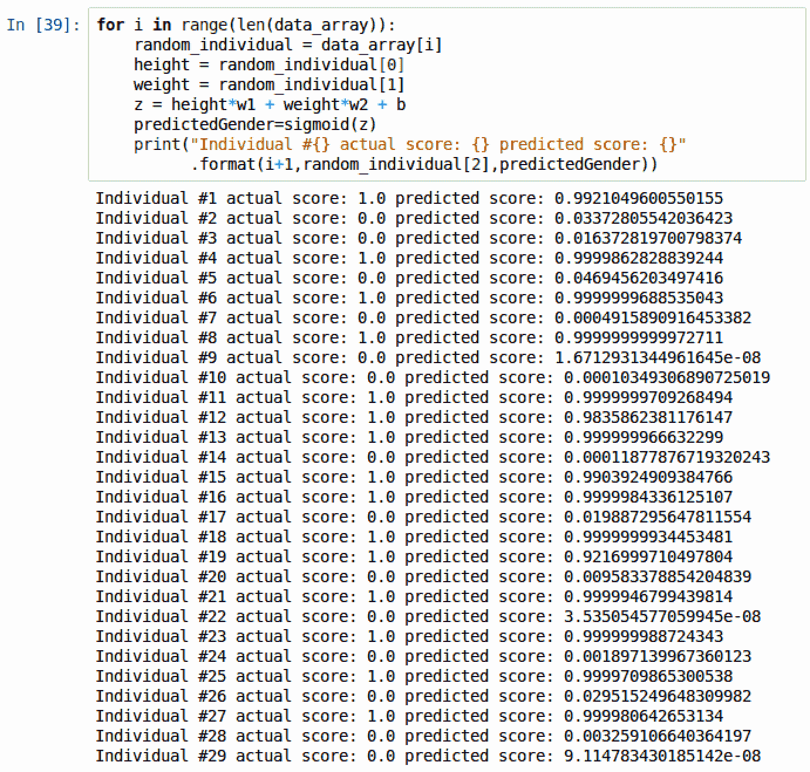
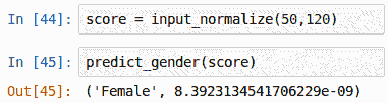

# 第二章：在 Spark 中创建神经网络

本章将介绍以下几个食谱：

+   在 PySpark 中创建数据框

+   操作 PySpark 数据框中的列

+   将 PySpark 数据框转换为数组

+   在散点图中可视化数组

+   设置权重和偏差以输入到神经网络中

+   为神经网络归一化输入数据

+   验证数组以优化神经网络性能

+   使用 sigmoid 设置激活函数

+   创建 sigmoid 导数函数

+   计算神经网络中的成本函数

+   根据身高和体重预测性别

+   可视化预测分数

# 介绍

本书的许多部分将重点介绍使用 Python 中的库（如 TensorFlow 和 Keras）构建深度学习算法。虽然这些库对于在不深入学习深度学习的微积分和线性代数的情况下构建深度神经网络非常有用，但本章将深入探讨如何在 PySpark 中构建一个简单的神经网络，以根据身高和体重进行性别预测。理解神经网络基础的最佳方法之一是从零开始构建一个模型，而不是依赖任何流行的深度学习库。一旦神经网络框架的基础构建完成，理解和使用一些更流行的深度神经网络库将变得更加简单。

# 在 PySpark 中创建数据框

数据框将作为构建深度学习模型时使用的所有数据的框架。类似于 Python 中的`pandas`库，PySpark 也有自己的内置功能来创建数据框。

# 准备开始

在 Spark 中创建数据框有几种方法。一种常见的方法是导入`.txt`、`.csv`或`.json`文件。另一种方法是手动将字段和数据行输入到 PySpark 数据框中，虽然这个过程有点繁琐，但它非常有帮助，尤其是在处理小数据集时。为了根据身高和体重预测性别，本章将手动在 PySpark 中构建一个数据框。所使用的数据集如下：


本章将手动将数据集添加到 PySpark 中，但数据集也可以通过以下链接查看和下载：

[`github.com/asherif844/ApacheSparkDeepLearningCookbook/blob/master/CH02/data/HeightAndWeight.txt`](https://github.com/asherif844/ApacheSparkDeepLearningCookbook/blob/master/CH02/data/HeightAndWeight.txt)

最后，我们将通过启动一个配置了 Jupyter Notebook 的 Spark 环境来开始本章和未来的章节，该环境是在第一章中创建的，*为深度学习设置您的 Spark 环境*，并使用以下终端命令：

```py
sparknotebook
```

# 如何进行...

在使用 PySpark 时，必须首先导入并初始化`SparkSession`，然后才能创建任何数据框：

1.  使用以下脚本导入`SparkSession`：

```py
from pyspark.sql import SparkSession

```

1.  配置`SparkSession`：

```py
spark = SparkSession.builder \
         .master("local") \
         .appName("Neural Network Model") \
         .config("spark.executor.memory", "6gb") \
         .getOrCreate()
sc = spark.sparkContext
```

1.  在这种情况下，`SparkSession`的`appName`命名为`Neural Network Model`，并且会话内存被分配为`6gb`。

# 它是如何工作的...

本节解释了如何创建我们的 Spark 集群并配置我们的第一个 dataframe。

1.  在 Spark 中，我们使用`.master()`来指定我们是否将在分布式集群上运行作业或在本地运行。为了本章及后续章节的目的，我们将在本地执行 Spark，并指定一个工作线程，使用`.master('local')`。这对于测试和开发来说是可以的，正如我们在本章所做的那样；然而，如果将其部署到生产环境中，可能会遇到性能问题。在生产环境中，建议使用`.master('local[*]')`，将 Spark 设置为尽可能在本地可用的所有工作节点上运行。如果我们机器上有 3 个核心，并且想要将节点数设置为匹配，我们将指定`.master('local[3]')`。

1.  `dataframe`变量`df`首先通过插入每列的行值，然后通过插入列头名称来创建，使用以下脚本：

```py
df = spark.createDataFrame([('Male', 67, 150), # insert column values
                            ('Female', 65, 135),
                            ('Female', 68, 130),
                            ('Male', 70, 160),
                            ('Female', 70, 130),
                            ('Male', 69, 174),
                            ('Female', 65, 126),
                            ('Male', 74, 188),
                            ('Female', 60, 110),
                            ('Female', 63, 125),
                            ('Male', 70, 173),
                            ('Male', 70, 145),
                            ('Male', 68, 175),
                            ('Female', 65, 123),
                            ('Male', 71, 145),
                            ('Male', 74, 160),
                            ('Female', 64, 135),
                            ('Male', 71, 175),
                            ('Male', 67, 145),
                            ('Female', 67, 130),
                            ('Male', 70, 162),
                            ('Female', 64, 107),
                            ('Male', 70, 175),
                            ('Female', 64, 130),
                            ('Male', 66, 163),
                            ('Female', 63, 137),
                            ('Male', 65, 165),
                            ('Female', 65, 130),
                            ('Female', 64, 109)], 
                           ['gender', 'height','weight']) # insert header values
```

1.  在 PySpark 中，`show()`函数提供了预览前 20 行的能力，如以下截图所示，使用上面的脚本时：


# 还有更多内容...

`.show()`功能默认显示 20 行，如果没有明确指定。如果我们只想显示 dataframe 的前 5 行，我们需要明确声明，如以下脚本所示：`df.show(5)`。

# 参见：

为了深入了解 SparkSQL、dataframe、函数和 PySpark 中的数据集，请访问以下网站：

[`spark.apache.org/docs/latest/sql-programming-guide.html`](https://spark.apache.org/docs/latest/sql-programming-guide.html)

# 在 PySpark dataframe 中操作列

dataframe 几乎完成了；然而，在构建神经网络之前，有一个问题需要解决。与其将`gender`值保留为字符串，不如将其转换为数字整数以便于计算，随着本章内容的推进，这一点将变得更加明显。

# 准备工作

本节将需要导入以下内容：

+   `from pyspark.sql import functions`

# 如何操作...

本节将演示如何将字符串转换为 dataframe 中的数字值：

+   女性 --> 0

+   男性 --> 1

1.  将 dataframe 中的列值转换需要导入`functions`：

```py
from pyspark.sql import functions
```

1.  接下来，使用以下脚本将`gender`列修改为数字值：

```py
df = df.withColumn('gender',functions.when(df['gender']=='Female',0).otherwise(1))
```

1.  最后，使用以下脚本重新排序列，使得`gender`成为 dataframe 中的最后一列：

```py
df = df.select('height', 'weight', 'gender')
```

# 它是如何工作的...

本节解释了如何应用 dataframe 的操作。

1.  `functions from pyspark.sql`有多种有用的逻辑应用，可用于在 Spark dataframe 中的列上应用 if-then 转换。在我们的案例中，我们将`Female`转换为 0，将`Male`转换为 1。

1.  转换为数字的函数通过`.withColumn()`转换应用于 Spark 数据框。

1.  Spark 数据框的`.select()`特性类似于传统的 SQL，通过按要求的顺序和方式选择列。

1.  数据框的最终预览将显示更新后的数据集，如以下截图所示：


# 还有更多...

除了数据框的`withColumn()`方法外，还有`withColumnRenamed()`方法，用于重命名数据框中的列。

# 将 PySpark 数据框转换为数组

为了构建神经网络的基础结构，必须将 PySpark 数据框转换为数组。Python 有一个非常强大的库`numpy`，它使得处理数组变得简单。

# 准备工作

`numpy`库应该已经包含在`anaconda3` Python 包的安装中。然而，如果由于某种原因`numpy`库不可用，可以通过在终端使用以下命令进行安装：


`pip install`或`sudo pip install`将确认所请求的库是否已满足需求：

```py
import numpy as np
```

# 如何操作...

本节逐步讲解如何将数据框转换为数组：

1.  使用以下脚本查看从数据框收集的数据：

```py
df.select("height", "weight", "gender").collect()
```

1.  使用以下脚本将收集的值存储到名为`data_array`的数组中：

```py
data_array =  np.array(df.select("height", "weight", "gender").collect())
```

1.  执行以下脚本以访问数组的第一行：

```py
data_array[0]
```

1.  类似地，执行以下脚本以访问数组的最后一行：

```py
data_array[28]
```

# 它是如何工作的...

本节说明了如何将数据框转换为数组：

1.  我们的数据框的输出可以通过`collect()`收集，并如以下截图所示查看：


1.  数据框被转换为数组，来自该脚本的数组输出可以在以下截图中看到：


1.  可以通过引用数组的索引来访问任意一组`height`（身高）、`weight`（体重）和`gender`（性别）值。该数组的形状为（29,3），长度为 29 个元素，每个元素由三项组成。虽然数组的长度是 29，但索引从`[0]`开始，到`[28]`结束。数组的形状以及第一行和最后一行的输出可以在以下截图中查看：


1.  数组的第一个和最后一个值可以与原始数据框进行比较，以确认转换过程中值和顺序未发生变化。

# 还有更多...

除了查看数组中的数据点外，检索数组中每个特征的最小值和最大值也非常有用：

1.  要检索`height`（身高）、`weight`（体重）和`gender`（性别）的最小值和最大值，可以使用以下脚本：

```py
print(data_array.max(axis=0))
print(data_array.min(axis=0))
```

1.  脚本的输出可以在以下截图中看到：


最大的`身高`为`74`英寸，最小的`身高`为`60`英寸。最大的体重为`188`磅，而最小的体重为`107`磅。性别的最小值和最大值不太相关，因为我们已将其分配为数值`0`和`1`。

# 另见

要了解更多关于 numpy 的信息，请访问以下网站：

[www.numpy.org](http://www.numpy.org)

# 在散点图中可视化一个数组

本章开发的神经网络的目标是预测一个个体的性别，前提是已知其`身高`和`体重`。理解`身高`、`体重`和`性别`之间关系的强大方法是通过可视化馈送神经网络的数据点。这可以通过流行的 Python 可视化库`matplotlib`来实现。

# 准备中

与`numpy`一样，`matplotlib`应该在安装 anaconda3 Python 包时自动可用。不过，如果由于某种原因`matplotlib`不可用，可以通过以下命令在终端安装：


`pip install`或`sudo pip install`将确认所需的库已满足安装要求。

# 如何操作…

本节介绍了通过散点图可视化数组的步骤。

1.  导入`matplotlib`库，并使用以下脚本配置该库以在 Jupyter 笔记本中可视化图形：

```py
 import matplotlib.pyplot as plt
 %matplotlib inline
```

1.  接下来，使用`numpy`的`min()`和`max()`函数确定散点图的*x*轴和 y 轴的最小值和最大值，如以下脚本所示：

```py
min_x = data_array.min(axis=0)[0]-10
max_x = data_array.max(axis=0)[0]+10
min_y = data_array.min(axis=0)[1]-10
max_y = data_array.max(axis=0)[1]+10
```

1.  执行以下脚本以绘制每个`性别`的`身高`和`体重`：

```py
# formatting the plot grid, scales, and figure size
plt.figure(figsize=(9, 4), dpi= 75)
plt.axis([min_x,max_x,min_y,max_y])
plt.grid()
for i in range(len(data_array)):
    value = data_array[i]
    # assign labels values to specific matrix elements
    gender = value[2]
    height = value[0]
    weight = value[1]

    # filter data points by gender
    a = plt.scatter(height[gender==0],weight[gender==0], marker 
      = 'x', c= 'b', label = 'Female')
    b = plt.scatter(height[gender==1],weight[gender==1], marker 
      = 'o', c= 'b', label = 'Male')

   # plot values, title, legend, x and y axis
   plt.title('Weight vs Height by Gender')
   plt.xlabel('Height (in)')
   plt.ylabel('Weight (lbs)')
   plt.legend(handles=[a,b])
```

# 它是如何工作的…

本节解释了如何将数组绘制为散点图：

1.  `matplotlib`库已导入 Jupyter 笔记本，并配置为在 Jupyter 笔记本的单元格中内联绘制可视化图表

1.  确定 x 轴和 y 轴的最小值和最大值，以便调整我们的图表大小并为我们提供最佳的图形外观。脚本的输出可以在以下截图中看到：


1.  每个轴上添加了`10`个点的像素缓冲区，以确保所有数据点都被捕获而不会被裁剪。

1.  创建一个循环，遍历每一行的值，并绘制`体重`与`身高`的关系。

1.  此外，为`女性`分配了不同的样式点，`x`，而为`男性`分配了`o`。

1.  绘制体重与身高按性别分类的脚本输出可以在以下截图中看到：


# 还有更多…

散点图提供了一种快速且直观的方式，帮助理解数据的情况。散点图的右上象限和左下象限之间存在明显的分界。所有高于 140 磅的数据点表示`男性`，所有低于该值的数据点则表示`女性`，如下图所示：


这个散点图有助于确认当我们选择一个随机的身高和体重来预测性别时，后续在本章中创建神经网络的结果应该是什么。

# 另请参见

要了解更多关于`matplotlib`的信息，请访问以下网站：

[www.matplotlib.org](http://www.matplotlib.org/)

# 设置神经网络输入的权重和偏差

PySpark 框架和数据现在已经准备好了。接下来是构建神经网络。无论神经网络的复杂性如何，开发过程都会遵循类似的路径：

1.  输入数据

1.  添加权重和偏差

1.  求数据与权重的乘积之和

1.  应用激活函数

1.  评估输出并与期望的结果进行比较

本节将重点介绍设置权重，这些权重将作为输入并传递到激活函数中。

# 准备工作

对简单神经网络构建模块的初步理解，有助于理解本节及本章其余部分的内容。每个神经网络都有输入和输出。在我们的案例中，输入是个体的身高和体重，输出是性别。为了获得输出，输入会与值（也称为权重：w1 和 w2）相乘，然后加上偏差（b）。这个方程式被称为求和函数 z，其形式如下：

z = (input1) x (w1) + (input2) x (w2) + b

权重和偏差最初只是随机生成的值，可以通过`numpy`来进行操作。权重实际上会通过增加或减少其对输出的影响来“加重”输入。偏差则起着稍微不同的作用，它会根据预测需要，将求和（z）的基线向上或向下移动。每个 z 的值随后会通过激活函数转化为一个在 0 到 1 之间的预测值。激活函数是一个转换器，它为我们提供一个可以转换为二进制输出（男性/女性）的值。然后，预测输出将与实际输出进行比较。最初，预测输出和实际输出之间的差异会很大，因为在开始时权重是随机的。然而，使用一种被称为反向传播的过程，可以通过梯度下降技术最小化实际输出与预测输出之间的差异。一旦我们得到一个微不足道的差异，便会保存 w1、w2 和 b 的值，以供神经网络使用。

# 如何实现……

本节讲解了设置神经网络的权重和偏置的步骤。

1.  使用以下脚本设置值生成器的随机性：

```py
np.random.seed(12345)
```

1.  使用以下脚本设置权重和偏置：

```py
w1 = np.random.randn()
w2 = np.random.randn()
b= np.random.randn()
```

# 它是如何工作的…

本节解释了如何初始化权重和偏置，以便在本章后面的部分使用：

1.  权重是通过`numpy`随机生成的，并设置了随机种子，以确保每次生成相同的随机数

1.  权重将被赋予通用变量`w1`和`w2`

1.  偏置同样是通过`numpy`随机生成的，并设置了随机种子，以确保每次生成相同的随机数

1.  偏置将被赋予一个通用变量`b`

1.  这些值被插入到一个求和函数`z`中，生成一个初始得分，该得分将输入到另一个函数——激活函数，稍后将在本章中讨论

1.  目前，所有三个变量都是完全随机的。`w1`、`w2`和`b`的输出可以在以下截图中看到：


# 还有更多…

最终目标是获得与实际输出匹配的预测输出。求和权重和数值的乘积有助于实现这一过程的一部分。因此，一个随机输入`0.5`和`0.5`的求和输出为：

```py
z = 0.5 * w1 + 0.5 * w2 + b 
```

或者，使用当前随机的权重值`w1`和`w2`，将得到以下输出：

```py
z = 0.5 * (-0.2047) + 0.5 * (0.47894) + (-0.51943) = -7.557
```

变量`z`被赋值为权重与数据点的乘积和。目前，权重和偏置是完全随机的。然而，正如本节前面提到的，通过一种叫做反向传播*的过程，使用梯度下降法，权重将被调整，直到得到一个更理想的结果。梯度下降法就是识别出最优权重值的过程，这样我们就能以最小的误差得到最佳的预测结果。识别最优值的过程涉及到寻找函数的局部最小值。梯度下降法将在本章稍后部分进行讨论。

# 另见

若要了解更多关于人工神经网络中权重和偏置的信息，请访问以下网站：

[`en.wikipedia.org/wiki/Artificial_neuron`](https://en.wikipedia.org/wiki/Artificial_neuron)

# 对神经网络的输入数据进行标准化

当输入被标准化时，神经网络的工作效率更高。这可以最小化某一特定输入对整体结果的影响，而不会让其他数值较低的输入影响过大。本节将标准化当前个体的`height`和`weight`输入。

# 准备就绪

输入值的标准化需要获得这些值的均值和标准差，进行最终计算。

# 如何操作…

本节讲解了标准化身高和体重的步骤。

1.  使用以下脚本将数组切片为输入和输出：

```py
X = data_array[:,:2]
y = data_array[:,2]
```

1.  通过以下脚本可以计算 29 个个体的均值和标准差：

```py
x_mean = X.mean(axis=0)
x_std = X.std(axis=0)

```

1.  创建一个标准化函数，使用以下脚本对`X`进行标准化：

```py
 def normalize(X):
     x_mean = X.mean(axis=0)
     x_std = X.std(axis=0)
     X = (X - X.mean(axis=0))/X.std(axis=0)
     return X
```

# 它是如何工作的...

本节解释了如何对身高和体重进行标准化。

1.  `data_array`矩阵被分割成两个矩阵：

    1.  `X`由身高和体重组成

    1.  `y`由性别组成

1.  两个数组的输出可以在以下截图中看到：


1.  `X`组件是输入，是唯一需要进行标准化处理的部分。`*y*`组件，即性别，目前将被忽略。标准化过程涉及提取所有 29 个个体身高和体重的均值和标准差。身高和体重的均值与标准差的输出可以在以下截图中看到：


1.  身高的均值约为 67 英寸，身高的标准差约为 3.4 英寸。体重的均值约为 145 磅，体重的标准差约为 22 磅。

1.  一旦提取出来，输入值将使用以下公式进行标准化：`X_norm = (X - X_mean)/X_std`。

1.  `X`数组通过 Python 函数`normalize()`进行标准化，`X`数组现在被分配为新标准化数据集的值，如下截图所示：


# 参见

如果想要了解更多关于统计学中的标准化，访问以下网站：

[`en.wikipedia.org/wiki/Normalization_(statistics)`](https://en.wikipedia.org/wiki/Normalization_(statistics))

# 验证数组以确保神经网络的最佳性能

一些简单的验证可以确保我们的数组在接下来的神经网络中获得最佳性能。

# 准备工作

本节将使用`numpy`的`numpy.stack()`函数来进行一些魔法操作。

# 如何操作...

以下步骤将展示如何验证我们的数组已经标准化。

1.  执行以下步骤，打印数组输入的均值和标准差：

```py
print('standard deviation')
print(round(X[:,0].std(axis=0),0))
print('mean')
print(round(X[:,0].mean(axis=0),0))
```

1.  执行以下脚本，将身高、体重和性别组合成一个数组，`data_array`：

```py
data_array = np.column_stack((X[:,0], X[:,1],y))
```

# 它是如何工作的...

本节解释了如何验证和构建数组，以便在神经网络中得到最佳的未来使用。

1.  身高的新的`均值`应该是 0，`标准差`应该是 1。可以在以下截图中看到：


1.  这是标准化数据集的确认，因为它包含均值为 0，标准差为 1。

1.  原始的`data_array`对神经网络不再有用，因为它包含了身高、体重和性别的原始、未标准化的输入值。

1.  然而，通过一点点`numpy`的魔法，`data_array`可以被重构以包含归一化后的`height`和`weight`，以及`gender`。这可以通过`numpy.stack()`来实现。新数组`data_array`的输出可以在下面的截图中看到：


# 还有更多内容...

我们的数组现在已经准备好了。我们的身高和体重输入已被归一化，性别输出标记为 0 或 1。

# 另见

要了解更多关于`numpy.stack()`的信息，请访问以下网址：

[`docs.scipy.org/doc/numpy/reference/generated/numpy.stack.html`](https://docs.scipy.org/doc/numpy/reference/generated/numpy.stack.html)

# 使用 sigmoid 设置激活函数

激活函数在神经网络中用于帮助确定输出，无论是“是”还是“否”，真假，或者在我们的例子中是 0 还是 1（男性/女性）。此时，输入已被归一化，并与权重和偏差：`w1`、`w2`和`b`相加。然而，当前这些权重和偏差是完全随机的，尚未优化以产生与实际输出相匹配的预测结果。构建预测结果的缺失环节就在于激活函数或`sigmoid`函数，如下图所示：


如果通过求和产生的数字非常小，它将产生一个 0 的激活。同样，如果求和产生的数字非常大，它将产生一个 1 的激活。这个函数非常有用，因为它将输出限制为二进制结果，这对于分类非常有用。这些输出的后果将在本章的其余部分中讨论和阐明。

# 准备工作

`sigmoid`函数类似于逻辑回归函数，因为它计算 0 到 1 之间的概率结果。此外，它给出了中间范围的所有值。因此，可以设置一个条件，将任何大于 0.5 的值映射为 1，任何小于 0.5 的值映射为 0。

# 如何实现...

本节介绍了如何使用样本数据创建和绘制 sigmoid 函数的步骤。

1.  使用以下脚本创建`sigmoid`函数，如下所示：

```py
def sigmoid(input):
  return 1/(1+np.exp(-input))
```

1.  使用以下脚本为`sigmoid`曲线创建样本`x`值：

```py
X = np.arange(-10,10,1)
```

1.  此外，使用以下脚本为`sigmoid`曲线创建样本`y`值：

```py
Y = sigmoid(X)
```

1.  使用以下脚本绘制这些点的`x`和`y`值：

```py
plt.figure(figsize=(6, 4), dpi= 75)
plt.axis([-10,10,-0.25,1.2])
plt.grid()
plt.plot(X,Y)
plt.title('Sigmoid Function')
plt.show()
```

# 它是如何工作的...

本节解释了 sigmoid 函数背后的数学原理。

1.  `sigmoid`函数是用于分类的逻辑回归的专用版本。逻辑回归的计算通过以下公式表示：


1.  逻辑回归函数的变量表示如下：

    +   *L*表示函数的最大值

    +   *k* 代表曲线的陡度

    +   *x[midpoint]* 代表函数的中点值

1.  由于`sigmoid`函数具有斜率为 1、中点为 0、最大值为 1，它产生了如下函数：


1.  我们可以绘制一个一般的 sigmoid 函数，x 值范围从-5 到 5，y 值范围从 0 到 1，如下图所示：


1.  我们使用 Python 创建了自己的`sigmoid`函数，并使用`-10`到`10`之间的样本数据将其绘制出来。我们的图表与之前的常见 sigmoid 图表非常相似。我们`sigmoid`函数的输出可以在以下截图中看到：


# 另见

要了解更多关于`sigmoid`函数的来源，请访问以下网站：

[`en.wikipedia.org/wiki/Sigmoid_function`](https://en.wikipedia.org/wiki/Sigmoid_function)

# 创建 sigmoid 导数函数

Sigmoid 函数是一个独特的函数，其中 sigmoid 函数的导数值包括 sigmoid 函数的值。你可能会问，这有什么大不了的？然而，由于 sigmoid 函数已经被计算出来，它可以在进行多层反向传播时简化和提高处理效率。此外，正是 sigmoid 函数的导数在计算中被用来推导出最佳的`w1`、`w2`和`b`值，以得出最准确的预测输出。

# 准备工作

从微积分中对导数的初步理解将有助于理解 sigmoid 导数函数。

# 如何操作...

本节将讲解创建 sigmoid 导数函数的步骤。

1.  就像`sigmoid`函数一样，可以使用以下 Python 脚本创建`sigmoid`函数的导数：

```py
def sigmoid_derivative(x):
    return sigmoid(x) * (1-sigmoid(x))
```

1.  使用以下脚本将`sigmoid`函数的导数与原始`sigmoid`函数并排绘制：

```py
plt.figure(figsize=(6, 4), dpi= 75)
plt.axis([-10,10,-0.25,1.2])
plt.grid()
X = np.arange(-10,10,1)
Y = sigmoid(X)
Y_Prime = sigmoid_derivative(X)
c=plt.plot(X, Y, label="Sigmoid",c='b')
d=plt.plot(X, Y_Prime, marker=".", label="Sigmoid Derivative", c='b')
plt.title('Sigmoid vs Sigmoid Derivative')
plt.xlabel('X')
plt.ylabel('Y')
plt.legend()
plt.show()
```

# 它是如何工作的...

本节解释了 sigmoid 函数的导数背后的数学原理，以及如何使用 Python 创建 sigmoid 函数的导数的逻辑。

1.  神经网络将需要`sigmoid`函数的导数，以便为`gender`预测一个准确的输出。`sigmoid`函数的导数是通过以下公式计算的：


1.  然后我们可以使用原始的 sigmoid 函数`sigmoid()`在 Python 中创建 sigmoid 函数的导数`sigmoid_derivate()`。我们可以将这两个函数并排绘制，如下图所示：


1.  Sigmoid 导数跟踪原始 Sigmoid 函数的斜率。在图表的早期，当 Sigmoid 的斜率完全水平时，Sigmoid 导数也是 0.0。当 Sigmoid 的值接近 1 时，斜率几乎完全水平，Sigmoid 导数的值也保持为 0.0。Sigmoid 斜率的峰值出现在 x 轴的中点。因此，这也是 Sigmoid 导数的峰值。

# 另见

要深入了解导数，请访问以下网站：

[`www.khanacademy.org/math/calculus-home/taking-derivatives-calc`](https://www.khanacademy.org/math/calculus-home/taking-derivatives-calc)

# 在神经网络中计算成本函数

到此时，是时候将本章早些时候突出显示的所有部分结合起来计算成本函数，该函数将被神经网络用来确定给定当前可用的 29 个数据点，预测结果与原始或实际结果的匹配程度。成本函数的目的是识别实际值和预测值之间的差异。然后使用梯度下降来增减`w1`、`w2` 和 `b` 的值，以减少成本函数的值，并最终实现我们的目标，即推导出一个与实际值相匹配的预测值。

# 准备开始

成本函数的公式如下：

cost(x) = (predicted - actual)²

如果成本函数看起来很熟悉，那是因为它实际上只是最小化实际输出和预测值之间平方差的另一种方式。梯度下降或反向传播在神经网络中的目的是最小化成本函数，直到其值接近 0。此时，权重和偏差（`w1`、`w2` 和 `b`）将不再是由`numpy`生成的随机不重要值，而是对神经网络模型有实际贡献的显著权重。

# 如何做...

本节介绍计算成本函数的步骤。

1.  设置学习率值为`0.1`，逐步改变权重和偏差，直到使用以下脚本选择最终输出：

```py
learningRate = 0.1
```

1.  使用以下脚本初始化一个名为`allCosts`的 Python 列表。

```py
allCosts = []
```

1.  创建一个`for`循环，使用以下脚本遍历 100,000 个场景：


1.  使用以下脚本绘制在 100,000 次迭代中收集的成本值：

```py
plt.plot(all_costs)
plt.title('Cost Value over 100,000 iterations')
plt.xlabel('Iteration')
plt.ylabel('Cost Value')
plt.show()
```

1.  可以使用以下脚本查看权重和偏差的最终值：

```py
print('The final values of w1, w2, and b')
print('---------------------------------')
print('w1 = {}'.format(w1))
print('w2 = {}'.format(w2))
print('b = {}'.format(b))
```

# 工作原理...

本节解释了成本函数如何用于生成权重和偏差。

1.  将实现一个`for`循环，对权重和偏差进行梯度下降，调整值直到成本函数接近 0。

1.  循环将遍历成本函数 100,000 次。每次，从 29 个个体中随机选择一个`height`和`weight`的值。

1.  从随机的`height`和`weight`计算得出求和值`z`，然后输入用于计算通过`sigmoid`函数得出的`predictedGender`得分。

1.  计算成本函数并将其添加到一个列表中，该列表追踪 100,000 次迭代中的所有成本函数，名为`allCosts`。

1.  计算一系列关于求和值（`z`）以及`cost`函数（`cost`）的偏导数。

1.  这些计算最终用于更新权重和偏置，以使它们（`w1`、`w2` 和 `b`）在 100,000 次迭代过程中，使得成本函数的值接近 0。

1.  最终目标是随着迭代次数的增加，成本函数的值逐渐减小。可以在以下截图中看到 100,000 次迭代中成本函数值的输出：


1.  在迭代过程中，成本值从约 0.45 下降到约 0.01。

1.  此外，我们可以查看生成最小成本函数值的`w1`、`w2`和`b`的最终输出，截图如下：


# 还有更多...

现在可以测试权重和偏置的最终值，以计算成本函数如何有效计算预测值，并与实际得分进行比较。

以下脚本将循环遍历每个个体，并基于权重（`w1`、`w2`）和偏置（`b`）计算预测性别得分：

```py
for i in range(len(data_array)):
    random_individual = data_array[i]
    height = random_individual[0]
    weight = random_individual[1]
    z = height*w1 + weight*w2 + b
    predictedGender=sigmoid(z)
    print("Individual #{} actual score: {} predicted score:                           {}".format(i+1,random_individual[2],predictedGender))
```

可以在以下截图中看到脚本的输出：



所有 29 个实际得分在四舍五入后大致与预测得分相匹配。虽然这对于确认模型在训练数据上产生了匹配结果是有益的，但最终的测试将是确定模型是否能对新引入的个体进行准确的性别预测。

# 参见

要了解更多关于使用梯度下降法最小化成本函数或平方（差异）误差函数的信息，请访问以下网站：

[`en.wikipedia.org/wiki/Gradient_descent`](https://en.wikipedia.org/wiki/Gradient_descent)

# 基于身高和体重预测性别

预测模型只有在能够基于新信息进行预测时才有用。这对于简单的逻辑回归或线性回归，或更复杂的神经网络模型都是适用的。

# 准备开始

现在有趣的部分开始了。此部分的唯一要求是提取男性和女性个体的样本数据点，并使用他们的身高和体重值来衡量在前一部分中创建的模型的准确性。

# 如何进行...

本节演示了如何根据身高和体重预测性别的步骤。

1.  创建一个名为`input_normalize`的 Python 函数，用于输入新的`身高`和`体重`值，并输出一个归一化的身高和体重，如以下脚本所示：

```py
def input_normalize(height, weight):
    inputHeight = (height - x_mean[0])/x_std[0]
    inputWeight = (weight - x_mean[1])/x_std[1]
    return inputHeight, inputWeight
```

1.  为身高`70`英寸和体重`180`磅的值分配一个名为`score`的变量， 如以下脚本所示：

```py
score = input_normalize(70, 180)
```

1.  创建另一个名为`predict_gender`的 Python 函数，通过对`w1`、`w2`和`b`进行求和并应用`sigmoid`函数，输出一个介于 0 和 1 之间的概率分数`gender_score`以及性别描述，如以下脚本所示：

```py
def predict_gender(raw_score):
    gender_summation = raw_score[0]*w1 + raw_score[1]*w2 + b
    gender_score = sigmoid(gender_summation)
    if gender_score <= 0.5:
        gender = 'Female'
    else:
        gender = 'Male'
    return gender, gender_score
```

# 它是如何工作的...

本节解释了如何利用身高和体重的新输入生成性别的预测分数。

1.  创建了一个函数用于输入新的身高和体重值，并将实际值转换为归一化的身高和体重值，分别称为`inputHeight`和`inputWeight`。

1.  一个变量`score`用于存储归一化的值，另一个函数`predictGender`被创建用来输入得分值，并根据上一节中创建的`w1`、`w2`和`b`的值输出一个性别分数和描述。这些值已经通过梯度下降法进行预调整，以调整值并最小化`cost`函数。

1.  将`score`值应用于`predict_gender`函数应该能显示性别描述和分数，如下图所示：


1.  显示`70`英寸身高和`180`磅体重的规格是男性的高预测值（99.999%）。

1.  对`身高`为`50`英寸和`体重`为`150`磅的测试可能会揭示出不同的性别，如下图所示：



1.  类似地，该输入从`sigmoid`函数输出了一个非常低的分数（0.00000000839），表明这些特征与`女性`性别紧密相关。

# 另见

为了了解更多关于测试、训练和验证数据集的信息，请访问以下网站：

[`en.wikipedia.org/wiki/Training,_test,_and_validation_sets`](https://en.wikipedia.org/wiki/Training,_test,_and_validation_sets)

# 可视化预测分数

虽然我们可以根据某个人的身高和体重单独预测性别，但可以使用每个数据点绘制整个数据集的图形并评分，以确定输出是预测为女性还是男性。

# 准备工作

本节不需要任何依赖。

# 如何操作...

本节将介绍如何将所有预测点可视化在图表中。

1.  使用以下脚本计算图形的最小值和最大值：

```py
x_min = min(data_array[:,0])-0.1
x_max = max(data_array[:,0])+0.1
y_min = min(data_array[:,1])-0.1
y_max = max(data_array[:,1])+0.1
increment= 0.05

print(x_min, x_max, y_min, y_max)
```

1.  生成*x*和*y*值，步长为 0.05 个单位，然后创建一个名为`xy_data`的数组，如以下脚本所示：

```py
x_data= np.arange(x_min, x_max, increment)
y_data= np.arange(y_min, y_max, increment)
xy_data = [[x_all, y_all] for x_all in x_data for y_all in y_data]
```

1.  最后，使用与本章早些时候使用的类似脚本来生成性别得分并填充图表，如下脚本所示：

```py
for i in range(len(xy_data)):
    data = (xy_data[i])
    height = data[0]
    weight = data[1] 
    z_new = height*w1 + weight*w2 + b
    predictedGender_new=sigmoid(z_new)
    # print(height, weight, predictedGender_new)
    ax = plt.scatter(height[predictedGender_new<=0.5],
            weight[predictedGender_new<=0.5],     
            marker = 'o', c= 'r', label = 'Female')    
    bx = plt.scatter(height[predictedGender_new > 0.5],
            weight[predictedGender_new>0.5], 
            marker = 'o', c= 'b', label = 'Male') 
    # plot values, title, legend, x and y axis
    plt.title('Weight vs Height by Gender')
    plt.xlabel('Height (in)')
    plt.ylabel('Weight (lbs)')
    plt.legend(handles=[ax,bx])
```

# 它是如何工作的…

本节解释了如何创建数据点，以生成将在图表中绘制的预测值。

1.  图表的最小值和最大值是基于数组值计算的。脚本的输出可以在以下截图中看到：


1.  我们为每个数据点生成 x 和 y 值，范围在最小值和最大值之间，以 0.05 的增量进行计算，然后将每个(x, y)点输入到预测得分中以绘制值。女性性别得分被分配为红色，而男性性别得分被分配为蓝色，如下截图所示：


1.  图表显示了根据所选的`height`和`weight`，性别得分之间的分界线。
