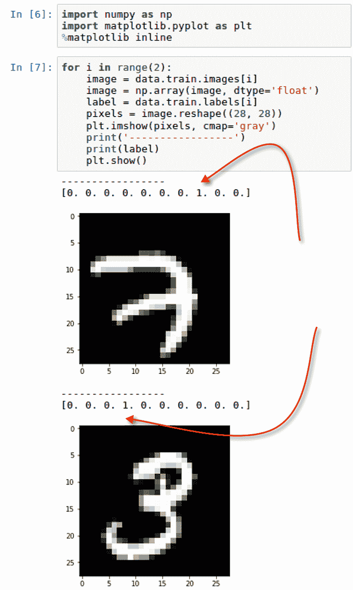

# 第三章：卷积神经网络的痛点

本章将介绍以下内容：

+   痛点 #1：导入 MNIST 图像

+   痛点 #2：可视化 MNIST 图像

+   痛点 #3：将 MNIST 图像导出为文件

+   痛点 #4：增强 MNIST 图像

+   痛点 #5：利用其他来源的训练图像

+   痛点 #6：优先考虑 CNN 的高级库

# 介绍

**卷积神经网络**（**CNNs**）在过去几年里有了一定的复兴。它们在图像识别方面取得了巨大的成功。随着现代智能手机的普及，这一点变得尤其相关，因为现在任何人都可以轻松拍摄大量物体照片并将其发布在社交媒体网站上。正是因为这一现象，卷积神经网络现在需求量很大。

有几个特性可以使 CNN 表现最佳。它们需要以下特性：

+   大量的训练数据

+   视觉和空间数据

+   强调过滤（池化）、激活和卷积，而不是传统神经网络中更明显的全连接层。

虽然 CNNs 获得了很大的流行，但在使用时仍然存在一些限制，主要是由于它们的计算需求以及获得良好性能模型所需的训练数据量。我们将专注于可以应用于数据的技术，这些技术将有助于卷积神经网络的开发，同时解决这些限制。在后续章节中，我们将在开发图像分类模型时应用其中一些技术。

# 痛点 #1：导入 MNIST 图像

用于图像分类的最常见数据集之一是`MNIST`数据集，它包含了成千上万的手写数字样本。**美国国家标准与技术研究院**（**MNIST**）根据 Yann LeCun、Corinna Cortes 和 Christopher J.C. Burges 的说法，具有以下几个优点：

对于那些希望在真实世界数据上尝试学习技术和模式识别方法，同时在预处理和格式化方面花费最少精力的人来说，这是一个很好的数据库。

有几种方法可以将 MNIST 图像导入到我们的 Jupyter 笔记本中。我们将在本章中介绍以下两种方法：

1.  通过 TensorFlow 库直接导入

1.  通过 MNIST 网站手动操作

需要注意的一点是，我们将主要使用 MNIST 图像作为改进卷积神经网络性能的示例。所有应用于 MNIST 图像的这些技术，也可以应用于任何用于训练 CNN 的图像。

# 准备工作

唯一的要求是安装`TensorFlow`。它可能不会随 anaconda3 包预安装；因此，通过简单的`pip`安装可以确认`TensorFlow`的可用性，或者在未安装时进行安装。`TensorFlow`可以在终端轻松安装，如下图所示：


# 如何操作……

`TensorFlow`库内置了一组可以直接使用的示例。这些示例数据集之一是`MNIST`。本节将演示如何访问这些图像。

1.  使用以下脚本将`TensorFlow`导入库，并指定别名为`tf`：

```py
import tensorflow as tf
```

1.  使用以下脚本从库中下载并提取图像，并保存到本地文件夹：

```py
from tensorflow.examples.tutorials.mnist import input_data
data = input_data.read_data_sets('MNIST/', one_hot=True)
```

1.  使用以下脚本检索用于评估图像分类准确性的训练和测试数据集的最终计数：

```py
print('Image Inventory')
print('----------')
print('Training: ' + str(len(data.train.labels)))
print('Testing: '+ str(len(data.test.labels)))
print('----------')
```

# 它是如何工作的……

本节解释了用于访问 MNIST 数据集的过程：

1.  一旦我们收到`TensorFlow`库已正确安装的确认，就可以将其导入到笔记本中。

1.  我们可以确认`TensorFlow`的版本，并将图像提取到本地的`MNIST/`文件夹中。提取过程会显示在笔记本的输出中，如下图所示：


1.  提取出的四个文件命名如下：

    1.  `t10k-images-idx3-ubyte.gz`

    1.  `t10k-labels-idx1-ubyte.gz`

    1.  `train-images-idx3-ubyte.gz`

    1.  `train-labels-idx1-ubyte.gz`

1.  它们已被下载到`MNIST/`子文件夹中，如下图所示：


1.  此外，四个文件也可以在我们的笔记本中查看，如下图所示：


1.  这四个文件是测试和训练图像以及随附的测试和训练标签，用于标识测试和训练数据集中的每张图像。此外，明确地定义了`one_hot = True`特性。这表明标签使用了独热编码，这有助于在建模过程中进行特征选择，因为每一列的值要么是 0，要么是 1。

1.  库的一个子类也被导入，用于将 MNIST 的手写图像存储到指定的本地文件夹中。包含所有图像的文件夹大小约为 12MB，包含 55,000 张训练图像和 10,000 张测试图像，如下图所示：


1.  这 10,000 张图像将用于测试我们模型的准确性，该模型将在 55,000 张图像上进行训练。

# 还有更多……

有时，在尝试通过`TensorFlow`直接访问 MNIST 数据集时，可能会出现错误或警告。正如前面在本节中所看到的，当导入 MNIST 时，我们收到了以下警告：

WARNING:tensorflow:From <ipython-input-3-ceaef6f48460>:2: read_data_sets (来自 tensorflow.contrib.learn.python.learn.datasets.mnist) 已弃用，将在未来版本中移除。

更新说明：

请使用 tensorflow/models 中的官方/mnist/dataset.py 等替代方案。

该数据集可能会在未来的 `TensorFlow` 版本中被弃用，因此不再直接可用。有时我们在通过 `TensorFlow` 提取 MNIST 图像时可能会遇到典型的 *HTTP 403 错误*，这可能是由于网站暂时不可用所致。无论哪种情况，都不必担心，有一种手动方法可以通过以下链接下载四个 `.gz` 文件：

[`yann.lecun.com/exdb/mnist/`](http://yann.lecun.com/exdb/mnist/)

文件位于网站上，如下图所示：


下载文件并将其保存在可访问的本地文件夹中，类似于直接从 `TensorFlow` 获取的文件。

# 另见

要了解更多关于 `MNIST` 手写数字数据库的信息，请访问以下网站：[`yann.lecun.com/exdb/mnist/`](http://yann.lecun.com/exdb/mnist/)。

要了解更多关于独热编码的信息，请访问以下网站：[`hackernoon.com/what-is-one-hot-encoding-why-and-when-do-you-have-to-use-it-e3c6186d008f.`](https://hackernoon.com/what-is-one-hot-encoding-why-and-when-do-you-have-to-use-it-e3c6186d008f)

# 痛点 #2：可视化 MNIST 图像

在 Jupyter Notebook 中处理图形时，绘制图像通常是一个主要的痛点。显示来自训练数据集的手写图像至关重要，特别是在比较与手写图像相关联的标签的实际值时。

# 准备工作

可视化手写图像时，唯一需要导入的 Python 库是 `numpy` 和 `matplotlib`。这两个库应该已经通过 Anaconda 中的包可用。如果由于某种原因它们不可用，可以通过以下命令在终端使用 `pip` 安装：

+   `pip install matplotlib`

+   `pip install numpy`

# 如何做...

本节将逐步演示如何在 Jupyter Notebook 中可视化 MNIST 手写图像：

1.  导入以下库 `numpy` 和 `matplotlib`，并使用以下脚本配置 `matplotlib` 以 `inline` 方式绘制图像：

```py
import numpy as np
import matplotlib.pyplot as plt
%matplotlib inline
```

1.  使用以下脚本绘制前两张示例图像：

```py
for i in range(2):
    image = data.train.images[i]
    image = np.array(image, dtype='float')
    label = data.train.labels[i]
    pixels = image.reshape((28, 28))
    plt.imshow(pixels, cmap='gray')
    print('-----------------')
    print(label)
    plt.show()
```

# 它是如何工作的...

本节将讲解如何在 Jupyter Notebook 中查看 MNIST 手写图像的过程：

1.  在 Python 中生成一个循环，将从训练数据集中抽取两张图像。

1.  最初，图像仅是介于 0 和 1 之间的浮动格式值，存储在 `numpy` 数组中。数组的值是一个带标签的图像，称为 `image`。然后，`image` 数组被重塑为一个 28 x 28 的矩阵，称为 `pixels`，其中任何值为 0 的位置为黑色，任何非 0 的颜色位置则为灰色。值越高，灰色的阴影颜色就越浅。下图展示了数字 8 的一个例子：


1.  循环的输出生成了两个手写图像，分别为数字 7 和 3，以及它们的标签，如下图所示：



1.  除了绘制图像之外，训练数据集中的标签也会显示在图像上方。标签是一个长度为 10 的数组，所有 10 个数字的值仅为 0 或 1。对于数字 7，数组中的第 8 个元素的值为 1；对于数字 3，数组中的第 4 个元素的值为 1。其他所有值均为 0。

# 还有更多...

图像的数值可能并不立即显现出来。虽然大多数人能够识别出第一张图像是数字 7，第二张图像是数字 3，但从标签数组中确认这一点会更有帮助。

数组中有 10 个元素，每个元素表示标签 0 至 9 的值，按数字顺序排列。由于第一个数组在第 8 个位置具有正值或 1，这表示图像的值是 7，因为 7 在数组中的第 8 个索引位置。其他所有值应为 0。此外，第二张图像在第 4 个位置的值为 1，表示图像值为 3。

# 另见

Leun、Cortes 和 Burges 在以下声明中讨论了为什么图像像素设置为 28 x 28：

来自 NIST 的原始黑白（二值）图像经过大小标准化，适应于一个 20x20 像素的框，同时保持其纵横比。标准化算法使用抗锯齿技术，使得图像包含灰度级。图像通过计算像素的质心，然后平移图像，使该点位于 28x28 区域的中心，从而将图像居中。

--Leun、Cortes 和 Burges 来自 [`yann.lecun.com/exdb/mnist/.`](http://yann.lecun.com/exdb/mnist/)

# 痛点 #3：将 MNIST 图像导出为文件

我们通常需要直接在图像上工作，而不是作为数组向量。本节将引导我们将数组转换为 `.png` 图像。

# 准备工作

导出向量为图像需要导入以下库：

+   `import image from matplotlib`

# 如何操作...

本节将介绍如何将 MNIST 数组样本转换为本地文件夹中的文件。

1.  使用以下脚本创建一个子文件夹，将图像保存到 `MNIST/` 的主文件夹中：

```py
if not os.path.exists('MNIST/images'):
   os.makedirs('MNIST/images/')
os.chdir('MNIST/images/')
```

1.  遍历 MNIST 数组的前 10 个样本，并使用以下脚本将它们转换为 `.png` 文件：

```py
from matplotlib import image
for i in range(1,10):
     png = data.train.images[i]
     png = np.array(png, dtype='float')
     pixels = png.reshape((28, 28))
     image.imsave('image_no_{}.png'.format(i), pixels, cmap = 'gray')
```

1.  执行以下脚本查看从`image_no_1.png`到`image_no_9.png`的图像列表：

```py
print(os.listdir())
```

# 它是如何工作的…

本节解释了如何将 MNIST 数组转换为图像，并保存到本地文件夹。

1.  我们创建一个名为`MNIST/images`的子文件夹，以帮助存储临时的`.png`图像，并将它们与 MNIST 数组和标签分开存储。

1.  我们再次遍历`data.train`中的图像，获取九个可以用于采样的数组。然后，这些图像会以`.png`文件格式保存到本地目录，格式为：`'image_no_{}.png'.format(i), pixels, cmap = 'gray'`

1.  我们可以在本地目录中看到九张图像的输出，正如以下截图所示：


# 还有更多…

除了查看目录中的图像列表，我们还可以在 Linux 中查看我们目录中的图像，正如以下截图所示：


# 参见

要了解更多关于`matplotlib`中的`image.imsave`，请访问以下网站：

[`matplotlib.org/api/_as_gen/matplotlib.pyplot.imsave.html`](https://matplotlib.org/api/_as_gen/matplotlib.pyplot.imsave.html)

# 痛点 #4：增强 MNIST 图像

使用图像识别的主要缺点之一是一些可用图像的多样性不足。这可能导致卷积神经网络无法像我们希望的那样优化运行，且由于训练数据的多样性不足，结果可能不理想。针对这个缺点，有一些技术可以绕过，我们将在本节中讨论其中的一种。

# 准备开始

再次说明，大部分繁重的工作已经为我们完成。我们将使用一个流行的 Python 包`augmentor`，它经常用于机器学习和深度学习建模，用于生成现有图像的扭曲和增强版本，以增加图像的多样性。

首先，必须通过以下脚本使用`pip`安装该包：`pip install augmentor`

然后我们应该确认包已经安装，正如下面的截图所示：


然后我们需要从 augmentor 导入管道类：

+   `from Augmentor import Pipeline`

# 如何做...

本节将介绍如何增加我们的九张样本图像的频率和增强效果。

1.  使用以下脚本初始化`augmentor`函数：

```py
from Augmentor import Pipeline
augmentor = Pipeline('/home/asherif844/sparkNotebooks/Ch03/MNIST/images')
```

1.  执行以下脚本，使得`augmentor`函数可以按以下规格`旋转`我们的图像：

```py
augmentor.rotate(probability=0.9, max_left_rotation=25, max_right_rotation=25)
```

1.  执行以下脚本，使得每张图像通过两个迭代进行增强，每次迭代 10 次：

```py
for i in range(1,3):
     augmentor.sample(10)
```

# 它是如何工作的…

本节将解释如何利用我们的九张图像生成额外的扭曲图像。

1.  我们需要为图像转换创建一个`Pipeline`，并指定将要使用的图像位置。这可以确保以下内容：

    1.  图像的源位置

    1.  将要转换的图像数量

    1.  图像的目标位置

1.  我们可以看到，我们的目标位置是通过一个名为`/output/`的子文件夹创建的，如下图所示：


1.  `augmentor`函数被配置为将每张图像旋转最多 25 度向右或 25 度向左，概率为 90%。基本上，概率配置决定了增强操作发生的频率。

1.  创建了一个循环，通过每张图像两次，并对每张图像应用两次变换；然而，由于我们确实给每个变换添加了概率，因此某些图像可能不会被转换，而其他图像可能会被转换超过两次。变换完成后，我们应该会收到一条消息，指示变换已完成，如下图所示：


1.  一旦完成增强操作，我们可以访问`/output/`子目录，查看每个数字是如何略微变化的，如下图所示：


1.  我们可以看到，数字 3、1、8、0 和 9 的几种变体，它们的旋转角度各不相同。我们现在已经三倍增加了我们的样本数据集，并增加了更多的多样性，而不需要去提取更多的图像用于训练和测试。

# 还有更多...

我们只应用了`rotate`变换；然而，实际上有多种变换和增强功能可以应用到图像上：

+   透视歪斜

+   弹性失真

+   剪切

+   裁剪

+   镜像

并非所有这些变换在增加训练数据集的频率和多样性时都必要，但使用某些功能的组合并评估模型性能可能是有益的。

# 参见

要了解更多关于`augmentor`的信息，请访问以下网站：

[`augmentor.readthedocs.io/en/master/`](https://augmentor.readthedocs.io/en/master/)

# 痛点#5：利用其他来源的训练图像

有时候，进行卷积神经网络操作时可能没有足够的资源。资源可能在计算角度或数据收集角度上受到限制。在这种情况下，我们依赖其他来源来帮助我们对图像进行分类。

# 准备工作

利用预训练模型作为测试其他数据集结果来源的技术被称为迁移学习。其优势在于，大部分用于训练图像的 CPU 资源被外包给预训练模型。最近，迁移学习已成为深度学习的一个常见扩展。

# 如何操作...

本节解释了迁移学习的工作原理。

1.  收集一系列你感兴趣分类的数据集或图像，就像你在传统机器学习或深度学习中做的那样。

1.  将数据集分成训练集和测试集，例如 75/25 或 80/20。

1.  选择一个预训练模型来识别你希望分类的图像的模式和特征。

1.  构建一个深度学习管道，将训练数据与预训练模型连接，并生成识别测试数据所需的权重和参数。

1.  最后，评估模型在测试数据上的表现。

# 它是如何工作的…

本节解释了将迁移学习应用于 MNIST 数据集的过程。

1.  我们在使用迁移学习时无疑是在走捷径，因为我们可能在资源、时间或两者都有限的情况下，利用已经完成的前期工作，并希望它能帮助我们解决新的问题。

1.  由于我们面临的是图像分类问题，应该使用一个曾经处理过常见图像分类的预训练模型。市面上有许多常见的模型，但有两个特别突出：

    1.  微软开发的 ResNet 模型。

    1.  谷歌开发的 Inception 模型。

1.  两种模型对于图像分类都很有用，因为微软和谷歌都有广泛的图像资源，可以用来训练一个强大的模型，从而在更详细的层面上提取特征。

1.  在 Spark 中，你可以构建一个深度学习管道，并调用一个名为 `DeepImageFeaturizer` 的类，应用 `InceptionV3` 模型到从训练数据中收集的一组特征。然后，使用某种二分类或多分类评估器在测试数据上评估训练数据集。

1.  深度学习或机器学习中的管道是指从数据收集的初始环境到应用模型对收集的数据进行最终评估或分类的环境之间的工作流过程。

# 还有更多…

像所有事物一样，使用迁移学习也有利有弊。正如我们在本节前面讨论的，迁移学习非常适合在你资源有限，无法对大数据集进行建模时使用。也有可能源数据在预训练模型中没有展示出许多独特的特征，从而导致模型性能不佳。你总是可以选择将一个预训练模型换成另一个，并重新评估模型的性能。同样，迁移学习是一种“快速失败”的方法，当其他选择不可用时可以使用。

# 另请参见

想了解更多关于微软 ResNet 的信息，请访问以下网站：

[`resnet.microsoft.com/`](https://resnet.microsoft.com/)

想了解更多关于谷歌 Inception 的信息，请访问以下网站：

[`www.tensorflow.org/tutorials/image_recognition`](https://www.tensorflow.org/tutorials/image_recognition)

要了解更多关于 InceptionV3 的信息，你可以阅读康奈尔大学的以下论文，标题为《重新思考计算机视觉中的 Inception 架构》：

[`arxiv.org/abs/1512.00567`](https://arxiv.org/abs/1512.00567)

# 痛点 #6：优先考虑 CNN 的高级库

有许多库可以用于执行卷积神经网络。一些被认为是低级的，如 TensorFlow，其中许多配置和设置需要大量的编码。这对于缺乏经验的开发人员来说是一个主要的痛点。还有一些库，比如 Keras，它们是建立在像 TensorFlow 这样的库之上的高级框架。这些库需要的代码更少，可以更快地开始构建卷积神经网络。许多初学者在构建神经网络时，往往会尝试使用 TensorFlow 实现一个模型，但在过程中会遇到许多问题。本节将建议首先使用 Keras 构建一个卷积神经网络，以预测 MNIST 数据集中的手写图像。

# 准备就绪

在本节中，我们将使用 Keras 来训练一个识别 MNIST 手写图像的模型。你可以通过在终端执行以下命令来安装 Keras：

```py
pip install keras
```

# 如何操作...

本节将演示如何构建一个模型，以识别来自 MNIST 的手写图像。

1.  使用以下脚本根据以下变量从 MNIST 数据集创建测试和训练图像及标签：

```py
xtrain = data.train.images
ytrain = np.asarray(data.train.labels)
xtest = data.test.images 
ytest = np.asarray(data.test.labels)
```

1.  使用以下脚本重新调整测试和训练数组的形状：

```py
xtrain = xtrain.reshape( xtrain.shape[0],28,28,1)
xtest = xtest.reshape(xtest.shape[0],28,28,1)
ytest= ytest.reshape(ytest.shape[0],10)
ytrain = ytrain.reshape(ytrain.shape[0],10)
```

1.  从`keras`导入以下内容，以构建卷积神经网络模型：

```py
import keras
import keras.backend as K
from keras.models import Sequential
from keras.layers import Dense, Flatten, Conv2D
```

1.  使用以下脚本设置图像排序：

```py
K.set_image_dim_ordering('th')
```

1.  使用以下脚本初始化`Sequential`模型：

```py
model = Sequential()
```

1.  使用以下脚本向`model`添加层：

```py
model.add(Conv2D(32, kernel_size=(3, 3),activation='relu', 
            input_shape=(1,28,28)))
model.add(Flatten())
model.add(Dense(128, activation='relu'))
model.add(Dense(10, activation='sigmoid'))
```

1.  使用以下脚本编译`model`：

```py
model.compile(optimizer='adam',loss='binary_crossentropy', 
              metrics=['accuracy'])
```

1.  使用以下脚本训练`model`：

```py
model.fit(xtrain,ytrain,batch_size=512,epochs=5,
            validation_data=(xtest, ytest))
```

1.  使用以下脚本测试`model`的性能：

```py
stats = model.evaluate(xtest, ytest)
print('The accuracy rate is {}%'.format(round(stats[1],3)*100))
print('The loss rate is {}%'.format(round(stats[0],3)*100))
```

# 它是如何工作的...

本节解释了如何在 Keras 上构建卷积神经网络，以识别 MNIST 中的手写图像。

1.  对于任何模型开发，我们需要识别我们的测试和训练数据集，以及特征和标签。在我们的案例中，这非常简单，因为 TensorFlow 中的 MNIST 数据已经拆分为`data.train.images`作为特征，`data.train.labels`作为标签。此外，我们还需要将标签转换为数组，因此我们使用`np.asarray()`来处理`ytest`和`ytrain`。

1.  目前，`xtrain`、`xtest`、`ytrain`和`ytest`数组的形状不适合在 Keras 中用于卷积神经网络。正如我们在本章早些时候所提到的，MNIST 图像的特征表示 28x28 像素的图像，而标签表示从 0 到 9 的十个值之一。`x`数组将被重塑为（,28,28,1），`y`数组将被重塑为（,10）。新数组的`shape`可以通过以下截图看到：


1.  如前所述，Keras 是一个高级库，因此它在没有 TensorFlow 等低级库的帮助下无法执行张量或卷积操作。为了配置这些操作，我们将 `backend` 设置为 `K`，表示 `Keras`，并将图像维度排序 `image_dim_ordering` 设置为 `tf`，以便与 TensorFlow 配合使用。

请注意，后端也可以设置为其他低级库，如 `Theano`。如果使用 `Theano`，而不是 `tf`，我们需要将维度排序设置为 `th`。此外，我们还需要重构特征的形状。然而，在过去几年中，`Theano` 并未获得像 `TensorFlow` 那样的普及度。

1.  一旦我们导入了构建 CNN 模型所需的库，就可以开始构建模型的序列或层，`Sequential()`。为了演示，我们将模型保持尽可能简单，仅使用 4 层，以证明即使在最小复杂度下，我们也能获得高准确率。每一层都是通过 `.add()` 方法添加的。

    1.  第一层设置为构建一个二维（`Conv2D`）卷积层，这是处理空间图像（如 MNIST 数据）时常见的做法。由于它是第一层，我们必须显式定义输入数据的 `input_shape`。此外，我们还指定了一个 `kernel_size`，用于设置卷积窗口的高度和宽度。通常，这个窗口是一个 3x3 或 5x5 的窗口，用于 32 个滤波器。此外，我们还需要为该层设置一个激活函数，使用修正线性单元（`relu`）是一个有效的选择，尤其是在神经网络的早期阶段，它有助于提高效率。

    1.  接下来，第二层将第一个层的输入展开，以获取一个分类结果，我们可以用来判断该图像是否属于可能的 10 个数字之一。

    1.  第三步，我们将第二层的输出传递给一个具有 128 个隐藏层并使用 `relu` 激活函数的 `dense` 层。密集连接层中的函数包含了 `input_shape` 和 `kernel_size` 以及偏置项，用于为每个 128 个隐藏层生成输出。

    1.  最后一层是输出层，它将决定预测的 MNIST 图像值。我们添加了另一个 `dense` 层，并使用 `sigmoid` 函数输出每个可能的 10 种情况的概率。Sigmoid 函数对于二分类或多分类问题的输出非常有用。

1.  下一步是使用 `adam` 优化器编译模型，并使用 `accuracy` 评估 `metrics`。`adam` 优化器在 CNN 模型中很常见，同时当处理具有 10 个可能输出的多分类情形时，使用 `categorical_crossentropy` 作为损失函数也是常规做法。

1.  我们使用每次处理 `512` 张图像的 `batch_size`，在 `5` 次训练（即 `epochs`）中训练模型。每个训练周期的损失和准确率都会被记录，并可以在下面的截图中查看：


1.  我们通过在测试数据集上评估训练后的模型来计算准确率和损失率，如下图所示：


1.  我们的模型似乎表现良好，准确率为 98.6%，损失率为 5%。

1.  我们在 Keras 中构建了一个简单的卷积神经网络，仅用五行代码设计了实际模型。Keras 是一个非常好的工具，可以在短时间内用很少的代码启动模型。一旦你准备好进行更复杂的模型开发和控制，使用 TensorFlow 构建卷积神经网络可能更为合适。

# 还有更多...

除了检索模型的准确性，我们还可以通过执行以下脚本来生成 CNN 建模过程每一层的形状：

```py
model.summary()
```

`model.summary()`的输出可以在以下截图中看到：


我们看到第一层的输出形状（None, 24, 24, 32）在第二层通过乘法 24 x 24 x 32 被展平为形状（None, 18432）。另外，我们看到第三层和第四层的形状是我们使用 Dense 层函数分配给它们的。

# 另请参见

要了解有关在 Keras 中开发 2D 卷积层的更多信息，请访问以下网站：

[`keras.io/layers/convolutional/#conv2d`](https://keras.io/layers/convolutional/#conv2d)

要学习如何在 TensorFlow 中使用 MNIST 图像构建卷积神经网络，请访问以下网站：

[`www.tensorflow.org/versions/r1.4/get_started/mnist/pros`](https://www.tensorflow.org/versions/r1.4/get_started/mnist/pros)
