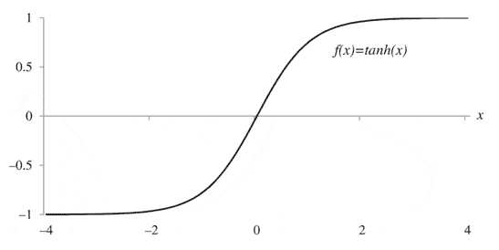

# 第四章：递归神经网络的痛点

本章将涵盖以下内容：

+   前馈网络介绍

+   递归神经网络的顺序工作原理

+   痛点 #1 – 梯度消失问题

+   痛点 #2 – 梯度爆炸问题

+   LSTM 的顺序工作原理

# 介绍

递归神经网络在涉及学习和预测序列数据的任务中已经证明了其极高的效率。然而，当谈到自然语言时，长期依赖的问题就变得至关重要，这基本上是指记住特定对话、段落或句子的上下文，以便做出更好的预测。例如，考虑以下句子：

*去年，我偶然访问了中国。中国的食物不仅与世界其他地方的中国菜不同，而且人们也非常热情好客。在我在这个美丽的国家待了三年期间，我学会了说非常流利的...*

如果将前面的句子输入到递归神经网络中，试图预测句子的下一个词（比如中文），网络将会感到困难，因为它没有记住句子的上下文。这就是我们所说的长期依赖问题。为了正确预测“中文”这个词，网络需要知道句子的上下文，并记住我去年曾经去过中国这一事实。因此，递归神经网络在执行此类任务时变得低效。然而，**长短期记忆单元**（**LSTM**）能够解决这个问题，LSTM 能够记住长期依赖，并在单元状态中存储信息。关于 LSTM 将在后文讨论，本章的主要内容将重点介绍神经网络的基本概念、激活函数、递归网络、递归网络的一些主要痛点或缺陷，以及如何通过使用 LSTM 来克服这些缺陷。

# 前馈网络介绍

要理解递归网络，首先你必须了解前馈网络的基础。这两种网络的命名都源于它们通过网络节点进行一系列数学运算的方式。其中一种仅通过每个节点单向传递信息（每个节点只经过一次），而另一种则通过循环将信息反馈到同一个节点（有点像反馈循环）。因此，很容易理解为什么前者被称为**前馈网络**，而后者是递归网络。

# 准备工作

理解任何神经网络图时，最重要的概念是计算图的概念。计算图其实就是神经网络中的各个节点通过连接互相连接，每个节点执行特定的数学函数。

# 如何进行...

前馈神经网络通过一组计算节点（实际上是排列在层中的数学运算符和激活函数）来传递输入（到输入层），以计算网络的输出。输出层是神经网络的最后一层，通常包含线性函数。输入层和输出层之间的层称为**隐藏层**，通常包含非线性元素或函数：

1.  以下图（a）显示了在具有多个层的前馈神经网络中，节点如何相互连接：

前馈神经网络

1.  前馈神经网络主要通过在隐藏层节点中使用的函数（激活函数）类型来相互区分。它们也通过训练过程中优化网络其他参数的算法来相互区别。

1.  上述图中显示的节点之间的关系不需要对每个节点都完全填充；优化策略通常从大量隐藏节点开始，并通过在训练过程中消除连接，甚至可能是节点，来调整网络。在训练过程中可能并不需要使用每个节点。

# 它是如何工作的...

神经元是任何神经网络的基本结构单元。神经元可以被视为一个简单的数学函数或运算符，它作用于输入流并生成输出。神经元的输入被节点的权重矩阵乘以，对所有输入求和，进行平移后，再通过激活函数处理。这些基本上是数学中的矩阵运算，如下所示：

1.  神经元的计算图表示如前图（b）所示。

1.  单个神经元或节点的传递函数写作如下：

这里，*x*[*i*]是第*i*个节点的输入，*w*[*i*]是与第*i*个节点相关的权重项，*b*是通常为防止过拟合而添加的偏置项，*f*(⋅)是作用于输入流向节点的激活函数，*y*是节点的输出。

1.  使用 Sigmoid 激活函数的神经元通常用于神经网络的隐藏层，而恒等函数通常用于输出层。

1.  激活函数通常选择的方式是确保节点的输出是严格递增的、平滑的（连续的第一导数），或者是渐近的。

1.  以下的逻辑函数用作 Sigmoid 激活函数：

1.  使用反向传播算法训练的神经网络，如果激活函数是反对称的，可能会学习得更快，即 *f*(-*x*) = -*f*(*x*)，如 sigmoidal 激活函数的情况。反向传播算法将在本章的后续部分中详细讨论。

1.  然而，逻辑斯蒂函数并不是反对称的，但通过简单的缩放和平移，可以将其变为反对称，从而得到双曲正切函数，其一阶导数由*f*'(*x*) = 1 - *f*²(*x*)描述，如以下数学公式所示：

1.  sigmoidal 函数及其导数的简单形式使得能够快速且准确地计算优化权重和偏差选择所需的梯度，并进行二阶误差分析。

# 还有更多...

在神经网络的每个神经元/节点中，都会执行一系列的矩阵运算。以下图所示，给出了一种更具数学性的方式来可视化前馈网络，这将帮助你更好地理解每个节点/神经元的运算：

1.  直观地看，我们可以看到，输入（无论是向量还是矩阵）首先与权重矩阵相乘。接着给这一项加上偏置，并通过激活函数（例如 ReLU、tanh、sigmoid、阈值函数等）激活，产生输出。激活函数在确保网络能够学习线性和非线性函数方面至关重要。

1.  然后，这个输出流入下一个神经元作为其输入，重复执行相同的操作。若干个这样的神经元结合在一起形成一层（执行特定的功能或学习输入向量的某个特征），而多层这样的神经元结合在一起形成一个前馈神经网络，能够完全学习识别输入，如下图所示：

1.  假设我们的前馈网络已经训练完成，用于分类狗和猫的图像。一旦网络训练完成，如下图所示，它将在面对新图像时，学会将图像标记为狗或猫：

1.  在这种网络中，当前的输出与之前或未来的输出之间没有关系。

1.  这意味着前馈网络基本上可以接触到任何随机的图像集合，而它首先接触到的图像不会必然改变它如何分类第二张或第三张图像。因此，我们可以说，在时间步 *t* 时的输出与在时间步 *t - 1* 时的输出是独立的。

1.  前馈网络在图像分类等数据不具有顺序性的情况下效果良好。前馈网络在处理两个相关变量时也表现出色，例如温度和位置、高度和体重、车速和品牌等。

1.  然而，也可能存在当前输出依赖于前面时间步的输出的情况（数据的顺序性很重要）。

1.  设想阅读一本书的情景。你对书中句子的理解，依赖于你对句子中所有单词的理解。在这种情况下，无法使用前馈网络来预测句子中的下一个单词，因为输出在这种情况下依赖于先前的输出。

1.  同样，也有许多情况下输出需要依赖于先前的输出或某些来自先前输出的信息（例如股市数据、自然语言处理、语音识别等）。前馈网络可以如以下图所示进行修改，以捕获先前输出的信息：

1.  在时间步*t*时，来自*t*的输入以及来自*t-1*的历史信息都会提供给网络，以获得*t*时刻的输出。

1.  类似地，来自*t*的信息以及新的输入会在时间步*t+1*时输入到网络中，从而产生*t+1*时刻的输出。前面图表的右侧是表示此类网络的一种泛化方式，其中网络的输出作为输入流回，以供未来时间步使用。这样的网络称为**递归神经网络**（**RNN**）。

# 另见

**激活函数**：在人工神经网络中，节点的激活函数决定了该节点在给定输入或输入集时产生的输出。输出*y[k]*由输入*u[k]*和偏置*b[k]*给出，这些值通过激活函数*φ(.)*传递，如下所示：

激活函数有多种类型。以下是常用的几种：

1.  **阈值函数**：

从前面图表中可以看出，这种函数将神经元的输出值限制在 0 到 1 之间。许多情况下这可能非常有用。然而，这个函数是不可微分的，意味着它不能用于学习非线性，这在使用反向传播算法时至关重要。

1.  **Sigmoid 函数**：

Sigmoid 函数是一个逻辑函数，具有 0 和 1 的下限和上限，类似于阈值函数。该激活函数是连续的，因此也是可微的。在 sigmoid 函数中，前述函数的斜率参数由α给出。该函数本质上是非线性的，这在提高性能方面至关重要，因为它能够适应输入数据中的非线性，而不像常规线性函数那样。具备非线性能力确保了权重和偏差的微小变化会导致神经元输出的显著变化。

1.  **双曲正切函数（tanh）**：

该函数使激活函数的范围从-1 到+1，而不是像之前的情况那样在 0 和 1 之间。

1.  **修正线性单元（ReLU）函数**：ReLU 是许多逻辑单元之和的平滑近似，并产生稀疏活动向量。以下是该函数的公式：

ReLU 函数图

在上图中，softplus (x) = log ( 1 + e^x) 是对修正函数的平滑近似。

1.  **Maxout 函数**：该函数采用一种称为**“dropout”**的技术，并通过改进 dropout 技术的快速近似模型平均，提高优化的准确性。

Maxout 网络不仅学习隐藏单元之间的关系，还学习每个隐藏单元的激活函数。通过主动丢弃隐藏单元，网络在训练过程中被迫寻找其他路径以从给定的输入得到输出。下图是其工作原理的图形化表示：

Maxout 网络

上图展示了一个包含五个可见单元、三个隐藏单元和每个隐藏单元两个神经元的 Maxout 网络。Maxout 函数由以下公式给出：

这里的 W..[ij]是通过访问矩阵 W∈ 在第二坐标*i*和第三坐标*j*上的输入大小所获得的均值向量。中间单元的数量（*k）*称为 Maxout 网络使用的分段数。下图展示了 Maxout 函数与 ReLU 和**参数化修正线性单元（PReLU）**函数的比较：

Maxout、ReLU 和 PReLU 函数的图形比较

# RNN 的顺序工作

循环神经网络是一种人工神经网络，旨在识别和学习数据序列中的模式。以下是一些此类顺序数据的示例：

+   手写文字

+   如客户评价、书籍、源代码等文本

+   口语/自然语言

+   数值时间序列/传感器数据

+   股票价格变化数据

# 准备就绪

在递归神经网络中，前一个时间步的隐藏状态会在下一个时间步反馈到网络中，正如下图所示：

基本上，朝上箭头进入网络表示每个时间步的 RNN 输入（矩阵/向量），而朝上箭头从网络中出来表示每个 RNN 单元的输出。横向箭头表示将特定时间步（由特定神经元学习到的信息）传递到下一个时间步。

有关使用 RNN 的更多信息，请访问：

[`deeplearning4j.org/usingrnns`](https://deeplearning4j.org/usingrnns)

# 如何进行...

在递归网络的每个节点/神经元中，都进行一系列的矩阵乘法步骤。输入向量/矩阵首先与权重向量/矩阵相乘，然后加上偏置，最后通过激活函数生成输出（与前馈网络相似）：

1.  以下图表以计算图的形式展示了 RNN 的直观和数学表示方法：

1.  在第一个时间步（即 *t=0*）时，*h*[*0*] 根据前图右侧的第一个公式计算。由于 *h*^(*-1*) 不存在，因此中间项变为零。

1.  输入矩阵 *x*[*0*] 与权重矩阵 *w[i]* 相乘，并在此基础上加上一个偏置 *b[h]*。

1.  前面两个矩阵相加后，通过激活函数 *g[h]* 计算得到 *h[0]*。

1.  类似地，*y[0]* 通过前图右侧的第二个公式计算，方法是将 *h[0]* 与权重矩阵 *w[y]* 相乘，添加偏置 *b[y]*，然后通过激活函数 *g[y]* 处理。

1.  在下一个时间步（即 *t=1*）时，*h^((t-1))* 确实存在，它就是 *h[0]*。这个项与权重矩阵 *w[R]* 相乘后，连同新的输入矩阵 *x[1]* 一起作为输入提供给网络。

1.  这个过程会在多个时间步中重复，权重、矩阵和偏置会在不同的时间步流经整个网络。

1.  这个过程在一个迭代中完成，这就是网络的前向传播。

# 它是如何工作的...

要训练前馈神经网络，最常用的技术是通过时间的反向传播。这是一种监督学习方法，通过在每个时间步后更新网络中的权重和偏置来减少损失函数。执行多个训练周期（也称为迭代），在每个周期中，损失函数确定的错误通过一种叫做梯度下降的技术向后传播。在每个训练周期结束时，网络更新其权重和偏置，以生成一个接近目标输出的输出，直到达到足够小的误差：

1.  反向传播算法基本上在每次迭代中执行以下三个基本步骤：

    +   输入数据的前向传播并计算损失函数

    +   梯度和误差的计算

    +   通过时间的反向传播以及相应的权重和偏置调整

1.  在加上偏置并通过激活函数后的输入加权和被传入网络并得到输出后，网络立即比较预测输出与实际输出（正确输出）之间的差异。

1.  接下来，网络通过将网络输出减去实际/正确输出来计算误差。

1.  下一步是基于计算出的误差对整个网络进行反向传播，然后更新权重和偏置，观察误差是增加还是减少。

1.  网络还记得是通过增加权重和偏置，还是通过减少权重和偏置，导致错误的增加。

1.  基于前面的推论，网络在每次迭代中继续更新权重和偏置，以使得误差最小化。以下示例将使问题更清晰。

1.  考虑一个简单的例子，教学机器如何将一个数字翻倍，如下表所示：

1.  如你所见，通过随机初始化权重（*W = 3*），我们得到了 0、3、6 和 9 的输出。

1.  错误是通过将正确输出列减去模型输出列来计算的。平方误差就是每个错误项自乘的结果。通常，使用平方误差是一种更好的做法，因为它消除了错误项中的负值。

1.  模型接着意识到，为了最小化误差，权重需要被更新。

1.  假设模型在下一次迭代中将权重更新为*W = 4*，这将导致以下输出：

1.  现在，模型意识到，通过将权重增加到*W = 4*，错误实际上增加了。因此，模型在下一次迭代中将权重更新为*W = 2*，从而得到实际/正确的输出。

1.  请注意，在这个简单的例子中，当权重增加时，错误增加，而当权重减少时，错误减少，如下所示：

1.  在实际的神经网络中，每次迭代都会执行多次这样的权重更新，直到模型收敛到实际/正确的输出。

# 还有更多内容...

如前所述，当权重增加时，错误增加；而当权重减小时，错误减小。但这并不总是如此。网络使用以下图表来确定如何更新权重以及何时停止更新权重：

+   让权重在第一次迭代开始时初始化为零。随着网络通过将权重从 A 点增加到 B 点来更新权重，错误率开始降低。

+   一旦权重达到 B 点，错误率变得最小。网络会不断追踪错误率。

+   在进一步增加权重从 B 点到 C 点时，网络意识到错误率开始再次增加。因此，网络停止更新权重并恢复到 B 点的权重，因为它们是最优的。

+   在下一个场景中，考虑一个权重被随机初始化为某个值（假设为 C 点）的情况，如下图所示：

+   在进一步增加这些随机权重时，错误也会增加（从 C 点开始，图中小箭头表示从 B 点移开）。

+   网络意识到错误增加，开始从 C 点减少权重，以便错误减少（图中箭头从 C 点向 B 点移动）。这一权重减少一直持续到错误达到最小值（图中的 B 点）。

+   网络即使在达到 B 点后仍继续更新权重（如图中箭头从 B 点指向 A 点）。它随即意识到错误再次增加。因此，网络停止更新权重并恢复到最小错误值的权重（即 B 点的权重）。

+   这就是神经网络在反向传播后如何执行权重更新的方式。这种权重更新是基于动量的。它依赖于每次迭代中计算的每个神经元的梯度，如下图所示：

基本上，每当输入流入神经元时，都会根据输出计算每个输入的梯度。在反向传播的过程中，链式法则被用来计算梯度。

# 另请参阅

关于反向传播背后的数学原理的详细解释，可以参考以下链接：

+   [`mattmazur.com/2015/03/17/a-step-by-step-backpropagation-example/`](https://mattmazur.com/2015/03/17/a-step-by-step-backpropagation-example/)

+   [`becominghuman.ai/back-propagation-is-very-simple-who-made-it-complicated-97b794c97e5`](https://becominghuman.ai/back-propagation-is-very-simple-who-made-it-complicated-97b794c97e5c)

Andrej Karpathy 的博客包含了大量关于递归神经网络的有用信息。以下是一个解释它们为何如此有效的链接：

+   [`karpathy.github.io/2015/05/21/rnn-effectiveness/`](http://karpathy.github.io/2015/05/21/rnn-effectiveness/)

# 痛点 #1 – 消失梯度问题

递归神经网络非常适合处理包含序列数据的任务。然而，它们也有一些缺点。本节将重点讨论并分析其中一个缺点，即**消失梯度问题**。

# 准备开始

消失梯度问题这个名称源于在反向传播步骤中，一些梯度消失或变为零。从技术上讲，这意味着在网络的反向传递过程中没有误差项被反向传播。当网络变得更深、更复杂时，这会成为一个问题。

# 如何做到这一点……

本节将描述消失梯度问题如何在递归神经网络中发生：

+   在使用反向传播时，网络首先计算误差，这个误差就是模型输出与实际输出的差的平方（例如平方误差）。

+   使用这个误差，模型接着计算权重变化（de/dw）与误差变化之间的关系。

+   计算出的导数与学习率相乘  得到 w，这实际上就是权重的变化。这个 w 被加到原始权重上，更新为新的权重。

+   假设 de/dw（误差关于权重的梯度或变化率）的值远小于 1，那么这个值与学习率相乘 （学习率总是远小于 1）将得到一个非常小的、可忽略的数字。

+   这是因为反向传播过程中权重更新只对最新的时间步准确，且随着反向传播通过之前的时间步，这种准确性会降低，经过多次时间步后几乎变得微不足道。

+   在某些情况下，句子可能非常长，神经网络需要根据上下文预测句子中的下一个单词。为了做出这样的预测，网络需要从许多前面的时间步获取信息（这些被称为**长期依赖**）。随着句子长度的增加，网络需要反向传播的时间步数也在增加。在这种情况下，递归网络无法记住过去许多时间步的信息，因此无法做出准确的预测。

+   当发生这种情况时，网络需要更多的复杂计算，结果是迭代次数大幅增加，在此过程中，误差项的变化逐渐消失（随着时间推移减小），权重的变化（w）变得微乎其微。因此，新的或更新后的权重几乎等于之前的权重。

+   由于没有发生权重更新，网络停止学习或无法更新其权重，这会导致模型过拟合数据，进而产生问题。

+   整个过程如下面的图示所示：

# 它是如何工作的……

本节将描述梯度消失问题的一些后果：

1.  这个问题发生在我们使用某种基于梯度的优化技术训练神经网络模型时。

1.  一般来说，添加更多的 **隐藏层** 趋向于使网络能够学习更复杂的任意函数，从而在预测未来结果时表现得更好。深度学习因其拥有大量的 **隐藏层**（从 10 到 200 层不等）而产生了巨大差异。现在可以理解复杂的序列数据，并执行语音识别、图像分类、图像描述等任务。

1.  前面步骤导致的问题是，在某些情况下，梯度变得非常小，几乎消失，这会阻止权重在未来的时间步更新其值。

1.  在最坏的情况下，这可能导致网络的训练过程停止，这意味着网络停止学习它原本打算通过训练步骤学习的不同特征。

1.  反向传播背后的主要思想是，它使我们这些研究人员能够监控和理解机器学习算法如何处理和学习各种特征。当梯度消失时，就无法解释网络的运作方式，因此识别和调试错误变得更加具有挑战性。

# 还有更多……

以下是解决梯度消失问题的一些方法：

+   克服这个问题的一种方法是使用 ReLU 激活函数。它计算函数 *f(x)=max(0,x)*（即，激活函数简单地将输出的下限阈值设为零），并防止网络生成负梯度。

+   另一种解决这个问题的方法是对每一层分别进行无监督训练，然后通过反向传播对整个网络进行微调，正如 Jürgen Schmidhuber 在他关于神经网络多层次结构的研究中所做的那样。该论文的链接将在以下部分提供。

+   解决这个问题的第三种方法是使用 **LSTM**（**长短期记忆**）单元或 **GRUs（门控递归单元）**，它们是特殊类型的 RNN。

# 参见

以下链接提供了有关消失梯度问题的更深入描述，并介绍了一些解决该问题的方法：

+   [`ayearofai.com/rohan-4-the-vanishing-gradient-problem-ec68f76ffb9b`](https://ayearofai.com/rohan-4-the-vanishing-gradient-problem-ec68f76ffb9b)

+   [`www.cs.toronto.edu/~rgrosse/courses/csc321_2017/readings/L15%20Exploding%20and%20Vanishing%20Gradients.pdf`](http://www.cs.toronto.edu/~rgrosse/courses/csc321_2017/readings/L15%20Exploding%20and%20Vanishing%20Gradients.pdf)

+   [`people.idsia.ch/~juergen/cvpr2012.pdf`](http://people.idsia.ch/~juergen/cvpr2012.pdf)

# 痛点 #2 – 梯度爆炸问题

递归神经网络的另一个缺点是梯度爆炸问题。这与消失梯度问题类似，但恰恰相反。有时，在反向传播过程中，梯度会爆炸到非常大的值。与消失梯度问题一样，当网络架构变得更深时，梯度爆炸问题就会发生。

# 准备工作

梯度爆炸问题这一名称源于这样一个事实：在反向传播步骤中，一些梯度会消失或变为零。从技术上讲，这意味着在网络的反向传播过程中没有误差项被反向传播。当网络变得更深更复杂时，这就成为了一个问题。

# 如何解决...

本节将描述递归神经网络中的梯度爆炸问题：

+   梯度爆炸问题与消失梯度问题非常相似，但正好相反。

+   当递归神经网络中出现长期依赖时，误差项在网络中反向传播时有时会爆炸或变得非常大。

+   这个误差项乘以学习率，会导致一个极大的w。这会产生与之前权重差异很大的新权重。之所以叫做梯度爆炸问题，是因为梯度的值变得过大。

+   梯度爆炸问题通过以下算法图示进行说明：

# 如何运作...

由于神经网络使用基于梯度的优化技术来学习数据中存在的特征，因此，保持这些梯度非常重要，以便网络能够根据梯度的变化计算误差。本节将描述递归神经网络中梯度爆炸问题的发生：

+   在使用反向传播时，网络首先计算误差，这只是模型输出与实际输出的差的平方（如平方误差）。

+   使用此误差，模型接着计算相对于权重变化的误差变化（de/dw）。

+   计算得到的导数乘以学习率  给出 w，这只是权重的变化。项 w 被加到原始权重中，用于更新为新的权重。

+   假设 de/dw（误差相对于权重的梯度或变化率）的值大于 1，那么该项乘以学习率  会得到一个非常非常大的数，这对于网络进一步优化权重没有任何用处，因为权重已不再处于相同的范围内。

+   这是因为反向传播过程中，权重更新仅对最近的时间步是准确的，而在反向传播经过之前的时间步时，准确性会降低，并且当权重更新穿过许多时间步时，几乎变得微不足道。

+   随着输入数据中序列数量的增加，网络需要反向传播的时间步长数量也随之增加。在这种情况下，循环神经网络无法记住来自过去多个时间步的信息，因此无法准确预测未来时间步。

+   当出现这种情况时，网络需要进行更多复杂的计算，导致迭代次数大幅增加，并且在此过程中误差项的变化超过 1，权重的变化（w）爆炸。结果，新权重与之前的权重相比完全超出了范围。

+   由于没有权重更新发生，网络停止学习或无法在指定范围内更新其权重，这是一个问题，因为这将导致模型对数据过拟合。

# 还有更多…

解决爆炸梯度问题的一些方法如下：

+   可以应用某些梯度裁剪技术来解决爆炸梯度问题。

+   另一种防止此问题的方法是使用截断的时间反向传播（Backpropagation Through Time），在这种方法中，我们可以选择一个较小的时间步长（例如，15）来开始反向传播，而不是从最后一个时间步（或输出层）开始。这意味着网络将仅在一个实例中通过最后 15 个时间步进行反向传播，并且只学习与这 15 个时间步相关的信息。这类似于将数据的小批量输入网络，因为在数据集非常大的情况下，计算每个数据集元素的梯度会变得非常耗费计算资源。

+   防止梯度爆炸的最终方法是通过监控它们并相应地调整学习率。

# 另见

有关消失梯度和爆炸梯度问题的更详细解释，请参见以下链接：

+   [`neuralnetworksanddeeplearning.com/chap5.html`](http://neuralnetworksanddeeplearning.com/chap5.html)

+   [`www.dlology.com/blog/how-to-deal-with-vanishingexploding-gradients-in-keras/`](https://www.dlology.com/blog/how-to-deal-with-vanishingexploding-gradients-in-keras/)

+   [`machinelearningmastery.com/exploding-gradients-in-neural-networks/`](https://machinelearningmastery.com/exploding-gradients-in-neural-networks/)

# LSTM 的顺序工作方式

**长短期记忆单元**（**LSTM**）只是比递归网络稍微先进一些的架构。LSTM 可以被看作是具有学习顺序数据中长期依赖关系能力的特殊类型的递归神经网络。其背后的主要原因是 LSTM 包含内存，并能够在其单元内存储和更新信息，而递归神经网络则不能。

# 准备工作

长短期记忆单元的主要组件如下：

+   输入门

+   忘记门

+   更新门

这些门中的每一个由一个 Sigmoid 层和随后的逐点乘法操作组成。Sigmoid 层输出的数字在零和一之间。这些值描述了每个组件允许通过各自门的多少信息。值为零表示门不会允许任何信息通过，而值为一则表示门允许所有信息通过。

理解 LSTM 单元的最佳方式是通过计算图，就像在递归神经网络（RNN）的情况下那样。

LSTM 最初是由 Sepp Hochreiter 和 Jurgen Schmidhuber 在 1997 年开发的。以下是他们发表的论文链接：

+   [`www.bioinf.jku.at/publications/older/2604.pdf`](http://www.bioinf.jku.at/publications/older/2604.pdf)

# 如何实现...

本节将描述单个 LSTM 单元的内部组件，主要是单元内存在的三种不同门。多个这样的单元堆叠在一起形成一个 LSTM 网络：

1.  LSTM 也具有类似 RNN 的链式结构。标准的 RNN 基本上是由重复单元模块组成，类似于一个简单的函数（例如 tanh）。

1.  由于每个单元内存在内存，LSTM 相比 RNN 有能力在更长时间内保持信息。这使得它们能够在输入序列的早期阶段学习重要信息，并且使其在每个时间步结束时对模型做出的决策产生重要影响。

1.  通过能够从输入序列的早期阶段开始存储信息，LSTM 可以主动保留可以通过时间和层反向传播的误差，而不是让这些误差消失或爆炸。

1.  LSTM 能够在多个时间步长上学习信息，因此通过保留在这些层中反向传播的误差，它们具有更密集的层架构。

1.  被称为 **"门"** 的单元结构赋予 LSTM 保持信息、添加信息或从 **单元状态** 中删除信息的能力。

1.  以下图展示了 LSTM 的结构。在理解 LSTM 时，关键在于理解 LSTM 网络架构和单元状态，这可以通过以下方式进行可视化：

1.  在前面的图中，*x[t]* 和 *h[t-1]* 是输入到单元的两个输入。*x*[*t*] 是当前时间步的输入，而 h[t-1] 是前一个时间步的输入（即前一个时间步中前一单元的输出）。除了这两个输入，我们还有 *h*[, ]，它是 LSTM 单元在通过其门操作这两个输入后，生成的当前输出（即时间步 t）。

1.  在前面的图中，r[t] 代表从输入门中产生的输出，该门接收输入 *h*[*t-1*] 和 *x[t]*，将这些输入与其权重矩阵 *W[z]* 相乘，并通过 sigmoid 激活函数处理它们。

1.  类似地，术语 *z[t]* 代表了从遗忘门中产生的输出。这个门有一组权重矩阵（用 *W[r]* 表示），这些权重矩阵是特定于这个门的，并且控制着门的功能。

1.  最后，有 [t]，它是从更新门中产生的输出。在这种情况下，输出有两个部分。第一部分是一个 sigmoid 层，也叫做 **输入门层**，其主要功能是决定哪些值需要更新。下一层是一个 tanh 层，该层的主要功能是创建一个包含可以添加到单元状态中的新值的向量或数组。

# 它是如何工作的...

由多个 LSTM 单元/单元组合而成的 LSTM 网络。这样的网络架构如以下图所示：

1.  在前面的图中，完整的 LSTM 单元由 ***"A"*** 表示。单元接收一个序列输入中的当前输入 (*x**[i]*)，并生成 (*h**[i]*)，这就是当前隐藏状态的输出。该输出随后作为输入发送到下一个 LSTM 单元。

1.  LSTM 单元比 RNN 单元稍微复杂一些。RNN 单元只有一个对当前输入进行处理的功能/层，而 LSTM 单元有三层，这三层是控制信息在任一时间点通过单元流动的三个门。

1.  这个单元的行为很像计算机中的硬盘内存。因此，单元具有允许在其单元状态中写入、读取和存储信息的能力。单元还决定存储哪些信息，以及何时允许读取、写入和删除信息。这是通过相应开关的门来实现的。

1.  LSTM 单元中的门是模拟的，这与今天计算机中的数字存储系统不同。这意味着这些门只能通过 sigmoid 进行逐元素相乘来控制，从而产生介于 0 和 1 之间的概率值。高值会导致门保持开启，而低值则会导致门保持关闭。

1.  在神经网络操作方面，模拟系统相比数字系统具有优势，因为它们是可微的。这使得模拟系统更适合像反向传播这样主要依赖梯度的任务。

1.  各个门基于信息的强度和重要性来传递、阻止或仅让部分信息流过它们。信息在每个时间步通过每个门特定的权重矩阵集进行过滤。因此，每个门完全控制如何处理它接收到的信息。

1.  与每个门相关的权重矩阵，像调节输入和隐藏状态的权重一样，都会根据递归网络的学习过程和梯度下降进行调整。

1.  第一个门叫做**遗忘门**，它控制从前一个状态中保留哪些信息。这个门将前一个单元的输出(*h**[t]** - 1*)与当前输入(*x**[t]*)一起作为输入，应用 sigmoid 激活函数（），以便为每个隐藏单元产生一个介于 0 和 1 之间的输出值。然后，它会与当前状态进行逐元素相乘（如前图中的第一个操作所示）。

1.  第二个门叫做**更新门**，它的主要功能是根据当前输入更新单元状态。这个门将与遗忘门相同的输入（*h**[t-1]* 和 *x**[t]*）传递到 sigmoid 激活层（），然后通过 tanh 激活层，接着执行这两个结果的逐元素相乘。接下来，进行与当前状态的逐元素加法（如前图中的第二个操作所示）。

1.  最后，有一个输出门，它控制哪些信息以及多少信息被传递到相邻的单元，以作为其在下一时间步的输入。当前单元的状态通过 tanh 激活层，然后与单元输入(*h**[t-1]* 和 *x**[t]*)进行逐元素相乘，在经过 sigmoid 层（）后进行这个操作。

1.  更新门作为一个过滤器，决定单元格向下一个单元输出什么信息。这个输出，h[t]，随后被传递到下一个 LSTM 单元作为其输入，如果多个 LSTM 单元堆叠在一起，也会传递给上层。

# 还有更多内容...

与前馈神经网络和循环神经网络（RNN）相比，LSTM 在处理上取得了重大突破。人们或许会想，未来的下一步大进展是什么，或者说是什么进步呢？许多研究人员相信，“注意力机制”将是人工智能领域的下一个大突破。随着数据量的日益增长，处理每一 bit 数据已变得不可能。此时，注意力机制可能成为一个潜在的游戏规则改变者，它使得网络仅关注高优先级或感兴趣的数据或区域，并忽略无用的信息。例如，如果 RNN 被用来创建图像描述引擎，它会根据每个输出的词语，选择图像的一部分进行注意力聚焦。

徐等人最近（2015 年）发表的论文正是探讨了这个问题。他们研究了在 LSTM 单元中加入注意力机制。阅读这篇论文是学习神经网络中注意力机制应用的一个良好起点。使用注意力机制在各种任务中取得了一些不错的结果，且目前在这一领域仍有许多研究正在进行中。徐等人论文的链接如下：

[`arxiv.org/pdf/1502.03044v2.pdf`](https://arxiv.org/pdf/1502.03044v2.pdf)

注意力机制并不是 LSTM 的唯一变体。其他一些活跃的研究是基于使用网格 LSTM 的技术，正如 Kalchbrenner 等人在论文中使用的那样，相关论文链接为：[`arxiv.org/pdf/1507.01526v1.pdf`](https://arxiv.org/pdf/1507.01526v1.pdf)。

# 另请参见

还有一些与 RNN 和 LSTM 在生成网络中的应用相关的有用信息和论文，可以通过访问以下链接找到：

+   [`www.deeplearningbook.org/contents/rnn.html`](http://www.deeplearningbook.org/contents/rnn.html)

+   [`arxiv.org/pdf/1502.04623.pdf`](https://arxiv.org/pdf/1502.04623.pdf)

+   [`arxiv.org/pdf/1411.7610v3.pdf`](https://arxiv.org/pdf/1411.7610v3.pdf)

+   [`arxiv.org/pdf/1506.02216v3.pdf`](https://arxiv.org/pdf/1506.02216v3.pdf)
